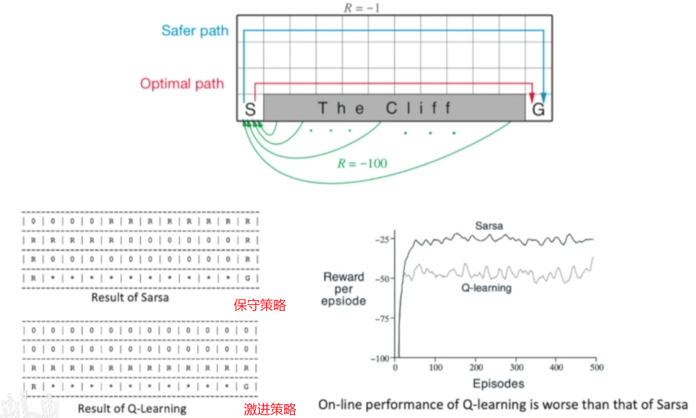

策略最简单的表示方法是查找表，即表格型策略，使用表格型策略的强化学习方法称为表格型方法

- Q-learning
- Sarsa

<!--more-->

# Q表

Q表：状态-价值表

Q函数的意义是计算在某个状态下选择某个动作，未来能够获得多少总奖励

如果可以预估未来的总奖励的大小，我们就知道在当前的状态下选择哪个动作未来获取的累积价值更高。

### 为何用未来奖励评估当前动作好坏

在现实世界中奖励往往是延迟的，所以强化学习需要学习长期的奖励。对于MDP，我们一般会从当前状态开始，把后续有可能收到的奖励求期望作为当前动作的 $Q$ 值，代表当前状态下动作的真正价值

但多长时间的奖励算“长期”，如果任务很快就结束，考虑到最后一步的奖励无可厚非。但如果任务是一个持续的没有尽头的任务，我们做不到将未来全部的奖励相加作为当前状态的价值。所以我们引入折扣因子 $\gamma$ 来计算未来总奖励，$\gamma\in [0,1]$ ，$\gamma^n$ 越往后越小，即越后面的奖励对当前状态价值的影响就越小


若 $\gamma=0$ ，则只考虑单步的奖励，认为是一种目光短浅的算法

若 $\gamma=1$ ，则相当于将后续所有奖励都加起来，认为是一种目光过于长远的算法

## 基于DP方法的有模型预测与控制

### 策略迭代

> 计算一个MDP的最优策略与最佳价值函数

策略评估(预测)：迭代贝尔曼期望方程
$$
V^{(k)}(s)=\sum\limits_{a\in \mathcal{A}}\pi(a\vert s)\left(R(s,a)+\gamma\sum\limits_{s'\in \mathcal{S}}P(s'\vert s,a)V^{(k-1)}(s')\right)
$$
策略改进：贪心 $\pi(a\vert s)=greedy(Q(s,a))$
$$
Q_{\pi^{(k)}}(s,a)=R(s,a)+\gamma \sum\limits_{s'\in S}P(s'\vert s,a)\cdot V_{\pi^{(k-1)}}(s')\\
\pi^{(k+1)}(a\vert s)=\mathop{\mathrm{argmax}}_aQ_{\pi^{(k)}}(s,a)
$$

### 价值迭代

> 计算一个MDP的最优价值函数

当获得最优价值函数时，满足贝尔曼最优方程
$$
\begin{align}
V^*(s)&=\max\limits_{a}Q^*(s,a)\\
&\xlongequal{Q=f(V)}\max\limits_{a}\left(R(s,a)+\gamma \sum\limits_{s'\in S}P(s'\vert s,a)\cdot V_{\pi^*}^*(s')\right)
\end{align}
$$
迭代贝尔曼最优方程，直至收敛
$$
V_{\pi^{(k+1)}}(s)\leftarrow\max\limits_{a\in\mathcal{A}}\left(R(s,a)+\gamma\sum\limits_{s'\in\mathcal{S}}P(s'\vert s,a)V_{\pi^{(k)}}(s')\right)
$$
当获取到最优价值函数时，贪心获取最佳策略
$$
\pi^*(a\vert s)=\mathop{\mathrm{argmax}}_a \left(R(s,a)+\gamma\sum\limits_{s'\in\mathcal{S}}P(s'\vert s,a)V_{\pi^{(H)}}(s')\right)
$$


# 免模型预测

在无法获取MDP模型的情况下，可以通过蒙特卡洛方法和时序差分方法来估计某个给定策略的价值

## 蒙特卡洛方法

### 整体思路

蒙特卡洛是基于采样的方法，给定金购策略 $\pi$ ，让智能体与环境交互，可以得到很多轨迹。在回合结束后，可计算每条轨迹的回报
$$
G_t=r_{t+1}+\gamma r_{t+2}+\gamma^2 r_{t+3}\cdots
$$
求出这些轨迹的回报的期望，就可以知道某一策略下的某个状态的价值
$$
V_{\pi}(s)=E_{\tau\sim \pi}[G_t\vert s_t=s]
$$
蒙特卡洛方法使用 **经验评估回报** 的方法估计奖励，这样就不需要MDP中的状态转移函数与奖励函数。但蒙特卡洛方法的局限性是必须用在有终止的马尔科夫决策过程中。

### 具体步骤

1. 在每个回合中，若 $t$ 时刻状态 $s$ 被访问了，则
   - 状态 $s_t$ 的访问数 $N(s_t)$ 增加1，$N(s_t)\leftarrow N(s_t)+1$
   - 状态 $s_t$ 的总回报 $S(s_t)$ 增加 $G_t$ ，$S(s_t)\leftarrow S(s_t)+G_t$
2. 状态 $s_t$ 的价值通过回报的平均来估计，即 $V(s_t)=\frac{V(s_t)}{N(s_t)}$

根据大数定律，只要有足够多的轨迹，就可以趋近这个策略对应的价值函数。当 $N(s_t)\rightarrow \infty$ 时，$V(s_t)\rightarrow V_{\pi}(s_t)$

### 增量式蒙特卡洛

#### 增量式均值

假设有一批样本 $x_1,x_2,\cdots,x_t$ ，可以将经验均值转换为增量均值的形式
$$
\begin{aligned}
\mu_t&=\frac{1}{t}\sum\limits_{j=1}^tx_j\\
&=\frac{1}{t}\left(x_t+\sum\limits_{j=1}^{t-1}x_j\right)\\
&=\frac{1}{t}[x_t+(t-1)\mu_{t-1}]\\
&=\frac{1}{t}(x_t+t\mu_{t-1}-\mu_{t-1})\\
&=\mu_{t-1}+\frac{1}{t}(x_t-\mu_{t-1})
\end{aligned}
$$
通过增量式均值，可以将当前时刻的均值与上一时刻的均值关联起来。当我们得到 $x_t$ 时，就可以用上一时刻的值来更新现在的值

- $x_t-\mu_{t-1}$ ：残差
- $\frac{1}{t}$ ：学习率

#### 增量式蒙特卡洛方法

可以将蒙特卡洛方法更新的方式改为增量式蒙特卡洛(incremental MC)

若现在有一个轨迹 $(s_1,a_1,r_1,s_2,\cdots,s_t)$ ，可以用增量的方法更新状态价值
$$
N(s_t)\leftarrow N(s_t)+1\\
V(s_t)\leftarrow V(s_t)+\frac{1}{N(s_t)}(G_t-V(s_t))
$$
若将 $\frac{1}{N(s_t)}$ 变为 $\alpha$ 学习率，即
$$
V(s_t)\leftarrow V(s_t)+\alpha(G_t-V(s_t))
$$
其中，$\alpha$ 代表更新的速率，可以将其作为超参数设置

### DP与MC方法的总结与对比

**DP**

- 使用了自举的思想，基于之前估计的量来估计一个量

- 使用贝尔曼期望备份，通过上一时刻的 $V^{(k-1)}(s)$ 来更新当前时刻的 $V^{(k)}(s)$
  $$
  V^{(k)}(s)\leftarrow \sum\limits_{a\in \mathcal{A}}\pi(a\vert s)\left(R(s,a)+\gamma\sum\limits_{s'\in \mathcal{S}}P(s'\vert s,a)V^{(k-1)}\right)
  $$
  将其不断迭代，最后可以收敛

贝尔曼期望备份有两层加和，即内部加和与外部加和，计算两次期望，更新一次


**MC**

通过一个回合的经验平均回报(实际得到的奖励)来进行更新，即
$$
V^{(k)}(s_t)\leftarrow V^{(k-1)}(s_t)+\alpha\left(G_t^{(k)}-V^{(k-1)}(s_t)\right)
$$
MC方法得到的轨迹对应树上蓝色的轨迹，轨迹上的状态已经是确定的，采取的动作也是确定的，现在只更新这条轨迹上的所有状态，与这条轨迹无关的状态不更新


#### 对比

|              | DP                    | MC         |
| ------------ | --------------------- | ---------- |
| 环境是否已知 | 只适用于环境已知的MDP | 都适用     |
| 更新部分     | 全部更新              | 局部更新   |
| 迭代速度     | 更新速度慢            | 更新速度快 |

## 时序差分方法

时序差分方法的目的是对于某个给定的策略 $\pi$ ，在线的计算出它的价值函数 $V_{\pi}$ ，即一步一步地算。

时序差分方法是一种介于蒙特卡洛方法和动态规划方法中间的免模型方法，不需要MDP中的状态转移矩阵与奖励函数。时序差分方法可以从不完整的回合中学习，并且结合了自举的思想。

### 一步时序差分

每走一步更新一次Q表(做一步自举)，用得到的估计回报 $r_{t+1}+\gamma V(s_{t+1})$ 来更新上一时刻的值 $V(s_t)$ ，这种单步更新的方法称为一步时序差分，即 $TD(0)$ 
$$
V(s_t)\leftarrow V(s_t)+\alpha(r_{t+1}+\gamma V(s_{t+1})-V(s_t))
$$

- 估计回报 $r_{t+1}+\gamma V(s_{t+1})$ 称为时序差分目标，带衰减的下一状态价值的和
  - 时序差分目标相当于对回报的采样
  - 使用当前估计的 $V$ 而不是真实的 $V_{\pi}$

- 时序差分误差 $\delta=r_{t+1}+\gamma V(s_{t+1})-V(s_t)$ 

  类比蒙特卡洛方法，给定一个回合 $k$ ，可以更新 $V(s_t)$ 来逼近真实的回报 $G_t$ 
  $$
  V(s_t)\leftarrow V(s_t)+\alpha(G^{(k)}_t-V(s_t))
  $$
  在MC方法中，$G_{t}^{(k)}$ 是可计算的值，因为一个回合已经完成了，可以算出每个状态实际的回报

  在TD方法中，不等回合结束，只执行一步，状态的价值就会更新

### n步时序差分

利用两步得到的回报，使用自举来更新状态的价值
$$
\begin{array}{ll}
n=1(TD)&G_{1,t}=r_{t+1}+\gamma V(s_{t+1})\\
n=2&G_{2,t}=r_{t+1}+\gamma r_{t+2}+\gamma^2 V(s_{t+2})\\
&\vdots\\
n=n&G_{n,t}=r_{t+1}+\gamma r_{t+2}+\gamma^2r_{t+3}+\cdots+\gamma^{n-1}r_{t+n}+\gamma^n V(s_{t+n})\\
&\vdots\\
n=\infty(MC)&G_{\infty,t}=r_{t+1}+\gamma r_{t+2}+\cdots+\gamma^{T-t-1}r_T
\end{array}
$$


在得到时序差分目标之后，可以用增量式学习的方法来更新状态的价值
$$
V(s_t)\leftarrow V(s_t)+\alpha\left(G_{n,t}-V(s_t)\right)
$$

## TD与MC对比

|                  | TD                                                           | MC                                                           |
| ---------------- | ------------------------------------------------------------ | ------------------------------------------------------------ |
| 是否支持在线     | 支持在线学习，也可离线学习                                   | 只能离线学习                                                 |
| 数据序列是否完整 | 可以从不完整系列上学习，以采样的方式得到不完整的状态序列，估计某状态在该状态序列完整后可能得到的状态价值，并通过不断地采样持续更新价值以逼近真实的期望<br /> | 只能从完整的序列上学习，在经历完整的状态序列后，再来更新状态的真实价值<br /> |
| 序列是否有限     | 可以在连续的环境下(无终止)进行学习                           | 只能在有终止的情况下学习                                     |
| 马尔科夫性质     | 利用了马尔科夫性质                                           | 适用于非马尔科夫环境                                         |

## DP、MC、TD的自举和采样

自举：更新时用了估计的方法

- MC没有使用
- DP、TD都使用了自举

采样：通过采样来获取期望

- MC方法是纯采样的方法
- DP完全没用采样，直接用贝尔曼方程更新状态价值
- TD使用了采样逼近真实回报

DP算法在已知所有状态转换的情况下，可以把所有的状态都进行加和
$$
V(s_t)\leftarrow E_{\pi}[r_{t+1}+\gamma V(s_{t+1})\vert s_t=s]
$$


MC在当前的状态下，采取一条支路，在回合完成后，更新这条支路上的所有状态价值
$$
V(s_t)\leftarrow V(s_t)+\alpha(G_t-V(s_t))
$$


TD从当前状态开始，往前走了一步，关注的是局部更新
$$
TD(0):V(s_t)\leftarrow V(s_t)+\alpha(r_{t+1}+\gamma V(s_{t+1})-V(s_t))
$$


### 四种计算价值函数的方法


# 免模型控制

策略迭代分两个步骤


1. 根据给定的当前策略 $\pi$ 来估计价值函数
   $$
   V_{\pi}(s)=\sum\limits_{s'\in S}\pi(a\vert s)\cdot Q_{\pi}(s,a)\\
   Q_{\pi}(s,a)=R(s,a)+\gamma\sum\limits_{s'\in\mathcal{S}}P(s'\vert s,a)V_{\pi}(s')
   $$

2. 得到估计的价值函数后，通过贪心的方法来改进策略
   $$
   \pi'=greedy(V_{\pi})
   $$

但由于在很多实际任务中，MDP的环境并不是可知的，即状态转移函数 $P(s'\vert s,a)$ 及奖励函数 $R(s,a)$ 是未知的

所以将策略迭代进行广义推广，得到 **广义策略迭代** (generalized policy iteration,GPI)，将蒙特卡洛方法或时序差分方法引入策略评估来计算当前策略的价值函数 $Q$ ，可以在不知道MDP环境的情况下，完成价值函数的优化并得到最佳策略，实现免模型控制

## 基于MC方法的免模型控制

### 探索性开始

一个保证策略迭代收敛的假设是回合有探索性开始。假设每个回合都有一个探索性开始，能保证所有的状态和动作在无限步的执行后能被采样到，即一定会出现包含该起始状态的轨迹

### MC方法的策略评估

蒙特卡洛思想是通过很多轨迹的价值均值取估计Q函数，当轨迹数量足够多时，这个均值趋于收敛，则可以生成Q表。进而使用策略改进算法选取更好的策略
$$
\begin{array}{ll}
\hline
&初始化\\
&\quad \pi(a\vert s)\in A(s)(随机初始化)，对于所有的 s\in \mathcal{S}\\
&\quad Q(s,a)\in R(s,a)(随机初始化)，对于所有的 s\in \mathcal{S},a\in \mathcal{A}\\
&\quad R(s,a)\leftarrow 空值，对于所有的 s\in \mathcal{S},a\in \mathcal{A}\\
&遍历每个回合:\\
&\quad 随机选择 s_0\in \mathcal{S},a_0\in A(s_0)，并且保证所有的数据对的概率大于0(探索性开始)\\
&\quad 从s_0,a_0生成回合，产生历史H_\pi^{(k)}:s_0,a_0,r_1,s_1,\cdots,s_{T-1},a_{T-1},r_{T}\\
&\quad G\leftarrow 0\\
&\quad 对于一个回合的每一步进行循环 t=T-1,T-2,\cdots,0:\\
&\qquad G\leftarrow \gamma G+t_{t+1}\\
&\qquad 如果(s_t,a_t)出现在历史H_\pi^{(k)}中:\\
&\qquad\quad 将G追加到R(s_t,a_t)\\
&\qquad\quad Q(s_t,a_t)\leftarrow\overline{R(s_t,a_t)}\\
&\qquad\quad \pi(a\vert s_t)\leftarrow\mathop{\mathrm{argmax}}\limits_{a}Q(s_t)\\
\hline\\
&基于探索性开始与贪心的蒙特卡洛方法
\end{array}
$$

### MC方法的策略改进

为确保MC方法有足够的探索，使用 $\varepsilon-贪心(\varepsilon-greedy)$ 探索：有 $1-\varepsilon$ 的概率按照 $Q$ 函数决定动作，$\varepsilon$ 的概率采取随机动作。

体现了 **探索-利用** 的权衡：开始时，$\varepsilon$ 比较大，可以对不同动作进行充分探索；$\varepsilon$ 随着时间递减，确保可以获取足够多的奖励
$$
\begin{array}{ll}
\hline
& 初始化Q(s,a)=0,N(s,a)=0,\varepsilon=1,k=1\\
&\pi^{(k)}=\varepsilon-贪心(Q)\\
&进行循环:\\
&\quad进行第k个回合的采样(H_{\pi^{(k)}}^{(k)}=\{s_0,a_0,r_1,s_1,\cdots,s_{T-1},a_{T-1},r_{T}\})\\
&\quad 对于每个数据对 (s_t,a_t): \\
&\qquad 计算当前回报G_t(s_t,a_t)=r_{t+1}+\gamma r_{t+2}+\cdots+\gamma^{T-t-1}r_{T}\\
&\qquad N(s_t,a_t)\leftarrow N(s_t,a_t)+1;\\
&\qquad Q(s_t,a_t)\leftarrow Q(s_t,a_t)+\frac{1}{N(s_t,a_t)}(G_t-Q(s_t,a_t))\\
&\quad k\leftarrow k+1,\varepsilon\leftarrow \frac{1}{k}\\
&\pi^{(k)}=\varepsilon-贪心(Q)\\
&停止循环\\
\hline\\
&基于\varepsilon-贪心的增量式蒙特卡洛方法
\end{array}
$$

#### 策略改进定理

> 对于任何 $\varepsilon-贪心$ 策略 $\pi$ ，关于 $Q_{\pi}$ 的 $\varepsilon-贪心$ 策略 $\pi'$ 都是一个正向改进，即 $V_{\pi}(s)\le V_{\pi'}(s)$


## 基于TD方法的免模型控制

与蒙特卡洛方法相比，时序差分方法有几个优势：

- 低方差：受数据集影响小
- 能在线学习
- 能从不完整的序列中学习

所以采取时序差分方法更新Q表，再用 $\varepsilon-贪心$ 探索改进

- Sarsa
- Q-learning

### Sarsa：同策略TD控制

#### 原理

将原本利用TD方法更新 $V$ 的过程变为更新 $Q$ 
$$
Q(s_t,a_t)\leftarrow Q(s_t,a_t)+\alpha[r_{t+1}+\gamma Q(s_{t+1},a_{t+1})-Q(s_t,a_t)]
$$
Sarsa直接估计 $Q$ 表格，得到 $Q$ 表之后，就可以更新策略


我们想要计算的是 $Q(s_t,a_t)$ 值，用以代替当前状态可得的未来奖励 $G_t$ ，所以将其作为想要逼近的目标值

$Q(s_{t+1},a_{t+1})$ 用以代替 $G_{t+1}$ ，故 $r_{t+1}+\gamma Q(s_{t+1},a_{t+1})$ 是时序差分目标

$r_{t+1}+\gamma Q(s_{t+1},a_{t+1})-Q(s_t,a_t)$ 为时序差分误差

用软更新(每次更新一点)的方式逼近真实值

由于该算法需要知道 当前状态 $s_t$ ，当前动作 $a_{t}$ ，当前动作奖励 $r_{t}$ ，下一步的状态 $s_{t+1}$ ，下一步的动作 $a_{t+1}$ ，即需要知道 $(s_t,a_{t},r_{t},s_{t+1},a_{t+1})$ 这一决策历史，因此命名为 Sarsa 算法

#### Sarsa算法

$$
\begin{array}{ll}
\hline
&超参数:步长大小 \alpha\in(0,1],很小的\varepsilon>0\\
&初始化:\\
&\quad Q(s,a)随机初始化,其中 s\in \mathcal{S},a\in \mathcal{A}\\
&\quad Q(终点,\cdot)=0\\
&遍历每个回合:\\
&\quad 初始化 s\\
&\quad 使用从Q中衍生出的策略(如\varepsilon-贪心)根据状态s选择a\\
&\quad 遍历一个回合中的每一步:\\
&\qquad 执行动作a,获取观测 r,s'\\
&\qquad 使用从Q中衍生出的策略(如\varepsilon-贪心)根据状态s'选择a'\\
&\qquad Q(s,a)\leftarrow Q(s,a)+\alpha[\underbrace{\underbrace{r+\gamma Q(s',a')}_{目标值}-\underbrace{Q(s,a)}_{当前值}}_{软更新}]\\
&\qquad s\leftarrow s',a\leftarrow a'\\
&\qquad 直至s到达终点\\
\hline\\
&Sarsa算法
\end{array}
$$

#### n步Sarsa

$$
\begin{array}{ll}
n=1(Sarsa)&Q_{1,t}=r_{t+1}+\gamma Q(s_{t+1},a_{t+1})\\
n=2&Q_{2,t}=r_{t+1}+\gamma r_{t+2}+\gamma^2 Q(s_{t+2},a_{t+1})\\
&\vdots\\
n=n&Q_{n,t}=r_{t+1}+\gamma r_{t+2}+\gamma^2r_{t+3}+\cdots+\gamma^{n-1}r_{t+n}+\gamma^n Q(s_{t+n},a_{t+1})\\
&\vdots\\
n=\infty(MC)&Q_{\infty,t}=r_{t+1}+\gamma r_{t+2}+\cdots+\gamma^{T-t-1}r_T
\end{array}
$$

如果给 $Q_{n,t}$ 加上资格衰减参数 $\lambda$ 并进行求和，即可得到 $Sarsa(\lambda)$ 的Q回报
$$
Q^{\lambda}_{t}=(1-\lambda)\sum\limits_{n=1}^{\infty}\lambda^{n-1}Q_{n,t}
$$
因此 $n$ 步 $Sarsa(\lambda)$ 的更新策略为
$$
Q(s_t,a_t)\leftarrow Q(s_t,a_t)+\alpha(Q_t^{\lambda}-Q(s_t,a_t))
$$

### Q学习：以策略TD控制

#### 同策略与异策略概念

**Sarsa** 是一种同策略(on-policy)算法，它优化的是它实际执行的策略，直接用下一步要执行的动作去优化Q表。在整个学习过程中，只存在一种策略，进行动作选取与策略改进。 所以整体上，Sarsa是一种偏保守的策略，从动作选择到策略改进都会尽量避免回合失败且尽可能远离失败状态


**Q学习** 是一种异策略(off-policy)算法，异策略算法在学习过程中，有两种不同策略：目标策略(target policy)和行为策略(behavior policy)。

- 目标策略：需要学习的策略，用 $\pi$ 表示，根据经验学习最优的策略，不需要与环境交互
- 行为策略：探索环境的策略，用 $\mu$ 表示，可以大胆地探索所有可能的轨迹，只会选取价值最大的动作执行，不管是否会造成回合失败


##### 异策略好处

- 可以 **利用** 探索策略学到的最佳策略，学习效率高
- 可以学习其他智能体的动作，进行模仿学习，学习人或者其他智能体产生的轨迹
- 可以重用就的策略产生的轨迹，因为 **探索** 需要很多计算资源，这样可以节省资源

#### 原理

目标策略 $\pi$ 直接在Q表上使用贪心策略，即
$$
\pi(a\vert s)=\mathop{\mathrm{argmax}}_{a\in \mathcal{A}}Q(s,a)
$$
行为策略 $\mu$ 可以是一个随机策略，但一般采取 $\varepsilon-贪心$ 策略

Q学习的下一个动作都是通过 $argmax$ 操作选出来的，所以对于时序差分目标
$$
\begin{align}
r_{t+1}+\gamma Q(s',a')&=r_{t+1}+\gamma Q(s',\mathop{\mathrm{argmax}}_{a'} Q(s',a'))\\
&=r_{t+1}+\gamma \max_{a'} Q(s',a')
\end{align}
$$
故，Q学习的Q表更新式为
$$
Q(s_t,a_t)\leftarrow Q(s_t,a_t)+\alpha\left[r_{t+1}+\gamma \max_{a'} Q(s',a')-Q(s_t,a_t)\right]
$$
Sarsa算法更新 $Q$ 表的 $a'$ 一定是下一步骤实际要执行的动作，这个动作可以是随机动作、可以是最大化 Q 表选取出来的动作、也可以是 $\varepsilon-贪心$ 选取的策略

Q学习更新 $Q$ 表的 $a'$ 不一定是下一个步骤会实际执行的动作。因为默认动作不是根据行为策略选取出来的。

> Q 学习算法被提出的时间更早，Sarsa 算法是Q 学习算法的改进

#### 算法

$$
\begin{array}{ll}
\hline
&超参数:步长大小 \alpha\in(0,1],很小的\varepsilon>0\\
&初始化:\\
&\quad Q(s,a)随机初始化,其中 s\in \mathcal{S},a\in \mathcal{A}\\
&\quad Q(终点,\cdot)=0\\
&遍历每个回合:\\
&\quad 初始化 s\\
&\quad 遍历一个回合中的每一步:\\
&\qquad 使用从Q中衍生出的策略(如\varepsilon-贪心)根据状态s选择a\\
&\qquad 执行动作a,获取观测 r,s'\\
&\qquad Q(s,a)\leftarrow Q(s,a)+\alpha[\underbrace{\underbrace{r+\gamma \max\limits_{a'}Q(s',a')}_{目标值}-\underbrace{Q(s,a)}_{当前值}}_{软更新}]\\
&\qquad s\leftarrow s'\\
&\qquad 直至s到达终点\\
\hline\\
&Q学习
\end{array}
$$

### Q学习与Sarsa算法对比

Sarsa算法与Q学习唯一区别就是 Q学习不需要知道 $a'$ 就能更新 $Q$ 表，只需要知道 $(s_t,a_t,r_t,s_{t+1})$


#### 同策略与异策略对比

Sarsa算法是典型的同策略算法，整个训练过程只有一个策略 $\pi$ ，不仅使用策略 $\pi$ 学习，还使用策略 $\pi$ 与环境交互产生经验。若采用 $\varepsilon-贪心$ 进行策略改进，为了兼顾探索与利用，在训练时的探索能一直保持在安全区域内。由于 $\varepsilon$ 会不断变小，在训练过程中策略不稳定

Q学习是典型异策略算法，行为策略可以采用 $\varepsilon-贪心$ 算法；目标策略采用贪心算法，直接根据行为策略采集到的数据采用最佳策略。可以大胆地利用行为策略探索得到的经验轨迹来优化目标策略，从而更有可能探索到最佳策略。

Q学习是非常激进的方法，它希望每一步都获得最大收益；Sarsa算法较为保守，会选择一条相对安全的迭代路线



### 悬崖寻路实验

#### 问题描述

智能体由48个状态，动作空间有4个动作(上下左右)，每移动一步得到-1的奖励。起点和终点之间是一段悬崖，编号为37~46。有以下四点限制：

1. 智能体不能移出网格，如果智能体选择的下一动作将移出网格，则不执行动作，但仍会得到 -1 的奖励
2. 若智能体“掉入悬崖”，会立即回到起点位置，并得到-100的奖励
3. 当智能体移动到终点，该回合结束，该回合总奖励为各步奖励之和


目标：以最小的移动步数到终点。

```python
import gym # 导入gym模块
from envs.gridworld_env import CliffWalkingWapper # 导入自定义装饰器
env = gym.make('CliffWalking-v0') # 定义环境
env = CliffWalkingWapper(env) # 装饰环境

n_states = env.observation_space.n # 状态数
n_actions = env.action_space.n # 动作数
print(f"状态数：{n_states}，动作数：{n_actions}")

state = env.reset() # 随机初始化初始状态
print(f"初始状态：{state}")
```

#### 框架

1. 初始化环境和智能体
2. 对于每个回合
   1. 智能体选择动作
   2. 环境接收动作并反馈下一状态和奖励
   3. 智能体进行策略更新(学习)
3. 多个回合收敛后，保存模型并进行后续的分析、画图等

```python
env = gym.make('CliffWalking-v0') # 定义环境
env = CliffWalkingWapper(env) # 装饰环境
env.seed(1) # 设置随机种子

n_states = env.observation_space.n # 状态数
n_actions = env.action_space.n # 动作数
agent = QLearning(n_states,n_actions,cfg) # cfg存储超参数

for i_ep in range(cfg.train_eps): # cfg.train_eps表示最大的训练回合数
	ep_reward = 0 # 记录每个回合的奖励
	state = env.reset() # 重置环境
	
    while True:
		action = agent.choose_action(state) # 算法选择一个动作
		next_state, reward, done, _ = env.step(action) # 环境根据动作反馈奖励和下一个状态
		agent.update(state, action, reward, next_state, done) # 算法更新
		state = next_state # 更新状态
		ep_reward += reward
        
		if done: # 终止状态
			break
```

 通常需要记录与分析奖励变化情况，所以会在框架基础上增加一些变量以记录每回合奖励。此外，由于强化学习训练过程中得到的奖励可能产生振荡，所以使用一个滑动平均的量来反映奖励变化的趋势

```python
env = gym.make('CliffWalking-v0') # 定义环境
env = CliffWalkingWapper(env) # 装饰环境
env.seed(1) # 设置随机种子

n_states = env.observation_space.n # 状态数
n_actions = env.action_space.n # 动作数
agent = QLearning(n_states,n_actions,cfg) # cfg存储超参数
##
# learning_rate=cfg.policy_lr,
# gamma=cfg.gamma,
##

rewards = []
ma_rewards = [] # 滑动平均奖励

for i_ep in range(cfg.train_eps):
	ep_reward = 0 # 记录每个回合的奖励
	state = env.reset() # 重置环境, 重新开始（开始一个新的回合）
	
    while True:
		action = agent.choose_action(state) # 根据算法选择一个动作
		next_state, reward, done, _ = env.step(action) # 与环境进行一次动作交互
		agent.update(state, action, reward, next_state, done) # Q学习算法更新
		state = next_state # 存储上一个观察值
		ep_reward += reward
		
        if done:
			break

	rewards.append(ep_reward)
	if ma_rewards:
		ma_rewards.append(ma_rewards[-1]*0.9+ep_reward*0.1)
	else:
		ma_rewards.append(ep_reward)
```


#### Q学习

智能体在整个训练中只做两件事，一是动作选择，二是更新策略

```python
# 动作更新
def choose_action(self, state):
	self.sample_count += 1
	self.epsilon = self.epsilon_end + (self.epsilon_start - self.epsilon_end) * math.exp(-1. * self.sample_count / self.epsilon_decay) # epsilon是会递减的，这里选择指数递减
	# 带有探索的贪心策略
	if np.random.uniform(0, 1) > self.epsilon:
		action = np.argmax(self.Q_table[str(state)]) # 选择Q(s,a)最大值对应的动作
	else:
		action = np.random.choice(self.action_dim) # 随机选择动作
	return action
```

```python
# 策略改进
def update(self, state, action, reward, next_state, done):
	Q_predict = self.Q_table[str(state)][action]
	if done: # 终止状态
		Q_target = reward
	else:
		Q_target = reward + self.gamma * np.max(self.Q_table[str(next_state)])
	self.Q_table[str(state)][action] += self.lr * (Q_target - Q_predict)
```


# 状态近似


