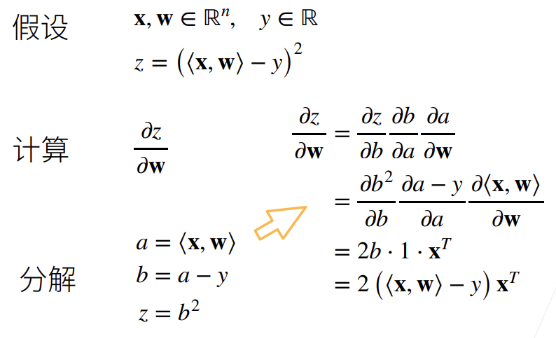
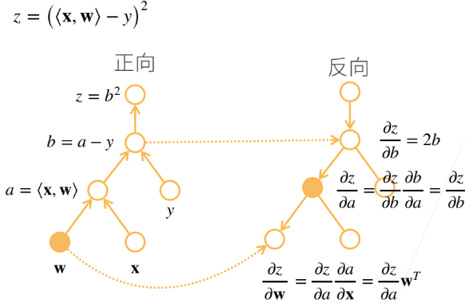
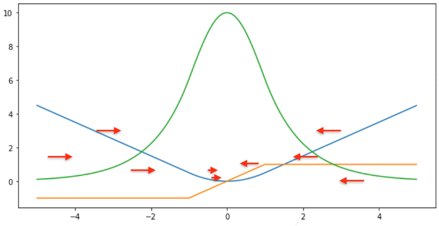

---
categories:
  - AI
  - 机器学习
  - 深度学习
tags:
  - AI
  - 机器学习
  - 深度学习
mathjax: true
title: 0.动手学深度学习
abbrlink: 3226843952
date: 2024-03-14 09:57:03
---

[TOC]

<!--more-->

# 1. 简介

## 1.1 学习内容

What：深度学习有哪些技术

How：如何实现这些技术和调参

Why：有效性原因，直觉、数学上解释

## 1.2 深度学习概述

### 1.2.1 学科范畴


y轴为任务，x轴为解决任务可用的模型

- 感知：所见即所得
- 推理：基于感知，推导未来可能发生的事情
- 知识：根据看到的东西、现象形成知识
- 规划：基于知识，进行长远规划

自然语言处理：比较成熟的是机器翻译

- 语言首先是符号，后续发展为用概率模型、ML模型去解释

计算机视觉：基于图片内容可以做一些推理

- 图像中都是像素点，很难用符号解释，所以CV大部分用概率模型或ML解释

深度学习是机器学习中的一种

### 1.2.2 课程设置

深度学习基础

CNN是一个空间上的神经网络，RNN是一个时间上的神经网络

注意力机制：主要应用于NLP

优化算法：SGD、Momentum、Adam

高性能计算

- 并行
- 多GPU
- 分布式


2章：深度强化学习所需前置

- 如何存储和处理数据
- 如何进行数值计算

3、4章：深度学习基本概念和技术

5-10章：现代深度学习技术

- 5：计算方式
- 6,7：CNN
- 8,9：RNN
- 10：注意力机制

11章：用于深度学习模型的几种常用优化算法

12章：计算性能影响因素

14,15章：预训练语言表示模型并将其应用于NLP任务

### 1.2.3 应用

> 符号学结合机器学习——结合图神经网络，可以做一些比较复杂的推理

#### 图像

##### 图片分类

http://www.image-net.org 是一个图片数据集，包括1000类物体的1000000张图片


从2012年开始，深度学习开始应用于图像识别领域，到2017年，基本上所有的团队都能做到5%以内的错误率，精确率达到了人类在图片分类任务上的水平

##### 目标检测和分割

目标检测：图片中的物体是什么，出现在图片的什么位置

图像分割：图片中的每个像素属于那个目标

##### 样式迁移

AI作图，给定图片与模式，能够换成指定风格的图片

##### 人脸合成

#### 生成模型

##### 文字生成图片

##### 文本生成模型

GPT

#### 计算机视觉应用于无人驾驶

#### 广告点击案例

任务：根据搜索框输入的文本，推荐商品


1. 输入关键词，找到相关广告
2. 机器学习模型，预测看到一个广告后，人点击各个广告的点击率
3. 根据点击率与用户点击后广告主竞价对商品排序

点击率的预测与预测模型的训练：


- 预测：提取一个广告的特征，将这个广告输入给模型，模型会给出当前用户点击这个广告的概率
- 模型训练：当前用户对所有广告的点击数据，经过数据清洗后，广告特征与点击结果会作为训练数据，基于这个数据集，会训练出预测模型


领域专家：关注机器模型会对产品产生什么的影响。模型控制广告展现，这些展现数据会被模型进一步学习，领域专家了解用户行为，模型需要对应用数据做哪些拟合。

- 提出需求：相当于指标制定者，某个任务中，达成哪些指标就认为是好的结果

数据科学家：将原始数据变为机器学习能理解的数据，然后训练模型

- 产品：将领域专家的问题、需求翻译为机器学习可以实现的一些任务，得到不错的模型

AI专家：关注某几个点，进行进一步提升 

### 1.2.4 模型可解释性

模型的有效性可做一些解释：模型可应用于什么场景，什么样的模型会考虑空间信息，什么样的模型会考虑时间信息，什么样的模型泛化性好一些

模型的可解释性，如：人是否能理解模型，用数学解释模型什么时候工作，什么时候不工作，什么时候出现偏差这方面目前无法解决。

## 1.3  表示学习(特征处理)

> 样本特征 $\iff$ 表示

机器学习流程：


- 特征工程(feature engineering)——人工处理

  数据预处理：对于数据缺失多的特征，弃用

  特征提取：提取有效特征，隐含特征也需提取

  特征转换：某些冗余特征及有相关性特征，弃用或组合，形成更有效特征

- **浅层学习**：不涉及特征学习，其特征主要靠人工经验或特征转换的方法抽取

### 1.3.1 传统特征学习

#### 特征选择

> **特征选择** 是选取原始特征集合的一个有效子集，使得基于这个特征子集训练出来的模型准确率最高

- 保留有用特征，移除冗余或无关的特征

**子集搜索**：假设原始特征数为 $D$ ，则共有 $2^D$ 个候选子集。特征选择的目标就是选择一个最优的候选子集

常用贪心搜索策略：由空集合开始，每一轮添加该轮最优的特征，称为**前向搜索**（Forward Search）；

从原始特征集合开始，每次删除最无用的特征，称为**反向搜索**（Backward Search）．

##### 过滤式

> 不依赖具体机器学习模型的特征选择方法

每次增加最有信息量的特征，或删除最没有信息量的特征

特征的信息量可以通过**信息增益**（Information Gain）来衡量，即引入特征后条件分布 $p_\theta(y\vert x)$ 的不确定性(熵)的减少程度

##### 包裹式

> 使用后续机器学习模型的准确率作为评价来选择一个特征子集的方法

每次增加对后续机器学习模型最有用的特征，或删除对后续机器学习任务最无用的特征．

##### $L_1$ 正则化

$L_1$ 正则化会导致稀疏特征，间接实现了特征选择

#### 特征抽取

> 构造一个新的特征空间，并将原始特征投影在新的空间中得到新的表示

##### 监督的特征学习

> 抽取对一个特定的预测任务最有用的特征

- 线性判别分析

##### 无监督的特征学习

> 和具体任务无关，其目标通常是减少冗余信息和噪声

- 主成分分析PCA
- 自编码器


#### 特征工程作用

用较少的特征表示原始特征中的大部分信息，去掉噪声信息，并进而提高计算效率和减小维度灾难

- 尤其是对于没有正则化的模型

### 1.3.2 语义鸿沟

**底层特征** 与 **高层语义**

> 人们对文本、图像的理解（高层语义）无法从字符串或者图像的底层特征（底层特征）直接获得

**好的表示**

- 应该具有很强的表示能力——同样的一个空间应该可表示更多的语义
- 应该使后续的学习任务变得简单
- 应该具有一般性，是任务或领域独立的

### 1.3.3 表示方式

**数据表示是机器学习的核心问题**

局部表示

> 一个语义由一个量表示

- 离散表示

  One-Hot向量

- 符号表示

分布式表示

> 一个语义由多个量共同表示

- 压缩、低维、稠密向量


理解：

$k$ 个维度

- 局部表示：单个维度代表语义

  $k$ 个语义

- 分布式表示：所有维度加起来代表语义

  $2^k$ 个语义


#### 关联

局部表示：配合知识库、规则使用

分布式表示：嵌入：压缩、低维、稠密

通常情况：将局部表示映射为分布式表示

- 低维

  

- 稠密

  

  相似语义靠的近，不同语义间隔大，便于后续量化

### 1.3.4 表示学习

通过构建模型，让其自动学习好的特征（底层特征、中层特征、高层特征），从而最终提升预测或识别的准确性


#### 对比

**传统特征提取**

- 线性投影（子空间）

  PCA、LDA

- 非线性嵌入

  LLE、Isomap、谱方法

- 自编码

区别：

- 特征提取：基于任务或 **先验** 去除无用特征

  自设标准，对任务影响是好是坏并不确定，实质上也是一种特征工程

- 表示学习：通过深度模型学习高层语义特征

  难点：没有明确目标

#### 深度学习与表示学习

**一个好的表示学习策略必须具备一定深度** ，指原始数据进行非线性特征转换的次数

- 特征重用

  指数级的表示能力，底层特征可以被高层特征重复利用

- 抽象表示与不变性

  抽象表示需要多步构造

  

#### 深度学习概念

$$
深度学习=表示学习+\underbrace{决策(预测)学习}_{浅层学习}
$$


核心问题是：**贡献度分配问题** 


即一个系统中不同的组件（component）或其参数对最终系统输出结果的贡献或影响

- **强化学习** 可以通过反馈机制，获取当前步的决策对最终结果影响的概率大小，进而判断当前步的贡献度大小

对于一般的深度学习，解决贡献度分配问题用 **神经网络**


##### 端到端

整个学习过程中，没有人为干预

> 指在学习过程中不进行分模块或分阶段训练，直接优化任务的总体目标

**传统机器学习方法** 需要将一个任务的输入和输出之间人为地切割成很多子模块（或多个阶段），每个子模块分开学习

问题：

- 每一个模块都需要单独优化，并且其优化目标和任务总体目标并不能保证一致
- 错误传播，即前一步的错误会对后续的模型造成很大的影响．这样就增加了机器学习方法在实际应用中的难度．

##### 深度学习数学表示

$$
\begin{array}{c|l}
y=f(x)&浅层学习\\
\Downarrow\\
y=f^2(f^1(x))\\
\Downarrow\\
\vdots\\
\Downarrow\\
y=f^{K}(f^{K-1}\cdots(f^1(x)))&深度学习\\
\end{array}
$$

$f(x)$ 为非线性函数，不一定连续

- 线性模型多层嵌套仍是线性，性能不会提升

当 $f^1(x)$ 连续时，如 $f^l(x)=\sigma(W^{(l)}f^{l-1}(x))$ ，这个复合函数称为神经网络


# 2. 绪论

## 2.0 资源

[视频](https://space.bilibili.com/1567748478/channel/seriesdetail?sid=358497)

[第一版](https://d2l.ai/chapter_preface/index.html) 

[论坛](https://discuss.d2l.ai/t/topic/2083) 

[课程主页](https://courses.d2l.ai/zh-v2/) ：PPT、视频、PPT jupyter、[教材](https://zh-v2.d2l.ai/chapter_preface/index.html) 

## 2.1 安装

[李沐-Windows安装](https://www.bilibili.com/video/BV18K411w7Vs/?spm_id_from=333.999.0.0)

```shell
# ubuntu
1. 升级安装工具
sudo apt update

2. 安装编译工具,解压工具
sudo apt install build-essential zip

3. 安装python
sudo apt install python-3.8c 

4. 下载miniconda安装包
wget [miniconda的安装包链接]

5. 安装miniconda 
bash Miniconda-xx.sh

6. bash 进入conda环境

7. 创建环境
conda create --name d2l python=3.9 -y

8. 安装相关依赖 jupyter d2l torch torchvision
pip install torch==1.12.0 torchvision==0.13.0 d2l==0.17.6
conda install jupyter 
# 可能存在的问题，toolkit版本为11，改一下
# CUDA 11.6
#pip install torch==1.12.0+cu123 torchvision==0.13.0+cu123 torchaudio==0.12.0 --c

9. 下载jupyter记事本，项目文件，解压pytorch文件夹
#安装jupyter notebook
conda install -y jupyter
conda install ipykernel
#查看有哪些环境
jupyter kernelspec list
#将conda环境添加到jupyter的内核中
python -m ipykernel install --name conda_env_name
python -m ipykernel install --user --name pytorch171 --display-name pytorch171
#删除指定kernel环境
jupyter kernelspec uninstall pytorch1.8_python3.6

10. 将远端地址映射到本地
ssh -L8888:localhost:8888 [远端 用户名@ip]

11. 启动jupyter
jupyter notebook
####记得看内核正不正确
```


将pytorch安装到jupyter

```shell
pip install ipykernel
python -m ipykernel install --user --name=[conda_name]
```

### 2.1.1 查阅文档

```python
dir()# 查找该模块可以调用的函数和类

print(dir(torch.distributions))
```

以 `__` 开始和结束的函数为Python中的特殊对象

以 `_` 开始和结束的函数为内部函数

```python
help(torch.ones)
```

给出函数的详细声明

- 参数列表
- 函数描述
- 普通参数 Args
- 关键字参数 Keyword arguments
- 示例：Example

## 2.2 数据操作

### 2.2.1 数据类型


标量：一个特征值

一维向量：一个样本的多维特征值

二维向量：多个样本组成的特征矩阵、一张图片的某个通道

三维向量：一张RGB图片（$宽\times 高\times 通道$）

四维向量：一个RGB图片批量，一次卷积运算会计算很多张图片，称为一个批量

五维向量：$时间\times batch$ 

### 2.2.2 tensor操作与运算

> 在pytorch中，`tensor` 表示多维数组，与 `numpy` 的用法基本相同

#### 创建

- `arange(start=0, end, step=1, *, out=None, dtype=None, layout=torch.strided, device=None, requires_grad=False) -> Tensor` 

  创建从 $[start，end)$ 的数组，每隔 step-1 取一个数字

  dtype为数据类型：`torch.float32` ,...

  layout为内存布局，可选`torch.stried`或`torch.sparse_coo`。分别对应顺序储存、离散储存。

  device为CPU或CUDA

- `torch.zero((a,b,c))` ：$(a,b,c)$ 为一个tuple，在torch中封装为 Size 类型的对象，表示张量的形状；全0的张量

- `torch.ones((a,b,c))` ：全1的张量

- 随机数：

  - `torch.rand(sizes,out=None)` ：构造均匀分布张量的方法

    - `torch.rand(2,3,4)` 

  - `torch.randn(sizes,out=None)` ：构造标准正态分布张量的方法

  - `torch.randint(low=0, high, sizes, out=None)` ：构造区间分布张量

    - `torch.randint(1, 10, (4, 3))` 

  - `torch.randperm(n, out=None, dtype=torch.int64)` ：对张量序号进行随机排序的函数，并根据生成的随机序列

    ```python
    >>> tensor_4 = torch.Tensor(4, 3)
    >>> tensor_4
    tensor([[-6.4468e+37,  1.7825e-42,  0.0000e+00],
            [ 0.0000e+00,  0.0000e+00,  0.0000e+00],
            [ 0.0000e+00,  0.0000e+00,  0.0000e+00],
            [ 0.0000e+00,  0.0000e+00,  0.0000e+00]])
    
    # 生成一个0~3的随机行序号
    >>> idx = torch.randperm(4)
    >>> print("\n生成的随机序号\n", idx)
    
    生成的随机序号
     tensor([3, 1, 0, 2])
        
    # 在行的方向上，对tensor_4进行随机排序，并输出结果
    >>> print("\n随机排序后的张量\n", tensor_4[idx])
    
    随机排序后的张量
     tensor([[ 0.0000e+00,  0.0000e+00,  0.0000e+00],
            [ 0.0000e+00,  0.0000e+00,  0.0000e+00],
            [-6.4468e+37,  1.7825e-42,  0.0000e+00],
            [ 0.0000e+00,  0.0000e+00,  0.0000e+00]])
    ```

- `torch.tensor([list])` ：通过python的列表类型，转换为张量

  如：`torch.tensor([[1,2],[3,4],[5,6]])` 用列表创建 $3\times 2$ 的二维张量

`.numel()` ：number of element 张量中元素的个数

通过 `.shape` 访问张量对象的尺寸

```python
import torch

x = torch.arange(1,12,2)
print(x)
# tensor([ 1,  3,  5,  7,  9, 11])

print(x.numel())
# 6

print(x.shape)
# torch.Size([6])
```

#### 操作

- `.reshape(a,b,c)` ：改变张量的形状而不改变元素数量和元素值，将张量变为 $a\times b\times c$ 的张量；维度为c的一维向量，有b个一维向量，$b\times c$ 的矩阵有 $a$ 个
- 张量连接：`torch.cat((x,y),dim=0)` ，`torch.cat((x,y),dim=1)`  

```python
X = x.reshape(3,2)
# tensor([[ 1,  3],
#        [ 5,  7],
#        [ 9, 11]])

x = torch.arange(12,dtype=torch.float32).reshape((3,4)) 
y = torch.tensor([[2.0,1,4,3],[1,2,3,4],[4,3,2,1]])
print(torch.cat((x,y),dim=0)) #行拼接
print(torch.cat((x,y),dim=1)) #列拼接
# tensor([[ 0.,  1.,  2.,  3.],
#         [ 4.,  5.,  6.,  7.],
#         [ 8.,  9., 10., 11.],
#         [ 2.,  1.,  4.,  3.],
#         [ 1.,  2.,  3.,  4.],
#         [ 4.,  3.,  2.,  1.]])
# tensor([[ 0.,  1.,  2.,  3.,  2.,  1.,  4.,  3.],
#         [ 4.,  5.,  6.,  7.,  1.,  2.,  3.,  4.],
#         [ 8.,  9., 10., 11.,  4.,  3.,  2.,  1.]])
```

#### 运算

- 算术运算：`+ - * / **` 都是逐元素运算

- 关系运算：`==` `>` `<` `>=` `<=` 逐元素比较
- 所有元素求和：`.sum()`

```python
x = torch.tensor([1.0,2,4,8]) # 1.0创建浮点数组
y = torch.tensor([5,4,3,2]) 
print(x*y)
print(x**y)
# tensor([ 5.,  8., 12., 16.])
# tensor([ 1., 16., 64., 64.])

x == y
# tensor([[False,  True, False,  True],
#         [False, False, False, False],
#         [False, False, False, False]])

x.sum()
# tensor(66.) # 输出一个标量值
```

**广播机制** ：维度(秩)相同，尺寸不同的张量间算术运算，会进行广播

- 同秩同尺寸最好

- 同秩不同尺寸，一定会广播

  ```python
  同秩异尺寸
  a = torch.arange(2).reshape((3,1)) # torch.Size([3, 1])
  b = torch.arange(6).reshape((3,2))
  # tensor([[0, 1],
  #         [2, 3],
  #         [4, 5]])
  a+b
  tensor([[0, 1],
          [3, 4],
          [6, 7]])
  
  a = torch.arange(3).reshape((3,1))
  b = torch.arange(2).reshape((1,2))
  print(a,b)
  print(a+b)
  
  # tensor([[0],
  #         [1],
  #         [2]]) tensor([[0, 1]])
  # tensor([[0, 1],
  #         [1, 2],
  #         [2, 3]])
  ```

- 异秩异尺寸：高秩张量降一维可对齐则可广播运算

  ```python
  b降一维是尺寸为2的向量，a是尺寸为3的向量。此时，由于无法对齐，无法运算 
  a = torch.arange(3)#tensor([0, 1, 2]) torch.Size([3])
  b = torch.arange(6).reshape((3,2)) # torch.Size([3, 2])
  # tensor([[0, 1],
  #         [2, 3],
  #         [4, 5]])
  
  b降1维是尺寸为2的向量，a是尺寸为2的向量，可对齐，所以可运算
  a = torch.arange(2)	
  #tensor([0, 1])
  b = torch.arange(6).reshape((3,2))
  # tensor([[0, 2],
  #         [2, 4],
  #         [4, 6]])
  ```

#### 访问


一个元素 `x[1,2]`  ：行索引为1，列索引为2，第二行第一列

一行 `x[1,:]` `x[1,]` ：行索引为1，列索引为全部

一列 `x[:,2]`：行索引为全部，列索引为2


访问子区域 `x[1:3,1:]` ：行索引为1-2，列索引为1到全部，步长默认为1

访问子区域 `x[::3,::2]` ：行步长为3，表示取每3行的第一行；列步长为2，表示取每2列的第一列

---

`[1,2]` 表示访问行索引为1，列索引为2的元素

```python
b[1,2]=111

# tensor([[  0,   1,   2,   3],
#         [  4,   5, 111,   7],
#         [  8,   9,  10,  11]])
```

用 `[-1]` 选择最后一个元素，用 `[1:3]` 选择索引为1和2的元素

```python
b = torch.arange(12).reshape((3,4))

print(b)
print(b[-1])#3*4矩阵的最后一个元素为 b[2]
print(b[1:3,]) #第2行和第3行

#tensor([ 8,  9, 10, 11])
#tensor([[ 4,  5,  6,  7],
#        [ 8,  9, 10, 11]])
```

同样，可批量读则可批量写

```python
b[1:3,] = 12

# tensor([[ 0,  1,  2,  3],
#         [12, 12, 12, 12],
#         [12, 12, 12, 12]])
```

#### 避免内存重分配

执行一些操作会为结果分配新的内存

```python
before = id(Y)
Y = X+Y
id(Y) == before # False
```

执行原地操作

```python
a = torch.arange(12).reshape((3,4))
b = torch.arange(6,12,0.5).reshape((3,4))
c = torch.zeros_like(a)

print('id(c)',id(c))
c[:] = a + b # 此处变为 c = a + b 则不是原地操作
print('id(c)',id(c))
```

实际上将c中的元素进行改写，并没有为c分配新的内存

`X+=Y` 也是原地操作，将 `X` 的内容改写

#### 变量类型转换

转换为numpy张量

```python
a = torch.arange(12).reshape((3,4))
X = a.numpy()
Y = torch.tensor(X)
print(type(X),type(Y))

# <class 'numpy.ndarray'> <class 'torch.Tensor'>
```

将大小为1的张量变为Python标量

```python
a = torch.tensor([3.5])
a,a.item(),float(a),int(a)

# tensor([3.5000]) 3.5 3.5 3
```

### 2.2.3 数据预处理

```python
import os

# 在上层目录下创建目录
os.makedirs(os.path.join('./','data'),exist_ok=True)
data_file = os.path.join('./','data','house_tiny.csv') #在指定目录下创建文件

# 向打开的文件中写入数据
with open(data_file, 'w') as f:
    f.write('NumRooms,Alley,Price\n')
    f.write('NA,Pave,127500\n')
    f.write('2,NA,106000\n')
    f.write('4,NA,178100\n')
    f.write('NA,NA,140000\n')

#从csv中读取文件
import pandas as pd

# 从指定路径中读取为csv文件
data = pd.read_csv(data_file)
print(data)

# 将0,1列作为输入向量，将2列作为输出向量
inputs, outputs = data.iloc[:,0], data.iloc[:, 2]
inputs = inputs.fillna(inputs.mean())# 用均值填充NA元素
inputs = pd.concat([inputs,data.iloc[:,1]],axis=1)
#对于inputs中的类别值或离散值，将NaN视为一个类别
inputs = pd.get_dummies(inputs,dummy_na=True)

#ndarray中的值默认为numpy对象，需要将其转换为数值才能转换为tensor
inputs = inputs.astype(float)

import torch

x,y = torch.tensor(inputs.values),torch.tensor(outputs.values)
print(x, y)
```

## 2.3 线性代数

### 约定

$\mathbf{x}$ 为向量

$\mathbf{X}$ 为矩阵

### 2.3.1 标量

**简单操作** $c=a+b$ ，$c=a\cdot b$ ，$c=\sin a$ 

**模**
$$
\vert a\vert=\begin{cases}
a&,a>0\\
-a&,其他
\end{cases}\\
\vert a+b\vert\le \vert a\vert +\vert b\vert\\
\vert a\cdot b\vert =\vert a\vert \cdot \vert b\vert 
$$

### 2.3.2 向量

**简单操作**


$$
\begin{array}{ll}
\mathbf{c}=\mathbf{a}+\mathbf{b}&c_i=a_i+b_i\\
\mathbf{c}=a\mathbf{b}&c_i=a\cdot b_i\\
\mathbf{c}=\sin\mathbf{a}&c_i=\sin a_i
\end{array}
$$
**模** 
$$
\Vert \mathbf{a}\Vert_2=\left[\sum\limits_{i=1}^ma_i^2\right]^{\frac{1}{2}}\\
\Vert \mathbf{a}\Vert\ge 0,\forall \mathbf{a}\\
\Vert \mathbf{a}+\mathbf{b}\Vert\le \Vert \mathbf{a}\Vert+\Vert \mathbf{b}\Vert\\
\Vert \mathbf{a}\cdot \mathbf{b}\Vert=\Vert \mathbf{a}\Vert\cdot \Vert \mathbf{b}\Vert
$$
**内积**
$$
\mathbf{a}\cdot \mathbf{b}=\mathbf{a}^T\mathbf{b}=\sum\limits_{i}a_i\cdot b_i=\Vert \mathbf{a}\Vert\Vert\mathbf{b}\Vert\cos\theta
$$

- 向量正交，点积为0，$\mathbf{a}\cdot \mathbf{b}=0$ 

### 2.3.3 矩阵

**简单操作**
$$
\begin{array}{ll}
\mathbf{C}=\mathbf{A}+\mathbf{B}&C_{ij}=A_{ij}+B_{ij}\\
\mathbf{C}=\alpha\cdot \mathbf{B}&C_{ij}=\alpha B_{ij}\\
\mathbf{C}=\sin \mathbf{A}&C_{ij}=\sin A_{ij}
\end{array}
$$
**乘法**
$$
\begin{array}{rll}
矩阵\times 向量&\mathbf{c}=\mathbf{A}\cdot \mathbf{b}&c_i=\sum\limits_{j}A_{ij}b_j\\
矩阵\times 矩阵&\mathbf{C}=\mathbf{A}\mathbf{B}&C_{ik}=\sum\limits_{j}A_{ij}B_{jk}
\end{array}
$$

- 矩阵左乘向量，相当于对向量进行放缩与旋转操作

  

  

- 矩阵乘矩阵

  

**模**——矩阵的模为范数
$$
\mathbf{c}=\mathbf{A}\cdot \mathbf{b}\Rightarrow \Vert \mathbf{c}\Vert=\Vert \mathbf{A}\cdot \mathbf{b}\Vert\le \Vert \mathbf{A}\Vert\cdot \Vert \mathbf{b}\Vert
$$
矩阵范数：最小的满足上述公式的值

- F范数：$\Vert \mathbf{A}\Vert=\left[\sum\limits_{ij}\mathbf{A}_{ij}^2\right]^{\frac{1}{2}}$

#### 特殊矩阵

##### 对称与反对称


##### 正定阵

$$
\Vert \mathbf{x}\Vert^2=\mathbf{x}^T\mathbf{x}\Rightarrow \mathbf{x}^T\mathbf{A}\mathbf{x}\ge 0
$$

若 $\mathbf{A}$ 是正定阵，则与任意行列向量相乘都大于等于0

##### 正交

所有行都相互正交

所有行都是单位长度 $\mathbf{U},\delta_{ik}=\sum\limits_{j}U_{ij}U_{jk}$

可写成 $\mathbf{U}\mathbf{U}^T=\mathbf{1}$ 对角线为1的单位矩阵

##### 置换阵

置换阵是正交阵
$$
P_{ij}=1且 j=\pi(i)
$$

#### 特征向量&特征值

矩阵乘的本质是对空间进行放缩与旋转，不被矩阵改变方向的向量称为特征向量，对特征向量放缩倍数称为特征值


#### 矩阵求导

##### 标量导数


##### 偏导数

> 导数不一定存在的位置


##### 梯度

|                          | $x$                                                        | $\mathbf{x}_{1\times n}$                                     |
| :----------------------- | ---------------------------------------------------------- | ------------------------------------------------------------ |
| $y$                      | 标量： $\frac{\partial y}{\partial x}$                     | 向量：$\frac{\partial y}{\partial \mathbf{x}}_{1\times n}$   |
| $\mathbf{y}_{1\times m}$ | 向量：$\frac{\partial \mathbf{y}}{\partial x}_{1\times m}$ | 矩阵：$\frac{\partial \mathbf{y}}{\partial \mathbf{x}}_{m\times n}$ |

$$
\mathbf{x}=[x_{1},x_2,\cdots,x_n]\Rightarrow \frac{\partial y}{\partial \mathbf{x}}=\left[\frac{\partial y}{\partial x_1},\frac{\partial y}{\partial x_2},\cdots,\frac{\partial y}{\partial x_n}\right]
$$

如：$y=x_1^2+2x_2^2$ ，$\mathbf{x}=[x_1,x_2]$ ，若此时 $(x_1,x_2)=(1,1)$ ，则梯度为 $\frac{\partial y}{\partial \mathbf{x}}_{(1,1)}=[2x_1,4x_2]=(2,4)$ 

- 梯度大小为逐元素求偏导，方向垂直与等值线；梯度方向与等值线垂直

**一些梯度运算法则** 


分子布局：偏导结果的行与分子的行数相等

分母布局：分子布局的转置

**分子布局**


矩阵求导

| 列向量                   | $x$                                                        | $\mathbf{x}_{p\times 1}$                                     | $\mathbf{X}_{p\times q}$                                     |
| ------------------------ | ---------------------------------------------------------- | ------------------------------------------------------------ | ------------------------------------------------------------ |
| $y$                      | 标量： $\frac{\partial y}{\partial x}$                     | 向量：$\frac{y}{\partial x}_{1\times p}$                     | 矩阵：$\frac{\partial y}{\partial X}_{ q\times p}$           |
| $\mathbf{y}_{m\times 1}$ | 向量：$\frac{\partial \mathbf{y}}{\partial x}_{m\times 1}$ | 矩阵：$\frac{\partial \mathbf{y}}{\partial \mathbf{x}}_{m\times1\times1\times p=m\times p}$ | 矩阵：$\frac{\partial \mathbf{y}}{\partial \mathbf{X}}_{m\times 1\times q\times p=m\times q\times p}$ |
| $\mathbf{Y}_{m\times n}$ | 矩阵：$\frac{\partial \mathbf{Y}}{\partial x}_{m\times n}$ | 矩阵：$\frac{\partial \mathbf{Y}}{\partial \mathbf{x}}_{m\times n\times 1\times p=m\times n\times p}$ | batch：$\frac{\partial \mathbf{Y}}{\partial \mathbf{X}}_{m\times n\times q\times p}$ |


| 行向量                   | $x$                                                        | $\mathbf{x}_{1\times q}$                                     | $\mathbf{X}_{p\times q}$                                     |
| ------------------------ | ---------------------------------------------------------- | ------------------------------------------------------------ | ------------------------------------------------------------ |
| $y$                      | 标量： $\frac{\partial y}{\partial x}$                     | 向量：$\frac{\partial y}{\partial \mathbf{x}}_{q\times 1}$   | 矩阵：$\frac{\partial y}{\partial X}_{p\times q}$            |
| $\mathbf{y}_{1\times m}$ | 向量：$\frac{\partial \mathbf{y}}{\partial x}_{m\times 1}$ | 矩阵：$\frac{\partial \mathbf{y}}{\partial \mathbf{x}}_{m\times1\times1\times q=m\times q}$ | 矩阵：$\frac{\partial \mathbf{y}}{\partial \mathbf{X}}_{m\times 1\times p\times q=m\times p\times q}$ |
| $\mathbf{Y}_{n\times m}$ | 矩阵：$\frac{\partial \mathbf{Y}}{\partial x}_{m\times n}$ | 矩阵：$\frac{\partial \mathbf{Y}}{\partial \mathbf{x}}_{m\times n\times 1\times q=m\times n\times q}$ | batch：$\frac{\partial \mathbf{Y}}{\partial \mathbf{X}}_{m\times n\times p\times q}$ |

#### 链式求导法则

$$
y=f_5(f_4(f_3(f_2(f_1(x)))))\rightarrow \frac{\partial y}{\partial x}=\frac{\partial f_5}{\partial f_4}\frac{\partial f_4}{\partial f_3}\frac{\partial f_3}{\partial f_2}\frac{\partial f_2}{\partial f_1}\frac{\partial f_1}{\partial x}
$$

---

若 $x\in \mathbb{R}$，
$$
\begin{cases}
z_i=f_i(y)&z=\left[f_1(y),f_2(y),\cdots,f_N(y)\right]\in \mathbb{R}^{N}\\
y_i=g_i(x)&y=[g_1(x),g_2(x),\cdots,g_M(x)]\in \mathbb{R}^{M}
\end{cases}
$$
则有
$$
\frac{\partial z}{\partial x}=\frac{\partial z}{\partial y}_{N\times M}\frac{\partial y}{\partial x}_{M\times 1}\in\R^{N\times 1}
$$

---

若 $x\in \mathbb{R}^{M}$ 
$$
\begin{cases}
y_i=g_i(x)&y=[g_1(x),g_2(x),\cdots,g_K(x)]\in \mathbb{R}^{K}\\
z_i=f_i(y)&z=\left[f_1(y),f_2(y),\cdots,f_N(y)\right]\in \mathbb{R}^{N}
\end{cases}
$$
则有
$$
\frac{\partial z}{\partial x}=\frac{\partial z}{\partial y}_{N\times K}\frac{\partial y}{\partial x}_{K\times M}\in \mathbb{R}^{N\times M}
$$

---

若 $X\in R^{M\times N}$ ，
$$
\begin{cases}
y_i=g_i(X)&y=[g_1(X),g_2(X),\cdots,g_K(X)]\in \mathbb{R}^{K}\\
z_i=f(y)\in \mathbb{R}
\end{cases}
$$
则有
$$
\frac{\partial z}{\partial x_{ij}}=\frac{\partial z}{\partial y}_{1\times K}\frac{\partial y}{\partial x_{ij}}_{K\times 1}\in \mathbb{R}
$$

##### 标量链式求导

$$
y=f(u),u=g(x),\frac{\partial y}{\partial x}=\frac{\partial y}{\partial u}\frac{\partial u}{\partial x}
$$

##### 向量的链式求导

$$
\begin{array}{lll}
y_{1},\mathbf{x}_{p\times 1}&y=f(u),u=g(\mathbf{x})&\frac{\partial y}{\partial \mathbf{x}}_{1\times p}=\frac{\partial y}{\partial u}_1\frac{\partial u}{\partial \mathbf{x}}_{1\times p}\\
&y=f(\mathbf{u}),\mathbf{u}_{k\times 1}=g(\mathbf{x})&\frac{\partial y}{\partial \mathbf{x}}_{1\times p}=\frac{\partial y}{\partial \mathbf{u}}_{1\times k}\frac{\partial \mathbf{u}}{\partial \mathbf{x}}_{k\times p}\\
\mathbf{y}_{m\times 1},\mathbf{x}_{p\times 1}&\mathbf{y}=f(\mathbf{u}),\mathbf{u}_{k\times 1}=g(\mathbf{x})&\frac{\partial \mathbf{y}}{\partial \mathbf{x}}_{m\times p}=\frac{\partial \mathbf{y}}{\partial \mathbf{u}}_{m\times k}\frac{\partial \mathbf{u}}{\partial \mathbf{x}}_{k\times p}
\end{array}
$$




##### 更为高效的参数学习

梯度下降法需要计算损失函数对每个参数的偏导数，如果通过链式法则逐一对每个参数求偏导，会很低效

- 反向传播算法

- 自动梯度计算

  计算一个函数在指定值上的导数

#### 自动梯度计算

神经网络的参数主要通过梯度下降来优化，需要手动用链式求导来计算风险函数对每个参数的梯度，并转换为计算机程序。

- 手动计算并转换为计算机程序的过程容易出错

目前，主流的深度学习框架都包含了自动梯度计算功能，只需要考虑网络结构并用代码实现，大大提高了开发效率

##### 数值微分

用数值方法计算 $f(x)$ 的导数
$$
f'(x)=\lim\limits_{\Delta x\rightarrow 0}\frac{f(x+\Delta x)-f(x)}{\Delta x}
$$

1. 找到一个合适的 $\Delta x$ 十分困难

   - $\Delta x$ 过小，会引起数值计算问题，舍入误差
   - $\Delta x$ 过大，会增加截断误差（受模型影响的理论值与数值解之间的误差）

   在实际应用中，经常使用以下公式计算梯度，减少截断误差
   $$
   f'(x)=\lim\limits_{\Delta x\rightarrow 0} \frac{f(x+\Delta x)-f(x+\Delta x)}{2\Delta x}
   $$

2. 数值微分另一个问题是计算复杂度

   假设参数数量为 $N$ ，则每个参数都需要单独施加扰动，并计算梯度。假设每次正向传播的计算复杂度为 $O(N)$ ，则计算数值微分的总体时间复杂度为 $O(N^2)$

##### 符号微分

符号计算一般来讲是对 **输入的表达式**，用计算机来通过迭代或递归使用一些事先定义的规则进行转换．当转换结果不能再继续使用变换规则时，便停止计算，**输出是目标函数 / 表达式**。如：mathematica

- 一般包括对数学表达式的化简、因式分解、微分、积分、解代数方程、求解常微分方程等运算

符号微分可以在编译时就计算梯度的数学表示，并进一步利用符号计算方法进行优化

且符号计算与平台无关，可在CPU或GPU上运行

缺点：

- 编译时间较长，特别是对于循环，需要很长时间进行编译
- 为了进行符号微分，一般需要设计一种专门的语言来表示数学表达式，并且要对变量（符号）进行预先声明
- 很难对程序进行调试

#### 自动求导

##### 自动微分与符号微分区别

符号微分：处理数学表达式

自动微分：处理一个函数或一段程序


符号微分和自动微分都用计算图和链式法则自动求导

符号微分：

1. 符号微分在编译阶段先构造一个符合函数的计算图，通过符号计算得到导数表达式，并对表达式进行优化
2. 在程序运行运行阶段才代入变量数值计算导数

自动微分：

1. 无需事先编译，程序运行阶段，边计算边记录计算图
2. 计算图上的局部梯度都直接代入数值进行计算，然后用前向或反向模式计算最终梯度

##### 自动微分过程

> 基本原理：所有的数值计算可以分解为一些基本操作，包含+, −, ×, / 和一些初等函数exp, log, sin, cos 等，然后利用链式法则来自动计算一个复合函数的梯度

将表达式分解为操作子，将计算表示成无环图


正向求导（从简单到复杂）：

1. 输入 $\mathbf{w},\mathbf{x}$ ，对 $a=(\mathbf{w},\mathbf{x})$ 求偏导 $\frac{\partial a}{\partial \mathbf{w}}=\mathbf{x}$ 
2. $\mathbf{b}=a-y$ 对 $a$ 求偏导 $\frac{\partial b}{\partial a}=1$ 
3. $z=\mathbf{b}^2$ 对 $b$ 求偏导，$\frac{\partial z}{\partial \mathbf{b}}=2\mathbf{b}$

##### 自动求导模式

链式法则
$$
\frac{\partial y}{\partial x}=\frac{\partial y}{\partial u_n}\frac{\partial u_{n}}{\partial u_{n-1}}\frac{\partial u_{n-1}}{\partial u_{n-2}}\cdots \frac{\partial u_{2}}{\partial u_{1}}\frac{\partial u_{1}}{\partial x}
$$

- 正向累积
  $$
  \frac{\partial y}{\partial x}=\frac{\partial y}{\partial u_n}\left(\frac{\partial u_{n}}{\partial u_{n-1}}\frac{\partial u_{n-1}}{\partial u_{n-2}}\left(\cdots \left(\frac{\partial u_{2}}{\partial u_{1}}\frac{\partial u_{1}}{\partial x}\right)\right)\right)
  $$
  从简单到复杂

- 反向累积、反向传递
  $$
  \frac{\partial y}{\partial x}=\left(\left(\left(\left(\frac{\partial y}{\partial u_n}\frac{\partial u_{n}}{\partial u_{n-1}}\right)\frac{\partial u_{n-1}}{\partial u_{n-2}}\right)\cdots\right)\frac{\partial u_{2}}{\partial u_{1}}\right) \frac{\partial u_{1}}{\partial x}
  $$
  从复杂到简单

##### 反向传递计算过程

1. 正向计算函数值，存储中间值

   

2. 反向计算导数值，去除无关的枝

   

##### 复杂度

$n$ 为中间变量个数

正向计算代价和反向计算代价都是 $O(n)$ 

反向计算内存复杂度 $O(n)$ ：需要存储正向计算的所有中间结果

正向累积：

- 计算一个变量的梯度时间复杂度为 $O(n)$
- 内存复杂度 $O(1)$ ：不需要存任何结果
- 计算几个变量扫几遍遍计算图，计算效率低

##### 计算图

计算图可以显式构造，也可以隐式构造

- mxnet ， Tensorflow / Theano都可显式构造

  ```python
  from mxnet import sym#(symbol)
  
  a = sym.var() #将a定义为中间变量，后续可指定表达式
  b = sym.var() #将b定义为中间变量，后续可指定表达式
  c = 2*a+b
  ```

- 隐式构造：Pytorch、Mxnet

  ```python
  from mxnet import autograd,nd#(symbol)
  
  with autograd.record():
      a = nd.ones((2,1)) #构造2维全1列向量
      b = nd.ones((2,1)) #构造2维全1列向量
      c = 2*a+b
  ```

---

以 $f(x;w,b)=\frac{1}{exp(-(wx+b))+1}$ 为例，其中 $x$ 为输入标量， $w,b$ 为权重和偏置


复合函数关于参数的导数可以通过计算图路径上节点的所有导数连乘法得到


- 

如果函数与参数之间有多条路径，则将不同路径上的导数相加，可以得到最终的梯度

---

根据计算导数的顺序，自动微分可以分为：正向模式和反向模式

- 正向模式（从简单到复合）：按照计算图中与参数计算方向相同的方向来递归计算梯度

  

- 反向模式（从复合到简单）：按照计算图中与参数计算方向相反的方向来计算梯度

  

  反向模式与反向传播的梯度计算方式相同

准则：

当输入变量的数量大于输出变量的数量，用反向模式

- 前向模式需要对每一个输入都进行遍历

- 反向模式需要对每一个输出都进行遍历

在前馈神经网络中，风险函数为 $f:\R^{N}\rightarrow \mathbb{R}$ 输出为标量，采用反向模式，内存占用小，只需要计算一遍

---

**静态计算图和动态计算图**

静态计算图：在编译时构建计算图，运行过程中不可修改

- 在构建时可以进行优化，并行能力强
- 灵活性差

动态计算图：在程序运行时构建计算图

- 不容易优化，输入不同结构的网络，难以并行计算
- 灵活性高

### 2.3.4 用tensor实现线代

#### 标量

```python
>>> x = torch.tensor([3.0])
>>> y = torch.tensor([2.0])
>>> print(x+y,x*y,x/y,x**y)

tensor([5.]) tensor([6.]) tensor([1.5000]) tensor([9.])
```

#### 向量

**torch中创建的向量默认是行向量** 

```python
>>> x = torch.arange(4)
>>> x
tensor([0, 1, 2, 3])
>>> len(x)
4
>>> x.shape
torch.Size([4])
```

#### 矩阵

```python
>>> A = torch.arange(20).reshape(5,4)
>>> A
tensor([[ 0,  1,  2,  3],
        [ 4,  5,  6,  7],
        [ 8,  9, 10, 11],
        [12, 13, 14, 15],
        [16, 17, 18, 19]])
>>> A.T
tensor([[ 0,  4,  8, 12, 16],
        [ 1,  5,  9, 13, 17],
        [ 2,  6, 10, 14, 18],
        [ 3,  7, 11, 15, 19]])
```

对称阵，$\mathbf{A}=\mathbf{A}^T$

```python
>>> B = torch.tensor([[1,2,3],[2,0,4],[3,4,5]])
>>> B == B.T
tensor([[True, True, True],
        [True, True, True],
        [True, True, True]])
```

#### 张量

向量是标量的推广，矩阵是向量的推广，张量是矩阵的推广，可以构造具有任意多轴的数据结构

```python
>>> X = torch.arange(24).reshape(2,3,4)
>>> X
tensor([[[ 0,  1,  2,  3],
         [ 4,  5,  6,  7],
         [ 8,  9, 10, 11]],

        [[12, 13, 14, 15],
         [16, 17, 18, 19],
         [20, 21, 22, 23]]])
```

##### 逐元素运算

相同形状的任意两个张量，按运算的二元运算结果都是相同形状的张量

```python
>>> A = torch.arange(20,dtype=torch.float32).reshape(5,4)
>>> B = A.clone() #分配新的内存，将A的副本分配给B
B=A#二者均指向同一块内存，改变B，A也会变
>>> A,A+B
(tensor([[ 0.,  1.,  2.,  3.],
        [ 4.,  5.,  6.,  7.],
        [ 8.,  9., 10., 11.],
        [12., 13., 14., 15.],
        [16., 17., 18., 19.]]), tensor([[ 0.,  2.,  4.,  6.],
        [ 8., 10., 12., 14.],
        [16., 18., 20., 22.],
        [24., 26., 28., 30.],
        [32., 34., 36., 38.]]))
```

矩阵按元素乘法称为 哈达玛积 $\odot$ 

```python
>>> A
tensor([[ 0.,  1.,  2.,  3.],
        [ 4.,  5.,  6.,  7.],
        [ 8.,  9., 10., 11.],
        [12., 13., 14., 15.],
        [16., 17., 18., 19.]])
>>> B
tensor([[ 0.,  1.,  2.,  3.],
        [ 4.,  5.,  6.,  7.],
        [ 8.,  9., 10., 11.],
        [12., 13., 14., 15.],
        [16., 17., 18., 19.]])
>>> A * B
tensor([[  0.,   1.,   4.,   9.],
        [ 16.,  25.,  36.,  49.],
        [ 64.,  81., 100., 121.],
        [144., 169., 196., 225.],
        [256., 289., 324., 361.]])
```

标量乘矩阵也是逐元素运算

```python
>>> a = 2
>>> X = torch.arange(24).reshape(2,3,4)
>>> a+X,(a*X).shape
(tensor([[[ 2,  3,  4,  5],
         [ 6,  7,  8,  9],
         [10, 11, 12, 13]],

        [[14, 15, 16, 17],
         [18, 19, 20, 21],
         [22, 23, 24, 25]]]), torch.Size([2, 3, 4]))
```

##### 求和

**所有元素求和**

```python
A.sum()
```

**指定轴求和** 

```python
>>> A
tensor([[ 0.,  1.,  2.,  3.],
        [ 4.,  5.,  6.,  7.],
        [ 8.,  9., 10., 11.],
        [12., 13., 14., 15.],
        [16., 17., 18., 19.]])
>>> A_sum_axis0 = A.sum(axis=0) #0轴为行，结果呈现在1轴
>>> A_sum_axis0 , A_sum_axis0.shape
(tensor([40., 45., 50., 55.]), torch.Size([4]))

>>> A_sum_axis1 = A.sum(axis=1)#0轴为列，结果呈现在0轴
>>> A_sum_axis1 , A_sum_axis1.shape
(tensor([ 6., 22., 38., 54., 70.]), torch.Size([5]))

>>> A.sum(axis=[0,1])
tensor(190.)
>>> A,A.shape
(tensor([[ 0.,  1.,  2.,  3.],
        [ 4.,  5.,  6.,  7.],
        [ 8.,  9., 10., 11.],
        [12., 13., 14., 15.],
        [16., 17., 18., 19.]]), torch.Size([5, 4]))
```

```python
>>> A = torch.arange(24).reshape(2,3,4)
>>> A
tensor([[[ 0,  1,  2,  3],
         [ 4,  5,  6,  7],
         [ 8,  9, 10, 11]],

        [[12, 13, 14, 15],
         [16, 17, 18, 19],
         [20, 21, 22, 23]]])
>>> A_sum_axis0 = A.sum(axis=0) #0轴为通道，结果放在1,2轴
>>> A_sum_axis0 , A_sum_axis0.shape
(tensor([[12, 14, 16, 18],
        [20, 22, 24, 26],
        [28, 30, 32, 34]]), torch.Size([3, 4]))

>>> A_sum_axis1 = A.sum(axis=1)#1轴为高，结果放在0,2轴
>>> A_sum_axis1 , A_sum_axis1.shape
(tensor([[12, 15, 18, 21],
        [48, 51, 54, 57]]), torch.Size([2, 4]))

>>> A_sum_axis2 = A.sum(axis=2) #2轴为宽，结果放在0,1轴
>>> A_sum_axis2 , A_sum_axis2.shape
(tensor([[ 6, 22, 38],
        [54, 70, 86]]), torch.Size([2, 3]))

>>> A_sum_axis12 = A.sum(axis=[1,2]) # 1,2轴求和，结果放在0轴
>>> A_sum_axis12, A_sum_axis12.shape
(tensor([ 66, 210]), torch.Size([2]))
```

##### 求均值

实质上是求和除轴上元素个数

```python
>>> A = torch.arange(0.,20).reshape(4,5)
>>> A.mean()
tensor(9.5000)
>>> A.sum() / A.numel()
tensor(9.5000)

>>> A.mean(axis=0),A.sum(axis=0)/A.shape[0]
(tensor([ 7.5000,  8.5000,  9.5000, 10.5000, 11.5000]), tensor([ 7.5000,  8.5000,  9.5000, 10.5000, 11.5000]))
```

##### 求和或均值时保持轴数(秩)不变

```python
>>> sum_A = A.sum(axis=1,keepdims=True)
>>> sum_A
tensor([[10.],
        [35.],
        [60.],
        [85.]])
```

按轴求和，$4\times 5$ 变为 $4\times 1$ 

可通过广播机制对每列各元素使用不同数做相同操作

```python
>>> A / sum_A
tensor([[0.0000, 0.1000, 0.2000, 0.3000, 0.4000],
        [0.1429, 0.1714, 0.2000, 0.2286, 0.2571],
        [0.1667, 0.1833, 0.2000, 0.2167, 0.2333],
        [0.1765, 0.1882, 0.2000, 0.2118, 0.2235]])
```

##### 某个轴上累加求和

```python
>>> A
tensor([[ 0.,  1.,  2.,  3.,  4.],
        [ 5.,  6.,  7.,  8.,  9.],
        [10., 11., 12., 13., 14.],
        [15., 16., 17., 18., 19.]])
>>> A.cumsum(axis=0)
tensor([[ 0.,  1.,  2.,  3.,  4.],
        [ 5.,  7.,  9., 11., 13.],
        [15., 18., 21., 24., 27.],
        [30., 34., 38., 42., 46.]])
```

##### 点积

```python
>>> x = torch.arange(4,dtype=torch.float32)
>>> y = torch.ones(4,dtype=torch.float32)
>>> x,y,torch.dot(x,y)
(tensor([0., 1., 2., 3.]), tensor([1., 1., 1., 1.]), tensor(6.))
```

等价于逐元素乘再求和

```python
>>> torch.sum(x*y)
tensor(6.)
```

##### 矩阵乘向量

```python
>>> A = torch.arange(20,dtype=torch.float32).reshape(4,5)
>>> x = torch.arange(5,dtype=torch.float32)
(tensor([[ 0.,  1.,  2.,  3.,  4.],
        [ 5.,  6.,  7.,  8.,  9.],
        [10., 11., 12., 13., 14.],
        [15., 16., 17., 18., 19.]])
 tensor([0., 1., 2., 3., 4.]))
>>> torch.mv(A,x), torch.mv(A,x).shape
(tensor([ 30.,  80., 130., 180.]), torch.Size([4]))
```

$\mathbf{A}\cdot \mathbf{x}$ 的第 $i$ 个元素 $i_{th}=\mathbf{a}_{i}^T\mathbf{x}$ ，$\mathbf{a}_i$ 为矩阵 $\mathbf{A}$ 的第 $i$ 个行向量

##### 矩阵乘矩阵

- `torch.mm(A,B)`
- `torch.dot(A,B)`
- `torch.matmul(A,B)`
- `A@B` 

```python
>>> A = torch.arange(20,dtype=torch.float32).reshape(4,5)
>>> B = torch.arange(20,dtype=torch.float32).reshape(5,4)
>>> torch.mm(A,B)
torch.matmul(A,B)
tensor([[120., 130., 140., 150.],
        [320., 355., 390., 425.],
        [520., 580., 640., 700.],
        [720., 805., 890., 975.]])
```

将矩阵乘法 $\mathbf{A}_{m\times j}\cdot\mathbf{B}_{j\times n}$ 看做 $n$ 次矩阵乘向量 $\mathbf{A}\cdot \mathbf{b}_t$ ，$\mathbf{b}_t$ 为矩阵 $\mathbf{B}$ 的第 $t$ 个列向量，$t\in [0,n-1]$

##### 向量范数

2范数是向量元素平方和的平方根
$$
\Vert \mathbf{x}\Vert_2=\sqrt{\sum\limits_{i=1}^nx_i^2}
$$

```python
>>> x = torch.arange(3,dtype=torch.float32)
>>> torch.norm(x)
tensor(2.2361)
```

1范数是向量元素的绝对值之和
$$
\Vert \mathbf{x}\Vert_1=\sum\limits_{i=1}^n\vert x_i\vert
$$

```python
>>> torch.abs(x).sum()
tensor(3.)
```

##### 矩阵范数

F范数为矩阵元素的平方和的根
$$
\Vert \mathbf{A}\Vert_F=\sqrt{\sum\limits_{i=1}^m\sum\limits_{i=1}^na_{ij}^2}
$$

```python
>>> torch.norm(torch.ones(4,9))
tensor(6.)
```

#### 自动求导

$\mathbf{y}=2\mathbf{x}^2=2\cdot \mathbf{x}^T\cdot \mathbf{x}$  

```python
import torch

>>> x = torch.arange(4.0)
>>> x
tensor([0., 1., 2., 3.])
>>> x.requires_grad_(True) # 等价于x=torch.arange(4.0,requires_grad=True)
tensor([0., 1., 2., 3.], requires_grad=True)
```

在计算关于 $\mathbf{x}$ 的梯度前，若想要存储 $\mathbf{x}$ 的每个分量的梯度值，需要通过参数 `requires_grad=True` 开启存储在内存选项，且这个内存空间会被重复利用，更新 $\mathbf{x}$ 的值后，再次计算其梯度，仍存储在第一次分配的内存空间中

```python
>>> y = 2 * torch.dot(x, x)
>>> y
tensor(28., grad_fn=<MulBackward0>)
```

- 梯度函数 `grad_fn=<MulBackward0>` ：隐式构造了计算图，表明 $y$ 是从 $\mathbf{x}$ 计算得出的

调用反向传播函数来自动计算 $y$ 关于 $\mathbf{x}$ 的每个分量的梯度

```python
>>> y.backward() #.backward()为反向求导
>>> x.grad
tensor([ 0.,  4.,  8., 12.])
```

在计算关于 $\mathbf{x}$ 的另一个函数前，需要清零初始化

- 默认情况下，pytorch会累加梯度

  ```python
  >>> y.backward()
  >>> x.grad
  tensor([ 0.,  4.,  8., 12.])
  >>> y = x.sum()
  >>> y.backward()
  >>> x.grad
  tensor([ 1.,  5.,  9., 13.])
  ```

```python
>>> x.grad.zero_()
tensor([0., 0., 0., 0.])
>>> y = x.sum()
>>> y.backward()
>>> x.grad
tensor([1., 1., 1., 1.])
```

##### 非标量的反向传播

向量对向量的导数是微分矩阵，高维的 $\mathbf{X}$ 对 $\mathbf{Y}$ 的导数是高阶张量

但是深度学习中，调用反向传播计算梯度的目的并不是得到微分矩阵(高阶微分张量)，而是单独计算一个batch中每个样本对某个参数的偏导数之和

- 因此这也是 pytorch 会默认累加梯度的原因

```python
# 对非标量调用backward需要传入一个gradient参数，该参数指定微分函数关于self的梯度。
# 本例只想求偏导数的和，所以传递一个1的梯度是合适的
>>> x.grad.zero_()
tensor([0., 0., 0., 0.])
>>> y = x * x
>>> # 等价于y.backward(torch.ones(len(x)))
>>> y.sum().backward()
>>> x.grad
tensor([0., 2., 4., 6.])
```

##### 分离计算

有时，我们希望将某些计算移动到计算图外。
$$
y=f(x)\\
z=g(x,y)\\
$$
求 $\frac{dz}{dx}$ ，若将 $y$ 视为常数，且只考虑 $x$ 在 $y$ 被计算后产生的作用。即先计算部分梯度

则分离 $y$ 将其作为一个新变量 $u$ ，但将其视为与 $x$ 无关的变量，该变量与 $y$ 有相同的值。

如：
$$
\begin{aligned}
&令 \mathbf{x}=[x_1,x_2,x_3]\in \mathbb{R}^3，\\
&\left.
\begin{aligned}
\mathbf{y}=\mathbf{x}*\mathbf{x}\\
\mathbf{z}=\mathbf{y}* \mathbf{x}
\end{aligned}
\right\}\Rightarrow \mathbf{z}=y(\mathbf{x})*\mathbf{x}=[x_1^3,x_2^3,x_3^3]
\end{aligned}
$$
不分离计算的情况，
$$
\begin{aligned}
\frac{\partial \mathbf{z}}{\partial \mathbf{x}}&=\left[\frac{\partial z_1}{\partial x_1},\frac{\partial z_2}{\partial x_2},\frac{\partial z_3}{\partial x_3}\right]=\left[\frac{\partial y(x_1)x_1}{\partial x_1},\frac{\partial y(x_2)x_2}{\partial x_2},\frac{\partial y(x_3)x_3}{\partial x_3}\right]\\
&=\left[y'(x_1)x_1+y(x_1),y'(x_2)x_2+y(x_2),y'(x_3)x_3+y(x_3)\right]\\
&=\left[2x_1^2+x_1^2,2x_2^2+x_2^2,2x_3^2+x_3^2\right]\\
&=[3x_1^2,3x_2^2,3x_3^2]
\end{aligned}
$$

```python
>>> x = torch.arange(1.0,10,2,requires_grad=True)
>>> x
tensor([1., 3., 5., 7., 9.], requires_grad=True)
>>> y = x * x
>>> z = y * x
>>> z.backward(torch.ones(len(x)))
>>> x.grad
tensor([  3.,  27.,  75., 147., 243.])
```


分离情况，仅计算到 $\mathbf{u}$ ，梯度并不会向后传到到 $\mathbf{x}$ 
$$
\left.
\begin{aligned}
\mathbf{y}=\mathbf{x}*\mathbf{x}\\
\mathbf{z}=\mathbf{y}* \mathbf{x}
\end{aligned}
\right\}\xRightarrow{\mathbf{u}=\mathbf{x}*\mathbf{x}} \mathbf{z}=\mathbf{u}* \mathbf{x}=\left[x_1\mathbf{u}_1,x_2\mathbf{u}_2,x_3\mathbf{u}_3\right]
$$

$$
\frac{\partial \mathbf{z}}{\partial \mathbf{x}}=\left[\frac{\partial z_1}{\partial x_1},\frac{\partial z_2}{\partial x_2},\frac{\partial z_3}{\partial x_3}\right]=\left[\frac{\partial x_1\mathbf{u}_1}{\partial x_1},\frac{\partial x_2\mathbf{u}_2}{\partial x_2},\frac{\partial x_3\mathbf{u}_3}{\partial x_3}\right]

=[\mathbf{u}_1,\mathbf{u}_2,\mathbf{u}_3]
$$

```python
>>> x
tensor([1., 3., 5., 7., 9.], requires_grad=True)
>>> y = x * x
>>> u = y.detach()
>>> z = u * x
>>> z.backward(torch.ones(len(x)))
>>> x.grad
tensor([ 1.,  9., 25., 49., 81.])
```

##### 控制流梯度计算

即使构建函数的计算图需要通过控制流，仍可计算得到变量的梯度

```python
def f(a):
    b = a * 2
    while b.norm() < 1000:
        b = b * 2
    if b.sum() > 0:
        c = b
    else:
        c = 100 * b
    return c

a = torch.randn(size=(), requires_grad=True)
d = f(a)
d.backward()
```

相当于 $d$ 是 $b$ 的函数，而 $b$ 的取值由 $a$ 各元素的和与其二次幂的二范数有关

```python
>>> a.grad == d / a
tensor(True)
```

## 2.4 常用损失函数

### 平方损失

$$
\ell(y,y')=\frac{1}{2}\left(y-y'\right)^2
$$


- 蓝线：损失函数曲线
- 绿线：似然函数
- 橙线：导函数

特点：随着损失函数减小，梯度会越来越小，对参数的更新幅度会越来越小

### L1损失

$$
\ell(y,y')=\vert y-y'\vert
$$


特点：预测值与真实值损失的梯度都是常数，对参数更新影响不会随着损失函数的变化而变化，稳定性比较好

0点处不可导，且在0附近导数有正负变化，当优化到末期（预测值接近真实值），稳定性变差

### Huber's Robust 损失

$$
\ell(y,y')=\begin{cases}
\vert y-y'\vert-\frac{1}{2}&,\vert y-y'\vert>1\\
\frac{1}{2}\left(y-y'\right)^2&,其他
\end{cases}
$$

- 当预测值与真实值相差大时，绝对误差：梯度均匀变化

- 当预测值与真实值相差小时，平方误差：梯度取值会越来越小

  保证参数优化过程是平滑的



## 2.5 基础优化方法


- 负梯度是值下降最快的方向，梯度方向垂直与函数等值线

每次参数更新，需要对损失函数求梯度，损失函数是所有样本的平均损失，求一次梯度需要把所有样本重新计算一次。在一个神经网络模型中可能需要数分钟甚至数小时

由于梯度的计算是整个学习过程中最耗费计算资源的部分，所以梯度的计算次数应该尽量小，

- 学习率的选择：学习率会决定梯度下降的步数

  

  学习率太小：梯度下降慢，一次更新优化效果不明显

  学习率太大：出现除零或除无穷的情况，NaN

- 小批量随机梯度下降是深度学习默认的求解算法——稳定、简单

  随机采样 $b\ll n$ 个小批量样本 $\mathcal{B}$ 来近似损失，
  $$
  \overline{\ell}_t=\frac{1}{\vert \mathcal{B}\vert}\sum\limits_{i\in \mathbf{I}_\mathcal{B}}\ell(\mathbf{x}_i,\mathbf{y}_i,\mathbf{w}_t)
  $$
  用随机批量损失的梯度代替整体样本损失的梯度
  $$
  \mathbf{w}_t\leftarrow\mathbf{w}_{t-1}-\frac{\eta}{\vert \mathcal{B}\vert}\sum\limits_{i\in\mathbf{I}_{\mathcal{B}}}\frac{\partial}{\partial \mathbf{w}}\ell(\mathbf{x}_i,\mathbf{y}_i,\mathbf{w}_t)
  $$
  

对损失函数求平均，是为了将梯度控制在一定的范围内，便于对比调整学习率的效果

- 对学习率不太敏感的优化算法：Adam 

