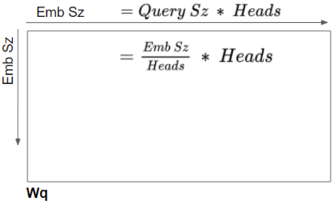
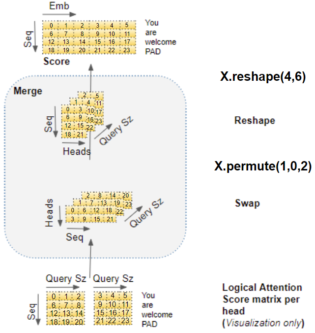

---
categories:
  - AI
  - 机器学习
  - 深度学习
tags:
  - AI
  - 机器学习
  - 深度学习
mathjax: true
title: 10. Transformer 原理
abbrlink: 3545351090
date: 2024-04-17 01:26:16
---

> [本文](https://mp.weixin.qq.com/s/UJmna6_ouNzq1oiGas2Amg) 翻译自 Ketan Doshi 博客中关于 Transformers Explained Visually 的系列文章
>
> - [Overview of Functionality](https://ketanhdoshi.github.io/Transformers-Overview/) ：*Components of the architecture, and behavior during Training and Inference*
> - [How it works, step-by-step](https://ketanhdoshi.github.io/Transformers-Arch/) ：*How data flows and what computations are performed, including matrix representations*
> - [Multi-head Attention](https://ketanhdoshi.github.io/Transformers-Attention/) ：*Inner workings of the Attention module throughout the Transformer*
> - [Why Attention Boosts Performance](https://ketanhdoshi.github.io/Transformers-Why/)：*How does Attention capture the relationships between words in a sentence* 
>
> http://fancyerii.github.io/2019/03/09/transformer-illustrated/

[TOC]

<!--more-->

## 10.1 架构及其训练、推理过程

Transformer是一种继MLP、CNN、RNN之后的深度学习模型，来自于 [Attention Is All You Need](https://arxiv.org/abs/1706.03762) 这篇论文，使用注意力机制最初是为了提高深度学习 NLP 翻译模型的性能

RNN是顺序执行的，$t$ 时刻的 `token` 处理完才能处理 $t+1$ 时刻的 `token` ，很难并行。

Transformer模型的 *Self-Attention* 机制和 *Position Encoding* 可以代替RNN

- **Self-Attention 机制允许模型并行处理输入序列的所有 `token`** ，更适合处理长序列

**Self-Attention** 的效果很好，在很多其他的地方也可以用Transformer模型：GPT和BERT都使用了Decoder部分，由于没有Encoder，所以Decoder只有 *Self-Attention* 层而没有 *Encoder-Decoder Attention* 层

### 10.1.1 Transformer架构

将模型视为一个黑盒，其输入是源序列（法语），输出是目标序列（英语）


模型内部采用 **Encoder-Decoder** 架构，分为 **编码器堆栈** (Encoder Stack) 和 **解码器堆栈** (Decoder Stack)


在 **Encoder Stack** 和 **Decoder Stack** 之前，都有各自的 **词嵌入层和位置编码层**

在 **Decoder Stack** 后，有一个输出层来生成最终的输出

- 输出层：$线性层\rightarrow Softmax层$ 


#### 编码器/解码器堆栈

编码器堆栈和解码器堆栈都由很多结构相同的 **Encoder块** 和 **Decoder块** 堆叠而成

每个 **Encoder 块** / **Decoder 块** 的结构相同


- 每个 **Encoder块** 由一个 *Self-Attention* 层和一个前馈层组成

- 每个 **Decoder块** 由一个 *Self-Attention* 层、一个 *Encoder-Decoder Attention* 层和一个前馈层组成

  *编码器-解码器注意力层* 使 **Decoder块** 在解码时会考虑最后一个 **Encoder块** 在时序窗口内每个时间步的输出

##### 块间的数据流

- Encoder块的输入是前一个Encoder块的输出，最底层Encoder的输入是原始的源输入序列
- Decoder块的输入是前一个Decoder的输出+Encoder最后一层的输出，最底层的Decoder块输入是原始的目标输入序列

首先获取原始字符类型的输入语料集词表，并将每个原始输入序列转换为数字索引序列，通过Embedding层将每个 `token` 转换为连续的稠密向量


Embedding之后的序列会输入 Encoder，经过Self-Attention层后再经过全连接层


在计算 $\mathbf{z}_t$ 时需要依赖序列中所有时刻的输入 $\mathbf{x}_1,\cdots,\mathbf{x}_T$ ，下图中用大 *Self-Attention* 方框表示矩阵运算

前馈层的计算完全独立，计算 $t$ 时刻的输出只需要 $\mathbf{z}_t$ 即可，所以可以并行计算。用 *前馈神经网络* 方框表示每个时刻输出的计算，但不同时刻的全连接层参数是共享的。

- 当前Encoder块的输出 $\mathbf{r}_1,\cdots,\mathbf{r}_n$ 直接输入给下一个Encoder块


#### 残差连接与归一化层

块内的 *Self-Attention* 层、前馈层 与 *Encoder-Decoder Attention* 层都有残差连接以及正则化层


同样，解码器也添加残差连接与批量归一化层


### 10.1.2 Self-Attention

Transformer 的突破性表现在于其对注意力的使用

#### 为什么需要注意力机制

如翻译 “The animal didn’t cross the street because it was too tired.” 此处的 "it" 指代的是什么，需要在理解 "it" 时同时关注所有的单词，且重点是 "animal" 和 "street" 和 "tired" 。结合"tired" 的先验知识，知道指代的是 "animal"。若 "tired" 变为 "narrow" 则指代的实 "street"

> 单向LSTM无法实现上述逻辑
>
> - 前向LSTM只对历史 `token` 的时序信息进行提取，在未看到 "tired" 时，并不能理解"it"的语义
> - 反向LSTM只看到 "tired" 也无发生对 "it" 的语义进行编码
>
> 多层双向LSTM可以编码 "it" 的语义，需要底层的LSTM同时编码了三个关注点的语义，然后用更高层的LSTM将 "it" 编码为 "animal" 的语义
>
> 
>
> 

在以下的英文句子中，ball 与 blue 、hold 密切相关。另一方面，boy 与 blue 没有关系。


Transformer模型将输入序列中的 `token` 与本序列中的其他 `token` 关联起来，形成 *Self-Attention* 

使用 **Self-Attention机制** 的Encoder在编码一个 `token` 时，会考虑序列的所有 `token` ，再确定对当前 `token` 进行编码。

#### 注意力分数

对于以下两个句子

- The *cat* drank the milk because **it** was hungry.
- The cat drank the *milk* because **it** was sweet.

第一个句子，**it** 指 *cat* ，第二个句子，**it** 指 *milk* 。Self-Attention 给了模型更多关于 **it** 意义的信息，这样 **it** 的语义能与正确词元关联起来

为了使模型能够处理 `token` 在不同序列中的语义，模型为每个 `token` 提供了多个注意力分数，颜色越重表示更高的注意力分数


在处理第一个序列中的 **it** 这个 `token` 时，第一个分数会突出 *cat* ，第二个分数会突出 *hungry* 。将会把 *cat* 和 *hungry* 的某些语义性质纳入到目标序列中


### 10.1.3 Transformer训练过程

**训练数据**

每条训练数据都包含两部分内容：

- 输入序列（源序列）
- 输出序列（目标序列）

**训练目标**

对训练数据中源序列和目标序列之间的序列规律进行学习。在推理（预测）过程中，给定源序列，根据学习到的序列规律，生成目标序列


1. 在送入第一个 **Encoder块** 前，源输入序列 `src_seq` 先经过 **Embedding层** ，并加入位置编码，产生词嵌入表示 `src_position_embed` 之后送入第一个 **Encoder块** 
2. 按 **Encoder Stack** 中 **Encoder 块** 的顺序对 *词嵌入表示*  进行处理，产生 **Encoders** 的输出 `enc_outputs` 
3. 在右侧的 **Decoder Stack** 中，目标输入序列 `tgt_seq` 首先加一个句首标记，被转换为（带位置编码）的词嵌入表示 `tgt_position_embed` ，送入第一个 **Decoder 块**
4. 按 **Decoder Stack** 中 **Decoder 块** 的顺序，将目标输入序列的词嵌入表示与 **Encoder Stack** 的输出 `enc_outputs` 一起处理，产生目标序列的解码表示 `dec_outputs`
5. 输出层将解码器输出转换为 `token` 概率和最终的输出序列 `out_seq`
6. 损失函数对输出序列 `out_seq` 与训练数据中的 `tgt_seq` 计算损失，这个损失的梯度用于反向传播中模型参数的更新

#### 强制教学


训练时，解码器输入的是真实的目标输入序列，这种方法称为强制教学

> 在训练时，若从Decoder上一个时间步的输出序列取最后一个 `token` 作为 Decoder 的输入进行下一个时间步的预测，损失函数将计算生成的序列与目标序列的损失。
>
> 但这种训练机制会造成误差累积，不仅会导致训练时间更长，而且会增加模型的训练难度

而向Decoder提供真实的目标序列，实际上给了Decoder一个提示，即使上一时刻预测错误，也可以用当前时刻正确的输入预测下一时刻，避免了误差累计。

另一个好处，**Decoder Stack并行地输出所有的 `token`** ，不需要循环，大大加快了训练速度

### 10.1.4 Transformer推理过程

**数据**

在推理过程中，数据只有源输入序列

**推理目标**

通过源输入序列产生目标序列

- Seq2Seq模型，**Decoder** 在一个时间步的完整循环中，生成当前时间步的输出 `token` ，并将其作为下一个时间步的输入 `token` ，直至生成序列结束标志。

Transformer在每个时间步，**Decoder 块** 输入直到当前时间步生成的整个输出序列


1. 在送入第一个 **Encoder块** 前，源输入序列 `src_seq` 先经过 **Embedding层** ，并加入位置编码，产生词嵌入表示 `src_position_embed` 之后送入第一个 **Encoder块** 

2. 按 **Encoder Stack** 中 **Encoder 块** 的顺序对 *词嵌入表示* 进行处理，产生 **Encoder Stack** 的输出 `enc_outputs` 

3. 在第一个时间步，使用只有一个序列开始词元的空序列代替训练过程中使用的目标序列。空序列转换为带位置编码的 `start_position_embeded` ，并被送入第一个 **Decoder 块** 

4. **Decoder Stack** 将空序列词嵌入表示 `start_position_embeded` 与 `enc_outputs` 一起处理，产生目标序列第一个 `token` 的编码表示 `step1_dec_outputs`

5. 输出层将 `step1_dec_outputs` 转换为词概率和第一个目标词元 `step1_tgt_token`

6. 将这一步产生的 `step1_tgt_token` 填入解码器输入序列第二个时间步的位置。

   在第二个时间步， **Decoder Stack** 的输入序列变为 `[<bos>,step1_tgt_token]` 

7. 将新的解码器输入序列输入 **Decoder Stack** ，取出第二个时间步位置的 `token` 并将其附加到解码器序列中，生成第三个时间步位置的 `step2_tgt_token` ，直至 `stepTs_tgt_token` 为序列结束标志 `<eos>`


### 10.1.5 Transformer为什么优于RNN


RNNs模型的限制

- 对于长序列中相距较远的 `token` ,RNN难以处理长距离依赖关系
- RNNs每个时间步处理序列的一个 `token` ，意味着完成 `T-1` 时间步的计算之前，无法进行 时间步 `T` 的计算。

CNNs所有的输出都可以并行计算，但不擅长处理长距离依赖关系

- 卷积层，只有输入数据的特征足够接近核提取的浅层特征才可以相互作用，对于与核表征的特征较远的高层特征，需要有更深层的网络

Transformer依赖 Attention 机制的优势：

- 并行地处理序列中所有的 `token` ，大大加快计算速度
- 输入序列中 `token` 之间的距离并不重要，擅长计算相邻 `token` 与相距远的 `token` 间的依赖关系

## 10.2 数据流

### 10.2.1 词嵌入层与位置编码（输入层）

输入层接收的输入形式是 `token` 被映射为词表中数字索引的序列

Transformer的输入层会提取 `token` 的两个信息：

- **Embedding** 层将该 `token` 的含义进行编码
- **Position Encoding** 层将该 `token` 在序列中的位置进行编码

在 **Encoder Stack** 和 **Decoder Stack** 底部各有一个 **Embedding** 层和 **Position Encoding** 层


#### 嵌入层(Embedding)


- 在 **Encoder Stack** 中，送入Embedding层的序列被转换为 *输入嵌入向量* `input_embed` 
- 在 **Decoder Stack** 中，目标序列右移一个位置（移除 `<eos>` 词元），在第一个位置插入 `<bos>` 词元后送入 Embedding 层，转换为 *输出嵌入* `ouput_embed`

Embedding 层将序列中每个数字索引的 `token` 映射为等长的 *embedding向量* ，

若语料集中所有词元组成的词表为 $\mathbf{VC}$ ，在 *embedding 层* 将词表映射到稠密空间 $\mathbf{E}=\mathbf{VC}\cdot \mathbf{W}_{EX}$ 。embed矩阵 $\mathbf{E}\in \mathbb{R}^{vocab\_size\times embed\_size}\iff \mathbb{R}^{\text{len(词表)}\times \text{len(embedding向量)}}$ 

即 **embedding 层将词元向量从离散的、高维的空间映射到连续的、低维的空间** 

词嵌入的核心思想 **词元的含义可以通过它们的上下文来定义** ，通过训练过程的迭代，语义相近的词元会被映射到稠密空间中相近的点

#### 位置编码层(Position Encoding)

> RNN 在循环过程中，每个 `token` 按顺序输入，因此隐含地知道 `token` 间的相对位置
>
> Transformer同一序列的所有 `token` 都是并行输入的，意味着位置信息会丢失，所以必须在输入层添加位置信息

位置编码的计算独立于输入序列，是只取决于 **序列的最大长度** 的固定值

位置编码层会为序列的每个位置生成独一无二的位置向量，进而为序列生成位置编码矩阵 $PE\in\mathbb{R}^{seq\_len\times d\_{model}}$ ，为模型提供每个 `token` 的位置信息


$$
PE_{pos, 2i}=\sin\left(\frac{pos}{10000^{\frac{2i}{d_{model}}}}\right)\\
PE_{pos, 2i+1}=\cos\left(\frac{pos}{10000^{\frac{2i}{d_{model}}}}\right)
$$

- $pos$ 表示当前 `token` 在输入序列中的位置，从 $0$ 开始，到 $\max\limits_j{\{seq_j\_size\}}-1$ 结束 

- $i$ 表示 *Position Encoding* 矩阵中的列，决定了每个 `token` 位置编码向量第 $i$ 维的值

  - 偶数列，使用正弦函数计算

  - 奇数列，使用余弦函数计算

- $d_{model}$ 是编码向量的长度，与 *embed向量* 长度相同

位置编码交织了一系列正弦曲线和余弦曲线，位置编码向量中，所有偶数索引使用正弦值，所有奇数索引使用余弦值

#### 批量数据

深度学习模型一次处理一个批量的训练样本。

首先通过词表将序列样本映射为数字索引序列，再通过裁剪与填充将一个批量的样本预处理为等长的批量数字索引矩阵


嵌入层和位置编码层对一批序列样本的数字索引矩阵进行运算。

- 嵌入层的输入是 $(batch\_size,seq\_len)$ 的批量化数字索引序列矩阵
- 嵌入层将每个数字索引 `token` 编码为一个 `embed` 向量，一个数字索引序列的词嵌入矩阵形状为 $(seq\_len,embed\_size)$ 
- 输出一个批量的词嵌入矩阵， $(batch\_size,seq\_len,embed\_size)$ 的张量

位置编码层的列数与 $embed\_size$ 相等

- 位置编码层的输入是 $(batch\_size,seq\_len)$ 的批量化数字索引序列矩阵
- 位置编码层为每个序列的每个位置生成位置编码向量，一个序列数据的位置编码矩阵形状为 $(seq\_len,embed\_size)$
- 输出是 $(batch\_size,seq\_len,embed\_size)$ 的张量


#### 输入层的输出

把这个Positional Encoding与embedding的值相加，作为输入送到下一层。


### 10.2.2 编码器

**Encoder Stack** 通常由多个 **Encoder 块** 组成，按顺序连接


编码器堆栈第一个 **Encoder 块** 从输入层接收 `src_position_embed` 作为输入。

堆栈中其他 **Encoder 块** 将前一个编码器的输出 `enc1_outputs` 作为其输入

在每个 **Encoder 块** 内将输入传入当前编码器的 *Self-Attention* 层，*Self-Attention* 层的输出被传入 *前馈层* ，然后将其作为 **Encoder 块** 的输出 `enc2_outputs`，并被送入下一  **Encoder 块**

- 自注意力层和前馈层都会接入一个残差连接，各层之后有一个正则化层

基于位置的前馈网络由一个线性层、激活函数和另一个线性层组成，这个前馈网络不会改变输入的形状

- 输入形状为 $(batch\_size,seq\_len,embed\_size)$ 的 $\mathbf{X}$ 被两层MLP转换为 $(batch\_size,seq\_len,ffn\_num\_ouputs)$ 的输出张量

  ```python
  class PositionWiseFFN(nn.Module):
      """基于位置的前馈网络"""
      def __init__(self,ffn_num_inputs, ffn_num_hiddens, ffn_num_outputs, **kwargs):
          super().__init__(**kwargs)
          self.dense1 = nn.Linear((ffn_num_inputs, ffn_num_hiddens))
          self.relu = nn.ReLU()
          self.dense2 = nn.Linear((ffn_num_hiddens, ffn_num_outputs))
          
      def forward(self, X):
          return self.dense2(self.relu(self.dense1(X)))
  ```

**Encoder Stack** 中最后一个 **Encoder 块** 的输出，会送入 **Decoder Stack** 的第一个 **Decoder 块**

### 10.2.3 解码器

**Decoder Stack** 通常由多个 **Decoder 块** 组成，按顺序连接


解码器堆栈第一个 **Decoder 块** 从输入层接收真实的 `tgt_position_embed` 作为输入。堆栈中其他 **Decoder 块** 从前一个解码器接收他们的输入

对于一个 **Decoder 块** 

- 输入首先进入 *Self_Attention* 层，这一层的运行方式与编码器 *Self_Attention* 层有区别：

  - 训练过程，解码器的自注意力层接收整个真实的输出序列，但为了避免生成当前时间步输出看到未来时间步的数据，使用 **掩码机制** ，在生成第 $t$ 个时间步的输出时，模型只能看到第 $1$ 到第 $t-1$ 个时间步的 `token` 序列

  - 推理过程，每个时间步的输入，是到当前时间步的整个输出序列，也是从第 $1$ 到第 $t-1$ 个时间步的 `token` 序列


- **Encoder-Decoder Attention** 层，工作方式与 *Self-Attention* 层类似，只是其输入来源有两处：自注意力层的输出以及编码器输出 `enc6_outputs` ；其输出被传入前馈层

自注意力层、编码器-解码器注意力层和前馈层都会接入一个残差连接，各层之后都有一个正则化层

整个 **Decoder 块** 的输出为 `dec1_outputs` ，送入下一 **Decoder 块**

### 10.2.4 输出层

**Decoder Stack** 中的最后一个 **Decoder 块** ，将其输出传递到输出层，输出层将其转换为最终的目标序列


线性层是一个简单的全连接神经网络，将最后一个 **Decoder 块** 的输出映射到单词分数向量中，

目标词表中的每个 `token` 在序列中的每个位置都有一个的置信度

- 若词表有 $V$ 个单词，目标序列有效长度为 $T$ ，则会生成 $T$ 个 $V$ 维的向量

  第 $t$ 个向量的第 $j$ 个值表示词表中数字索引为 $j$ 的 `token` 出现在生成序列的第 $t$ 个位置的置信度

softmax层将这些置信度变为概率值，在每个位置找到概率最高的值，将其索引转换为目标词表中相应的词元，构成模型的输出序列


### 10.2.5 训练与损失函数

使用交叉熵作为损失函数，比较生成的输出序列概率分布和真实的目标序列。

生成的输出序列概率分布给出了真实序列中每个位置的真实 `token` 出现的概率


如：目标序列长度为4，在真实序列中，第一个位置的 `token="De"` ，出现在该位置的概率 $p_r=1$ 

而在生成序列中，该 `token` 出现的概率为 $p_g$ 

通过计算二者交叉熵损失的梯度，可以反向传播来更新参数训练模型

---

如：真实的句子为 "I am a student <eos>"


在足够大的数据集上训练模型足够长时间后，生成的概率分布如下


由于模型一次产生一个输出，因此我们可以假设模型从该概率分布中选择概率最高的单词，并丢弃其余的单词。这是一种方法（称为贪婪解码）。

另一种方法是保留最上面的两个单词（例如“I”和“a”），然后在下一步中运行模型两次：一次假设第一个输出位置是单词“I”，另一次假设第一个输出位置是单词“a”，并且考虑到位置#1和#2，保留产生较少错误的版本。我们对位置 #2 和 #3 等重复此操作。这种方法称为“束搜索”，在我们的示例中，beam_size 为 2（意味着在任何时候，内存中都会保存两个部分假设（未完成的翻译）），top_beams 也是 2（意味着我们将返回两个翻译） ）

这些都是可以试验的超参数

## 10.3 编码器/解码器的块内计算

### 10.3.1 注意力层的计算

**Attention** 被用在三个地方


- 编码器的 *Self-Attention* 层：源序列对自身的注意力分数计算
- 解码器的 *Self-Attention* 层：目标序列对自身的注意力分数计算
- 解码器的 *Encoder-Decoder Attention* 层：目标序列对源序列的注意力分数计算

#### 注意力层的输入

序列数据经过 **Embedding** 层和 **Position Encoding** 层后，编码器输入数据 `position_embed` 向量的形状为 $(batch\_size,seq\_len,embed\_size)$ ，包含了输入序列的位置信息和序列中每个 `token` 的语义信息。


##### 编码器层

在 **Encoder 块** 中的 *Self-Attention* 层，输入被复制三份作为 `Query` ，`Key` ，`Value` 线性层的输入，与各线性层的参数矩阵相乘，产生 QKV 矩阵，融合后生成 *Self-Attention* 层的输出


- 每个 **Encoder 块** 的输出包含了本编码器的 *Self-Attention* 层对序列中每个 `token` 的注意力分数。

- 当依次通过 **Encoder Stack** 的所有编码器时，每个 *Self-Attention* 层将自己的注意力分数添加到本层的输出张量中。

##### 解码器


在 **Decoder 块** 的 *Self-Attention* 层，通过相同的方式得到 `Query` ，`Key` ，`Value` 线性层的输入，转换为QKV矩阵后，通过正则化层，送至 *Encoder-Decoder Attention* 层。

- *Self-Attention* 层为目标序列中的每个 `token` 生成编码表示，包含了本层对每个 `token` 的注意力分数。

*Encoder-Decoder Attention* 层，将编码器的最后输出 `enc6_outputs` 作为 `Key` 和 `Value` 矩阵线性层的输入，**Decoder 块** 的输入序列在通过 *Self-Attention* 层和 正则化层之后作为 `Query` 矩阵线性层的输入。即 *Encoder-Decoder Attention* 层同时获得目标序列的表示（来自解码器的 *Self-Attention* 层）和源序列的表征（来自编码器堆栈）

- *Encoder-Decoder Attention* 层为每个目标序列的 `token` 生成注意力分数，也包含了源序列中注意力分数的影响。
- 当它通过堆栈中的所有解码器时，每个 *Self-Attention* 层和 *Encoder-Decoder Attention* 层会将自己的注意力分数添加到每个 `token` 的输出中

#### 注意力层的线性层

`Query` 、`Key`、`Value` 实际上是三个独立的线性层，每个线性层都有自己的权重参数，输入数据分别与三个线性层参数相乘，产生QKV三个矩阵


#### 多头注意力(Multi-head Attention)

在 Transformer 中，注意力模块并行重复多次计算，每个并行计算单元被称为 **注意力头** 。

注意力模块将输入参数：查询(query)，键(key)，值(value) 的参数矩阵进行 $N$ 种拆分（相当于CNN中的N个通道）并通过独立的注意力头传递每种拆分，**每种拆分关注不同的上下文**。最后，将所有注意力计算组合在一起，产生最终的注意力分数。从而捕捉 `token` 间的联系与差异


##### 超参数

- `embed_size` ：嵌入层向量的大小
- `Query_size=Key_size=Value_size` ：查询/键/值向量的长度，是用于产生QKV矩阵的三个线性层权重的长度
- `n_heads` ：注意力头个数

##### 1. 通过注意力头拆分注意力层数据

不同时序特征的上下文被拆分到多个注意力头中，每个注意力头都能独立地处理相应的数据

- 数据只是 **逻辑** 上的拆分，对于QKV矩阵而言，并没有真正的划分为多个部分给每个注意力头
- 逻辑上，每个注意力头提取QKV矩阵的一部分时序特征。各注意力头共用线性层，没有单独的线性层，不同的注意力头在独属于各自的逻辑部分操作

对数据的拆分分为两个步骤：

**1. 线性层权重矩阵 $\mathbf{W}_{Q,K,V}$ 的拆分**

线性层的逻辑分割，是通过将输入数据与线性层权重均匀地划分到各注意力头完成。
$$
query\_size=\frac{embed\_size}{n\_heads}
$$


可以认为线性层权重矩阵是各个注意力头的独立权重矩阵堆叠在一起的


因此，在代码中定义 $\mathbf{W}_Q,\mathbf{W}_K,\mathbf{W}_V$ 时，可以定义为

```python
self.W_Q = nn.Linear(embedding_size, Query_size * n_heads, bias=False) 
self.W_K = nn.Linear(embedding_size, Key_size * n_heads, bias=False)
self.W_V = nn.Linear(embedding_size, Value_size * n_heads, bias=False)
```

所有注意力头的计算可通过一个矩阵操作实现，而不是 $N$ 个单独的计算，同时保持模型简单：所需线性层更少，同时获得了多头注意力的效果。

线性层输入 $\mathbf{X}\in \mathbb{R}^{B\times T\times E}$ ，参数矩阵为 $\mathbf{W}\in \mathbb{R}^{B\times E\times (Q\_size\times N\_heads)}\iff \mathbb{R}^{B\times E\times E}$ ，所以线性层的维度并未发生变化，输出为QKV矩阵， $\mathbf{Q},\mathbf{K},\mathbf{V}\in \mathbb{R}^{B\times T\times E}$ 

**2. 重塑QKV矩阵形状**

> 经过线性层输出的QKV矩阵需要经过 `Reshape` 操作，以产生一个 Head 维度。这样每个切片对应一个注意力头的输出矩阵


对于批量中一个序列的Q矩阵 $[\mathbf{Q}]_i\in \mathbb{R}^{T\times E}\iff \mathbb{R}^{T\times (N\_heads\times Query\_size )}$ ，可以将其拆分为 $(T, N\_heads, Query\_size )$ ，再交换 Head 维和 T 维，得到 $[\mathbf{Q}]_i\in \mathbb{R}^{N\_heads\times T\times Query\_size}\Rightarrow \mathbf{Q}\in \mathbb{R}^{B\times N\_heads\times T\times Query\_size}$ 


即上图所示的操作，对应 $\mathbf{Q},\mathbf{K},\mathbf{V}$ 矩阵，在逻辑对 $embed$ 轴拆分为 $N\_heads$ 个小矩阵，经过变形和轴交换操作后，实际上形成的 $[\mathbf{H}]_0$ 与 $[\mathbf{H}]_1$ 就是沿 `embed` 轴 $N\_heads$ 等分 

- $[\mathbf{H}]_{0,1,:}=[\mathbf{Q}]_{1,0:3}=\{6,7,8\}$ ：表示第 $2$ 个 `token` 在第 $1$ 个注意力头中的Q阵表示
- $[\mathbf{H}]_{1,1,:}=[\mathbf{Q}]_{1,3:6}=\{9,10,11\}$：表示第 $2$ 个 `token` 在第 $2$ 个注意力头中的Q阵表示
- $[\mathbf{H}]_{0,:,:}=[\mathbf{Q}]_{:,0,:}=\begin{bmatrix}0&1&2\\6&7&8\\12&13&14\\18&19&20\end{bmatrix}$ ：表示一个序列的数据在第 $1$ 个注意力头的Q阵表示

###### 数据维度

$\mathbf{Q},\mathbf{K},\mathbf{V}\in \mathbb{R}^{B\times T\times E}\iff\mathbb{R}^{B\times T\times (N\times Q\_size)}$ ，对QKV矩阵逻辑拆分为多个注意力头 $\mathbf{H}_{0:N}\in \mathbb{R}^{B\times T\times Q\_{size}}$ 


##### 2. 为每个注意力头计算注意力分数

通过对QKV矩阵的拆分，每个注意力头都有了自己的QKV矩阵，通过这些矩阵，计算注意力分数

在一个注意力头中对一个 `token` 的注意力分数计算步骤为：

1. 对该 `token` 的QK矩阵进行内积

   

2. 用掩码掩盖填充值，让其不参与注意力分数的计算

   

3. 对结果按 $Q\_size$ 大小进行缩放，再应用 *softmax* 

   

    $\sqrt{Query\_size}$ ：使训练过程中梯度更稳定To help stabilize gradients during training

   - 让注意力权重更加平滑，避免因某个超大值对其他词元的权重造成影响
   - $Query\_size$ 是词向量/隐藏层的维度，可以使 $\mathbf{Q}\cdot \mathbf{K}$ 符合 $\mathcal{N}(0,1)$ 分布，类似于归一化

4. *softmax* 结果与 $V$ 阵相乘

   

在一个注意头中，对一个 `token` 注意力分数的完整计算计算过程为：


QKV的值是对序列中每个 `token` 的编码表示

注意力计算将每个 `token` 与序列中其他 `token` 关联起来，这样注意力分数就为序列的每个 `token` 编码了一个分数

每个注意力头对一个批量序列的注意力分数计算的输出形状为 $(Batch\_size,N\_heads,T,Query\_size)$ 

##### 3. 融合多头注意力分数

对于一个批量的序列数据，每个注意力头都有单独的注意力分数，需要将其合并为一个分数。实质上与分割操作相反，通过 `reshape` 消除 `N` 维度来完成

**1. 交换Head维与Seq维** 

注意力分数矩阵的形状从 $(Batch\_size,N\_heads,T,Query\_size)$ 变为 $(Batch\_size,T,N\_heads,Query\_size)$

**2. 对注意力得分矩阵reshape，将 Head维合并入embed维** 

将每个注意力头的得分拼接为一个注意力得分



##### 多头注意力整体计算流程


###### 注意力掩码(Attention Masks)

在计算注意力分数时，Attention模块应用了一个掩码操作

- 在 **Encoder 块** 中的 *Self-Attention* 层和 **Decoder 块** 中的 *Encoder-Decoder Attention* 层中：在输入序列 `<pad>` 对应的位置，将输出的注意力分数归零，确保 `<pad>` 不会对自注意力产生影响

  

- 在 **Decoder 块** 中的 *Self-Attention* 层：防止解码器在当前时间步预测时，“偷看”目标序列后续时间步

  解码器处理源输入序列 `src_seq` 中的 `token` ，并利用它们来预测目标序列 `tgt_src` 中的 `token` 

  训练期间，这个过程通过 **强制教学** 的方式进行，完整的真实目标序列被作为解码器的输入，因此，在预测第 $t$ 个时间步的 `token` 时，解码器可以使用目标序列中该 `token` 之前序列中的词元，但不能使用该 `token` 及后续的词，所以需要通过掩码操作来防止“作弊”

  

  此时，掩码操作变为

  

当计算注意力分数(Attention Score) 时，在 *softmax* 计算之前做掩码操作，被屏蔽的元素设为负无穷大 ，在 *softmax* 时会将这些值变为0

###### 多头分割可以捕获更丰富的语义特征

一个 *embed 向量* 包含了一个 `token` 的语义与位置信息，在多头注意力机制下，输入序列(目标序列)的嵌入 `position_embed` 向量被拆分为多个头，意味着，**嵌入向量的不同部分可以表征每个词元在不同方面的含义，而每个词元在某个序列中的具体含义与序列中其他词元有关** 

如嵌入向量某一部分可以捕获一个名词的词性，另一部分捕获名词的单复数，在翻译中，谓语时态的使用与这些因素有关。

###### 编码器与解码器自注意力层捕获信息的差异

- **Encoder 块** 中的 *Self-Attention* 层：计算源输入序列中，每个 `token` 与其他 `token` 之间的相互作用
- **Decoder 块** 中的 *Self-Attention* 层：计算目标输入序列中，每个 `token` 与其他目标 `token` 之间的相互作用
- *Encoder-Decoder Attention* 层：计算源输入序列中每个 `token` 与目标输入序列中每个 `token` 之间的相互作用

### 10.3.2 前馈层压缩注意力得分

简单地将多头注意力得分矩阵 $\mathbf{Z}_n$ 进行拼接，这样的特征有点多，所以Transformer又用了一个线性变换 $\mathbf{W}_o$ 将其进行压缩


### 10.3.3 归一化层

> https://www.zhihu.com/tardis/bd/ans/3094052709?source_id=1001

归一化，能减少数值不稳定性，避免梯度消失或爆炸，使模型收敛更快

**BatchNorm将不同样本相同维度的特征处理为相同的分布**，针对同一特征，以跨样本的方式开展归一化，因此不会破坏不同样本同一特征之间的关系（在“身高体重”的例子中，这就意味着“归一化前是高个儿的归一化后仍然是高个儿，归一化前胖的归一化后也不会变瘦”）。即归一化之后，样本之间仍有可比性


对于一个NLP模型，一个批次的输入包括 $B$ 个独立的句子，每个句子又由不定长度的词元构成，句子中的每个词元又被表达为一个定长的嵌入向量。批量中，最长的句子有 $T$ 个词元，则 $d_{model}=T$ 


批量正则化需要一个批量的数据，且不适用于RNN任务。

- 无法计算，句子中某些位置是填充词元
- 没有意义，归一化的目的是使具有相同性质的特征转化为标准正态分布，但不同句子相同位置并不是具有相同性质的特征，即同一词元不一定位于不同句子的同一位置

同一个词元在不同序列中有不同含义，在一个序列中的具体含义是与序列中其他词元比较出来的，所以我们需要保持在同一序列中词元之间的可比性

Transformer使用了 Layer Norm，是对每个样本不同特征的归一化。**相当于找到序列的语义中心**，把序列中所有词元都聚集在这个中心周围，而一个序列中词元之间的比较关系并不会被破坏。

> 假设输入一个批量的数据 $\mathbf{X}\in \mathbb{R}^{3\times 6}$ 
>
> BatchNorm会对6个特征维度计算出6个均值和方差，然后用均值和方差进行归一化
> $$
> \mu_j=\frac{1}{3}\sum\limits_{i=1}^3[\mathbf{X}]_{ij}\quad,j=1,\cdots,6\\
> \sigma^2_j=\frac{1}{3}\sum\limits_{i=1}^3\left([\mathbf{X}]_{i,j}-\mu_j\right)^2\\
> [\hat{\mathbf{X}}]_{ij}=\frac{[\mathbf{X}]_{ij}-\mu_j}{\sqrt{\sigma^2_j+\epsilon}}，i=1,\cdots,3
> $$
> LayerNorm是分别对3个样本的6个特征求均值和方差得到3个均值和方差，然后进行归一化
> $$
> \mu_i=\frac{1}{6}\sum\limits_{j=1}^6[\mathbf{X}]_{ij}\quad,i=1,\cdots,3\\
> \sigma^2_i=\frac{1}{6}\sum\limits_{j=1}^6\left([\mathbf{X}]_{ij}-\mu_i\right)^2\\
> [\hat{\mathbf{X}}]_{ij}=\frac{[\mathbf{X}]_{ij}-\mu_i}{\sqrt{\sigma^2_j+\epsilon}}，j=1,\cdots,6
> $$

## 10.4 注意力原理

重点关注注意力层对序列中每个词元的操作，可以清楚地理解每个词元与其他词元的相互作用

### 10.4.1 数据的转换过程

假设处理英语序列到西班牙语序列的翻译任务，源序列是 "The ball is blue" ，目标序列是 "La bola es azul" ，通过词表，将源序列与目标序列转换为数字索引序列


1. 数字索引源序列 $\mathbf{X}$ 首先经过嵌入层和位置编码层，为序列中每个词元生成叠加了位置编码的嵌入向量，随后被传入 **Encoder Stack** ，在其中的注意力层进行转换

2. 在注意力层，嵌入向量序列分别通过Query、Key、Value三个线性层，产生三个独立的QKV矩阵。
3. 通过多头注意力机制，叠加当前注意力层的注意力分数

忽略嵌入向量维度，转换过程如下图，这些转换过程都是可以学习的


QKV矩阵在逻辑上被拆分到各注意力头，注意力头中的每一行表示该注意力头对该行 `token` 的关注部分

### 10.4.2 注意力得分


在一个注意力头的 *Atten Score* 模块，对QKV矩阵的计算为
$$
\mathbf{Z}=softmax\left(\frac{\mathbf{Q}\cdot\mathbf{K}}{\sqrt{Query\_size}}\right)\mathbf{V}
$$

1. 首先，$\mathbf{Q}\cdot \mathbf{K}$ 的内积产生一个中间矩阵，即 **权重矩阵** 。矩阵中每个元素都表示QK中所有 `token` 间的关系

   

   - $[\mathbf{Q}]_i[\mathbf{K}]_j^{\mathsf{T}}$ 即Query中的第 $i$ 个 `token` 与Key中第 $j$ 个 `token` 的内积，可表示二者间的关系

   - 权重矩阵第四行的每一列都对应 $[\mathbf{Q}]_4$ 向量与 $\mathbf{K}$ 中每个向量的内积

     权重矩阵第二列对应 $\mathbf{Q}$ 中每个向量与 $[\mathbf{K}]_2$ 向量的内积

     

2. 然后，权重矩阵与 $\mathbf{V}$ 矩阵相乘，产生注意力分数向量 $\mathbf{Z}$ ——*Atten Score* 模块的输出

   

一个词元的注意力得分 $[\mathbf{Z}]_i$ 可理解为注意力层对该词元编码的表示向量

编码值是对V矩阵中每个词元的值向量 $[\mathbf{V}]_j$ 加权求和得到，权重是权重矩阵中相应的注意力权重


某个词元值向量 $[\mathbf{V}]_j$ 的注意力权重由查询向量 $[\mathbf{Q}]_i$ 与该词元的键向量 $[\mathbf{K}]_j$ 内积得到，也就是 $[\mathbf{Q}]_i$ 与 $[\mathbf{K}]_j$ 的关系大小作为该词元的注意力权重

#### QKV在注意力层中的作用

$\mathbf{Q}$ 矩阵中每个查询行向量 $[\mathbf{Q}]_i$ 都是该注意力层待编码的 `token` ，为了编码当前的词元，需要去观察其他的词元（本序列与目标序列）。$\mathbf{K}$ 中的每个行向量表示匹配序列中候选词元被用于检索的信息，$\mathbf{V}$ 中相应的行向量是该候选词元真正的信息。

通过注意力得分层计算出的注意力分数矩阵，是 Query 矩阵表示的序列中每个 `token` 对 Key与Value 矩阵表示序列中每个 `token` 的注意力分数（即Q序列中token对K序列中token的关注度）


对于 "The ball is blue "这个句子，单词 "blue "这一行包含 "blue "与其他每个单词的注意力分数

#### 内积的作用

对于两个向量，内积可以表示二者的关系

- 若内积为0，表示二者正交，表示二者无关
- 若内积大于0，表示二者正相关，且夹角越小，内积越大，表示二者越接近
- 若内积小于0，表示二者负相关，且夹角越大，内积越小，表示二者越远离

#### 通过注意力机制学习词元间的相关性

使用 embed 层对词元编码，若两个词元语义相近，则编码后的嵌入向量应该也是相似的，至少二者方向一致，即成锐角。对两个词元的嵌入向量求内积，会得到正值，且相关性越大，会得到更大的内积值。相应的注意力权重就越高，进而查询向量对该向量的注意力分数就越高。

而两个不相关的词元，注意力分数就会越低。

要做到这一点，需要相关词元向量一致，无关词向量有分歧。而词向量是根据嵌入层和线性层的权重生成。

因此，引入嵌入层与Query、Key、Value三个线性层，为注意力模块提供更多的参数，使得模型可以通过学习嵌入层与线性层的参数矩阵权重来调整嵌入词向量

- 在训练过程中，每个epoch，模型会根据损失函数计算真实输出与预测输出之间的差异，通过梯度反传更新QKV线性层与嵌入层的权重，进而减小每一层的差异。最后传导至嵌入层，通过调整嵌入层权重调整输出的嵌入向量间的相关性，更好地将输入词元向量映射到稠密的向量空间

所以，在一个注意力层，注意力模块实现对序列的编码，层内前馈接层学习词元间的非线性关系，残差连接学习词元间的线性关系

## 超参数

### 序列数据

同一个任务产生的序列数据集中的序列数据通常具有一些共性特征，这些特征反映了该任务的特点和需求。以下是一些可能的共性特征：

1. **任务特定的模式和结构**：序列数据集可能会遵循特定任务的语法结构或数据格式。例如，在文本分类任务中，不同的文本可能包含不同的标签；时间序列数据可以是按时间顺序排列的数值序列等。

   数据分布：序列数据集中的序列可能会展现出特定的分布特征，例如，某些类别的序列数据可能比其他类别更常见，或者某些模式在数据集中更普遍。

2. **语义相关性**：同一个任务产生的序列数据可能在语义上有相似之处，即使它们的表达方式和细节不同，它们可能仍然表达相似的概念、观点或信息。

3. **上下文依赖性**：在处理序列数据时，上下文信息对于理解序列的含义至关重要。例如，在对话系统中，对话的历史信息对于理解当前轮次的回复至关重要。

4. **词元共现性**：同一个任务产生的序列数据中可能包含相似的词汇或短语，这些词汇或短语在语义上可能相关，并在不同序列数据中共同出现。

5. **噪声和错误**：在实际的数据集中，可能会包含一些噪声或错误，这些也需要模型在训练过程中学习如何处理。

### embedding层

Transformer将某个词元的特征向量通过embedding层映射为连续向量空间中的embedding向量，这个映射通过可学习的参数实现。

在训练过程中，模型参数的更新通过对网络输出的误差进行反向传播完成，每个训练步骤中，模型会根据当前的参数生成预测，然后计算预测值与真实值的损失，这个误差会被逐层反向传播回去（包括嵌入层）。通过计算损失函数对模型参数的梯度，根据优化算法（如随机梯度下降、Adam 等） 更新模型参数。

因此，嵌入层的参数会随着训练过程适当地调整，以使模型更好的理解和处理数据。这也意味着模型在训练过程中会学习到更好的词表示，使得输入的嵌入向量更能有效地表达输入序列的语义和特征。

在推理过程中，不会再变

#### embedding向量长度

embedding向量的长度决定了模型能够捕捉到的信息量及模型的泛化能力

学习 Embedding：

- **预训练方法**：常见的预训练Embedding模型有Word2Vec（包括CBOW和Skip-gram）、GloVe和FastText等。这些模型通过无监督学习（基于上下文窗口的预测任务）从大量文本数据中学习词向量。
- **端到端学习**：在深度学习模型（如神经网络、Transformer等）中，Embedding层作为模型的一部分，其参数（即嵌入矩阵）与其他模型参数一起在有监督学习任务（如文本分类、机器翻译等）中进行端到端训练。
- **微调（Fine-tuning）**：对于预训练的通用Embedding，可以在特定任务上进行微调，使其更好地适应特定领域的语义特性。

embedding向量长度的选择准则：

- 训练集大小和复杂度

  较大的训练集往往需要更高的维度来捕捉数据中的独特性和复杂性

  如果训练集中包含了丰富的多样性，那么较长的向量长度也是必要的来表征这种多样性

- 任务性质

  不同的任务，如分类、回归或生成任务，对embedding向量长度的需求也不同

- 模型架构

  深层网络通常能够处理更复杂的表示，因此可能需要更长的向量长度来满足网络的学习能力。

- 预期性能

  在追求高性能的情况下，可能会选择更长的向量长度来提高模型的表达能力

- 理论分析

  向量维度与训练集中词表大小有关。

  根据 [1](https://kexue.fm/archives/7695/comment-page-1) 中的理论，若词表大小为 $V$ ，则embedding向量的维度 $E> 8.33\log V$ ，意味着对于包含10000个词的语料库，理论上需要的向量维度至少为96；如果要容纳500万个词，那么大概就是128

- 实践经验

  常用的embedding向量维度有64、100、128、256、300等，实际上不同的维度之间效果差别其实也没多少

- 特征匹配

  根据特定特征的规模来调整embedding向量长度。[2](https://zhuanlan.zhihu.com/p/431398377) 不同的特征可能需要不同的向量长度来最佳地表示其数据

- 模型训练过程中的变化

  在模型训练过程中，embedding向量的长度可能会变。初始阶段需要较短的向量长度避免过拟合，随着训练进行，可能会增加向量长度改善模型性能

### 注意力机制理解

#### 现象：词元的语义关联性

当一句话中有 "eat" 这个单词时，这个句子很可能与食物、餐饮或饮食习惯有关，因为 "eat" 对这句话的语义贡献很大，再多看几个关键单词，就能确定这句话整体要表达的意思。即 **一句话的语义由句子中几个关键单词的依赖关系决定，句中其他单词会与句子的语义相近**。不同句子虽然表达不同语义，但 **表达同一语义的单词具有语义关联性和共现性** 

- 统计模型中：语义关联性通过单词共同出现的条件概率 $p(w_T\vert w_1,\cdots,w_{T-1})$ 来捕捉

- RNNs中：每个 `token` 的语义会被记录到一个上下文隐变量中，`token` 的语义会随着隐变量逐渐向后传递，在传递过程中语义信息会不断累积并压缩在隐变量中，导致前面 `token` 的影响会逐渐减弱。但实际情况是，关键 `token` 对序列中其他 `token` 的语义起到决定性作用，虽然LSTM和GRU能改善这种情况，但未彻底解决

  

- Transformer模型中：这种语义关联性是通过模型在学习过程中自动捕捉的，模型学习到单词之间的依赖关系，并将这些知识编码到模型的参数中。因此，当模型生成或处理文本时，它会倾向于生成或处理与当前上下文语义相关的单词。

  - 结合位置编码，使得Transformer对各输入词元的预测输出能够并行计算

    


#### Transformer中的注意力机制理解

> 人类在处理信息时，会关注于当前任务最相关的信息而忽略不相关信息
>
> 注意力机制模拟这种行为，使模型在处理序列数据时，更加关注对当前任务更为重要的部分，同时忽略不相关信息。

注意力机制是一种语义表征方式，通过词向量之间的点积来表达单词之间的依赖关系

在Transformer中，用一个注意力头表示一个语义空间，语义空间的数量是可以通过超参数 $N\_heads$ 设置的。

- 为序列中每个词元计算 $\mathbf{Q},\mathbf{K},\mathbf{V}$ 三个矩阵，相当于获取每个词元在各个语义空间下的各个语义变体

$$
\begin{bmatrix}
[\mathbf{V}]_{1,j}\\
[\mathbf{V}]_{2,j}\\
\vdots\\
[\mathbf{V}]_{T,j}
\end{bmatrix}
$$


在第 $j$ 个注意力头中， $[\mathbf{V}]_{:,j:j+Q\_size}=\begin{bmatrix}
[\mathbf{V}]_{1,j}\\
[\mathbf{V}]_{2,j}\\
\vdots\\
[\mathbf{V}]_{T,j}
\end{bmatrix}$ 表示序列中每个词元在第 $j$ 个语义空间中语义变体的信息，$[\mathbf{Q}]_{:,j:j+Q\_size}=\begin{bmatrix}
[\mathbf{Q}]_{1,j}\\
[\mathbf{Q}]_{2,j}\\
\vdots\\
[\mathbf{Q}]_{T,j}
\end{bmatrix}$ 与 $[\mathbf{K}]_{:,j:j+Q\_size}=\begin{bmatrix}
[\mathbf{K}]_{1,j}\\
[\mathbf{K}]_{2,j}\\
\vdots\\
[\mathbf{K}]_{T,j}
\end{bmatrix}$ 是该语义空间下查询词与被查询词的匹配信息

$[\mathbf{Q}]_{m,j}\triangleq\mathbf{q}_j$ 表示在查询词元向量的第 $j$ 个语义空间（ $[\mathbf{Q}]_m$ 的一个语义变体），$[\mathbf{K}]_{n,j}\triangleq\mathbf{k}_j$ 表示第 $n$ 个词元向量在第 $j$ 个语义空间下的被查询向量，二者用于匹配

- $\left(\mathbf{q}_j,\mathbf{k}_j\right)$ 代表了在第 $j$ 个语义空间下查询词 $\mathbf{q}_j$ 与 $\mathbf{k}_j$ 间的相关性。$\left(\mathbf{q}_j,\mathbf{k}_j\right)\times \mathbf{v}_j$ 代表了 $\mathbf{v}_j$ 这个语义在查询词 $\mathbf{q}_j$ 这个语义空间中的加权信息量，也就是 $\mathbf{v}_j$ 这个语义对 $\mathbf{q}_j$ 这个语义的重要性
- 将单注意力头拼接为多头注意力，就能得到第 $n$ 个词元向量 $[\mathbf{V}]_n$ 的多个语义变体在 $[\mathbf{Q}]_m$ 的多个语义空间下的加权语义信息


因此，在一个多头注意力中，$(\mathbf{Q}\cdot \mathbf{K})*\mathbf{V}$ 能得到V序列中每个词元的多个语义变体在Q序列中每个词元的多个语义空间下的加权语义信息


进一步将多头注意力堆叠，能表达更复杂语境和语义变化


#### Transformer的参数学习

在Transformer架构中，序列数据中的词元依赖性知识被编码为一组模型参数，这些参数通过训练过程得到优化。具体来说，编码器和解码器多层结构中的权重集合，这些权重通过自注意力机制和前馈神经网络捕获输入序列中的长距离依赖关系。因此，模型的参数化决定了其在处理序列数据时的能力和性能。

在传统序列模型RNNs中，每个时间步的权重都是相同的；注意力机制使得模型可以为每个时间步动态分配权重。

- 上下文敏感性：在处理每个 `token` 时，考虑该 `token` 与当前序列的上下文关系，调整对序列中不同 `token` 的权重，进而捕获到序列中的局部和全局依赖关系 
- 动态分配权重：注意力机制通过学习到的权重集合来编码序列中词元之间的依赖性，这些权重在处理每个序列位置时与当前的上下文信息相结合，以动态地确定每个输入词元对输出表示的贡献
  - 在计算注意力得分和加权求和时为每个词元动态分配权重，使与当前任务高度相关的 `token` 在计算最终的输出表示时更加突出

在Transformer模型的训练过程中，通过对模型参数的调整，模型会学习将语义上相似的词元（tokens）在嵌入空间中映射得更加接近，而将语义上不相似的词元映射得更加远离。这种学习过程是通过优化模型的损失函数来实现的，损失函数反映了模型输出与真实数据之间的差异。


模型的学习过程：

1. **数据准备**：首先，需要准备一个与任务相关的序列数据集。这个数据集应该包含大量的示例，每个示例都是一个输入序列和一个相应的输出序列（对于生成任务）或标签（对于分类任务）。
2. **模型初始化**：Transformer模型由多个编码器（Encoder）和解码器（Decoder）层组成。每个层都包含自注意力机制和前馈网络。在训练开始之前，模型的参数是随机初始化的。
3. **前向传播**：在训练过程中，输入序列通过编码器层进行处理，生成一系列上下文感知的表示。如果任务是序列生成（如机器翻译），解码器会接收编码器的输出和已经生成的部分输出序列，继续生成后续的token。
4. **注意力权重计算**：在每个编码器和解码器层中，自注意力机制会计算序列中每个token与其他所有token的关联性，并为每个token动态分配权重。这些权重反映了序列中不同元素之间的相互关系。
5. **损失函数计算**：模型的输出与真实输出之间的差异通过损失函数来衡量。对于生成任务，通常使用交叉熵损失函数来比较模型生成的序列和真实序列。对于分类任务，可能使用分类交叉熵或其他适合的损失函数。
6. **反向传播和参数更新**：通过反向传播算法，计算损失函数关于模型参数的梯度。然后，使用优化算法（如Adam）根据这些梯度更新模型的参数。
7. **迭代训练**：上述过程会重复多次，每次迭代都会使模型参数朝着减少损失的方向调整，逐渐学习到数据集中的动力学知识。随着训练的进行，模型在处理序列数据时的性能会逐渐提高。
8. **模型评估**：在训练过程中，定期在验证集上评估模型的性能，以确保模型不仅在学习训练数据中的模式，而且能够泛化到未见过的数据。


