---
categories:
  - AI
  - 机器学习
  - 深度学习
tags:
  - AI
  - 机器学习
  - 深度学习
mathjax: true
title: 3.动手学深度学习-线性模型
abbrlink: 3309717669
date: 2024-03-17 09:57:03
updated: 2024-03-19 16:22:59
---

[TOC]

<!--more-->

# 3. 线性模型

**线性模型可以看做单层神经网络** 

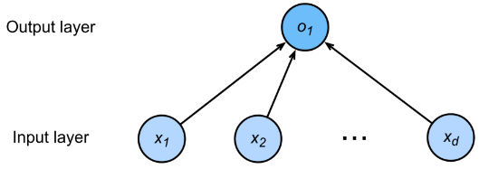

**torch中创建的向量为行向量，所以后续基于行向量进行原理推导**

对于 **线性模型**，$d$ 维行输入向量 $\mathbf{x}=[x^{(1)},x^{(2)},\cdots,x^{(d)}]\in \R^{1\times d}$ ，输出 $\hat{y}$ 是输入的加权和
$$
\hat{y}=\mathbf{x}\cdot\mathbf{w}+b=\mathbf{x}\mathbf{w}^T+b
$$
$\mathbf{w}=[w_1,w_2,\cdots,w_d]\in \R^{1\times d}$  

**衡量预测质量**：比较真实值和预测值，假设 $y$ 是真实值，$\hat{y}$ 是预测值，可以使用平方损失衡量预测质量
$$
\ell(y,\hat{y})=\frac{1}{2}(y-\hat{y})^2
$$
对于参数的取值，需要收集一些数据点来决定，称为**训练数据**，通常越多越好。假设有 $n$ 个样本，数据集为
$$
\mathbf{X}=\begin{bmatrix}\mathbf{x}_1\\\mathbf{x}_2\\\vdots\\\mathbf{x}_n\end{bmatrix}\in\R^{n\times d},\hat{\mathbf{y}}=\mathbf{X}\cdot\mathbf{w}+b=\begin{bmatrix}\mathbf{x}_1\cdot\mathbf{w}+b\\\mathbf{x}_2\cdot\mathbf{w}+b\\\vdots\\\mathbf{x}_n\cdot\mathbf{w}+b\end{bmatrix}=\begin{bmatrix}\mathbf{x}_1\mathbf{w}^T+b\\\mathbf{x}_2\mathbf{w}^T+b\\\vdots\\\mathbf{x}_n\mathbf{w}^T+b\end{bmatrix}=\begin{bmatrix}\hat{y}_1\\\hat{y}_2\\\vdots\\\hat{y}_n\end{bmatrix}\in \R^{n\times1}
$$
定义损失函数：将模型对数据的预测结果与真实结果误差作为损失函数，希望这个损失越小越好
$$
\ell\left(\mathbf{X},\mathbf{y},\mathbf{w},b\right)=\frac{1}{2n}\sum\limits_{i=1}^n\left[y_i-\left(\mathbf{x}_i\cdot\mathbf{w}+b\right)\right]^2=\frac{1}{2n}\Vert \mathbf{y}-\mathbf{X}\cdot\mathbf{w}\Vert^2=\frac{1}{2n}\Vert \mathbf{y}-\mathbf{X}\mathbf{w}^T\Vert^2
$$

所以目标函数为：最小化损失函数来学习参数
$$
w^*,b^*=arg \min\limits_{w,b}\ell\left(\mathbf{X},\mathbf{y},\mathbf{w},b\right)
$$

使用训练数据进行 **参数学习** ：通过梯度下降法更新参数使损失函数的最小
$$
\mathbf{w}_{t+1}=\mathbf{w}_t-\eta\frac{\partial \ell}{\partial \mathbf{w}}\\
b_{t+1}=b_t-\eta\frac{\partial \ell}{\partial b}
$$

---

为简化过程，将偏差加入权重，$\mathbf{w}=[w_1,w_2,\cdots,w_d,b]$ ，对数据进行1扩充，$\mathbf{x}_i=[x_i^{(1)},x^{(2)}_i,\cdots,x^{(d)}_i,1]$ 
$$
\hat{y}=(\mathbf{x}_i,\mathbf{w})=\mathbf{x}_i\mathbf{w}^T=[x^{(1)}_i,x^{(2)}_i,\cdots,x^{(d)}_i,1]\begin{bmatrix}w_1\\w_2\\\vdots\\w_d\\b
\end{bmatrix}=w_1x^{(1)}_i+w_2x^{(2)}_i+\cdots+w_dx^{(d)}_i+b
$$
则有，
$$
\mathbf{X}=\left[
\begin{array}{cc}
\mathbf{x}_1&1\\\mathbf{x}_2&1\\\vdots&\vdots\\\mathbf{x}_n&1
\end{array}
\right]=\begin{bmatrix}x_1^{(1)}&x_1^{(2)}&\cdots&x_1^{(d)}&1\\x_2^{(1)}&x_2^{(2)}&\cdots&x_2^{(d)}&1\\\vdots&\vdots&\ddots&\vdots&\vdots\\x_n^{(1)}&x_n^{(2)}&\cdots&x_n^{(d)}&1\end{bmatrix}\in\R^{n\times (d+1)}\quad,\mathbf{w}^T=\begin{bmatrix}w_1\\w_2\\\vdots\\w_d\\b\end{bmatrix}\in \R^{(d+1)\times 1}
$$
损失函数为 
$$
\ell\left(\mathbf{X},\mathbf{y},\mathbf{w}\right)=\frac{1}{2n}\sum\limits_{i=1}^n\left[y_i-\left(\mathbf{x}_i\mathbf{w}^T+b\right)\right]^2=\frac{1}{2n}\Vert \mathbf{y}-\mathbf{X}\mathbf{w}^T\Vert^2
$$
对参数求梯度
$$
\frac{\partial}{\partial \mathbf{w}}\ell(\mathbf{X},\mathbf{y},\mathbf{w})=\frac{1}{n}\left(\mathbf{y}-\mathbf{X}\mathbf{w}^T\right)^T\mathbf{X}
$$
由于该函数是凸函数，最优解为
$$
\frac{\partial}{\partial \mathbf{w}}\ell(\mathbf{X},\mathbf{y},\mathbf{w})=0\\
\iff \frac{1}{n}\left(\mathbf{y}-\mathbf{X}\mathbf{w}^T\right)^T\mathbf{X}=0\\
\iff \left(\mathbf{y}^T-\mathbf{w}\mathbf{X}^T\right)\mathbf{X}=0\\
\iff\mathbf{y}^T\mathbf{X}=\mathbf{w}\mathbf{X}^T\mathbf{X}\\
\mathbf{w}^{*}=\left(\mathbf{y}^T\mathbf{X}\right)\cdot\left(\mathbf{X}^T\mathbf{X}\right)^{-1}\\
\mathbf{w}^{*}=\left[\left(\mathbf{X}^T\mathbf{X}\right)^{-1}\right]^T\cdot \left(\mathbf{y}^T\mathbf{X}\right)^T\\
\mathbf{w}^*=\left(\mathbf{X}^T\mathbf{X}\right)^{-1}\mathbf{X}\mathbf{y}
$$

## 3.1 线性回归实现

### 3.1.1 生成数据

```python
%matplotlib inline #在jupyter notebook中显示图像
import random
import torch
from d2l import torch as d2l

#功能：根据真实的参数，基于线性模型生成带噪音的随机训练数据
def synthetic_data(w, b, num_examples):  #@save
    """生成y=Xw+b+噪声"""
    #生成训练集矩阵，n*|w|，从正态分布N(0,1)中抽取输入值
    #	n行表示n个数据，|w| 列表示一个数据有|w|个特征
    X = torch.normal(0, 1, (num_examples, len(w)))
    # y是n维真实输出向量
    y = torch.matmul(X, w) + b
    #在真实输出上加噪音，噪音服从N(0,0.01)
    y += torch.normal(0, 0.01, y.shape)
    #y的行数无所谓，列数指定
    return X, y.reshape((-1, 1))

true_w = torch.tensor([2, -3.4])
true_b = 4.2
# features中的每一行都包含一个二维数据样本
# labels中的每一行都包含一维标签值
features, labels = synthetic_data(true_w, true_b, 1000)
print('features:', features[0],'\nlabel:', labels[0])
# features: tensor([0.2151, 0.0915])
# label: tensor([4.3277])

# 生成第二个特征features[:, 1]和labels的散点图
d2l.set_figsize()

# plt.scatter(x,y) xxx.detach()，从计算图中分离出来才能转为numpy的ndarray
d2l.plt.scatter(features[:, 1].detach().numpy(), labels.detach().numpy(), 1)
```

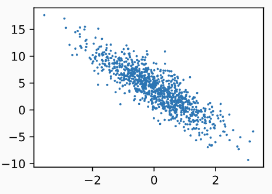

### 3.1.2 生成批量

```python
batch_size = 10

#输入：批量大小、整体数据集，
#输出：指定大小的批量集
def data_iter(batch_size, features, labels):
    #数据数为特征数
    num_examples = len(features)
    #为输入数据的索引创建列表
    indices = list(range(num_examples))
    # 对索引列表随机排序
    random.shuffle(indices)
    #功能：数据每隔一个批量封装为可迭代对象的一项，这些批量项被封装为一个可迭代对象作为函数返回值
    # range(start,end,step)从start到end间隔step-1个数取一个数
    for i in range(0, num_examples, batch_size):
        print(i)
        #从乱序索引列表中中逐次选择批量
        batch_indices = torch.tensor(indices[i: min(i + batch_size, num_examples)])
        # yield会将返回值封装为可迭代对象的一个item，item有两个,可用X,y解构可得feature[]与label
        #	yield一次，主调函数接收一次
        yield features[batch_indices], labels[batch_indices]

#yield一次，主函数就会接收一次，即 data_iter中for循环的 i 会被记录(0,10,20,...990)
#返回100个批量，每个批量10个数据
for X, y in data_iter(batch_size, features, labels):
    print(X, '\n', y)
    break
```

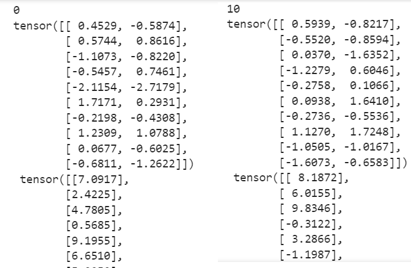

### 3.1.3 初始化模型

#### 模型定义

```python
def linreg(X, w, b):  #@save
    """线性回归模型"""
    return torch.matmul(X, w) + b
```

#### 随机初始化参数

```python
#随机初始化参数
# 从 N(0,0.01)的正态分布中采样，2*1的列向量，反向传播时，该tensor就会自动求导
w = torch.normal(0, 0.01, size=(2,1), requires_grad=True)
b = torch.zeros(1, requires_grad=True)
```

更新这些参数，直到这些参数足够拟合训练数据。每次更新都需要计算损失函数关于模型参数的梯度，`requires_grad=True` 对这个参数引入自动微分计算梯度

### 3.1.4 定义损失函数

```python
def squared_loss(y_hat, y):  #@save
    """均方损失"""
    return (y_hat - y.reshape(y_hat.shape)) ** 2 / 2
```

### 3.1.5 定义优化算法

若损失函数计算的是整个样本集上的损失
$$
\ell\left(\mathbf{X},\mathbf{y},\mathbf{w}\right)=\frac{1}{2n}\sum\limits_{i=1}^n\left[y_i-\left(\mathbf{x}_i\mathbf{w}^T+b\right)\right]^2=\frac{1}{2n}\Vert \mathbf{y}-\mathbf{X}\mathbf{w}^T\Vert^2
$$
其梯度为
$$
\frac{\partial}{\partial \mathbf{w}}\ell(\mathbf{X},\mathbf{y},\mathbf{w})=\frac{1}{n}\left(\mathbf{y}-\mathbf{X}\mathbf{w}^T\right)^T\mathbf{X}
$$
若采用小批量随机梯度下降法，用 $\vert \mathcal{B}\vert$ 个样本的小批量样本集 $\mathcal{B}$ 
$$
\frac{\partial}{\partial \mathbf{w}}\ell(\mathbf{X},\mathbf{y},\mathbf{w})=\frac{1}{\vert \mathcal{B}\vert}\left(\mathbf{y}-\mathbf{X}\mathbf{w}^T\right)^T\mathbf{X}
$$
沿着负梯度方向更新参数，每步更新的步长由学习率 `lr` 决定
$$
\mathbf{w}_t\leftarrow\mathbf{w}_{t-1}-\frac{\eta}{\vert \mathcal{B}\vert}\sum\limits_{i\in\mathbf{I}_{\mathcal{B}}}\frac{\partial}{\partial \mathbf{w}}\ell(\mathbf{x}_i,\mathbf{y}_i,\mathbf{w}_t)
$$

```python
def sgd(params, lr, batch_size):  #@save
    """小批量随机梯度下降"""
    #param是由参数迭代而来，param默认会继承参数的自动微分，
    #	而更新后的param不需要计算其梯度，所以torch.no_grad()
    with torch.no_grad():
        for param in params:
            param -= lr * param.grad / batch_size
            param.grad.zero_()
```

- 若一个节点（叶子变量：自己创建的tensor）requires_grad被设置为True，那么所有依赖它的节点requires_grad都为True

- 当requires_grad设置为False时，反向传播时就不会自动求导了，因此大大节约了显存或内存

  `with torch.no_grad` 起到了截断自动微分的作用，对不需要计算微分的部分进行截断

### 3.1.6 训练过程

```python
'''1.生成数据'''
import random
import torch
from d2l import torch as d2l

# 功能：根据真实的参数，基于线性模型生成带噪音的随机训练数据
def synthetic_data(w, b, num_examples):  #@save
    """生成y=Xw+b+噪声"""
    #生成训练集矩阵，n*|w|，从正态分布N(0,1)中抽取输入值
    #	n行表示n个数据，|w| 列表示一个数据有|w|个特征
    X = torch.normal(0, 1, (num_examples, len(w)))
    # y是n维真实输出向量
    y = torch.matmul(X, w) + b
    #在真实输出上加噪音，噪音服从N(0,0.01)
    y += torch.normal(0, 0.01, y.shape)
    #y的行数无所谓，列数指定
    return X, y.reshape((-1, 1))

true_w = torch.tensor([2, -3.4])
true_b = 4.2
# features中的每一行都包含一个二维数据样本
# labels中的每一行都包含一维标签值
features, labels = synthetic_data(true_w, true_b, 1000)

'''2. 模块定义'''
'''2.1 小批量生成模块'''

batch_size = 10
#输入：批量大小、整体数据集，
#输出：指定大小的批量集
def data_iter(batch_size, features, labels):
    #数据数为特征数
    num_examples = len(features)
    #为输入数据的索引创建列表
    indices = list(range(num_examples))
    # 对索引列表随机排序
    random.shuffle(indices)
    #功能：数据每隔一个批量封装为可迭代对象的一项，这些批量项被封装为一个可迭代对象作为函数返回值
    # range(start,end,step)从start到end间隔step-1个数取一个数
    for i in range(0, num_examples, batch_size):
        print(i)
        #从乱序索引列表中中逐次选择批量
        batch_indices = torch.tensor(indices[i: min(i + batch_size, num_examples)])
        # yield会将返回值封装为可迭代对象的一个item，item有两个,可用X,y解构可得feature[]与label
        #	yield一次，主调函数接收一次
        yield features[batch_indices], labels[batch_indices]

        
'''2.2 模型定义:线性回归模型'''
def linreg(X, w, b):  #@save
    return torch.matmul(X, w) + b

'''2.3 损失函数定义:均方损失'''
def squared_loss(y_hat, y):  #@save
    return (y_hat - y.reshape(y_hat.shape)) ** 2 / 2

'''2.4 随机梯度下降'''
def sgd(params, lr, batch_size):  #@save
    """小批量随机梯度下降"""
    #param是由参数迭代而来，param默认会继承参数的自动微分，
    #而更新后的param不需要计算其梯度，所以torch.no_grad()
    with torch.no_grad():
        for param in params:
            param -= lr * param.grad / batch_size
            param.grad.zero_()
    
'''3. 初始化超参数'''
lr = 0.03
num_epochs = 3
batch_size = 10

'''4. 开始训练'''
#随机初始化参数
# 从 N(0,0.01)的正态分布中采样，2*1的列向量，反向传播时，该tensor就会自动求导
w = torch.normal(0, 0.01, size=(2,1), requires_grad=True)
b = torch.zeros(1, requires_grad=True)

#在训练集上进行三轮训练
for epoch in range(num_epochs):
    for X, y in data_iter(batch_size, features, labels):  
        # hat_y是2维列向量。l为小批量平方损失向量
        l = squared_loss(linreg(X, w, b), y)
        # 对同一批量的平方损失求和，并以此计算关于[w,b]的梯度
        l.sum().backward()
        sgd([w, b], lr, batch_size)  # 使用参数的梯度更新参数
    with torch.no_grad():
        #计算本轮迭代后的损失
        train_l = squared_loss(linreg(features, w, b), labels)
        print(f'epoch {epoch + 1}, loss {float(train_l.mean()):f}')
        
'''5. 对比真实参数'''
print(f'w的估计误差: {true_w - w.reshape(true_w.shape)}')
print(f'b的估计误差: {true_b - b}')
```

## 3.2 基于pytorch实现线性回归

### 3.2.1 生成数据

```python
import numpy as np
import torch
# torch.utils 是torch中的一个数据处理包
from torch.utils import data
from d2l import torch as d2l

true_w = torch.tensor([2, -3.4])
true_b = 4.2
features, labels = d2l.synthetic_data(true_w, true_b, 1000)
```

### 3.2.2 数据迭代器(理解)

```python
def load_array(data_arrays, batch_size, is_train=True):  #@save
    """构造一个PyTorch数据迭代器"""
    #将torch张量类型的数据集转换为torch中的张量数据集类型TensorDataset
    dataset = data.TensorDataset(*data_arrays)
    #shuffle：打乱数据集
    # 按批量大小从数据集中返回小批量数据，并将这些数据封装为Pytorch迭代器
    return data.DataLoader(dataset, batch_size, shuffle=is_train)

batch_size = 10
# data_iter是Pytorch迭代器对象
data_iter = load_array((features, labels), batch_size)
```

在 `data.DataLoader()` 创建的迭代器对象中，封装了数据元组

- 将整个数据集按批量大小划分为多个批量，并返回划分后的 **可迭代对象** 

- **可迭代对象可视为一个列表，列表的每一项封装了一个批量(元组)，对一个项操作，相当于对一个批量的操作**
- **遍历可迭代对象，相当于逐批量获取数据** 

为查看迭代器内容，需要使用 `iter()` 构造器将 Pytorch迭代器转换为 Python迭代器，然后使用 `next(itr)` 获取第一项

```python
next(iter(data_iter))
print("第一批量的数据:\n",next(iter(data_iter)))
```

### 3.2.3 初始化模型

#### 模型定义

对于标准深度学习模型，我们可以使用框架预定义好的层。每一层都可以理解为带有输入和输出的模型

使用框架之后，我们只需关注使用哪些层来构造模型，而不必关注层的实现细节。

- 这种情况类似于为自己的博客从零开始编写网页。也能使用博客框架，博客框架环境配置好后，只需要关注博客内容即可

在Pytorch中，定义一个模型变量 `net` ，`net` 是一个 `Sequential` 类

- `Sequential` 将多个层串联在一起。当给定输入数据时，模型变量将数据传入到第一层，第一层的输出作为第二层的输入，以此类推

```python
# nn是神经网络的缩写
from torch import nn

#nn.Linear(输入向量维度,输出向量维度)
net = nn.Sequential(nn.Linear(2, 1))
```

#### 随机初始化模型参数

```python
#线性模型可以视为单层神经网络，在框架中只有第一层
#net[0].weight.data指定线性层的权重；
#	.normal_(means,var)，从均值为mean方差为var的正态分布中挑选初始值
#net[0].bias.data指定线性层的偏置
#	.fill_(x)，用x填充
net[0].weight.data.normal_(0, 0.01)
net[0].bias.data.fill_(0)

for i in net.parameters():
    print(i)
```

`Sequential` 实例的 `parameters()` 函数可以获取当前层的参数，返回的是参数的迭代对象

```
Parameter containing:
tensor([[ 0.0059, -0.0101]], requires_grad=True)
Parameter containing:
tensor([0.], requires_grad=True)
```

### 3.2.4 损失函数

在nn模块中，定义了各种损失函数

均方损失，`MSELoss` 类

```python
# 损失实例已经包含批量大小信息
loss = nn.MSELoss()
```

### 3.2.5 定义优化函数

 PyTorch在优化模块 `optim` 中实现了随机梯度下降算法(SGD)的许多变种  

使用SGD实例时，要指定优化的参数

- 小批量SGD只需要指定学习率

```python
trainer = torch.optim.SGD(net.parameters(), lr=0.03) 
```

### 3.2.6 训练过程

```python
import numpy as np
import torch
# torch.utils 是torch中的一个数据处理包
from torch.utils import data
from d2l import torch as d2l

#生成训练数据
def synthetic_data(w, b, num_examples):  #@save
    """生成y=Xw+b+噪声"""
    #生成训练集矩阵，n*|w|，从正态分布N(0,1)中抽取输入值
    #	n行表示n个数据，|w| 列表示一个数据有|w|个特征
    X = torch.normal(0, 1, (num_examples, len(w)))
    # y是n维真实输出向量
    y = torch.matmul(X, w) + b
    #在真实输出上加噪音，噪音服从N(0,0.01)
    y += torch.normal(0, 0.01, y.shape)
    #y的行数无所谓，列数指定
    return X, y.reshape((-1, 1))

true_w = torch.tensor([2, -3.4])
true_b = 4.2
features, labels = d2l.synthetic_data(true_w, true_b, 1000)

def load_array(data_arrays, batch_size, is_train=True):  #@save
    """构造一个PyTorch数据迭代器"""
    #将torch张量类型的数据集转换为torch中的张量数据集类型TensorDataset
    dataset = data.TensorDataset(*data_arrays)
    #shuffle：打乱数据集
    # 按批量大小从数据集中返回小批量数据，并将这些数据封装为Pytorch迭代器
    return data.DataLoader(dataset, batch_size, shuffle=is_train)

batch_size = 10
# data_iter是Pytorch迭代器对象
data_iter = load_array((features, labels), batch_size)

# nn是神经网络的缩写
from torch import nn

#nn.Linear(输入向量维度,输出向量维度)
net = nn.Sequential(nn.Linear(2, 1))
net[0].weight.data.normal_(0, 0.01)
net[0].bias.data.fill_(0)

#定义损失函数
loss = nn.MSELoss()
#定义参数损失函数的优化算法
trainer = torch.optim.SGD(net.parameters(), lr=0.03) 

num_epochs = 3
for epoch in range(num_epochs):
    for X, y in data_iter:
        #对每个输入计算平方损失函数
        # 	l中已经包含了批量大小信息
        l = loss(net(X) ,y)
        #对参数的梯度置0
        trainer.zero_grad()
        #对损失函数反向传播计算梯度并求和
        l.backward()
        #参数更新一次
        trainer.step()
    #计算本轮迭代更新参数后的误差
    l = loss(net(features), labels)
    print(f'epoch {epoch + 1}, loss {l:f}')
```

## 3.3 softmax回归

回归任务：估计连续值

分类任务：预测一个离散的类别

- 手写数字识别-10类
- ImageNet：1000000张图片的，1000类自然物体分类
- Kaggle上的分类问题：
  - 人类蛋白质显微镜图片28类
  - 恶意软件分类9类
  - WIkipedia评论分为7类

回归任务到分类任务

| 回归任务                                                     | 分类任务                                                     |
| ------------------------------------------------------------ | ------------------------------------------------------------ |
| 单连续数值输出                                               | 多离散输出                                                   |
| 自然区间 $\R$                                                | 输出 $p(i)$ 是预测为第 $i$ 类的置信度                        |
| 与真实值的差作为损失                                         |                                                              |
| 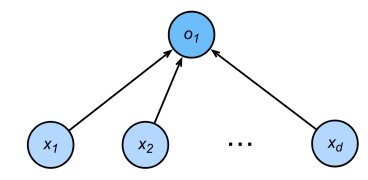 | 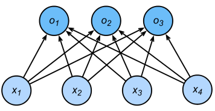 |

对类别编码，若有 $K$ 个类别，使用one-hot向量对真实样本 $(\mathbf{x}_i,y_i)$ 进行编码 $\mathbf{y}_i=[y_i^{(1)},y_i^{(2)},\cdots,y_i^{(K)}]$，令 $\kappa$ 为 $\mathbf{x}_i$ 的真实类别，则 $y_i^{(k)}=\begin{cases}1&,k=\kappa\\0&,k\neq \kappa\end{cases},k=1,\cdots,K$ ，样本 $\mathbf{x}_i$ 的真实类别 $y_i^{(k)}$ 服从一个分布 $p$ 

 $\hat{y}_i^{(k)}=q(\hat{y}_i=k\vert \mathbf{x}_i)=softmax(o_i^{(k)})=\frac{e^{o_i^{(k)}}}{\sum\limits_{k=1}^Ke^{o_i^{(k)}}}=\frac{e^{\mathbf{x}_i\mathbf{w}_k^T}}{\sum\limits_{k=1}^Ke^{\mathbf{x}_i\mathbf{w}_k^T}}$ 表示将样本 $\mathbf{x}_i$ 预测为 $k$ 类的置信度，对样本  $\mathbf{x}_i$ 的类别预测置信度服从分布 $q$ 

- $o_i^{(k)}=\mathbf{w}^T_k\mathbf{x}_i$ 为经过线性模型 $\mathbf{w}_k^T\mathbf{x}$  后 $\mathbf{x}_i$ 为第 $k$ 个类别的置信度净输出。
- $\mathbf{o}_i=\left[o_i^{(1)},o_i^{(2)},\cdots,o_i^{(K)}\right]$ 为样本 $\mathbf{x}_i$ 经过线性模型后的置信度净输出向量
- $\hat{\mathbf{y}}_i=softmax(\mathbf{o}_i)=\left[softmax\left(o_i^{(1)}\right),softmax\left(o_i^{(2)}\right),\cdots,softmax\left(o_i^{(k)}\right)\right]=\left[\hat{y}_i^{(1)},\hat{y}_i^{(2)},\cdots,\hat{y}_i^{(K)}\right]$ 

所以目标函数为
$$
\hat{y}_i=\arg\max\limits_{k}\hat{y}_i^{(k)}
$$
- 目标是预测为正确类别的置信度远远大于其他类别
  $$
  \hat{y}_i^{(\kappa)}\gg\hat{y}_i^{(k)},k\neq \kappa\iff \hat{y}_i^{(\kappa)}-\hat{y}_i^{(k)}\ge \Delta(\kappa,k)
  $$

通过交叉熵可以比较真实分布与预测分布的差异

- $H(p,q)=-\sum_k p_k\log q_k\ge 0$ 为交叉熵，当 $p_k=q_k$ 时，即两个分布相同时，交叉熵有最小值0

将其作为损失函数
$$
\begin{aligned}
\ell(\mathbf{y}_i,\hat{\mathbf{y}}_i)&=-\sum_k^Ky_i^{(k)}\log \hat{y}_i^{(k)}\\
&\xlongequal{y_i^{(k)}=\begin{cases}1&,k=\kappa\\0&,k\neq \kappa\end{cases}}-\log \hat{y}_i^{(\kappa)}\\
&=-\log\left(\frac{e^{\mathbf{x}_i\mathbf{w}_{\kappa}^T}}{\sum\limits_{k=1}^Ke^{\mathbf{x}_i\mathbf{w}_k^T}}\right)=\log\sum\limits_{k=1}^Ke^{\mathbf{x}_i\mathbf{w}_k^T}-\mathbf{x}_i\mathbf{w}_{\kappa}^T
\end{aligned}
$$
对参数 $\mathbf{w}_{\kappa}$ 求梯度
$$
\begin{aligned}
\frac{\partial }{\partial \mathbf{w}_{\kappa}}\ell(\mathbf{y}_i,\hat{\mathbf{y}}_i)&=\frac{\partial}{\partial \mathbf{w}_\kappa}\left[\log\left(\cdots+e^{\mathbf{x}_i\mathbf{w}_{\kappa}^T}+\cdots\right)-\mathbf{x}_i\mathbf{w}_{\kappa}^T\right]\\
&=\frac{e^{\mathbf{x}_i\mathbf{w}_{\kappa}^T}\mathbf{x}_i}{\sum\limits_{k=1}^Ke^{\mathbf{x}_i\mathbf{w}_k^T}}-\mathbf{x}_i\\
&=\left(\hat{y}_i^{(\kappa)}-y_i^{(\kappa)}\right)\mathbf{x}_i
\end{aligned}
$$

### 分类数据集

MNIST数据集 ([LeCun *et al.*, 1998](https://zh-v2.d2l.ai/chapter_references/zreferences.html#id90)) 是图像分类中广泛使用的数据集之一（手写数字识别数据集），但作为基准数据集过于简单

使用类似但更复杂的Fashion-MNIST数据集

```python
import torch
# Pytorch对计算机视觉的实现库
import torchvision
# 对数据处理工具库
from torch.utils import data
# 视觉库中对数据操作的模块
from torchvision import transforms
from d2l import torch as d2l
```

#### 下载数据集

通过torchvision内置函数将数据集下载并读取到内存

```python
# 通过ToTensor实例将图像数据从PIL类型转换成pytorch类型，32位浮点数格式，
# 并除以255使得所有像素的数值均在0～1之间
trans = transforms.ToTensor()
# train=True		表示训练数据，train=False表示测试数据集
# transform=trans	表示下载后转换为tensor，不转换则只是图片
# download=True 	默认从网络下载
mnist_train = torchvision.datasets.FashionMNIST(
    root="../data", 
    train=True, 
    transform=trans, 
    download=True)
mnist_test = torchvision.datasets.FashionMNIST(root="../data", train=False, transform=trans, download=True)
```

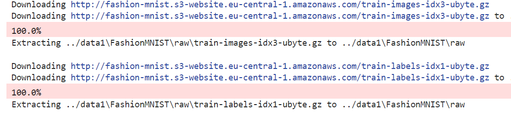

- 整个下载包括下载、移动、解压三步

##### 查看数据集

```python
# 数据集中的图片数量
len(mnist_train), len(mnist_test)
(60000, 10000)

# mnist中，每个样本用tuple表示，tuple[0]为输入，tuple[1]为其标签
# 查看第1个样本的输入张量x_1，其输出y_1为类别编号
print(mnist_train[0][0],mnist_train[0][1])
#张量类型的图片通道为1，宽高都是28，(c,h,w)=(1,28,28)
mnist_train[0][0].shape
torch.Size([1, 28, 28])
```

##### 可视化数据集

批量查看图片及其标签

```python
# 标签值转为标签文本
def get_fashion_mnist_labels(labels):  #@save
    """返回Fashion-MNIST数据集的文本标签"""
    text_labels = ['t-shirt', 'trouser', 'pullover', 'dress', 'coat',
                   'sandal', 'shirt', 'sneaker', 'bag', 'ankle boot']
    #传入的labels是一个tensor列表，for i in labels中的i为每个样本的真实标签值，
    #[text_labels]会将这些标签文本转为列表
    return [text_labels[int(i)] for i in labels]
    #相当于
    #	a = []
    #	for i in labels:
    #	    a[i]=text_labels[int(i)]
    #	return a
```

```python
#imgs为图片集，num_rows,num_cols为图片列表行列数，titles传入imgs相应的标签
def show_images(imgs, num_rows, num_cols, titles=None, scale=1.5):  #@save
    """绘制图像列表"""
    figsize = (num_cols * scale, num_rows * scale)
    _, axes = d2l.plt.subplots(num_rows, num_cols, figsize=figsize)
    axes = axes.flatten()
    for i, (ax, img) in enumerate(zip(axes, imgs)):
        if torch.is_tensor(img):
            # 图片张量
            ax.imshow(img.numpy())
        else:
            # PIL图片
            ax.imshow(img)
        ax.axes.get_xaxis().set_visible(False)
        ax.axes.get_yaxis().set_visible(False)
        if titles:
            ax.set_title(titles[i])
    return axes
```

读取两个样本，显示二者图像列表

```python
X, y = next(iter(data.DataLoader(mnist_train, batch_size=2)))
show_images(X.reshape(2, 28, 28), 1, 2, titles=get_fashion_mnist_labels(y));
```


#### 实现批量读取

在每次迭代中，数据加载器每次都会[**读取一小批量数据，大小为`batch_size`**]

通过内置数据迭代器，可以随机打乱所有样本

```python
batch_size = 256

#数据加载器可启动进程数重载
def get_dataloader_workers():  #@save
    """使用4个进程来读取数据"""
    return 4

train_iter = data.DataLoader(
    mnist_train, 
    batch_size, 
    shuffle=True,
    num_workers=get_dataloader_workers())
```

可记录加载一个批量的时间

```python
timer = d2l.Timer()
for X, y in train_iter:
    continue
f'{timer.stop():.2f} sec'
```

#### 封装数据读取

从视觉库的Fashion-MNIST数据集获取训练数据集和测试数据集。

返回：训练集和验证集的数据迭代器

输入：批量大小batch_size；resize图像大小调整

```python
def load_data_fashion_mnist(batch_size, resize=None):  #@save
    """下载Fashion-MNIST数据集，然后将其加载到内存中"""
    # 对图片的处理函数列表
    #	transforms.ToTensor()：将PIL类型的图片转换为张亮
    #	transforms.Resize(resize)：调整图片大小，调整为resize
    trans = [transforms.ToTensor()]
    if resize:
        trans.insert(0, transforms.Resize(resize))
    # 将多个图像变换操作组成一个变换操作序列
    #	输入：transforms类型的操作列表
    #	输出：返回组合后的操作序列
    trans = transforms.Compose(trans)
    mnist_train = torchvision.datasets.FashionMNIST(root="../data", train=True, transform=trans, download=True)
    mnist_test = torchvision.datasets.FashionMNIST(root="../data", train=False, transform=trans, download=True)
    # 返回数据集迭代器
    return (data.DataLoader(mnist_train, batch_size, shuffle=True,num_workers=get_dataloader_workers()),
            data.DataLoader(mnist_test, batch_size, shuffle=False,num_workers=get_dataloader_workers()))
```

通过resize参数调整图片大小

```python
train_iter, test_iter = load_data_fashion_mnist(32, resize=64)
for X, y in train_iter:
    print(X.shape, X.dtype, y.shape, y.dtype)
    break
```

```
torch.Size([32, 1, 64, 64]) torch.float32 torch.Size([32]) torch.int64
```

### 3.3.1 Softmax实现

#### 获取数据集批量

```python
import torch
from d2l import torch as d2l

batch_size = 256
train_iter, test_iter = d2l.load_data_fashion_mnist(batch_size)
```

#### 初始化参数

softmax输入需要是向量，所以需要把所有图像展平，视为一个向量，$1\times 28\times 28=784$ 的列向量 $img_{[1\times28\times 28]}\rightarrow\mathbf{x}_{[784\times 1]}$ 

- 展平操作会损失很多空间信息，所以卷积神经网络会弥补这一缺陷

一张图像可能得类别有10类，所以输出10维的列向量  $\mathbf{y}_{[10\times 1]}$ 

```python
num_inputs = 784
num_outputs = 10

W = torch.normal(0, 0.01, size=(num_inputs, num_outputs), requires_grad=True)
b = torch.zeros(num_outputs, requires_grad=True)
```

#### 模型定义

输入，原始数据矩阵：每个样本展平为 $\mathbf{x}_i\in\R^{1\times d}$ 的行向量，批量样本矩阵为 $\mathbf{X}=\begin{bmatrix}\mathbf{x}_1\\\mathbf{x}_2\\\vdots\\\mathbf{x}_n\end{bmatrix}\in \R^{n\times d}$

- 本例中 $\mathbf{x}_i\in\R^{1\times 784}$ ，批量数据表示为 $\mathbf{X}=\begin{bmatrix}\mathbf{x}_1\\\vdots\\\mathbf{x}_{256}\end{bmatrix}\in\R^{256\times 784}$  

- 

参数 $\mathbf{w}_k\in \R^{1\times d},k\in [1,K]$ ，参数矩阵 $\mathbf{W}=\begin{bmatrix}\mathbf{w}_1\\\mathbf{w}_2\\\vdots\\\mathbf{w}_{K}\end{bmatrix}\in \R^{K\times d}$ ，偏置 $\mathbf{b}\in \R^{1\times K}$ 行向量

- 本例中，$\mathbf{w}_k\in \R^{1\times 784},k\in [1,10]$ ，参数矩阵 $\mathbf{W}=\begin{bmatrix}\mathbf{w}_1\\\mathbf{w}_2\\\vdots\\\mathbf{w}_{10}\end{bmatrix}\in \R^{10\times 784}$ ，偏置 $\mathbf{b}\in \R^{1\times 10}$ 

净输出，净输出矩阵：每个样本的净输出向量为 $\mathbf{o}_i\in \R^{1\times K}$ 的行向量，批量样本净输出矩阵表示为 $\mathbf{O}=\begin{bmatrix}\mathbf{o}_1\\\mathbf{o}_2\\\vdots\\\mathbf{o}_{n}\end{bmatrix}\in \R^{n\times K}$
$$
\begin{aligned}
\mathbf{O}_{n\times K}&=
\mathbf{X}_{n\times d}\mathbf{W}^T_{d\times K}+\mathbf{b}_{1\times K}=
\begin{bmatrix}\mathbf{x}_1\\\mathbf{x}_2\\\vdots\\\mathbf{x}_n\end{bmatrix}[\mathbf{w}_1^T,\mathbf{w}_2^T,\cdots,\mathbf{w_K^T}]+\mathbf{b}\\
&=\begin{bmatrix}
\mathbf{x}_1\mathbf{w}_1^T&\mathbf{x}_1\mathbf{w}_2^T&\cdots&\mathbf{x}_1\mathbf{w}_K^T\\
\mathbf{x}_2\mathbf{w}_1^T&\mathbf{x}_2\mathbf{w}_2^T&\cdots&\mathbf{x}_2\mathbf{w}_K^T\\
\vdots&\vdots&\ddots&\vdots\\
\mathbf{x}_n\mathbf{w}_1^T&\mathbf{x}_n\mathbf{w}_2^T&\cdots&\mathbf{x}_n\mathbf{w}_K^T
\end{bmatrix}+[b_1,b_2,\cdots,b_K]=\begin{bmatrix}
\mathbf{x}_1\mathbf{w}_1^T+b_1&\mathbf{x}_1\mathbf{w}_2^T+b_2&\cdots&\mathbf{x}_1\mathbf{w}_K^T+b_K\\
\mathbf{x}_2\mathbf{w}_1^T+b_1&\mathbf{x}_2\mathbf{w}_2^T+b_2&\cdots&\mathbf{x}_2\mathbf{w}_K^T+b_K\\
\vdots&\vdots&\ddots&\vdots\\
\mathbf{x}_n\mathbf{w}_1^T+b_1&\mathbf{x}_n\mathbf{w}_2^T+b_2&\cdots&\mathbf{x}_n\mathbf{w}_K^T+b_K
\end{bmatrix}\\\\
&=\begin{bmatrix}
o_1^{(1)}&o_1^{(2)}&\cdots&o_1^{(K)}\\
o_2^{(1)}&o_2^{(2)}&\cdots&o_2^{(K)}\\
\vdots&\vdots&\ddots&\vdots\\
o_n^{(1)}&o_n^{(2)}&\cdots&o_n^{(K)}
\end{bmatrix}=\begin{bmatrix}
\mathbf{o}_1\\
\mathbf{o}_2\\
\vdots\\
\mathbf{o}_n\\
\end{bmatrix}
\in \R^{n\times K}
\end{aligned}
$$

- 本例中，净输出 $\mathbf{o}_i\in \R^{1\times 10}$ ，批量净输出矩阵表示为 $\mathbf{O}=\begin{bmatrix}\mathbf{o}_1\\\mathbf{o}_2\\\vdots\\\mathbf{o}_{256}\end{bmatrix}\in \R^{256\times 10}$ 
  $$
  \begin{aligned}
  \mathbf{O}=\mathbf{X}\mathbf{W}^T+\mathbf{b}&=\begin{bmatrix}\mathbf{x}_1\\\mathbf{x}_2\\\vdots\\\mathbf{x}_{256}
  \end{bmatrix}\times [\mathbf{w}_1^T,\mathbf{w}_2^T,\cdots,\mathbf{w}_{10}^T]+[b_1,b_2,\cdots,b_{10}]\\
  &=\begin{bmatrix}
  \mathbf{x}_1\mathbf{w}^T_1+b_1&\mathbf{x}_1\mathbf{w}_2^T+b_2&\cdots&\mathbf{x}_{1}\mathbf{w}_{10}^T+b_{10}\\
  \mathbf{x}_2\mathbf{w}_1^T+b_1&\mathbf{x}_2\mathbf{w}_2^T+b_2&\cdots&\mathbf{x}_{2}\mathbf{w}_{10}^T+b_{10}\\
  \vdots&\vdots&\ddots&\vdots\\
  \mathbf{x}_{256}\mathbf{w}_1^T+b_1&\mathbf{x}_{256}\mathbf{w}_2^T+b_2&\cdots&\mathbf{x}_{256}\mathbf{w}_{10}^T+b_{10}
  \end{bmatrix}\\\\
  &\xlongequal{o_i^{(k)}=\mathbf{w}_{k}\cdot\mathbf{x}_i=\mathbf{x}_{i}\mathbf{w}_k^T}\begin{bmatrix}
  o_1^{(1)}&o_1^{(2)}&\cdots&o_1^{(10)}\\
  o_2^{(1)}&o_2^{(2)}&\cdots&o_2^{(10)}\\
  \vdots&\vdots&\ddots&\vdots\\
  o_{256}^{(1)}&o_{256}^{(2)}&\cdots&o_{256}^{(10)}\\
  \end{bmatrix}=\begin{bmatrix}\mathbf{o}_1\\\mathbf{o}_2\\\vdots\\\mathbf{o}_{256}
  \end{bmatrix}=\mathbf{O}\in \R^{256\times 10}
  \end{aligned}
  $$

```python
def net(X):
    #展平操作，将256*(1,28,28)的数据展平为 256*784的张量
    return softmax(torch.matmul(X.reshape(-1,(W.shape[0])), W) + b)
```

所以一次softmax有三个操作

1. 对每个项求幂 `exp()`
2. 对每一行求和(在一个批量中，一行为一个样本)
3. 将每一行除以其规范化常数，确保结果的和为1

输入：净输出矩阵

输出：softmax后的置信度矩阵 / 归一化后的置信度矩阵 $\hat{\mathbf{Y}}=\begin{bmatrix}\hat{\mathbf{y}}_1\\\hat{\mathbf{y}}_2\\\vdots\\\hat{\mathbf{y}}_{n}\end{bmatrix}=\begin{bmatrix}\hat{\mathbf{y}}_1\\\hat{\mathbf{y}}_2\\\vdots\\\hat{\mathbf{y}}_{256}\end{bmatrix}$ 

```python
def softmax(O):
    O_exp = torch.exp(O)
    partition = O_exp.sum(1, keepdim=True)
    return O_exp / partition  # 这里应用了广播机制
```

$$
e^{\mathbf{O}}=\begin{bmatrix}
e^{o_1^{(1)}}&e^{o_1^{(2)}}&\cdots&e^{o_1^{(K)}}\\
e^{o_2^{(1)}}&e^{o_2^{(2)}}&\cdots&e^{o_2^{(K)}}\\
\vdots&\vdots&\ddots&\vdots\\
e^{o_{n}^{(1)}}&e^{o_{n}^{(2)}}&\cdots&e^{o_{n}^{(K)}}\\
\end{bmatrix}\quad,\mathbf{partition}=\begin{bmatrix}
\sum\limits_{k=1}^K e^{o_1^{(k)}}\\
\sum\limits_{k=1}^K e^{o_2^{(k)}}\\
\vdots\\
\sum\limits_{k=1}^K e^{o_n^{(k)}}\\
\end{bmatrix}\\
\mathbf{\hat{Y}}=softmax\left(\hat{\mathbf{O}}\right)=\begin{bmatrix}
softmax\left(\hat{\mathbf{o}}_1\right)\\
softmax\left(\hat{\mathbf{o}}_2\right)\\
\vdots\\
softmax\left(\hat{\mathbf{o}}_n\right)
\end{bmatrix}=\begin{bmatrix}
\hat{\mathbf{y}}_1\\
\hat{\mathbf{y}}_2\\
\vdots\\
\hat{\mathbf{y}}_n
\end{bmatrix}
\\
\hat{\mathbf{y}}_i=softmax(\mathbf{o}_i)=\left[\frac{e^{o_i^{(1)}}}{\sum\limits_{k=1}^{K} e^{o_i^{(k)}}},\frac{e^{o_i^{(2)}}}{\sum\limits_{k=1}^{K} e^{o_i^{(k)}}},\cdots,\frac{e^{o_i^{(K)}}}{\sum\limits_{k=1}^{K} e^{o_i^{(k)}}}\right]=\frac{e^{\mathbf{o}_i}}{partition_i}
$$

#### 交叉熵损失函数

对于每个样本，其交叉熵损失为
$$
\ell(\mathbf{y}_i,\hat{\mathbf{y}}_i)=-\log \hat{y}_i^{(\kappa)},\kappa为真实标签
$$
所以只需要关注真实分类对应的softmax值即可，pytorch有简便方法，根据索引列表依次从每个列表取出相应列表项，即从 $\hat{\mathbf{Y}}=\begin{bmatrix}\hat{\mathbf{y}}_1\\\hat{\mathbf{y}}_2\\\vdots\\\hat{\mathbf{y}}_{256}\end{bmatrix}$ 中，取出 $\begin{bmatrix}\hat{y}_1^{(\kappa_1)},\hat{y}_2^{(\kappa_2)},\cdots,\hat{y}_{256}^{(\kappa_{256})}\end{bmatrix}$ 

```python
y = torch.tensor([0, 2])
y_hat = torch.tensor([[0.1, 0.3, 0.6], [0.3, 0.2, 0.5]])

y_hat[[0, 1], y]

>>> tensor([0.1000, 0.5000])
从y_hat[0]中取出y_hat[0][0],从y_hat[1]中取出y_hat[1][2]
```

**实现交叉熵损失函数**

```python
def cross_entropy(y_hat, y):
    return - torch.log(y_hat[range(len(y_hat)), y])

# cross_entropy(y_hat, y)
```

#### 精确度计算函数

```python
def accuracy(y_hat, y):  #@save
    """计算预测正确的数量"""
    #若y_hat是矩阵，则通过argmax得出预测分类结果
    # argmax返回值最大的索引，即分类结果
    if len(y_hat.shape) > 1 and y_hat.shape[1] > 1:
        y_hat = y_hat.argmax(axis=1)
    cmp = y_hat.type(y.dtype) == y
    #预测正确的样本，相应的y_hat(i)=1；预测错误，相应的y_hat(i)=0
    #	将对比结果 cmp 求和，可得预测正确的数量
    return float(cmp.type(y.dtype).sum())

#精确度
accuracy(y_hat, y) / len(y)
```

##### 逐批量计算数据集的精确度

```python
class Accumulator:  #@save
    """在n个变量上累加"""
    def __init__(self, n):
        self.data = [0.0] * n
    def add(self, *args):
        self.data = [a + float(b) for a, b in zip(self.data, args)]
    def reset(self):
        self.data = [0.0] * len(self.data)
    def __getitem__(self, idx):
        return self.data[idx]

def evaluate_accuracy(net, data_iter):  #@save
    """计算在指定数据集上模型的精度"""
    #若是nn框架，对模型评估，不需要更新参数，所以不计算梯度
    if isinstance(net, torch.nn.Module):
        net.eval()  # 将模型设置为评估模式
    #Accumulator的作用是逐批量累加
    metric = Accumulator(2)  # 正确预测数、总样本数
    with torch.no_grad():
        for X, y in data_iter:
            #在一个批量上，计算预测正确数和总样本数
            metric.add(accuracy(net(X), y), y.numel())
    #返回在当前数据集上模型的精确度       
    return metric[0] / metric[1]
```

```python
evaluate_accuracy(net, test_iter)
#随机分类的精确度
0.1069
```

#### 训练

##### 参数迭代器

`updater` 是模型参数的优化函数，它接受批量大小作为参数。 它可以是`d2l.sgd` 函数，也可以是框架的内置优化函数

```python
lr = 0.1

#作用：对参数的一次小批量随机梯度下降的更新
#输入：参数；学习率；划分的批量
#输出：更新后的参数
def updater(batch_size):
    return d2l.sgd([W, b], lr, batch_size)
```

##### 模型的一次迭代

```python
def train_epoch_ch3(net, train_iter, loss, updater):  #@save
    """训练模型一个迭代周期（定义见第3章）"""
    # 若使用框架定义模型函数，需要计算参数的梯度，将模型设置为训练模式
    if isinstance(net, torch.nn.Module):
        net.train()
    # 训练损失总和、训练准确度总和、样本数
    metric = Accumulator(3)
    for X, y in train_iter:
        # 计算梯度并更新参数
        y_hat = net(X)
        l = loss(y_hat, y)
        if isinstance(updater, torch.optim.Optimizer):
            # 使用PyTorch内置的优化器和损失函数
            updater.zero_grad()
            l.mean().backward()
            updater.step()
        else:
            # 使用自定义的优化器和损失函数
            # 	对损失函数计算梯度
            l.sum().backward()
            #使用updater中定义的梯度下降法逐批量更新参数
            updater(X.shape[0])
        #更新一轮后，将本轮的损失和、预测正确数、批量样本数累加    
        metric.add(float(l.sum()), accuracy(y_hat, y), y.numel())
    # 返回本轮训练损失和训练精度
    return metric[0] / metric[2], metric[1] / metric[2]
```

##### 多轮迭代

```python
def train_ch3(net, train_iter, test_iter, loss, num_epochs, updater):  #@save
    """训练模型（定义见第3章）"""
    # 创建一个住批量显示训练指标的动态图像绘制函数
    animator = Animator(xlabel='epoch', xlim=[1, num_epochs], ylim=[0.3, 0.9],legend=['train loss', 'train acc', 'test acc'])
    for epoch in range(num_epochs):
        train_metrics = train_epoch_ch3(net, train_iter, loss, updater)
        test_acc = evaluate_accuracy(net, test_iter)
        animator.add(epoch + 1, train_metrics + (test_acc,))
    train_loss, train_acc = train_metrics
    assert train_loss < 0.5, train_loss
    assert train_acc <= 1 and train_acc > 0.7, train_acc
    assert test_acc <= 1 and test_acc > 0.7, test_acc
```

```python
num_epochs = 10
train_ch3(net, train_iter, test_iter, cross_entropy, num_epochs, updater)
```

#### 预测

```python
def predict_ch3(net, test_iter, n=6):  #@save
    """预测标签（定义见第3章）"""
    for X, y in test_iter:
        break
    trues = d2l.get_fashion_mnist_labels(y)
    preds = d2l.get_fashion_mnist_labels(net(X).argmax(axis=1))
    titles = [true +'\n' + pred for true, pred in zip(trues, preds)]
    d2l.show_images(
        X[0:n].reshape((n, 28, 28)), 1, n, titles=titles[0:n])

predict_ch3(net, test_iter)
```

#### 整合

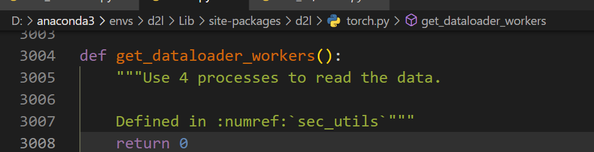

```python
import torch
from d2l import torch as d2l

'''1.导入数据'''
batch_size = 256

# 程序在运行时启用了多线程，而多线程的使用用到了freeze_support()函数。
# freeze_support()函数在linux和类unix系统上可直接运行，在windows系统中需要跟在main后边。
# 此处将d2l库中的get_dataloader_workers()返回值改为0，单线程运行
#输入：批量大小
#输出：训练集与测试集的可迭代对象
#作用：从torchvision库中分别下载Fashion_mnist的训练集与测试集，按批量大小划分数据集，并返回可迭代对象
train_iter, test_iter = d2l.load_data_fashion_mnist(batch_size)

'''2.参数初始化'''
num_inputs = 784
num_outputs = 10
W = torch.normal(0, 0.01, size=(num_inputs, num_outputs), requires_grad=True)
b = torch.zeros(num_outputs, requires_grad=True)

'''3.模型定义'''
# softmax归一化
def softmax(O):
    O_exp = torch.exp(O)
    partition = O_exp.sum(1, keepdim=True)
    return O_exp / partition  # 这里应用了广播机制
def net(X):
    #展平操作，将256*(1,28,28)的数据展平为 256*784的张量
    return softmax(torch.matmul(X.reshape(-1,(W.shape[0])), W) + b)

# X = torch.normal(0, 1, (2, 5))
# X_prob = softmax(X)
# print(X_prob, X_prob.sum(1))

'''4.交叉熵损失'''
def cross_entropy(y_hat, y):
    return - torch.log(y_hat[range(len(y_hat)), y])

##精确度
#accuracy(y_hat, y) / len(y)

'''5. 模型评估'''
#计算预测正确的样本总数
def accuracy(y_hat, y):  #@save
    """计算预测正确的数量"""
    #若y_hat是矩阵，则通过argmax得出预测分类结果
    # argmax返回值最大的索引，即分类结果
    if len(y_hat.shape) > 1 and y_hat.shape[1] > 1:
        y_hat = y_hat.argmax(axis=1)
    cmp = y_hat.type(y.dtype) == y
    #预测正确的样本，相应的y_hat(i)=1；预测错误，相应的y_hat(i)=0
    #	将对比结果 cmp 求和，可得预测正确的数量
    return float(cmp.type(y.dtype).sum())

# y = torch.tensor([0, 2])
# y_hat = torch.tensor([[0.1, 0.3, 0.6], [0.3, 0.2, 0.5]])
# y_hat[[0, 1], y]
# print(accuracy(y_hat, y) / len(y))

#定义累加器，累加器实例可以逐批量累加
class Accumulator:  #@save
    """在n个变量上累加"""
    def __init__(self, n):
        self.data = [0.0] * n
    def add(self, *args):
        self.data = [a + float(b) for a, b in zip(self.data, args)]
    def reset(self):
        self.data = [0.0] * len(self.data)
    def __getitem__(self, idx):
        return self.data[idx]

def evaluate_accuracy(net, data_iter):  #@save
    """计算在指定数据集上模型的精度"""
    #若是nn框架，对模型评估，不需要更新参数，所以不计算梯度
    if isinstance(net, torch.nn.Module):
        net.eval()  # 将模型设置为评估模式
    #Accumulator的作用是逐批量累加
    metric = Accumulator(2)  # 正确预测数、总样本数
    with torch.no_grad():
        for X, y in data_iter:
            #在一个批量上，计算预测正确数和总样本数
            metric.add(accuracy(net(X), y), y.numel())
    #返回在当前数据集上模型的精确度       
    return metric[0] / metric[1]

'''6. 模型训练'''
lr = 0.1
#作用：对参数的一次小批量随机梯度下降的更新
#输入：参数；学习率；划分的批量
#输出：更新后的参数
def updater(batch_size):
    return d2l.sgd([W, b], lr, batch_size)

def train_epoch_ch3(net, train_iter, loss, updater):  #@save
    """训练模型一个迭代周期（定义见第3章）"""
    # 若使用框架定义模型函数，需要计算参数的梯度，将模型设置为训练模式
    if isinstance(net, torch.nn.Module):
        net.train()
    # 训练损失总和、训练准确度总和、样本数
    metric = Accumulator(3)
    for X, y in train_iter:
        # 计算梯度并更新参数
        y_hat = net(X)
        l = loss(y_hat, y)
        if isinstance(updater, torch.optim.Optimizer):
            # 使用PyTorch内置的优化器和损失函数
            updater.zero_grad()
            l.mean().backward()
            updater.step()
        else:
            # 使用自定义的优化器和损失函数
            # 	对损失函数计算梯度
            l.sum().backward()
            #使用updater中定义的梯度下降法逐批量更新参数
            updater(X.shape[0])
        #更新一轮后，将本轮的损失和、预测正确数、批量样本数累加    
        metric.add(float(l.sum()), accuracy(y_hat, y), y.numel())
    # 返回本轮训练损失和训练精度
    return metric[0] / metric[2], metric[1] / metric[2]

def train_ch3(net, train_iter, test_iter, loss, num_epochs, updater):  #@save
    """训练模型（定义见第3章）"""
    for epoch in range(num_epochs):
        train_metrics = train_epoch_ch3(net, train_iter, loss, updater)
        train_loss, train_acc = train_metrics
        test_acc = evaluate_accuracy(net, test_iter)
        print("epoch:",epoch+1,"#train_loss:",train_loss,",train_acc:",train_acc,",test_acc:",test_acc)

num_epochs = 10
#输入：
#   tanin_iter对训练数据集按批量大小封装的可迭代对象
#   test_iter对测试集按批量大小封装的可迭代对象
#   loss损失函数
#   num_epochs训练次数
#   trainer参数更新器
#功能：在训练集上训练模型，使用trainer指定的参数更新方法更新模型参数，每轮训练后，在计算模型在测试集上的预测精确度，迭代指定轮数后停止
train_ch3(net, train_iter, test_iter, cross_entropy, num_epochs, updater)
```

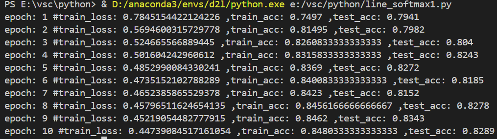

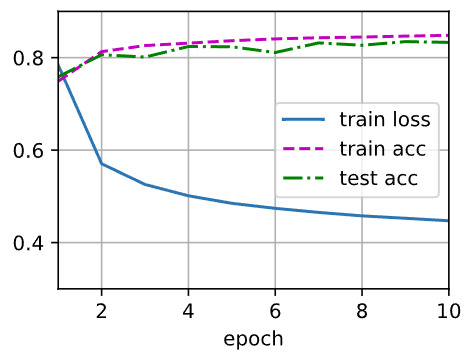

#### 可视化预测结果

```python
# 输入：模型；测试集；可视化测试结果
# 功能：获取1个批量的测试集，获取测试集真实标签文本，对预测结果获取预测标签文本，指定每个图片的标签格式，可视化n个结果，并显示标签
def predict_ch3(net, test_iter, n=6):  #@save
    """预测标签（定义见第3章）"""
    for X, y in test_iter:
        break
    trues = d2l.get_fashion_mnist_labels(y)
    preds = d2l.get_fashion_mnist_labels(net(X).argmax(axis=1))
    titles = [true +'\n' + pred for true, pred in zip(trues, preds)]
    d2l.show_images(X[0:n].reshape((n, 28, 28)), 1, n, titles=titles[0:n])

predict_ch3(net, test_iter)
```

### 3.3.2 基于Pytorch实现Softmax

```python
import torch
from torch import nn
from d2l import torch as d2l
#由于d2l中没有train_ch3，所以引用手动实现中的训练主函数
import sys
sys.path.append("./")
from line_model import line_softmax1

'''1. 获取数据集'''
batch_size = 256
# 记得在windows下运行将线程数修改为1
train_iter, test_iter = d2l.load_data_fashion_mnist(batch_size)

'''2. 初始化模型'''
# PyTorch不会隐式地调整输入的形状。因此，在线性层前定义了展平层（flatten），来调整网络输入的形状
# softmax层输入为1*28*28=784维列向量，输出为10维列向量
net = nn.Sequential(nn.Flatten(), nn.Linear(784, 10))

# 输入：当前层
# 功能：若是线性层，将其权重初始化为均值为0、方差为0.01的随机值
def init_weights(m):
    if type(m) == nn.Linear:
        nn.init.normal_(m.weight, std=0.01)

# 将初始化函数应用到网络各层，完成对线性层参数的随机初始化
net.apply(init_weights);

'''3. 损失函数定义为交叉熵'''
loss = nn.CrossEntropyLoss(reduction='none')

'''4.参数优化算法'''
# 参数：各层的参数：学习率
# 功能：获取参数优化器，利用SGD算法实现参数更新
trainer = torch.optim.SGD(net.parameters(), lr=0.1)

'''5.模型训练'''
num_epochs = 10
#输入：
#   tanin_iter对训练数据集按批量大小封装的可迭代对象
#   test_iter对测试集按批量大小封装的可迭代对象
#   loss损失函数
#   num_epochs训练次数
#   trainer参数更新器
#功能：在训练集上训练模型，使用trainer指定的参数更新方法更新模型参数，每轮训练后，在计算模型在测试集上的预测精确度，迭代指定轮数后停止
line_softmax1.train_ch3(net, train_iter, test_iter, loss, num_epochs, trainer)
```

### 3.3.3 关于损失函数的处理

["LogSumExp技巧"](https://en.wikipedia.org/wiki/LogSumExp) 

在 softmax 前，净输出 $o_i^{(k)}$ 是一个未归一化的值，可能非常大，则 $e^{o_i^{(k)}}$ 可能会大于数据类型允许的最大数字——**上溢** ，上溢会使得分母或分子无穷大，从而得到 `0` 、`inf` 、`nan` 的 $\hat{y}_i^{(k)}$ 

为避免上溢，在softmax 之前先让所有的 $o_i^{(k)}$ 减去 $\max(o^{(k)})$ ，即
$$
\begin{aligned}
\hat{y}_i^{(k)}&=\frac{e^{o_i^{(k)}-\max(o_i^{(k)})}e^{\max(o_i^{(k)})}}{\sum\limits_{k=1}^Ke^{o_i^{(k)}-\max(o_i^{(k)})}e^{\max(o_i^{(k)})}}\\
&=\frac{e^{o_i^{(k)}-\max(o_i^{(k)})}}{\sum\limits_{k=1}^Ke^{o_i^{(k)}-\max(o_i^{(k)})}}\\
\hat{\mathbf{y}}_i&=\frac{e^{\mathbf{o}_i^T-\max(o_i^{(k)})}}{\sum\limits_{k=1}^{K} e^{o_i^{(k)}-\max(o_i^{(k)})}}
\end{aligned}
$$
在减法规范化后，可能有些 $o_i^{(k)}-\max(o_i^{(k)})$ 是比较大的负值，由于精度受限，$e^{o_i^{(k)}-\max(o_i^{(k)})}$ 会接近0——**下溢** 。这些值四舍五入后，使得 $\hat{\mathbf{y}}_i$ 为零，$\log(\hat{\mathbf{y}}_i)$ 会 `-inf` ，反向传播后会出现 `nan`

尽管 *softmax* 计算的是指数函数，但之后交叉熵损失函数是指数函数，二者结合在一起可以避免反向传播过程中的数值稳定性问题。

因此，可在交叉熵损失函数中直接使用未规范化的净输出作为损失函数
$$
\begin{aligned}
\log(\hat{\mathbf{y}}_i)&=\log\left(\frac{e^{\mathbf{o}_i^T-\max(o_i^{(k)})}}{\sum\limits_{k=1}^{K} e^{o_i^{(k)}-\max(o_i^{(k)})}}\right)\\
&=\mathbf{o}_i^T-\max(o_i^{(k)})-\log\left(\sum\limits_{k=1}^{K} e^{o_i^{(k)}-\max(o_i^{(k)})}\right)
\end{aligned}
$$

## 3.4 多层感知机

### 3.4.1 线性感知机PLA

感知机解决的是二分类问题

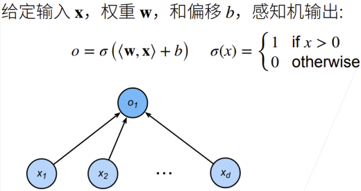

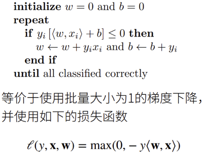

损失函数的梯度 $\frac{\partial \ell(y,\mathbf{x},\mathbf{w})}{\partial \mathbf{w}}=-y\mathbf{x}$ ，$\frac{\partial \ell(y,\mathbf{x},\mathbf{w})}{\partial b}=-y$ 

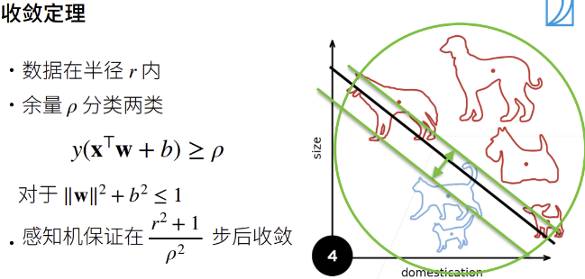

- 收敛步数影响因素：数据规模(越大收敛越慢)、分界余量（越大收敛越快）

缺陷：不能拟合XOR函数，因为单层感知机只能产生线性分割面

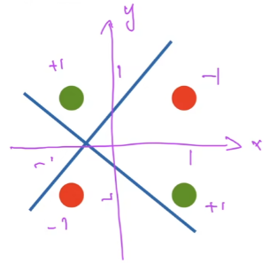

- $1\oplus1=1$，$-1\oplus-1=1$ ；$-1\oplus1=-1,1\oplus -1=-1$  

### 3.4.2 多层感知机MLP

> multi-layer perceptrons

#### XOR学习到单隐藏层感知机

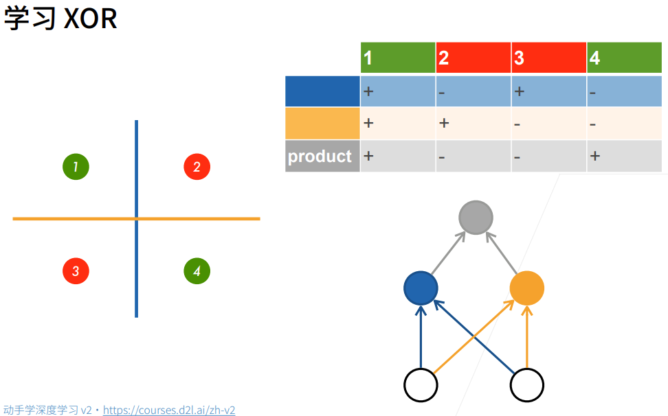

先训练蓝色感知机，将1,3分为+类，将2,4分为-类

再训练黄色感知机，将1,2分为+类，将3,4分为-类

最后训练灰色感知机，将两个+类或两个-类分为+类，将一个+类和一个-类分为-类

#### 单隐藏层MLP

输入 $\mathbf{x}\in \R^{1\times d}$ 

隐藏层 $\mathbf{W}_1\in \R^{M_1\times d}$ ，$\mathbf{b}_{1}\in \R^{1\times M_1}$  

- 隐藏层输出=输出层输入：$\mathbf{h}_1=\sigma(\mathbf{x}\mathbf{W}_1^T+\mathbf{b}_1)\in \R^{1\times M_1}$
- $\sigma(\cdot)$ 为按元素非线性激活函数

输出层 $\mathbf{w}_2\in \R^{1\times M_1}$ ，$b_2\in \R$

- $\hat{o}=\mathbf{h}_1\mathbf{w}_2^T+b_2\in\R$ 

##### 激活函数非线性

> **非线性激活函数是为了避免层数塌陷**

若激活函数为线性函数，经过隐藏层后输出等价于
$$
\begin{aligned}
o&=\mathbf{h}_1\mathbf{w}^T+b_2\\
&=\left(\mathbf{x}\mathbf{W}_1^T+\mathbf{b}_1\right)\mathbf{w}^T+b_2\\
&=\mathbf{x}\mathbf{W}_1^T\mathbf{w}^T+b'
\end{aligned}
$$
即多层嵌套后仍然是一个线性感知器，这样的学习效果不好

##### 激活函数类型

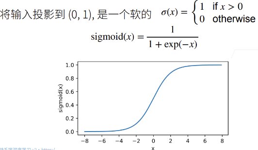

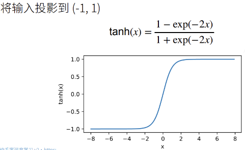

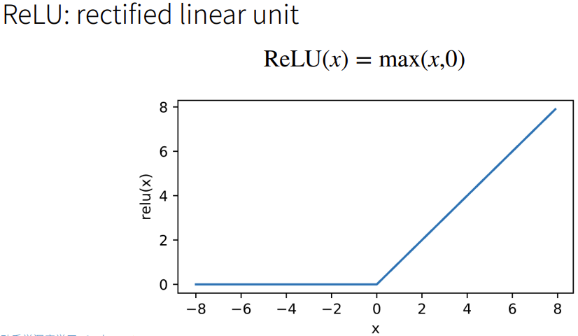

ReLU(x)：节省资源，不需要计算指数函数

##### softmax与单隐藏层多分类MLP

输入 $\mathbf{x}\in \R^{1\times d}$ 

隐藏层 $\mathbf{W}_1\in \R^{M_1\times d}$ ，$\mathbf{b}_{1}\in \R^{1\times M_1}$  

- 隐藏层输出=输出层输入：$\mathbf{h}_1=\sigma(\mathbf{x}\mathbf{W}_1^T+\mathbf{b}_1)\in \R^{1\times M_1}$
- $\sigma(\cdot)$ 为按元素非线性激活函数

输出层 $\mathbf{W}_2\in \R^{K\times M_1}$ ，$\mathbf{b}_2\in \R^{1\times K}$ 

- $\hat{\mathbf{o}}=\mathbf{h}_1\mathbf{W}_2^T+\mathbf{b}_2\in\R^{1\times K}$ 
- $\hat{\mathbf{y}}=softmax(\hat{\mathbf{o}})$ 

#### 多隐藏层

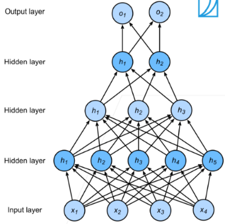

输入 $\mathbf{x}\in \R^{1\times d}$ 

第一隐藏层 $\mathbf{W}_1\in \R^{M_1\times d}$ ，$\mathbf{b}_{1}\in \R^{1\times M_1}$  

- 第一隐藏层输出=第二隐藏层输入：$\mathbf{h}_1=\sigma(\mathbf{x}\mathbf{W}_1^T+\mathbf{b}_1)\in \R^{1\times M_1}$
- $\sigma(\cdot)$ 为按元素非线性激活函数

第二隐藏层 $\mathbf{W}_2\in \R^{M_2\times M_1}$ ，$b_2\in \R^{1\times M_2}$

- 第二隐藏层输出=第三隐藏层输入：$\mathbf{h}_2=\sigma(\mathbf{h}_1\mathbf{W}_2^T+\mathbf{b}_2)\in \R^{1\times M_2}$

第三隐藏层 $\mathbf{W}_3\in \R^{M_3\times M_2}$ ，$b_3\in \R^{1\times M_3}$

- 第三隐藏层输出=输出层输入：$\mathbf{h}_3=\sigma(\mathbf{h}_2\mathbf{W}_3^T+\mathbf{b}_3)\in \R^{1\times M_3}$

输出层 $\mathbf{w}_4\in \R^{K\times M_3}$ ，$\mathbf{b}_4\in \R^{1\times K}$ 

- $\hat{\mathbf{o}}=\mathbf{h}_3\mathbf{W}_4^T+\mathbf{b}_4\in\R^{1\times K}$ 
- $\hat{\mathbf{y}}=softmax(\hat{\mathbf{o}})$ 

##### 超参数设置

- 隐藏层数
- 每个隐藏层大小：每层隐藏层神经元个数

超参数的设置需要根据经验，越复杂的输入，参数越复杂

- 模型越复杂，$K_1$ 越大

数据比较难：

- 单隐藏层，$K_1$ 设置大一些
- 网络层数深一些，相对单隐藏层的 $K_1$ ，多隐藏层的 $K_1$ 会小一些，$K_1>K_2>K_3$

数据复杂时，输入规模是比较大的，输出相对小，从输入到输出可以理解为一个压缩过程，这个压缩过程应该是逐渐变小的，这样损失的信息才最小

第一隐藏层可以选择较大的神经元，也可以对输入进行扩充，但一般不会在非第一隐藏层之后进行扩充，信息压缩后再复原是比较难得

### 3.4.3 MLP实现

将Fashion-mnist数据集用MLP训练

```python
import torch
from torch import nn
from d2l import torch as d2l

import sys
sys.path.append("./")
from line_model import line_softmax1

batch_size = 256
train_iter, test_iter = d2l.load_data_fashion_mnist(batch_size)

#num_inputs:输入层神经元个数
#num_outputs：输出层神经元个数
#num_hiddens：[0]-输入层神经元个数,[1]-输出层神经元个数,[2]-隐藏层神经元个数
num_inputs, num_outputs, num_hiddens = 784, 10, 256

#随机初始化，不能随机初始化为0
W1 = nn.Parameter(torch.randn(num_inputs, num_hiddens, requires_grad=True) * 0.01)
b1 = nn.Parameter(torch.zeros(num_hiddens, requires_grad=True))
W2 = nn.Parameter(torch.randn(num_hiddens, num_outputs, requires_grad=True) * 0.01)
b2 = nn.Parameter(torch.zeros(num_outputs, requires_grad=True))

params = [W1, b1, W2, b2]

def relu(X):
    a = torch.zeros_like(X)
    return torch.max(X, a)

def net(X):
    #拉成二维矩阵，一张三维图片(1,28,28)变为一维向量(1,784)；256张变为(256,784)的矩阵
    X = X.reshape((-1, num_inputs))
    H = relu(X@W1 + b1)  # 这里“@”代表矩阵乘法
    return (H@W2 + b2)

loss = nn.CrossEntropyLoss(reduction='none')

num_epochs, lr = 10, 0.1
updater = torch.optim.SGD(params, lr=lr)
line_softmax1.train_ch3(net, train_iter, test_iter, loss, num_epochs, updater)
```

同样训练10轮，损失降了，但精确度没降

### 3.4.4 基于Pytorch的MLP实现

```python
import torch
from torch import nn
from d2l import torch as d2l
import sys
sys.path.append("./")
from line_model import line_softmax1

#参数数量：
#   展平层：256*(1,28,28)->(256,784)
#   线性隐藏层(256,784)*(784, 256)->(256,256)
#   激活隐藏层
#   输出层(256,256)*(256, 10)->(256,10)
net = nn.Sequential(nn.Flatten(),
                    nn.Linear(784, 256),
                    nn.ReLU(),
                    nn.Linear(256, 10))

def init_weights(m):
    # 只需要初始化线性层的参数
    if type(m) == nn.Linear:
        nn.init.normal_(m.weight, std=0.01)
#将参数应用到网络
net.apply(init_weights)

batch_size, lr, num_epochs = 256, 0.1, 10
# 交叉熵损失
loss = nn.CrossEntropyLoss(reduction='none')
# 对参数随机梯度下降
trainer = torch.optim.SGD(net.parameters(), lr=lr)

train_iter, test_iter = d2l.load_data_fashion_mnist(batch_size)
#输入：
#   tanin_iter对训练数据集按批量大小封装的可迭代对象
#   test_iter对测试集按批量大小封装的可迭代对象
#   loss损失函数
#   num_epochs训练次数
#   trainer参数更新器
#功能：在训练集上训练模型，使用trainer指定的参数更新方法更新模型参数，每轮训练后，在计算模型在测试集上的预测精确度，迭代指定轮数后停止
line_softmax1.train_ch3(net, train_iter, test_iter, loss, num_epochs, trainer)
```
