---
categories:
  - AI
  - 机器学习
  - 深度学习
tags:
  - AI
  - 机器学习
  - 深度学习
mathjax: true
title: 4.动手学深度学习-模型评估
abbrlink: 2645721241
date: 2024-03-19 16:56:10
updated: 2024-03-21 22:39:44
---

[TOC]

<!--more-->

## 4.1 模型选择、欠拟合、过拟合

### 4.1.1 模型选择

#### 数据集

**验证集** ：用于选择模型超参数，**进行超参数组合的确定与模型结构的调整** 

- 训练集与验证集：实际上，开源数据集是在网络上都是能找到的，所以网络上随便的数据集都不能作为验证集

  用于验证的数据集在训练过程中不能被使用

- 验证集与测试集：

  参数调优是基于验证集的，若对测试数据集多次使用则也会变为验证集。验证数据集上的性能不等于测试数据集上的泛化性能

  测试数据集，只能使用一次，在测试数据集上的表现用于评价为模型的泛化性能

#### 验证方法

##### 简单验证

简单验证： 将原始数据集随机划分成训练集和验证集两部分

- 例，将数据按照7：3的比例分成两部分，70%的样本用于训练模型；30%的样本用于模型验证。

缺点：

- 数据都只被用了一次
- 模型并不是完全训练集上得到的，并没有充分学习训练集
- 验证集上计算出来的评估指标与原始分组有很大关系；

##### K-折交叉验证

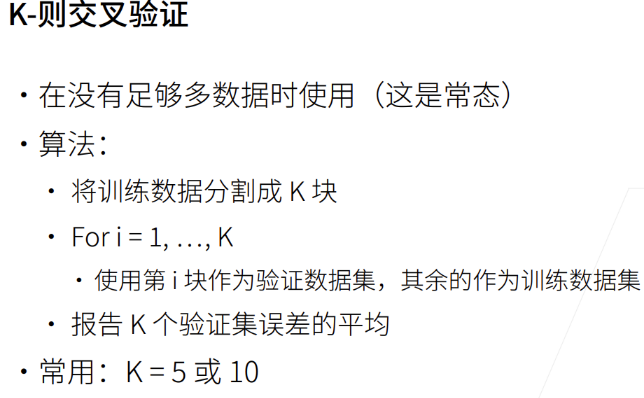

下一折的训练并不是在上一折的基础上训练，即每训练新的一折，都要重新初始化参数进行训练

K折交叉验证只能做验证使用，因此不能根据它的结果做为模型参数的保存判断依据，但可以基于它做超参组合的确定与模型结构的调整，然后再重新初始化模型，进行训练得到较好的模型参数。

对于有时序信息的数据，要看看不同折之间性能表现会不会有明显差距

K的选择

- K越大，则K-折平均训练误差接近训练集上的真实误差

  - n折交叉验证有多少个数据意味着一轮训练需要计算多少次

- K折交叉验证一次，$总训练轮数=每折训练轮数(epochs)\times 总折数(K)$ 

  意味着：K越大，计算代价越大。训练成本会翻K倍

- 数据规模越大，K可以取越小；数据规模越小，K需要取越大

### 4.1.2 过拟合、欠拟合

模型容量：表示模型的拟合能力，模型容量越大，可以拟合更复杂的函数

数据：简单数据 / 复杂数据集

根据数据的复杂程度选择模型容量


- 简单数据、复杂模型：会将训练数据全部拟合，造成模型泛化能力差

- 复杂数据、简单模型：未能学习到训练数据的全部特征

  PLA为例，对于异或学习太简单；改用多层PLA，可以学习数据的更多信息，从而很好拟合数据

#### 模型容量与误差关系

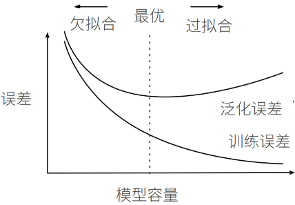

简单模型，模型容量差，拟合能力上限，会造成欠拟合

复杂模型，模型容量高，**数据集越小，模型容量越高，越容易造成过拟合**

- 为尽可能降低泛化误差，需要承受一定的过拟合风险

- 通过各种技巧，控制模型容量，使得泛化误差尽可能降低

  实际中，**通过训练误差与验证误差的差距来调整模型容量**

#### 估计模型容量

对于不同的算法，不同种类的算法比较模型容量很难

- 树模型与神经网络结构上不同，所以很难比较

对于一个确定的学习算法，（如：神经网络），主要有两个主要因素：

- 参数个数

  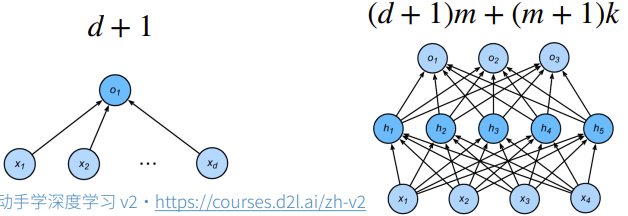

- 参数取值范围

参数个数越多，参数取值范围越大，则认为模型容量越高

##### 模型理论容量—VC维

对于一个分类模型，VC维等于该模型最大可分类数据集的大小。即对于一个确定的数据集容量，不管数据集中输入特征、输出标签如何变化，该分类模型都存在一个参数组合能将该数据集完美分类，则将这个数据集容量称为VC维

- 二维输入的PLA，数据有两个维度

  参数也有2个维度，其VC维=3

  

  对于异或学习，二维输入的PLA显然不能学习

  

- N维输入的PLA，输入数据有N维，参数也有N个维度，其VC维=N+1

  一些MLP的VC维为 $O(N\log_2 N)$

VC维提供了一个模型参数结构好坏的理论评价依据，但深度学习很少用

- 衡量不是很准确，只是模型容量的下界
- 深度学习模型的VC维很难

#### 数据复杂度

- 样本个数
- 每个样本的元素个数
- 样本/元素间的时间、空间结构
- 数据多样性(数据标签个数)

数据复杂度只是直观上的感觉，与先前的训练过的数据集对比，复杂一点，用模型容量高点的模型；数据复杂度简单一点，用模型容量低点的模型

### 4.1.3 直观理解

#### 构造数据集

生成多项式的随机数据
$$
y = 5 + 1.2x - 3.4\frac{x^2}{2!} + 5.6 \frac{x^3}{3!} + \epsilon \text{ where }
\epsilon \sim \mathcal{N}(0, 0.1^2)
$$
噪音 $\varepsilon$ 服从均值为0，方差为 $0.1^2$ 的正态分布

- 使用泰勒多项式的好处：$\frac{x^i}{i!}$ 可以避免很大的 $i$ 带来特别大的指数值

```python
import math
import numpy as np
import torch
from torch import nn
from d2l import torch as d2l

#生成200个数据点：100个作为训练，100个用于验证
features = np.random.normal(size=(n_train + n_test, 1))
np.random.shuffle(features)
```

$$
feature=\begin{bmatrix}
f_1\\f_2\\\vdots\\f_{200}
\end{bmatrix}\in \mathbb{R}^{200\times 1}
$$

```python
max_degree = 20  # 多项式的最大阶数
n_train, n_test = 100, 100  # 训练和测试数据集大小
true_w = np.zeros(max_degree)  # 分配大量的空间
true_w[0:4] = np.array([5, 1.2, -3.4, 5.6])

poly_features = np.power(features, np.arange(max_degree).reshape(1, -1))
```

$$
\mbox{poly\_feature}=\begin{bmatrix}
f_1^0&f_1^1&f_1^2&\cdots&f_1^{19}\\
f_2^0&f_2^1&f_2^2&\cdots&f_2^{19}\\
\vdots&\vdots&\vdots&\ddots&\vdots\\
f_{200}^0&f_{200}^1&f_{200}^2&\cdots&f_{200}^{19}\\
\end{bmatrix}
$$

```python
for i in range(max_degree):
    poly_features[:, i] /= math.gamma(i + 1)  # gamma(n)=(n-1)!
```

计算每个项的 $\frac{f_j^i}{i!}$ 

```python
labels = np.dot(poly_features, true_w)
```

$$
\text{p\_f}_{200\times 20}\cdot \text{true\_w}_{20\times 1}^T=\text{labels}_{200\times 1}\\
labels=5 + 1.2x - 3.4\frac{x^2}{2!} + 5.6 \frac{x^3}{3!}
$$

```python
labels += np.random.normal(scale=0.1, size=labels.shape)
```

$$
labels=5 + 1.2x - 3.4\frac{x^2}{2!} + 5.6 \frac{x^3}{3!}+\varepsilon
$$

```python
# NumPy ndarray转换为tensor
true_w, features, poly_features, labels = [torch.tensor(x, dtype=torch.float32) for x in [true_w, features, poly_features, labels]]
```

#### 模型精确度

```python
def evaluate_loss(net, data_iter, loss):  #@save
    """评估给定数据集上模型的损失"""
    metric = d2l.Accumulator(2)  # 损失的总和,样本数量
    for X, y in data_iter:
        out = net(X)
        y = y.reshape(out.shape)
        l = loss(out, y)
        metric.add(l.sum(), l.numel())
    return metric[0] / metric[1]
```

#### 训练主函数

```python
# 输入：训练数据；测试数据；训练集输出；测试集输出；迭代轮数
def accuracy(y_hat, y):  #@save
    """计算预测正确的数量"""
    if len(y_hat.shape) > 1 and y_hat.shape[1] > 1:
        y_hat = y_hat.argmax(axis=1)
    cmp = y_hat.type(y.dtype) == y
    return float(cmp.type(y.dtype).sum())
def train_epoch_ch3(net, train_iter, loss, updater):  #@save
    """训练模型一个迭代周期（定义见第3章）"""
    # 将模型设置为训练模式
    if isinstance(net, torch.nn.Module):
        net.train()
    # 训练损失总和、训练准确度总和、样本数
    metric = d2l.Accumulator(3)
    for X, y in train_iter:
        # 计算梯度并更新参数
        y_hat = net(X)
        l = loss(y_hat, y)
        if isinstance(updater, torch.optim.Optimizer):
            # 使用PyTorch内置的优化器和损失函数
            updater.zero_grad()
            l.mean().backward()
            updater.step()
        else:
            # 使用定制的优化器和损失函数
            l.sum().backward()
            updater(X.shape[0])
        metric.add(float(l.sum()), accuracy(y_hat, y), y.numel())
    # 返回训练损失和训练精度
    return metric[0] / metric[2], metric[1] / metric[2]

def train(train_features, test_features, train_labels, test_labels, num_epochs=400):
    loss = nn.MSELoss(reduction='none')
    #训练数据集train_features.shape_{100,|w|}
    #	train_features.shape[-1]为参数个数
    input_shape = train_features.shape[-1]
    # 设置线性层参数，不设置偏置，因为我们已经在多项式中实现了它
    net = nn.Sequential(nn.Linear(input_shape, 1, bias=False))
    batch_size = min(10, train_labels.shape[0])
    train_iter = d2l.load_array((train_features, train_labels.reshape(-1,1)),
                                batch_size)
    test_iter = d2l.load_array((test_features, test_labels.reshape(-1,1)),
                               batch_size, is_train=False)
    trainer = torch.optim.SGD(net.parameters(), lr=0.01)
    animator = d2l.Animator(xlabel='epoch', ylabel='loss', yscale='log',
                            xlim=[1, num_epochs], ylim=[1e-3, 1e2],
                            legend=['train', 'test'])
    for epoch in range(num_epochs):
        train_epoch_ch3(net, train_iter, loss, trainer)
        if epoch == 0 or (epoch + 1) % 20 == 0:
            animator.add(epoch + 1, (evaluate_loss(net, train_iter, loss),
                                     evaluate_loss(net, test_iter, loss)))
    print('weight:', net[0].weight.data.numpy())
```

#### 对比不同训练数据

```python
# 首先看模型容量(5个参数)与真实模型(5个参数)相同的模型训练过程与模型验证结果
train(poly_features[:n_train, :4], poly_features[n_train:, :4],labels[:n_train], labels[n_train:])
```

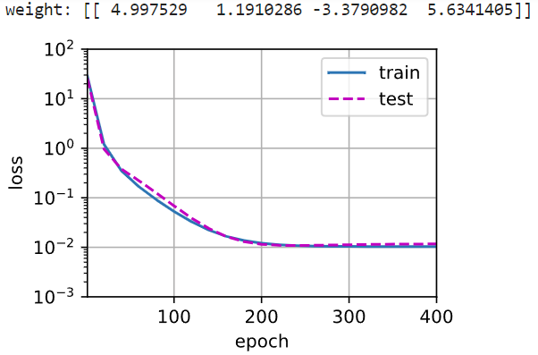

```python
# 再看模型容量(2个参数)小于真实模型(5个参数)相同的模型训练过程与模型训练结果——欠拟合
# 从多项式特征中选择前2个维度，即1和x
train(poly_features[:n_train, :2], poly_features[n_train:, :2],
      labels[:n_train], labels[n_train:])
```

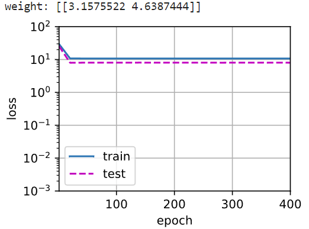

```python
# 最后看模型容量(20个参数)大于真实模型(5个参数)相同的模型训练过程与模型训练结果——存在过拟合风险
# 从多项式特征中选取所有维度
train(poly_features[:n_train, :], poly_features[n_train:, :],
      labels[:n_train], labels[n_train:], num_epochs=1500)
```

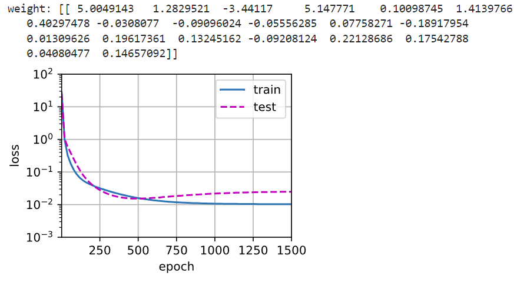

在高维度上学到了噪音信息，所以出现过拟合线性

## 4.2 处理过拟合的方法

在给出大量样本少量特征时，简单模型通常不会过拟合

简单模型(线性模型)具有较高的泛化性能，即模型的方差很低：在不同的数据集上有相似的表现。但由于 **偏差-方差权衡** ，泛化性能好的，偏差会比较高（只能学习到数据集的部分特征）

神经网络学习的是特征之间的关联对结果的影响，而不局限于单个特征对结果的影响。神经网络的模型容量非常大，即偏差小（理论上能学习到数据集的所有特征），方差高（受数据集变化影响大）。所以即使对于有很多特征的数据集，神经网络也很容易过拟合。

一个好的模型需要对输入数据的扰动鲁棒，即模型的方差与偏差尽可能同时小

处理过拟合的思路从两个方面考虑

- 将参数规模变小
- 将参数取值范围变小

权重衰减和丢弃法从不同角度出发最后都是将部分参数取0，从参数数量和参数取值上提供了一种连续的过拟合处理方法

### 4.2.1 权重衰减

> 权重衰减是通过限制参数值的取值范围(控制与0的距离)来控制模型容量的方法

**[应用了权重衰减的神经网络，最终某些权重会变成零](https://stats.stackexchange.com/questions/29130/difference-between-neural-net-weight-decay-and-learning-rate)**，权重为零相当于这个神经元会被抛弃。神经网络中某些权重归零，表示模型的复杂度下降了，多了一个零，少了一个参数

- [权重衰减和学习率衰减区别](https://www.cnblogs.com/zzk0/p/15056312.html)

#### 使用二范数作为硬性限制

使得目标函数变为带约束项的目标函数
$$
\min \ell(\mathbf{w},b)\quad s.t. \Vert w\Vert^2\le \theta
$$
- 原先训练目标：最小化训练标签上的预测损失
- 调整训练目标：最小化预测损失和惩罚项之和

通常不限制偏移 $b$ ，小的 $\theta$ 意味着更强的正则项

**在实现上比较困难**

#### 二范数作为柔性限制

对每个 $\theta$ ，都可以找到 $\lambda$ 带约束项的目标函数等价于带正则项的目标函数
$$
\min \ell(\mathbf{w},b)+\frac{\lambda}{2} \Vert \mathbf{w}\Vert^2
$$

超参数 $\lambda$ 控制了正则项的重要程度

- $\lambda=0$ ：无作用
- $\lambda\rightarrow \infty\Rightarrow \mathbf{w}^*\rightarrow 0$

若想使模型复杂度低，可以通过增大 $\lambda$ 来实现需求

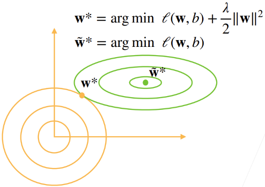

当 $\lambda\neq 0$ 时， 正则项对最小化目标函数的产生影响，使得最优的参数取值发生偏移 $\tilde{\mathbf{w}}^*\neq \mathbf{w}^*$  

随着 $\lambda$ 的增大，正则项对参数取值的影响越大

正则项会使参数的2范数会靠近0点，权重整体会变小；同时，若权重继续衰减，则 $\ell$ 的增加项会抵消 $\Vert \mathbf{w}\Vert^2$ 的减小项。所以会在 $\tilde{\mathbf{w}}^*$ 形成平衡点

因此，正则项的引入会使模型整体的复杂度降低

#### 参数更新法则

带正则项的损失函数梯度
$$
\frac{\partial}{\partial\mathbf{w}}\left(\ell(\mathbf{w},b)+\frac{\lambda}{2} \Vert w\Vert^2\right)=\frac{\partial \ell(\mathbf{w},b)}{\partial \mathbf{w}}+\lambda\mathbf{w}
$$
在梯度下降算法中
$$
\begin{aligned}
\mathbf{w}_{t+1}&=\mathbf{w}_{t}-\eta\left(\frac{\partial \ell(\mathbf{w}_t,b)}{\partial \mathbf{w}_t}+\lambda\mathbf{w}_t\right)\\
&=\left(1-\eta\lambda\right)\mathbf{w}_t-\eta\frac{\partial \ell(\mathbf{w}_t,b)}{\partial \mathbf{w}_t}
\end{aligned}
$$
通常，$\eta\lambda<1$ ，即在每次更新参数前，参数 $\mathbf{w}$ 都会先变小，所以称为权重衰减

一般情况下，我们会根据估计值与观测值之间的平均差异来调整参数结构、参数取值，为了控制模型容量尽量避免过拟合，我们会试图将 $\mathbf{w}$ 的大小缩小到0， **权重衰减提供了一种连续的机制来调整函数的复杂度** 

通常选择 $1e^{-3}=0.001$ 

#### 实现

##### 生成数据

$$
y = 0.05 + \sum_{i = 1}^d 0.01 x_i + \epsilon \text{ where }
\epsilon \sim \mathcal{N}(0, 0.01^2)
$$

```python
import torch
from torch import nn
from d2l import torch as d2l

#训练数据集越小越容易过拟合
#	数据集越简单，模型越复杂，过拟合越容易发生
#	num_inputs=200 模型参数数量
n_train, n_test, num_inputs, batch_size = 20, 100, 200, 5
# 200维全0.01参数列向量
true_w, true_b = torch.ones((num_inputs, 1)) * 0.01, 0.05
#生成带干扰的数据集 
#	train_data[0]=X torch.Size([20, 200])
#	train_data[1]=y torch.Size([20, 1])
train_data = d2l.synthetic_data(true_w, true_b, n_train)
train_iter = d2l.load_array(train_data, batch_size)
test_data = d2l.synthetic_data(true_w, true_b, n_test)
test_iter = d2l.load_array(test_data, batch_size, is_train=False)
```

##### 参数初始化

```python
def init_params():
    w = torch.normal(0, 1, size=(num_inputs, 1), requires_grad=True)
    b = torch.zeros(1, requires_grad=True)
    return [w, b]
```

##### 正则项

```python
def l2_penalty(w):
    return torch.sum(w.pow(2)) / 2
```

##### 训练

```python
def train(lambd):
    w, b = init_params()
    #匿名函数 lambda 参数X:返回值
    net, loss = lambda X: d2l.linreg(X, w, b), d2l.squared_loss
    num_epochs, lr = 100, 0.003
    animator = d2l.Animator(xlabel='epochs', ylabel='loss', yscale='log',xlim=[5, num_epochs], legend=['train', 'test'])
    for epoch in range(num_epochs):
        for X, y in train_iter:
            # 增加了L2范数惩罚项，
            # 广播机制使l2_penalty(w)成为一个长度为batch_size的向量
            l = loss(net(X), y) + lambd * l2_penalty(w)
            l.sum().backward()
            d2l.sgd([w, b], lr, batch_size)
        if (epoch + 1) % 5 == 0:
            animator.add(epoch + 1, (d2l.evaluate_loss(net, train_iter, loss),
                                     d2l.evaluate_loss(net, test_iter, loss)))
    print('w的L2范数是：', torch.norm(w).item())
```

不加正则项，很明显的过拟合，训练误差与测试误差的差距非常大

```python
train(lambd=0)
```

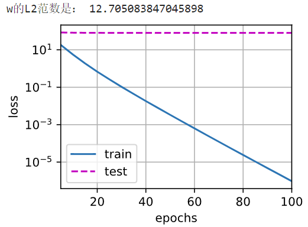

使用权重衰减

仍有过拟合，但两个误差的差距小了很多

- 增大正则项

- 增加训练epoch：本例中，测试误差仍在下降，所以可以增加训练轮次

```python
train(lambd=3)
```

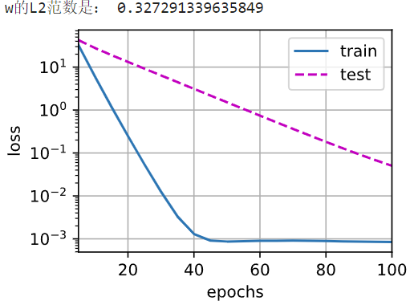

#### torch实现

在实例化优化器时直接通过`weight_decay`指定weight decay超参数

 默认情况下，PyTorch同时衰减权重和偏移。 这里我们只为权重设置了`weight_decay`，所以偏置参数 $b$ 不会衰减。

```python
def train_concise(wd):
    net = nn.Sequential(nn.Linear(num_inputs, 1))
    for param in net.parameters():
        param.data.normal_()
    loss = nn.MSELoss(reduction='none')
    num_epochs, lr = 100, 0.003
    # 偏置参数没有衰减
    #   {"params":net[0].weight,'weight_decay': wd},对参数权重衰减
    trainer = torch.optim.SGD([
        {"params":net[0].weight,'weight_decay': wd},
        {"params":net[0].bias}], lr=lr)
    animator = d2l.Animator(xlabel='epochs', ylabel='loss', yscale='log',
                            xlim=[5, num_epochs], legend=['train', 'test'])
    for epoch in range(num_epochs):
        for X, y in train_iter:
            trainer.zero_grad()
            l = loss(net(X), y)
            l.mean().backward()
            trainer.step()
        if (epoch + 1) % 5 == 0:
            animator.add(epoch + 1,
                         (d2l.evaluate_loss(net, train_iter, loss),
                          d2l.evaluate_loss(net, test_iter, loss)))
    print('w的L2范数：', net[0].weight.norm().item())
    
train_concise(0)
train_concise(3)
```

### 4.2.2 dropout法

为增强模型的鲁棒性，缩小训练性能与测试性能的差距，模型越简单越好

简单性一方面是特征的维度小，参数的范数代表了一种简单性度量；另一方面是平滑性，指函数不应该对数据的微小扰动敏感

- 使用有噪音的数据等价于 Tikhonov 正则

Hinton将该想法引入神经网络的隐藏层：**在层之间加噪音** ——dropout法

- 前提是无偏丢弃，固定其他层时，每一层的期望值相当于没有噪音时的值

  对输入 $\mathbf{x}$ 通过dropout法加噪音得到 $\mathbf{x}'$ ，使得 $E[\mathbf{x}']=\mathbf{x}$ 

以一定概率丢弃某些神经元，隐藏层每个神经元的活性值 $\mathbf{h}$ 以一定概率 $p$ 被随机变量$\mathbf{h}'$ 替换
$$
h'=\begin{cases}
0&,概率为p\\
\frac{h}{1-p}&,其他情况
\end{cases}
$$

- $E[h']=p\times 0+(1-p)\frac{h}{1-p}=h$ ，即有 $1-p$ 的概率这个活性值会变大

#### 将dropout应用于隐藏层


$$
\mathbf{h}=\sigma(\mathbf{x}\mathbf{W}_1+\mathbf{b_1})\\
\mathbf{h}'=dropout(\mathbf{h})\\
\mathbf{o}=\mathbf{h}'\mathbf{W}_2+\mathbf{b}_2\\
\hat{\mathbf{y}}=softmax(\mathbf{o})
$$
在训练过程中，每次都采样到这个隐藏层的部分神经元（子隐藏层），多轮训练，这些子隐藏层训练的平均会有不错的结果。

从实验上，dropout法和正则项都会将某些特征的参数变为0

#### 预测中不适用dropout

正则项只在训练中使用：影响模型参数的更新

在验证与测试中，dropout直接返回输入
$$
\mathbf{h}=dropout(\mathbf{h})
$$

#### dropout技巧

技巧：将神经网络隐藏层稍微放大一些，然后用droupout正则化

比不用dropout直接对模型参数结构进行调整效果好一些

#### 实现

```python
import torch
from torch import nn
from d2l import torch as d2l

# 超参数
num_epochs, lr, batch_size = 10, 0.5, 256
num_inputs, num_outputs, num_hiddens1, num_hiddens2 = 784, 10, 256, 256
dropout1, dropout2 = 0.2, 0.5
```

- ```python
  def dropout_layer(X, dropout):
      assert 0 <= dropout <= 1
      # 在本情况中，所有元素都被丢弃
      if dropout == 1:
          return torch.zeros_like(X)
      # 在本情况中，所有元素都被保留
      if dropout == 0:
          return X
  
      #功能：每个神经元以dropout的概率被随机丢弃，若固定某几个神经元，相当于直接将隐藏层变小
      #  0*该神经元值=0即被丢弃，CPU和GPU中，做乘法比选择元素来得快
      #     生成(0,1)间的均匀分布，取随机数参数
      #     若X[i]>dropout，则X[i]=1；否则X[i]=0
      mask = (torch.rand(X.shape) > dropout).float()
      return mask * X / (1.0 - dropout)
  
  class Net(nn.Module):
      def __init__(self, num_inputs, num_outputs, num_hiddens1, num_hiddens2,
                   is_training = True):
          super(Net, self).__init__()
          self.num_inputs = num_inputs
          self.training = is_training
          self.lin1 = nn.Linear(num_inputs, num_hiddens1)
          self.lin2 = nn.Linear(num_hiddens1, num_hiddens2)
          self.lin3 = nn.Linear(num_hiddens2, num_outputs)
          self.relu = nn.ReLU()
  
      def forward(self, X):
          H1 = self.relu(self.lin1(X.reshape((-1, self.num_inputs))))
          # 只有在训练模型时才使用dropout
          if self.training == True:
              # 在第一个全连接层之后添加一个dropout层
              H1 = dropout_layer(H1, dropout1)
          H2 = self.relu(self.lin2(H1))
          if self.training == True:
              # 在第二个全连接层之后添加一个dropout层
              H2 = dropout_layer(H2, dropout2)
          out = self.lin3(H2)
          return out
  
  net = Net(num_inputs, num_outputs, num_hiddens1, num_hiddens2)
  ```

- ```python
  net = nn.Sequential(nn.Flatten(),
          nn.Linear(784, 256),
          nn.ReLU(),
          # 在第一个全连接层之后添加一个dropout层
          nn.Dropout(dropout1),
          nn.Linear(256, 256),
          nn.ReLU(),
          # 在第二个全连接层之后添加一个dropout层
          nn.Dropout(dropout2),
          nn.Linear(256, 10))
  
  def init_weights(m):
      # 仅线性层有参数需要初始化
      if type(m) == nn.Linear:
          nn.init.normal_(m.weight, std=0.01)
  
  net.apply(init_weights);
  ```

```python
#定义损失计算器
loss = nn.CrossEntropyLoss(reduction='none')
#生成数据
train_iter, test_iter = d2l.load_data_fashion_mnist(batch_size)
#定义参数更新器
trainer = torch.optim.SGD(net.parameters(), lr=lr)
d2l.train_ch3(net, train_iter, test_iter, loss, num_epochs, trainer)
```

## 4.3 数值(梯度值)稳定性

### 4.3.1 梯度爆炸、消失原因

对于有 $L$ 层的神经网络，第 $l$ 层的活性值为 $\mathbf{h}_l$  
$$
\mathbf{h_l}=\sigma\left(\mathbf{o}_l\right)=\sigma(\mathbf{h}_{l-1}\mathbf{W}_l^T+\mathbf{b}_l)=f_l(\mathbf{h}_{l-1})
$$
其中，$\mathbf{h}_{l-1}\in \mathbb{R}^{1\times M_{l-1}}$ ，$\mathbf{W}\in\R^{M_{l}\times M_{l-1}}$ ，$\mathbf{b}_l\in \mathbb{R}^{1\times M_l}$ 

输出层 $\hat{\mathbf{y}}=f_L\circ f_{L-1}\cdots \circ f_1(\mathbf{X})$ ，损失函数为 $\ell(\mathbf{y},\hat{\mathbf{y}})$ ，损失函数关于第 $l$ 层参数的梯度为
$$
\frac{\partial\ell}{\partial\mathbf{W}_l}=\underbrace{\frac{\partial\ell}{\partial\mathbf{h}_L}\frac{\partial\mathbf{h}_{L}}{\partial\mathbf{h}_{L-1}}\cdots\frac{\partial\mathbf{h}_{l+1}}{\partial\mathbf{h}_{l}}}_{L-l次矩阵乘}\frac{\partial\mathbf{h}_{l}}{\partial\mathbf{W}_l}
$$

- $\frac{\partial\ell}{\partial\mathbf{W}_l}\in \mathbb{R}^{M_{l}\times M_{l-1}}$ ，$\frac{\partial \ell}{\partial \mathbf{h}_{L}}\in \mathbb{R}^{1\times M_L}$ ， $\frac{\partial\mathbf{h}_{l}}{\partial\mathbf{h}_{l-1}}\in\R^{M_{l}\times M_{l-1}}$ ，$\frac{\partial\mathbf{h}_{l}}{\partial\mathbf{W}_l}\in \mathbb{R}^{M_l\times M_{l}\times M_{l-1}}$ 

由于 $\frac{\partial \mathbf{h_l}}{\partial \mathbf{h}_{l-1}}=\frac{\partial\mathbf{h}_{l}}{\partial \mathbf{o}_l}\frac{\partial \mathbf{o}_l}{\partial \mathbf{h}_{l-1}}$ 

- $$
  \begin{aligned}
  \frac{\partial \mathbf{h}_l}{\partial \mathbf{o}_l}&=\begin{bmatrix}
  \frac{\partial \sigma\left(o^{(1)}_l\right)}{\partial o^{(1)}_l}&\frac{\partial \sigma\left(o^{(1)}_l\right)}{\partial o^{(2)}_l}&\cdots&\frac{\partial \sigma\left(o^{(1)}_l\right)}{\partial o^{(M_{l})}_l}\\
  \frac{\partial \sigma\left(o^{(2)}_l\right)}{\partial o^{(1)}_l}&\frac{\partial \sigma\left(o^{(2)}_l\right)}{\partial o^{(2)}_l}&\cdots&\frac{\partial \sigma\left(o^{(2)}_l\right)}{\partial o^{(M_{l})}_l}\\
  \vdots&\vdots&\ddots&\vdots\\
  \frac{\partial \sigma\left(o^{(M_{l})}_l\right)}{\partial o^{(1)}_l}&\frac{\partial \sigma\left(o^{(M_{l})}_l\right)}{\partial o^{(2)}_l}&\cdots&\frac{\partial \sigma\left(o^{(M_{l})}_l\right)}{\partial o^{(M_{l})}_l}\\
  \end{bmatrix}=\begin{bmatrix}
  \sigma'\left(o_l^{(1)}\right)&0&\cdots&0\\
  0&\sigma'\left(o_l^{(2)}\right)&\cdots&0\\
  \vdots&\vdots&\ddots&\vdots\\
  0&0&\cdots&\sigma'\left(o^{(M_{l})}_l\right)
  \end{bmatrix}\\
  &=diag\left[\sigma'\left(o_l^{(i)}\right)\right],i\in \left[1,M_{l}\right]\\
  &=diag\left[\sigma'\left(\mathbf{h}_{l-1}\mathbf{W}_l^T+\mathbf{b}_l\right)\right]
  \end{aligned}
  $$

- $$
  \begin{aligned}
  \frac{\partial \mathbf{o}_l}{\partial \mathbf{h}_{l-1}}&=\frac{\partial \left(\mathbf{h}_{l-1}\mathbf{W}_l^T+\mathbf{b}_l\right)}{\partial \mathbf{h}_{l-1}}\in \mathbb{R}^{M_l\times M_{l-1}}\\
  &=\mathbf{W}_l
  \end{aligned}
  $$

则 $\frac{\partial \mathbf{h_l}}{\partial \mathbf{h}_{l-1}}=diag\left[\sigma'\left(\mathbf{h}_{l-1}\mathbf{W}_l+\mathbf{b}_l\right)\right]\mathbf{W}_l$ 

故
$$
\frac{\partial\mathbf{h}_{L}}{\partial\mathbf{h}_{L-1}}\cdots\frac{\partial\mathbf{h}_{l+1}}{\partial\mathbf{h}_{l}}=\prod\limits_{i=l}^{L-1}\frac{\partial\mathbf{h}_{i+1}}{\partial\mathbf{h}_{i}}=\prod\limits_{i=l}^{L-1} diag\left[\sigma'\left(\mathbf{h}_{i-1}\mathbf{W}_i+\mathbf{b}_i\right)\right]\mathbf{W}_i
$$

#### 梯度爆炸

> 使用ReLU作为激活函数
> $$
> \sigma(x)=\max(0,x),\sigma'(x)=\begin{cases}
> 1&,x>0\\
> 0&,其他\end{cases}
> $$
> 此时，$\prod\limits_{i=l}^{L-1}\frac{\partial\mathbf{h}_{i+1}}{\partial\mathbf{h}_{i}}=\prod\limits_{i=l}^{L-1} diag\left[\sigma'\left(\mathbf{h}_{i-1}\mathbf{W}_i+\mathbf{b}_i\right)\right]\mathbf{W}_i$ 的一些元素会来自于 $\prod\limits_{i=l}^{L-1}\mathbf{W}_i$ ，若网络层数很深 $L-l-1$ 很大，则这些值可能非常大

值超出值域：一般采用float16计算，因为计算快于float32，但值域小 $6e^{-5}\sim 6e^4$ ，很容易超出值域

对学习率敏感

- 若学习率太大，则参数值大，进而造成更大的梯度
- 若学习率太小，训练无进展
- 因此在训练过程中需要频繁调整学习率

#### 梯度消失

> 使用sigmod作为激活函数
> $$
> \sigma(x)=\frac{1}{1+e^{-x}},\sigma'(x)=\sigma(x)(1-\sigma(x))\in[0,0.25]\\
> \tanh'(x)=1-\left(\tanh(x)\right)^2\in [0,1]
> $$
> 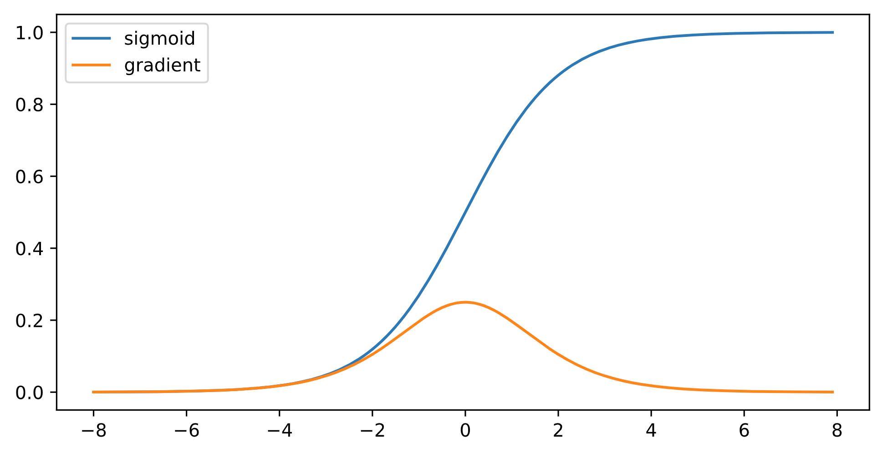
>
> 此时，$\prod\limits_{i=l}^{L-1}\frac{\partial\mathbf{h}_{i+1}}{\partial\mathbf{h}_{i}}=\prod\limits_{i=l}^{L-1} diag\left[\sigma'\left(\mathbf{h}_{i-1}\mathbf{W}_i+\mathbf{b}_i\right)\right]\mathbf{W}_i$ 的元素值是 $L-l-1$ 个小数值的乘积
>
> 在饱和区导数接近于0，这样误差经过每一层传递会不断衰减，当网络层数很深时，梯度就会不断衰减， 甚至消失，这就是梯度消失问题

后果：

- 梯度值变为0：对float16严重
- 训练无进展：不管学习率多大
- 对深处的网络层极为严重：仅浅层网络训练好，无法让网络更深

可以采用导数比较大的激活函数，ReLU函数

### 4.3.2 增加数值稳定性方法

目标：让梯度值在合理范围内

- 将每层的输出和梯度都看做随机变量，让各层输出和梯度的均值和方差都保持一致

  正向：$E[\mathbf{h}_l^{(i)}]=0,var[\mathbf{h}_l^{(i)}]=a$ 

  反向：$E\left[\frac{\partial \ell}{\partial \mathbf{h}_l^{(i)}}\right]=0,var\left[\frac{\partial \ell}{\partial \mathbf{h}_l^{(i)}}\right]=b$ 

  若每层方差都是一个常数，则这样的神经网络的梯度值会稳定

方法：

- 乘法变加法：ResNet、LSTM
- 归一化：梯度归一化、梯度裁剪
- 合理的初始权重和激活函数

### 4.3.3 权重初始化

参数初始化到合理的取值区间内

训练开始时更容易数值不稳定

- 远离最优解的地方损失函数可能很复杂
- 最优解附近表面会比较平缓、稳定

使用 $\mathcal{N}(0,0.01)$ 初始参数，对于比较浅的神经网络没问题，但深度神经网络，可能会出现梯度爆炸/消失问题

假设第 $l$ 层的网络参数 $w_l^{(i,j)}$ 是独立同分布的，且 $E[w_l^{(i,j)}]=0,var[w_l^{(i,j)}]=\gamma_l$ 

第 $l-1$ 层的活性值 $\mathbf{h}_{l-1}$ （第 $l$ 层的输入）独立于第 $l$ 层的参数 $\mathbf{W}_l$ ，即 $h_{l-1}^{(i,j)}$ 独立于 $w_l^{(i,j)}$ 

正向均值
$$
E\left[h_l^{(i)}\right]=E\left[\sum\limits_{j=1}^{M_{l-1}}w_l^{(i,j)}h^{(j)}_{l-1}\right]=\sum\limits_{j=1}^{M_{l-1}}E\left[w_l^{(i,j)}\right]E\left[h^{(j)}_{l-1}\right]=0
$$
正向方差
$$
\begin{aligned}
var\left[h_l^{(i)}\right]&=E\left[\left(h_l^{(i)}\right)^2\right]-E\left[h_l^{(i)}\right]^2\\
&=E\left[\left(h_l^{(i)}\right)^2\right]=E\left[\left(\sum\limits_{j=1}^{M_{l-1}}w_l^{(i,j)}h^{(j)}_{l-1}\right)^2\right]\\
&=E\left[\sum\limits_{j=1}^{M_{l-1}}\left(w_l^{(i,i)}\right)^2\left(h^{(j)}_{l-1}\right)^2+\sum\limits_{j\neq k}^{M_{l-1}}w_l^{(i,j)}w_l^{(i,k)}h^{(j)}_{l-1}h^{(k)}_{l-1}\right]\\
&=\sum\limits_{j=1}^{M_{l-1}}E\left[\left(w_l^{(i,j)}\right)^2\right]E\left[\left(h^{(j)}_{l-1}\right)^2\right]\\
&=\sum\limits_{j=1}^{M_{l-1}}var\left[w_l^{(i,j)}\right]var\left[h_{l-1}^{(j)}\right]=M_{l-1}\gamma_lvar\left[h_{l-1}^{(j)}\right]
\end{aligned}
$$

- 若希望各层输入和输出的方差一致，则 $M_{l-1}\gamma_l=1$ 成立

反向均值与反向方差有相同结论
$$
\frac{\partial \ell}{\partial \mathbf{h}_{l-1}}=\frac{\partial \ell}{\partial \mathbf{h}_{l}}\frac{\partial \mathbf{h}_{l}}{\partial \mathbf{h}_{l-1}}=\frac{\partial \ell}{\partial \mathbf{h}_{l}}\frac{\partial \sigma\left(\mathbf{h}_{l-1}\mathbf{W}_l+\mathbf{b}_l\right)}{\partial \mathbf{h}_{l-1}}=\frac{\partial \ell}{\partial \mathbf{h}_{l}}\mathbf{W}_l
$$

$$
E\left[\frac{\partial \ell}{\partial h_{l-1}^{(i)}}\right]=0\\
var\left[\frac{\partial \ell}{\partial h_{l-1}^{(i)}}\right]=M_{l}\gamma_lvar\left[\frac{\partial \ell}{\partial h_{l-1}^{(i)}}\right]\Rightarrow M_{l}\gamma_l=1
$$

#### Xavier初始化

实质上很难以同时满足 $M_{l}\gamma_l=1$ 和 $M_{l-1}\gamma_l=1$ ，除非每一层的输入神经元数与输出神经元个数相等 $M_l=M_{l-1}$

做折衷，Xavier初始化令 $\frac{\gamma_l\left(M_l+M_{l-1}\right)}{2}=1\Rightarrow \gamma_t=\frac{2}{M_{l}+M_{l-1}}$ 

- 若用正态分布初始化参数，$w^{(i,j)}_l\sim \mathcal{N}(0,\sqrt{\frac{2}{M_l+M_{l-1}}})$ 
- 若使用均匀分布初始化参数，$w^{(i,j)}_l\sim \mathcal{U}(-\sqrt{\frac{6}{M_l+M_{l-1}}},\sqrt{\frac{6}{M_l+M_{l-1}}})$

所以方差需要根据权重形状变换，尤其时 $M_l$

#### 激活函数的选择

假设激活函数是线性的 $\sigma(x)=\alpha x+\beta$ ，$\mathbf{h}_l=\sigma(\mathbf{h}_{l-1}\mathbf{W}_l+\mathbf{b}_l)=\alpha\mathbf{o}_l+\beta$ 

正向均值，方差
$$
E\left[h_l^{(i)}\right]=\beta\Rightarrow \beta=0\\
var\left[h_l^{(i)}\right]=\alpha^2var\left[o_l^{(i)}\right]\Rightarrow \alpha=1
$$
反向均值，方差
$$
E\left[\frac{\partial \ell}{\partial h_{l-1}^{(i)}}\right]=0\Rightarrow \beta=0\\
var\left[\frac{\partial \ell}{\partial h_{l-1}^{(i)}} \right]=\alpha^2var\left[\frac{\partial \ell}{\partial o_l^{(j)}}\right]\Rightarrow \alpha=1
$$
若想通过控制其均值与方差的方法，同时让输入输出的梯度值保持在一个区间内，则必须让 $\alpha=1$ ，同时其均值为0，意味着激活函数在零点附近必须是 $f(x)=x$ 且活性值必须尽可能接近0

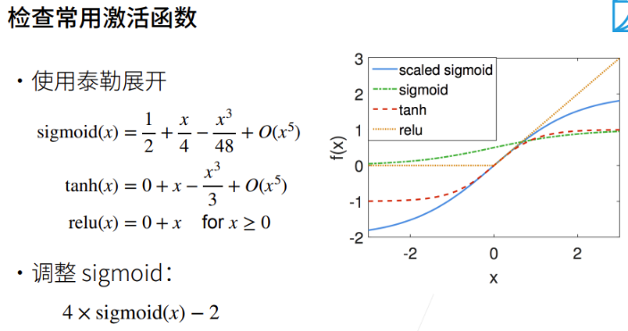

## 4.4 整体训练步骤

### 1. 下载数据集

`DATA_HUB` 存储数据集信息元组

- 数据集的url、文件完整新验证的 sha-1 密钥
- 键：文件名
- 值：文件路径/文件名，远端文件的sha-1值

```python
import hashlib
import os
import tarfile
import zipfile
import requests

#@save
DATA_URL = 'http://d2l-data.s3-accelerate.amazonaws.com/'
DATA_HUB = dict()
DATA_HUB['kaggle_house_train'] = (  #@save
    DATA_URL + 'kaggle_house_pred_train.csv',
    '585e9cc93e70b39160e7921475f9bcd7d31219ce')
DATA_HUB['kaggle_house_test'] = (  #@save
    DATA_URL + 'kaggle_house_pred_test.csv',
    'fa19780a7b011d9b009e8bff8e99922a8ee2eb90')
```

```python
#功能：下载DATA_HUB中指定的文件，将数据集缓存在本地，默认为上层文件夹的data文件夹下
#	返回下载文件的名称
#	若本地已有同名数据集文件，将本地文件的sha-1与DATA_HUB中的比对，若相同则避免重复下载
#输入：name=文件名
def download(name, cache_dir=os.path.join('..', 'data')):  #@save
    """下载一个DATA_HUB中的文件，返回本地文件名"""
    assert name in DATA_HUB, f"{name} 不存在于 {DATA_HUB}"
    url, sha1_hash = DATA_HUB[name]
    os.makedirs(cache_dir, exist_ok=True)
    fname = os.path.join(cache_dir, url.split('/')[-1])
    if os.path.exists(fname):
        sha1 = hashlib.sha1()
        with open(fname, 'rb') as f:
            while True:
                data = f.read(1048576) #从文件f中读取1MB=1048576B的数据
                # 若是空文件，则下载
                if not data:
                    break
                sha1.update(data)
        # 若本地文件的sha-1值与DATA_HUB中的一致，则使用本地文件
        #	 sha1.hexdigest()获取计算得到的SHA-1哈希值的十六进制表示
        if sha1.hexdigest() == sha1_hash:
            return fname  # 命中缓存
    print(f'正在从{url}下载{fname}...')
    r = requests.get(url, stream=True, verify=True)
    with open(fname, 'wb') as f:
        f.write(r.content)
    return fname
```

```python
# 功能：下载名为name的zip或tar、gz文件并解压
#	若指定文件夹，则folder
def download_extract(name, folder=None):  #@save
    """下载并解压zip/tar文件"""
    fname = download(name)
    # 获取下载文件所在的目录路径
    base_dir = os.path.dirname(fname)
    data_dir, ext = os.path.splitext(fname)
    if ext == '.zip':
        fp = zipfile.ZipFile(fname, 'r')
    elif ext in ('.tar', '.gz'):
        fp = tarfile.open(fname, 'r')
    else:
        assert False, '只有zip/tar文件可以被解压缩'
    # 将解压后的文件放入压缩文件所在的目录
    fp.extractall(base_dir)
    # 若未指定提取位置，返回 默认下载目录
    # 若指定提取位置，返回 默认下载目录/folder
    return os.path.join(base_dir, folder) if folder else data_dir
```

#### 下载数据并查看

```python
def download_all():  #@save
    """下载DATA_HUB中的所有文件"""
    for name in DATA_HUB:
        download(name)
```

```python
import numpy as np
import pandas as pd
import torch
from torch import nn
from d2l import torch as d2l
```

```python
train_data = pd.read_csv(download('kaggle_house_train'))
test_data = pd.read_csv(download('kaggle_house_test'))

print(train_data.shape)
print(test_data.shape)

# 查看前4个数据的前4个、后四个特征，最后一个特征是标签
#	使用 .iloc[] 来选择 DataFrame 中的特定行或列。
print(train_data.iloc[0:4, [0, 1, 2, 3, -3, -2, -1]])
```

**删除id** ：不携带任何用于预测的信息

```python
all_features = pd.concat((train_data.iloc[:, 1:-1], test_data.iloc[:, 1:]))
```

### 2. 数据预处理

公开数据集一般分为训练集和验证集，数据集需要经过预处理才能进入训练

#### 数值类型

- 数据类型复杂：有些是数值类型，浮点数；类别一般是离散类别表示
- 数据缺失：缺失值被简单地标记为NA

1. 先将缺失值替换为相应特征的均值

2. 归一化：将所有值类型特征的值缩放到0均值和单位方差来标准化数据
   $$
   x\leftarrow\frac{x-\mu}{\sigma}
   $$
   $E[\frac{x-\mu}{\sigma}] = \frac{\mu - \mu}{\sigma} = 0$

   $E[(x-\mu)^2] = (\sigma^2 + \mu^2) - 2\mu^2+\mu^2 = \sigma^2$

```python
# 若无法获得测试数据，则可根据训练数据计算均值和标准差
# 获取所有值类型特征的索引
numeric_features = all_features.dtypes[all_features.dtypes != 'object'].index
# 归一化
all_features[numeric_features] = all_features[numeric_features].apply(
    lambda x: (x - x.mean()) / (x.std()))
# 在标准化数据之后，所有均值消失，因此我们可以将缺失值设置为0
all_features[numeric_features] = all_features[numeric_features].fillna(0)
```

#### 离散值

用 one-hot 编码

- 特征 `MSZoning` 包含两个值 `RL` 和 `Rm` ，使用 one-hot 编码，如果“MSZoning”的原始值为“RL”， 则：“MSZoning_RL”为1，“MSZoning_RM”为0

```python
# “Dummy_na=True”将“na”（缺失值）视为有效的特征值，并为其创建指示符特征
all_features = pd.get_dummies(all_features, dummy_na=True)
all_features.shape
```

#### 转换为Numpy格式，并转为张量

```python
# 训练数据个数
n_train = train_data.shape[0]
#划分数据集
#	前 n_train 作为训练集，n_train之后的作为验证集
train_features = torch.tensor(all_features[:n_train].values, dtype=torch.float32)
test_features = torch.tensor(all_features[n_train:].values, dtype=torch.float32)
#提取标签值为输出列向量
train_labels = torch.tensor(train_data.SalePrice.values.reshape(-1, 1), dtype=torch.float32)
```

### 3. 训练

定义模型

```python
in_features = train_features.shape[1]
def get_net():
    net = nn.Sequential(nn.Linear(in_features,1))
    return net
```

采用平方损失函数作为基准模型
$$
\ell(y,\hat{y})=\frac{1}{2n}\Vert \hat{\mathbf{y}}-\mathbf{y}\Vert^2=\frac{1}{2n}\sum_{i}^n\left[\hat{y}^{(i)}-y^{(i)}\right]^2
$$

```python
loss = nn.MSELoss()
```

实际上，我们更多关心的是相对误差，而不是绝对误差，即 $\frac{\mathbf{y}-\hat{\mathbf{y}}}{\mathbf{y}}$ 。使用对数误差来衡量差异

令 $1-\frac{\hat{y}}{y}\le \delta\Rightarrow \frac{\hat{y}}{y}\ge 1-\delta\triangleq\delta\iff \vert \log y-\log\hat{y}\vert\le \delta$ ，因此有均方根误差
$$
\sqrt{\frac{1}{n}\sum\limits_{i=1}^n\left(\log y_i-\log\hat{y}_i\right)^2}
$$

```python
def log_rmse(net, features, labels):
    # 为了在取对数时进一步稳定该值，将小于1的值设置为1
    clipped_preds = torch.clamp(net(features), 1, float('inf'))
    rmse = torch.sqrt(loss(torch.log(clipped_preds),
                           torch.log(labels)))
    return rmse.item()
```

训练

```python
def train(net, train_features, train_labels, test_features, test_labels,
          num_epochs, learning_rate, weight_decay, batch_size):
    train_ls, test_ls = [], []
    # 获取小批量化数据迭代器
    train_iter = d2l.load_array((train_features, train_labels), batch_size)
    # 定义参数优化器：相对于SGD的好处，对学习率不敏感
    optimizer = torch.optim.Adam(net.parameters(),
                                 lr = learning_rate,
                                 weight_decay = weight_decay)
    for epoch in range(num_epochs):
        for X, y in train_iter:
            optimizer.zero_grad()
            l = loss(net(X), y)
            l.backward()
            optimizer.step()
        train_ls.append(log_rmse(net, train_features, train_labels))
        if test_labels is not None:
            test_ls.append(log_rmse(net, test_features, test_labels))
    return train_ls, test_ls
```

### 4. k-折交叉验证

K折交叉验证

```python
# 将数据划分为k折，并将第i折作为训练数据，返回划分后的训练集与验证集
# 输入：k,验证集折索，X:训练集的输入集，y:训练集的输出集
def get_k_fold_data(k, i, X, y):
    assert k > 1
    # 获取每折数据量
    fold_size = X.shape[0] // k
    X_train, y_train = None, None
    for j in range(k):
        # 获取从j到j+fold_size-1的索引
        idx = slice(j * fold_size, (j + 1) * fold_size)
        # 截取索引标记的部分数据
        X_part, y_part = X[idx, :], y[idx]
        if j == i:
            X_valid, y_valid = X_part, y_part
        elif X_train is None:
            X_train, y_train = X_part, y_part
        else:
            X_train = torch.cat([X_train, X_part], 0)
            y_train = torch.cat([y_train, y_part], 0)
    return X_train, y_train, X_valid, y_valid

def k_fold(k, X_train, y_train, num_epochs, learning_rate, weight_decay,
           batch_size):
    train_l_sum, valid_l_sum = 0, 0
    for i in range(k):
        # 训练k轮
        data = get_k_fold_data(k, i, X_train, y_train)
        net = get_net()
        #返回对数均方根误差
        train_ls, valid_ls = train(net, *data, num_epochs, learning_rate,
                                   weight_decay, batch_size)
        train_l_sum += train_ls[-1]
        valid_l_sum += valid_ls[-1]
        if i == 0:
            d2l.plot(list(range(1, num_epochs + 1)), [train_ls, valid_ls],
                     xlabel='epoch', ylabel='rmse', xlim=[1, num_epochs],
                     legend=['train', 'valid'], yscale='log')
        print(f'折{i + 1}，训练log rmse{float(train_ls[-1]):f}, '
              f'验证log rmse{float(valid_ls[-1]):f}')
    return train_l_sum / k, valid_l_sum / k
```

### 5. 模型选择

```python
k, num_epochs, lr, weight_decay, batch_size = 5, 100, 5, 0, 64
# 对当前参数组合进行K折交叉验证，获取对数均方损失
train_l, valid_l = k_fold(k, train_features, train_labels, num_epochs, lr,
                          weight_decay, batch_size)
print(f'{k}-折验证: 平均训练log rmse: {float(train_l):f}, '
      f'平均验证log rmse: {float(valid_l):f}')
```

若一组超参数的训练误差很低，但K折交叉验证的平均误差高，表明模型发生过拟合。整个巡礼那过程都要监控训练误差与验证误差

- 较小的过拟合说明模型效果好
- 较大的过拟合表明需要通过正则化技术来获益

### 6. 预测

```python
# 传入选择好的超参数，基于测试数据更新模型参数后，对验证集中的数据做一次预测
#	将结果拼接到返回集上
def train_and_pred(train_features, test_features, train_labels, test_data,
                   num_epochs, lr, weight_decay, batch_size):
    net = get_net()
    train_ls, _ = train(net, train_features, train_labels, None, None,
                        num_epochs, lr, weight_decay, batch_size)
    d2l.plot(np.arange(1, num_epochs + 1), [train_ls], xlabel='epoch',
             ylabel='log rmse', xlim=[1, num_epochs], yscale='log')
    print(f'训练log rmse：{float(train_ls[-1]):f}')
    # 将网络应用于测试集。
    preds = net(test_features).detach().numpy()
    # 将其重新格式化以导出到Kaggle
    test_data['SalePrice'] = pd.Series(preds.reshape(1, -1)[0])
    submission = pd.concat([test_data['Id'], test_data['SalePrice']], axis=1)
    submission.to_csv('submission.csv', index=False)
```

## 4.5 automl

目前80%的时间都在处理数据，20%的时间调模型

Automl现在能处理一些基础情况，目前能节省10%时间，上限节省20%时间


