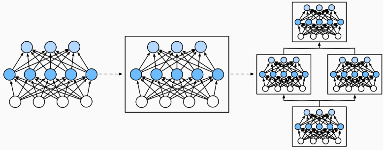

---
categories:
  - AI
  - 机器学习
  - 深度学习
tags:
  - AI
  - 机器学习
  - 深度学习
mathjax: true
title: 5.动手学深度学习-pytorch深度计算
abbrlink: 958416017
date: 2024-03-22 09:23:08
updated: 2024-03-24 00:43:06
---

[TOC]

<!--more-->

# 5. 深度计算

## 5.1 层和块

### 5.1.1 块的概念

整个深度模型包含一些参数（所有组成层的参数集合），接受原始输入，生成输出。同样，每个层包含该层的参数，接受上一层提供的输出作为输入，并生成该层输出，这些参数根据下一层反向传播的信息被更新（误差反向传播）

- 视觉领域，ResNet-152有数百层，这些层由 层组(groups of layers) 堆叠组成
- 其他领域，也有 层组 堆叠排列的类似架构

因此将神经网络组成模块划分为 *块*（Module）， 块可描述单个层、多个层组成的 *层组* 或深度模型本身。



### 5.1.2 pytorc中的块

从编程实现角度，*块* 的概念就是 *类* 。块 `nn.Module` 的任何子类都必须定义 $输入\mapsto 输出$ 的前向传播函数 `forward(self,X)` ；对各层输入、输出参数的初始化（该层参数形状）

- 反向传播函数用于计算梯度，但由于自动微分的引入，不需要考虑

```python
import torch
from torch import nn
# functional 库封装常用函数库
from torch.nn import functional as F

# 重点是这部分的理解
net = nn.Sequential(nn.Linear(20, 256), nn.ReLU(), nn.Linear(256, 10))

X = torch.rand(2, 20)
net(X)
#	tensor([[ 0.0343,  0.0264,  0.2505, -0.0243,  0.0945,  
#	         0.0012, -0.0141,  0.0666,-0.0547, -0.0667],
#	        [ 0.0772, -0.0274,  0.2638, -0.0191,  0.0394, 
#	         -0.0324,  0.0102,  0.0707,-0.1481, -0.1031]], 
#	       grad_fn=<AddmmBackward0>)
```

`nn.Sequential` 构建了一个深度模型，层的顺序是参数传入的顺序

- `nn.Sequential` ：是 `nn.Module` 的一个子类，维护 *块* 实例的有序列表（也是 `nn.Module` 的实例 / 子类实例 ）

  ```python
  >>> print(nn.Sequential.__mro__)
  (<class 'torch.nn.modules.container.Sequential'>, <class 'torch.nn.modules.module.Module'>, <class 'object'>)
  ```

`net(参数)` 调用深度模型：相当于 `net.__call__(X)` 的简写

#### 自定义块

块提供的功能

1. 存储和访问前向传播计算所需的参数
1. 根据需要初始化模型参数
1. 接收输入数据：作为前向传播函数的参数
1. 通过前向传播函数生成输出
1. 计算输出关于输入的梯度：反向传播函数访问；通常自动微分完成

```python
class MLP(nn.Module):
    # 用模型参数声明层
    def __init__(self):
        # 调用MLP的父类Module的构造函数来执行必要的初始化。
        # 	子类实例化时也可以指定其他函数参数，例如模型参数params
        super().__init__()
        # 实例化两个全连接层
        self.hidden = nn.Linear(20, 256)  # 隐藏层
        self.out = nn.Linear(256, 10)  # 输出层

    # 定义模型的前向传播，即如何根据输入X返回所需的模型输出
    #	以X作为输入， 计算带有激活函数的隐藏表示，并输出其未规范化的输出值
    def forward(self, X):
        # 注意，这里我们使用ReLU的函数版本，其在nn.functional模块中定义。
        return self.out(F.relu(self.hidden(X)))
    
net = MLP()
net(X)
#	tensor([[ 0.0669,  0.2202, -0.0912, -0.0064,  0.1474, 
#	         -0.0577, -0.3006,  0.1256,-0.0280,  0.4040],
#	        [ 0.0545,  0.2591, -0.0297,  0.1141,  0.1887,
#	         0.0094, -0.2686,  0.0732,-0.0135,  0.3865]], 
#	       grad_fn=<AddmmBackward0>)
```

#### 顺序块

> `Sequential`的设计是为了把其他模块串起来

1. `__init(self, *args)__` ：将块逐个追加到列表中
2. `forward` ：前向传播：将输入按追加块的顺序前向传播

```python
class MySequential(nn.Module):
    def __init__(self, *args):
        super().__init__()
        for idx, module in enumerate(args):
            # 这里，module是Module子类的一个实例。
            # _modules：保存module实例的有序字典实例；属于 OrderedDict 类
            self._modules[str(idx)] = module

    def forward(self, X):
        # OrderedDict保证了按照成员添加的顺序遍历它们
        for block in self._modules.values():
            # X是经过运算块后的返回值，相当于各层的输出
            X = block(X)
        # 这里返回的前向输出
        return X
```

自定义有序字典类 `OrderedDict` 作用：在模型初始化过程中，pytorch从其实例 `_modules` 中查找需要初始化参数的子块

 ```python
 net = MySequential(nn.Linear(20, 256), nn.ReLU(), nn.Linear(256, 10))
 net(X)
 #	tensor([[ 2.2759e-01, -4.7003e-02,  4.2846e-01, -1.2546e-01,  1.5296e-01,
 #			1.8972e-01,  9.7048e-02,  4.5479e-04, 	-3.7986e-02,  6.4842e-02],
 #	        [ 2.7825e-01, -9.7517e-02,  4.8541e-01, -2.4519e-01, -8.4580e-02,
 #			2.8538e-01,  3.6861e-02,  2.9411e-02, 	-1.0612e-01,  1.2620e-01]], grad_fn=<AddmmBackward0>)
 ```

- `nn.ReLU()` 内部调用了 `F.rele()` ，具有状态和可学习参数

##### 块访问

`nn.Sequential` 实例可以理解为一个 `nn.module` 类实例的有序列表，可以通过索引来访问模型的任一层

```python
# 访问顺序块，返回顺序块实例信息
print(net)
# MySequential(
#   (0): Linear(in_features=20, out_features=256, bias=True)
#   (1): ReLU()
#   (2): Linear(in_features=256, out_features=10, bias=True)
# )

# 返回OrderedDict类实例，封装了该顺序块关联的块字典列表
print(net._modules)
# OrderedDict([('0', Linear(in_features=20, out_features=256, bias=True)), 
#				('1', ReLU()), 
#				('2', Linear(in_features=256, out_features=10, bias=True))])

# 根据索引获取字典中的块实例
print(net[2])#nn.Sequential中实现了通过索引访问，与下列两种方式等价
print(net._modules['2'])
print(net._modules.get('2'))
#	Linear类继承Module类
#			Linear(in_features=256, out_features=10, bias=True)
```

#### 自定义块的特殊用法

`Sequential` 类允许我们定制深度网络架构，并提供很大灵活性。如：可以在前向传播中引入控制流或自定义处理

##### 层引入常数参数

若在某一层需要合并一些其他参数 *常数参数(constant param)* ：既不是上一层结果也不是可更新参数，如 $f(\mathbf{x};\mathbf{W})=c\mathbf{x}\mathbf{W}^T$ ，$c$ 就是常数参数，整个优化过程没有被更新

```python
class FixedHiddenMLP(nn.Module):
    def __init__(self):
        super().__init__()
        # 不计算梯度的随机权重参数。因此其在训练期间保持不变
        self.rand_weight = torch.rand((20, 20), requires_grad=False)
        self.linear = nn.Linear(20, 20)
	
    # 1.计算线性层输出
    # 2.对第一次输出乘常量参数+1，再relu
    # 3.计算第二次输出的线性层输出
    # 4.控制流：若X每个元素绝对值的和>1，则除2直至小于1
    # 5.返回标量，X.sum()
    def forward(self, X):
        X = self.linear(X)
        # 使用创建的常量参数以及relu和mm函数
        X = F.relu(torch.mm(X, self.rand_weight) + 1)
        # 复用全连接层。这相当于两个全连接层共享参数
        X = self.linear(X)
        # 控制流
        while X.abs().sum() > 1:
            X /= 2
        return X.sum()
```

##### 块组合

`Sequential` 类允许我们定制深度网络架构，并提供很大灵活性

```python
class NestMLP(nn.Module):
    def __init__(self):
        super().__init__()
        self.net = nn.Sequential(nn.Linear(20, 64), nn.ReLU(),
                                 nn.Linear(64, 32), nn.ReLU())
        self.linear = nn.Linear(32, 16)

    def forward(self, X):
        return self.linear(self.net(X))

chimera = nn.Sequential(NestMLP(), nn.Linear(16, 20), FixedHiddenMLP())
chimera(X)
```

### 5.1.3 操作效率

在一个高性能的深度学习库中进行了大量的字典查找、 代码执行和许多其他的Python代码。 Python的问题[全局解释器锁](https://wiki.python.org/moin/GlobalInterpreterLock) 是众所周知的。 在深度学习环境中，我们担心速度极快的GPU可能要等到CPU运行Python代码后才能运行另一个作业。

## 5.2 参数管理

`Paramater` 类的实例是可优化的参数实例 

在定义好模型架构并设置好超参数后，完成对 **各层参数设置** 后，就可以进行模型训练

- 访问参数
- 参数初始化
- 不同 *块(module)* 间共享参数

```python
import torch
from torch import nn

net = nn.Sequential(nn.Linear(4, 8), nn.ReLU(), nn.Linear(8, 1))
# 2个数据4维特征
X = torch.rand(size=(2, 4))
net(X)
```

### 5.2.1 参数访问

`net.state_dict()` 返回块的所有参数信息组成的字典 `OrderedDict` 

- 权重就是神经网络的状态，权重的一轮迭代就是网络状态的一次变化

```python
# 使用nn.Sequential，该类封装了一些按索引访问方法，支持列表式访问各层
print(net[2])
# net[2] 返回Linear类的块实例，即本层信息
#	Linear(in_features=8, out_features=1, bias=True)

# Module有state_dict()：返回 a dictionary containing a whole state of the module
print(net.state_dict())
#OrderedDict([
#    ('0.weight', tensor([[-0.3076, -0.4758,  0.1081, -0.2304],
#        [ 0.4211,  0.4465, -0.3960, -0.1722],
#        [ 0.2387,  0.3205,  0.2718,  0.2265],
#        [ 0.2729,  0.1801, -0.1720, -0.0440],
#        [-0.1461, -0.1271,  0.1468,  0.3713],
#        [-0.4266,  0.4993,  0.1876, -0.3648],
#        [-0.3004,  0.0743, -0.3056,  0.0593],
#        [ 0.0245, -0.1389, -0.1488, -0.4814]])), 
#    ('0.bias', tensor([-0.2036, -0.0883,  0.4036, -0.3335, -0.4430,  0.2864, -0.1805, -0.1634])), 
#    ('2.weight', tensor([[ 0.2721,  0.2518,  0.3448,  0.2209,  0.1964, -0.1971,  0.0200,  0.2595]])), 
#    ('2.bias', tensor([0.1401]))])

net.state_dict()['0.bias']
# tensor([-0.0771, -0.1678, -0.3164, -0.3792,  0.1848, -0.2182,  0.3182, -0.1454])

# Linear类继承了Module类
print(net[2].state_dict())
# 	OrderedDict([('weight', tensor([[-0.2372, -0.2587, -0.2270, -0.1828, -0.1542, -0.2847,  0.1730, -0.1300]])), ('bias', tensor([-0.1647]))])
```

Linear类实例的输出是一个字典，键包括：权重，偏置

- 键唯一标识每个参数

#### 参数类

每个参数都被表示为一个参数类实例（`<class 'torch.nn.parameter.Parameter'>`），属性有：

- 值：`data`
- 梯度：`grad`
- 其他额外信息

这些参数信息可以被统一管理和更新，所以需要 `Parameter` 类

```python
print(type(net[2].bias))
# <class 'torch.nn.parameter.Parameter'>

# 返回的是参数类实例 参数名为bias的实例
print(net[2].bias)
# 	Parameter containing:
# 	tensor([-0.1647], requires_grad=True)

# 只返回bias属性的值
print(net[2].bias.data)
#	tensor([-0.1647])
print(net[2].bias.grad)
```

#### 一次性访问所有参数`net.named_parameters()`

```python
# *[...]参数解包
#	接收元组的list，并将其作为两个单独的参数分别输出
print(*[(name, param.shape) for name, param in net[0].named_parameters()])
#('weight', torch.Size([8, 4])) ('bias', torch.Size([8]))
# param是Parameter类的实例

print(*[(name, param.shape) for name, param in net.named_parameters()])
#('0.weight', torch.Size([8, 4])) ('0.bias', torch.Size([8])) ('2.weight',torch.Size([1, 8])) ('2.bias', torch.Size([1]))
```

#### 从嵌套块收集参数

深度模型中，层之间存在嵌套关系，也可以通过嵌套列表索引分层访问块参数

```python
def block1():
    return nn.Sequential(nn.Linear(4, 8), nn.ReLU(),
                         nn.Linear(8, 4), nn.ReLU())

def block2():
    net = nn.Sequential()
    for i in range(4):
        # f'{i}' 格式化字符串，将{i}中的变量值替换
        net.add_module(f'block {i}', block1())
    return net

rgnet = nn.Sequential(block2(), nn.Linear(4, 1))
rgnet(X)

print(rgnet)
```


```python
# rgnet[0]=block2()
# rgnet[0][1]=block2()[1]=(block 1)
# rgnet[0][1][0]=block2()[1][0]=(block 1)[0]=Linear(in_features=4,out_feartures=8,bias=True)
# rgnet[0][1][0].bias=tensor(8)
rgnet[0][1][0].bias.data
```

### 5.2.2 参数初始化

pytorch提供默认随机初始化，也允许通过重写自定义初始化方法

- 默认情况下，PyTorch会根据一个范围均匀地初始化权重和偏置矩阵， 这个范围是根据输入和输出维度计算出的——Xavier初始化

#### 预置初始化

`nn.init` 模块提供类很多预置的初始化方法

- 正态分布
- 全0，全1
- 常量
- Xavier初始化

**正态分布、全0/全1**

```python
def init_normal(m):
    if type(m) == nn.Linear:
        nn.init.normal_(m.weight, mean=0, std=0.01)
        nn.init.zeros_(m.bias)
        
net.apply(init_normal)
net[0].weight.data[0], net[0].bias.data[0]
```

`net.apply(fn)` 递归地将一个函数应用到神经网络中的每个子模块上，包括其本身

- 需要定义一个函数，该函数接收一个模块作为参数，并对该模块执行自定义操作

**常量**

```python
def init_constant(m):
    if type(m) == nn.Linear:
        nn.init.constant_(m.weight, 1)
        nn.init.zeros_(m.bias)
net.apply(init_constant)
net[0].weight.data[0], net[0].bias.data[0]
# (tensor([1., 1., 1., 1.]), tensor(0.))
```

**Xavier初始化** 

- `xavier_normal`
- `xavier_normal_` ：这个是更新后的版本，在计算时会考虑到ReLU激活函数的特性，以确保网络在初始化时的激活值分布更加合理
- `xavier_uniform` 
- `xavier_uniform_` 

```python
def init_xavier(m):
    if type(m) == nn.Linear:
        nn.init.xavier_uniform_(m.weight)
def init_42(m):
    if type(m) == nn.Linear:
        nn.init.constant_(m.weight, 42)

net[0].apply(init_xavier)
net[2].apply(init_42)
print(net[0].weight.data[0])
print(net[2].weight.data)
```

#### 自定义初始化

$$
\begin{aligned}
    w \sim \begin{cases}
        U(5, 10) & \text{ 可能性 } \frac{1}{4} \\
            0    & \text{ 可能性 } \frac{1}{2} \\
        U(-10, -5) & \text{ 可能性 } \frac{1}{4}
    \end{cases}
\end{aligned}
$$

```python
def my_init(m):
    if type(m) == nn.Linear:
        print("Init", *[(name, param.shape)
                        for name, param in m.named_parameters()][0])
        nn.init.uniform_(m.weight, -10, 10)
        m.weight.data *= m.weight.data.abs() >= 5

net.apply(my_init)
net[0].weight[:2]
```

也可以在任意位置直接修改参数

```python
net[0].weight.data[:] += 1
net[0].weight.data[0, 0] = 42

net[0].weight.data[0]
# tensor([42.0000, -5.2469,  9.0045,  1.0000])
```

### 5.2.3 参数共享

在层之间共享权重，实质上共享层引用是同一个参数矩阵的值

```python
# 我们需要给共享层一个名称，以便可以引用它的参数
shared = nn.Linear(8, 8)
net = nn.Sequential(nn.Linear(4, 8), nn.ReLU(),
                    shared, nn.ReLU(),
                    shared, nn.ReLU(),
                    nn.Linear(8, 1))
net(X)
# 检查参数是否相同
print(net[2].weight.data[0] == net[4].weight.data[0])
net[2].weight.data[0, 0] = 100
# 确保它们实际上是同一个对象，而不只是有相同的值
print(net[2].weight.data[0] == net[4].weight.data[0])
# tensor([True, True, True, True, True, True, True, True])
# tensor([True, True, True, True, True, True, True, True])
```

net有4个隐藏层，第二个隐藏层和第三个隐藏层都由shared定义

- 作用：由于模型参数包含梯度，因此在反向传播期间参数共享层的梯度会加在一起

## 5.3 自定义层

与自定义块类似，只需要继承 `nn.module` ，并实现 `__init__(self)` 和 `forward(self,X)` 即可

### 5.3.1 不带参数的层

```python
import torch
import torch.nn.functional as F
from torch import nn

class CenteredLayer(nn.Module):
    def __init__(self):
        super().__init__()

    def forward(self, X):
        return X - X.mean()
    
layer = CenteredLayer()
# 将数据 X=[1,2,3,4,5] 传入该层，会输出前向传播的值
layer(torch.FloatTensor([1, 2, 3, 4, 5]))
#	tensor([-2., -1.,  0.,  1.,  2.])
```

只要继承了 `nn.Module` 类的块都可以应用到更复杂的模型中

```python
net = nn.Sequential(nn.Linear(8, 128), CenteredLayer())

Y = net(torch.rand(4, 8))
Y.mean()
#	tensor(7.4506e-09, grad_fn=<MeanBackward0>)
```

不管第1隐藏层输出是什么，$\overline{h_1-\overline{h}_1}=\frac{\sum\limits (h_1-\overline{h}_1)}{\vert h_1\vert}=\frac{\sum h_1-\vert h_1\vert\overline{h_1}}{\vert h_1\vert}=0$ ，即 `Y.mean()` 应该为0 ，在计算机中表示为一个非常小的数

### 5.3.2 带参数的层

接受层的输入与输出形状

由于参数在torch中以 `Paramater` 类封装便于计算，所以在 `__init__()` 中将参数定义为该类

```python
class MyLinear(nn.Module):
    def __init__(self, in_units, units):
        super().__init__()
        self.weight = nn.Parameter(torch.randn(in_units, units))
        self.bias = nn.Parameter(torch.randn(units))
    def forward(self, X):
        linear = torch.matmul(X, self.weight.data) + self.bias.data
        return F.relu(linear)
    
linear = MyLinear(5, 3)
linear.weight
```

通过 `nn.Paramater` 实例化自定义参数的形状与定义时相同，即 `p=nn.Parameter(torch.randn(5, 3))` ，则 `p.shape=torch.Size([5,3])` 

- 

通过 `net=nn.Linear(5,3)` 实例化 *块* ，其参数 `ne.weight.shape=torch.Size([3, 5])` 

- 

```python
linear(torch.rand(2, 5))
#tensor([[0., 0., 0.],
#        [0., 0., 0.]])
```

**也可以将自定义应用于网络模型构建**

```python
net = nn.Sequential(MyLinear(64, 8), MyLinear(8, 1))
net(torch.rand(2, 64))
#tensor([[0.],
#        [0.]])
```

### 5.3.3 自定义添加层—net.add()

`net.add_module([key],[块声明])` ：向神经网络中添加模块

- `net.add_module('layer1', nn.Linear(10, 20)) `

## 5.4 读写文件

有时我们希望保存训练的模型， 以备将来在各种环境中使用（比如在部署中进行预测）。 此外，当运行一个耗时较长的训练过程时， 最佳的做法是定期保存中间结果，以确保在服务器电源被不小心断掉时，我们不会损失几天的计算结果

### 5.4.1 加载和保存

对于基本类型：`tensor` ，`tensor[]` ，`mydict={'a':a,'b':b}` 直接调用 `torch.load()` 和 `torch.save()` 进行读写，参数为要保存的变量

```python
import torch
from torch import nn
from torch.nn import functional as F

# 张量从内存保存到文件
x = torch.arange(4)
torch.save(x, 'x-file')
# 张量从文件取到内存
x2 = torch.load('x-file')
x2

# 张量列表保存与取回
y = torch.zeros(4)
torch.save([x, y],'x-files')
x2, y2 = torch.load('x-files')

# 张量字典的保存与取回
mydict = {'x': x, 'y': y}
torch.save(mydict, 'mydict')
mydict2 = torch.load('mydict')
```

### 5.4.2 保存和加载模型参数

深度学习框架提供了内置函数来保存和加载整个网络

但并不保存整个模型架构，为了恢复模型，我们需要用代码生成架构， 然后从磁盘加载参数

```python
class MLP(nn.Module):
    def __init__(self):
        super().__init__()
        self.hidden = nn.Linear(20, 256)
        self.output = nn.Linear(256, 10)

    def forward(self, x):
        return self.output(F.relu(self.hidden(x)))

net = MLP()
X = torch.randn(size=(2, 20))
Y = net(X)
```

**保存参数** ：将模型 `state_dict()` 输出的参数字典 `OrderedDict` 实例，保存在 mlp.params 的文件中

```python
torch.save(net.state_dict(), 'mlp.params')
```

**恢复模型** ：读取文件，并转换为 `OrderedDict` 类的实例作为参数

```python
clone = MLP()
clone.load_state_dict(torch.load('mlp.params'))
clone.eval()
#	MLP(
#	  (hidden): Linear(in_features=20, out_features=256, bias=True)
#	  (output): Linear(in_features=256, out_features=10, bias=True)
#	)
```

## 5.5 GPU

使用GPU来进行机器学习，因为单个GPU相对运行速度快

```shell
# 查看nvidia驱动程序及CUDA
nvidia-smi
```

在torch中，每个数据都归属于一个设备 (device)，称其为环境（context）。默认情况，所有的变量和计算都分配给CPU

**设备间进行数据传输非常不划算** ，在设备（CPU、GPU和其他机器）之间传输数据比计算慢得多。这也使得并行化变得更加困难，因为我们必须等待数据被发送（或者接收），然后才能继续进行更多的操作。

- 根据经验，多个小操作比一个大操作糟糕得多。 此外，一次执行几个操作比代码中散布的许多单个操作要好得多。 如果一个设备必须等待另一个设备才能执行其他操作， 那么这样的操作可能会阻塞。
- 当我们打印张量或将张量转换为NumPy格式时， 如果数据不在内存中，框架会首先将其复制到内存中， 这会导致额外的传输开销。 更糟糕的是，它现在受制于全局解释器锁，使得一切都得等待Python完成。

在创建、使用变量是要合理分配环境，最大限度地减少设备间的数据传输时间

### 5.5.1 设备查看

GPU设备仅代表一个卡和相应的显存，如果有多个 GPU，使用 `'cuda:0'`，`'cuda:1'` 分别表示第1块和第2块GPU，`'cuda'` 默认返回第1块GPU

```python
import torch
from torch import nn

torch.device('cpu'), torch.device('cuda'), torch.device('cuda:1')
#	(device(type='cpu'), device(type='cuda'), device(type='cuda', index=1))
```

在torch中，通过 `torch.device([设备字符串])` 查看在运算时可使用的设备

```python
# 查看设备数量
torch.cuda.device_count()
```

### 5.5.2 设备获取

```python
# 尝试将第i块gpu拿出来返回
def try_gpu(i=0):  #@save
    """如果存在，则返回gpu(i)，否则返回cpu()"""
    if torch.cuda.device_count() >= i + 1:
        return torch.device(f'cuda:{i}')
    return torch.device('cpu')

def try_all_gpus():  #@save
    """返回所有可用的GPU，如果没有GPU，则返回[cpu(),]"""
    devices = [torch.device(f'cuda:{i}') for i in range(torch.cuda.device_count())]
    return devices if devices else [torch.device('cpu')]

try_gpu(), try_gpu(10), try_all_gpus()
#	(device(type='cuda', index=0),
#	 device(type='cpu'),
#	 [device(type='cuda', index=0)])
```

### 5.5.3 使用GPU存储变量

```python
x = torch.tensor([1, 2, 3])
x.device
#	device(type='cpu')
```

可见，不指定设备的前提下，变量默认存储在CPU上

#### 将变量存储在GPU

若对两个张量运算，首先要确定两个张量存储在同一个设备上

##### 创建时指定设备

```python
X = torch.ones(2, 3, device=try_gpu())
X = torch.ones(2, 3, device=try_gpu())
X
#	tensor([[1., 1., 1.],
#	        [1., 1., 1.]], device='cuda:0')
```

##### 设备间复制


X与Y需要再同一个设备上才可以计算，否则由于在同一设备上找不到数据导致异常。 若不在同一GPU上，需要将变量复制到同一GPU上

```python
# 将X移动到GPU 1上作为变量Z
Z = X.cuda(1)
print(X)
print(Z)
#tensor([[1., 1., 1.],
#        [1., 1., 1.]], device='cuda:0')
#tensor([[1., 1., 1.],
#        [1., 1., 1.]], device='cuda:1')

#在GPU1上进行加法
Y + Z
```

假设变量 `Z` 已经在第2个GPU上，仍会返回 `Z` ，并不会复制并分配新内存

#### 神经网络与GPU

神经网络模型也可以指定设备

```python
net = nn.Sequential(nn.Linear(3, 1))
net = net.to(device=try_gpu())

net[0].weight.data.device
# device(type='cuda', index=0)
```


