---
categories:
  - AI
  - 机器学习
  - 深度学习
tags:
  - AI
  - 机器学习
  - 深度学习
mathjax: true
title: 6.动手学深度学习-卷积神经网络
abbrlink: 3273175593
date: 2024-03-24 14:26:40
updated: 2024-03-30 00:45:17
---

[TOC]

<!--more-->

## 6.0 全连接神经网络的缺陷

### 参数数量太多

#### 输入规模大

图像数据的每个样本（每张图片）都由一个二维像素网格组成，取决于图片的通道数，每个像素位置有多个取值。

对于一张12M像素的图片，若是RGB，则有36M个像素数据，使用具有100个神经元的单隐藏层MLP，则其参数 $\mathbf{W}\in \R^{100\times 36M}$ ，参数矩阵共 3.6B  个数据需要存储。远远大于一般的待分类物品的种类数

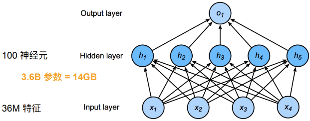

#### 隐藏层神经元数量

随着隐藏层的神经元数量增加，参数规模更会急剧增加

在全连接网络中，第 $l$ 层有 $M_l$ 个神经元，第 $l-1$ 层有 $M_{l-1}$ 个神经元，连接边有 $M_l\times M_{l-1}$ ，即权重矩阵 $W\in \R^{M_l\times M_{l-1}}$ ，当 $M_l$ 和 $M_{l-1}$ 都很大时，权重矩阵的参数会很多，训练的效率会非常低

### 丢失数据空间结构信息

全连接神经网络将图像展平成一维向量，再将数据送入一个全连接的多层感知机中，而忽略了每个图像的空间结构信息

自然图像中的问题有局部不变性，比如尺寸缩放、平移、旋转等操作不影响语义特征，但全连接的前馈神经网络很难提取这些局部不变的特征——**数据增强**

最优的结果是利用相近像素之间的相关联性学习有效的模型

**平移不变性** ：不管检测对象出现在图像中的哪个位置，神经网络的前面几层都应该对相同的局部区域有相似的反应，即为平移不变性

**局部性** ：神经网络的前面几层只探索输入图像中的局部区域，而不过度在意图像中相隔较远区域的关系。最后可以聚合这些局部特征，以在整个图像级别进行预测

## 6.1 卷积层

*卷积神经网络* (convolutional neural network,CNN) 是一类强大的、为处理图像数据而设计的神经网络。基于卷积神经网络在计算机视觉领域已经占主导地位。

### 6.1.1 卷积层对数据空间结构信息的提取

#### 全连接层到卷积层

**输入和输出**：从一维张量变为二维矩阵

**权重从二维张量变为四维张量**

全连接网络中，输入是一维张量，输出也为一维张量，参数矩阵为一个二维矩阵
$$
\begin{aligned}
\hat{\mathbf{h}}&=\mathbf{x}\mathbf{W}^T+\mathbf{b}\\
&=[x^{(1)},x^{(2),\cdots,x^{(d)}}]\begin{bmatrix}
w_{1,1}&w_{2,1}&\cdots&w_{K,1}\\
w_{1,2}&w_{2,2}&\cdots&w_{K,2}\\
\vdots&\vdots&\ddots&\vdots\\
w_{1,d}&w_{2,d}&\cdots&w_{K,d}\\
\end{bmatrix}+\mathbf{b}\\
&=\left[\sum\limits_{j=1}^dx^{(j)}w_{1,j}+b_1\quad ,\sum\limits_{d=1}^dx^{(j)}w_{2,j}+b_2\quad,\cdots,\sum\limits_{j=1}^dx^{(j)}w_{K,j}+b_K\right]
\end{aligned}
$$
$h_i=\sum\limits_jw_{i,j}x^{(j)}+b_i$ 

若使用全连接神经网络处理输入和输出都是二维张量的数据，则其参数矩阵应该是四维张量。假设相当于对一维张量的全连接神经网络等价替换，将 $h_{i}$ 替换为 $[\mathbf{H}]_{i,j}$ ，输入数据 $x^{(j)}$ 替换为 $[\mathbf{X}]_{k,l}$ ， $w_{i,j}$ 相应被替换为 $w_{i,j,k,l}$ ，所以二维输入输出的全连接神经网络为
$$
\begin{aligned}
\left[\mathbf{H}\right]_{i,j}&=\sum\limits_{k,l}[\mathbf{W}]_{i,j,k,l}[\mathbf{X}]_{k,l}+[\mathbf{B}]_{i,j}=\sum_{a,b}[\mathbf{V}]_{i,j,a,b}[\mathbf{X}]_{i+a,j+b}+[\mathbf{B}]_{i,j}\\
&=\sum_{a,b}[\mathbf{V}]_{i,j,a,b}[\mathbf{X}]_{i+a,j+b}+[\mathbf{B}]_{i,j}
\end{aligned}
$$
$\mathbf{V}$ 是 $\mathbf{W}$ 的重排索引

对于隐藏层的任意净输出元素 $[\mathbf{H}]_{i,j}$ ，可以通过以 $[\mathbf{X}]_{i,j}$ 为中心对像素进行加权求和得到，权重为 $[\mathbf{V}]_{i,j,a,b}$ 

#### 卷积滤波器的平移不变性

若采用上述分类器，当检测对象 $[\mathbf{X}]_{i,j}$ 在图像输入 $\mathbf{X}$ 中的位置发生平移，则仅会导致隐藏层净输出 $[\mathbf{H}]_{i,j}$ 发生平移而取值不会发生变化，即 $\mathbf{V}$ 和  $\mathbf{B}$ 并不依赖于 $(i,j)$ 的值，即 $[\mathbf{V}]_{i,j,a,b}=[\mathbf{V}]_{a,b}$ ，且 $[\mathbf{B}]_{i,j}$ 是一个常数 $b$ 

$$
[\mathbf{H}]_{i,j}=\sum_{a,b}[\mathbf{V}]_{a,b}[\mathbf{X}]_{i+a,j+b}+b
$$
也就是二维卷积 / 交叉相关(数学)，使用系数 $[\mathbf{V}]_{a,b}$ 对位置 $(i,j)$ 附近的像素 $[\mathbf{X}]_{i+a,j+b}$ 进行加权得到 $[\mathbf{H}]_{i,j}$ 

卷积神经网络考虑到了局部特征的平移不变性，所以 $[\mathbf{V}]_{a,b}$ 的系数比全连接神经网络的系数 $[\mathbf{W}]_{i,j,a,b}$ 的数量少很多

#### 卷积滤波器的局部性

为了收集用来训练隐净输出 $[\mathbf{H}]_{i,j}$ 的相关信息，我们不应该偏离距 $(i,j)$ 很远的地方，也就是当 $\vert a\vert,\vert b\vert>\Delta$ 时，$[\mathbf{V}]_{a,b}=0$ 。因此，可以将 $[\mathbf{H}]_{i,j}$ 重写为
$$
[\mathbf{H}]_{i,j}=\sum_{a=-\Delta}^{\Delta}\sum_{b=-\Delta}^{\Delta}[\mathbf{V}]_{a,b}[\mathbf{X}]_{i+a,j+b}+b
$$
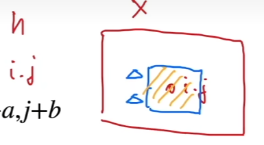

#### 卷积层特点

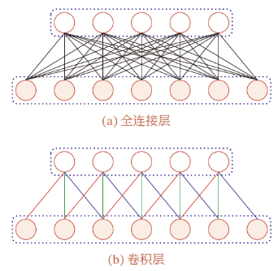

卷积神经网络是一种深层前馈神经网络，结构特性：

- 局部连接：与全连接的前馈神经网络相比，卷积神经网络的参数很少

- 权重共享

- 空间或时间上的次采样：能够高效地采样从而获得精确的模型

- 能够高效地计算：卷积很容易用GPU并行计算

  GPU擅长进行浮点数运算

**局部连接** ：在卷积层第 $l$ 层中的每个神经元只与第 $l-1$ 层在滑动窗口内的部分神经元相连，构成一个局部连接网络

- 卷积层参数的数量大大减少，由 $M_l\times M_{l-1}$ 个连接变为 $M_l\times K$ 个连接，$K$ 为卷积核大小

**权重共享**：作为参数的卷积核 $\mathbf{W}_l$ 对于第 $l$ 层所有的神经元都是相同的。**一个卷积核只提取输入数据中的一种特定的局部特征，若提取不同的特征，需要使用不同的卷积核**

由于 **局部连接** 和 **权重共享** 的特点，一维卷积层的参数只有一个 $K$ 维的权重 $\mathbf{w}_l$ 和 1个偏置 $b_l\in \R$ ，即 $K+1$ 个参数
$$
\mathbf{o}_l=\mathbf{x}_{l}\otimes \mathbf{w}_l+b_l=\mathbf{h}_{l-1}\otimes \mathbf{w}_l+b_l
$$

#### 卷积滤波器的代价

卷积神经网络是包含卷积滤波器的一种特殊神经网络，$\mathbf{V}$ 被称为卷积核（convolution kernel）或滤波器或卷积层权重，权重是可以被学习的参数。

特征必须是平移不变的，并且当确定每个隐藏活性值时，每一隐藏层只包含局部的信息，只有输出层才是完整的信息。

因此卷积神经网络的权重学习依赖于归纳偏置，如图像不满足平移不变时，可能难以拟合训练数据

### 6.1.2 卷积运算

> 在信号处理和图像处理中，常用的是一维或二维卷积

#### 一维卷积

> 一维卷积常用于信号处理中，用于计算信号的延迟累积

$w_i$ 称为滤波器或卷积核，假设滤波器的长度为 $K$ ，它和一个信号序列 $x_1,x_2,\cdots$ 的卷积为
$$
y_t=\sum\limits_{k=1}^Kw_kx_{t-k+1}\triangleq \mathbf{w}\otimes\mathbf{x}
$$

- 一般情况下，滤波器的长度 $K$ 远小于信号序列 $x$ 的长度

如：假设一个信号发生器每个时刻 $t$ 产生一个信号 $x_t$ ，其信息的衰减率为 $w_k$ ，在 $k-1$ 个时间步长后，信息变为原先的 $w_k$ 倍

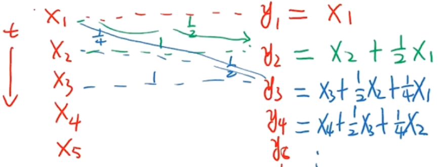

在时刻 $t$ 收到的信号 $y_t$
$$
\begin{aligned}
y_t&=1\times x_t+\frac{1}{2}x_{t-1}+\frac{1}{4}x_{t-2}\\
&=w_1x_t+w_2x_{t-1}+w_3x_{t-2}\\
&=\sum\limits_{k=1}^3w_kx_{t-k+1}
\end{aligned}
$$

#### 二维卷积

图像是二维结构，需要将一维卷积进行扩展

给定一个图像 $\mathbf{X}\in \R^{n_h\times n_w}$ 和一个滤波器 $\mathbf{W}\in\R^{k_h\times k_w}$ ，一般 $k_h\ll n_h,k_w\ll n_w$ ，其卷积为
$$
[\mathbf{H}]_{ij}=\sum\limits_{a=1}^{k_h}\sum\limits_{b=1}^{k_w}[\mathbf{W}]_{ab}[\mathbf{X}]_{i-a+1,j-b+1}\quad i\in [1,n_h-k_h+1],j\in [1,n_w-k_w+1]
$$
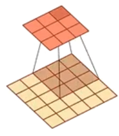

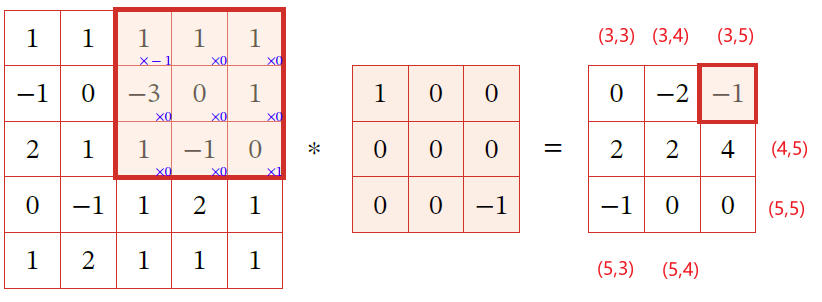
$$
\begin{aligned}
y_{35}&=\sum\limits_{a=1}^3\sum\limits_{b=1}^3w_{a,b}X_{3-a+1,5-b+1}=w_{11}\times X_{35}+w_{33}\times X_{13}\\
&=1\times0+(-1)\times 1=-1
\end{aligned}
$$

##### 二维卷积运算是翻转相乘

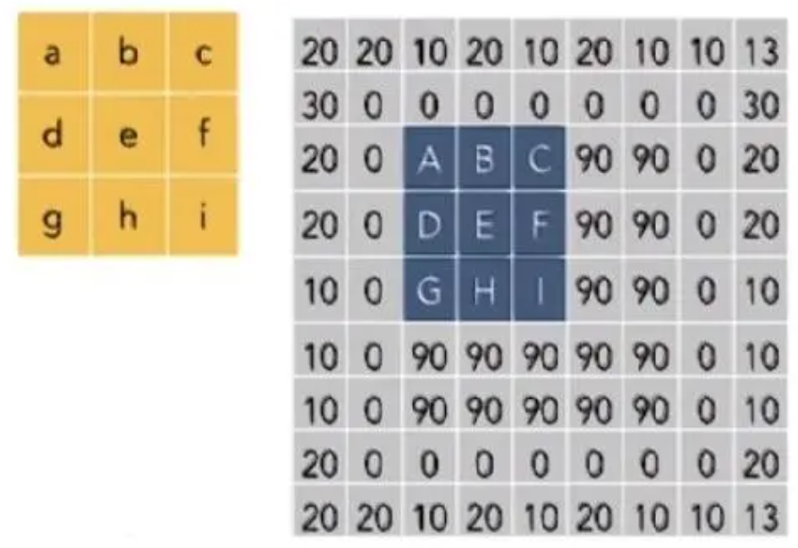
$$
\mathbf{W}*\mathbf{X}\xlongequal{convolution} i*A+h*B+g*C+f*D+e*E+d*F+c*G+b*H+a*I
$$

1. 上下翻转，左右翻转
   - 相当于在一个平面内，以 $e$ 为中心，旋转 $180^{\circ}$ 

2. 再逐项相乘并求和

#### 互相关

> 互相关是衡量两个序列相关性的函数，通常用滑动窗口的点积计算来实现

一个图像 $\mathbf{X}\in \R^{n_h\times n_w}$ 和卷积核 $\mathbf{W}\in \R^{k_h\times k_w}$ ，互相关为
$$
[\mathbf{H}]_{ij}=\sum\limits_{a=1}^{k_h}\sum\limits_{b=1}^{k_w}\mathbf[{W}]_{ab}[\mathbf{X}]_{i+a-1,j+b-1}
$$
互相关——不翻转核的卷积

- 与卷积的区别在于卷积核是否翻转

$$
\begin{aligned}
Y&=W\otimes X\\
&=rot180(W)*X
\end{aligned}
$$

##### 互相关代替卷积

在计算二维卷积的过程中，需要进行卷积核翻转，卷积神经网络的实现中，一般会以互相关操作来代替卷积

两种运算的运算矩阵在数学意义上是翻转对称的(上下翻转、左右翻转)

在计算机中，用矩阵乘法实现卷积运算需要先进行翻转再相乘，后续计算与二维互相关运算相等，所以在深度神经网络中求解的是参数的值，在实际使用上并没有区别。即卷积核是否翻转与其特征提取能力无关，二维卷积与互相关在能力上是等价的

- 通过互相关学习到的卷积核权重 $\mathbf{K}$ 与执行严格卷积运算学习到的卷积核权重 $\mathbf{K}'$ ，$\mathbf{K}'$ 翻转后就是 $\mathbf{K}$ 

#### 卷积应用

##### 一维卷积

###### 近似微分

当令滤波器 $w=\left[\frac{1}{2},0,-\frac{1}{2}\right]$ 时，可以近似信号序列的一阶微分
$$
x'_t=\frac{x_{t+1}-x_{t-1}}{2}
$$

- $f'(x)=\lim\limits_{\varepsilon\rightarrow 0}\frac{f(x+\varepsilon)-f(x-\varepsilon)}{2\varepsilon}$

二阶微分，即当滤波器为 $w=[1,-2,1]$ 时，可近似实现对信号序列的二阶微分
$$
\begin{aligned}
x''_t&=\frac{x'_t-x'_{t-1}}{t-(t-1)}=x'_t-x'_{t-1}\\
&=\frac{x_{t+1}-x_t}{(t+1)-t}-\frac{x_t-x_{t-1}}{t-(t-1)}\\
&=x_{t+1}-2x_t+x_{t-1}
\end{aligned}
$$

###### 低通滤波器/高通滤波器

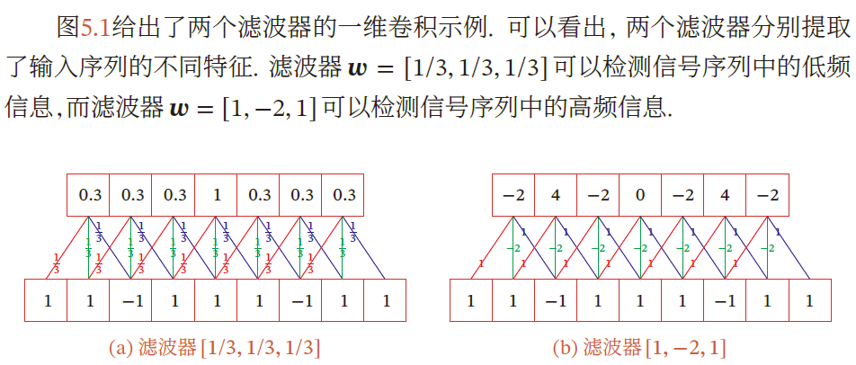

##### 二维卷积

常见滤波器

- **均值滤波** 将当前位置的像素值设为滤波窗口中所有像素的平均值 $w_{ab}=\frac{1}{AB}$ 

- **高斯滤波器** ：用于对图像平滑去噪

  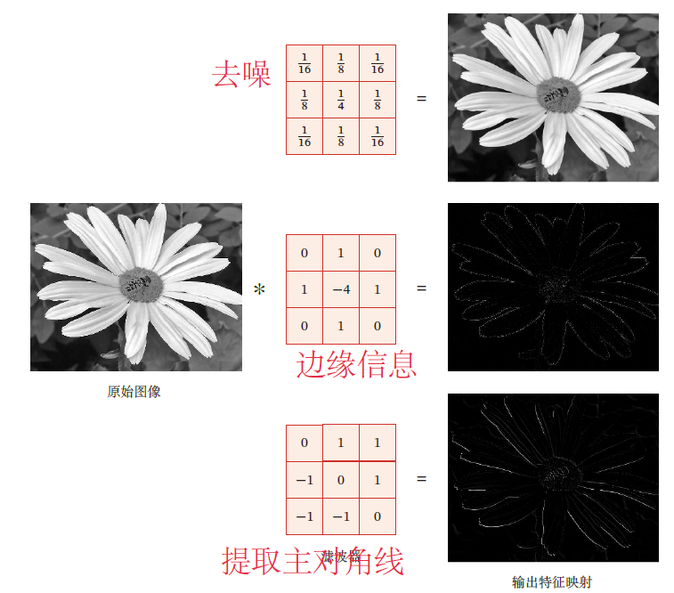

- 边缘滤波器，提取边缘特征

### 6.1.3 卷积核大小与输出

#### 特征映射

**卷积的功能是在一个图像（或某种特征）上滑动一个卷积核（滤波器），通过卷积运算得到一组新的特征——一种局部特征提取的方法**

卷积核可以被视为从输入映射到下一层的空间维度的转换器

卷积层的输出被称为 *特征映射* ，每个特征映射可作为一类从原始图像中抽取的图像特征

使用不同的卷积核可以得到同一数据的不同特征映射

#### 核大小与输出大小

在卷积层中，输入张量和核张量通过互相关产生输出张量

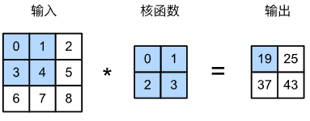

1. 在二维互相关运算中，卷积窗口从输入张量的左上角开始，从左到右、从上到下滑动
2. 当卷积核窗口滑动到输入的一个新位置，包含在该窗口内的部分张量与卷积核张量进行按元素乘，得到的张量再求和得到输出张量中的一个元素

输出大小略小于输入大小，输入高宽 $n_h\times n_w$ ，卷积核高宽 $k_h\times k_w$ ，输出大小为
$$
(n_h-k_h+1)\times (n_w-k_w+1)
$$

### 6.1.4 卷积层与卷积核实现

#### 定义互相关运算

```python
import torch
from torch import nn
from d2l import torch as d2l

def corr2d(X, K):  #@save
    """计算二维互相关运算"""
    # 卷积核的宽高一般是相等的
    h, w = K.shape
    Y = torch.zeros((X.shape[0] - h + 1, X.shape[1] - w + 1))
    for i in range(Y.shape[0]):
        for j in range(Y.shape[1]):
            Y[i, j] = (X[i:i + h, j:j + w] * K).sum()
    return Y
```

> 验证互相关运算

```python
X = torch.tensor([[0.0, 1.0, 2.0], [3.0, 4.0, 5.0], [6.0, 7.0, 8.0]])
K = torch.tensor([[0.0, 1.0], [2.0, 3.0]])
corr2d(X, K)

#	tensor([[19., 25.],
#        [37., 43.]])
```

#### 卷积层

卷积层对输入与卷积核进行互相关运算，在添加标量偏置后产生输出

在卷积层中两个被训练的参数为卷积核与偏置

```python
class Conv2D(nn.Module):
    def __init__(self, kernel_size):
        super().__init__()
        self.weight = nn.Parameter(torch.rand(kernel_size))
        self.bias = nn.Parameter(torch.zeros(1))
    def forward(self, x):
        return corr2d(x, self.weight) + self.bias
```

将带有 $h\times w$ 卷积核的卷积层称为 $h\times w$ 卷积层

##### 应用于目标边缘检测

构造有边缘的单通道灰度图

```python
X = torch.ones((6, 8))
X[:, 2:6] = 0
X
#	tensor([[1., 1., 0., 0., 0., 0., 1., 1.],
#	        [1., 1., 0., 0., 0., 0., 1., 1.],
#	        [1., 1., 0., 0., 0., 0., 1., 1.],
#	        [1., 1., 0., 0., 0., 0., 1., 1.],
#	        [1., 1., 0., 0., 0., 0., 1., 1.],
#	        [1., 1., 0., 0., 0., 0., 1., 1.]])
```

- 图像边缘为 1-0，0-1，即 `X[,1]` 与 `X[,6]`

构造 $1\times 2$ 卷积核进行互相关运算，若水平相邻的两元素相同，则输出为零；对于图像边界，输出为1

```python
K = torch.tensor([[1.0, -1.0]])
```

执行互相关运算

```python
Y = corr2d(X, K)
Y
#	tensor([[ 0.,  1.,  0.,  0.,  0., -1.,  0.],
#	        [ 0.,  1.,  0.,  0.,  0., -1.,  0.],
#	        [ 0.,  1.,  0.,  0.,  0., -1.,  0.],
#	        [ 0.,  1.,  0.,  0.,  0., -1.,  0.],
#	        [ 0.,  1.,  0.,  0.,  0., -1.,  0.],
#	        [ 0.,  1.,  0.,  0.,  0., -1.,  0.]])
```

- $Y$ 中1表示白色到黑色边缘，-1表示黑色到白色边缘

这个卷积层只能检测垂直边缘，无法检测水平边缘

##### 参数学习

通过 *输入-输出* 学习由 $X$ 生成 $Y$ 的卷积核

1. 将卷积核初始化
2. 每轮迭代，比较 $Y$ 与卷积输出 $\hat{Y}$ 的平方误差，通过梯度更新卷积核

```python
# 构造一个二维卷积层，它具有1个输出通道和形状为（1，2）的卷积核
conv2d = nn.Conv2d(1,1, kernel_size=(1, 2), bias=False)

# 这个二维卷积层使用四维输入和输出格式（批量大小、通道、高度、宽度），
# 其中批量大小和通道数都为1
X = X.reshape((1, 1, 6, 8))
Y = Y.reshape((1, 1, 6, 7))
```

```python
lr = 3e-2  # 学习率

for i in range(10):
    Y_hat = conv2d(X)
    l = (Y_hat - Y) ** 2
    conv2d.zero_grad()
    l.sum().backward()
    # 迭代卷积核
    conv2d.weight.data[:] -= lr * conv2d.weight.grad
    if (i + 1) % 2 == 0:
        print(f'epoch {i+1}, loss {l.sum():.3f}')
```

在10轮迭代后，误差已经降到足够低，学习到的卷积核权重张量

```python
conv2d.weight.data.reshape((1, 2))
#	tensor([[ 1.0010, -0.9739]])
```

### 6.1.5 卷积核与感受野机制

感受野机制：听觉、视觉等神经系统中的一些神经元，只接受其所支配的刺激区域内的信号

- 一个视觉皮层的神经元的感受野指视网膜上的特定区域，只有这个区域内的刺激才能激活该神经元

在神经网络中，对于某一层的任意元素 $x$ ，其 *感受野* 指在前向传播过程中可能影响 $x$ 取值的所有元素（来自所有先前层）

**感受野可能大于输入的实际大小**


19的感受野是输入阴影部分的四个元素，假设输出 $\mathbf{Y}$ ，其后再添加一个卷积层，输出单个元素 $z$ ，$z$ 的感受野除 $\mathbf{Y}$ 上的四个元素之外，还有输入 $\mathbf{X}$ 上的9个元素

因此，当特征图中的任意元素需要检测更广区域的局部特征时，可以构建更深的网络

## 6.2 卷积层超参数 

卷积输出的形状取决于输入形状与卷积核形状，同时也取决于超参数的设置，步长和填充是控制卷积层输出大小的两个超参数

为什么需要填充：在连续应用多次卷积后，我们最终得到的输出远小于输入大小——卷积核通常大于1

- 一个 $240\times 240$ 像素的图像，经过10层 $5\times 5$ 的卷积后，将减少到 $200\times 200$ 像素

这样，原始图像的边界丢失了很多有用信息，填充是解决此问题的有效方法

而对于原始的输入分辨率十分冗余的情况下，增大步幅可以快速降低图像的宽度和高度

---

填充（慢缩放）：在 **输入** 的边界进行零填充，使卷积层输出变大

- 输入规模小，又想用深的网络

- 输入数据对称，则会使用对称填充

步幅（快缩放）：使卷积层输出变小

- 输入规模大，使输入规模成倍减少，减少计算量

### 6.2.1 一维卷积上的填充与步幅

在卷积的标准定义基础上，还可以引入卷积核的 **滑动步长** (stride) 和 **零填充**(zero padding) 来增加卷积的多样性

步长S：卷积核在滑动时，滑动窗口的间隔；滑动窗口在一个时间间隔后滑动S个数据

- 增加步长，减少输出长度

零填充：在输入向量的两端补零

- 增加填充，增加输出长度

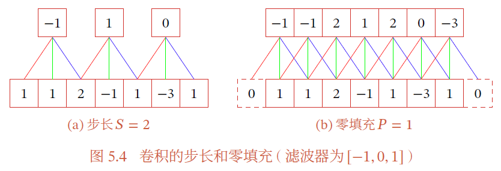

假设卷积层的输入神经元个数为 $N$ ，卷积大小为 $K$ ，步长为 $S$ ，在输入两端分别补 $\frac{P}{2}$ 个零，那么该卷积的神经元数量为 $\frac{N-K+P}{S}+1$ 

- 窄卷积：$S=1$ ，$P=0$ ，卷积后输出长度为 $N-K+1$
- 等宽卷积：$S=1$ ，$P=K-1$ ，卷积后输出长度为 $N$
- 宽卷积：$S=1$，$P=2K-2$，卷积后输出长度为 $N+K-1$

### 6.2.2 二维卷积上的填充与步幅

#### 填充

在输入图像的边界填充元素，若进行 $p_h$ 行填充和 $p_w$ 列填充，相当于输入的行列分别增加 $p_w$ 和 $p_h$

- 通常在行列上平均 $p_h$ 和 $p_w$ 个填充，即 $\frac{p_h}{2}$ 在顶部，$\frac{p_h}{2}$ 个填充在底部

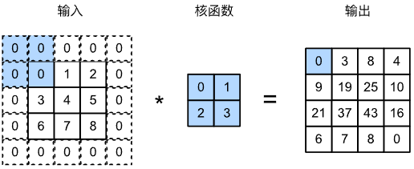

则输出形状变为
$$
(n_h+p_h-k_h+1)\times (n_w+p_w-k_2+1)
$$
通常，我们希望一次卷积后，不损失信息，即输入输出形状相等。因此，将填充设置为 $p_h=k_h-1,p_w=k_w-1$ 可使输入和输出形状相同

**卷积核的高和宽通常为奇数**，选择奇数的好处是上下和左右填充数相等

- 若 $k_h$ 是奇数，则在上下填充 $\frac{p_h}{2}$ 行
- 若 $k_h$ 为偶数，一种情况是上添加 $\lceil \frac{p_h}{2}\rceil$ 行，下添加 $\lfloor \frac{p_h}{2}\rfloor$

若输入和输出具有相同高度，卷积核的大小是奇数且上下、左右填充数相等，则 `Y[i,j]` 可以视为以输入 `X[i,j]` 为中心与卷积核进行互相关运算得到的

##### 实现

创建 $3\times 3$ 的二维卷积核，进行 $p_h=p_w=2$ 的零填充，输入的高宽为 $8\times 8$

```python
import torch
from torch import nn

# 此函数初始化卷积层权重，并对输入和输出提高和缩减相应的维数
def comp_conv2d(conv2d, X):
    # (1,1)+X.shape为拼接运算，将 (1,1)+(8,8)=(1,1,8,8) 以使用nn框架提供的卷积运算
    # 	(1,1,8,8)表示批量大小和通道数都是1
    X = X.reshape((1, 1) + X.shape)
    Y = conv2d(X)
    # 省略前两个维度：批量大小和通道
    return Y.reshape(Y.shape[2:])

# 请注意，这里每边都填充了1行或1列，因此总共添加了2行或2列
conv2d = nn.Conv2d(1, 1, kernel_size=3, padding=1)
X = torch.rand(size=(8, 8))
comp_conv2d(conv2d, X).shape
#	torch.Size([8, 8])
```

同样，由于输入的宽高不同，所以也会使用高度和宽度不同的卷积核，这是可以 **高度和宽度** 分别进行不同数量的填充

```python
conv2d = nn.Conv2d(1, 1, kernel_size=(5, 3), padding=(2, 1))
comp_conv2d(conv2d, X).shape
#	torch.Size([8, 8])
```

#### 步幅

在计算互相关时，卷积核窗口从输入张量的左上角开始，向下、向右滑动。每次默认滑动一个窗口，可以通过设置 **步幅** (stride)超参数，每次滑动多个元素

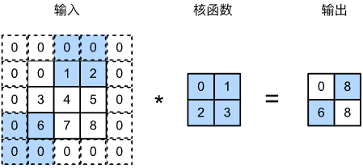

如图所示，计算 $[\mathbf{Y}]_{1,2}$ 后再计算 $[\mathbf{Y}]_{2,1}$ 时，滑动窗口向下滑动3个元素，向左滑动2个元素，即图中进行的运算是

1. 对输入进行 $p_h=p_2=2$ 的零填充
2. 垂直步幅为3，水平步幅为2的二维互相关运算

若设置垂直填充与水平填充为 $p_h,p_w$ ，垂直步幅与水平步幅为 $s_h,s_w$ 时，输出形状为
$$
\bigg\lfloor \frac{n_h+p_h-k_h+s_h}{s_h}\bigg\rfloor\times \bigg\lfloor\frac{n_w+p_w-k_w+s_w}{s_w}\bigg\rfloor
$$
若填充为 $p_h=k_h-1$ ，$p_w=k_w-1$ ，则输出形状为 $\bigg\lfloor \frac{n_h+s_h-1}{s_h}\bigg\rfloor\times \bigg\lfloor\frac{n_w+s_w-1}{s_w}\bigg\rfloor$ 。此时，若输入高度和宽度可以被垂直和水平步幅整除，则输出形状为 $\frac{n_h}{s_h}\times\frac{n_w}{s_w}$ 

```python
# 填充为2=卷积核-1；且输入可被步长整除
conv2d = nn.Conv2d(1, 1, kernel_size=3, padding=1, stride=2)
comp_conv2d(conv2d, X).shape
#	torch.Size([4, 4])
```

#### 简写

为简洁表达，当输入高度和宽度两侧的填充数量分别是 $p_h$ 和 $p_w$ 时，我们称之为填充 $(p_h,p_w)$ 。当 $p_h=p_w=p$ 时，我们称填充为 $p$ 

当垂直步幅和水平步幅分别为 $s_h$ 和 $s_w$ 时，我们称之为步幅 $(s_h,s_w)$ 。当 $s_h=s_w=s$ 时，称步幅为 $s$ 

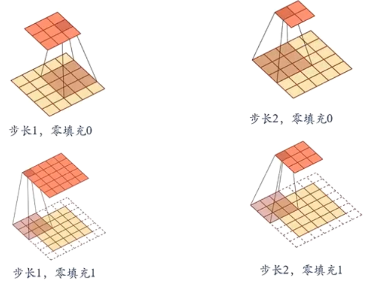


- 窄卷积：$p_h=p_w=0$ ，$s_h=s_w=1$ ，卷积后输出形状为 $(n_h-k_h+1)\times (n_w-k_w+1)$ 
- 等宽卷积：$s_h=s_w=1$ ，$p_h=k_h-1,p_w=k_w-1$ ，卷积后输出长度为 $n_h\times n_w$
- 宽卷积：$s_h=s_w=1$，$p_h=2(k_h-1),p_w=2(h_w-1)$，卷积后输出长度为 $(n_h+k_h-1)\times (n_w+k_w-1)$

#### 卷积与互相关运算的交换性

- 数学上，$*$ 表示卷积运算，$\otimes$ 表示互相关与运算
- 但在 `torch` 中，$*$ 表示矩阵乘时，运算结果与互相关运算结果一致，所以此处用 $*$ 表示互相关运算，$\otimes$ 表示卷积

交换性：$x\otimes y=y\otimes x$ 

二维图的宽卷积具有交换性

- 二维宽卷积：二维图像 $X\in \R^{n_h\times n_w}$ 和 二维卷积核 $W\in \R^{k_h\times k_w}$ ，对 $X$ 进行零填充，两端各补 $k_h-1$ 个零和 $k_w-1$ 个零，得到全填充的图像 $\tilde{X}\in \R^{(n_h+2k_h-2)\times (n_w+2k_w-2)}$ 

图像 $X$ 和卷积核 $W$ 的宽卷积定义为
$$
W\tilde{\otimes }X\triangleq W\otimes  \tilde{X}
$$
当输入信息和卷积核有固定长度时，他们的宽卷积具有交换性，
$$
W\otimes \tilde{X}=\tilde{X}\otimes W\iff W\tilde{\otimes}X=X\tilde{\otimes}W
$$
由于卷积与互相关运算的区别只有是否翻转卷积核，相应的宽互相关也有交换性
$$
rot180(W)\tilde{*}X=rot180(X)\tilde{*}W
$$

### 6.2.3 通道

#### 多输入通道

图像实质上一般包含三个通道 / RGB ，即一张图片是 $颜色\times 高度\times 宽度$ 组成的三维张量

- 直观上，可以将一个三维张量想象为一系列二维张量堆叠成的通道。

  后两个维度表示像素的空间位置，第一个维度看作每个像素的多维表示

  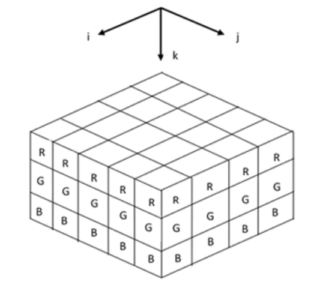

  **一个通道为后续层提供一种空间化的学习特征**

所以实际上一张图片表示为 $[\mathbf{X}]_{c_i,n_h,n_w}$ ，卷积核也应该相应调整为 $[\mathbf{V}]_{c_i,a,b}$ 
$$
\begin{array}{lll}
\begin{cases}
输入\mathbf{X}&:c_i\times n_h\times n_w\\
卷积核 \mathbf{W}&:c_i\times k_h\times k_w\\
偏置\mathbf{b}&:1\times c_i\\
输出\mathbf{H}&:m_h\times m_w
\end{cases}&\Longrightarrow \mathbf{H}=\sum\limits_{d=1}^{c_i}\left(\mathbf{X}_{d,:,:}\otimes\mathbf{W}_{d,:,:}+[\mathbf{b}]_d\right)
\end{array}
$$
由于输入和卷积核都有 $c_i$ 个通道

1. 对每个通道输入的二维张量 $\mathbf{X}_{n_h\times n_w}$ 与该通道的卷积核 $K_{k_h\times k_w}$ 进行互相关运算，并加偏置 $[\mathbf{b}]_d\in \R$
2. 对 $c_i$ 个通道互相关运算的结果求和，得到一个二维张量 $\mathbf{H}_{(n_h-k_h+1)\times(n_w-k_w+1)}$ 

$$
[\mathbf{H}]_{i,j}=\sum\limits^{c_i}_{d=1}\left(\sum\limits_{a=1}^{k_h}\sum\limits_{b=1}^{k_w}[\mathbf{V}]_{d,a,b}[\mathbf{X}]_{d,i+a-1,j+b-1}+[\mathbf{b}]_d\right)
$$

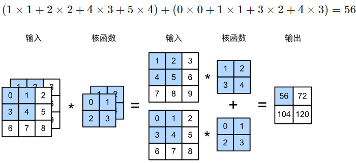

```python
import torch
from d2l import torch as d2l

def corr2d_multi_in(X, K):
    # 先遍历“X”和“K”的第0个维度（通道维度），再把它们加在一起
    return sum(d2l.corr2d(x, k) for x, k in zip(X, K))
	# zip(X,K)将序列X和K打包为元组的列表，每个元组包含X和K的一个元素
    #	X是[1, 2, 3],K是['A','B','C']:
    #		zip(X, K)=[(1,'A'),(2,'B'),(3,'C')]

X = torch.tensor([[[0.0, 1.0, 2.0], [3.0, 4.0, 5.0], [6.0, 7.0, 8.0]],
               [[1.0, 2.0, 3.0], [4.0, 5.0, 6.0], [7.0, 8.0, 9.0]]])
K = torch.tensor([[[0.0, 1.0], [2.0, 3.0]], [[1.0, 2.0], [3.0, 4.0]]])

corr2d_multi_in(X, K)
# tensor([[ 56.,  72.],
#         [104., 120.]])
```

#### 多输出通道

实际上，我们会同时获取同一张图片的不同空间化特征，如：在靠近输入的底层，一些通道专门识别边缘、一些通道识别纹理特征。即输入是多通道的 $c_i\times n_h\times n_w$ ，卷积层输出也是多通道的 $c_o\times m_h\times m_w$ ， 因此，每个空间化特征应该设计各自的卷积核，即 $c_o$ 个 $c_i\times k_h\times k_w$ 的卷积核

- 每层的通道都会为后续层提供一组空间化的学习特征

  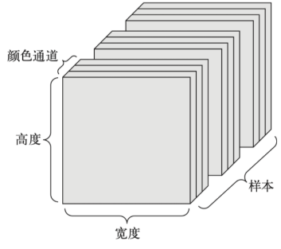

为了支持输入 $\mathbf{X}$ 和隐藏层 $\mathbf{H}$ 中的多个通道，卷积核需要再增加一维表示不同通道
$$
\begin{array}{lll}
\begin{cases}
输入\mathbf{X}&:c_i\times n_h\times n_w\\
卷积核 \mathbf{W}&:c_i\times k_h\times k_w\\
偏置\mathbf{B}&:c_o\times c_i\\
输出\mathbf{H}&:c_o\times m_h\times m_w
\end{cases}&\Longrightarrow \mathbf{H}=\sum\limits_{p=1}^{c_o}\sum\limits_{d=1}^{c_i}\left(\mathbf{X}_{d,:,:}\otimes\mathbf{W}_{d,:,:}+[\mathbf{B}]_{p,d}\right)
\end{array}
$$
其中，
$$
[\mathbf{H}]_{c_o,i,j}=\sum\limits_{p=1}^{c_o}\sum\limits^{c_i}_{d=1}\left(\sum\limits_{a=1}^{k_h}\sum\limits_{b=1}^{k_w}[\mathbf{V}]_{p,d,a,b}[\mathbf{X}]_{d,i+a-1,j+b-1}+[\mathbf{B}]_{p,d}\right)
$$

```python
def corr2d_multi_in_out(X, K):
    # 迭代“K”的第0个维度，每次都对输入“X”执行互相关运算。
    # 最后将所有结果都叠加在一起
    return torch.stack([corr2d_multi_in(X, k) for k in K], 0)
```

简单的将核张量 `K`、`K+1`、`K+2` 作为第零、第一、第二输出通道的卷积核

```python
K = torch.stack((K, K + 1, K + 2), 0)
K.shape
#	torch.Size([3, 2, 2, 2])

对输入张量X与卷积核张量K执行互相关运算，输出含3个通道
第1个通道输出结果与单输出通道输出结果一致
corr2d_multi_in_out(X, K)
#	tensor([[[ 56.,  72.],
#	         [104., 120.]],
#	
#	        [[ 76., 100.],
#	         [148., 172.]],
#	
#	        [[ 96., 128.],
#	         [192., 224.]]])
```

- `torch.stack(inputs, dim=?)` ，假设 `len(inputs)=l` ，且输入元组的每个元素形状都是 $m\times n$ ，则

- 对于

  ```python
  >>> T1 = torch.tensor([[1, 2, 3], [4, 5, 6], [7, 8, 9]])
  >>> T2 = torch.tensor([[10, 20, 30], [40, 50, 60], [70, 80, 90]])
  ```

  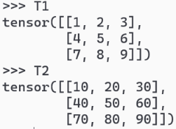

  - `dim=0` 则输出形状为 $l\times m\times n$ 

    ```python
    torch.stack((T1,T2),dim=0)
    tensor([[[ 1,  2,  3],
             [ 4,  5,  6],
             [ 7,  8,  9]],
    
            [[10, 20, 30],
             [40, 50, 60],
             [70, 80, 90]]])
    ```

    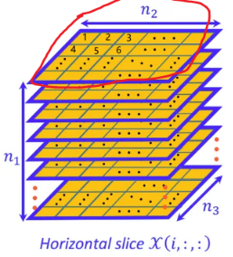

  - `dim=1` 则输出形状为 $m\times l\times n$ 

    ```python
    >>> torch.stack((T1,T2),dim=1)
    tensor([[[ 1,  2,  3],
             [10, 20, 30]],
    
            [[ 4,  5,  6],
             [40, 50, 60]],
    
            [[ 7,  8,  9],
             [70, 80, 90]]])
    ```

    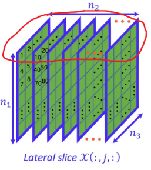

  - `dim=2` 则输出形状为 $m\times n\times l$ 

    ```python
    >>> torch.stack((T1,T2),dim=2)
    tensor([[[ 1, 10],
             [ 2, 20],
             [ 3, 30]],
    
            [[ 4, 40],
             [ 5, 50],
             [ 6, 60]],
    
            [[ 7, 70],
             [ 8, 80],
             [ 9, 90]]])
    ```

    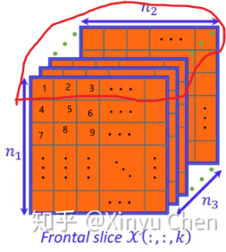

  `dim` 指定了新维度的位置

#### 总结

卷积核：高度和宽度维度上识别相邻元素间相互作用

输出通道：每个输出通道输出各自通道可以识别的特定局部特征

输入通道：对局部特征的组合——相加

越底层，识别的特征越局部；随着网络层数的加深，组合的特征数越来越多，越接近真实结果

- 从感受野机制理解，越底层，感受野越小，识别的局部特征越小；越顶层，其感受野越大，识别并组合的局部特征越多，越接近真实的输出

#### 1维卷积

$k_h=k_w=1$ 的卷积核，可以实现同一元素位置上信息的跨通道组合

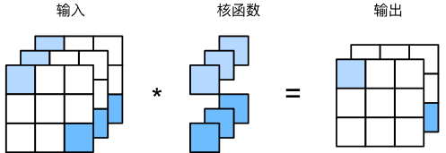

1维卷积应用在每个像素位置的不同通道相当于输入形状为 $n_hn_w\times c_i$ 权重为 $c_o\times c_i$ 的全连接层
$$
X_{n_hn_w\times c_i}\left(\mathbf{W}_{c_o\times c_i}\right)^T=\mathbf{H}_{n_hn_w\times c_o}
$$
以 $c_i$ 个输入值转换为 $c_o$ 个输出值，所以 $1\times 1$ 卷积层需要权重维度为 $c_o\times c_i$ 

```python
def corr2d_multi_in_out_1x1(X, K):
    c_i, h, w = X.shape
    c_o = K.shape[0]
    X = X.reshape((c_i, h * w))
    K = K.reshape((c_o, c_i))
    # 全连接层中的矩阵乘法
    Y = torch.matmul(K, X)
    return Y.reshape((c_o, h, w))

X = torch.normal(0, 1, (3, 3, 3))
K = torch.normal(0, 1, (2, 3, 1, 1))

Y1 = corr2d_multi_in_out_1x1(X, K)
```

### 6.2.4 二维卷积层一般形式

二维卷积层的一般形式
$$
\begin{array}{lll}
\begin{cases}
输入\mathbf{X}&:c_i\times n_h \times n_w\\
卷积核\mathbf{W}&:c_o\times c_i\times k_h\times k_w\\
偏差\mathbf{B}&:c_o\times c_i
\end{cases}\Longrightarrow\mathbf{H}=\mathbf{X}\otimes\mathbf{W}+\mathbf{B},\mathbf{H}\in \R^{c_o\times m_h\times m_w}\xRightarrow{f(\cdot)}\hat{Y}=f\left(\mathbf{H}\right)
\end{array}
$$

#### 时间复杂度

对于每个输出 $[\mathbf{H}]_{i,j}$ ，需要在 $c_i$ 个通道上分别进行 $k_h\times k_w$ 次乘法，每个输出通道有 $m_h\times m_w$ 个元素，共有 $c_o$ 个通道，所以计算时间复杂度为 $O(c_o\times c_i\times k_h\times k_w\times m_h\times m_w)$ 次浮点数运算

如：$c_i=c_o=100$ ，$k_h=k_w=5$，$m_h=m_w=64$ ，则需要进行 $1024\times 10^6=1GFLOP$ 

若有10层卷积层，样本数量为1M，前向运算则需要 $10P$ 次浮点数运算 

CPU每秒大约0.15T次浮点数运算，大约需要18h

GPU每秒大约12T次浮点数运算，大约需要14min

## 6.3 卷积神经网络

CNN结构：卷积层；汇聚层；

### 6.3.1 结构

#### 卷积层

输入：$\mathbf{X}\in \R^{c_i\times n_h\times n_w}$ ，每个输入通道的数据 $[\mathbf{X}]_{d}$ 为一个输入分量，$d\in [1,c_i]$ 

输出：$\mathbf{Y}\in \R^{c_o\times m_h\times m_w}$ ，每个输出通道的数据 $[\mathbf{Y}]_{p}$ 为一个输出分量，$p\in [1,c_o]$

卷积核：$\mathbf{W}\in \R^{c_o\times c_i\times k_h\times k_w}$ ，对于一个输出通道上的输出 $[\mathbf{Y}]_{p}$ ，各输入通道都对应一个 $k_h\times k_w$ 的卷积核 $[\mathbf{W}]_{p,d}$ 

- 每个卷积核都对应一个实数偏置，即 $[\mathbf{B}]_{p,d}\in \R$ 

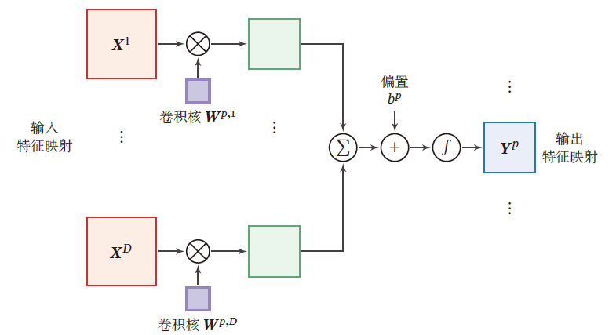

即输出层的一个特征映射为
$$
\begin{array}{ll}
\begin{bmatrix}\mathbf{H}\end{bmatrix}_{p,:,:}&=\sum\limits_{d=1}^{c_i}\left([\mathbf{X}]_{d,:,:}\otimes [\mathbf{W}]_{p,d,:,:}+[\mathbf{B}]_{p,d}\right)\\
&=\sum\limits_{d=1}^{c_i}[\mathbf{X}]_{d,:,:}\otimes [\mathbf{W}]_{p,d,:,:}+[\mathbf{B}]_{p,:}\\
&\iff\begin{bmatrix}\mathbf{H}\end{bmatrix}_{p,i,j}=\sum\limits_{d=1}^{c_i}\left(\sum\limits_{a=1}^A\sum\limits_{b=1}^B[\mathbf{X}]_{d,i+a-1,j+b-1} [\mathbf{W}]_{p,d,a,b}+[\mathbf{B}]_{p,d}\right)\\
[\mathbf{Y}]_p&=f([\mathbf{H}]_{p})
\end{array}
$$
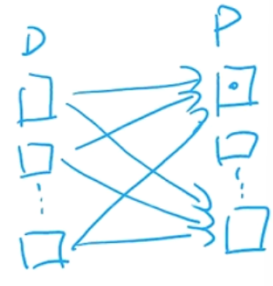

所以 **输入通道和输出通道间的特征映射是全连接的** 

##### 卷积核

卷积核 $\mathbf{W}\in\R^{c_o\times c_i\times k_h\times k_w}$ 为四维张量，其中每个切片矩阵 $[\mathbf{W}]_{p,d}$ 为一个二维卷积核，$p\in [1,c_o],d\in [1,c_i]$ 

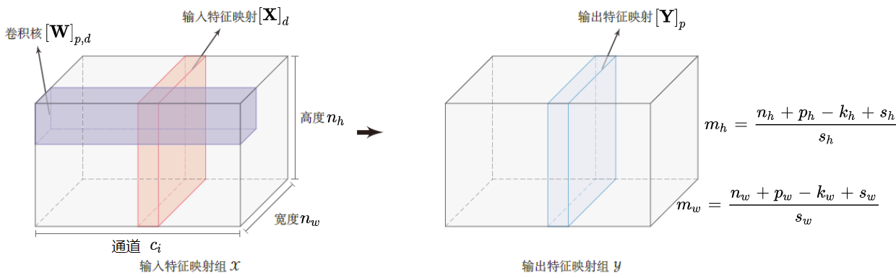

一个输出通道上的值 $[\mathbf{Y}]_p$ 需要该输出通道对应的 $c_i$ 个输入通道上的卷积核 $[\mathbf{W}]_{p,d}$ 与输入通道的 $c_i$ 个分量分别卷积

- 图上画的是一次卷积过程，实际上要得到蓝色的输出矩阵需要 $c_i$ 次卷积运算，所以输入特征应该是 $c_i$ 个粉矩阵才对，图有点问题

- 展开是这么个过程，2个输出通道，3个输入通道 $[\mathbf{X}]_{d}\in \R^{5\times 5}$ ，所以有 $c_o\times c_i=2\times 3=6$ 个卷积核  $[\mathbf{W}]_{p,d}\in R^{3\times 3}$，填充 $p=2$ ，步长 $s=2$ ，即经过卷积，输出大小为 $\frac{5+2+2-3}{2}=3$ 

  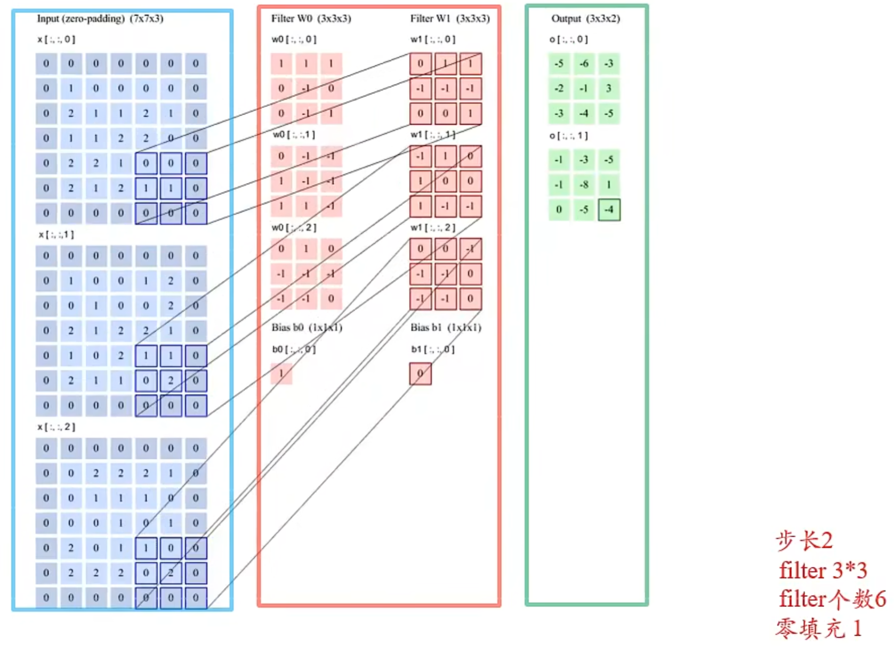

##### 参数数量

每个输出特征映射都需要 $c_i$ 个卷积核，共需要 $c_o\times c_i$ 个卷积核，每个卷积核大小为 $k_h\times k_w$ 。同时，每个卷积核对应一个实数偏置，所以有 $c_o\times c_i\times k_h\times k_w+c_o\times c_i$ 个参数需要存储与学习 

#### 池化层

> 池化层直观上的作用是减少神经元数量，可以缓解卷积层对位置的敏感性

- 减少输出层神经元数量：
  - 一维卷积：$M_l=M_{l-1}-(K-1)$ ，即减少 $K-1$ 个神经元
  - 二维卷积：$m_h\times m_w=(\frac{m_{w-1}+p_w+s_w-k_w}{s_w}\times \frac{m_{h-1}+p_h+s_h-k_h}{s_h})$ 

池化（汇聚）指对每个区域采样，用一个具有代表性的值代替这个区域

池化层也称为子采样层，作用是进行特征选择，降低特征数量，从而减少参数数量

---

通常处理图像时，我们希望逐渐降低隐藏在图像中的空间信息、聚集信息，随着网络层数的加深，每个神经元的感受野就越大

而机器学习的学习任务与全局图像有关，即最后一层的神经元其感受野应该是全局图像。从底层到深层，应该是从局部信息到全局信息逐渐聚合的过程，最终可以实现全局的学习目标。

在检测底层的特征时，我们通常希望在这些局部特征保持一定程度上的平移不变性。即随着拍摄角度的移动，同一个局部特征不可能发生在所有图片的同一像素位置上

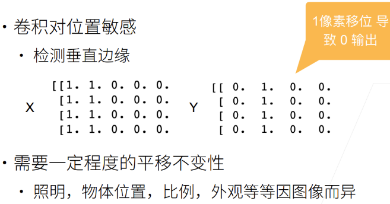

##### 池化层窗口

池化层输入 $\mathbf{X}\in \R^{c_i\times n_h\times n_w}$ ，对于一个通道的输入 $[\mathbf{X}]_d,d\in [1,c_i]$ ，池化层窗口 $[\mathbf{R}]_{d}\in \R^{r_w\times r_h},(r_h,r_w)\in [n_h,n_w]$ 可将一个通道的输入划分为多个小区域分别进行池化

这些区域可以重叠，也可以不重叠

默认情况：池化层窗口当前扫过的区域，与下一次扫过的区域没有重叠部分，即步幅和窗口大小相等 $s_w=r_w,s_h=r_h$ 

##### 最大池化层

对于一个区域 $[\mathbf{R}]_d$ ，选择这个区域中最大的元素作为这个区域的代表
$$
y_d=\max\left([\mathbf{R}]_d\right)
$$
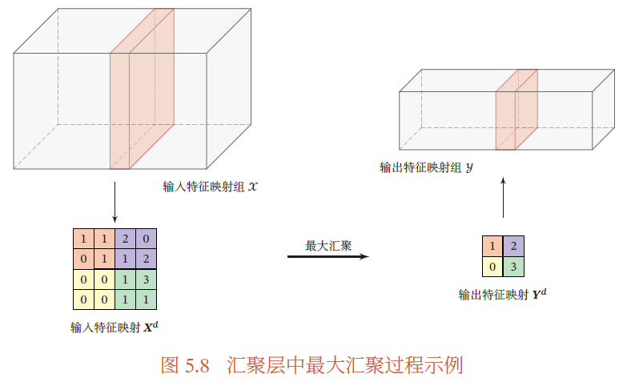

###### 最大池化层对卷积层位置敏感的降低

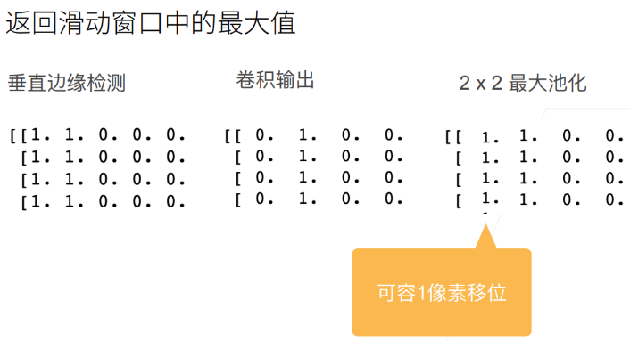

对垂直边缘的检测， $2\times 2$ 的池化层容忍1个像素的左或右偏移：即一些数据 $[\mathbf{X}]_{i,j}$ 是边缘，当另一数据边缘移动到 $[\mathbf{X}]_{i,j+1}'$ 或 $[\mathbf{X}]_{i,j-1}'$ ，$[\mathbf{X}]_{i,j}'$ 仍会被认为是边缘

##### 平均池化

对于一个区域 $[\mathbf{R}]_d$ ，选择这个区域的平均指标作为这个区域的代表
$$
y_d=\frac{1}{\vert [\mathbf{R}]_d\vert}\sum\limits_{x_i\in [\mathbf{X}]_d} x_i
$$

##### 池化核

目前，主流的卷积网络仅包含 **下采样** 操作，但在一些早期卷积网络（LeNet-5），有时也会在汇聚层使用非线性激活函数

典型的池化层将每个特征映射划分为 $2\times 2$ 大小的不重叠区域，使用最大汇聚方式采样

- 过大的采样区域会造成神经元数量减少过多，从而造成较多的信息损失

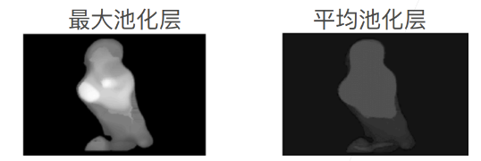

最大池化层：输出每个窗口中最强的信号，在较强信号周围的像素也会受到这个强信号的影响，会有明显的层次化信息

平均池化层：对信号有一定抹平效果，信号强度小于最大池化层，有柔和作用

##### 实现

```python
import torch
from torch import nn
from d2l import torch as d2l

def pool2d(X, pool_size, mode='max'):
    r_h, r_w = pool_size
    Y = torch.zeros((X.shape[0] - r_h + 1, X.shape[1] - r_w + 1))
    for i in range(Y.shape[0]):
        for j in range(Y.shape[1]):
            if mode == 'max':
                Y[i, j] = X[i: i + r_h, j: j + r_w].max()
            elif mode == 'avg':
                Y[i, j] = X[i: i + r_h, j: j + r_w].mean()
    return Y
```

```python
X = torch.tensor([[0.0, 1.0, 2.0], [3.0, 4.0, 5.0], [6.0, 7.0, 8.0]])
pool2d(X, (2, 2))
#	tensor([[4., 5.],
#	        [7., 8.]])

pool2d(X, (2, 2), 'avg')
#	tensor([[2., 3.],
#	        [5., 6.]])
```

##### 池化层超参数

池化层也能通过修改填充和步幅改变输出形状

```python
X = torch.arange(16, dtype=torch.float32).reshape((1, 1, 4, 4))
X
#	tensor([[[[ 0.,  1.,  2.,  3.],
#	          [ 4.,  5.,  6.,  7.],
#	          [ 8.,  9., 10., 11.],
#	          [12., 13., 14., 15.]]]])
```

**默认情况下，步幅与窗口大小相等** 

池化层窗口大小为3，步幅也为3，所以输出窗口为 $\frac{4+3-3}{3}=1$ 

```python
pool2d = nn.MaxPool2d(3)
pool2d(X)
#	tensor([[[[10.]]]])
```

自定义步幅与填充：输出 $\frac{4+1+2-3}{2}=2$

```python
pool2d = nn.MaxPool2d(3, padding=1, stride=2)
pool2d(X)
#	tensor([[[[ 5.,  7.],
#	          [13., 15.]]]])
```

也可以修改池化层窗口大小，$\frac{4-2+0+2}{2}=2$ ，$\frac{4-3+3+1}{3}=2$ 

```python
pool2d = nn.MaxPool2d((2, 3), stride=(2, 3), padding=(0, 1))
pool2d(X)
#	tensor([[[[ 5.,  7.],
#	          [13., 15.]]]])
```

**多输入通道**

在处理多输入通道的数据时，池化层在每个通道上单独运算，池化层的输出通道数与输入通道数相同

```python
#构建两个通道的输入X和X+1
X = torch.cat((X, X + 1), 1)
X
#	tensor([[[[ 0.,  1.,  2.,  3.],
#	          [ 4.,  5.,  6.,  7.],
#	          [ 8.,  9., 10., 11.],
#	          [12., 13., 14., 15.]],
#	
#	         [[ 1.,  2.,  3.,  4.],
#	          [ 5.,  6.,  7.,  8.],
#	          [ 9., 10., 11., 12.],
#	          [13., 14., 15., 16.]]]])
```

对2输入通道的数据进行池化，输出通道仍是2

```python
pool2d = nn.MaxPool2d(3, padding=1, stride=2)
pool2d(X)
#	tensor([[[[ 5.,  7.],
#	          [13., 15.]],
#	
#	         [[ 6.,  8.],
#	          [14., 16.]]]])
```

#### 卷积神经网络的整体结构


一个 **卷积块** 为连续 $M$ 个卷积层和 $b$ 个汇聚层组成（一般情况，$m为2\sim 5$，$b\in\{0,1\}$）

一个卷积神经网络会连续堆叠 $N$ 个卷积块，拼接为 $K$ 个全连接层，最后 *softmax* 归一化

典型结构：

- 小卷积，大深度
- 趋向于全卷积：由于卷积操作越来越灵活（不同的步长），池化层的作用正在变小

### 6.3.2 参数学习

卷积神经网络中，参数为卷积核及其偏置，只需要计算卷积层中参数的梯度

#### 参数求解目标

第 $l$ 层卷积层的输入为 $\mathbf{X}_{l}\in\R^{c_i\times n_h\times n_w}$ ，通过卷积运算得到第 $l$ 层的净输出，即第 $l$ 卷积层
$$
\mathbf{H}^{(l)}_p=\sum\limits_{d=1}^{c_i}\left([\mathbf{W}]_{p,d}^{(l)}\otimes [\mathbf{X}]^{(l)}_{d}+[\mathbf{B}]_{p,d}^{(l)}\right)\in \R^{m_h\times m_w},p\in [1,c_o]\\
[\hat{\mathbf{Y}}]_p^{(l)}=f([\mathbf{H}]_p^{(l)})
$$
第 $l$ 层有 $c_o\times c_i$ 个卷积核和偏置，每个卷积核有 $k_h\times k_w$ 个参数，即每一层共有 $c_o\times c_i\times (k_h\times k_w+1)$ 个参数需要学习

采用交叉熵损失函数
$$
\ell\left(\mathbf{Y},\hat{\mathbf{Y}}\right)=-\mathbf{Y}\log \hat{\mathbf{Y}}
$$
若有 $N$ 个训练数据，则结构风险函数为
$$
\mathcal{R}\left([\mathbf{W}]_{p,d}^{(l)},[\mathbf{B}]_{p,d}^{(l)}\right)=\frac{1}{N}\sum\limits_{i=1}^N\ell\left(\mathbf{Y},\hat{\mathbf{Y}}\right)+\lambda \big\Vert [\mathbf{W}]_{p,d}^{(l)}\big\Vert_F^2
$$
参数学习的核心是梯度的学习，即求解 $\frac{\partial \mathcal{R}\left([\mathbf{W}]_{p,d}^{(l)},[\mathbf{B}]_{p,d}^{(l)}\right)}{\partial [\mathbf{W}]_{p,d}^{(l)}}$ ，$\frac{\partial \mathcal{R}\left([\mathbf{W}]_{p,d}^{(l)},[\mathbf{B}]_{p,d}^{(l)}\right)}{\partial [\mathbf{B}]_{p,d}^{(l)}}$
$$
\begin{aligned}
\begin{bmatrix}\mathbf{W}\end{bmatrix}_{p,d}^{(l)}&\leftarrow [\mathbf{W}]_{p,d}^{(l)}-\eta\frac{\partial \mathcal{R}\left([\mathbf{W}]_{p,d}^{(l)},[\mathbf{B}]_{p,d}^{(l)}\right)}{\partial [\mathbf{W}]_{p,d}^{(l)}}\\
&\leftarrow [\mathbf{W}]_{p,d}^{(l)}-\eta\left(\frac{1}{N}\sum\limits_{i=1}^N\frac{\partial \ell\left(\mathbf{Y}_i,\hat{\mathbf{Y}}_i\right)}{\partial [\mathbf{W}]_{p,d}^{(l)}}+\lambda \bigg\Vert [\mathbf{W}]_{p,d}^{(l)}\bigg\Vert_F\right)\\
[\mathbf{B}]_{p,d}^{(l)}&\leftarrow [\mathbf{B}]_{p,d}^{(l)}-\eta\frac{\partial \mathcal{R}\left([\mathbf{W}]_{p,d}^{(l)},[\mathbf{B}]_{p,d}^{(l)}\right)}{\partial [\mathbf{B}]_{p,d}^{(l)}}\\
&\leftarrow [\mathbf{B}]_{p,d}^{(l)}-\eta\left(\frac{1}{N}\sum\limits_{i=1}^N\frac{\partial \ell\left(\mathbf{Y}_i,\hat{\mathbf{Y}}_i\right)}{\partial [\mathbf{B}]_{p,d}^{(l)}}\right)
\end{aligned}
$$

##### 卷积梯度

假设 $\mathbf{H}=\mathbf{W}* \mathbf{X}\in \R^{(n_h-k_h+1)\times (n_w-k_w+1)}$ ，其中 $\mathbf{X}\in \R^{n_h\times n_w}$ ，$\mathbf{W}\in \R^{k_h\times k_w}$  ，有特征映射 $f(\mathbf{H})\in \R$ 为标量，$f(\cdot)$ 为非线性激活函数
$$
\begin{aligned}
\frac{\partial f(\mathbf{H})}{\partial [\mathbf{W}]_{ab}}&=\sum\limits_{i=1}^{n_h-k_h+1}\sum\limits_{j=1}^{n_w-k_w+1}\frac{\partial f(\mathbf{H})}{\partial [\mathbf{H}]_{ij}}\frac{\partial [\mathbf{H}]_{ij}}{\partial [\mathbf{W}]_{ab}}\\
&=\sum\limits_{i=1}^{n_h-k_h+1}\sum\limits_{j=1}^{n_w-k_w+1}\frac{\partial f(\mathbf{H})}{\partial [\mathbf{H}]_{ij}}[\mathbf{X}]_{i+a-1,j+b-1}\\
&=\sum\limits_{i=1}^{n_h-k_h+1}\sum\limits_{j=1}^{n_w-k_w+1}\frac{\partial f(\mathbf{H})}{\partial [\mathbf{H}]_{ij}}[\mathbf{X}]_{a+i-1,b+j-1}
\end{aligned}
$$

- 互相关结果的每个元素 $[\mathbf{H}]_{i,j}$ 与每一卷积核元素 $[\mathbf{W}]_{a,b}$ 有关
  $$
  [\mathbf{H}]_{i,j}=\sum\limits_{a=1}^{k_h}\sum\limits_{b=1}^{k_w}[\mathbf{X}]_{i+a-1,j+b-1}[\mathbf{W}]_{a,b}+b
  $$
  所以对卷积核某一元素求偏导，是所有输出元素对该元素求偏导的核

所以 $f(\mathbf{H})$ 关于 $\mathbf{W}$ 的梯度为 $\mathbf{X}$ 与 $\frac{\partial f(\mathbf{H})}{\partial \mathbf{H}}$ 的互相关运算
$$
\frac{\partial f(\mathbf{H})}{\partial \mathbf{W}}=\frac{\partial f(\mathbf{H})}{\partial \mathbf{H}}* \mathbf{X}
$$

---

$$
\begin{aligned}
\frac{\partial f(\mathbf{H})}{\partial [\mathbf{X}]_{s,t}}&=\sum\limits_{i=1}^{n_h-k_h+1}\sum\limits_{j=1}^{n_w-k_w+1}\frac{\partial [\mathbf{H}]_{ij}}{\partial [\mathbf{X}]_{st}}\frac{\partial f(\mathbf{H})}{\partial [\mathbf{H}]_{ij}}\\
&=\sum\limits_{i=1}^{n_h-k_h+1}\sum\limits_{j=1}^{n_w-k_w+1}[\mathbf{W}]_{s-i+1,t-j+1}\frac{\partial f(\mathbf{H})}{\partial [\mathbf{H}]_{ij}}\\
&=\sum\limits_{i=1}^{n_h-k_h+1}\sum\limits_{j=1}^{n_w-k_w+1}\frac{\partial f(\mathbf{H})}{\partial [\mathbf{H}]_{ij}}[\mathbf{W}]_{s-i+1,t-j+1}
\end{aligned}
$$

- 当使用 $[\mathbf{X}]_{i+a-1,j+b-1}$ 这个数据时，其相应的卷积核元素为 $[\mathbf{W}]_{a,b}$ ，所以当 $\begin{cases}i+a-1=s\\j+b-1=t\end{cases}$ ，$\begin{cases}a=s-i+1\\b=t-j+1\end{cases}$ 

- $\mathbf{W}$ 的高上限为 $k_h$ ，但 $s-i+1$ 的上限为 $n_h$ ；$\mathbf{W}$ 的高下限为 $1$ ，但 $s-i+1$ 的下限为 $1-(n_h-w_h+1)+1=1-(n_h-k_h)$  。

  所以，当 $(s-i+1)<1$ 或 $(s-i+1)>k_h$ ，$(t-j+1)<1$ 或 $t-j+1>k_w$ 时，$[\mathbf{W}]_{s-i+1,t-j+1}=0$ ，相当于对 $\mathbf{W}$ 进行了 $(2(n_h-k_h),2(n_w-k_w))$ 的零填充

即 $f(\mathbf{H})$ 关于 $\mathbf{X}$ 的梯度为 $\mathbf{W}$ 与 $\frac{\partial f(\mathbf{H})}{\partial \mathbf{H}}$ 的宽卷积
$$
\begin{aligned}
\frac{\partial f(\mathbf{H})}{\partial \mathbf{X}}=\frac{\partial f(\mathbf{H})}{\partial \mathbf{H}}\tilde{\otimes}\mathbf{W}&=rot180\left(\mathbf{W}\right)\tilde{*}\frac{\partial f(\mathbf{H})}{\partial \mathbf{H}}\\
&=rot180\left(\frac{\partial f(\mathbf{H})}{\partial \mathbf{H}}\right)\tilde{*}\mathbf{W}
\end{aligned}
$$

#### 卷积层误差项反向传播

误差反向传播中，讨论的是：

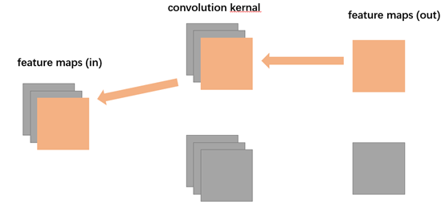

根据卷积求导公式，有
$$
\begin{aligned}
\frac{\partial \ell}{\partial [\mathbf{W}]^{(l)}_{p,d}}&=\frac{\partial \ell}{\partial [\mathbf{H}]^{(l)}_{p}}* [\mathbf{X}]^{(l)}_{d}\\
&=\delta^{(l)}_p* [\mathbf{X}]^{(l)}_d\\
\frac{\partial \ell}{\partial [\mathbf{B}]^{(l)}_{p,d}}&=\frac{\partial \ell}{\partial [\mathbf{H}]^{(l)}_{p}}\\
&=\delta^{(l)}_p
\end{aligned}
$$
即在卷积神经网络中，第 $l$ 层参数的梯度依赖于所在层的误差项 $\delta^{(l)}_p$ 
$$
\begin{aligned}
\delta^{(l)}_p&\triangleq\frac{\partial \ell}{\partial [\mathbf{H}]^{(l)}_p}\\
&=\frac{\partial \ell}{\partial [\mathbf{X}]^{(l+1)}_p}\frac{\partial [\mathbf{X}]^{(l+1)}_p}{\partial \mathbf{H}^{(l)}_p}
\end{aligned}
$$
由于第 $l+1$ 层的输入 $\mathbf{X}^{(l+1)}$ 为第 $l$ 层的活性值 $f_l\left(\mathbf{H}^{(l)}\right)$ ，即有第 $l+1$ 层输入的第 $p$ 个元素等于第 $l$ 层净输出的第 $p$ 个元素
$$
\begin{array}{ll}
&\begin{bmatrix}\mathbf{X}\end{bmatrix}_p^{(l+1)}=f_l\left([\mathbf{H}]^{(l)}_p\right)&,f(\cdot)为非线性激活函数\\
&[\mathbf{H}]_{p}^{(l)}=\sum\limits_{d=1}^{c_i}\left([\mathbf{W}]_{p,d}^{(l)}* [\mathbf{X}]^{(l)}_{d}+[\mathbf{B}]_{p,d}^{(l+1)}\right)&,且(c_i,n_h,n_w)^{(l+1)}=(c_o,m_h,m_w)^{(l)}
\end{array}
$$
故：

- $$
  \frac{\partial [\mathbf{X}]^{(l+1)}_p}{\partial [\mathbf{H}]^{(l)}_p}=\frac{\partial f_l([\mathbf{H}]^{(l)}_p)}{\partial [\mathbf{H}]^{(l)}_p}=f_l'\left([\mathbf{H}]^{(l)}_p\right)
  $$

  $f_l'\left([\mathbf{H}]^{(l)}_p\right)$ 为 $c_o\times c_o$ 的对角矩阵，对角线元素为 $f_l'\left([\mathbf{H}]^{(l)}_1\right),\cdots,f_l'\left([\mathbf{H}]^{(l)}_{c_o}\right)$ 

- 已知(PS:见《全连接层#误差的反向传播算法》)
  $$
  \frac{\partial \ell}{\partial \mathbf{h}_l}=\delta_{l+1}\mathbf{W}_{l+1}=\begin{bmatrix}
  \sum\limits_{j=1}^{M_{l+1}}\delta^{(j)}_{l+1}w_{l+1}^{(j,1)}&\cdots
  &
  \sum\limits_{j=1}^{M_{l+1}}\delta^{(j)}_{l+1}w_{l+1}^{(j,M_l)}
  \end{bmatrix}\in \R^{1\times M_{l}}
  $$
  其中，$\mathbf{h}_l$ 为第 $l$ 层活性值，即对活性值的求导，每一个元素都需要第 $l+1$ 层的 $M_{l+1}$ 个元素累加 $\sum\limits_j^{M_{l+1}}$ 
  
  由于 $[\mathbf{X}]^{(l+1)}_p=f_l\left([\mathbf{H}]_p^{(l)}\right)$ 为第 $l$ 层的活性值，所以有
  $$
  \frac{\partial \ell}{\partial [\mathbf{X}]^{(l+1)}_p}=\sum\limits_{q=1}^{c_o^{(l+1)}}rot180\left([\mathbf{W}]^{(l+1)}_{q,p}\right)\tilde{*}\frac{\partial\ell}{\partial [\mathbf{H}]^{(l+1)}_{q}}
  $$

综上，卷积层误差项为
$$
\begin{aligned}
\delta^{(l)}_p&\triangleq\frac{\partial \ell}{\partial [\mathbf{H}]^{(l)}_p}\\
&=\frac{\partial [\mathbf{X}]^{(l+1)}_p}{\partial \mathbf{H}^{(l)}_p}\frac{\partial \ell}{\partial [\mathbf{X}]^{(l+1)}_p}\\
&=f_l'\left([\mathbf{H}]^{(l)}_p\right)\odot \sum\limits_{q=1}^{c_o^{(l+1)}}rot180\left([\mathbf{W}]^{(l+1)}_{q,p}\right)\tilde{*}\frac{\partial\ell}{\partial [\mathbf{H}]^{(l+1)}_{q}}\\
&=f_l'\left([\mathbf{H}]^{(l)}_p\right)\odot \sum\limits_{q=1}^{c_o^{(l+1)}}rot180\left([\mathbf{W}]^{(l+1)}_{q,p}\right)\tilde{*}\delta_q^{(l+1)}
\end{aligned}
$$

#### 池化层误差项反向传播

当第 $l+1$ 层是池化层时，因为池化层是下采样操作，第 $l+1$ 层的误差项 $\delta$ 对应于第 $l$ 层相应特征映射的一个区域

第 $l$ 层的第 $p$ 个特征映射中的每个神经元都有一条边和 $l+1$ 层的第 $p$ 个特征映射中的一个神经元相连

第 $l$ 层第 $p$ 个特征映射的误差项 $\delta^{(l)}_p$ 的具体推导为
$$
\begin{aligned}
\delta^{(l,p)}&\triangleq\frac{\partial \ell}{\partial [\mathbf{H}]^{(l)}_p}\\
&=\frac{\partial [\mathbf{X}]^{(l+1)}_p}{\partial [\mathbf{H}]^{(l)}_p}\frac{\partial [\mathbf{H}]^{(l+1)}_p}{\partial [\mathbf{X}]^{(l+1)}_p}\frac{\partial \ell}{\partial [\mathbf{H}]^{(l+1)}_p}\\
&=f_l'\left([\mathbf{H}]^{(l)}_p\right)\odot up(\delta^{(l+1)}_p)
\end{aligned}
$$
$up(\cdot)$ 为上采样函数，与汇聚层的下采样操作相反

- 若下采样是最大汇聚，则 $\delta^{(l+1)}_p$ 中每个值会直接传递到前一层对应区域中的最大值对应的神经元，该区域中其他神经元设为0

  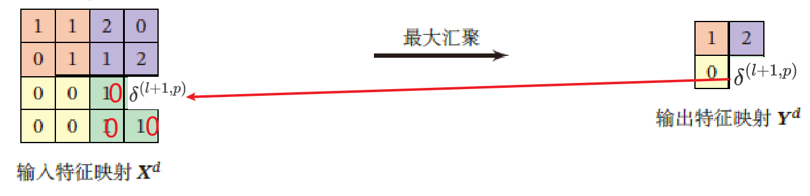

- 若下采样是平均汇聚，则误差项 $\delta^{(l+1)}_p$ 中每个值被平均分配到前一层对应区域的所有神经元上

  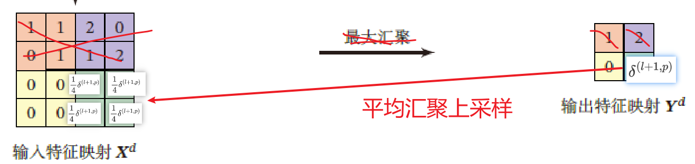


