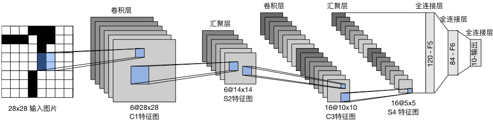
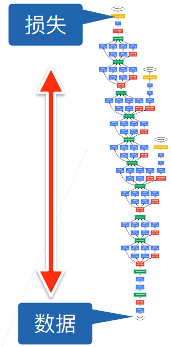
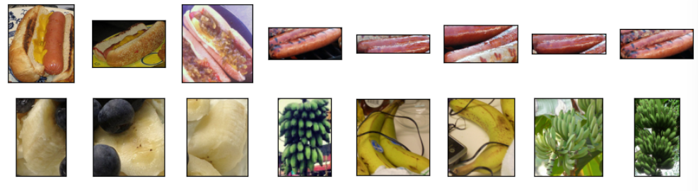

---
categories:
  - AI
  - 机器学习
  - 深度学习
tags:
  - AI
  - 机器学习
  - 深度学习
mathjax: true
title: 7.动手学深度学习-经典卷积神经网络
abbrlink: 4253629123
date: 2024-03-31 11:11:55
updated: 2024-04-01 21:38:23
---

[TOC]

<!--more-->

## 7.1 LeNet

LeNet是早期成功的神经网络，先用卷积层来学习图片空间信息，再用全连接层来转换到类别空间

LeNet的目标是识别手写数字，取得了与SVM性能相媲美的效果，使得神经网络称为监督学习的主流方法。

总体来看，LeNet-5由2个部分组成

- **卷积编码器**：由两个卷积层组成
- **全连接层密集块**：由三个全连接层组成



每个卷积块的基本单元

- 卷积层
- 激活函数 *sigmoid* 函数
- 平均池化层

每个卷积层使用 $5\times 5$ 的卷积核和一个 *sigmoid* 函数。卷积层将输入映射为多个输出通道的二维特征，通常会同时增加通道数。

每个 $2\times 2$ 的池化层会通过空间下采样将维数减少2倍。

为了将卷积块的局部特征传递给全连接层，必须在小批量中展平每个样本。即将一个四维特征映射转换为一个行张量。一个批量的四维特征映射转换为二维张量：第一维为样本数，第二维为每个样本的平面向量表示

- LeNet有三个全连接层，分别有120、84、10个输出


卷积层的每个输出通道相当于识别到图像的一个模式，随着网络层数的堆叠，输出通道数会增加，即识别到的模式越来越多，同时每个卷积层的尺寸会减小

全连接层会将这些卷积块识别出的局部模式平滑地压缩

### 7.1.1 实现

创建网络

```python
import torch
from torch import nn
from d2l import torch as d2l

# 对输入进行变形，防止检测目标在图像边缘，防止卷积核刚开始移动目标就消失
# 填充后，目标可以适当向中心调整
class Reshape(torch.nn.Module):
    def forward(self, x):
        # 批量数不变，通道数变为1，将32*32的图片变为28*28
        return x.view(-1,1,28,28)

# nn._Module(c_i,c_o,padding=p)，
#	第一个参数是输入通道数
#	第二个参数是输出通道数，
#	填充2p个
# 卷积层结束是4维的数据，将其展平为1*.的向量，使用3个全连接层
net = nn.Sequential(
    Reshape(),
    nn.Conv2d(1, 6, kernel_size=5, padding=2), nn.Sigmoid(),
    nn.AvgPool2d(kernel_size=2, stride=2),
    nn.Conv2d(6, 16, kernel_size=5), nn.Sigmoid(),
    nn.AvgPool2d(kernel_size=2, stride=2),
    nn.Flatten(),
    nn.Linear(16 * 5 * 5, 120), nn.Sigmoid(),
    nn.Linear(120, 84), nn.Sigmoid(),
    nn.Linear(84, 10))
```


```python
# 测试网络输出形状是否正确
X = torch.rand(size=(1, 1, 28, 28), dtype=torch.float32)
# 由于net是nn.Sequential类实例，所以每一层可以被迭代
for layer in net:
    X = layer(X)
    print(layer.__class__.__name__,'output shape: \t',X.shape)

#	Reshape output shape: 	 torch.Size([1, 1, 28, 28])
#	Conv2d output shape: 	 torch.Size([1, 6, 28, 28])
#	Sigmoid output shape: 	 torch.Size([1, 6, 28, 28])
#	AvgPool2d output shape: 	 torch.Size([1, 6, 14, 14])
#	Conv2d output shape: 	 torch.Size([1, 16, 10, 10])
#	Sigmoid output shape: 	 torch.Size([1, 16, 10, 10])
#	AvgPool2d output shape: 	 torch.Size([1, 16, 5, 5])
#	Flatten output shape: 	 torch.Size([1, 400])
#	Linear output shape: 	 torch.Size([1, 120])
#	Sigmoid output shape: 	 torch.Size([1, 120])
#	Linear output shape: 	 torch.Size([1, 84])
#	Sigmoid output shape: 	 torch.Size([1, 84])
#	Linear output shape: 	 torch.Size([1, 10])
    
# 第一层输出，高宽减半，但通道数增加，相当于信息增多
```

数据加载，超参数定义

```python
batch_size = 256
train_iter, test_iter = d2l.load_data_fashion_mnist(batch_size=batch_size)
```

虽然卷积神经网络的参数较全连接网络明显减少，但计算成本依然较高，因为 **每个参数都参与更多的乘法** ，通常使用GPU加快计算

在验证集上评估模型，由于完整验证集存在内存中，所以在验证集进行正向和反向传播之前，需要将数据逐批量从内存移动到网络所在的GPU显存中

```python
def evaluate_accuracy_gpu(net, data_iter, device=None): #@save
    """使用GPU计算模型在数据集上的精度"""
    if isinstance(net, nn.Module):
        net.eval()  # 设置为评估模式
        if not device:
            # 将第一个网络的参数拿出来，取这个网络参数所在的设备进行运算
            device = next(iter(net.parameters())).device
    # 正确预测的数量，总预测的数量
    metric = d2l.Accumulator(2)
    with torch.no_grad():
        for X, y in data_iter:
            # 有多条数据，则逐一移动到目标设备
            if isinstance(X, list):
                # BERT微调所需的（之后将介绍）
                X = [x.to(device) for x in X]
            else:
                X = X.to(device)
            y = y.to(device)
            metric.add(d2l.accuracy(net(X), y), y.numel())
    return metric[0] / metric[1]
```

模型训练

```python
#@save
def train_ch6(net, train_iter, test_iter, num_epochs, lr, device):
    """用GPU训练模型(在第六章定义)"""
    def init_weights(m):
        # 若是全连接层或卷积层，用xavier初始化参数
        #     根据输入输出大小，使得输入和输出的方差差不多，减缓梯度爆炸或梯度消失
        if type(m) == nn.Linear or type(m) == nn.Conv2d:
            nn.init.xavier_uniform_(m.weight)
    net.apply(init_weights)
    print('training on', device)
    net.to(device)
    optimizer = torch.optim.SGD(net.parameters(), lr=lr)
    loss = nn.CrossEntropyLoss()
    animator = d2l.Animator(xlabel='epoch', xlim=[1, num_epochs],
                            legend=['train loss', 'train acc', 'test acc'])
    timer, num_batches = d2l.Timer(), len(train_iter)
    for epoch in range(num_epochs):
        # 训练损失之和，训练准确率之和，样本数
        metric = d2l.Accumulator(3)
        net.train()
        for i, (X, y) in enumerate(train_iter):
            timer.start()
            optimizer.zero_grad()
            X, y = X.to(device), y.to(device)
            y_hat = net(X)
            l = loss(y_hat, y)
            l.backward()
            optimizer.step()
            with torch.no_grad():
                metric.add(l * X.shape[0], d2l.accuracy(y_hat, y), X.shape[0])
            timer.stop()
            train_l = metric[0] / metric[2]
            train_acc = metric[1] / metric[2]
            if (i + 1) % (num_batches // 5) == 0 or i == num_batches - 1:
                animator.add(epoch + (i + 1) / num_batches,
                             (train_l, train_acc, None))
        test_acc = evaluate_accuracy_gpu(net, test_iter)
        animator.add(epoch + 1, (None, None, test_acc))
    print(f'loss {train_l:.3f}, train acc {train_acc:.3f}, '
          f'test acc {test_acc:.3f}')
    print(f'{metric[2] * num_epochs / timer.sum():.1f} examples/sec '
          f'on {str(device)}')
```

```python
lr, num_epochs = 0.9, 10
train_ch6(net, train_iter, test_iter, num_epochs, lr, d2l.try_gpu())
```

可以将卷积神经网络视作受限的全连接神经网络，LeNet过拟合现象明显小于MLP

- MLP结果

  

- LeNet-5结果

  

## 7.2 AlexNet

### 7.2.1 机器学习发展

传统机器学习的步骤：

1. 获取数据集，早期数据的收集依赖传感器，最大的图像也就1M像素
2. 特征预处理：根据光学、几何学、其他学科先验知识及偶然发现，手工对特征数据集进行预处理
3. 通过特征提取算法或其他手动调整的特征提取方式来输入数据得到特征
4. 将提取的特征代入机器学习算法

---

**传统的机器学习算法**，会从理论去证明模型的各种性质

2000年左右，最流行的机器学习算法是核方法

一种统计机器学习方法：SVM

- 提取特征

- 选择核函数计算相关性

  - 线性模型：内积
  - 非线性关系：核方法，将空间变为线性空间；再用线性模型的方法解决问题

- 解决凸优化问题

  优化问题是机器学习最热门方向

SVM好处：有完整的泛函定理，能计算模型复杂度

---

**深度学习之前的计算机视觉领域**，数据特征的作用很大。更大、更干净的数据集，稍微改进的特征提取，对模型精度影响远大于学习算法的进步

图像特征都是被计算出来的，一套新的特征函数、改进结果，会有崭新的结果，如：

- 特征描述子：图像特征抽取模型SIFT（尺度不变特征变换）、SURF（加速鲁棒特征）、HOG（定向梯度直方图）
- 视觉词袋（聚类）

2000年计算机视觉关注点在几何学

- 抽取特征

- 将计算机视觉描述为几何问题

  如：通过相机位置，描述一个3D模型

  相当于对物理世界进行一个建模，如果实际问题符合某个几何模型，则可以很好的解决问题

- (非)凸优化

  有完整的几何定理

---

**目前，主流的深度学习在于 表征学习** ，即特征本身就应该被学习到，在合理地复杂性前提下，特征应该由多个共同学习的神经网络层组成，每个层都有可学习的参数。

在视觉中，底层网络可能检测边缘、颜色和纹理等底层图像特征，类似于传统滤波器的特征抽取器；更高层，建立在底层局部特征上，以表示更大的特征；更高层检测整个物体。最终的隐藏层可以学习图像的综合表示

深度卷积神经网络的突破归因于数据和硬件两个因素。

- 数据：包含许多特征的深度模型需要有大量的标签数据，才能显著优与基于传统凸优化的方法。2010年左右的大数据浪潮，使得数据集得以丰富。其中 ImageNet 起到了不小的作用
- 硬件：深度学习每轮迭代都需要昂贵的线性代数层传递数据。GPU的可优化高吞吐量的矩阵和向量乘法

计算机视觉子领域，如：地球科学、气象预测，做了很多物理假设。深度学习比物理假设模型效果好，因为有充分跨学科先验知识，深度学习可以更好的建模

### 7.2.2 神经网络与硬件关系

CPU：每个CPU核都拥有高时钟频率的运行能力和三级Cache缓存，非常适合执行各种指令，具有分支预测、指令流水和程序运行的功能。但通用核心的制造成本高，需要大量的芯片面积、复杂的支持结构（内存结构、内核间的缓存逻辑、高速互联等），因此对于单一的计算任务性价比不高

GPU：由100-1000个小的处理单元组成，通常被分为更大的组。每个GPU核相对较弱（时钟频率低），但庞大的核心数量使得GPU的计算速度比CPU快几个数量级。

- 原因：功耗随时钟频率呈二次方增长。对于一个CPU核心，假设运行速度比GPU快4倍，功耗是单个GPU核的16倍，但同样的功耗下用16个GPU核代替，GPU综合性能是CPU的4倍。另外GPU核更简单。


在LeNet网络提出年代，数据规模是10000个，内存10MB，CPU每秒1千万次浮点数运算

随着GPU的发展，计算能力的增速大于数据规模增速

- 在90年代，数据与算力是均衡的，相较于传统机器学习，神经网络是一种廉价的模型，虽然计算量比较大，但使用随机梯度下降，对内存的需求量也不大

- 2000年，数据量不大，拟合方法比较合适：

  简单；有理论依据；硬件运算能力能覆盖模型的计算量（适量数据规模下核矩阵可被计算）

- 2010年后，数据规模增长速度小于计算能力增长速度，所以可以构造更深的神经网络，进一步挖掘数据中的信息

数据规模在深度神经网络的复兴中起到很大作用

### 7.2.3 AlexNet

ImageNet数据集是一个物体分类数据集


对计算机视觉领域贡献是方法论的改变


- 之前，重点是特征工程，机器学习专家把对问题的理解转换成标准机器学习算法能理解的数值，即专家通过特征提取结合领域先验知识将机器学习算法所需的特征从问题中提取出来
- AlexNet：在输出层是一个 *softmax* ，之前所有的卷积块都是对特征的编码器，实际上也是对特征的提取。实现端到端的学习：从原始输入数据直接转换为目标输出格式

#### AlexNet架构

##### 模型设计

相对于 *LeNet-5* ,  AlexNet也是由卷积编码器和全连接密集层组成

- **卷积编码器**：由五个卷积层组成
- **全连接层密集块**：由三个全连接层组成，两个隐藏层、一个输出层


- $3\times 3$ 池化层容忍一个像素的向左和向右偏移

AlexNet 的输入是3通道的 $224\times 224$ 的图像，所以需要更大的卷积核来捕获目标

第一卷积层输出为96通道的 $\frac{224-11+4}{4}\times \frac{224-11+4}{4}=96\times 54\times 54$ 

$3\times 3$ ，步幅为2的池化层后，输出为96通道的 $\frac{54-3+2}{2}=26\times26$ 的输出


将大数据降维到多通道的 $26\times 26$ 后，后续处理参考 *LeNet-5* ，采用 $5\times 5$ 的卷积核，边缘各填充两个像素，通道数变多，$256\times \frac{26+4-5+1}{1}=256\times 26\times 26$ 。最大池化层后，变为 $256\times \frac{26+2-1}{2}=256\times 12\times 12$

由于通道数远多于 *LeNet-5* 的16通道，后续还接了3个卷积层，卷积核为 $3\times 3$ ，填充为 $2$ ，所以数据尺寸不变，通道数变为256

最后一个最大池化层，将数据尺寸变为 $\frac{12+2-3}{2}=5\times 5$ ，这与 *LeNet-5* 全连接密集层输入数据尺寸相同，通道数变多


一张图片，展平后有 $256\times 5\times 5=6400$ 个参数，通过3个全连接密集层逐渐降为 $1000$ 个输出类别

##### 激活函数

*AlexNet* 将 *sigmoid* 函数替换为更简单的 $ReLU$ 函数，

- ReLU正向计算简单，sigmoid函数需要复杂的求幂运算

- ReLU在 0 附近的梯度为1，使用不同的参数初始化方法，ReLU都可以使模型有效训练

  sigmoid若模型参数没有正确初始化，在0附近的梯度为0，模型无法有效训练

##### 模型容量与数据预处理

AlexNet通过dropout法控制全连接层的模型复杂度，LeNet只使用了权重衰减

数据增强增大了样本容量

- 随机截取、翻转
- 随机亮度
- 随机色温

##### 总结

AlexNet实质上就是更深更大的LeNet，主要改进

- dropout：模型参数更多、网络更深，所以需要对参数做一些正则
- ReLU：相对于 *sigmoid* 梯度更大 
- 最大池化：使得每个卷积块的输出值大，梯度相对比较大

#### 实现

网络定义

```python
import torch
from torch import nn
from d2l import torch as d2l

net = nn.Sequential(
    # 这里使用一个11*11的更大窗口来捕捉对象。
    # 同时，步幅为4，以减少输出的高度和宽度。
    # 另外，输出通道的数目远大于LeNet
    nn.Conv2d(1, 96, kernel_size=11, stride=4, padding=1), nn.ReLU(),
    nn.MaxPool2d(kernel_size=3, stride=2),
    # 减小卷积窗口，使用填充为2来使得输入与输出的高和宽一致，且增大输出通道数
    nn.Conv2d(96, 256, kernel_size=5, padding=2), nn.ReLU(),
    nn.MaxPool2d(kernel_size=3, stride=2),
    # 使用三个连续的卷积层和较小的卷积窗口。
    # 除了最后的卷积层，输出通道的数量进一步增加。
    # 在前两个卷积层之后，汇聚层不用于减少输入的高度和宽度
    nn.Conv2d(256, 384, kernel_size=3, padding=1), nn.ReLU(),
    nn.Conv2d(384, 384, kernel_size=3, padding=1), nn.ReLU(),
    nn.Conv2d(384, 256, kernel_size=3, padding=1), nn.ReLU(),
    nn.MaxPool2d(kernel_size=3, stride=2),
    nn.Flatten(),
    # 这里，全连接层的输出数量是LeNet中的好几倍。使用dropout层来减轻过拟合
    nn.Linear(6400, 4096), nn.ReLU(),
    nn.Dropout(p=0.5),
    nn.Linear(4096, 4096), nn.ReLU(),
    nn.Dropout(p=0.5),
    # 最后是输出层。由于这里使用Fashion-MNIST，所以用类别数为10，而非论文中的1000
    nn.Linear(4096, 10))
```

测试网络输出形状

```python
X = torch.randn(1, 1, 224, 224)
for layer in net:
    X=layer(X)
    print(layer.__class__.__name__,'output shape:\t',X.shape)    
```


读取数据：将AlexNet直接应用于Fashion-MNIST的问题是输入数据尺寸问题，Fashion-MNIST图像的分辨率是 $28 \times 28$像素，所以通过 `resize=224 ` 将图像尺寸拉伸到224像素

```python
batch_size = 128
train_iter, test_iter = d2l.load_data_fashion_mnist(batch_size, resize=224)
```

模型训练

```python
lr, num_epochs = 0.01, 10
d2l.train_ch6(net, train_iter, test_iter, num_epochs, lr, d2l.try_gpu())
```


分析：AlexNet的模型容量远大于Fashion-MNIST的数据量，随着训练epoch的增加，后期会出现过拟合

### 模型复杂度

AlexNet第一个卷积层有 $96\times 3\times 11\times 11+96=34944\approx 35K$ 个参数

- LeNet第一个卷积层有 $6\times 1\times 5\times5=150$ 个参数

第二个卷积层 $256\times 96\times 5\times 5+256=614656\approx614K$ 个参数


运算量：

AlexNet第一层，输出每个元素都参与一次卷积，相当于每计算一个输出元素，需要在3个输入通道上进行一次卷积，即 $3\times 11\times 11$ 次乘法。输出 $96\times54\times 54$ ，所以有 $96\times 54\times 54\times 3\times 11\times 11=101,616,768\approx101M$ 次乘法

...

可见AlexNet是更大更深的LeNet，参数数量增加了近10倍，但计算量增加了近260倍

## 7.3 VGG

一个经典的神经网络是一个序列

1. 带填充以保持分辨率的卷积层
2. 非线性激活函数
3. 池化层

> AlexNet比LeNet更深更大来得到更高的精度

### 7.3.1 VGG块

如何做到更深更大获取更高精度

- 更多的全连接层（参数数量很多，很贵）
- 更多卷积层如何拼接
- 将卷积层组合成块：使用可重复的卷积块来构建深度卷积神经网络

一个VGG块也由一系列卷积层组成和用于空间下采样的池化层组成


VGG发现：用更小的卷积核窗口堆更深更窄的网络比稍大的窗口堆效果好

- $3\times 3$ 卷积核的卷积层堆一个VGG块，VGG块可以堆更深的网络

- $5\times 5$ 卷积核的卷积层堆一个VGG块获得的网络层数更浅，

### 7.3.2 VGG架构

多个VGG块后，接全连接密集层


### 7.3.3 实现

**VGG块实现**

```python
import torch
from torch import nn
from d2l import torch as d2l

# num_convs：一个块中卷积层个数
# in_channels：输入通道数
# out_channels：输出通道数
def vgg_block(num_convs, in_channels, out_channels):
    layers = []
    for _ in range(num_convs):
        print("conv:",in_channels,",",out_channels)
        layers.append(nn.Conv2d(in_channels, out_channels,
                                kernel_size=3, padding=1))
        layers.append(nn.ReLU())
        in_channels = out_channels
    layers.append(nn.MaxPool2d(kernel_size=2,stride=2))
    return nn.Sequential(*layers)
```

上述的VGG块的中间卷积层，输入通道数与输出通道数相等

第一个块，有一个卷积层：1个输入通道，64个输出通道

- 尺寸：$\frac{224-3+1+2}{1}=224\times 224$ ；$2\times 2$ 最大池化，步长为2，尺寸减半 $112\times 112$ 

第二个块，有一个卷积层：64个输入通道，128个输出通道

- 尺寸：$\frac{112-3+1+2}{1}=112\times 112$ ；最大池化，尺寸减半 $56\times 56$ 

第三个块，有2个卷积层：(128, 256)，(256, 256) 

- 卷积层，尺寸不变；最大池化，尺寸减半

第四个块，有2个卷积层：(256, 512)，(512, 512)

第五个块，有2个卷积层：(512, 512)，(512, 512)

**网络定义**

> 5个块，是因为 $\frac{224}{2^5}=7$ ，所以只能堆5块

```python
conv_arch = ((1, 64), (1, 128), (2, 256), (2, 512), (2, 512))

def vgg(conv_arch):
    conv_blks = []
    in_channels = 1
    # 卷积层部分
    for i,(num_convs, out_channels) in enumerate(conv_arch):
        print(i,":",in_channels,",",out_channels)
        conv_blks.append(vgg_block(num_convs, in_channels, out_channels))
        in_channels = out_channels

    return nn.Sequential(
        *conv_blks, nn.Flatten(),
        # 全连接层部分
        #   一张224*224的图片经过5个块后变为7*7
        nn.Linear(out_channels * 7 * 7, 4096), nn.ReLU(), nn.Dropout(0.5),
        nn.Linear(4096, 4096), nn.ReLU(), nn.Dropout(0.5),
        nn.Linear(4096, 10))

net = vgg(conv_arch)
```


相当于有8个卷积层和3个全连接密集层，共11层网络

**训练**

由于VGG-11比AlexNet都深，计算量更大，所以构建更小的网络足以训练 Fashion-MNIST数据集

```python
ratio = 4
# 一个块通道数减少了16倍，输入、输出通道数分别变为1/4
small_conv_arch = [(pair[0], pair[1] // ratio) for pair in conv_arch]
net = vgg(small_conv_arch)

lr, num_epochs, batch_size = 0.05, 10, 128
train_iter, test_iter = d2l.load_data_fashion_mnist(batch_size, resize=224)
d2l.train_ch6(net, train_iter, test_iter, num_epochs, lr, d2l.try_gpu())
```


### 7.3.4 VGG网络变种

不同的卷积块个数和卷积核规模可以得到不同复杂度的变种（神经网络有高配版、低配版）。对于VGG，目前用的最多的是VGG-16和VGG-19（医学）


- LRN（Local Response Normalisation）：局部响应归一化，之后不再使用


神经网络层数越多，精确率越高，但代价是计算时间会变长

### 7.3.5 VGG是CNN思路错误率最低的模型


之后GoogleNet和ResNet都是其他思路

## 7.4 NiN

LetNet、AlexNet、VGG在卷积层之后会将输出展平为二维张量，最后进入全连接层。

虽然卷积层参数少 $c_o\times c_i\times k^2$ ，但卷积块之后的的第一个全连接层参数很多

- LeNet：$16\times 5\times 5\times 120=48K$
- AlexNet：$256\times 5\times 5\times 4096=26M$
- VGG：$512\times 7\times 7\times 4096=102M$ 

参数过多占用很多内存资源，也会占用计算带宽。最重要的是容易发生过拟合

NiN的思路是在每个像素的所有通道上使用全连接层

### 7.4.1 NiN块


NiN块不改变通道数，只做同一像素位置的空间结构信息叠加

即 $1\times 1$ 卷积的输入通道与输出通道都等于块内卷积层的输出通道

同时，为了避免网络塌陷，在每个卷积层（包括 $1\times 1$ ）后加 *ReLU* 函数

### 7.4.2 网络设计


NiN的优势就是显著减少了模型所需要的参数量

第一个块：

- 第一个卷积层：输入通道1，输出通道96，核 $11\times 11$ ，共 $96\times 1\times 11\times 11=11,616$ 个参数
- $1\times 1$ 卷积层有输出通道 $96$ ，输入通道 $96$ ，所以共 $2(96\times 96\times 1\times 1)=18,432$ 
- 共：$11,616+18,432=30,048\approx30K$ 

第二个块：

- 第一个卷积层： $256\times 96\times 5\times 5=614,400$ 
- $1\times 1$ 卷积层：$2(256\times 256)=131,072$ 
- 共：$745,472\approx745K$

第三个块：

- 第一个卷积层：$384\times 256\times 3\times 3=8,861,184$
- $1\times 1$ 卷积层：$2(384\times 384)=294,912$
- 共：$9,156,096\approx 9M$ 

第四个块：

- 第一个卷积层：$10\times 384\times 3\times 3=34,560$ 
- $1\times 1$ 卷积层：$2(10\times 10)=200$
- 共：$34,760\approx34K$ 个参数

### 7.4.3 实现

**NiN块定义**

```python
import torch
from torch import nn
from d2l import torch as d2l

def nin_block(in_channels, out_channels, kernel_size, strides, padding):
    return nn.Sequential(
        nn.Conv2d(in_channels, out_channels, kernel_size, strides, padding),
        nn.ReLU(),
        nn.Conv2d(out_channels, out_channels, kernel_size=1), nn.ReLU(),
        nn.Conv2d(out_channels, out_channels, kernel_size=1), nn.ReLU())
```

**网络实现** 

```python
net = nn.Sequential(
    nin_block(1, 96, kernel_size=11, strides=4, padding=0),
    nn.MaxPool2d(3, stride=2),
    nin_block(96, 256, kernel_size=5, strides=1, padding=2),
    nn.MaxPool2d(3, stride=2),
    nin_block(256, 384, kernel_size=3, strides=1, padding=1),
    nn.MaxPool2d(3, stride=2),
    nn.Dropout(0.5),
    # 标签类别数是10
    nin_block(384, 10, kernel_size=3, strides=1, padding=1),
    nn.AdaptiveAvgPool2d((1, 1)),
    # 将四维的输出转成二维的输出，其形状为(批量大小,10)
    nn.Flatten())
```

```python
X = torch.rand(size=(1, 1, 224, 224))
for layer in net:
    X = layer(X)
    print(layer.__class__.__name__,'output shape:\t', X.shape)

#	Sequential output shape:	 torch.Size([1, 96, 54, 54])
#	MaxPool2d output shape:	 torch.Size([1, 96, 26, 26])
#	Sequential output shape:	 torch.Size([1, 256, 26, 26])
#	MaxPool2d output shape:	 torch.Size([1, 256, 12, 12])
#	Sequential output shape:	 torch.Size([1, 384, 12, 12])
#	MaxPool2d output shape:	 torch.Size([1, 384, 5, 5])
#	Dropout output shape:	 torch.Size([1, 384, 5, 5])
#	Sequential output shape:	 torch.Size([1, 10, 5, 5])
#	AdaptiveAvgPool2d output shape:	 torch.Size([1, 10, 1, 1])
#	Flatten output shape:	 torch.Size([1, 10])
```

全局平均汇聚层（`AdaptiveAvgPool2d`），生成对数几率

- 实现二维平均池化，输出形状 `(1,1)` ，计算这个 $5\times 5$ 的输出的平均值作为这个数据的预测输出

**训练**

```python
lr, num_epochs, batch_size = 0.1, 10, 128
train_iter, test_iter = d2l.load_data_fashion_mnist(batch_size, resize=224)
d2l.train_ch6(net, train_iter, test_iter, num_epochs, lr, d2l.try_gpu())
```


## 7.5 GoogleNet


LetNet-5是第一个卷积神经网络

AlexNet是更深更大的卷积神经网络，并发现 $3\times 3$ 组成更深更窄的网络学习效果比 $5\times 5$ 的卷积核更好

VGG为规范引入 VGG 块，并随着卷积块个数和卷积核规模的不同可以得到不同复杂度的变种

NiN首次使用 $1\times 1$ 的卷积核去掉全连接层

### 7.5.1 Inception块


**4个路径从不同的角度抽取信息，然后在输出通道上进行合并**

**白色**

- $1\times 1$ 卷积，变换通道数，控制模型复杂度

**蓝色**

- $1\times 1$ 卷积，抽取通道信息
- $3\times 3$ / $5\times 5$ 卷积，抽取数据空间信息

- MaxPooling，抽取空间信息并使抽取结果更加鲁棒，容许像素平移


> 一个Inception块通道变化：192->256

大致设计思路：

$3\times 3$ 的卷积相较 $5\times 5$ 的卷积能更好抽取数据中的空间信息，所以占数据输出通道的一半比重

$1\times 1$ 的卷积核能抽取通道信息，所以占 $\frac{1}{4}$ 的通道

剩余的 MaxPooling 和 $5\times 5$ 的卷积核各占剩余一半通道

#### Inception块实现

```python
import torch
from torch import nn
from torch.nn import functional as F
from d2l import torch as d2l

class Inception(nn.Module):
    # c1--c4是每条路径的输出通道数
    def __init__(self, in_channels, c1, c2, c3, c4, **kwargs):
        super(Inception, self).__init__(**kwargs)
        # 线路1，单1x1卷积层
        self.p1_1 = nn.Conv2d(in_channels, c1, kernel_size=1)
        # 线路2，1x1卷积层后接3x3卷积层
        self.p2_1 = nn.Conv2d(in_channels, c2[0], kernel_size=1)
        self.p2_2 = nn.Conv2d(c2[0], c2[1], kernel_size=3, padding=1)
        # 线路3，1x1卷积层后接5x5卷积层
        self.p3_1 = nn.Conv2d(in_channels, c3[0], kernel_size=1)
        self.p3_2 = nn.Conv2d(c3[0], c3[1], kernel_size=5, padding=2)
        # 线路4，3x3最大汇聚层后接1x1卷积层
        self.p4_1 = nn.MaxPool2d(kernel_size=3, stride=1, padding=1)
        self.p4_2 = nn.Conv2d(in_channels, c4, kernel_size=1)

    def forward(self, x):
        p1 = F.relu(self.p1_1(x))
        p2 = F.relu(self.p2_2(F.relu(self.p2_1(x))))
        p3 = F.relu(self.p3_2(F.relu(self.p3_1(x))))
        p4 = F.relu(self.p4_2(self.p4_1(x)))
        # 在通道维度上连结输出
        return torch.cat((p1, p2, p3, p4), dim=1)
```

#### Inception好处

增加特征提取的多样性，参数变少，计算量变低


若将输入通道为192的数据变为输出通道为256的数据

- $3\times 3$ 的卷积核：需要 $256\times 192\times 3\times 3=442,368\approx44M$ 个参数
- $5\times 5$ 的卷积核：需要 $256\times 192\times 5\times 5=1,228,800\approx 1.22M$ 个参数

计算量：

- $3\times 3$ 的卷积核：一个输出元素需要 $192\times 3\times 3$ 次乘法，共有 $256\times 28\times 28$ 个元素，即 $346,816,512\approx346M$ 次乘法
- $5\times 5$ 的卷积核：一个输出元素需要 $192\times 5\times 5$ 次乘法，共 $256\times 28\times 28$ 个输出元素，即 $963,379,200\approx 963M$

### 7.5.2 网络架构

#### 整体


#### 段1&段2

快速将数据尺寸降低，通道数增加。使得后续运算可控


```python
b1 = nn.Sequential(nn.Conv2d(1, 64, kernel_size=7, stride=2, padding=3),
                   nn.ReLU(),
                   nn.MaxPool2d(kernel_size=3, stride=2, padding=1))
```

将输入变为 $64\times 56\times 56$ 的输出

- 卷积层：$\frac{224-7+2+2\times 3}{2}=112$ 
- 最大池化层：$\frac{112-3+2+2}{2}=56$ 

```python
b2 = nn.Sequential(nn.Conv2d(64, 64, kernel_size=1),
                   nn.ReLU(),
                   nn.Conv2d(64, 192, kernel_size=3, padding=1),
                   nn.ReLU(),
                   nn.MaxPool2d(kernel_size=3, stride=2, padding=1))
```

将输入 $64\times 56\times 56$ 变为 $192\times 28\times 28$ 的输出

- $1\times1$ 卷积层：从64个角度合并同一像素位置不同通道上的信息，输出 $64$ 个通道
- $3\times 3$ 卷积层：$\frac{28-3+2+2}{2}=28$ ，不改变数据尺寸，通道数变为192
- 池化层：尺寸减半，不改变通道数

#### 段3

> 中间段要识别更多的局部特征
>
> 所以第一个Inception块用小核保留较多的原始信息，细化局部特征
>
> 第二个块尽可能在一个通道组合更多的局部特征，所以 $5\times 5$ 占比增加


第三个段串联两个完整的Inception块

```python
b3 = nn.Sequential(Inception(192, 64, (96, 128), (16, 32), 32),
                   Inception(256, 128, (128, 192), (32, 96), 64),
                   nn.MaxPool2d(kernel_size=3, stride=2, padding=1))
```

#### 段4&5与输出层


```python
b4 = nn.Sequential(Inception(480, 192, (96, 208), (16, 48), 64),
                   Inception(512, 160, (112, 224), (24, 64), 64),
                   Inception(512, 128, (128, 256), (24, 64), 64),
                   Inception(512, 112, (144, 288), (32, 64), 64),
                   Inception(528, 256, (160, 320), (32, 128), 128),
                   nn.MaxPool2d(kernel_size=3, stride=2, padding=1))
b5 = nn.Sequential(Inception(832, 256, (160, 320), (32, 128), 128),
                   Inception(832, 384, (192, 384), (48, 128), 128),
                   nn.AdaptiveAvgPool2d((1,1)),
                   nn.Flatten())
net = nn.Sequential(b1, b2, b3, b4, b5, nn.Linear(1024, 10))
```

通道数和Inception能的卷积块划分都挺没道理的，只能说有效

输出层

1. 全局平均汇聚层：将每个输出通道的数据取平均变为1维均值

2. 将接全连接层，变为分类目标数

#### 模型训练

```python
lr, num_epochs, batch_size = 0.1, 10, 128
train_iter, test_iter = d2l.load_data_fashion_mnist(batch_size, resize=224)
d2l.train_ch6(net, train_iter, test_iter, num_epochs, lr, d2l.try_gpu())
```

### 7.5.3 变种


#### Inception V3

> 卷积块堆叠也挺没道理的


- 将 $5\times 5$ 变为 两个 $3\times 3$


- 将 $3\times 3$ 变为 $1\times7\rightarrow 7\times 1$ 
- 将 $5\times 5$ 变为 $1\times7\rightarrow 7\times 1\rightarrow 1\times7\rightarrow 7\times 1$


- 。。。


V3分类准确率高，但占用内存大，耗费时间算中等

## 7.6 批量归一化



在神经网络中，损失是反向传播的。

顶部梯度大，收敛速度快；底部梯度值小，收敛速度慢，但底部学习的是底层局部特征，底部值变化会导致顶部值发生相应变化，导致顶部的层需要重新学习多次，从而导致收敛变慢。

Batch-Normalization解决的问题：学习底部层时，避免顶部层发生变化

### 7.6.1 原理

$\mathbf{x}\in \mathcal{B}$ 来自小批量 $\mathcal{B}$ 的输入，批量归一化第 $j$ 个特征
$$
BN(\mathbf{x}^{(j)}_i)=\gamma_{j}\frac{\mathbf{x}^{(j)}_i-\hat{\mu}_{\mathcal{B}}^{(j)}}{\hat{\sigma}_{\mathcal{B}}^{(j)}}+\beta_j
$$

- 其中，$\gamma_j$ ，$\beta_j$ 为第 $j$ 个特征的方差和均值，是待学习的超参数

固定小批量的均值和方差
$$
\hat{\mu}_{\mathcal{B}}^{(j)}=\frac{1}{\vert \mathcal{B}\vert}\sum_{i=1}^{\vert \mathcal{B}\vert}\mathbf{x}_{i}^{(j)}\\
\left(\hat{\sigma}_{\mathcal{B}}^{(j)}\right)^2=\frac{1}{\vert \mathcal{B}\vert}\sum_{i=1}^{\vert \mathcal{B}\vert}\left[\mathbf{x}_{i}^{(j)}-\hat{\mu}_{\mathcal{B}}^{(j)}\right]^2+\varepsilon
$$

- 方差添加 `eps` ，防止归一化过程中出现除零

#### Xavier与批量归一化区别

Xavier作用是使各层的输入输出的均值和方差基本一致，也可理解为各层的输出均值方差基本一致，手段是通过调整随机初始化参数的分布，作用于训练的开始阶段，第一次反向传播后失效

批量归一化可以理解为对浅层变化量小的参数值进行补偿，使得中间层的参数值变化不是很剧烈，从而加快收敛。作用于整个训练过程中，每个层每次正向传播的输出都会被归一化

### 7.6.2 批量归一化层

#### 位置

全连接层和卷积层输出之后，激活函数之前（批量归一化实质上是一个线性变换）

- 全连接层：作用在特征维，相当于每个特征上归一化

  均值、方差为当前批量的样本在该特征维下的均值、方差，

- 卷积层：作用在通道维，通道维相当于特征维

  $1\times 1$ 的卷积核，作用于每个像素，相当于样本维是所有像素$(批量\times 高\times 宽)$，特征维是通道

**输出维度与输入维度相同**

#### 作用

- **持续加速深层网络的收敛速度**，但不会提升数据精度

- 尚未理论明确的理论：优化过程中的各种噪声源会加快训练和减少过拟合
  - 由于批量数据的均值与方差不同，所以相当于模拟数据的随机偏移和缩放对学习的影响

没必要与dropout混合使用

注意：只有使用足够大的小批量，批量规范化这种方法才是有效且稳定的

- 批量大小为1的批量应用批量归一化，减去均值后为0，学习不到

### 7.6.3 实现

**定义BN操作**

```python
import torch
from torch import nn
from d2l import torch as d2l

# moving_mean/moving_var，全体数据的全局均值方差，非批量数据的均值方差
# eps：防止除0
# momentum：更新均值方差的超参数
def batch_norm(X, gamma, beta, moving_mean, moving_var, eps, momentum):
    # 通过is_grad_enabled来判断当前模式是训练模式还是预测模式
    if not torch.is_grad_enabled():
        # 如果是在预测模式下，直接使用传入的移动平均所得的均值和方差
        X_hat = (X - moving_mean) / torch.sqrt(moving_var + eps)
    else:
        assert len(X.shape) in (2, 4)
        if len(X.shape) == 2:
            # 使用全连接层的情况，计算特征维上的均值和方差
            mean = X.mean(dim=0)
            var = ((X - mean) ** 2).mean(dim=0)
        else:
            # 使用二维卷积层的情况，计算通道维上（axis=1）的均值和方差。
            # 这里我们需要保持X的形状以便后面可以做广播运算
            mean = X.mean(dim=(0, 2, 3), keepdim=True)
            var = ((X - mean) ** 2).mean(dim=(0, 2, 3), keepdim=True)
        # 训练模式下，用当前的均值和方差做标准化
        X_hat = (X - mean) / torch.sqrt(var + eps)
        # 更新移动平均的均值和方差
        moving_mean = momentum * moving_mean + (1.0 - momentum) * mean
        moving_var = momentum * moving_var + (1.0 - momentum) * var
    Y = gamma * X_hat + beta  # 缩放和移位
    # moving_mean和moving_var都是Parameter类的参数
    #	返回归一化后的批量输出和批量均值、方差值
    return Y, moving_mean.data, moving_var.data
```

**BN层**

```python
class BatchNorm(nn.Module):
    # num_features：全连接层的输出特征数或卷积层的输出通道数。
    # num_dims：2表示完全连接层，4表示卷积层
    def __init__(self, num_features, num_dims):
        super().__init__()
        if num_dims == 2:
            shape = (1, num_features)
        else:
            shape = (1, num_features, 1, 1)
        # 参与求梯度和迭代的拉伸和偏移参数，分别初始化成1和0
        self.gamma = nn.Parameter(torch.ones(shape))
        self.beta = nn.Parameter(torch.zeros(shape))
        # 非模型参数的变量初始化为0和1
        self.moving_mean = torch.zeros(shape)
        self.moving_var = torch.ones(shape)

    def forward(self, X):
        # 如果X不在内存上，将moving_mean和moving_var
        # 复制到X所在显存上
        if self.moving_mean.device != X.device:
            self.moving_mean = self.moving_mean.to(X.device)
            self.moving_var = self.moving_var.to(X.device)
        # 保存更新过的moving_mean和moving_var
        Y, self.moving_mean, self.moving_var = batch_norm(
            X, self.gamma, self.beta, self.moving_mean,
            # 注意eps的区别，框架不同会变
            self.moving_var, eps=1e-5, momentum=0.9)
        return Y
```

- 对上一层的输出进行归一化，所以BN层的输出和输入数相等，`num_features` 为上一层输出通道数 / 特征数

**网络定义** ：使用批量归一化层的 *LeNet-5*

```python
net = nn.Sequential(
    nn.Conv2d(1, 6, kernel_size=5), BatchNorm(6, num_dims=4), nn.Sigmoid(),
    nn.AvgPool2d(kernel_size=2, stride=2),
    nn.Conv2d(6, 16, kernel_size=5), BatchNorm(16, num_dims=4), nn.Sigmoid(),
    nn.AvgPool2d(kernel_size=2, stride=2), nn.Flatten(),
    nn.Linear(16*4*4, 120), BatchNorm(120, num_dims=2), nn.Sigmoid(),
    nn.Linear(120, 84), BatchNorm(84, num_dims=2), nn.Sigmoid(),
    nn.Linear(84, 10))
```

**训练**

```python
lr, num_epochs, batch_size = 1.0, 10, 256
train_iter, test_iter = d2l.load_data_fashion_mnist(batch_size)
d2l.train_ch6(net, train_iter, test_iter, num_epochs, lr, d2l.try_gpu())
```

### 7.6.4 Pytorch实现

```python
net = nn.Sequential(
    nn.Conv2d(1, 6, kernel_size=5), nn.BatchNorm2d(6), nn.Sigmoid(),
    nn.AvgPool2d(kernel_size=2, stride=2),
    nn.Conv2d(6, 16, kernel_size=5), nn.BatchNorm2d(16), nn.Sigmoid(),
    nn.AvgPool2d(kernel_size=2, stride=2), nn.Flatten(),
    nn.Linear(256, 120), nn.BatchNorm1d(120), nn.Sigmoid(),
    nn.Linear(120, 84), nn.BatchNorm1d(84), nn.Sigmoid(),
    nn.Linear(84, 10))
```

## 7.7 残差网络ResNet

对VGG（块）、GoogleNet（并行连结）改进，

ResNet对上一层网络的扩充而不是改变

### 7.7.1 函数类

> 随着网络假设，如何理解：新添加的层如何提升神经网络性能；或如何靠近真实的函数

假设神经网络的所有函数服从一个架构 $\mathcal{F}$ ，用 $f$ 表示某个参数确定的神经网络，参数即 $\mathbf{W}$ 。而 $f^*$ 为数据集真实的函数，也就是 $f$ 要去拟合的函数。如果 $f^*$ 也属于 $\mathcal{F}$ ，则通过参数调整可以很容易找到，但不属于 $\mathcal{F}$ 时，就需要增大模型容量，使 $\mathcal{F}'$ 中能找到一个最接近 $f^*$ 的一个近似函数 $f^*_{\mathcal{F}'}$ 。

而加大模型容量，在深度学习中可以使加深网络层数，我们希望的是 $f^*_{\mathcal{F}'}$ 比 $f^*_{\mathcal{F}}$ 更接近 $f^*$ 。

但若 $\mathcal{F}\not\subseteq \mathcal{F}'$ ，则无法保证新的网络更接近，即更复杂的非嵌套函数类并不能是真的向 $f^*$ 靠近


只有当 $\mathcal{F}\subseteq \mathcal{F}'$ 时，即较复杂函数能包含较小的函数类时，才能保证提高性能。


若将新添加的层训练成恒等映射 $f(\mathbf{x})=\mathbf{x}$ ，则新模型和原模型同样有效。同时新模型可能训练出更优的解来拟合训练数据集。这也是何恺明等人提出的残差网络的思想。

### 7.7.2 残差块


理想状态下，我们希望卷积块能拟合出理想的恒等映射。


但实际上，残差映射 $f(\mathbf{x})-\mathbf{x}$ 更容易优化，**梯度反向传播时，乘法变加法**

同时，对于 $f(\mathbf{x})=\alpha\left[f(\mathbf{x})-\mathbf{x}\right]+\beta\mathbf{x}$ ，只需将 $\alpha=0$ ，则 $f(\mathbf{x})$ 成为恒等映射

**梯度乘变梯度加**

对于真实标签为 $y$ 的预测 $f(x)$ ，其损失函数 $\ell(y,f(x))$ ，损失函数的梯度 $\frac{\partial \ell\left(f(x)\right)}{\partial w}$ ，使用梯度下降法
$$
w=w-\eta\frac{\partial \ell\left(f(x)\right)}{\partial w}
$$
在梯度反向传播中，我们不希望损失函数的梯度 $\frac{\partial \left(f(x)\right)}{\partial w}$ 变小 

若采用更深的网络预测，即 $g\left(f(x)\right)$ ，其损失函数为 $\ell\left(y,g(f(x))\right)$ 
$$
\frac{\partial \ell\left(y,g(f(x))\right)}{\partial w}=\frac{\partial \ell\left(y,g(f(x))\right)}{\partial \ell\left(f(x)\right)}\frac{\partial \ell\left(f(x)\right)}{\partial w}
$$
所以直接采用更深的神经网络会导致梯度变得更小。

而ResNet的做法 $f(x)+g(f(x))$ 的梯度为 $\frac{\partial \left(f(x)\right)}{\partial w}+\frac{\partial \ell\left(y,g(f(x))\right)}{\partial w}$ ，即使残差映射的梯度再小也没有关系。输入仍可以通过加法传导到下一层

**另一种角度理解**

结合泰勒公式，任意函数在 $x=0$ 处的泰勒展开为 $f(x)=f(0)+f'(0)x+\frac{f''(0)x^2}{2!}+\cdots$

即 $f(x)=线性项+非线性项$ ，而 残差映射 学习的就是输入的非线性部分

### 7.7.3 实现

ResNet-34 / ResNet-50 用的多

#### 残差块设计

```python
import torch
from torch import nn
from torch.nn import functional as F
from d2l import torch as d2l


class Residual(nn.Module):  #@save
    def __init__(self, input_channels, num_channels,use_1x1conv=False, strides=1):
        super().__init__()
        self.conv1 = nn.Conv2d(input_channels, num_channels,
                               kernel_size=3, padding=1, stride=strides)
        self.conv2 = nn.Conv2d(num_channels, num_channels,
                               kernel_size=3, padding=1)
        if use_1x1conv:
            # 注意步长，目的是保持数据尺寸相等
            self.conv3 = nn.Conv2d(input_channels, num_channels,
                                   kernel_size=1, stride=strides)
        else:
            self.conv3 = None
        self.bn1 = nn.BatchNorm2d(num_channels)
        self.bn2 = nn.BatchNorm2d(num_channels)

    def forward(self, X):
        Y = F.relu(self.bn1(self.conv1(X)))
        Y = self.bn2(self.conv2(Y))
        if self.conv3:
            X = self.conv3(X)
        Y += X
        return F.relu(Y)
```

实现两种残差块

- 经过 $3\times 3$ 的卷积核后，数据尺寸变为 $\frac{n+s-1}{s}$ ，所以 $1\times 1$ 的卷积核需要调整步长


- 第一种：输入和输出尺寸相等

  ```python
  blk = Residual(3,3)
  X = torch.rand(4, 3, 6, 6)
  Y = blk(X)
  Y.shape
  #	torch.Size([4, 3, 6, 6])
  ```

- 第二种：增加输出通道数，减少尺寸

  ```python
  # 通常，通道数会加倍，高宽减半
  blk = Residual(3,6, use_1x1conv=True, strides=2)
  blk(X).shape
  #	torch.Size([4, 6, 3, 3])
  ```

残差块可以任意组合设置


#### ResNet架构

与GoogleNet相同，都是5个段

**段1** 和VGG、GoogleNet一致，都是 $7\times 7$ 的卷积核


```python
b1 = nn.Sequential(nn.Conv2d(1, 64, kernel_size=7, stride=2, padding=3),
                   nn.BatchNorm2d(64), nn.ReLU(),
                   nn.MaxPool2d(kernel_size=3, stride=2, padding=1))
```

##### ResNet段

一个ResNet段是多个残差块的组合

段内：第一个残差块增加通道，尺寸减半；第二个残差块通道数不变

```python
# 一个resnet段
def resnet_block(input_channels, num_channels, num_residuals, first_block=False):
    blk = []
    for i in range(num_residuals):
        if i == 0 and not first_block:
            # 每个段第一个对数据高宽减半
            blk.append(Residual(input_channels, num_channels,
                                use_1x1conv=True, strides=2))
        else:
            # 每个段非第一个块对特征组合
            #   特殊的是第一个段的第一个块无需对数据尺寸减半，因为前面是一个最大池化层，已经减半
            blk.append(Residual(num_channels, num_channels))
    return blk
```

##### 段2 

由于之前已经使用了 $7\times7$ ，步幅为2的卷积层和步幅为2的最大汇聚层，所以第一个ResNet段无须减小高和宽

```python
b2 = nn.Sequential(*resnet_block(64, 64, 2, first_block=True))
```

##### 段3&4&5

```python
b3 = nn.Sequential(*resnet_block(64, 128, 2))
b4 = nn.Sequential(*resnet_block(128, 256, 2))
b5 = nn.Sequential(*resnet_block(256, 512, 2))
```

##### 全局平均池化与全连接输出层

```python
net = nn.Sequential(b1, b2, b3, b4, b5,
                    nn.AdaptiveAvgPool2d((1,1)),
                    nn.Flatten(), nn.Linear(512, 10))
```


#### 训练

```python
X = torch.rand(size=(1, 1, 224, 224))
for layer in net:
    X = layer(X)
    print(layer.__class__.__name__,'output shape:\t', X.shape)

lr, num_epochs, batch_size = 0.05, 10, 256
train_iter, test_iter = d2l.load_data_fashion_mnist(batch_size, resize=96)
d2l.train_ch6(net, train_iter, test_iter, num_epochs, lr, d2l.try_gpu())
```


速度不快，但用大网络拟合 Fashion-MNIST数据集会出现明显的过拟合

## 7.8 DenseNet

DenseNet是ResNet的扩展

## 7.9 非标准卷积

### 7.9.1 空洞卷积

#### 如何增加输出单元的感受野

> 感受野和卷积长度（卷积核大小）直接相关

- 增加卷积核大小——增加参数数量

- 增加层数：两层  $3\times 3$ 近似一层 $5\times 5$ 卷积的效果

  增加复杂度

- 卷积前进行汇聚——产生信息损失

  汇聚层不但可以有效减少神经元的数量，还可以使网络对一些小的局部形态改变保持不变性，并拥有更大的感受野

  第2层卷积层神经元感受野有K个神经元，第3层卷积层神经元感受野有$2K-1$ 个神经元，依次类推，随着卷积层数深度增加，神经元感受野也就越大，越容易提取到高级特征

  

**空洞卷积** 不增加参数数量，同时增加输出单元感受野——膨胀卷积

在卷积核每两个元素之间插入 $D-1$ 个空洞，卷积核的有效大小为
$$
K'=K+(K-1)\times (D-1)
$$

- $D$ 为膨胀率，当 $D=1$ 时卷积核为普通的卷积核

通过给卷积核插入空洞（改变步长）来增加感受野


### 7.9.2 "反"卷积

#### 转置卷积

> 低维特征映射到高维特征映射——转置卷积，反卷积

假设一个高维向量 $X\in \R^D$ 和一个低维向量 $Z\in \R^M$ ，且 $M<D$ ，
$$
Z=WX,W\in \R^{M\times D}
$$
若用仿射变换来实现高维到低维的映射
$$
X=W^TZ
$$
两个映射形式上是转置关系

- 在全连接网络中，忽略激活函数，前向计算和反向传播就是一种转置关系
  $$
  Z^{(l+1)}=W^{(l+1)}Z^{(l)}\\
  \delta^{(l)}=(W^{(l+1)})^T\delta^{(l+1)}
  $$

对于二维向量


- $C$ 为稀疏矩阵，其非零元素来自于卷积核 $W$ 中的元素


---

对于一个 $M$ 维的向量 $Z$ 和大小为 $K$ 的卷积核，如果希望通过卷积操作来映射到更高维的向量，需要对 $Z$ 两端进行补零 $P=K-1$ ，可以得到 $M+K-1$ 维向量

对于 $M\times N$ 维向量 $X$ ，通过 $U\times V$ 为卷积核 $W$ ，在 $M$ 边分别补 $U-1$ 个零，$N$ 边分别补 $V-1$ 个零，可以得到转置卷积 $(M+U-1)\times (N+V-1)$ 维输出


#### 微步卷积

步长变小——微步卷积

整体思路：通过增加卷积的步长 $S>1$ ，实现对特征的下采样操作，大幅降低特征映射维数(神经元数量)

同样，减小步长 $S<1$ ，能使特征映射的维数(神经元数量)增加


若希望转置卷积的步长变为 $\frac{1}{S}$ ，则需要在输入特征之间插入 $S-1$ 个零来使移动速度变慢

- 以一维转置卷积为例，对一个 $M$ 维的向量 $Z$ 和大小为 $K$ 的卷积核，通过对向量 $Z$ 进行两端补零 $P=K-1$ ，并且在每两个向量元素之间插入 $D$ 个零，然后进行步长为 $1$ 的卷积，得到 $(D+1)\times (M-1)+K$ 维向量

- 对于 $M\times N$ 的输入向量 $X$ 和 $U\times V$ 的卷积核，对向量 $X$ 分别补 $U-1$ 与 $V-1$ 个零，并且在每两个元素之间插入 $D_1$ 与 $D_2$ 个零，得到 $[(D_1+1)\times (M-1)+U]\times [(D_2+1)\times (N-1)+V]$ 维的输出向量 $Z$ 

若原先步长 $S=2$ ，若步长减少 $\frac{1}{2}$ 输出的特征映射会增加一倍


左图：输入 $X\in \R^{5\times 5}$ ，步长 $S=2$ 

右图：步长 $S=1$ ，填充零

- $[(1+1)\times (2-1)+3]\times[(1+1)\times (2-1)+3]=5\times 5$

## 7.10 应用

### AlphaGo

决策网络


### 目标检测RCN

区域卷积网络

### 图像分割RCNN


- 像素级图像分割

### 光学字符识别OCR

### 应用于文本

##### n-gram特征与卷积


- 一元特征
- 二元特征：单词顺序
- 三元特征

可以理解为滑动窗口

#### 词到词向量

通过Lookup Table 将一个单词变为一个词向量

- 


## 模型微调

数据集标注代价很高


Fashion-MNIST训练集大约有6万张图片10个类别、ImageNet大约有1000万张图片1000个类别。我们通常任务的数据集规模在二者之间。

若想完成一个识别汽车的程序，一般情况类别数在100种左右，我们会为每个类别的汽车从不同角度拍摄500张图片，然后在收集到的数据集上训练一个分类模型。

这个数据集规模远小于ImageNet，适合ImageNet的复杂模型可能在这个数据集上过拟合。此外，由于训练样本数量有限，只使用这个数据集也可能造成欠拟合。

上述问题的解决方案是 **迁移学习** ，将从 *源数据集* 学到的知识迁移到 *目标数据集* 。尽管ImageNet数据集中大多数图片都与汽车无关，但此数据集上训练到的模型可能提取到更通用的底层图像特征，结合这些边缘、纹理、形状和对象的组合，可能更有效地识别汽车。

### 原理

一个神经网络分为 **特征抽取** 和 **分类器** 两部分，特征抽取将原始输入变为更容易线性分割的特征，分类器根据每个类别各自特征的权重组合实现分类。即 **神经网络** 的作用是使特征提取变得可学习


认为模型参数包含从源数据集中学到的知识（底层特征的组合方式），这些知识同样适用于目标模型


当目标数据集比源数据集小得多时，微调有助于提高模型的泛化能力

**注意选择数据集适配的预训练模型** ，如癌症图片识别最好使用在医学数据集上的预训练模型（同领域数据集）

#### 步骤

1. 在源数据集上预训练那神经网络模型，即 *源模型*

2. 创建新的神经网络模型，即 *目标模型* 。这个目标模型将复制源模型上所有的模块及其参数。

3. 向目标模型添加输出层，其输出数为目标数据集中的类别数，随机初始化输出层的参数

4. 在目标数据集上训练目标模型。

   输出层从头开始训练，所有其他层的参数根据源模型参数微调


### 微调的具体方法

#### 训练

若源数据集远复杂于目标数据集，则在目标数据集上使用更强的正则化进行训练

- 使用更小的学习率：底层特征不需要多调整，主要学习接近输出层的顶层特征，所以底层学习率很小，顶层学习率会高一点。但微调的学习率远小于完整训练的学习率
- 使用更少的数据迭代，少迭几次ecoch，一般2、3轮即可

#### 重用分类器权重

源数据集可能也有目标数据集中的部分标签值

使用预训练模型分类器中对应的权重初始化

```python
# 获取全连接层的权重
weight = pretrained_net.fc.weight
# torch.split(tensor,split_size_or_sections,dim)
#     将tensor，沿dim指定的维度，以section指定的大小为一块
# 即输入到分类器中的512个线性可分割的特征中，全连接输出层的934行对应的权重组合为hotdog类的分类器
# 令finetune_net.fc.weight=hotdog_w即可
hotdog_w = torch.split(weight.data, 1, dim=0)[934]
finetune_net.fc = nn.Linear(finetune_net.fc.in_features, 2)
finetune_net.fc.weight=hotdog_w
```

#### 固定一些层

高层特征与目标数据集相关；

底层特征更加通用：固定不优化或微调，模型复杂度变低


### 实现

热狗识别：在小型数据集上微调ResNet，源模型在ImageNet上做了预训练。小数据集包含上千张含热狗和不含热狗的图像，将通过微调模型来识别图像中是否包含热狗

#### 数据预处理

```python
import os
import torch
import torchvision
from torch import nn
from d2l import torch as d2l

# 获取数据集
#@save
d2l.DATA_HUB['hotdog'] = (d2l.DATA_URL + 'hotdog.zip',
                         'fba480ffa8aa7e0febbb511d181409f899b9baa5')

data_dir = d2l.download_extract('hotdog')

# 将图片读取至内存
train_imgs = torchvision.datasets.ImageFolder(os.path.join(data_dir, 'train'))
test_imgs = torchvision.datasets.ImageFolder(os.path.join(data_dir, 'test'))
```

- 共1400张 “正类” 和 “负类” 图片，其中1000张用于训练，其余用于测试

```python
hotdogs = [train_imgs[i][0] for i in range(8)]
not_hotdogs = [train_imgs[-i - 1][0] for i in range(8)]
d2l.show_images(hotdogs + not_hotdogs, 2, 8, scale=1.4);
```



发现图片尺寸不一致，而ResNet预训练模型的输入是 $224\times 224$ ，需要处理

使用数据增广，将图像的高度和宽度都缩放到 $256$ 像素，然后裁剪中间的 $224\times 224$ 区域作为输入。此外，对于RGB三个通道，分别标准化每个通道

```python
# 因为原始模型在ImageNet数据集上进行了数据增广，所以微调之前也需要将数据增广
#   使用RGB通道的均值和标准差，以标准化每个通道
#   每个通道的均值方差，[R通道均值,G通道均值,B通道均值],[R通道均方差,G通道方差,B通道方差]
normalize = torchvision.transforms.Normalize(
    [0.485, 0.456, 0.406], [0.229, 0.224, 0.225])

# 将数据格式与原始模型的数据集对齐
train_augs = torchvision.transforms.Compose([
    torchvision.transforms.RandomResizedCrop(224),
    torchvision.transforms.RandomHorizontalFlip(),
    torchvision.transforms.ToTensor(),
    normalize])

test_augs = torchvision.transforms.Compose([
    # 短边变为256，长宽比不变
    torchvision.transforms.Resize([256, 256]),
    # 中心截取224*224
    torchvision.transforms.CenterCrop(224),
    torchvision.transforms.ToTensor(),
    normalize])
```

#### 模型定义

```python
# 将模型结构取回，并且将在ImageNet上预训练的参数也取回
pretrained_net = torchvision.models.resnet18(pretrained=True)
```

在ResNet的全局平均汇聚层后，全连接层的输出转换为ImageNet数据集的1000个类别的输出。 

```python
# 目标模型初始化，fc层前的都用预训练模型初始化
finetune_net = torchvision.models.resnet18(pretrained=True)
# 根据需要修改输出类别，并随机初始化参数
finetune_net.fc = nn.Linear(finetune_net.fc.in_features, 2)
nn.init.xavier_uniform_(finetune_net.fc.weight);
```

我们构建一个新的神经网络作为目标模型。 它的定义方式与预训练源模型的定义方式相同，只是最终层中的输出数量被设置为目标数据集中的类数（而不是1000个）。

#### 模型微调

```python
# 如果param_group=True，输出层中的模型参数将使用十倍的学习率
def train_fine_tuning(net, learning_rate, batch_size=128, num_epochs=5,
                      param_group=True):
    train_iter = torch.utils.data.DataLoader(torchvision.datasets.ImageFolder(
        os.path.join(data_dir, 'train'), transform=train_augs),
        batch_size=batch_size, shuffle=True)
    test_iter = torch.utils.data.DataLoader(torchvision.datasets.ImageFolder(
        os.path.join(data_dir, 'test'), transform=test_augs),
        batch_size=batch_size)
    devices = d2l.try_all_gpus()
    loss = nn.CrossEntropyLoss(reduction="none")
    # 最后一层用比较大的学习率，输出层之前的层学习率保持不变
    #  因为前面预训练的层在大数据集上已经预训练好了，只需要微调参数，我们希望输出层能更快的收敛
    if param_group:
        params_1x = [param for name, param in net.named_parameters()
             if name not in ["fc.weight", "fc.bias"]]
        trainer = torch.optim.SGD([{'params': params_1x},
                                   {'params': net.fc.parameters(),
                                    'lr': learning_rate * 10}],
                                lr=learning_rate, weight_decay=0.001)
    else:
        trainer = torch.optim.SGD(net.parameters(), lr=learning_rate,
                                  weight_decay=0.001)
    d2l.train_ch13(net, train_iter, test_iter, loss, trainer, num_epochs,
                   devices)
    
train_fine_tuning(finetune_net, 5e-5)
```


