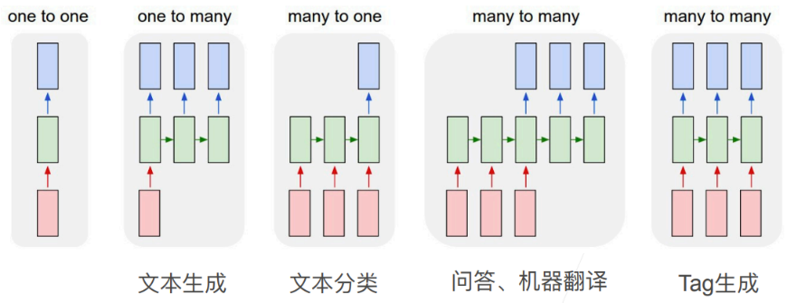
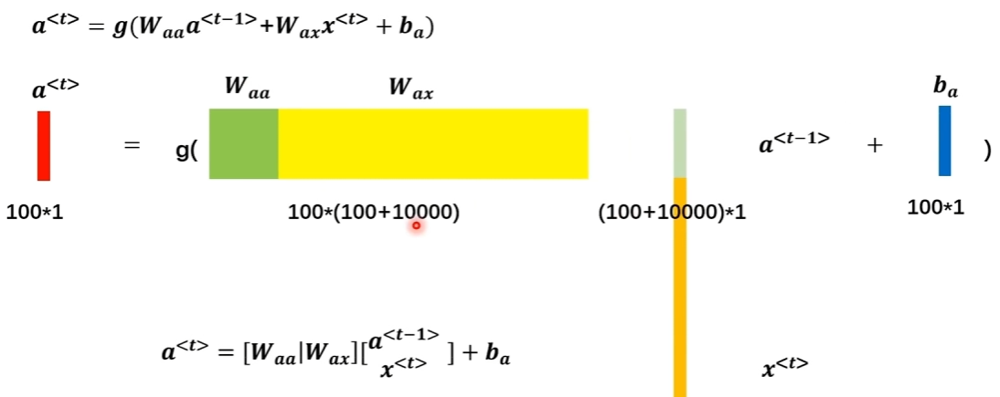

---
categories:
  - AI
  - 机器学习
  - 深度学习
tags:
  - AI
  - 机器学习
  - 深度学习
mathjax: true
title: 8.动手学深度学习-循环神经网络
abbrlink: 1556323108
date: 2024-04-01 22:40:10
updated: 2024-4-7 23:18:59
---

[TOC]

<!--more-->

> updated: 2024-4-13 11:17:31

卷积神经网络可以有效地处理空间信息，循环神经网络可以更好地处理序列信息。通过引入记忆单元存储过去的信息，结合当前的输入，确定当前的输出

## 8.1 序列模型

### 8.1.1 序列数据

数据间是有时序结构的，

对当前结果的预测不仅受当前输入数据影响，历史数据也会对当下、未来数据产生影响，但历史数据的重要性随时间会衰减

#### 序列数据例子


#### 归纳偏置——动力学静止

对于一个特定的序列任务中，虽然特定的随机变量 $x_t$ 会改变，但 **序列本身的动力学(数据的时序结构)不会改变。在统计学上称不变的动力学为 静止的**，所以是可以学习的

> 动力学：序列数据中的动力学指数据点随时间的变化规律
>
> 一个时间序列被认为是动力学静止的，如果它的 **统计属性不随时间变化**（如均值、方差和自协方差）
>
> - 静止的时间序列是一个没有趋势、季节性或周期性的 **随机过程 ** ，每个时间点的观测值都是随机的，并且与其他时间点的观测值有着相同的统计特性
>
>  动力学静止的关键特征 ——**自协方差独立性**：时间序列的任意两个时期的观测值之间的协方差只依赖于它们之间的时间间隔，而不是具体的时间点
>
> - 类似于自然语言中的语法，一句话中，一个单词的下一个单词可能是词表中的任意一个词，但由于二元语法、三元语法、多元语法的存在，下一个位置可能出现的单词数量会比词表大小少很多
> - 序列中，下一时间步可能的状态也是无穷的，但真正出现的状态是有一定规律的，也就是只会出现有限种状态，所以动力学静止的序列可以通过学习找到这个规律
>
> 如果时间序列数据不是静止的，通常需要进行转换以使其静止

若在时刻 $t$ 有观测值 $x_t$ ，可以得到 $T$ 个与时间相关的不独立随机变量 $x_1,x_2,\cdots,x_T$  

因此整个序列的估计值可以通过全概率公式得到


即计算 $T$ 时刻的输出 $x_T$ ，需要结合历史数据序列 $\{x_1,x_2,\cdots,x_{T-1}\}$

也可以反向计算：根据未来数据倒退过去数据


### 8.1.2 序列模型

为了利用历史信息处理时序数据，需要让神经网络具有记忆能力

#### 延时神经网络(TDNN)

利用历史信息建立一个额外的延时(记忆)单元，用于存储网络的历史信息（输入、输出、隐状态）


在 $t$ 时刻，第 $l$ 层神经元的活性值依赖于第 $l-1$ 层的同时刻输出及其相邻的 $U$ 个历史信息
$$
\mathbf{h}^{(l)}_{t}=f\left(\mathbf{h}^{(l-1)}_{t},\mathbf{h}^{(l-1)}_{t-1},\cdots,\mathbf{h}^{(l-1)}_{t-U}\right)
$$
延时神经网络在同一层的不同时间步共享权值，以降低参数数量。

#### 自回归模型

我们可以对一个对象的历史数据建模，使其能拟合自身，因为标签为数据本身，所以称为 **自回归模型** 
$$
p(x_t\vert x_1,\cdots,x_{t-1})=p\left(x_t\vert f(x_1,\cdots,x_{t-1})\right)
$$

- 若数据是离散的，则 $f()$ 为分类器
- 若数据是连续的，则 $f()$ 为回归模型

**自回归模型** ：AutoRegressive Model(AR)
$$
\mathbf{h}_{t}=\mathbf{W}_0+\sum\limits_{u=1}^U\mathbf{W}_u\mathbf{h}_{t-u}+\epsilon_t
$$
其中 $U$ 为表示时序窗口大小的超参数，$\mathbf{W}_0,\mathbf{W}_1,\cdots,\mathbf{W}_U$ 为可学习参数，$\varepsilon_t\sim \mathcal{N}(0,\sigma^2)$ 为第 $t$ 时刻的噪声

**有外部输入的非线性自回归模型** ：Nonlinear AutoRegressive with Exogenous Inputs Model(NARX)
$$
\mathbf{h}_{t}=f\left(\mathbf{x}_{t-1},\cdots,\mathbf{x}_{t-U_x},\mathbf{h}_{t-1},\cdots,\mathbf{h}_{t-U_h}\right)
$$
其中，$f(\cdot)$ 表示非线性函数，$U_x,U_h$ 是表示时序窗口的超参数


##### 马尔科夫假设

当前数据只与 $\tau$ 个过去数据点相关


- 即自回归模型有 $\tau$ 个连续的输入数据，将变长序列变为定长的序列

  直接好处是参数的数量不变

##### 潜变量模型

引入潜变量 $h_t$ 表示随机变量的时序结构（隐变量：未观测到的变量；潜变量：可能不存在的变量，包含因变量范畴）


$$
h_t=f(h_{t-1},x_{t-1})\\
\hat{x}_{t}=p(\hat{x}_{t}\vert h_{t},x_{t-1})
$$
需要学习两个模型

- 第一个模型是潜变量模型，根据上一时刻数据 $x_{t-1}$ （即 $t$ 时刻的输入特征向量 $\mathbf{x}_t$）与上一时刻的潜变量 $\mathbf{h}_{t-1}$ 计算当前时刻的潜变量 $\mathbf{h}_t$
- 第二个模型是数据自回归模型，根据上一时刻数据 $x_{t-1}$ 与当前时刻潜变量 $h_t$ 计算当前时刻预测输出 $\hat{x}_t$ （即当前时刻的输出特征向量 $\hat{\mathbf{y}}_t$ ）

### 8.1.3 基于马尔科夫假设的自回归模型

> 基于马尔科夫假设结合单隐藏层MLP，利用预测的数据拟合很远的未来数据会失效

#### 序列数据生成

使用正弦函数和噪声成序列数据，时间步为 1000

```python
%matplotlib inline
import torch
from torch import nn
from d2l import torch as d2l

T = 1000  # 总共产生1000个点
time = torch.arange(1, T + 1, dtype=torch.float32)
# 数据服从sin函数，再加随机噪声
x = torch.sin(0.01 * time) + torch.normal(0, 0.2, (T,))
d2l.plot(time, [x], 'time', 'x', xlim=[1, 1000], figsize=(6, 3))
```


#### 序列数据集生成

假设窗口为 $\tau$ ，我们的目的是用 $\tau$ 个历史数据 $\mathbf{x}_t$ 去拟合当前标签 $\mathbf{y}_t=x_t$ ，因此，*特征-标签* 集为 $\mathbf{x}_t=\{x_{t-1},x_{t-2},\cdots,x_{t-\tau}\}$ 

最开始的几个数据没有 $\tau$ 个历史数据：

- 若数据序列足够长，则丢弃前面几项，即从 $\tau+1$ 时刻开始估计
- 填充 $\tau$ 个零

```python
tau = 4
features = torch.zeros((T - tau, tau))
for i in range(tau):
    features[:, i] = x[i: T - tau + i]
labels = x[tau:].reshape((-1, 1))
```

- 时间窗口的第1步取值范围为 $x[0,996]$ ；第2步取值范围 $x[1,997]$ ；第3步取值范围 $x[2,998]$ ；第4步取值范围 $x[3,999]$  

- `feature[0]=[x[0],x[1],x[2],x[3]]` 表示第一个样本的四个窗口值；

  `feature[1]=[x[1],x[2],x[3],x[4]]` 

  `feature[996]=[x[996],x[997],x[998],x[999]]`

- 即采用丢弃前 $\tau$ 个数据的方法，从 $\tau+1$ 时刻开始估计

使用前600个序列样本进行训练

```python
batch_size, n_train = 16, 600
# 只有前n_train个样本用于训练
train_iter = d2l.load_array((features[:n_train], labels[:n_train]),
                            batch_size, is_train=True)
```

#### 回归模型

使用有两个全连接层的MLP

```python
# 初始化网络权重的函数
def init_weights(m):
    if type(m) == nn.Linear:
        nn.init.xavier_uniform_(m.weight)

# 一个简单的多层感知机
def get_net():
    net = nn.Sequential(nn.Linear(4, 10),
                        nn.ReLU(),
                        nn.Linear(10, 1))
    net.apply(init_weights)
    return net

# 平方损失。注意：MSELoss计算平方误差时不带系数1/2
loss = nn.MSELoss(reduction='none')
```

模型训练

```python
def train(net, train_iter, loss, epochs, lr):
    trainer = torch.optim.Adam(net.parameters(), lr)
    for epoch in range(epochs):
        for X, y in train_iter:
            trainer.zero_grad()
            l = loss(net(X), y)
            l.sum().backward()
            trainer.step()
        print(f'epoch {epoch + 1}, '
              f'loss: {d2l.evaluate_loss(net, train_iter, loss):f}')

net = get_net()
train(net, train_iter, loss, 5, 0.01)
```

#### 预测

##### 模型单步预测表现

```python
onestep_preds = net(features)
# plt传入第一个列表参数，分别表示两个函数的自变量；第二个列表参数，分别表示两个函数的因变量
d2l.plot([time, time[tau:]],
         [x.detach().numpy(), onestep_preds.detach().numpy()], 'time',
         'x', legend=['data', '1-step preds'], xlim=[1, 1000],
         figsize=(6, 3))
```


单步预测效果不错，600+4作为测试数据，结果也是可信的。

但前提是滑动窗口内的4个数据都是真实的，即
$$
\hat{\mathbf{y}}_{605} =\hat{x}_{605}= f(x_{601}, x_{602}, x_{603}, x_{604}), \\
\hat{\mathbf{y}}_{606} =\hat{x}_{606}= f(x_{602}, x_{603}, x_{604}, x_{605}), \\
\hat{\mathbf{y}}_{607} =\hat{x}_{607}= f(x_{603}, x_{604}, x_{605}, x_{606}),\\
\hat{\mathbf{y}}_{608} =\hat{x}_{608}= f(x_{604}, x_{605}, x_{606}, x_{607}),\\
\hat{\mathbf{y}}_{609} =\hat{x}_{609}= f(x_{605}, x_{606}, x_{607}, x_{608}),\\
\ldots
$$

##### 多步预测表现

若真实观测只到 $t$ 时刻，对于 $t+k$ 时刻的预测 $\hat{x}_{t+k}$ 称为 $k$ 步预测，即必须依据自己的预测值作为预测未来的历史数据。如：真实数据记录到 $x_{604}$ ，$\hat{x}_{605}$ 为 $x_{604}$ 的单步预测，$\hat{x}_{606}$ 为 $x_{604}$ 的2步预测，$\hat{x}_{604+k}$ 为 $x_{604}$ 的k步预测
$$
\hat{\mathbf{y}}_{605} = f(x_{601}, x_{602}, x_{603}, x_{604}), \\
\hat{\mathbf{y}}_{606} = f(x_{602}, x_{603}, x_{604}, \hat{x}_{605}), \\
\hat{\mathbf{y}}_{607} = f(x_{603}, x_{604}, \hat{x}_{605}, \hat{x}_{606}),\\
\hat{\mathbf{y}}_{608} = f(x_{604}, \hat{x}_{605}, \hat{x}_{606}, \hat{x}_{607}),\\
\hat{\mathbf{y}}_{609} = f(\hat{x}_{605}, \hat{x}_{606}, \hat{x}_{607}, \hat{x}_{608}),\\
\ldots
$$

```python
# 真实数据直到x[604]
multistep_preds = torch.zeros(T)
multistep_preds[: n_train + tau] = x[: n_train + tau]
for i in range(n_train + tau, T):
    # 使用多步预测的预测数据填充预测未来的历史数据
    multistep_preds[i] = net(multistep_preds[i - tau:i].reshape((1, -1)))
```

结果如下

```python
d2l.plot([time, time[tau:], time[n_train + tau:]],
         [x.detach().numpy(), onestep_preds.detach().numpy(),
          multistep_preds[n_train + tau:].detach().numpy()], 'time',
         'x', legend=['data', '1-step preds', 'multistep preds'],
         xlim=[1, 1000], figsize=(6, 3))
```


605开始为预测数据，刚开始还比较正常，后续趋势就不正常了

因为误差的积累：每次预测未来数据都会有一定误差，预测误差的累积造成 $k$ 步预测的困难

- 对于单步预测，积累了误差 $\epsilon_1=\overline{\epsilon}$ 

- 单步预测的结果被用作2步预测的历史数据，因此2步预测的结果被扰动了 $\epsilon_1$ ，误差累积为 $\epsilon_2=\overline{\epsilon}+c\epsilon_1$ 

  因此，误差的累积会相当快地偏离真实结果

如：天气预报未来24小时相当准确，但超过后精度会迅速下降

进一步观察 $k$ 步预测的困难

```python
max_steps = 64

features = torch.zeros((T - tau - max_steps + 1, tau + max_steps))
# 列i（i<tau）是来自x的观测，其时间步从（i）到（i+T-tau-max_steps+1）
for i in range(tau):
    features[:, i] = x[i: i + T - tau - max_steps + 1]

# 构造934个 预测数据-历史数据序列
print(features.shape)
#	torch.Size([933, 68])

# 用预测数据替换预测窗口内的值
# 列i（i>=tau）是来自（i-tau+1）步的预测，其时间步从（i）到（i+T-tau-max_steps+1）
for i in range(tau, tau + max_steps):
    features[:, i] = net(features[:, i - tau:i]).reshape(-1)

steps = (1, 4, 16, 64)
d2l.plot([time[tau + i - 1: T - max_steps + i] for i in steps],
         [features[:, (tau + i - 1)].detach().numpy() for i in steps], 'time', 'x',
         legend=[f'{i}-step preds' for i in steps], xlim=[5, 1000],
         figsize=(6, 3))
```


##### 多步预测总结

马尔科夫假设，短期预测可行，长期预测会失效

多步预测，填充的是预测值，而不是真实观测值

虽然 $\tau$ 增大会使模型更准确，但同时也会导致训练样本变少。同时也会导致计算量变大

### 8.1.4 改进

时间序列窗口只是学习局部的时序特征，给定一个窗口的输入，可以根据输入的时序特征预测出未来的数据。

时序窗口可根据数据调整，即自动选择预测数据所需的相关数据——transformer

## 8.2 语言模型

语言模型：将整个文本当做时序序列，样本间有时序信息

### 8.2.1 数据—文本预处理

> 文本预处理，将文本数据变为可训练的样本

1. 将文本作为字符串加载到内存中
2. 将字符串拆分为词元
3. 建立词表，将词元映射到数字索引
4. 将文本转换为数字索引序列

#### 从文件将数据集读入内存

数据集在内存中为一维张量，0轴维度为文本行数

```python
import collections
import re
from d2l import torch as d2l

#@save
d2l.DATA_HUB['time_machine'] = (d2l.DATA_URL + 'timemachine.txt',
                                '090b5e7e70c295757f55df93cb0a180b9691891a')

def read_time_machine():  #@save
    """将时间机器数据集逐行读入，并将内容转换为小写字母与空格"""
    with open(d2l.download('time_machine'), 'r') as f:
        lines = f.readlines()
        # 将非26个大小写字母替换为空格，去除回车，相当于只有26个小写字母与空格的文本数据
    return [re.sub('[^A-Za-z]+', ' ', line).strip().lower() for line in lines]

lines = read_time_machine()
print(f'# 文本总行数: {len(lines)}')
print(lines[0])
print(lines[10])

#	the time machine by h g wells
#	twinkled and his usually pale face was flushed and animated the#	
```

#### 将字符串拆分为词元

将文本序列拆分为二维词元张量，0轴维数为文本行数，1轴维度为当前行的字符串所含字符串词元的数量——序列

**词元** （token）：文本的基本单位，模型最小的可识别数据

```python
def tokenize(lines, token='word'):  #@save
    """将文本行拆分为单词或字符词元"""
    if token == 'word':
        # 好处是机器模型简单，坏处是单词数量很多
        return [line.split() for line in lines]
    elif token == 'char':
        # 好处是字母个数少，坏处是需要学习如何用字符组成单词
        return [list(line) for line in lines]
    else:
        print('错误：未知词元类型：' + token)

tokens = tokenize(lines)
for i in range(11):
    print(tokens[i])
#	['the', 'time', 'machine', 'by', 'h', 'g', 'wells']
#	[]
#	[]
#	[]
#	[]
#	['i']
#	[]
#	[]
#	['the', 'time', 'traveller', 'for', 'so', 'it', 'will', 'be', 'convenient', 'to', 'speak', 'of', 'him']
#	['was', 'expounding', 'a', 'recondite', 'matter', 'to', 'us', 'his', 'grey', 'eyes', 'shone', 'and']
#	['twinkled', 'and', 'his', 'usually', 'pale', 'face', 'was', 'flushed', 'and', 'animated', 'the']
```

#### 构建词表

文本数据集的所有词元，是一个有限集，将字符串类型的词元映射为从0开始的数字索引，即词表的作用

1. 将训练文本数据集中的所有词元合并在一起，对词元进行唯一统计，得到的统计结果为 *语料*

2. 根据每个唯一词元的出现频率，为其分配一个数字索引。出现次数越多的词元，索引越小，很少出现的词元通常被移除

3. 对于不在语料库中的词元（及因出现次数过少而删除的词元）映射到特殊的未知词元 `<unk>` 

   对于保留字词元，使用单独的序列保存： `<pad>` 填充词元；`<bos>` 序列开始；`<eos>` 序列结束

```python
class Vocab:  #@save
    """文本词表"""
    # 若一个词元在tokens中出现的次数少于min_freq，则丢弃该词元
    # 标识文本的特殊保留字
    def __init__(self, tokens=None, min_freq=0, reserved_tokens=None):
        if tokens is None:
            tokens = []
        if reserved_tokens is None:
            reserved_tokens = []
        # 对每个token出现次数计数2
        counter = count_corpus(tokens)
        # 按出现频率排序降序排序：频率高的放在前面
        # 待排序列表为 [<token,freqs>]，排序key为 freqs，返回降序的列表
        #     counter.items()：获取字典中的所有键值对
        #     lambda x: x[1]：返回x元组的第二项，即每个token出现的次数
        self._token_freqs = sorted(counter.items(), key=lambda x: x[1],
                                   reverse=True)

        # 特殊词元列表为 ['<unk>',*[reserved_tokens]]
        #      表示未知词元的保留字索引为0
        self.idx_to_token = ['<unk>'] + reserved_tokens
        # 词元列表转索引为字典：{(token,索引)}
        self.token_to_idx = {token: idx
                             for idx, token in enumerate(self.idx_to_token)}
        # 实现token与索引的互转
        for token, freq in self._token_freqs:
            if freq < min_freq:
                break
            if token not in self.token_to_idx:
                self.idx_to_token.append(token)
                self.token_to_idx[token] = len(self.idx_to_token) - 1

    def __len__(self):
        return len(self.idx_to_token)

    def __getitem__(self, tokens):
        # 参数为一组token，一个token为tuple类型，一组token为list类型
        if not isinstance(tokens, (list, tuple)):
            return self.token_to_idx.get(tokens, self.unk)
        # 魔法方法，可以通过索引访问list元素
        #   实现的功能是 token_to_idx[token] / token_to_idx.getitem(token)
        return [self.__getitem__(token) for token in tokens]

    def to_tokens(self, indices):
        if not isinstance(indices, (list, tuple)):
            return self.idx_to_token[indices]
        # 返回索引对应的token
        return [self.idx_to_token[index] for index in indices]

    @property
    def unk(self):  # 未知词元的索引为0
        return 0

    @property
    def token_freqs(self):
        return self._token_freqs

def count_corpus(tokens):  #@save
    """统计词元的频率"""
    # 这里的tokens是1D列表或2D列表
    if len(tokens) == 0 or isinstance(tokens[0], list):
        # 将词元列表展平成一个列表
        # for line in tokens：将二维tokens的每一行列表拿出来
        #     for token in line：将line中的每个token拿出来
        #       存入tokens的一维列表中
        tokens = [token for line in tokens for token in line]
    # 对tokens构造字典，计算每个token在tokens文本数据中出现的次数
    # 返回key-value字典，即{<token,freqs>}
    return collections.Counter(tokens)
```

```python
vocab = Vocab(tokens)
# 输出语料库的token转idx的前10项
print(list(vocab.token_to_idx.items())[:10])
print(list(vocab.idx_to_token)[:10])
#	[('<unk>', 0), ('the', 1), ('i', 2), ('and', 3), ('of', 4), ('a', 5), ('to', 6), ('was', 7), ('in', 8), ('that', 9)]
#	['<unk>', 'the', 'i', 'and', 'of', 'a', 'to', 'was', 'in', 'that']
print(vocab.__getitem__(('of',)))
# [4]

for i in [0, 10]:
    print('文本:', tokens[i])
    print('索引:', vocab[tokens[i]])

# 文本: ['the', 'time', 'machine', 'by', 'h', 'g', 'wells']
# 索引: [1, 19, 50, 40, 2183, 2184, 400]
# 文本: ['twinkled', 'and', 'his', 'usually', 'pale', 'face', 'was', 'flushed', 'and', 'animated', 'the']
# 索引: [2186, 3, 25, 1044, 362, 113, 7, 1421, 3, 1045, 1]    
```

#### 封装

将练习用到的所有功能打包到 `load_corpus_time_machine()` 中，返回词表 `vocab` 和数字索引的文本数据集 `corpus` 

```python
def load_corpus_time_machine(max_tokens=-1):  #@save
    """返回时光机器数据集的词元索引列表和词表"""
    lines = read_time_machine()
    tokens = tokenize(lines, 'char')
    vocab = Vocab(tokens)
    # 因为时光机器数据集中的每个文本行不一定是一个句子或一个段落，
    # 所以将所有文本行展平到一个列表中
    corpus = [vocab[token] for line in tokens for token in line]
    if max_tokens > 0:
        corpus = corpus[:max_tokens]
    # vocab为文本数据的语料库，corpus为文本数据的索引表示
    return corpus, vocab

corpus, vocab = load_corpus_time_machine()
# 一个unk字符，vocab有26个小写字母，一个空格
len(corpus), len(vocab)
# (170580, 28)
```

### 8.2.2 语言模型

> 语言模型是一种时间序列模型，给定序列文本 $x_1,\cdots,x_T$ ，$x_t$ 可被认为文本序列在时间步 $t$ 处的观测或标签。语言模型的目标是估计文本序列出现的联合概率

应用：

- 做预训练模型：BERT，GPT(Generative Pre-Training Transformer)
- 给定前面几个词，生成文本：不断使用 $x_t\sim p(x_t\vert x_{t-1},x_{t-2},\cdots,x_1)$ 来生成后续文本
- 判断多个序列中那个更常见：语音识别到 "to recognize speech" 和 "to wreck a nice beach" ，判断那个文本序列出现的概率高

#### 计数建模

使用计数建模——贝叶斯

假设序列长度为 $2$ ，预测 $p(x,x')=p(x)p(x'\vert x)=\frac{n(x)}{n}\frac{n(x,x')}{n(x)}$ 

- $n$ 为语料数据集的 len ，即数据集中所有词元的个数（含重复词元）
- $n(x)$ 为单个单词出现的次数，$n(x,x')$ 为连续单词对出现的次数

若序列长度为3，预测 $p(x,x',x'')=p(x)p(x'\vert x)p(x''\vert x,x')=\frac{n(x)}{n}\frac{n(x,x')}{n(x)}\frac{n(x,x',x'')}{n(x,x')}$ 

但使用原始的条件概率模型，可能因文本量不够大，导致 $n(x_1,x_2,\cdots,x_T)\le 1$ 

> 一种不可行的方法是拉普拉斯平滑
> $$
> \begin{aligned}
>  \hat{P}(x) & = \frac{n(x) + \epsilon_1/m}{n + \epsilon_1}, \\
>  \hat{P}(x' \mid x) & = \frac{n(x, x') + \epsilon_2 \hat{P}(x')}{n(x) + \epsilon_2}, \\
>  \hat{P}(x'' \mid x,x') & = \frac{n(x, x',x'') + \epsilon_3 \hat{P}(x'')}{n(x, x') + \epsilon_3}.
> \end{aligned}
> $$
> 无效原因：
>
> - 要存储所有的平滑常数 $\epsilon$
> - 完全忽略了时序含义
> - 只关注历史出现的词元组合，对于过去未出现的序列表现不佳

#### 马尔科夫建模

使用马尔科夫假设可以缓解，设定时间步长，减少序列长度

- 一元语法：独立的，与历史数据无关
  $$
  \begin{aligned}
  p(x_1,x_2,x_3,x_4)&=p(x_1)p(x_2)p(x_3)p(x_4)\\
  &=\frac{n(x_1)}{n}\frac{n(x_2)}{n}\frac{n(x_3)}{n}\frac{n(x_4)}{n}
  \end{aligned}
  $$

- 二元语法：仅与前一个时刻的数据有关
  $$
  \begin{aligned}
  p(x_1,x_2,x_3,x_4)&=p(x_1)p(x_2\vert x_1)p(x_3\vert x_2)p(x_4\vert x_3)\\
  &=\frac{n(x_1)}{n}\frac{n(x_1,x_2)}{n(x_1)}\frac{n(x_2,x_3)}{n(x_2)}\frac{n(x_3,x_4)}{n(x_3)}
  \end{aligned}
  $$

- 三元语法：与前两个时刻的数据有关
  $$
  \begin{aligned}
  p(x_1,x_2,x_3,x_4)&=p(x_1)p(x_2\vert x_1)p(x_3\vert x_1,x_2)p(x_4\vert x_2,x_3)\\
  &=\frac{n(x_1)}{n}\frac{n(x_1,x_2)}{n(x_1)}\frac{n(x_1,x_2,x_3)}{n(x_1,x_2)}\frac{n(x_2,x_3,x_4)}{n(x_2,x_3)}
  \end{aligned}
  $$

假设有1000个词，二元语法，只需要保存两个词的组合概率，共 1000*1000个组合，还需存1000个词单独出现的概率。此时若查任意长度的序列 $\{x_1,x_2,\cdots,x_T\}$ 出现概率 $p(x_1,\ldots,x_T)$ 的时间复杂度为 $O(T)$ 

```python
import random
import torch
from d2l import torch as d2l
import re

d2l.DATA_HUB['time_machine'] = (d2l.DATA_URL + 'timemachine.txt',
                                '090b5e7e70c295757f55df93cb0a180b9691891a')

def read_time_machine():  #@save
    """将时间机器数据集加载到文本行的列表中"""
    with open(d2l.download('time_machine'), 'r') as f:
        lines = f.readlines()
        # 将非26个大小写字母替换为空格，去除回车，相当于只有26个小写字母与空格的文本数据
    return [re.sub('[^A-Za-z]+', ' ', line).strip().lower() for line in lines]

tokens = d2l.tokenize(read_time_machine())
# 因为每个文本行不一定是一个句子或一个段落，因此我们把所有文本行拼接到一起
corpus = [token for line in tokens for token in line]
# 获取语料数据集的词表
vocab = d2l.Vocab(corpus)
vocab.token_freqs[:10]
```


```python
freqs = [freq for token, freq in vocab.token_freqs]
d2l.plot(freqs, xlabel='token: x', ylabel='frequency: n(x)',
         xscale='log', yscale='log')
```


在消除前几个高频词和后几个低频词后，词频以 parallel log 的方式迅速衰减，意味着单词的频率满足 *齐普夫定律*（Zipf's law）
$$
n_i\propto \frac{1}{i^\alpha}
$$
即 $\log n_i=-\alpha \log i+c$

##### 多元语法与词频是否满足双对数曲线

```python
# 二元语法的token，用元组表示 
#    元组的第一个项：取文本数据的第0到倒数第2个；第二个项：取文本数据的第1到最后一个
#    如：bigram_tokens[5]=(corpus[5],corpus[6])
# zip(a,b)：将a列表和b列表逐元素组合打包为一个元组列表：[(a[0],b[0]), (a[1],b[1]),...]
bigram_tokens = [pair for pair in zip(corpus[:-1], corpus[1:])]
# 将二元语法转换为词表
bigram_vocab = d2l.Vocab(bigram_tokens)
# 查看出现次数前10的二元语法
#   token_freqs是一个以频数降序排序的键值列表：[二元词元:频数]
bigram_vocab.token_freqs[:10]
```


```python
# 二元语法的token，用元组表示
trigram_tokens = [triple for triple in zip(
    corpus[:-2], corpus[1:-1], corpus[2:])]
trigram_vocab = d2l.Vocab(trigram_tokens)
trigram_vocab.token_freqs[:10]
```


```python
bigram_freqs = [freq for token, freq in bigram_vocab.token_freqs]
trigram_freqs = [freq for token, freq in trigram_vocab.token_freqs]
d2l.plot([freqs, bigram_freqs, trigram_freqs], xlabel='token: x',
         ylabel='frequency: n(x)', xscale='log', yscale='log',
         legend=['unigram', 'bigram', 'trigram'])
```


- 多元语法的单词序列也遵循 齐普夫定律 
- $n$ 个单词的 $k$ 元语法理论上会有 $n^k$ 种，但实际上单词之间组合是有特定意义的，某些组合并不会出现，因此拉普拉斯平滑并不适用于语言模型。若去掉低频组合后，会使得 $k$ 元组合的个数比单词的个数 $n$ 还少
- 这种现象说明，语言中存在相当多的时序结构，这个时序结构也是我们后续需要学习的

### 8.2.3 数据集

文本序列是可以任意长的，所以需要将这个文本序列划分为具有相同长度的子序列

**模型一次可以处理时间步为 $T$ 的批量子序列，即时序窗口为 $T$ ，需要生成批量子序列的输入特征 $\mathbf{X}$ 及相应的标签 $\mathbf{Y}$ 用作训练 。一个子序列有 $T$ 个连续的 `token` ，一个批量子序列有 `batch_size` 个子序列**

对数据集的划分最简单的方法是从随机起始位置取连续的 $T$ 个 `token` ，代价是某个token会被重复计算，造成浪费


改为将文本序列每隔 $T$ 个时间步划分为一个子序列，每次随机取一个批量的子序列


但若是固定划分子序列，会造成一些如下方红色子序列无法被采样。

为解决这个问题，每个 epoch 都随机选择初始位置，从随机初始位置开始重新划分子序列，理论上可以遍历所有可能的子序列

例如：若规定小批量序列长度为5个时间步，每个时间步的词元为一个字符，则可以选择任意初始位置划分子序列


1. 将文本数据 `corpus` 分为 $T$ 个 `token` 的若干个子序列（上图中token为一个字符）

2. 从 $[0,T-1]$ 中随机选择一个数作为初始位置索引

3. 随机采样：随机子序列组成一个批量

   - 取所有子序列的初始位置下标

   - 构成每个batch需要 `batch_size` 个子序列， 一个子序列有 $T$ 个 `token` ，一个批量共有 $T\times \text{batch\_size}$ 个 `token` 

   - 从随机初始位置开始，至 $\text{batch\_size}\times T-1$ ，每隔 $T$ 个词元取一个位置索引即可取出子序列初始索引列表

   - 打乱初始索引列表的下标

   - 逐批量返回 `[<特征,标签>]`

     批量多大，则从初始位置list中取几个初始索引

     特征：corpus[初始索引:初始索引+时间步长T]

     标签：corpus[初始索引+1:初始索引+时间步长T+1]
   
   顺序分区：顺序子序列组成一个批量
   
   - 丢弃开始 `offset` 个时刻的词元后，将整个 `corpus` 整分为 `batch_size` 折，每次取不同折的一个子序列即可组成一个批量。需要的词元数 $\le\text{num\_tokens}$ 
   - `Xs` 为 `corpus[offset:offset+num_tokens]` ，`Ys` 为 `corpus[offset+1:offset+num_tokens+1]`
   - 将 `Xs` 与 `Ys` 都变形为 $\text{batch\_size}\times \frac{\text{num\_tokens}}{\text{batch\_size}}$ ，可划分的批量数为 $\text{num\_batchs}=\frac{\text{num\_tokens}}{\text{batch\_size}\times T}$ 
   - 每次从 `Xs` 与 `Ys` 取不同折的一个子序列即可组成一个批量

#### 实现

**随机采样** ：每个批量都是在原始数据语料集中不重复随机捕获的子序列集

```python
# num_steps为时间窗口
def seq_data_iter_random(corpus, batch_size, num_steps):  #@save
    """使用随机抽样生成一个小批量子序列"""
    # 从随机偏移量开始对序列进行分区，随机范围包括num_steps-1
    corpus = corpus[random.randint(0, num_steps - 1):]
    # 减去1，是因为我们需要考虑标签
    num_subseqs = (len(corpus) - 1) // num_steps
    # 长度为num_steps的子序列的起始索引
    initial_indices = list(range(0, num_subseqs * num_steps, num_steps))
    # 在随机抽样的迭代过程中，
    # 来自两个相邻的、随机的、小批量中的子序列不一定在原始序列上相邻
    random.shuffle(initial_indices)

    def data(pos):
        # 返回从pos位置开始的长度为num_steps的序列
        return corpus[pos: pos + num_steps]

    num_batches = num_subseqs // batch_size
    for i in range(0, batch_size * num_batches, batch_size):
        # 在这里，initial_indices包含子序列的随机起始索引
        initial_indices_per_batch = initial_indices[i: i + batch_size]
        X = [data(j) for j in initial_indices_per_batch]
        Y = [data(j + 1) for j in initial_indices_per_batch]
        yield torch.tensor(X), torch.tensor(Y)
```

```python
my_seq = list(range(35))
for X, Y in seq_data_iter_random(my_seq, batch_size=2, num_steps=5):
    print('X: ', X, '\nY:', Y)

#	X:  tensor([[ 3,  4,  5,  6,  7],
#	        [13, 14, 15, 16, 17]]) 
#	Y: tensor([[ 4,  5,  6,  7,  8],
#	        [14, 15, 16, 17, 18]])
#	X:  tensor([[28, 29, 30, 31, 32],
#	        [23, 24, 25, 26, 27]]) 
#	Y: tensor([[29, 30, 31, 32, 33],
#	        [24, 25, 26, 27, 28]])
#	X:  tensor([[ 8,  9, 10, 11, 12],
#	        [18, 19, 20, 21, 22]]) 
#	Y: tensor([[ 9, 10, 11, 12, 13],
#	        [19, 20, 21, 22, 23]])    
```

**顺序分区** ：保证两个相邻的小批量中，子序列在原始序列上也是相邻的

```python
def seq_data_iter_sequential(corpus, batch_size, num_steps):  #@save
    """使用顺序分区生成一个小批量子序列"""
    # 从随机偏移量开始划分序列
    offset = random.randint(0, num_steps)
    
    num_tokens = ((len(corpus) - offset - 1) // batch_size) * batch_size
    Xs = torch.tensor(corpus[offset: offset + num_tokens])
    Ys = torch.tensor(corpus[offset + 1: offset + 1 + num_tokens])
    Xs, Ys = Xs.reshape(batch_size, -1), Ys.reshape(batch_size, -1)
    num_batches = Xs.shape[1] // num_steps
    for i in range(0, num_steps * num_batches, num_steps):
        X = Xs[:, i: i + num_steps]
        Y = Ys[:, i: i + num_steps]
        yield X, Y

for X, Y in seq_data_iter_sequential(my_seq, batch_size=2, num_steps=5):
    print('X: ', X, '\nY:', Y)
#	X:  tensor([[ 5,  6,  7,  8,  9],
#	        [19, 20, 21, 22, 23]]) 
#	Y: tensor([[ 6,  7,  8,  9, 10],
#	        [20, 21, 22, 23, 24]])
#	X:  tensor([[10, 11, 12, 13, 14],
#	        [24, 25, 26, 27, 28]]) 
#	Y: tensor([[11, 12, 13, 14, 15],
#	        [25, 26, 27, 28, 29]])
```

#### 封装返回数据集迭代器

```python
class SeqDataLoader:  #@save
    """加载序列数据的迭代器"""
    def __init__(self, batch_size, num_steps, use_random_iter, max_tokens):
        # 限制最大词元数，在学习过程中可以控制数据量，避免训练时间过长
        if use_random_iter:
            self.data_iter_fn = d2l.seq_data_iter_random
        else:
            self.data_iter_fn = d2l.seq_data_iter_sequential
        self.corpus, self.vocab = d2l.load_corpus_time_machine(max_tokens)
        self.batch_size, self.num_steps = batch_size, num_steps

    def __iter__(self):
        return self.data_iter_fn(self.corpus, self.batch_size, self.num_steps)
```

```python
def load_data_time_machine(batch_size, num_steps,  #@save
                           use_random_iter=False, max_tokens=10000):
    """返回时光机器数据集的迭代器和词表"""
    data_iter = SeqDataLoader(
        batch_size, num_steps, use_random_iter, max_tokens)
    return data_iter, data_iter.vocab
```

## 8.3 RNN 

### 8.3.1 基本概念

#### 隐变量模型

潜变量自回归模型使用潜变量 $\mathbf{h}_t$ 总结历史信息


RNN相较潜变量自回归模型更简单一些

- 隐变量 $\mathbf{h}_t$ 与上一时刻的输入 $x_{t-1}$ 与隐变量 $\mathbf{h}_{t-1}$ 有关
- 当前时刻的输出标签 $o_t$ 仅与当前时刻的隐变量 $\mathbf{h}_t$ 有关


- 隐变量： $\mathbf{h}_t=\phi(\mathbf{W}_{hh}\mathbf{h}_{t-1}+\mathbf{W}_{hx}\mathbf{x}_{t-1}+\mathbf{b}_h)$ ：`token` 会被表示为 one-hot 向量作为输入 $\mathbf{x}_{t-1}$ 
- 输出标签： $\hat{\mathbf{y}}_t=\phi(\mathbf{W}_{ho}\mathbf{h}_t+\mathbf{b}_y)$ 

损失指预测输出 $\hat{\mathbf{y}}_t$ 与真实输出 $\mathbf{y}_t$ 之间的差异。真实输出 $\mathbf{y}_t=x_t$ ，因此隐变量模型是自回归模型

- 预测输出 $\hat{\mathbf{y}}_t$ 时不会用到 $x_t$ ，等价于用历史信息 $\mathbf{x}_{t}=\{x_{t-1},\dots,x_{t-\tau}\}$ 与 $\mathbf{h}_{t-1}$ 预测标签

##### 隐变量模型的理解

RNN 对 $t$ 时刻的输入特征向量 $\mathbf{x}_{t}=x_{t-1}$ 与隐变量  $\mathbf{h}_{t-1}$ 的时序特征进行提取，隐变量 $\mathbf{h}_t$ 中记忆的是对两个信息在时序特征上的组合表示。因此，$\mathbf{h}_t$ 是对历史信息 $\{x_{t-1},\dots,x_{t-\tau}\}$ 中提取到的时序特征的记忆， 其记忆能力由 *隐变量的神经元数量*（超参数 `num_hiddens` ）来控制。若设置不合理，容易造成过拟合。

在参数学习过程中，通过误差反向传播调整状态内神经元对输入的响应程度。*隐变量* $\mathbf{h}_t$ 对 *输入特征向量* $\mathbf{x}_t$ 与 *隐变量* $\mathbf{h}_{t-1}$ 的响应程度由参数 $\mathbf{W}_{hh},\mathbf{W}_{hx}$ 决定；*输出特征向量* $\mathbf{o}_t$ 对 *隐变量* $\mathbf{h}_t$ 的响应程度由参数 $\mathbf{W}_{hq}$ 决定。

#### RNN的通用近似定理

> 循环神经网络的通用近似定理：如果一个完全连接的循环神经网络有足够数量的 $sigmod$ 型隐藏神经元，它可以以任意的准确率去近似任何一个非线性动力系统
>
> - 动力系统：系统状态按一定的规律随时间变化的系统——状态间的时序结构
>

$$
s_t=g(s_{t-1},x_t)\\
y_t=o(s_t)
$$

其中，$s_t$ 为每个时刻的隐状态，$g(\cdot)$ 是可测的状态转换函数，$x_t$ 为某时刻的外部输入，$o(\cdot)$ 为连续输出函数，且对状态空间的紧致性没有限制

理论上，循环神经网络可以近似任意的非线性动力系统

- 前馈神经网络可以近似任何函数

- 循环神经网络可以模拟任何程序

#### 应用



### 8.3.2 RNN模型

#### (词元)状态的表示

$\mathcal{V}$ 为所有(词元)状态 `token`  的词表 `vocab` ，若有 $V$ 个 `token` ，则每个 `token` 需要长度 $V$ 的 *one-hot* 向量表示

每个(词元)状态都对应 $\mathcal{V}$ 中的一个数字索引，但直接使用数字索引进行反向传播，会导致损失计算困难，所以需要进一步转换为 *one-hot* 向量。

one-hot 向量：将每个索引映射为互不相同的单位向量

- 如果(词元)状态的索引为 $\nu$ ，则创建长度为 $V$ 的全0向量，再将第 $\nu$ 个元素设置为 $1$ 

#### 训练数据集

实际应用中，数据是逐批量被传入模型的

令 $T\triangleq时间步长,B\triangleq批量大小=\vert \mathcal{B}\vert ,V\triangleq词表大小=\vert \mathcal{V}\vert$  ，$h\triangleq 隐变量神经元数量$

$\mathbf{X}\in \mathbb{R}^{T\times B\times V}$ 为一个批量的子序列在一个时间窗口的状态

- $[\mathbf{X}]_{t}\in \mathbb{R}^{B\times V},t\in [1,T]$ 表示在 $t$ 时刻一个批量的子序列的(词元)状态
- $\mathbf{x}_{t,i}\in \mathbb{R}^{1\times V}$ 表示在第 $i$ 个子序列中，$t$ 时刻的(词元)状态

$\mathbf{H}\in \mathbb{R}^{T\times B\times h}$ 为一个批量的子序列在一个时间窗口的隐变量

- $[\mathbf{H}]_t\in \mathbb{R}^{B\times h},t\in [1,T]$ 表示一个批量子序列的(词元)状态在 $t$ 时刻的隐变量

- $\mathbf{h}_{t,i}\in\R^{1\times h}$ ：从 $\mathbf{h}_{t-1,i}$ 和 $\mathbf{x}_{t-1,i}$ 提取的时序特征

参数：

- $\mathbf{W}_{hh}\in \mathbb{R}^{h\times h}$ ，$\mathbf{W}_{hx}\in \mathbb{R}^{h\times V}$ ：保存状态间的时序信息

- $\mathbf{W}_{qh}\in \mathbb{R}^{q\times h}$ ：保存隐状态与输出的关系
- $\mathbf{b}_h\in\R^{1\times h}，\mathbf{b}_q\in\R^{1\times q}$ 
- 即使在不同的时间步，循环神经网络也总是使用这些模型参数。 因此，**循环神经网络的参数开销不会随着时间步的增加而增加** 

#### 正向传播

关于 $\mathbf{x}_{t,i}$ 与 $x_{t-1,i}$ ：仅用 $\mathbf{x}_{t,i}$ 表示一个批量中的第 $i$ 个子序列在 $t$ 时刻的输入特征向量，其值等于上一时刻的真实值 $x_{t-1,i}$ 。对于自回归模型，第 $t$ 时刻的预测输出要去拟合 $t$ 时刻的真实值，即 $\hat{\mathbf{y}}_{t,i}=f(\mathbf{x}_{t,i})\rightarrow x_{t,i}$ 


按批量计算时，正向传播
$$
\mathbf{H}_{t}=\mathbf{H}_{t-1}\mathbf{W}_{hh}^{\mathsf{T}}+\mathbf{X}_{t}\mathbf{W}_{hx}^{\mathsf{T}}+\mathbf{b}_h
$$
相当于
$$
\begin{bmatrix}
\mathbf{h}_{t,1}=\mathbf{h}_{t-1,1}\mathbf{W}_{hh}^T+\mathbf{x}_{t,1}\mathbf{W}_{hx}^{\mathsf{T}}+\mathbf{b}_h\\
\vdots\\
\mathbf{h}_{t,B}=\mathbf{h}_{t-1,B}\mathbf{W}_{hh}^T+\mathbf{x}_{t,B}\mathbf{W}_{hx}^{\mathsf{T}}+\mathbf{b}_h
\end{bmatrix}
$$
在真正的可运行代码中，执行的是矩阵乘法，而不是对一个批量子序列的 `token` 计算 $T\times B$ 次

##### 一次正向传播，为T次矩阵乘法，一次矩阵乘法相当于整批量、整序列前进一个时间步

当前时间步的输出为 
$$
\mathbf{o}_{t,i}=\phi\left(\mathbf{h}_{t,i}\right)\mathbf{W}_{qh}^{\mathsf{T}}+\mathbf{b}_{q}\quad ,\phi(\cdot) 为非线性函数
$$
一个批量在 $t$ 时刻的预测输出为
$$
\mathbf{O}_{t}=\phi\left(\mathbf{H}_{t}\right)\mathbf{W}_{qh}^{\mathsf{T}}+\mathbf{b}_{q}\quad,\phi(\cdot) 为非线性函数
$$

隐变量 $\mathbf{h}_{t,i}$ 记录一个子序列在当前时间步对历史信息的总结，相当于神经网络当前的状态，因此也被称为隐状态

由于当前时间步，隐状态使用的定义与前一个时间步中使用的定义相同，所以在一个时间窗口 $T$ 内，隐状态的更新是循环的。因此，隐状态更新是循环计算的层 $\mathbf{H}\in \mathbb{R}^{T\times B\times V}$ 称为 **循环层**

> 在真正的GPU计算中，$\mathbf{X}_t \mathbf{W}_{xh} + \mathbf{H}_{t-1} \mathbf{W}_{hh}$ 的计算，相当于 $\mathbf{X}_t$和$\mathbf{H}_{t-1}$ 的拼接 与 $\mathbf{W}_{xh}$ 和 $\mathbf{W}_{hh}$ 的拼接的矩阵乘法
>
> - 大矩阵计算的多线程优化会更好，同样的计算量，多次小矩阵乘法的开销大于一次大矩阵乘法的开销。Python有开销，GPU核也有开销
>
> https://www.bilibili.com/video/BV1bM41127U4/?spm_id_from=333.788.recommend_more_video.0&vd_source=260d5bbbf395fd4a9b3e978c7abde437
>
> 
>
> 

#### 预测输出

若 *one-hot* 向量 $\mathbf{y}_{t,i}=x_{t,i}$ 的第 $\nu_i$ 个为1，即 $t$ 时刻的 **真实输出** 在词表中的数字索引为 $\nu_i$ 

时序任务可以理解为一个分类任务，每个时刻的输出 $\hat{\mathbf{y}}_{t,i}$ 相当于 $V$ 分类问题
$$
\begin{aligned}
\hat{\mathbf{y}}_{t,i}\xlongequal{g(\cdot)为分类器}&g\left(\mathbf{o}_{t,i}\right)\\
=&softmax\left(\mathbf{o}_{t,i}\right)
\end{aligned}
$$

- 可视化输出，即 $\text{vocab.idx\_to\_token}\left(\arg \max\limits_{v} softmax\left(\mathbf{o}_{t,i}\right)^{(v)}\right),v\in [0,V-1]$ 

#### 损失函数

预测正确即分为正确类的概率
$$
p\left(x_{t,i}\vert x_{t-1,i},\ldots,\right)=\left[\hat{\mathbf{y}}_{t,i}\right]^{(\nu_i)}=\left[g\left(\mathbf{o}_{t,i}\right)\right]^{(\nu_i)}\in[0,1]
$$
对于第 $i$ 个子序列在 $t$ 时刻预测输出的交叉熵损失为
$$
\begin{aligned}
\ell\left(\mathbf{y}_{t,i},\hat{\mathbf{y}}_{t,i}\right)=-\mathbf{y}_{t,i}\cdot\log\hat{\mathbf{y}}_{t,i}&=-\sum\limits_{v=1}^V\left[\mathbf{y}_{t,i}\right]^{(v)}\log\left[\hat{\mathbf{y}}_{t,i}\right]^{(v)}\\
&=-\left[\mathbf{y}_{t,i}\right]^{(\nu_i)}\log\left[\hat{\mathbf{y}}_{t,i}\right]^{(\nu_i)}=-\log\left[\hat{\mathbf{y}}_{t,i}\right]^{(\nu_i)}\\
&=-\log\left[g\left(\mathbf{o}_{t,i}\right)\right]^{(\nu_i)},\nu_i=\arg\max\limits_{v}\left[\mathbf{y}_{t,i}\right]^{(v)}\\
&=-\log p\left(x_{t,i}\vert x_{t-1,i},\ldots,\right)\triangleq \ell\left(\mathbf{o}_{t,i},\mathbf{y}_{t,i}\right)
\end{aligned}
$$
时间序列模型的一个样本 $\mathbf{x}_i$ 为时间步长为 $T$ 的子序列，一个样本需要进行 $T$ 次标签的预测输出，即 $T$ 次V分类，所以整个时序模型的好坏用平均交叉熵衡量
$$
\begin{aligned}
\pi_i&=\frac{1}{T}\sum\limits_{t=1}^T-\log p\left(x_{t,i}\vert x_{t-1,i},\ldots,\right)\\
&=\frac{1}{T}\sum\limits_{t=1}^T\ell\left(\mathbf{o}_{t,i},\mathbf{y}_{t,i}\right)
\end{aligned}
$$

在语言模型中，将指数化平均交叉熵作为衡量指标
$$
\exp(\pi_i)=e^{\pi_i}=e^{\frac{1}{T}\sum\limits_{t=1}^T\ell\left(\mathbf{o}_{t,i},\mathbf{y}_{t,i}\right)}=e^{\frac{1}{T}\sum\limits_{t=1}^T-\log p\left(x_{t,i}\vert x_{t-1,i},\ldots,\right)}
$$

- 放大平均交叉熵

- 1表示完美，预测输出确信是一个值，对应 $p\left(x_{t,i}\vert x_{t-1,i},\ldots,\right)=1$ 

  若 $\exp(\pi_i)>1$ ，对应 $\sum-\log p\left(x_{t,i}\vert x_{t-1,i},\ldots,\right)>0\Rightarrow \sum\log p\left(x_{t,i}\vert x_{t-1,i},\ldots,\right)<0$ ，即有多次预测 $0<p\left(x_{t,i}\vert x_{t-1,i},\ldots,\right),p\left(x_{t',i}\vert x_{t'-1,i},\ldots,\right)<1$ 

一个批量 $\vert \mathcal{B}\vert$ 个子序列的损失函数为
$$
\begin{aligned}
L&=\exp\left(\pi\right)=\exp\left(\frac{1}{T}\sum\limits_{t=1}^T\ell\left(\mathbf{O}_{t},\mathbf{Y}_t\right)\right)=\exp\left(\frac{1}{T}\sum\limits_{t=1}^T\frac{1}{B}\sum\limits_{i=1}^B\ell\left(\mathbf{o}_{t,i},\mathbf{y}_{t,i}\right)\right)\\
&=\exp\left(\frac{1}{T}\sum\limits_{t=1}^T\frac{1}{B}\sum\limits_{i=1}^B-\log p\left(x_{t,i}\vert x_{t-1,i},\cdots,\right)\right)
\end{aligned}
$$

#### 参数学习


使用梯度下降法进行参数更新时
$$
\mathbf{W}\leftarrow \mathbf{W}-\eta\frac{\partial L}{\partial \mathbf{W}}
$$

因此，关键是要计算损失函数对参数的梯度
$$
\frac{\partial L}{\partial \mathbf{W}_{hh}},\frac{\partial L}{\partial \mathbf{W}_{hx}},\frac{\partial L}{\partial \mathbf{W}_{qh}}
$$

$$
\frac{\partial L}{\partial \mathbf{W}}=\exp\left(\frac{1}{T}\sum\limits_{t=1}^T\frac{1}{B}\sum\limits_{i=1}^B\ell\left(\mathbf{o}_{t,i},\mathbf{y}_{t,i}\right)\right)\frac{1}{T}\sum\limits_{t=1}^T\frac{1}{B}\sum\limits_{i=1}^B\frac{\partial \ell\left(\mathbf{o}_{t,i},\mathbf{y}_{t,i}\right)}{\partial \mathbf{W}}
$$

##### 输出层参数学习

对于 $\frac{\partial \ell\left(\mathbf{o}_{t,i},\mathbf{y}_{t,i}\right)}{\partial \mathbf{W}_{qh}}$ ，使用链式法则
$$
\begin{aligned}
\frac{\partial \ell\left(\mathbf{o}_{t,i},\mathbf{y}_{t,i}\right)}{\partial \mathbf{W}_{qh}}&=\frac{\partial \ell}{\partial \mathbf{o}_{t,i}}\frac{\partial \mathbf{o}_{t,i}}{\partial \mathbf{W}_{qh}}=\frac{\partial \ell}{\partial \mathbf{o}_{t,i}}\frac{\partial \left(\phi\left(\mathbf{h}_{t,i}\right)\mathbf{W}_{qh}^{\mathsf{T}}+\mathbf{b}_q\right)}{\partial \mathbf{W}_{qh}}\\
&=\frac{\partial \ell}{\partial \mathbf{o}_{t,i}}\phi\left(\mathbf{h}_{t,i}\right)\in \mathbb{R}^{q\times h}
\end{aligned}
$$

##### 循环层参数学习

对于 $\frac{\partial \ell\left(\mathbf{o}_{t,i},\mathbf{y}_{t,i}\right)}{\partial \mathbf{W}_h}$ ，使用链式法则
$$
\frac{\partial \ell\left(\mathbf{o}_{t,i},\mathbf{y}_{t,i}\right)}{\partial \mathbf{W}_h}=\frac{\partial \ell}{\partial \mathbf{h}_{t,i}}\frac{\partial \mathbf{h}_{t,i}}{\partial \mathbf{W}_h}
$$
###### 计算 $\frac{\partial \mathbf{h}_{t,i}}{\partial \mathbf{W}_h}$ 

- 对于 $\frac{\partial \mathbf{h}_{t,i}}{\partial \mathbf{W}_{hx}}\in \mathbb{R}^{h\times h\times V}$ ，由于 $\mathbf{h}_{t-1,i}$ 与 $\mathbf{x}_{t,i}\mathbf{W}_{hx}^{\mathsf{T}}$  都是关于 $\mathbf{W}_{hx}$ 的复合函数，所以
  $$
  \begin{aligned}
  \frac{\partial \mathbf{h}_{t,i}}{\partial \mathbf{W}_{hx}}&=\frac{\partial }{\partial \mathbf{W}_{hx}}\left(\mathbf{h}_{t-1,i}\mathbf{W}_{hh}^{\mathsf{T}}+\mathbf{x}_{t,i}\mathbf{W}_{hx}^{\mathsf{T}}+\mathbf{b}_h\right)\\
  &=\frac{\partial f(t)}{\partial \mathbf{W}_{hx}}+\frac{\partial f(t)}{\partial \mathbf{h}_{t-1,i}}\frac{\partial \mathbf{h}_{t-1,i}}{\partial \mathbf{W}_{hx}}\\
  &=\mathbf{x}_{t-1,i}+\mathbf{W}_{hh}\frac{\partial \mathbf{h}_{t-1,i}}{\partial \mathbf{W}_{hx}}
  \end{aligned}
  $$

- 对于 $\frac{\partial \mathbf{h}_{t,i}}{\partial \mathbf{W}_{hh}}$ ，由于 $\mathbf{h}_{t,i}$ 的正向传播不仅依赖于 $\mathbf{h}_{t-1,i}\mathbf{W}_{hh}^{\mathsf{T}}$ ，而且循环依赖于 $\mathbf{h}_{t-1,i}$ ，所以
  $$
  \begin{aligned}
  \frac{\partial \mathbf{h}_{t,i}}{\partial \mathbf{W}_{hh}}&=\frac{\partial }{\partial \mathbf{W}_{hh}}\left(\mathbf{h}_{t-1,i}\mathbf{W}_{hh}^{\mathsf{T}}+\mathbf{x}_{t,i}\mathbf{W}_{hx}^{\mathsf{T}}+\mathbf{b}_h\right)\\
  &=\frac{\partial f(t)}{\partial \mathbf{W}_{hh}}+\frac{\partial f(t)}{\partial \mathbf{h}_{t-1,i}}\frac{\partial \mathbf{h}_{t-1,i}}{\partial \mathbf{W}_{hh}}\\
  &=\mathbf{h}_{t-1,i}+\mathbf{W}_{hh}\frac{\partial \mathbf{h}_{t-1,i}}{\partial \mathbf{W}_{hh}}
  \end{aligned}
  $$

因此，可将 $\frac{\partial \mathbf{h}_{t,i}}{\partial \mathbf{W}_{hx}}$ 与 $\frac{\partial \mathbf{h}_{t,i}}{\partial \mathbf{W}_{hh}}$ 统一表示为 $\frac{\partial \mathbf{h}_{t,i}}{\partial \mathbf{W}_h}=\frac{\partial f(t)}{\partial \mathbf{W}_{h}}+\frac{\partial f(t)}{\partial \mathbf{h}_{t-1,i}}\frac{\partial \mathbf{h}_{t-1,i}}{\partial \mathbf{W}_{h}}$ 

- 若序列 $\{a_t\},\{b_t\},\{c_t\}$ 满足 $a_t=b_t+c_ta_{t-1}$ ，则有
  $$
  a_{t}=b_{t}+\sum_{u=1}^{t-1}\left[\left(\prod_{v=u+1}^{t}c_{v}\right)b_{u}\right]
  $$

$$
\begin{aligned}
\frac{\partial \mathbf{h}_{t,i}}{\partial \mathbf{W}_h}&=\frac{\partial f(t)}{\partial \mathbf{W}_{h}}+\frac{\partial f(t)}{\partial \mathbf{h}_{t-1,i}}\frac{\partial \mathbf{h}_{t-1,i}}{\partial \mathbf{W}_{h}}\\
&=\frac{\partial f(t)}{\partial \mathbf{W}_{h}}+\sum_{u=1}^{t-1}\left[\left(\prod_{v=u+1}^{t}\frac{\partial f(v)}{\partial \mathbf{h}_{v-1,i}}\right)\frac{\partial f(u)}{\partial \mathbf{W}_{h}}\right]\\
&=\frac{\partial f(t)}{\partial \mathbf{W}_{h}}+\sum_{u=1}^{t-1}\left[\left(\prod_{v=u+1}^{t}\mathbf{W}_{hh}\right)\frac{\partial f(u)}{\partial \mathbf{W}_{h}}\right]\\
&=\frac{\partial f(t)}{\partial \mathbf{W}_{h}}+\sum_{u=1}^{t-1}\left[\mathbf{W}_{hh}^{t-u}\frac{\partial f(u)}{\partial \mathbf{W}_{h}}\right]\\
&=\sum\limits_{u=1}^{t}\left[\mathbf{W}_{hh}^{t-u}\frac{\partial f(u)}{\partial \mathbf{W}_h}\right]
\end{aligned}
$$

虽然每个时间步长的 $\mathbf{W}_h$ 都相同，但当 $t$ 与 $u$ 差距很大， $\mathbf{W}_{hh}^{t-u}$ 这个连乘链就会变得很长，造成数值不稳定问题

**时间步截断**

在 $\tau$ 步后截断，使得梯度求和终止于 $\frac{\partial f(t-\tau)}{\partial \mathbf{W}_h}$ ，即变为 $\mathbf{W}_{hh}^{t-\tau}$ 的连乘

在后续实现中对每个序列梯度的 `detach()` 就是实现这个方法。

实践中，效果好，虽然会导致该模型主要侧重于短期影响，但会将估计值偏向更简单和稳定的模型

**随机截断** 

使用一个随机变量替换 $\frac{\partial \mathbf{h}_{t,i}}{\partial \mathbf{W}_h}$ ，这个随机变量为序列 $\{\xi_t\}$ ，预定义 $\alpha\in [0,1]$ ，且 $p(\xi_t=0)=1-\alpha_t$ 且 $p\left(\xi_t=\alpha_t^{(-1)}\right)=\alpha_t$ ，因此 $E[\xi_t]=1$ 

则梯度 $\frac{\partial \mathbf{h}_{t,i}}{\partial \mathbf{W}_h}$ 被代替为
$$
z_t=\frac{\partial f(t)}{\partial \mathbf{W}_{h}}+\xi_t\frac{\partial f(t)}{\partial \mathbf{h}_{t-1,i}}\frac{\partial \mathbf{h}_{t-1,i}}{\partial \mathbf{W}_{h}}
$$
有 $E[z_t]=\frac{\partial \mathbf{h}_{t,i}}{\partial \mathbf{W}_h}$ ，每当 $\xi=0$ 时，循环层梯度终止于 $t$ 这个时间步。随机截断的好处在于长序列很少出现。

实际中，时间步截断比随机截断效果好：

- 在对过去若干个时间步经过反向传播后， 观测结果足以捕获实际的依赖关系
- 增加的方差抵消了时间步数越多梯度越精确的事实
- 我们真正想要的是只有短范围交互的模型

###### 计算 $\frac{\partial \ell}{\partial \mathbf{h}_{t,i}}$

**对于最后一个时间步** 的输出 $\mathbf{o}_{T,i}$ ，依赖于相应的隐变量 $\mathbf{h}_{T,i}$ 
$$
\mathbf{o}_{T,i}=\phi\left(\mathbf{h}_{T,i}\right)\mathbf{W}^{\mathsf{T}}_{qh}+\mathbf{b}_q
$$
则
$$
\frac{\partial \ell}{\partial \mathbf{h}_{T,i}}=\frac{\partial \ell}{\partial \mathbf{o}_{T,i}}\frac{\partial \mathbf{o}_{T,i}}{\partial \mathbf{h}_{T,i}}=\frac{\partial \ell}{\partial \mathbf{o}_{T,i}}\mathbf{W}_{qh}\odot diag\left(\phi'\left(\mathbf{h}_{T,i}\right)\right)
$$
**对于任意时间步 $t<T$**，由于损失函数 $\ell$ 通过 $\mathbf{h}_{t+1,i}$ 和 $\mathbf{o}_{t,i}$ 依赖于 $\mathbf{h}_{t,i}$ 由链式法则 $\frac{\partial \ell}{\partial \mathbf{h}_{t,i}}\in \mathbb{R}^{1\times h}$  


$$
\begin{aligned}
\frac{\partial \ell}{\partial \mathbf{h}_{t,i}}&=\frac{\partial \ell}{\partial \mathbf{h}_{t+1,i}}\frac{\partial \mathbf{h}_{t+1,i}}{\partial \mathbf{h}_{t,i}}+\frac{\partial \ell}{\partial \mathbf{o}_{t,i}}\frac{\partial \mathbf{o}_{t,i}}{\partial \mathbf{h}_{t,i}}\\
&=\frac{\partial \ell}{\partial \mathbf{h}_{t+1,i}}\mathbf{W}_{hh}+\frac{\partial \ell}{\partial \mathbf{o}_{t,i}}\mathbf{W}_{qh}\odot diag\left(\phi'\left(\mathbf{h}_{t,i}\right)\right)
\end{aligned}
$$
对于任意时间步 $1\le t\le T$ 展开递归式
$$
\frac{\partial \ell}{\partial \mathbf{h}_{t,i}}=\sum\limits_{u=t}^T\frac{\partial \ell}{\partial \mathbf{o}_{T+t-u,i}}\mathbf{W}_{qh}\odot diag\left(\phi'\left(\mathbf{h}_{t,i}\right)\right)\left(\mathbf{W}_{hh}\right)^{T-u}
$$

###### 合并

$$
\begin{aligned}
\frac{\partial \ell\left(\mathbf{o}_{t,i},\mathbf{y}_{t,i}\right)}{\partial \mathbf{W}_h}&=\frac{\partial \ell}{\partial \mathbf{h}_{t,i}}\frac{\partial \mathbf{h}_{t,i}}{\partial \mathbf{W}_h}\\
&=\left(\sum\limits_{u=t}^T\frac{\partial \ell}{\partial \mathbf{o}_{T+t-u,i}}\mathbf{W}_{qh}\odot diag\left(\phi'\left(\mathbf{h}_{t,i}\right)\right)\left(\mathbf{W}_{hh}\right)^{T-u}\right)\left(\frac{\partial f(t)}{\partial \mathbf{W}_{h}}+\sum_{u=1}^{t-1}\left[\mathbf{W}_{hh}^{t-u}\frac{\partial f(u)}{\partial \mathbf{W}_{h}}\right]\right)\\
\end{aligned}
$$

连乘会使得 $\mathbf{W}_{hh}$ 存在很大的幂，小于1的值会消失，大于1的值将发散。这种数值不稳定问题表现为梯度消失或梯度爆炸。

当对 $\frac{\partial \mathbf{h}_{t,i}}{\partial \mathbf{W}_h}$ 采用0步截断后，
$$
\begin{aligned}
\frac{\partial \ell\left(\mathbf{o}_{t,i},\mathbf{y}_{t,i}\right)}{\partial \mathbf{W}_{hh}}&=\frac{\partial \ell}{\partial \mathbf{h}_{t,i}}\frac{\partial \mathbf{h}_{t,i}}{\partial \mathbf{W}_{hh}}\\
&=\left(\sum\limits_{u=t}^T\frac{\partial \ell}{\partial \mathbf{o}_{T+t-u,i}}\mathbf{W}_{qh}\odot diag\left(\phi'\left(\mathbf{h}_{t,i}\right)\right)\left(\mathbf{W}_{hh}\right)^{T-u}\right)\mathbf{h}_{t-1,i}\\
\frac{\partial \ell\left(\mathbf{o}_{t,i},\mathbf{y}_{t,i}\right)}{\partial \mathbf{W}_{hx}}&=\frac{\partial \ell}{\partial \mathbf{h}_{t,i}}\frac{\partial \mathbf{h}_{t,i}}{\partial \mathbf{W}_{hx}}\\
&=\left(\sum\limits_{u=t}^T\frac{\partial \ell}{\partial \mathbf{o}_{T+t-u,i}}\mathbf{W}_{qh}\odot diag\left(\phi'\left(\mathbf{h}_{t,i}\right)\right)\left(\mathbf{W}_{hh}\right)^{T-u}\right)\mathbf{x}_{t-1,i}\\
\end{aligned}
$$

##### 误差反向传播

通过时间反向传播BPTT实际上是误差反向传播在RNN的一个特定应用

将RNN的计算图一次展开一个时间步，以获得模型变量和参数之间的依赖关系。基于链式法则，应用反向传播来计算和存储梯度。

由于一个子序列可能相当长，因此参数间的依赖关系也相当长。时序窗口为1000的子序列，其第一个词元可能会对最后位置的词元产生很大影响，且还需要超过1000个矩阵的乘积才能得到梯度 $\mathbf{g}$ 

###### 数值稳定性解决

在长为 $T$ 的时间窗口上，迭代计算 $T$ 个时间步上的梯度，在反向传播中会产生长度为 $O(T)$ 的矩阵乘法链。当 $T$ 较大，会造成数值不稳定问题。

一般来说，使用梯度下降法从负梯度方向更新参数 $\mathbf{W}$ ，即 $\mathbf{W}\leftarrow \mathbf{W}-\eta \mathbf{g}$ 。若进一步假设函数 $f(x)=x-\eta g$ 有比较好的性质，在常数 $L$ 下是利普希茨连续的，对于任意的
$$
\vert f(\mathbf{W}_1)-f(\mathbf{W}_2)\vert\le L\Vert \mathbf{W}_1-\mathbf{W}_2\Vert
$$
则通过 $\eta \mathbf{g}$ 更新参数向量时
$$
\vert f(\mathbf{W}_1)-f(\mathbf{W}_1-\eta\mathbf{g})\vert\le L\eta\Vert \mathbf{g}\Vert
$$
即我们不会观察到梯度有超过 $L\eta\Vert \mathbf{g}\Vert$ 的变化。好的方面是：当优化方向错误是，变坏的程度小；坏的方面是限制了优化速度

若梯度很大时，优化算法可能无法收敛，可以通过降低学习率 $\eta$ 来解决。但大梯度只是小概率时间，则直接降低学习率会使训练速度变得很慢，也是不可取的。

一种替代方案是将 **梯度裁剪**，只有梯度的模超过一个阈值才进行投影，也能达到防止梯度爆炸，使目标函数收敛的目的。

梯度裁剪的方法是限制梯度连乘的模 $\Vert \mathbf{g}\Vert$ 不超过 $\theta$ 
$$
\mathbf{g}\leftarrow\min\left(1,\frac{\theta}{\Vert \mathbf{g}\Vert}\right)\mathbf{g}
$$

- 若计算一个子序列误差反向传播时，产生模为 $\Vert \mathbf{g}\Vert$ 的梯度 $\mathbf{g}$ ，若这些梯度的模大于 $\theta$ ，则导致 $\frac{\theta}{\Vert \mathbf{g}\Vert}>1$ ，从而使得 $\min\left(1,\frac{\theta}{\Vert\mathbf{g}\Vert}\right)\mathbf{g}=\frac{\theta}{\Vert\mathbf{g}\Vert}\mathbf{g}$ ，即使裁剪后的梯度模为 $\theta$ 

##### 误差正向传播

Real-Time Recurrent Learning，RTRL：通过前向传播的方式来计算梯度

假设RNN第 $i$ 个子序列在 $t$ 时刻的预测输出状态为 $\mathbf{o}_{t,i}$ 


$$
\begin{aligned}
\mathbf{o}_{t+1,i}&=\phi\left(\mathbf{h}_{t+1,i}\right)\mathbf{W}_{qh}^{\mathsf{T}}+\mathbf{b}_q\\
&=\phi\left(\mathbf{h}_{t,i}\mathbf{W}_{hh}^{\mathsf{T}}+\mathbf{x}_{t,i}\mathbf{W}_{hx}^{\mathsf{T}}+\mathbf{b}_h\right)\mathbf{W}_{qh}^{\mathsf{T}}+\mathbf{b}_q\\
&=\phi\left(\left(\mathbf{h}_{t-1,i}\mathbf{W}_{hh}^{\mathsf{T}}+\mathbf{x}_{t-1,i}\mathbf{W}_{hx}^{\mathsf{T}}+\mathbf{b}_h \right)\mathbf{W}_{hh}^{\mathsf{T}}+\mathbf{x}_{t,i}\mathbf{W}_{hx}^{\mathsf{T}}+\mathbf{b}_h\right)\mathbf{W}_{qh}^{\mathsf{T}}+\mathbf{b}_q\\
&=\cdots
\end{aligned}
$$
故有：
$$
\frac{\partial \mathbf{o}_{t+1,i}}{\partial \mathbf{W}_{h}}=\frac{\partial \mathbf{o}_{t+1,i}}{\partial \mathbf{h}_{t+1,i}}\frac{\partial \mathbf{h}_{t+1,i}}{\partial \mathbf{W}_{h}}=\mathbf{W}_{qh}\odot diag\left(\phi'\left(\mathbf{h}\right)\right)\frac{\partial \mathbf{h}_{t+1,i}}{\partial \mathbf{W}_{h}}
$$

- $\mathbf{h}_{t+1,i}$ 通过 $\mathbf{h}_{t,i}\mathbf{W}_{hh}^{\mathsf{T}}$ 与 $\mathbf{h}_{t,i}$ 依赖于 $\mathbf{W}_{hh}$，故
  $$
  \frac{\partial \mathbf{h}_{t+1,i}}{\partial \mathbf{W}_{hh}}=\frac{\partial \left(\mathbf{h}_{t,i}\mathbf{W}_{hh}^{\mathsf{T}}\right)}{\partial \mathbf{W}_{hh}}+\frac{\partial \mathbf{h}_{t,i}}{\partial \mathbf{W}_{hh}}=\mathbf{h}_{t,i}+\frac{\partial \mathbf{h}_{t,i}}{\partial \mathbf{W}_{hh}}
  $$
  实时循环学习算法从第一个时刻开始，除了计算隐状态外，还需要依次向前计算偏导 $\frac{\partial \mathbf{h}_{t,1}}{\partial \mathbf{W}_{hh}},\frac{\partial \mathbf{h}_{t,2}}{\partial \mathbf{W}_{hh}},\cdots,\frac{\partial \mathbf{h}_{t,i}}{\partial \mathbf{W}_{hh}}$ 

  当 $t+1=T$ 时，损失函数关于参数的偏导可得
  $$
  \frac{\partial \ell}{\partial \mathbf{W}_{hh}}=\frac{\partial \ell}{\partial \mathbf{o}_{T,i}}\frac{\partial \mathbf{o}_{T,i}}{\partial \mathbf{h}_{T,i}}\frac{\partial \mathbf{h}_{T,i}}{\partial \mathbf{W}_{hh}}
  $$

-  $\mathbf{h}_{t+1,i}$ 通过 $\mathbf{x}_{t,i}\mathbf{W}_{hx}^{\mathsf{T}}$ 与 $\mathbf{x}_{t,i}$ 依赖于 $\mathbf{W}_{hx}$，故
  $$
  \frac{\partial \mathbf{h}_{t+1,i}}{\partial \mathbf{W}_{hx}}=\frac{\partial \left(\mathbf{h}_{t,i}\mathbf{W}_{hx}^{\mathsf{T}}\right)}{\partial \mathbf{W}_{hx}}+\frac{\partial \mathbf{h}_{t,i}}{\partial \mathbf{W}_{hx}}=\mathbf{x}_{t,i}+\frac{\partial \mathbf{h}_{t,i}}{\partial \mathbf{W}_{hx}}
  $$
  实时循环学习算法从第一个时刻开始，除了计算隐状态外，还需要依次向前计算偏导 $\frac{\partial \mathbf{h}_{t,1}}{\partial \mathbf{W}_{hx}},\frac{\partial \mathbf{h}_{t,2}}{\partial \mathbf{W}_{hx}},\cdots,\frac{\partial \mathbf{h}_{t,i}}{\partial \mathbf{W}_{hx}}$

  当 $t+1=T$ 时，损失函数关于参数的偏导可得
  $$
  \frac{\partial \ell}{\partial \mathbf{W}_{hx}}=\frac{\partial \ell}{\partial \mathbf{o}_{T,i}}\frac{\partial \mathbf{o}_{T,i}}{\partial \mathbf{h}_{T,i}}\frac{\partial \mathbf{h}_{T,i}}{\partial \mathbf{W}_{hx}}
  $$

#### BTPP&RTRL

二者都是基于梯度下降的算法，分别通过前向模式和反向模式应用链式法则计算梯度

循环神经网络中，一般网络输出维度低于输入维度，BTPP的计算量会更小，但BPTT需要保存所有时刻的中间梯度，空间复杂度较高

RTRL算法不需要梯度回传，因此非常适合用于在线学习和无限序列的任务中

#### RNN的长程依赖问题


$$
\frac{\partial \ell\left(\mathbf{o}_{t,i},\mathbf{y}_{t,i}\right)}{\partial \mathbf{W}_h}=\left(\sum\limits_{u=t}^T\underbrace{\frac{\partial \ell}{\partial \mathbf{o}_{T+t-u,i}}\mathbf{W}_{qh}\odot diag\left(\phi'\left(\mathbf{h}_{t,i}\right)\right)\left(\mathbf{W}_{hh}\right)^{T-u}}_{\delta_{T,u}}\right)\left(\frac{\partial f(t)}{\partial \mathbf{W}_{h}}+\sum_{u=1}^{t-1}\left[\mathbf{W}_{hh}^{t-u} \frac{\partial f(u)}{\partial \mathbf{W}_{h}}\right]\right)
$$
当时序窗口 $T$ 很大时， 对于较早期的 $t$ 

若 $[\mathbf{W}_{hh}]_{ij}>1$ ，当 $T-u\rightarrow \infty$ 时，$\delta_{T,u}\rightarrow \infty$ 

- 当 $T-u$ 间隔比较大时，梯度也变得很大，造成系统不稳定，称为梯度爆炸问题

若 $[\mathbf{W}_{hh}]_{ij}<1$ ，当 $T-u\rightarrow \infty$ 时，$\delta_{T,u}\rightarrow 0$ 

- 当 $T-u$ 间隔比较大时，梯度将变得很小，出现梯度消失问题

- 在循环神经网络中，梯度消失不是指 $\frac{\partial \ell\left(\mathbf{o}_{t,i},\mathbf{y}_{t,i}\right)}{\partial \mathbf{W}_h}$ 消失，而是 $\delta_{T,u}\rightarrow 0$  
  $$
  \frac{\partial \ell\left(\mathbf{o}_{t,i},\mathbf{y}_{t,i}\right)}{\partial \mathbf{W}_h}=\frac{\partial \ell}{\partial \mathbf{h}_{t,i}}\frac{\partial \mathbf{h}_{t,i}}{\partial \mathbf{W}_{h}}=\left(\sum_{u=t}^T\delta_{T,u}\right)\frac{\partial \mathbf{h}_{t,i}}{\partial \mathbf{W}_{h}}
  $$
  $\frac{\partial \ell\left(\mathbf{o}_{t,i},\mathbf{y}_{t,i}\right)}{\partial \mathbf{W}_h}$ 是求和得到的，为0的项不影响

  即 **参数 $\mathbf{W}_{h}$ 的更新主要靠时刻 $T$ 和$u$个相邻状态来更新**，长距离的状态对参数 $\mathbf{W}_{h}$ 是没有影响的

虽然简单循环网络理论上可以建立长时间间隔的状态之间的依赖关系，但由于梯度爆炸或梯度消失问题，实际上只能学习到短期的依赖关系

简单的神经网络很难建模长距离的依赖关系，称为 **长程依赖问题**

### 8.3.3 实现

#### 导入数据

```python
import math
import torch
from torch import nn
from torch.nn import functional as F
from d2l import torch as d2l

batch_size, num_steps = 32, 35
# batch_size 批量大小，num_steps：时序窗口
# 返回词表和语料集的批量迭代器
train_iter, vocab = d2l.load_data_time_machine(batch_size, num_steps)
```

一个epoch会完整扫一次数据集

`train_iter` 在每次被遍历时，都会调用批量生成函数，即每次迭代都是重新生成的训练数据

```python
for X,Y in train_iter:
    X = F.one_hot(X.T, len(vocab))
    pass
```

从迭代起中拿到的 $X\in \mathbb{R}^{B\times T}$ ，$X_{i,j}\in \mathbb{R}$ 为 `vocab` 中的数字索引。

在转换为 *one-hot* 向量之前，需要将其转置，变为 $X^{\mathsf{T}}\in \mathbb{R}^{T\times B}$ 。一次矩阵乘法，可以让整个批量下的所有(词元)状态都前进一个时间步，确保两步之间的状态是连续的。

这个过程可以理解为

```python
# 从迭代器中拿到的是(批量大小,时间步长) (2,5)
X = torch.arange(10).reshape((2, 5))
# 若词表长为28，将X转为 (时间步长,批量大小,词表大小)
F.one_hot(X.T, 28).shape
# torch.Size([5, 2, 28])

# 第一个参数：张量，张量表示待编码的内容
# 第二个参数：1*张量长度
F.one_hot(torch.tensor([0, 2]), len(vocab))
# tensor([[1, 0, 0, 0, 0, 0, 0, 0, 0, 0, 0, 0, 0, 0, 0, 0, 0, 0, 0, 0, 0, 0, 0, 0,
#          0, 0, 0, 0],
#         [0, 0, 1, 0, 0, 0, 0, 0, 0, 0, 0, 0, 0, 0, 0, 0, 0, 0, 0, 0, 0, 0, 0, 0,
#          0, 0, 0, 0]])
```

#### 初始化模型参数

```python
def get_params(vocab_size, num_hiddens, device):
    # 词表vocab中的每个状态用one-hot表示，需要vocab_size个元素的向量
    #  每个时刻：
    #  	输入一个词，相当于输入一个有vocab_size个元素的one-hot向量
    #  	输出是对输入在时序上的预测，也相当于输出一个one-hot向量
    # 自回归模型，所以num_inputs=num_outputs
    num_inputs = num_outputs = vocab_size

    # 最简单的参数初始化，方差为0.01，均值为0的正态分布
    def normal(shape):
        return torch.randn(size=shape, device=device) * 0.01

    # num_hiddens：隐状态神经元数量
    W_xh = normal((num_inputs, num_hiddens))
    W_hh = normal((num_hiddens, num_hiddens))
    b_h = torch.zeros(num_hiddens, device=device)
    # 输出层参数：隐变量到输出
    W_hq = normal((num_hiddens, num_outputs))
    b_q = torch.zeros(num_outputs, device=device)
    # 附加梯度
    params = [W_xh, W_hh, b_h, W_hq, b_q]
    for param in params:
        param.requires_grad_(True)
    return params
```

#### 模型定义

**序列的初始隐状态初始化**

对于每个子序列的初始隐状态 $\mathbf{h}_{0,i}\in \mathbb{R}^{1\times h}$ ，不能通过状态循环更新公式迭代，所以必须直接初始化

由于一个时间步长的状态是按批量更新的，且一个批量有 $B$ 个子序列，所以批量的初始隐状态为 $\mathbf{H}_{0}\in \mathbb{R}^{B\times h}$ 

```python
def init_rnn_state(batch_size, num_hiddens, device):
    return (torch.zeros((batch_size, num_hiddens), device=device), )
```

**正向传播**

整个批量子序列逐时间步更新隐状态 $\mathbf{H}\in \mathbb{R}^{T\times B\times V}$ ，此处非线性函数使用 $\tanh$

```python
def rnn(inputs, state, params):
    # inputs的形状：(时间步数量，批量大小，词表大小)
    W_xh, W_hh, b_h, W_hq, b_q = params
    H, = state
    outputs = []
    # inputs形状：(时间步长,批量大小,词表大小)
    # X的形状：(批量大小,词表大小)
    for i,X in enumerate(inputs):
        H = torch.tanh(torch.mm(X, W_xh) + torch.mm(H, W_hh) + b_h)
        # 预测输出Y的形状：(批量大小,词表大小)
        Y = torch.mm(H, W_hq) + b_q
        outputs.append(Y)
        #print(i,": X形状-",X.shape,",Y形状-",Y.shape)

    # 返回预测输出和更新后的状态
    #  outputs是一个批量B个子序列T个时间步的预测输出 形状为 (时间步长,批量大小,词表大小)
    #  将outputs在0轴拼接后，变为(时间步长*批量大小,词表大小)
    # H是同批量所有子序列最后一个时间步的预测输出相应的隐状态
    return torch.cat(outputs, dim=0), (H,)
```

批量不同，意味着输入 $\mathbf{X}$ 不同，相应隐变量 $\mathbf{H}$ 也不同，一个批量正向传播过程中，隐变量 $\mathbf{H}$ 会更新 $T$ 次，而最后一个时刻输入 $\mathbf{x}_{T,i}$ 的隐变量 $\mathbf{h}_{T,i}$ 也会被输出，当两个批量的子序列连续时，可以用其作为后一个批量的起始隐状态

**RNN模型封装**

```python
class RNNModelScratch: #@save
    """从零开始实现的循环神经网络模型"""
    def __init__(self, vocab_size, num_hiddens, device,
                 get_params, init_state, forward_fn):
        self.vocab_size, self.num_hiddens = vocab_size, num_hiddens
        self.params = get_params(vocab_size, num_hiddens, device)
        self.init_state, self.forward_fn = init_state, forward_fn

    # 此处X为批量大小*时间步数，即一个批量的子序列数据
    def __call__(self, X, state):
        # 后续是按批量逐时间步进行正向传播和反向求导，
        #   当X转置变为 (时间步长,批量大小,词表大小)后，这个操作变为连续内存空间取值
        X = F.one_hot(X.T, self.vocab_size).type(torch.float32)
        return self.forward_fn(X, state, self.params)
    # 对batch_size 个h0随机初始化 
    def begin_state(self, batch_size, device):
        return self.init_state(batch_size, self.num_hiddens, device)
```

```python
num_hiddens = 512
# len(vocab) one-hot向量的长度
# num_hiddens 隐状态神经元数量
# rnn 模型的前向传播函数 
# init_rnn_state 模型的 h_0 隐状态初始化
net = RNNModelScratch(len(vocab), num_hiddens, d2l.try_gpu(), get_params,
                      init_rnn_state, rnn)

# X(批量大小,时间步长)=((2, 5))
state = net.begin_state(X.shape[0], d2l.try_gpu())
Y, new_state = net(X.to(d2l.try_gpu()), state)
Y.shape, new_state[0].shape
#	(torch.Size([10, 28]), torch.Size([2, 512]))
```

5个时间步长组成一个子序列，有2个子序列组成一个批量，隐状态神经元数量为512，则期望的输出为 $(T\times B,V)=(5\times 2,28)$ ，预测输出对应的隐状态 $H_{T}\in \mathbb{R}^{B\times V}$ 

#### 预测

`prefix` 为待预测的输入，需要使用 `prefix` 生成代表整个序列时序特征的隐状态 $\mathbf{h}_{T}$ ，这个阶段称为预热

预热完成获取 `prefix` 的时序特征，才能对 `prefix` 进行预测

```python
# 功能：遍历prefix做预热，将prefix的历史信息保存在隐状态state中，
#     基于prefix的最后一个token与其隐状态，才能开始对prefix生成指定数量的预测
# prefix：预测的前缀，相当于输入
# num_preds：需要生成多少个预测词
# net：调用那个模型
# vocab：词表
def predict_ch8(prefix, num_preds, net, vocab, device):  #@save
    """在prefix后面生成新字符"""

    # 初始隐状态
    state = net.begin_state(batch_size=1, device=device)
    # 获取前缀第一个字符 't' 在词表中对应的数字索引 [[3]]，放入outputs
    outputs = [vocab[prefix[0]]]

    # 获取outputs中的最后一个，将最近预测的词作为下一时刻的输入
    get_input = lambda: torch.tensor([outputs[-1]], device=device).reshape((1, 1))
    # 从第二个字符 / 词元 开始输入网络
    for y in prefix[1:]:  # 预热期
        # _：预热期不接收输出
        # state:保存本次预测的隐藏层h，h保存的时序信息可用作下次起始隐藏层
        # 预热期遍历prefix，将prefix的时序信息放入隐藏状态state中
        _, state = net(get_input(), state)
        # outputs中将逐字符追加 prefix，即真实的输出
        outputs.append(vocab[y])
    for _ in range(num_preds):  # 预测num_preds步
        # 用最后一个预测输出作为下一个时刻的输入，即outputs的最后一个
        #  用包含历史信息的最后一个隐状态作为初始状态
        y, state = net(get_input(), state)

        # len(vocab)=len(y[i]) 
        #  y[i]表示这一批量中第i个子序列的预测输出，
        #  其中，每个元素y[i][j]表示这个子序列的预测输出属于vocab[j]的可能性
        # 将预测输出转为索引值放入outputs中
        outputs.append(int(y.argmax(dim=1).reshape(1)))
    return ''.join([vocab.idx_to_token[i] for i in outputs])

# 基于'time traveller '，使用net对其生成10个预测输出
predict_ch8('time traveller ', 10, net, vocab, d2l.try_gpu())
```

#### 梯度裁剪

```python
def grad_clipping(net, theta):  #@save
    """裁剪梯度"""
    if isinstance(net, nn.Module):
        # if p.requires_grad 将需要梯度的参数取出，即T层W和b中所有可被训练的参数
        params = [p for p in net.parameters() if p.requires_grad]
    else:
        params = net.params
    # 将所有层参数的梯度的模
    norm = torch.sqrt(sum(torch.sum((p.grad ** 2)) for p in params))
    if norm > theta:
        for param in params:
            param.grad[:] *= theta / norm
```

#### 训练

**一个epoch**

序列数据的不同采样方式会导致隐状态初始化的区别

- 当使用顺序分区，即下一个批量数据的第 $i$ 个子序列与当前批量的第 $i$ 个子序列相邻，因此当前批量的最后一个时刻的隐状态将用于初始化下一个批量子序列第一个输入 `token` 的隐状态。

  同时为了不增加梯度计算的复杂度，在处理每个批量前，先分离梯度，使隐状态的梯度计算总是在一个批量的时间窗口内

- 当使用随机采样时，每个子序列都是随机位置抽取的，所以需要为每个子序列初始化隐状态

更新模型参数前，需要裁剪梯度，即使训练过程中某个点发生梯度爆炸，模型也不会发散

用困惑度来评价模型，确保不同长度的序列有可比性

```python
#@save
def train_epoch_ch8(net, train_iter, loss, updater, device, use_random_iter):
    """训练网络一个迭代周期（定义见第8章）"""
    state, timer = None, d2l.Timer()
    metric = d2l.Accumulator(2)  # 训练损失之和,词元数量
    for X, Y in train_iter:
        if state is None or use_random_iter:
            # 在第一次迭代 或 使用随机抽样时初始化隐状态
            #  若多个批量的子序列不是连续的，
            #    则需要随机初始化参数
            state = net.begin_state(batch_size=X.shape[0], device=device)
        else:
            # 若是批量是连续采样，且不是第一个批量，则将保留上个子序列的时序特征，即最后一个预测输出的隐状态
            #  将上个子序列的输出隐状态用于初始化当前子序列的隐状态时，将其梯度detach()
            #   因为当梯度反传时，不再需要计算参数关于当前时刻之前的梯度，即采用时间步截断的方式
            if isinstance(net, nn.Module) and not isinstance(state, tuple):
                # state对于nn.GRU是个张量
                state.detach_()
            else:
                # state对于nn.LSTM或对于我们从零开始实现的模型是个列表
                for s in state:
                    s.detach_()
        # Y[i]一个批量中第i个子序列的真实输出序列，Y：批量大小*时间步长
        #  Y.T将真实的输出序列与X.T同步 时间步长*批量
        y = Y.T.reshape(-1)
        X, y = X.to(device), y.to(device)
        y_hat, state = net(X, state)
        # 单纯从损失函数的视角看，RNN也是一个多分类问题，
        #  只不过类别数变为 len(vocab)，一待分类的数据量为 时间步长*批量大小
        l = loss(y_hat, y.long()).mean()
        if isinstance(updater, torch.optim.Optimizer):
            updater.zero_grad()
            l.backward()
            grad_clipping(net, 1)
            updater.step()
        else:
            l.backward()
            grad_clipping(net, 1)
            # 因为已经调用了mean函数
            updater(batch_size=1)
        metric.add(l * y.numel(), y.numel())
    # 若不加exp，metric[0] / metric[1]为平均交叉熵损失，
    #   exp(metric[0] / metric[1])为困惑度
    return math.exp(metric[0] / metric[1]), metric[1] / timer.stop()
```

**多轮epoch**

```python
#@save
def train_ch8(net, train_iter, vocab, lr, num_epochs, device,
              use_random_iter=False):
    """训练模型（定义见第8章）"""
    loss = nn.CrossEntropyLoss()
    animator = d2l.Animator(xlabel='epoch', ylabel='perplexity',
                            legend=['train'], xlim=[10, num_epochs])
    # 初始化
    if isinstance(net, nn.Module):
        updater = torch.optim.SGD(net.parameters(), lr)
    else:
        updater = lambda batch_size: d2l.sgd(net.params, lr, batch_size)
    predict = lambda prefix: predict_ch8(prefix, 50, net, vocab, device)
    # 训练和预测
    for epoch in range(num_epochs):
        # 每个epoch调用一次数据迭代器生成函数，相当于
        #    每个epoch都是对corpus的重新采样，迭代器会被放入同一块内存，即train_iter中
        ppl, speed = train_epoch_ch8(
            net, train_iter, loss, updater, device, use_random_iter)
        # 每10个epoch输出一次
        if (epoch + 1) % 10 == 0:
            print(predict('time traveller'))
            animator.add(epoch + 1, [ppl])
    print(f'困惑度 {ppl:.1f}, {speed:.1f} 词元/秒 {str(device)}')
    print(predict('time traveller'))
    print(predict('traveller'))
```

```python
num_epochs, lr = 500, 1
train_ch8(net, train_iter, vocab, lr, num_epochs, d2l.try_gpu())

# 困惑度为1，相当于将整本书都记住了
```


**随机采样的结果**

```python
# 子序列随机采样组成批量，
#   每个小批量的初始隐藏状态都是随机的，且每次只看一个短的子序列，使训练的随机性更高
#   训练时间变长，训练结果随机性更大，困惑度变大
net = RNNModelScratch(len(vocab), num_hiddens, d2l.try_gpu(), get_params,
                      init_rnn_state, rnn)
train_ch8(net, train_iter, vocab, lr, num_epochs, d2l.try_gpu(),
          use_random_iter=True)
```


### 8.3.4 简洁实现

#### 导入数据

```python
import torch
from torch import nn
from torch.nn import functional as F
from d2l import torch as d2l

batch_size, num_steps = 32, 35
train_iter, vocab = d2l.load_data_time_machine(batch_size, num_steps)
```

#### 模型定义

**定义一个隐状态层**

```python
num_hiddens = 256

# 词表大小/输出分类数，循环层神经元的数量
rnn_layer = nn.RNN(len(vocab), num_hiddens)

print(len(vocab))
for name,param in rnn_layer.named_parameters():
    print(f"Parameter {name} has value.shape {param.shape}")

# 28
# Parameter weight_ih_l0 has value.shape torch.Size([256, 28])
# Parameter weight_hh_l0 has value.shape torch.Size([256, 256])
# Parameter bias_ih_l0 has value.shape torch.Size([256])
# Parameter bias_hh_l0 has value.shape torch.Size([256])
```

- 输入是 $1\times V$
- 参数 $\mathbf{W}_{hx}\in \mathbb{R}^{h\times V},(256\times 28)$  

初始化隐状态，形状是 $(隐状态层数，批量大小，隐状态神经元数)$ 

```python
state = torch.zeros((1, batch_size, num_hiddens))
state.shape

# torch.Size([1, 32, 256])
```

- 通过一个隐状态和一个输入，就可以更新隐状态

  ```python
  X = torch.rand(size=(num_steps, batch_size, len(vocab)))
  Y, state_new = rnn_layer(X, state)
  Y.shape, state_new.shape
  
  # Y：(时间步长*批量大小,隐藏层神经元数量)
  # 并没有做cat，若cat，则Y形状为(时间步长*批量大小,隐藏层神经元数量)
  ```

**RNN模型定义**

与原实现不同的在于，循环层 `nn.RNN()` 的输出 `output` 只是 **循环层的隐状态张量** $\mathbf{H}_T$ 

还需要一个 `nn.linear` 全连接层作为预测输出层 `nn.Linear(self.num_hiddens, self.vocab_size)` ，将时序特征 `output` 转换为输出 $\mathbf{O}_T$

`rnn_layer` 是一个RNN模型的单个循环层，输入批量子序列和初始隐状态，对时序窗口内的每个词元遍历循环操作，返回输出 $\mathbf{O}$ 和累积了整个子序列时序特征的隐状态 $\mathbf{H}$

```python
#@save
class RNNModel(nn.Module):
    """循环神经网络模型"""
    def __init__(self, rnn_layer, vocab_size, **kwargs):
        super(RNNModel, self).__init__(**kwargs)
        self.rnn = rnn_layer
        self.vocab_size = vocab_size
        self.num_hiddens = self.rnn.hidden_size
        # 如果RNN是双向的（之后将介绍），num_directions应该是2，否则应该是1
        # 定义输出层，即 Y=tanh(hW_{hq})+b_q
        if not self.rnn.bidirectional:
            self.num_directions = 1
            self.linear = nn.Linear(self.num_hiddens, self.vocab_size)
        else:
            self.num_directions = 2
            self.linear = nn.Linear(self.num_hiddens * 2, self.vocab_size)

    def forward(self, inputs, state):
        # inputs的形状(批量大小,时间步长,词表大小)
        X = F.one_hot(inputs.T.long(), self.vocab_size)
        X = X.to(torch.float32)
        Y, state = self.rnn(X, state)
        # Y.shape输出的是 (时间步长,批量大小,词表大小) ，Y.shape[-1]为词表大小
        #  全连接输出层首先将Y的形状改为(时间步数*批量大小,隐藏单元数)
        output = self.linear(Y.reshape((-1, Y.shape[-1])))
        return output, state

    def begin_state(self, device, batch_size=1):
        # 完成隐变量的初始化
        if not isinstance(self.rnn, nn.LSTM):
            # nn.GRU以张量作为隐状态
            return  torch.zeros((self.num_directions * self.rnn.num_layers,
                                 batch_size, self.num_hiddens),
                                device=device)
        else:
            # nn.LSTM以元组作为隐状态
            return (torch.zeros((
                self.num_directions * self.rnn.num_layers,
                batch_size, self.num_hiddens), device=device),
                    torch.zeros((
                        self.num_directions * self.rnn.num_layers,
                        batch_size, self.num_hiddens), device=device))
```

#### 训练与预测

```python
device = d2l.try_gpu()
net = RNNModel(rnn_layer, vocab_size=len(vocab))
net = net.to(device)
num_epochs, lr = 500, 1
d2l.train_ch8(net, train_iter, vocab, lr, num_epochs, device)

d2l.predict_ch8('time traveller', 10, net, vocab, device)
```


预训练骨干网络：科研团队，YOLO等框架，

模型应用：个人，YOLO结合transformer解决图像分割、目标检测、语义分割等问题
