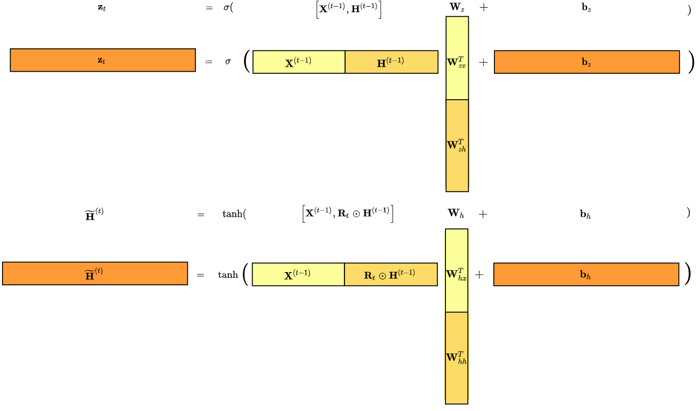
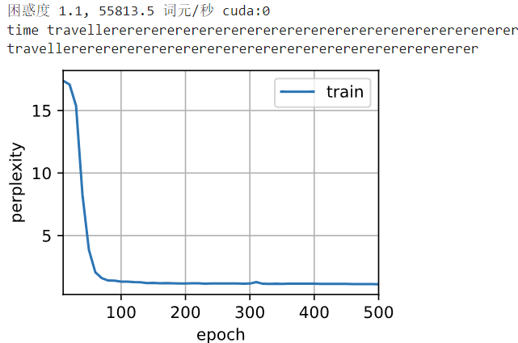
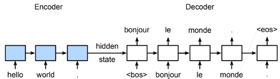
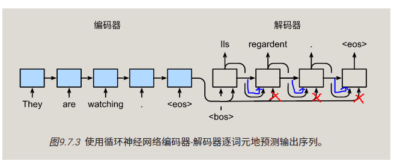
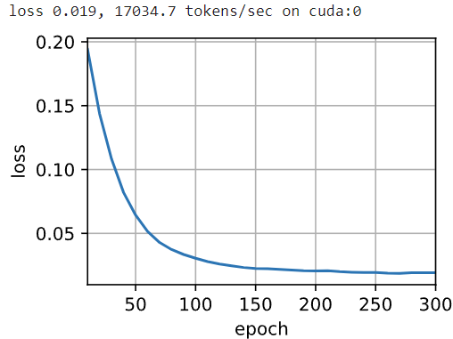

---
categories:
  - AI
  - 机器学习
  - 深度学习
tags:
  - AI
  - 机器学习
  - 深度学习
mathjax: true
title: 9.动手学深度学习-经典循环神经网络
abbrlink: 2699312118
date: 2024-04-07 10:17:20
updated: 2024-4-13 23:38:25
---

[TOC]

<!--more-->

## 9.1 RNN改进

由于循环神经网络使用的非线性激活函数为 $Logistic$ 函数或 $Tanh$ 函数，其导数值都小于1，并且权重矩阵 $\Vert \mathbf{W}_{hh}\Vert$ 也不会太大，因此如果时间间隔 $T-u$ 过大，$\delta_{T,u}$ 会趋于0，因而经常出现梯度消失问题

若将模型修改为
$$
\begin{aligned}
\mathbf{h}_{t}&=\mathbf{h}_{t-1}+g\left(\mathbf{x}_{t};\theta\right)\\
&=\mathbf{h}_{t-1}+\sigma\left(\mathbf{x}_{t}\mathbf{W}_{hx}^{\mathsf{T}}+\mathbf{b}_h\right)
\end{aligned}
$$
$\mathbf{h}_{t}$ 与 $\mathbf{h}_{t-1}$ 为线性依赖关系，且权重系数为 $\mathbf{I}$ ，这样可以消除梯度爆炸或梯度消失问题。但同时丢失了隐状态神经元在自反馈边上的非线性激活性质。因此，将模型进一步修改为
$$
\begin{aligned}
\mathbf{h}_{t}&=\mathbf{h}_{t-1}+g\left(\mathbf{x}_{t},\mathbf{h}_{t-1};\theta\right)\\
&=\mathbf{h}_{t-1}+\sigma\left(\mathbf{x}_{t}\mathbf{W}_{hx}^{\mathsf{T}}+\mathbf{h}_{t-1}\mathbf{W}_{hh}^{\mathsf{T}}+\mathbf{b}_h\right)
\end{aligned}
$$


- 类似于残差网络的形式

  

同样，在计算梯度时，仍存在梯度爆炸问题

此外，还存在 **记忆容量** 问题：

- 随着 $h_t$ 的不断累计存储，会发生饱和线性
- 若 $g(\cdot)$ 为 $Logistic$ 函数，随时间 $t$ 的增长，$h_t$ 会变得越来越大，从而导致 $h$ 变得饱和。随着记忆单元存储的内容越来越多，其("随机")丢失的信息也越来越多

### 9.1.1 基于门控机制的循环神经网络GRU

为改善长程依赖问题，使用一种基于 **残差网络思想** 的模型修改方法，但梯度爆炸、记忆容量问题仍存在，通过引入门控机制进一步改进模型

- 门控机制：控制信息的累计速度（有选择地加入新信息，并选择性地遗忘之前累计的信息）

  在数字电路中，**门** 为一个二值变量 $\{0,1\}$ 

  - $0$ 表示关闭状态，不允许任何信息通过
  - $1$ 表示开放状态，允许所有信息通过

这类网络称为 **基于门控的循环神经网络 (Gated RNN)** 

#### 遗忘门与更新门

##### 门控的实现

门的输入：当前时间步的输入 $\mathbf{X}_{t}\in \mathbb{R}^{B\times V}$ 和上一时刻隐状态 $\mathbf{H}_{t-1}\in \mathbb{R}^{B\times h}$ ，两个门的经过 *siogmoid* 函数输出


重置门 $\mathbf{R}_{t}\in \mathbb{R}^{B\times h}$ ，更新门 $\mathbf{Z}_{t}\in \mathbb{R}^{B\times h}$ 

$$
\mathbf{R}_t = \sigma\left(\mathbf{X}_{t} \mathbf{W}_{rx}^{\mathsf{T}} + \mathbf{H}_{t-1} \mathbf{W}_{rh}^{\mathsf{T}} + \mathbf{b}_r\right),\\
\mathbf{Z}_t = \sigma\left(\mathbf{X}_{t} \mathbf{W}_{zx}^{\mathsf{T}} + \mathbf{H}_{t-1} \mathbf{W}_{zh}^{\mathsf{T}} + \mathbf{b}_z\right)
$$
其中，$\mathbf{W}_{rx}\in \mathbb{R}^{h\times V},\mathbf{W}_{zx}\in \mathbb{R}^{h\times V}$ ，$\mathbf{W}_{rh},\mathbf{W}_{zh}\in \mathbb{R}^{h\times h}$ ，$\mathbf{b}_r,\mathbf{b}_h\in \mathbb{R}^{1\times h}$ 是可学习的参数

#### 候选隐状态


$$
\tilde{\mathbf{H}}_t=\tanh\left[\mathbf{X}_{t}\mathbf{W}_{hx}^{\mathsf{T}}+\left(\mathbf{R}_t\odot \mathbf{H}_{t-1}\right)\mathbf{W}_{hh}^{\mathsf{T}}+\mathbf{b}_h\right]
$$
重置门，控制当前时刻隐状态对历史隐状态的响应程度

- 当 $\mathbf{R}_t=\mathbf{I}$ 时，对历史隐状态响应程度最大，保留全部的历史信息，变为RNN；
- 当 $\mathbf{R}_t=\mathbf{0}$ 时，对历史隐状态响应程度最小，丢弃全部的历史信息，从当前时刻重置为输入 $\mathbf{X}_{t}$ 的状态；

#### 隐状态


$\mathbf{Z}_t$ 决定当前时刻的隐状态 $\mathbf{H}_{t}\in \mathbb{R}^{B\times h}$ 对上一时刻隐状态 $\mathbf{H}_{t-1}$ 与新候选状态 $\tilde{\mathbf{H}}_{t}$ 的响应程度

- $\mathbf{Z}_t=\mathbf{I}$ ，对历史隐状态响应程度大，候选隐状态响应程度小，所以对当前时刻的隐状态的更新程度小
- $\mathbf{Z}_t=\mathbf{0}$ ，对历史隐状态响应程度小，候选隐状态响应程度大，所以对当前时刻的隐状态的更新程度大

$$
\mathbf{H}_{t} = \mathbf{Z}_t \odot \mathbf{H}_{t-1} + (1 - \mathbf{Z}_t) \odot \tilde{\mathbf{H}}_{t}
$$
##### 门的作用

在一个子序列中，不是每个观测值都同等重要

- 一些状态并没有观测值或者与目标输出状态无关，我们希望有一些机制从隐状态中 **遗忘** 这些状态

  序列之间各部分存在逻辑中断，最好能有一种办法来 **重置** 内部状态

- 存在早期观测值对预测未来所有观测值有非常重要意义：如第一个观测值包含整个序列的校验和

重置门(reset gate)、遗忘门：控制历史隐状态的保留程度，若当前输入信息比较重要，则下一个时间步尽量不响应历史隐状态

- $R_t$ 越小，对历史隐状态的重置(遗忘)程度越大，**有助于捕获序列中的短期依赖**

更新门(update gate)：控制隐状态的更新程度，即对过去隐状态更新多少成为新的隐状态，跳过不相关的状态

- $Z_t$ 越小，对隐状态的更新程度越大 ，**有助于捕获序列中的长期依赖**

相当于新引进了两种极端情况

- 只关注当下输入（短期依赖），即 $R_t=0,Z_t=0$ 
- 只关注历史信息（长期依赖），即 $R_t=1,Z_t=1$

通过对门参数的学习，使得网络对子序列时序信息的学习介于这两种极端情况之间

可学习参数是RNN的三倍
$$
\mathbf{R}_t = \sigma\left(\mathbf{X}_{t} \mathbf{W}_{rx}^{\mathsf{T}} + \mathbf{H}_{t-1} \mathbf{W}_{rh}^{\mathsf{T}} + \mathbf{b}_r\right),\\
\tilde{\mathbf{H}}=\tanh\left[\mathbf{X}_{t}\mathbf{W}_{hx}^{\mathsf{T}}+\left(\mathbf{R}_t\odot \mathbf{H}_{t-1}\right)\mathbf{W}_{hh}^{\mathsf{T}}+\mathbf{b}_h\right]\\
\mathbf{Z}_t = \sigma\left(\mathbf{X}_{t} \mathbf{W}_{zx}^{\mathsf{T}} + \mathbf{H}_{t-1} \mathbf{W}_{zh}^{\mathsf{T}} + \mathbf{b}_z\right)\\
\mathbf{H}_{t} = \mathbf{Z}_t \odot \mathbf{H}_{t-1} + (1 - \mathbf{Z}_t) \odot \tilde{\mathbf{H}}_{t}
$$

#### 实现

```python
import torch
from torch import nn
from d2l import torch as d2l

batch_size, num_steps = 32, 35
train_iter, vocab = d2l.load_data_time_machine(batch_size, num_steps)
```

**参数初始化**

```python
def get_params(vocab_size, num_hiddens, device):
    num_inputs = num_outputs = vocab_size

    def normal(shape):
        return torch.randn(size=shape, device=device)*0.01
    # 对可学习参数的通用初始化
    def three():
        return (normal((num_inputs, num_hiddens)),
                normal((num_hiddens, num_hiddens)),
                torch.zeros(num_hiddens, device=device))

    W_xz, W_hz, b_z = three()  # 更新门参数
    W_xr, W_hr, b_r = three()  # 重置门参数
    W_xh, W_hh, b_h = three()  # 候选隐状态参数
    # 输出层参数
    W_hq = normal((num_hiddens, num_outputs))
    b_q = torch.zeros(num_outputs, device=device)
    # 附加梯度
    params = [W_xz, W_hz, b_z, W_xr, W_hr, b_r, W_xh, W_hh, b_h, W_hq, b_q]
    for param in params:
        param.requires_grad_(True)
    return params
```

**起始隐状态初始化** 

返回一个形状为 $(B,h)$ 的全零张量作为起始隐状态的值

```python
def init_gru_state(batch_size, num_hiddens, device):
    return (torch.zeros((batch_size, num_hiddens), device=device), )
```

**门控循环神经网络正向传播**

```python
def gru(inputs, state, params):
    W_xz, W_hz, b_z, W_xr, W_hr, b_r, W_xh, W_hh, b_h, W_hq, b_q = params
    H, = state
    outputs = []
    for X in inputs:
        Z = torch.sigmoid((X @ W_xz) + (H @ W_hz) + b_z)
        R = torch.sigmoid((X @ W_xr) + (H @ W_hr) + b_r)
        H_tilda = torch.tanh((X @ W_xh) + ((R * H) @ W_hh) + b_h)
        H = Z * H + (1 - Z) * H_tilda
        Y = H @ W_hq + b_q
        outputs.append(Y)
    return torch.cat(outputs, dim=0), (H,)
```

**训练**

```python
vocab_size, num_hiddens, device = len(vocab), 256, d2l.try_gpu()
num_epochs, lr = 500, 1
model = d2l.RNNModelScratch(len(vocab), num_hiddens, device, get_params,
                            init_gru_state, gru)
d2l.train_ch8(model, train_iter, vocab, lr, num_epochs, device)
```


- 循环神经网络

  

> 理论上GRU相对于RNN计算量多了进3倍，所以此处GRU用时是RNN的3倍

#### 简洁实现

```python
#@save
class RNNModel(nn.Module):
    """循环神经网络模型"""
    def __init__(self, rnn_layer, vocab_size, **kwargs):
        super(RNNModel, self).__init__(**kwargs)
        self.rnn = rnn_layer
        self.vocab_size = vocab_size
        self.num_hiddens = self.rnn.hidden_size
        # 如果RNN是双向的（之后将介绍），num_directions应该是2，否则应该是1
        # 定义输出层，即 Y=tanh(hW_{hq})+b_q
        if not self.rnn.bidirectional:
            self.num_directions = 1
            self.linear = nn.Linear(self.num_hiddens, self.vocab_size)
        else:
            self.num_directions = 2
            self.linear = nn.Linear(self.num_hiddens * 2, self.vocab_size)

    def forward(self, inputs, state):
        # inputs的形状(批量大小,时间步长,词表大小)
        X = F.one_hot(inputs.T.long(), self.vocab_size)
        X = X.to(torch.float32)
        Y, state = self.rnn(X, state)
        # Y.shape输出的是 (时间步长,批量大小,词表大小) ，Y.shape[-1]为词表大小
        #  全连接输出层首先将Y的形状改为(时间步数*批量大小,隐藏单元数)
        output = self.linear(Y.reshape((-1, Y.shape[-1])))
        return output, state

    def begin_state(self, device, batch_size=1):
        # 完成隐变量的初始化
        if not isinstance(self.rnn, nn.LSTM):
            # nn.GRU以张量作为隐状态
            return  torch.zeros((self.num_directions * self.rnn.num_layers,
                                 batch_size, self.num_hiddens),
                                device=device)
        else:
            # nn.LSTM以元组作为隐状态
            return (torch.zeros((
                self.num_directions * self.rnn.num_layers,
                batch_size, self.num_hiddens), device=device),
                    torch.zeros((
                        self.num_directions * self.rnn.num_layers,
                        batch_size, self.num_hiddens), device=device))
```

```python
num_inputs = vocab_size
# 参数列表:循环层的(一个输入词元神经元数,一个词元相应的隐藏层神经元数)
gru_layer = nn.GRU(num_inputs, num_hiddens)
# RNNModel(rnn层,一个输出词元的神经元数)
model = d2l.RNNModel(gru_layer, len(vocab))
model = model.to(device)
d2l.train_ch8(model, train_iter, vocab, lr, num_epochs, device)
```


- RNN

  

> 虽然理论上GRU相对于RNN计算量多了进3倍，但基于torch框架的实际训练速度相差不大
>
> 因为同一层的参数，如 $R_t$ 与 $Z_t$ ，$H_t$ 的计算形式上相似，所以基于torch框架的RNN模型会将这三组矩阵并行计算，所以性能上相差不大
>
> ```python
> for name, param in gru_layer.named_parameters():
>     print(f"参数名:{name}-参数形状:{param.shape}")
> 
> # 参数名:weight_ih_l0-参数形状:torch.Size([768, 28])
> # 参数名:weight_hh_l0-参数形状:torch.Size([768, 256])
> # 参数名:bias_ih_l0-参数形状:torch.Size([768])
> # 参数名:bias_hh_l0-参数形状:torch.Size([768])
> ```
>
> $B=32,T=35,h=256$ ，两个门控参数和一个连接参数，即 $\begin{aligned}\mathbf{W}_{hx}\\\mathbf{W}_{zx}\\\mathbf{W}_{rx}\end{aligned}\in \mathbb{R}^{(3\times 256)\times 28}$
>
> https://www.bilibili.com/video/BV1bM41127U4/?spm_id_from=333.788.recommend_more_video.0&vd_source=260d5bbbf395fd4a9b3e978c7abde437
>
> 

### 9.1.2 长短期记忆网络LSTM

隐变量模型存在 **信息长期保存** 和 **输入短期缺失** 的问题。最早的解决方法是长短期存储器（long short-term memory）。

为每个输入、输出、隐状态增加记忆单元，为控制记忆单元增加了许多门

- 输入门：决定何时将数据读入记忆单元
- 输出门：从记忆单元读出
- 遗忘门：重置记忆单元内容

#### 门机制

输入信息：当前时间步的输入 $\mathbf{X}_{t}\in \mathbb{R}^{B\times V}$ 和上一时刻隐状态 $\mathbf{H}_{t-1}\in \mathbb{R}^{B\times h}$ 


输入门 $\mathbf{I}_t\in \mathbb{R}^{B\times h}$ ，遗忘门 $\mathbf{F}_t\in \mathbb{R}^{B\times h}$ ，输出门 $\mathbf{O}_t\in \mathbb{R}^{B\times h}$
$$
\mathbf{I}_t=\sigma\left(\mathbf{X}_{t}\mathbf{W}_{ix}^{\mathsf{T}}+\mathbf{H}_{t-1}\mathbf{W}_{ih}^{\mathsf{T}}+\mathbf{b}_i\right)\\
\mathbf{F}_t=\sigma\left(\mathbf{X}_{t}\mathbf{W}_{fx}^{\mathsf{T}}+\mathbf{H}_{t-1}\mathbf{W}_{fh}^{\mathsf{T}}+\mathbf{b}_f\right)\\
\mathbf{O}_t=\sigma\left(\mathbf{X}_{t}\mathbf{W}_{ox}^{\mathsf{T}}+\mathbf{H}_{t-1}\mathbf{W}_{oh}^{\mathsf{T}}+\mathbf{b}_i\right)
$$
其中，$\mathbf{W}_{ix},\mathbf{W}_{fx},\mathbf{W}_{ox}\in \mathbb{R}^{h\times V}$ ，$\mathbf{W}_{ih},\mathbf{W}_{fh},\mathbf{W}_{oh}\in \mathbb{R}^{h\times h}$ ，$\mathbf{b}_i,\mathbf{b}_f，\mathbf{b}_o\in \mathbb{R}^{1\times h}$ 是可学习参数

#### 候选记忆元


候选记忆元 $\tilde{\mathbf{C}}_{t}\in \mathbb{R}^{B\times h}$ 
$$
\tilde{\mathbf{C}}_{t}=\tanh\left(\mathbf{X}_{t}\mathbf{W}_{cx}^{\mathsf{T}}+\mathbf{H}_{t-1}\mathbf{W}_{ch}^{\mathsf{T}}+\mathbf{b}_c\right)
$$
其中，$\mathbf{W}_{cx}\in\R^{h\times V}$ ，$\mathbf{W}_{ch}\in \mathbb{R}^{h\times h}$ ，$\mathbf{b}_c\in \mathbb{R}^{1\times h}$ 都是可学习的参数

#### 记忆元


类似于GRU的重置门(遗忘门)和更新门，LSTM中，遗忘门 $\mathbf{F}_{t}$ 控制遗忘(保留)多少历史信息，输入门 $\mathbf{I}_t$ 控制更新多少状态信息
$$
\mathbf{C}_{t}=\mathbf{F}_t\odot \mathbf{C}_{t-1}+\mathbf{I}_t\odot \tilde{\mathbf{C}}_{t}
$$

- 区别于GRU的是

  由于 $\mathbf{F}_{t}$ 与 $\mathbf{I}_{t}$ 是独立的，当 $\mathbf{F}_{t},\mathbf{I}_{t}\rightarrow 1$ 时，长期记忆既可以保留历史记忆，又能更新历史记忆；

  而GRU的 $\mathbf{Z}_{t},1-\mathbf{Z}_{t}$ 分别控制保留历史状态和更新历史状态，只能二选一

#### 隐状态


隐状态 $\mathbf{H}_{t}\in\R^{B\times h}$ ，
$$
\mathbf{H}_{t}=\mathbf{O}_t\odot \tanh\left(\mathbf{C}_{t}\right)
$$
- 输出门 $\mathbf{O}_t$ 的作用相当于GRU 的重置门，当 $\mathbf{O}_t\rightarrow 0$ ，则忽略历史信息

- 关于 $\tanh\left(\mathbf{C}_{t}\right)$ 的理解，确保 $\mathbf{H}_{t}$ 压缩在 $[-1,1]$ 

  $\mathbf{F}_t$ 和 $\mathbf{I}_t$ 都在 $[0,1]$ 区间内，所以 $\mathbf{C}_{t}\in [-2,2]$ ，为了将 $\mathbf{H}_{t}$ 恢复到 $[-1,1]$ 内，使用 $\tanh$ 

$C$ 长期记忆：因为取值范围更大，所以可以存储更多的时序特征

$H$ 短期记忆：取值范围在 $[-1,1]$ ，存储的时序信息少一些

实际上，LSTM与GRU都是在 *极远视* 和 *极近视* 两种极端情况的平衡，实际的效果差不多

#### 实现

**加载数据**

```python
import torch
from torch import nn
from d2l import torch as d2l

batch_size, num_steps = 32, 35
train_iter, vocab = d2l.load_data_time_machine(batch_size, num_steps)
```

**参数初始化** 

```python
def get_lstm_params(vocab_size, num_hiddens, device):
    num_inputs = num_outputs = vocab_size

    def normal(shape):
        return torch.randn(size=shape, device=device)*0.01

    def three():
        return (normal((num_inputs, num_hiddens)),
                normal((num_hiddens, num_hiddens)),
                torch.zeros(num_hiddens, device=device))

    W_xi, W_hi, b_i = three()  # 输入门参数
    W_xf, W_hf, b_f = three()  # 遗忘门参数
    W_xo, W_ho, b_o = three()  # 输出门参数
    W_xc, W_hc, b_c = three()  # 候选记忆元参数
    # 输出层参数
    W_hq = normal((num_hiddens, num_outputs))
    b_q = torch.zeros(num_outputs, device=device)
    # 附加梯度
    params = [W_xi, W_hi, b_i, W_xf, W_hf, b_f, W_xo, W_ho, b_o, W_xc, W_hc,
              b_c, W_hq, b_q]
    for param in params:
        param.requires_grad_(True)
    return params
```

**起始隐状态初始化** 

长短期记忆网络的隐状态需要返回一个额外的记忆元，长期记忆 $\mathbf{C}_{t}$ ，短期记忆 $\mathbf{H}_{t}$ ，形状为 $(B,h)$

```python
def init_lstm_state(batch_size, num_hiddens, device):
    return (torch.zeros((batch_size, num_hiddens), device=device),
            torch.zeros((batch_size, num_hiddens), device=device))
```

**LSTM前向传播** 

只有隐状态 $\mathbf{H}_{t}$ 才会传递到输出层，$\mathbf{C}_{t}$ 不直接参与输出

```python
def lstm(inputs, state, params):
    [W_xi, W_hi, b_i, W_xf, W_hf, b_f, W_xo, W_ho, b_o, W_xc, W_hc, b_c,
     W_hq, b_q] = params
    (H, C) = state
    outputs = []
    for X in inputs:
        I = torch.sigmoid((X @ W_xi) + (H @ W_hi) + b_i)
        F = torch.sigmoid((X @ W_xf) + (H @ W_hf) + b_f)
        O = torch.sigmoid((X @ W_xo) + (H @ W_ho) + b_o)
        C_tilda = torch.tanh((X @ W_xc) + (H @ W_hc) + b_c)
        C = F * C + I * C_tilda
        H = O * torch.tanh(C)
        Y = (H @ W_hq) + b_q
        outputs.append(Y)
    return torch.cat(outputs, dim=0), (H, C)
```

**训练**

```python
vocab_size, num_hiddens, device = len(vocab), 256, d2l.try_gpu()
num_epochs, lr = 500, 1
model = d2l.RNNModelScratch(len(vocab), num_hiddens, device, get_lstm_params,
                            init_lstm_state, lstm)
d2l.train_ch8(model, train_iter, vocab, lr, num_epochs, device)
```


#### 简洁实现

```python
num_inputs = vocab_size
lstm_layer = nn.LSTM(num_inputs, num_hiddens)
model = d2l.RNNModel(lstm_layer, len(vocab))
model = model.to(device)
d2l.train_ch8(model, train_iter, vocab, lr, num_epochs, device)
```


### 9.1.3 深度循环神经网络

隐变量与观测值之间的关系不仅是单向非线性的，实际上隐变量和观测值与具体的函数形式的交互方式是多种多样的

深度RNN用多个隐藏层获得更多的非线性信息


若深度RNN有 $L$ 个隐藏层构成

在 $t$ 步有一个小批量的输入数据 $\mathbf{X}_t\in \mathbb{R}^{B\times V}$ ，第 $l$ 个隐藏层的隐状态 $\mathbf{H}^{(l)}_t\in \mathbb{R}^{B\times h}$ ，输出层变量 $\mathbf{O}_t\in \mathbb{R}^{B\times q}$ 。可认为 $\mathbf{H}_t^{(0)}=\mathbf{X}_t$ ，第 $l$ 个隐藏层的隐状态使用的激活函数为 $\phi_l(\cdot)$
$$
\mathbf{H}_t^{(l)}=\phi_l\left(\mathbf{H}_t^{(l-1)}\cdot \mathbf{W}_{hx}^{(l)}+\mathbf{H}^{(l)}_{t}\cdot\mathbf{W}_{hh}^{(l)}+\mathbf{b}^{(l)}_h\right)
$$
其中，

- 当 $l\ge 2$ 时，$\mathbf{W}_{hx}^{(l)}\in \mathbb{R}^{h\times h}$ ，$\mathbf{W}_{hh}^{(l)}\in \mathbb{R}^{h\times h}$ ，$\mathbf{b}_h^{(l)}\in \mathbb{R}^{1\times h}$ 是第 $l$ 层可学习的参数
- 当 $l=1$​ 时，$\mathbf{W}_{hx}^{(l)}\in \mathbb{R}^{h\times V}$ ，$\mathbf{W}_{hh}^{(l)}\in \mathbb{R}^{h\times h}$，$\mathbf{b}_h^{(l)}\in \mathbb{R}^{1\times h}$ 是第 $1$ 层可学习的参数

输出层仅基于第 $L$ 层的隐状态
$$
\mathbf{O}_t=\mathbf{H}_t^{(L)}\cdot\mathbf{W}_{qh}+\mathbf{b}_q
$$
其中，$\mathbf{W}_{qh}^{(L)}\in \mathbb{R}^{q\times h}$ ，$\mathbf{b}_q\in \mathbb{R}^{1\times q}$ 都是输出层可学习的参数

**RNN不会用很深，一般2，3层**

同时，GRU和LSTM也可以堆叠多个隐藏层

#### 实现

**加载数据**

```python
import torch
from torch import nn
from d2l import torch as d2l

batch_size, num_steps = 32, 35
train_iter, vocab = d2l.load_data_time_machine(batch_size, num_steps)
```

**初始化参数** 

`num_layers` ：$L=2$ ，有2个隐藏层

`num_inputs` ：输入层神经元数为词表大小 $V$ 

`lstm` 循环层：输入神经元数为 $V$ ，隐藏层神经元数都为 $h$ 

`d2l.RNNModel(lstm_layer, len(vocab))` 输出层：输出层输入神经元数量为 $h$ ，输出神经元数量为 $V$ 

```python
vocab_size, num_hiddens, num_layers = len(vocab), 256, 2
num_inputs = vocab_size
device = d2l.try_gpu()
lstm_layer = nn.LSTM(num_inputs, num_hiddens, num_layers)
'''
input = torch.randn(5, 3, 10)
rnn = nn.LSTM(10, 20, 2)
# 隐状态形状 num_directions * num_layers,batch_size, self.num_hiddens
#   在train_epoch_ch8中，初始化工作在每个批量子序列开始迭代前完成，即begin_state()的调用
h0 = torch.randn(2, 3, 20)
c0 = torch.randn(2, 3, 20) 
# lstm有两个隐状态，长期记忆c和短期记忆h
output, (hn, cn) = rnn(input, (h0, c0))
'''
model = d2l.RNNModel(lstm_layer, len(vocab))
model = model.to(device)
```

**训练和预测**

```python
num_epochs, lr = 500, 2
d2l.train_ch8(model, train_iter, vocab, lr*1.0, num_epochs, device)
```


由于模型容量大，所以迭代轮数很少就收敛

#### 参数

```python
for name, param in lstm_layer.named_parameters():
    print(f"参数名:{name},参数形状:{param.shape}")

#	参数名:weight_ih_l0,参数形状:torch.Size([1024, 28])
#	参数名:weight_hh_l0,参数形状:torch.Size([1024, 256])
#	参数名:bias_ih_l0,参数形状:torch.Size([1024])
#	参数名:bias_hh_l0,参数形状:torch.Size([1024])
#	参数名:weight_ih_l1,参数形状:torch.Size([1024, 256])
#	参数名:weight_hh_l1,参数形状:torch.Size([1024, 256])
#	参数名:bias_ih_l1,参数形状:torch.Size([1024])
#	参数名:bias_hh_l1,参数形状:torch.Size([1024])
```


第 $0$ 隐藏层参数：

- $B=32,h=256$ ，三个门控参数和一个候选状态的连接参数，即 $\begin{aligned}\mathbf{W}^{(0)}_{ix}\\\mathbf{W}^{(0)}_{fx}\\\mathbf{W}^{(0)}_{ox}\\\mathbf{W}^{(0)}_{hx}\end{aligned}\in \mathbb{R}^{(4\times h)\times V}=\left((4\times 256), 28\right)$ 

第 $1$ 隐藏层参数：

- $B=32,h=256$ ，三个门控参数和一个候选状态的连接参数，即 $\begin{aligned}\mathbf{W}^{(1)}_{ix}\\\mathbf{W}^{(1)}_{fx}\\\mathbf{W}^{(1)}_{ox}\\\mathbf{W}^{(1)}_{hx}\end{aligned}\in \mathbb{R}^{(4\times h)\times h}=\left((4\times 256), 256\right)$ 

### 9.1.4 双向深度循环神经网络

对于时序预测模型，单向RNN面向的任务是给定观测的情况下，对下一个输出进行建模

而NLP中还存在一种填空任务，给定上下文，对中间缺失状态的进行填充

>如：
>
>- 我`___`。
>- 我`___`饿了。
>- 我`___`饿了，我可以吃半头猪。
>
>在下文未知的情况下，可能会填入与 "饿" 没有关系的内容，但有下文的情况下，内容会限制在 “饿” 相关的内容

单向RNN只看过去信息，即上文。在下文已知的情况下，当前的时刻的信息量会增加许多，很大程度上会提高当前时刻填充内容的质量

**不同长度的上下文范围重要性都是相同的** —— 通过隐马尔科夫模型的DP说明

#### 隐马尔科夫模型中的动态规划

> 为什么使用 **双向** 深度循环网络，为什么选择深度网络架构


在任意时间步 $t$ ，会有一个隐变量 $\mathbf{h}_t$ ，每个隐状态都有一定概率 $p(\mathbf{x}_t\vert \mathbf{h}_t)$ 得到观测 $\mathbf{x}_t$。另外，隐状态之间存在状态转移概率 $p(\mathbf{h}_{t+1}\vert \mathbf{h}_t)$ ，因此获取一个序列 $\{\mathbf{x}_1,\mathbf{x}_2,\cdots,\mathbf{x}_T\}$ 的概率服从一个联合概率
$$
p(\mathbf{x}_1,\mathbf{x}_2,\cdots,\mathbf{x}_T,\mathbf{h}_1,\mathbf{h}_2,\cdots,\mathbf{h}_T)=\prod\limits_{t=1}^Tp(\mathbf{h}_{t}\vert \mathbf{h}_{t-1})p(\mathbf{x}_t\vert \mathbf{h}_t)
$$
假设序列缺失 $\mathbf{x}_j$ ，变为一个填空任务，则目标函数变为 $\max p\left(\mathbf{x}_j\vert \{\mathbf{x}_{-j}\}\right)=\max p(\mathbf{x}_{j}\vert \mathbf{x}_{1},\mathbf{x}_{2},\cdots,\mathbf{x}_{j-1},\mathbf{x}_{j+1},\cdots,\mathbf{x}_T)$  

隐状态 $\mathbf{h}_t$ 是一个与时间有关的变量，若所有隐状态的状态值是有限的，即每个 $\mathbf{h}_t$ 都可以有 $k$ 个不同的值，则相邻两个时刻间的状态转移 $p(\mathbf{h}_{t+1}\vert \mathbf{h}_t)\in \mathbb{R}^{k\times k}$ 是一个状态转移矩阵 ，要得到 $p(\mathbf{x}_1,\cdots,\mathbf{x}_T)$ 是 $k^T$ 个路径的求和
$$
P(\mathbf{x}_1, \ldots, \mathbf{x}_T)=\sum_{\mathbf{h}_1, \ldots, \mathbf{h}_T} P(\mathbf{x}_1, \ldots, \mathbf{x}_T, \mathbf{h}_1, \ldots, \mathbf{h}_T)
$$
基于动态规划，可以得到两种递归形式

- *前向递归* 
  $$
  \pi_{t}(\mathbf{h}_{t}) = \sum_{\mathbf{h}_{t-1}} \pi_{t-1}(\mathbf{h}_{t-1}) P(\mathbf{x}_{t-1} \vert \mathbf{h}_{t-1}) P(\mathbf{h}_{t} \vert \mathbf{h}_{t-1})\\
  \pi_1(\mathbf{h}_1)=p(\mathbf{h}_1)
  $$

- *后向递归* 
  $$
  \rho_{t}(\mathbf{h}_{t})= \sum_{\mathbf{h}_{t+1}} P(\mathbf{h}_{t+1} \vert \mathbf{h}_{t})  P(\mathbf{x}_{t+1} \vert \mathbf{h}_{t+1})\rho_{t+1}(\mathbf{h}_{t+1})\\
  \rho_T(\mathbf{h}_T) = 1
  $$

两种递归方式，都允许我们在 $\mathcal{O}(kT)$ 的时间内对 $T$ 个隐变量序列 $(h_1,\cdots,h_T)$ 的所有值求和，避免指数级循环嵌套即指数级运算

**为预测当前状态，前向需要结合历史状态，后向需要结合未来状态** ，将二者结合

可以计算
$$
P(x_j \vert x_{-j}) \propto \sum_{h_j} \pi_j(h_j) \rho_j(h_j) P(x_j \vert h_j)
$$

> 前向递归推导
> $$
> \begin{aligned}
>     P(x_1, \ldots, x_T)=& \sum_{h_1, \ldots, h_T} P(x_1, \ldots, x_T, h_1, \ldots, h_T) \\
>     =& \sum_{h_1, \ldots, h_T} \prod_{t=1}^T P(h_t \vert h_{t-1}) P(x_t \vert h_t) \\
>     =& \sum_{h_2, \ldots, h_T} \underbrace{\left[\sum_{h_1} P(h_1) P(x_1 \vert h_1) P(h_2 \vert h_1)\right]}_{\pi_2(h_2) \triangleq}
>     P(x_2 \vert h_2) \prod_{t=3}^T P(h_t \vert h_{t-1}) P(x_t \vert h_t) \\
>     =& \sum_{h_3, \ldots, h_T} \underbrace{\left[\sum_{h_2} \pi_2(h_2) P(x_2 \vert h_2) P(h_3 \vert h_2)\right]}_{\pi_3(h_3)\triangleq}
>     P(x_3 \vert h_3) \prod_{t=4}^T P(h_t \vert h_{t-1}) P(x_t \vert h_t)\\
>     =& \dots \\
>     =& \sum_{h_T} \pi_T(h_T) P(x_T \vert h_T).
> \end{aligned}
> $$
> 后向递归推导
> $$
> \begin{aligned}
> P(x_1, \ldots, x_T)=& \sum_{h_1, \ldots, h_T} P(x_1, \ldots, x_T, h_1, \ldots, h_T) \\
>     =& \sum_{h_1, \ldots, h_T} \prod_{t=1}^{T-1} P(h_t \vert h_{t-1}) P(x_t \vert h_t) \cdot P(h_T \vert h_{T-1}) P(x_T \vert h_T) \\
>     =& \sum_{h_1, \ldots, h_{T-1}} \prod_{t=1}^{T-1} P(h_t \vert h_{t-1}) P(x_t \vert h_t) \cdot
>     \underbrace{\left[\sum_{h_T} P(h_T \vert h_{T-1}) P(x_T \vert h_T)\right]}_{\rho_{T-1}(h_{T-1})\triangleq} \\
>     =& \sum_{h_1, \ldots, h_{T-2}} \prod_{t=1}^{T-2} P(h_t \vert h_{t-1}) P(x_t \vert h_t) \cdot
>     \underbrace{\left[\sum_{h_{T-1}} P(h_{T-1} \vert h_{T-2}) P(x_{T-1} \vert h_{T-1}) \rho_{T-1}(h_{T-1}) \right]}_{\rho_{T-2}(h_{T-2})\triangleq} \\
>     =& \ldots \\
>     =& \sum_{h_1} P(h_1) P(x_1 \vert h_1)\rho_{1}(h_{1}).
> \end{aligned}
> $$

#### 双向循环网络

知道未来观测对隐马尔科夫模型中是有益的。

为了更好的完成 **填空** 任务，我们希望在RNN中加入这种前瞻能力（结合下文推导上文的能力），使得我们可以 **使用来自序列两端的信息来估计中间的输出**

双向循环网络可以实现需求，实际上是对隐马尔可夫统计模型的一种实现，使用统计模型的函数依赖类型，将其参数化为通用形式

##### 1.双向递归


在任意时间步 $t$ ，有小批量数据 $\mathbf{X}_{t}\in \mathbb{R}^{B\times V}$ 。该时间步的前向隐状态 $\overrightarrow{\mathbf{H}}_t\in \mathbb{R}^{B\times h}$  和反向隐状态 $\overleftarrow{\mathbf{H}}_t\in \mathbb{R}^{B\times h}$ 
$$
\begin{aligned}
\overrightarrow{\mathbf{H}}_t &= \phi\left(\mathbf{X}_t \cdot\mathbf{W}_{hx}^{(f)} + \overrightarrow{\mathbf{H}}_{t-1} \cdot\mathbf{W}_{hh}^{(f)}  + \mathbf{b}_h^{(f)}\right),\\
\overleftarrow{\mathbf{H}}_t &= \phi\left(\mathbf{X}_t \cdot\mathbf{W}_{hx}^{(b)} + \overleftarrow{\mathbf{H}}_{t+1} \cdot\mathbf{W}_{hh}^{(b)}  + \mathbf{b}_h^{(b)}\right),
\end{aligned}
$$
其中，权重$\mathbf{W}_{hx}^{(f)} \in \mathbb{R}^{h \times V}, \mathbf{W}_{hh}^{(f)} \in \mathbb{R}^{h \times h}, \mathbf{W}_{hx}^{(b)} \in \mathbb{R}^{h \times V}, \mathbf{W}_{hh}^{(b)} \in \mathbb{R}^{h \times h}$ 和偏置 $\mathbf{b}_h^{(f)} \in \mathbb{R}^{1 \times h}, \mathbf{b}_h^{(b)} \in \mathbb{R}^{1 \times h}$ 都是模型的可学习参数

- **正向递归**，结合 $\mathbf{X}_t$ 与 $\mathbf{H}_{t-1}$ 计算 $\mathbf{H}_t$ 

  

- **反向递归** ，将输入序列 $\{\mathbf{X}_1,\mathbf{X}_2,\cdots,\mathbf{X}_T\}$ 翻转，变为 $\{\mathbf{X}_T,\mathbf{X}_{T-1},\cdots,\mathbf{X}_1\}$ ，将 $\{\overleftarrow{\mathbf{H}}_1,\overleftarrow{\mathbf{H}}_2,\cdots,\overleftarrow{\mathbf{H}}_T\}$ 序列翻转为 $\{\overleftarrow{\mathbf{H}}_T,\overleftarrow{\mathbf{H}}_{T-1},\cdots,\overleftarrow{\mathbf{H}}_1\}$ 

  利用前向递归函数计算 $\overleftarrow{\mathbf{H}}_{t-1}=\phi\left(\mathbf{X}_{t-1}\cdot \mathbf{W}_{hx}^{(b)}+\overleftarrow{\mathbf{H}}_t\cdot \mathbf{W}_{hh}^{(b)}+\mathbf{b}_h^{(b)}\right)$ ，得到 $\{\overleftarrow{\mathbf{H}}_T,\overleftarrow{\mathbf{H}}_{T-1},\cdots,\overleftarrow{\mathbf{H}}_1\}$ ，在将其翻转得到 $\{\overleftarrow{\mathbf{H}}_1,\overleftarrow{\mathbf{H}}_2,\cdots,\overleftarrow{\mathbf{H}}_T\}$

  

##### 2. 输出

再将前向隐状态 $\overrightarrow{\mathbf{H}}_t$ 和反向隐状态 $\overleftarrow{\mathbf{H}}_t$ 连接起来，获取需要送入输出层的隐状态 $\mathbf{H}_t\in \mathbb{R}^{B\times 2h}$ 得到输出 $\mathbf{O}_t\in \mathbb{R}^{B\times q}$ 

- 若是深度双向循环网络，将 $\mathbf{H}_t$ 作为下一层的输入

$$
\mathbf{O}_t = \mathbf{H}_t \cdot\mathbf{W}_{qh} + \mathbf{b}_q
$$

这里，权重矩阵$\mathbf{W}_{qh} \in \mathbb{R}^{q \times 2h}$ 和偏置 $\mathbf{b}_q \in \mathbb{R}^{1 \times q}$ 是输出层的模型参数

- $\mathbf{W}_{qh}$ 也可以分别拆分为两个不同方向上的输出

#### 双向循环神经网络的代价

- 双向RNN不适合做预测（推理）

  在预测下一个词元时，我们终究无法知道下一个词元的下文是什么， 所以将不会得到很好的精度

  在训练期间，我们能够利用过去和未来的数据来估计现在空缺的词； 而在测试期间，我们只有过去的数据，因此精度将会很差

- 双向循环神经网络的计算速度非常慢

  主要原因是网络的前向传播需要在双向层中进行前向和后向递归， 并且网络的反向传播还依赖于前向传播的结果。 因此，梯度求解将有一个非常长的链

双向层的使用在实践中非常少，并且仅仅应用于部分场合

双向RNN主要用于对序列的 **时序特征进行提取（编码器）** 、填空。例如，填充缺失的单词、词元注释、以及作为序列处理流水线中的一个步骤对序列进行编码

#### 双向深度LSTM实现

```python
import torch
from torch import nn
from d2l import torch as d2l

# 加载数据
batch_size, num_steps, device = 32, 35, d2l.try_gpu()
train_iter, vocab = d2l.load_data_time_machine(batch_size, num_steps)
vocab_size, num_hiddens, num_layers = len(vocab), 256, 2
num_inputs = vocab_size
# 通过设置“bidirective=True”来定义双向LSTM模型
lstm_layer = nn.LSTM(num_inputs, num_hiddens, num_layers, bidirectional=True)
model = d2l.RNNModel(lstm_layer, len(vocab))
model = model.to(device)
# 训练模型
num_epochs, lr = 500, 1
d2l.train_ch8(model, train_iter, vocab, lr, num_epochs, device)
```



可见，模型容量加大，在训练数据上很快就过拟合

但用作预测并没有任何意义

##### 参数与输出形状


**输出**

```python
import torch
from torch import nn
from d2l import torch as d2l

batch_size, num_steps, device = 32, 35, d2l.try_gpu()
vocab_size, num_hiddens, num_layers = 28, 256, 3
num_inputs = vocab_size
lstm_layer = nn.LSTM(num_inputs, num_hiddens, num_layers, bidirectional=True)

X = torch.zeros((num_steps,batch_size,num_inputs))
h0 = torch.zeros((num_layers * 2, batch_size, num_hiddens))
c0 = torch.zeros((num_layers * 2, batch_size, num_hiddens))
out, state = lstm_layer(X,(h0,c0))
```

```python
out.shape,  out.reshape((num_steps, batch_size,2, num_hiddens)).shape
# (torch.Size([35, 32, 512]), torch.Size([35, 32, 2, 256]))
```

双向RNN的输出分为前向输出和后向输出，即 $\overrightarrow{\mathbf{O}}\in \mathbb{R}^{T\times B\times h}=(35\times 32\times 256)$ ，$\overleftarrow{\mathbf{O}}\in \mathbb{R}^{T\times B\times h}=(35, 32, 256)$ ，所以 $\mathbf{O}=\begin{bmatrix}\overrightarrow{\mathbf{O}}\\\overleftarrow{\mathbf{O}}\end{bmatrix}\in \mathbb{R}^{T\times B\times 2h}=(32,32,512)$

**隐状态**

```python
state[0].shape,state[1].shape
#	(torch.Size([6, 32, 256]), torch.Size([6, 32, 256]))
```

$\overrightarrow{\mathbf{H}}_T\in \mathbb{R}^{L\times B\times h }=(3,32,256),\overleftarrow{\mathbf{H}}_T\in \mathbb{R}^{L\times B\times h }=(3,32,256)$  

$\mathbf{H}_T=\begin{bmatrix}\overrightarrow{\mathbf{H}}_T\\\overleftarrow{\mathbf{H}}_T\end{bmatrix}\in \mathbb{R}^{2L\times B\times h }$ 

同理，$\mathbf{C}_T=\begin{bmatrix}\overrightarrow{\mathbf{C}}_T\\\overleftarrow{\mathbf{C}}_T\end{bmatrix}\in \mathbb{R}^{2L\times B\times h }$

**参数**

```python
for name, param in lstm_layer.named_parameters():
    print(f"参数名:{name},参数形状:{param.shape}")
```


$B=32,h=256$

第 $0$ 隐藏层参数：

- 正向，三个门控参数和一个候选状态的连接参数，即 $\begin{aligned}\overrightarrow{\mathbf{W}}^{(0)}_{ix}\\\overrightarrow{\mathbf{W}}^{(0)}_{fx}\\\overrightarrow{\mathbf{W}}^{(0)}_{ox}\\\overrightarrow{\mathbf{W}}^{(0)}_{hx}\end{aligned}\in \mathbb{R}^{(4\times h)\times V }=\left((4\times 256), 28\right)$ 
- 反向，三个门控参数和一个候选状态的连接参数，即 $\begin{aligned}\overleftarrow{\mathbf{W}}^{(0)}_{ix}\\\overleftarrow{\mathbf{W}}^{(0)}_{fx}\\\overleftarrow{\mathbf{W}}^{(0)}_{ox}\\\overleftarrow{\mathbf{W}}^{(0)}_{hx}\end{aligned}\in \mathbb{R}^{(4\times h)\times V }=\left((4\times 256), 28\right)$ 

第 $1$ 隐藏层参数：

- 正向，三个门控参数和一个候选状态的连接参数，即 $\begin{aligned}\overrightarrow{\mathbf{W}}^{(0)}_{ix}\\\overrightarrow{\mathbf{W}}^{(0)}_{fx}\\\overrightarrow{\mathbf{W}}^{(0)}_{ox}\\\overrightarrow{\mathbf{W}}^{(0)}_{hx}\end{aligned}\in \mathbb{R}^{(4\times h)\times h }=\left((4\times 256), 256\right)$ 
- 反向，三个门控参数和一个候选状态的连接参数，即 $\begin{aligned}\overleftarrow{\mathbf{W}}^{(0)}_{ix}\\\overleftarrow{\mathbf{W}}^{(0)}_{fx}\\\overleftarrow{\mathbf{W}}^{(0)}_{ox}\\\overleftarrow{\mathbf{W}}^{(0)}_{hx}\end{aligned}\in \mathbb{R}^{(4\times h)\times h }=\left((4\times 256), 256\right)$ 

## 9.2 机器翻译

机器翻译是一种 **序列转换模型**，也是语言模型的基准测试。机器翻译解决的问题是将 **输入序列转换为输出序列**。可以追溯到计算机破解语言编码

机器翻译是指将句子序列从一种语言翻译成另一种语言

- 统计机器翻译：涉及翻译模型和语言模型等组成部分的统计分析
- 神经网络翻译

### 9.2.1 数据集

```python
import os
import torch
from d2l import torch as d2l
```

#### 加载数据集

下载双语句子，“英-法”数据集。

按字符类型读入内存

数据集的每一行由制表符分割两种语言，前半部分为英语句子后半部分为法语句子。

```python
#@save
d2l.DATA_HUB['fra-eng'] = (d2l.DATA_URL + 'fra-eng.zip',
                           '94646ad1522d915e7b0f9296181140edcf86a4f5')

#@save
def read_data_nmt():
    """载入“英语－法语”数据集"""
    data_dir = d2l.download_extract('fra-eng')
    with open(os.path.join(data_dir, 'fra.txt'), 'r',encoding='utf-8') as f:
        return f.read()

raw_text = read_data_nmt()
print(raw_text[:75])
#	Go.		Va !
#	Hi.		Salut !
#	Run!	Cours !
#	Run!	Courez !
#	Who?	Qui ?
#	Wow!	Ça alors !
```

#### 预处理

```python
#@save
def preprocess_nmt(text):
    """预处理“英语－法语”数据集"""
    # 判断两个字符标点符号前是否有空格，切词时将标点符号单独作为一个token
    def no_space(char, prev_char):
        return char in set(',.!?') and prev_char != ' '

    # 将utf-8的半角和全角空格转为空格
    # 使用小写字母替换大写字母
    text = text.replace('\u202f', ' ').replace('\xa0', ' ').lower()
    # 在单词和标点符号之间插入空格
    out = [' ' + char if i > 0 and no_space(char, text[i - 1]) else char
           for i, char in enumerate(text)]
    return ''.join(out)

# text是逐字符索引的，1个字符对应text中的一个元素
# 如 text[79:80]=!
text = preprocess_nmt(raw_text)
print(text[:80])
# go .		va !
# hi .		salut !
# run !		cours !
# run !		courez !
# who ?		qui ?
# wow !		ça alors !
```

#### 词元化与词表

##### 词元化

对文本进行 **单词级**的词元化，

实现对前 `num_examples` 个文本的进行词元化，一个词元要么是一个英文单词 / 法文单词，要么是一个标点符号

返回值：词元化的英文句子序列集 `source` 和法文句子序列集 `target`

```python
#@save
def tokenize_nmt(text, num_examples=None):
    """词元化“英语－法语”数据数据集"""
    source, target = [], []
    for i, line in enumerate(text.split('\n')):
        if num_examples and i > num_examples:
            break
        # 将每一行通过 '\t' 切分为两部分
        # 前半部分为源序列，后半部分为目标序列
        parts = line.split('\t')
        if len(parts) == 2:
            # 将每个序列通过 ' ' 切分为单个token，
            source.append(parts[0].split(' '))
            target.append(parts[1].split(' '))
    return source, target

source, target = tokenize_nmt(text)
source[:6], target[:6]

#([['go', '.'],
#  ['hi', '.'],
#  ['run', '!'],
#  ['run', '!'],
#  ['who', '?'],
#  ['wow', '!']],
#  [['va', '!'],
#  ['salut', '!'],
#  ['cours', '!'],
#  ['courez', '!'],
#  ['qui', '?'],
#  ['ça', 'alors', '!']])
```

**查看句子序列集中的各种长度(token数)的句子数**


绘制每个文本序列所包含的词元数量的直方图

```python
#@save
def show_list_len_pair_hist(legend, xlabel, ylabel, xlist, ylist):
    """绘制列表长度对的直方图"""
    d2l.set_figsize()
    # 以每个句子的长度(词元数量)作为因变量
    _, _, patches = d2l.plt.hist(
        [[len(l) for l in xlist], [len(l) for l in ylist]])
    d2l.plt.xlabel(xlabel)
    d2l.plt.ylabel(ylabel)
    for patch in patches[1].patches:
        patch.set_hatch('/')
    d2l.plt.legend(legend)

show_list_len_pair_hist(['source', 'target'], '# tokens per sequence',
                        'count', source, target);
```

##### 词表

对句子序列进行单词集的词元化时，词表大小明显大于字符词元。

将出现频率少于2的低频单词进行忽略，视为 `<unk>` ，指定保留字 `<pad>，<bos>，<eos>` 用于填充句子和标识句子开始和解决

```python
# d2l.Vocab：获取源句子语料集的词表
#    在保留字符映射完成后，按照词频降序与数字索引一一对应
#    返回词表，通过词表可完成数字索引与token的互相转换
src_vocab = d2l.Vocab(source, min_freq=2,
                      reserved_tokens=['<pad>', '<bos>', '<eos>'])
# pad：填充；bos：begin of sequence；eos:end of sequence
# 若某个token出现次数小于等于2，则丢弃该token
len(src_vocab)
# 10012
```

#### 数据集迭代器

##### 根据时序步长调整句子

在机器翻译中，每个样本都是由源和目标组成的文本序列对，为提高计算效率，在封装为批量前，需要对每行句子进行调整，使每个小批量的形状相同。首先，需要使所有的句子子序列都等于时序步长

时序步长（词元数量）由 `num_steps` 指定，

- 截断 `truncation`
- 填充 `padding`

如果文本序列的词元数目少于`num_steps`时， 我们将继续在其末尾添加特定的 `'<pad>'` 词元， 直到其长度达到`num_steps`； 反之，我们将截断文本序列时，只取其前`num_steps` 个词元， 并且丢弃剩余的词元。

```python
#@save
# 对数字索引的列表格式化
def truncate_pad(line, num_steps, padding_token):
    """截断或填充文本序列"""
    # 在给定一个时序窗口时，若句子序列够长，则截断
    if len(line) > num_steps:
        return line[:num_steps]  # 截断
    # 若句子序列长度不够时序窗口，则添加填充字符 pad
    return line + [padding_token] * (num_steps - len(line))  # 填充

truncate_pad(src_vocab[source[0]], 10, src_vocab['<pad>'])
# [47, 4, 1, 1, 1, 1, 1, 1, 1, 1]
```

当模型通过一个词元接一个词元地生成序列进行预测时， 生成的 `<eos>` 词元说明完成了序列输出工作。所以对于每一个句子子序列，需要将特定的 `<eos>` 词元添加到所有序列的末尾

其次，为后续参数更新，记录每个句子子序列的有效长度（排除 `<pad>` ）

```python
#@save
def build_array_nmt(lines, vocab, num_steps):
    """将句子序列切分为等长的数字索引子序列，长度为时序窗口"""
    # 将输入数据集中的每一句子序列从token转化为数字序列
    lines = [vocab[l] for l in lines]
    # 在每个句子末尾添加 '<eos>' 标识句子结束
    lines = [l + [vocab['<eos>']] for l in lines]
    # 对完整句子逐行按时序步长切分，长度不够的用pad填充
    array = torch.tensor([truncate_pad(l, num_steps, vocab['<pad>']) for l in lines])
    # 每个子序列的有效长度：除去填充字符的token数，即为句子的有效长度
    valid_len = (array ! = vocab['<pad>']).type(torch.int32).sum(1)
    return array, valid_len
```

##### 返回数据迭代器

```python
#@save
def load_data_nmt(batch_size, num_steps, num_examples=600):
    """返回翻译数据集的迭代器和词表"""
    text = preprocess_nmt(read_data_nmt())
    # 将文本数据集词元化
    source, target = tokenize_nmt(text, num_examples)
    src_vocab = d2l.Vocab(source, min_freq=2,
                          reserved_tokens=['<pad>', '<bos>', '<eos>'])
    tgt_vocab = d2l.Vocab(target, min_freq=2,
                          reserved_tokens=['<pad>', '<bos>', '<eos>'])
    src_array, src_valid_len = build_array_nmt(source, src_vocab, num_steps)
    tgt_array, tgt_valid_len = build_array_nmt(target, tgt_vocab, num_steps)
    data_arrays = (src_array, src_valid_len, tgt_array, tgt_valid_len)
    # 将传入的data_arrays元组的各项按批量大小划分后，组合为一个迭代项
    #   一个迭代项是包含多个元素的一个元组，其中每个元素都是各项的一个批量
    data_iter = d2l.load_array(data_arrays, batch_size)
    return data_iter, src_vocab, tgt_vocab
```

查看输出

```python
train_iter, src_vocab, tgt_vocab = load_data_nmt(batch_size=2, num_steps=8)
for X, X_valid_len, Y, Y_valid_len in train_iter:
    print('X:', X.type(torch.int32))
    for it in X:
        print([src_vocab.idx_to_token[idx] for idx in it],"\n")
    print('X的有效长度:', X_valid_len)
    print('Y:', Y.type(torch.int32))
    for it in Y:
        print([tgt_vocab.idx_to_token[idx] for idx in it],"\n")
    print('Y的有效长度:', Y_valid_len)
    break
    
#	X: tensor([[ 6, 97,  4,  3,  1,  1,  1,  1],
#	        [ 6, 18, 60,  4,  3,  1,  1,  1]], dtype=torch.int32)
#	['i', 'tried', '.', '<eos>', '<pad>', '<pad>', '<pad>', '<pad>'] 
#	
#	['i', 'am', 'here', '.', '<eos>', '<pad>', '<pad>', '<pad>'] 
#	
#	X的有效长度: tensor([4, 5])
#	Y: tensor([[10,  0,  4,  3,  1,  1,  1,  1],
#	        [ 6,  7, 53,  4,  3,  1,  1,  1]], dtype=torch.int32)
#	["j'ai", '<unk>', '.', '<eos>', '<pad>', '<pad>', '<pad>', '<pad>'] 
#	
#	['je', 'suis', 'ici', '.', '<eos>', '<pad>', '<pad>', '<pad>'] 
#	
#	Y的有效长度: tensor([4, 5])
```

### 9.2.2 编码器-解码器

> 可以理解为一种设计模式

编码器：将输入数据转换为中间表达形式（特征），且这个中间表达形式对机器学习友好

解码器：将中间表达形式转换为输出数据（标号）

**CNN中的编码器-解码器** 


**RNN中的编码器-解码器**

编码器：将文本转换为隐状态向量

解码器：将隐状态向量转换为输出


#### 编码器-解码器架构


编码器：处理输入，输出为解码器的初始隐状态特征张量

解码器：生成输出，基于中间特征张量生成输出

---

以 “英语-法语” 机器翻译这样的 *序列-序列* 为例，给定词元化的英文句子序列 `'They' 'are' 'watching' '.'` ，将长度可变的输入序列编码成一个隐状态。然后对该状态解码，一个 `token` 接一个 `token` 生成翻译后的序列 `'Ils' 'regordent' '.'` 

#### 实现

##### 编码器

在编码器中，只需要输入源序列 $X$ ，与神经网络的前向传递类似

```python
from torch import nn

#@save
class Encoder(nn.Module):
    """编码器-解码器架构的基本编码器接口"""
    def __init__(self, **kwargs):
        super(Encoder, self).__init__(**kwargs)

    def forward(self, X, *args):
        raise NotImplementedError
```

##### 解码器

在神经网络前向传递的基础上，需要接收编码器的输出状态 `init_state()` ，并将其转为解码器的初始状态

若对于解码器的输出序列有额外的信息，（如：输出序列的长度），解码器还可接受输入 `enc_outputs` 

编码器会逐个地生成长度可变的词元序列，在每个时间步都会将 *输入* 和 *编码后的状态* 映射成当前时间步的输出词元

```python
#@save
class Decoder(nn.Module):
    """编码器-解码器架构的基本解码器接口"""
    def __init__(self, **kwargs):
        super(Decoder, self).__init__(**kwargs)

    def init_state(self, enc_outputs, *args):
        raise NotImplementedError

    def forward(self, X, state):
        raise NotImplementedError
```

##### 合并

```python
#@save
class EncoderDecoder(nn.Module):
    """编码器-解码器架构的基类"""
    def __init__(self, encoder, decoder, **kwargs):
        super(EncoderDecoder, self).__init__(**kwargs)
        self.encoder = encoder
        self.decoder = decoder

    def forward(self, enc_X, dec_X, *args):
        #整个架构前向传递时，先编码，用编码器的输出和解码器的输入初始化解码器的状态
        # 返回编码器的输出序列
        enc_outputs = self.encoder(enc_X, *args)
        dec_state = self.decoder.init_state(enc_outputs, *args)
        return self.decoder(dec_X, dec_state)
```

### 9.2.3 Seq2Seq

Seq2Seq可以解决 **变长序列-变长序列** 的学习任务

#### 编码器解码器架构


编码器是一个RNN，读取整个句子

- 输入序列的信息被 **编码** 到RNN的隐状态中
- 可以双向RNN，因为不需要用编码器做预测

解码器用另一个RNN输出

- 解码器基于 **输入序列的编码信息** 的 **输出序列已经生成的词元** 来预测下一个词元
- `<eos>` 是序列结束的标识，一旦输出序列生成此词元，模型停止预测
- `<bos>` 是序列开始的标识，是解码器输入的第一个词元

##### 编码器获取序列的上下文

假设编码器的输入序列是 $\{x_1,x_2,\cdots,x_T\}$ ，在第 $t$ 个时间步，RNN的循环层将词元 $x_t$ 的输入词元向量 $\mathbf{x}_t$ 和上一时刻隐状态 $\mathbf{h}_{t-1}$ 转换为 $\mathbf{h}_t$ 
$$
\mathbf{h}_t=f(\mathbf{x}_t,\mathbf{h}_{t-1})
$$
可以将编码器理解为 $q()$ ，将输入序列与隐状态转换为序列的上下文变量，在序列的最后一个时间步 $T$ ，可以获得输入序列完整的上下文信息
$$
\mathbf{c}=q(\mathbf{h}_1,\cdots,\mathbf{h}_T)
$$

##### 解码器

来自训练数据集的输出序列 $\{y_1,\cdots,y_{T'}\}$ ，对于时间步 $t'$ ，解码器输出 $y_{t'}$ 的概率取决于输出子序列的上文与输入序列的上下文变量 $\mathbf{c}$ ，即 $P(y_{t'}\vert y_1,\cdots,y_{t'-1},\mathbf{c})$ 

- 上下文变量需要在所有时间步与解码器的输入拼接

所以在解码器中，对于任一时间步 $t'$ ，RNN将来自上一时间步的输出词元向量 $\mathbf{y}_{t'-1}$ 、输入序列的上下文变量 $\mathbf{c}$ 、输出序列的上文 $\mathbf{s}_{t'-1}$ 转换为本层隐状态 $\mathbf{s}_{t'}$ 和本层输出词元变量 $\mathbf{y}_{t'}$
$$
\mathbf{s}_{t'}=f(\mathbf{y}_{t'-1},\mathbf{c},\mathbf{s}_{t'-1})
$$

##### 编码器与解码器间的状态传递

将编码器最后一个时间步的输出隐状态 $\mathbf{h}_T$ 用作解码器的初始隐状态 $\mathbf{s}_0$ 

即基于RNN实现的编码器与解码器需要有相同的循环层数及每个隐状态数的神经元数相等


##### 输出

在得到解码器的隐状态后，用输出层和 *softmax* 计算 $t'$ 时的输出 $y_{t'}$ 的条件概率 $P(y_{t'}\vert y_1,\cdots,y_{t'-1},\mathbf{c})$

#### 损失函数

在每个时间步，解码器都预测了输出词元的概率分布，使用softmax来获得分布， 并通过计算交叉熵损失函数来进行优化

在生成批量子序列时，不同长度的子序列通过填充或截取 `truncate_pad()` 组成长度相同的批量子序列，但填充词元的预测不应该算入损失函数，需要 **通过零值化屏蔽不相关的项**

#### 训练



强制教学：特定的序列开始词元 `<bos>` 和 真实的标签序列 拼接在一起作为解码器的输入

#### 预测


一个词元接一个词元的方式预测输出序列，每个解码器当前时间步的输入都来自于上一时间步的预测词元。

在预测开始，序列开始词元 `<bos>` 需要被送入解码器

#### 预测序列的评估

预测序列 $\hat{\mathbf{Y}}$ 通过与真实的标签序列 $\mathbf{Y}$ 比较来评估预测序列的质量。BLEU是最早用于评估机器翻译结果的指标。

对于预测序列 $\hat{\mathbf{Y}}$ 中的 *n-元语法* ，BLEU评估的是这个 *n-元语法* 是否出现在真实的标签序列 $\mathbf{Y}$ 中 


$\text{len}_{label},\text{len}_{pred}$ 分别是标签序列中的词元数和预测序列中的词元数，$k$ 是检测的最大语法单元，即最多检测预测序列中的 $k-gram$ 属于真实序列 $\mathbf{Y}$ 的概率

具体地说，给定标签序列$A$、$B$、$C$、$D$、$E$、$F$ 和预测序列$A$、$B$、$B$、$C$、$D$，

- *1-gram* ：$\{A,B,B,C,D\}$ 所以1元语法有5个，$A,B,C,D$ 在 $\mathbf{Y}$ 中出现一次，$B$ 只出现一次，所以 $p_1=\frac{4}{5}$
- *2-gram* ：$\{AB,BB,BC,CD\}$ ，2元语法有4个，其中，$BB$ 未在 $\mathbf{Y}$ 中出现，所以 $p_2=\frac{3}{4}$
- *3-gram* ：$\{ABB,BBC,BCD\}$ ，3元语法有3个，只有 $BCD$ 在 $\mathbf{Y}$ 中出现，所以 $\mathbf{p}_3=\frac{1}{3}$

当预测序列与标签序列完全相同时，*BLEU* 是1。分别从预测序列的长度可语法匹配度衡量 Encoder-Decoder 的预测质量

- $n-gram$ 越长，则匹配难度越大，因此为更长的 $n$ 元语法分配更大的权重，即对于 $0\le p_n\le 1$ 固定时，$p_n^{\frac{1}{2^n}}$ 会随着 $n$ 的增大而增大。同时，对于同样的 $n$ ，$p_n$ 越大，$p_n^{\frac{1}{2^n}}$ 也越大。

- 同时，由于生成的预测序列越短，与真实标签序列匹配的可能性 $p_n$ 越大，为避免过短的预测序列，采用惩罚项系数

  当 $\mathrm{len}_{\text{label}}>\mathrm{len}_{\text{pred}}$ 时，惩罚项系数小于1

  当 $\mathrm{len}_{\text{label}}\le \mathrm{len}_{\text{pred}}$ 时，惩罚项系数等于1

#### 实现

```python
import collections
import math
import torch
from torch import nn
from d2l import torch as d2l
```

##### 编码器

```python
#@save
class Seq2SeqEncoder(d2l.Encoder):
    """用于序列到序列学习的循环神经网络编码器"""
    def __init__(self, vocab_size, embed_size, num_hiddens, num_layers,
                 dropout=0, **kwargs):
        super(Seq2SeqEncoder, self).__init__(**kwargs)
        # word2vec / 嵌入层： 将输入的整数索引转换成固定维度的稠密向量
        #  用一个one-hot向量表示一个token，
        #    首先会造成批量子序列张量的稀疏
        #    其次，在空间上两个one-hot正交，表示token之间没有关系，因此并不能表示token之间的时序关系
        #  为弥补上述两个缺陷，需要词嵌入层，将词表表示为稠密向量, embed间的内积可表示二者的时序关系
        #  num_embeddings：token数量
        #  embedding_dim：嵌入层每个embed的维度
        # 返回(1,embed_size)的词向量
        self.embedding = nn.Embedding(vocab_size, embed_size)
        # nn.GRU使用默认的init_state()，将初始状态变为0
        self.rnn = nn.GRU(embed_size, num_hiddens, num_layers,dropout=dropout)

    def forward(self, X, *args):
        # 输入X的形状 (batch_size,num_steps)
        # 输出'X'的形状：(batch_size,num_steps,embed_size)
        # 功能：将输入的批量子序列的词元用embed_size维的张量embed表示
        X = self.embedding(X)
        # 在循环神经网络模型中，第一个轴对应于时间步，即 (T,B,E) (7,4,8)
        X = X.permute(1, 0, 2)
        # 如果未初始化状态，则默认为0
        output, state = self.rnn(X)
        # output的形状:(num_steps,batch_size,num_hiddens) (7,4,16)
        # state的形状:(num_layers,batch_size,num_hiddens) (2,4,16)
        
        return output, state
```

嵌入层是一个矩阵，行数等于输入词表的大小（`vocab_size`），列数等于特征向量的维度（`embed_size`）。对于任意输入词元的索引 $i$ ， 嵌入层获取权重矩阵的第 $i$ 行返回其特征向量

**encoder测试**

```python
encoder = Seq2SeqEncoder(vocab_size=10, embed_size=8, num_hiddens=16,
                         num_layers=2)
# dropout不生效
encoder.eval()
# 输入是批量的数字索引的词元子序列，
#    即一个实数表示一个词元，用vocab可将数字映射为token 
X = torch.zeros((4, 7), dtype=torch.long)
output, state = encoder(X)
```

##### 解码器

李沐的示例代码实现的实下图，"lls" 的上下文变量为编码器生成的原始上下文变量，而 "regardent" 的上下文变量不再是编码器得到原始上下文变量。变为 $s_{t'-1}$ ，是对 $\mathbf{y}_1$ 与 $\mathbf{c}$ 的组合提取出的时序特征



```python
class Seq2SeqDecoder(d2l.Decoder):
    """用于序列到序列学习的循环神经网络解码器"""
    def __init__(self, vocab_size, embed_size, num_hiddens, num_layers,
                 dropout=0, **kwargs):
        super(Seq2SeqDecoder, self).__init__(**kwargs)
        self.embedding = nn.Embedding(vocab_size, embed_size)
        self.rnn = nn.GRU(embed_size + num_hiddens, num_hiddens, num_layers,
                          dropout=dropout)
        # 解码器有输出层，需要将时序隐状态转换为输出
        self.dense = nn.Linear(num_hiddens, vocab_size)

    def init_state(self, enc_outputs, *args):
        # 从encoder()返回值中取最后时间步的时序隐状态state作为decoder的初始隐状态
        return enc_outputs[1]

    def forward(self, X, state):
        # 输入X的形状：(batch_size,num_steps)
        # 输出'X'的形状：(num_steps,batch_size,embed_size)-(7,4,8)
        X = self.embedding(X).permute(1, 0, 2)
        # state[-1]:返回state的最后两维 (批量,embed)-(4,16)
        #  encoder输出隐状态的最后一层，累积了encoder最大可提取的批量子序列的时序信息
        #     即批量中每个子序列的上下文信息
        # context-(7,4,16):沿时序窗口广播最后一个时刻隐状态的最后一层，使其具有与X相同的num_steps 
        #   repeat(a,b,c) 沿着第一个维度重复a次，第二个维度重复b次，第三个维度重复c次
        context = state[-1].repeat(X.shape[0], 1, 1)
        # X_and_context-(7, 4, 24):相当于为目标序列每个时间步的输入都提供源序列的上下文时序信息
        # [X context] 解码器输入的信息越充分，效果越好。
        #   所以将源序列的上下文与目标序列的输入一起送入解码器进行解码
        X_and_context = torch.cat((X, context), 2)
        output, state = self.rnn(X_and_context, state)
        output = self.dense(output).permute(1, 0, 2)
        # output的形状:(batch_size,num_steps,vocab_size)
        # state的形状:(num_layers,batch_size,num_hiddens)
        
        return output, state
```


```python
class Seq2SeqDecoder(d2l.Decoder):
    """用于序列到序列学习的循环神经网络解码器"""
    def __init__(self, vocab_size, embed_size, num_hiddens, num_layers,
                 dropout=0, **kwargs):
        super(Seq2SeqDecoder, self).__init__(**kwargs)
        self.embedding = nn.Embedding(vocab_size, embed_size)
        self.rnn = nn.GRU(embed_size + num_hiddens, num_hiddens, num_layers,
                          dropout=dropout)
        # 解码器有输出层，需要将时序隐状态转换为输出
        self.dense = nn.Linear(num_hiddens, vocab_size)

    def init_state(self, enc_outputs, *args):
        # 保存encoder对输入序列生成的context变量
        self.ori_context = enc_outputs[1][-1]
        # 从encoder()返回值中取最后时间步的时序隐状态state作为decoder的初始隐状态
        return enc_outputs[1]

    def forward(self, X, state):
        # 输入X的形状：(batch_size,num_steps)
        # 输出'X'的形状：(num_steps,batch_size,embed_size)-(7,4,8)
        X = self.embedding(X).permute(1, 0, 2)
        # state[-1]:返回state的最后两维 (批量,embed)-(4,16)
        #  encoder输出隐状态的最后一层，累积了encoder最大可提取的批量子序列的时序信息
        #     即批量中每个子序列的上下文信息
        # context-(7,4,16):沿时序窗口广播最后一个时刻隐状态的最后一层，使其具有与X相同的num_steps 
        #   repeat(a,b,c) 沿着第一个维度重复a次，第二个维度重复b次，第三个维度重复c次
        context = self.ori_context.repeat(X.shape[0], 1, 1)
        # X_and_context-(7, 4, 24):相当于为目标序列每个时间步的输入都提供源序列的上下文时序信息
        # [X context] 解码器输入的信息越充分，效果越好。
        #   所以将源序列的上下文与目标序列的输入一起送入解码器进行解码
        X_and_context = torch.cat((X, context), 2)
        output, state = self.rnn(X_and_context, state)
        output = self.dense(output).permute(1, 0, 2)
        # output的形状:(batch_size,num_steps,vocab_size)
        # state的形状:(num_layers,batch_size,num_hiddens)
        
        return output, state
```

**解码器测试**

```python
decoder = Seq2SeqDecoder(vocab_size=10, embed_size=8, num_hiddens=16,
                         num_layers=2)
decoder.eval()
# X(4,7) 
#  encoder(X)[0]:encoder输出的output(7,4,16);
#  encoder(X)[1]:encoder输出的state(2,4,16)
state = decoder.init_state(encoder(X))
output, state = decoder(X, state)
output.shape, state.shape
```

##### 损失函数

所有预测词元的掩码设置为1，对于有效长度外的序列，其掩码设置为0

```python
#@save
def sequence_mask(X, valid_len, value=0):
    """在序列中屏蔽不相关的项，过滤<pad>"""
    # 因为源序列与目标序列都是变长的，所以需要成批量的返回每个输入子序列的有效长度
    #  批量子序列为(句子数,词元数,词向量)，子序列长度为词元数，所以子序列的长度为第一维长度
    maxlen = X.size(1)
    # maxlen为批量系列X中的最大长度。
    #  对于一个序列，若某个位置的索引小于序列的有效长度，则说明在有效序列中，mask[][i]=True
    #   若某个位置的索引大于等于序列的有效长度，mask[][i]=False
    mask = torch.arange((maxlen), dtype=torch.float32,
                        device=X.device)[None, :] < valid_len[:, None]
    # 将mask为False的元素用value填充
    X[~mask] = value
    return X

X = torch.tensor([[1, 2, 3], [4, 5, 6]])
sequence_mask(X, torch.tensor([1, 2]))
#	tensor([[1, 0, 0],
#	        [4, 5, 0]])
```

通过带屏蔽的softmax交叉熵损失遮蔽不相关损失：将预测序列中所有词元的损失乘掩码，过滤掉填充词元生成的不相关预测产生的损失

```python
#@save
class MaskedSoftmaxCELoss(nn.CrossEntropyLoss):
    """带遮蔽的softmax交叉熵损失函数"""
    # pred的形状：(batch_size,num_steps,vocab_size)
    # label的形状：(batch_size,num_steps) label是数字索引的词元
    # valid_len的形状：(1,batch_size)
    def forward(self, pred, label, valid_len):
        # 掩码矩阵初始化为1，形状与label相同
        weights = torch.ones_like(label)
        # 将有效部分设1，无效部分设0
        weights = sequence_mask(weights, valid_len)
        self.reduction='none'
        # unweighted_loss指含无效词元的预测输出与真实输出的损失
        #   由于torch计算损失时，是在第1维上进行，所以需要将词向量转置到第1维
        unweighted_loss = super().forward(pred.permute(0, 2, 1), label)
        # 对批量中每个子序列有效部分的预测输出与真实输出损失取平均，作为批量的损失
        weighted_loss = (unweighted_loss * weights).mean(dim=1)
        return weighted_loss
```

##### 训练

```python
#@save
def train_seq2seq(net, data_iter, lr, num_epochs, tgt_vocab, device):
    """训练序列到序列模型"""
    def xavier_init_weights(m):
        if type(m) == nn.Linear:
            nn.init.xavier_uniform_(m.weight)
        if type(m) == nn.GRU:
            for param in m._flat_weights_names:
                if "weight" in param:
                    nn.init.xavier_uniform_(m._parameters[param])

    net.apply(xavier_init_weights)
    net.to(device)
    optimizer = torch.optim.Adam(net.parameters(), lr=lr)
    loss = MaskedSoftmaxCELoss()
    # 进入训练模式
    net.train()
    animator = d2l.Animator(xlabel='epoch', ylabel='loss',
                     xlim=[10, num_epochs])
    for epoch in range(num_epochs):
        timer = d2l.Timer()
        metric = d2l.Accumulator(2)  # 训练损失总和，词元数量
        for batch in data_iter:
            optimizer.zero_grad()
            X, X_valid_len, Y, Y_valid_len = [x.to(device) for x in batch]
            # Y-(B,T),为每个句子子序列开头添加'<bos>' 并后移其他词元
            #   bos-(B,1)，即B个<bos>的列向量
            bos = torch.tensor([tgt_vocab['<bos>']] * Y.shape[0],
                          device=device).reshape(-1, 1)
            # 为输入Y在第1维拼接bos列，在数据迭代器中，为每个句子子序列的末尾添加了<eos>
            #   拿掉最后一个词元，因为decoder的输入不需要 <eos> 
            dec_input = torch.cat([bos, Y[:, :-1]], 1)  # 强制教学
            Y_hat = net(X, dec_input, X_valid_len)
            l = loss(Y_hat, Y, Y_valid_len)
            l.sum().backward()	# 损失函数的标量进行“反向传播”
            d2l.grad_clipping(net, 1)
            num_tokens = Y_valid_len.sum()
            optimizer.step()
            with torch.no_grad():
                metric.add(l.sum(), num_tokens)
        if (epoch + 1) % 10 == 0:
            animator.add(epoch + 1, (metric[0] / metric[1],))
    print(f'loss {metric[0] / metric[1]:.3f}, {metric[1] / timer.stop():.1f} '
        f'tokens/sec on {str(device)}')
```

```python
#@save
class EncoderDecoder(nn.Module):
    """编码器-解码器架构的基类"""
    def __init__(self, encoder, decoder, **kwargs):
        super(EncoderDecoder, self).__init__(**kwargs)
        self.encoder = encoder
        self.decoder = decoder

    def forward(self, enc_X, dec_X, *args):
        #整个架构前向传递时，先编码，用编码器的输出和解码器的输入初始化解码器的状态
        # 返回编码器的输出序列
        enc_outputs = self.encoder(enc_X, *args)
        dec_state = self.decoder.init_state(enc_outputs, *args)
        return self.decoder(dec_X, dec_state)
```

```python
embed_size, num_hiddens, num_layers, dropout = 32, 32, 2, 0.1
batch_size, num_steps = 64, 10
lr, num_epochs, device = 0.005, 300, d2l.try_gpu()

train_iter, src_vocab, tgt_vocab = d2l.load_data_nmt(batch_size, num_steps)
encoder = Seq2SeqEncoder(len(src_vocab), embed_size, num_hiddens, num_layers,
                        dropout)
decoder = Seq2SeqDecoder(len(tgt_vocab), embed_size, num_hiddens, num_layers,
                        dropout)
net = d2l.EncoderDecoder(encoder, decoder)
train_seq2seq(net, train_iter, lr, num_epochs, tgt_vocab, device)
```



出现过拟合

##### 预测

```python
#@save
def predict_seq2seq(net, src_sentence, src_vocab, tgt_vocab, num_steps,
                    device, save_attention_weights=False):
    """序列到序列模型的预测"""
    # 在预测时将net设置为评估模式
    net.eval()
    # 对src_sentence的预处理，末尾添加<eos>并转化为数字索引词元并添加 
    #  按时间步长截取子序列
    src_tokens = src_vocab[src_sentence.lower().split(' ')] + [src_vocab['<eos>']]
    src_tokens = d2l.truncate_pad(src_tokens, num_steps, src_vocab['<pad>'])
    enc_valid_len = torch.tensor([len(src_tokens)], device=device)
    
    # encoder的输入是当前时刻词元的数字索引  形状是 (batch_size,num_steps) 添加批量轴
    enc_X = torch.unsqueeze(
        torch.tensor(src_tokens, dtype=torch.long, device=device), dim=0)
    # encoder输出为output,state
    enc_outputs = net.encoder(enc_X, enc_valid_len)
    dec_state = net.decoder.init_state(enc_outputs, enc_valid_len)
    # 解码器的输入为 '<bos>' ，由于解码器输入形状为 (batch_size,num_steps) 添加批量轴 
    dec_X = torch.unsqueeze(
        torch.tensor([tgt_vocab['<bos>']], dtype=torch.long, device=device), 
        dim=0)
    output_seq, attention_weight_seq = [], []
    for _ in range(num_steps):
        # Y的形状:(batch_size,num_steps,vocab_size)-(1,T,q)
        # dec_state的形状:(num_layers,batch_size,num_hiddens)
        Y, dec_state = net.decoder(dec_X, dec_state)
        # 我们使用具有预测最高可能性的词元，作为解码器在下一时间步的输入
        #  .argmax()，返回2轴最大值的索引
        dec_X = Y.argmax(dim=2)
        pred = dec_X.squeeze(dim=0).type(torch.int32).item()
        # 保存注意力权重（稍后讨论）
        if save_attention_weights:
            attention_weight_seq.append(net.decoder.attention_weights)
        # 一旦序列结束词元被预测，输出序列的生成就完成了
        if pred == tgt_vocab['<eos>']:
            break
        output_seq.append(pred)
    return ' '.join(tgt_vocab.to_tokens(output_seq)), attention_weight_seq
```

##### 质量评估

```python
def bleu(pred_seq, label_seq, k):  #@save
    """计算BLEU"""
    pred_tokens, label_tokens = pred_seq.split(' '), label_seq.split(' ')
    len_pred, len_label = len(pred_tokens), len(label_tokens)
    score = math.exp(min(0, 1 - len_label / len_pred))
    for n in range(1, k + 1):
        num_matches, label_subs = 0, collections.defaultdict(int)
        #长为 n 的n-gram放到字典 label_subs 中
        for i in range(len_label - n + 1):
            label_subs[' '.join(label_tokens[i: i + n])] += 1
        for i in range(len_pred - n + 1):
            if label_subs[' '.join(pred_tokens[i: i + n])] > 0:
                num_matches += 1
                label_subs[' '.join(pred_tokens[i: i + n])] -= 1
        score *= math.pow(num_matches / (len_pred - n + 1), math.pow(0.5, n))
    return score

engs = ['go .', "i lost .", 'he\'s calm .', 'i\'m home .']
fras = ['va !', 'j\'ai perdu .', 'il est calme .', 'je suis chez moi .']
for eng, fra in zip(engs, fras):
    translation, attention_weight_seq = predict_seq2seq(
        net, eng, src_vocab, tgt_vocab, num_steps, device)
    print(f'{eng} => {translation}, bleu {bleu(translation, fra, k=2):.3f}')

# 111
# go . => va le chercher au feu ., bleu 0.000
# 111
# i lost . => j'ai perdu ., bleu 1.000
# 111
# he's calm . => il est <unk> ., bleu 0.658
# 111
# i'm home . => je suis sûr ., bleu 0.512
```

修改为原始context后

```python
111
go . => va !, bleu 1.000
111
i lost . => j'ai perdu ., bleu 1.000
111
he's calm . => il est riche ., bleu 0.658
111
i'm home . => je suis chez moi ., bleu 1.000
```

### 9.2.4 束搜索

**解码器逐个词元地生成输出序列**，在任意时间步 $t'$ ，解码器输出 $\mathbf{y}_{t'}$ 的概率取决于 $\{\mathbf{y}_{t'-1},\cdots,\mathbf{y}_{1}\}$ 和源序列上下文变量 $\mathbf{c}$ 。若输出词表 $\mathcal{Y}$ ，输出序列的最大词元数为 $T'$ ，则解码器生成序列时相当于从所有 $\mathcal{O}\left(\vert \mathcal{Y}\vert^{T'} \right)$ 个可能序列中找出最理想的组合。

#### 其他搜索方法

##### 贪心搜索

`argmax` 是使用贪心算法选择当前看到的可能性最大的词元，对于输出序列的每一时间步 $t'$ ，基于贪心搜索从 $\mathcal{Y}$ 中找出最高条件概率的词元
$$
y_{t'} = \operatorname*{argmax}_{y \in \mathcal{Y}} P(y \vert y_1, \ldots, y_{t'-1}, \mathbf{c})
$$


如：序列 $\{A,B,C,<eos>\}$ 的条件概率为 $0.5\times 0.4\times 0.4\times 0.6=0.048$

实际上，最优序列应该是最大化 $\prod\limits_{t'=1}^{T'}p\left(y_{t'}\vert y_1,\cdots,y_{t'-1},\mathbf{c}\right)$ 的输出序列，**贪心搜索并不能保证条件概率的连乘最大**


时间步 $2$ 中，选择条件概率第二高的词元 $C$ ，由于时间步 $3$ 基于时间步 $1,2$ 处的输出子序列生成词元，$1,2$ 步的词元从 $A,B$ 变为 $A,C$ ，时间步 $3$ 处每个词元的条件概率也会相应变化。同理，时间步 $4$ 每个词元的条件概率也发生变化。此时，变化后的序列条件概率为 $0.5\times 0.3\times 0.6\times 0.6=0.054$ 

##### 穷举搜索

若目标是获得全局最优序列，不考虑解码器的前提下，使用 **穷举搜索** 可以获得全局最优的条件概率

但是，计算每个序列的条件概率时间复杂度为 $\mathcal{O}\left(\vert \mathcal{Y}\vert^{T'} \right)$ ，指数级复杂度现有的计算机不可能计算

#### 束搜索

为了在精度与计算成本之间做权衡，有束搜索

超参数：束宽 $k$ 

##### 输出序列生成

在每个时间步 $t'$ 选择条件概率最高的前 $k$ 个词元，成为 $k$ 个候选输出序列的第一个词元 。

在下一个时间步 $t'+1$ ，从 $k\vert \mathcal{Y}\vert$ 个可能的词元中选择条件概率最高的 $k$ 个候选词元


假设输出的词表只包含五个元素$\mathcal{Y} = \{A, B, C, D, E\}$，其中有一个是“&lt;eos>"。设置 $k=2$，输出序列的最大长度为 $T'=3$

在时间步$1$，假设具有最高条件概率$ P(y_1 \vert \mathbf{c})$ 的词元是 $A$ 和 $C$ 

在时间步$2$，我们计算所有 $y_2 \in \mathcal{Y}$ 为：
$$
\begin{aligned}
P(A, y_2 \vert \mathbf{c}) \triangleq \begin{cases}
P(A \vert \mathbf{c})P(A \vert A, \mathbf{c})\\
P(A \vert \mathbf{c})P(B \vert A, \mathbf{c})\\
P(A \vert \mathbf{c})P(C \vert A, \mathbf{c})\\
P(A \vert \mathbf{c})P(D \vert A, \mathbf{c})\\
P(A \vert \mathbf{c})P(E \vert A, \mathbf{c})\\
\end{cases}\\ \\
P(C, y_2 \vert \mathbf{c}) \triangleq \begin{cases}
P(C \vert \mathbf{c})P(A \vert C, \mathbf{c})\\
P(C \vert \mathbf{c})P(B \vert C, \mathbf{c})\\
P(C \vert \mathbf{c})P(C \vert C, \mathbf{c})\\
P(C \vert \mathbf{c})P(D \vert C, \mathbf{c})\\
P(C \vert \mathbf{c})P(E \vert C, \mathbf{c})\\
\end{cases}\\ 
\end{aligned}
$$
从这十个值中选择最大的两个，比如$P(A, B \vert \mathbf{c})$和$P(C, E \vert \mathbf{c})$。

然后在时间步$3$，计算所有 $y_3 \in \mathcal{Y}$ 为：
$$
\begin{aligned}
P(A, B, y_3 \vert \mathbf{c}) = P(A, B \vert \mathbf{c})P(y_3 \vert A, B, \mathbf{c})\\
P(C, E, y_3 \vert \mathbf{c}) = P(C, E \vert \mathbf{c})P(y_3 \vert C, E, \mathbf{c})
\end{aligned}
$$
从这十个值中选择最大的两个，即$P(A, B, D \vert \mathbf{c})$和$P(C, E, D \vert  \mathbf{c})$

我们会得到六个候选输出序列：

（1）$A$；（2）$C$；（3）$A,B$；（4）$C,E$；（5）$A,B,D$；（6）$C,E,D$。

最后，基于这六个序列（例如，丢弃包括“&lt;eos&gt;”和之后的部分），我们获得最终候选输出序列集合。

##### 考虑输出序列长度

计算候选序列的分数
$$
\frac{1}{L^\alpha} \log P(y_1, \ldots, y_{L}\vert \mathbf{c}) = \frac{1}{L^\alpha} \sum_{t'=1}^L \log P(y_{t'} \vert y_1, \ldots, y_{t'-1}, \mathbf{c})
$$
其中$L$是候选序列的长度，$\alpha$通常设置为$0.75$。

然后我们选择其中候选序列的分数最高的即条件概率乘积最高的序列作为输出序列

因为长序列的条件概率都很小，且求和的对数项更多，所以用 $L^\alpha$ 奖励长序列

- 序列越长，条件概率越小 $\Rightarrow \log P<0$ 越小，直接比较对数条件概率的和会造成长序列分数永远小于短序列分数。
- 长度越长 $\frac{1}{L^{\alpha}}$ 越小，$\frac{1}{L^{\alpha}}\sum \log P<0$ 越大 

束搜索的计算量为$\mathcal{O}(k\times \vert \mathcal{Y}\vert \times T')$

## 9.3 应用

### 9.3.1 应用到机器学习

循环神经网络可以应用到很多不同类型的机器学习任务，分为三种模式：

- 序列到类别模式
- 同步的序列到序列模式
- 异步的序列到序列模式

#### 序列到类别模式

主要用于序列数据的分类问题：输入为序列，输出为类别

如：语言的情感分类


序列样本 $x_{1:T}=(x_1,\cdots,x_T)$ 为一个长度为 $T$ 的序列，输出为一个类别 $y\in \{1,\cdots,C\}$ ，将样本按不同时刻输入到RNN中，得到不同时刻的隐状态 $h_1,\cdots,h_T$ ，将 $h_T$ 作为整个序列的最终表示，输入给分类器 $g(\cdot)$ 进行分类
$$
\hat{y}=g(h_T)
$$

- 其中 $g(\cdot)$ 可以是简单的线性分类器（Logistic）或者复杂的分类器（多层前馈神经网络）


除了将最后时刻的状态作为整个序列的表示外（正常模式），还可以对整个序列的平均状态作为整个序列的表示（平均采样模式）
$$
\hat{y}=g\left(\frac{1}{T}\sum\limits_{t=1}^T\right)
$$

#### 同步的序列到序列模式

> 主要用于 **序列标注** 任务，即每一时刻的输入和输出一一对应，输入序列和输出序列的长度相同

输入为序列样本 $x_{1:T}=(x_1,\cdots,x_T)$ ，输出为序列 $y_{1:T}=(y_1,\cdots,y_T)$ 。样本按不同时刻输入到RNN中，得到不同时刻的隐状态 $h_1,\cdots,h_T$ ，每个时刻的隐状态 $h_t$ 代表了当前时刻和历史信息，并输入给分类器 $g(\cdot)$ 得到当前时刻的标签 $\hat{y}_t$
$$
\hat{y}_t=g(h_t),\forall t\in [1,T]
$$


**应用**

- 词性标注问题：中文分词

  

- 信息抽取：从无结构的文本中抽取结构化的信息，形成知识

  

##### 异步的序列到序列模式

> 编码器-解码器模型：输入序列和输出序列不需要有严格的对应关系，也不需要保持长度相同

输入为长度为 $T$ 的序列样本 $x_{1:T}=(x_1,\cdots,x_T)$ ，输出为长度为 $M$ 的序列 $y_{1:M}=(y_1,\cdots,x_M)$ 。

一般通过 **先编码后半解码** 的方式实现

先将样本 $x$ 按不同时刻输入到一个循环神经网络（编码器）中，并得到其编码 $h_T$ 。然后再使用另一个循环神经网络（解码器）得到输出序列 $\hat{y}_{1:M}$ 


- EOS表示输入序列结束

$$
\begin{aligned}
&h_t=f_1(h_{t-1},x_t)&\quad \forall t\in [1,T]\\
&h_{T+1}=f_2(h_{T+t-1},\hat{y}_{t-1})&\quad \forall t\in [1,M]\\
&\hat{y}_t=g(h_{T+t})&\quad \forall t\in [1,M]
\end{aligned}
$$

- $g(\cdot)$ 为分类器
- $\hat{y}_t$ 为预测输出
- 解码器通常使用非线性的自回归模型，每一时刻输入为上一时刻的预测结果 $\hat{y}_{t-1}$

**应用**

如：机器翻译，输入为源语言的单词序列，输出为目标语言的单词序列

- 

### 9.3.2 相关领域

#### 生成语言模型

自然语言理解：一个句子的可能性，合理性


#### 作词机

#### 机器翻译

**传统统计学习机器翻译**


**基于序列到序列的机器翻译**


- 一个RNN用来编码
- 一个RNN用来解码

#### 看图说话


#### 写字


#### 对话系统


