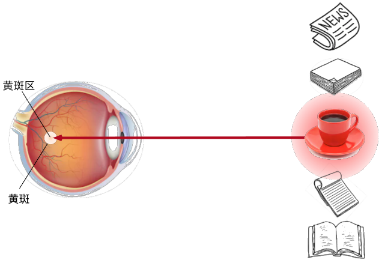
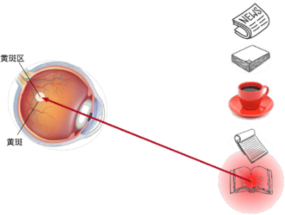
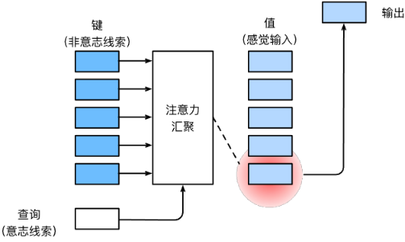
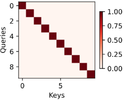
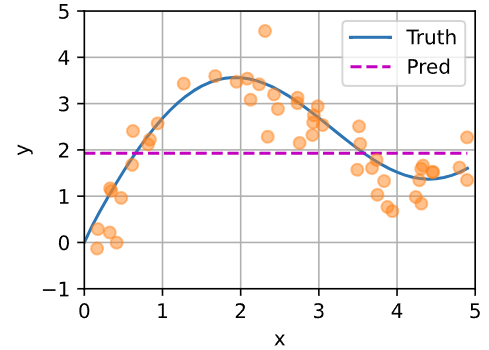
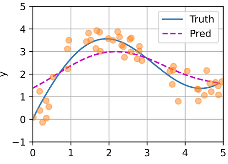
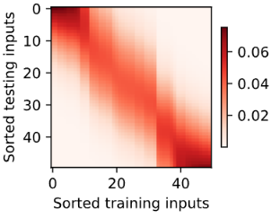
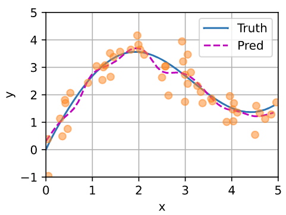
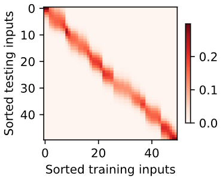

---
categories:
  - AI
  - 机器学习
  - 深度学习
tags:
  - AI
  - 机器学习
  - 深度学习
mathjax: true
title: 注意力机制
abbrlink: 337450599
date: 2024-04-27 23:46:08
---

[TOC]

<!--more-->

## 注意力线索

心理学认为人通过注意力线索和非注意力线索选择注意点





非注意力线索：将输入中最显著的特征抽取出来

注意力线索：受认知和意识的控制，根据注意力线索从输入中抽取出想要获取的特征

### 注意力线索与非注意力线索的表示

若想模拟非注意力线索，可以使用参数化的全连接汇聚层、卷积层，甚至是非参数的最大汇聚层或平均汇聚层

注意力机制考虑注意力线索，query（注意力线索）和key（非注意力线索）之间的交互形成了注意力汇聚

- 注意力线索称为查询（query）
- 每个输入是非注意力线索（key）和相应的值（value）
- 通过注意力汇聚层来有偏好地聚合某些输入的值（value）以生成最终输出



#### 热力图可视化注意力线索

一般使用热力图对相关键的权重进行可视化

```python
import torch
from d2l import torch as d2l

# matrices形状(要显示的行数，要显示的列数，查询的数目，键的数目)
#@save
def show_heatmaps(matrices, xlabel, ylabel, titles=None, figsize=(2.5, 2.5),cmap='Reds'):
    """显示矩阵热图"""
    d2l.use_svg_display()
    num_rows, num_cols = matrices.shape[0], matrices.shape[1]
    fig, axes = d2l.plt.subplots(num_rows, num_cols, figsize=figsize,
                                 sharex=True, sharey=True, squeeze=False)
    for i, (row_axes, row_matrices) in enumerate(zip(axes, matrices)):
        for j, (ax, matrix) in enumerate(zip(row_axes, row_matrices)):
            pcm = ax.imshow(matrix.detach().numpy(), cmap=cmap)
            if i == num_rows - 1:
                ax.set_xlabel(xlabel)
            if j == 0:
                ax.set_ylabel(ylabel)
            if titles:
                ax.set_title(titles[j])
    fig.colorbar(pcm, ax=axes, shrink=0.6);
```

```python
# torch.eye生成对角线全1的单位矩阵
attention_weights = torch.eye(10).reshape((1, 1, 10, 10))
show_heatmaps(attention_weights, xlabel='Keys', ylabel='Queries')
```



### 注意力线索与非注意力线索的实现

#### 数据集

```python
import torch
from torch import nn
from d2l import torch as d2l
```

简单模拟，*输入-输出* 数据集为 $\{(x_1,y_1),(x_2,y_2),\cdots,(x_n,y_n)\}$ ，通过学习 $f$ 来预测任意新查询 $x$ 的输出 $\hat{y}=f(x)$ 
$$
y_i = 2\sin(x_i) + x_i^{0.8} + \epsilon
$$

```python
n_train = 50  # 训练样本数
# 50个(0,5)间的随机数作为训练数据集的 输入
x_train, _ = torch.sort(torch.rand(n_train) * 5)

def f(x):
    return 2 * torch.sin(x) + x**0.8
# 加N(0,0.5)的噪音作为训练数据集的 输出，形状是(1,50)
y_train = f(x_train) + torch.normal(0.0, 0.5, (n_train,))  # 训练样本的输出

# 查询,0到5每隔0.1步长取一个，(1,50)
x_test = torch.arange(0, 5, 0.1)  # 测试样本
# 查询键的真实值(1,50)
y_truth = f(x_test)  # 测试样本的真实输出
n_test = len(x_test)  # 测试样本数 50
```

```python
def plot_kernel_reg(y_hat):
    # 真实曲线与预测曲线
    d2l.plot(x_test, [y_truth, y_hat], 'x', 'y', legend=['Truth', 'Pred'],
             xlim=[0, 5], ylim=[-1, 5])
    # 训练数据集样本点用圆圈表示
    d2l.plt.plot(x_train, y_train, 'o', alpha=0.5);
```

#### 非注意力汇聚的实现

平均汇聚层可以被看做各输入权重相等的加权平均

$$
f(x)=\frac{1}{n}\sum\limits_{i=1}^ny_i
$$

```shell
# torch.repeat_interleave(inputs,n_times)用于对张量中的每个元素进行重复
# in=[1,2],torch.repeat_interleave(in,2)=[1,1,2,2]

# 每个查询都输出训练集的均值
y_hat = torch.repeat_interleave(y_train.mean(), n_test)
plot_kernel_reg(y_hat)
```



#### 非参注意力汇聚实现——Nadaraya-Watson 核回归

根据查询 query 与输入的相对位置，为每个输入的值计算权重，一般写作 $f(x)=\sum\limits_i\alpha(x,x_i)y_i$ ，其中 $\alpha(x,x_i)$ 是注意力权重

- query作为注意力线索，对环境中的非注意力线索(输入键-值对)有偏向性地生成输出

$$
f(x) = \sum_{i=1}^n \frac{K(x - x_i)}{\sum\limits_{j=1}^n K(x - x_j)} y_i
$$

核函数 $K(\cdot)$ 是衡量查询键与被查询键距离的核函数

核函数与核函数和的比值是每个键对查询的重要性权重，所以查询的输出值是对相对重要的值加权求和

- 每个查询对于所有键的注意力权重和为1

**Nadaraya-Watson 高斯核回归** 
$$
K(u) = \frac{1}{\sqrt{2\pi}} \exp(-\frac{u^2}{2}).
$$
将高斯核代入，可得
$$
\begin{aligned} f(x) &=\sum_{i=1}^n \alpha(x, x_i) y_i\\ &= \sum_{i=1}^n \frac{\exp\left(-\frac{1}{2}(x - x_i)^2\right)}{\sum_{j=1}^n \exp\left(-\frac{1}{2}(x - x_j)^2\right)} y_i \\&= \sum_{i=1}^n \mathrm{softmax}\left(-\frac{1}{2}(x - x_i)^2\right) y_i. \end{aligned}
$$

```python
# 对于给定的每个查询，计算与之相近的附近几个点的加权均值，作为该查询的输出

# X_repeat的形状:(n_test,n_train),
# 需要为每个查询与每个键计算一次softmax，一个查询的所有键需要计算n_train次，共有n_test个查询
X_repeat = x_test.repeat_interleave(n_train).reshape((-1, n_train))
# x_train包含着键。attention_weights的形状：(n_test,n_train),
# 每一行都包含着要在给定的每个查询的值（y_train）之间分配的注意力权重
attention_weights = nn.functional.softmax(-(X_repeat - x_train)**2 / 2, dim=1)
# y_hat的每个元素都是值的加权平均值，其中的权重是注意力权重
y_hat = torch.matmul(attention_weights, y_train)
plot_kernel_reg(y_hat)
```



$[0,1]$ 与 $[3,4]$ 之间的数据量少，所以查询的预测输出偏移比较大，在数据密集的区间偏移较小

理论上只要有足够多的数据，就能拟合真实的曲线，但现实上没有充足的数据

非参方法的好处是不需要学习

可观察到：如果一个键 $x_i$ 越接近给定的查询 $x$ ，注意力汇聚层分配给这个键对应值 $y_i$ 的注意力权重越大

```python
# 在计算每个查询时，对训练集中每个key-value对的权重
d2l.show_heatmaps(attention_weights.unsqueeze(0).unsqueeze(0),
                  xlabel='Sorted training inputs',
                  ylabel='Sorted testing inputs')
```



#### 带参数注意力汇聚的实现

注意力汇聚层是根据给定的查询与不同键之间的关系计算得出

- 在训练过程中，输入 $x_i$ 作为查询 $x$ ，其他输入作为键 $\{x_j,j\neq i\}$ ，通过汇聚键相应的值 $\{y_j,j\neq i\}$ 去预测查询的值 $\hat{y}_i$ ，通过最小化损失函数更新预测器 $f$ 的权重集合，使得 $y_i$ 与 $\hat{y}_i$ 的差异最小化
- 在推理过程中，新查询 $x$ 作为输入通过 $f(x)$ 得到其预测输出

在查询 $x$ 和键 $x_i$ 之间的距离乘可学习的参数 $w$ ：
$$
\begin{aligned}f(x) &= \sum_{i=1}^n \alpha(x, x_i) y_i \\&= \sum_{i=1}^n \frac{\exp\left(-\frac{1}{2}((x - x_i)w)^2\right)}{\sum_{j=1}^n \exp\left(-\frac{1}{2}((x - x_j)w)^2\right)} y_i \\&= \sum_{i=1}^n \mathrm{softmax}\left(-\frac{1}{2}((x - x_i)w)^2\right) y_i.\end{aligned}
$$
训练过程，

查询 $query\in \mathbb{R}^{1\times n\_train}$ ，输入的键-值 $K,V\in \mathbb{R}^{n\_train\times (n\_train-1)}$ ，为便于计算，将每个查询复制 $n\_train-1$ 次 变形为 $queries\in \mathbb{R}^{n\_train\times n\_train-1}$ 

参数为 $\mathbf{W}\in \mathbb{R}^{n\_train\times n\_train-1}$

计算注意力得分 $bmm(attention\_weights,V) \in \mathbb{R}^{[n\_train\times 1\times (n\_train-1)]\times [n\_train\times (n\_train-1)\times 1]}=\mathbb{R}^{n\_train\times 1}$ 

```python
# 模型定义
# 参数w控制高斯核窗口大小，是否平滑
class NWKernelRegression(nn.Module):
    def __init__(self, **kwargs):
        super().__init__(**kwargs)
        self.w = nn.Parameter(torch.rand((1,), requires_grad=True))

    def forward(self, queries, keys, values):
        # queries和attention_weights的形状变为(查询个数，“键－值”对个数)
        queries = queries.repeat_interleave(keys.shape[1]).reshape((-1, keys.shape[1]))
        self.attention_weights = nn.functional.softmax(
            -((queries - keys) * self.w)**2 / 2, dim=1)
        # values的形状为(查询个数，“键－值”对个数)
        return torch.bmm(self.attention_weights.unsqueeze(1),
                         values.unsqueeze(-1)).reshape(-1)
```

训练

```python
# 训练数据的处理：每个输入的键作为“查询”，其余输入的键为键，最小化“查询”的预测输出与值间的损失
# torch.repeat(行的重复倍数，列的重复倍数):in=[1,2],in.repeat(2,2)
#  ([[0, 1, 2, 0, 1, 2],
#   [0, 1, 2, 0, 1, 2]])
# X_tile的形状:(n_train，n_train)，
X_tile = x_train.repeat(n_train, 1)
# Y_tile的形状:(n_train，n_train)，
Y_tile = y_train.repeat(n_train, 1)

# 去除对角线元素，即以第i个训练数据输入作为查询时，相应的键为其余n-1个训练数据的输入
# keys的形状:(n_train，n_train-1)
keys = X_tile[(1 - torch.eye(n_train)).type(torch.bool)].reshape((n_train, -1))
# values的形状:(n_train，n_train-1)
values = Y_tile[(1 - torch.eye(n_train)).type(torch.bool)].reshape((n_train, -1))
```

使用平方损失和随机梯度下降，使在训练集上的损失函数减小

```python
net = NWKernelRegression()
loss = nn.MSELoss(reduction='none')
trainer = torch.optim.SGD(net.parameters(), lr=0.5)
animator = d2l.Animator(xlabel='epoch', ylabel='loss', xlim=[1, 5])

for epoch in range(5):
    trainer.zero_grad()
    l = loss(net(x_train, keys, values), y_train)
    l.sum().backward()
    trainer.step()
    print(f'epoch {epoch + 1}, loss {float(l.sum()):.6f}')
    animator.add(epoch + 1, float(l.sum()))
```

在推理过程中

查询是 $n\_test$ 个，输入的键和值都是 $n\_train$ 个，相当于预测每个查询的输出是对训练集中所有输入的加权平均

```python
# keys的形状:(n_test，n_train)，每一行包含着相同的训练输入（例如，相同的键）
keys = x_train.repeat(n_test, 1)
# value的形状:(n_test，n_train)
values = y_train.repeat(n_test, 1)
y_hat = net(x_test, keys, values).unsqueeze(1).detach()
plot_kernel_reg(y_hat)
```




与非参数的注意力汇聚模型相比，带参数的模型加入可学习的参数后，**曲线在注意力权重较大的区域变得更不平滑**

数据比较少时，为了拟合数据，需要比较小的核函数窗口，所以曲线不平滑

好处：拟合效果好

坏处：噪音敏感

W使整个高斯核窗口变窄，测试时，对应的训练样本的权重分配相对集中

如图，在 0，1，2.2，5 附近，数据较少，所以对训练数据分配的权重相对集中

在 $(0,1),(1,2),(2.5,5)$ 区间内，数据较多，所以权重分配比较分散




英文版内容多

