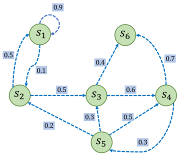
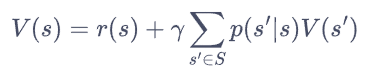
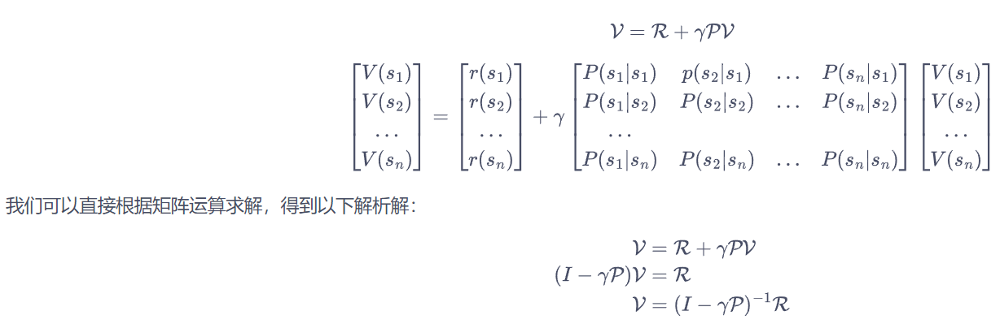
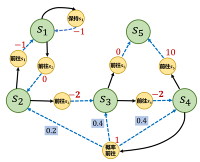
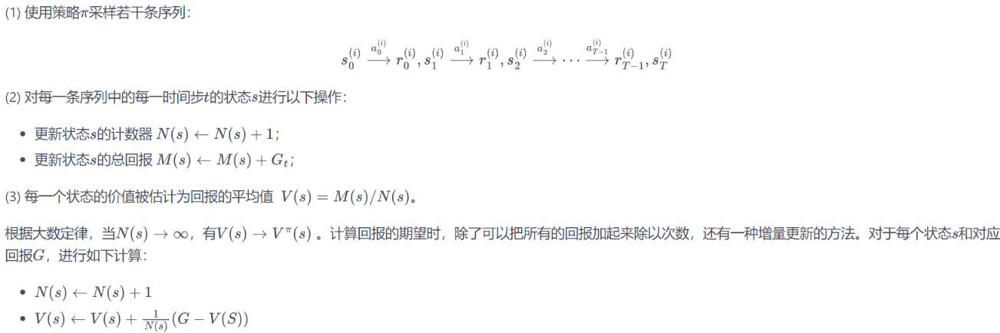

---
categories:
  - AI
  - 机器学习
  - 强化学习
tags:
  - AI
  - 机器学习
  - 强化学习
mathjax: true
title: 多臂老虎机
abbrlink: 4023062712
date: 2024-05-05 10:22:41
---

[TOC]

<!--more-->

## 马尔科夫奖励过程



### 计算每个一条状态的回报

状态转移矩阵 $P[i][j]$ 表示状态 $S_i$ 转移到状态 $S_j$ 的概率

状态奖励 $R[i]$ 表示进入状态 $S_i$ 得到的奖励

$G(S_t)$ 表示当前轨迹下 $S_t$ 的回报

若一条轨迹 $s_1\rightarrow s_2\rightarrow s_3\rightarrow s_6$ ，计算 $s_1$ 的回报 $G_1=-1+0.5\times (-2)+0.5^2\times (-2)=-2.5$ 

```python
import numpy as np
np.random.seed(0)
# 定义状态转移概率矩阵P
P = [
    [0.9, 0.1, 0.0, 0.0, 0.0, 0.0],
    [0.5, 0.0, 0.5, 0.0, 0.0, 0.0],
    [0.0, 0.0, 0.0, 0.6, 0.0, 0.4],
    [0.0, 0.0, 0.0, 0.0, 0.3, 0.7],
    [0.0, 0.2, 0.3, 0.5, 0.0, 0.0],
    [0.0, 0.0, 0.0, 0.0, 0.0, 1.0],
]
P = np.array(P)

rewards = [-1, -2, -2, 10, 1, 0]  # 定义奖励函数
gamma = 0.5  # 定义折扣因子

# 给定一条序列,计算从某个索引（起始状态）开始到序列最后（终止状态）得到的回报
def compute_return(start_index:int, chain:list[int], gamma:float) -> float:
    G = 0
    for i in reversed(range(start_index, len(chain))):
        G = gamma * G + rewards[chain[i] - 1]
    return G

'''
逆序计算的好处，
chain[A,B,C]
reward[a,b,c]
i=0:G=0+reward[c]
i=1:G=reward[c]*gamma+reward[b]
i=2:G=(reward[c]*gamma+reward[b])*gamma+reward[a]
'''

# 一个状态序列,s1-s2-s3-s6
chain = [1, 2, 3, 6]
start_index = 0
G = compute_return(start_index, chain, gamma)
print("根据本序列计算得到回报为：%s。" % G)
# 根据本序列计算得到回报为：-2.5
```

### 计算一个状态的价值的解析解





```python
def compute(P:np.ndarray, rewards:list[float], gamma:float, states_num:int) -> float:
    ''' 利用贝尔曼方程的矩阵形式计算解析解,states_num是MRP的状态数 '''
    rewards = np.array(rewards).reshape((-1, 1))  #将rewards写成列向量形式
    value = np.dot(np.linalg.inv(np.eye(states_num, states_num) - gamma * P),
                   rewards)
    return value

V = compute(P, rewards, gamma, 6)
print("MRP中每个状态价值分别为\n", V)

# MRP中每个状态价值分别为
#  [[-2.01950168]
#  [-2.21451846]
#  [ 1.16142785]
#  [10.53809283]
#  [ 3.58728554]
#  [ 0.        ]]
```

## 马尔科夫决策过程



共5个状态 $\{s_1,s_2,\cdots,s_5\}$ 

每个状态的动作空间用实线表示

- $\mathcal{A}(s_1)$ ：$\{保持s_1,前往s_2\}$ 
- $\mathcal{A}(s_2)$ ：$\{前往s_1,前往s_3\}$
- $\mathcal{A}(s_3)$ ：$\{前往s_4,前往s_5\}$
- $\mathcal{A}(s_4)$ ：$\{概率前往,前往s_5\}$
- $\mathcal{A}(s_5)$ ：$\{\}$

奖励：在确定性环境中，相当于已知奖励函数 $R(s,a)$ ，即 *状态-动作* 对的奖励期望已知

- $R(s_4,概率前往)=1$ ，$R(s_4,前往s_5)=10$ 

策略：

- 随机策略，每个状态下，智能体会以同样的概率选取动作空间中的每个动作
- 一个非随机的策略

上述MDP表示为

```python
S = ["s1", "s2", "s3", "s4", "s5"]  # 状态集合
A = ["保持s1", "前往s1", "前往s2", "前往s3", "前往s4", "前往s5", "概率前往"]  # 动作集合
# 状态转移函数
P = {
    "s1-保持s1-s1": 1.0,
    "s1-前往s2-s2": 1.0,
    "s2-前往s1-s1": 1.0,
    "s2-前往s3-s3": 1.0,
    "s3-前往s4-s4": 1.0,
    "s3-前往s5-s5": 1.0,
    "s4-前往s5-s5": 1.0,
    "s4-概率前往-s2": 0.2,
    "s4-概率前往-s3": 0.4,
    "s4-概率前往-s4": 0.4,
}
# 奖励函数
R = {
    "s1-保持s1": -1,
    "s1-前往s2": 0,
    "s2-前往s1": -1,
    "s2-前往s3": -2,
    "s3-前往s4": -2,
    "s3-前往s5": 0,
    "s4-前往s5": 10,
    "s4-概率前往": 1,
}
gamma = 0.5  # 折扣因子
MDP = (S, A, P, R, gamma)

# 策略1,随机策略
Pi_1 = {
    "s1-保持s1": 0.5,
    "s1-前往s2": 0.5,
    "s2-前往s1": 0.5,
    "s2-前往s3": 0.5,
    "s3-前往s4": 0.5,
    "s3-前往s5": 0.5,
    "s4-前往s5": 0.5,
    "s4-概率前往": 0.5,
}
# 策略2
Pi_2 = {
    "s1-保持s1": 0.6,
    "s1-前往s2": 0.4,
    "s2-前往s1": 0.3,
    "s2-前往s3": 0.7,
    "s3-前往s4": 0.5,
    "s3-前往s5": 0.5,
    "s4-前往s5": 0.1,
    "s4-概率前往": 0.9,
}

# 把输入的两个字符串通过“-”连接,便于使用上述定义的P、R变量
def join(str1, str2):
    return str1 + '-' + str2
```

### 解析解——MDP转化为MRP计算策略的状态价值函数

根据策略对所有动作的奖励 $r(s,a)$ 进行加权，得到的奖励和 $r'(s)$ 就是一个MRP在该状态下的奖励
$$
r'(s)=\sum\limits_{a\in \mathcal{A}(s)}\pi(a\vert s)r(s,a)
$$
根据策略计算状态转移 $P(s'\vert s,a)$ 的加权和，得到MRP的状态转移 $P(s'\vert s)$
$$
P'(s'\vert s)=\sum\limits_{a\in \mathcal{A}(s)}\pi(a\vert s)P(s'\vert s,a)
$$
相当于构建MRP：$<\mathcal{S},\mathcal{R'},\mathcal{P}',\gamma>$ ，调用MRP解析解计算函数 `compute()` 得到状态价值的解析解

```python
gamma = 0.5
# 转化后的MRP的状态转移矩阵（Pi_1）
P_from_mdp_to_mrp = [
    [0.5, 0.5, 0.0, 0.0, 0.0],
    [0.5, 0.0, 0.5, 0.0, 0.0],
    [0.0, 0.0, 0.0, 0.5, 0.5],
    [0.0, 0.1, 0.2, 0.2, 0.5],
    [0.0, 0.0, 0.0, 0.0, 1.0],
]
P_from_mdp_to_mrp = np.array(P_from_mdp_to_mrp)
R_from_mdp_to_mrp = [-0.5, -1.5, -1.0, 5.5, 0]

V = compute(P_from_mdp_to_mrp, R_from_mdp_to_mrp, gamma, 5)
print("MDP中每个状态价值分别为\n", V)

# MDP中每个状态价值分别为
#  [[-1.22555411]
#  [-1.67666232]
#  [ 0.51890482]
#  [ 6.0756193 ]
#  [ 0.        ]]
```

在得到状态价值的解析解后，可利用 $Q=f(V)$ 计算动作价值
$$
Q_\pi(s,a)=R(s,a)+\gamma \sum\limits_{s’}V_{\pi}(s’)P(s’\vert s,a)
$$

### MC方法计算状态价值

重复随机采样，用经验均值代替期望

预测问题：用策略 $\pi$ 在MDP上采样很多条序列，计算从这个状态出发的回报的期望
$$
V_{\pi}(s)=E_{\pi}[G_t\vert S_t=s]\approx \frac{1}{N}\sum\limits_{i=1}^NG_t^{(i)}
$$

一条轨迹同一状态多次出现的2中处理方式

- 每出现一次，就以出现时刻为起点计算一次回报，相当于一条轨迹可能得到同一状态的多个回报
- 只计算第一次出现后续的回报，相当于一条轨迹只能得到一个状态的一个回报



#### 对轨迹采样

```python
np.random.seed(0)
def sample(MDP:tuple, Pi:dict, timestep_max:int, number:int) -> list[list]:
    ''' 采样函数,策略Pi,限制最长时间步timestep_max,总共采样序列数number，返回含多条轨迹数的回合集'''
    S, A, P, R, gamma = MDP
    episodes = []
    for _ in range(number):
        episode = []
        timestep = 0
        # 随机选择一个初始状态
        s = S[np.random.randint(4)]  # 随机选择一个除s5以外的状态s作为起点
        # 当前状态为终止状态或者时间步太长时,一次采样结束
        while s != "s5" and timestep <= timestep_max:
            timestep += 1
            
            '''一次决策过程
            选择一个
            '''
            rand, temp = np.random.rand(), 0
            # 在状态s下根据策略选择动作
            for a_opt in A:
                # 在状态s下选择哪个动作与rand有关，在本例中s1有两个动作a1,a2
                #  rand>0.5，则选择a2；若rand<0.5，则选择a1。选择使概率累加大于rand的最后一个动作
                temp += Pi.get(join(s, a_opt), 0)
                
                if temp > rand:
                    a = a_opt
                    r = R.get(join(s, a), 0)
                    break
            rand, temp = np.random.rand(), 0
            # 根据选择的动作，随机转移到下一个状态s_next
            for s_opt in S:
                temp += P.get(join(join(s, a), s_opt), 0)
                if temp > rand:
                    s_next = s_opt
                    break
            episode.append((s, a, r, s_next))  # 把（s,a,r,s_next）元组放入序列中
            s = s_next  # s_next变成当前状态,开始接下来的循环
        episodes.append(episode)
    return episodes


# 采样5次,每个序列最长不超过20步
episodes = sample(MDP, Pi_1, 20, 5)
print('第一条序列\n', episodes[0])
print('第二条序列\n', episodes[1])
print('第五条序列\n', episodes[4])

# 第一条序列
#  [('s1', '前往s2', 0, 's2'), ('s2', '前往s3', -2, 's3'), ('s3', '前往s5', 0, 's5')]
# 第二条序列
#  [('s4', '概率前往', 1, 's4'), ('s4', '前往s5', 10, 's5')]
# 第五条序列
#  [('s2', '前往s3', -2, 's3'), ('s3', '前往s4', -2, 's4'), ('s4', '前往s5', 10, 's5')]
```

#### 计算轨迹回报的经验均值

```python
# 对所有采样序列计算所有状态的价值
def MC(episodes:list[list], V:dict, N:dict, gamma:float):
    for episode in episodes:
        G = 0
        # 逐时间步前移
        for i in range(len(episode) - 1, -1, -1):  #一个序列从后往前计算
            (s, a, r, s_next) = episode[i]
            G = r + gamma * G
            N[s] = N[s] + 1
            V[s] = V[s] + (G - V[s]) / N[s]

# 时间步长为20，即回合长度最长为20
timestep_max = 20
# 采样1000次,可以自行修改
episodes = sample(MDP, Pi_1, timestep_max, 1000)
gamma = 0.5
V = {"s1": 0, "s2": 0, "s3": 0, "s4": 0, "s5": 0}
N = {"s1": 0, "s2": 0, "s3": 0, "s4": 0, "s5": 0}
MC(episodes, V, N, gamma)
print("使用蒙特卡洛方法计算MDP的状态价值为\n", V)

#使用蒙特卡洛方法计算MDP的状态价值为
# {'s1': -1.2254234006614309, 's2': -1.7042513371323482, 's3': 0.48272652589073434, 's4': 6.039905742723115, 's5': 0}
```

可以看到用蒙特卡洛方法估计得到的状态价值和我们用 MRP 解析解得到的状态价值是很接近的

## 占用度量判断策略差异

不同策略的价值函数不同，因为对于同一个MDP $<\mathcal{S},\mathcal{A},\mathcal{P},\mathcal{R},\gamma>$ ，不同策略访问到的 *状态-动作* 对的占用度量是不同的

占用度量是衡量一个 *状态-动作* 对在策略的数据分布中所占的比重

智能体分别以策略 $\pi_1$ 和 $\pi_2$ 与同一MDP进行交互，分别得到其占用度量
$$
\rho_{\pi_1}(s,a)=\rho_{\pi_2}(s,a)\iff \pi_1(a\vert s)=\pi_2(a\vert s)
$$
给定一个占用度量 $\rho(s,a)$ ，则生成该占用度量的唯一策略是
$$
\pi_{\rho}=\frac{\rho(s,a)}{\sum\limits_{a'\in \mathcal{A}(s)}\rho(s,a')}
$$
也就是说，一个策略由一个占用度量唯一标识

```python
def occupancy(episodes:list[list], s:str, a:str, timestep_max:int, gamma:float) -> float:
    ''' 计算状态动作对（s,a）出现的频率,以此来估算策略的占用度量 '''
    rho = 0
    total_times = np.zeros(timestep_max)  # 记录每个时间步t各被经历过几次
    occur_times = np.zeros(timestep_max)  # 记录(s_t,a_t)==(s,a)的次数
    for episode in episodes:
        for i in range(len(episode)):
            (s_opt, a_opt, r, s_next) = episode[i]
            total_times[i] += 1
            if s == s_opt and a == a_opt:
                occur_times[i] += 1
    for i in reversed(range(timestep_max)):
        if total_times[i]:
            rho += gamma**i * occur_times[i] / total_times[i]   # 采用近似估计
    return (1 - gamma) * rho


gamma = 0.5
timestep_max = 1000

episodes_1 = sample(MDP, Pi_1, timestep_max, 1000)
episodes_2 = sample(MDP, Pi_2, timestep_max, 1000)
rho_1 = occupancy(episodes_1, "s4", "概率前往", timestep_max, gamma)
rho_2 = occupancy(episodes_2, "s4", "概率前往", timestep_max, gamma)
print(rho_1, rho_2)
```

