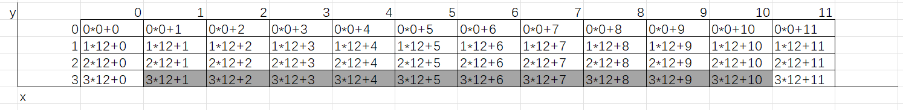
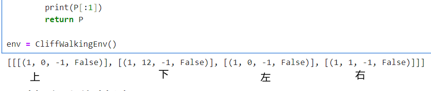
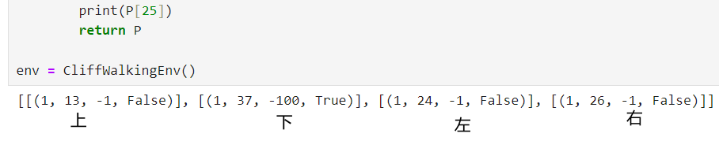
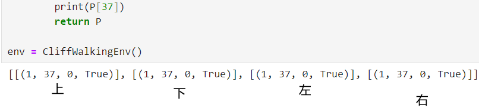
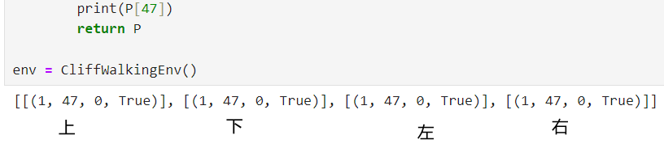
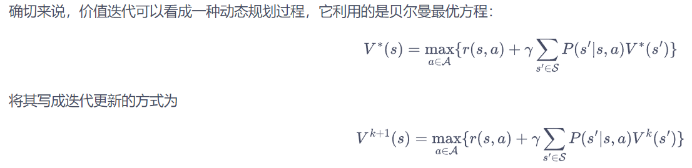
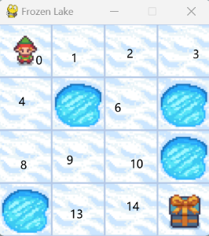
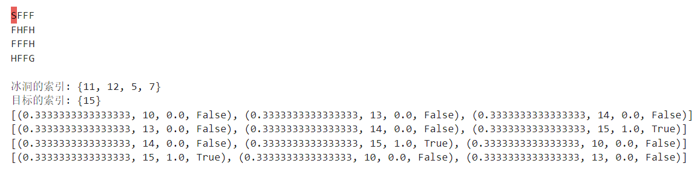
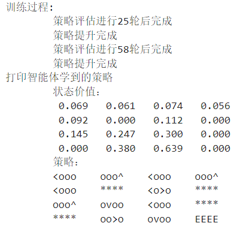

---
categories:
  - AI
  - 机器学习
  - 强化学习
tags:
  - AI
  - 机器学习
  - 强化学习
mathjax: true
title: DP算法
abbrlink: 3976404923
date: 2024-05-06 09:31:22
---

[TOC]

<!--more-->

## 悬崖漫步环境

目标：从起点到终点的最短路径

状态：共 $4\times 12$ 个状态网格，$(i*ncols+j)$ 表示状态第 $i$ 行 $j$ 列



动作：上下左右，当前状态 $(i,j)$

- $(i-1,j+0)$ 表示向上；$(i+1,j+0)$ 表示向上；$(i+0,j-1)$ 表示向左；$(i+0,j+1)$ 表示向右

状态转移与奖励：如果智能体采取动作后触碰到边界墙壁则状态不发生改变，掉入悬崖或者达到目标状态是终止状态；智能体每走一步的奖励是 −1，掉入悬崖的奖励是 −100

由于有48个状态，且每个状态有四个动作，所以状态转移函数为 $48\times 4$ 个离散值

如：

- 在状态 $0*0+0$ ，采取向左和向上动作，都会回到原状态，且奖励 $-1$ ，并不是终止状态；采取向右的动作，下一个状态是 $0*0+1$ ，且奖励 $-1$ ，并不是终止状态；采取向下的动作，下一个状态是 $0*12+0$ ，且奖励 $-1$ ，并不是终止状态。上述状态转移的概率都是1。即

  

- 在状态 $2*12+1$ 

  

- 在状态 $3*12+1$ ，因为是终止状态，不管采取什么动作，奖励都是0

  

  终止状态 $4*12+11$ 同理

  

```python
import copy

class CliffWalkingEnv:
    """ 悬崖漫步环境"""
    def __init__(self, ncol:int=12, nrow:int=4):
        self.ncol = ncol  # 定义网格世界的列
        self.nrow = nrow  # 定义网格世界的行
        # 转移矩阵P[state][action] = [(p, next_state, reward, done)]包含下一个状态和奖励
        self.P = self.createP()

    def createP(self) -> list:
        # 初始化
        # P(48,4)
        P = [[[] for j in range(4)] for i in range(self.nrow * self.ncol)]
        
        # 4种动作, change[0]:上,change[1]:下, change[2]:左, change[3]:右。
        change = [[0, -1], [0, 1], [-1, 0], [1, 0]]
        for i in range(self.nrow):
            for j in range(self.ncol):
                for a in range(4):
                    # 位置在悬崖或者目标状态,因为无法继续交互,任何动作奖励都为0
                    if i == self.nrow - 1 and j > 0:
                        P[i * self.ncol + j][a] = [(1, i * self.ncol + j, 0, True)]
                        continue
                    # 其他位置
                    next_x = min(self.ncol - 1, max(0, j + change[a][0]))
                    next_y = min(self.nrow - 1, max(0, i + change[a][1]))
                    next_state = next_y * self.ncol + next_x
                    reward = -1
                    done = False
                    # 下一个位置在悬崖或者终点
                    if next_y == self.nrow - 1 and next_x > 0:
                        done = True
                        if next_x != self.ncol - 1:  # 下一个位置在悬崖
                            reward = -100
                    P[i * self.ncol + j][a] = [(1, next_state, reward, done)]
        return P
```

```python
def print_agent(agent:PolicyIteration, action_meaning:list[str], disaster:list=[], end:list =[]):
    '''
    agent:为智能体，包含对环境的理解、策略、当前策略下的状态价值
    action_meaning:对每个状态动作的解释
    disaster:不可达区域
    end:目标状态
    '''
    print("\t状态价值：")
    for i in range(agent.env.nrow):
        for j in range(agent.env.ncol):
            # 为了输出美观,保持输出6个字符
            print('\t%6.6s' % ('%.3f' % agent.v[i * agent.env.ncol + j]), end=' ')
        print()

    print("\t策略：")
    for i in range(agent.env.nrow):
        for j in range(agent.env.ncol):
            # 一些特殊的状态,例如悬崖漫步中的悬崖
            if (i * agent.env.ncol + j) in disaster:
                print('\t****', end=' ')
            elif (i * agent.env.ncol + j) in end:  # 目标状态
                print('\tEEEE', end=' ')
            else:
                a = agent.pi[i * agent.env.ncol + j]
                pi_str = '\t'
                for k in range(len(action_meaning)):
                    # 若某动作概率为0，则用o占位，只要有可能取到该动作，则打印该策略
                    pi_str += action_meaning[k] if a[k] > 0 else 'o'
                print(pi_str, end=' ')
        print()
```

### 策略迭代

$$
\begin{array}{ll}
\hline
&初始化:动态特性与状态转移P(r\vert s,a)与P(s'\vert s,a)，随机初始化\pi^{(0)}\\
&目标：寻找最优状态价值与最优策略\\
&当策略未收敛，第t轮迭代\\
&\quad 策略评估:\\
&\qquad 当\mathbf{V}_{\pi^{(t)}} 未收敛，进行第j+1轮迭代(j=0,1,\cdots)：\\
&\quad\qquad 对每个状态 s\in\mathcal{S}:\\
&\qquad\qquad 对该状态下所有动作 a\in \mathcal{A}(s):\\
&\qquad \qquad \quad Q^{(j)}_{\pi^{(t)}}(s,a)=R(s,a)+\gamma \sum\limits_{s'\in S}P(s'\vert s,a)\cdot V^{(j)}_{\pi^{(t)}}(s)\\
&\qquad\qquad \mathbf{V}_{\pi^{(t)}}^{(j+1)}(s)=\sum\limits_{a\in A}\pi^{(t)}(a\vert s)Q^{(j)}_{\pi^{(t)}}(s,a)\\
&\qquad \qquad记录 \Delta(s)=V_{\pi^{(t)}}^{(j+1)}(s)-V_{\pi^{(t)}}^{(j)}(s) \\
&\qquad\quad 若\max{\Delta(s)}\le \theta，认为状态价值收敛，策略评估停止 \\
&\quad 策略改进:\\
&\qquad 对于每个状态s\in \mathcal{S}:\\
&\qquad \quad 对于每个动作 a\in \mathcal{A}(s):\\
&\qquad \qquad Q_{\pi^{(t)}}(s,a)=\sum\limits_{r'}P(r'\vert s,a)r'+\gamma \sum\limits_{s'}P(s'\vert s,a)V_{\pi^{(t)}}(s')\\
&\qquad \quad a^*_{\pi^{(t)}(s)}=\mathop{\mathrm{argmax}}\limits_{a}Q_{\pi^{(t)}}(s,a)\\
&\quad \qquad 令\sum\pi^{(t+1)}(a^*_{\pi^{(t)}(s)}\vert s)=1，其他\pi^{(t+1)}(a\vert s)=0\\
&\quad若策略 \pi^{(t+1)}=\pi^{(t)}，则认为策略收敛。否则认为策略未收敛\\
\hline
\end{array}
$$

```python
class PolicyIteration:
    """ 策略迭代算法 """
    def __init__(self, env:CliffWalkingEnv, theta:float, gamma:float):
        self.env = env
        # 48个状态，初始状态价值为0
        self.v = [0] * self.env.ncol * self.env.nrow
        # 48个状态，每个状态有4种可能决策，
        #     所以初始策略为每个状态下产生每个决策的概率都相等的均匀随机策略
        self.pi = [[0.25, 0.25, 0.25, 0.25]
                   for i in range(self.env.ncol * self.env.nrow)]  
        # 策略评估收敛阈值，迭代前后状态价值的最大差异小于阈值，则认为状态价值收敛，策略评估完成
        self.theta = theta  # 策略评估收敛阈值
        self.gamma = gamma  # 折扣因子

    def policy_evaluation(self):  # 策略评估
        cnt = 1  # 计数器
        while 1:
            max_diff = 0
            new_v = [0] * self.env.ncol * self.env.nrow
            for s in range(self.env.ncol * self.env.nrow):
                qsa_list = []  # 开始计算状态s下的所有Q(s,a)价值
                for a in range(4):
                    # 计算状态s的一个动作价值
                    qsa = 0
                    for res in self.env.P[s][a]:
                        p, next_state, r, done = res
                        # 需要注意判断下一状态是否为终止状态，若是终止状态则不计算价值
                        qsa += p * (r + self.gamma * self.v[next_state] * (1 - done))
                        # 本章环境比较特殊,奖励和下一个状态有关,所以需要和状态转移概率相乘
                    qsa_list.append(qsa)
                # 每个状态的价值为该状态下所有动作价值的加权和
                new_v[s] = sum(pi_s_a * q_s_a for pi_s_a, q_s_a in zip(self.pi[s], qsa_list))  # 状态价值函数和动作价值函数之间的关系
#                     qsa_list.append(self.pi[s][a] * qsa)
#                 new_v[s] = sum(qsa_list)  # 状态价值函数和动作价值函数之间的关系
                max_diff = max(max_diff, abs(new_v[s] - self.v[s]))
            self.v = new_v
            if max_diff < self.theta: break  # 满足收敛条件,退出评估迭代
            cnt += 1
        print("\t策略评估进行%d轮后完成" % cnt)

    def policy_improvement(self) -> list:  # 策略提升
        for s in range(self.env.nrow * self.env.ncol):
            qsa_list = []
            for a in range(4):
                qsa = 0
                
                for res in self.env.P[s][a]:
                    p, next_state, r, done = res
                    qsa += p * (r + self.gamma * self.v[next_state] * (1 - done))
                qsa_list.append(qsa)
            # 获取当前状态下的最大动作价值
            maxq = max(qsa_list)
            cntq = qsa_list.count(maxq)  # 计算有几个动作得到了最大的Q值
            # 当前状态下，非最大动作价值的动作概率为0，最大动作价值的动作概率均等
            self.pi[s] = [1 / cntq if q == maxq else 0 for q in qsa_list]
        print("\t策略提升完成")
        return self.pi

    def policy_iteration(self):  # 策略迭代
        while 1:
            self.policy_evaluation()
            old_pi = copy.deepcopy(self.pi)  # 将列表进行深拷贝,方便接下来进行比较
            new_pi = self.policy_improvement()
            print_agent(self, ['^', 'v', '<', '>'], list(range(37, 47)), [47])
            print('\t-----------------------------------------------------------------------------------------------------')

            if old_pi == new_pi: break
```

```python
env = CliffWalkingEnv()
action_meaning = ['^', 'v', '<', '>']
theta = 0.001
gamma = 0.9
agent = PolicyIteration(env, theta, gamma)
print("训练过程:")
agent.policy_iteration()
print("打印智能体学到的策略")
print_agent(agent, action_meaning, list(range(37, 47)), [47])
```

```
训练过程:
	对智能体的初始化:
	状态价值：
	 0.000 	 0.000 	 0.000 	 0.000 	 0.000 	 0.000 	 0.000 	 0.000 	 0.000 	 0.000 	 0.000 	 0.000 
	 0.000 	 0.000 	 0.000 	 0.000 	 0.000 	 0.000 	 0.000 	 0.000 	 0.000 	 0.000 	 0.000 	 0.000 
	 0.000 	 0.000 	 0.000 	 0.000 	 0.000 	 0.000 	 0.000 	 0.000 	 0.000 	 0.000 	 0.000 	 0.000 
	 0.000 	 0.000 	 0.000 	 0.000 	 0.000 	 0.000 	 0.000 	 0.000 	 0.000 	 0.000 	 0.000 	 0.000 
	策略：
	^v<> 	^v<> 	^v<> 	^v<> 	^v<> 	^v<> 	^v<> 	^v<> 	^v<> 	^v<> 	^v<> 	^v<> 
	^v<> 	^v<> 	^v<> 	^v<> 	^v<> 	^v<> 	^v<> 	^v<> 	^v<> 	^v<> 	^v<> 	^v<> 
	^v<> 	^v<> 	^v<> 	^v<> 	^v<> 	^v<> 	^v<> 	^v<> 	^v<> 	^v<> 	^v<> 	^v<> 
	^v<> 	**** 	**** 	**** 	**** 	**** 	**** 	**** 	**** 	**** 	**** 	EEEE 
	-----------------------------------------------------------------------------------------------------
	策略评估进行60轮后完成
	策略提升完成
	状态价值：
	-27.23 	-28.51 	-29.62 	-30.30 	-30.63 	-30.71 	-30.57 	-30.14 	-29.22 	-27.47 	-24.65 	-21.45 
	-33.63 	-36.89 	-38.79 	-39.68 	-40.04 	-40.13 	-40.01 	-39.59 	-38.59 	-36.33 	-31.53 	-23.34 
	-47.27 	-58.58 	-61.78 	-62.77 	-63.10 	-63.17 	-63.09 	-62.79 	-61.93 	-59.42 	-51.38 	-22.98 
	-66.15 	 0.000 	 0.000 	 0.000 	 0.000 	 0.000 	 0.000 	 0.000 	 0.000 	 0.000 	 0.000 	 0.000 
	策略：
	^o<o 	oo<o 	oo<o 	oo<o 	oo<o 	ooo> 	ooo> 	ooo> 	ooo> 	ooo> 	ooo> 	^oo> 
	^ooo 	^ooo 	^ooo 	^ooo 	^ooo 	^ooo 	^ooo 	^ooo 	^ooo 	^ooo 	ooo> 	^ooo 
	^ooo 	^ooo 	^ooo 	^ooo 	^ooo 	^ooo 	^ooo 	^ooo 	^ooo 	^ooo 	ooo> 	ovoo 
	^ooo 	**** 	**** 	**** 	**** 	**** 	**** 	**** 	**** 	**** 	**** 	EEEE 
	-----------------------------------------------------------------------------------------------------
	策略评估进行72轮后完成
	策略提升完成
	状态价值：
	-10.00 	-10.00 	-10.00 	-10.00 	-10.00 	-10.00 	-10.00 	-10.00 	-10.00 	-10.00 	-10.00 	-10.00 
	-10.00 	-10.00 	-10.00 	-10.00 	-10.00 	-10.00 	-10.00 	-10.00 	-10.00 	-10.00 	-10.00 	-10.00 
	-10.00 	-10.00 	-10.00 	-10.00 	-10.00 	-10.00 	-10.00 	-10.00 	-10.00 	-10.00 	-1.900 	-1.000 
	-10.00 	 0.000 	 0.000 	 0.000 	 0.000 	 0.000 	 0.000 	 0.000 	 0.000 	 0.000 	 0.000 	 0.000 
	策略：
	^v<> 	^v<> 	^v<> 	^v<> 	ooo> 	^vo> 	^v<> 	^v<> 	^v<> 	^v<> 	^v<> 	^v<> 
	^v<> 	^v<> 	^v<> 	^v<> 	ooo> 	^vo> 	^v<> 	^v<> 	^v<> 	^v<> 	ovoo 	ovoo 
	^v<> 	^o<> 	^o<> 	^o<> 	ooo> 	^oo> 	^o<> 	^o<> 	^o<> 	ooo> 	ooo> 	ovoo 
	^v<o 	**** 	**** 	**** 	**** 	**** 	**** 	**** 	**** 	**** 	**** 	EEEE 
	-----------------------------------------------------------------------------------------------------
	策略评估进行44轮后完成
	策略提升完成
	状态价值：
	-9.934 	-9.902 	-9.826 	-9.678 	-9.405 	-9.338 	-9.168 	-8.718 	-7.913 	-6.729 	-5.429 	-4.817 
	-9.934 	-9.898 	-9.816 	-9.657 	-9.357 	-9.285 	-9.075 	-8.499 	-7.363 	-5.390 	-2.710 	-1.900 
	-9.937 	-9.891 	-9.800 	-9.622 	-9.280 	-9.200 	-8.935 	-8.173 	-6.474 	-2.710 	-1.900 	-1.000 
	-9.954 	 0.000 	 0.000 	 0.000 	 0.000 	 0.000 	 0.000 	 0.000 	 0.000 	 0.000 	 0.000 	 0.000 
	策略：
	ooo> 	ooo> 	ooo> 	ooo> 	ooo> 	ooo> 	ooo> 	ooo> 	ooo> 	ovoo 	ovoo 	ovoo 
	ooo> 	ooo> 	ooo> 	ooo> 	ovoo 	ooo> 	ooo> 	ooo> 	ooo> 	ovo> 	ovo> 	ovoo 
	ooo> 	ooo> 	ooo> 	ooo> 	ooo> 	ooo> 	ooo> 	ooo> 	ooo> 	ooo> 	ooo> 	ovoo 
	^ooo 	**** 	**** 	**** 	**** 	**** 	**** 	**** 	**** 	**** 	**** 	EEEE 
	-----------------------------------------------------------------------------------------------------
	策略评估进行12轮后完成
	策略提升完成
	状态价值：
	-7.712 	-7.458 	-7.176 	-6.862 	-6.513 	-6.126 	-5.695 	-5.217 	-4.686 	-4.095 	-3.439 	-2.710 
	-7.458 	-7.176 	-6.862 	-6.513 	-6.126 	-5.695 	-5.217 	-4.686 	-4.095 	-3.439 	-2.710 	-1.900 
	-7.176 	-6.862 	-6.513 	-6.126 	-5.695 	-5.217 	-4.686 	-4.095 	-3.439 	-2.710 	-1.900 	-1.000 
	-7.458 	 0.000 	 0.000 	 0.000 	 0.000 	 0.000 	 0.000 	 0.000 	 0.000 	 0.000 	 0.000 	 0.000 
	策略：
	ovo> 	ovo> 	ovo> 	ovo> 	ovo> 	ovo> 	ovo> 	ovo> 	ovo> 	ovo> 	ovo> 	ovoo 
	ovo> 	ovo> 	ovo> 	ovo> 	ovo> 	ovo> 	ovo> 	ovo> 	ovo> 	ovo> 	ovo> 	ovoo 
	ooo> 	ooo> 	ooo> 	ooo> 	ooo> 	ooo> 	ooo> 	ooo> 	ooo> 	ooo> 	ooo> 	ovoo 
	^ooo 	**** 	**** 	**** 	**** 	**** 	**** 	**** 	**** 	**** 	**** 	EEEE 
	-----------------------------------------------------------------------------------------------------
	策略评估进行1轮后完成
	策略提升完成
	状态价值：
	-7.712 	-7.458 	-7.176 	-6.862 	-6.513 	-6.126 	-5.695 	-5.217 	-4.686 	-4.095 	-3.439 	-2.710 
	-7.458 	-7.176 	-6.862 	-6.513 	-6.126 	-5.695 	-5.217 	-4.686 	-4.095 	-3.439 	-2.710 	-1.900 
	-7.176 	-6.862 	-6.513 	-6.126 	-5.695 	-5.217 	-4.686 	-4.095 	-3.439 	-2.710 	-1.900 	-1.000 
	-7.458 	 0.000 	 0.000 	 0.000 	 0.000 	 0.000 	 0.000 	 0.000 	 0.000 	 0.000 	 0.000 	 0.000 
	策略：
	ovo> 	ovo> 	ovo> 	ovo> 	ovo> 	ovo> 	ovo> 	ovo> 	ovo> 	ovo> 	ovo> 	ovoo 
	ovo> 	ovo> 	ovo> 	ovo> 	ovo> 	ovo> 	ovo> 	ovo> 	ovo> 	ovo> 	ovo> 	ovoo 
	ooo> 	ooo> 	ooo> 	ooo> 	ooo> 	ooo> 	ooo> 	ooo> 	ooo> 	ooo> 	ooo> 	ovoo 
	^ooo 	**** 	**** 	**** 	**** 	**** 	**** 	**** 	**** 	**** 	**** 	EEEE 
	-----------------------------------------------------------------------------------------------------
打印智能体学到的策略
	状态价值：
	-7.712 	-7.458 	-7.176 	-6.862 	-6.513 	-6.126 	-5.695 	-5.217 	-4.686 	-4.095 	-3.439 	-2.710 
	-7.458 	-7.176 	-6.862 	-6.513 	-6.126 	-5.695 	-5.217 	-4.686 	-4.095 	-3.439 	-2.710 	-1.900 
	-7.176 	-6.862 	-6.513 	-6.126 	-5.695 	-5.217 	-4.686 	-4.095 	-3.439 	-2.710 	-1.900 	-1.000 
	-7.458 	 0.000 	 0.000 	 0.000 	 0.000 	 0.000 	 0.000 	 0.000 	 0.000 	 0.000 	 0.000 	 0.000 
	策略：
	ovo> 	ovo> 	ovo> 	ovo> 	ovo> 	ovo> 	ovo> 	ovo> 	ovo> 	ovo> 	ovo> 	ovoo 
	ovo> 	ovo> 	ovo> 	ovo> 	ovo> 	ovo> 	ovo> 	ovo> 	ovo> 	ovo> 	ovo> 	ovoo 
	ooo> 	ooo> 	ooo> 	ooo> 	ooo> 	ooo> 	ooo> 	ooo> 	ooo> 	ooo> 	ooo> 	ovoo 
	^ooo 	**** 	**** 	**** 	**** 	**** 	**** 	**** 	**** 	**** 	**** 	EEEE
```

可以发现，整个强化过程，价值函数及策略都是从目标状态附近的状态开始收敛的，随着策略评估与策略改进的迭代，不断向初始状态 “扩散”

同时，策略迭代算法中，策略更新了5轮就找到最优策略

### 价值迭代



等到 $V^{(k+1)}=V^{(k)}$ 时，就是贝尔曼最优方程的不动点，对应的是最优状态价值 $V^*$ 

#### 迭代算法

$$
V^{(0)}(s),V^{(t)}(s)\rightarrow Q^{(t)}(s,a)\rightarrow V^{(t+1)}=\max\limits_{a}Q^{(t)}(s,a)
$$

初始化：已知 $P(r\vert s,a)$ 和 $P(s'\vert s,a)$，令 $t=0$ ，对所有状态 $s$ ，$V^{(0)}(s)=0$ 

1. 在所有状态价值的第 $t$ 轮更新中：

   1. 根据贝尔曼期望方程，计算状态 $s$ 所有动作的 $Q^{(t)}(s,a_i)$ 表
      $$
      Q^{(t)}(s,a)=R(s,a)+\gamma \sum\limits_{s'\in S}P(s'\vert s,a)\cdot V^{(t)}(s'),\forall a\in \mathcal{A}(s)\\
      $$

   2. 更新状态 $s$ 的状态价值
      $$
      V^{(t+1)}(s)=\max\limits_{a\in \mathcal{A}(s)}Q^{(t)}(a,s)
      $$
      记录 $\Delta(s)=V^{(t+1)}(s)-V^{(t)}(s)$ 

   3. 由1,2 更新与状态 $s$ 相邻的状态价值 $V^{(t+1)}(s^-)$ ，其中 $P(s\vert s^-,a)\neq 0,a\in \mathcal{A}(s^{-})$  

2. 若 $\max(\Delta(s))\le \theta$ ，认为达到最优状态价值，停止价值迭代，并求解最优策略

   否则，令 $t\leftarrow t+1$ ，继续价值迭代

在价值迭代收敛后提取最优策略，$H$ 是让 $V(s)$ 收敛所需的迭代次数
$$
\pi^*(s)=\mathop{\mathrm{argmax}}_a\left[R(s,a)+\gamma\sum\limits_{s'\in S}P(s'\vert s,a)V^{(H+1)}(s')\right]
$$

核心是状态价值的更新，**相当于迭代求解贝尔曼最优方程**

```python
class ValueIteration:
    """ 价值迭代算法 """
    def __init__(self, env:CliffWalkingEnv, theta:float, gamma:float):
        self.env = env
        self.v = [0] * self.env.ncol * self.env.nrow  # 初始化价值为0
        self.theta = theta  # 价值收敛阈值
        self.gamma = gamma
        # 价值迭代结束后得到的策略
        self.pi = [None for i in range(self.env.ncol * self.env.nrow)]

    def value_iteration(self):
        cnt = 0
        while 1:
            max_diff = 0
            new_v = [0] * self.env.ncol * self.env.nrow
            for s in range(self.env.ncol * self.env.nrow):
                qsa_list = []  # 开始计算状态s下的所有Q(s,a)价值
                for a in range(4):
                    qsa = 0
                    for res in self.env.P[s][a]:
                        p, next_state, r, done = res
                        qsa += p * (r + self.gamma * self.v[next_state] * (1 - done))
                    qsa_list.append(qsa)  
                new_v[s] = max(qsa_list)    # 这一行代码是价值迭代和策略迭代的主要区别
                max_diff = max(max_diff, abs(new_v[s] - self.v[s]))
            self.v = new_v
            if max_diff < self.theta: break  # 满足收敛条件,退出评估迭代
            cnt += 1
        print("价值迭代一共进行%d轮" % cnt)
        self.get_policy()

    def get_policy(self):  # 根据价值函数导出一个贪婪策略
        for s in range(self.env.nrow * self.env.ncol):
            qsa_list = []
            for a in range(4):
                qsa = 0
                for res in self.env.P[s][a]:
                    p, next_state, r, done = res
                    qsa += p * (r + self.gamma * self.v[next_state] * (1 - done))
                qsa_list.append(qsa)
            maxq = max(qsa_list)
            # 此处为，随机策略
            cntq = qsa_list.count(maxq)
            # 计算有几个动作得到了最大的Q值，让这些动作均分概率
            # 若是确定性策略，则只选一个最大动作概率为1
            self.pi[s] = [1 / cntq if q == maxq else 0 for q in qsa_list]


env = CliffWalkingEnv()
action_meaning = ['^', 'v', '<', '>']
theta = 0.001
gamma = 0.9
agent = ValueIteration(env, theta, gamma)
agent.value_iteration()
print_agent(agent, action_meaning, list(range(37, 47)), [47])
```

```
价值迭代一共进行14轮
	状态价值：
	-7.712 	-7.458 	-7.176 	-6.862 	-6.513 	-6.126 	-5.695 	-5.217 	-4.686 	-4.095 	-3.439 	-2.710 
	-7.458 	-7.176 	-6.862 	-6.513 	-6.126 	-5.695 	-5.217 	-4.686 	-4.095 	-3.439 	-2.710 	-1.900 
	-7.176 	-6.862 	-6.513 	-6.126 	-5.695 	-5.217 	-4.686 	-4.095 	-3.439 	-2.710 	-1.900 	-1.000 
	-7.458 	 0.000 	 0.000 	 0.000 	 0.000 	 0.000 	 0.000 	 0.000 	 0.000 	 0.000 	 0.000 	 0.000 
	策略：
	ovo> 	ovo> 	ovo> 	ovo> 	ovo> 	ovo> 	ovo> 	ovo> 	ovo> 	ovo> 	ovo> 	ovoo 
	ovo> 	ovo> 	ovo> 	ovo> 	ovo> 	ovo> 	ovo> 	ovo> 	ovo> 	ovo> 	ovo> 	ovoo 
	ooo> 	ooo> 	ooo> 	ooo> 	ooo> 	ooo> 	ooo> 	ooo> 	ooo> 	ooo> 	ooo> 	ovoo 
	^ooo 	**** 	**** 	**** 	**** 	**** 	**** 	**** 	**** 	**** 	**** 	EEEE 
```

相当于价值迭代算法中，策略一共更新了 14 轮，比策略迭代算法中策略更新次数多

但是总的计算次数要少于策略迭代算法

## 冰湖环境

书上gym版本为 gym=0.18.3 https://blog.csdn.net/weixin_45386421/article/details/134892382

冰湖是 OpenAI Gym 库中的一个环境，一个网格世界

状态：$4\times 4$ ，每一个方格是一个状态

- 起始状态 S 在左上角，目标状态 G 在右下角
- 若干不可达状态 H

动作：每个状态采取的动作为 [左,下,右,上]

状态转移：

- 每次采取动作，都是随机决策，每次状态转移都有一定概率转移到其他状态
- 终止状态：目标状态 G 或不可达状态 H
- 走一步奖励0，到达目标状态奖励1



```python
import gym
from gym.envs.toy_text import FrozenLakeEnv
# 需要指定渲染模式，可选：[human,rgb_array,ansi]，只有 human会可视化渲染
env = gym.make("FrozenLake-v1",render_mode="ansi")  # 创建环境

env = env.unwrapped  # 解封装才能访问状态转移矩阵P
# 在渲染环境之前一定要先reset，否则报错
env.reset()
# 正常来说,env.render()就能显示，我这不行，试出来的 gym版本0.25.2 
print(env.render()[0])

holes = set()
ends = set()

'''
env.P[s][a]:<p,next_state, reward, terminated>
状态转移概率，下一个状态，下一状态的奖励，是否是终止状态
'''
for s in env.P:
    for a in env.P[s]:
        for s_ in env.P[s][a]:
            if s_[2] == 1.0:  # 获得奖励为1,代表是目标
                ends.add(s_[1])
            if s_[3] == True:
                holes.add(s_[1])
# 不可达的冰洞状态与目标状态都是终止状态
holes = holes - ends
print("冰洞的索引:", holes)
print("目标的索引:", ends)
# 采取的每个动作都是随机状态转移，此环境假设采取一个动作随机转移到就近的三个状态
for a in env.P[14]:  # 查看目标左边一格的状态转移信息
    print(env.P[14][a])
```



每个动作都会等概率“滑行”到 3 种可能的结果

### 策略迭代

```python
# 这个动作意义是Gym库针对冰湖环境事先规定好的
action_meaning = ['<', 'v', '>', '^']
theta = 1e-5
gamma = 0.9

agent = PolicyIteration(env, theta, gamma)
print("训练过程:")
agent.policy_iteration()
print("打印智能体学到的策略")
print_agent(agent, action_meaning, [5, 7, 11, 12], [15])
```



这个最优策略很看上去比较反直觉，其原因是这是一个智能体会随机滑向其他状态的冰冻湖面。例如，在目标左边一格的状态，采取向右的动作时，它有可能会滑到目标左上角的位置，从该位置再次到达目标会更加困难，所以此时采取向下的动作是更为保险的，并且有一定概率能够滑到目标。

### 价值迭代

```python
action_meaning = ['<', 'v', '>', '^']
theta = 1e-5
gamma = 0.9
agent = ValueIteration(env, theta, gamma)
agent.value_iteration()
print_agent(agent, action_meaning, [5, 7, 11, 12], [15])
```

可以发现价值迭代算法的结果和策略迭代算法的结果完全一致，这也互相验证了各自的结果。

