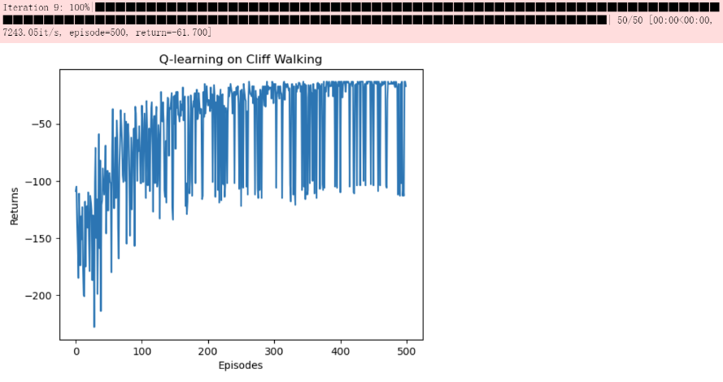
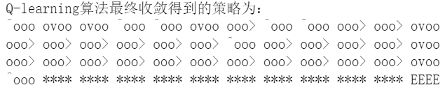
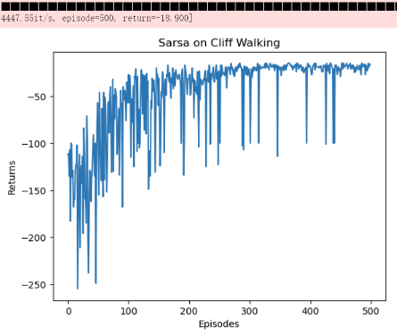
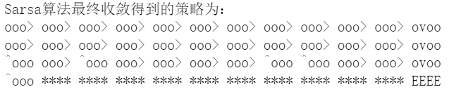
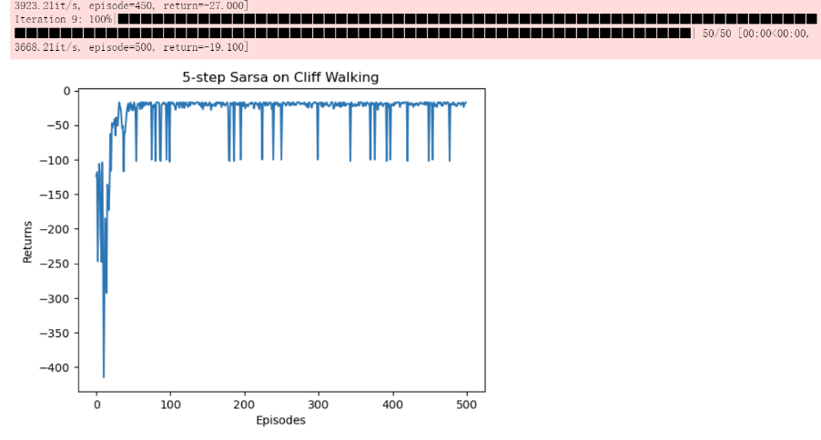
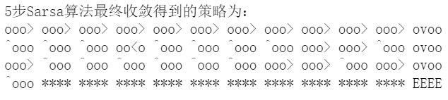
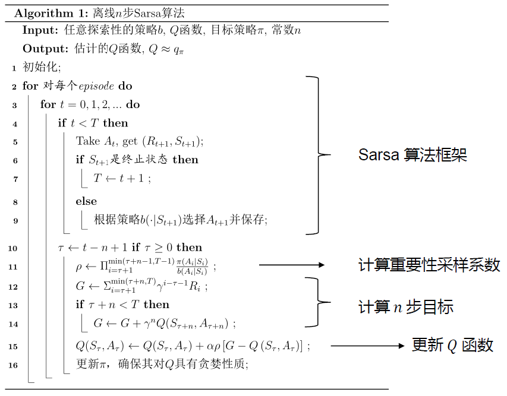
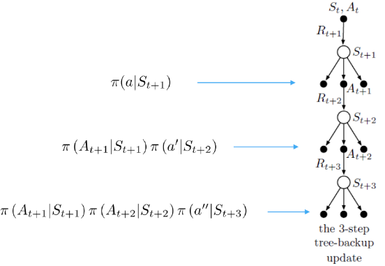

---
categories:
  - AI
  - 机器学习
  - 强化学习
tags:
  - AI
  - 机器学习
  - 强化学习
mathjax: true
title: TD算法
abbrlink: 36279885
date: 2024-05-10 00:58:35
---

[TOC]

<!--more-->

## 环境

```python
import matplotlib.pyplot as plt
import numpy as np
from tqdm import tqdm  # tqdm是显示循环进度条的库
from typing import Tuple

class CliffWalkingEnv:
    def __init__(self, ncol:int, nrow:int):
        # 记录悬崖环境的大小
        self.nrow = nrow
        self.ncol = ncol
        # 记录当前位置
        self.x = 0
        self.y = self.nrow - 1
    
    def render(self, frames=50):
        for i in range(self.nrow):
            if i == 0: # cliff is in the line 0
                line = ['S'] + ['x']*(self.ncol - 2) + ['T'] # 'S':start, 'T':terminal, 'x':the cliff
            else:
                line = ['.'] * self.ncol
            if self.x == i:
                line[self.y] = 'o' # mark the agent's position as 'o'
            print(''.join(line))
        print('\033['+str(self.nrow+1)+'A')  # printer go back to top-left 
        
    def step(self, action:int) -> Tuple[int, int, bool]:
        '''
        接受外部对环境的动作，返回执行该动作后，环境的下一状态，上一状态的奖励，是否终止
        4种动作, change[0]:上, change[1]:下, change[2]:左, change[3]:右
        坐标轴(0,0)在左上角
        智能体起始位置为左下角(0,nrow-1)，悬崖在(1:ncol - 2,nrow-1)，目标位置在右下角(ncol - 1,nrow-1),
        '''
        change = [[0, -1], [0, 1], [-1, 0], [1, 0]]
        self.x = min(self.ncol - 1, max(0, self.x + change[action][0]))
        self.y = min(self.nrow - 1, max(0, self.y + change[action][1]))
        next_state = self.y * self.ncol + self.x
        reward = -1
        done = False
        if self.y == self.nrow - 1 and self.x > 0:  # 下一个位置在悬崖或者目标
            done = True
            if self.x != self.ncol - 1:
                reward = -100
        return next_state, reward, done

    def reset(self) -> int:
        self.x = 0
        self.y = self.nrow - 1
        return self.y * self.ncol + self.x
```


## 策略基类

```python
class Policy:
    """算法基类"""
    def __init__(self, ncol:int, nrow:int, epsilon:float, alpha:float, gamma:float, n_action:int=4):
        self.Q_table = np.zeros([nrow * ncol, n_action])  # 初始化Q(s,a)表格
        self.n_action = n_action  # 动作个数
        self.alpha = alpha  # 学习率
        self.gamma = gamma  # 折扣因子
        self.epsilon = epsilon  # epsilon-贪婪策略中的参数

    def take_action(self, state:int) -> int:  # 选取下一步的操作,具体实现为epsilon-贪婪
        if np.random.random() < self.epsilon:
            action = np.random.randint(self.n_action)
        else:
            action = np.argmax(self.Q_table[state])
        return action
    
    # 获取在状态state的最大Q值，返回该Q值对应的动作
    def best_action(self, state:int) -> int:  # 用于打印策略
        Q_max = np.max(self.Q_table[state])
        a = [0 for _ in range(self.n_action)]
        for i in range(self.n_action):  # 若两个动作的价值一样,都会记录下来
            if self.Q_table[state, i] == Q_max:
                a[i] = 1
        return a
    
    # 策略迭代算法
    def update(self, *args, **argv):
        raise NotImplementedError
```

打印策略

```python
from typing import List

def print_agent(agent:Policy, env:CliffWalkingEnv, action_meaning:List[str], disaster:list=[], end:list=[]):
    for i in range(env.nrow):
        for j in range(env.ncol):
            if (i * env.ncol + j) in disaster:
                print('****', end=' ')
            elif (i * env.ncol + j) in end:
                print('EEEE', end=' ')
            else:
                a = agent.best_action(i * env.ncol + j)
                pi_str = ''
                for k in range(len(action_meaning)):
                    pi_str += action_meaning[k] if a[k] > 0 else 'o'
                print(pi_str, end=' ')
        print()


action_meaning = ['^', 'v', '<', '>']
print('Sarsa算法最终收敛得到的策略为：')
print_agent(agent, env, action_meaning, list(range(37, 47)), [47])
```

### Q-learning

```python
class QLearning(Policy):
    """ Q-learning算法 """
    def __init__(self, ncol:int, nrow:int, epsilon:float, alpha:float, gamma:float, n_action:int=4):
        super().__init__(ncol, nrow, epsilon, alpha, gamma, n_action)

    def update(self, s0:int, a0:int, r:float, s1:int):
        td_error = r + self.gamma * self.Q_table[s1].max() - self.Q_table[s0, a0]
        self.Q_table[s0, a0] += self.alpha * td_error
```

```python
np.random.seed(0)
epsilon = 0.1
alpha = 0.1
gamma = 0.9
agent = QLearning(ncol, nrow, epsilon, alpha, gamma)
num_episodes = 500  # 智能体在环境中运行的序列的数量

return_list = []  # 记录每一条序列的回报
for i in range(10):  # 显示10个进度条
    # tqdm的进度条功能
    with tqdm(total=int(num_episodes / 10), desc='Iteration %d' % i) as pbar:
        for i_episode in range(int(num_episodes / 10)):  # 每个进度条的序列数
            episode_return = 0
            state = env.reset()
            done = False
            while not done:
                action = agent.take_action(state)
                next_state, reward, done = env.step(action)
                episode_return += reward  # 这里回报的计算不进行折扣因子衰减
                agent.update(state, action, reward, next_state)
                state = next_state
            return_list.append(episode_return)
            if (i_episode + 1) % 10 == 0:  # 每10条序列打印一下这10条序列的平均回报
                pbar.set_postfix({
                    'episode':
                    '%d' % (num_episodes / 10 * i + i_episode + 1),
                    'return':
                    '%.3f' % np.mean(return_list[-10:])
                })
            pbar.update(1)

episodes_list = list(range(len(return_list)))
plt.plot(episodes_list, return_list)
plt.xlabel('Episodes')
plt.ylabel('Returns')
plt.title('Q-learning on {}'.format('Cliff Walking'))
plt.show()

action_meaning = ['^', 'v', '<', '>']
print('Q-learning算法最终收敛得到的策略为：')
print_agent(agent, env, action_meaning, list(range(37, 47)), [47])
```





### Sarsa

```python
class Sarsa(Policy):
    """ Sarsa算法 """
    def __init__(self, ncol:int, nrow:int, epsilon:float, alpha:float, gamma:float, n_action:int=4):
        super().__init__(ncol, nrow, epsilon, alpha, gamma, n_action)

    def update(self, s0:int, a0:int, r:float, s1:int, a1:int):
        td_error = r + self.gamma * self.Q_table[s1, a1] - self.Q_table[s0, a0]
        self.Q_table[s0, a0] += self.alpha * td_error
```

```python
ncol = 12
nrow = 4
env = CliffWalkingEnv(ncol, nrow)
np.random.seed(0)
epsilon = 0.1
alpha = 0.1
gamma = 0.9
agent = Sarsa(ncol, nrow, epsilon, alpha, gamma)
num_episodes = 500  # 智能体在环境中运行的序列的数量

return_list = []  # 记录每一条轨迹的回报
for i in range(10):  
    # tqdm的进度条功能，显示10个进度条，显示训练进度
    with tqdm(total=int(num_episodes / 10), desc='Iteration %d' % i) as pbar:
        for i_episode in range(int(num_episodes / 10)):  # 每个进度条的序列数
            episode_return = 0
            state = env.reset()
            action = agent.take_action(state)
            done = False
            while not done:
                next_state, reward, done = env.step(action)
                next_action = agent.take_action(next_state)
                episode_return += reward  # 这里回报的计算不进行折扣因子衰减
                agent.update(state, action, reward, next_state, next_action)
                # 状态切换
                state = next_state
                action = next_action
            return_list.append(episode_return)
            if (i_episode + 1) % 10 == 0:  # 每10条序列打印一下这10条序列的平均回报
                pbar.set_postfix({
                    'episode':
                    '%d' % (num_episodes / 10 * i + i_episode + 1),
                    'return':
                    '%.3f' % np.mean(return_list[-10:])
                })
            pbar.update(1)

episodes_list = list(range(len(return_list)))
plt.plot(episodes_list, return_list)
plt.xlabel('Episodes')
plt.ylabel('Returns')
plt.title('Sarsa on {}'.format('Cliff Walking'))
plt.show()
```





#### Sarsa改进

##### n步Sarsa

减小经典Sarsa价值估计的偏差，减小MC方算法的方差

```python
class nstep_Sarsa(Policy):
    """ n步Sarsa算法 """
    def __init__(self, n:int, ncol:int, nrow:int, epsilon:float, alpha:float, gamma:float, n_action:int=4):
        super().__init__(ncol, nrow, epsilon, alpha, gamma, n_action)

        self.n = n  # 采用n步Sarsa算法
        self.state_list = []  # 保存之前的状态
        self.action_list = []  # 保存之前的动作
        self.reward_list = []  # 保存之前的奖励

    def update(self, s0:int, a0:int, r:float, s1:int, a1:int, done:bool):
        # 收集n条经验，只有在经验数大于等于n时才进行价值更新
        self.state_list.append(s0)
        self.action_list.append(a0)
        self.reward_list.append(r)
        if len(self.state_list) == self.n:  # 若保存的数据可以进行n步更新
            G = self.Q_table[s1, a1]  # 得到Q(s_{t+n}, a_{t+n})
            for i in reversed(range(self.n)):
                G = self.gamma * G + self.reward_list[i]  # 不断向前计算每一步的回报
                # 只有轨迹长度大于n的才用于价值更新
                # 如果到达终止状态,最后几步虽然长度不够n步,也将其进行更新
                # 此时 s[s[0],s[1],s[2],s[3]=s0,s[4]=s1]
                if done and i > 0:
                    # 这一步相当于更新 Q[s[0],a[0]],Q[s[1],a[1]],Q[s[2],a[2]],Q[s[3],a[3]]
                    s = self.state_list[i]
                    a = self.action_list[i]
                    self.Q_table[s, a] += self.alpha * (G - self.Q_table[s, a])
            # Q(s[0],a[0]) 已经完成更新，下次不必更新
            s = self.state_list.pop(0)  
            a = self.action_list.pop(0)
            self.reward_list.pop(0)
            # 更新 Q(s[0],a[0])
            self.Q_table[s, a] += self.alpha * (G - self.Q_table[s, a])
        if done:  # 如果到达终止状态,即将开始下一回合,则将列表全清空
            self.state_list = []
            self.action_list = []
            self.reward_list = []
```

```python
np.random.seed(0)
n_step = 5  # 5步Sarsa算法
alpha = 0.1
epsilon = 0.1
gamma = 0.9
agent = nstep_Sarsa(n_step, ncol, nrow, epsilon, alpha, gamma)
num_episodes = 500  # 智能体在环境中运行的序列的数量

return_list = []  # 记录每一条序列的回报
for i in range(10):  # 显示10个进度条
    #tqdm的进度条功能
    with tqdm(total=int(num_episodes / 10), desc='Iteration %d' % i) as pbar:
        for i_episode in range(int(num_episodes / 10)):  # 每个进度条的序列数
            episode_return = 0
            state = env.reset()
            action = agent.take_action(state)
            done = False
            while not done:
                next_state, reward, done = env.step(action)
                next_action = agent.take_action(next_state)
                episode_return += reward  # 这里回报的计算不进行折扣因子衰减
                agent.update(state, action, reward, next_state, next_action,done)
                state = next_state
                action = next_action
            return_list.append(episode_return)
            if (i_episode + 1) % 10 == 0:  # 每10条序列打印一下这10条序列的平均回报
                pbar.set_postfix({
                    'episode':
                    '%d' % (num_episodes / 10 * i + i_episode + 1),
                    'return':
                    '%.3f' % np.mean(return_list[-10:])
                })
            pbar.update(1)

episodes_list = list(range(len(return_list)))
plt.plot(episodes_list, return_list)
plt.xlabel('Episodes')
plt.ylabel('Returns')
plt.title('5-step Sarsa on {}'.format('Cliff Walking'))
plt.show()
```



```python
action_meaning = ['^', 'v', '<', '>']
print('5步Sarsa算法最终收敛得到的策略为：')
print_agent(agent, env, action_meaning, list(range(37, 47)), [47])
```



### 离线n步Sarsa

#### 对于状态价值

为经验增加重要性权重
$$
E_{s\sim \pi}[f(s)]=\int Pr(s\vert \pi)f(s)ds=\int \frac{Pr(s\vert \pi)}{Pr(s\vert \mu)}Pr_{\mu}(s)f(s)ds=E_{s\sim \mu}\left[\frac{Pr(s\vert \pi)}{Pr(s\vert \mu)}f(s)\right]
$$
有轨迹
$$
Pr(s_t,a_t,s_{t+1},a_{t+1},s_{t+2},\cdots,s_{H}\vert (s,a)_{t:H}\sim \mu)=\prod_{k=t}^{H-1}\mu(a_k\vert s_k) P(s_{k+1}\vert s_k,a_k)\\
Pr(s_t,a_t,s_{t+1},a_{t+1},s_{t+2},\cdots,s_{H}\vert (s,a)_{t:H}\sim \pi)=\prod_{k=t}^{H-1}\pi(a_k\vert s_k) P(s_{k+1}\vert s_k,a_k)\\
$$
而在n步Sarsa中，
$$
V^{(t+n)}(s_{t+1})=G_{t}^{[n]}=R^{(t+n-1)}(s_t)+\gamma R^{(t+n-1)}(s_{t+1})+\cdots+\gamma^{n-1}R^{(t+n-1)}(s_{t+n-1})+\gamma^nV^{(t+n-1)}(s_{t+n})
$$
所以，$n$ 步离线的经验去估计状态价值，重要性权重为
$$
\rho_{t:H}=\prod_{k=t}^{\min(H,T-1)}\frac{\pi(a_k\vert s_k)}{\mu(a_k\vert s_k)}
$$

$$
V^{(t+n)}_{\pi}(s_t)=V_{\pi}^{(t+n-1)}(s_t)-\alpha\rho_{t:H}\left[V_{\pi}^{(t+n-1)}(s_{t})-G_{t:t+n}^{\mu}\right]
$$

由于重要性权重的连乘，所以是对状态价值的无偏估计，但是方差大（不同策略下的同一轨迹）

#### 对于动作价值

$$
E_{(s,a)\sim \pi}[f(s,a)]=\int Pr(a\vert s,\pi)f(s,a)ds=\int \frac{Pr(a\vert s,\pi)}{Pr(a\vert s,\mu)}Pr(a\vert s,\mu)f(s,a)ds=E_{(s,a)\sim \mu}\left[\frac{Pr(a\vert s,\pi)}{Pr(a\vert s,\mu)}f(s,a)\right]
$$

在 n-step Sarsa 中，
$$
Q^{(t+n)}(s_{t+1},a_{t+1})=G_{t}^{[n]}=R^{(t+n-1)}(s_t,a_t)+\gamma R^{(t+n-1)}(s_{t+1},a_{t+1})+\cdots+\gamma^{n-1}R^{(t+n-1)}(s_{t+n-1},a_{t+n-1})+\gamma^nQ^{(t+n-1)}(s_{t+n},a_{t+n})
$$

$$
Q^{(t+n)}_{\pi}(s_t,a_t)=Q_{\pi}^{(t+n-1)}(s_t,a_t)-\alpha\rho_{t:H}\left[Q_{\pi}^{(t+n-1)}(s_t,a_t)-G_{t:t+n}^{\mu}\right]
$$

$T$ 是终止状态的时间步



## 离线强化学习

### 多步树回溯算法

一种不需要重要性采样的离线算法



在状态 $s_t$ 下采取动作 $a_t$ ，到达状态 $s_{t+1}$ ，基于策略 $\pi(a\vert s_{t+1})$ 选择动作 $a_{t+1}$ ，获得动作价值 $Q(s_{t+1},a_{t+1})$ ，此时到达状态 $s_{t+2}$ 

在状态 $t+2$ 下采取动作 $a_{t+2}$ 的概率已经变为 $\pi(a_{t+1}\vert s_{t+1})\pi(a_{t+2}\vert s_{t+2})$ 

在 n-step 计算状态价值时

- $n=1$ ，$G_t^{[1]}=R_{t+1}+\gamma \sum_a\pi(a\vert s_{t+1})Q^{(t)}(s_{t+1},a)$ 

n=2
$$
\begin{aligned}
G_t^{[2]}&=R_{t+1}+\gamma \sum\limits_{a\neq a_{t+1}}\pi(a\vert s_{t+1})Q^{(t+1)}(s_{t+1},a)+\gamma \pi(a_{t+1}\vert s_{t+1})\left(R_{t+2}+\gamma \sum_a\pi(a\vert s_{t+2})Q^{(t)}(s_{t+2},a)\right)\\
&=R_{t+1}+\gamma \sum\limits_{a\neq a_{t+1}}\pi(a\vert s_{t+1})Q^{(t+1)}(s_{t+1},a)+\gamma\pi(a_{t+1}\vert s_{t+1})G_{t+1:t+2}
\end{aligned}
$$
推广
$$
G_t^{[n]}=R_{t+1}+\gamma \sum\limits_{a\neq a_{t+1}}\pi(a\vert s_{t+1})Q^{(t+1)}(s_{t+1},a)+\gamma \pi(a_{t+1}\vert s_{t+1})G_{t+1:t+n}
$$


