---
categories:
  - AI
  - 机器学习
  - 强化学习
tags:
  - AI
  - 机器学习
  - 强化学习
mathjax: true
title: 值函数近似
abbrlink: 3839502760
date: 2024-05-10 19:04:40
---

[TOC]

<!--more-->

## 价值函数近似思路

**价值函数将已知的 状态/动作 价值泛化到其他未知 状态/动作 价值上** ，用以表示连续的价值函数

基于价值函数近似的TD-learning，其目标函数
$$
J(w)=E\left[\frac{1}{2}\left(V_{\pi}(s)-\hat{V}_{\pi}(S,w)\right)^2\right]
$$
求损失的最小值
$$
-\frac{\partial J(w)}{\partial w}=E\left[\left(V_{\pi}(s)-\hat{V}_{\pi}(S,w)\right)\bigtriangledown_w\hat{V}_{\pi}(s_t,w_t)\right]
$$
采用随机梯度下降法，求解损失最小值
$$
\begin{aligned}
w_{t+1}&=w-\alpha\frac{\partial J(w)}{\partial w}\\
&=w_t+\alpha_{t}\left[V_{\pi}(s)-\hat{V}_{\pi}(s_t,w_t)\right]\bigtriangledown_w\hat{V}_{\pi}(s_t,w_t)
\end{aligned}
$$
而真实的价值函数 $V_{\pi}(s)$ 是未知的，所以在此算法中，需要将其代替
$$
w_{t+1}=w_{t}+\alpha_t\left[r_{t+1}+\gamma\hat{V}(s_{t+1},w_t)-\hat{V}_{\pi}(s_t,w_t)\right]\bigtriangledown_w\hat{V}(s_t,w_t)
$$

这样的故事线在数学上是不严谨的：

1. 首先，最优化算法与目标函数并不对应；

2. 其次，将 $r_{t+1}+\gamma\hat{V}(s_{t+1},w_t)$ 最为TD target 是否依然收敛

   数学上可严谨证明：替换后收敛得到的 $w^*$ 是最小化 $J_{PBE}$ 的解

---

**真实的状态价值误差** 
$$
J_E(w)=E\left[\left(\mathbf{V}_{\pi}(S)-\hat{V}_{\pi}(S,w)\right)^2\right]=\Vert \hat{\mathbf{V}}(w)-\mathbf{V}_{\pi}\Vert^2_D=\Vert \hat{\mathbf{V}}(w)-\mathbf{V}_{\pi}\Vert^T\cdot \mathbf{D}\cdot \Vert \hat{\mathbf{V}}(w)-\mathbf{V}_{\pi}\Vert
$$

**基于贝尔曼方程的状态价值误差** 
$$
\begin{aligned}
J_{BE}(w)&=E\left[\left(\underbrace{\overline{\mathbf{V}}_{\pi}(S)}_{\mbox{TD Target}}-\hat{\mathbf{V}}_{\pi}(S,w)\right)^2\right]=E\left[\left(\mathbf{R}_{\pi}'+\gamma \mathbf{P}_{\pi}\hat{\mathbf{V}_{\pi}}(S',w)-\hat{\mathbf{V}}_{\pi}(S,w)\right)^2\right]\\
&=\left\Vert \mathbf{R}_{\pi}'+\gamma \mathbf{P}_{\pi}\hat{\mathbf{V}}_{\pi}(S',w)-\hat{\mathbf{V}}_{\pi}(S,w)\right\Vert^2_D=\left\Vert T_{\pi}\left(\hat{\mathbf{V}}_{\pi}(S',w)\right)-\hat{\mathbf{V}}_{\pi}(S,w)\right\Vert_D^2
\end{aligned}
$$

用 $\hat{\mathbf{V}}_{\pi}(S,w)$ 去近似 $\mathbf{V}_{\pi}(S)$ ，理论上 $\hat{\mathbf{V}}_{\pi}(S,w)$ 也会满足贝尔曼方程，即价值近似函数最优 $J(w)=0$ 时，价值近似函数的贝尔曼方程成立
$$
\mathbf{V}_{\pi}(S)\approx\hat{\mathbf{V}}_{\pi}(S,w)=\mathbf{R}_{\pi}'+\gamma \mathbf{P}_{\pi}\hat{\mathbf{V}}_{\pi}(S',w)
$$

**基于贝尔曼方程的状态价值投影误差**

用 $\hat{V}$ 去近似价值函数，由于函数结构的限制， $T_{\pi}\left(\hat{\mathbf{V}}_{\pi}(S',w)\right)$ 与 $\hat{\mathbf{V}}_{\pi}(S,w)$ 可能永远都不能相等
$$
J_{PBE}(w)=\left\Vert \hat{\mathbf{V}}_{\pi}(S,w)-\mathbf{M}\cdot T_{\pi}\left(\hat{\mathbf{V}}_{\pi}(S',w)\right)\right\Vert
$$
其中 $\mathbf{M}$ 为投影矩阵，将 $T_{\pi}\left(\hat{\mathbf{V}}_{\pi}(S',w)\right)$ 投影到以 $w$ 为参数的 $\hat{V}_{\pi}(w)$ 组成的空间，此时误差可能为0

所以上述求解算法实质上是 **基于贝尔曼方程的状态价值投影误差** 的随机梯度下降法

### Sarsa+价值函数近似

$$
\begin{array}{ll}
\hline
&目标：寻找使智能体从起点状态 (s_0,a_0)到达目标状态的最优策略\\
&对于每个回合:\\
&\quad 若s_t不是目标状态:\\
&\qquad 基于策略 \pi^{(t)}(s_t)采取动作 a_t,生成s_{t+1},r_{t+1}，然后基于策略\pi^{(t)}(s_{t+1})生成动作a_{t+1}\\
&\qquad 价值更新(参数更新):\\
&\quad \qquad w_{t+1}=w_{t}+\alpha_t\left[r_{t+1}+\gamma\hat{Q}\left(s_{t+1},a_{t+1},w_t\right)-\hat{Q}\left(s_t,a_t,w_t\right)\right]\bigtriangledown_w\hat{Q}\left(s_t,a_t,w_t\right)\\
&\qquad 策略更新:\\
&\quad \qquad \pi^{(t+1)}(a\vert s_t)=\begin{cases}
1-\frac{\varepsilon}{\vert \mathcal{A}(s)\vert}\left(\vert \mathcal{A}(s)\vert-1\right)&,a=\mathop{\mathrm{argmax}}\limits_{a\in \mathcal{A}(s_t)}\hat{Q}(s_t,a,w_{t+1})\\
\frac{\varepsilon}{\vert \mathcal{A}(s)\vert}&,其他
\end{cases}
\\
\hline
\end{array}
$$

### Q-learning+价值函数近似

$$
\begin{array}{ll}
\hline
&初始化：初始化参数向量w^{(0)}\\
&目标：寻找使智能体从起点状态 (s_0,a_0)到达目标状态的最优策略\\
&对于每个回合:\\
&\quad 若s_t不是目标状态:\\
&\qquad 基于策略 \pi^{(t)}(s_t)采取动作 a_t,生成s_{t+1},r_{t+1}\\
&\qquad 价值更新(参数更新):\\
&\quad \qquad w_{t+1}=w_{t}+\alpha_t\left[r_{t+1}+\gamma \max\limits_{a\in \mathcal{A}(s_{t+1})} \hat{Q}_{\pi}\left(s_{t+1},a,w_t\right)-\hat{Q}\left(s_t,a_t,w_t\right)\right]\bigtriangledown_w\hat{Q}\left(s_t,a_t,w_t\right)\\
&\qquad 策略更新:\\
&\quad \qquad \pi^{(t+1)}(a\vert s_t)=\begin{cases}
1-\frac{\varepsilon}{\vert \mathcal{A}(s)\vert}\left(\vert \mathcal{A}(s)\vert-1\right)&,a=\mathop{\mathrm{argmax}}\limits_{a\in \mathcal{A}(s_t)}\hat{Q}(s_t,a,w_{t+1})\\
\frac{\varepsilon}{\vert \mathcal{A}(s)\vert}&,其他
\end{cases}
\\
\hline
\end{array}
$$

## 原始DQN

将价值函数变为神经网络

### 车-杆环境

状态值就是连续的，动作值是离散的

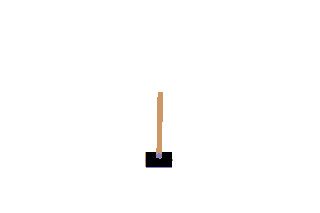

智能体的任务是通过左右移动保持车上的杆竖直，若杆的倾斜度数过大，或者车子离初始位置左右的偏离程度过大，或者坚持时间到达 200 帧，则游戏结束

在游戏中每坚持一帧，智能体能获得分数为 1 的奖励

状态空间与动作空间：

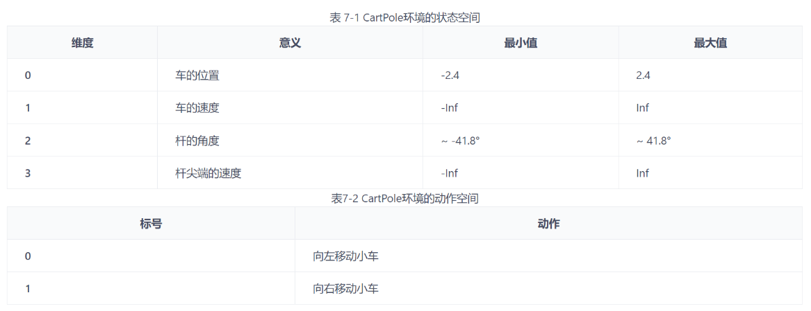

### 实现

$$
\begin{array}{ll}
\hline
&目标：从基于探索策略\mu生成的经验集中学习最优的 \mbox{target network}去近似最优动作价值\\
&初始化：用随机的网络参数 w 初始化网络\hat{Q}(s,a,w)和目标网络\hat{Q}(s,a,w^T),初始化经验回放池\\
&对于每个回合e=1\rightarrow E:\\
&\quad 获取环境初始状态s_0\\
&\quad 对于每个时间步t=0\rightarrow T:\\
&\qquad 根据当前网络 \hat{Q}(s,a,w),以\epsilon-贪心策略选择动作a_t\\
&\qquad 执行动作a_t，获得回报r_{t+1}，将生成的经验放入经验回放池\mathcal{B}=\{(s,a,r',s')\}\\
&\qquad \mathcal{B}中的数据足够，从\mathcal{B}中采样 N个数据\{<s_i,a_i,r_{i+1},s_{i+1}>\}_{i=1,\cdots,N}\\
&\qquad 对每个数据:\\
&\quad\qquad 用目标网络\hat{Q}(s,a,w_T)计算目标价值y_i(w_T)=r_{i+1}+\gamma \max\limits_{a\in \mathcal{A}(s_{i+1})}\hat{Q}(s_{i+1},a,w_T)\\
&\qquad 最小化损失函数 L=\frac{1}{N}\sum\limits_{i}\left(y_i(w_T)-\hat{Q}(s_i,a_i,w)\right)^2，更新 \mbox{main network}\\
&\qquad 在C轮迭代后，令w_T=w\\
\hline
\end{array}
$$

```python
import random
import gym
import numpy as np
import collections
from tqdm import tqdm
import torch
import torch.nn.functional as F
import matplotlib.pyplot as plt
import rl_utils
from typing import Union
```

#### 经验回放池

加入经验、采样经验

```python
class ReplayBuffer:
    ''' 经验回放池 '''
    def __init__(self, capacity:int):
        self.buffer = collections.deque(maxlen=capacity)    # 队列,先进先出

    def add(self, state:np.ndarray, action:int, reward:float, next_state:np.ndarray, done:bool):     
        # 将数据加入buffer
        self.buffer.append((state, action, reward, next_state, done)) 

    def sample(self, batch_size:int):   
        # 从buffer中采样数据,数量为batch_size
        transitions = random.sample(self.buffer, batch_size)
        # 将Batch_size条经验解构为Batch_size大小的状态、动作、奖励、下一状态、是否结束的数组
        state, action, reward, next_state, done = zip(*transitions)
        return np.array(state), action, reward, np.array(next_state), done 

    def size(self) -> int:  # 目前buffer中数据的数量
        return len(self.buffer)
```

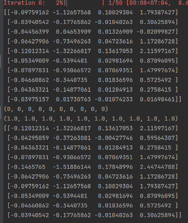

##### 优先经验回放

**衡量标准**

以 $Q$ 函数的值与TD目标的差异来衡量学习到的价值
$$
p_t=\vert r_{t+1}+\gamma \max\limits_{a'}\hat{Q}(s',a',w)-\hat{Q}(s,a,w)\vert
$$
为使各样本都有机会被采样，经验存储为 $e_t=<s,a,s',r_{t+1},p_t+\epsilon>$ 

经验 $e_t$ 被选中概率为 $P(e_t)=\frac{p_t^\alpha}{\sum\limits_{k}p_k^\alpha}$

重要性采样：权重为 $w_t=\frac{\left(N\times P(t)\right)^{-\beta}}{\max\limits_{i}w_i}$

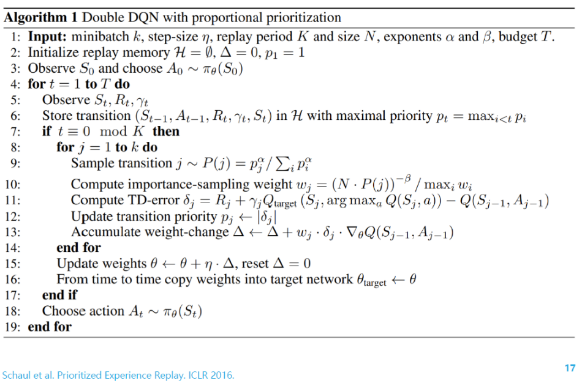

https://github.com/ameet-1997/Prioritized_Experience_Replay

https://arxiv.org/pdf/1511.05952v4

#### Q网络

给定状态 $s$ ，输出该状态下每个动作的动作价值

```python
class Qnet(torch.nn.Module):
    ''' 只有一层隐藏层的Q网络
    输入：状态
    输出：该状态下各个动作的动作价值
    '''
    def __init__(self, state_dim:int, hidden_dim:int, action_dim:int):
        super(Qnet, self).__init__()
        self.fc1 = torch.nn.Linear(state_dim, hidden_dim)
        self.fc2 = torch.nn.Linear(hidden_dim, action_dim)
    
    def forward(self, x:torch.Tensor) -> torch.Tensor:
        x = F.relu(self.fc1(x))  # 隐藏层使用ReLU激活函数
        return self.fc2(x)
```

#### DQN

- 初始化：一个Q网络，一个目标Q网络，一些超参数
- 动作生成函数
- 价值网络更新

```python
class DQN:
    ''' DQN算法 '''
    def __init__(self,
                 state_dim: int, hidden_dim: int, action_dim: int,
                 learning_rate: float, gamma: float, epsilon: float,
                 target_update: int, device: torch.device
                 ):
        self.action_dim = action_dim
        # Q网络
        self.q_net = Qnet(state_dim, hidden_dim, self.action_dim).to(device)
        # 目标网络
        self.target_q_net = Qnet(state_dim, hidden_dim, self.action_dim).to(device)
        # 使用Adam优化器
        self.optimizer = torch.optim.Adam(self.q_net.parameters(), lr=learning_rate)

        self.gamma = gamma  # 折扣因子
        self.epsilon = epsilon  # epsilon-贪婪策略
        self.target_update = target_update  # 目标网络更新频率
        self.count = 0  # 计数器,记录更新次数
        self.device = device

    def take_action(self, state) -> int:  # epsilon-贪婪策略采取动作
        if np.random.random() < self.epsilon:
            action = np.random.randint(self.action_dim)
        else:
            state = torch.tensor(np.array([state]), dtype=torch.float).to(self.device)
            action = self.q_net(state).argmax().item()
        return action

    def update(self, transition_dict: dict):
        # 将状态数组，动作数组，奖励数组，下一状态数组，是否结束状态 传到计算设备
        states = torch.tensor(transition_dict['states'], dtype=torch.float).to(self.device)
        actions = torch.tensor(transition_dict['actions']).view(-1, 1).to(self.device)
        rewards = torch.tensor(transition_dict['rewards'], dtype=torch.float).view(-1, 1).to(self.device)
        next_states = torch.tensor(transition_dict['next_states'], dtype=torch.float).to(self.device)
        dones = torch.tensor(transition_dict['dones'], dtype=torch.float).view(-1, 1).to(self.device)
        # 对于批量中的每个状态，用Q网络计算当前经验(s,a)的动作价值[Q(s,a)] = (batch_size,1)
        # q_net([state])=(batch_size,a_dim)，
        #   q_net([state]).gather(1,[a_s1,a_s2])=(batch_size,1)，在当前状态下，每个动作价值中取出经验中动作的动作价值
        q_values = self.q_net(states).gather(1, actions)
        # 对于批量中的每一下一状态next_states，用目标Q网络计算该状态下每个动作的价值，下一状态下每个动作的价值形状为(batch_size,a_dim)
        # 求每个下一状态下，每个动作在目标网络中的动作价值，并取最大动作价值 max_next_q_values (batch_size,1)
        '''
        tensor([[1, 2],
                [4, 2]])
        b.max(1)        
        torch.return_types.max(
            values=tensor([2, 4]),
            indices=tensor([1, 0]))
        '''
        max_next_q_values = self.target_q_net(next_states).max(1)[0].view(-1, 1)
        # 计算一个批量的动作的TD误差
        q_targets = rewards + self.gamma * max_next_q_values * (1 - dones)
        # 均方误差损失函数
        dqn_loss = torch.mean(F.mse_loss(q_values, q_targets))

        self.optimizer.zero_grad()  # PyTorch中默认梯度会累积,这里需要显式将梯度置为0
        dqn_loss.backward()  # 反向传播更新每个参数的梯度
        self.optimizer.step() # 更新每个参数

        if self.count % self.target_update == 0:
            self.target_q_net.load_state_dict(self.q_net.state_dict())  # 更新目标网络
        self.count += 1
```

#### 训练过程

```python
lr = 2e-3
num_episodes = 500
hidden_dim = 128
gamma = 0.98
epsilon = 0.01
target_update = 10
buffer_size = 10000
minimal_size = 500
batch_size = 64
device = torch.device("cuda") if torch.cuda.is_available() else torch.device("cpu")

env_name = 'CartPole-v0'
env = gym.make(env_name)
random.seed(0)
np.random.seed(0)
env.seed(0)
torch.manual_seed(0)
replay_buffer = ReplayBuffer(buffer_size)
state_dim = env.observation_space.shape[0]
action_dim = env.action_space.n
agent = DQN(state_dim, hidden_dim, action_dim, lr, gamma, epsilon,target_update, device)

return_list = []
for i in range(10):
    with tqdm(total=int(num_episodes / 10), desc='Iteration %d' % i) as pbar:
        for i_episode in range(int(num_episodes / 10)):
            episode_return = 0
            state = env.reset()
            done = False
            while not done:
                action = agent.take_action(state)
                next_state, reward, done, _ = env.step(action)
                replay_buffer.add(state, action, reward, next_state, done)
                state = next_state
                episode_return += reward
                # 当buffer数据的数量超过一定值后,才进行Q网络训练
                if replay_buffer.size() > minimal_size:
                    b_s, b_a, b_r, b_ns, b_d = replay_buffer.sample(batch_size)
                    print(b_s,b_a,b_r,b_ns,b_d)
                    transition_dict = {
                        'states': b_s,
                        'actions': b_a,
                        'next_states': b_ns,
                        'rewards': b_r,
                        'dones': b_d
                    }
                    agent.update(transition_dict)
            return_list.append(episode_return)
            if (i_episode + 1) % 10 == 0:
                pbar.set_postfix({
                    'episode':
                    '%d' % (num_episodes / 10 * i + i_episode + 1),
                    'return':
                    '%.3f' % np.mean(return_list[-10:])
                })
            pbar.update(1)
```

#### 可视化

```python
import os
os.environ["KMP_DUPLICATE_LIB_OK"]="TRUE"

# return_list中是每个回合的回报
episodes_list = list(range(len(return_list)))
plt.plot(episodes_list, return_list)
plt.xlabel('Episodes')
plt.ylabel('Returns')
plt.title('DQN on {}'.format(env_name))
plt.show()

# 取每10回合的均值，平滑化回报
mv_return = rl_utils.moving_average(return_list, 9)
plt.plot(episodes_list, mv_return)
plt.xlabel('Episodes')
plt.ylabel('Returns')
plt.title('DQN on {}'.format(env_name))
plt.show()
```

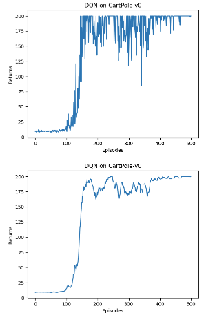

## Double DQN

普通DQN通常会导致对Q值的过高估计

传统DQN的TD目标为
$$
r'+\gamma \max\limits_{a'}Q(s',a',w_T)\iff Q\left(s',\arg\max\limits_{a'}Q(s',a',w_T)\right)
$$
因此，每次得到的都是Q网络估计的最大值，在这种更新方式下，会将误差正向累积

- 假设在状态 $s'$ 下所有动作的Q值为0，$Q(s',a),a\in \mathcal{A}(s')$ ，此时正确的TD目标为 $r'+0=r'$ 

  但由于Q网络拟合时会存在误差，即存在某个动作 $a'$ 有 $Q(s',a')>0$ ，TD误差变为 $r'+\gamma Q(s',a')>r'$ ，因此用TD目标更新 $Q(s,a)$ 时也被高估了

  这种Q值的高估会逐步累积。当动作空间较大的任务，DQN的高估问题会非常严重，造成DQN无法有效工作

Double的做法是用训练网络的Q值选择目标网络在 $s'$ 的动作
$$
Q\left(s',\arg\max\limits_{a'}Q(s',a',w)\right)\iff r'+\gamma \max\limits_{a'}Q(s',a',w)
$$

### 环境

**倒立摆** 


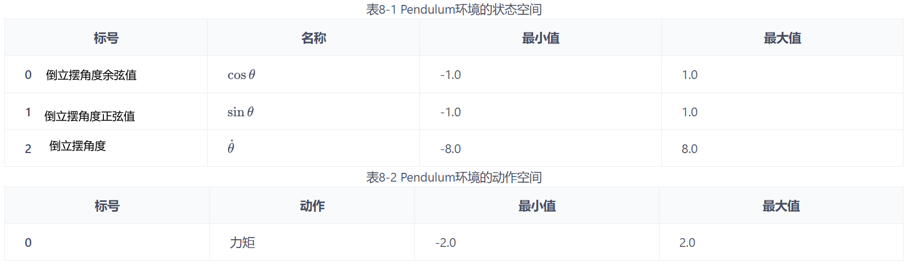

动作为对倒立摆施加的力矩

每一步都会根据当前倒立摆的状态的好坏给予智能体不同的奖励，该环境的奖励函数为 $-(\theta^2+0.1\theta^2+0.001a^2)$ 

倒立摆向上保持直立不动时奖励为 0，倒立摆在其他位置时奖励为负数

倒立摆环境可以比较方便的验证DQN对Q值的过高估计：对Q值的最大估计应该是0，当Q值大于0的情况则说明出现了高估

#### DQN只能处理离散环境，所以需要对力矩离散化

```python
action_dim = 11  # 将连续动作分成11个离散动作

def dis_to_con(discrete_action:int, env:gym.Env, action_dim:int):  # 离散动作转回连续的函数
    action_lowbound = env.action_space.low[0]  # 连续动作的最小值
    action_upbound = env.action_space.high[0]  # 连续动作的最大值
    return action_lowbound + (discrete_action / (action_dim - 1)) * (action_upbound - action_lowbound)
```

### Q网络

```python
import random
import gym
import numpy as np
import torch
import torch.nn.functional as F
import matplotlib.pyplot as plt
import rl_utils
from tqdm import tqdm


class Qnet(torch.nn.Module):
    ''' 只有一层隐藏层的Q网络 '''
    def __init__(self, state_dim:int, hidden_dim:int, action_dim:int):
        super(Qnet, self).__init__()
        self.fc1 = torch.nn.Linear(state_dim, hidden_dim)
        self.fc2 = torch.nn.Linear(hidden_dim, action_dim)

    def forward(self, x:torch.Tensor) -> torch.Tensor:
        x = F.relu(self.fc1(x))
        return self.fc2(x)
```

```python
class DQN:
    ''' DQN算法,包括Double DQN '''
    def __init__(self,
                 state_dim:int,
                 hidden_dim:int,
                 action_dim:int,
                 learning_rate:float,
                 gamma:float,
                 epsilon:float,
                 target_update:int,
                 device:torch.device,
                 dqn_type:str='VanillaDQN'):
        self.action_dim = action_dim
        self.q_net = Qnet(state_dim, hidden_dim, self.action_dim).to(device)
        self.target_q_net = Qnet(state_dim, hidden_dim,
                                 self.action_dim).to(device)
        self.optimizer = torch.optim.Adam(self.q_net.parameters(),
                                          lr=learning_rate)
        self.gamma = gamma
        self.epsilon = epsilon
        self.target_update = target_update
        self.count = 0
        self.dqn_type = dqn_type
        self.device = device

    def take_action(self, state) -> int:
        if np.random.random() < self.epsilon:
            action = np.random.randint(self.action_dim)
        else:
            state = torch.tensor(np.array([state]), dtype=torch.float).to(self.device)
            action = self.q_net(state).argmax().item()
        return action
    
    def max_q_value(self, state) -> int:
        state = torch.tensor(np.array([state]), dtype=torch.float).to(self.device)
        return self.q_net(state).max().item()

    def update(self, transition_dict:dict):
        states = torch.tensor(transition_dict['states'],
                              dtype=torch.float).to(self.device)
        actions = torch.tensor(transition_dict['actions']).view(-1, 1).to(
            self.device)
        rewards = torch.tensor(transition_dict['rewards'],
                               dtype=torch.float).view(-1, 1).to(self.device)
        next_states = torch.tensor(transition_dict['next_states'],
                                   dtype=torch.float).to(self.device)
        dones = torch.tensor(transition_dict['dones'],
                             dtype=torch.float).view(-1, 1).to(self.device)

        q_values = self.q_net(states).gather(1, actions)  # Q值
        # 下个状态的最大Q值
        if self.dqn_type == 'DoubleDQN': 
            '''
            tensor([[1, 2],
                [4, 2]])
            b.max(1)
            torch.return_types.max(
                values=tensor([2, 4]),
                indices=tensor([1, 0]))
            b.max(1)返回最大Q值对应的动作
            '''
            max_action = self.q_net(next_states).max(1)[1].view(-1, 1) # DQN与Double DQN的区别
            max_next_q_values = self.target_q_net(next_states).gather(1, max_action)
        else: # DQN的情况
            max_next_q_values = self.target_q_net(next_states).max(1)[0].view(-1, 1)
        q_targets = rewards + self.gamma * max_next_q_values * (1 - dones)  # TD误差目标
        dqn_loss = torch.mean(F.mse_loss(q_values, q_targets))  # 均方误差损失函数
        self.optimizer.zero_grad()  # PyTorch中默认梯度会累积,这里需要显式将梯度置为0
        dqn_loss.backward()  # 反向传播更新参数
        self.optimizer.step()

        if self.count % self.target_update == 0:
            self.target_q_net.load_state_dict(self.q_net.state_dict())  # 更新目标网络
        self.count += 1
```

### DQN训练过程记录每个状态下最大Q值

```python
def train_DQN(agent:DQN, env:gym.Env, num_episodes:int, replay_buffer:rl_utils.ReplayBuffer, 
            minimal_size:int, batch_size:int):
    return_list = []
    max_q_value_list = []
    max_q_value = 0
    for i in range(10):
        with tqdm(total=int(num_episodes / 10),
                  desc='Iteration %d' % i) as pbar:
            for i_episode in range(int(num_episodes / 10)):
                episode_return = 0
                state = env.reset()
                done = False
                while not done:
                    action = agent.take_action(state)
                    # 与DQN区别2，为了方便查看Q值的高估情况
                    max_q_value = agent.max_q_value(state) * 0.005 + max_q_value * 0.995  # 平滑处理
                    max_q_value_list.append(max_q_value)  # 保存每个状态的最大Q值
                    
                    action_continuous = dis_to_con(action, env, agent.action_dim)
                    next_state, reward, done, _ = env.step([action_continuous])
                    replay_buffer.add(state, action, reward, next_state, done)
                    state = next_state
                    episode_return += reward
                    if replay_buffer.size() > minimal_size:
                        b_s, b_a, b_r, b_ns, b_d = replay_buffer.sample(
                            batch_size)
                        transition_dict = {
                            'states': b_s,
                            'actions': b_a,
                            'next_states': b_ns,
                            'rewards': b_r,
                            'dones': b_d
                        }
                        agent.update(transition_dict)
                return_list.append(episode_return)
                if (i_episode + 1) % 10 == 0:
                    pbar.set_postfix({
                        'episode':
                        '%d' % (num_episodes / 10 * i + i_episode + 1),
                        'return':
                        '%.3f' % np.mean(return_list[-10:])
                    })
                pbar.update(1)
    return return_list, max_q_value_list
```

### 训练

```python
lr = 1e-2
num_episodes = 200
hidden_dim = 128
gamma = 0.98
epsilon = 0.01
target_update = 50
buffer_size = 5000
minimal_size = 1000
batch_size = 64
device = torch.device("cuda") if torch.cuda.is_available() else torch.device("cpu")

env_name = 'Pendulum-v0'
env = gym.make(env_name)
state_dim = env.observation_space.shape[0]
action_dim = 11  # 将连续动作分成11个离散动作
```

#### DQN结果

```python
random.seed(0)
np.random.seed(0)
env.seed(0)
torch.manual_seed(0)
replay_buffer = rl_utils.ReplayBuffer(buffer_size)
agent = DQN(state_dim, hidden_dim, action_dim, lr, gamma, epsilon,
            target_update, device)
return_list, max_q_value_list = train_DQN(agent, env, num_episodes,
                                          replay_buffer, minimal_size,
                                          batch_size)

episodes_list = list(range(len(return_list)))
mv_return = rl_utils.moving_average(return_list, 5)
plt.plot(episodes_list, mv_return)
plt.xlabel('Episodes')
plt.ylabel('Returns')
plt.title('DQN on {}'.format(env_name))
plt.show()

frames_list = list(range(len(max_q_value_list)))
plt.plot(frames_list, max_q_value_list)
plt.axhline(0, c='orange', ls='--')
plt.axhline(10, c='red', ls='--')
plt.xlabel('Frames')
plt.ylabel('Q value')
plt.title('DQN on {}'.format(env_name))
plt.show()
```

DQN训练结果：累积回报与最大Q值

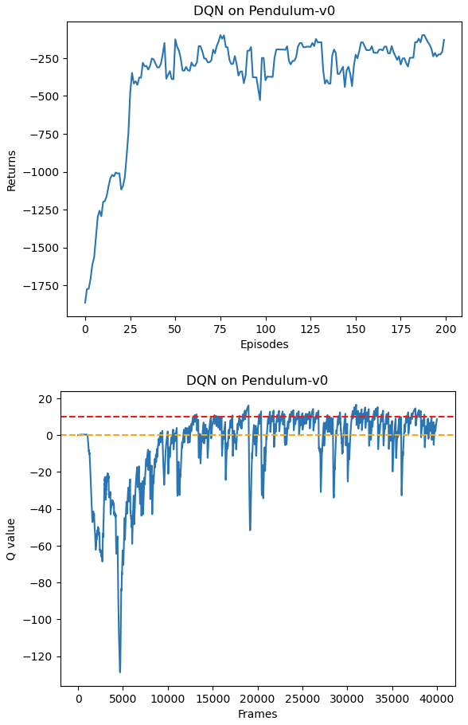

#### Double DQN结果

```python
random.seed(0)
np.random.seed(0)
env.seed(0)
torch.manual_seed(0)
replay_buffer = rl_utils.ReplayBuffer(buffer_size)
agent = DQN(state_dim, hidden_dim, action_dim, lr, gamma, epsilon,
            target_update, device, 'DoubleDQN')
return_list, max_q_value_list = train_DQN(agent, env, num_episodes,
                                          replay_buffer, minimal_size,
                                          batch_size)

episodes_list = list(range(len(return_list)))
mv_return = rl_utils.moving_average(return_list, 5)
plt.plot(episodes_list, mv_return)
plt.xlabel('Episodes')
plt.ylabel('Returns')
plt.title('Double DQN on {}'.format(env_name))
plt.show()

frames_list = list(range(len(max_q_value_list)))
plt.plot(frames_list, max_q_value_list)
plt.axhline(0, c='orange', ls='--')
plt.axhline(10, c='red', ls='--')
plt.xlabel('Frames')
plt.ylabel('Q value')
plt.title('Double DQN on {}'.format(env_name))
plt.show()
```

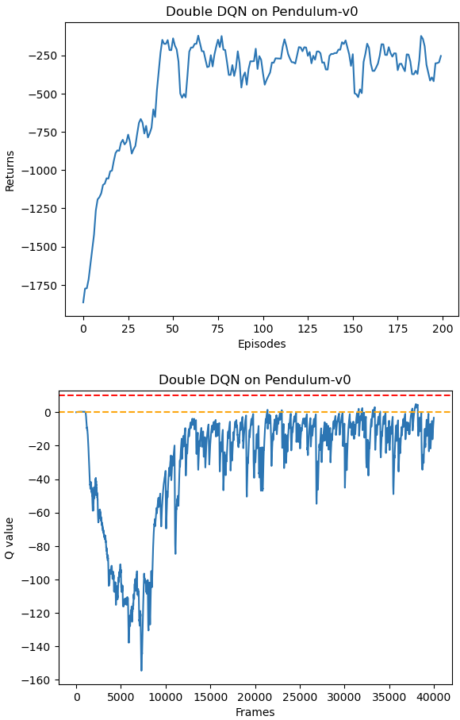

## Dueling DQN

在RL中，优势函数定义为 $A(s,a)=Q(s,a)-V(s)$ 

在同一状态下，所有动作的优势值和为0，因此在Dueling DQN中，Q函数被建模为
$$
Q(s,a;\eta,\alpha,\beta)=V(s;\eta,\alpha)+A(s,a;\eta,\beta)
$$

- $\eta$ 为状态价值函数和优势函数共享的参数，在神经网络中，用于提取特征的前几层
- $\alpha$ 和 $\beta$ 分别表示状态价值和优势函数的参数

我们不再让神经网络直接输出 Q 值，在最后一层的两个分支，分别输出状态价值函数和优势函数，再求和得到Q值

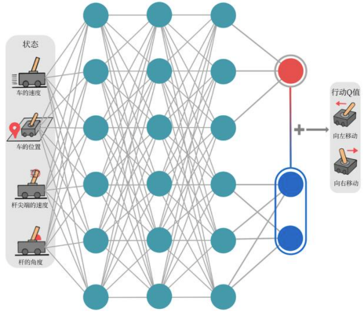

在Dueling DQN中，存在对于V函数和A函数建模不唯一问题

- 对于同样的Q值，若V值加上任意大小的常数C，所有A值减去C，则Q值不变，但其余的Q'值就不等于其真实Q'值

为解决这一问题，强制最优动作的优势函数输出为0
$$
Q(s,a;\eta,\alpha,\beta)=V(s;\eta,\alpha)+A(s,a;\eta,\beta)-\max\limits_{a}A(s,a;\eta,\beta)
$$
在实现过程中，也可以用平均代替最大
$$
Q(s,a;\eta,\alpha,\beta)=V(s;\eta,\alpha)+A(s,a;\eta,\beta)-\frac{1}{\vert \mathcal{A}(s)\vert}\sum\limits_{a} A(s,a;\eta,\beta)
$$
此时，$V(s)=\frac{1}{\vert \mathcal{A}(s)\vert}\sum\limits_{a} Q(s,a)$ ，虽然不再满足贝尔曼最优方程，但实际更稳定

每次更新，V函数都会被更新，也会影响到其他动作的Q值，传统DQN值更新某个动作的Q值，其他动作的Q值不会被更新。换句话说，Dueling DQN能更加频繁、准确地学习状态价值函数，由收缩映射求解BOE过程可知，越早更新，收敛越快

### 实现

```python
class VAnet(torch.nn.Module):
    ''' 只有一层隐藏层的A网络和V网络 '''
    def __init__(self, state_dim, hidden_dim, action_dim):
        super(VAnet, self).__init__()
        self.fc1 = torch.nn.Linear(state_dim, hidden_dim)  # 共享网络部分
        self.fc_A = torch.nn.Linear(hidden_dim, action_dim)
        self.fc_V = torch.nn.Linear(hidden_dim, 1)

    def forward(self, x):
        A = self.fc_A(F.relu(self.fc1(x)))
        V = self.fc_V(F.relu(self.fc1(x)))
        Q = V + A - A.mean(1).view(-1, 1)  # Q值由V值和A值计算得到
        return Q
```

```python
class DQN:
    ''' DQN算法,包括Double DQN和Dueling DQN '''
    def __init__(self,
                 state_dim,
                 hidden_dim,
                 action_dim,
                 learning_rate,
                 gamma,
                 epsilon,
                 target_update,
                 device,
                 dqn_type='VanillaDQN'):
        self.action_dim = action_dim
        if dqn_type == 'DuelingDQN':  # Dueling DQN采取不一样的网络框架
            self.q_net = VAnet(state_dim, hidden_dim, self.action_dim).to(device)
            self.target_q_net = VAnet(state_dim, hidden_dim, self.action_dim).to(device)
        else:
            self.q_net = Qnet(state_dim, hidden_dim, self.action_dim).to(device)
            self.target_q_net = Qnet(state_dim, hidden_dim, self.action_dim).to(device)
        self.optimizer = torch.optim.Adam(self.q_net.parameters(),lr=learning_rate)
        self.gamma = gamma
        self.epsilon = epsilon
        self.target_update = target_update
        self.count = 0
        self.dqn_type = dqn_type
        self.device = device

    def take_action(self, state):
        if np.random.random() < self.epsilon:
            action = np.random.randint(self.action_dim)
        else:
            state = torch.tensor(np.array([state]), dtype=torch.float).to(self.device)
            action = self.q_net(state).argmax().item()
        return action

    def max_q_value(self, state):
        state = torch.tensor([state], dtype=torch.float).to(self.device)
        return self.q_net(state).max().item()

    def update(self, transition_dict):
        states = torch.tensor(transition_dict['states'], dtype=torch.float).to(self.device)
        actions = torch.tensor(transition_dict['actions']).view(-1, 1).to(self.device)
        rewards = torch.tensor(transition_dict['rewards'], dtype=torch.float).view(-1, 1).to(self.device)
        next_states = torch.tensor(transition_dict['next_states'], dtype=torch.float).to(self.device)
        dones = torch.tensor(transition_dict['dones'], dtype=torch.float).view(-1, 1).to(self.device)

        q_values = self.q_net(states).gather(1, actions)
        if self.dqn_type == 'DoubleDQN':
            max_action = self.q_net(next_states).max(1)[1].view(-1, 1)
            max_next_q_values = self.target_q_net(next_states).gather(1, max_action)
        else:
            max_next_q_values = self.target_q_net(next_states).max(1)[0].view(-1, 1)
        q_targets = rewards + self.gamma * max_next_q_values * (1 - dones)
        dqn_loss = torch.mean(F.mse_loss(q_values, q_targets))
        self.optimizer.zero_grad()
        dqn_loss.backward()
        self.optimizer.step()

        if self.count % self.target_update == 0:
            self.target_q_net.load_state_dict(self.q_net.state_dict())
        self.count += 1
```

### 训练过程

```python
random.seed(0)
np.random.seed(0)
env.seed(0)
torch.manual_seed(0)
replay_buffer = rl_utils.ReplayBuffer(buffer_size)
agent = DQN(state_dim, hidden_dim, action_dim, lr, gamma, epsilon,
            target_update, device, 'DuelingDQN')
return_list, max_q_value_list = train_DQN(agent, env, num_episodes,
                                          replay_buffer, minimal_size,
                                          batch_size)

episodes_list = list(range(len(return_list)))
mv_return = rl_utils.moving_average(return_list, 5)
plt.plot(episodes_list, mv_return)
plt.xlabel('Episodes')
plt.ylabel('Returns')
plt.title('Dueling DQN on {}'.format(env_name))
plt.show()

frames_list = list(range(len(max_q_value_list)))
plt.plot(frames_list, max_q_value_list)
plt.axhline(0, c='orange', ls='--')
plt.axhline(10, c='red', ls='--')
plt.xlabel('Frames')
plt.ylabel('Q value')
plt.title('Dueling DQN on {}'.format(env_name))
plt.show()
```

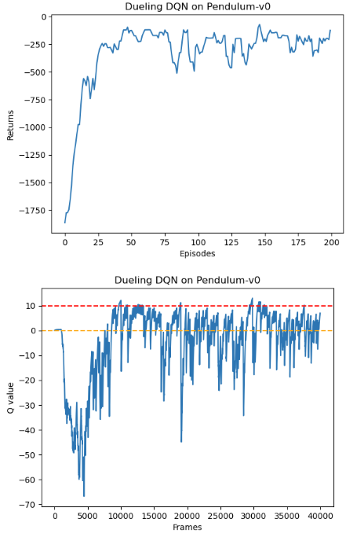


## Rainbow

结合众多Value-based 的DRL方法

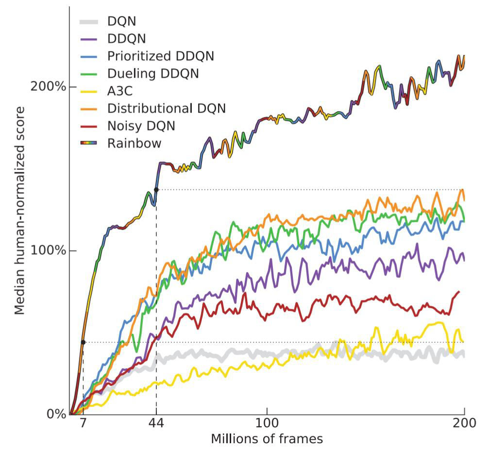

https://arxiv.org/pdf/1710.02298v1

step-by-step tutorial from DQN to Rainbow ：https://github.com/Curt-Park/rainbow-is-all-you-need


利用柯西变异对最优解进行扰动，帮助算法跳出局部最优——噪音网络可以跳出局部最优

https://kns.cnki.net/kcms2/article/abstract?v=m2RMPZxbF1KwDDxNKEe4QhTP_vy3bL8oaQruUyhFdavQ1TlUKymat-ONeDYvzpBYsA4hC0dkbvqL0LD_omClpP67PaLd-vnDT8szQzWeSyZo_QPfYBk93g==&uniplatform=NZKPT

使用拉丁超立方体抽样增强初始种群的均匀性和多样性