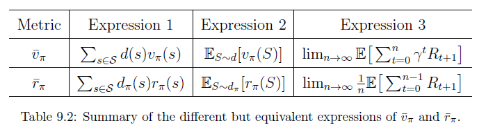
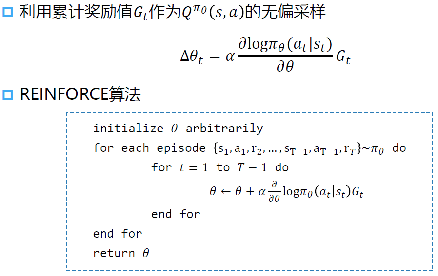
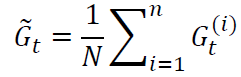
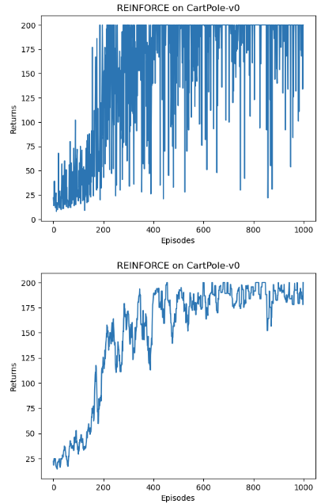

---
categories:
  - AI
  - 机器学习
  - 强化学习
tags:
  - AI
  - 机器学习
  - 强化学习
mathjax: true
title: 策略函数
abbrlink: 1565497506
date: 2024-05-11 09:59:41
---

[TOC]

<!--more-->

## 基于策略的RL方法

用策略函数 $\pi(a\vert s,\theta)$ 的输出表示当前状态下决策的可能性

- 更适合处理高维度或连续的动作空间
- 具有更好的收敛性质和稳定性
- 能够学习随机策略

**利用机器学习模型的泛化能力，将已知状态的策略泛化到未知状态的策略** 。

最优的策略可以通过最优化策略度量标量的目标函数获取，这种方法称为 **策略梯度** 

**所有的策略度量指标 $J(\pi)$ 都是 $\pi$ 的函数，而 $\pi(a\vert s,\theta)$ 是关于参数 $\theta$ 的函数 ，不同的参数值 $\theta$ 会影响策略优劣的度量值，因此，通过最优化 $\theta$ 的值来最大化这些度量指标，可以找到最优的策略** 

直观上理解：策略的梯度上升，是为了让策略更多采样到带来较高Q值的动作，更少采样带来较低Q值的动作

### 策略度量指标

#### 平均状态价值


$$
\begin{aligned}
\overline{V}_{\pi}&=\sum\limits_{s\in \mathcal{S}}d(s)V_{\pi}(s)=\mathbf{d}^T\mathbf{V}_{\pi}\\
&=E[V_{\pi}(S)]
\end{aligned}
$$

- $\overline{V}_{\pi}$ 为在策略 $\pi$ 下加权平均的状态价值
- $d(s)\ge 0,\sum\limits_{s\in \mathcal{S}}d(s)=1$ 是状态 $s$ 的权重，也可以理解为状态的概率分布 $S\sim d$ 

若求解加权平均，需要知道状态 $S$ 服从的分布 $d$ 

若状态分布与策略无关：平均状态价值记为 $\overline{V}_{\pi}^0$ 

- 每个状态都是同等重要的，将 $d_0$ 视为均匀分布，$d_0(s)=\frac{1}{\vert \mathcal{S}\vert}$ 
- 只关注特定的状态 $s_0$ ， 如在一些任务中所有回合都从相同的起始状态 $s_0$ 出发，实际上就是最大化从 $s_0$ 出发得到的回报，因此 $d_0(s_0)=1,d_0(s\neq s_0)=0\Rightarrow\overline{V}_{\pi}=V_{\pi}(s_0)$ 

若状态分布与策略有关： $d$ 是策略 $\pi$ 下的稳态分布

#### 平均单步奖励

$$
\overline{r}_{\pi}=\sum\limits_{s\in\mathcal{S}}d_{\pi}(s)r_{\pi}(s)=E[r_{\pi}(s)],S\sim d_{\pi}
$$

其中，$r_{\pi}(s)=\sum\limits_{a\in \mathcal{A}(s)}\pi(a\vert s,\theta)r(s,a)$ ，$r(s,a)=E[R\vert s,a]=\sum\limits_{r'}r'P(r'\vert s,a)$ 

#### 二者关系

$\overline{r}_{\pi}$ 是一种非常短视的度量指标，只考虑立即奖励，相反，$\overline{V}_{\pi}$ 是一种相对远视的度量指标，考虑到所有步的总奖励，虽然二者不相等，但成正比

一个达到最优，另一个也能达到极值

#### 两种度量指标的等价形式



### 策略度量指标的梯度

所有度量指标的梯度有一个统一形式
$$
\bigtriangledown_\theta J(\theta)=\sum\limits_{s\in \mathcal{S}}\eta(s)\sum\limits_{a\in \mathcal{A}(s)}\bigtriangledown_\theta\pi(a\vert s,\theta)\cdot Q_{\pi}(s,a)
$$

- $J(\theta)$ 是不同的策略度量指标 $\overline{V}_{\pi},\overline{r}_{\pi},\overline{V}_{\pi}^0$ 

- $=$ 可以是等于、近似、成比例

- $\eta$ 是状态的分布或状态的权重，在不同问题中呈现不同的分布

为便于计算，将策略的梯度改写为对数似然形式
$$
\bigtriangledown_\theta\pi(a\vert s,\theta)=\pi(a\vert s,\theta)\bigtriangledown_\theta \ln \pi(a\vert s,\theta)\iff\bigtriangledown_\theta \ln \pi(a\vert s,\theta)=\frac{\bigtriangledown_\theta\pi(a\vert s,\theta)}{\pi(a\vert s,\theta)}
$$
代入策略度量指标的梯度中，
$$
\bigtriangledown_\theta J(\theta)=E_{S\sim \eta,A\sim\pi(A\vert S,\theta)}\left[\bigtriangledown_\theta\ln\pi(A\vert S,\theta)\cdot Q_{\pi}(S,A)\right]
$$

#### softmax随机策略

需要计算 $\ln\pi(a\vert s,\theta)$ ，必须保证 $\pi(a\vert s,\theta)>0,\forall a,s,\theta$ 

用softmax将决策值可以归一化为
$$
\pi(a\vert s,\theta)=\frac{e^{h(s,a,\theta)}}{\sum\limits_{a'\in \mathcal{A}(s)}e^{h(s,a',\theta)}}
$$
其中，$\pi(a\vert s,\theta)$ 的值由函数 $h(s,a,\theta)$ 确定，即 $h(\cdot)$ 为参数为 $\theta$ 的策略函数，输入状态会给出该状态下执行某个动作的概率

策略函数 $h(\cdot)$ 可以用神经网络实现，输入为 $s$ ，参数为 $\theta$，输出由 $\vert \mathcal{A}(s)\vert$ 个


### 策略优化

对策略函数的优化方法通过梯度上升法最大化 $J(\theta)$ 
$$
\begin{aligned}
\theta_{t+1}&=\theta_{t}+\alpha\bigtriangledown_\theta J(\theta)\\
&=\theta_{t}+\alpha E_{S\sim \eta,A\sim\pi(A\vert S,\theta)}\left[\bigtriangledown_\theta\ln\pi(A\vert S,\theta)\cdot Q_{\pi}(S,A)\right]\\
&\xlongequal{随机梯度上升法}\theta_{t}+\alpha\bigtriangledown_\theta\ln\pi(a_t\vert s_t,\theta_{t})\cdot Q_{\pi}(s_t,a_t)
\end{aligned}
$$
真实的动作价值 $Q_{\pi}(s_t,a_t)$ 也是未知的，需要近似

- 基于MC方法去近似动作价值，称为 **REINFORCE** 算法

  用累积奖励值的无偏采样 $Q_{t}(s_t,a_t)=G_t$ 去近似 $Q_{\pi}(s_t,a_t)$ 

- AC框架基于TD算法去近似

## REINFORCE



也可以用过多轮预演的均值来近似Q



- 同策略学习，但必须等一个回合的数据采集完成后才能调整一次策略
- 从单个或多个片段中采样到的回报去估计动作价值有很高的方差

REINFORCE 算法理论上是能保证局部最优的，它实际上是借助蒙特卡洛方法采样轨迹来估计动作价值，这种做法的一大优点是可以得到无偏的梯度。但是，正是因为使用了蒙特卡洛方法，REINFORCE 算法的梯度估计的方差很大，可能会造成一定程度上的不稳定，这也是 Actor-Critic 算法要解决的问题

REINFORCE 算法便是采用了蒙特卡洛方法来估计Q值函数

### 车杆环境

```python
import gym
import torch
import torch.nn as nn
import torch.nn.functional as F
import numpy as np
import matplotlib.pyplot as plt
from tqdm import tqdm
import rl_utils
```

### 策略网络

```python
class PolicyNet(nn.Module):
    """
    定义策略网络，其输入是某个状态，输出则是该状态下的动作概率分布。
    """
    def __init__(self, state_dim:int, hidden_dim:int, action_dim:int):
        super().__init__()
        self.fc1 = nn.Linear(state_dim, hidden_dim)
        self.fc2 = nn.Linear(hidden_dim, action_dim)

    def forward(self, x:torch.Tensor) -> torch.Tensor:
        """
        这里采用在离散动作空间上的 softmax() 函数来实现一个可学习的多项分布(multinomial distribution)。
        """
        x = F.relu(self.fc1(x))
        return F.softmax(self.fc2(x), dim=1)
```

```PYTHON
class REINFORCE:
    """
    REINFORCE 算法
    """
    def __init__(self, 
            state_dim:int, hidden_dim:int, action_dim:int, 
            learning_rate:float, gamma:float, 
            device:torch.device
        ):
        self.policy_net = PolicyNet(state_dim, hidden_dim, action_dim).to(device)
        self.optimizer = torch.optim.Adam(self.policy_net.parameters(), lr=learning_rate)  # 使用Adam优化器
        self.gamma = gamma  # 折扣因子
        self.device = device

    def take_action(self, state:np.ndarray) -> int:
        """根据动作概率分布随机采样"""
        state = torch.tensor(np.array([state]), dtype=torch.float).to(self.device)
        probs = self.policy_net(state)
        # 用于处理离散概率分布，Categorical类提供了许多有用的方法来抽样、计算概率和熵等
        action_dist = torch.distributions.Categorical(probs)
        action = action_dist.sample()
        return action.item()

    def update(self, transition_dict:dict):
        # 一个episode结束后，才会更新一次策略函数的参数
        reward_list = transition_dict['rewards']
        state_list = transition_dict['states']
        action_list = transition_dict['actions']

        G = 0
        self.optimizer.zero_grad()
        for i in reversed(range(len(reward_list))):  # 从最后一步算起
            reward = reward_list[i]
            state = torch.tensor(np.array([state_list[i]]), dtype=torch.float).to(self.device)
            action = torch.tensor(np.array([action_list[i]]), dtype=torch.int64).view(-1, 1).to(self.device)
            # 获取当前状态下执行这个动作的概率的log值
            log_prob = torch.log(self.policy_net(state).gather(1, action))
            G = self.gamma * G + reward
            loss = -log_prob * G  # 每一步的损失函数
            loss.backward()  # 反向传播计算梯度
        self.optimizer.step()  # 梯度下降
```

### 训练过程

```python
learning_rate = 1e-3
num_episodes = 1000
hidden_dim = 128
gamma = 0.98
device = torch.device("cuda") if torch.cuda.is_available() else torch.device("cpu")

env_name = "CartPole-v0"
env = gym.make(env_name)
env.seed(0)
torch.manual_seed(0)
state_dim = env.observation_space.shape[0]
action_dim = env.action_space.n
agent = REINFORCE(state_dim, hidden_dim, action_dim, learning_rate, gamma, device)

return_list = []
for i in range(10):
    with tqdm(total=int(num_episodes / 10), desc='Iteration %d' % i) as pbar:
        for i_episode in range(int(num_episodes / 10)):
            episode_return = 0
            transition_dict = {
                'states': [],
                'actions': [],
                'next_states': [],
                'rewards': [],
                'dones': []
            }
            state = env.reset()
            done = False
            while not done:
                action = agent.take_action(state)
                next_state, reward, done, _ = env.step(action)
                transition_dict['states'].append(state)
                transition_dict['actions'].append(action)
                transition_dict['next_states'].append(next_state)
                transition_dict['rewards'].append(reward)
                transition_dict['dones'].append(done)
                state = next_state
                episode_return += reward
            return_list.append(episode_return)
            agent.update(transition_dict)
            if (i_episode + 1) % 10 == 0:
                pbar.set_postfix({
                    'episode':
                    '%d' % (num_episodes / 10 * i + i_episode + 1),
                    'return':
                    '%.3f' % np.mean(return_list[-10:])
                })
            pbar.update(1)
```

### 结果

```python
import os
os.environ["KMP_DUPLICATE_LIB_OK"]="TRUE"

episodes_list = list(range(len(return_list)))
plt.plot(episodes_list, return_list)
plt.xlabel('Episodes')
plt.ylabel('Returns')
plt.title('REINFORCE on {}'.format(env_name))
plt.show()

mv_return = rl_utils.moving_average(return_list, 9)
plt.plot(episodes_list, mv_return)
plt.xlabel('Episodes')
plt.ylabel('Returns')
plt.title('REINFORCE on {}'.format(env_name))
plt.show()
```

训练过程大约用了5min



随着收集到的轨迹越来越多，REINFORCE 算法有效地学习到了最优策略。不过，相比于前面的 DQN 算法，**REINFORCE 算法使用了更多的序列**，这是因为 REINFORCE 算法是一个在线策略算法，之前收集到的轨迹数据不会被再次利用。

此外，REINFORCE 算法的性能也有一定程度的波动，这主要是因为每条采样轨迹的回报值波动比较大，这也是 REINFORCE 算法主要的不足。
