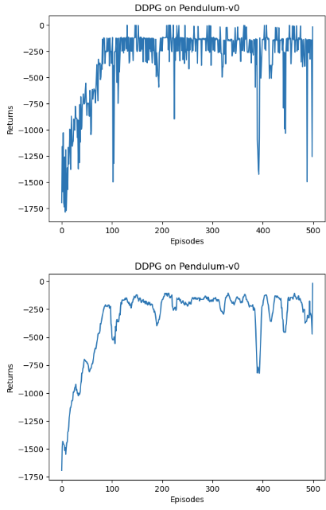

---
categories:
  - AI
  - 机器学习
  - 强化学习
tags:
  - AI
  - 机器学习
  - 强化学习
mathjax: true
title: AC算法
abbrlink: 4090861452
date: 2024-05-11 10:00:00
---

[TOC]

<!--more-->

> 将价值近似函数引入到策略梯度中，得到了 Actor-Critic 方法
>
> Critic：策略评估/价值评估，用度量指标衡量策略的优劣
>
> - 学会准确估计演员策略所采取动作的价值函数
>
> Actor：策略提升，策略会被应用于决策/动作选择
>
> - 生成使评论家满意的策略

## AC基本思路

1. 初始化：

   用于度量策略好坏的策略度量指标函数/目标函数 $J(\theta)$ ，如：$\overline{V}_{\pi},\overline{r}_{\pi}$ 

2. Critic（策略评估）：最小化价值函数与价值的损失
   $$
   Q(s,a)\simeq \hat{Q}_{w}(s,a)= r(s,a)+\gamma E_{s'\sim P(s'\vert s,a),a'\sim \pi_{w}(a'\vert s')}\left[Q_{w}(s',a')\right]\\
   w_{t+1}=w_{t}+\alpha_w \left[r_{t+1}+\gamma \hat{Q}_t(s_{t+1},a_{t+1},w_{t})-\hat{Q}_t(s_t,a_t,w_{t})\right]\bigtriangledown_w \hat{Q}(s_t,a_t,w_{t})
   $$

3. Actor（策略更新）

   通过梯度上升法最大化 $J(\theta)$ 
   $$
   \begin{aligned}
   \theta_{t+1}&=\theta_{t}+\alpha\bigtriangledown_\theta J(\theta_{t})\\
   &=\theta_{t}+\alpha E_{S\sim \eta,A\sim\pi(A\vert S,\theta)}\left[\bigtriangledown_\theta\ln\pi(A\vert S,\theta)\cdot Q_{\pi}(S,A)\right]
   \end{aligned}
   $$
   为便于计算，使用随机梯度上升法
   $$
   \theta_{t+1}=\theta_{t}+\alpha\bigtriangledown_\theta\ln\pi(a_t\vert s_t,\theta)\cdot Q_{t}(s_t,a_t)
   $$

策略梯度的方法为 **Actor** ，其中 $Q_t(s_t,a_t)$ 作为价值评估/策略评估，对应 **Critic** 

对于 $\hat{Q}_{w}(s,a)$ ，若使用TD方法，这类算法统称为 AC 方法

## QAC

Sarsa中，将PE的价值评估变为值函数近似，将PI阶段的策略提升变为策略梯度
$$
\begin{array}{ll}
\hline
&初始化：带参策略函数 \pi(a\vert s,\theta),\gamma\in (0,1),\alpha>0\\
&目标：寻找最优策略即最大化目标函数 J(\theta)\\
& 对于每个回合的t时刻：\\
&\quad 基于策略 \pi(a\vert s_t,\theta_{t})生成动作 a_t,获得r_{t+1},s_{t+1},再基于\pi(a\vert s_{t+1},\theta_{t}) 生成a_{t+1}\\
&\qquad 即(s_t,a_t,r_{t+1},s_{t+1},a_{t+1})\\
&\quad Critic(价值更新):\\
&\qquad w_{t+1}=w_{t}+\alpha_w \left[r_{t+1}+\gamma \hat{Q}_t(s_{t+1},a_{t+1},w_{t})-\hat{Q}_t(s_t,a_t,w_{t})\right]\bigtriangledown_w \hat{Q}(s_t,a_t,w_{t})\\
&\quad Actor(策略更新):\\
&\qquad \theta_{t+1}=\theta_{t}+\alpha_{\theta}\bigtriangledown_\theta\ln\pi(a_t\vert s_t,\theta)\cdot \hat{Q}_{t}(s_t,a_t,w_{t+1})
\\
\hline
\end{array}
$$
一种同策略算法

## A2C

使用一条经验去调整Actor的策略，存在较大方差，所以在Actor对策略改进时，引入一个偏置量 $b(s)$ 减小方差

数学可证： **策略梯度对于额外的偏置量是不变的** 
$$
\begin{aligned}
\bigtriangledown_\theta J(\theta)&=E_{S\sim \eta,A\sim\pi(A\vert S,\theta)}\left[\bigtriangledown_\theta\ln\pi(A\vert S,\theta)\cdot Q_{\pi}(S,A)\right]\\
&=E_{S\sim \eta,A\sim\pi(A\vert S,\theta)}\left[\bigtriangledown_\theta\ln\pi(A\vert S,\theta)\cdot \left(Q_{\pi}(S,A)-b(S)\right)\right]
\end{aligned}
$$
最优偏差，令策略梯度方差=0时
$$
b^*=\frac{E_{A\sim \pi}\left[\Vert \bigtriangledown_\theta\ln\pi\Vert^2_2\right]Q_{\pi}(s,A)}{E_{A\sim \pi}\left[\Vert \bigtriangledown_\theta\ln\pi\Vert^2_2\right]},s\in \mathcal{S}
$$

- 可见，REINFORCE和QAC都令偏置=0，策略更新的方差大

为了计算方便，移除权重
$$
b(s)=E_{A\sim\pi(A\vert S,\theta_{t})}\left[Q(s,A)\right]=V_{\pi(\theta_{t})}(s)
$$
代入原先的策略梯度更新式
$$
\begin{aligned}
\theta_{t+1}&=\theta_{t}+\alpha E_{S\sim \eta,A\sim\pi(A\vert S,\theta_{t})}\left[\bigtriangledown_\theta\ln\pi(A\vert S,\theta_{t})\cdot \left(Q_{\pi}(S,A)-V_{\pi}(S)\right)\right]\\
&\xlongequal{\delta_{\pi}(S,A)=Q_{\pi}(S,A)-V_{\pi}(S)}\theta_{t}+\alpha E_{S\sim \eta,A\sim\pi(A\vert S,\theta_{t})}\left[\bigtriangledown_\theta\ln\pi(A\vert S,\theta_{t})\cdot \delta_{\pi}(S,A)\right]
\end{aligned}
$$

- 对优势函数的理解：由于状态价值是动作价值的加权和，若某个动作价值比均值大，说明这个动作是比较好的，其 $Q(s,a)$ 比均值大，$\delta_{\pi}(s,a)>0$ ，这个动作具有一定优势

  因为我们在用动作价值更新动作时，只关心动作价值间的相对大小

- 在计算上，优势函数可以用TD误差来近似
  $$
  \begin{aligned}
  &\hat{\delta}(s_t,a_t,w_{t})=\hat{Q}_{t}(s_t,a_t,w_{t})-\hat{V}_{t}(s_t,w_{t})\\
  \Longrightarrow&\hat{\delta}(s_t,w_{t})=r_{t+1}+\gamma \hat{V}_t(s_{t+1},w_{t})-\hat{V}_{t}(s_t,w_{t})
  \end{aligned}
  $$

用随机梯度上升，更新策略
$$
\theta_{t+1}=\theta_{t}+\alpha \bigtriangledown_\theta\ln\pi(a_t\vert s_t,\theta_{t})\cdot \hat{\delta}_{t}(s_t,a_t)
$$

$$
\begin{array}{ll}
\hline
&初始化：带参策略函数 \pi(a\vert s,\theta),\gamma\in (0,1),\alpha>0\\
&目标：寻找最优策略即最大化目标函数 J(\theta)\\
& 对于每个回合的t时刻：\\
&\quad 基于策略 \pi(a\vert s_t,\theta_{t})生成动作 a_t,获得r_{t+1},s_{t+1}\\
&\quad TD误差：\\
&\qquad \hat{\delta}_t=r_{t+1}+\gamma \hat{V}(s_{t+1},w_{t})-\hat{V}(s_t,w_{t})\\
&\quad Critic(价值更新):\\
&\qquad w_{t+1}=w_{t}+\alpha_w \hat{\delta}_t\bigtriangledown_w \hat{V}(s_t,w_{t})\\
&\quad Actor(策略更新):\\
&\qquad \theta_{t+1}=\theta_{t}+\alpha_{\theta}\hat{\delta}_t\bigtriangledown_\theta\ln\pi(a_t\vert s_t,\theta)
\\
\hline
\end{array}
$$

- 同策略算法

### 车杆环境

```python
import gym
import torch
import torch.nn as nn
import torch.nn.functional as F
import numpy as np
import matplotlib.pyplot as plt
import rl_utils
```

### 价值网络与策略网络

```python
class PolicyNet(nn.Module):
    """
    定义策略网络，与REINFORCE算法一样。其输入是某个状态，输出则是该状态下的动作概率分布
    """
    def __init__(self, state_dim:int, hidden_dim:int, action_dim:int):
        super().__init__()
        self.fc1 = nn.Linear(state_dim, hidden_dim)
        self.fc2 = nn.Linear(hidden_dim, action_dim)

    def forward(self, x:torch.Tensor) -> torch.Tensor:
        x = F.relu(self.fc1(x))
        return F.softmax(self.fc2(x), dim=1)

class ValueNet(nn.Module):
    """
    定义价值网络，其输入是某个状态，输出则是状态的价值。
    """
    def __init__(self, state_dim:int, hidden_dim:int):
        super().__init__()
        self.fc1 = nn.Linear(state_dim, hidden_dim)
        self.fc2 = nn.Linear(hidden_dim, 1)

    def forward(self, x:torch.Tensor) -> torch.Tensor:
        x = F.relu(self.fc1(x))
        return self.fc2(x)
```

```python
class ActorCritic(rl_utils.BasePolicy):
    """
    定义Actor-Critic算法
    """
    def __init__(self, 
            state_dim:int, hidden_dim:int, action_dim:int, 
            actor_lr:float, critic_lr:float, gamma:float, device:torch.device
        ):
        self.actor = PolicyNet(state_dim, hidden_dim, action_dim).to(device)
        self.critic = ValueNet(state_dim, hidden_dim).to(device)  
        self.actor_optimizer = torch.optim.Adam(self.actor.parameters(), lr=actor_lr)                                     
        self.critic_optimizer = torch.optim.Adam(self.critic.parameters(), lr=critic_lr)  

        self.gamma = gamma
        self.device = device

    def take_action(self, state:np.ndarray) -> int:
        state = torch.tensor(np.array([state]), dtype=torch.float).to(self.device)
        probs = self.actor(state)
        action_dist = torch.distributions.Categorical(probs)
        action = action_dist.sample()
        return action.item()

    def update(self, transition_dict:dict):
        states = torch.tensor(transition_dict['states'], dtype=torch.float).to(self.device)
        actions = torch.tensor(transition_dict['actions']).view(-1, 1).to(self.device)
        rewards = torch.tensor(transition_dict['rewards'], dtype=torch.float).view(-1, 1).to(self.device)
        next_states = torch.tensor(transition_dict['next_states'], dtype=torch.float).to(self.device)
        dones = torch.tensor(transition_dict['dones'], dtype=torch.float).view(-1, 1).to(self.device)

        # 时序差分目标
        td_target = rewards + self.gamma * self.critic(next_states) * (1 - dones)
        # 时序差分误差
        td_delta = td_target - self.critic(states)  
        log_probs = torch.log(self.actor(states).gather(1, actions))
        actor_loss = torch.mean(-log_probs * td_delta.detach())
        # 均方误差损失函数
        critic_loss = torch.mean(F.mse_loss(self.critic(states), td_target.detach()))
        self.actor_optimizer.zero_grad()
        self.critic_optimizer.zero_grad()
        actor_loss.backward()  # 计算策略网络的梯度
        critic_loss.backward()  # 计算价值网络的梯度
        self.actor_optimizer.step()  # 更新策略网络的参数
        self.critic_optimizer.step()  # 更新价值网络的参数
```

### 训练过程

```python
actor_lr = 1e-3
critic_lr = 1e-2
num_episodes = 1000
hidden_dim = 128
gamma = 0.98
device = torch.device("cuda") if torch.cuda.is_available() else torch.device("cpu")

env_name = 'CartPole-v0'
env = gym.make(env_name)
env.seed(0)
torch.manual_seed(0)
state_dim = env.observation_space.shape[0]
action_dim = env.action_space.n
agent = ActorCritic(state_dim, hidden_dim, action_dim, actor_lr, critic_lr, gamma, device)

return_list = rl_utils.train_on_policy_agent(env, agent, num_episodes)
```


训练过程大约用了2.5min。

Actor-Critic 算法很快便能收敛到最优策略，并且训练过程非常稳定，抖动情况相比 REINFORCE 算法有了明显的改进，这说明价值函数的引入减小了方差。

## 异策略A2C

为提高样本效率，使用不同策略采集到的样本，价值函数需要引入重要性权重

$$
\overline{V}_{\pi}(s)=\frac{\pi(a_t\vert s_t)}{\mu(a_t\vert s_t)}\left[R_{\mu}(s)+\gamma V^{(t)}_{\pi}(s')\right]\\
\overline{Q}_{\pi}(s,a)=\frac{\pi(a_t\vert s_t)}{\mu(a_t\vert s_t)}\left[R_{\mu}(s,a)+\gamma Q^{(t)}_{\pi}(s',a')\right]
$$
相应的策略梯度变为
$$
\bigtriangledown_{\theta}J(\theta)=E_{S\sim \eta,A\sim \mu}\left[\frac{\pi(A\vert S,\theta)}{\mu(A\vert S)}\bigtriangledown_\theta\ln\pi(A\vert S,\theta)Q_{\pi}(S,A)\right]
$$
使用优势函数的策略参数更新式为
$$
\theta_{t+1}=\theta_{t}+\alpha\frac{\pi(a_t\vert s_t,\theta_{t})}{\mu(a_t\vert s_t)}\bigtriangledown_\theta\ln\pi(a_t\vert s_t,\theta_{t})\cdot \left(\underbrace{\hat{Q}_{t}(s_t,a_t,w_{t})-\hat{V}_{t}(s_t,w_{t})}_{\delta_t(s_t,a_t)}\right)
$$
为了便于计算，将优势函数 $\delta_t(s_t,a_t)$ 用TD误差去近似
$$
\hat{Q}_{t}(s_t,a_t,w_{t})-\hat{V}_{t}(s_t,w_{t})\approx r_{t+1}+\gamma \hat{V}_{t}(s_{t+1},w_{t})-\hat{V}_t(s_t,w_{t})=\hat{\delta}_t(s_t,a_t)
$$
因此，异策略梯度优化为
$$
\theta_{t+1}=\theta_{t}+\alpha\frac{\pi(a_t\vert s_t,\theta_{t})}{\mu(a_t\vert s_t)}\bigtriangledown_\theta\ln\pi(a_t\vert s_t,\theta_{t})\cdot \hat{\delta}_t(s_t,a_t)
$$

$$
\begin{array}{ll}
\hline
&初始化：探索策略为\mu(a\vert s),带参目标策略函数 \pi(a\vert s,\theta_{0}),\gamma\in (0,1),\alpha>0\\
&\qquad \qquad 状态价值近似函数 \hat{V}(s,w^{(0)})\\
&目标：寻找最优策略即最大化目标函数 J(\theta)\\
& 对于每个回合的t时刻：\\
&\quad 基于探索策略 \mu(a\vert s_t)生成动作 a_t,获得r_{t+1},s_{t+1}\\
&\quad TD误差（优势函数）：\\
&\qquad \hat{\delta}_t=r_{t+1}+\gamma \hat{V}(s_{t+1},w_{t})-\hat{V}(s_t,w_{t})\\
&\quad Critic(价值更新):\\
&\qquad w_{t+1}=w_{t}+\alpha_w \hat{\delta}_t\frac{\pi(a_t\vert s_t,\theta_{t})}{\mu(a_t\vert s_t)}\bigtriangledown_w \hat{V}(s_t,w_{t})\\
&\quad Actor(策略更新):\\
&\qquad \theta_{t+1}=\theta_{t}+\alpha_{\theta}\hat{\delta}_t\frac{\pi(a_t\vert s_t,\theta_{t})}{\mu(a_t\vert s_t)}\bigtriangledown_\theta\ln\pi(a_t\vert s_t,\theta)
\\
\hline
\end{array}
$$


## DDPG

### DPG

改用确定性策略，可以处理连续的动作，表示为 $a=\pi(s,\theta)$ ，相当于采取某个动作的概率为1，其余动作概率为0

**确定性策略梯度的统一形式** 
$$
\begin{aligned}
\bigtriangledown_\theta J(\theta)&=\sum\limits_{s\in \mathcal{S}}\eta(s)\bigtriangledown_{\theta}\pi(s)\left(\bigtriangledown_{a}Q_{\pi}(s,a)\right)\vert_{a=\pi(s,\theta)}\\
&=E_{s\sim \eta}\left[\bigtriangledown_{\theta}\pi(s)\left(\bigtriangledown_{a}Q_{\pi}(s,a)\right)\vert_{a=\pi(s,\theta)}\right]
\end{aligned}
$$

- $\eta$ 为状态 $s$ 的分布，具体表达式由探索策略下状态的稳态分布与基于策略 $\pi$ 的状态转移确定
- 对于策略 $\pi$ 下的动作价值 $Q_{\pi}(s,a)$ ，先对 $a$ 求梯度，然后将所有的动作替换为 $\pi(s)$ ——二者是等价的

**DPG天然是异策略** ，不需要重要性采样进行转换

actor 是异策略的：求策略度量梯度时并不涉及动作的分布，因为这个动作 $a$ 会被替换为 $\pi(s)$ ，所以不需要 $A$ 对应的分布

critic 也是异策略的：对价值函数的近似需要的经验样本是 $(s_t,a_t,r_{t+1},s_{t+1},\tilde{a}_{t+1})$ ，$\tilde{a}_{t+1}=\pi(s_{t+1})$ ，这个经验样本的生成涉及两个策略

- 第一个策略是对状态 $s_t$ 时生成 $a_t$ ，这个策略是探索策略，$a_{t}$ 用于与环境交互

- 第二个策略是对状态 $s_{t+1}$ 生成 $\tilde{a}_{t+1}$ ，这个策略必须是 $\pi$ 

**两种常用的策略度量指标的梯度**

平均状态价值
$$
J(\theta)=\overline{V}_{\pi}=E[V_{\pi}(S)]=\sum\limits_{s\in \mathcal{S}}d_0(s)V_{\pi}(s)
$$

- $\sum\limits_{s\in \mathcal{S}}d_0(s)=1$ ，为了便于计算，状态服从与策略 $\pi$ 独立的稳态分布
  - $d_0(s_0)=1$ 且 $d_0(s\neq s_0)=0$ ，其中状态 $s_0$ 是我们关注的起始状态
  - $d_0$ 是另一个不同于 $\pi$ 的探索策略 $\mu$ 下的稳态分布

- 计算 $\bigtriangledown_{\theta}V_{\pi}(s)$ 的梯度
  $$
  \bigtriangledown_{\theta}V_{\pi}(s)=\sum\limits_{s'\in\mathcal{S}}Pr_{\pi}(s'\vert s)\bigtriangledown_{\theta}\pi(a\vert s',\theta)\left(\bigtriangledown_aQ_{\pi}(s',a)\right)\vert_{a=\pi(s')}
  $$
  $Pr_{\pi}(s'\vert s)=\sum\limits_{k=0}^{\infty}\gamma^k\left[P^{k}_{\pi}\right]_{ss'}=\left[(I-\gamma P_{\pi})^{-1}\right]_{ss'}$ ，表示基于策略 $\pi$ 从状态 $s$ 转移到 $s'$ 的概率

- 策略度量指标的梯度 $\bigtriangledown_\theta J(\theta)$ 为
  $$
  \begin{aligned}
  \bigtriangledown_\theta J(\theta)&=\sum\limits_{s\in \mathcal{S}}\eta_{\pi}(s)\bigtriangledown_\theta \pi(s,\theta)(\bigtriangledown_a Q_{\pi}(s,a))\vert_{a=\pi(s)}\\
  &=E_{S\sim \eta_{\pi}}\left[\bigtriangledown_\theta \pi(s,\theta)(\bigtriangledown_a Q_{\pi}(s,a))\vert_{a=\pi(s)}\right]
  \end{aligned}
  $$
  $\eta_{\pi}(s)=\sum\limits_{s'\in \mathcal{S}}d_0(s')Pr_{\pi}(s\vert s')$ ，$Pr_{\pi}(s\vert s’)=\sum\limits_{k=0}^{\infty}\gamma^k\left[P^{k}_{\pi}\right]_{s's}=\left[(I-\gamma P_{\pi})^{-1}\right]_{s's}$ ，表示基于策略 $\pi$ 从状态 $s'$ 转移到 $s$ 的概率

平均单步立即奖励

- 策略梯度为
  $$
  \begin{aligned}
  \bigtriangledown_{\theta}J(\theta)&=\sum\limits_{s\in \mathcal{S}}d_{\pi}(s)\bigtriangledown_\theta\pi(a\vert s,\theta)\left(\bigtriangledown_a Q_{\pi}(s,a)\right)\vert_{a=\pi(s,\theta)}\\
  &=E_{S\sim d_{\pi}}\left[\bigtriangledown_\theta\pi(a\vert s,\theta)\left(\bigtriangledown_a Q_{\pi}(s,a)\right)\vert_{a=\pi(s,\theta)}\right]
  \end{aligned}
  $$
  $d_{\pi}$ 为状态 $S$ 基于策略 $\pi$ 的稳态分布

**梯度上升更新策略**

基于策略梯度，使用梯度上升法最大化策略度量函数
$$
\theta_{t+1}=\theta_{t}+\alpha_{\theta}E_{S\sim \eta_{\pi}}\left[\bigtriangledown_\theta \pi(s,\theta)(\bigtriangledown_a Q_{\pi}(s,a))\vert_{a=\pi(s)}\right]
$$
相应的使用随机梯度上升法去近似
$$
\theta_{t+1}=\theta_{t}+\alpha_{\theta}\bigtriangledown_\theta \pi(s_t,\theta_{t})(\bigtriangledown_a Q_{\pi}(s_t,a))\vert_{a=\pi(s_t)}
$$

#### 伪代码

$$
\begin{array}{ll}
\hline
&初始化：探索策略为\mu(a\vert s),带参确定性目标策略函数 \pi(s,\theta_{0}),\gamma\in (0,1),\alpha>0\\
&\qquad \qquad 状态价值近似函数 \hat{V}(s,w^{(0)})\\
&目标：寻找最优策略即最大化目标函数 J(\theta)\\
& 对于每个回合的t时刻：\\
&\quad 基于探索策略 \mu(s_t,\theta_{t})生成动作 a_t,获得r_{t+1},s_{t+1}\\
&\quad TD误差（优势函数）：\\
&\qquad \hat{\delta}_t=r_{t+1}+\gamma \hat{Q}(s_{t+1},\pi(s_{t+1},\theta_{t}),w_{t})-\hat{Q}(s_t,a_t,w_{t})\\
&\quad Critic(价值更新):\\
&\qquad w_{t+1}=w_{t}+\alpha_w \hat{\delta}_t\bigtriangledown_w \hat{Q}(s_t,a_t,w_{t})\\
&\quad Actor(策略更新):\\
&\qquad \theta_{t+1}=\theta_{t}+\alpha_{\theta}\bigtriangledown_\theta \pi(s_t,\theta_{t})(\bigtriangledown_a \hat{Q}_{\pi}(s_t,a,w_{t+1}))\vert_{a=\pi(s_t)}
\\
\hline
\end{array}
$$

#### 同策略DPG

对于探索策略 $\mu$ ，也可以将其变为 $\pi+噪音$ 

每次得到一个 $\pi(s)$ 后，因为 $\pi$ 本身是确定性是，不能探索，所以加上一些噪音，可以有一定的随机性，下一个动作的生成就与目标策略 $\pi$ 有了关系

不能用贪心算法，因为此处应对的时动作空间连续的情况，不能给无限的连续动作赋予一定探索概率

### DDPG

在实际应用中，带有神经网络的AC方法是不稳定的，

DDPG给出了DPG基础上的改进方法

- 经验回放（离线策略）：提高样本利用效率

- 目标网络：DDPG参考DQN，为每个网络引入了目标网络

  - Actor网络（策略网络）也需要目标网络。因为也会被用于计算Q值

  - 与DQN中不同，DQN每隔一个固定时间更新目标价值网络的参数，DDPG中目标价值网络采用一种软更新方法，逐渐接近价值网络
    $$
    w_T=\tau w+(1-\tau)w_T
    $$
    $\tau=1$ ，则和DQN更新方式一致

  - 采用Double DQN的做法更新目标网络中 $s'$ 的Q值：用训练网络的Q值选择目标网络在 $s'$ 的动作（此处也没有采用）
    $$
    Q\left(s',\arg\max\limits_{a'}Q(s',a',w)\right)\iff r'+\gamma \max\limits_{a'}Q(s',a',w)
    $$

- 在动作输入前批标准化Q网络

- 添加连续噪声 $\mathcal{N}_t$ ：由于DDPG是一种确定性策略，本身探索能力有限

  作为一种离线策略学习，类比DQN采用 $\epsilon-贪心$ 进行动作探索，DDPG为动作添加连续噪音用于探索


#### 倒立摆环境

```python
import random
import gym
import numpy as np
from tqdm import tqdm
import torch
from torch import nn
import torch.nn.functional as F
import matplotlib.pyplot as plt
import rl_utils
```

#### 网络定义

```python
class PolicyNet(nn.Module):
    """
    策略网络，也是Actor网络。目的是选出使得Q值最大的动作。
    """
    def __init__(self, 
            state_dim:int, hidden_dim:int, action_dim:int, action_bound:float
        ):
        super().__init__()
        self.fc1 = nn.Linear(state_dim, hidden_dim)
        self.fc2 = nn.Linear(hidden_dim, action_dim)
        self.action_bound = action_bound  # action_bound是环境可以接受的动作最大值

    def forward(self, x:torch.Tensor) -> torch.Tensor:
        x = F.relu(self.fc1(x))
        # tanh(x) 的值域[-1,1] 可以方便地按比例调整成环境可接受的动作范围
        return torch.tanh(self.fc2(x)) * self.action_bound
```

```python
class QValueNet(nn.Module):
    def __init__(self, state_dim:int, hidden_dim:int, action_dim:int):
        super().__init__()
        # 由于处理的是连续动作交互的环境，所以Q网络输入的是状态和动作拼接的向量
        self.fc1 = nn.Linear(state_dim + action_dim, hidden_dim)
        self.fc2 = nn.Linear(hidden_dim, hidden_dim)
        self.fc_out = nn.Linear(hidden_dim, 1)

    def forward(self, x:torch.Tensor, a:torch.Tensor) -> torch.Tensor:
        cat = torch.cat([x, a], dim=1) # 拼接状态和动作
        x = F.relu(self.fc1(cat))
        x = F.relu(self.fc2(x))
        return self.fc_out(x)
```

#### agent实现

在策略网络采取动作时，为更好地探索，向动作引入高斯噪声。在DDPG原论文中，添加的噪声符合OU随机过程
$$
\delta x_t=\theta(\mu-x_{t-1})+\delta W
$$

- $\mu$ 是均值，$W$ 是符合布朗运动的随机噪声，当 $x_{t-1}$ 偏离均值时，$x_t$ 会向均值靠拢
- OU随机过程的特点是在均值附近做出线性负反馈，适用于有惯性的系统
- DDPG实践中，很多地方仅适用正态分布的噪声，简单起见，此处使用正态分布噪声

```python
class DDPG(rl_utils.BasePolicy):
    ''' DDPG算法 '''
    def __init__(self, 
            state_dim:int, hidden_dim:int, action_dim:int, action_bound:float, 
            sigma:float, actor_lr:float, critic_lr:float, 
            tau:float, gamma:float, device:float
        ):
        '''
        网络初始化
        '''
        self.actor = PolicyNet(state_dim, hidden_dim, action_dim, action_bound).to(device)
        self.critic = QValueNet(state_dim, hidden_dim, action_dim).to(device)
        self.target_actor = PolicyNet(state_dim, hidden_dim, action_dim, action_bound).to(device)
        self.target_critic = QValueNet(state_dim, hidden_dim, action_dim).to(device)
        # 初始化目标价值网络并设置和价值网络相同的参数
        self.target_critic.load_state_dict(self.critic.state_dict())
        # 初始化目标策略网络并设置和策略相同的参数
        self.target_actor.load_state_dict(self.actor.state_dict())
        
        # 参数迭代器
        self.actor_optimizer = torch.optim.Adam(self.actor.parameters(), lr=actor_lr)
        self.critic_optimizer = torch.optim.Adam(self.critic.parameters(), lr=critic_lr)
        
        self.gamma = gamma
        self.sigma = sigma  # 高斯噪声的标准差,均值直接设为0
        self.tau = tau  # 目标网络软更新参数
        self.action_dim = action_dim
        self.device = device

    def take_action(self, state:np.ndarray) -> np.ndarray:
        """
        选出动作，采用确定性策略，直接由策略网络输出动作。
        """
        state = torch.tensor(np.array([state]), dtype=torch.float).to(self.device)
        # 根据当前状态，策略网络返回动作
        action = self.actor(state).item()
        # 给动作添加噪声，增加探索
        action = action + self.sigma * np.random.randn(self.action_dim)
        return action

    def soft_update(self, net:nn.Module, target_net:nn.Module):
        for param_target, param in zip(target_net.parameters(), net.parameters()):
            param_target.data.copy_(param_target.data * (1.0 - self.tau) + param.data * self.tau)

    def update(self, transition_dict:dict):
        states = torch.tensor(transition_dict['states'], dtype=torch.float).to(self.device)
        actions = torch.tensor(transition_dict['actions'], dtype=torch.float).view(-1, 1).to(self.device)
        rewards = torch.tensor(transition_dict['rewards'], dtype=torch.float).view(-1, 1).to(self.device)
        next_states = torch.tensor(transition_dict['next_states'], dtype=torch.float).to(self.device)
        dones = torch.tensor(transition_dict['dones'], dtype=torch.float).view(-1, 1).to(self.device)
        # 用目标策略网络选择下一状态动作，用目标价值网络计算下一状态的Q值
        next_q_values = self.target_critic(next_states, self.target_actor(next_states))
        q_targets = rewards + self.gamma * next_q_values * (1 - dones)
        critic_loss = torch.mean(F.mse_loss(self.critic(states, actions), q_targets))
        # 更新价值网络的参数
        self.critic_optimizer.zero_grad()
        critic_loss.backward()
        self.critic_optimizer.step()

        # 使用梯度上升更新策略网络，因为是确定性策略，所以pi(state)=1
        actor_loss = -torch.mean(self.critic(states, self.actor(states)))
        self.actor_optimizer.zero_grad()
        actor_loss.backward()
        self.actor_optimizer.step()

        self.soft_update(self.actor, self.target_actor)  # 软更新策略网络
        self.soft_update(self.critic, self.target_critic)  # 软更新价值网络
```

#### 训练

```python
actor_lr = 3e-4
critic_lr = 3e-3
num_episodes = 500
hidden_dim = 64
gamma = 0.98
tau = 0.005  # 软更新参数
buffer_size = 10000
minimal_size = 1000
batch_size = 64
sigma = 0.01  # 高斯噪声标准差
device = torch.device("cuda") if torch.cuda.is_available() else torch.device("cpu")

env_name = 'Pendulum-v0'
env = gym.make(env_name)
random.seed(0)
np.random.seed(0)
env.seed(0)
torch.manual_seed(0)
replay_buffer = rl_utils.ReplayBuffer(buffer_size)
state_dim = env.observation_space.shape[0]
action_dim = env.action_space.shape[0]
action_bound = env.action_space.high[0]  # 动作最大值
agent = DDPG(state_dim, hidden_dim, action_dim, action_bound, sigma, actor_lr, critic_lr, tau, gamma, device)

return_list = rl_utils.train_off_policy_agent(env, agent, num_episodes, replay_buffer, minimal_size, batch_size)
```

```python
import os
os.environ["KMP_DUPLICATE_LIB_OK"]="TRUE"

episodes_list = list(range(len(return_list)))
plt.plot(episodes_list, return_list)
plt.xlabel('Episodes')
plt.ylabel('Returns')
plt.title('DDPG on {}'.format(env_name))
plt.show()

mv_return = rl_utils.moving_average(return_list, 9)
plt.plot(episodes_list, mv_return)
plt.xlabel('Episodes')
plt.ylabel('Returns')
plt.title('DDPG on {}'.format(env_name))
plt.show()
```




可见训练时间还是很长的，且训练非常不稳定，收敛性差，对超参数敏感，难以适应不同的复杂环境

