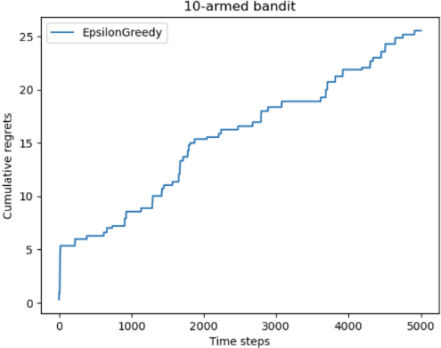

---
categories:
  - AI
  - 机器学习
  - 强化学习
tags:
  - AI
  - 机器学习
  - 强化学习
mathjax: true
title: 多臂老虎机
abbrlink: 4023062711
date: 2024-05-05 10:22:41
---

[TOC]

<!--more-->

多臂老虎机不存在状态信息，只有动作和奖励。多臂老虎机中的**探索与利用**（exploration vs. exploitation）问题一直以来都是一个特别经典的问题

## 问题定义与描述

在多臂老虎机（multi-armed bandit，MAB）问题中，有一个拥有 $K$ 根拉杆的老虎机，拉动每一根拉杆都对应一个关于奖励的概率分布 $\mathcal{R}$ 。我们每次拉动其中一根拉杆，就可以从该拉杆对应的奖励概率分布中获得一个奖励 $r$ 

在各根拉杆的奖励概率分布未知的情况下，从头开始尝试，目标是在操作 $T$ 次拉杆后获得尽可能高的累积奖励。

由于奖励的概率分布是未知的，因此我们需要在“ **探索** 拉杆的获奖概率”和“ **利用** 经验选择获奖最多的拉杆”中进行权衡。

### 描述

多臂老虎机问题可以表示为一个元组 $<\mathcal{A},\mathcal{R}>$ ，其中

- $\mathcal{A}$ 为动作集合，其中一个动作表示拉动一个拉杆。若多臂老虎机一共有 $K$ 跟杆，则动作空间就是集合 $\{a_1,\cdots,a_K\}$ ，用 $a_t\in \mathcal{A}$ 表示一个动作
- $\mathcal{R}$ 为奖励的概率分布，拉动每一根拉杆的动作 $a$ 都对应一个奖励概率分布 $\mathcal{R}(r\vert a)$ ，不同拉杆的奖励分布通常是不同的。

一个时间步只能拉动一根杆，目标为最大化一段时间 $T$ 内的累计奖励
$$
\max\sum\limits_{t=1}^Tr_t,r_t\sim \mathcal{R}(\cdot\vert a_t)
$$

### 学习目标

#### 累积懊悔

对于一个动作 $a$ ，其期望奖励 $Q(a)=\mathbb{E}_{r\sim \mathcal{R}(\cdot\vert a)}\left[r\right]$ 

因此，存在一个最优期望奖励 $Q^*=\max\limits_{a\in \mathcal{A}}Q(a)$ 

拉动一根杆的期望奖励与最优期望奖励之间的差距称为 **懊悔** 
$$
R(a)=Q^*-Q(a)
$$
在一个回合的 $T$ 步决策 $\{a_1,a_2,\cdots,a_T\}$ ，**累积懊悔** 为操作 $T$ 次杆后懊悔累计量 $\sigma_R=\sum\limits_{t=1}^TR(a_t)$ 

#### 学习目标

最大化累积奖励等价于最小化累积懊悔
$$
\min\sigma_R=\min\sum\limits_{t=1}^TR(a_t)
$$

### 估计动作的期望奖励

为了知道拉动哪一根拉杆能获得更高的奖励，我们需要估计拉动这根拉杆的期望奖励 $Q(a_t)$ 。

由于只拉动一次拉杆获得的奖励存在随机性，所以需要多次拉动一根拉杆，然后计算得到的多次奖励的期望


更新期望奖励是增量式（离线变在线）：


- 若离线，得到所有奖励再除以次数，每次更新时间和空间复杂度都是 $O(n)$
- 若在线，时间复杂度和空间复杂度都是 $O(1)$

## 无状态RL框架

RL范式由两部分组成

- 环境：环境接受动作，返回该动作的奖励
- 智能体：实现序列决策任务的学习目标

### 环境

实现一个拉杆数为 10 的多臂老虎机，拉动每根拉杆的奖励服从伯努利分布

- 有 $p$ 的概率获得奖励1，$1-p$ 的概率获得奖励0

```python
# 导入需要使用的库,其中numpy是支持数组和矩阵运算的科学计算库,而matplotlib是绘图库
import numpy as np
import matplotlib.pyplot as plt

class BernoulliBandit:
    """ 伯努利多臂老虎机,输入K表示拉杆个数 """
    def __init__(self, K:int):
        self.probs = np.random.uniform(size=K)  # 随机生成K个0～1的数,作为拉动每根拉杆的获奖概率
        self.best_idx = np.argmax(self.probs)  # 获奖概率最大的拉杆
        self.best_prob = self.probs[self.best_idx]  # 最大的获奖概率
        self.K = K

    def step(self, k:int) -> int:
        # 当玩家选择了k号拉杆后,根据拉动k号拉杆获得奖励的概率返回1（获奖）或0（未获奖）
        if np.random.rand() < self.probs[k]:
            return 1
        else:
            return 0

np.random.seed(1)  # 设定随机种子,使实验具有可重复性
K = 10
bandit_10_arm = BernoulliBandit(K)
print("随机生成了一个%d臂伯努利老虎机" % K)
print("获奖概率最大的拉杆为%d号,其获奖概率为%.4f" %
      (bandit_10_arm.best_idx, bandit_10_arm.best_prob))

随机生成了一个10臂伯努利老虎机
获奖概率最大的拉杆为1号,其获奖概率为0.7203
```

### 智能体

根据策略选择动作

从环境中获取动作的奖励

更新期望奖励估计值

更新累积懊悔

```python
class Solver:
    """ 多臂老虎机算法基本框架 """
    def __init__(self, bandit:BernoulliBandit):
        self.bandit = bandit
        self.counts = np.zeros(self.bandit.K)  # 每根拉杆的尝试次数
        self.regret = 0.  # 当前步的累积懊悔
        self.actions = []  # 维护一个列表,记录每一步的动作
        self.regrets = []  # 维护一个列表,记录每一步的累积懊悔

    def run_one_step(self) -> int:
        # 选择当前时间步的动作,由每个具体的策略实现
        raise NotImplementedError

    def run(self, num_steps:int):
        # 运行一定次数,num_steps为总运行次数
        for _ in range(num_steps):
            k = self.run_one_step()
            self.counts[k] += 1
            # 记录决策序列
            self.actions.append(k)
            # 计算单步懊悔，更新累积懊悔
            self.update_regret(k)
            
    def update_regret(self, k:int):
        # 计算累积懊悔并保存,k为本次动作选择的拉杆的编号
        self.regret += self.bandit.best_prob - self.bandit.probs[k]
        self.regrets.append(self.regret)
```

## 探索利用平衡的策略

最简单的策略：一直采取某个动作；每次随机选取一个动作

- **探索**（exploration）是指尝试拉动更多可能的拉杆，这根拉杆不一定会获得最大的奖励，但这种方案能够摸清楚所有拉杆的获奖情况
- **利用**（exploitation）是指拉动已知期望奖励最大的那根拉杆，由于已知的信息仅仅来自有限次的交互观测，所以当前的最优拉杆不一定是全局最优的

多臂老虎机问题中，设计策略时就需要平衡探索和利用的次数，使得累积奖励最大化

常用的思路是在开始时做比较多的探索，在对每根拉杆都有比较准确的估计后，再进行利用

- $\epsilon-贪心$
- 上置信界算法
- 汤普森采样算法

### 贪心算法

完全贪婪算法即在每一时刻采取期望奖励估值最大的动作（纯粹的利用）

#### 固定探索率的贪心算法

$\epsilon-贪心$ 在完全贪婪算法的基础上添加了噪声：每次以 $1-\epsilon$ 的概率选择历史中期望奖励估值最大的那根拉杆（利用），以概率 $\epsilon$ 随机选择一根拉杆（探索）
$$
a_t=\begin{cases}
\arg\max\limits_{a\in \mathcal{A}}\hat{Q}(a)&,采样概率：1-\epsilon\\
从\mathcal{A}中随机选择&,采样概率：\epsilon
\end{cases}
$$

$$
\hat{Q}_t(a_k)=\hat{Q}_{t-1}(a_k)+\frac{1}{Cnt_t(a_k)}\left(r_k-\hat{Q}_{t-1}(a_k)\right)
$$

```python
class EpsilonGreedy(Solver):
    """ epsilon贪婪算法,继承Solver类 """
    def __init__(self, 
                 bandit:BernoulliBandit, 	# 环境 
                 epsilon:float=0.01, 		# 探索概率 
                 init_prob:float=1.0):		# 对每个杆奖励期望的估计初始值
        super(EpsilonGreedy, self).__init__(bandit)
        self.epsilon = epsilon
        #初始化拉动所有拉杆的期望奖励估值
        # estimates(1,K)
        # estimates[k]表示拉动第k根杆获得的奖励期望的估计值，增量式更新
        self.estimates = np.array([init_prob] * self.bandit.K)

    def run_one_step(self) -> int:
        if np.random.random() < self.epsilon:
            k = np.random.randint(0, self.bandit.K)  # 随机选择一根拉杆
        else:
            k = np.argmax(self.estimates)  # 选择期望奖励估值最大的拉杆
        r = self.bandit.step(k)  # 得到本次动作的奖励
        self.estimates[k] += 1. / (self.counts[k] + 1) * (r - self.estimates[k])
        return k
```

查看结果

```python
def plot_results(solvers:list[Solver], solver_names:list[str]):
    '''
    绘制懊悔列表
    为后续便于对比多种决策生成策略，将输入solvers定义为列表，列表中每个元素表示一种策略
    solver_names对应每个策略的名称
    '''
    for idx, solver in enumerate(solvers):
        time_list = range(len(solver.regrets))
        plt.plot(time_list, solver.regrets, label=solver_names[idx])
    plt.xlabel('Time steps')
    plt.ylabel('Cumulative regrets')
    plt.title('%d-armed bandit' % solvers[0].bandit.K)
    plt.legend()
    plt.show()

np.random.seed(1)
epsilon_greedy_solver = EpsilonGreedy(bandit_10_arm, epsilon=0.01)
epsilon_greedy_solver.run(5000)
print('epsilon-贪婪算法的累积懊悔为：', epsilon_greedy_solver.regret)
plot_results([epsilon_greedy_solver], ["EpsilonGreedy"])
# epsilon-贪婪算法的累积懊悔为： 25.526630933945313
```



$\epsilon-贪心$ 的累积懊悔几乎是线性增长的，选取不同的探索率

```python
np.random.seed(0)
epsilons = [1e-4, 0.01, 0.1, 0.25, 0.5]
epsilon_greedy_solver_list = [
    EpsilonGreedy(bandit_10_arm, epsilon=e) for e in epsilons
]
epsilon_greedy_solver_names = ["epsilon={}".format(e) for e in epsilons]
for solver in epsilon_greedy_solver_list:
    solver.run(5000)
    print('epsilon-贪婪算法的累积懊悔为：', solver.regret)

plot_results(epsilon_greedy_solver_list, epsilon_greedy_solver_names)

# epsilon-贪婪算法的累积懊悔为： 5.886492256558774
# epsilon-贪婪算法的累积懊悔为： 28.896662289230825
# epsilon-贪婪算法的累积懊悔为： 223.02647611659825
# epsilon-贪婪算法的累积懊悔为： 530.5601111232874
# epsilon-贪婪算法的累积懊悔为： 987.4126215895868
```


基本上无论 $\epsilon$ 取多少，累积懊悔都是线性增长的

#### 探索率衰减的贪心算法

随着探索次数的不断增加，我们对各个动作的奖励估计得越来越准，此时我们就没必要继续花大力气进行探索

在 $\epsilon-贪心$ 算法的具体实现中，可以令 $\epsilon$ 随时间衰减，即探索的概率将会不断降低，但不会到0

- 因为基于有限步数观测的完全贪婪算法仍然是一个局部信息的贪婪算法，永远距离最优解有一个固定的差距。

令 $\epsilon_t=\frac{1}{t}$ 

```python
class DecayingEpsilonGreedy(Solver):
    """ epsilon值随时间衰减的epsilon-贪婪算法,继承Solver类 """
    def __init__(self, bandit:BernoulliBandit, init_prob:float=1.0):
        super(DecayingEpsilonGreedy, self).__init__(bandit)
        self.estimates = np.array([init_prob] * self.bandit.K)
        self.total_count = 0

    def run_one_step(self) -> int:
        self.total_count += 1
        if np.random.random() < 1 / self.total_count:  # epsilon值随时间衰减
            k = np.random.randint(0, self.bandit.K)
        else:
            k = np.argmax(self.estimates)

        r = self.bandit.step(k)
        self.estimates[k] += 1. / (self.counts[k] + 1) * (r - self.estimates[k])
        return k

np.random.seed(1)
decaying_epsilon_greedy_solver = DecayingEpsilonGreedy(bandit_10_arm)
decaying_epsilon_greedy_solver.run(5000)
print('epsilon值衰减的贪婪算法的累积懊悔为：', decaying_epsilon_greedy_solver.regret)
plot_results([decaying_epsilon_greedy_solver], ["DecayingEpsilonGreedy"])
# epsilon值衰减的贪婪算法的累积懊悔为： 10.114334931260183
```


探索率随时间衰减的 $\epsilon-贪心$ 算法使累积懊悔与时间步的关系变为次线性

### 上置信界算法

> 一根拉杆的不确定性越大，它就越具有探索的价值，因为探索之后我们可能发现它的期望奖励很大。

衡量不确定性的度量 $U(a)$ ，随着一个动作被尝试次数的增加而减小

希望有一个策略能综合考虑动作的不确定性与现有的期望奖励

**上置信界**（upper confidence bound，UCB）算法是一种经典的基于不确定性的策略算法

- **霍夫丁不等式**（Hoeffding's inequality），令 $X_1,\cdots,X_n$ 为 $n$ 个独立同分布的随机变量，其真实期望为 $\mathbb{E}[X]$ ，经验期望为 $\overline{x}_n=\frac{1}{n}\sum\limits_{j=1}^nX_j$ ，则有
  $$
  \mathbb{P}\{\mathbb{E}[X]\ge \overline{x}_n+u\}\le e^{-2nu^2}
  $$
  也就是对真实期望高估的概率至少为 $1-e^{-2nu^2}$ ，$u$ 为随机变量 $X$ 的不确定性度量
  $$
  1-\mathbb{P}\{\mathbb{E}[X]\ge \overline{x}_n+u\}\ge 1-e^{-2nu^2}\\
  \mathbb{P}\{\mathbb{E}[X]< \overline{x}_n+u\}\ge 1-e^{-2nu^2}
  $$
  当 $1-e^{-2nu^2}$ 很小时，则用经验期望作为真实期望上界的估计越准确

对于一个动作在 $t$ 步的奖励期望估计 $\overline{r}=\frac{1}{N(a)}\sum\limits_{i=1}^{N(a)} r(a)=\hat{Q}_t(a)$ ，$u=\hat{U}_t(a)$ 表示动作 $a$ 的不确定性度量估计，给定 $p=e^{-2N_t(a)\hat{U}^2_t(a)}$ ，则 $Q(a)< \hat{Q}_t(a)+\hat{U}_t(a)$ 至少以 $1-p$ 的概率成立，即可以将 $\hat{Q}_t(a)+\hat{U}_t(a)$ 视为期望奖励的上界

上置信界(upper confidence bound，UCB)算法选择期望奖励上界估计值最大的动作，且对这个期望奖励上界的估计只有很小的概率 $p$ 不准确
$$
a=\arg\max\limits_{a\in\mathcal{A}}\left[\hat{Q}_t(a)+\hat{U}_t(a)\right]，\hat{U}_t(a)=\frac{-\log p}{2N_t(a)}
$$

#### 实现

$p=\frac{1}{t}$ ，令不确定性度量为 $\hat{U}_t(a)=\sqrt{\frac{\log t}{2(N_t(a)+1)}}$ 

设定一个系数 $c$ 控制不确定性的比重
$$
a=\arg\max\limits_{a\in\mathcal{A}}\left[\hat{Q}_t(a)+c\hat{U}_t(a)\right]，\hat{U}_t(a)=\frac{-\log p}{2N_t(a)+1}
$$

```python
class UCB(Solver):
    """ UCB算法,继承Solver类 """
    def __init__(self, bandit:BernoulliBandit, c:float, init_prob:float=1.0):
        super(UCB, self).__init__(bandit)
        self.total_count = 0
        self.estimates = np.array([init_prob] * self.bandit.K)
        self.c = c

    def run_one_step(self) -> int:
        self.total_count += 1
        # 更新每个动作期望奖励的上置信界
        ucb = self.estimates + self.c * np.sqrt(
            np.log(self.total_count) / (2 * (self.counts + 1)))  # 计算上置信界
        k = np.argmax(ucb)  # 选出上置信界最大的拉杆
        r = self.bandit.step(k)
        self.estimates[k] += 1. / (self.counts[k] + 1) * (r - self.estimates[k])
        return k

np.random.seed(1)
c = 1  # 控制不确定性比重的系数
UCB_solver = UCB(bandit_10_arm, c)
UCB_solver.run(5000)
print('上置信界算法的累积懊悔为：', UCB_solver.regret)
plot_results([UCB_solver], ["UCB"])
# 上置信界算法的累积懊悔为： 70.45281214197854
```


#### 分析

前期，先进行一轮探索，受每个动作不确定性度量的影响，会充分探索

中期，得到期望奖励上界最大的动作，会不断利用

在后，由于对大奖励动作的充分利用，造成其他动作的不确定性增大，从而放弃大奖励动作转而使用其他动作

因此，可以看到UCB的累积懊悔是大于汤普森算法和探索率衰减的贪心算法的

### 汤普森采样算法

汤普森采样算法是一种蒙特卡洛采样

根据每个动作 $a$ 当前的奖励概率分布进行一轮采样，得到一组各根拉杆的奖励样本，再选择样本中奖励最大的动作

对每个动作当前的奖励概率分布的建模：使用 Beta 分布，若某杆被选择了 $k$ 次，$m_1$ 次奖励为1，$m_2$ 次奖励为0，则该杆的奖励概率服从 $(m_1+1,m_2+1)$ 的 Beta 分布

```python
class ThompsonSampling(Solver):
    """ 汤普森采样算法,继承Solver类 """
    def __init__(self, bandit:BernoulliBandit):
        super(ThompsonSampling, self).__init__(bandit)
        self._a = np.ones(self.bandit.K)  # 列表,表示每根拉杆奖励为1的次数
        self._b = np.ones(self.bandit.K)  # 列表,表示每根拉杆奖励为0的次数

    def run_one_step(self):
        # 一次采样会得到K个奖励样本
        samples = np.random.beta(self._a, self._b)  # 按照Beta分布采样一组奖励样本
        k = np.argmax(samples)  # 选出采样奖励最大的拉杆
        r = self.bandit.step(k)
		
        # 对每个拉杆得到奖励1和0的次数进行统计
        self._a[k] += r  # 更新Beta分布的第一个参数
        self._b[k] += (1 - r)  # 更新Beta分布的第二个参数
        return k

np.random.seed(1)
thompson_sampling_solver = ThompsonSampling(bandit_10_arm)
thompson_sampling_solver.run(5000)
print('汤普森采样算法的累积懊悔为：', thompson_sampling_solver.regret)
plot_results([thompson_sampling_solver], ["ThompsonSampling"])

# 汤普森采样算法的累积懊悔为： 57.19161964443925
```


汤普森采样会充分利用，进行少量探索

### 综上

在多臂老虎机中，探索率随时间衰减的贪心算法是效果很好的，即使时间步增加，累积懊悔在三种策略中最小


