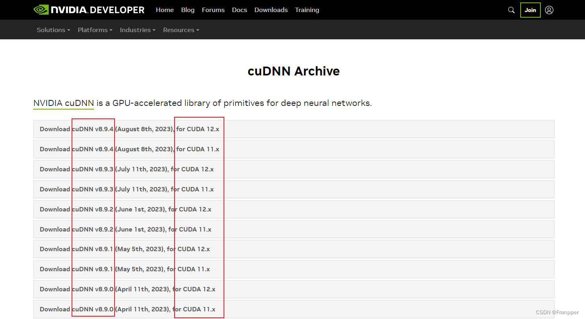
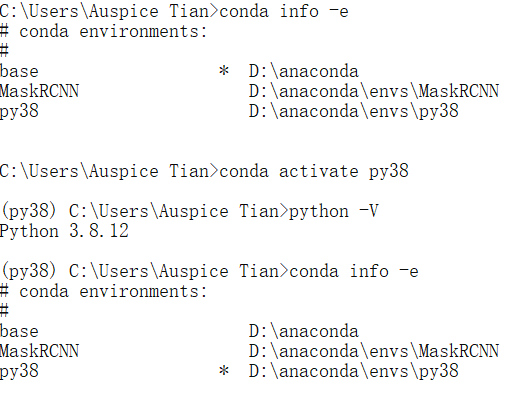

---
categories:
  - AI
tags:
  - AI
top: 77
mathjax: true
title: cuda+pytorch配置
abbrlink: 1733169718
date: 2023-08-17 09:33:58
---

[TOC]

<!--more-->

## 关键组件及关系

[参考1](https://blog.csdn.net/weixin_58283091/article/details/133349022)

[参考2](https://zhuanlan.zhihu.com/p/570822583?utm_id=0[)

### 显卡驱动GPU Driver

介绍：显卡驱动是连接操作系统与GPU硬件的驱动程序。负责管理GPU的基本功能：内存管理、任务调度和与操作系统的通信

### CUDA

介绍：Compute Unified Device Architecture，NVIDIA 开发的并行计算平台和编程模型，旨在 **加速通用计算任务**，包括深度学习训练与推理。

### CUDA Toolkit

介绍：CUDA Toolkit 是一套软件工具集，**定义了一些用于GPU加速的数学库** 。包含了编译CUDA代码所需的工具和CUDA的运行时库。

作用：CUDA Toolkit 提供了编译CUDA代码的工具、CUDA运行时库和各种GPU加速的数学库，使开发者能够方便地构建和优化GPU加速应用程序。

### cuDNN

介绍：**cuDNN 是NVIDIA的深度学习库**，调用CUDA Toolkit的基本库函数，实现了专门用于加速深度神经网络的训练和推理，可用于各种深度学习框架。

作用：cuDNN 提供了用于加速卷积神经网络（CNN）等深度学习操作的GPU实现，使深度学习框架能够在GPU上获得显著的性能提升。

### Pytorch

定义：PyTorch 是一个深度学习框架，提供用于构建和训练神经网络的python高级API。

作用：PyTorch允许开发者构建灵活的神经网络模型，并使用CUDA加速训练和推理过程。

## 各组件版本选择

显卡驱动决定了本机器支持的最大CUDA的版本，CUDA版本决定了CUDA Toolkit 与cuDNN的版本，最后决定了Pytorch的版本

### !!!驱动程序

版本要求：必须与GPU硬件兼容，以确保GPU能正常工作并与操作系统和应用程序通信

**更新显卡驱动版本可以提高本机支持的最高CUDA版本** ：因此，改变驱动程序理论上可以使用任何旧版的pytorch库

[查看显卡的最新驱动程序](https://www.nvidia.cn/Download/index.aspx?lang=cn) 

[查看历史的驱动程序](https://www.nvidia.cn/Download/Find.aspx?lang=cn) 


### CUDA 

#### 查看驱动及CUDA的最大支持版本

```shell
nvidia-smi
```


[显卡驱动与CUDA版本关系](https://docs.nvidia.com/cuda/cuda-toolkit-release-notes/index.html#id4) ：驱动是向下兼容的，其决定了可安装的CUDA Toolkit的最高版本

- 如NVIDIA的显卡驱动程序版本是536.23，则CUDA Toolkit的最高版本为 CUDA12.2 Update 1


- GA：General Availability，正式发布的版本。
- RC：Release Candidate，发行候选版本，是最终发布成正式版的前一个版本。

### CUDA Toolkit

[CUDA Toolkit Archive](https://developer.nvidia.com/cuda-toolkit-archive) 

选择相应版本安装即可


#### 选自定义安装

安装过程注意避免用旧版本替换较高的版本


#### 检验

安装完成后在命令行中进行验证

```shell
nvcc -V#会显示toolkit版本
```


##### 无法识别nvcc

[`nvcc` 不是内部或外部命令,也不是可运行的程序或批处理文件](https://blog.csdn.net/Victor_Li_/article/details/133278446)

只能是两种问题：

1. 安装出错
2. 环境变量未配置完全

**检验是否安装正确**

```shell
#1. cmd 转到CUDA安装目录 XX\extras\demo_suite，分别执行
bandwidthTest.exe
deviceQuery.exe
```

若安装正确，则二者均 `Result = PASS` 。否则需要重新安装


**环境变量**

1. Path新增三个变量

   ```shell
   D:\cuda\cuda12_3\lib\x64
   D:\cuda\cuda12_3\include
   D:\cuda\cuda12_3\extras\CUPTI\lib64
   ```

   

   

2. 重启系统后生效，若想要不重启生效

   以修改环境变量“PATH”为例，修改完成后，进入DOS命令提示符，输入：`set PATH=C:` ，关闭DOS窗口。再次打开DOS窗口，输入：`echo %PATH%` 

### cuDNN

[下载地址](https://developer.nvidia.com/rdp/cudnn-archive)



- "12.x" 是 CUDA 版本号的一种通用表示法，其中 "x" 表示可以是任何数字，表示适用于该主要 CUDA 版本的所有次要版本。

下载之后，解压缩，将压缩包里面的bin、clude、lib文件直接复制到CUDA的安装目录下（Development与Documentation目录下），直接替换

## conda

Miniconda/Anaconda区别在于Anaconda安装后会附带很多内容，省去安装一些常见包的麻烦，同时对于一些人来说也会显得比较臃肿。而Miniconda只包括了conda和python，内容简洁，但缺点就是一些常见包需要手动下载。

- [miniconda下载地址](https://docs.conda.io/projects/miniconda/en/latest/)
  - [miniconda清华源](https://mirrors.tuna.tsinghua.edu.cn/anaconda/miniconda/)
- [anaconda下载地址](https://www.anaconda.com/download)
  - [清华源](https://mirrors.tuna.tsinghua.edu.cn/anaconda/archive/)

安装流程注意勾选添加到环境变量即可

- *\anaconda\Scripts* 与 *\anaconda\Library\bin*

### pip换源

```shell
#查看已安装的包
conda list
pip list

# 安装包
pip install package_name[==version]

#移除包
pip uninstall numpy

# 设置pip源
(learning) C:\Users\AmosTian>pip config set global.index-url https://pypi.tuna.tsinghua.edu.cn/simple
Writing to C:\Users\AmosTian\AppData\Roaming\pip\pip.ini

# 查看是否生效
pip config list

# 阿里云镜像源
http://mirrors.aliyun.com/pypi/simple/
# 清华大学镜像源
https://pypi.tuna.tsinghua.edu.cn/simple/
# 国科大镜像源
http://pypi.mirrors.ustc.edu.cn/simple/
# 豆瓣镜像源
https://pypi.douban.com/simple/
```

### conda管理py包

#### conda 换源

```python
# 查看当前源
conda config --show channels

# 设置安装包时，显示镜像来源，建议显示
conda config --set show_channel_urls yes 

# 恢复默认源
conda config --remove-key channels

# 添加清华源
conda config --add channels http://mirrors.tuna.tsinghua.edu.cn/anaconda/pkgs/free/
conda config --add channels http://mirrors.tuna.tsinghua.edu.cn/anaconda/pkgs/main/
conda config --add channels http://mirrors.tuna.tsinghua.edu.cn/anaconda/cloud/msys2/
conda config --set show_channel_urls yes

# 修改conda 虚拟环境默认安装位置，默认是在C盘下的
envs directories : D:\anaconda3\envs
                          C:\Users\AmosTian\.conda\envs
                          C:\Users\AmosTian\AppData\Local\conda\conda\envs

# 修改为
conda config --add envs_dirs D:\anaconda3\envs
修改文件夹权限，确保所有用户都有 所有权限
```

可以直接在 C:\Users\用户名 目录下找 `.condarc` 的文件，若不不存在新建一个

```
envs_dirs:
  - D:\anaconda3\envs
channels:
  - http://mirrors.tuna.tsinghua.edu.cn/anaconda/cloud/msys2/
  - http://mirrors.tuna.tsinghua.edu.cn/anaconda/pkgs/main/
  - http://mirrors.tuna.tsinghua.edu.cn/anaconda/pkgs/free/
  - defaults
show_channel_urls: true
auto_activate_base: true
```

#### 修改conda环境默认安装位置

```shell
conda config --add envs_dir D:\anaconda3\envs
```

修改文件夹权限，为所有用户赋予所有权限

#### 查看conda基本信息、创建、克隆、激活、删除

`conda info -e` 



`conda info`  


```shell
conda env list

# 创建conda环境
conda create -n [anaconda_name] python=3.
#克隆环境
conda create --name [new_anaconda_name] --clone [o_anaconda_name]

# 删除环境
conda remove --name [anaconda_name] --all

# 导入导出环境
conda env export > [配置文件路径.yaml]
用配置文件创建新环境
conda env create -n [anaconda_name] -f [配置文件路径.yaml]

# 激活环境
conda activate [anaconda_name]
```

#### conda包管理

```shell
# 在指定环境中管理包
conda list -n [anaconda_name]
conda install --name [anaconda_name] package_name[==version]
conda remove --name [anaconda_name] package_name[==version]
```

##### 包安装原则

[conda有严格的检查机制，它会保证你当前装的package安装好之后能work，但是，它只检查用conda安装过的package。pip装的包不会检查出来](https://www.zhihu.com/question/395145313/answer/2551141843)

安装包，安装方式尽量一致，不要混用，除非一些包用其中一种固定用的方式安不上。**先conda，装不上的包再pip**

删除包，谁安装就由谁卸载，对于一些简单的包也可以直接到 `lib/site-packages` 中进行手动删除

#### 设置默认anaconda

https://www.yingtwo.com/article/8435028.html

只修改prompt

- 到 conda 安装目录的 Script 文件夹下，找一个名为 activate.bat 的文件
- 将第24行 `@CALL "%~dp0..\condabin\conda.bat" activate %*` 中的 `%*` 用 `[anaconda_name]` 替换

修改prompt 与 powershell pompt

- 查看二者属性窗口，发现其启动目标都指向 `D:\anaconda3` 的默认 anaconda

  ```
  # prompt：
  %windir%\System32\cmd.exe "/K" D:\anaconda3\Scripts\activate.bat D:\anaconda3\envs\learn
  
  # powershell:
  %windir%\System32\WindowsPowerShell\v1.0\powershell.exe -ExecutionPolicy ByPass -NoExit -Command "& 'D:\anaconda3\shell\condabin\conda-hook.ps1' ; conda activate 'D:\anaconda3' "
  ```

- 将 `D:\anaconda3` 修改为 `D:\anaconda3\envs\learn`


## pytorch安装

[官网](https://pytorch.org/get-started/locally/) 

[参考](https://blog.csdn.net/m0_53065609/article/details/123395703)

### 自动安装

最新版本


- 修改为

  ```shell
  conda install pytorch==2.1.1 torchvision==0.16.1 torchaudio==2.1.1 pytorch-cuda=12.1 -c pytorch -c nvidia
  
  # -c pytorch 会使用默认的pytorch源，下载速度慢
  ```

试过了解决方法，` unsuccessful initial attempt using frozen solve`  无解，换手动或pip安装吧

### 手动安装

#### 确定pytorch版本

也可以在 *Previous Pytorch Verion* 中选择CUDA相应的pytorch版本

```shell
# CUDA 11.8
conda install pytorch==2.1.1 torchvision==0.16.1 torchaudio==2.1.1 pytorch-cuda=11.8 -c pytorch -c nvidia
# CUDA 12.1
conda install pytorch==2.1.1 torchvision==0.16.1 torchaudio==2.1.1 pytorch-cuda=12.1 -c pytorch -c nvidia
# CPU Only
conda install pytorch==2.1.1 torchvision==0.16.1 torchaudio==2.1.1 cpuonly -c pytorch
```

官网的命令根据cuda以及pytorch的的版本有所不同，选择对应的即可。

#### 确定torchvision与torchaudio版本

根据选择的pytorch版本，确定torchvision与torchaudio版本

https://gitcode.com/pytorch/vision/overview?utm_source=csdn_github_accelerator&isLogin=1


#### 国内镜像下载

[镜像](https://download.pytorch.org/whl/torch_stable.html)


cuda版本12.1，python3.9，假设pytorch选用2.1.2

#### 安装

三个文件下载完成后，切换准备安装torch的环境，切换到三个whl文件的目录下，执行 `pip install`

### pip安装

```shell
pip install torch==2.1.2+cu121 torchvision==0.16.2+cu121 torchaudio==2.1.2+cu121 --extra-index-url https://download.pytorch.org/whl/cu121 -i https://pypi.tuna.tsinghua.edu.cn/simple
```

- `-i https://pypi.tuna.tsinghua.edu.cn/simple ` ：切换清华源
- `+cu121` pip默认下载的是CPU版本，需要 指定下载GPU版本

### 测试

```shell
import torch
 
print(torch._version__)
# 检查CUDA是否可用
print(torch.cuda.is_available())
 
# 显示当前CUDA版本
print(torch.version.cuda)
```


## jupyter 7兼容性问题

https://blog.csdn.net/weixin_43254181/article/details/130546415

```
conda install notebook==6.5.4

pip install jupyter_contrib_nbextensions==0.5.1

jupyter contrib nbextension install --user

pip install jupyter_nbextensions_configurator==0.5.0

jupyter nbextensions_configurator enable --user
```

