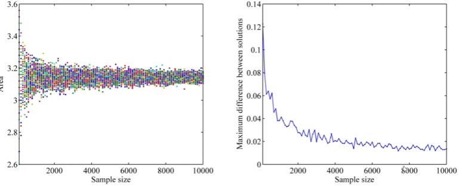
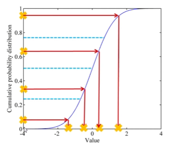

---
categories:
  - 数学
tags:
  - 数学
  - 统计
  - 计算机采样
mathjax: true
title: 计算机采样
abbrlink: 1123299571
date: 2023-08-17 09:33:58
---

[TOC]

<!--more-->

## 采样

> 给定一个概率分布 $P(x)$ ，生成满足条件的样本

### 直接采样

计算机可以直接采样，但只能取均匀分布 $x\in U[0,1)$ 的样本

- 线性同余发生器
  $$
  x^{[t+1]}=(ax^{[t]}+c)\mod m\\
  \frac{x^{[t]}}{m}\in [0,1)
  $$
  多次迭代可以得到 $[0,m)$ 之间的随机数

涉及随机数的优化算法，需要将随机数种子也提供，便于复现凸优化过程

### 离散分布

累计密度函数(CDF)

假设三个离散变量 $a_2<a_3<a_1$ ，事先设定三个随机变量的范围，计算
$$
p(a_2)=P(X\le a_2)\\
p(a_3)=P(X\le a_2+a_3)-p(a_2)\\
p(a_1)=P(X\le a_2+a_3+a_1)-p(a_2)-p(a_3)
$$
CDF整体介于 $[0,1]$ 之间，用均匀分布采样得到随机数，判断落到哪个区间则取哪个随机变量

### 其他连续分布

$$
p(x)\rightarrow y=cdf(x)\rightarrow x=cdf^{-1}(y)\\
y\in U[0,1)，取y则可的得到对应的随机变量 x
$$

采样：从概率分布中随机抽取值的过程

- 蒙特卡洛采样
- 拉丁超立方采样

采样方法会影响采样的质量、结果和模拟之间，通常要在采样质量和采样时间之间做权衡

> 一轮迭代，从概率分布中，抽取n个随机样本进行一次模拟

## 蒙特卡洛

蒙特卡洛方法：采样越多，越近似最优解

- 给出的解越来越接近最优解，寻找最贴近的那个
- 实际生活中不需要找到最优方案，找到某个接近最优解的可行解，基本收敛后，最优解就在近优解附近

蒙特卡洛方法：一类基于概率的方法

- 蒙特卡洛方法是无记忆的：每次采样都不考虑之前生成的样本点

工作流程：

- 不断抽样
- 逐渐逼近

### 量化采样差异

相同样本集大小，采集多轮，也会有不同的结果

为了量化每轮采样的差异，用
$$
\Delta_{ij}=\frac{\Vert x_i-x_j\Vert_1}{\Vert x_i+x_j\Vert_1}\Rightarrow \max_\limits{i,j}\Delta_{ij}\le \epsilon
$$
设定 $\epsilon$ ，作为终止条件

### 应用

$$
\frac{S_{方}}{S_{扇}}=\frac{a^2}{\pi a^2/4}= \frac{T_{总点数}}{N_{圆中点数}}\Rightarrow\pi=\frac{4N}{T}
$$

棋盘博弈——蒙特卡洛搜索树

博弈次数少时，胜率并不置信。博弈次数越多，胜率的置信度越高

解决某节点胜率置信度问题，提出UCT公式
$$
UCT=\frac{Q_{当前结点赢的次数}}{N_{当前结点出现次数}}+C\sqrt{\frac{lnT_{总采样次数}}{N_{当前结点出现次数}}}
$$

- C为权重，调整博弈的次数占的权重

- UCT倾向于选择访问次数少的结点，避免胜率高，置信度低的问题

  

每次选择UCT值高的，重复多次后，访问次数最多的结点就是最佳结点

### 蒙特卡洛应用于对参数空间的采样

每个参数的取值服从的分布类型共同决定了参数空间服从的总体分布类型，采样的过程，就是用样本集模拟这个总体分布的过程。

比如，若每个参数的取值都服从正态分布，则参数空间服从正态分布，随着采集的样本数增加，我们能发现取到的样本点聚集在参数空间的中心部分，离中心部分越远，样本点越少

随机采样属于蒙特卡洛方法，采样次数越多，越能拟合这个分布，也就是这个样本集越大，越能代表这个参数空间。

换句话说，当样本数越少时，随机采样（蒙特卡洛方法）的样本集越不能代表这个参数空间

## 拉丁超立方方法

目标：用比蒙塔卡洛方法更少的样本集拟合总体分布

过程：

1. 使用分层，将累计概率曲线划分为相等间隔
2. 在每个子空间中选择一个样本

拉丁方：

拉丁超立方：每个参数的每个取值区间只有一个样本

## 对比

**记忆性**

蒙特卡洛方法是无记忆的：第一次采样的结果不影响第二次采样

拉丁超立方采样是有记忆的：第一次采样的结果影响第二次

**采样效率**

把空间作为一种概率去拟合

