> 记录一些环境配置

注：

前端调试从web_db

后端调试从back_db

<!--more-->

## 1.1 安装docker

### 1.1.1 查看系统信息

```shell
uname -r # 查看系统内核
```

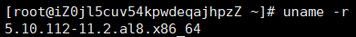

```shell
cat /etc/os-release
```

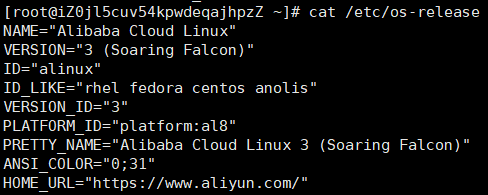

由于CentOS8不维护了，所以只能用替换方案，姑且把他当做CentOS8

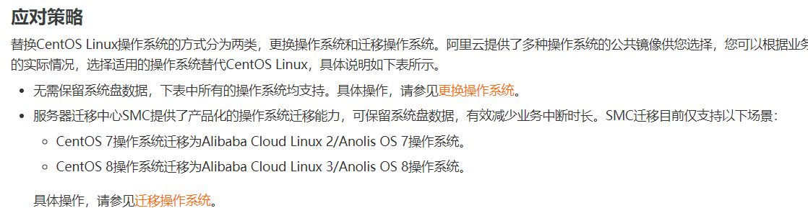

### 1.1.2 安装docker

#### 卸载旧版本

```shell
yum remove docker \
                  docker-client \
                  docker-client-latest \
                  docker-common \
                  docker-latest \
                  docker-latest-logrotate \
                  docker-logrotate \
                  docker-engine
```

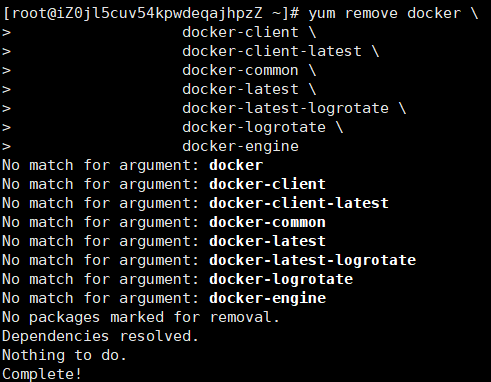

#### 需要的安装包

```shell
yum install -y yum-utils
```

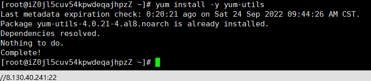

#### 设置镜像仓库_阿里云

```shell
yum-config-manager \
    --add-repo \
https://download.docker.com/linux/centos/docker-ce.repo  默认国外的

yum-config-manager \
    --add-repo \
http://mirrors.aliyun.com/docker-ce/linux/centos/docker-ce.repo  阿里云
```

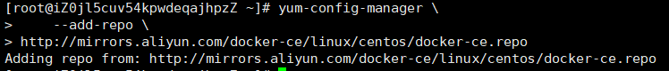

#### 更新包索引

```shell
yum makecache fast(centos8 没有fast参数，去掉即可)
yum makecache
```

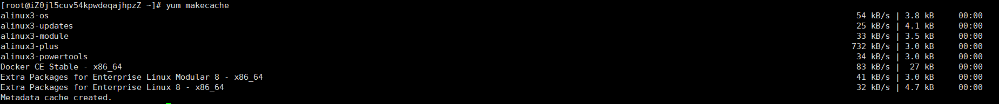

#### 安装docker(docker-ce 社区 ee企业版)

```shell
yum install docker-ce docker-ce-cli containerd.io
```

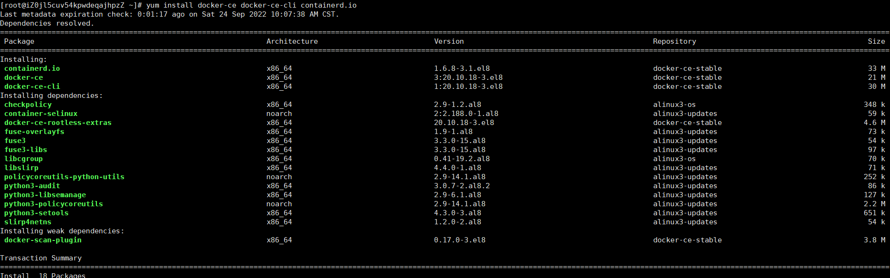

#### docker设为开机启动项

```shell
systemctl enable docker
```

#### 启动docker

```shell
systemctl start docker
```

#### docker版本

```shell
docker version 
```

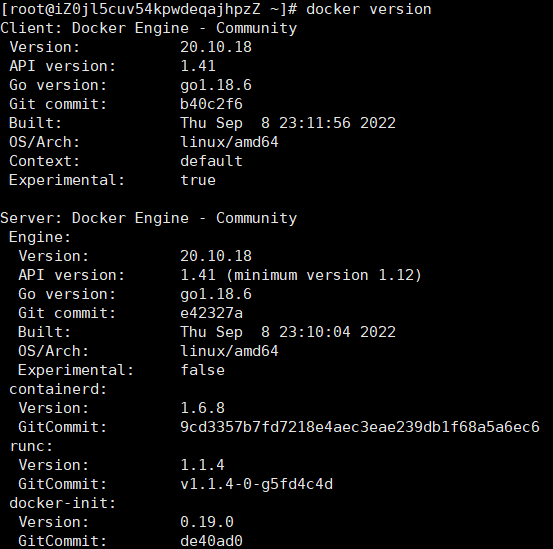

#### 测试HelloWorld

```shell
docker run hello-world
```

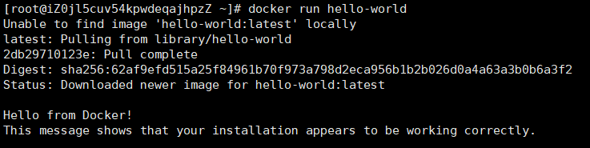

### 1.1.3 镜像加速器

使用Docker时需要首先下载一个官方镜像，例如`mysql`、`wordpress`。然而由于网络原因，下载一个Docker官方镜像可能会需要很长的时间，甚至下载失败。为此，阿里云容器镜像服务ACR提供了官方的镜像站点，从而加速官方镜像的下载。

https://help.aliyun.com/document_detail/60750.html

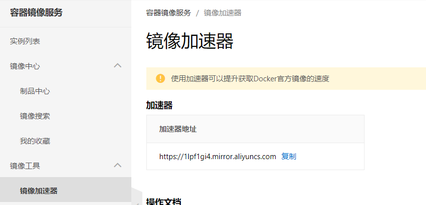

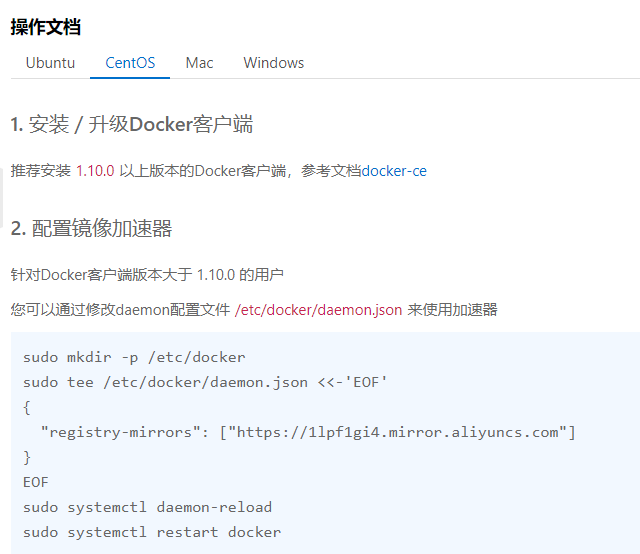

## 1.2 安装mysql

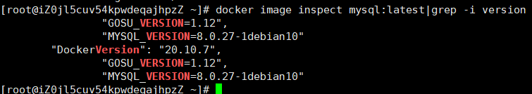

#### 创建并运行mysql容器

```shell
#创建容器
docker run --name mysql-dev -v /data/mysql-data:/var/lib/mysql -p 3306:3306 -e MYSQL_ROOT_PASSWORD=root -d mysql

# 参数解释
--name	:	mysql				   指容器名
-v		:	[主机目录]:[容器目录]	 将 主机目录 挂在到容器目录上
-p		:	[主机端口]:[容器内部端口]	设置端口映射
-e		:	MYSQL_ROOT_PASSWORD=   设置容器参数，将root用户密码为root
mysql	:	镜像名:版本

# 启动容器
docker start mysql-dev
```

#### 查看是否运行成功

```shell
docker exec -it mysql-dev bash# 进入mysql容器的bash

# 密码登陆mysql
mysql -uroot -p --default-character-set=utf8
```

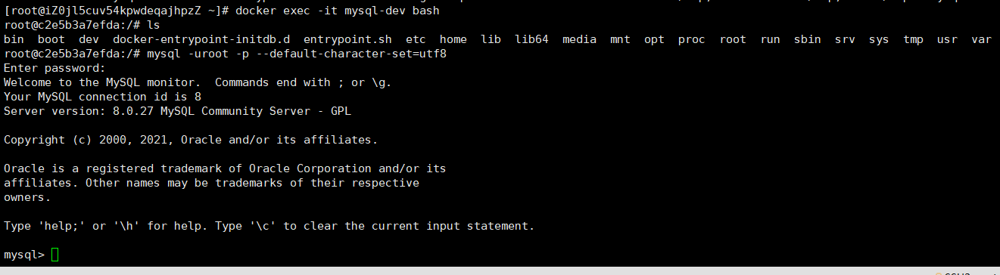

## 1.3 配置jdk

### 1.3.1 下载jdk压缩包

现在与开发环境匹配的 [jdk](https://www.oracle.com/java/technologies/downloads/)

当然，镜像才快 http://www.codebaoku.com/jdk/jdk-index.html

下载完把 `tar` 包放到指定目录 `/usr/java/jdk`

### 1.3.2 解压

```shell
tar -zxvf jdk-8u221-linux-x64.tar.gz
```

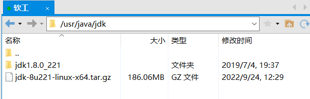


### 1.3.3 解压后配置环境变量

```shell
cd cd etc
vim bashrc

---
export JAVA_HOME=/usr/java/jdk/jdk1.8.0_221#这块注意文件名
export PATH=$PATH:$JAVA_HOME/bin
export CLASSPATH=.:$JAVA_HOME/lib/dt.jar:$JAVA_HOME/lib/tools.jar 
```

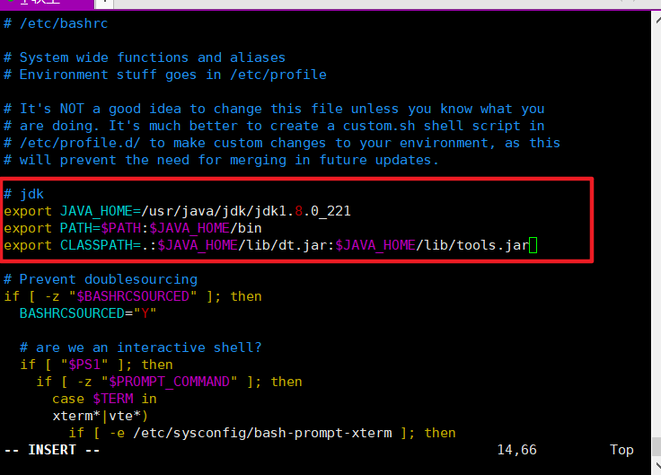

保存并退出 `:wq`

### 1.3.4 运行指令永久生效

```shell
source /etc/bashrc

# 检查
java -version
```

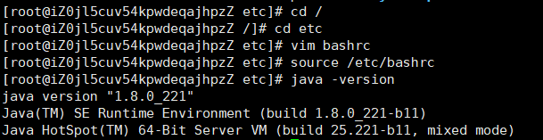

