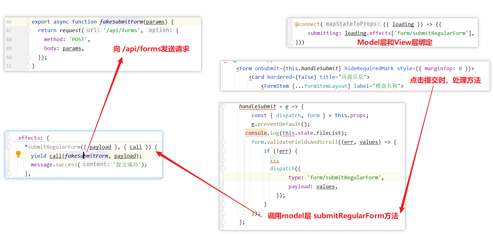
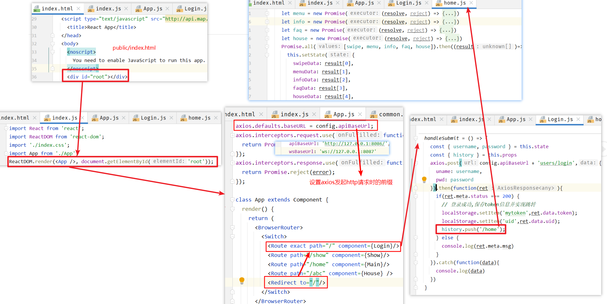

>   前置知识：[ReactJS](https://auspicetian.github.io/posts/1473435732/)

-   AntdesignPro搭建后台信息管理系统
-   Semantic-UI前台
-   nodejs模拟前台后端，用于前后端分离开发
-   后端提供mock数据

<!--more-->

# AntDesignPro应用

## 1. 创建工程

## 2. 导入依赖

```shell
tyarn install #安装相关依赖
tyarn start #启动服务
```

### 修改logo和footer


可见，布局是由layout常量定义

#### logo

可见，左侧的菜单是自定义组件

```jsx
{isTop && !isMobile ? null : (
    <SiderMenu
        logo={logo}
        Authorized={Authorized}
        theme={navTheme}
        onCollapse={this.handleMenuCollapse}
        menuData={menuData}
        isMobile={isMobile}
        {...this.props}
        />
)}

//导入
import SiderMenu from '@/components/SiderMenu';
```

打开 **/components/SideMenu** 文件

```jsx
return (
      <Sider
        trigger={null}
        collapsible
        collapsed={collapsed}
        breakpoint="lg"
        onCollapse={onCollapse}
        width={256}
        theme={theme}
        className={siderClassName}
      >
        <div className={styles.logo} id="logo">
          <Link to="/">
          	//设置logo的位置
          	<h1>好客租房 · 后台</h1>
          </Link>
        </div>
        <BaseMenu
          {...this.props}
          mode="inline"
          handleOpenChange={this.handleOpenChange}
          onOpenChange={this.handleOpenChange}
          style={{ padding: '16px 0', width: '100%', overflowX: 'hidden' }}
          {...defaultProps}
        />
      </Sider>
    );
```

#### footer

在Footer.js文件中修改版权信息

```jsx
import React, { Fragment } from 'react';
import { Layout, Icon } from 'antd';
import GlobalFooter from '@/components/GlobalFooter';

const { Footer } = Layout;
const FooterView = () => (
  <Footer style={{ padding: 0 }}>
    <GlobalFooter
      copyright={
        <Fragment>
          Copyright <Icon type="copyright" /> 2021 Auspice Tian
        </Fragment>
      }
    />
  </Footer>
);
export default FooterView;
```

## 3. 左侧菜单

**路由即菜单**

修改默认页 `router.config.js`


修改国际化映射文件 locale `locales=>zh-CN=>settings.js`


**只有在路由中的命名空间才会被注册** **命名空间名唯一**

## 4. 新增房源

### 房源表单字段

#### 楼盘数据(estate)

| 字段            |   类型   |   备注   |
| :-------------- | :------: | :------: |
| id              |   Long   |  楼盘id  |
| name            |  String  | 楼盘名称 |
| province        |  String  |  所在省  |
| city            |  String  |  所在市  |
| area            |  String  |  所在区  |
| address         |  String  | 具体地址 |
| year            |  String  | 建筑年代 |
| type            |  String  | 建筑类型 |
| propertyCost    |  String  |  物业费  |
| propertyCompany |  String  | 物业公司 |
| developers      |  String  |  开发商  |
| created         | datetime | 创建时间 |
| updated         | datetime | 更新时间 |

#### 房源数据(houseResource)

| 字段             | 类型     | 备注                                                         |
| ---------------- | -------- | ------------------------------------------------------------ |
| id               | Long     | 房源id                                                       |
| title            | String   | 房源标题，如：南北通透，两室朝南，主卧带阳台                 |
| estateId         | Long     | 楼盘id                                                       |
| buildingNum      | String   | 楼号（栋）                                                   |
| buildingUnit     | String   | 单元号                                                       |
| buildingFloorNum | String   | 门牌号                                                       |
| rent             | int      | 租金                                                         |
| rentMethod       | int      | 租赁方式，1-整租，2-合租                                     |
| paymentMethod    | int      | 支付方式，1-付一押一，2-付三押一，3-付六押一，4-年付押一，5-其它 |
| houseType        | String   | 户型，如：2室1厅1卫                                          |
| coveredArea      | String   | 建筑面积                                                     |
| useArea          | String   | 使用面积                                                     |
| floor            | String   | 楼层，如：8/26                                               |
| orientation      | int      | 朝向：东、南、西、北                                         |
| decoration       | String   | 装修，1-精装，2-简装，3-毛坯                                 |
| facilities       | String   | 配套设施， 如：1,2,3                                         |
| pic              | String   | 图片，最多5张                                                |
| desc             | String   | 房源描述，如：出小区门，门口有时代联华超市，餐饮有川菜馆，淮南牛肉汤，黄焖鸡沙县小吃等；可到达亲水湾城市生活广场，里面有儿童乐园，台球室和康桥健身等休闲娱乐；生活广场往北沿御水路往北步行一公里就是御桥路，旁边就是御桥地铁站，地铁站商场... |
| contact          | String   | 联系人                                                       |
| mobile           | String   | 手机号                                                       |
| time             | int      | 看房时间，1-上午，2-中午，3-下午，4-晚上，5-全天             |
| propertyCost     | String   | 物业费                                                       |
| created          | datetime | 创建时间                                                     |
| updated          | datetime | 更新时间                                                     |

### antd表单组件

[官网链接](https://ant.design/components/form-cn/#%E4%BD%95%E6%97%B6%E4%BD%BF%E7%94%A8)

高性能表单控件，自带数据域管理。包含`数据录入`、`校验` 以及对应 `样式` 与 `API` 。

[API](https://ant.design/components/form-cn/#API)

被设置了 `name` 属性的 `Form.Item` 包装的控件，表单控件会自动添加 `value`（或 `valuePropName` 指定的其他属性） `onChange`（或 `trigger` 指定的其他属性），数据同步将被 Form 接管，这会导致以下结果：

1.  你**不再需要也不应该**用 `onChange` 来做数据收集同步（你可以使用 Form 的 `onValuesChange`），但还是可以继续监听 `onChange` 事件。
2.  你不能用控件的 `value` 或 `defaultValue` 等属性来设置表单域的值，默认值可以用 Form 里的 `initialValues` 来设置。注意 `initialValues` 不能被 `setState` 动态更新，你需要用 `setFieldsValue` 来更新。
3.  你不应该用 `setState`，可以使用 `form.setFieldsValue` 来动态改变表单值。

在 rules的参数中，可以增加校验规则

```
{
	initialValue:'1',
	rules:[{ 
		required: true, 
		message:"此项为必填项" 
	}]
}
```

### 表单提交

表单的提交通过submit按钮完成，通过onSubmit方法进行拦截处理  

```jsx
<FormItem {...submitFormLayout} style={{ marginTop: 32 }}>
    <Button type="primary" htmlType="submit" loading={submitting}>
        <FormattedMessage id="form.submit" />
    </Button>
    <Button style={{ marginLeft: 8 }}>
        <FormattedMessage id="form.save" />
    </Button>
</FormItem>
```

```jsx
<Form onSubmit={this.handleSubmit} hideRequiredMark style={{ marginTop: 8 }}>
```

```jsx
handleSubmit = e => {
    const { dispatch, form } = this.props;
    e.preventDefault();
    console.log(this.state.fileList);
    form.validateFieldsAndScroll((err, values) => {
        
        if (!err) {
            //对设施进行处理
            //1,2,3,4
            //水,电,煤气/天然气,暖气
            if(values.facilities){
                values.facilities = values.facilities.join(",");
            }
            // 3/20
            // 第三层、总共20层
            if(values.floor_1 && values.floor_2){
                values.floor = values.floor_1 + "/" + values.floor_2;
            }
		
            //3室1厅2卫1厨有阳台
            values.houseType = values.houseType_1 + "室" + values.houseType_2 + "厅"
                + values.houseType_3 + "卫" + values.houseType_4 + "厨"
                + values.houseType_2 + "阳台";
            delete values.floor_1;
            delete values.floor_2;
            delete values.houseType_1;
            delete values.houseType_2;
            delete values.houseType_3;
            delete values.houseType_4;
            delete values.houseType_5;

            dispatch({
                type: 'form/submitRegularForm',
                payload: values,
            });
        }
    });
};
```



### 自动填充

[文档](https://ant.design/components/auto-complete-cn/)

**效果**


**实现**

```jsx
<AutoComplete
    style={{ width: '100%' }}
    dataSource={this.state.estateDataSource}
    placeholder="搜索楼盘"
    onSelect={(value, option)=>{
        let v = estateMap.get(value);
        this.setState({
            estateAddress: v.substring(v.indexOf('|')+1),
            estateId : v.substring(0,v.indexOf('|'))
        });
    }}
    onSearch={this.handleSearch}
    filterOption={(inputValue, option) => option.props.children.toUpperCase().indexOf(inputValue.toUpperCase()) !== -1}
    />

const estateMap = new Map([
  ['中远两湾城','1001|上海市,上海市,普陀区,远景路97弄'],
  ['上海康城','1002|上海市,上海市,闵行区,莘松路958弄'],
  ['保利西子湾','1003|上海市,上海市,松江区,广富林路1188弄'],
  ['万科城市花园','1004|上海市,上海市,闵行区,七莘路3333弄2区-15区'],
  ['上海阳城','1005|上海市,上海市,闵行区,罗锦路888弄']
]);

// 通过onSearch进行动态设置数据源，这里使用的数据是静态数据
handleSearch = (value)=>{
	let arr = new Array();
	if(value.length > 0 ){
		estateMap.forEach((v, k) => {
			if(k.startsWith(value)){
                arr.push(k);
            }
        });
	}
    this.setState({
        estateDataSource: arr
    });
} ;

// 通过onSelect设置，选择中楼盘数据后，在楼盘地址中填写地址数据
onSelect={(value, option)=>{
	let v = estateMap.get(value);
	this.setState({
        estateAddress: v.substring(v.indexOf('|')+1),
        estateId : v.substring(0,v.indexOf('|'))
	});
}}
```

## 5. 图片上传组件

图片上传通过自定义组件 `PicturesWall` 完成，在PictureWall中，通过 antd 的 `Upload` 组件实现

**如何解决子组件的值传递到父组件**


-   bind方法可以将子组件(PicturesWall)中的this指向父组件(HousingAdd)的this
    -   在子组件中调用父组件的方法相当于在父组件的上下文中调用该方法，所以该函数的参数在父组件的上下文中也可以获取到
-   父组件通过属性的方式进行引用子组件  ，在子组件中，通过 `this.props` 获取传入的函数，进行调用，即可将数据传递到父组件中

### this——函数执行时上下文

this 的值是在执行的时候才能确认，定义的时候不能确认！

**this 是执行上下文环境的一部分**，而执行上下文需要在代码执行之前确定，而不是定义的时候

```js
var obj = {
    getThis: function() {
        console.log(this);
    }
};

obj.getThis();

var getThisCopy = obj.getThis;

getThisCopy();
```


#### bind

绑定函数，使其无论怎么样调用都用相同的上下文环境

fun.bind(thisArgument, argument1, argument2, ...)

-   thisArgument：在 fun 函数运行时的 this 值，如果绑定函数时使用 new 运算符构造的，则该值将被忽略。

```js
var obj = {
    num: 100,
    numFun: function() {
        console.log(this.num);
    }
};

var numFunCopy = obj.numFun;

numFunCopy();
```


在 `Window` 上下文中，没有 num 值，num的值是在 `obj` 中定义的

所以引入 `bind()` 解决 this 不能够指向原来的问题

```js
var obj = {
    num: 100,
    numFun: function(){
        console.log(this.num);
    }

}

var numFunCopy = obj.numFun;

obj.numFun();

numFunCopy.bind(obj)();
```


# 前台

前端是使用React+semantic-ui实现移动端web展示，后期可以将web打包成app进行发布

## 1. 搭建工程

```shell
npm install # 安装依赖
npm start # 启动服务
```

地址：http://localhost:9000/  


## 2. 搭建api工程

使用node.js开发服务端的方式进行了demo化开发，只是作为前端开发的api工程，并不是实际环境

1.  创建数据库

    将 myhome.sql 执行 ，创建数据库

2.  修改配置文件——数据库配置

    ```json
    /** 数据库配置 */
    db: {
        /** 模型文件路径 */
        models*path: '/models',
        /** 数据库主机IP */
        host: '8.140.130.91',
        /** 数据库的端口号 */
        port: 3306,
        /** 数据库类型 */
        type: 'mysql',
        /** 数据库登录用户名 */
        username: 'root',
        /** 数据库密码 */
        password: 'root',
        /** 数据库名称 */
        database: 'myhome',
        /** 是否显示数据库日志 */
        logging: console.log,// false 为禁用日志
        /** 配置数据库连接池 */
        pool: {
            max: 5,
            min: 0,
            charset: 'utf8',
            idle: 30000
        }
    }
    ```

3.  输入命令进行初始化和启动服务

    ```shell
    npm install #安装依赖
    npm run dev #启动dev脚本
    
    #脚本如下
    "scripts": {
        "test": "cross-env NODE*ENV=config-test node app.js",
        "dev": "cross-env NODE*ENV=config-dev node app.js", #设置环境变量
        "pro": "cross-env NODE*ENV=config-pro node app.js"
    }
    ```

4.  登录系统测试

    **问题**

    -   Client does not support authentication protocol requested by server; conside

        ```shell
        use mysql;
        
        flush privileges;
        
        -- 加密算法为caching*sha2*password，而旧版加密算法为mysql*native*password
        select user,host,plugin from user; 
        
        alter user 'root'@'%' identified with mysql*native*password by 'root';
        
        select user,host,plugin from user;
        ```

    -   ER*WRONG*FIELD*WITH*GROUP

        ```sql
        use myhome;
        
        SET sql*mode=(SELECT REPLACE(@@sql*mode, 'ONLY*FULL*GROUP*BY', ''));
        
        select @@sql*mode;
        ```


## 3. 前台实现分析

### React APP目录结构


### 加载数据流程



-   Promise.all()方法获取到所有的异步处理的结果，并且将结果保存到this.state中，然后再render中渲染

-   app.js

    ```js
    //设置全局的  axios baseUrl 配置
    axios.defaults.baseURL = config.apiBaseUrl;
    //设置拦截器
    axios.interceptors.request.use(function (config) {
      //在发送请求前获取mytoken的值
      if(!config.url.endsWith('/login')){
        config.headers.Authorization = localStorage.getItem('mytoken');
      }
      return config;
    }, function (error) {
      //获取数据失败处理
      return Promise.reject(error);
    });
    axios.interceptors.response.use(function (response) {
      // 对响应的拦截——————返回response.data数据
      return response.data;
    }, function (error) {
      return Promise.reject(error);
    });
    ```

# 伪mock服务

目标：所有的数据通过自己实现的接口提供，不需要使用nodejs，便于后端开发

## 1. 构造数据

mock-data.properties

```properties
mock.indexMenu={"data":{"list":[\
  {"id":1,"menu*name":"二手房","menu*logo":"home","menu*path":"/home","menu*status":1,"menu*style":null},\
  {"id":2,"menu*name":"新房","menu*logo":null,"menu*path":null,"menu*status":null,"menu*style":null},\
  {"id":3,"menu*name":"租房","menu*logo":null,"menu*path":null,"menu*status":null,"menu*style":null},\
  {"id":4,"menu*name":"海外","menu*logo":null,"menu*path":null,"menu*status":null,"menu*style":null},\
  {"id":5,"menu*name":"地图找房","menu*logo":null,"menu*path":null,"menu*status":null,"menu*style":null},\
  {"id":6,"menu*name":"查公交","menu*logo":null,"menu*path":null,"menu*status":null,"menu*style":null},\
  {"id":7,"menu*name":"计算器","menu*logo":null,"menu*path":null,"menu*status":null,"menu*style":null},\
  {"id":8,"menu*name":"问答","menu*logo":null,"menu*path":null,"menu*status":null,"menu*style":null}]},"meta":\
  {"status":200,"msg":"测试数据"}}

mock.indexInfo={"data":{"list":[\
  {"id":1,"info*title":"房企半年销售业绩继","info*thumb":null,"info*time":null,"info*content":null,"user*id":null,"info*status":null,"info*type":1},\
  {"id":2,"info*title":"上半年土地市场两重天：一线降温三四线量价齐升","info*thumb":null,"info*time":null,"info*content":null,"user*id":null,"info*status":null,"info*type":1}]},\
  "meta":{"status":200,"msg":"测试数据"}}

mock.indexFaq={"data":{"list":[\
  {"question*name":"在北京买房，需要支付的税费有哪些？","question*tag":"学区,海淀","answer*content":"各种费用","atime":33,"question*id":1,"qnum":2},\
  {"question*name":"一般首付之后，贷款多久可以下来？","question*tag":"学区,昌平","answer*content":"大概1个月","atime":22,"question*id":2,"qnum":2}]},\
  "meta":{"status":200,"msg":"测试数据"}}

mock.indexHouse={"data":{"list":[\
  {"id":1,"home*name":"安贞西里123","home*price":"4511","home*desc":"72.32㎡/南 北/低楼层","home*infos":null,"home*type":1,"home*tags":"海淀,昌平","home*address":null,"user*id":null,"home*status":null,"home*time":12,"group*id":1},\
  {"id":8,"home*name":"安贞西里 三室一厅","home*price":"4500","home*desc":"72.32㎡/南北/低楼层","home*infos":null,"home*type":1,"home*tags":"海淀","home*address":null,"user*id":null,"home*status":null,"home*time":23,"group*id":2},\
  {"id":3,"home*name":"安贞西里 三室一厅","home*price":"4220","home*desc":"72.32㎡/南北/低楼层","home*infos":null,"home*type":2,"home*tags":"海淀","home*address":null,"user*id":null,"home*status":null,"home*time":1,"group*id":1},\
  {"id":4,"home*name":"安贞西里 三室一厅","home*price":"4500","home*desc":"72.32㎡/南 北/低楼层","home*infos":"4500","home*type":2,"home*tags":"海淀","home*address":"","user*id":null,"home*status":null,"home*time":12,"group*id":2},\
  {"id":5,"home*name":"安贞西里 三室一厅","home*price":"4522","home*desc":"72.32㎡/南 北/低楼层","home*infos":null,"home*type":3,"home*tags":"海淀","home*address":null,"user*id":null,"home*status":null,"home*time":23,"group*id":1},\
  {"id":6,"home*name":"安贞西里 三室一厅","home*price":"4500","home*desc":"72.32㎡/南北/低楼层","home*infos":null,"home*type":3,"home*tags":"海淀","home*address":null,"user*id":null,"home*status":null,"home*time":1221,"group*id":2},\
  {"id":9,"home*name":"安贞西里 三室一厅","home*price":"4500","home*desc":"72.32㎡/南北/低楼层","home*infos":null,"home*type":4,"home*tags":"海淀","home*address":null,"user*id":null,"home*status":null,"home*time":23,"group*id":1}\
  ]},
"meta":{"status":200,"msg":"测试数据"}}

mock.infosList1={"data":{"list":{"total":8,"data":[{"id":13,"info*title":"wwwwwwwwwwwww","info*thumb":null,"info*time":null,"info*content":null,"user*id":null,"info*status":null,"info*type":1},{"id":12,"info*title":"房企半年销售业绩继","info*thumb":null,"info*time":null,"info*content":null,"user*id":null,"info*status":null,"info*type":1}]}},"meta":{"status":200,"msg":"获取数据成功"}}
mock.infosList2={"data":{"list":{"total":4,"data":[{"id":9,"info*title":"房企半年销售业绩继续冲高三巨头销售额过亿","info*thumb":null,"info*time":null,"info*content":null,"user*id":null,"info*status":null,"info*type":2},{"id":7,"info*title":"房企半年销售业绩继续冲高三巨头销售额过亿","info*thumb":null,"info*time":null,"info*content":null,"user*id":null,"info*status":null,"info*type":2}]}},"meta":{"status":200,"msg":"获取数据成功"}}
mock.infosList3={"data":{"list":{"total":10,"data":[{"username":"tom","question*name":"在北京买房，需要支付的税费有哪些？","question*tag":"学区,海淀","answer*content":"各种费用","atime":33,"question*id":1,"qnum":2},{"username":"tom","question*name":"一般首付之后，贷款多久可以下来？","question*tag":"学区,昌平","answer*content":"大概1个月","atime":22,"question*id":2,"qnum":2}]}},"meta":{"status":200,"msg":"获取数据成功"}}

mock.my={"data":{"id":1,"username":"tom","password":"123","mobile":"123","type":null,"status":null,"avatar":"public/icon.png"},"meta":{"status":200,"msg":"获取数据成功"}}
```

## 2. 创建MockConfig

>   读取properties文件，映射为String

```java
package com.haoke.api.config;

import lombok.Data;
import org.springframework.boot.context.properties.ConfigurationProperties;
import org.springframework.context.annotation.Configuration;
import org.springframework.context.annotation.PropertySource;

@PropertySource("classpath:mock-data.properties")
@ConfigurationProperties(prefix = "mock")
@Configuration
@Data
public class MockConfig {
    private String indexMenu;
    private String indexInfo;
    private String indexFaq;
    private String indexHouse;
    private String infosList1;
    private String infosList2;
    private String infosList3;
    private String my;
}
```

## 3. MockController

```java
package com.haoke.api.controller;

import com.haoke.api.config.MockConfig;
import org.springframework.beans.factory.annotation.Autowired;
import org.springframework.web.bind.annotation.*;

@RequestMapping("mock")
@RestController
@CrossOrigin
public class MockController {

    @Autowired
    private MockConfig mockConfig;

    /**
     * 菜单
     *
     * @return
     */
    @GetMapping("index/menu")
    public String indexMenu() {
        return this.mockConfig.getIndexMenu();
    }

    /**
     * 首页资讯
     * @return
     */
    @GetMapping("index/info")
    public String indexInfo() {
        return this.mockConfig.getIndexInfo();
    }

    /**
     * 首页问答
     * @return
     */
    @GetMapping("index/faq")
    public String indexFaq() {
        return this.mockConfig.getIndexFaq();
    }

    /**
     * 首页房源信息
     * @return
     */
    @GetMapping("index/house")
    public String indexHouse() {
        return this.mockConfig.getIndexHouse();
    }

    /**
     * 查询资讯
     *
     * @param type
     * @return
     */
    @GetMapping("infos/list")
    public String infosList(@RequestParam("type")Integer type) {
        switch (type){
            case 1:
                return this.mockConfig.getInfosList1();
            case 2:
                return this.mockConfig.getInfosList2();
            case 3:
                return this.mockConfig.getInfosList3();
        }
        return this.mockConfig.getInfosList1();
    }

    /**
     * 我的中心
     * @return
     */
    @GetMapping("my/info")
    public String myInfo() {
        return this.mockConfig.getMy();
    }
}
```

## 4. 测试


## 5. 整合前端


### axios

Axios 是一个基于 promise 的 HTTP 库，可以用在浏览器和 node.js 中。

-   从浏览器中创建 [XMLHttpRequests](https://developer.mozilla.org/en-US/docs/Web/API/XMLHttpRequest)
-   从 node.js 创建 [http](http://nodejs.org/api/http.html) 请求
-   支持 [Promise](https://developer.mozilla.org/en-US/docs/Web/JavaScript/Reference/Global*Objects/Promise) API
-   拦截请求和响应
-   转换请求数据和响应数据
-   取消请求
-   自动转换 JSON 数据
-   客户端支持防御