> 前置知识：
>
> [Mysql]

<!--more-->

# 系统架构存在的问题


DB Server 目前只是用了单节点服务，如果面对大并发，海量数据存储，单节点的系统架构存在很严重问题，需要实现 `Mysql集群` ，来应对大并发、海量数据存储问题

# Mysql 数据库的集群方案

## 读写分离架构

一般应用对数据库而言都是 “读多写少” ，也就是数据库读取数据的压力比较大。

> 采用数据库集群方案：
>
> 其中一个是 `主库` ，负责写入数据，我们称为 ：`写库`
>
> 其他都是 `从库`，负责读取数据，称为：`读库`

-   读库和写库的数据一致
-   写数据必须写到写库
-   读数据必须到读库


> 问题：

1. 应用程序需要连接到多个节点，对应用程序而言开发变得复杂

   - 通过中间件 `Mycat解决`

   - 如果程序内部实现，可使用 `Spring AOP` 

     

2. 主从之间的同步，是异步完成，`弱一致性`

   -   可能会导致，数据写入主库，应用读取从库获取不到数据，或者丢失数据，对于数据安全性要求高的应用不合适，如支付场景
   -   该问题通过 `PXC` 集群解决

## 中间件

应用程序，连接多个数据库节点，会使应用程序的复杂度提升，可以通过中间件方式解决


-   应用程序只需要连接到中间件即可，无需连接多个数据库节点
-   应用程序无需区分读写操作，对中间件直接进行读写操作即可
-   在中间件中进行区分读写操作，读操作发送到从节点，写操作发送到主节点

>   中间件的性能称为了系统的瓶颈


-   中间件的可靠性得到了保证，但是，应用系统仍然需要连接到两个中间件，为应用系统带来的复杂度

## 负载均衡


主从复制 架构的 `高可用` 框架搭建完成

## PXC集群架构

在前面的结构中，都是基于 **Mysql主从架构** ，**弱一致性问题** 没有解决，如果在需要强一致性的需求中，显然这种架构是不能应对的，如：交易数据

PXC提供了 **读写强一致性** 的功能，可以保证数据在任何一个节点写入的同时可以同步到其他节点，也就意味着可以从其他任何节点进行读取操作，无延迟


## 混合架构

在 `PXC架构` 中，虽然可以实现事务的强一致性，但是它是通过牺牲了性能换来的一致性，如果在某些业务场景下，如果没有强一致性的需求，那么使用PXC就不合适了。所以，在我们的系统架构中，需要将两种方式综合起来，才是一个较为完善的结构

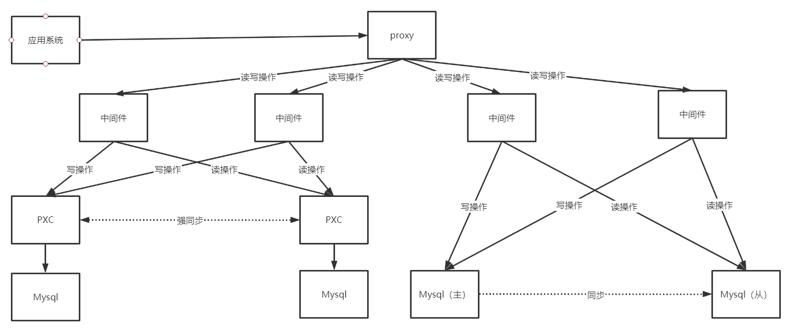

# 搭建主从复制架构

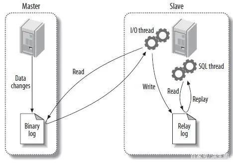

使用的Mysql版本为衍生版 `Percona` ，版本为5.7.23，通过docker 搭建服务

## 主从复制原理

-   **master** 将数据增量记录到 `二进制日志(binary log)` ，即配置文件 `log-bin` 指定的文件（这些记录叫做 `二进制日志事件 binary log events`）
-   **slave**  将 **master**  的 `binary log events` 拷贝到他的 `中继日志(relay log)`
-   **slave** 重做 `中继日志` 中的事件，将改变反映他自己的数据 （`数据重演`）

>   注意

-   主 DB Server 和 从DB Server 数据库版本一致
-   主 DB Server 和 从DB Server 数据库数据一致
-   主DB server开启二进制日志
-   主DB server和从DB server的server_id都必须唯一  

## 主库配置

```shell
# 创建主库 配置文件和数据文件 路径
mkdir -p /data/mysql/master01
cd /data/mysql/master01
mkdir conf data
# 修改当前文件夹读写权限
chmod 777 data -R
chmod 777 conf 

# 创建配置文件
cd /data/mysql/master01/conf
vim my.cnf
```

### 主库配置文件

```shell
#开启主从复制，主库的配置
[mysqld]
log-bin = mysql-bin
#指定主库serverid
server-id=1
sql_mode='STRICT_TRANS_TABLES,NO_ZERO_IN_DATE,NO_ZERO_DATE,ERROR_FOR_DIVISION_BY_ZERO,NO_AUTO_CREATE_USER,NO_ENGINE_SUBSTITUTION'
binlog_format=MIXED
#指定同步的库，如果不指定则同步全部数据库
##binlog-do-db=my_test
```

### 创建主库

```shell
docker create --name percona-master01 -v /data/mysql/master01/data:/var/lib/mysql -v /data/mysql/master01/conf:/etc/my.cnf.d -p 3306:3306 -e MYSQL_ROOT_PASSWORD=root percona:5.7.23

# 启动
docker start percona-master01 && docker logs -f percona-master01
```

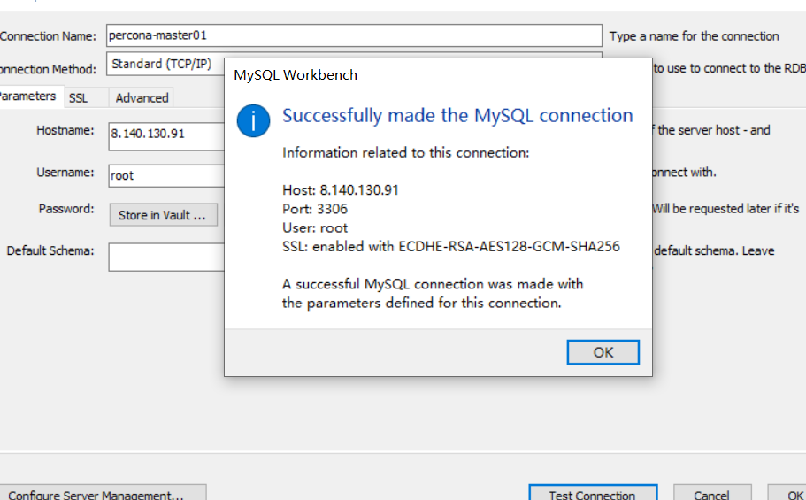

### 在主库中创建同步用户

```sql
-- 授权用户slave01使用123456密码登录mysql
create user 'slave01'@'%' identified by 'slave01';
grant replication slave on *.* to 'slave01'@'%';

-- 刷新配置
flush privileges;

-- 查看master状态
show master status;
-- 查看二进制日志相关的配置项
show global variables like 'binlog%';
-- 查看server相关的配置项
show global variables like 'server%';
```

>   出现问题：[Err] 1055 - Expression #1 of ORDER BY clause is not in GROUP BY clause and错误

解决方案，在my.cnf配置文件中设置  

```shell
sql_mode='STRICT_TRANS_TABLES,NO_ZERO_IN_DATE,NO_ZERO_DATE,ERROR_FOR_DIVISION_BY_ZERO,NO_AUTO_CREATE_USER,NO_ENGINE_SUBSTITUTION'
```

### 查看主库状态

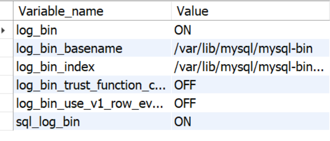


## 从库配置

```shell
#创建目录
mkdir /data/mysql/slave01
cd /data/mysql/slave01
mkdir conf data
chmod 777 data -R
chmod 777 conf

#创建配置文件
cd /data/mysql/slave01/conf
vim my.cnf
```

### 从库配置文件

```shell
[mysqld]
server-id=2 #服务id，不可重复
sql_mode='STRICT_TRANS_TABLES,NO_ZERO_IN_DATE,NO_ZERO_DATE,ERROR_FOR_DIVISION_BY_ZERO,NO_AUTO_CREATE_USER,NO_ENGINE_SUBSTITUTION'
```

### 创建容器

```shell
#创建容器
docker create --name percona-slave01 -v /data/mysql/slave01/data:/var/lib/mysql -v /data/mysql/slave01/conf:/etc/my.cnf.d -p 3307:3306 -e MYSQL_ROOT_PASSWORD=root percona:5.7.23

# 启动容器
docker start percona-slave01 && docker logs -f percona-slave01
```


### 设置master相关信息

```mysql
#设置master相关信息
CHANGE MASTER TO
 master_host='8.140.130.91',
 master_user='slave01',
 master_password='slave01',
 master_port=3306,
 master_log_file='mysql-bin.000003',
 master_log_pos=745;
 
# 启动同步
start slave;
```

### 测试

```sql
show slave status;
```

返回


## 问题

### 1. 服务器重启后，主从可能会断开同步，slave_sql_running为false

重置 `slave` 配置

```mysql
STOP SLAVE IO_THREAD FOR CHANNEL '';

CHANGE MASTER TO
 master_host='8.140.130.91',
 master_user='slave01',
 master_password='slave01',
 master_port=3306,
 master_log_file='mysql-bin.000005',
 master_log_pos=1217;
 
start slave;

show slave status;
```


### 2. World-writable config file ‘/etc/my.cnf’ is ignored

问题：

权限全局可写，任何一个用户都可以写。mysql担心这种文件被其他用户恶意修改，所以忽略掉这个配置文件

只需要将 conf 目录权限设为 777 ，其下目录设为 644

## 主从复制三种模式

```sql
show global variables like 'binlog%';
```

在查看二进制日志相关参数内容中，会发现默认的模式为 `ROW` ,在Mysql中提供了 3 中模式，对应的 **binlog 的格式有三种**：STATEMENT,ROW,MIXED

>   STATEMENT模式（SBR）——基于sql语句复制(statement-based replication)

每一条涉及数据修改的sql语句会记录到 `binlog` 中

-   优点：并不需要记录每一条sql语句和每一行的数据变化，减少了 binlog 日志量
-   缺点：在某些情况下会导致 `master-slave 数据不一致` （如sleep()函数，last_insert_id，user_defined function(udf) 等会出现问题）

>   ROW模式（RBR）——基于行的复制(row-based replication)  

-   优点：不记录每条sql语句的上下文信息，仅需记录哪条数据被修改了，修改成什么样了。  不会出现某些特定情况下的存储过程、或function、或trigger的调用和触发无法被正确复制的问题  
-   缺点：会产生大量的日志，尤其是alter table的时候会让日志暴涨  

>   MIXED模式（MBR）——混合模式复制(mixedbased replication）

以上两种模式的混合使用，

-   一般的复制使用STATEMENT模式保存binlog，
-   对于STATEMENT模式无法复制的操作使用ROW模式保存binlog

MySQL会根据执行的SQL语句选择日志保存方式

### 使用MIXED主从复制模式

```shell
#修改主库的配置
[mysqld]
log-bin = mysql-bin
#指定主库serverid
server-id=1
sql_mode='STRICT_TRANS_TABLES,NO_ZERO_IN_DATE,NO_ZERO_DATE,ERROR_FOR_DIVISION_BY_ZERO,NO_AUTO_CREATE_USER,NO_ENGINE_SUBSTITUTION'
binlog_format=MIXED
#指定同步的库，如果不指定则同步全部数据库
##binlog-do-db=my_test

---
# 重启
docker restart percona-master01

# 查看二进制日志相关配置项
show global variables like 'binlog%';
```


# MyCat中间件

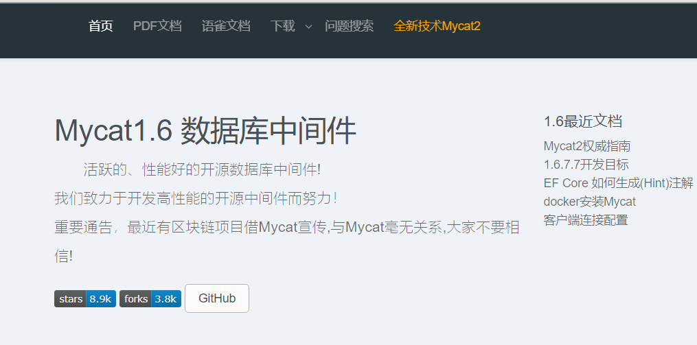

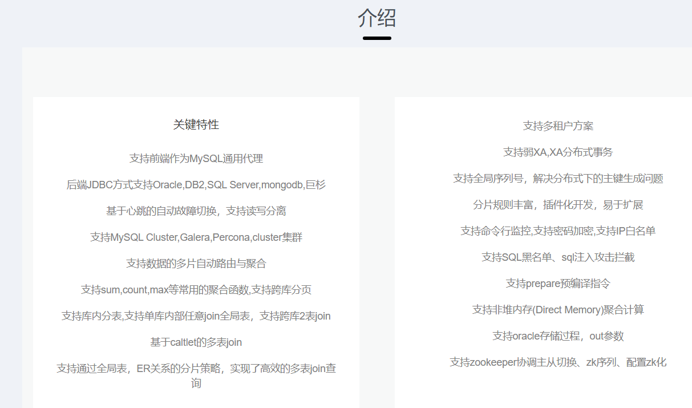

基于阿里 Cobar 产品研发

应用程序与Mycat之间为Mysql协议

>   数据分片与读写分离

-   读写分离：读写操作不在同一节点上
-   数据分片：扩容

## 安装

下载链接：http://dl.mycat.org.cn/

```shell
mkdir -p /haoke/mycat
tar -xvf Mycat-server-1.6.7.6-release-20210303094759-linux.tar.gz
mv mycat mycat01
```

## 读写分离

| 主机         | 端口 | 容器名称         | 角色   |
| ------------ | ---- | ---------------- | ------ |
| 8.140.130.91 | 3306 | percona-master01 | master |
| 8.140.130.91 | 3307 | percona-slave01  | slave  |

### server.xml

```xml
<?xml version="1.0" encoding="UTF-8"?>
<!DOCTYPE mycat:server SYSTEM "server.dtd">
<mycat:server xmlns:mycat="http://io.mycat/">
    <system>
        <property name="nonePasswordLogin">0</property>
        <property name="useHandshakeV10">1</property>
        <property name="useSqlStat">0</property>
        <property name="useGlobleTableCheck">0</property>
        <property name="sequnceHandlerType">2</property>
        <property name="subqueryRelationshipCheck">false</property>
        <property name="processorBufferPoolType">0</property>
        <property name="handleDistributedTransactions">0</property>
        <property name="useOffHeapForMerge">1</property>
        <property name="memoryPageSize">64k</property>
        <property name="spillsFileBufferSize">1k</property>
        <property name="useStreamOutput">0</property>
        <property name="systemReserveMemorySize">384m</property>
        <property name="useZKSwitch">false</property>
    </system>
    <!--这里是设置 Mycat 用户mycat 和虚拟逻辑库-->
    <user name="mycat" defaultAccount="true">
        <property name="password">mycat</property>
        <property name="schemas">haoke</property>
    </user>
</mycat:server>
```

### schema.xml

```xml
<?xml version="1.0"?>
<!DOCTYPE mycat:schema SYSTEM "schema.dtd">
<mycat:schema xmlns:mycat="http://io.mycat/">
    <!--配置数据表-->
    <schema name="haoke" checkSQLschema="false" sqlMaxLimit="100">
        <table name="tb_ad" dataNode="dn1" rule="mod-long" />
    </schema>
    <!--配置分片关系-->
    <dataNode name="dn1" dataHost="cluster1" database="haoke" />
    <!--配置连接信息-->
    <dataHost name="cluster1" maxCon="1000" minCon="10" balance="3"
              writeType="1" dbType="mysql" dbDriver="native" switchType="1"
              slaveThreshold="100">
        <heartbeat>select user()</heartbeat>
        <writeHost host="W1" url="8.140.130.91:3306" user="root" password="root">
            <readHost host="W1R1" url="8.140.130.91:3307" user="root" password="root" />
        </writeHost>
    </dataHost>
</mycat:schema>
```

>   balance 属性：

- ="0"：

  不开启读写分离机制，所有读操作都发送到当前可用的 writehost上

- ="1"：

  全部的主从节点都参与到 `select` 语句的负载均衡，一个主节点会作为另一个主节点的从节点

- ="2"：

  所有读操作都随机的在主节点、从节点上分发

- ="3"：

  所有读请求随机分发到主节点对应的从节点上执行，主节点不负担读压力

  只在 Mycat1.4 以后支持

### rule.xml

```xml
<function name="mod-long" class="io.mycat.route.function.PartitionByMod">
    <property name="count">1</property>
</function>
```

### 启动mycat

```shell
cd /haoke/mycat/mycat01
# 测试配置是否正确
./bin/mycat console
```


```shell
./bin/startup_nowrap.sh

[root@iZ2zeg4pktzjhp9h7wt6doZ mycat01]# jps
5987 Jps
2043 MycatStartup
[root@iZ2zeg4pktzjhp9h7wt6doZ mycat01]# kill 2043
[root@iZ2zeg4pktzjhp9h7wt6doZ mycat01]# jps
6004 Jps
```


>   问题：./startup.sh: /bin/sh^M: bad interpreter: No such file or directory

用vi打开文件 执行 :set ff 发现文件格式是dos格式
执行 :set ff=unix 将文件变成unix格式
然后再执行就可以了


>   问题：连接时出现 database=0错误

mycat指定的database没有被创建

解决：先创建mycat配置文件中的库，再连接mycat

### 测试读写分离

```sql
--创建表
CREATE TABLE `tb_ad` (
    `id` bigint(20) NOT NULL AUTO_INCREMENT,
    `type` int(10) DEFAULT NULL COMMENT '广告类型',
    `title` varchar(100) DEFAULT NULL COMMENT '描述',
    `url` varchar(200) DEFAULT NULL COMMENT '图片URL地址',
    `created` datetime DEFAULT NULL,
    `updated` datetime DEFAULT NULL,
    PRIMARY KEY (`id`)
) ENGINE=InnoDB AUTO_INCREMENT=1 DEFAULT CHARSET=utf8 COMMENT='广告表';

--测试插入数据
INSERT INTO `tb_ad` (`id`, `type`, `title`, `url`, `created`, `updated`)
VALUES ('1','1', 'UniCity万科天空之城', 'http://itcast-haoke.oss-cnqingdao.aliyuncs.com/images/2018/11/26/15432029097062227.jpg', '2018-11-26 11:28:49','2018-11-26 11:28:51');
                                                                           
--测试结果：主库有写入数据，从库会同步数据
```

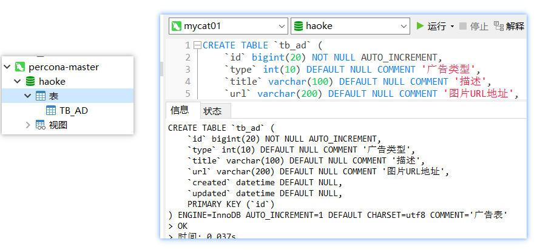

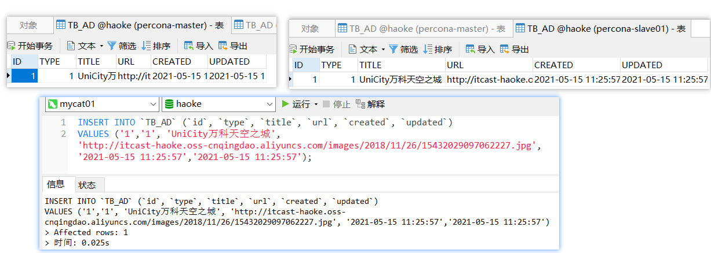

## 数据分片

Mysql集群1：

| 主机         | 端口 | 容器名称         | 角色   |
| ------------ | ---- | ---------------- | ------ |
| 8.140.130.91 | 3306 | percona-master01 | master |
| 8.140.130.91 | 3307 | percona-slave01  | slave  |

Mysql集群2：

| 主机         | 端口 | 容器名称         | 角色   |
| ------------ | ---- | ---------------- | ------ |
| 8.140.130.91 | 3316 | percona-master02 | master |
| 8.140.130.91 | 3317 | percona-slave02  | slave  |

### 配置master02

```shell
# 创建主库 配置文件和数据文件 路径
mkdir -p /data/mysql/master02
cd /data/mysql/master02
mkdir conf data
# 修改当前文件夹读写权限
chmod 777 data -R
chmod 777 conf 

# 创建配置文件
cd /data/mysql/master02/conf
vim my.cnf

---
#开启主从复制，主库的配置
[mysqld]
log-bin=mysql-bin
#指定主库serverid
server-id=1# 同一集群 id不同
sql_mode='STRICT_TRANS_TABLES,NO_ZERO_IN_DATE,NO_ZERO_DATE,ERROR_FOR_DIVISION_BY_ZERO,NO_AUTO_CREATE_USER,NO_ENGINE_SUBSTITUTION'
binlog_format=MIXED
#指定同步的库，如果不指定则同步全部数据库
##binlog-do-db=my_test
---

# 创建容器
docker create --name percona-master02 -v /data/mysql/master02/data:/var/lib/mysql  -v /data/mysql/master02/conf:/etc/my.cnf.d -p 3316:3306 -e MYSQL_ROOT_PASSWORD=root percona:5.7.23

# 启动
docker start percona-master02 && docker logs -f percona-master02

#创建同步账户以及授权
create user 'slave02'@'%' identified by 'slave02';
grant replication slave on *.* to 'slave02'@'%';
flush privileges;

#查看master状态
show master status;

-- 查看master状态
show master status;
-- 查看二进制日志相关的配置项
show global variables like 'binlog%';
-- 查看server相关的配置项
show global variables like 'server%';
```

### 配置slave02

```shell
#搭建从库
#创建目录
mkdir /data/mysql/slave02
cd /data/mysql/slave02
mkdir conf data
chmod 777 data -R
chmod 777 conf

#创建配置文件
cd /data/mysql/slave02/conf
vim my.cnf

---
#输入如下内容
[mysqld]
server-id=2 #服务id，不可重复
sql_mode='STRICT_TRANS_TABLES,NO_ZERO_IN_DATE,NO_ZERO_DATE,ERROR_FOR_DIVISION_BY_ZERO,NO_AUTO_CREATE_USER,NO_ENGINE_SUBSTITUTION'
---

#创建容器
docker create --name percona-slave02 -v /data/mysql/slave02/data:/var/lib/mysql -v /data/mysql/slave02/conf:/etc/my.cnf.d -p 3317:3306 -e MYSQL_ROOT_PASSWORD=root percona:5.7.23

#启动
docker start percona-slave02 && docker logs -f percona-slave02
```

### 设置主节点信息

```mysql
-- 设置master相关信息
CHANGE MASTER TO
 master_host='8.140.130.91',
 master_user='slave02',
 master_password='slave02',
 master_port=3316,
 master_log_file='mysql-bin.000006',
 master_log_pos=924;

-- 启动同步
start slave;

-- 查看master状态
show slave status;
```


### 创建数据库和表

```sql
CREATE TABLE tb_ad (
	`id` bigint(20) NOT NULL AUTO_INCREMENT,
	`type` int(10) DEFAULT NULL COMMENT '广告类型',
	`title` varchar(100) DEFAULT NULL COMMENT '描述',
	`url` varchar(200) DEFAULT NULL COMMENT '图片URL地址',
	`created` datetime DEFAULT NULL,
	`updated` datetime DEFAULT NULL,
	PRIMARY KEY (`id`)
) ENGINE=InnoDB AUTO_INCREMENT=1 DEFAULT CHARSET=utf8 COMMENT='广告表';
```


### 配置MyCat

#### schema.xml

```xml
<?xml version="1.0"?>
<!DOCTYPE mycat:schema SYSTEM "schema.dtd">
<mycat:schema xmlns:mycat="http://io.mycat/">
    <!--配置数据表-->
    <schema name="haoke" checkSQLschema="false" sqlMaxLimit="100">
        <table name="tb_ad" dataNode="dn1,dn2" rule="mod-long" />
    </schema>
    <!--配置分片关系-->
    <dataNode name="dn1" dataHost="cluster1" database="haoke" />
    <dataNode name="dn2" dataHost="cluster2" database="haoke" />
    <!--配置连接信息-->
    <dataHost name="cluster1" maxCon="1000" minCon="10" balance="3"
              writeType="1" dbType="mysql" dbDriver="native" switchType="1"
              slaveThreshold="100">
        <heartbeat>select user()</heartbeat>
        <writeHost host="W1" url="8.140.130.91:3306" user="root" password="root">
            <readHost host="W1R1" url="8.140.130.91:3307" user="root" password="root" />
        </writeHost>
    </dataHost>
    <dataHost name="cluster2" maxCon="1000" minCon="10" balance="3"
              writeType="1" dbType="mysql" dbDriver="native" switchType="1"
              slaveThreshold="100">
        <heartbeat>select user()</heartbeat>
        <writeHost host="W2" url="8.140.130.91:3316" user="root" password="root">
            <readHost host="W2R1" url="8.140.130.91:3317" user="root" password="root" />
        </writeHost>
    </dataHost>
</mycat:schema>
```

#### rule.xml

```xml
<function name="mod-long" class="io.mycat.route.function.PartitionByMod">
    <property name="count">2</property>
</function>
```

### 启动Mycat

```shell
# 测试mycat
./mycat console

./startup_nowrap.sh && tail -f ../logs/mycat.log
```

### 测试

```mysql
CREATE TABLE `TB_AD` (
`id` bigint(20) NOT NULL AUTO_INCREMENT,
`type` int(10) DEFAULT NULL COMMENT '广告类型',
`title` varchar(100) DEFAULT NULL COMMENT '描述',
`url` varchar(200) DEFAULT NULL COMMENT '图片URL地址',
`created` datetime DEFAULT NULL,
`updated` datetime DEFAULT NULL,
PRIMARY KEY (`id`)
) ENGINE=InnoDB AUTO_INCREMENT=1 DEFAULT CHARSET=utf8 COMMENT='广告表';
```

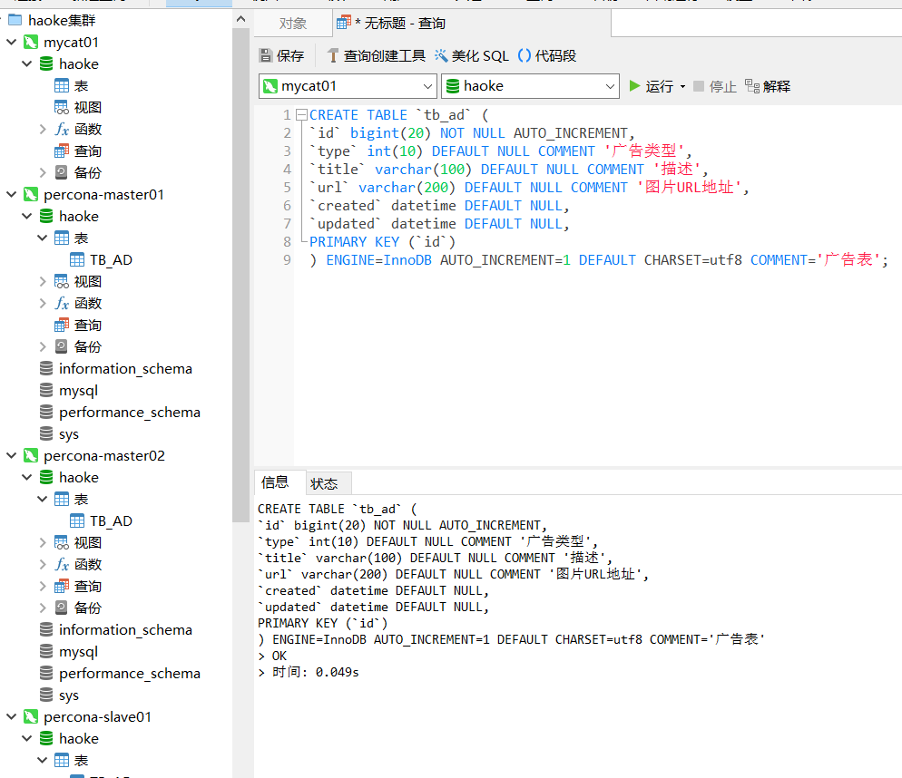

逐条插入

```mysql
INSERT INTO TB_AD (`id`, `type`, `title`, `url`, `created`, `updated`) 
VALUES ('1','1', 'UniCity万科天空之城', 'https://haoke-1257323542.cos.ap-beijing.myqcloud.com/ad-swipes/5.jpg', '2021-05-15 11:28:49','2021-05-15 11:28:49');
```


```mysql
INSERT INTO TB_AD (`id`, `type`, `title`, `url`, `created`, `updated`) 
VALUES ('2','1', '世界崇明', 'https://haoke-1257323542.cos.ap-beijing.myqcloud.com/ad-swipes/2.jpg', '2021-05-15 11:28:49','2021-05-15 11:28:49');
```

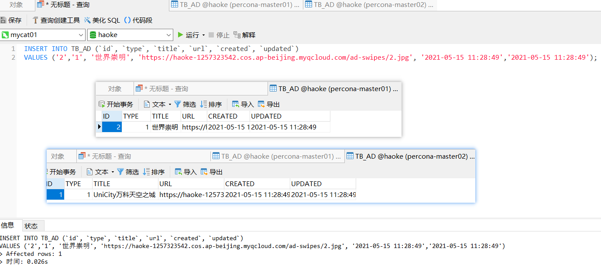

```mysql
INSERT INTO TB_AD (`id`, `type`, `title`, `url`, `created`, `updated`) 
VALUES ('3','1', '[奉贤 南桥] 光语著', 'https://haoke-1257323542.cos.ap-beijing.myqcloud.com/ad-swipes/3.jpg', '2021-05-15 11:28:49','2021-05-15 11:28:49');
```

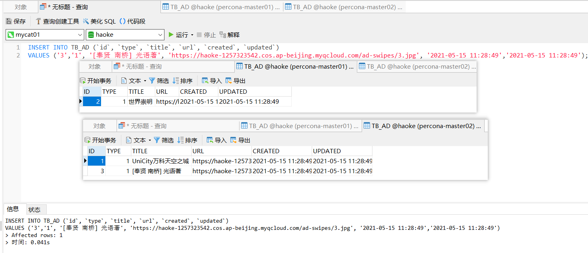

```mysql
INSERT INTO TB_AD (`id`, `type`, `title`, `url`, `created`, `updated`) 
VALUES ('4','1', '[上海周边 嘉兴] 融创海逸长洲', 'https://haoke-1257323542.cos.ap-beijing.myqcloud.com/ad-swipes/4.jpg', '2021-05-15 11:28:49','2021-05-15 11:28:49');
```


## Mycat集群

为解决单节点性能问题，部署多个mycat节点

```shell
cd /haoke/mycat

cp mycat01 mycat02 -R

cd mycat02

vim wrapper.xml
wrapper.java.additional.6=-Dcom.sun.management.jmxremote.port=1985

vim server.xml
<property name="serverPort">8067</property>
<property name="managerPort">9067</property>
        
 # 启动服务
./startup_nowrap.sh
```

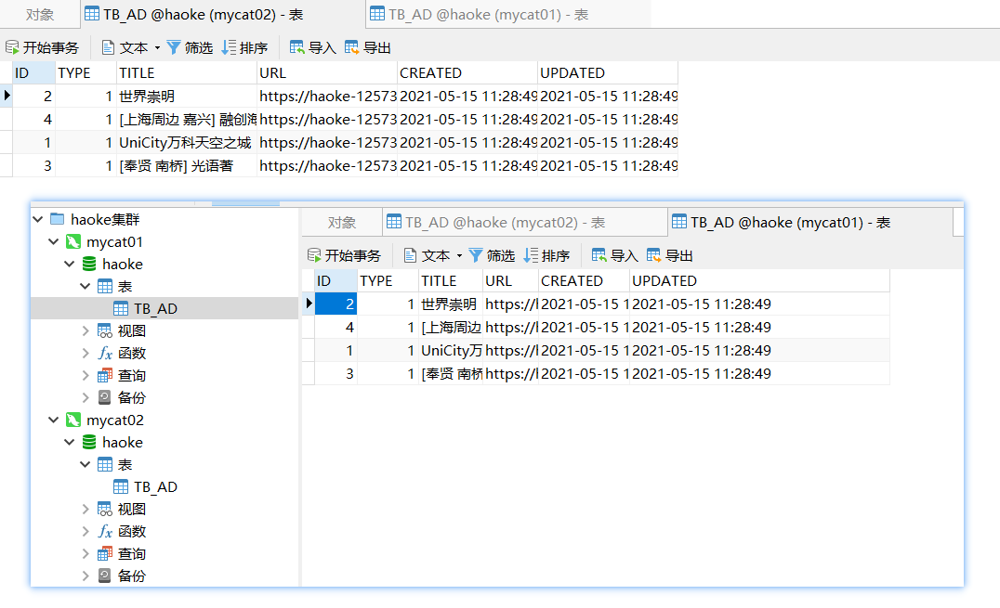

# 负载均衡

为解决应用程序需要连接到多个mycat，添加 `负载均衡组件` HAProxy

## 简介

haproxy C语言编写，高可用性、负载均衡以及基于TCP和HTTP的应用程序代理

Haproxy 运行在硬件上，支持万级并发。

HAProxy 实现了 `事件驱动` `单一进程模型` ，此模型支持非常大的并发连接。

-   多线程或多线程模型受内存限制、系统调度器限制以及无所不在的锁限制，很少能处理千级并发
-   事件驱动模型 有更好的资源和时间管理的用户空间实现所有的任务

[HAProxy - The Reliable, High Performance TCP/HTTP Load Balancer](https://www.haproxy.org/)

## 部署安装HAProxy

```shell
#拉取镜像
docker pull haproxy:1.9.3

#创建目录，用于存放配置文件
mkdir /haoke/haproxy

#创建容器
docker create --name haproxy --net host -v /haoke/haproxy:/usr/local/etc/haproxy haproxy:1.9.3
```

## 配置文件

```shell
#创建文件
vim /haoke/haproxy/haproxy.cfg

---
global
    log 127.0.0.1 local2
    maxconn 4000
    daemon
    
defaults
	mode	http
	log 	global
	option	 httplog
	option 	dontlognull
	option 	http-server-close
	option 	forwardfor except 127.0.0.0/8
	option 	redispatch
	retries 	3
	timeout 	http-request 10s
	timeout 	queue 1m
	timeout 	connect 10s
	timeout 	client 1m
	timeout 	server 1m
	timeout 	http-keep-alive 10s
	timeout 	check 10s
	maxconn 	3000
	
listen admin_stats
	bind 	0.0.0.0:4001
	mode 	http
	stats	 uri /dbs
	stats	 realm Global\ statistics
	stats	 auth admin:admin
	
listen proxy-mysql
	bind 0.0.0.0:4002
	mode tcp
	balance roundrobin
	option tcplog
	#代理mycat服务
		server mycat_1 8.140.130.91:8066 check port 8066 maxconn 2000
		server mycat_2 8.140.130.91:8067 check port 8067 maxconn 2000
---

# 启动容器
docker start haproxy && docker logs -f haproxy
```

## 测试

---

web 界面测试：http://8.140.130.91:4001/dbs


---

mysql客户端测试：


# PXC集群

Percona XtraDB Cluster (PXC) 是针对Mysql用户的高可用性和扩展性解决方案，基于Percona Server，是一个针对事务性应用程序的同步多主机复制插件。

Percona Server是Mysql的改进版本，使用 XtraDB存储引擎，在功能和性能上较Mysql有着显著提升：提升了高负载情况下的InnoDB的性能，为DBA提供了一些非常有用的性能诊断工具，另外有更多的参数和命令来控制服务器行为

Percona XtraDB Cluster提供了：

-   同步复制：事务可以在所有节点上提交
-   多主机复制：可以写到任意节点上
-   从(slave)服务器上的并行应用事件，真正的“主从复制”
-   自动节点配置
-   数据一致性：不再有未同步的从服务器

https://www.percona.com/software/mysql-database/percona-xtradb-cluster

## 注意

-   尽可能控制PXC集群的规模，节点越多，数据同步速度越慢
-   所有PXC节点的硬件配置要一致，配置低的节点将拖慢数据同步速度
-   PXC集群只支持InnoDB引擎，不支持其他的存储引擎

## PXC集群方案与Replication区别

-   PXC集群方案所有节点都是可读可写的，Replication从节点不能写入（主从同步是单向的，无法从slave节点向master节点同步）
-   PXC同步机制是同步进行的，这也是它能保证数据强一致性的根本原因，Replication同步机制是异步进行的，如果从节点停止同步，依然可以向主节点插入数据，正确返回，但会造成数据不一致问题
-   PXC是用性能的牺牲换取数据一致性，Replication在性能上是高于PXC的
-   两者用途不一致：
    -   Replication用于一般信息的存储，能够容忍数据丢失，如：购物车，用户行为日志等
    -   PXC是用于重要信息存储，如：订单，用户信息

## 部署安装

| 节点  | 端口  | 容器名称  | 数据卷 |
| ----- | ----- | --------- | ------ |
| node1 | 13306 | pxc_node1 | v1     |
| node2 | 13307 | pxc_node2 | v2     |
| node3 | 13308 | pxc_node3 | v3     |

```shell
#创建数据卷（存储路径：/var/lib/docker/volumes）
docker volume create v1
docker volume create v2
docker volume create v3

#拉取镜像
docker pull percona/percona-xtradb-cluster:5.7

#重命名
docker tag percona/percona-xtradb-cluster:5.7 pxc

#创建网络
docker network create --subnet=172.30.0.0/24 pxc-network

#创建容器
#第一节点
docker create -p 13306:3306 -v v1:/var/lib/mysql -e MYSQL_ROOT_PASSWORD=root -e CLUSTER_NAME=pxc --name=pxc_node1 --net=pxc-network --ip=172.30.0.2 pxc

#第二节点（增加了CLUSTER_JOIN参数）
docker create -p 13307:3306 -v v2:/var/lib/mysql -e MYSQL_ROOT_PASSWORD=root -e CLUSTER_NAME=pxc --name=pxc_node2 -e CLUSTER_JOIN=pxc_node1 --net=pxc-network --ip=172.30.0.3 pxc

#第三节点（增加了CLUSTER_JOIN参数）
docker create -p 13308:3306 -v v3:/var/lib/mysql -e MYSQL_ROOT_PASSWORD=root -e CLUSTER_NAME=pxc --name=pxc_node3 -e CLUSTER_JOIN=pxc_node1 --net=pxc-network --ip=172.30.0.4 pxc

#启动
docker create pxc_node1

#查看集群节点
show status like 'wsrep_cluster%';
```


>   先启动第一个结点，等到mysql客户端可以连接到服务后，再启动其他节点

-   启动第一个节点，PXC集群会进行初始化，集群初始化完成后，其他节点才能加入到集群中


## 测试

```mysql
CREATE TABLE `tb_ad` (
`id` bigint(20) NOT NULL AUTO_INCREMENT,
`type` int(10) DEFAULT NULL COMMENT '广告类型',
`title` varchar(100) DEFAULT NULL COMMENT '描述',
`url` varchar(200) DEFAULT NULL COMMENT '图片URL地址',
`created` datetime DEFAULT NULL,
`updated` datetime DEFAULT NULL,
PRIMARY KEY (`id`)
) ENGINE=InnoDB AUTO_INCREMENT=1 DEFAULT CHARSET=utf8 COMMENT='广告表';

INSERT INTO `tb_ad` (`id`, `type`, `title`, `url`, `created`, `updated`) VALUES ('1','1', 'UniCity万科天空之城', 'http://itcast-haoke.oss-cnqingdao.aliyuncs.com/images/2018/11/26/15432029097062227.jpg', '2018-11-26 11:28:49','2018-11-26 11:28:51');
```


# haoke租房数据库集群

好客租房项目采用混合架构的方式完善数据库集群


-   HAProxy 作为负载均衡器
-   部署了两个 Mycat 节点作为数据库中间件
-   部署两个 PXC 集群节点，作为2个Mycat分片，每个PXC集群中有两个节点，作为数据的同步存储，PXC集群做数据分片
-   部署一个主从复制集群
-   房源数据保存到PXC分片中，其余数据保存在主从架构中

##  部署PXC集群

集群一：

| 节点  | 端口  | 容器名称  | 数据卷   |
| ----- | ----- | --------- | -------- |
| node1 | 13306 | pxc_node1 | haoke-v1 |
| node2 | 13307 | pxc_node2 | haoke-v2 |

集群二：

| 节点  | 端口  | 容器名称  | 数据卷   |
| ----- | ----- | --------- | -------- |
| node3 | 13308 | pxc_node3 | haoke-v3 |
| node4 | 13309 | pxc_node4 | haoke-v4 |

```shell
#创建数据卷（存储路径：/var/lib/docker/volumes）
docker volume create haoke-v1
docker volume create haoke-v2
docker volume create haoke-v3
docker volume create haoke-v4

# 拉取镜像
docker pull percona/percona-xtradb-cluster:5.7

# 镜像命名
docker tag percona/percona-xtradb-cluster:5.7 pxc

#创建网络
docker network create --subnet=172.30.0.0/24 pxc-network

#创建容器
#集群1，第一节点
docker create --name=pxc-haoke-node1 -p 13306:3306 -v haoke-v1:/var/lib/mysql -e MYSQL_ROOT_PASSWORD=root -e CLUSTER_NAME=pxc --net=pxc-network --ip=172.30.0.2 pxc
#第二节点（增加了CLUSTER_JOIN参数）
docker create --name=pxc-haoke-node2 -p 13307:3306 -v haoke-v2:/var/lib/mysql -e MYSQL_ROOT_PASSWORD=root -eCLUSTER_NAME=pxc -e CLUSTER_JOIN=pxc-haoke-node1 --net=pxc-network --ip=172.30.0.3 pxc

#集群2
#第一节点
docker create --name=pxc-haoke-node3 -p 13308:3306 -v haoke-v3:/var/lib/mysql -e MYSQL_ROOT_PASSWORD=root -e CLUSTER_NAME=pxc --net=pxc-network --ip=172.30.0.4 pxc
#第二节点（增加了CLUSTER_JOIN参数）
docker create -p 13309:3306 -v haoke-v4:/var/lib/mysql -e MYSQL_ROOT_PASSWORD=root -e CLUSTER_NAME=pxc --name=pxc-haoke-node4 -e CLUSTER_JOIN=pxc-haoke-node3 --net=pxc-network --ip=172.30.0.5 pxc

#启动 先pxc第一个结点启动成功后再启动第二个
docker start pxc-haoke-node1 && docker logs -f pxc-haoke-node1
docker start pxc-haoke-node2 && docker logs -f pxc-haoke-node2
docker start pxc-haoke-node3 && docker logs -f pxc-haoke-node3
docker start pxc-haoke-node4 && docker logs -f pxc-haoke-node4

#查看集群节点
show status like 'wsrep_cluster%';
```


### 测试


```mysql
CREATE TABLE `tb_house_resources` (
    `id` bigint(20) NOT NULL AUTO_INCREMENT,
    `title` varchar(100) DEFAULT NULL COMMENT '房源标题',
    `estate_id` bigint(20) DEFAULT NULL COMMENT '楼盘id',
    `building_num` varchar(5) DEFAULT NULL COMMENT '楼号（栋）',
    `building_unit` varchar(5) DEFAULT NULL COMMENT '单元号',
    `building_floor_num` varchar(5) DEFAULT NULL COMMENT '门牌号',
    `rent` int(10) DEFAULT NULL COMMENT '租金',
    `rent_method` tinyint(1) DEFAULT NULL COMMENT '租赁方式，1-整租，2-合租',
    `payment_method` tinyint(1) DEFAULT NULL COMMENT '支付方式，1-付一押一，2-付三押一，3-付六押一，4-年付押一，5-其它',
    `house_type` varchar(255) DEFAULT NULL COMMENT '户型，如：2室1厅1卫',
    `covered_area` varchar(10) DEFAULT NULL COMMENT '建筑面积',
    `use_area` varchar(10) DEFAULT NULL COMMENT '使用面积',
    `floor` varchar(10) DEFAULT NULL COMMENT '楼层，如：8/26',
    `orientation` varchar(2) DEFAULT NULL COMMENT '朝向：东、南、西、北',
    `decoration` tinyint(1) DEFAULT NULL COMMENT '装修，1-精装，2-简装，3-毛坯',
    `facilities` varchar(50) DEFAULT NULL COMMENT '配套设施， 如：1,2,3',
    `pic` varchar(1000) DEFAULT NULL COMMENT '图片，最多5张',
    `house_desc` varchar(200) DEFAULT NULL COMMENT '描述',
    `contact` varchar(10) DEFAULT NULL COMMENT '联系人',
    `mobile` varchar(11) DEFAULT NULL COMMENT '手机号',
    `time` tinyint(1) DEFAULT NULL COMMENT '看房时间，1-上午，2-中午，3-下午，4-晚上，5-全天',
    `property_cost` varchar(10) DEFAULT NULL COMMENT '物业费',
    `created` datetime DEFAULT NULL,
    `updated` datetime DEFAULT NULL,
    PRIMARY KEY (`id`)
) ENGINE=InnoDB AUTO_INCREMENT=1 DEFAULT CHARSET=utf8 COMMENT='房源表';
```


## 部署主从复制集群

### 主库

```shell
# 创建主库 配置文件和数据文件 路径
mkdir -p /data/mysql/master01
cd /data/mysql/master01
mkdir conf data
# 修改当前文件夹读写权限
chmod 777 data -R
chmod 777 conf


# 创建配置文件
cd /data/mysql/master01/conf
vim my.cnf

---
#开启主从复制，主库的配置
[mysqld]
log-bin=mysql-bin
#指定主库serverid
server-id=1# 同一集群 id不同
sql_mode='STRICT_TRANS_TABLES,NO_ZERO_IN_DATE,NO_ZERO_DATE,ERROR_FOR_DIVISION_BY_ZERO,NO_AUTO_CREATE_USER,NO_ENGINE_SUBSTITUTION'
binlog_format=MIXED
#指定同步的库，如果不指定则同步全部数据库
##binlog-do-db=my_test
---

# 创建容器
docker create --name percona-haoke-master01 -v /data/mysql/master01/data:/var/lib/mysql  -v /data/mysql/master01/conf:/etc/my.cnf.d -p 3306:3306 -e MYSQL_ROOT_PASSWORD=root percona:5.7.23

# 启动
docker start percona-haoke-master01 && docker logs -f percona-haoke-master01

#创建同步账户以及授权
create user 'slave01'@'%' identified by 'slave01';
grant replication slave on *.* to 'slave01'@'%';
flush privileges;

#查看master状态
show master status;
#查看二进制日志相关的配置项
show global variables like 'binlog%';
#查看server相关的配置项
show global variables like 'server%';
```


### 从库

```shell
#搭建从库
#创建目录
mkdir /data/mysql/slave01
cd /data/mysql/slave01
mkdir conf data
chmod 777 data -R
chmod 777 conf 

#创建配置文件
cd /data/mysql/slave01/conf
vim my.cnf

---
#输入如下内容
[mysqld]
server-id=2 #服务id，不可重复
sql_mode='STRICT_TRANS_TABLES,NO_ZERO_IN_DATE,NO_ZERO_DATE,ERROR_FOR_DIVISION_BY_ZERO,NO_AUTO_CREATE_USER,NO_ENGINE_SUBSTITUTION'
---

#创建容器
docker create --name percona-haoke-slave01 -v /data/mysql/slave01/data:/var/lib/mysql -v /data/mysql/slave01/conf:/etc/my.cnf.d -p 3307:3306 -e MYSQL_ROOT_PASSWORD=root percona:5.7.23

#启动
docker start percona-haoke-slave01 && docker logs -f percona-haoke-slave01
```

```mysql
#设置master相关信息
CHANGE MASTER TO
	master_host='8.140.130.91',
	master_user='slave01',
	master_password='slave01',
	master_port=3306,
	master_log_file='mysql-bin.000004',
	master_log_pos=154;

#启动同步
start slave;
#查看master状态
show slave status;
```

### 测试


```mysql
CREATE TABLE `tb_ad` (
`id` bigint(20) NOT NULL AUTO_INCREMENT,
`type` int(10) DEFAULT NULL COMMENT '广告类型',
`title` varchar(100) DEFAULT NULL COMMENT '描述',
`url` varchar(200) DEFAULT NULL COMMENT '图片URL地址',
`created` datetime DEFAULT NULL,
`updated` datetime DEFAULT NULL,
PRIMARY KEY (`id`)
) ENGINE=InnoDB AUTO_INCREMENT=1 DEFAULT CHARSET=utf8 COMMENT='广告表';
```

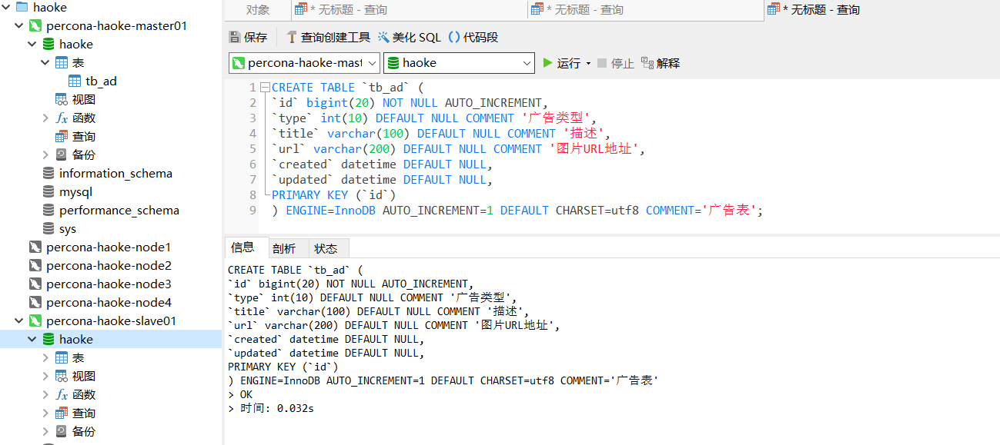

## 部署MyCat

### 节点一

```shell
cd /data/
mkdir mycat
cd mycat
cp /haoke/mycat . -R
mv mycat/ mycat-node1
```

#### server.xml

```xml
<?xml version="1.0" encoding="UTF-8"?>
<!DOCTYPE mycat:server SYSTEM "server.dtd">
<mycat:server xmlns:mycat="http://io.mycat/">
    <system>
        <property name="nonePasswordLogin">0</property>
        <property name="useHandshakeV10">1</property>
        <property name="useSqlStat">0</property>
        <property name="useGlobleTableCheck">0</property>
        <property name="sequnceHandlerType">2</property>
        <property name="subqueryRelationshipCheck">false</property>
        <property name="processorBufferPoolType">0</property>
        <property name="handleDistributedTransactions">0</property>
        <property name="useOffHeapForMerge">1</property>
        <property name="memoryPageSize">64k</property>
        <property name="spillsFileBufferSize">1k</property>
        <property name="useStreamOutput">0</property>
        <property name="systemReserveMemorySize">384m</property>
        <property name="useZKSwitch">false</property>
        <!--设置服务端口以及管理端口-->
        <property name="serverPort">18067</property>
        <property name="managerPort">19067</property>
    </system>
    <!--这里是设置 Mycat 用户mycat 和虚拟逻辑库-->
    <user name="mycat" defaultAccount="true">
        <property name="password">mycat</property>
        <property name="schemas">haoke</property>
    </user>
</mycat:server>
```

#### schema.xml

```xml
<?xml version="1.0"?>
<!DOCTYPE mycat:schema SYSTEM "schema.dtd">
<mycat:schema xmlns:mycat="http://io.mycat/">
    <!--配置数据表-->
    <schema name="haoke" checkSQLschema="false" sqlMaxLimit="100">
        <table name="tb_house_resources" dataNode="dn1,dn2" rule="mod-long" />
        <table name="tb_ad" dataNode="dn3"/>
    </schema>
    <!--配置分片关系-->
    <dataNode name="dn1" dataHost="cluster1" database="haoke" />
    <dataNode name="dn2" dataHost="cluster2" database="haoke" />
    <dataNode name="dn3" dataHost="cluster3" database="haoke" />
    <!--配置连接信息-->
    <dataHost name="cluster1" maxCon="1000" minCon="10" balance="2"
              writeType="1" dbType="mysql" dbDriver="native" switchType="1"
              slaveThreshold="100">
        <heartbeat>select user()</heartbeat>
        <writeHost host="W1" url="8.140.130.91:13306" user="root"
                   password="root">
            <readHost host="W1R1" url="8.140.130.91:13307" user="root"
                      password="root" />
        </writeHost>
    </dataHost>
    <dataHost name="cluster2" maxCon="1000" minCon="10" balance="2"
              writeType="1" dbType="mysql" dbDriver="native" switchType="1"
              slaveThreshold="100">
        <heartbeat>select user()</heartbeat>
        <writeHost host="W2" url="8.140.130.91:13308" user="root"
                   password="root">
            <readHost host="W2R1" url="8.140.130.91:13309" user="root"
                      password="root" />
        </writeHost>
    </dataHost>
    <dataHost name="cluster3" maxCon="1000" minCon="10" balance="3"
              writeType="1" dbType="mysql" dbDriver="native" switchType="1"
              slaveThreshold="100">
        <heartbeat>select user()</heartbeat>
        <writeHost host="W3" url="8.140.130.91:3306" user="root"
                   password="root">
            <readHost host="W3R1" url="8.140.130.91:3307" user="root"
                      password="root" />
        </writeHost>
    </dataHost>
</mycat:schema>
```

#### rule.xml

```xml
<function name="mod-long" class="io.mycat.route.function.PartitionByMod">
    <property name="count">2</property>
</function>
```

#### 设置端口及启动

```shell
vim wrapper.conf
#设置jmx端口
wrapper.java.additional.7=-Dcom.sun.management.jmxremote.port=11984

./mycat console
./startup_nowrap.sh && tail -f ../logs/mycat.log
```

#### 测试：

>   连接


>   插入数据

```mysql
INSERT INTO `tb_house_resources` (`id`, `title`, `estate_id`, `building_num`,`building_unit`, `building_floor_num`, `rent`, `rent_method`, `payment_method`,`house_type`, `covered_area`, `use_area`, `floor`, `orientation`, `decoration`,`facilities`, `pic`, `house_desc`, `contact`, `mobile`, `time`, `property_cost`,`created`, `updated`) VALUES ('1', '东方曼哈顿 3室2厅 16000元', '1005', '2', '1', '1','1111', '1', '1', '1室1厅1卫1厨1阳台', '2', '2', '1/2', '南', '1', '1,2,3,8,9', NULL, '这个经纪人很懒，没写核心卖点', '张三', '11111111111', '1', '11', '2021-05-16 01:16:00','2021-05-16 01:16:00');
```

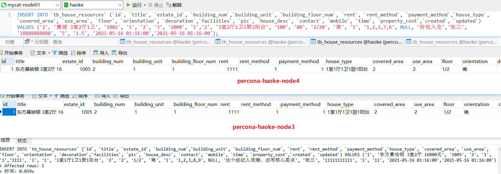

```mysql
INSERT INTO `tb_house_resources` (`id`, `title`, `estate_id`, `building_num`,`building_unit`, `building_floor_num`, `rent`, `rent_method`, `payment_method`,`house_type`, `covered_area`, `use_area`, `floor`, `orientation`, `decoration`,`facilities`, `pic`, `house_desc`, `contact`, `mobile`, `time`, `property_cost`,`created`, `updated`) VALUES ('2', '康城 3室2厅1卫', '1002', '1', '2', '3', '2000', '1','2', '3室2厅1卫1厨2阳台', '100', '80', '2/20', '南', '1', '1,2,3,7,6', NULL, '拎包入住','张三', '18888888888', '5', '1.5', '2021-05-16 01:16:00','2021-05-16 01:16:00');
```

```mysql
INSERT INTO `tb_ad` (`id`, `type`, `title`, `url`, `created`, `updated`) VALUES ('1','1', 'UniCity万科天空之城', 'http://itcast-haoke.oss-cnqingdao.aliyuncs.com/images/2018/11/26/15432029097062227.jpg', '2021-05-16 01:16:00','2021-05-16 01:16:00');
```


### 节点二

```shell
cp mycat-node1/ mycat-node2 -R

vim wrapper.conf
#设置jmx端口
wrapper.java.additional.7=-Dcom.sun.management.jmxremote.port=11986

vim server.xml
#设置服务端口以及管理端口
<property name="serverPort">18068</property>
<property name="managerPort">19068</property>

./mycat console
./startup_nowrap.sh && tail -f ../logs/mycat.log
```

## 部署HAProxy

修改配置文件：

```shell
#修改文件
vim /haoke/haproxy/haproxy.cfg

global
    log 127.0.0.1 local2
    maxconn 4000
    daemon
    
defaults
	mode	http
	log 	global
	option	 httplog
	option 	dontlognull
	option 	http-server-close
	option 	forwardfor except 127.0.0.0/8
	option 	redispatch
	retries 	3
	timeout 	http-request 10s
	timeout 	queue 1m
	timeout 	connect 10s
	timeout 	client 1m
	timeout 	server 1m
	timeout 	http-keep-alive 10s
	timeout 	check 10s
	maxconn 	3000
	
listen admin_stats
	bind 	0.0.0.0:4001
	mode 	http
	stats	 uri /dbs
	stats	 realm Global\ statistics
	stats	 auth admin:admin
	
listen proxy-mysql
	bind 0.0.0.0:4002
	mode tcp
	balance roundrobin
	option tcplog
	#代理mycat服务
		server mycat_1 8.140.130.91:18067 check port 18067 maxconn 2000
		server mycat_2 8.140.130.91:18068 check port 18068 maxconn 2000
```

```shell
docker create --name haproxy --net host -v /data/haproxy:/usr/local/etc/haproxy haproxy:1.9.3

# 启动容器
docker start haproxy && docker logs haproxy
```


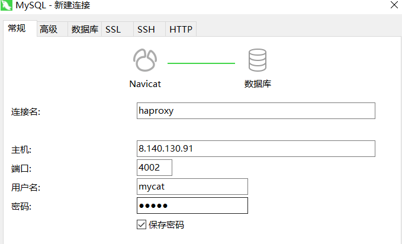


