> 配置vscode的 `Python` , `C++` 的编译环境

<!--more-->

# 1. Py+conda+vscode

## 1.1 单文件

### 1.1.1 指定Python解释器

选用指定anaconda下的python编译器

命令面板 `>python:select Interpretor ` 

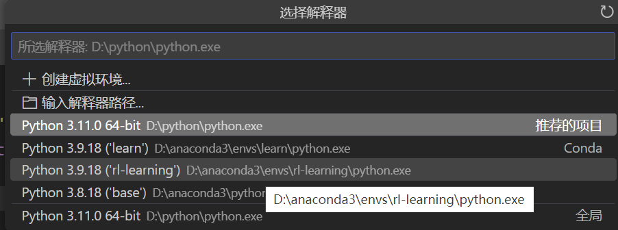

### 1.1.2 创建vscode-python文件夹

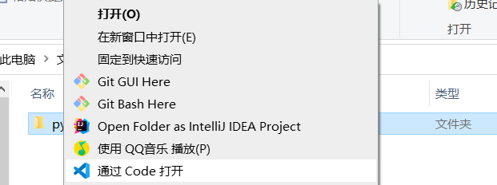

#### 裸配置

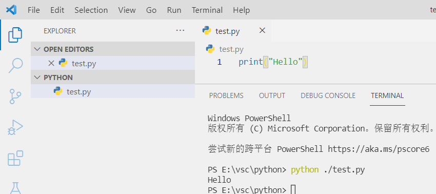

如图，与在命令行运行无区别

### 1.1.2 安装vscode-python插件

### 1.1.3 code插件运行.py

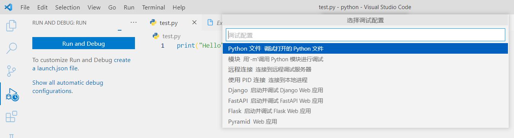

#### 添加配置文件

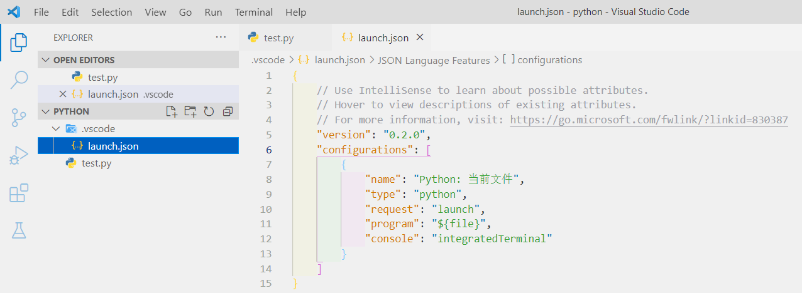

`"program"` ：设置启动文件

```json
"program": "${file}",
```

code宏定义：选中那个文件 *F5* 运行那个文件

#### code调试功能

-   设置断点后， *F5* 运行至断点处

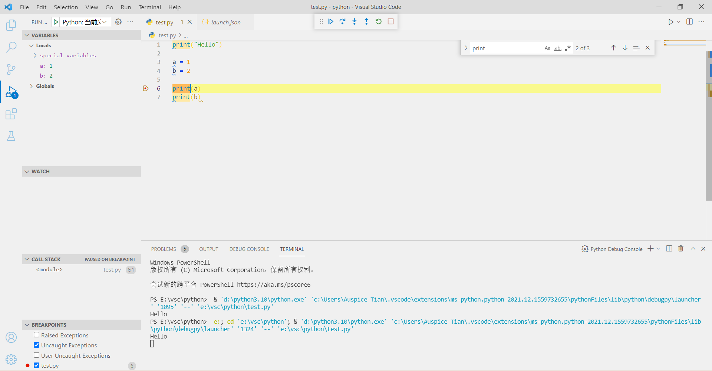

-   *F10* 从断点处逐行执行

    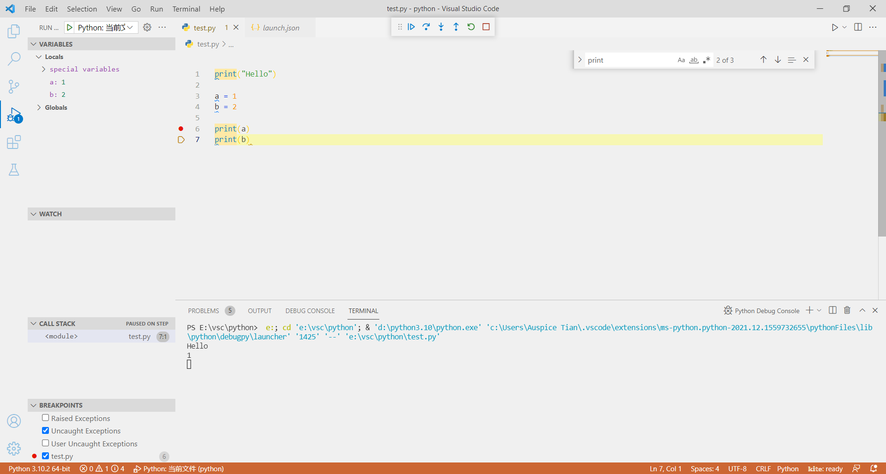

    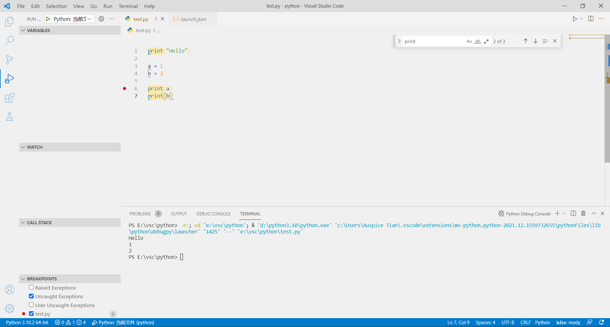

## 1.2 跨文件夹调用

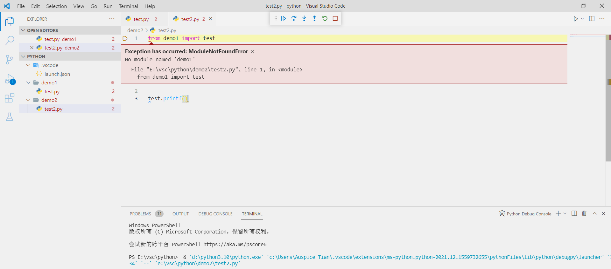

```python
import sys
sys.path.append("./") # 将当前文件夹添加到系统目录中
```

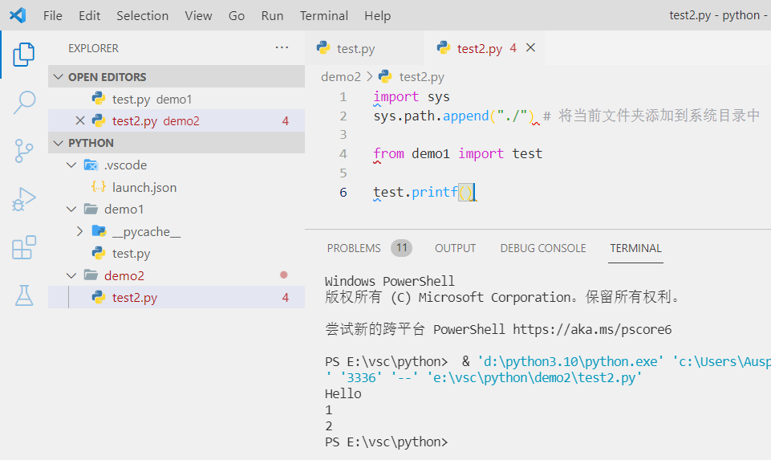

# 2. C++

## 2.0 编译环境安装

### Windows下安装

#### 下载Windows软件构建器MSYS2

##### 简介

MSYS2是面向Windows的软件分发与构建平台，用于构建、安装和运行本机Windows软件

包括 *命令终端*（minitty，bash）、*版本控制系统*（git、subversion）、tar、awk工具、自动构建工具等

可以为GCC、mingw-w64、CPython、OpenSSL、FFmpeg、Rust、Ruby等提供本地构建

内部的软件包管理系统为Pacman

官网：https://www.msys2.org/

镜像：https://mirrors.tuna.tsinghua.edu.cn/msys2/distrib/x86_64/

##### 安装

按安装步骤

##### 镜像配置

参考：https://blog.csdn.net/heromps/article/details/136703389

msys2安装后，先不要运行

修改为清华源：https://mirrors.tuna.tsinghua.edu.cn/help/msys2/

1. 进入目录目标路径

   ```shell
   cd D:/software/msys2/etc/pacman.d/
   ```

2. 修改镜像列表（需要有bash环境）

   ```shell
   sed -i "s#https\?://mirror.msys2.org/#https://mirrors.tuna.tsinghua.edu.cn/msys2/#g" mirrorlist*
   ```

3. 更新系统环境

   在msys2窗口内执行

   ```shell
   pacman -Sy
   #更新源
   pacman -Syu
   pacman -Su
   ```

#### 安装mingw-64工具链

在msys2窗口内，执行

```shell
pacman -S --needed base-devel mingw-w64-x86_64-toolchain git mingw-w64-x86_64-cmake
```

安装完成后，在msys路径下会出现构建的mingw64与mingw32目录

更具体的安装过程

```shell
# 1. 安装mingw-64
pacman -S mingw-w64-x86_64-gcc
# 2. 安装make
pacman -S make

#可以不安装
## 在 64 位系统上构建 32 位应用程序 的编译器
pacman -S  mingw-w64-i686-toolchain　　　
## 在 64 位系统上构建 64 位应用程序 的编译器
pacman -S  mingw-w64-x86_64-toolchain

# 安装常用工具
## git wget perl ruby
pacman -S  base-devel git wget perl ruby

# 桌面应用开发GTK3 Glade (C语言)
## 安装GTK
pacman -S  mingw-w64-i686-gtk3　　#可以不安装
pacman -S mingw-w64-x86_64-gtk3
## 安装Glade
pacman -S  mingw-w64-i686-glade
pacman -S  mingw-w64-x86_64-glade
```

#### 配置默认路径

将mingw64的路径添加到PATH

```shell
# 变量MINGW_HOME
D:\msys64\mingw32
# 变量C_INCLUDE_PATH
%MINGW_HOME%\include
# 变量LIBRARY_PATH
%MINGW_HOME%\lib
# 变量Path中添加如下值
%MINGW_HOME%\bin
```


## 2.1 单文件编译

### 2.1.1 下载vsc扩展

### 2.1.2 下载C++编译器

https://winlibs.com/

1. 查看版本

   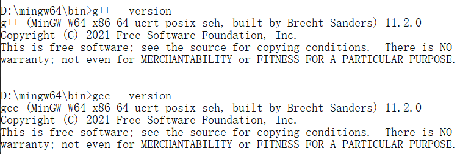

2. 配置环境变量

   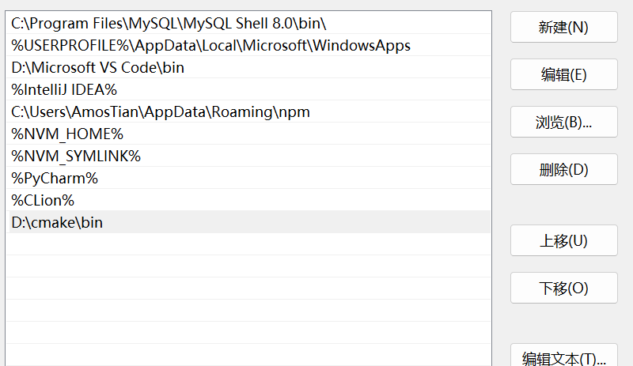

3.  编写程序，测试编译器

    ```c++
    # include<stdio.h>
    # include<windows.h>
    
    int main(){
        printf("hello\n");
    
        system("pause");
        return 0;
    }
    ```

    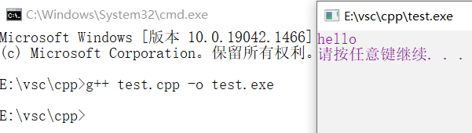

### 2.1.3 vsc使用自己下载的编译器

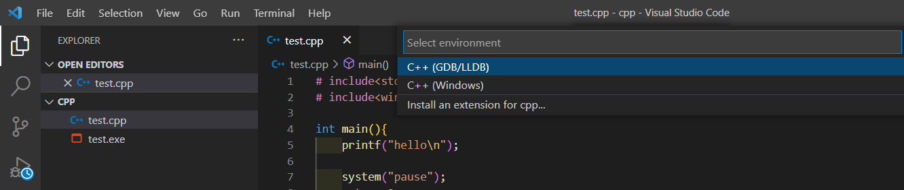

-   GDB为自己下载的编译器

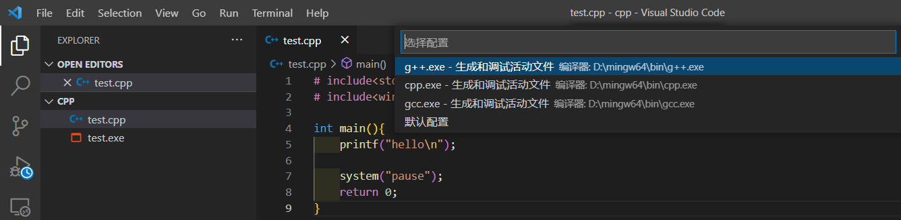

-   此时，生成 *launch.json* 和 *tasks.json* 两个配置文件

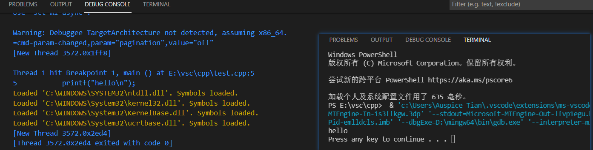

#### launch.json

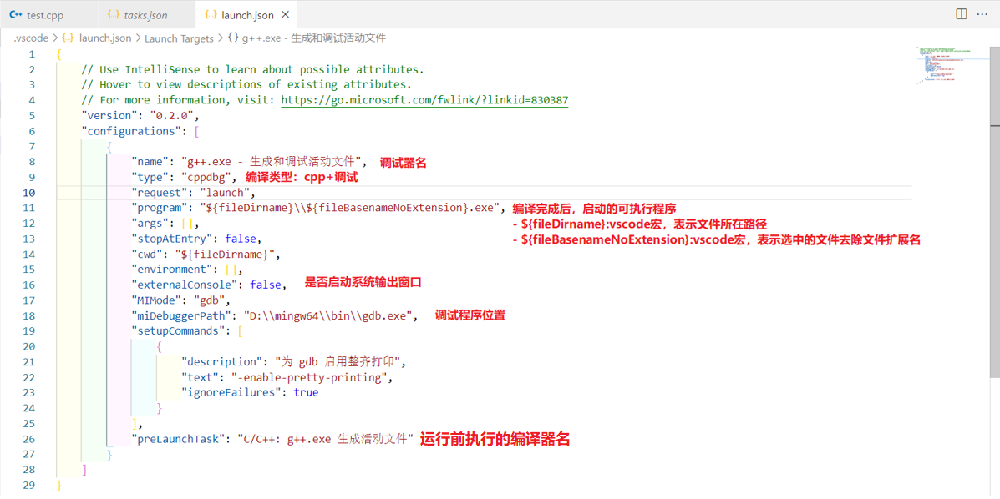

#### task.json


## 2.2 多文件编译

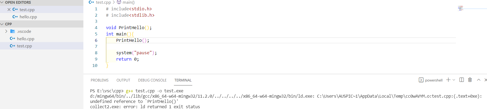

```shell
g++ test.cpp -o test.exe //用g++编译器将 test.cpp 链接成 test.exe
```

报错：没有找得到 `PrintHello()` 的定义

解决方法

```c
g++ test.cpp hello.cpp -o test.exe //用g++编译器将test.cpp和hello.cpp链接成一个可执行文件
```

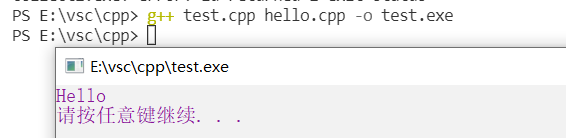

### 2.2.1 C/C++编译过程


```mermaid
graph TD
A((hello.cpp))
B((test.cpp))
C((hello.o))
D((test.o))
A--编译-->C
B--编译-->D
C--链接-->E((test.exe))
D--链接-->E
```

### 2.2.2 cmake构建工具

1.  [cmake下载地址](https://cmake.org/download/)

2.  vscode 安装 cmake 插件

    -   cmake：命令提示
    -   cmaketools：核心工具

3.  将cmake添加到环境变量或修改 cmaketools的配置文件

    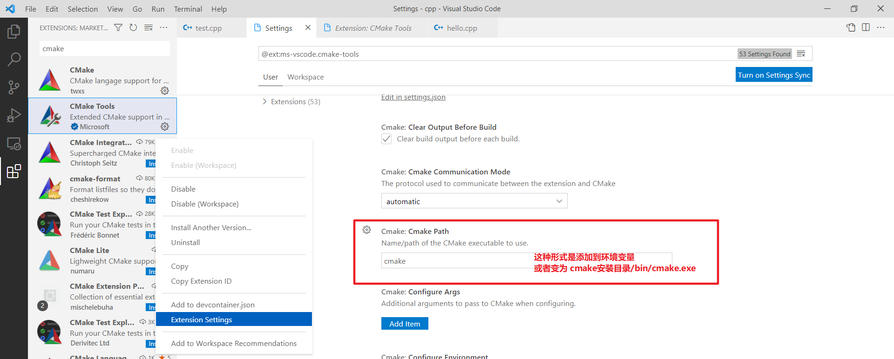

4.  项目目录下新建 `CMakeLists.txt` 

    ```
    project(#项目名)
    
    aux_source_directory(代码目录 定义为变量名)
    
    add_executable(#项目名 #目标目录)
    ```

    ```
    project(test)
    
    aux_source_directory(./src SRCS)
    
    add_executable(${PROJECT_NAME} ${SRCS})
    ```

5.  不再需要编译配置文件 task.json及删除launch.json文件中的 `      "preLaunchTask": "C/C++: g++.exe 生成活动文件"` 配置项

### 2.2.3 cmake构建项目

重启一下vscode就会出现1

1.  选择 cmake 的编译器

    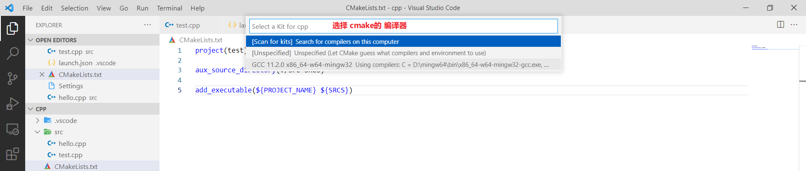

2.  使用cmake调试

    这里需要选择一下编译器版本

    

3.  修改配置文件，使 F5 调用cmake调试

    ```json
    {
        "configurations" : [
            ...
    	    "program":"${command:cmake.launchTargetPath}"
        	...
        ]
    }
    ```

    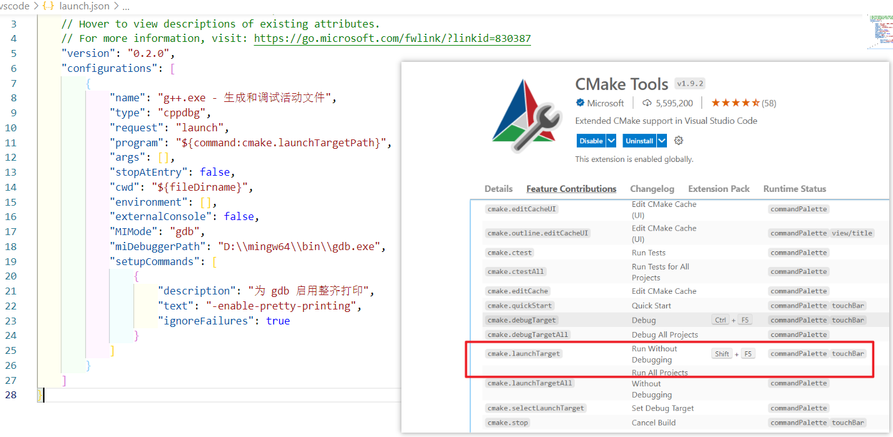
    
    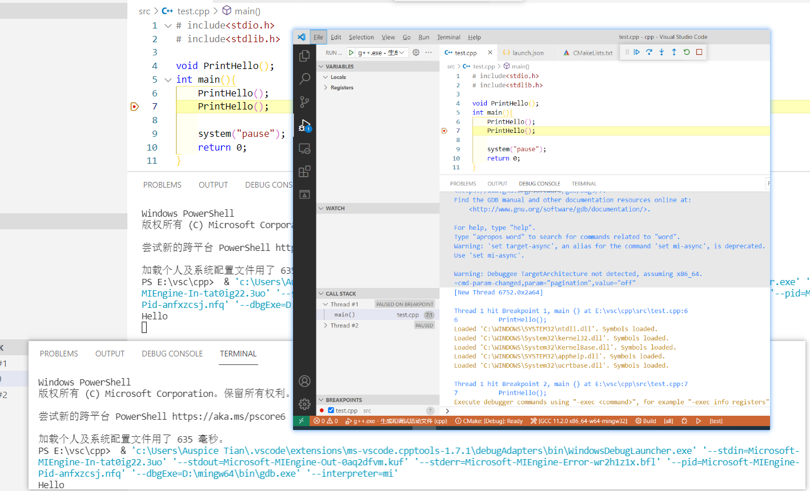

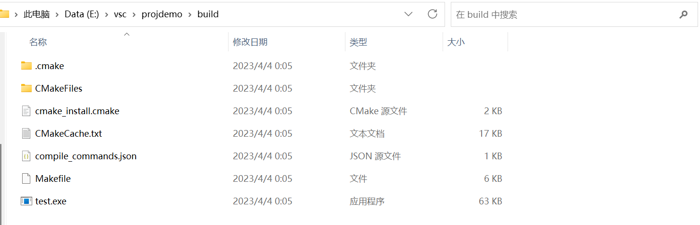

**注**

新增文件，需要变动重新保存一下CMakeLists.txt文件，刷新缓冲

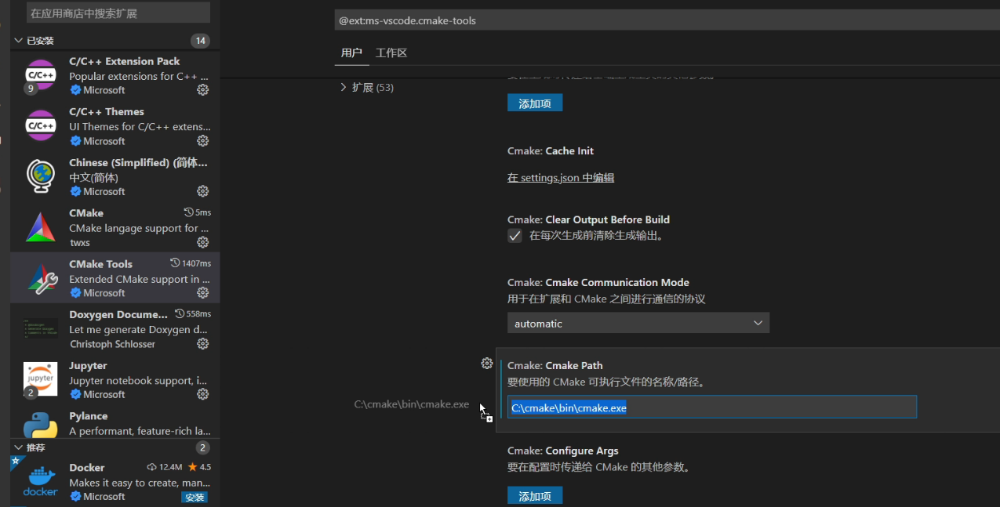

## 2.3 一些问题

### 2.3.1 VScode 检测到#include错误，请更新includePath

1. 在VScode中打开一个文件夹，并按ctrl+shit+p，搜索找到编辑配置（JSON）文件，并打开检查自己的“includePath”，如下图所示。

   

2. 我们发现自己的includePath并未更新，这也是问题的主要原因，此时我们进行更新。我们使用win+R打开cmd运行窗口，输入命令：g++ -v -E -x c++ -，进行查看路径（下图红框处），并复制下来。

   ```shell
   g++ -v -E -x c++ -
   ```

   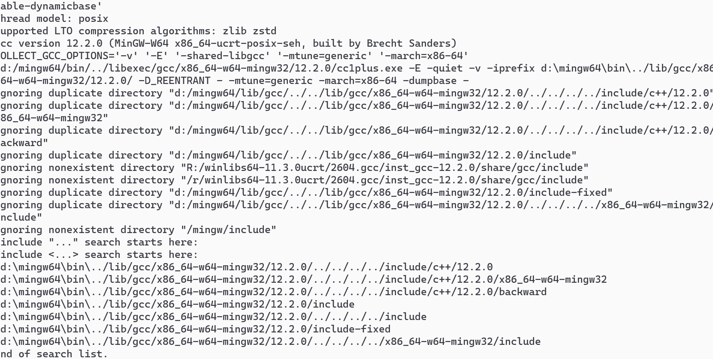

   修改斜杠

   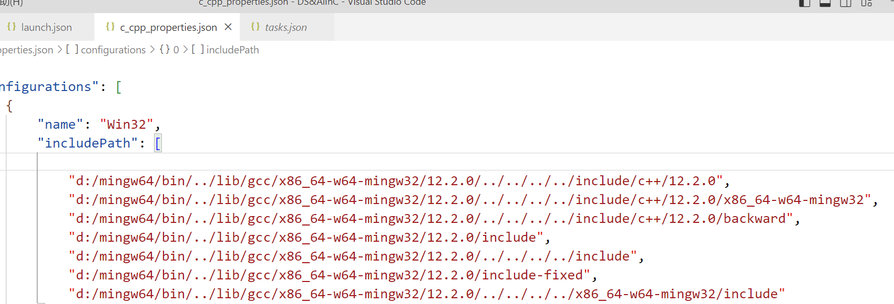

### 2.3.2 未定义标识符 cin

1. 排除includePath错误

   按Ctrl + 鼠标左键，可以跳转到定义处，则说明 `includePath` 正确

2. 根据电脑的具体的情况，修改“intelliSenseMode”

   - 未额外安装编译器，设置为 `"intelliSenseMode": "windows-mscv-x86`


   - 如果安装了其他的编译器，比如GCC编译器，设置为 `"intelliSenseMode": "windows-gcc-x64"`


3. 打开c_cpp_properties.json 文件，修改对应的项

   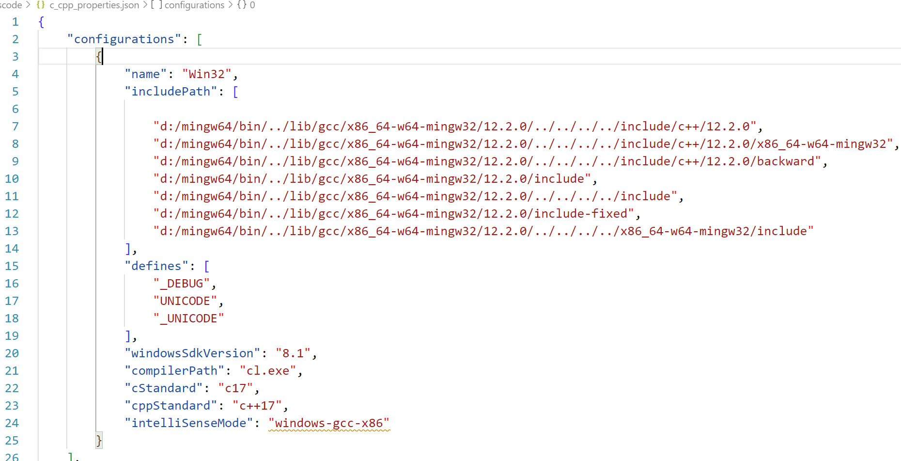

   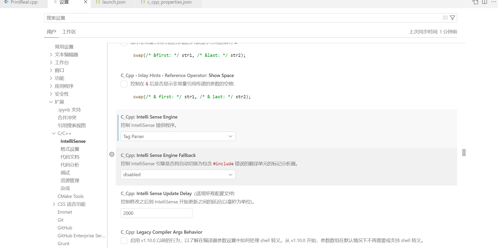


## linux

配置 vscode server 后，无法进入文件夹的方法：

进入终端，打开相应的目录，输入`code .` 
