[TOC]

<!--more-->

RADOS层对外提供存储池及池内的数据读写功能，[通过PG、OSD等底层支撑组件实现对数据的组织和存储](3.Ceph数据处理.md)

- libRADOS层是RADOS集群对外功能的唯一接口，**将上层对存储池的数据读写操作转换为对PG及OSD的操作**

  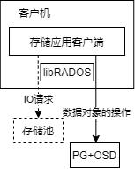

  - 进行目的OSD的寻址——CRUSH算法
  - 通过网络发送操作请求，并接收操作结果

- 提供CLS功能与Watch/Notify机制的接口

  - CLS实现了层次穿越、**上层应用定义下层数据操作规则** 的机制（RBD，RGW会用）
  - Watch/Notify机制实现了 **上层应用对特定RADOS对象的事件监控与消息传递** （缓存同步与RBD快照）

libRADOS层运行在上层应用的进程中，并与Monitor节点建立并保持连接，**获取最新的OSDMAP、MONMAP** （CRUSH算法）

## PG与libRADOS

PG在libRADOS层中，只参与操作请求的寻址过程。libRADOS并不参与PG的创建与管理。

在存储池被创建时，由系统创建PG

在存储池创建过程中，libRADOS只是将池的创建请求消息 `POOL_OP_CREATE` 发送给Monitor，由Monitor完成具体的池创建操作。

## libRADOS结构

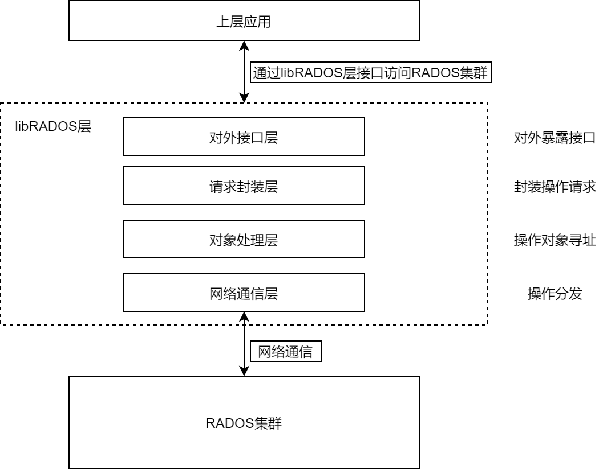

**对外接口层** ：上层存储应用统一的调用接口

**请求封装层**：实现I/O请求的封装

**对象处理层** ：通过CRUSH算法寻址

- 操作对象所述PG的确定
- 目的OSD寻址

在 `Objecter` 类实现，

- `Objecter` 重要结构：OSDMAP是CRUSH算法运行的基础，`osd_session` 记录OSOD的网络连接情况
- `Objecter::Op` 封装操作请求，并定义了一系列操作函数（处理、提交操作请求的方法）

**网络通信层** ：相对独立，操作对象寻址完成后，通过本层的工作线程发送到目的OSD

- OSD、Monitor等组件中共用同样的网络通信模块
- 有多种实现方式，默认实现为Async模式，采用工作队列和多线程方式进行网络数据的收发

### IOCtxImpl

libRADOS的实现类为 `IoCtxImpl` ，记录了操作请求的上下文信息，将上层应用的操作转换为OSDOp等OSD可识别的格式

`IOCtxImpl` 与特定的目标存储池相关联，对存储池的操作由该类处理

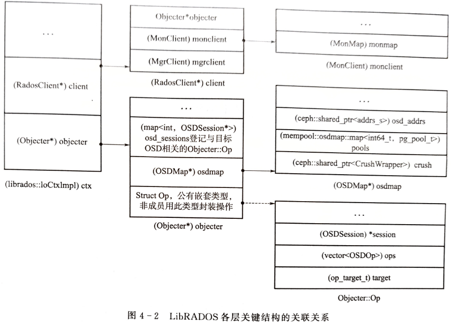

在创建 `IOCtxImpl` 类时，相关的 `RadosClient` 和 `Objecter` 等结构也会创建

- `RadosClient` 内的 `monclient` 负责与Monitor节点建立连接，并进行身份认证

## libRADOS层主要功能

### libRADOS对外提供的功能接口

libRADOS采用C++实现，对外提供C、C++、Python、Java和PHP的开发接口

- RGW、RBD等上层应用使用C++接口

libRADOS接口的完整操作包括 **配置集群句柄** 、**创建I/O会话** 、**整理I/O操作** 、**提交I/O操作**、**资源后处理** 

#### 集群句柄

配置集群句柄：`RADOS.init()` 、`RADOS.connect()`

RADOS类包含管理存储池的接口 `Rados.pool_create()`  `Rados.pool_delete()`  `Rados.pool_list()`  

#### I/O会话类

`IOCtx` 包含libRADOS的大部分接口。

1. `Rados.ioctx_create()`创建I/O会话类。在进行I/O操作之前，需要先与一个具体的存储池关联，这个过程就是I/O会话类的创建过程

2. 通过 `IOCtx` 进行实际的I/O访问

   - 创建对象 `IOCtx.Create()` 、删除对象 `IOCtx.remove()` 

   - 对象的读写操作分为：同步操作和异步操作

     同步数据读写操作：

     - 写内容数据；读内容数据 `IOCtx.read()`
       - 向特定的偏移量写一定长度的数据`IOCtx.Write()`
       - 全部覆盖写 `IOCtx.write_full()`
       - 追加写 `IOCtx.append()` 
     - 写XATTR数据 `IOCtx.setxatrtr()` ；读 `IOCtx.getxattr()`
     - 写OMAP数据 `IOCtx.omap_set()` ；读 `IOCtx.omap_get_vals()`

     异步数据读写操作：

     - 对应的异步读写操作函数

        `IOCtx.aio_write()`,`IOCtx.aio_read()`；`IOCtx.aio_write_full()` , `IOCtx.aio_append()` 

        `IOCtx.aio_setxatrtr()` ,`IOCtx.aio_getxattr()`

     - 在上层应用层，与 `AioCompletion` 类配合，供上层应用异步地判断操作执行状态

       ```cpp
       AioCompletion.is_complete()，由应用层定义回调函数，在收到执行操作结果后执行主动回调处理
       ```

   - 提供一次提交多个操作的接口 `IOCtx.operate()` 和 `IOCtx.aio_operate()` 

     多个整合后一次性提交，降低网络带宽负载

     **要求多个操作针对同一个对象** ，提交前通过 `ObjectOperation` 类将多个操作整合

     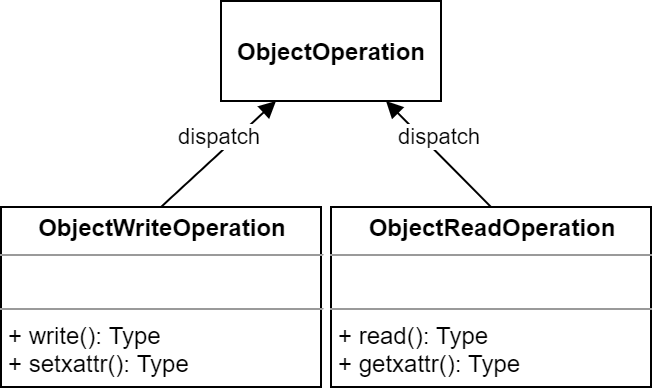

#### CLS

通过 `IOCtx.exec()` 可发起对OSD内特定动态链接库的相关函数调用

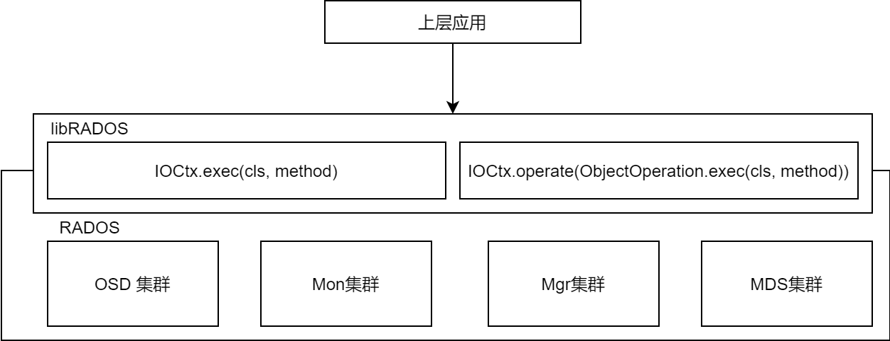

- `cls` 指定特定的动态链接库，`method` 指定动态链接库中调用的函数名
- 通过 `ObjectionOperation.exec()` 接口将调用请求与其他操作合并， 由 `IOCtx.operate()` 接口一并提交

### 寻址

#### CRUSHMAP

CRUSHMAP基于OSDMAP构建，CRUSH算法只需要OSD设备的层级结构和OSD设备权重等基本信息，存放在 *OSDMAP.crush* 内

- libRADOS在与存储池关联过程中，会创建保存上下文信息的结构，此时，通过 `IOCtxImpl.RadosClient` 到Monitor节点上获取OSDMAP，并存放在 `IOCtxImpl.Objecter` 成员结构中

在具体实现上，会基于OSDMAP重新构建一个CRUSHMAP，默认以结构数组的方式描述。

逻辑上，CRUSHMAP是一个树形结构，用于描述集群的物理布局，叶子节点为实际的OSD设备，中间节点称为Bucket节点

- 系统定义了10个Bucket级别

- Bucket节点类型定义为

  ```cpp
  struct crush_bucket{
      __s32 id;	/*bucket 标识符,小于0，且同一CRUSHMAP中是唯一的*/
      __u16 type;	/*bucket类型大于0，由调用者定义*/
      __u8 alg;	/* 选择算法 ::crush_algorithm */
      __u8 hash;	/* 哈希函数，默认是 CRUSH_HASH_* */
      __u32 weight;	/* 16.16定点小数，权重为子节点权重的和 */
      __u32 size;	/* 子节点数量 __item__array 的大小 */
      __s32 * item;	/* 子节点列表；小于0表示bucket，大于等于0表示item */
  }
  ```

  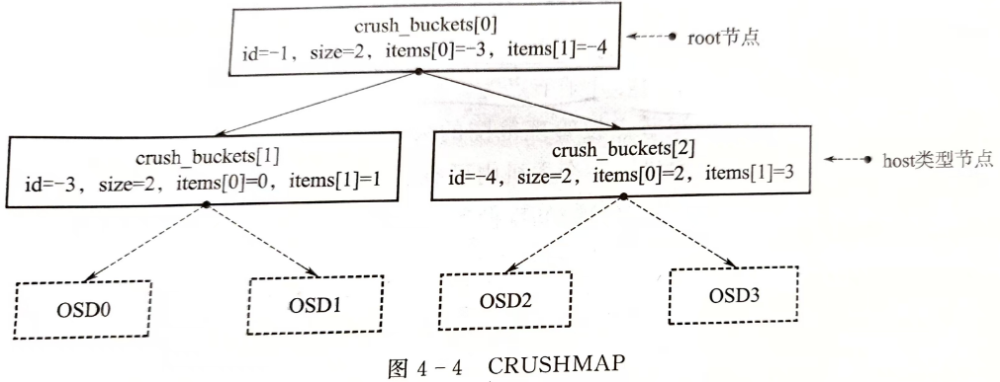

> 更多关于CRUSHMAP的管理见 [Ceph操作及管理](../Ceph操作/4.Ceph操作及管理.md)

#### CRUSH是一种计算寻址算法

分布式存储系统的架构分为 **有中心架构** 和 **无中心架构** 。

- 有中心架构——元数据机制：每次有新数据添加到存储系统时，元数据最先更新，之后才是实际的数据存储

  最显著缺点是易造成单点故障，复杂的元数据管理机制是存储系统在高伸缩性、高可用性和I/O性能的瓶颈

- 无中心架构

  计算模式：Ceph

  一致性哈希模式：Swift

CRUSH算法是Ceph的一种**可控的**、可扩展的、分布式副本数据放置算法（Controlled Replication Under Scalable Hashing），客户端使用自己的系统资源按需计算元数据而不存储元数据，元数据计算过程成为 **CRUSH查找**

> 可控的：体现为可重复性，对同一对象的计算始终会得出同一“地址”


CRUSH算法的核心是hash运算，默认的hash算法是Jenkins算法。

**CRUSH算法目标：使RADOS对象在所有OSD设备上按设备容量大小均匀分布，进而使OSD设备有相同的空间使用率**

- OSD权重越高，表示物理存储容量越大

- 一旦任何一个OSD设备写满，集群会进入保护状态，停止对外服务

- 通过CRUSH算法可以实现跨故障域传播数据及其副本

  同一PG的目标OSD组应分布在不同的故障域内，防止单点故障

#### CRUSH寻址过程

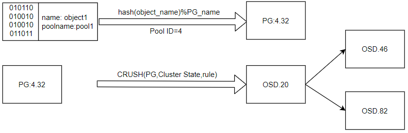

1. 基于对象id和池id获取对象所属的PG id
2. 基于PGID和CRUSHMAP选择目标OSD组

##### 计算PG id

> 目的：去除对象id和PGID之间的相关性，使其在数值空间上分布均匀

1. 输入对象id，使用hash算法进行哈希，得到hash值

   目标：使池内的对象在各PG内均匀分布

2. 对哈希值 `hash(对象id)` 按池的PG数取余 `hash(对象id)% (PG_num)` 

3. 合并两步结果作为PGID，如 (4.32)，PGID是一个二维结构

hash算法是伪随机的，所以对象id在数值空间上是均匀分布的；经过取余操作后，也是均匀分布的。

**PGID的计算过程是确定的、可重复的**

##### 计算OSD组

$$
CRUSH(PGID)\rightarrow (OSD_主,OSD_{从1},OSD_{从2},\cdots)
$$

默认使用straw2模式——重复性，多轮次的hash运算，hash算法仍采用Jenkins算法。

1. 计算出PGID的hash值：`PGID_hash=hash(PGID)` 

2. 设定选择轮次 r，查找主OSD时，$r==0$ ；查找其他从OSD时依次增加

3. 开始正式的选择。从CRUSHMAP的根节点root开始，针对每一个节点的子节点执行hash运算
   $$
   U=hash(PGID\_hash,id,r)
   $$
   将得到的hash值 $U$ 执行一个与 $log_2$ 有关的对数转换运算，再除以该子节点的权重因子，得到本每轮该子节点的CRUSH值 $CRUSH[ID]$ 

   - $log_2$ 对数转换用于调整结果在数值空间上的分布，放大计算结果的差异

   得到所有子节点的CRUSH值，选择CRUSH值最大的子节点作为候选节点

   直至选出位于叶子节点的OSD设备，完成本轮选择

4. 改变重试次数r，进行下一轮选择，直至选出目标OSD组的所有成员

#### 数据分布调整方式

- [定制CURSHMAP的查找规则](../Ceph操作/4.Ceph操作及管理.md)
- 设定OSD的迁移权重 `reweight`
- 人工设定与池相关的特定OSD的权重 `weight-set`，间接干预CRUSH算法的寻址结果
- 通过 `upmap` 直接指定PG寻址结果
- Ceph Mgr组件中有自动调节数据分布的模块 **Balancer** ，实质上也是通过 `reweight` 、`weight-set` 、`upmap` 

## libRADOS对读写操作的提交过程

```cpp
/* examples/librados/hello_world.cc */

// install the librados-dev package to get this
#include <rados/librados.hpp>
#include <iostream>
#include <string>

int main(int argc, const char **argv){
    int ret = 0;
    
  	// 1. 与RADOS集群建立连接
  	librados::Rados rados;
    # ("用户名","集群名",)
    ret = rados.init2("client.admin","ceph", 0);

  	/* 2. 获取RADOS对象的配置信息*/
  	{
        #解析命令行参数，获取必要的配置信息（如ID、监视器等）
    	ret = rados.conf_parse_argv(argc, argv);
      
        if (ret < 0) {
          ...
        } else {
            //若用户指定自定义配置文件，则读取，conf_parse_argv不会读取自定义配置文件
            for (int i = 0; i < argc; ++i)
        		if ((strcmp(argv[i], "-c") == 0) || (strcmp(argv[i], "--conf") == 0)) {
                    ret = rados.conf_read_file(argv[i+1]);
                    break;
                }
        }
    }

  	/* 3. 与集群建立连接*/
    ret = rados.connect();
	
    /* 4. 创建IOCtx用于对池进行IO */
    ret = rados.ioctx_create(pool_name, io_ctx);
    
    /* 5. 向池中写入 "hello world!" 对象 */
    {
        /*
        "bufferlist" 是Ceph最原生的类型，用于高效的复制。
        元素支持多种类型，
        在跳出作用域和完成请求后需要及时释放
        */
        std::string hello("hello world!");
        std::string object_name("hello_object");
        
        librados::bufferlist bl;
        bl.append(hello);

        /* 同步写入 */
        librados::IoCtx io_ctx;
        ret = io_ctx.write_full(object_name, bl);
        ...
            
        /* 合并写入 */
        librados::ObjectionWriteOperation op;
        op.write_full(bl);
        ret = io_ctx.operate(object_name, &op);
    }
    
    /* 6. 释放资源 */
    ioctx.close();
    rados.shutdown();
    
    return ret;
}
```

首先，与RADOS建立连接，包括：与Monitor建立初始连接、进行用户身份认证、获取OSDMAP等，这部分内容见Monitor

然后，由libRADOS层的 `IOCtx` 实例 `io_ctx.operate()` / `io_ctx.write_full()` 完成IO操作转换与提交

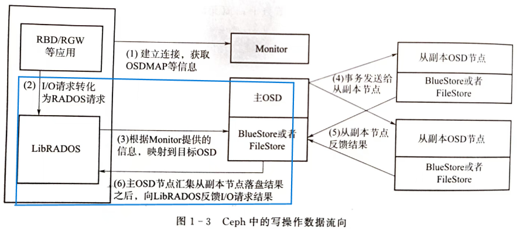

### 1. 操作预处理，形成OSDOp结构

`op.write_full()` 函数内通过调用 `add_data()` 函数实现转换功能：操作请求经过 `librados::ObjectiWriteOperation` 整理，形成 `OSDOp` 结构。

- OSDOp结构：包含操作类型、起始位置、长度、对象内容等信息

  ```cpp
  struct OSDOp{
      ceph_osd_op op;
      sobject_t soid;
      bufferlist indata, outdata;
      ...
  }
  ```

```cpp
void ObjectOperation::add_data(int op, uint64_t off, uint64_t len, bufferlist &bl){
    OSDOp &osd_op = add_op(op);
    osd_op.op.extent.offset = off;
    osd_op.op.extent.length = len;
    osd_op.indata.claim_append(bl);
}
```

- 操作类型用操作码表示，存放在 `OSDOp.op.op` 字段中，类型为无符号短整型，Writefull的操作码为 `CEPH_OSD_OP_WRITEFULL()` ，这是通用类型，在OSD侧也可识别
- 实际上，可以将对同一个对象的操作整合到一个 `(librados::ObjectWriteOperation)op`  内，这样多个操作请求时，可形成一个原子事务，有利于保持多个请求的事务一致性

### 2. 正式操作，形成Objecter::Op结构

`ioctx.operate()` 调用 `objecter->prepare_mutate_op()` ， 新建 `Objecter::Op` 结构，并导入 `OSDOp` 结构

- `Objecter::Op` 是librados侧处理请求的主要结构，涉及操作请求的生成、提交和事务后处理

- `OSDOp` 保存在 `Objecter::Op.ops` 内

- 在 `prepare_mutate_op()` 函数内，设定操作请求的回调函数 `C_SafeCond::finish` 存入 `Objecter::onfinish` 内

  对于异步写入操作，回调函数在 `C_SafeCond`  类内实现，后续，该类基于条件变量和信号量处理回调请求、唤醒等待的线程

```cpp
Op * prepare_mutate_op(..., ObjectOperation &op, ...){
    //op.ops类型为vector<OSDOp>; oncommit 为回调函数，存储Op.onfinish
    Op * o = new Op(oid, oloc, op.ops, ..., oncommit, ...);
    o->priority = op.priority;
    o->mtime = mtime;
    o->snapc = snapc;
    o->out_rval.swap(op.out_rval);
    o->reqid = reqid;
    return o;
}
```

### 3. Objecter::on_submit()

`ioctx.operate()` 调用 `Objecter::op_submit()` 进行目的OSD寻址。

- `Objecter::on_submit()` 接口的实现是 `_on_submit()`

  功能：确定PG、OSD寻址、操作请求的发送

#### 寻址

##### PG寻址

1. 对对象名哈希得到对象名哈希值

   `hash_objid = ceph_str_hash_rjenkins(对象名)` 

2. 对对象名哈希值按PG数取模

   `pg_mod = ceph_stable_mod(hash_objid)` 

3. 将 `POOLID` 与 `pg_mod` 组合作为 `PGID` 

   如 `PGID = (40.7)` 

> hash算法使用的是jenkins算法，虽然计算量相对较大，但可以产生很好的分布

##### 通过CRUSH算法进行目的OSD组寻址

CRUSH算法默认为straw2，

CRUSHMAP使用结构数组表示

- Bucket节点由一个数组成员 `crush_bucket[]` 表示（`id`,`item[]`,`weight`）
- OSD节点不占用 `crush_bucket[]` 空间，OSD id存放在父 Bucket 的 `item[]` 中

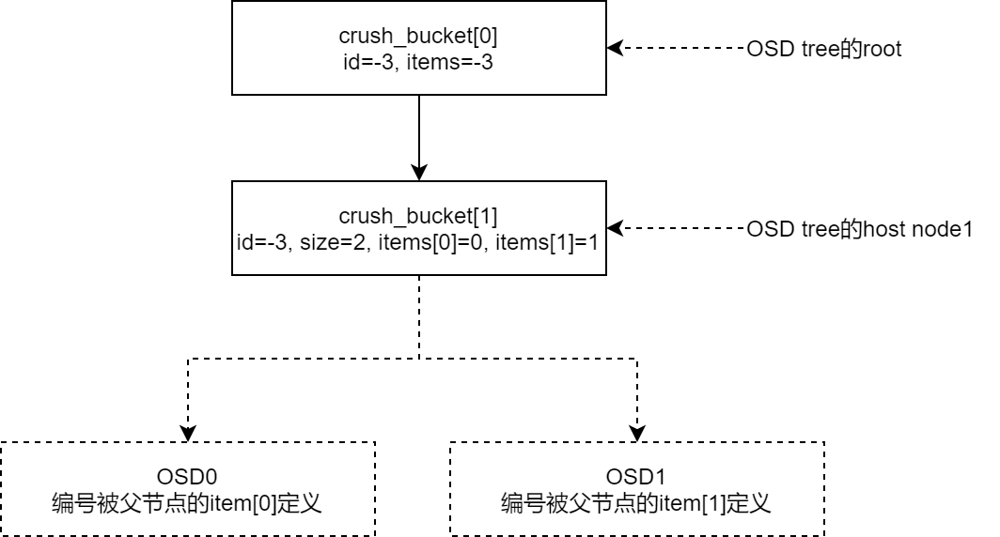

1. 从root节点 `crush_bucket[0]` 开始查找子节点，对PGID的hash值、子节点id、重试次数r进行哈希 `u = hash(PGID_hash, id, r)` 

   通过将不同OSD节点的ID加入哈希运算，使不同的OSD得到不同的哈希结果u

2. 取 $u$ 的后16位，进行straw2算法的核心运算，

   $ln =2\textasciicircum 44*log2(u_2[:-16]_{10}+1)-0x1000000000000$ 

   使用 $log_2$ 目的是利用其在概率上的分布特性，有利于结果的均匀分布

3. 将 $ln$ 与 `CRUSH_BUCKET[0]` 的子节点 `items[]` 的权重做除法得出本级节点的 CRUSH值，选出最大的子节点

   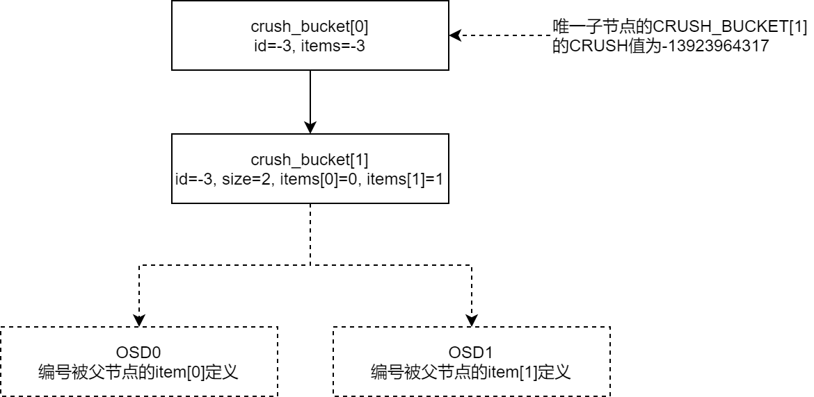

4. 针对选出的子节点 `CRUSH_BUCKET[1]` 重复上述操作，计算OSD的CRUSH值，选择CRUSH值最大的OSD节点

   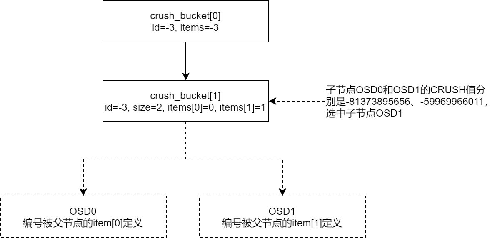

> 计算复杂度：PG寻址与OSD寻址过程进行了1+1+N次hash运算
>
> - 1：计算PGID时，对象名的hash
> - 1：计算PGID_hash，去除PGID之间的相关性
> - N：对CRUSHMAP中相关节点进行 `hash(PGID_hash, id, r)`
>
> 可见，哈希运算对CRUSH算法至关重要

##### 寻址结果

寻址所用的CRUSHMAP存放在 `ctx.objecter.osdmap.crush`

寻址结果存放在 `target` 中

- `PGID` 存放在 `(pg_t *)target.PGID` 
- 目的OSD存放在 `(int *)target.osd`

#### 发送操作请求

##### 创建OSDSession，形成MOSDOp消息，将Objecter::OP登记入OSDSession

在 `Objecter::_on_submit()` 中，将查找或创建OSDSession

- OSDSession存放与特定OSD相关的会话信息，包括：网络会话+已发送但未确认的MOSDOp信息

  后续通过OSDSession获取网络通信层的网络会话，通过它查找OP调用回调函数

**创建OSDSession**：通过OSDID从OSDMAP中获取目标OSD的IP地址和TCP端口号，进而建立TCP会话

```cpp
# src/osd/OSDMAP.h
const entity_addr_t &get_addr(int osd) const {
    assert(exists(osd));
    return osd_addrs->client_addr[osd] ? *osd_addrs->client_addr[osd] : osd_addrs->blank;
  }
```

**创建MOSDOp结构** ：与 `Objecter::Op` 相比，`MOSDOp` 同样拥有 `vector<OSDOp> ops` ，额外增加PGID字段（存储后端根据PGID分配消息的处理队列和处理线程）

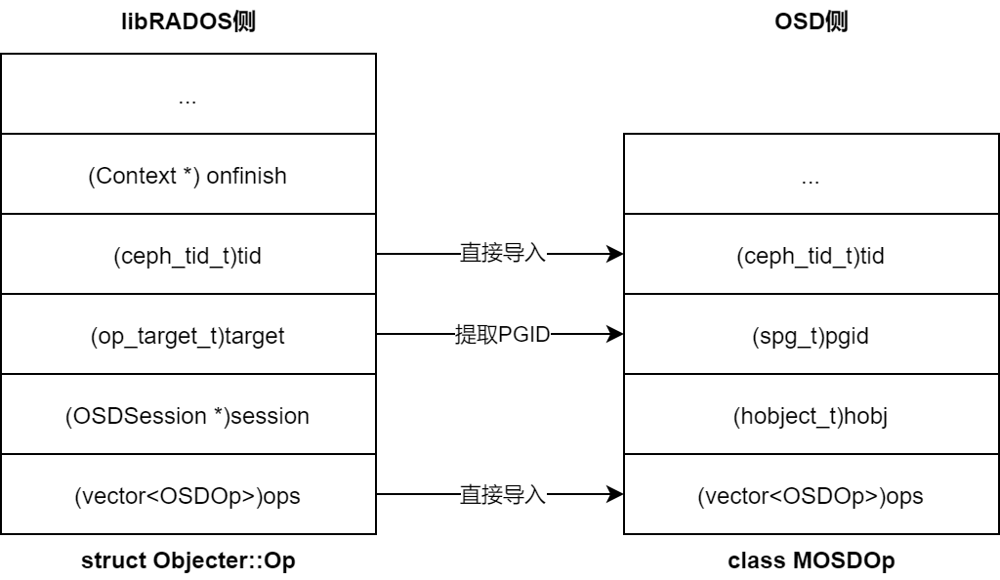

- tid的生成：依据OSDSession中已处理请求的次数顺序递增生成tid（transaction id）。因此操作请求由libRADOS标识，在OSDSession中唯一
- `Objecter::tid` 导入 `MOSDOp.header.tid` 供 OSD侧标识本次请求

**将 `Objecter::OP.tid` 登记入 `OSDsession.ops`** ：调用 `Objecter::_session_op_assign()` 函数，将OP登记入 `(map<cephg_tid_t>, Op*) OSDSession.ops`

- 这一步目的：后续OSD返回操作结果时，查找OP和进行回调处理

```cpp
# src/osdc/Objecter.cc
void Objecter::_session_op_assign(OSDSession *to, Op *op)
{
  // to->lock is locked
  assert(op->session == NULL);
  assert(op->tid);

  get_session(to);
  op->session = to;
    //登记到OSDsession.ops时，Key为tid
  to->ops[op->tid] = op;
	
  if (to->is_homeless()) {
    num_homeless_ops++;
  }

  ldout(cct, 15) << __func__ << " " << to->osd << " " << op->tid << dendl;
}
```

**`Objecter::_op_submit()` 调用 `Objecter::_send_op()` 准备发送消息**

##### 调用网络层接口发送消息

> 网络通信层默认 `async` 模式，采用了基于事件的I/O多路复用技术，由专门的发送队列和发送发送线程进行数据发送

**`Objecter::_send_op()` 调用网络层接口函数 `AsyncConnection::send_message()` 将待发送消息放入发送队列**

```cpp
# src/msg/async/AsyncConnection.cc
int AsyncConnection::send_message(Message *m){
    ...
    // optimistic think it's ok to encode(actually may broken now)
    if (!m->get_priority())
        m->set_priority(async_msgr->get_default_send_priority());

    m->get_header().src = async_msgr->get_myname();
    m->set_connection(this);
    
    ...
        // 将待发送消息放入发送队列
    	out_q[m->get_priority()].emplace_back(std::move(bl), m);
    ...
}
```

**同步写入**

对于同步写操作，操作处理线程将阻塞，等待被回调函数唤醒

消息的实际发送由专门的发送线程调用 `AsyncConnection::write_message()` 发送给**主OSD**进行落盘

```cpp
ssize_t AsyncConnection::write_message(Message *m, bufferlist& bl, bool more){
    ...
	if (msgr->crcflags & MSG_CRC_HEADER)
        m->calc_header_crc();
    ceph_msg_header& header = m->get_header();
    ceph_msg_footer& footer = m->get_footer();
    ...
    ssize_t total_send_size = outcoming_bl.length();
    //发送数据
  	ssize_t rc = _try_send(more);
    ...
    
    //清理资源
    m->put();
    
    return rc;
}
```

> 对于libRADOS而言，只需将操作请求发送给主OSD，从OSD的数据写入由主OSD负责
>
> 操作请求也由主OSD反馈给libRADOS层
>
> 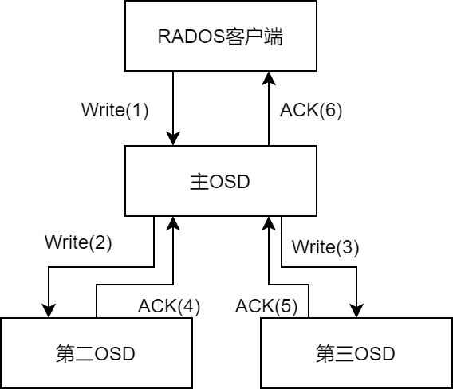

### 4. 主OSD反馈执行结果，回调函数通知等待线程

网络通信层有专门的工作线程接收OSD反馈的落盘结果消息，并进行关联OP的查找与回调函数的调用

基于 `Objecter::OP.tid` 在 `objecter.osd_session` 中检索，定位到对应的原始 `Objecter::OP` 

 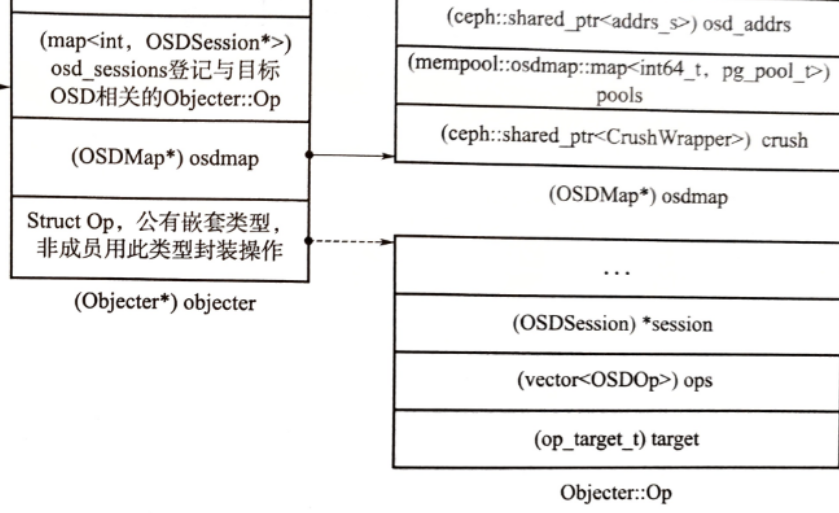

`Objecter::OP` 中定义了回调函数 `C_SafeCond::finish` ，被保存在 `Objecter::onfinish` 

- 在函数体中，判断反馈结果状态，采用信号量机制唤醒操作处理线程

  ```cpp
  # src/common/Cond.h
  void C_SafeCond::finish(int r) override {
      lock->Lock();
      if (rval)
        *rval = r;
      *done = true;
      cond->Signal();
      lock->Unlock();
    }
  ```

- `Signal()` 会进一步调用操作系统的pthread接口函数 `pthread_cond_broadcast()` 唤醒操作处理线程

  ```cpp
  # src/common/CondVar.h
  int Signal() { 
      // make sure signaler is holding the waiter's lock.
      assert(waiter_mutex == NULL ||
  	   waiter_mutex->is_locked());
  	
      //linux操作部系统部的pthread接口，唤醒等待线程
      int r = pthread_cond_broadcast(&_c);
      return r;
    }
  ```

被唤醒线程确认此次写操作的执行结果，进行必要的资源清理工作

### 异步与同步区别

对于网络通信层而言，除要调用的回调函数不同，其他并无区别

- 同步方式，提交操作请求后，立即阻塞线程，等待OSD反馈的结果，再进一步处理
- 异步方式，提交操作请求后，可非立即性、批量地、异步地检查反馈结果，并确认完成结果

## libRADOS的Watch-Notify机制

libRADOS的Watch-Notify机制，为上层应用提供了集群内跨节点的消息传递机制——用于上层应用的跨节点数据同步

分为Watch阶段与Notify阶段，需要由上层存储应用指定同一个RADOS对象(Watcher对象)

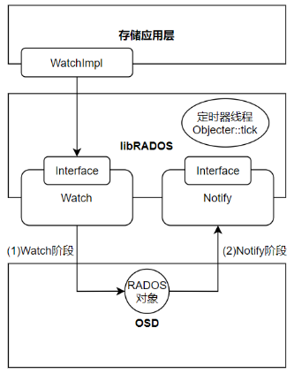

Watch阶段，上层应用层实现libRADOS层的Watch接口

```cpp
int watch2(
    const std::string& o,	//指定RADOS对象，watcher
    uint64_t *handle, 		
    librados::WatchCtx2 *ctx	// 指定用于回调处理的类
    // WatchCtx2的成员函数都是虚函数，需要上层应用通过派生实现
);

int aio_watch(
    const std::string& o, 	
    AioCompletion *c, 
    uint64_t *handle, 
    librados::WatchCtx2 *ctx, 
    uint32_t timeout
);
```

- `IOCtx.unwatch2()` 取消监视

Notify阶段，libRADOS提供Notify接口，在OSD层实现，用于发布消息

```cpp
int notify2(
    const std::string& o,	//被监视对象
    bufferlist& bl,  		//可选的广播负载
    uint64_t timeout_ms,	//以ms为单位的超时时长
    bufferlist *pbl			//回放缓存
);

int aio_notify(
    const std::string& o,	//被监视对象
    AioCompletion *c,		//定义通知完成后的操作
    bufferlist& bl,			//可选的消息负载
    uint64_t timeout_ms,	//超时时长(in ms)
    bufferlist *pbl			//回放缓存
);
```

### 心跳更新操作

为向OSD证明自身可接收Notify消息，libRADOS需要定期向watcher对象所在的OSD发送心跳更新操作 `CEPH_OSD_WATCH_OP_PING` 。OSD收到心跳更新操作后，更新其维护的watcher列表，反馈 `CEPH_MSG_OSD_OPREPLY` 消息给libRADOS。

- libRADOS若未收到OSD的反馈信号，则调用异常处理函数 `handle_error()` ，由上层应用进行处理

心跳更新操作的实现为 `objecter::tick` 定时器线程执行。

定时器线程是libRADOS的一部分，负责运行状态的libRADOS与OSD、watcher等相关方的周期性检测。

> 在创建watch的过程中，libRADOS内部会形成一个 `LingerOp` 结构
>
> 向OSD提交请求过程，会调用 `Objecter::_session_linger_op_assign()` 函数，将 `LingerOp` 登记入 `(map<uint64_t, LingerOp*>)OSDSession.linger_ops` 内
>
> `Objecter::tick` 定时器线程会周期性地遍历每个 `OSDSession` 的 `linger_ops` 结构，判断 `LingerOp` 状态正常后
>
> libRADOS每隔 `objecter_tick_interval` 则发送一次心跳，该线程轮询检查所有的 `OSD session` 中记录的 `LingerOp` 并调用 `_send_linger_ping()` 发送心跳请求

```cpp
# src/osdc/Objecter.cc
void Objecter::tick(){
    
    
    for (map<int,OSDSession*>::iterator siter = osd_sessions.begin();siter != osd_sessions.end(); ++siter) {
        OSDSession *s = siter->second;
        OSDSession::lock_guard l(s->lock);
        ...
    	for (map<uint64_t,LingerOp*>::iterator p = s->linger_ops.begin();
             p != s->linger_ops.end();
             ++p) {
            LingerOp *op = p->second;
            LingerOp::unique_lock wl(op->watch_lock);
            assert(op->session);
            ldout(cct, 10) << " pinging osd that serves lingering tid " << p->first 
                << " (osd." << op->session->osd << ")" << dendl;
            found = true;
            if (op->is_watch && op->registered && !op->last_error)
				_send_linger_ping(op);
            ...
    }
    ...
}
```


