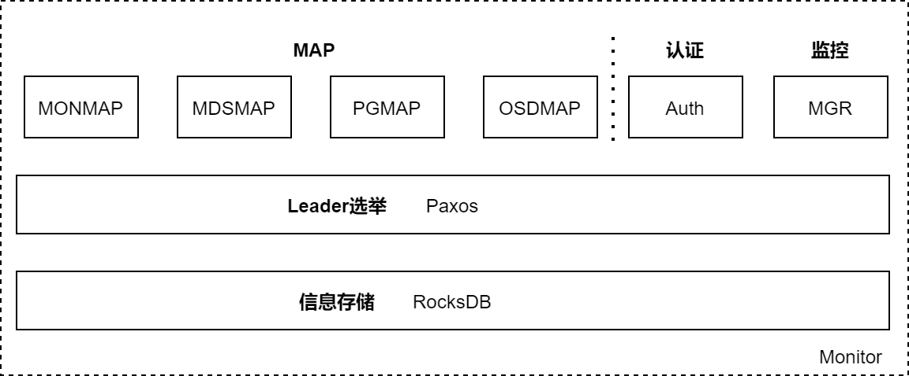
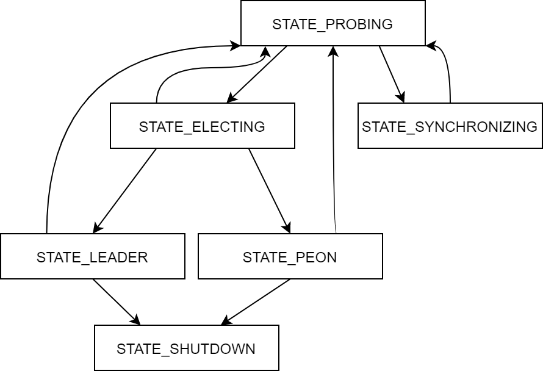
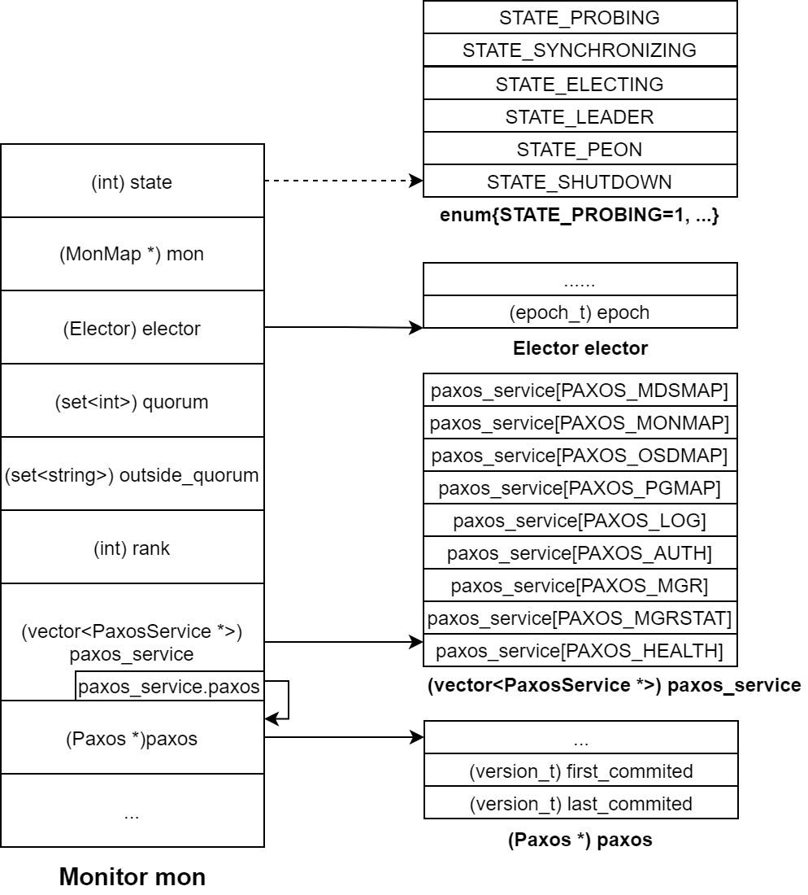
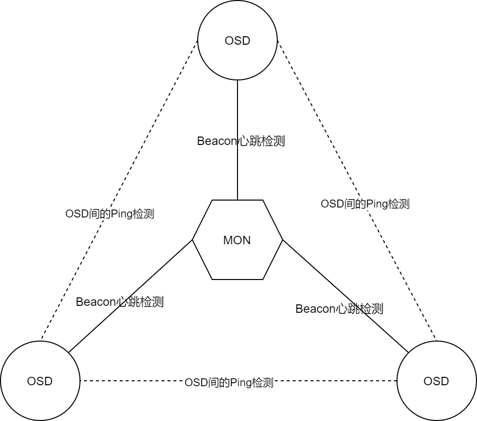
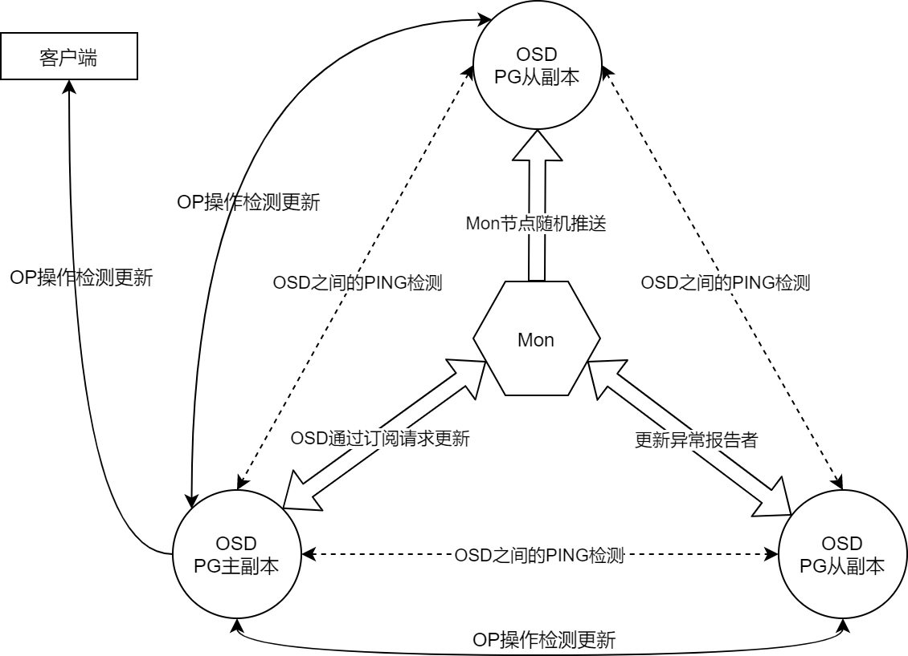

[TOC]

<!--more-->

Monitor通过维护和传播OSDMAP等集群表的方式将OSD节点组织起来

同一个集群中的Monitor节点会组成**一个**Monitor集群，各Monitor节点通过Paxos算法达成共识，自动选举一个Leader节点，以同步一些必要的数据

功能：

- 数据读写过程中，Monitor节点**向客户端提供CRUSHMAP**
- 监控集群内各OSD的状态，根据OSD节点状态的变化情况**生成新的MAP信息**
- 向客户端、集群内部**传播这些MAP信息**
  - Ceph客户端与Monitor节点的信息交互
    - Ceph的各类客户端需要获取OSDMAP等必需的信息，客户端的libRAODS进程中 `RadosClient`  线程负责与Monitor节点的具体交互
  - Monitor节点间的信息交互
    - Monitor节点通过paxos算法选举Leader节点
    - 选举完成后，各Monitor节点收集、整理OSDMAP等更新信息，发送给Leader节点
    - Leader节点按Paxos算法的要求，向各节点更新MAP信息
  - Monitor节点与OSD节点的信息交互
    - OSD节点运行期间需要从Monitor节点获取OSDMAP等信息
    - OSD节点向Monitor节点反馈自身的状态
    - OSD节点向Monitor节点反馈相邻节点的状态变化情况

## 3.1 Monitor结构



**RocksDB** ：Monitor节点运行所需的数据保存在RocksDB，构建在文件系统之上。数据以文件形式落盘，*.sst* 为实际数，*.log* 为日志文件。

- mon节点RocksDB的数据一般存放在 */var/lib/<集群名>/mon/<mon节点名>/store.db* 

**Paxos** ：Monitor节点使用分布式算法Paxos承载了各种数据在集群内的同步功能。

**数据** 

- **Auth数据** ：认证信息，包括SessionKey、RotatingKey等
- **MGR数据** ：用于集群状态的监控，将监控到的数据暴露给外界使用
- **MAP数据** 
  - MONMAP维护了集群内所有Monitor节点的信息（Mon节点名称、IP地址、TCP端口号、集群ID、MONMAP版本号、MONMAP最近一次的修改时间）
    - 对MONMAP的访问一般发生在客户端连接存储池进行数据访问时
  - MDSMAP记录了集群内所有MDS节点的信息（MDS节点数量、MDS节点的存活状态、MDSMAP的版本号和修改时间）
  - PGMAP记录了每个PG的状态、PG到OSD的映射情况、与OSDMAP功能重合
  - OSDMAP记录了集群内所有OSD的状态、权重、最近一次变化的历史信息、集群ID、OSDMAP的版本号epoch

## 3.2 Monitor集群使用Paxos确保数据的一致性

为确保RADOS集群的高可靠性与高可用性，RADOS集群采用多个Monitor节点。Monitor节点间采用Paxos算法确保数据的一致性

### 3.2.0 Paxos基本算法

问题：Paxos算法解决的是同一系统内各节点如何就某个“值”达成共识的问题，即使少数离线节点重新加入集群后也接受该值的 “取值”

特点：容忍消息丢失、延迟、乱序以及重复

#### Paxos算法的角色

参与决策的角色：Proposer、Acceptor

不参与决策的决策：Learner

**Proposer** ：提出提案（Proposal）`[ID, Value]` 。Paxos算法要求填编号**唯一**、递增

**Acceptor** ：参与决策，回应Proposer的提案。若一个提案被超过半数的Acceptors接受，则该提案被批准。——**大多数原则**

**Learner** ：不参与决策，从 Proposers和Acceptors中学习最终达成一致的决议

#### Paxos算法的两个阶段


##### prepare阶段

1. Proposer选择一个提案编号 n ，向所有Acceptors广播 Prepare(n)
2. Acceptor 接收到Prepare(n)请求后，
   - 如果提案编号不大于之前收到的Prepare请求，则不予理会
   - 如果提案编号n比之前收到的Prepare请求编号大
     - 记录本次编号为 `minProposal`
     - 承诺此后不会接受提案编号更小的提案——**喜新厌旧原则**
     - 回复Proposer，回复消息带上该Acceptor之前接受的提案中最大的提案编号，即 **最新的历史提案** `(accepted_minProposal, accepted_value)` 
       - 若没有历史提案，则返回 `null` 

##### Accept阶段

1. 如果Proposer未收到超过半数Acceptors响应，则直接转为提案失败；

   如果Proposer超过半数Acceptors响应，则该Proposer具有提案权力

   - 如果所有Acceptors `最新历史提案==null`  ，则Proposer发送的提案不受任何约束

   - 如果Proposer收到Acceptors反馈的 `{最新历史提案}!=∅` ，则选择提案编号最大的提案，向所有的Acceptors发送该提案 `(n, accepted_value)` ——**后者认同前者** ：只信任历史提案

2. Acceptor接收到提案后，

   - 提案号大于等于 Prepare阶段的 `minProposal` ，则
     - 接受该提案，本地持久化存储提案
     - 反馈提案编号n
   - 提案号小于 `minProposal` ，则说明接受了另一个Proposer的Prepare请求
     - 拒绝编号为 n 的提案
     - 返回历史编号 `minProposal`

   3. Proposer 等到Acceptor的响应
      - 如果没有Acceptor拒绝，且超过半数 Acceptor反馈接受该提案，则提案生效
      - 如果有Acceptor拒绝，则放弃本次提案

#### 正确执行结果

- 针对某个值达成一致，将形成的决议发送给 Learners
- 形成"活锁"，算法一致运行

#### 关键点

**提案编号唯一** ：接收方不会收到编号重复的请求

**喜新厌旧** 原则：Acceptor收到新的更大编号提案后，不会再响应更小编号的提案

**后者认同前者原则** ：存在历史提案，直接使用编号最大的历史提案

**大多数原则** ：只有半数Acceptors接受，才有可能接受提案

### 3.2.1 Paxos在Monitor中的应用

Monitor节点通过Paxos算法实现集群的高可用，允许少量节点宕机

Monitor集群中，存活节点用 `Quorum` 结构表示，要求超过50%的节点存活，构成 **大多数** 

- 偶数节点的半数需+1

允许宕机数

| Mon节点数 | Quorum节点的最小数量 | 允许宕机数 |
| --------- | -------------------- | ---------- |
| 1         | 1                    | 0          |
| 2         | 2                    | 0          |
| 3         | 2                    | 1          |
| 4         | 3                    | 1          |
| 5         | 3                    | 2          |
| 6         | 4                    | 2          |
| 7         | 4                    | 3          |

#### Paxos在Ceph中的改进算法——Monitor节点状态机

> 先选举Leader，再有Leader统一发起数据更新操作



- STATE_PROBING状态：集群中，各Monitor节点间相互探测，通过发送 `MMonProbe` 消息探测集群内其他节点，发现节点间的数据状态
- STATE_SYNCHRONIZING状态：节点进行数据同步，当Monitor节点与其他节点的数据差距(epoch) 差距过大无法补齐时，则进行数据的全同步
- STATE_ELECTING：节点进行选举的阶段
- STATE_LEADER：选举完成后，节点成为Leader节点
- STATE_PEON：选举结束后，未成为Leader节点，成为Peon（劳工）节点
- STATE_SHUTDOWN：结束状态

#### Monitor的选举

Monitor集群的选举基于朴素的Paxos算法，遵循 **大多数原则** 、**喜新厌旧原则**、

改造的 **后者认同前者原则** 

- 在Paxos算法的Accept阶段，应答选举消息时，只有rank值小的才能胜出（Monitor在集群中的序号）

##### 选举过程涉及的数据结构



**MONMAP** ：保存集群内全部的Monitor节点信息，包括存活和离线的，各节点持有相同的MONMAP

**quorum** ：保存集群内存活的Monitor节点，要求存活节点数超过总数的一半。选举成功后，向所有节点发送quorum列表，后续通信基于quorum执行

**outside_quorum** ：临时存放选举过程中探测到的、存活的节点。各节点各自独立统计、维护，选举结束后清空

**paxos** ：通过Paxos算法将 `paxos_service` 结构中的数据达成一致并落盘存储在RocksDB中，

- 数据包括map数据和log数据，log数据是集群数据同步过程中的数据备份与记录。

- paxos在本节点存放 `first_commited` 和 `last_commited` 间的所有数据，当历史数据过多，会进行裁剪

  - `first_committed` 标识本节点的最早落盘成功的数据
  - `last_committed` 标识本节点最新落盘成功的数据——也称为 log数据的 version

  选举过程，会基于这些序号判断各Monitor节点的paxos数据同步情况，选举成功后，同步这些历史数据

**elector** ：使用 `epoch` 标识选举阶段，

- 奇数：正在进行选举
- 偶数：已完成选举

elector会比对消息中的 **rank** 值，并支持 rank 值较小者

- rank表示mon节点在MONMAP中的序号

##### 选举触发时机

当Monitor节点启动、选举过程对某项决议未达成一致、处于正常状态的Monitor节点通信异常

- Monitor节点检测到其他Monitor节点加入或退出Monitor集群
- 收到其他节点发送的选举消息
- 节点执行重新启动(bootstrap)

##### 1. 选举准备阶段

1. 将当前Monitor节点状态设置为 *STATE_PROBING* ，通过MONMAP获取Mon节点的数量，包括离线的和在线的

   - 若只有一个Mon节点，则该节点直接胜出

   ```cpp
   # src/mon/Monitor.cc
   void Monitor::bootstrap(){
       ...
       // 若单Mon节点，则直接胜出
     	if (monmap->size() == 1 && rank == 0) {
       	win_standalone_election();
       	return;
     	}
       reset_probe_timeout();
       // 将本节点加入outside_quorum集合
       if (monmap->contains(name))
       	outside_quorum.insert(name);
       // 向除本节点外的mon发送探测消息 MMonProbe
       dout(10) << "probing other monitors" << dendl;
       for (unsigned i = 0; i < monmap->size(); i++) {
           if ((int)i != rank)//排除本节点
               messenger->send_message(
                   new MMonProbe(
                       monmap->fsid, 
                       MMonProbe::OP_PROBE, 
                       name, 
                       has_ever_joined),
                   monmap->get_inst(i)//向对方发送当前MONMAP
           	);
       }
   }
   ```

   `outside_quorum` 临时记录本节点在选举过程探测到的、存活的节点，包括节点自身，后续将根据 `outside_quorum` 中节点数判断是否进入选举状态

   向MONMAP中的其他节点发送MMonProbe探测消息（集群ID、本节点名等），以判断对方节点存活性

2. Monitor接收到 `MMonProbe` 消息后，在 `Monitor::handle_probe_reply()` 中进行处理

   1. 比较对方和自己MONMAP版本，比较MONMAP的epoch属性

      如果自己MONMAP版本低，说明二者在集群Monitor节点成员上存在数据不一致情况，此时，需要先更新自身的MONMAP，重新进入 bootstrap() 阶段

      若版本一致，则进行选举准备操作

      ```cpp
      # src/mon/Monitor.cc
      void Monitor::handle_probe_reply(MonOpRequestRef op){
          //获取请求中的 MMonProbe 消息，包含对方信息，包括对方MONMAP
          MMonProbe *m = static_cast<MMonProbe*>(op->get_req());
          
          ...
              
          bufferlist mybl;
          # 获取当前节点的monmap，保存到mybl
          monmap->encode(mybl, m->get_connection()->get_features());
          // 判断是否与对方MONMAP一致
          if (!mybl.contents_equal(m->monmap_bl)) {
              MonMap *newmap = new MonMap;
              //获取对方MONMAP
              newmap->decode(m->monmap_bl);
              // 若对方MONMAP版本号大于本节点MONMAP的epoch，则以对方的MONMAP为准
              // 	然后重新bootstrap
              if (m->has_ever_joined && 
                  (newmap->get_epoch() > monmap->get_epoch() || !has_ever_joined)) {
                  	dout(10) << " got newer/committed monmap epoch " << 
                          newmap->get_epoch() << ", mine was " << monmap->get_epoch() << 
                          dendl;
                  	delete newmap;
                  	//更新本节点的MONMAP
                  	monmap->decode(m->monmap_bl);
                  	bootstrap();
                  	return;
              }
              delete newmap;
          }
      }
      ```

   2. 比较对方和自己paxos版本

      - 若本节点本节点paxos的 `last_commited`  小于对方节点paxos的 `first_commited` ，说明历史数据差距过大，需要先进行数据同步

        ```cpp
        # src/mon/Monitor.cc
        void Monitor::handle_probe_reply(MonOpRequestRef op){
            //获取请求中的 MMonProbe 消息，包含对方信息，包括对方MONMAP
            MMonProbe *m = static_cast<MMonProbe*>(op->get_req());
            ...
                
            if (paxos->get_version() < m->paxos_first_version &&
                m->paxos_first_version > 1) {//若本节点paxos版本为0，且其他节点为1，则无需更新
                  dout(10) << " peer paxos first versions [" << m->paxos_first_version
                       << "," << m->paxos_last_version << "]"
                       << " vs my version " << paxos->get_version()
                       << " (too far ahead)"
                       << dendl;
                  cancel_probe_timeout();
                  sync_start(other, true); //历史数据记录差距过大，进行数据同步
                  return;
                }
            ...
        }
        ```

   3. 等待形成 `quorum`

      **更新 `quorum` 结构**

      若对方的消息中已经包含一个 `quorum` 且本节点在对方的 `quorum` 中，说明此时已经存在存活的、满足超过半数运行要求的集群，本节点属于新启动需要加入 `quorum` 的节点，这种情况下，可直接触发重新选举。不需要再进行下列步骤：通过 `outside_quorum` 判断存活Mon节点的数量

      如果还未形成quorum，且本节点在MONMAP中，则将对方加入到本节点的 `outside_quorum`  中。

      ```cpp
      # src/mon/Monitor.cc
      void Monitor::handle_probe_reply(MonOpRequestRef op){
          //获取请求中的 MMonProbe 消息，包含对方信息，包括对方MONMAP
          MMonProbe *m = static_cast<MMonProbe*>(op->get_req());
          ...
      	// 消息中已经包含一个 quorum 
        	if (m->quorum.size()) {
          	dout(10) << " existing quorum " << m->quorum << dendl;
              dout(10) << " peer paxos version " << m->paxos_last_version
                       << " vs my version " << paxos->get_version()
                       << " (ok)"
                       << dendl;
              // 本节点在对方的quorum中，重新选举
              if (monmap->contains(name) && !monmap->get_addr(name).is_blank_ip()) {
                start_election();
              }else{
                  ...
              }
          }else{
              if (monmap->contains(m->name)) {
                  dout(10) << " mon." << m->name << " is outside the quorum" << dendl;
                  //将对方节点加入本节点的outside_quorum
                  outside_quorum.insert(m->name);
              }else{
                  ...
              }
          }
      }
      ```

      判断 `outside_quorum` 内的节点数量，

      - 当 `outside_quorum` 中的成员数不少于 `monmap->size()/2+1` 时，开始选举

      - 若不满足上述条件，返回，等待其他节点响应 `MMonProbne` 消息

        可能存在的异常情况：整个Mon集群节点被分为两组，节点数较少的、不超过半数的一组无法发起选举

      ```cpp
      # src/mon/Monitor.cc
      void Monitor::handle_probe_reply(MonOpRequestRef op){
          //获取请求中的 MMonProbe 消息，包含对方信息，包括对方MONMAP
          MMonProbe *m = static_cast<MMonProbe*>(op->get_req());
      
      	unsigned need = monmap->size() / 2 + 1;
          if (outside_quorum.size() >= need) {
              if (outside_quorum.count(name)) {
                  dout(10) << " that's enough to form a new quorum, calling election" << 
                      dendl;
                  start_election();
              } else {
                  dout(10) << " that's enough to form a new quorum, but it does not include me; waiting" 
                      << dendl;
              }
          } else {
              dout(10) << " that's not yet enough for a new quorum, waiting" << dendl;
          }
      }
      ```

选举准备阶段目标：确定超过半数的Monitor存活

##### 2. 选举阶段

1. 进入选举状态的节点向其他节点发送 `OP_PROPOSE` 消息

   对于完成选举准备阶段的节点，执行 `Monitor::start_election()` ，发起选举，期望自己成为Leader节点

   ```cpp
   # src/mon/Elector.cc
   void Elector::start(){
       ...
       // start by trying to elect me
       if (epoch % 2 == 0) {
           bump_epoch(epoch+1);  // odd == election cycle
       }
       ...
       // bcast to everyone else
       for (unsigned i=0; i<mon->monmap->size(); ++i) {
       	if ((int)i == mon->rank) 
               continue;
       	MMonElection *m = new MMonElection(MMonElection::OP_PROPOSE, epoch, mon->monmap);
           m->mon_features = ceph::features::mon::get_supported();
           mon->messenger->send_message(m, mon->monmap->get_inst(i));
       }
       
       reset_timer();
   }
   ```

   设置本节点状态为 `STATE_ELECTING` （将 elector的epoch设为奇数，表示进入选举状态；偶数表示完成选举的状态）

   向其他节点推举自己为Leader节点（向MONMAP中其他的所有节点发送 `MMonElection::OP_PROPOSE` 消息）

   启动选举定时器

2. `OP_PROPOSE` 消息的接收者调用 `Elector::handle_propose()` 处理 

   ```cpp
   # src/mon/Elector.cc
   void Elector::handle_propose(MonOpRequestRef op){
       ...
       assert(m->epoch % 2 == 1); // 确认对方是否处于选举状态
       ...
       if (m->epoch > epoch) { // 正常情况下，选举发起者会先将elector结构的epoch值设置为奇数
           //所以选举消息处理方需要同步更新
           bump_epoch(m->epoch);
       } else if (m->epoch < epoch) {
           //收到的epoch值更小，可能集群内有新节点启动触发选举或者干扰消息
           if (epoch % 2 == 0 && mon->quorum.count(from) == 0) {
               //本节点处于选举完成状态，且xx ，此时判断集群中有新节点加入
             	dout(5) << " got propose from old epoch, quorum is " << mon->quorum << ", "
                   << m->get_source() << " must have just started" << dendl;
               // 重新触发选举
               mon->start_election();
           } else {
               //忽略干扰消息
               dout(5) << " ignoring old propose" << dendl;
               return;
           }
       }
   }
   ```

   通过上述处理，确保只有 epoch 值大的选举者的选举消息得到进一步处理——**喜新厌旧原则**

3. 支持 `rank` 值最小的节点成为Leader节点

   ```cpp
   # src/mon/Elector.cc
   void Elector::handle_propose(MonOpRequestRef op){
   	MMonElection *m = static_cast<MMonElection*>(op->get_req());
       // 源节点的rank值
   	int from = m->get_source().num();
       
       //若对方的rank值大
       if (mon->rank < from) {
           if (leader_acked >= 0) {//已经支持过rank值更小的节点
               assert(leader_acked < from);
               dout(5) << "no, we already acked " << leader_acked << dendl;
           } else { //应该选举本节点为leader，本节点自荐为leader节点
               if (!electing_me) {
                   mon->start_election();
               }
           }
       } else {//对方rank值更小
           if (leader_acked < 0 ||      // 本节点并未支持其他节点
               leader_acked > from ||   // 或 已回应的节点rank值大于等于对方节点的rank
               leader_acked == from) {
               //支持对方节点为leader，发送 MMonElection::OP_ACK的确认消息
               defer(from);
           } else {// ignore them!
               dout(5) << "no, we already acked " << leader_acked << dendl;
           }
       }
   }
   ```

   对比rank值的过程，与Paxos算法的 **后者认同前者原则** 类似，调整为各节点支持 rank 值更小的节点

4. 选举Leader节点

   选举发送者收到 `MMonElection::OP_ACK` 消息后调用 `Elector::handle_ack()` 处理

   ```cpp
   # src/mon/Elector.cc
   void Elector::handle_ack(MonOpRequestRef op){
       MMonElection *m = static_cast<MMonElection*>(op->get_req());
       
       int from = m->get_source().num();
       assert(m->epoch % 2 == 1); // 首先确保本节点处于选举状态
       
       assert(m->epoch == epoch);	//确保响应消息是对本轮选举的响应
       // 通过判断选举请求与反馈消息的epoch确定是否是同一轮
       
       if (electing_me) {
       	// 将消息发送方加入 asked_me这个map中
       	acked_me[from].cluster_features = m->get_connection()->get_features();
       	acked_me[from].mon_features = m->mon_features;
       	acked_me[from].metadata = m->metadata;
       	
           //如果monmap中的所有节点都同意本节点为leader，则本节点成为Leader节点
       	if (acked_me.size() == mon->monmap->size()) {
         		victory();
       	}
       } else {
       	// 结束本次调用，在下一个 MMonElection::OP_ACK消息到达时重新调用该函数
           //	
       	assert(leader_acked >= 0);
     	}
   }
   ```

   若一段时间后，即超过选举阶段第1步定义的定时器 `reset_timer()`，则会调用 `Elector::expire()`

   ```cpp
   # src/mon/Elector.cc
   void Elector::expire(){
   	// did i win?
       if (electing_me &&
           acked_me.size() > (unsigned)(mon->monmap->size() / 2)) {
           //获得超过半数节点的支持，则选举本节点为Leader节点
           victory();
         } else {
           //说明其他节点成为Leader，但没有及时发出选举完成信息
           //或者选举过程有节点掉线，存活节点没有超半数
           // 重新开始选举或重新初始启动过程
           if (mon->has_ever_joined)
             start();
           else
             mon->bootstrap();
         }
   }
   ```

胜出节点执行 `Elector::victory()` 函数，向其他节点发送 `MMonElection::OP_VICTORY` 消息，并将本节点设置为 `STATE_LEADER` 状态。

其他节点收到 `MMonElection::OP_VICTORY` 后，将自身状态设置为 `MMonElection::OP_PEON` 状态，并取消前期通过 `reset_timer()` 设置的定时器

选举成功后，Leader节点需要周期性地 ”续租“。期间由Leader节点周期性地向其他节点发送检测信息，病等到反馈

- 当Peon节点检测到租期到期，且没有收到Leader节点消息，认为集群出现异常，需要重新选举
- 如果Leader节点超过一段时间没有收到Peon节点对检测信息的反馈，认为集群出现异常，需要重新选举

#### 选举成功后的数据更新

OSD状态会经常发生变化，进而导致OSDMAP等集群表的更新

Peon节点收到这些更新请求后，需要转发给Leader节点，Leader节点将这些请求合并后形成提案，发起正式的数据更新。

##### 提案号的选择

根据Paxos算法，Leader会选择当前几区中最大且唯一的提案编号作为 `Pn`

与Paxos采用“递增”机制不同，Ceph采用“次序号”扩倍方法，并在扩倍后的融入节点的rank值，确保提案编号的唯一性

```cpp
# src/mon/Paxos.cc
version_t Paxos::get_new_proposal_number(version_t gt){
    if (last_pn < gt) 
    	last_pn = gt;//更新last_pn，后续考虑是否继续落盘
    
    // 通过“次序号”扩倍，确保提案编号唯一
    last_pn /= 100;
    last_pn++;
    last_pn *= 100;
    last_pn += (version_t)mon->rank;
    
    // write
    auto t(std::make_shared<MonitorDBStore::Transaction>());
    t->put(get_name(), "last_pn", last_pn);
    JSONFormatter f(true);
    t->dump(&f);	//填好落盘
    f.flush(*_dout);
    
    ...
    return last_pn;
}
```

若节点rank=3，原始提案次序号 `gt=16` ，将次序号扩100倍，再与 `rank` 值相加，得到 `last_pn=1603` 。

这种设计下，同一节点由于 `rank` 值相同，形成的提案编号具有一定相似性（103,203,...,1603），且提案号单调递增

##### 提案号与提案版本号区别

> 消息接收方通过 `Pn` 及 paxos结构的版本号 `last_commited` 判断消息及Leader的新旧

用途不同：提案用 **提案号** 唯一标识，一个提案的不同版本用 `last_committed` 标识，也就是 paxos 结构的版本信息，提案版本号会随Log一起持久化落盘。

数值不同 ：同一Leader发起的提案号不连续；同一提案的版本号连续，随着Log一起落盘存储

##### 确定提案号后的数据通信

1. Leader节点给各 `quorum` 中的成员发送提案（Pn、last_committed、提案内容），消息类型为 `MMonPaxos::OP_BEGIN`

   Leader将 `{last_committed+1,提案内容}` 在本地KV数据库RocksDB中落盘

2. Peon收到 `MMonPaxos::OP_BEGIN` 消息后，进行处理

   - 若 `Pn<[my.Pn]` ，说明Leader节点发生了变化，有新Leader节点产生
   - 否则，判断二者对该提案的历史记录是否相等 `assert(begin->last_committed == last_committed)` ，
     - 相等。则将 `{last_committed+1,提案内容}` 写入本地Log，向Leader节点返回 `MMonPaxos::OP_ACCEPT` 消息

3. Leader收到 `quorum`  中全部成员的 `MMonPaxos::OP_ACCEPT` 消息后，进行写入事务提交。

   第二次是真正的写入，将数据按 `{key:value}` 的形式写入KV数据库。commit成功后执行回调函数，将 `last_commited+1` 后落盘，向所有 `quorum` 成员发送 `MMonPaxos::OP_COMMIT` 消息。

4. Peon节点收到commit消息，在本地DB执行，完成commit

**与标准Paxos区别**

- Ceph仅Leader节点可提交提案
- 标准Paxos超半数成员同意即通过提案；Ceph需要quorum所有成员认可

Ceph只允许提案顺序执行，上一个提案完成，才能进入下一提案的流程

一个提案流程，需要等待所有quorum成员的确认；

一个提案流程，会产生两次落盘操作，其通信效率慢。

> 但由于Monitor仅负责OSDMAP等信息的少量数据的同步，因此对Paxos算法没有过高要求

### 3.2.3 认证功能


### 3.2.4 Monitor对OSD状态的检测



- 通过Beacon心跳消息检测各OSD的存活状态
- OSD之间的相互检测与上报

#### Monitor通过Beacon心跳消息检测

1. OSD定期向Monitor节点发送 `MSG_OSD_BEACON` 心跳消息，表明自己的存活状态

   心跳消息的发送周期由 `osd_beacon_report_interval` 定义

2. Monitor使用 `last_osd_report[]、osd_spochs[]` 保存各OSD的心跳状态。

   同时设有 `tick` 定时器线程，周期性地依据 `last_osd_report` 评估各OSD状态，若超过 `mon_osd_report_tiomeout` 定义的时间没有更新，则将该OSD标记为 down

这种状态检测方式的时间间隔非常长，仅用于拖底

#### OSD间的相互检测

> 一种点对点的快速检测机制

每个OSD节点定期向其他伙伴节点发送 `MSG_OSD_PING` 消息，判断对方存活状态和OSDMAP版本号

为避免所有OSD同时发送ping消息，每个OSD节点的发送周期不同，具体在 `osd_heartbeat_interval` 基础上随机浮动

```cpp
# src/osd/OSD.cc
void OSD::heartbeat_entry(){
    ...
    double wait = .5 + ((float)(rand() % 10)/10.0) * (float)cct->_conf->osd_heartbeat_interval;
    utime_t w;
    w.set_from_double(wait);
    
    heartbeat_cond.WaitInterval(heartbeat_lock, w);
    ...
}
```

##### OSD的伙伴节点

默认伙伴节点数量不超过10个，受 `osd_heartbeat_peers` 控制

伙伴节点从OSD上每个PG的 up 和 Acting 集合、与本OSD编号相邻的OSD节点

- OSD节点的 tick 线程会定期调用 `OSD::maybe_update_heartbeat_peers()` 更新伙伴节点集合。
- PG、OSDMAP发生变化会触发伙伴节点集合的更新

##### 上报

OSD发现伙伴节点异常后，会上报Monitor处理，Monitor会统一提交给Leader节点处理。

- Peon通过 `PaxosService::dispatch()` 转发给Leader

- Leader将 `OSD::FAILURE` 消息存储 `failure_info` 结构

  Monitor节点按域评估上报的信息，将来自同一个域上报的多个OSD异常信息记为一次有效上报。

  - 域定义：`mon_osd_reporter_subtree_level `
  - 将不要将编号连续的OSD放在同一个节点上

  当上报次数超过 `mon_osd_min_down_reporters` 时，Monitor节点认定该OSD发生异常。 

  以上功能由 `OSDMonitor::check_failure()` 实现，Monitor节点的定时器线程 `tick()` 会定期调用该函数

##### OSD正常状态的上报处理

OSD启动时，会主动向Monitor发送 `MSG_OSD_ALIVE` 消息上报自身状态

OSD正常下线，会主动向Monitor发送 `MSG_OSD_MARK_ME_DOWN` 消息

Monitor收到OSD的上报消息后，会更新OSDMAP

### 3.2.5 OSDMAP的更新与传播

OSDMAP在集群中的传播由Monitor节点与OSD节点共同分担。

- Monitor产生新的OSDMAP后，向部分OSD进行首次传播
- OSD接收到OSDMAP后，向伙伴节点、数据读写请求设计的客户端节点和OSD进行二次传播。

> 采用这种方式的原因：OSD节点引起的OSDMAP更新仅对部分PG产生影响，大部分PG到OSD的映射保持不变，因此没有必要强一致性更新。



1. Monitor主动向OSD推送OSDMAP

   Monitor就OSDMAP就达成一致并实现同步后，Leader节点和其他非Leader节点会调用 `OSDMonitor::share_map_with_random_osd()` 函数，随机选择具有活动会话的 OSD 节点，主动推送OSDMAP

   ```cpp
   # src/mon/OSDMonitor.cc
   void OSDMonitor::share_map_with_random_osd(){
       //随机选择OSD节点
       MonSession *s = mon->session_map.get_random_osd_session(&osdmap);
       if (!s) {
           dout(10) << __func__ << " no up osd on our session map" << dendl;
           return;
       }
     
       // get feature of the peer
       // use quorum_con_features, if it's an anonymous connection.
       uint64_t features = s->con_features ? s->con_features :
                                           mon->get_quorum_con_features();
       // whatev, they'll request more if they need it
       MOSDMap *m = build_incremental(
           osdmap.get_epoch() - 1, 
           osdmap.get_epoch(), 
           features
       );
     s->con->send_message(m);
   }
   ```

2. 向异常状态报告者反馈新的OSDMAP

   当OSD节点通过PING检测到其伙伴OSD节点发生故障，会上报Monitor。

   Monitor会将新生成的OSDMAP发送给这些状态报告者

   - OSD伙伴节点主要依据PG集合关联关系建立，所以伙伴节点发生故障很可能直接影响该节点上的PG，因此需要即时感知OSDMAP变化

3. OSD通过订阅请求更新。

   OSD通过客户端数据读写请求感知到OSDMAP落后、当OSD检测到自己没有伙伴节点、OSD节点启动

   OSD节点会通过 `OSD::osdmap_subscribe()` 向Monitor节点订阅OSDMAP

   Monitor节点会通过 `OSDMonitor::check_osdmap_sub()` 函数检查并发送新的OSDMAP

4. OSD间会通过心跳检测更新 OSDMAP。ping检测频率快、覆盖范围广，能够即时对OSDMAP进行更新，这是OSDMAP最主要的更新方式

   OSD向伙伴节点发送的 `MSG_OSD_PING` 消息和对端反馈的 `PING_REPLY` 消息中，均含有OSDMAP的版本号epoch，各OSD节点调用 `OSDService::share_map_peer()` 检测对端的版本号

   - 若对端OSDMAP版本号旧，则发送新的OSDMAP

5. OSD处理数据读写操作过程中检测并更新OSDMAP。

   客户端发起的数据读写请求会附带客户端的OSDMAP版本，这些操作请求进入OSD的主队列等待处理

   在操作出队时，OSD进程会调用 `OSDService::should_share_map()` 函数检测客户端OSDMAP版本

   - 若客户端的OSDMAP版本较旧，调用 `OSDService::share_map()` 将自己的OSDMAP发送给客户端
   - 若客户端的OSDMAP版本较新，则从Monitor订阅最新的OSDMAP

   在PG主从副本进一步处理这些数据读写请求，相关OSD也会在操作请求出队时调用 `OSDService::should_share_map()` 检测OSDMAP版本
