[TOC]

OSD是Ceph集群的基础存储单元。单个OSD管理一个或多个本地物理存储设备。

OSD运行期间，需占用一定的CPU、内存和网络资源，是数据落盘、数据读取、数据自动平衡、数据恢复和状态检测等功能的实现主体。

- 软件层面，OSD运行期间是一个独立的进程

  功能：接收libRADOS层发送的操作请求，将其转化为事务，向下发送给存储后端

  - 写请求，将写事务转发给其他从OSD

- 状态检测功能：通过与MonClient与Monitor建立通信连接，上报自身状态；从Monitor获取MAP等信息

- OSD间关系：

  多副本模式需要多个OSD协同工作

  在某个OSD设备出现故障时，需要向集群内其他OSD设备进行数据迁移

<!--more-->

## 4.1 OSD中的数据

### 4.1.1 Ceph视角的数据

Ceph是一种对象存储系统，上层应用的数据实质上由多个RADOS对象按一定规则组成

OSD对外提供RADOS对象的读写服务，将来自客户端的数据写请求转换为对RADOS对象操作的事务，并将这些对象写入存储后端

> 对象是数据及其元数据的组合，由一个全局唯一的标识符表示

对象存储的优势：

- 大小无限制：基于文件的存储中，文件大小是有限制的，而对象存储没有大小限制
- 存储为对象有利于非结构化数据的管理与访问

> 在RADOS系统和OSD层面，对象大小由 `osd_max_object_size` 控制，上层应用的数据块会被拆分成不超过此大小的RADOS对象

### 4.1.2 OSD中的对象

#### 对象的标识符

对象由 `oid` 标识

```cpp
# src/include/object.h
struct object_t{
    string name;
}
```

仅id不能充分标识一个对象，在需要由数据结构 `hobject_t` 表示

```cpp
# src/common/hobject.h
struct hobject_t {
	public:
    	object_t oid;
    	snapid_t snap;
    private:
  		uint32_t hash;		//对象的排序依据
  	bool max;
  		uint32_t nibblewise_key_cache;
  		uint32_t hash_reverse_bits;
	public:
  		int64_t pool;		//表示所属的池名
  		string nspace;		
	private:
  		string key;			
}
```

> ?未引用所属的PG信息：一个池的PG数可调，在对象中直接引用会增加PG调整的复杂度

#### 对象的表示

上层应用的数据在RADOS层被分为三种类型。其中仅对象内容数据直接保存在磁盘上，元数据保存在RocksDB内。


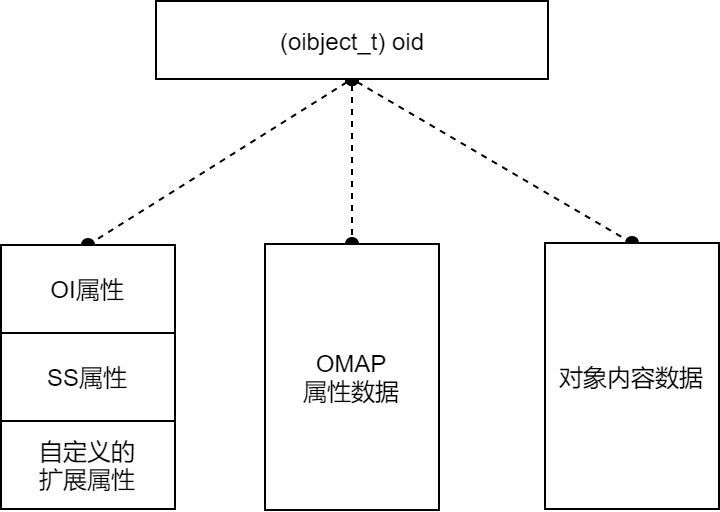

##### 元数据

**OI属性** 记录对象的基本信息

```cpp
# src/osd/osd_types.h
struct object_info_t {
    hobject_t soid;		//id
    // 版本信息
    eversion_t version, prior_version;
    version_t user_version;
    osd_reqid_t last_reqid;
    uint64_t size;		//大小
    utime_t mtime;		//修改时间
    utime_t local_mtime; // local mtime
    
    // note: these are currently encoded into a total 16 bits; see
    // encode()/decode() for the weirdness.
    typedef enum {
        FLAG_LOST     = 1<<0,
        FLAG_WHITEOUT = 1<<1,  // object logically does not exist
        FLAG_DIRTY    = 1<<2,  // object has been modified since last flushed or undirtied
        FLAG_OMAP     = 1 << 3,  // has (or may have) some/any omap data
        FLAG_DATA_DIGEST = 1 << 4,  // has data crc
        FLAG_OMAP_DIGEST = 1 << 5,  // has omap crc
        FLAG_CACHE_PIN = 1 << 6,    // pin the object in cache tier
        FLAG_MANIFEST = 1 << 7,	// has manifest
        // ...
        FLAG_USES_TMAP = 1<<8,  // deprecated; no longer used.
    } flag_t;
    flag_t flags;	//对象状态
    
    uint64_t truncate_seq, truncate_size;
    map<pair<uint64_t, entity_name_t>, watch_info_t> watchers;
    //校验和
    __u32 data_digest;  ///< data crc32c
    __u32 omap_digest;  ///< omap crc32c
    ...
}
```

**SS属性** 记录对象的快照信息

```cpp
# src/osd/osd_types.h
struct SnapSet {
  snapid_t seq;
  bool head_exists;
  vector<snapid_t> snaps;    // descending
  vector<snapid_t> clones;   // ascending
  map<snapid_t, interval_set<uint64_t> > clone_overlap;  // overlap w/ next newest
  map<snapid_t, uint64_t> clone_size;
  map<snapid_t, vector<snapid_t>> clone_snaps; // descending
}
```

**OMAP属性** ：保存数据一致性的重要参照信息

- 保存PGLOG日志

##### head对象与克隆对象

head对象是原始对象，克隆对象是对head对象在某时刻的快照

- 一个head对象可以有多个克隆对象
- head对象和克隆对象具有相同的 `(object_t) oid` ，区别在于OI属性中 `(hobject_t) soid` 下的 `(snapid_t) snap` 字段
  - 克隆对象 snap 字段为 `CEPH_NOSNAP`
  - 克隆对象的 snap 字段为快照序号
- 二者在 SS 属性上也有差别

### 4.1.3 对象的组织与管理

所有对象存放在物理上隔离的线性地址空间

存储池，是存储应用层可见的对象组织与管理单元，是对象的一种逻辑分区

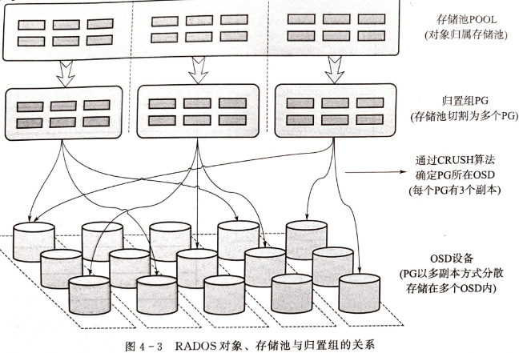

存储池落盘过程会被分割为多个PG，交叉分布在集群内的OSD设备上

PG，是Ceph中最末级的数据组织单元，其内直接存放RADOS对象。可见范围为 liobRADOS层与RADOS层。

- 一个存储池的PG数由人工控制，但不能指定具体存放在哪个PG
- PGID由对象名hash值取模 **计算** 确定，也即存储池的划分

**数据存放、迁移和同步都是以PG为单位**

- 基于OSDMAP使用CRUSH算法计算PG存放于哪个OSD设备
- OSD设备发生故障时，导致OSDMAP变化，此时RADOS系统自动将故障OSD上的PG迁移到其他OSD设备上。

#### 存储池

Ceph集群部署完成后，会创建一些默认的存储池（rbd）

池根据ceph.conf中配置的副本数创建指定数量的副本池，保障数据的高可用性，比如：复制或纠删码技术（二选一）

- 纠删码：将数据分解成块编码，然后以分布式的方式存储

当数据写入池时，Ceph池会映射到一个CRUSH规则集，CRUSH规则集为Ceph池提供了新的功能

- 缓冲池：创建一个使用SSD的faster池或SSD、SAS和SATA硬盘组成的混合池
- 支持快照：`ceph osd pool mksnap`
- 为对象设置所有者和访问权限：给池分配一个用户ID标识该池的所有者

#### PG

PG是一组对象的逻辑集合（不属于同一个RADOS对象），可以减少系统管理大量对象带来的资源占用

一般来说，增加池的PG数可以降低每个OSD的负担，但PG数不能无限增大，需要根据集群规模调整，建议每个OSD放置50~100个PG

> **PG数的计算**
> $$
> PG数= 2^{\big\lceil\log_2(OSD总数\times 100/最大副本数)\big\rceil}\\
> 每个池平均PG数=2^{\log_2\big\lceil PG总数/池数\big\rceil}=2^{\big\lceil\log_2(OSD总数\times 100/最大副本数/池数)\big\rceil}
> $$

多副本模式下，PG会被复制到不同OSD设备上提高系统可靠性

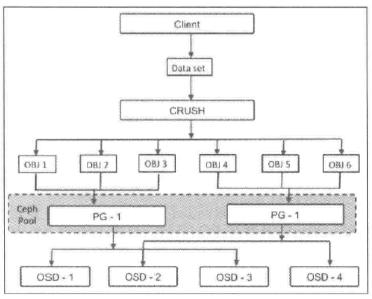

## 4.2 OSD组件

### 4.2.1 PG

PG在OSD中的实现分为两部分：

- 一部分是描述对象隶属关系的末级数据组织结构，

- 另一部分是实现PG功能、处理各类操作请求的程序实例，

  在OSD中，实现为基于PG类派生的程序实例

#### 对象的组织结构——Collection

同一PG的对象具有相同的Collection实例 `coll_t`

```cpp
# src/osd/osd_types.h
class coll_t {
  enum type_t {
    TYPE_META = 0,
    TYPE_LEGACY_TEMP = 1,  /* no longer used */
    TYPE_PG = 2,
    TYPE_PG_TEMP = 3,
  };
  type_t type;
  spg_t pgid;
  uint64_t removal_seq;  // note: deprecated, not encoded

  char _str_buff[spg_t::calc_name_buf_size];
  char *_str;
}
```

- `(spg_t) pgid={m_pool=[池ID],m_seed=[PG ID]}` 是一个二维结构

##### PG的元数据

作为对象管理单元的PG，其本身也是一个对象，该对象的对象名 `hoid.name=null` 。

```cpp
pgmeta_oid {
    (hobject_t) hoid{
        static const POOL_META = -1;
        static const POOL_TEMP_START = -2;
        oid = {
            name = ""
        },
        max = false;
        ...
    }	
}
```

-  FileStore为存储后端，PG元数据的对象保存在 `[PGID]_head` 
- BlueStore为存储后端，PG元数据对象为BlueStore自定义的由onode承载的数据集合，存储在RocksDB

---

PG元数据有 `PG_INFO` 、`PGLOG` 、`missing` 列表。

- `PG_INFO` 中存放了PG的日志状态、版本号等基本信息

  ```cpp
  # src/osd/osd_types.h
  struct pg_info_t {
      spg_t pgid;
      eversion_t last_update;      ///< last object version applied to store.
      eversion_t last_complete;    ///< last version pg was complete through.
      epoch_t last_epoch_started;  ///< last epoch at which this pg started on this osd
      epoch_t last_interval_started; ///< first epoch of last_epoch_started interval
      version_t last_user_version; ///< last user object version applied to store
      eversion_t log_tail;         ///< oldest log entry.
      
      hobject_t last_backfill;     ///< objects >= this and < last_complete may be missing
      bool last_backfill_bitwise;  ///< true if last_backfill reflects a bitwise (vs nibblewise) sort
      interval_set<snapid_t> purged_snaps;
      pg_stat_t stats;
      pg_history_t history;
      pg_hit_set_history_t hit_set;
  }
  ```

- `PGLOG`、 `missing` 列表保存各PG副本间数据一致性的信息，以OMAP属性的方式保存在PG元数据对象中

  PGLOG为故障数据的检测与恢复提供了对照标准

  PGLOG由PG的副本维护，每个PG副本都有相应的PGLOG日志，并由各自的副本维护。

  落盘时存放在元数据xxx实例的OMAP属性内，运行时作为PG实例的数据载入内存

  ```cpp
  struct pg_log_entry_t {
      //对象的唯一标识，记录对象ID、所属存储池ID、快照版本等
      hobject_t  soid;
      osd_reqid_t reqid;  // caller+tid to uniquely identify request
      mempool::osd_pglog::vector<pair<osd_reqid_t, version_t> > extra_reqids;
      eversion_t version, prior_version, reverting_to;	//对象版本号
      version_t user_version; // the user version for this entry
      utime_t     mtime;  // this is the _user_ mtime, mind you
      int32_t return_code; // only stored for ERRORs for dup detection
  
      __s32      op;	//操作类型
  }
  ```

  其中比较重要的字段是 version（对象版本）、op（操作类型）、soid（对象ID及相关信息）

  PGLOG通过 `soid` 关联到对象，通过 `version` 与对象 SS属性中的同名字段比较，确定对象的状态

#### PG与PGP

PGP是为定位设置的PG，对于一个池而言 `pgp_num=pg_num` 

对于再平衡操作：当某个池的 `PG_num` 增加，这个池的每个PG会被一分为二，但先不进行再平衡。等到 `pgp_num` 被增加时，PG才开始从源OSD迁移到其他OSD，正式开始再平衡

#### PG peer  和up、acting集合

acting集合负责PG的一组OSD，up集合中的第一个OSD为主OSD，其余为第二、第三...OSD

- 对于某些PG而言，某个OSD为主OSD，但同时对于其他PG来说，该OSD可能为非主OSD

- 主OSD的守护进程负责该PG与第二第三OSD间的 **peer操作** 

  该PG的所有对象及其元数据状态

  存放该PG的所有OSD间的确认操作

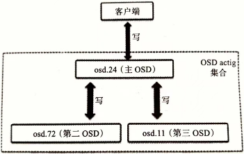

处于up状态的主OSD会保持在up与acting集合中

- 正常状态acting集合和up集合一样
- up[]：是一个特定CRUSH规则集下的一个特定OSD map版本的所有相关OSD的有序列表
- acting[]：特定PG map版本的OSD集合

一旦变为down，首先会将其从up集合中移除，再从acting集合中移除。第二OSD会被晋升为主OSD。Ceph会将出错OSD上的PG恢复到新的OSD上，并将该OSD添加到up集合和acting集合中

### 4.2.2 op_shardedwq

Ceph OSD处理OP，snap trim，scrub的是相同的work queue - `osd::op_shardedwq`

#### 相关数据结构

这里主要涉及到两个数据结构：

1. `class PGQueueable`
2. `class ShardedOpWQ`

##### class PGQueueable

这个是封装PG一些请求的class，相关的操作有：

1. `OpRequestRef`
2. `PGSnapTrim`
3. `PGScrub`

```cpp
// src/osd/PGQueueable
class PGQueueable {
    typedef boost::variant<
    OpRequestRef,
    PGSnapTrim,
    PGScrub
    > QVariant;   // 定义队列处理的三种请求
    
    QVariant qvariant;
    int cost;
    unsigned priority;
    utime_t start_time;
    entity_inst_t owner;
    epoch_t map_epoch;    ///< an epoch we expect the PG to exist in
    ...
public:
    // cppcheck-suppress noExplicitConstructor
    PGQueueable(OpRequestRef op)    // 处理OpRequest
        : qvariant(op), cost(op->get_req()->get_cost()),
          priority(op->get_req()->get_priority()),
          start_time(op->get_req()->get_recv_stamp()),
          owner(op->get_req()->get_source_inst())
    {}
    PGQueueable(       // 处理PGSnapTrim
        const PGSnapTrim &op, int cost, unsigned priority, utime_t start_time,
        const entity_inst_t &owner)
        : qvariant(op), cost(cost), priority(priority), start_time(start_time),
          owner(owner) {}
    PGQueueable(       // 处理PGScrub
        const PGScrub &op, int cost, unsigned priority, utime_t start_time,
        const entity_inst_t &owner)
        : qvariant(op), cost(cost), priority(priority), start_time(start_time),
          owner(owner) {}
    PGQueueable(	//处理PGRecovery
    const PGRecovery &op, int cost, unsigned priority, utime_t start_time,
    const entity_inst_t &owner, epoch_t e)
    : qvariant(op), cost(cost), priority(priority), start_time(start_time),
      owner(owner), map_epoch(e) {}
...
    void run(OSD *osd, PGRef &pg, ThreadPool::TPHandle &handle) {
        RunVis v(osd, pg, handle);
        boost::apply_visitor(v, qvariant);
    }
...
};
```

##### class ShardedOpWQ

这个是OSD中shard相关线程的work queue类，用来处理`PGQueueable`封装的三类PG操作

```cpp
class OSD : public Dispatcher, public md_config_obs_t
{
...
    friend class PGQueueable;
    class ShardedOpWQ: public ShardedThreadPool::ShardedWQ < pair <PGRef, PGQueueable> > {
 
        struct ShardData {
            Mutex sdata_lock;
            Cond sdata_cond;
            Mutex sdata_op_ordering_lock;
            map<PG*, list<PGQueueable> > pg_for_processing;
            std::unique_ptr<OpQueue< pair<PGRef, PGQueueable>, entity_inst_t>> pqueue;
            ShardData(
                string lock_name, string ordering_lock,
                uint64_t max_tok_per_prio, uint64_t min_cost, CephContext *cct,
                io_queue opqueue)
                : sdata_lock(lock_name.c_str(), false, true, false, cct),
                  sdata_op_ordering_lock(ordering_lock.c_str(), false, true, false, cct) {
                if (opqueue == weightedpriority) {
                    pqueue = std::unique_ptr
                             <WeightedPriorityQueue< pair<PGRef, PGQueueable>, entity_inst_t>>(
                                 new WeightedPriorityQueue< pair<PGRef, PGQueueable>, entity_inst_t>(
                                     max_tok_per_prio, min_cost));
                } else if (opqueue == prioritized) {
                    pqueue = std::unique_ptr
                             <PrioritizedQueue< pair<PGRef, PGQueueable>, entity_inst_t>>(
                                 new PrioritizedQueue< pair<PGRef, PGQueueable>, entity_inst_t>(
                                     max_tok_per_prio, min_cost));
                }
            }
        };
 
        vector<ShardData*> shard_list;
        OSD *osd;
        uint32_t num_shards;   // 值为cct->_conf->osd_op_num_shards
...
        void _process(uint32_t thread_index, heartbeat_handle_d *hb);
        void _enqueue(pair <PGRef, PGQueueable> item);
        void _enqueue_front(pair <PGRef, PGQueueable> item);
...
    } op_shardedwq;
...
}
```

`op_shardedwq`对应的thread pool为：`osd_op_tp`

`osd_op_tp`的初始化在OSD的初始化类中：

```cpp
osd_op_tp(cct, "OSD::osd_op_tp", "tp_osd_tp",
          cct->_conf->osd_op_num_threads_per_shard * cct->_conf->osd_op_num_shards),
```

这里相关的配置参数有：

1. `osd_op_num_threads_per_shard`，默认值为 2
2. `osd_op_num_shards`，默认值为 5

PG会根据一定的映射模式映射到不同的shard上，然后由该shard对应的thread处理请求；

##### ShardedOpWQ的处理函数

该sharded的work queue的process函数如下：

```cpp
//src/osd/OSD.cc
void OSD::ShardedOpWQ::_process(uint32_t thread_index, heartbeat_handle_d *hb ) 
{
    ...
    pair<PGRef, PGQueueable> item = sdata->pqueue->dequeue();
 
    boost::optional<PGQueueable> qi;  
    // [lookup +] lock pg (if we have it)
  	if (!pg) {
    	pg = osd->_lookup_lock_pg(item.first);
  	} else {// 获取pg lock
    	pg->lock();
  	}
 
 
    op->run(osd, item.first, tp_handle);    // 根据不同类型操作调用不同函数
...
    sdata->sdata_op_ordering_lock.Unlock();    // 释放lock
}
```

从上面可以看出在调用实际的处理函数前，就先获取了PG lock；处理返回后释放PG lock；

`osd::opshardedwq`的 `_process()` 函数会根据request的类型，调用不同的函数处理：

1. `OSD::dequeue_op()`
2. `ReplicatedPG::snap_trimmer()`
3. `PG::scrub()`

在文件src/osd/PGQueueable.cc中有这三类操作的不同处理函数定义：

```cpp
void PGQueueable::RunVis::operator()(const OpRequestRef &op) {
  osd->dequeue_op(pg, op, handle);
}

void PGQueueable::RunVis::operator()(const PGSnapTrim &op) {
  pg->snap_trimmer(op.epoch_queued);
}

void PGQueueable::RunVis::operator()(const PGScrub &op) {
  pg->scrub(op.epoch_queued, handle);
}

void PGQueueable::RunVis::operator()(const PGRecovery &op) {
  osd->do_recovery(pg.get(), op.epoch_queued, op.reserved_pushes, handle);
}
```

#### PG lock粒度

从函数`OSD::ShardedOpWQ::_process()`中看出，thread在区分具体的PG请求前就获取了PG lock，在return前释放PG lock；这个PG lock的粒度还是挺大的，若snap trim和scrub占用了PG lock太久，会影响到OSD PG正常的IO操作；

OSD PG相关的OP类型有（`OSD::dequeue_op()`函数处理）：

- `CEPH_MSG_OSD_OP`
- `MSG_OSD_SUBOP`
- `MSG_OSD_SUBOPREPLY`
- `MSG_OSD_PG_BACKFILL`
- `MSG_OSD_REP_SCRUB`
- `MSG_OSD_PG_UPDATE_LOG_MISSING`
- `MSG_OSD_PG_UPDATE_LOG_MISSING_REPLY`

##### `osd_snap_trim_sleep`和`osd_scrub_sleep`配置

从上面看`g_conf->osd_snap_trim_sleep`和`g_conf->osd_scrub_sleep`配置为非0后，能让snap trim和scrub在每次执行前睡眠一段时间（不是random时间），这样能一定程度上降低这两个操作对PG IO ops的影响（获取PG lock）；

如果设置了`osd_snap_trim_sleep`或`osd_scrub_sleep`为非0，处理的线程会sleep，这样虽说释放了PG lock，但是占用了一个PG的一个处理线程，所以才有贴出来的ceph bug - http://tracker.ceph.com/issues/19497

现在我们配置的是：

1. `osd_op_num_shards = 30`
2. `osd_op_num_threads_per_shard = 2` //默认值

所以一旦某个shard对应的一个thread被占用了，对应处理该shard的只有一个thread了，这样就有可能影响映射到该shard上的PG的正常IO了。

https://www.yangguanjun.com/2018/10/25/ceph-bluestore-rocksdb-analyse/

## 4.3 操作请求在OSD中的处理过程

客户端使用CRUSH算法寻址，确定对象所在的主副本OSD编号和从副本OSD编号。——[libRADOS层功能](2.libRADOS.md)

客户端与主OSD建立TCP网络连接，进行身份认证后，发送写操作请求给主OSD

主OSD完成数据的本地写入和从OSD的数据写入

向客户端反馈写入结果

> OSD执行写操作请求的过程是数据结构变换的过程，先后经过 `Message` 、`OpRequest`、`OpContext`、`PGTransaction`、`ObjectStore::Transaction` 等数据结构的转换。
>
> 转换过程需要 `ObjectContext` 、`PG` 、`OSDMAP` 等资源数据结构的支持

写操作请求在OSD中被转换为ObjectStore事务，提交到本地后端存储和从副本OSD落盘

### 4.3.1 操作请求置入工作队列

这部分的数据结构转换与工作队列的入队，由Message线程完成

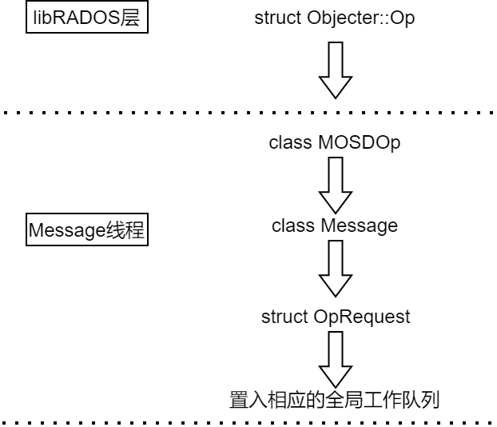

#### 1. 写请求转换为Message

客户端基于OSDMAP利用CRUSH算法计算出目标PG和OSD后，将操作请求封装为消息结构 `Message` 

```cpp
# src/msg/Message.h
class Message : public RefCountedObject {
	protected:
    ceph_msg_header  header;      // headerelope
    ceph_msg_footer  footer;
    bufferlist       payload;  // "front" unaligned blob
    bufferlist       middle;   // "middle" unaligned blob
    bufferlist       data;     // data payload (page-alignment will be preserved where possible)
    
    ConnectionRef connection;
}
```

- header为消息头，存放其他部分的数据长度信息

  - `(_le64) header.tid` 存放操作的事务ID，在一次**会话中依据请求顺序递增**，初始值为1，

- data保存了操作请求的内容数据

- footer为消息尾，存放数据的CRC校验和

- connection，记录客户端的网络地址。

  客户端与主OSD建立初始会话时，OSD端网络通信线程会创建并记录connection

  客户端并不指定连接，当操作请求的数据包到达OSD后再由Message结构填充对connection的引用

- payload为负载信息，也即操作请求的元数据

  对负载的封装由 *src/messages/MOSDOp.h* 中的 `void encode_payload(uint64_t features)` 完成

  ```cpp
  void encode_payload(uint64_t features){
      ...
      // latest v8 encoding with hobject_t hash separate from pgid, no reassert version
  	header.version = HEAD_VERSION;
  	//由请求前端指定
  	::encode(pgid, payload);
  	::encode(hobj.get_hash(), payload);
  	::encode(osdmap_epoch, payload);
  	::encode(flags, payload);
  	::encode(reqid, payload);
  	encode_trace(payload, features);
      
      // 由后端分发线程编码
      ::encode(client_inc, payload);
      ::encode(mtime, payload);
      ::encode(get_object_locator(), payload);
      ::encode(hobj.oid, payload);
      __u16 num_ops = ops.size();
      ::encode(num_ops, payload);
      for (unsigned i = 0; i < ops.size(); i++)
          ::encode(ops[i].op, payload);	//对操作的再次转换与封装
      
      ::encode(hobj.snap, payload);
      ::encode(snap_seq, payload);
      ::encode(snaps, payload);
      
      ::encode(retry_attempt, payload);
      ::encode(features, payload);
      ...
  }
  ```

  主要包括：

  - PGID
  - 对象名 `hobj.oid`
  - 操作类型编码 `(__le16) op`
    - 由 *src/include/rados.h* 的 `static inline int ceph_osd_op_uses_extent(int op)` 定义RADOS支持的操作类型

  - `osd_reqid_t reqid; // reqid explicitly set by sender`

    由libRADOS层的 `Objecter::Op` 中的 `prepare_mutate_op()` 指定

#### 2. 将Message结构转换为OpRequest

OSD进程内的网络通信线程将Message结构转换为OpRequest结构

```cpp
# src/osd/OpRequest.h
struct OpRequest : public TrackedOp {
    Message *request; /// the logical request we are tracking
    osd_reqid_t reqid;
    entity_inst_t req_src_inst;
    uint8_t hit_flag_points;
    uint8_t latest_flag_point;
    utime_t dequeued_time;
    bool check_send_map = true; ///< true until we check if sender needs a map
    epoch_t sent_epoch = 0;     ///< client's map epoch
    epoch_t min_epoch = 0;      ///< min epoch needed to handle this msg
}
```

`OpRequest.reqid` 是 `OpRequest` 的唯一标识，用于后续操作请求的查重

```cpp
struct osd_reqid_t{
    entity_name_t name;	//等于 Message.header.src
    ceph_tid_t tid;		//等于 Message.header.tid
    int32_t inc;		//等于 Message.payload.reqid.inc
}
```

- 操作请求 `Message.payload` 中的 `(_le64) reqid.tid` ，不足以标识OpRequest。

#### 3. 使用OSD全局工作队列控制系统QoS

将操作请求置入全局工作队列 `(OSD::ShardedOpWQ) op_shadredwq` 工作队列组

- 客户端的各类操作请求都将进入该队列组等待处理

QoS的控制方法有四种

- prioritized：基于优先级
- WeightedPriority：基于权重
- 基于时间标签dmClock的方法
  - mclock_opclass：
  - mclock_client

##### Weightedpriority（默认）

其工作队列组是一种四级结构，前两级想独一固定，用于对 `OpRequest` 划分类别

- 第一级，基于PG 的分片
- 第二级，对优先级分类
- 第三、四级分别存放客户端和具体操作请求

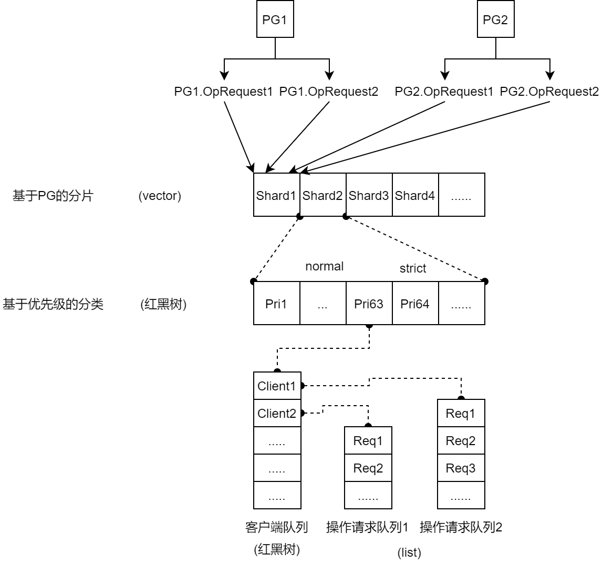

**基于PG的分片** 

一个分片可对应多个PG的操作请求，但一个PG的所有 `OpRequest` 只会置入同一个分片

- 目的：确保同一PG内的 `OpRequest` 顺序执行

**基于优先级的OpRequest分类**

不同操作请求类型有相应的优先级

优先级分为 normal(不大于63) 和 strict(大于63)两类，二者在请求出队方面有区别

- strict级别：严格按照操作请求的优先级出队

- normal级别：以优先级为权重计算出队概率，优先级越大，该客户端队列被选中的概率越大。

  客户端队列内部，采用 Round-Robin轮询调度，每个客户端队列依次被选中

  将其内的操作请求队列头部的 `OpRequest` 出队

##### 写请求在全局工作队列的入队过程

```cpp
#src/osd/OSD.cc???可能
void OSDService::enqueue_back(spg_t pgid, PGQueueable qi){
  osd->op_shardedwq.queue(make_pair(pgid, qi));
}
```

1. 基于PGID计算所属的分片：使用 `OpRequest.request.pgid.m_seed` (PGID)与 `op_shardedwq` 的分片总数取模，得到具体的分片 shard

2. 确定操作请求的优先级并放入相应的队列。

   `OpRequest.request.header.priority` 

3. 确定请求所在的客户端队列：使用 `OpRequest.request.header.src` 和 `OpRequest.request.connection->peer_addr` 构成的结构体

4. 将 `OpRequest` 直接置入第四级操作请求队列

**Message** 线程将 `OpRequest` 入队后立即返回，其出队与后续处理由专门的PG线程负责，涉及 **一次线程切换** 

#### 请求出队过程

`PGQueueable` 负责各类操作（op、snap_trimmer、scrub、recovery）的出队

```cpp
# src/osd/OSD.cc
void OSD::dequeue_op(
    PGRef pg, 
    OpRequestRef op,
    ThreadPool::TPHandle &handle){
        op->set_dequeued_time(now);
        ...
        pg->do_request(op, handle);
        /*
            PrimaryLogPG::do_request(OpRequestRef& op,ThreadPool::TPHandle &handle)
            按操作类型从全局工作队列将操作出对，IO请求为do_op
            prepare_lat是OpRequest的出队时长
        */
}

# src/osd/PrimaryLogPG.cc
void PrimaryLogPG::do_op(OpRequestRef& op){
    execute_ctx(ctx);
    utime_t prepare_latency = ceph_clock_now();
  	prepare_latency -= op->get_dequeued_time();
  	osd->logger->tinc(l_osd_op_prepare_lat, prepare_latency);
  	if (op->may_read() && op->may_write()) {
  	  osd->logger->tinc(l_osd_op_rw_prepare_lat, prepare_latency);
  	} else if (op->may_read()) {
 	   osd->logger->tinc(l_osd_op_r_prepare_lat, prepare_latency);
  	} else if (op->may_write() || op->may_cache()) {
   	 osd->logger->tinc(l_osd_op_w_prepare_lat, prepare_latency);
  	}
}
```

### 4.3.2 PG事务生成前的OSD处理阶段

#### 1. 判断操作的可调度性(操作请求查重、对象是否处于降级状态)

进行 `OpRequest` 的查重工作，防止重复处理相同的请求

- `OpRequest` 由 `OpRequest.reqid` 唯一标识

```cpp
# src/osd/PG.cc
bool PG::check_in_progress_op(
    const osd_reqid_t &r,	//形参r为 OpRequest.reqid
    eversion_t *version,
    version_t *user_version,
    int *return_code) const{
    
    return (
        projected_log.get_request(r, version, user_version, return_code) ||
        pg_log.get_log().get_request(r, version, user_version, return_code)
    );
}
```

- 若存在重复操作请求，则反馈 `version` 和 `user_version`

  `version` 是操作请求的版本信表示，正常情况其在PG内随着操作请求的提交而顺序、连续递增

  - 是PGLOG进行peering一致性校验的标识信息

  `user_version` 是客户端可见的版本标识

  - 由PGLOG记录

-  查重依据是内存中的 `(IndexLog) pg.projected_log` 和 `(IndexLog) pg.pg_log.log` 

  `IndexLog` 类用于在内存中创建日志的索引，索引的键是对象ID（oid）。

  - `pg.projected_log` 记录 `OpRequest` 的处理过程，根据 `OpRequest` 的处理进度动态添加和删除其中的记录条目

  - `pg.pg_log.log` 包含实际的PGLOG，但并不会遍历实际的PGLOG队列，而是根据三个映射查重：caller_ops、extra_caller_ops、dup_index

    三个map映射仅记录日志的地址值，不存放日志内容，

    ```cpp
    # src/osd/PGLog.h
    struct IndexedLog : public pg_log_t {
        mutable ceph::unordered_map<hobject_t,pg_log_entry_t*> objects;  // ptrs into log.  be careful!
        mutable ceph::unordered_map<osd_reqid_t,pg_log_entry_t*> caller_ops;
        mutable ceph::unordered_multimap<osd_reqid_t,pg_log_entry_t*> extra_caller_ops;
        mutable ceph::unordered_map<osd_reqid_t,pg_log_dup_t*> dup_index;
    ```

    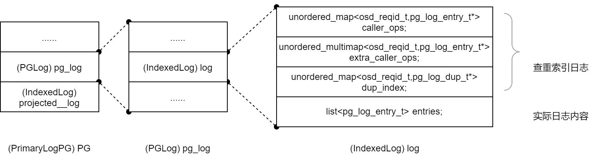

##### 重复操作请求处理

到PG的 `(xlist<RepGather *>) repop_queue` 中查询该 `OpRequest` 的完成状态

- 若上次操作请求以完成，则应答客户端并返回
- 若未完成，则进入 `pg.waiting_for_ondisk` 队列，后续满足相关限制条件后，PG会将其出队，重新进入全局的 `op_shardedwq` 工作队列组，直至该请求执行完成

##### 降级对象处理

对于没有完成 revovery 操作的对象，将该操作置于内部队列，阻塞此次写请求，直至完成 revovery 后继续执行

#### 2. 确定待操作对象是否存在，并获取目标对象的上下文信息

`ObjectContext` 收集了对象的OI和SS属性

- `(ObjectState) Obs` 在对象OI属性的基础上新增了表示对象存在性的字段 `ObjectContext.Obs.exists` 、读写事务所、用户自定义属性信息缓存等数据——**拥有对象全部元数据** 

  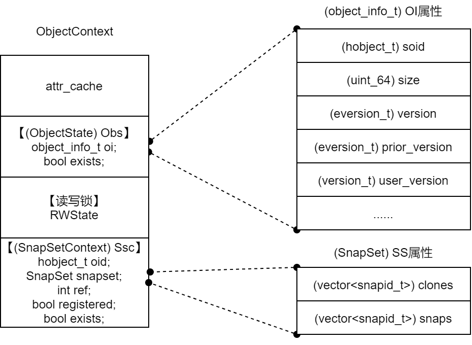

由函数 `PrimaryLogPG::get_object_context()` 读取OI和SS属性

- 对于已存在的对象，该对象的 `ObjectContext` 会被缓存

  会被存放在PG的 `(ShardedLRU<hobj_t, ObjectContext>) PG.object_contexts` 结构中，即该对象的 `ObjectContext.Obs.exists=true` 。

- 对于新创建的对象，`PG.object_contexts` 中并没有 `ObjectContext` 

  在查找 `ObjectContext` 的过程中会调用 `PGBackend:objects_getattr()`  向存储后端查找对象的 OI属性（ `_` 属性）。即一次元数据的读取操作

  判定该对象不存在后，会创建 `ObjectContext` 结构，并设置 `ObjectContext.Obs.exists=false`

#### 3. 汇集请求涉及的结构，形成OpContext

> 在OSD中，带Context的结构多数用于数据汇集并根据上下文环境进行操作转换

OpContext将操作请求 `OpRequest` 、目标对象上下文 `ObjectContext` 、快照对象上下文 `SnapContext` 汇集起来；

并预留一些内存数据结构：本次操作相关PGLOG的 `vector<pg_log_entry_t> log` 、存放对象预期状态的 `(ObjectState) new_obs` 、存放快照预期状态的 `(SnapSet) new_snapset` 等。

预留PG事务智能指针 `(PGTransactionUPtr) op_t` ，用于存放PG事务

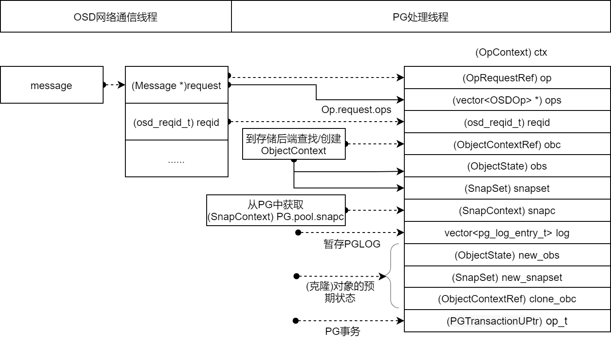

`(OpContext) ctx` 是将写请求转换为事务的基础数据，**在PG处理阶段，写请求依次被转换为PG事务、Objector事务**。**Objector事务被提交给副本PG和后端存储，进行数据落盘**。

### 4.3.3 在PG处理线程中生成PG事务

一个写请求经过本阶段的处理，会产生 `create` 、`clone`(与快照相关)、`PGLOG更新` 、`对象属性更新` 等多个事务执行单元。这些事务执行单元被封装到一个PG事务中。

#### PG事务介绍

```cpp
# src/osd/PGTransaction.h
class PGTransaction {
	public:
    map<hobject_t, ObjectContextRef> obc_map;
    map<hobject_t, ObjectOperation> op_map;
    ...
}
```

- 针对某个目标对象的所有事务执行单元封装在一个 `ObjectOperation` 实例中

  ```cpp
  # src/osd/PGTransaction.h
  class ObjectOperation {
  public:
      struct Init{
        struct None {};
        struct Create {};
        struct Clone { hobject_t source;};
        struct Rename { hobject_t source; // must be temp object};
      };
      using InitType = boost::variant<Init::None, Init::Create, Init::Clone, Init::Rename>;
      std::map<string, boost::optional<bufferlist> > attr_updates;
          
      enum class OmapUpdateType {Remove, Insert};
      std::vector<std::pair<OmapUpdateType, bufferlist> > omap_updates;
          
      boost::optional<pair<set<snapid_t>, set<snapid_t> > > updated_snaps;
  
      struct BufferUpdate {
        struct Write {bufferlist buffer; uint32_t fadvise_flags;};
        struct Zero { uint64_t len;};
        struct CloneRange { hobject_t from;uint64_t offset;uint64_t len;};
      };
      using BufferUpdateType = boost::variant<BufferUpdate::Write, BufferUpdate::Zero, BufferUpdate::CloneRange>;
  	}
  }
  ```

  - 结构

    - `xxxType` 按操作类型封装了事务的执行单元，同一类操作放在同一个联合体中

      空操作、create、clone、rename放在一个联合体中

      write、zero、cloneRange放在一个联合体中

    - 定义各事务执行单元的参数

    - `bufferlist` 保存存放数据的内存地址


  - 为将事务封装到相应的事务执行单元结构中，还定义了相应的接口函数

    ```cpp
    #src/osd/PGTransaction.h
      void create(
        const hobject_t &hoid
        );
    void clone(
        const hobject_t &target,       ///< [in] obj to clone to
        const hobject_t &source        ///< [in] obj to clone from
        );
    void rename(
        const hobject_t &target,       ///< [in] source (must be a temp object)
        const hobject_t &source        ///< [in] to, must not exist, be non-temp
        );
    void remove(
        const hobject_t &hoid          ///< [in] obj to remove
        )
        void setattrs(
        const hobject_t &hoid,         ///< [in] object to write
        map<string, bufferlist> &attrs ///< [in] attrs, may be cleared
        );
    void write(
        const hobject_t &hoid,         ///< [in] object to write
        uint64_t off,                  ///< [in] off at which to write
        uint64_t len,                  ///< [in] len to write from bl
        bufferlist &bl,                ///< [in] bl to write will be claimed to len
        uint32_t fadvise_flags = 0     ///< [in] fadvise hint
        );
    ```


#### 事务转换过程

```cpp
# src/osd/PrimaryLogPG.cc
//由PrimaryLogPG::do_op 主调
void PrimaryLogPG::execute_ctx(OpContext *ctx){
    ...
    int result = prepare_transaction(ctx);
    ...
  	bool pending_async_reads = !ctx->pending_async_reads.empty();
  	if (result == -EINPROGRESS || pending_async_reads) {
        // come back later.
        if (pending_async_reads) {
            //list<pair<OpRequestRef, OpContext*> > in_progress_async_reads;
            in_progress_async_reads.push_back(make_pair(op, ctx));
            ctx->start_async_reads(this);
        }
        return;
  	}
    ...
}

//prepare_transaction(OpContext)将操作请求分解为事务执行单元并封装为PG事务
int PrimaryLogPG::prepare_transaction(OpContext *ctx){
    ...
    // prepare the actual mutation
    int result = do_osd_ops(ctx, *ctx->ops);
    // clone, if necessary
  	if (soid.snap == CEPH_NOSNAP)
    	make_writeable(ctx);
    finish_ctx(ctx,
               ctx->new_obs.exists ? pg_log_entry_t::MODIFY :
               pg_log_entry_t::DELETE);
}
```

- `do_osd_ops()` ：写请求的基础性转换：是否执行 create()操作、执行普通的 write() 操作还是 truncate() 操作
- `make_writeable()` ：处理快照相关的操作，根据 `SnapContext` 和 `SnapSet` 判断是否执行 clone()操作及相关属性的设置
- `finish_ctx()` ：生成PGLOG日志更新的 omap_setkeys()操作、更新OI属性和SS属性的 setattrs()操作

##### do_osd_ops——操作请求的基础处理

```cpp
# src/osd/PrimaryLogPG.cc
int PrimaryLogPG::do_osd_ops(OpContext *ctx, vector<OSDOp>& ops){
    //此函数中的事务指PG事务
    PGTransaction* t = ctx->op_t.get();
}
```

对不同类型的请求分别处理，如 `CEPH_OSD_OP_XXX` 

- 在 *src/include/rados.h* 中定义

对于一个写请求

1. 首先，判断写请求本质上是否为一种 truncate()操作，

2. 然后根据 `ctx.obs.exists` 判断是否执行 create()操作
   - 是，设置 `PGTransaction::ObjectOperation::Init` 类型为Create，最终在Objector事务中增加 `OP_TOUCH` 这一事务执行单元，告知后端存储在执行事务时先进行创建操作

3. 最终调用 `PGTransaction::write()` 函数将代写的数据、参数、对象id等作为一个 Write执行单元封装进PG事务。

4. 还会更新对象OI属性的校验和信息，并暂存在 `ctx->new_obs` 中，用于后续的 setattrs()操作，更新事务执行单元

##### make_writeable——快照功能的处理流程

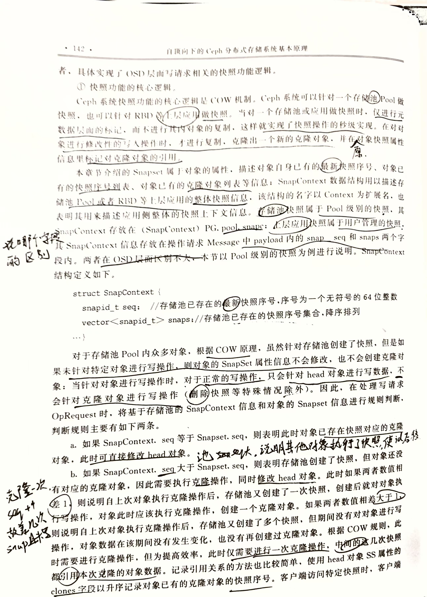

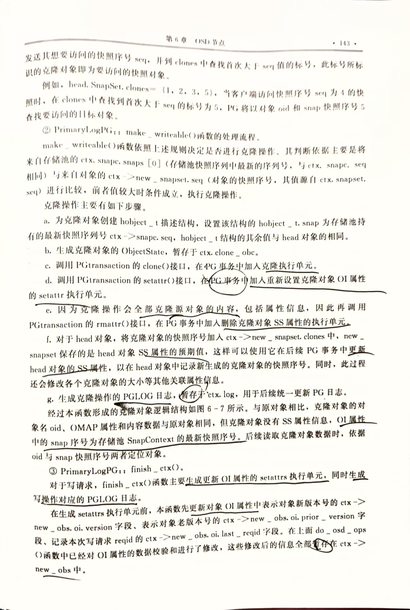

##### finish_ctx——生成OI属性更新的事务执行单元与PGLOG日志

更新OI属性中表示对象新版本号的 `ctx->new_obs.oi.version` 、表示对象老版本号的 `ctx->new_obs.oi.prior_version` 、记录本次请求的事务id `ctx->new_obs.oi.last_reqid` ，全部暂存于 `ctx_new_obs` 中

生成更新对象OI属性与SS属性的 setattr()事务执行单元。

- 依据 `ctx->new_obs` 和 `ctx->new_snapset` 的新属性信息，生成 setattrs事务执行单元

  无论是否有存储池快照，都会用 `new_snapset` 对SS属性进行更新

生成本次操作请求对应的PGLOG，暂存在 `ctx->log` 中

- 由于PGLOG由各PG独立维护，所以不需要将其封装入事务

### 4.3.4 关联从副本事务的回调函数，并向从副本提交事务

这一阶段涉及的代码如下

```cpp
//由PrimaryLogPG::do_op 主调
void PrimaryLogPG::execute_ctx(OpContext *ctx){
	//操作请求转换为PG事务
    int result = prepare_transaction(ctx);
    ...
    // issue replica writes
    ceph_tid_t rep_tid = osd->get_tid();
    RepGather *repop = new_repop(ctx, obc, rep_tid);
	//向所有从副本提交操作请求，以及操作的context
    issue_repop(repop, ctx);
    //接收从副本的执行情况
    eval_repop(repop);		
    repop->put();
    ...
}

# src/osd/PrimaryLogPG.cc
void PrimaryLogPG::issue_repop(RepGather *repop, OpContext *ctx){
    ...
    Context *on_all_commit = new C_OSD_RepopCommit(this, repop);
    Context *on_all_applied = new C_OSD_RepopApplied(this, repop);
    Context *onapplied_sync = new C_OSD_OndiskWriteUnlock(
        ctx->obc,
        ctx->clone_obc,
        unlock_snapset_obc ? ctx->snapset_obc : ObjectContextRef()
    );

    pgbackend->submit_transaction(
        soid,
        ctx->delta_stats,
        ctx->at_version,
        std::move(ctx->op_t),
        pg_trim_to,
        min_last_complete_ondisk,
        ctx->log,
        ctx->updated_hset_history,
        onapplied_sync,
        on_all_applied,
        on_all_commit,
        repop->rep_tid,
        ctx->reqid,
        ctx->op	//操作请求
    );
}

# src/osd/ReplicatedBackend.cc
void ReplicatedBackend::submit_transaction(
  const hobject_t &soid,
  const object_stat_sum_t &delta_stats,
  const eversion_t &at_version,
  PGTransactionUPtr &&_t,
  const eversion_t &trim_to,
  const eversion_t &roll_forward_to,
  const vector<pg_log_entry_t> &_log_entries,
  boost::optional<pg_hit_set_history_t> &hset_history,
  Context *on_local_applied_sync,
  Context *on_all_acked,
  Context *on_all_commit,
  ceph_tid_t tid,
  osd_reqid_t reqid,
  OpRequestRef orig_op){
    ...
    //将PG事务转换为ObjectStore事务
    generate_transaction(
        t,	//PGTransactionUPtr t(std::move(_t));
        coll,
        (get_osdmap()->require_osd_release < CEPH_RELEASE_KRAKEN),
        log_entries,
        &op_t,	//ObjectStore::Transaction op_t;
        &added,
        &removed
    );
    
    //定义从副本操作请求与回调函数的关联结构
    InProgressOp &op = in_progress_ops.insert(
        make_pair(
            tid,
            InProgressOp(
                tid, 
                on_all_commit, on_all_acked,orig_op, at_version)
        )
    ).first->second;
    ...
    //向从副本提交ObjectStore事务
    issue_op(
        soid,
        at_version,
        tid,
        reqid,
        trim_to,
        at_version,
        added.size() ? *(added.begin()) : hobject_t(),
        removed.size() ? *(removed.begin()) : hobject_t(),
        log_entries,
        hset_history,
        &op,
        op_t
    );
    ...
}
```

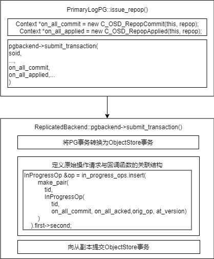

#### 将PG事务转换为ObjectStore事务

PG事务仅从客户端角度将请求分解为不同的事务执行单元，但本地持久化还需要考虑副本策略等特性，因此还需要将PG事务进一步转换为ObjectStore事务

```cpp
# src/os/ObjectStore.h
class Transaction{
    private:
    TransactionData data;				// 该事务实例内，PG事务执行单元的数量，最大数据长度的信息
    map<coll_t, __le32> coll_index;		//通过该索引查找collection信息
    map<ghobject_t, __le32> object_index;	//通过该索引查找对象信息

    __le32 coll_id {0};		//本事务实例涉及的collection 索引数量
    __le32 object_id {0};	//本事务实例涉及的对象索引数量

    bufferlist data_bl;		//存储操作数据的bufferlist
    bufferlist op_bl;		//存储事务执行单元操作码的 bufferlist

    bufferptr op_ptr;

    list<Context *> on_applied;	//on_appilied回调函数
    list<Context *> on_commit;	//on_commited回调函数
    list<Context *> on_applied_sync;
}
```

`op_bl` 结构记录各执行单元的操作码、cid索引、oid索引

- `coll_index` 记录了事务执行单元涉及的collection

- `object_index` 记录了目标对象的基本信息

- `data_bl` 记存放具体数据，包括要写入对象的内容数据和元数据

  数据按照 `op_bl` 内事务执行单元的顺序依次编码进 `data_bl` 

  一个事务执行单元可以对应多个数据条目

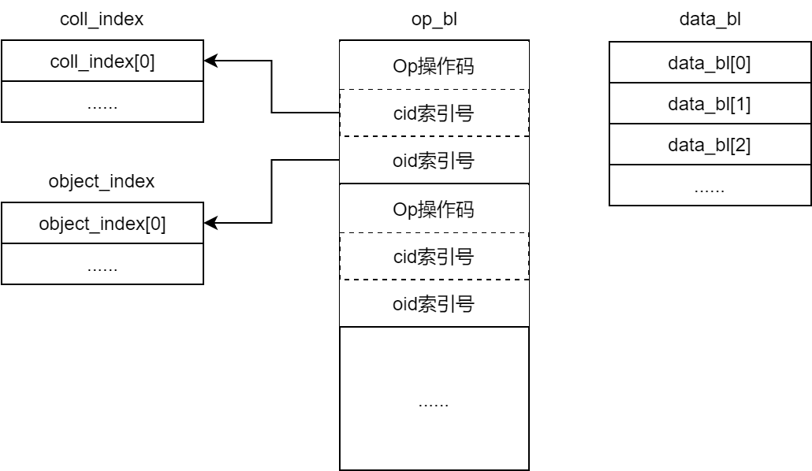

事务使用 bufferlist 组织，便于将其打包进网络操作请求 `Message` 中

将 `PGTransaction` 转换为 `ObjectStore::Transaction` 的函数为 `PGTransaction::safe_create_traverse()` 

- 对于多副本模式，PG事务已经按照顺序组织好操作数据，此处仅涉及不同结构成员的相互赋值
- 对于纠删码模式，需要将PG事务内的操作数据进一步运算转换

#### 形成操作请求与回调函数的关联结构

##### RepGather

> 写操作请求的执行状态分为4个
>
> - applied和committed表示写请求落盘的不同阶段
>
>   - applied 表示数据已进入日志盘
>
>   - commited 表示数据已完成实际落盘
>
>     实际应用中，以commited为主，在相应的回调函数 on_committed() 中向客户端反馈写请求的执行结果
>
> - success和finish用于请求的后处理
>
>   - success用于 Watch/Notify 相关操作
>   - finish用于清理和资源回收

RepGather 以`OpContext` 中的部分成员为标识符，定义了四种副本执行状态及相应的回调函数

```cpp
# src/osd/PrimaryLogPG.h
class RepGather {
  public:
    hobject_t hoid;
    OpRequestRef op;
    bool rep_aborted, rep_done;

    bool all_applied;	//表示所有副本appiled的状态
    bool all_committed;	//表示所有副本committed的状态
    const bool applies_with_commit;

    list<std::function<void()>> on_applied;
    list<std::function<void()>> on_committed;
    list<std::function<void()>> on_success;
    list<std::function<void()>> on_finish;
}
```

在 `PrimaryLogPG::execute_ctx()` 中，向从副本提交事务后，`eval_repop(RepGather)` 实现了各副本执行情况的汇集、判断和回调函数的调用执行。

```cpp
# src/osd/PrimaryLogPG.cc
// 在新生成repop结构时，会将其置入repop_queue，用于操作请求查重
PrimaryLogPG::RepGather *PrimaryLogPG::new_repop(
    OpContext *ctx, ObjectContextRef obc,
    ceph_tid_t rep_tid){
    ...
    RepGather *repop = new RepGather(
        ctx, rep_tid, info.last_complete, false);
    //xlist<RepGather*> repop_queue
	repop_queue.push_back(&repop->queue_item); 
    ...
	return repop;
}
```

##### 关联原始操作请求与回调函数

`InProgressOp` 记录了请求ID与回调函数，用于从副本应答请求时，定位**原始**的写操作请求和回调函数

```cpp
# src/osd/ReplicatedBackend.h
class ReplicatedBackend: public PGBackend{
  struct InProgressOp {
    ceph_tid_t tid;	//本次操作请求的id
    OpRequestRef op;
    set<pg_shard_t> waiting_for_commit;
    set<pg_shard_t> waiting_for_applied;
    Context *on_commit;
    Context *on_applied;
    eversion_t v;
  }
  ...
  map<ceph_tid_t, InProgressOp> in_progress_ops;
}
```

`InProgressOp` 属于 `PGBackend` 类，该类用于屏蔽多副本PG与纠删码PG的差异

- 多副本PG被实现为 `ReplicatedBackend` 类
- 纠删码PG被实现为 `ECBackend` 类
- 在 PrimaryLogPG中，对副本PG的使用都是调用二者的父类 `PGBackend` 

PG后续收到从副本反馈的执行结果反馈时，从 `pg->pgbackend.in_progress_ops` 中查找对应的 `InProgressOp` 。

- 查找：后续从副本反馈执行结果时，依据`tid` 定位InProgressOp，进而由RepGather汇集执行状态

  tid由主OSD维护，在OSD范围内递增，用于在本OSD范围内表示操作

> **`InProgressOp` 以回调程序对象的形式关联到 `RepGather`** 
>
> 一个预定义的回调程序对象如 `C_OSD_RepopCommit` ，可见，回调函数对象的构造需要与一个 `RepGather` 实例关联。
>
> ```cpp
> # src/osd/PrimaryLogPG.cc
> class C_OSD_RepopCommit : public Context {
>  PrimaryLogPGRef pg;
>  boost::intrusive_ptr<PrimaryLogPG::RepGather> repop;
> public:
> C_OSD_RepopCommit(PrimaryLogPG *pg, PrimaryLogPG::RepGather *repop): pg(pg), repop(repop) {}
> };
> ```
> 
>    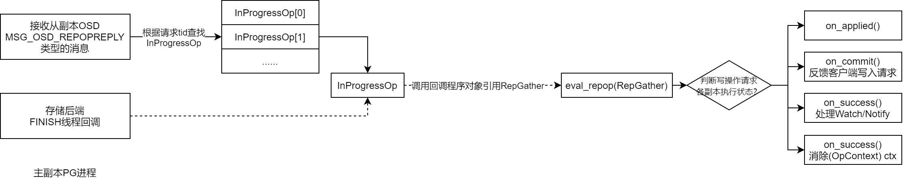

##### 向从副本提交ObjectStore事务和PGLOG日志

由 `PrimaryLogPG::issue_op()` 向所有从副本提交 ObjectStore 事务

```cpp
issue_op(
    soid,
    at_version,
    tid,	//ceph_tid_t
    reqid,
    trim_to,
    at_version,
    added.size() ? *(added.begin()) : hobject_t(),
    removed.size() ? *(removed.begin()) : hobject_t(),
    log_entries,	//PGLOG数据
    hset_history,
    &op,
    op_t);//ObjectStore事务
```

- 操作类型为 `MSG_OSD_REPOP` 
- `log_entries` 为PGLOG数据，由于各副本PG独立维护PGLOG，所以需要作为独立结构发送给从副本处理
- `op_t` 为ObjectStore事务

`issue_op()` 内部：

1. 先生成 `MSG_OSD_REPOP` 类型的网络请求
2. 调用 `send_message_osd_cluster()` 将请求发送给该PG的所有副本

从副本收到请求后，

1. 将 `PGLOG` 中的数据先根据本地的执行情况处理，
2. 再和 `ObjectStore` 事务结合，完成本地的落盘，向主副本反馈执行结果

### 4.3.5 主副本操作请求落盘

向从副本提交操作请求后，

1. 首先，主副本PG调用 `PG::write_if_dirty()` ，在本地立即将PGLOG `(pg_info_t) PG.info` 封装进 `ObjectStore::Transaction` 

   - `PG.info` 是确定确定权威PGLOG的判定标准

   - 封装过程需要调用 `ObjectStore::Transaction::omap_setkeys()` 函数

     将暂存于 `ctx->log` 中的日志信息封装进ObjectStore事务，作为一个 `omap_setkeys` 的事务执行单元

     该 `omap_setkeys` 事务执行单元对应的OID为PG元数据对象， `Transaction.object_index` 增加该元数据对象的信息

   ```cpp
   # src/osd/PG.cc
   void PG::write_if_dirty(ObjectStore::Transaction& t){
       map<string,bufferlist> km;
       if (dirty_big_info || dirty_info)
           prepare_write_info(&km);
       pg_log.write_log_and_missing(t, &km, coll, pgmeta_oid, pool.info.require_rollback());
       if (!km.empty())
           t.omap_setkeys(coll, pgmeta_oid, km);
   }
   ```

2. 设置 `ObjectStore::Transaction` 的回调函数，同样以回调程序对象的方式与 `InProgressOp` 关联

   后续在本地事务完成落盘后，直接通过 `InprogressOp` 回调 `eval_repop(RepGather)` 

   ```cpp
   # src/osd/ReplicatedBackend
   void ReplicatedBackend::submit_transaction(...){
       ObjectStore::Transaction op_t;
       InProgressOp &op = in_progress_ops.insert(
       	make_pair(
         		tid,
         		InProgressOp(tid, on_all_commit, on_all_acked,orig_op, at_version)
        	)
       ).first->second;
       ...
       op_t.register_on_applied_sync(on_local_applied_sync);
       op_t.register_on_applied(
           parent->bless_context(
               new C_OSD_OnOpApplied(this, &op)));
       op_t.register_on_commit(
           parent->bless_context(
               new C_OSD_OnOpCommit(this, &op)));
       
       vector<ObjectStore::Transaction> tls;
       tls.push_back(std::move(op_t));
       
       parent->queue_transactions(tls, op.op);
   }
   ```

3. 完成上述操作后，调用 `ObjectStore::queue_transactions()` 接口将事务提交到本地存储后端

   OSD存储后端对该接口有不同的实现方式，存储后端通过该函数：接收并执行提交过来的事务，将数据落盘，存入OSD

4. 事务在本地执行，所以事务执行完成后，以进程内函数回调的形式反馈执行结果

   BlueStore为存储后端时，由 finalize 线程回调，与PG工作线程属于同一进程的不同线程

   - 通过 `ObjectStore::Transaction` 的回调函数引用 `InProgressOp` 

   - 通过 `InProgressOp` 的回调函数引用 `RepGather` ，汇集执行结果

     由于本地直接回调，不需要在 in_progress_ops 列表中查找 InProgressOp 结构

   - 执行 `eval_repop()` 函数

### 4.3.6 从副本处理与主副本后处理

#### 从副本处理

从副本接收到 `MSG_OSD_REPOP` 消息后

1. 进入从副本的OSD全局队列，并被分配到所属PG的子队列中
2. 由PG将其出队
3. `xxxPGBackend` 根据消息类型 `MSG_OSD_REPOP` 将其提交给 `xxxPGBackend::do_repop()` 处理

```cpp
# src/osd/ReplicatedBackend.cc
void ReplicatedBackend::do_repop(OpRequestRef op){
    ...
    RepModifyRef rm(std::make_shared<RepModify>());
    rm->op = op;
    rm->ackerosd = ackerosd;
    rm->last_complete = get_info().last_complete;
    rm->epoch_started = get_osdmap()->get_epoch();
    ...
    parent->log_operation(	//将PGLOG封装为一个新的事务 rm->localt
        log,
        m->updated_hit_set_history,
        m->pg_trim_to,
        m->pg_roll_forward_to,
        update_snaps,
        rm->localt);
    
    rm->opt.register_on_commit(
        parent->bless_context(
            new C_OSD_RepModifyCommit(this, rm)));
    rm->localt.register_on_applied(
        parent->bless_context(
            new C_OSD_RepModifyApply(this, rm)));
    vector<ObjectStore::Transaction> tls;
    tls.reserve(2);
    tls.push_back(std::move(rm->localt));
    tls.push_back(std::move(rm->opt));
    parent->queue_transactions(tls, op);
    // op is cleaned up by oncommit/onapply when both are executed
}
```

- 从消息中提取出 `PGLOG` ，整理为从副本本地待更新的PGLOG数据
- 创建一个新的 `ObjectStore::Transcation` ，将 `PGLOG` 数据落盘的操作转换为 `omap_setkeys` 执行单元，封装进新创建的事务
- 调用 `queue_transactions` 接口，将主副本发送的事务与新创建的事务一同提交给存储后端落盘

#### 主副本后处理

从副本执行结果的反馈消息类型为 `MSG_OSD_REPOPREPLY` 

反馈消息达到主OSD后，仍先进入OSD全局队列，被分配到所属PG的子队列

- 不需要经过查重、对象存在性确认

由PG将其出队，由 `PrimaryLogPG::do_request()` 依据消息类型 `MSG_OSD_REPOPREPLY` 最终将其提交给 `XXXPGBackend::do_repop_reply()` 处理

- 首先根据 `reqid` ，到 `in_progress_ops` 列表中查找对应的 `InProgressOp` 结构
- 通过 `InProgressOp` 的回调函数关联到 `RepGather` ，汇集各副本的执行结果

最终调用 `PrimaryLogPG::eval_repop(RepGather)` ，判断汇集结果并进行相应处理 

- 根据 `RepGather.all_committed` 的值判断各副本 committed 结果

  - true，调用 `oncommited` 处登记的回调函数，反馈给客户端执行结果，消息类型为 `CEPH_MSG_OSD_OPREPLY`

    调用相关清除 `(OpContext) ctx` 、处理Watch/Notify操作等函数

### 读操作

客户端默认将读操作请求发送给PG主副本

客户端的读请求发送到PG所在的OSD后，OSD读取本地存储中的对象数据。读取成功后，返回给客户端

- 缓存机制可以提高读性能，若缓存中有，则OSD直接从缓存中提供数据

## 恢复与再平衡

**恢复等待时间**

在故障域中的组件发生故障后，Ceph会进入默认等待时间，等待时间耗尽后，会将该OSD标记为 down out 并初始化恢复

- 通过Ceph集群配置文件中的 `mon osd down out interval` 配置项，可以修改等待时间

**再平衡操作**

在恢复操作期间，Ceph会进行再平衡操作：重新组织发生故障的结点上受影响的数据，保证集群中所有磁盘能均匀使用

原则：尽量减少数据的移动来构建新的集群布局

对于利用率高的集群，建议先将新添加的OSD权重设置为0，再依据磁盘容量逐渐提高权重，减少Ceph集群再平衡的负载并避免性能下降


## 3.4 后端存储Object Store

Object Store完成实际的数据存储，封装了所有对底层IO的操作

- IO请求从客户端发出后，最终会使用ObjectStore提供的API将数据存储磁盘

目前有四种实现方式，可以在配置文件中通过 `osd_objectstore` 指定：

- MemStore：将所有的数据放入内存；仅由于测试
- KSStore（元数据）：将元数据和Data全部放入KVDB；仅用于测试

### 3.4.1 FileStore

> L版之前，OSD后端存储只有FileStore；L版~R版，默认为BlusStore；R版之后，FileStore废弃

FileStore基于Linux现有的文件系统，将Object存放在文件系统上。

每个Object会被FileStore看做一个文件，Object的属性(xattr)会利用文件属性存取

- 对于ext4，对xattr有限制，超出长度的属性会用 omap 存储


### 3.4.2 BlueStore

FileStore最初只针对机械盘设置，并未对SSD进行优化，且写数据前先写日志带来了一倍的写放大。

BlueStore专为管理Ceph OSD工作负载的磁盘数据而设计。去除了日志，直接管理裸设备来减少文件系统部分的开销，并且对SSD进行了单独优化

与传统文件系统类似，分为三部分：

- 数据管理
- 元数据管理
- 空间管理

与文件系统区别之处在于数据与元数据可以存储在不同的介质中

#### 功能

直接管理存储设备

- BlueStore使用原始块设备或分区，避免文件系统(XFS)的限制与抽象干预层

使用RocksDB进行元数据管理

- 对象名到磁盘块位置的映射

完整数据和元数据校验和

- 写入BlueStore的所有数据和元数据都收到一个或多个校验和的保护
- 未经验证，不会从磁盘读取任何数据、元数据且不会返回给用户

内联压缩

- 数据在写入磁盘之前可以选择进行压缩

多设备元数据分层

- BlueStore允许将其内部日志(预写日志)写入单独的高速设备(SSD、NVMe或NVDIMM)，以提高性能。


### 3.4.3 SeaStore

目前仅是设计雏形

设计目标：

- 专门为NVMe设备设计，不是PMEM和硬盘驱动器
- 使用SPDK访问NVMe，不再使用Linux AIO
- 使用SeaStar Future编程模型优化，使用share-nothing机制避免锁竞争
- 网络驱动使用DPDK实现零拷贝

由于Flash设备特性，重写时必须进行擦除操作，并不清楚哪些数据有效，哪些数据无效，但文件系统知道。

Ceph希望垃圾回收有SeaStore来做，SeaStore的设计思路：

- SeaStore逻辑段应该与硬件（Flash擦除单位）对齐

- SeaStar是每个线程一个CPU核，所以将底层按照CPU核进行分段

- 当空间使用率达到设定上限就进行回收，当segment完成回收后，就调用discard线程通知硬件进行擦除。

  尽可能保证逻辑段与物理段对齐，避免出现逻辑段无有效数据但是底层物理段存在，会造成额外的读/写操作

  同时由discard带来消耗，需要尽量平滑地处理回收工作，减少对正常读/写的印象概念股

- 用一个公用的表管理segment的分配工作


