[TOC]

BlueStore 的主要任务是快速、安全地完成OSD的数据读写请求

- 快速：
  - 尽可能简化数据读写过程中的操作
  - 能适应近年出现的SSD、NVMe SSD、NVRAM等更快速的存储介质
- 安全
  - 满足ACID定义的数据存储可靠性和一致性的要求，当意外情况发生，可将未完成的写事务完全写入或者完全撤销

BlueStore**承载OSD发送过来的数据读写事务**，可处理的事务由数据的读写操作与相关联的一些执行单元组成。BlueStore将事务中的操作解析出来，分解为：元数据操作、数据操作和日志操作，并按照一定的规则和顺序组织起来，确保事务的ACID特性

本质上，BlueStore是一种用户态、日志型与结构化相混合的文件系统，实现了数据结构定义、磁盘空间的划分与管理、数据缓存和元数据的管理功能。

一个最显著的特性是：BlueStore中元数据的数量大，对数据一致性和读写速度要求高

不作为单独的线程运行，运行在OSD线程内部。所以，数据传递、函数调用均在进程内完成，不涉及网络通信

<!--more-->

## 5.1 BlueStore对外接口

Ceph实现了诸如FileStore、Kstore和BlueStore等多种本地对象存储方案，这些后端存储均以 `ObjectStore` 为基类。通过 `ObjectStore` 类，对内适配不同的后端本地存储，对外提供统一的调用接口，屏蔽不同存储后端的差异。

不同存储后端的对外接口大多是重写 `ObjectStore` 中的函数。

接口功能分为 **连接与设备管理** 与 **数据读写** 两类

- 连接与设备管理
  - `BlueStore::mount` ：设备挂载，在OSD启动时被调用
  - `BlueStore::get_type` ：获得设备类型，OSD上层调用时，会返回 `"bluestore"` 字符串
  - `BlueStore::exists` ：获得设备的存在状态
  - `BlueStore::stat` ：获得设备状态
  - `BlueStore::get_fsid` ：获得设备的fsid
- 数据读写：
  - `BlueStore::queue_transactions` ：主要功能接口，统一的写入口，写操作均通过该接口将事务传递给本地存储
  - `BlueStore::read` ：纯粹读操作不会被封装为事务，OSD上层直接调用该函数进行数据读操作
  - `BlueStore::getattr` ：获取对象的属性，不会被封装为事务，OSD上层直接调用该函数
  - `BlueStore::omap_get`：获取对象的OMAP

此外，在ObjectStore类中实现了向事务中添加事务执行单元的函数

### BlueStore中的对象

#### 对象在BlueStore中的表示与存储

> 文件系统中，文件的元数据保存在 **inode**，内容数据存储在 **磁盘块**

在BlueStore中，RADOS对象的元数据表示为 **onode** ，对象实际数据存储在 **磁盘块** 

- 元数据（包括OMAP）：实际存储在RocksDB数据库中，在程序运行时将其缓存在内存中
- 对象实际数据：存储在磁盘块中

对象的 `onode` 信息和 `key` 保存在RocksDB数据库中，BlueStore通过 `key` 检索出 `onode` ，进而通过 `onode` 中记录的磁盘块地址信息和对象OMAP信息找到目标信息。

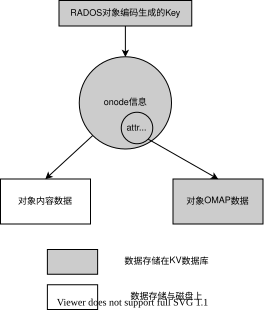

- `onode` 中存储对象的元数据信息：包括对象大小、数据磁盘块地址信息、扩展属性

  ```cpp
  # src/os/bluestore/BlueStore.h
  struct Onode {
      Collection *c;              // 对应的Collection，对应PG
      ghobject_t oid;             // Object id
      bluestore_onode_t onode;    // (元数据)Object存到kv DB的元数据信息
      ExtentMap extent_map;       // (数据)映射pextents到blobs
  };
  
  # src/os/bluestore/bluestore_types.h
  struct bluestore_onode_t {
    uint64_t nid = 0;                    ///< numeric id (locally unique)
    uint64_t size = 0;                   ///< 对象大小
    map<mempool::bluestore_cache_other::string, bufferptr> attrs;        ///< 扩展属性
  
    struct shard_info {
      uint32_t offset = 0;  ///< logical offset for start of shard
      uint32_t bytes = 0;   ///< encoded bytes
      DENC(shard_info, v, p) {
        denc_varint(v.offset, p);
        denc_varint(v.bytes, p);
      }
      void dump(Formatter *f) const;
    };
    vector<shard_info> extent_map_shards; ///< 数据磁盘块地址信息
  
    uint32_t expected_object_size = 0;
    uint32_t expected_write_size = 0;
    uint32_t alloc_hint_flags = 0;
  
    uint8_t flags = 0;
  ```

- BlueStore使用 `key` 访问 `onode` 中的信息 

  - `key` 的形成：使用纠删码标识需要、所属池ID二进制翻转后的对象名hash值、命名空间（普通对象一般为空）等信息编码为 `key` 

    ```cpp
    # src/os/
    /*
     * object name key structure
     *
     * encoded u8: shard + 2^7 (so that it sorts properly)
     * encoded u64: poolid + 2^63 (so that it sorts properly)
     * encoded u32: hash (bit reversed)
     *
     * escaped string: namespace
     *
     * escaped string: key or object name
     * 1 char: '<', '=', or '>'.  if =, then object key == object name, and
     *         we are done.  otherwise, we are followed by the object name.
     * escaped string: object name (unless '=' above)
     *
     * encoded u64: snap
     * encoded u64: generation
     * 'o'
     */
    ```

  - 通过 `key` 可以解码出对象的 `ghobject_t` 结构信息

#### 对象在BlueStore中的组织方式

对象在BLuyeStore中没有目录层级改变，所有对象平铺在BlueStore中，

`key` 中编码了对象名的 hash信息，所以同一个存储池内的所有对象，可以按 `key` 值进行排序

通过对象的hash信息可以计算出对象所属的 PG ，可以很方便地遍历同一PG内的所有对象

- 对象遍历用于数据恢复的BackFill操作、OSD启动检查等情形

## 5.2 BlueStore组件

> BlueStore承载的数据大体上分为数据和元数据两种
>
> - 元数据：对象的属性、扩展OMAP属性、日志数据、BlueStore的元数据
>
> 其中，元数据使用KV数据库——RocksDB存储，内容数据以DIO模式通过BlockDevice组件在用户态直接存储在硬盘上

查看BlueStore的关键组件

```cpp
class BlueStore : public ObjectStore, public md_config_obs_t {
	...
    // --------------------------------------------------------
  	// members
	private:
  		BlueFS *bluefs = nullptr;
  		unsigned bluefs_shared_bdev = 0;  ///< which bluefs bdev we are sharing
  		bool bluefs_single_shared_device = true;
  		utime_t bluefs_last_balance;
  		utime_t next_dump_on_bluefs_balance_failure;

  		KeyValueDB *db = nullptr;
  		BlockDevice *bdev = nullptr;
  		std::string freelist_type;
  		FreelistManager *fm = nullptr;
  		Allocator *alloc = nullptr;
    ...
    int BlueStore::_open_db(bool create){
        ...
        rocksdb::Env *a = new BlueRocksEnv(bluefs);
    	...
    }
}
```

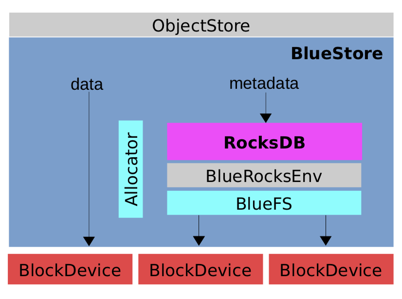

- Ceph为提高效率，为RocksDB设计了日志型文件系统BlueFS，支撑RocksDB数据库文件的管理功能，BlueFS通过BlockDevice以DIO模式访问磁盘

### 5.2.1 RocksDB——BlueStore的元数据的管理

RocksDB功能：

- **承载了BlueStore的所有元数据**，对BlueStore性能有关键影响
- **BlueStore事务特性的实现**构建在RocksDB基础上

> RocksDB基于LevelDB开发，兼容后者，是KV键值数据库

RocksDB是**键值数据库**，以 `key-value` 键值对的方式存储数据

- 每个key对应唯一的value
- 键值可以是任意字节流，但太大会影响性能
- 常见操作包括 `Get(key)` 、`put(key)` 、`delete(key)` 、`scan(key)` 

#### RocksDB的元数据组织方式

为提高元数据检索速度，BlueStore使用RocksDB的前缀模式

> 前缀模式：在 `key` 前假一个前缀，实现 `key` 的分类和快速定位
>
> BlueStore定义的前缀包括：
>
> ```cpp
> # src/os/bluestore/BlueStore.cc
> // kv store prefixes
> const string PREFIX_SUPER = "S";   // 表示超块信息的key field -> value
> const string PREFIX_STAT = "T";    // field -> value(int64 array)
> const string PREFIX_COLL = "C";    // collection name -> cnode_t
> const string PREFIX_OBJ = "O";     // 表示对象名的key object name -> onode_t
> const string PREFIX_OMAP = "M";    // 表示元数据OMAP的ket u64 + keyname -> value
> const string PREFIX_DEFERRED = "L";  // 表示延迟写日志的key  id -> deferred_transaction_t
> const string PREFIX_ALLOC = "B";   // 表示块分配的信息 u64 offset -> u64 length (freelist)
> const string PREFIX_SHARED_BLOB = "X"; // u64 offset -> shared_blob_t
> ```

#### RocksDB的写

> RocksDB采用 **预写日志** 的方式保存数据：先将数据存放在以 `.log` 为扩展名的日志文件中，后续再将数据行按格式写入以 `.sst` 为扩展名的数据文件。
>
> - 因此，日志文件的I/O速率对RocksDB的效能有直接影响，所以BlueStore为RocksDB配置专门的高速存储介质

RocksDB支持原子读和写，用于支持事务的ACID特性，元数据的写入也采用了原子写

写数据分三种模式：普通写，原子写和事务写

BlueStore在处理事务时使用了RocksDB的原子写

```cpp
void RocksDB_Transaction_demo(){
	DB *db;
    std::string DbPath = "/tmp/rocksdb";
    Options options;
    Status s = DB::Open(options, DbPath, &db);
    assert(s.ok());
    
    rocksdb::WriteBatch batch;	//定义批处理
    batch.Put("k1", "v1");	//向批处理中添加数据
    batch.Put("k2", "v2");	//向批处理中添加数据
    s = db->Write(rocksdb::WriteOptions, &batch);	//提交批处理任务
    
    assert(s.ok());
}
```

原子写批处理先将相关操作请求填入 RocksDB批处理变量，再提交批处理以向RocksDB进行原子写入，并根据返回的结果判断是否成功完成。

#### RocksDB的创建

由于RocksDB的运行数据与内容数据均以文件形式保存，所以RocksDB需要由文件系统支撑

```cpp
# src/os/bluestore/BlueStore.cc
int BlueStore::_open_db(bool create){
    // 获取kv的后端设备
    string kv_backend;
    if (create) {
        kv_backend = cct->_conf->bluestore_kvbackend;
    } else {
        r = read_meta("kv_backend", &kv_backend);
    }
    
    // mkfs也会调用这里，create时候根据配置做bluefs的创建
    if (create) {
        do_bluefs = cct->_conf->bluestore_bluefs;
    } else {
        string s;
        r = read_meta("bluefs", &s);
    }
    
    rocksdb::Env *env = NULL;
    // 创建bluefs
    if (do_bluefs) {
        bluefs = new BlueFS(cct);
        bfn = path + "/block.db";
        if (::stat(bfn.c_str(), &st) == 0) {
        	r = bluefs->add_block_device(BlueFS::BDEV_DB, bfn);
            ...
        }
        
        // shared device
        bfn = path + "/block";
        r = bluefs->add_block_device(bluefs_shared_bdev, bfn);
        ...
        
        bfn = path + "/block.wal";
        if (::stat(bfn.c_str(), &st) == 0) {
      		r = bluefs->add_block_device(BlueFS::BDEV_WAL, bfn);
            ...
        }
    }
    // 创建RocksDB
    db = KeyValueDB::create(cct,
			  kv_backend,
			  fn,
			  static_cast<void*>(env));
	...
}
```

#### RocksDB的文件

- 以 `.log` 、`.sst` 、`.dbtmp` 为扩展名的文件

  其中，log文件存放预写数据的日志，sst存放落盘的数据

- 以 `MANIFEST` 、`OPTIONS` 为前缀的文件

- 以 `CURRENT` 、`IDENTITY` 、`LOCK` 为名的文件

### 5.2.2 BlueFS

BlueStore为RocksDB定制的文件系统，提供其所需的文件数据存储、目录操作等基本功能，只实现了 `BlueRocksEnv` 需要的API接口

- RocksDB对文件写采用追加写方式，因此只需要BlueFS提供追加写并不需要随机写接口

BlueFS与BlueStore通过 `BlockDevice` 模块对硬盘进行操作

#### 特点

**日志型文件系统**

元数据操作以日志形式存入硬盘特定位置

磁盘空间信息、文件索引节点等文件系统元数据信息在启动时回放日志得到

**具有跨设备构建自身文件系统的能力**

BlueFS可单独构建在速度较快的SSD设备上

BlueFS仅用以支撑RocksDB，大多数情况BlueStore是不可见的，但当其磁盘空间不足时，可以向BlueStore借用部分存储空间。即使二者不在同一硬盘，BlueFS也可以跨设备借用（BlueFS的磁盘地址结构引入了设备标号，不同设备的磁盘块组成统一的逻辑地址空间）

- 在L版，BlueFS与BlueStore空间使用情况的检测是周期性的，后续版本中，实时监控二者空间的使用情况

#### 文件索引与磁盘地址结构

在BlueFS中，从文件索引可以直接磁盘寻址

```cpp
# src/os/bluestore/bluefs_types.h
struct bluefs_fnode_t {
  uint64_t ino;		//文件标识
  uint64_t size;	//文件大小
  utime_t mtime;	//文件修改时间 
  uint8_t prefer_bdev;	//文件优先使用的设备，WAL->DB->DATA
  mempool::bluefs::vector<bluefs_extent_t> extents;	//	磁盘地址集合
  uint64_t allocated;
}

class bluefs_extent_t {
public:
  uint8_t bdev;		//地址段所在的设备
  uint64_t offset = 0;	//设备上的物理地址
  uint32_t length = 0;	// 数据空间长度
}
```

- `bdev` 的取值：

  BLueStore整体上可以使用3块硬盘设备，超高速设备存储 RocksDB的 `.log` 文件，高速设备优先存储RocksDB的其他数据

  这些功能的实现与 bdev 字段相关

#### 基于日志的元数据管理

 BlueFS除文件内容数据写入磁盘，其他数据均以日志形式记录在专门的日志文件

- 文件目录结构、磁盘空间分配器等元数据在BlueFS启动时通过回放日志生成，并常驻内存

  - 磁盘空间分配管理：BlueFS使用多个模板向量记录空间列表、总空间大小、待释放空间等，使用Allocator管理磁盘空间的增加和移除。

    这些结构在BlueFS启动时，通过回放日志赋值，存放于内存不会落盘存储，且在运行过程中动态更新。

  - 目录与文件映射关系管理：使用 `dir_map` 和 `file_map` 两个内存表格管理文件与目录映射关系。通过这两个表格实现文件与目录创建和删除过程中的元数据管理

    dir_map 实现目录名与文件名及文件fnode的关系映射

    file_map 实现文件 `fnode.ino` 与 `fnode` 的关系映射

    这两个表格在BlueFS重放日志时构建，并常驻内存

##### superblock结构

> 超块是一个地址被硬编码的磁盘块，位于磁盘设备的第二个磁盘块（一般为第2个4KB空间，其实地址为4KB(0x1000)，长度为4KB）

BlueFS日志文件的头部存储在磁盘固定的超块(superblock)中，BlueFS启动时直接到固定位置读取日志文件的 `fnode` 结构，然后读取日志文件内容并进行回放

- 超块中保存了 **磁盘块大小** 、版本号、uuid、osduuid及 **日志文件的元数据**

  ```cpp
  # src/os/bluestore/bluefs_types.h
  struct bluefs_super_t {
    uuid_d uuid;      ///< unique to this bluefs instance
    uuid_d osd_uuid;  ///< matches the osd that owns us
    uint64_t version;
    uint32_t block_size;
  
    bluefs_fnode_t log_fnode;
  }
  ```

- 日志文件元数据保存信息：**存储日志文件内容的磁盘编号** 

  ```cpp
  struct bluefs_fnode_t {
      // 存储日志文件内容的磁盘
    	uint64_t ino;	//文件id
    	uint8_t prefer_bdev;
      // 日志文件内容所在磁盘地址信息
    	mempool::bluefs::vector<bluefs_extent_t> extents;
      uint64_t size;
    	utime_t mtime;
    	uint64_t allocated;
  }
  ```

**示例**

使用 `dd if=/dev/ceph-dbpool/osd0.db of=/home/test13 bs=8K count=1` 导出并查看前8K内容

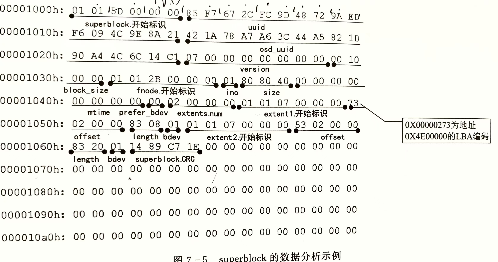

`log_fnode` 从 *0x1032* 开始，`log_fnode.extent` 中保存了日志文件的硬件地址信息

- `extent.offset` 在硬盘上小端存储，所以内容为 *0x00 00 02 73* ，又由于采用LBA编码，所以实际内容为 *0x4E 00 00 0*
- `extent.length` 也采用了类似的编码方式，实际内容为 *0x10 00 00*
- `extent.bdev` 表示设备编号

所以上述超块中，`extent1` 表明BlueFS日志文件的第一块存储空间位于第一块硬盘的 *0x4E 00 00 0* 地址处，空间大小为 *0x10 00 00*

##### 日志文件与操作日志

BlueFS将对文件与目录等元数据的操作记录在日志文件中，

实质上，将多条日志记录整合为事务，每个事务按“磁盘块大小对齐”的方式存放，BlueFS事务定义为

```cpp
# src/os/bluestore/bluefs_types.h
struct bluefs_transaction_t {
    uuid_d uuid;          ///< 与超块中的uuid对应
  	uint64_t seq;         ///< 事务序号
  	bufferlist op_bl;     ///< 事务内的操作，由操作码和操作参数组成
}
```

事务中的操作 `op_bl` 由操作码与操作参数组成，

| OP_NONE                            | 空操作                               |
| ---------------------------------- | ------------------------------------ |
| 操作名称                           | 含义                                 |
| OP_INIT                            | BlueFS初始化或日志文件整理压缩时使用 |
| OP_ALLOC_ADD(id, offset, length)   | 添加磁盘块extent给BlueFS             |
| OP_ALLOC_RM(id, offset, length)    | 从BlueFS中移除磁盘块extent           |
| OP_DIR_LINK(dirname,filename, ino) | 为文件分配目录                       |
| OP_DIR_UNLINK(dirname,filename)    | 将文件从目录中移除                   |
| OP_DIR_CREATE(dirname)             | 创建目录                             |
| OP_DIR_ REMOVE(dirname)            | 删除目录                             |
| OP_FILE_UPDATE(fnode)              | 更新文件的元数据fnode                |
| OP_FILE_REMOVE                     | 删除文件                             |
| OP_JUMP(next_seq, offset)          | 跳过事务编号或跳过磁盘块内的偏移     |
| OP_JUMP_SEQ(next_seq)              | 跳过事务编号，在重放日志时使用       |

##### 超块与BlueFS日志文件及事务内容的对应关系

超块中的 `log_fnode.extent` 记录了日志文件的磁盘地址，读取日志文件内容，事务落盘结构除 `op_bl` 外，还需要额外的辅助信息

- uuid必须与超块的uuid一致
- 在BlueFS挂载时，使用CRC校验码对本事务的数据进行校验
- op_bl中的操作码与操作参数按序排列，操作参数原文存储，不经过编码

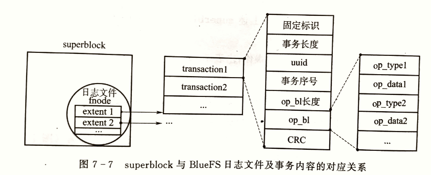

随运行时间增长，BlueFS的日志内容会持续增加，其所占用磁盘空间也会越来越大，因此，BlueFS实现了日志压缩功能

### 5.2.3 BlueStore对磁盘空间的管理

BlueStore将硬盘分为三类，分别是超高速设备（WAL空间）、高速设备（DB空间）和慢速设备（DATA空间）

- 超高速设备优先存储RocksDB的 `.log` 文件
- 高速设备存储RocksDB承载的数据，即BlueStore的元数据
- 慢速设备存储对象的内容数据

#### 与BlueFS关系

存储对象元数据及RocksDB的 *.log* 文件由BlueFS管理，存储对象内容数据的空间由BlueStore直接管理

BLueFS可用的空间不足时，由于其具有 **跨设备构建文件系统** 的特点，可以向BlueStore借用一部分空间，当BlueFS空间占用率下降后，归还借用的空间

#### BlueStore磁盘空间的地址结构

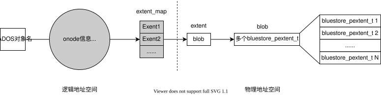

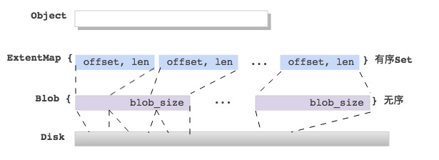

BlueStore使用 `bluestore_pextent_t` 描述磁盘地址，

```cpp
# src/os/bluestore/blue_types.h
/// pextent: physical extent
struct bluestore_pextent_t : public bluestore_interval_t<uint64_t, uint32_t> {
	OFFS_TYPE offset = 0;	//硬盘上的物理偏移量，要块大小对齐
    LEN_TYPE length = 0;	//数据长度
}
```

- BlueStore的数据读写需要一段连续的硬盘空间， `bluestore_pextent.offset` 作为这段空间的起始地址，`bluestore_pextent.length` 为这段空间的长度

为实现数据校验、数据压缩等功能，将多个 `bluestore_pextent_t` 组合为数据结构 `blob` ，并在 `blob` 中添加了数据压缩标志、数据校验位

- Blob里的pextent个数最多为：max_blob_size / min_alloc_size；
- 多个pextent映射的Blob offset可能不连续，中间有空洞；

```cpp
#src/os/bluestore
typedef mempool::bluestore_cache_other::vector<bluestore_pextent_t> PExtentVector;

/// blob: a piece of data on disk
struct bluestore_blob_t {
private:
    //向量容器将多个bluestore_pextent_t组合为blob
  	PExtentVector extents;              ///< 磁盘上的一组数据段
    uint32_t logical_length = 0;    // blob的原始数据长度
    bufferptr csum_data;                ///数据校验基于blob实现，存放于RocksDB数据库中
}
    
struct Blob {
    private:
    int16_t id = -1;
    SharedBlobRef shared_blob;      // 共享的blob状态
    mutable bluestore_blob_t blob;  ///< decoded blob metadata
}
typedef boost::intrusive_ptr<Blob> BlobRef;
```

`bluestore_pextent_t` 和 `blob` 都可用于描述磁盘上的物理数据块

一个 `extent` 结构关联一个 `blob` 结构，用于将对象内部的逻辑空间与物理数据块关联起来

在 `extent` 结构内增加了对象内部的逻辑地址字段

```cpp
# src/os/bluestore/BlueStore.h
struct Extent : public ExtentBase {
    MEMPOOL_CLASS_HELPERS();
    uint32_t logical_offset = 0;      ///逻辑地址，对象内的逻辑起始地址
    ///当逻辑地址非块大小对齐时，用于定位数据在blob内的偏移
    uint32_t blob_offset = 0;         
    uint32_t length = 0;              ///< length
    //blob的引用指针，一个extent关联一个blob
    BlobRef  blob;
}

typedef boost::intrusive::set<Extent> extent_map_t;
```

如果对象较大，需要多个 `extent` 组合成 `extent_map` ，保存在KB数据库中

```cpp
# src/os/bluestore/BlueStore.h
struct ExtentMap {
    Onode *onode;                   // 指向Onode指针
    extent_map_t extent_map;        // Extents到Blobs的map
    blob_map_t spanning_blob_map;   // 跨越shards的blobs
 	
    # ExtentMap还提供了分片功能,防止在文件碎片化严重，会随着写入数据的变化而变化；连续小段会合并为大；
    struct Shard {
        bluestore_onode_t::shard_info *shard_info = nullptr;
        unsigned extents = 0;  ///< count extents in this shard
        bool loaded = false;   ///< true if shard is loaded
        bool dirty = false;    ///< true if shard is dirty and needs reencoding
    };
     mempool::bluestore_cache_other::vector<Shard> shards;    ///< shards
};
```

BlueStore对 `extent_map` 编码后，将其分片保存在KV数据库中，访问这些信息的 `key` 值是 `extent_map_shards` 

`extent_map_shards` 直接存储在对象的 `onode` 中

因此，通过 `extent_map_shards` 到RocksDB数据库中检索需要的 `extent_map` 具体分片，然后再依次向下查找 `extent` 、`blob` 、`bluestore_pextent_t` ，并从 `bluestore_pextent_t` 中找到最终的物理硬盘地址

#### 磁盘空间的缓存

> 由于BlueStore使用DIO模式进行硬盘数据读写，不经过操作系统内核缓存，所以对于读数据，也不能使用内核态的缓存

BlueStore在用户态实现了缓存功能，主要用于读缓存，缓存对象是 `onode` 

在BlueStore读取数据时，程序先到缓存空间中查找数据，若没有命中，再到数据库或硬盘中读取数据

写操作不适用缓存

#### 硬盘空间分配器

BLueStore使用 **Allocator** 管理已分配磁盘空间的管理，使用 **FreelistManager** 进行未分配的空闲空间管理

BlueStore的blob分配器，支持如下几种：

- BitmapAllocator
- StupidAllocator
- ...

默认使用的 FreelistManager 是：BitmapFreelistManager

```cpp
int BlueStore::_open_fm(bool create){
    fm = FreelistManager::create(cct, freelist_type, db, PREFIX_ALLOC);
    int r = fm->init(bdev->get_size());
}
```

### 5.2.4 BlockDevice——BlueStore的数据I/O方式

BlueStore将内容数据直接存储在磁盘块，即 **BlueStore直接管理硬盘裸设备** 

在 `_open_dev` 中完成初始化

```cpp
int BlueStore::_open_bdev(bool create){
    string p = path + "/block";
    bdev = BlockDevice::create(cct, p, aio_cb, static_cast<void*>(this));
    int r = bdev->open(p);
     
    if (bdev->supported_bdev_label()) {
        r = _check_or_set_bdev_label(p, bdev->get_size(), "main", create);
    }
     
    // initialize global block parameters
    block_size = bdev->get_block_size();
    block_mask = ~(block_size - 1);
    block_size_order = ctz(block_size);
     
    r = _set_cache_sizes();
    return 0;
}
```

支持三种类型的设备

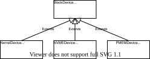

- KernelDevice：SATA、SCSI、LVM等大多数设备

  通过Direct I/O 与异步 I/O 配合的方式操作这类设备

- NVMEDevice：以PCIe为物理接口，以NVMe为上层协议的快速固态硬盘

  通过SPDK用户态驱动操作这类设备

- PMEMDevice

其中前两种目前最常用

#### Direct I/O和 异步I/O控制KernelDevice类型的硬盘设备

##### Direct I/O

Linux操作系统为文件系统对硬盘设备的读写提供了两种接口：

- Buffered I/O

  在数据读写时，先将数据缓存在内核Cache中，然后将数据从内核空间复制到用户态的应用程序进程空间

  - 广泛应用于普通文件系统，由于FileStore基于文件系统构建，所以也用到了这种方式

- Direct I/O

  直接进行磁盘数据读写，中间不经过内核缓存

BlueStore使用Direct I/O，将数据在硬盘与BlueStore所在的OSD进程空间中直接传输，避免了内核缓存

- BlueStore中的缓存由自身在用户态实现，减少IO路径，降低CPU开销

**实现** ：Linux采用一切皆文件，所以通过文件打开函数 `open()` 以 Direct I/O打开设备

```cpp
# src/os/bluestore/KernelDevice.cc
int KernelDevice::open(const string& p){
  path = p;
  int r = 0;
  dout(1) << __func__ << " path " << path << dendl;
	//::全局作用域运算符，表示全局命名空间中的 open 函数
  fd_direct = ::open(path.c_str(), O_RDWR | O_DIRECT | O_CLOEXEC);
	...
  //作为对比，buffered I/O不需要指定标志位
  fd_buffered = ::open(path.c_str(), O_RDWR | O_CLOEXEC);
}
```

**对数据块的要求**

采用 Direct I/O 时，读写数据的长度和偏移需要和设备的逻辑块大小对齐，一般为 4KB。

对于超过逻辑块大小的数据，将数据分为首、尾和中间部分。中间部分严格的块对齐，非块大小对齐的首、尾部分进行特殊处理

##### 异步I/O

**同步I/O 与异步I/O的区别**

- 同步 I/O 在写入数据时，需要数据写入硬盘或内核缓存后才返回

- 异步I/O在提交写请求的同时，提供本次操作的上下文。提交写请求后立即返回，然后监视写操作完成时间，收到写完成事件后，根据操作的上下文识别对应的写操作，然后调用相应的回调函数，确认写操作完成

  对于监视任务，BlueStore采用一个专门的线程轮询查询事件的状态

**BlueStore采用异步I/O**

由于磁盘与应用程序进程空间的数据传输不经过内核缓存，所以数据量一般比较大，采用同步 I/O 模型易造成程序阻塞，BlueStore将 Direct I/O与操作系统的异步I/O一起使用

> BlueStore使用操作系统提供的 `libaio` 库发起异步 I/O 请求
>
> - `libaio` 依赖于 Linux 内核的异步 I/O 支持。内核提供了系统调用接口（如 `io_setup`、`io_submit`、`io_getevents` 和 `io_destroy`），这些接口由内核实现，并被 `libaio` 调用，实现了异步 I/O 操作。
>
> - libaio提供的五个主要API
>
>   ```cpp
>   #include <libaio.h>
>           
>   int io_setup(int max_events, io_context_t *ctxp); //创建异步I/O上下文
>   int io_destroy(io_context_t ctx);			//摧毁异步I/O上下文
>   void aio_submit(io_context_t ctx, long nr, )	//提交异步I/O请求
>   int io_cancel(io_context_t ctx, struct iocb *iocb, struct io_event *result);							//取消异步I/O
>   int io_getevents(io_context_t ctx_id, long min_nr, long nr, struct io_event *events, struct timespec *timeout);	//获取已完成的I/O事件
>   ```

##### Direct I/O配合异步I/O示例

```cpp
#include <libaio.h>
#include <fcntl.h>
#include <unistd.h>
#include <sys/stat.h>
#include <sys/time.h>
#include <iostream>
#include <vector>

#define FILENAME "./direct.txt"
#define BUFFER_SIZE 4096
#define NR_EVENTS 10

int main() {
    // 打开文件，使用 O_DIRECT 和 O_SYNC 标志
    int fd = open(FILENAME, O_CREAT | O_RDWR | O_DIRECT | O_SYNC, S_IRUSR | S_IWUSR);
    if (fd < 0) {
        perror("open");
        return 1;
    }

    // 初始化 I/O 上下文
    io_context_t ctx;	//声明异步I/O上下文变量
    memset(&ctx, 0, size(ctx));	//为变量分配内存
    if (io_setup(NR_EVENTS, &ctx) < 0) {
        perror("io_setup");
        close(fd);
        return 1;
    }
    
    //分配对其的缓冲区
    char * buf;
    if (posix_memalign((void **)&buf, sysconf(_SC_PAGESIZE), BUFFER_SIZE) != 0) {
        perror("posix_memalign");
        io_destroy(ctx);
        close(fd);
        return 1;
    }
    strcpy(buf, "hello");

    // 准备 I/O 控制块
    struct iocb *iocbpp = (strcut iocb *)malloc(sizeof(struct iocb));
    memset(iocbpp, 0, sizeof(struct iocb));
    iocbpp[0].data = buf;
    iocbpp[0].aio_lio_opcopde = IO_CMD_PWRITE;
    iocbpp[0].aio_reqprio = 0;
    iocbpp[0].aio_fildes = fd;
    iocbpp[0].u.c.buf = bnuf;
    iocbpp[0].u.c.nbytes = page_size;	// strlen(buf) 必须按512B对其
    iocbpp[0].u.c.offset = 0;
    
    // 提交异步操作，异步写磁盘
    if (io_submit(ctx, 1, iocbs) < 0) {
        perror("io_submit");
        free(buffer);
        io_destroy(ctx);
        close(fd);
        return 1;
    }
	
    struct io_event events[NR_EVENTS];
    // 获取写操作结果
    if (io_getevents(ctx, 1, 1, events, NULL) < 0) {
        perror("io_getevents");
        free(buffer);
        io_destroy(ctx);
        close(fd);
        return 1;
    }

    // 检查写操作结果
    if (events[0].res != BUFFER_SIZE) {
        std::cerr << "Write error: " << events[0].res << std::endl;
        free(buffer);
        io_destroy(ctx);
        close(fd);
        return 1;
    }

    // 清理资源
    free(buffer);
    io_destroy(ctx);
    close(fd);

    return 0;
}
```

#### 通过SPDK支持NVMEDevice

### 5.2.5 BlueStore的mount过程

在BlueStore的 mount过程中，会调用各个函数来初始化其使用的各个组件，顺序如下：

```cpp
int BlueStore::_mount(bool kv_only) //指示是否只挂载键值存储还是整个存储
{	
    //读取元数据中的 type 字段来验证存储类型是否为 bluestore
    int r = read_meta("type", &type);
    if (type != "bluestore") {
        return -EIO;
    }
    //文件系统检查：如果配置了 bluestore_fsck_on_mount，则执行文件系统的检查。如果检查发现错误，则返回 -EIO。
    if (cct->_conf->bluestore_fsck_on_mount) {
        ...
    }
    //打开路径：调用 _open_path() 来准备或打开存储路径。如果失败，则返回错误。
    int r = _open_path();
    //打开文件系统 ID (fsid)：打开 fsid，并在成功后读取 fsid。
    r = _open_fsid(false);
    r = _read_fsid(&fsid);
    //锁定 fsid：使用 _lock_fsid() 函数锁定 fsid
    r = _lock_fsid();
    //通过 _open_bdev() 函数打开块设备。
    r = _open_bdev(false);
    //通过 _open_db() 函数打开数据库。
    r = _open_db(false);
 	//如果仅挂载键值存储，则结束
    if (kv_only)
        return 0;
 	//打开超级块元数据：通过 _open_super_meta() 函数打开超级块元数据。
    r = _open_super_meta();
    //打开文件映射 (File Mapping)：通过 _open_fm() 函数打开文件映射。
    r = _open_fm(false);
    //打开分配器：通过 _open_alloc() 函数打开分配器。
    r = _open_alloc();
    //打开集合：通过 _open_collections() 函数打开集合
    r = _open_collections();
    //重载日志：通过 _reload_logger() 函数重载日志系统。
    r = _reload_logger();
 	// 如果 bluefs 存在，则调用 _reconcile_bluefs_freespace() 协调 BlueFS 的空闲空间。
    if (bluefs) {
        r = _reconcile_bluefs_freespace();
    }
 	//启动键值系统：通过 _kv_start() 启动键值系统。
    _kv_start();
    // 延迟重播：通过 _deferred_replay() 执行延迟重播。
    r = _deferred_replay();
    //初始化内存池线程：初始化内存池线程。
    mempool_thread.init();
    //挂载成功：如果所有步骤都成功完成，则设置 mounted 标志为 true 并返回成功。
    mounted = true;
    return 0;
}
```

## 5.3 事务在BlueStore中的实现

### 5.3.1 BlueStore写数据流程

BlueStore里的写数据入口是`BlueStore::_do_write()`，它会根据 `min_alloc_size ` 来切分 [offset, length] 的写，然后分别依据 small write 和 big write 来处理，如下：

```cpp
// 按照min_alloc_size大小切分，把写数据映射到不同的块上
          [offset, length]
          |==p1==|=======p2=======|=p3=|
|----------------|----------------|----------------|
| min_alloc_size | min_alloc_size | min_alloc_size |
|----------------|----------------|----------------|
small write: p1, p3
big   write: p2
 
 
BlueStore::_do_write()
|-- BlueStore::_do_write_data()
|   // 依据`min_alloc_size`把写切分为`small/big`写
|   | -- BlueStore::_do_write_small()
|   |    | -- BlueStore::ExtentMap::seek_lextent()
|   |    | -- BlueStore::Blob::can_reuse_blob()
|   |         reuse blob? or new blob?
|   |    | -- insert to struct WriteContext {};
|   | -- BlueStore::_do_write_big()
|   |    | -- BlueStore::ExtentMap::punch_hole()
|   |    | -- BlueStore::Blob::can_reuse_blob()
|   |         reuse blob? or new blob?
|   |    | -- insert to struct WriteContext {};
|-- BlueStore::_do_alloc_write()
|   | -- StupidAllocator::allocate()
|   | -- BlueStore::ExtentMap::set_lextent()
|   | -- BlueStore::_buffer_cache_write()
|-- BlueStore::_wctx_finish()
```

小写先写到RocksDB，大写直接落盘

### 5.3.2 BlueStore事务

OSD的写操作需要封装进写事务，同样需要满足ACID原则

- 原子性：一个事务内封装了多个操作，事务完成意味着这些操作全部完成后，才通过回调函数通知客户端，不会只完成事务内的一部分操作

- 一致性：在一个事务执行前，系统处于一个一致性状态，事务执行后，系统处于另一个一致性状态

- 隔离性：多个事务并存时，一个事务的执行不受另一个事务的干扰（BlueStore通过全局事务队列实现）

- 持久性：一个事务执行完成后，该事务对相关数据的影响就会持久存在

  如：BlueStore的延迟写，数据写入RocksDB后就报告事务完成，然后才择机落盘。落盘前出现故障可以通过回放RocksDB中的日志恢复数据，提高了效率，也保证了事务的持久性

**一个普通的写事务会被分解为多个执行单元，每个执行单元可能有多项数据**

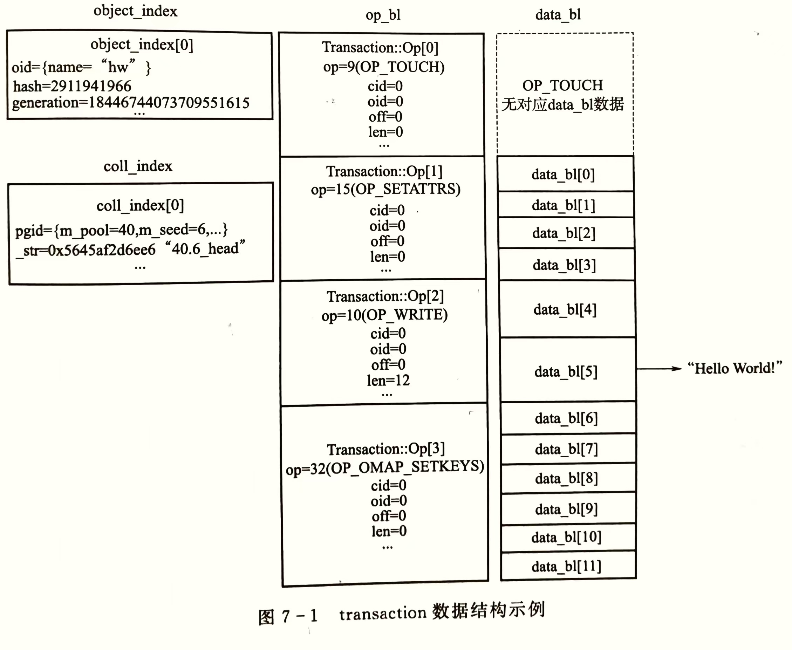

以 `{"hw":"Hello World!"}` 的RADOS对象写为例，接口 `libRADOS::rados_write()` 生成的 `transaction` 实例如上图

- `op_bl` ：列出写事务中包含的事务执行单元，分别为 `TOUCH` 、 `SETATTRS`、`WRITE` 、`SETKEYS` 

  每个事务执行单元操作的对象通过 `oid` 在 `object_index` 表中检索，本例中全部为 `oid=0`

- 每个执行单元的数据通过序列化操作一次存入 `data_bl` 中

  `TOUCH` 事务执行单元没有数据

  `SETATTRS` 事务执行单元有4条数据

  `WRITE` 事务执行单元有2条数据

  `SETKEYS` 事务执行单元有6条数据

### 5.3.3 事务处理的基本流程

BlueStore通过统一的 `queue_transactions`  接口收到事务后，首先进行本地寻址，然后处理事务执行单元的写操作，最后进行元数据的写入，执行回调函数

#### 事务的过程控制

> 写操作在完成本地寻址后立即进行提交，因此，需要控制的主要是元数据的写入顺序

BlueStore采用 **状态机+队列** 的机制进行事务的过程控制

事务队列采用FIFO方式控制执行顺序，状态机控制着事务完成一个状态才可以进入下一个状态，事务内各执行单元被多个线程调度并执行

##### 状态机

将状态的定义值依转换顺序增加，一方面便于编码实现在队列中判断事务的状态；另一方面确保事务的执行的顺序

按照一个事务执行的顺序，先定义数据异步写操作的状态，然后定义KV元数据写操作的状态，再后针对延迟写进行状态定义，最后是事务完成的最终状态

- 某些状态可以跳过，但一个事务的状态转换不可逆向

| 状态                   | 取值 | 含义                                       |
| ---------------------- | ---- | ------------------------------------------ |
| STATE_PREPARE          | 0    | 初始状态，每个事务进入主控队列后处于此状态 |
| STATE_AIO_WAIT         | 1    | 异步I/O写操作请求提交后，事务处于的状态    |
| STATE_IO_DONE          | 2    | 异步I/O写操作执行完毕后，事务处于的状态    |
| STATE_KV_QUEUED        | 3    | KV元数据写操作进人队列后的状态             |
| STATE_KV_SUBMITTED     | 4    | KV元数据写请求提交后的状态                 |
| STATE_KV_DONE          | 5    | KV元数据完成后的状态                       |
| STATE_DEFERRED_QUEUED  | 6    | 延迟写进入队列后的状态                     |
| STATE_DEFERRED_CLEANUP | 7    | 延迟写清理完对应KV日志后的状态             |
| STATE_DEFERRED_DONE    | 8    | 延迟写完成的状态                           |
| STATE_FINISHING        | 9    | 事务执行后处理清理操作的状态               |
| STATE_DONE             | 10   | 事务完成                                   |

##### 队列

事务执行顺序控制器：控制事务在BlueStore中的全生命周期——`OpSequencer` 定义的两个队列

控制元数据写入的多个KV元数据处理队列

**OpSequencer**

```cpp
# src/os/bluestore/BlueStore.h
class OpSequencer : public Sequencer_impl {
    public:
    typedef boost::intrusive::list<
        TransContext,
    	boost::intrusive::member_hook<
        	TransContext,
			boost::intrusive::list_member_hook<>,
			&TransContext::sequencer_item> 
        > q_list_t;
    q_list_t q;  ///主控队列，控制事务的全生命周期
    boost::intrusive::list_member_hook<> deferred_osr_queue_item;	//延迟写操作队列
}
```

每个PG一个 `OpSequencer` 控制器，控制着PG内所有事物的执行顺序

其作用原理：当队列中事务的关键状态发生变化时，**检查队列前面的其他事务的状态是否处于该事务的状态之后**，是则继续执行，进行下一步状态转换；否则等不执行状态转换，等待后续处理机会

效果：**q队列中，排在前面的事务执行状态不慢于当前状态，后面的事务才有进入当前状态的下一状态的可能** 

##### 控制事务执行的示例代码

```cpp
# src/os/bluestore/BlueStore.cc
void BlueStore::_txc_finish_io(TransContext *txc){
    OpSequencer *osr = txc->osr.get();
    txc->state = TransContext::STATE_IO_DONE;	//设定txc事务当前状态
    OpSequencer::q_list_t::iterator p = osr->q.iterator_to(*txc);
    
    while (p != osr->q.begin()) {//从当前事务开始，向q队列的前部遍历
    	--p;
        
    	if (p->state < TransContext::STATE_IO_DONE) {//若有事务慢于STATE_IO_DONE，
            //说明队列中，有事务还不具备进入状态转换的条件，等待后续调度
     		 dout(20) << __func__ << " " << txc << " blocked by " << &*p << " "
	       		<< p->get_state_name() << dendl;
      		return;	//直接结束，不送入状态机转换状态
    	}
        if (p->state > TransContext::STATE_IO_DONE) {//检查队列前的其他事务状态是否快于当前事务状态
            //若找到，说明当前事务之前的所有事务状态都不慢于此状态，队列中只有该事务后续的状态可能等于当前状态
      		++p;
      		break;
    	}
  	}
  	do {
    	_txc_state_proc(&*p++);
        //所有处于 STATE_IO_DONE状态的事务依次送入状态转换机转换到下一状态
  	} while (p != osr->q.end() && p->state == TransContext::STATE_IO_DONE);
}
```

`TransContext` 在 `ObjectStore::Transaction` 基础上，又封装了RADOS对象的onode、延迟写队列等信息

#### 写操作事务的处理流程

##### 写类型

分为普通写和延迟写两类，

- 待写入数据的长度小于一个磁盘块的写操作，将内容数据的写操作与元数据写操作一起封装为一个**延迟写**事务，预写入RocksDB内，然后就向上层应用反馈成功写入，后续择机将内容数据落盘

- 待写入数据的长度超过磁盘块的大写操作，将整块的部分按**普通写**方式落盘，然后执行后续操作；不足整块部分，按延迟写处理

##### 实例

（TransContext），创建之始事务状态为 `STATE_PREPARE` 。内容数据 `"hello world\0"` 共12B，所以采用延迟写事务类型进行处理。事务处理过程中，先写入元数据，再将内容数据也以元数据的形式写入RocksDB，然后择机将实际内容数据落盘。

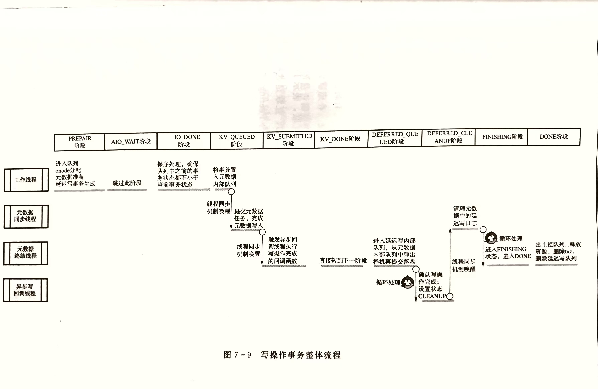

###### PREPARE

写操作事务通过统一的 `queue_transaction` 传入BlueStore后，

- TransContext对象内的相关结构以C++容器存储，支持将多个上层事务转换为一个TransContext对象

**1. 创建事务本地化对象 `TransContext`**

首先进行`txc` **事务本地化对象的创建**，自写操作事务对象 `txc` 诞生后，事务首先进入 *OpSequencer* 控制器队列

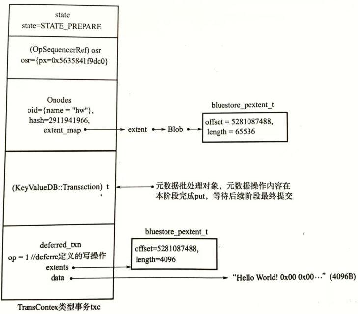

**2. 分配元数据写入位置的磁盘空间**

- 对 **创建`hw`对象的元数据onode**，并从磁盘分配器 *Allocator* 中 **分配磁盘空间** 

**3. 将写操作转换为元数据操作**

- 采用RocksDB的**原子写**批处理方式，将OMAP等元数据的写操作内容利用数据库的批处理对象 `(KeyValueDB:Transaction) t` 进行 `put()` 操作，等待下一步阶段提交

  `db->write()`

- 写操作转换为元数据操作：以L为前缀，以序列号 `deffered_txn->seq` 为key，value为 data、extents等的序列化编码

**4. 构建延迟写事务** 

- 由于 `hw` 对象长度不足块大小，所以为延迟写模式，**构建延迟写事务** ，并存入 `txc` 事务的 `deffered_txn` 列表内

- 延迟写事务记录待写入的数据 `data` 和写入位置 `extents` ，由于内容数据需要块对齐，所以填充为4KB

**5. 将事务提交至状态转换机**

- `BlueStore::_txc_state_proc` ，事务进入下一状态 `STATE_IO_DONE`

###### IO_DONE

**进行事务队列的保序处理，确保序队列前面事务的状态都不小于 STATE_IO_DONE**

当前事务开始，沿队列向前依次查看每个事务的状态，如果发现有的事务状态小于 STATE_IO_DONE，说明本例事务处理太快，停止本例事务，将其留在队列，等待下次遍历队列再行处理

当满足条件后，调用状态机处理函数 `BlueStore::_txc_state_proc` ，事务进入 `STATE_KV_QUEUED` 

###### KV_QUEUED

**提交元数据RocksDB的批处理任务与元数据落盘**

先将事务置入 kvqueue相关内部处理队列，然后通知独立的元数据同步线程 `kv_sync_thread` 进行处理（线程切换）

元数据同步线程根据 kvqueue 内部队列依次执行 `db->Write()` 函数提交原子批处理任务，实现元数据落盘

```cpp
# src/os/bluestore/Bluestore.cc
void BlueStore::_kv_sync_thread(){
    ...
    int r = cct->_conf->bluestore_debug_omit_kv_commit ? 0 : db->submit_transaction(txc->t);
    assert(r == 0);
    _txc_applied_kv(txc);
    ...
}

# src/kv/RocksDBStore.cc
# 调用原子批处理任务处理函数Write提交任务
int RocksDBStore::submit_transaction(KeyValueDB::Transaction t){
    rocksdb::Status s = db->Write(woptions, &_t->bat);
}
```

- 此时，元数据已写入数据库，延迟写的内容数据在预写入数据库，后续还需正式落盘存储

后续进行缓存清理工作（flush），进一步确保元数据落盘。

最后，在元数据同步线程内设置事务状态为 `STATE_KV_SUBMITTED`

###### KV_SUBMITTED

**通知上层完成写操作，deffered操作进入单独的队列**

由独立的元数据终结线程 `kv_finalize_thread` 执行

元数据终结线程依据 kvqueue 相关内部队列，接受线程同步机制条件变量的**唤醒**

唤醒后，将待执行的、通知客户端完成写操作的**回调函数** 置入回调函数调用队列

触发专门的异步回调线程执行执行回调函数

> 此时，内容数据以元数据的形式存入数据库，即使后续步骤出现问题，也可以通过回放日志的方式使数据真正落盘，因此，可以安全的通知上层完成写操作

完成上述工作后，元数据终结线程将事务设置为 KV_DONE 状态

###### KV_DONE

数据已经预写入 直接将事务置为 DEFFERED_QUEUE状态

###### DEFFERED_QUEUE

**将事务置入延迟写内部队列，择机落盘**

先将写事务置入 deffere 内部队列，然后将事务从 kvqueue 内部队列中弹出

根据 defequeue 队列中的排队情况等相关因素，选择是否立即进入下一状态

如果defequeue队列中事务较少，则本例事务在 defequeue中等待较长时间

- `bluestore_deffered_batch_ops` 影响事务批提交数量

条件满足后，元数据终结线程调用 `BlueStore::_deffered_submit_unlock()` 函数。在该函数中，执行 `libaio` 的异步写接口 `aio_submit()` ，向硬盘设备提交写请求

```cpp
# src/os/bluestore/Bluestore.cc
void BlueStore::_deferred_submit_unlock(OpSequencer *osr){
    ......
    deferred_lock.unlock();
  	bdev->aio_submit(&b->ioc);
}
```

写操作完成状态确认工作，由异步写回调线程 `aio_thread` 调用libaio的接口函数 `io_getevents()` ，循环检测写操作完成状态。检测到写操作完成后，将事务设置为 DEFFERED_CLEANUP 状态

```cpp
# src/os/bluestore/aio.cc
int aio_queue_t::get_next_completed(int timeout_ms, aio_t **paio, int max){
    ...
    int r = 0;
    do {
    	r = io_getevents(ctx, 1, max, event, &t);
  	} while (r == -EINTR);
    ...
}
```

###### DEFFERED_CLEANUP

清理kv中的deffered日志

异步写回调线程 `aio_thread` 通过线程同步机制唤醒元数据同步线程 `kv_sync_thread` 继续执行

因为数据已写入硬盘并收到确认，所以需要清理RocksDB数据中的延迟写日志，避免重复回放

###### STATE_FINISHING

转到元数据终结线程 `kv_finalize_thread` 处理，处理空间共享、管理PG等放置冲突的任务

将事务置入下一状态

###### STATE_DONE

择机将事务移出操作控制器 `OpSequencer` 主控队列、释放所占用的资源、删除txc、删除延迟写队列等

####  写结果

通过开启Ceph bluestore debug来抓取其写过程中对数据的映射，具体步骤如下。

```shell
# 1. 创建一个文件
touch tstfile
 
# 2. 查看该文件的inode numer
ls -i
2199023255554 tstfile

# 3. 获取该文件的映射信息
# 上述inode number转换为16进制：20000000002
# 查看文件的第一个默认4M Object的映射信息
ceph osd map cephfs_data_ssd 20000000002.00000000
osdmap e2649 pool 'cephfs_data_ssd' (3) object '20000000002.00000000' -> pg 3.3ff3fe94 (3.94) -> up ([12,0], p12) acting ([12,0], p12)
# osdmap epoch数 存储池 对象id -> pg id -> osd id


# 4. 在osd 12上开启bluestroe debug信息
ceph daemon /var/run/ceph/ceph-osd.12.asok config set debug_bluestore "30"  # 开启debug
ceph daemon /var/run/ceph/ceph-osd.12.asok config set debug_bluestore "1/5" # 恢复默认
 
 
# 5. 对测试文件的前4M内进行dd操作，收集log
dd if=/dev/zero of=tstfile bs=4k count=1 oflag=direct
grep -v "trim shard target" /var/log/ceph/ceph-osd.12.log | grep -v "collection_list" > bluestore-write-0-4k.log
```

通过上述方式可以搜集到Bluestore在写入数据时，object的数据分配和映射过程，可以帮助理解其实现。

###### BlueStore dd write各种case

为了更好的理解BlueStore里一个write的过程，我们通过`dd`命令写一个Object，然后抓取log后分析不同情况下的Object数据块映射情况，最后结果如下图所示：

> 注释：上图的数据块映射关系是通过抓取log后获取的。

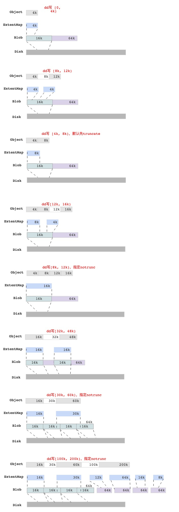

最后一图中，写[100k, 200)的区域，查看Object对应的ExtentMap并不是与 min_alloc_size（16k）对齐的，只是保证是block_size（4k）对齐而已。


