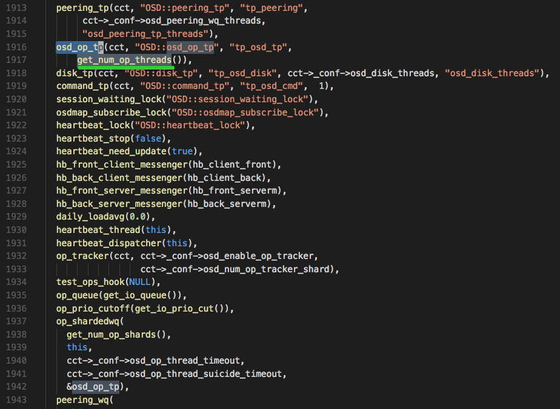
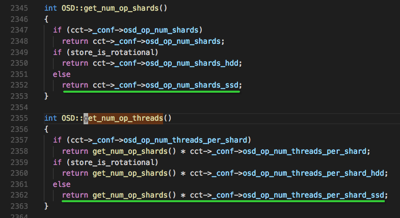
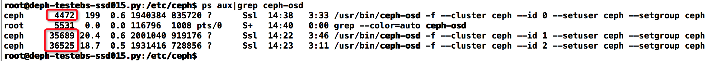
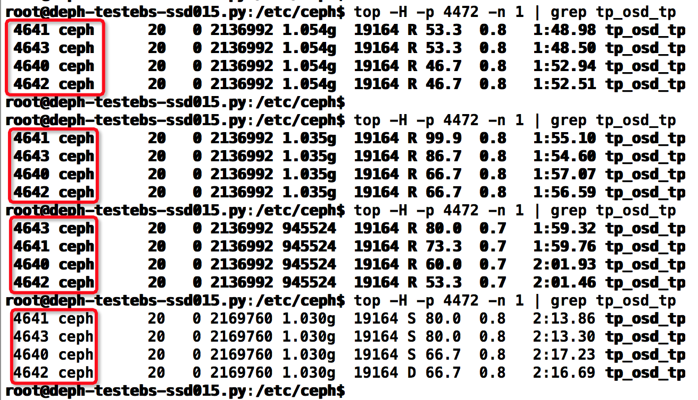
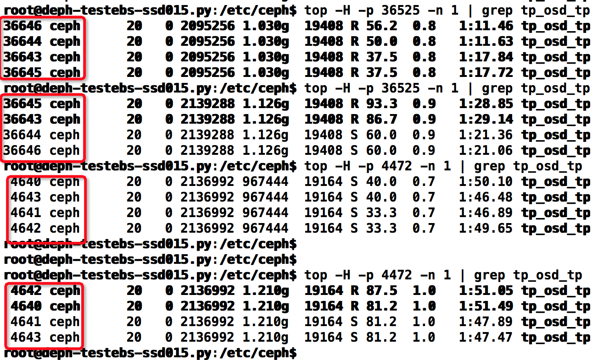

> 提取Ceph O版的所有参数分析

<!--more-->

https://blog.csdn.net/qq_67736058/article/details/137922219

结合 `src/common/legacy_config_opts.h` 再查看

Ceph 参数配置分为运行时生效与启动时生效的参数，
对于运行时生效的参数，在 ceph 创建后一直保存在进程中，只有相关事件才会触发对这些参数的访问，因此只要修改进程所链接的文件，就可认为这些参数的修改已实时生效
对于启动时生效的函数，只有在 ceph 进程创建时才会起作用，如：只有在创建 osd 进程时，才会通过 `osd_op_num_shards *osd_op_num_threads_per_shard` 计算线程数并向操作系统申请。在 OSD 进程创建之后，即使调整这些参数也不会生效，所以这才是一些参数重启才会生效的真正原因。

## 参数查看

### 提取所有参数

```shell
touch O_conf.txt # 创建保存参数的文件

# 获取所有的参数名
ceph config ls > ceph_config.txt

ceph config help 

# 获取各进程中参数的默认值，导出为'NAME=VALUE'格式
ceph config show-with-defaults mon.node1 | awk '{print $1,"=", $2}' > knobs_with_default.txt 
#分别在 mon,mgr,osd节点上，通过运行中的进程默认knobs值
ceph daemon mon.node1 config show > mon_default_knobs_value.txt
ceph daemon mgr.node2 config show > mgr_default_knobs_value.txt
ceph daemon osd.0 config show > osd_default_knobs_value.txt
三个角色的节点导出配置相同，导出为json格式
```

#### 查看指定参数的值

```shell
# 获取参数默认值
ceph config get mgr.node2 <>
ceph config show mon.node1 osd_max_write_size #显示指定参数值
```

### 源码查看参数

https://blog.csdn.net/huangwenhuan/article/details/130411626

Ceph中所有可配置的参数都定义在 `src/common/legacy_config_opts.h` 中，

参数在Ceph中以结构体形式保存，定义在 `src/common/options.h` 中

```cpp
struct Option {
    enum type_t {
        TYPE_UINT,
        TYPE_INT,
        TYPE_STR,
        TYPE_FLOAT,
        TYPE_BOOL,
        TYPE_ADDR,
        TYPE_UUID,
    };
    /**
	 * Basic: for users, configures some externally visible functional aspect
	 * Advanced: for users, configures some internal behaviour
	 * Development: not for users.  May be dangerous, may not be documented.
	 */
	enum level_t {
    	LEVEL_BASIC,
    	LEVEL_ADVANCED,
    	LEVEL_DEV,
  	};
    using value_t = boost::variant<
    	boost::blank,
    	std::string,
    	uint64_t,
    	int64_t,
    	double,
   		bool,
    	entity_addr_t,
    	uuid_d>;
	const std::string name;	//参数名
    const type_t type;		//参数类型
    const level_t level;	//参数级别
	std::string desc;		// 该参数的含义
    std::string long_desc;
    value_t value;			//参数取值
    value_t daemon_value;	//若此值非none，则以此值创建进程
    
    // 如 mon, osd, rgw, rbd, ceph-fuse 等组件。这是供可视化层使用的建议性元数据（比如dashboard或文档）
    // 以便它们了解应该在哪里展示哪些参数。
    // 另外：“common” 用于标识在任何 Ceph 代码中存在的设置。
    // 对于仅在某些地方共享的设置，不要使用 “common”，需要标注为相应的组件。
    std::list<const char*> services;
    // 主题示例：
    // "service"：用于涵盖一些基本内容，如日志/asok 路径。
    // "network"
    // "performance"：根据环境/工作负载可能需要调整以获得最佳性能的设置。
    std::list<const char*> tags;
    std::list<const char*> see_also;
    value_t min, max;
    std::list<std::string> enum_allowed;
    bool safe;
    
    /*其余的检查逻辑*/
    
```

在 `src/common/options.cc` 中，有参数的具体帮助信息

```cpp
static std::vector<Option> build_options()
{
  std::vector<Option> result = get_global_options();

  auto ingest = [&result](std::vector<Option>&& options, const char* svc) {
    for (const auto &o_in : options) {
      Option o(o_in);
      o.add_service(svc);
      result.push_back(o);
    }
  };

  ingest(get_rgw_options(), "rgw");
  ingest(get_rbd_options(), "rbd");
  ingest(get_rbd_mirror_options(), "rbd-mirror");
  ingest(get_mds_options(), "mds");
  ingest(get_mds_client_options(), "mds_client");

  return result;
}
```

- `get_global_options()` 基本所有的模块都可以使用这些参数。
- `get_rgw_options()` 函数中的参数是给rgw模块使用。
- `get_rbd_options()` 函数和 `get_rbd_mirror_options()` 函数中的参数是给rbd相关模块使用。
- `get_mds_options()` 函数中的参数是给mds模块使用。`get_mds_client_options()`函数中的参数是给mds client模块使用。

```cpp
const std::vector<Option> ceph_options = build_options();
```

ceph_options这个向量包含了所有的参数，在任何地方，可以通过 `md_config_t` 这个结构体查看当前Ceph的参数配置

```cpp
src/common/config.h
struct md_config_t {
    // 保存ceph_options中的所有Option参数
    std::map<std::string, const Option &> schema;
}

/**
 * 此类表示当前的 Ceph 配置。
 *
 * 对于 Ceph 守护进程，这是守护进程的配置。日志级别、缓存设置、btrfs 设置等都可以在这里找到。
 * 对于 libcephfs 和 librados 用户，这是与他们的上下文关联的配置。
 *
 * 关于此类如何从配置文件加载的信息，请参阅 common/ConfUtils。
 *
 * 访问方式：
 *
 * 有三种读取 ceph 上下文的方法——旧方法和两种新方法。旧方法中，代码会直接读取配置的公共变量，而不加锁。新方法 #1 中，代码注册一个配置观察者，
 * 当值发生变化时会收到回调。这些回调是在 md_config_t 锁保护下发生的。或者可以使用 get_val(const char *name) 方法安全地获取值的副本。
 *
 * 为了避免因线程安全性问题导致的严重问题，当 md_config_t::internal_safe_to_start_threads 变为 true 后，我们禁止更改 std::string 类型的配置值。
 * 仍然可以更改整数或浮点数值，以及使用 SAFE_OPTION 宏声明的选项。请注意，后者的选项不能直接读取（如 conf->foo），应该使用观察者或 get_val()
 * 方法（如 conf->get_val("foo")）。
 *
 * TODO: 我们实际上也不应该允许在另一个线程正在读取这些值时更改整数或浮点数值。
 */
```

## 参数修改

通过 `ceph daemon` 查看运行中进程的参数配置值或修改这些参数。永久配置方式，就是在配置文件 `ceph.conf` 中添加该参数配置，重启进程后，参数才生效。临时方式，就是通过 `ceph daemon` 设置内存中的参数。

```shell
# 在N版以上，可以config set持久化配置，重启后生效
ceph config set <role> <key> <value> 的方式在当前版本不适用
# 对于L版
首先没有<role>
其次，ceph config set <key> <value>，尝试osd_num_shards，重启之后并没有生效
```

https://blog.csdn.net/m0_59586152/article/details/127925028

```shell
# xxx为 admin_socket = $rundir/$cluster-$id.asok (/run/ceph/ceph-osd.0.asok)
ceph daemon xxx config show | grep []
ceph --admin-daemon /var/run/ceph/ceph-osd.0.asok config show |grep []

# 二者是等价的，都是修改内存中临时参数配置值
# 任何节点临时修改
## ceph tell命令会通过 monitor 起作用
ceph tell <role>.* injectargs --<name>=<value>
ceph tell /run/ceph/ceph-osd.0.asok injectargs --debug-osd 0/5

ceph tell mon.mon01 injectargs '--osd_max_write_size=95'
ceph tell osd.* injectargs '--osd_recovery_max_active=1 --osd_recovery_max_single_start=l --osd_recovery_op_priority=50'

# 需要到该进程节点上修改
## 如果你不能绑定 monitor，仍可以登录你要改的那台主机然后用 ceph daemon 来更改
ceph --admin-daemon /var/run/ceph/ceph-mon.node1.asok config set <name> <value>
ceph daemon /run/ceph/ceph-osd.0.asok config set debug_osd 0/5
ceph daemon <role>.* config set debug_osd 0/5
```

若持久化，需要写入配置文件；同步配置文件；重启mon服务

1. 写入 `ceph.conf`

   ```shell
   [global]
   fsid = 4b0fbef4-9617-41d1-94f4-05efb32d5d32
   mon_initial_members = node-1
   mon_host = 10.0.0.92
   auth_cluster_required = cephx
   auth_service_required = cephx
   auth_client_required = cephx
   auth_allow_insecure_global_id_reclaim = false
   public_network = 10.0.0.0/24
   cluster_network = 10.0.0.0/24
   mon_allow_pool_delete = true
   ```

2. 同步配置文件

   ```shell
   ceph-deploy --overwrite-conf config push node1 xxx
   ```

3. 重启mon服务

   ```shell
   for I in {1..xxx}: do ssh node${I} systemctl restart ceph-mon.target;done
   ```

## 内核参数修改——避免成为瓶颈

```shell
# kernel pid max,  
# OSD > 20 在恢复和再平衡过程中会生成很多进程和线程用于快速的数据恢复和再平衡
echo 4194303 > /proc/sys/kernel/pid_max
# 关闭内存swap
echo "vm.swappiness = 0"/>etc/sysctl.conf ; sysctl –p

# I/O Scheduler，SSD要用noop，SATA/SAS使用deadline
echo "deadline" >/sys/block/sd[x]/queue/scheduler 
echo "noop" >/sys/block/sd[x]/queue/scheduler
# 最大打开文件数
xxx
```

```shell
# 通过数据预读并且记载到随机访问内存方式提高磁盘读操作
echo "8192" > /sys/block/sda/queue/read_ahead_kb
```

**PG 数计算公式**

```shell
Total PGs = (Total_number_of_OSD * 100) / max_replication_count

5*100/3=166 -> 128
```

## Ceph配置经验

https://www.yangguanjun.com/2017/05/15/Ceph-configuration/

### 引导参数

```shell
# 通常是通过ceph-deploy生成的，都是ceph monitor相关的参数，不用修改；
fsid = 6d529c3d-5745-4fa5-be5f-3962a8e8687c
mon_initial_members = mon1, mon2, mon3
mon_host = 10.10.40.67,10.10.40.68,10.10.40.69

# 网络配置参数
public_network = 10.10.40.0/24    默认值 ""
cluster_network = 10.10.41.0/24  默认值 ""
```

http://docs.ceph.com/docs/master/rados/configuration/network-config-ref/

**public network：monitor与osd，client与monitor，client与osd通信的网络，最好配置为带宽较高的万兆网络；**

**cluster network：OSD之间通信的网络，一般配置为带宽较高的万兆网络；**

```shell
# 认证配置参数
auth_service_required = none    默认值 "cephx"
auth_client_required = none     默认值 "cephx, none"
auth_cluster_required = none   默认值 "cephx"
```

默认值为开启ceph认证；

**在内部使用的ceph集群中一般配置为none，即不使用认证，这样能适当加快ceph集群访问速度；**

### global参数

#### objecter

```shell
objecter_inflight_ops = 10240               默认值 1024
objecter_inflight_op_bytes = 1048576000     默认值 100M
```

osd client端objecter的throttle配置，它的配置会影响librbd，RGW端的性能；

**配置建议：** 调大这两个值

#### debug

每一个Ceph子系统有自己的输出日志等级，并记录在内存中。

可以给日志设置一个log文件等级和内存等级，第一个设置是日志等级，第二个配置是内存等级 `debug<subsystem> = <log-level>/<memory-level>`

```shell
debug_lockdep = 0/0
debug_context = 0/0
debug_crush = 0/0
debug_buffer = 0/0
debug_timer = 0/0
debug_filer = 0/0
debug_objecter = 0/0
debug_rados = 0/0
debug_rbd = 0/0
debug_journaler = 0/0
debug_objectcatcher = 0/0
debug_client = 0/0
debug_osd = 0/0
debug_optracker = 0/0
debug_objclass = 0/0
debug_filestore = 0/0
debug_journal = 0/0
debug_ms = 0/0
debug_mon = 0/0
debug_monc = 0/0
debug_tp = 0/0
debug_auth = 0/0
debug_finisher = 0/0
debug_heartbeatmap = 0/0
debug_perfcounter = 0/0
debug_asok = 0/0
debug_throttle = 0/0
debug_paxos = 0/0
debug_rgw = 0/0
```

关闭了所有的debug信息，能一定程度加快ceph集群速度，但也会丢失一些关键log，出问题的时候不好分析；

### osd相关参数

#### osd pool

```shell
# pool size配置参数
一般配置为3和1，3副本能足够保证数据的可靠性；
osd_pool_default_size = 3       默认值 3
osd_pool_default_min_size = 1  默认值 0 // 0 means no specific default; ceph will use size-size/2
```

#### osd down

```shell
# ceph标记一个osd为down and out的最大时间间隔
mon_osd_down_out_interval = 864000  默认值 300 // seconds
# mon标记一个osd为down的最小reporters个数（报告该osd为down的其他osd为一个reporter）
# 在一个大集群中，建议使用一个比缺省值大的值，3是一个不错的值
mon_osd_min_down_reporters = 2      默认值 2
# mon标记一个osd为down的最长等待时间
mon_osd_report_timeout = 900        默认值 900
# osd发送heartbeat给其他osd的间隔时间（同一PG之间的osd才会有heartbeat）
osd_heartbeat_interval = 15         默认值 6
# osd报告其他osd为down的最大时间间隔，grace调大，也有副作用，如果某个osd异常退出，等待其他osd上报的时间必须为grace，在这段时间段内，这个osd负责的pg的io会hang住，所以尽量不要将grace调的太大。
osd_heartbeat_grace = 60            默认值 20
```

基于实际情况合理配置上述参数，能减少或及时发现osd变为down（降低IO hang住的时间和概率），延长osd变为down and out的时间（防止网络抖动造成的数据recovery）；

#### osd op

```shell
osd_enable_op_tracker = false       默认值 true
osd_num_op_tracker_shard = 32       默认值 32
osd_op_threads = 10                 默认值 2
osd_disk_threads = 1                默认值 1
osd_op_num_shards = 32                 默认值 5
osd_op_num_threads_per_shard = 2    默认值 2
```

`osd_enable_op_tracker`：追踪osd op状态的配置参数，默认为true；不建议关闭，关闭后osd的 slow_request，ops_in_flight，historic_ops 无法正常统计；

打开op tracker后，若集群iops很高，`osd_num_op_tracker_shard`可以适当调大，因为每个shard都有个独立的mutex锁；

`osd_op_threads`：对应的work queue有`peering_wq`（osd peering请求），`recovery_gen_wq`（PG recovery请求）；
`osd_disk_threads`：对应的work queue为 `remove_wq`（PG remove请求）；
`osd_op_num_shards`和`osd_op_num_threads_per_shard`：对应的thread pool为`osd_op_tp`，work queue为`op_shardedwq`；

处理的请求包括：

1. `OpRequestRef`
2. `PGSnapTrim`
3. `PGScrub`

调大`osd_op_num_shards`可以增大osd ops的处理线程数，增大并发性，提升OSD性能；

#### osd client message

```shell
#  client data allowed in-memory (in bytes)
osd_client_message_size_cap = 1048576000    默认值 500*1024L*1024L     
#num client messages allowed in-memory
osd_client_message_cap = 10000              默认值 100     
```

这个是osd端收到client messages的capacity配置，配置大的话能提升osd的处理能力，但会占用较多的系统内存；

**配置建议：**
服务器内存足够大的时候，适当增大这两个值

#### osd scrub

```shell
osd_scrub_begin_hour = 2                默认值 0
osd_scrub_end_hour = 6                   默认值 24
 
# The time in seconds that scrubbing sleeps between two consecutive scrubs
# sleep between [deep]scrub ops
osd_scrub_sleep = 2                       默认值 0 

osd_scrub_load_threshold = 5            默认值 0.5

# chunky scrub配置的最小/最大objects数，以下是默认值
osd_scrub_chunk_min = 5
osd_scrub_chunk_max = 25
```

Ceph osd scrub是保证ceph数据一致性的机制，scrub以PG为单位，但每次scrub会获取PG lock，所以它可能会影响PG正常的IO；

Ceph后来引入了chunky的scrub模式，每次scrub只会选取PG的一部分objects，完成后释放PG lock，并把下一次的PG scrub加入队列；这样能很好的减少PG scrub时候占用PG lock的时间，避免过多影响PG正常的IO；

同理，引入的`osd_scrub_sleep`参数会让线程在每次scrub前释放PG lock，然后睡眠一段时间，也能很好的减少scrub对PG正常IO的影响；

**配置建议：**

- `osd_scrub_begin_hour`和`osd_scrub_end_hour`：OSD Scrub的开始结束时间，根据具体业务指定；
- `osd_scrub_sleep`：osd在每次执行scrub时的睡眠时间；有个bug跟这个配置有关，建议关闭；
- `osd_scrub_load_threshold`：osd开启scrub的系统load阈值，根据系统的load average值配置该参数；
- `osd_scrub_chunk_min`和`osd_scrub_chunk_max`：根据PG中object的个数配置；针对RGW全是小文件的情况，这两个值需要调大；

**参考：**
http://www.jianshu.com/p/ea2296e1555c
http://tracker.ceph.com/issues/19497

#### osd thread timeout

```shell
osd_op_thread_timeout = 580               默认值 15
osd_op_thread_suicide_timeout = 600         默认值 150

osd_recovery_thread_timeout = 580           默认值 30
osd_recovery_thread_suicide_timeout = 600   默认值 300
```

`osd_op_thread_timeout`和`osd_op_thread_suicide_timeout`关联的work queue为：

- `op_shardedwq` - 关联的请求为：`OpRequestRef`，`PGSnapTrim`，`PGScrub`
- `peering_wq` - 关联的请求为：osd peering

`osd_recovery_thread_timeout`和`osd_recovery_thread_suicide_timeout`关联的work queue为：

- `recovery_wq` - 关联的请求为：PG recovery

```cpp
/// Pool of threads that share work submitted to multiple work queues.
class ThreadPool : public md_config_obs_t {
...
    /// Basic interface to a work queue used by the worker threads.
    struct WorkQueue_ {
        string name;
        time_t timeout_interval, suicide_interval;
        WorkQueue_(string n, time_t ti, time_t sti)
            : name(n), timeout_interval(ti), suicide_interval(sti)
        { }
...
```

这里的 `timeout_interval` 和 `suicide_interval` 分别对应上面所述的配置 `timeout` 和 `suicide_timeout` ；
当thread处理work queue中的一个请求时，会受到这两个timeout时间的限制：

- `timeout_interval` - 到时间后设置 `m_unhealthy_workers+1`
- `suicide_interval` - 到时间后调用assert，OSD进程crush

对应的处理函数为：

```cpp
bool HeartbeatMap::_check(const heartbeat_handle_d *h, const char *who, time_t now)
{
    bool healthy = true;
    time_t was;
    was = h->timeout.read();
    if (was && was < now) {
        ldout(m_cct, 1) << who << " '" << h->name << "'"
                        << " had timed out after " << h->grace << dendl;
        healthy = false;
    }
    was = h->suicide_timeout.read();
    if (was && was < now) {
        ldout(m_cct, 1) << who << " '" << h->name << "'"
                        << " had suicide timed out after " << h->suicide_grace << dendl;
        assert(0 == "hit suicide timeout");
    }
    return healthy;
}
```

当前仅有RGW添加了worker的perfcounter，所以也只有RGW可以通过perf dump查看total/unhealthy的worker信息：

```shell
[root@ yangguanjun]# ceph daemon /var/run/ceph/ceph-client.rgw.rgwdaemon.asok perf dump | grep worker
        "total_workers": 32,
        "unhealthy_workers": 0
```

**配置建议：**

- `*_thread_timeout`：这个值配置越小越能及时发现处理慢的请求，所以不建议配置很大；特别是针对速度快的设备，建议调小该值；
- `*_thread_suicide_timeout`：这个值配置小了会导致超时后的OSD crush，所以建议调大；特别是在对应的throttle调大后，更应该调大该值；

### bluestore

#### osd_op_num_shards





**get_num_op_shards()** 获取OSD::op_shardedwq中存储操作的队列个数

- 当**osd_op_num_shards**为true时，返回**osd_op_num_shards**的值
- 否则就看返回**osd_op_num_shards_hdd**或**osd_op_num_shards_ssd**的值
  - **store_is_rotational**是bool类型，表示设备属性（默认是true也即是hdd）

**get_num_op_threads()**，获取OSD::op_shardedwq中每个队列的操作分发线程数

`总线程数=队列数*每个队列线程数`

`总线程数=osd_op_num_shards_ssd*osd_op_num_threads_per_shard_ssd=2*2=4`

在客户端运行fio的4k-randwrite操作，同时在服务端多次运行 `top -H -p $pid -n 1 | grep tp_osd_tp` ，计算有多少个线程，看得出一直都是4个线程







### filestore

#### filestore merge/split

```
filestore_merge_threshold = -1       默认值 10
filestore_split_multiple = 16000      默认值 2
```

这两个参数是管理filestore的目录分裂/合并的，filestore的每个目录允许的最大文件数为：
`filestore_split_multiple * abs(filestore_merge_threshold) * 16`

在RGW的小文件应用场景，会很容易达到默认配置的文件数（320），若在写的过程中触发了filestore的分裂，则会非常影响filestore的性能；

每次filestore的目录分裂，会依据如下规则分裂为多层目录，最底层16个子目录：

原始目录下的object会根据规则放到不同的子目录里，object的名称格式为: `*__head_xxxxX4C0_*`，分裂时候X是几，就放进子目录DIR_X里。比如object：`*__head_xxxxA4C0_*`, 就放进子目录 `DIR_0/DIR_C/DIR_4/DIR_A` 里；

**解决办法：**

1. 增大merge/split配置参数的值，使单个目录容纳更多的文件；
2. `filestore_merge_threshold`配置为负数；这样会提前触发目录的预分裂，避免目录在某一时间段的集中分裂，详细机制没有调研；
3. 创建pool时指定`expected-num-objects`；这样会依据目录分裂规则，在创建pool的时候就创建分裂的子目录，避免了目录分裂对filestore性能的影响；

#### filestore fd cache

```
filestore_fd_cache_shards =  32     默认值 16     // FD number of shardsfilestore_fd_cache_size = 32768     默认值 128  // FD lru size
```

filestore的fd cache是加速访问filestore里的file的，在非一次性写入的应用场景，增大配置可以很明显的提升filestore的性能；

#### filestore sync

```
# SSD的时候建议关闭, 默认值 true   
filestore_wbthrottle_enable = false         
# 最小同步间隔秒数，sync fs的数据到disk，FileStore::sync_entry()
# 默认值 0.01 s   
filestore_min_sync_interval = 5
# 最大同步间隔秒数，sync fs的数据到disk，FileStore::sync_entry()
# 默认值 5 s 
filestore_max_sync_interval = 10     
# FileStore::sync_entry() 里 new SyncEntryTimeout(m_filestore_commit_timeout)
# 默认值 600 s       
filestore_commit_timeout = 3000         
```

`filestore_wbthrottle_enable`的配置是关于filestore writeback throttle的，即我们说的filestore处理workqueue `op_wq`的数据量阈值；默认值是true，开启后XFS相关的配置参数有：

```cpp
OPTION(filestore_wbthrottle_xfs_bytes_start_flusher, OPT_U64, 41943040)
OPTION(filestore_wbthrottle_xfs_bytes_hard_limit, OPT_U64, 419430400)
OPTION(filestore_wbthrottle_xfs_ios_start_flusher, OPT_U64, 500)
OPTION(filestore_wbthrottle_xfs_ios_hard_limit, OPT_U64, 5000)
OPTION(filestore_wbthrottle_xfs_inodes_start_flusher, OPT_U64, 500)
OPTION(filestore_wbthrottle_xfs_inodes_hard_limit, OPT_U64, 5000)
```

若使用普通HDD，可以保持其为true；针对SSD，建议将其关闭，不开启writeback throttle；

`filestore_min_sync_interval`和`filestore_max_sync_interval`是配置filestore flush outstanding IO到disk的时间间隔的；增大配置可以让系统做尽可能多的IO merge，减少filestore写磁盘的压力，但也会增大page cache占用内存的开销，增大数据丢失的可能性；

`filestore_commit_timeout`是配置filestore sync entry到disk的超时时间，在filestore压力很大时，调大这个值能尽量避免IO超时导致OSD crush；

#### filestore throttle

```
# Expected filestore throughput in B/s
## 默认值 200MB 
filestore_expected_throughput_bytes =  536870912          
# Expected filestore throughput in ops/s
## 默认值 200
filestore_expected_throughput_ops = 2500  
#  默认值 100MB
filestore_queue_max_bytes= 1048576000         
# 默认值 50
filestore_queue_max_ops = 5000                          
 
# Use above to inject delays intended to keep the op queue between low and high
## 默认值 0.3
filestore_queue_low_threshhold = 0.6
## 默认值 0.9
filestore_queue_high_threshhold = 0.9                   

# Filestore high delay multiple.  Defaults to 0 (disabled)
## 默认值 0  
filestore_queue_high_delay_multiple = 2
# Filestore max delay multiple.  Defaults to 0 (disabled) 
## 默认值 0
filestore_queue_max_delay_multiple = 10
```

在jewel版本里，引入了dynamic throttle，来平滑普通throttle带来的长尾效应问题；

一般在使用普通磁盘时，之前的throttle机制即可很好的工作，所以这里默认`filestore_queue_high_delay_multiple`和`filestore_queue_max_delay_multiple`都为0；

针对高速磁盘，需要在部署之前，通过小工具`ceph_smalliobenchfs`来测试下，获取合适的配置参数；

```cpp
BackoffThrottle的介绍如下：
/**
* BackoffThrottle
*
* Creates a throttle which gradually induces delays when get() is called
* based on params low_threshhold, high_threshhold, expected_throughput,
* high_multiple, and max_multiple.
*
* In [0, low_threshhold), we want no delay.
*
* In [low_threshhold, high_threshhold), delays should be injected based
* on a line from 0 at low_threshhold to
* high_multiple * (1/expected_throughput) at high_threshhold.
*
* In [high_threshhold, 1), we want delays injected based on a line from
* (high_multiple * (1/expected_throughput)) at high_threshhold to
* (high_multiple * (1/expected_throughput)) +
* (max_multiple * (1/expected_throughput)) at 1.
*
* Let the current throttle ratio (current/max) be r, low_threshhold be l,
* high_threshhold be h, high_delay (high_multiple / expected_throughput) be e,
* and max_delay (max_muliple / expected_throughput) be m.
*
* delay = 0, r \in [0, l)
* delay = (r - l) * (e / (h - l)), r \in [l, h)
* delay = h + (r - h)((m - e)/(1 - h))
*/
```

**参考：**
http://docs.ceph.com/docs/jewel/dev/osd_internals/osd_throttles/
http://blog.wjin.org/posts/ceph-dynamic-throttle.html
https://github.com/ceph/ceph/blob/master/src/doc/dynamic-throttle.txt
[Ceph BackoffThrottle分析](https://www.yangguanjun.com/2017/05/15/Ceph-configuration/Ceph-BackoffThrottle.md)

#### filestore finisher threads

```
filestore_ondisk_finisher_threads = 2   默认值 1
filestore_apply_finisher_threads = 2   默认值 1
```

这两个参数定义filestore commit/apply的finisher处理线程数，默认都为1，任何IO commit/apply完成后，都需要经过对应的ondisk/apply finisher thread处理；

在使用普通HDD时，磁盘性能是瓶颈，单个finisher thread就能处理好；
但在使用高速磁盘的时候，IO完成比较快，单个finisher thread不能处理这么多的IO commit/apply reply，它会成为瓶颈；所以在jewel版本里引入了finisher thread pool的配置，这里一般配置为2即可；

#### journal

```cpp
journal_max_write_bytes=1048576000          默认值 10M    
journal_max_write_entries=5000                默认值 100

# Multiple over expected at high_threshhold. Defaults to 0 (disabled).
## 默认值 0
journal_throttle_high_multiple = 2
# Multiple over expected at max.  Defaults to 0 (disabled).
## 默认值 0 
journal_throttle_max_multiple = 10

# Target range for journal fullness
OPTION(journal_throttle_low_threshhold, OPT_DOUBLE, 0.6)
OPTION(journal_throttle_high_threshhold, OPT_DOUBLE, 0.9)
```

`journal_max_write_bytes`和`journal_max_write_entries`是journal一次write的数据量和entries限制；
针对SSD分区做journal的情况，这两个值要增大，这样能增大journal的吞吐量；

`journal_throttle_high_multiple`和`journal_throttle_max_multiple`是`JournalThrottle`的配置参数，`JournalThrottle`是`BackoffThrottle`的封装类，所以`JournalThrottle`与我们在filestore throttle介绍的dynamic throttle工作原理一样；


### rbd cache

```
[client]
# cache size in bytes 
## 默认值 32M
rbd_cache_size = 134217728
# dirty limit in bytes - set to 0 for write-through caching
## 默认值 24M
rbd_cache_max_dirty = 100663296
# target dirty limit in bytes
## 默认值 16M
rbd_cache_target_dirty = 67108864
# whether to make writeback caching writethrough until flush is called, to be sure the user of librbd will send flushs so that writeback is safe
## 默认值 true
rbd_cache_writethrough_until_flush = true
# seconds in cache before writeback starts
## 默认值 1.0
rbd_cache_max_dirty_age = 5              
```

`rbd_cache_size`：client端每个rbd image的cache size，不需要太大，可以调整为64M，不然会比较占client端内存；
参照默认值，根据`rbd_cache_size`的大小调整`rbd_cache_max_dirty`和`rbd_cache_target_dirty`；

- `rbd_cache_max_dirty`：在writeback模式下cache的最大bytes数，默认是24MB；当该值为0时，表示使用writethrough模式；
- `rbd_cache_target_dirty`：在writeback模式下cache向ceph集群写入的bytes阀值，默认16MB；注意该值一定要小于`rbd_cache_max_dirty`值

`rbd_cache_writethrough_until_flush`：在内核触发flush cache到ceph集群前rbd cache一直是writethrough模式，直到flush后rbd cache变成writeback模式；
`rbd_cache_max_dirty_age`：标记OSDC端ObjectCacher中entry在cache中的最长时间；

https://my.oschina.net/linuxhunter/blog/541997

### ceph rgw

```
# 默认值 "fastcgi, civetweb port=7480"
rgw_frontends = "civetweb port=10080 num_threads=2000" 
# 默认值 100
rgw_thread_pool_size = 512   
# 默认值 0
rgw_override_bucket_index_max_shards = 20               

# 默认值 512 * 1024
rgw_max_chunk_size = 1048576
# num of entries in rgw cache
## 默认值 10000
rgw_cache_lru_size = 1000000
# number of objects allowed
## 默认值 -1 
rgw_bucket_default_quota_max_objects = 10000000
  
rgw_dns_name = object-storage.ffan.com
```

`rgw_frontends`：rgw的前端配置，一般配置为使用轻量级的civetweb；prot为访问rgw的端口，根据实际情况配置；num_threads为civetweb的线程数；
`rgw_thread_pool_size`：rgw前端web的线程数，与rgw_frontends中的num_threads含义一致，但num_threads 优于`rgw_thread_pool_size`的配置，两个只需要配置一个即可；
`rgw_override_bucket_index_max_shards`：rgw bucket index object的最大shards数，增大这个值能减少bucket index object的访问时间，但也会加大bucket的ls时间；
`rgw_max_chunk_size`：rgw最大chunk size，针对大文件的对象存储场景可以把这个值调大；
`rgw_cache_lru_size`：rgw的lru cache size，对于读较多的应用场景，调大这个值能加快rgw的响应速度；
`rgw_bucket_default_quota_max_objects`：配合该参数限制一个bucket的最大objects个数；

**参考：**
http://docs.ceph.com/docs/jewel/install/install-ceph-gateway/
http://ceph-users.ceph.narkive.com/mdB90g7R/rgw-increase-the-first-chunk-size
https://access.redhat.com/solutions/2122231


