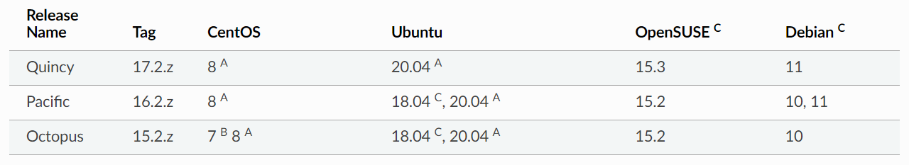

[TOC]

<!--more-->

# 简介

Ceph 用于为云平台提供 **对象存储集群** 、 **块设备服务** 、**文件系统** 。

所有Ceph集群的部署都从各个主机的设置开始，然后设置网络

## Ceph集群的最小规模

- 至少一个Ceph监控器进程 (Ceph Monitor, mon)

- 至少一个Ceph 管理器进程 (Ceph Manager, mgr)

- 至少与对象存储副本数量相等的对象存储守护进程 (Object Storage Daemon, OSD)

  如果Ceph集群中对象是三副本模式，则该Ceph集群中至少应有三个OSD

- 如果Ceph提供文件系统服务，则还需要Ceph元数据服务器 (Metadata server Daemon, MDS)

**建议为每个 mon 配置一个 mgr** ，即每增加一个 mon 就相应新增一个 mgr 

## 各进程概述

### 监视器进程

Ceph 监视器 (Ceph Monitor, ceph-mon) 维护集群状态的各种映射图，包括 监视器映射 (monitor map)、管理器映射 (manager map)、对象存储映射(OSD map)、元数据服务映射(MDS map)、和CRUSH映射(CRUSH map)。这些映射图保存用于Ceph各进程相互协调的集群关键状态。

- 这些映射图保存着发生在Monitors 、Managers、OSDs 和 PGs 上的每一次状态变更的历史信息(称为 epoch)。

监视器还负责守护进程和客户端之间的身份验证(authentication)

为了实现冗余和高可用性，通常需要至少三个监视器。

### 管理器进程

Ceph管理器(Ceph manager, ceph-mgr) 负责跟踪运行时指标和 Ceph 集群的当前状态，包括存储利用率、当前性能指标和系统负载。

mgr 进程还托管基于 python 的模块来管理和公开 Ceph 集群信息，包括基于 Web 的 Ceph 仪表板 (Ceph Dashboard) 和 REST API。

通常至少需要两名管理器才能实现高可用性。

### Ceph 对象存储进程

对象存储守护进程 (Ceph OSD、ceph-osd) 存储数据，处理数据复制、恢复、再平衡

通过检查其他 Ceph OSD 守护进程的心跳来向 Ceph 监视器和管理器提供一些监控信息。

通常至少需要三个 Ceph OSD 才能实现冗余和高可用性。

### 元数据服务

Ceph元数据服务器 (MDS, ceph-mds) 存储 Ceph 文件系统的元数据，允许 CephFS 用户运行基本命令（如 ls、find 等），而不会给 Ceph 存储集群带来负担。

## CRUSH

Ceph **将数据作为对象** 存储在逻辑存储池中。使用CRUSH算法计算对象应该被包含在哪个放置组(placement group, PG)中，以及哪个OSD应该存储这个PG。

CRUSH算法使Ceph存储集群能够动态扩展、再平衡和恢复。

# 建议

## 硬件建议

Ceph 旨在在商用硬件上运行，这使得构建和维护 PB 级数据集群变得灵活且经济可行。在规划集群硬件时，您需要权衡多种考虑因素，包括故障域、成本和性能。

硬件规划要包含把使用 Ceph 集群的 Ceph 守护进程和其他进程恰当分布。通常，我们推荐在一台机器上只运行一种类型的守护进程。我们推荐把使用数据集群的进程（如 OpenStack 、 CloudStack 等）安装在别的机器上。


### CPU

CephFS 元数据服务器 (MDS)对CPU敏感，占用大量CPU资源。它们是单线程的，在具有高时钟频率 (GHz) 的 CPU 上性能最佳(如 4 核或更强悍的 CPU)。除非 MDS 服务器还托管其他服务（例如用于 CephFS 元数据池的 SSD OSD），否则它们不需要大量 CPU 核心。

OSD 节点需要足够的处理能力来(如双核 CPU)运行 RADOS 服务、使用 CRUSH 计算数据放置、复制数据以及维护自己的集群映射副本。


## 操作系统建议

作为一般规则，我们建议在较新版本的 Linux 上部署 Ceph。我们还建议部署在具有长期支持的版本上。

## 内核态客户端

如果您使用内核客户端映射 RBD 块设备或挂载 CephFS，一般建议是在任何客户端上使用 http://kernel.org 或您的 Linux 发行版提供的“稳定”或“长期维护”内核系列主机。

对于 RBD，如果您选择长期维护内核，我们建议至少基于 4.19 的“长期维护”内核系列。如果您可以使用较新的“稳定”或“长期维护”内核系列，请使用它。

对于 CephFS，请参阅有关使用内核驱动程序挂载 CephFS 的部分以获取内核版本指南。

较旧的内核态客户端版本可能不支持您的CRUSH可调文件或Ceph集群的其他新功能，需要在配置存储集群时禁用这些功能。对于RBD来说，内核版本5.3或CentOS 8.2是合理支持RBD图像特性的最低要求。

### 系统平台

下图显示了 Ceph 的需求如何映射到各种 Linux 平台上。一般来说，对内核和系统初始化包（即 sysvinit、systemd）之外的特定发行版的依赖性很小。



A：Ceph提供了软件包，并且对其中的软件做了全面的测试。

B：Ceph提供了软件包，并且对其中的软件做了基本的测试。

C：Ceph 仅提供包。尚未对这些版本进行任何测试。

Ceph不需要特定的Linux发行版。Ceph可以在任何包含受支持内核和受支持系统启动框架的发行版上运行，例如sysvinit或systemd。Ceph有时被移植到非linux系统，但核心Ceph工作不支持这些。

对于 Centos 7 用户 在 Octopus 版本中，Btrfs 不再在 Centos 7 上进行测试。我们建议使用 bluestore 代替。

# Ceph源码

## 获取

1. 在本地安装 git。在 Debian 或 Ubuntu 中，运行以下命令：

   ```
   sudo apt-get install git
   ```

   在 Fedora 中，运行以下命令：

   ```
   sudo yum install git
   ```

   在 CentOS/RHEL 中，运行以下命令：

   ```
   sudo yum install git
   ```

2. 确保您的`.gitconfig`文件已配置为包含您的姓名和电子邮件地址：

   ```
   [user]
      email = {your-email-address}
      name = {your-name}
   ```

   例如：

   ```
   git config --global user.name "John Doe"
   git config --global user.email johndoe@example.com
   ```

3. 创建一个 [github](http://github.com/)帐户（如果您没有）。

4. Fork Ceph项目，https://github.com/ceph/ceph

5. 将 Ceph 项目的分支克隆到本地主机。这将创建所谓的“本地工作副本”。

Ceph 文档按组件组织：

- **Ceph 存储集群：** Ceph 存储集群文档在`doc/rados`目录中。
- **Ceph 块设备：** Ceph 块设备文档位于`doc/rbd`目录中。
- **Ceph 对象存储：** Ceph 对象存储文档位于`doc/radosgw`目录中。
- **Ceph 文件系统：** Ceph 文件系统文档位于 `doc/cephfs`目录中。
- **安装（快速）：**快速启动文档在 `doc/start`目录中。
- **安装（手册）：**有关 Ceph 手动安装的文档位于`doc/install`目录中。
- **手册页：**手册页源位于`doc/man`目录中。
- **开发人员：**开发人员文档在`doc/dev` 目录中。
- **图像：**该目录中存储了包括 JPEG 和 PNG 文件在内的图像 `doc/images`。