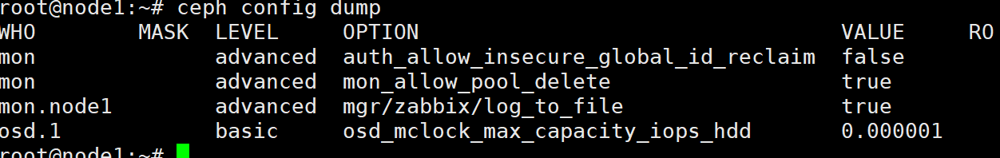
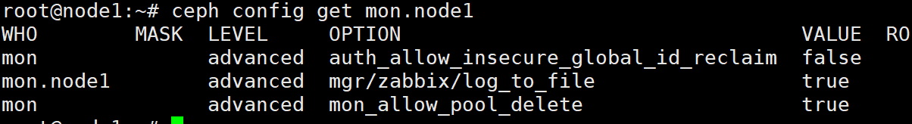
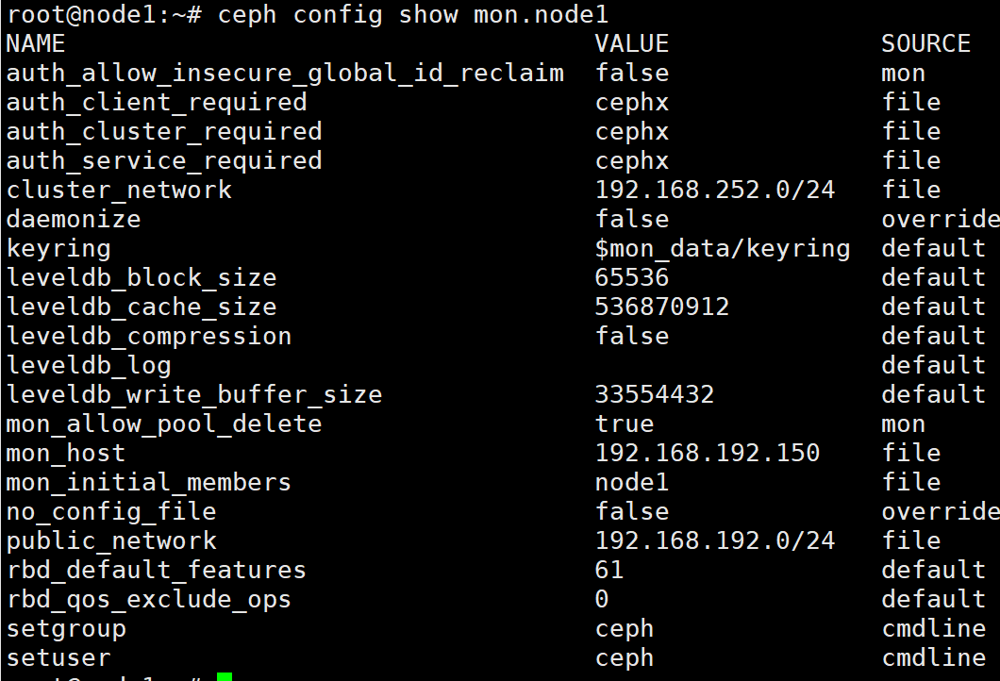
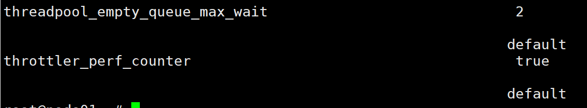
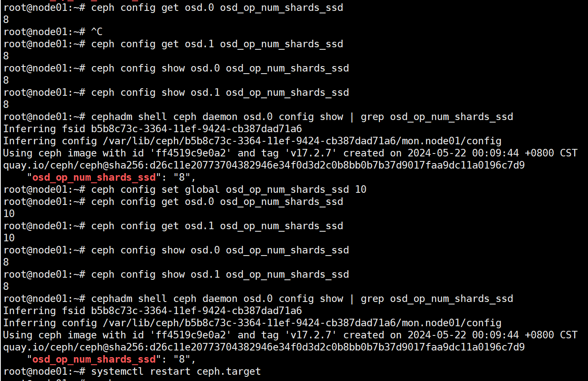
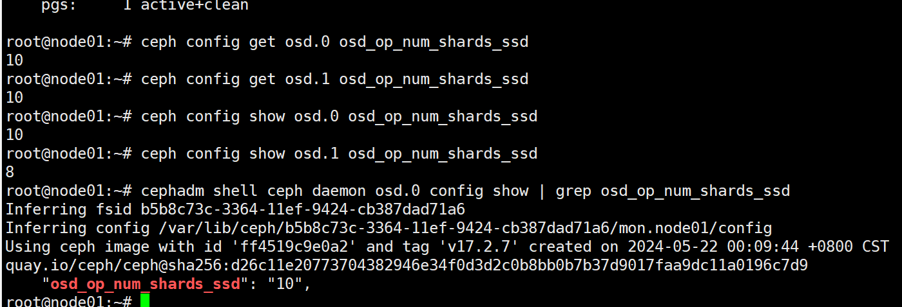
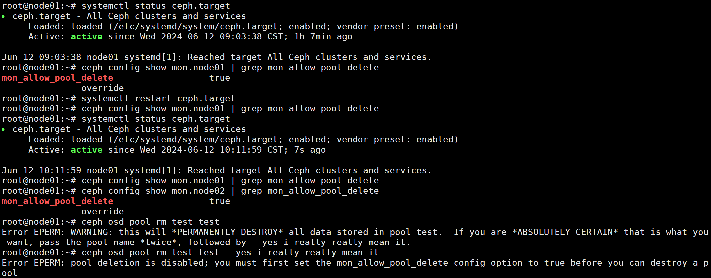
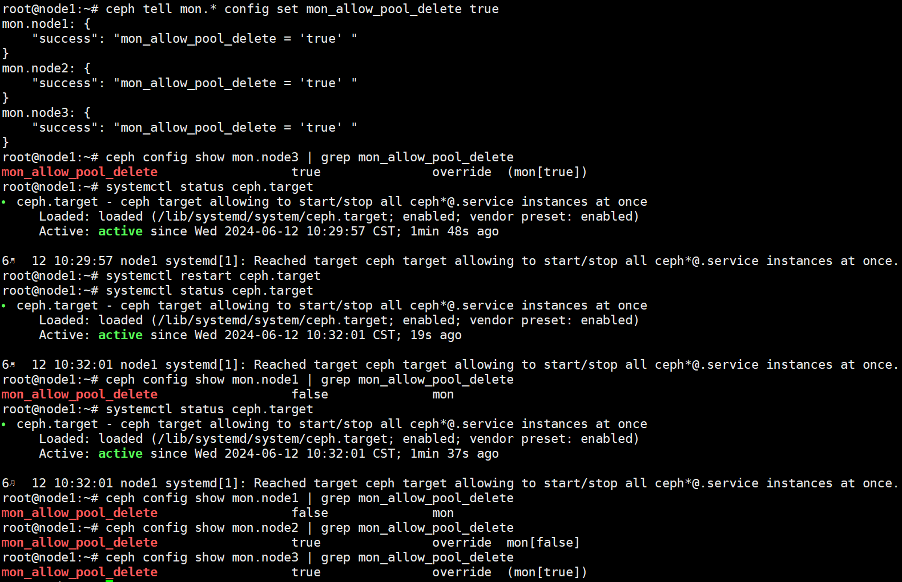
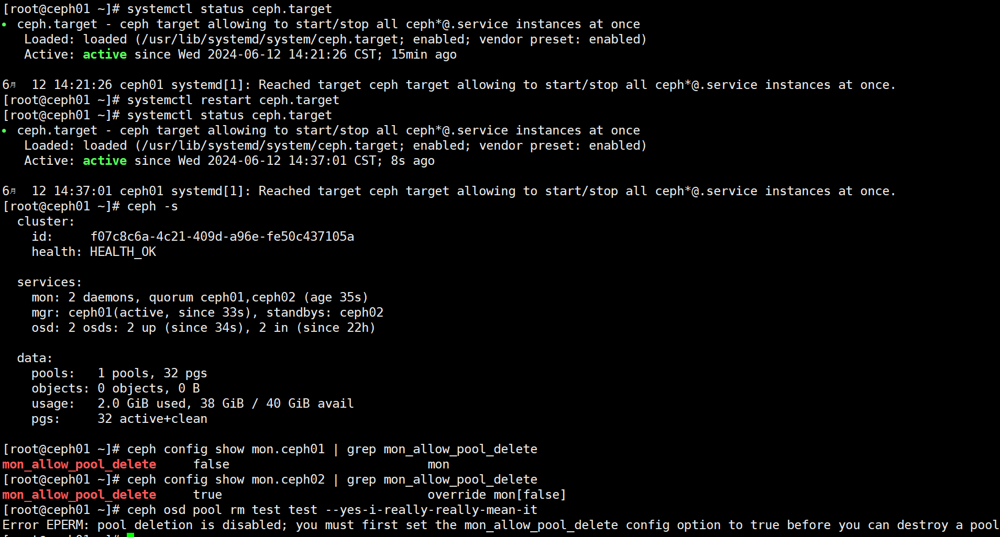
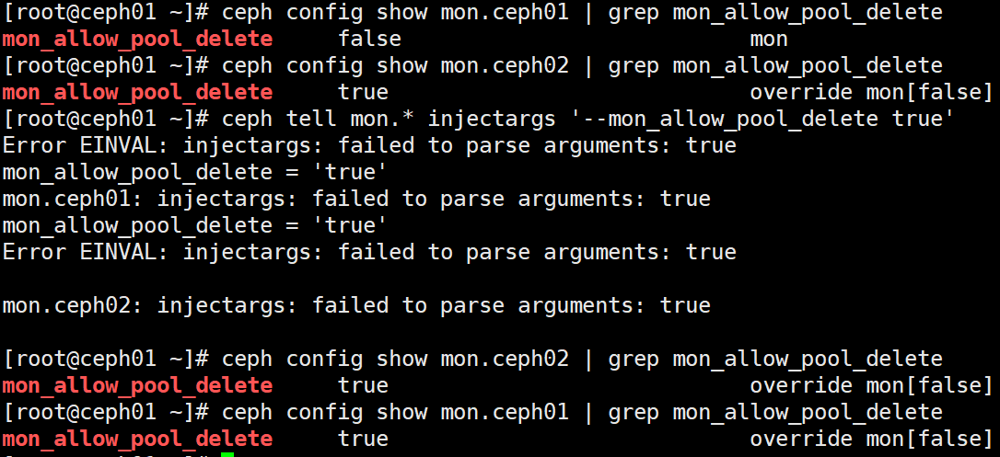

[TOC]

<!--more-->

## 存储设备

在一个Ceph存储集群中，有多个Ceph进程

**OSDs**

OSD进程存储Ceph集群中的大部分数据（用户数据+元数据+集群数据）。

通常每个OSD由单个存储设备支撑，如传统的硬盘HDD或固态盘SSD。OSDs也支持设备组合，如：占用大量存储空间的用户数据用HDD存储，元数据可以用SSD或SSD的分区存储

集群中OSD数量通常是 $f(数据量,每个存储设备容量,数据冗余等级,数据冗余类型(副本或纠删码))$ 

**Mons**

mon进程管理关键的集群状态，包括集群节点和节点身份认证信息。

小型集群仅需几GB的空间保存监控数据库的信息；大型集群，监控数据库的大小能达到数十乃至几百GB

**MGRs**

MGR进程与Mon进程一起运行，提供额外的监控，并为外部监控和管理系统提供接口

### OSD存储后端

OSD有两种方式管理当前节点存储的数据

- L版本 12.2.z 开始，默认的后端为BlueStore
- L版之前，只有FileStore后端

#### BlueStore

BlueStore专为管理 Ceph OSD 工作负载的磁盘数据而设计。BlueStore 的设计基于十年来支持和管理 Filestore OSD 的经验。Bluestore的关键特征

- 直接管理存储设备。使用原始块设备或分区。这避免了可能限制性能或增加复杂性的抽象干预层（例如 XFS 等本地文件系统）。
- 使用 RocksDB 进行元数据管理。嵌入 RocksDB 的键/值数据库是为了管理内部元数据，包括对象名称到磁盘上块位置的映射
- 原始数据和元数据校验和。默认情况下，写入 BlueStore 的所有数据和元数据都受到一个或多个校验和的保护。未经验证，不会从磁盘读取任何数据或元数据或将其返回给用户。
- 内联压缩。数据在写入磁盘之前可以选择进行压缩。
- 多设备元数据分层。 BlueStore 允许将其内部日志（预写日志）写入单独的高速设备（如 SSD、NVMe 或 NVDIMM），以提高性能。如果有大量更快的存储设备可用，则内部元数据可以存储在更快的设备上。
- 高效的写时复制。 RBD 和 CephFS 快照依赖于 BlueStore 中高效实现的写时复制克隆机制。这将为常规的多副本模式和纠删码池（依靠克隆来实现高效的两阶段提交）带来高效的 I/O。

For more information, see [BlueStore Configuration Reference](https://docs.ceph.com/en/quincy/rados/configuration/bluestore-config-ref/) and [BlueStore Migration](https://docs.ceph.com/en/quincy/rados/operations/bluestore-migration/).

#### FILESTORE

filestore是Ceph 存储对象的传统方法。依赖于标准文件系统（通常是 XFS）以及键/值数据库（传统上是 LevelDB，现在是 RocksDB）来存储某些元数据。

FileStore 经过充分测试并在生产中广泛使用。然而，由于其总体设计以及对传统文件系统进行对象数据存储的依赖，它存在许多性能缺陷。

尽管 FileStore 能够在大多数 POSIX 兼容文件系统（包括 btrfs 和 ext4）上运行，但我们建议仅将 XFS 文件系统与 Ceph 一起使用。

- btrfs 和 ext4 都有已知的错误和缺陷，使用它们可能会导致数据丢失。默认情况下，所有 Ceph 配置工具都使用 XFS。

For more information, see [Filestore Config Reference](https://docs.ceph.com/en/quincy/rados/configuration/filestore-config-ref/).

## Ceph 配置

当Ceph服务启动后，初始化进程会激活一组在后台运行的守护进程，Ceph对象存储集群至少需要运行三类进程

- [Ceph Monitor](https://docs.ceph.com/en/quincy/glossary/#term-Ceph-Monitor) (`ceph-mon`)
- [Ceph Manager](https://docs.ceph.com/en/quincy/glossary/#term-Ceph-Manager) (`ceph-mgr`)
- [Ceph OSD Daemon](https://docs.ceph.com/en/quincy/glossary/#term-Ceph-OSD-Daemon) (`ceph-osd`)

支持Ceph文件系统的集群还需要运行一个 [Ceph Metadata Server](https://docs.ceph.com/en/quincy/glossary/#term-Ceph-Metadata-Server) (`ceph-mds`)

支持 Ceph 对象存储的集群需要运行 Ceph RADOS Gateway daemons (`radosgw`).

每个守护进程都有许多参数配置项，每个参数配置项都有默认值，调整这些配置项的值会调整系统的行为。[修改参数配置项的值会显著影响集群的性能和稳定性](https://docs.ceph.com/en/quincy/rados/configuration/ceph-conf/#:~:text=these%20configuration%20options.-,Make%20sure%20to%20understand%20the%20consequences%20before%20overriding%20the%20default%20values%2C%20as%20it%20is%20possible%20to%20significantly%20degrade%20the%20performance%20and%20stability%20of%20your%20cluster.,-Remember%20that%20default) 。需要注意的是，参数配置项的默认值会随着版本迁移发生变化。

每个参数配置项与一个或若干个Ceph进程相关，且只能指定一个值。

参数配置项的值随守护进程类型变化而变化，甚至[同一类型的不同进程也可能取不同的值](https://docs.ceph.com/en/quincy/rados/configuration/ceph-conf/#confval-mon_host:~:text=However%2C%20the%20values%20for%20a%20configuration%20option%20can%20vary%20across%20daemon%20types%2C%20and%20can%20vary%20even%20across%20different%20daemons%20of%20the%20same%20type.)

参数配置项存储在Mon节点的配置数据库（configuration database）或本地的配置文件中

### 参数名

Ceph的每个参数配置项都有唯一名称 `name` ，由小写字符用 `_` 组成

命令行识别参数名时，`_` 和 `-` 时通用的，如 `--mon-host` 与 `--mon_host` 等价

当参数名出现在配置文件中时，也可用空格替换 `_` 和 `-` 。

建议使用 `_` 

### 参数值

#### 元变量

元变量是被Ceph识别的参数配置值，Ceph在应用配置值时展开元变量。

元变量有：

**$cluster** ：ceph集群名，一般用于同一组硬件上运行多个集群

```shell
Example
/etc/ceph/$cluster.keyring

Default
ceph
```

**$type** ：进程类型，如：mds，osd，mon

```shell
/var/lib/ceph/$type
```

**$id** ：进程或客户端的唯一标识id，如：`osd.0` 的id 为 `0` ，`mds.a` 的id为 `a` 

```shell
Example
/var/lib/ceph/$type/$cluster-$id
```

**$host** ：返回主机名

**$name** ：进程类型与id的拼接变量

等价于 `$type.$id`

```shell
Example
/var/run/ceph/$cluster-$name.asok
```

**$pid** ：返回进程的id

```shell
Example
/var/run/ceph/$cluster-$name-$pid.asok
```

### 配置源

Ceph进程在启动时的第一项工作是 依次从 命令行、环境变量、本地配置文件 解析参数配置项

接下来，各进程会与monitor集群交互以获取整个集群的集中存储配置(centrally-stored configuration)，在获取完整的参数配置视图后，才开始启动守护进程

每个 Ceph 守护进程获取参数配置的配置源，按优先级从低到高排序为：

- Ceph源码编译时的默认值
- monitor集群的集中配置数据库（configuration database）
- 本机上的配置文件
- 环境变量
- 命令行参数
- 管理员运行时在线修改 `ceph config set <who> <name> <value>` 

#### [SKIPPING MONITOR CONFIG](https://docs.ceph.com/en/quincy/rados/configuration/ceph-conf/#skipping-monitor-config)

The option `--no-mon-config` can be passed in any command in order to skip the step that retrieves configuration information from the cluster’s monitors. Skipping this retrieval step can be useful in cases where configuration is managed entirely via configuration files, or when maintenance activity needs to be done but the monitor cluster is down.

#### 引导参数

引导参数（BOOTSTRAP OPTIONS）是影响与mon节点交互、身份验证、检索集群存储配置能力的参数

因此，这些参数需要存储在节点本地，并通过本地配置文件设置。

```shell
mon_host: str类型

由逗号、空格或分号分隔的 IP 地址或主机名列表。主机名通过 DNS 解析。所有 A 和 AAAA 记录都包含在搜索列表中。

mon_host_override
Ceph 进程首次与 Ceph 集群建立通信时最初联系的监视器列表，覆盖已知的mon节点列表
主要用于调试
```

- mon_dns_srv_name
- mon_data，osd_data，mds_data，mgr_data，osd_data，mds_data，mgr_data和一些类似的参数：定义本进程数据存储在哪个本地目录中
- keyring，keyfile，key：指定向mon进行身份验证的凭据，默认的keyring是相应的data目录

通常，集群创建好后，[引导参数不需要修改](https://docs.ceph.com/en/quincy/rados/configuration/ceph-conf/#confval-mon_host:~:text=In%20most%20cases%2C%20there%20is%20no%20reason%20to%20modify%20the%20default%20values%20of%20these%20options)。

### Ceph配置文件

> 配置文件在参数配置源中的优先级在 "源码编译默认值" 和 "configuration database" 的优先级之上

Ceph进程在启动时，会依次从以下位置搜索 **Ceph配置文件**：

1. `$CEPH_CONF` (that is, the path following the `$CEPH_CONF` environment variable)
2. `-c path/path` (that is, the `-c` command line argument)
3. `/etc/ceph/$cluster.conf`
4. `~/.ceph/$cluster.conf`
5. `./$cluster.conf` (that is, in the current working directory)
6. On FreeBSD systems only, `/usr/local/etc/ceph/$cluster.conf`

配置文件基于 `ini` 的语法风格，能添加注释内容，用 `#` 或 `;` 开头，如

```shell
# <--A number (#) sign number sign (#) precedes a comment.
; A comment may be anything.
# Comments always follow a semi-colon semicolon (;) or a pound sign (#) on each line.
# The end of the line terminates a comment.
# We recommend that you provide comments in your configuration file(s).
```

#### 配置分块

Ceph配置文件被分为多个部分，显式指定适用的进程。每个部分必须以有效的参数配置块名开始，如

```shell
[global]
debug_ms = 0

[osd]
debug_ms = 1

[osd.1]
debug_ms = 10

[osd.2]
debug_ms = 10
```

**global**

影响ceph存储集群中的所有进程和客户端

```shell
log_file = /var/log/ceph/$cluster-$type.$id.log
```

**mon**

影响所有 ceph-mon 守护进程，并覆盖 global 中的相同设置。

```shell
mon_cluster_log_to_syslog = true
```

**mgr**

影响所有 ceph-mgr守护进程，并覆盖 global 中的相同设置。

```shell
mgr_stats_period = 10
```

**osd**

影响所有 ceph-osd 守护进程，并覆盖 global 中的相同设置。

```shell
osd_op_queue = wpq
```

**mds**

影响所有 ceph-mds守护进程，并覆盖 global 中的相同设置

```shell
mds_cache_memory_limit = 10G
```

**client**

影响所有的Ceph客户端，如：CephFS、Ceph RBD、Ceph RGW

```shell
object_inflight_ops = 512
```

还可以指定单独的守护程序或客户端名称。例如，mon.foo、osd.123 和 client.smith 都是有效的节名称。

- 任何给定的守护程序将从全局部分、守护程序或客户端类型部分以及共享其名称的部分中获取其设置。
- 最具体部分中的设置优先：例如，如果在同一源（即在同一配置文件中）的 global、mon 和 mon.foo 中指定了相同的选项，则将使用 mon.foo 的设置。
- 若在同一部分中指定了同一配置选项的多个值，则最后指定的值优先。
- 节点本地的配置文件始终优于mon节点的 configuration database 中的值

#### 配置文件中的参数配置值

对于字符串类型的参数配置项，字符串值太长以至于一行无法容纳，可以用 `\` 在行尾表示连续行。这种情况下，参数配置的值是由 `\` 连接的多行

```shell
[global]
foo = long long ago\
long ago

# foo= "long long ago long ago"
```

每行尾也能添加注释

```shell
[global]
obscure_one = difficult to explain # I will try harder in next release
simpler_one = nothing to explain
```

当一个参数配置值包含空格时，则应当括在 `''` 或 `""` 内

```shell
[global]
line = "to be, or not to be"
```

在参数配置值中，有四个转义字符 `=` ，`#` ，`;` 和 `[` ，用 `\` 进行转义

```shell
[global]
secret = "i love \# and \["
```

#### 参数配置值类型

**int**

64-bit有符号整数，以B为单位

支持SI后缀，如：K,M,G,T,P,E($10^3,10^6,...$) 

当为阈值类的参数配置项赋为负数时，表明该参数配置项是无限制的

**uint**

64-bit无符号整数，大于0

**str**

UTF-8编码的字符串，特定的字符串不允许

**boolean**

**size**

64-bit 无符号整数，支持SI前缀和IEC前缀，以B为单位

```shell
Example
1Ki, 1K, 1KiB and 1B.
```

**sec**

**无符号整数** 时间间隔，以秒为单位，

- second: `s`, `sec`, `second`, `seconds`
- minute: `m`, `min`, `minute`, `minutes`
- hour: `hs`, `hr`, `hour`, `hours`
- day: `d`, `day`, `days`
- week: `w`, `wk`, `week`, `weeks`
- month: `mo`, `month`, `months`
- year: `y`, `yr`, `year`, `years`

**addr**

A single address, optionally prefixed with `v1`, `v2` or `any` for the messenger protocol. If no prefix is specified, the `v2` protocol is used.

```shell
v1:1.2.3.4:567, v2:1.2.3.4:567, 1.2.3.4:567, 2409:8a1e:8fb6:aa20:1260:4bff:fe92:18f5::567, [::1]:6789
```

**addrvec**

A set of addresses separated by “,”. The addresses can be optionally quoted with `[` and `]`.

```shell
Example
[v1:1.2.3.4:567,v2:1.2.3.4:568], v1:1.2.3.4:567,v1:1.2.3.14:567 [2409:8a1e:8fb6:aa20:1260:4bff:fe92:18f5::567], [2409:8a1e:8fb6:aa20:1260:4bff:fe92:18f5::568]
```

**uuid**

The string format of a uuid defined by [RFC4122](https://www.ietf.org/rfc/rfc4122.txt).

```shell
Example
f81d4fae-7dec-11d0-a765-00a0c91e6bf6
```

### 参数配置数据库

mon集群管理整个集群共享的一个参数配置项数据库，可以简化整个系统的配置管理，大多数参数配置项都存储在该数据库中

仅有一些引导参数需要存储在本地配置文件中，涉及与mon节点的交互、本节点的身份验证和获取配置信息的能力

大多数情况，仅与 `mon_host` 相关的参数，可以通过DNS记录避免

#### sections 和 masks

存储在mon集群的Configuration Database中的参数配置项可以分为 `[global]` 、`[进程类型]` 、`[指定的进程]` 多个 section。与 `$cluster.conf` 配置文件的section无区别

与配置文件的不同在于，Configuration Database中的参数配项置能与掩码关联，使管理员确保参数配置值的修改值影响特定的进程或客户端

- `type:location` ，`type` 是CRUSH的属性，如 `rack` 或 `host` ，`location` 是该类型的值，如 `host:foo` 将限制该配置项只影响主机名为 `foo` 上的进程
- `class:device-class`  ，`device-class` 是CRUSH设备类型（ `hdd` 或 `ssd` ）的名称，如：`class:ssd` 将限制该配置项只影响物理设备为SSD的OSD

在 `ceph config set <who> <name> <value>` 修改参数配置值时，`<who>`可以是 `<section.daemon-name>` 、 `<section>/<mask>` 、`<section>` 、`<mask>` 

#### 参数值查看指令

请注意，`ceph config set <who> <option> <value>` 和 `ceph config get <who> <option>` 命令返回的值可能并不同步。**后者可能显示编译时默认值**。

`ceph config get <who> <option>` ：导出mon节点参数配置数据库中<who>的参数配置值，若不在configuraion database中，则显示编译时默认值

**并不显示全部参数及配置值**

为了确定配置选项是否存在于监视器配置数据库中，请运行 `ceph config dump` 命令。

`ceph config dump` ：导出mon节点的**本地参数配置数据库**



`ceph config get <who>`

导出mon节点参数配置数据库中 <who> 指定的内容



`ceph config show <who>` ：导出正在运行的守护进程的本地配置。

这些设置可能与存储在mon中的设置不同，如果有本地配置文件在使用，或者选项在命令行或运行时被覆盖。输出中会显示选项值的来源。



`ceph config assimilate-conf -i <input file> -o <output file>`

- 从输入文件中提取一个配置文件，并将所有有效的参数配置项移动到监视器配置数据库中

- 任何无法识别、无效或无法由监视器控制的设置将返回在输出文件中存储的缩写配置文件
- 便于**配置文件的迁移**

#### help

通过 `help` 指令，获取指定参数配置项的帮助

```shell
ceph config help <option>
ceph config help log_file

ceph config help log_file -f json-pretty
```

[参数配置项的 `level` 属性有三种取值，`basic` ，`advanced` 和 `dev` 。`dev` 类型的参数配置项旨在供开发者使用，通常称用于测试目的，并不推荐用户修改](https://docs.ceph.com/en/quincy/rados/configuration/ceph-conf/#SECTIONS%20AND%20MASKS:~:text=The%20level%20property%20can%20be%20basic%2C%20advanced%2C%20or%20dev.%20The%20dev%20options%20are%20intended%20for%20use%20by%20developers%2C%20generally%20for%20testing%20purposes%2C%20and%20are%20not%20recommended%20for%20use%20by%20operators.)

也可以使用 `ceph daemon <name> config help [option]` 从特定的运行中的守护进程查询参数配置项

### 参数配置值的修改

#### 运行时可修改参数配置项

**参数修改后 `set ` 和 `get` 同步，但 `show` 并不同步**

通过 `ceph config show` 查看运行中进程的参数配置值

```shell
# 查看 `osd.0` 进程的运行时参数配置值
ceph config show osd.0

# 查看某个特定参数配置项的参数配置值
ceph config show osd.0 debug_osd
```

二者输出一致，只不过格式不一样

- 带默认值查看参数配置值

  ```shell
  ceph config show-with-defaults osd.0
  
  # 参数名	参数值
  # 		  参数配置源
  ```

  

- 在本地主机上通过管理套接字连接到正在运行的守护进程来查看守护进程的所有设置。

  ```shell
  ceph daemon mon.node01 config show
  输出是json格式的 "参数名": "参数值"
  
  root@node01:/home# ceph daemon mon.node01 config show | grep mon_allow_pool_delete
      "mon_allow_pool_delete": "true",
  ```

要查看非默认设置，并查看每个值来自何处（例如，配置文件、监视器或覆盖）

```shell
root@node01:/home# ceph daemon mon.node01 config diff | grep -C 4 'mon_allow_pool_delete'       
        "log_to_stderr": {
            "default": true,
            "final": true
        },
        "mon_allow_pool_delete": {
            "default": false,
            "override": true,
            "final": true
        },

```

要查看单个设置的值，请运行以下命令

```shell
ceph daemon osd.0 config get debug_osd
```

#### 运行时持久化修改


**重启必须在所有主机上本地运行**  `systemctl { start | stop | restart} ceph.target ` 只管理本机服务

`ceph config set <who> option_name option_value` ，修改参数配置数据库中的值

```shell
# 若需要在指定OSD上打开最详细的调试日志级别
ceph config set osd.123 debug_ms 20
```

- 此指令 `<who>` 不能使用通配符 `.*` ，但可以在非本机上修改其他主机配置

```shell
root@node01:~# cephadm shell ceph daemon osd.0 config show | grep osd_op_num_shards_ssd
Inferring fsid b5b8c73c-3364-11ef-9424-cb387dad71a6
Inferring config /var/lib/ceph/b5b8c73c-3364-11ef-9424-cb387dad71a6/mon.node01/config
Using ceph image with id 'ff4519c9e0a2' and tag 'v17.2.7' created on 2024-05-22 00:09:44 +0800 CST
quay.io/ceph/ceph@sha256:d26c11e20773704382946e34f0d3d2c0b8bb0b7b37d9017faa9dc11a0196c7d9
    "osd_op_num_shards_ssd": "8",
root@node01:~# ceph config get osd.0 osd_op_num_shards_ssd
8
root@node01:~# ceph config set global osd_op_num_shards_ssd 10
root@node01:~# ceph config get osd.0 osd_op_num_shards_ssd
10
root@node01:~# cephadm shell ceph daemon osd.0 config show | grep osd_op_num_shards_ssd
Inferring fsid b5b8c73c-3364-11ef-9424-cb387dad71a6
Inferring config /var/lib/ceph/b5b8c73c-3364-11ef-9424-cb387dad71a6/mon.node01/config
Using ceph image with id 'ff4519c9e0a2' and tag 'v17.2.7' created on 2024-05-22 00:09:44 +0800 CST
quay.io/ceph/ceph@sha256:d26c11e20773704382946e34f0d3d2c0b8bb0b7b37d9017faa9dc11a0196c7d9
    "osd_op_num_shards_ssd": "8",
root@node01:~# ceph config get osd.1 osd_op_num_shards_ssd
10

root@node01:~# systemctl restart ceph.target

root@node01:~# ceph config get osd.1 osd_op_num_shards_ssd
10
root@node01:~# cephadm shell ceph daemon osd.0 config show | grep osd_op_num_shards_ssd
Inferring fsid b5b8c73c-3364-11ef-9424-cb387dad71a6
Inferring config /var/lib/ceph/b5b8c73c-3364-11ef-9424-cb387dad71a6/mon.node01/config
Using ceph image with id 'ff4519c9e0a2' and tag 'v17.2.7' created on 2024-05-22 00:09:44 +0800 CST
quay.io/ceph/ceph@sha256:d26c11e20773704382946e34f0d3d2c0b8bb0b7b37d9017faa9dc11a0196c7d9
    "osd_op_num_shards_ssd": "10",
```

```shell
root@node01:~# ceph -s
  cluster:
    id:     b5b8c73c-3364-11ef-9424-cb387dad71a6
    health: HEALTH_OK
 
  services:
    mon: 2 daemons, quorum node01,node02 (age 5m)
    mgr: node01.ohhfsw(active, since 5m), standbys: node02.owpknt
    osd: 2 osds: 2 up (since 5m), 2 in (since 100m)
 
  data:
    pools:   1 pools, 1 pgs
    objects: 2 objects, 577 KiB
    usage:   583 MiB used, 39 GiB / 40 GiB avail
    pgs:     1 active+clean
 
root@node01:~# ceph config set global osd_op_num_shards_ssd 8
root@node01:~# cephadm shell ceph daemon osd.0 config show | grep osd_op_num_shards_ssd
Inferring fsid b5b8c73c-3364-11ef-9424-cb387dad71a6
Inferring config /var/lib/ceph/b5b8c73c-3364-11ef-9424-cb387dad71a6/mon.node01/config
Using ceph image with id 'ff4519c9e0a2' and tag 'v17.2.7' created on 2024-05-22 00:09:44 +0800 CST
quay.io/ceph/ceph@sha256:d26c11e20773704382946e34f0d3d2c0b8bb0b7b37d9017faa9dc11a0196c7d9
    "osd_op_num_shards_ssd": "10",
root@node01:~# ceph config get osd.0 osd_op_num_shards_ssd
8
root@node01:~# ceph config get osd.1 osd_op_num_shards_ssd
8
root@node01:~# systemctl restart ceph.target

root@node01:~# cephadm shell ceph daemon osd.0 config show | grep osd_op_num_shards_ssd
Inferring fsid b5b8c73c-3364-11ef-9424-cb387dad71a6
Inferring config /var/lib/ceph/b5b8c73c-3364-11ef-9424-cb387dad71a6/mon.node01/config
Using ceph image with id 'ff4519c9e0a2' and tag 'v17.2.7' created on 2024-05-22 00:09:44 +0800 CST
quay.io/ceph/ceph@sha256:d26c11e20773704382946e34f0d3d2c0b8bb0b7b37d9017faa9dc11a0196c7d9
    "osd_op_num_shards_ssd": "8",
root@node01:~# ceph config get osd.0 osd_op_num_shards_ssd
8
root@node01:~# ceph config get osd.1 osd_op_num_shards_ssd
8
```



等一会，ceph -s 为OK



#### 临时修改

Ceph允许运行时修改进程的参数配置值，如增加或减少日志输出的数量，启动或禁用调试设置，运行时优化

通过使用 Ceph CLI 命令行接口（CLI）中的  `tell` 或 `daemon` 接口可以临时设置选项。

在守护进程重新启动时恢复为持久配置的值。

两种临时修改方法

**从任何主机，用以下形式的命令发送消息给守护进程:** 

```shell
ceph tell <name> config set <option> <value>
ceph tell osd.123 config set debug_osd 20
```

`ceph tell` 的 `<name>` 接收通配符，例如，要调整所有OSD守护进程的调试级别，命令格式如下:

```shell
ceph tell osd.* config set debug_osd 20
```

**ceph daemon 相关的指令，需要 <who> 所在的主机上，通过 /var/run/ceph 套接字连接到进程**

- 若使用cephadm部署，则需要在cephadm shell中

```shell
ceph daemon <name> config set <option> <value>
ceph daemon osd.4 config set debug_osd 20
```

在 `ceph config show` 的输出中，这些临时值的 `sorce` 字段被标注为 `override`

**测试临时修改**


ubuntu：cephadm重启后参数恢复





ubuntu：ceph-deploy



kylin linux：ceph-deploy 14.2.8

ceph config set mon.* mon_allow_pool_delete true

不识别通配符

```shell
[root@ceph01 ~]# ceph config set mon.ceph01 mon_allow_pool_delete false
[root@ceph01 ~]# ceph config set mon.ceph02 mon_allow_pool_delete false
```

```shell
# 可识别通配符，但不能修改
[root@ceph01 ~]# ceph tell mon.* config set mon_allow_pool_delete true
Invalid command: missing required parameter value(<string>)
config set <who> <name> <value> {--force} :  Set a configuration option for one or more entities
Error EINVAL: invalid command
mon.ceph01: invalid command
Invalid command: missing required parameter value(<string>)
config set <who> <name> <value> {--force} :  Set a configuration option for one or more entities
Error EINVAL: invalid command
mon.ceph02: invalid command

# 这个可以改成功
ceph tell osd.123 config set debug_osd 20
```

```shell
# 输出运行中进程的参数配置值
ceph config show mon.ceph01 | grep mon_allow_pool_delete

[root@ceph01 ~]# ceph config show mon.ceph01 | grep mon_allow_pool_delete
mon_allow_pool_delete     false                           mon                        
[root@ceph01 ~]# ceph config show mon.ceph02 | grep mon_allow_pool_delete
mon_allow_pool_delete     false                           mon                        
[root@ceph01 ~]# ceph osd pool rm test test --yes-i-really-really-mean-it
Error EPERM: pool deletion is disabled; you must first set the mon_allow_pool_delete config option to true before you can destroy a pool
[root@ceph01 ~]# ceph tell mon.* injectargs '--mon_allow_pool_delete=true'
mon.ceph01: injectargs:mon_allow_pool_delete = 'true' 
mon.ceph02: injectargs:mon_allow_pool_delete = 'true' 
[root@ceph01 ~]# ceph config show mon.ceph01 | grep mon_allow_pool_delete
mon_allow_pool_delete     true                            override mon[false]      
[root@ceph01 ~]# ceph config show mon.ceph02 | grep mon_allow_pool_delete
mon_allow_pool_delete     true                            override mon[false]
[root@ceph01 ~]# ceph osd pool rm test test --yes-i-really-really-mean-it
pool 'test' removed
```

由于只重启了ceph01主机，所以只有ceph01的参数恢复，但由于指令是在ceph01上执行的，所以删除池指令不会生效



使用空格代替会有错，所以建议使用 `=`




