[TOC]

<!--more-->

## 概述

### host

Ceph [硬件推荐](https://docs.ceph.com/en/quincy/start/hardware-recommendations/) 提供了硬件选型指南。

单个Ceph节点可以运行多种Ceph进程，具有多个硬盘驱动器的单节点通常为每个硬盘驱动器启动一个Ceph-osd

理想情况下，每个节点分配为一个特定类型的进程。如：一些节点只运行ceph-osd进程，其他节点运行 ceph-mds 进程

每个节点都需要被命名，节点名称在 `host` 参数配置项中获取与修改。mon也能在 `addr` 中指定网络地址和端口。一个基本的配置文件通常仅指定mon进程每个实例的最小配置

```shell
[global]
mon_initial_members = ceph1
mon_host = 10.0.0.1
```

`host` 的参数配置值可以是节点的短名称（不是域名或ip），通过 `hostname -s` 可以获取节点的短名称

除非手动部署Ceph，否则不要修改 `host` 参数配置值，在部署集群时使用部署工具，可以为集群自动填充这个参数配置项

### 网络相关

[网络配置](https://docs.ceph.com/en/quincy/rados/configuration/network-config-ref/)

### monitors

Ceph集群的生产环境至少需要有三个mon进程，以确保高可用性。

三个ceph-mon进程可以确保Paxos算法能确定哪个 Ceph-Cluster-Map 是最新的，通过对 *quorum* 节点的轮询投票决定。

> 您可以使用单个监视器部署 Ceph，但如果实例发生故障，缺少其他监视器可能会中断数据服务的可用性。

**监听端口**：采用新的v2协议的 mon 节点通常监听 3300 端口；旧的 v1 协议的 mon 节点监听 6789 端口

**数据存储路径**：默认情况下，mon节点将数据存储在 `/var/lib/ceph/mon/$cluster-$id` 下，

- 若手动部署或使用部署工具也必须创建相应的目录
  - 如：*$cluster=ceph* 且 *$id=node1*的mon节点的数据存储路径为 `/var/lib/ceph/mon/ceph-node1`


[mon节点详细配置](https://docs.ceph.com/en/quincy/rados/configuration/mon-config-ref/)

### 身份认证

身份验证模块在Ceph配置文件的 *[global]* section中显示启动或禁用，

```shell
auth_cluster_required = cephx
auth_service_required = cephx
auth_client_required = cephx
```

[鉴权详细配置](https://docs.ceph.com/en/quincy/rados/configuration/auth-config-ref/)

### OSDs

Ceph集群的生产环境中，典型编排是一个节点的一个存储设备对应一个OSD进程运行Filestore，BlueStore是当前默认的存储后端

#### Filestore需指定journal大小

当使用Filestore时，必须指定日志大小。

```shell
[osd]
osd_journal_size = 10000

[osd.0]
host = {hostname} #manual deployments only.
```

#### 数据存储路径

默认情况下，Ceph希望将数据存储在 `/var/lib/ceph/osd/$cluster-$id` 路径下 

如：集群名为 *ceph* ，osd进程id为 *0* ，该OSD进程数据存储路径为 `/var/lib/ceph/osd/ceph-0`

可以通过 `osd_data` 自定义数据存储路径，但不推荐修改默认位置

OSD的数据存储路径不能是系统盘，需要使用系统盘和守护进程的设备外的设备，并将该设备盘挂载到 `osd_data` 指定的目录下。

```shell
# 1. 创建数据存储目录
ssh {osd-host}
sudo mkdir /var/lib/ceph/osd/ceph-{osd-number}

# 2. 数据盘挂载
ssh {new-osd-host}
sudo mkfs -t {fstype} /dev/{disk}
sudo mount -o user_xattr /dev/{disk} /var/lib/ceph/osd/ceph-{osd-number}
```

- `fstype` ：推荐使用 *xfs* 文件系统，不推荐 *btrfs* 和 *ext4* 文件系统

[OSD Config Reference](https://docs.ceph.com/en/quincy/rados/configuration/osd-config-ref).

### 心跳

在运行期间，CephOSD进程会检查其他OSD进程的状态，并将结果报告给mon节点，对于存在延迟的集群网络，需要修改默认的参数配置

[Configuring Monitor/OSD Interaction](https://docs.ceph.com/en/quincy/rados/configuration/mon-osd-interaction)

### 日志或调试

Ceph遇到问题时，需要用到Ceph的日志记录和调试功能

[Debugging and Logging](https://docs.ceph.com/en/quincy/rados/troubleshooting/log-and-debug).

### ceph.conf 示例

```
[global]
fsid = {cluster-id}
mon_initial_ members = {hostname}[, {hostname}]
mon_host = {ip-address}[, {ip-address}]

# 所有集群有一个面向用户的前端公共网络
# 如果有两个网络接口可用，则应该配置一个私有集群网络，用于RADOS的对象复制、心跳检测、备份、恢复等
public_network = {network}[, {network}]
#cluster_network = {network}[, {network}] 

# 集群默认需要安全验证
auth_cluster_required = cephx
auth_service_required = cephx
auth_client_required = cephx

# 选择
# 设置合理的journals数，池副本数和PG数
#and placement groups.
osd_journal_size = {n}
osd_pool_default_size = {n}  # Write an object n times.
osd_pool_default_min size = {n} # Allow writing n copy in a degraded state.
osd_pool_default_pg num = {n}
osd_pool_default_pgp num = {n}

#选择合适的CRUSH leaf 类型
#0 for a 1-node cluster.
#1 for a multi node cluster in a single rack
#2 for a multi node, multi chassis cluster with multiple hosts in a chassis
#3 for a multi node cluster with hosts across racks, etc.
osd_crush_chooseleaf_type = {n}
```

## Ceph网络参数配置项

网络配置对于高性能Ceph存储集群至关重要

**网络配置的重要性** Ceph存储集群不代表Ceph客户端执行请求路由或调度，Ceph客户端直接向目标OSD进程发送请求，OSD进程代表Ceph客户端执行数据复制，这也意味着副本策略和其他因素会给Ceph存储集群的网络带来额外的负载。

**配置 cluster network必要性**

Ceph的快速配置仅提供简单的Ceph配置文件，仅设置了节点的 `ip` 和 `host` 。除非指定集群网络，否则Ceph会将 *public network* 作为 *cluster network* 。

虽然只设置 *public network* Ceph集群就能工作，但重负载集群设置 *cluster network* 后看到显著的性能提升。所以，建议一个Ceph存储集群使用两个网络：*public network* （客户端，前端）和 *cluster network* （专用、数据复制、后端）。

集群网络可以用于处理OSD心跳、OSD间的对象复制和数据恢复的流量。一般将 `192.168.0.0` 或 `10.0.0.0` 作为集群网络

虽然这种方法会使网络配置变得复杂(每个 Ceph 节点将需要有多个网络接口或 VLAN)，且通常不会对整体性能产生很大影响。因此，我们建议为了恢复能力和容量，双 NIC 系统要么 *active/active* 绑定这些接口，要么实施*layer 3* 多路径策略，例如： FRR。

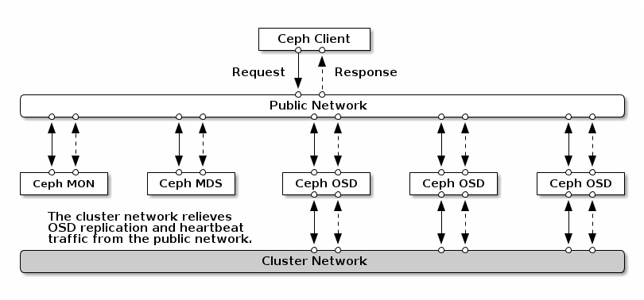

### IP Table（端口防火墙相关的）

>  IP Table 是 Linux 内核中用于实现防火墙功能的工具
>
> IP Table 提供了多种表（tables）和链（chains）来定义不同的防火墙规则。
>
> 表用于分类规则，而链则用于指定规则的执行顺序。
>
> 例如，在 filter 表中，有一个名为 INPUT 的链用于过滤进入本地的数据包，一个名为 OUTPUT 的链用于过滤本地生成的数据包，还有一个名为 FORWARD 的链用于过滤经过路由器的数据包。

默认情况下，Ceph各类型进程会绑定到 `6800:7568` 范围的端口。当然，可以自行指定这些端口。

首先检查 *iptables* 

```shell
sudo iptables -L
```

- 某些 Linux 发行版包含拒绝来自所有网络接口的所有入站请求（SSH 除外）的规则。例如：

  ```shell
  REJECT all -- anywhere anywhere reject-with icmp-host-prohibited
  ```

  需要在公共网络和集群网络上删除这些规则，并为待使用端口设定合适的规则

#### monitor 的IP Table

ceph-mon进程默认监听 `3300` 和 `6789` 端口。此外，ceph-mon通常在公共网络上运行。

当您使用下面的示例添加规则时，请确保将 {iface} 替换为公共网络接口（例如 eth0、eth1 等），将 {ip-address} 替换为公共网络的 IP 地址，将 {netmask} 替换与公共网络的网络掩码。

```shell
sudo iptables -A INPUT -i {iface} -p tcp -s {ip-address}/{netmask} --dport 6789 -j ACCEPT
```

#### MDS和MGR的IP Table

MDS进程和MGR进程监听公共网络上从 `6800` 开始的第一个可用端口

如果您在同一主机上运行多个 OSD 或 MDS，或者在不释放端口情况下重启进程时，新启动的进程将自动绑定到更高的端口。所以需要打开 `6800-7568` 的所有端口

```shell
sudo iptables -A INPUT -i {iface} -m multiport -p tcp -s {ip-address}/{netmask} --dports 6800:7568 -j ACCEPT
```

#### OSD的IP Table

默认情况，OSD进程绑定到Ceph节点上从6800开始的第一个可用端口，

如果您在同一主机上运行多个 OSD 或 MDS，或者在不释放端口情况下重启进程时，新启动的进程将自动绑定到更高的端口。所以需要打开 `6800-7568` 的所有端口

**Ceph 主机上的每个 Ceph OSD 守护进程最多使用四个端口**

- 1个用于与客户端和mon节点交互
- 1个用于与其他OSD进程发送数据
- 2个用于心跳监测（对每个接口的心跳监测）

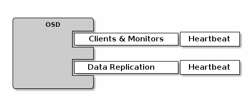

如果单独设置 *public network* 和 *cluster network* ，则必须为两种网络都添加规则，因为客户端使用公共网络与OSD通信，与其他OSD进程的通信需要使用集群网络

```shell
# 公网、 内网都要打开
sudo iptables -A INPUT -i {iface}  -m multiport -p tcp -s {ip-address}/{netmask} --dports 6800:7568 -j ACCEPT
```

### 网络配置

在ceph配置文件的 `[global]` section中进行网络配置，修改之后只需要重启相应的进程即可动态绑定网络。

#### 公共网络

```shell
[global]
        # ... elided configuration
        public_network = {public-network/netmask}
```

#### 集群网络

如果声明集群网络，OSD 将通过集群网络路由心跳、对象复制和恢复流量。

```shell
[global]
        # ... elided configuration
        cluster_network = {cluster-network/netmask}
```

为了增加安全性，我们希望无法从公共网络或 Internet 访问集群网络。

### Ceph进程的IP

#### mon进程的IP

每个监视器守护进程都需要被绑定到特定的IP地址上，这些IP地址通常用部署工具配置，Ceph集群中其他组件通过 `[global] mon_host` 参数配置项发现mon进程。

```shell
[global]
    mon_host = 10.0.0.2, 10.0.0.3, 10.0.0.4
```

`mon_host` 可以是IP地址，也可以是DNS名。对于具有多个A或AAAA记录的DNS名称，将探测所有记录以发现一个mon。一旦发现一个mon就会发现其他所有的mon。因此，`mon_host` 需要及时更新。

#### 其他进程的IP

MGR、OSD 和 MDS 守护程序将绑定到任何可用地址，并且不需要任何特殊配置。但是，可以为它们指定一个特定的 IP 地址，以便使用公共地址（和/或，对于 OSD 守护程序，集群地址）配置选项进行绑定。

```shell
[osd.0]
        public_addr = {host-public-ip-address}
        cluster_addr = {host-cluster-ip-address}
```

#### 单网卡双网络

可行但不推荐

Generally, we do not recommend deploying an OSD host with a single network interface in a cluster with two networks. However, you may accomplish this by forcing the OSD host to operate on the public network by adding a `public_addr` entry to the `[osd.n]` section of the Ceph configuration file, where `n` refers to the ID of the OSD with one network interface. Additionally, the public network and cluster network must be able to route traffic to each other, which we don’t recommend for security reasons.

### 网络相关的参数配置项

不需要网络配置设置。 Ceph 假定有一个公共网络，集群中所有主机都在其上运行，除非您专门配置集群网络。

#### 公共网络配置

公共网络可以配置特定的IP地址和子网。也可以为特定的进程专门分配静态IP

**public_network**

在 `[global]` section 中配置公网IP和公网掩码。格式为 ` {ip-address}/{netmask}[,{ip-address}/{netmask}]`

- str
- `192.168.0.0/24`

**public_addr**

为每个进程设置IP地址

- str

#### 集群网络配置

**cluster_network**

在 `[global]` section 中为集群网络设定指定的IP地址和掩码，格式为 `{ip- address}/{netmask} [, {ip-address}/{netmask}]`

- str
- 10.0.0.0/24

**cluster_addr**

为特定OSD设定IP地址

```shell
[osd.0]
    public_addr = {host-public-ip-address}
    cluster_addr = {host-cluster-ip-address}
[mon.noode1]
	public_addr = {host-public-ip-address}
    cluster_addr = {host-cluster-ip-address}
```

#### bind

bind设置OSD和MDS进程的默认端口范围，默认为 `6800:7568` 。设置前需要确保IP Table允许使用配置的端口，也可以绑定到IPV6地址

**ms_bind_port_min**

OSD或MDS进程可绑定端口的最小值，int

**ms_bind_port_max**

OSD或MDS进程可绑定端口的最大值，int

**ms_bind_ipv4**

允许Ceph进程绑定PIv4地址，bool

**ms_bind_ipv6**

允许Ceph进程绑定PIv6地址，bool

**public_bind_addr**

在某些动态部署中，MON进程可能会绑定到本地的IP地址，这些IP地址不同于其他节点的 `public_addr` 。环境必须确保正确设置路由规则。如果设置了public_bind_addr, Ceph监控守护进程将在本地绑定它，并在monmap中使用public_addr将其地址通告给对等节点。

`public_addr` 与 `public_bind_addr` 的绑定，指向同一节点，addr

#### TCP

默认情况是不允许TCP缓存的。

**ms_tcp_nodelay**

Ceph默认将 `ms_tcp_nodelay=true` ，以便立即发送每个请求（无缓冲）。禁用 Nagle 算法会增加网络流量，从而导致延迟。

如果遇到大量小数据包，可以尝试令 `ms_tcp_nodelay=false`。

**ms_tcp_rcvbuf**

网络连接接收端的套接字缓冲区的大小。默认禁用。

- type：size
- default：0B

#### 通用设置

**ms_type**

Async Messenger 使用的传输类型。可以是 async+posix、async+dpdk 或 async+rdma。

默认使用 Posix，其使用标准 TCP/IP 网络。其他类型是实验性的，并且支持可能有限

- str：“async+posix”
- 其取值会影响其他参数配置项的可用性
  - `ms_dpdk_XX`
  - `ms_rdma_XX`

**ms_async_op_threads**

每个 Async Messenger 实例使用的初始工作线程数。应至少等于最大副本数，但如果 CPU 核心数较少和/或在单个服务器上托管大量 OSD，则可以减少它。

- uint[1,24]

**ms_initial_backoff**

故障重新连接前的初始等待时间。

- float

**ms_max_backoff**

故障重新连接所需的最长等待时间。

- float

**ms_die_on_bad_msg**

调试选项;不要配置。

- bool

**ms_dispatch_throttle_bytes**

限制等待分发的消息的总大小。

- size

**ms_inject_socket_failures**

Debug option; do not configure.

**ms_learn_addr_from_peer**

使用第一个连接端的IP地址(通常是监视器)。如果客户端处于某种类型的NAT后，我们希望看到它由本地(非NAT)地址标识，这很有用。

### MESSENGER V2

> **messenger 是一个用于实现集群内节点间通信的协议**，Ceph的各个守护进程之间需要频繁地交换信息，以协调数据存储、副本管理、故障检测和恢复等操作。基于 Messenger，Ceph 能够有效地管理集群中的信息流动，如：进程间通信、心跳消息同步、日志消息、请求处理、进程状态更新等。

Messenger v2 协议（或 msgr2）是 Ceph 在线协议的第二个主要修订版

- 安全模式：加密通过网络传递的所有数据
- 改进了身份验证有效负载的封装，支持未来集成 Kerberos 等新身份验证模式
- 改进了早期的功能通告和协商，支持未来的协议修订

Ceph 守护进程现在可以绑定到多个端口，允许旧版 Ceph 客户端和新的支持 v2 的客户端连接到同一集群。

默认情况下，监视器现在绑定到 IANA-分配 的采用 msgr2 协议的新端口 3300（ce4h 或 0xce4），同时还绑定到旧 v1 协议的旧默认端口 6789。

#### 地址格式

在 Nautilus 之前，所有网络地址都呈现为 `1.2.3.4:567/89012`，

- IP:端口号/随机数

  随机数用于唯一标识网络上的客户端或守护程序

从N版开始，支持三种类型的地址格式

- v2: `v2:1.2.3.4:578/89012` 表示绑定到使用新 v2 协议的端口的守护进程

- v1: `v1:1.2.3.4:578/89012` 表示绑定到使用旧版 v1 协议的端口的守护程序。以前显示的带有任何前缀的任何地址现在显示为 v1: 地址。

- TYPE_ANY：`any:1.2.3.4:578/89012` 标识可以使用任一协议版本的客户端。在 Nautilus 之前，客户端将显示为 `1.2.3.4:0/123456` ，其中端口 0 表示它们是客户端并且不接受传入连接。

  从 Nautilus 开始，这些客户端现在在内部由 TYPE_ANY 地址表示，并且仍然不带前缀显示，因为它们可能使用 v2 或 v1 协议连接到守护程序，具体取决于守护程序使用的协议。

由于守护进程现在可以绑定到多个端口，因此它们由地址向量而不是单个地址来描述。例如，在 Nautilus 集群上dump monitor map 输出以下行

```shell
epoch 1
fsid 50fcf227-be32-4bcb-8b41-34ca8370bd16
last_changed 2019-02-25 11:10:46.700821
created 2019-02-25 11:10:46.700821
min_mon_release 14 (nautilus)
0: [v2:10.0.0.10:3300/0,v1:10.0.0.10:6789/0] mon.foo
1: [v2:10.0.0.11:3300/0,v1:10.0.0.11:6789/0] mon.bar
2: [v2:10.0.0.12:3300/0,v1:10.0.0.12:6789/0] mon.baz
```

`[]` 中的地址列表或向量意味着可以在多个端口（和协议）上访问同一个守护进程。

如果可能的话，连接到该守护程序的任何客户端或其他守护程序都将使用 v2 协议（首先列出）；否则它将返回到旧版 v1 协议。

旧客户端将只能看到 v1 地址，并将继续像以前一样使用 v1 协议进行连接。

从 Nautilus 开始，mon_host 配置选项和 -m <mon-host> 命令行选项支持相同的括号地址向量语法。

#### bind参数配置项

两个新的配置选项控制是否使用 v1 和/或 v2 协议：

- ms_bind_msgr1：[default: true] 控制守护进程是否绑定到使用 v1 协议的端口
- ms_bind_msgr2：[default: true] 控制守护进程是否绑定到使用 v2 协议的端口

同样，有两个选项控制是否使用 IPv4 和 IPv6 地址：

- ms_bind_ipv4： [default: true] controls whether a daemon binds to an IPv4 address
- ms_bind_ipv6

#### 连接模式

v2协议支持两种连接模式：

- crc 模式：

  建立连接时进行强大的初始身份验证（使用 cephx，双方进行相互身份验证，防止中间人或窃听者）

  CRC32C 完整性校验用于保护因不稳定硬件或宇宙射线引起的比特翻转。

  不支持：

  - 保密（网络上的窃听者可以看到所有经过身份验证的流量）
  - 防止恶意中间人（他们可以在流量经过时故意修改流量，只要他们小心调整 crc32c 值以匹配）

- secure 模式

  - 建立连接时进行强大的初始身份验证（使用 cephx，双方进行相互身份验证，防止中间人或窃听者）
  - 对所有身份验证后流量进行完全加密，包括加密完整性检查。

在 Nautilus 中，安全模式使用 AES-GCM 流密码，该密码在现代处理器上通常非常快（例如，比 SHA-256 加密哈希更快）。

#### 压缩模式

v2协议支持两种压缩模式：

- `force` ：

  在多可用区域(zones)中部署集群，压缩 OSD 之间的复制消息可以节省延迟。

  在公有云中，可用区域(zones)的通信非常昂贵。因此，最小化消息大小可以降低云提供商的网络成本。

  当在 AWS（可能还有其他公共云）上使用实例存储时，具有 NVMe 的实例提供的网络带宽相对于设备带宽较低。在这种情况下，NW 压缩可以提高整体性能，因为这显然是瓶颈。

- `none` ：消息在不压缩的情况下传输。

相关参数配置项见 [参数分析]

#### 从仅 V1 过渡到 V2-PLUS-V1

https://docs.ceph.com/en/quincy/rados/configuration/msgr2/#transitioning-from-v1-only-to-v2-plus-v1

[UPDATING CEPH.CONF AND MON_HOST](https://docs.ceph.com/en/quincy/rados/configuration/msgr2/#updating-ceph-conf-and-mon-host)

## Cephx

CephX 协议默认启用。 CephX 提供的加密身份验证具有一定的计算成本，但是它们通常应该相当低。

如果连接客户端和服务器主机的网络环境非常安全并且您无法承担身份验证，则可以禁用它。**通常不建议禁用身份验证**。

- 如果禁用身份验证，您将面临中间人攻击的风险，该攻击会更改您的客户端/服务器消息，这可能会产生灾难性的安全影响。

For information about creating users, see [User Management](https://docs.ceph.com/en/quincy/rados/operations/user-management). 

For details on the architecture of CephX, see [Architecture - High Availability Authentication](https://docs.ceph.com/en/quincy/architecture#high-availability-authentication).

### 部署CEPHX

CephX 的最初配置取决于Ceph的部署场景。部署Ceph集群有两种常见的策略

- 如果您是第一次使用 Ceph，您可能应该采用最简单的方法：使用 cephadm 部署集群
- 但是，如果您的集群使用其他部署工具（例如 Ansible、Chef、Juju 或 Puppet），您将需要使用手动部署过程或配置您的部署工具，以便它引导您的监视器。

手动部署：手动部署集群时，需要手动引导监视器并创建 client.admin 用户和密钥环。要引导监视器，请按照 [Monitor Bootstrapping](https://docs.ceph.com/en/quincy/install/manual-deployment#monitor-bootstrapping)中的步骤操作。使用第三方部署工具（例如 Chef、Puppet 和 Juju）时请按照以下步骤操作。

### 启用/禁用 CEPHX

仅当您的监视器、OSD 和元数据服务器的密钥已部署时，才可以启用 CephX。如果您只是打开或关闭 CephX，则无需重复引导过程。

#### 启用CEPHX

当CephX启用时，Ceph将在默认搜索路径中查找密钥环：该路径包括 `/etc/ceph/$cluster.$name.keyring` 

- 可以通过在 Ceph 配置文件的 [global] 部分添加 `keyring` 选项来覆盖此搜索路径位置，但不建议这样做。

要在已禁用身份验证的集群上启用 CephX，请执行以下过程

- 如果您（或您的部署实用程序）已经生成了密钥，则可以跳过与生成密钥相关的步骤。

1. 创建一个 client.admin 密钥，并为您的客户端主机保存该密钥的副本：

   ```shell
   ceph auth get-or-create client.admin mon 'allow *' mds 'allow *' mgr 'allow *' osd 'allow *' -o /etc/ceph/ceph.client.admin.keyring
   ```

   警告：此步骤将破坏任何现有的 /etc/ceph/client.admin.keyring 文件。如果部署工具已为您生成密钥环文件，请不要执行此步骤。当心！

2. 创建监视器密钥环并生成监视器密钥：

   ```shell
   ceph-authtool --create-keyring /tmp/ceph.mon.keyring --gen-key -n mon. --cap mon 'allow *'
   ```

3. 对于每个监视器，将监视器密钥环复制到监视器 mon 数据目录中的 ceph.mon.keyring 文件中。例如，要将监视器密钥环复制到名为 ceph 的集群中的 mon.a，请运行以下命令：

   ```shell
   cp /tmp/ceph.mon.keyring /var/lib/ceph/mon/ceph-a/keyring
   ```

4. 为每个 MGR 生成一个密钥，其中 {$id} 是 MGR 的id：

   ```shell
   ceph auth get-or-create mgr.{$id} mon 'allow profile mgr' mds 'allow *' osd 'allow *' -o /var/lib/ceph/mgr/ceph-{$id}/keyring
   ```

5. 为每个 OSD 生成一个密钥，其中 {$id} 是 OSD 编号：

   ```shell
   ceph auth get-or-create osd.{$id} mon 'allow rwx' osd 'allow *' -o /var/lib/ceph/osd/ceph-{$id}/keyring
   ```

6. 为每个 MDS 生成一个密钥，其中 {$id} 是 MDS 字母：

   ```shell
   ceph auth get-or-create mds.{$id} mon 'allow rwx' osd 'allow *' mds 'allow *' mgr 'allow profile mds' -o /var/lib/ceph/mds/ceph-{$id}/keyring
   ```

7. 通过在 Ceph 配置文件的 [global] 部分中设置以下选项来启用 CephX 身份验证

   ```shell
   auth_cluster_required = cephx
   auth_service_required = cephx
   auth_client_required = cephx
   ```

8. 启动或重新启动 Ceph 集群。详情请参见操作集群。

#### 禁用CEPHX

以下过程描述了如何禁用 CephX。如果您的集群环境是安全的，您可能需要禁用 CephX 以抵消运行身份验证的计算费用。我们不建议这样做。

但是，如果在配置和故障排除是短暂禁用身份验证并随后重新启用，可能会更容易。

1. 通过在 Ceph 配置文件的 [global] 部分中设置以下选项来禁用 CephX 身份验证：

   ```shell
   auth_cluster_required = none
   auth_service_required = none
   auth_client_required = none
   ```

2. 重启集群

#### SIGNATURES

Ceph 执行签名检查，提供一些有限的保护，防止消息在传输过程中被篡改（例如，“中间人”攻击）。

与 Ceph 身份验证的其他部分一样，签名允许进行细粒度控制。您可以启用或禁用客户端和 Ceph 之间的服务消息以及 Ceph 守护程序之间的消息的签名。

请注意，即使启用签名，数据也不会在传输过程中加密。

### KEYS

当Ceph在启用身份验证的情况下运行时，Ceph管理命令和Ceph客户端只有使用身份验证密钥才能访问Ceph集群

使这些密钥可供 ceph 管理命令和 Ceph 客户端使用的最常见方法是在 /etc/ceph 目录下包含 Ceph keyring。

对于使用cephadm的O版及更高的版本，文件名常为 `ceph.client.admin.keyring` 。如果keyring 包含在 */etc/ceph* 目录中，则无需再Ceph配置文件中指定keyring配置项

由于Ceph存储集群的 密钥环 文件包含 *client.admin* 密钥，因此，我们建议将密钥环文件复制到运行管理命令的管理节点

手动执行步骤

```shell
sudo scp {user}@{ceph-cluster-host}:/etc/ceph/ceph.client.admin.keyring /etc/ceph/ceph.client.admin.keyring
```

- 确保 ceph.keyring 文件在客户端主机上设置了适当的权限（例如 chmod 644）。

可以使用 Ceph 配置文件中的密钥设置来指定密钥内容（不推荐这种方法），或者使用 Ceph 配置文件中 keyfile 参数配置项指定密钥文件

`key` ：指定密钥本身的文本字符串。我们不建议您使用此设置，除非您知道自己在做什么。

`keyfile` ：密钥文件的路径（即仅包含密钥的文件）。

`keyring` ：密钥环文件的路径。

### 守护进程 keyrings

管理用户或部署工具（例如，cephadm）生成守护进程 keyring 的方式与生成用户 keyring 的方式相同。默认情况下，Ceph 将守护进程的 keyring 存储在该守护进程的数据目录中。默认 keyrings 位置和守护程序运行所需的 function（权限？） 如下所示。

|          | Location            | Capabilities                                                 |
| -------- | ------------------- | ------------------------------------------------------------ |
| ceph-mon | `$mon_data/keyring` | `mon 'allow *'`                                              |
| ceph-osd | `$osd_data/keyring` | `mgr 'allow profile osd' mon 'allow profile osd' osd 'allow *'` |
| ceph-mds | `$mds_data/keyring` | `mds 'allow' mgr 'allow profile mds' mon 'allow profile mds' osd 'allow rwx'` |
| ceph-mgr | `$mgr_data/keyring` | `mon 'allow profile mgr' mds 'allow *' osd 'allow *'`        |
| radosgw  | `$rgw_data/keyring` | `mon 'allow rwx' osd 'allow rwx'`                            |

监视器 keyring（即 mon.）包含密钥但没有权限，并且此 keyring 不是集群身份验证(auth)数据库的一部分。

- 守护进程的数据目录位置默认为以下形式的目录：

  ```shell
  /var/lib/ceph/$type/$cluster-$id
  
  # For example, osd.12 would have the following data directory:
  /var/lib/ceph/osd/ceph-12
  ```

- 可以覆盖这些位置，但不建议这样做。

## monitor

了解如何配置 Ceph Monitor 是构建可靠的 Ceph 存储集群的重要组成部分。

**所有 Ceph 存储集群都至少有一台监视器**。

所有监视器的配置通常保持相对一致，但你可以在集群中添加、移除或替换监视器。详见添加/移除监视器的详细信息。

### 背景

Ceph 监视器维护集群映射 (cluster map) 的“主副本”。

Ceph 客户端必须连接到 Ceph Monitor，然后才能读取或写入 Ceph OSD 守护进程或 Ceph 元数据服务器。客户端通过连接到一个 Ceph Monitor 并检索当前 cluster map ，Cluster Map 使 Ceph 客户端能够确定所有 Ceph 监视器、Ceph OSD 守护进程和 Ceph 元数据服务器的位置。拥有当前 cluster map 副本和 CRUSH 算法的 Ceph 客户端可以计算集群内任何 RADOS 对象的位置。这使得 Ceph 客户端可以直接与 Ceph OSD 守护进程对话。

- 客户端和 Ceph OSD 守护进程之间的直接通信改进了需要客户端与中央组件进行通信的传统存储架构。

Ceph Monitor 的主要功能是维护 Cluster map 的主副本。监视器服务中的所有更改都由 Ceph Monitor 写入单个 Paxos 实例，Paxos 将更改写入键/值存储。这提供了强一致性。Ceph Monitors 能够在同步操作期间查询最新版本的集群映射，并且它们使用键/值存储的快照 (snapshots) 和迭代器（使用 RocksDB）来执行存储范围的同步。

监视器还提供身份验证和日志记录服务。

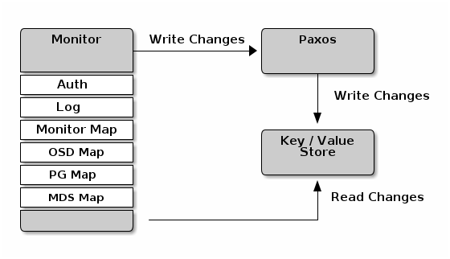

#### cluster map

Cluster map 是映射的组合，包括 the monitor map, the OSD map, the placement group map and the metadata server map。

Clsuter map跟踪很多重要事情：

- Ceph 存储集群中有哪些进程 `in` ；
- Ceph 存储集群中的哪些 `in` 进程处于启动和运行 `up` 或关闭 `down` 状态；
- PG是活动的 `active` 还是非活动的 `inactive` ，干净的 `clean` 还是处于其他状态；
- 以及反映集群当前状态的其他详细信息，例如存储空间总量和使用的存储量。

当集群状态发生重大变化时（例如，Ceph OSD 守护进程关闭、PG陷入降级状态degraded等），Cluster map 会更新以反映集群的当前状态。

此外，Ceph Monitor 还维护集群先前状态的历史记录。Mon map、OSD map、PG map和 MDS map 均维护其 map 版本的历史记录。我们将每个版本称为“epoch”。

操作 Ceph 存储集群时，跟踪这些状态是系统管理职责的重要组成部分。

#### 监控法定人数

我们的 配置ceph部分 提供了一个简单的 Ceph 配置文件，该文件在测试集群中提供一个监视器。

集群只需一个监视器就可以正常运行；然而，单个监视器是单点故障。为了确保生产 Ceph 存储集群的高可用性，您应该使用多个监视器运行 Ceph，这样单个监视器的故障不会导致整个集群瘫痪。

当 Ceph 存储集群运行多个 Ceph Monitor 以实现高可用性时，Ceph Monitor 使用 Paxos 建立有关主集群映射的共识。达成共识需要运行大多数监视器来建立关于集群图的共识的法定人数（例如，1 个；3 个中的 2 个；5 个中的 3 个；6 个中的 4 个；等等）。

`mon_force_quorum_join` 

#### 一致性

当向 Ceph 配置文件添加 监视器设置 时，您需要了解 Ceph 监视器的一些架构方面。

当发现集群中的另一个 Ceph Monitor 时，**Ceph 对 Ceph Monitor 施加严格的一致性要求**。然而，Ceph 客户端和其他 Ceph 守护进程使用 Ceph 配置文件来发现监视器，监视器使用监视器映射（monmap）而不是 Ceph 配置文件来发现彼此。

当发现 Ceph 存储集群中的其他 Ceph Monitor 时，Ceph Monitor 始终引用 monmap 的本地副本。使用 monmap 而不是 Ceph 配置文件可以避免可能破坏集群的错误（例如，指定监视器地址或端口时 ceph.conf 中的拼写错误）。

- 如果 Ceph 监视器通过 Ceph 配置文件而不是通过 monmap 来发现彼此，则会引入额外的风险，因为 Ceph 配置文件不会自动更新和分发。Ceph Monitor 可能会无意中使用较旧的 Ceph 配置文件、无法识别 Ceph Monitor、超出法定人数或出现 Paxos 无法准确确定系统当前状态的情况。

由于监视器使用 monmap 进行发现，并且它们与客户端和其他 Ceph 守护进程共享 monmap，因此 **monmap 为监视器提供严格保证，确保其共识有效**。

严格一致性也适用于 monmap 的更新。与 Ceph Monitor 上的任何其他更新一样，**对 monmap 的更改始终通过称为 Paxos 的分布式共识算法运行**。Ceph 监视器必须就 monmap 的每次更新达成一致，例如添加或删除 Ceph 监视器，以确保仲裁中的每个监视器都具有相同版本的 monmap。

- monmap 的更新是增量式的，以便 Ceph Monitors 拥有最新商定的版本和一组以前的版本。
- 维护历史记录使具有旧版本 monmap 的 Ceph Monitor 能够赶上 Ceph 存储集群的当前状态。

#### 引导monitor

在大多数部署和配置情况下，Ceph 部署工具通过为您生成 monitor map 来帮助引导 Ceph 监控器（例如 cephadm 等）。Ceph Monitor 需要一些显式设置：

- 文件系统ID：`fsid` 是对象存储的唯一标识符。由于您可以在同一硬件上运行多个集群，因此在引导监视器时必须指定对象存储的唯一 ID。

  部署工具通常会为您执行此操作（例如，cephadm 可以调用 uuidgen 等工具），但您也可以手动指定 fsid。

- monitor ID：监视器 ID 是分配给集群内每个监视器的唯一 ID。它是一个字母数字值，按照惯例，标识符通常遵循字母顺序增量（例如，a、b 等）。

  这可以通过部署工具或使用 ceph 命令行在 Ceph 配置文件（例如 [mon.a]、[mon.b] 等）中进行设置。

- Keys ：监视器必须有密钥。 cephadm 等部署工具通常会为您执行此操作，但您也可以手动执行此步骤。有关详细信息，请参阅 [监控密钥](https://docs.ceph.com/en/latest/dev/mon-bootstrap#secret-keys) 。

有关引导的其他详细信息，[Bootstrapping a Monitor](https://docs.ceph.com/en/latest/dev/mon-bootstrap).

### Monitor 的参数配置项

要将参数配置项的设置应用于整个集群，请在 [global] 下输入配置设置。

要将参数配置项的设置应用于集群中的所有监视器 (monitors)，请在 [mon] 下输入配置设置

要将参数配置项的设置应用于特定监视器(monitor)，请指定监视器实例（例如，[mon.a]）

按照约定，监视器实例名称使用字母表示法。

```
[global]
[mon]
[mon.a]
[mon.b]
[mon.c]
```

#### 最小配置

通过 Ceph 配置文件对 Ceph 监视器进行的最低限度监视器设置包括每个监视器的主机名和网络地址。在 `[mon]` 或特定 monitor 条目下配置

```
[global]
        mon_host = 10.0.0.2,10.0.0.3,10.0.0.4
[mon.a]
        host = hostname1
        mon_addr = 10.0.0.10:6789
```

- 此监视器的最低配置假设部署工具生成 fsid 和 mon. 密钥

一旦部署了 Ceph 集群，就不应该更改monitor的 IP 地址。

- 但是，如果您决定更改显示器的 IP 地址，则必须遵循特定程序（[Changing a Monitor’s IP Address](https://docs.ceph.com/en/latest/rados/operations/add-or-rm-mons/#changing-a-monitor-s-ip-address) ）。有关详细信息，请参阅更改监视器的 IP 地址。

客户端还可以使用 DNS SRV 记录找到监视器。 [Monitor lookup through DNS](https://docs.ceph.com/en/latest/rados/configuration/mon-lookup-dns)

#### 集群ID

每个 Ceph 存储集群都有一个唯一的标识符 (fsid)。如果指定，它通常出现在配置文件的 [global] 部分下。部署工具通常会生成 fsid 并将其存储在监控映射中，因此该值可能不会出现在配置文件中。fsid 使得在同一硬件上运行多个集群的守护进程成为可能。

`fsid` 

#### 初始成员

我们建议运行具有至少三个 Ceph Monitor 的生产 Ceph 存储集群，以确保高可用性。当您运行多个监视器时，您可以指定必须是集群成员的初始监视器才能建立仲裁。这可能会减少集群上线所需的时间。

```
[mon]
        mon_initial_members = a,b,c
```

**mon_initial_members**

> 集群中的大多数监视器必须能够相互访问才能建立法定人数。您可以使用此设置减少监视器的初始数量以建立仲裁

#### DATA

Ceph 提供了 Ceph Monitor 存储数据的默认路径。为了在生产环境的 Ceph 存储集群中获得最佳性能，我们建议在与 Ceph OSD 守护程序不同的主机和驱动器上运行 Ceph 监视器。

由于 RocksDB 使用 mmap() 写入数据，Ceph 监视器经常将数据从内存刷新到磁盘，如果数据存储与 OSD 守护进程位于同一位置，这可能会干扰 Ceph OSD 守护进程工作负载。

- 在 Ceph 0.58 及更早版本中，Ceph 监视器将其数据存储在纯文件中。这种方法允许用户使用 ls 和 cat 等常用工具检查监控数据。然而，这种方法并没有提供强一致性。
- 在 Ceph 0.59 及更高版本中，Ceph 监视器将其数据存储为键/值对。 Ceph 监视器需要 ACID 事务。使用数据存储可以防止通过 Paxos 恢复运行损坏版本的 Ceph Monitor，并且它可以在单个原子批次中实现多个修改操作，还有其他优点。

一般来说，我们不建议更改默认数据位置。如果您修改默认位置，我们建议您通过在配置文件的 [mon] 部分中进行设置，使其在 Ceph 监视器之间保持一致。

https://docs.ceph.com/en/quincy/rados/configuration/mon-config-ref/

#### 存储容量

当 Ceph 存储集群接近其最大容量时（请参阅 `mon_osd_fullratio` ），Ceph 会阻止您写入或读取 OSD，作为防止数据丢失的安全措施。因此，让生产 Ceph 存储集群接近其满配率并不是一个好的做法，因为它会牺牲高可用性。默认满率为 0.95，即容量的 95%。对于具有少量 OSD 的测试集群来说，这是一个非常激进的设置。

> 监控集群时，请警惕与 `nearfull` 相关的警告。这意味着如果一个或多个 OSD 发生故障，某些 OSD 发生故障可能会导致服务暂时中断。考虑添加更多 OSD 以增加存储容量。

在常见的测试集群场景中，系统管理员会从 Ceph 存储集群中移除一个 OSD（对象存储守护进程），观察集群重新平衡，然后移除另一个 OSD，再移除另一个，直到至少有一个 OSD 最终达到满载比例，集群就会锁定。即使对于测试集群，我们也推荐进行一些容量规划。规划可以帮助你评估为了保持高可用性所需的备用容量。理想情况下，你应该计划一系列 Ceph OSD 守护进程的故障，使得集群能够在不立即替换这些 OSD 的情况下恢复到 `active+clean` 状态。集群操作在 `active+degraded` 状态下仍可以继续操作，但这并不理想，应该尽快解决。

> 下图描述了一个简单的 Ceph 存储集群，包含 33 个 Ceph 节点，每个主机有一个 OSD，每个 OSD 读取和写入 3TB 驱动器。
>
> 因此，这个示例性 Ceph 存储集群的最大实际容量为 99TB。当 mon osd full 比率为 0.95 时，如果 Ceph 存储集群的剩余容量降至 5TB，集群将不允许 Ceph 客户端读写数据。所以Ceph存储集群的运行容量是95TB，而不是99TB。
>
> 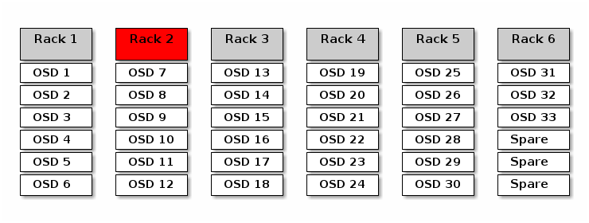

在这样的集群中，一两个 OSD 出现故障是正常的。一种不太常见但合理的情况是机架的路由器或电源发生故障，这会同时关闭多个 OSD（例如 OSD 7-12）。

在这种情况下，可以通过短时间内添加一些带有额外 OSD 的主机，让集群保持运行并恢复为 `active+clean` 状态

如果容量利用率太高，您可能不会丢失数据，但如果集群的容量利用率超过满配比，您在解决故障域内的中断时仍然可能会牺牲数据可用性。因此，我们建议至少进行一些粗略的容量规划。

> 确定您的集群的两个数字：
>
> - OSD数量
> - 集群的总用量
>
> 如果将集群的总容量除以集群中 OSD 的数量，您将得到集群中 OSD 的平均容量。考虑将 OSD 的平均容量 乘以您预计在正常操作期间将同时发生故障的 OSD 数量（相对较小的数字）。最后将集群的容量乘以满配比，得到最大运行容量；然后，从您预计无法达到合理满率的 OSD 中减去数据量。
>
> 对更多数量的 OSD 故障（例如，一个 OSD 机架）重复上述过程，以获得接近满率的合理值。

以下设置仅适用于集群创建，然后存储在 OSDMap 中。澄清一下，在正常操作中，**OSD 使用的值是 OSDMap 中的值**，而不是配置文件或中央配置存储中的值。

- **这些设置仅在集群创建期间应用。之后需要使用 ceph osd set-nearfull-ratio 和 ceph osd set-full-ratio 在 OSDMap 中更改它们**

mon_osd_full_ratio

mon_osd_backfillfull_ratio

mon_osd_nearfull_ratio

> 如果某些 OSD 接近满，但其他 OSD 有足够的容量，则您为接近满的 OSD 设置的 CRUSH 权重可能不准确。

#### 监控器存储同步(MONITOR_STORE_SYNCHRONIZATION)

当您运行具有多个监视器的生产集群时（推荐），每个监视器都会检查相邻监视器是否具有较新版本的 cluster map （例如，相邻监视器中的 map 的一个或多个 epoch 高于当前监视器 map 中的最新epoch）。

集群中的一个监视器可能会周期性地落后于其他监视器，以至于它必须离开仲裁，同步以检索有关集群的最新信息，然后重新加入仲裁。为了同步的目的，监视器可以承担以下三个角色之一：

- Leader：Leader是第一个实现最新Paxos版本集群map的监视器。
- Provider：Provider 是一个拥有最新版本的集群映射的监视器，但并不是第一个实现最新版本的监视器。
- Requester：Requester 是落后于领导者的监视器，必须进行同步，以便在重新加入仲裁之前检索有关集群的最新信息

这些角色使 Leader 能够将同步职责委托给 Provider ，从而防止过多同步请求使Leader 过载。在下图中，Requester了解到它落后于其他监视器。Requester要求Leader同步，Leader告诉Requester与哪个Provider同步。

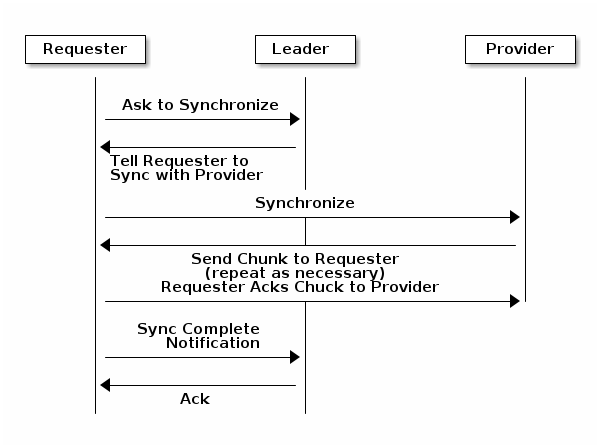

当新监视器加入集群时，总是会发生同步。在运行期间操作，监视器可以在不同时间接收 cluster map 的更新。这意味着 Provider 和 Leader 角色可能从一个监视器迁移到另一个监视器。如果在同步时发生这种情况（例如，Provider落后于 Leader），则Provider可以终止与Requester的同步。

同步完成后，Ceph 会在集群执行修剪。修剪之后要求 PG 处于 `active+clean` 状态。

#### 时钟

Ceph 守护进程相互传递关键消息，这些消息必须在守护进程达到超时阈值之前得到处理。如果 Ceph 监视器中的时钟不同步，可能会导致许多异常情况。

- 守护进程忽略收到的消息（例如，时间戳已过时） 
- 当未及时收到消息时，超时触发得太早/太晚。

您必须在 Ceph 监控主机上配置 NTP 或 PTP 守护进程，以确保监控集群以同步时钟运行。让监视器主机彼此同步以及与多个质量上行时间源同步是有利的。

即使使用了 NTP，时钟偏差仍然可能明显，尽管这种偏差尚未造成危害。即使在 NTP 保持了合理的同步水平的情况下，Ceph 的时钟偏差/时钟偏差警告也可能被触发。在这种情况下，增加时钟偏差可能是可以容忍的；然而，诸如工作负载、网络延迟、配置默认超时的覆盖以及 Monitor 存储同步设置等多个因素可能会影响可接受的时钟偏差水平，而不会损害 Paxos 保证。

#### 客户端


#### Pool 设置

从版本 v0.94 开始，支持池标志，允许或禁止对池进行更改。如果配置适当，监视器还可以禁止删除池。这种拦截机制所带来的不便远不及池误删的代价。

#### 通过 DNS 查找监视器

从 Ceph 11.0.0 版本（Kraken）开始，RADOS 支持通过 DNS 查找监视器。添加通过 DNS 查找监视器的功能意味着守护进程和客户端不需要在其 ceph.conf 配置文件中使用 mon 主机配置指令。

通过 DNS 更新，客户端和守护程序可以了解监视器拓扑中的更改。为了更精确和技术性，客户端使用 DNS SRV TCP 记录查找监视器。

默认情况下，客户端和守护程序会查找名为 ceph-mon 的 TCP 服务，该服务由 mon_dns_srv_name 配置指令进行配置。

https://docs.ceph.com/en/quincy/rados/configuration/mon-lookup-dns/#example

### Heartbeat

<span id="mon_osd_interaction"></span>

Ceph 监视器要求每个 OSD 的报告以及从 OSD 接收有关其相邻 OSD 状态的报告，进而了解集群。Ceph为 monitor/OSD 交互提供合理的默认参数配置值；但是，您可以根据需要修改它们。有关详细信息，请参阅 [Monitor/OSD Interaction](https://docs.ceph.com/en/quincy/rados/configuration/mon-osd-interaction) 。

完成初始 Ceph 配置后，您可以部署并运行 Ceph。

当您执行 ceph health 或 ceph -s 等命令时，Ceph Monitor 会报告 Ceph 存储集群的当前状态。Ceph Monitor 需要来自每个 Ceph OSD 守护进程的报告以及从 Ceph OSD 守护进程接收有关其相邻 Ceph OSD 守护进程状态的报告，来了解 Ceph 存储集群。

如果 Ceph Monitor 未收到报告，或者收到有关 Ceph 存储集群中更改的报告，Ceph Monitor 会更新 Ceph Cluster Map 的状态。

Ceph 为 Ceph Monitor/Ceph OSD Daemon 交互提供合理的默认设置。但是，您可以覆盖默认值。以下部分描述了 Ceph 监视器和 Ceph OSD 守护进程如何交互以监视 Ceph 存储集群

#### OSDS 检查心跳

每个 Ceph OSD 守护进程以小于每 6 秒的随机间隔检查其他 Ceph OSD 守护进程的心跳。如果相邻的 Ceph OSD 守护进程在 20 秒的宽限期内没有显示心跳，Ceph OSD 守护进程可能会认为相邻的 Ceph OSD 守护进程已关闭 `down` ，并将其报告给 Ceph 监视器，后者将更新 Ceph 集群映射。

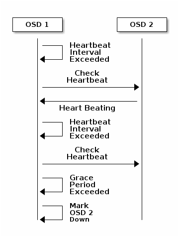

您可以通过在 Ceph 配置文件的 [mon] 和 [osd] 或 [global] 部分下添加 osd 心跳宽限设置来更改此宽限期，或者通过在运行时设置该值

#### OSDS 报告 OSDS down

默认情况下，来自不同主机的两个 Ceph OSD 守护进程必须向 Ceph 监视器报告另一个 Ceph OSD 守护进程已关闭 `down` ，然后 Ceph 监视器才会确认所报告的 Ceph OSD 守护进程已关闭 `down` 。

但有可能所有报告故障的 OSD 都托管在一个交换机损坏的机架中，导致无法连接到另一个 OSD。为了避免这种误报，我们将报告故障的对等点视为整个集群上潜在“子集群”的代理，该“子集群”也同样滞后。这显然并非在所有情况下都是正确的，但有时会帮助我们将宽限修正定位到不满意的系统子集。

`mon_osd_reporter_subtree_level` 用于根据 CRUSH 映射中的共同祖先类型将对等点分组到“子集群”中。默认情况下，只需要来自不同子树的两个报告即可报告另一个 Ceph OSD 守护进程关闭`down`。

您可以通过在 Ceph 配置文件的 [mon] 部分下添加 `mon_osd_min_down_reporters` 和 `mon_osd_reporter_subtree_level` 设置，或者在运行时设置值，来更改从唯一子树报告者的数量和向 Ceph Monitor 报告 Ceph OSD 守护进程所需的公共祖先类型。

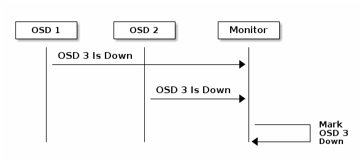

#### OSDS报告 peering 失败

如果 Ceph OSD 守护进程无法与其 Ceph 配置文件（或集群映射）中定义的任何 Ceph OSD 守护进程对等，它将每 30 秒 ping 一次 Ceph 监视器以获取集群映射的最新副本。您可以通过在 Ceph 配置文件的 [osd] 部分下添加 `osd_mon_heartbeat_interval` 设置或在运行时设置值来更改 Ceph Monitor 心跳间隔。

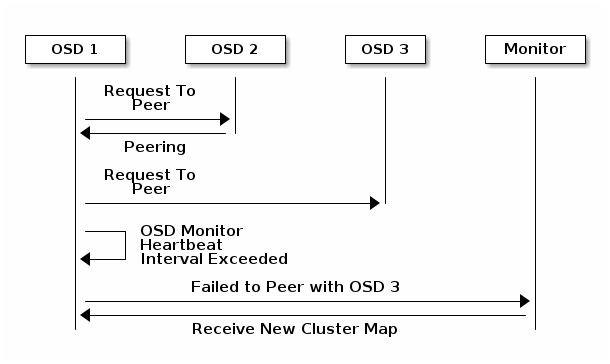

#### OSDS报告其 status

如果 Ceph OSD 守护进程不向 Ceph Monitor 报告，Ceph Monitor 将在 `mon_osd_report_timeout` 后认为 Ceph OSD 守护进程已关闭`down` 。

当发生可报告事件（例如故障、置放组统计数据更改、up_thru 更改或在 5 秒内启动时）时，Ceph OSD 守护进程会向 Ceph 监视器发送报告。您可以通过在 Ceph 配置文件的 [osd] 部分下添加 `osd_mon_report_interval` 设置或在运行时设置值来更改 Ceph OSD 守护进程最小报告间隔。

Ceph OSD 守护进程每 120 秒向 Ceph 监视器发送一次报告，无论是否发生任何显着变化。您可以通过在 Ceph 配置文件的 [osd] 部分下添加 `osd_mon_report_interval_max` 最大设置或在运行时设置该值来更改 Ceph 监视器报告间隔。

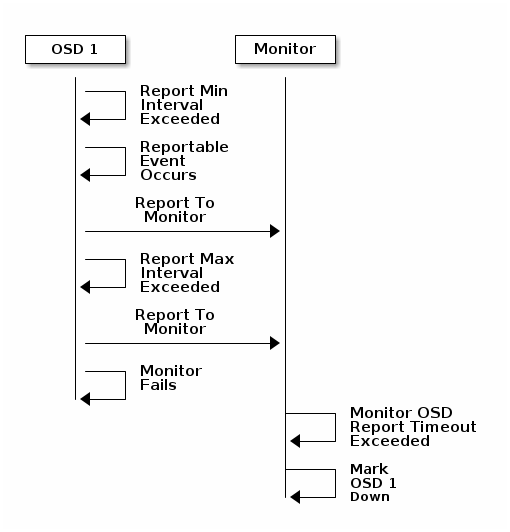

修改心跳设置时，应将它们包含在配置文件的 [global] 部分中。

## OSD

可以在 Ceph 配置文件ceph.conf中配置 Ceph OSD 进程，或在最新的版本中，配置在配置中心数据库中。但Ceph OSD 能使用默认值进行最小配置。一个最小的Ceph OSD 进程配置是设定 `host` 并且对所有配置项使用默认值

Ceph OSD 进程由从0开始的增量方式进行数字标识

```
osd.0
osd.1
osd.2
```

在配置文件中，您可以通过将配置设置添加到配置文件的 [osd] 部分来指定集群中所有 Ceph OSD 守护进程的设置。要将设置直接添加到特定的 Ceph OSD 守护进程（例如主机），请将其输入到配置文件的 OSD 特定部分。例如：

```
[osd]
        osd_journal_size = 5120

[osd.0]
        host = osd-host-a

[osd.1]
        host = osd-host-b
```

### 通用配置

以下设置提供 Ceph OSD 守护进程的 ID，并确定数据和日志的路径。 Ceph 部署脚本通常会自动生成 UUID。

> 不要更改数据或日志的默认路径，因为这会使以后排除 Ceph 故障变得更加困难。

**osd_uuid** / **osd_data** / **osd_max_write_size** / **osd_max_object_size** / **osd_client_message_size_cap** / **osd_class_dir**

### monitor与 OSD 的交互

Ceph OSD 守护进程检查彼此的心跳并定期向监视器报告。 Ceph 在很多情况下可以使用默认值。但是，如果您的网络存在延迟问题，您可能需要采用更长的间隔。有关心跳的详细讨论，请参阅配置[Configuring Monitor/OSD Interaction](https://docs.ceph.com/en/latest/rados/configuration/mon-osd-interaction)。 [本文](#mon_osd_interaction)

### 清洗

Ceph 确保数据完整性的一种方法是“清理” (scrubbing) 归置组。Ceph 清理类似于对象存储层上的 fsck。

Ceph 为 PG 中所有对象的生成一个目录，并将每个主对象与其副本进行比较，确保没有对象丢失或不匹配。

浅清洗检查对象的大小和属性，并且通常每天清洗一次。深度清洗读取数据并使用校验和来确保数据完整性，通常每周进行一次。

深度清洗和浅清洗的频率由集群的配置项决定，该配置完全由用户控制。

尽管清理对于维护数据完整性很重要，但它会降低 Ceph 集群的性能。您可以调整以下设置来增加或减少擦洗操作的频率和深度。

### 基于MCLOCK的QOS

Ceph 对 mClock 的使用现在更加精细，可以按照[mClock 配置参考](https://docs.ceph.com/en/quincy/rados/configuration/mclock-config-ref)中描述的步骤使用。

#### 核心概念

[Ceph 的 QoS 支持使用基于dmClock 算法](https://www.usenix.org/legacy/event/osdi10/tech/full_papers/Gulati.pdf) 的队列调度器实现。该算法按权重比例分配 Ceph 集群的 I/O 资源，并**强制执行最小预留和最大限制的约束，以便服务可以公平地竞争资源**。目前 *mclock_scheduler*操作队列将涉及 I/O 资源的 Ceph 服务分为以下几个 bucket：

- client op(客户端操作): 客户端发出的iops
- osd subop(OSD子操作): 主OSD发出的iops
- snap trim(快照修建)：与 snap trim 相关的请求
- pg recovery(PG恢复)：恢复相关请求
- pg scrub (PG清理)：与scrub相关的请求

并且使用以下三组标签来划分资源。换句话说，每种类型的服务的份额由三个标签控制：

1. 预留(reservation)：为服务分配的最小 IOPS。
2. 限制(limitation)：为服务分配的最大 IOPS。当lim为0，表示最大值，无上限
3. 权重(weight)：如果出现额外容量或系统超额认购的情况，则按比例分配容量。

在 Ceph 中，操作以“成本”进行分级。而为各种服务分配的资源则由这些“cost”表示。因此，因此，例如，一个服务拥有的预留越多，只要它需要，它就能保证拥有更多的资源。假设有2种服务：恢复和客户端操作：

- 恢复：(r:1, l:5, w:1)
- 客户端操作：(r:2, l:0, w:9)

上述设置确保恢复服务每秒获取的服务请求数不会超过5个，并且没有其他服务与之竞争，即使它需要更多（参见下面的当前实现说明）。但是，如果客户端开始发出大量I/O请求，它们也不会耗尽所有I/O资源。只要有任何此类请求，恢复作业总是被分配每秒1个请求。因此，即使在负载较高的集群中，恢复作业也不会饿死。

与此同时，客户端操作可以享受更多的I/O资源份额，因为它的权重是“9”，而它的竞争对手是“1”。在客户端操作的情况下，它不会受到lim设置的限制，因此如果没有正在进行的恢复，它可以利用所有资源。

>【14.2.8】
>
>随着_mclock_opclass_，另一个名为_mclock_client_的mClock操作队列也可用。它根据类别划分操作，但也根据发出请求的客户端进行划分。这不仅有助于管理不同类别操作所花费资源的分配，而且还尝试确保客户端之间的公平性。
>
>当前实施注意事项：当前实施不强制执行 limit 值。因此，如果服务超出强制限制，则操作将保留在操作队列中，直到限制恢复。

当前实施注意事项：当前实施强制执行 limit 值。因此，如果服务超出强制限制，则操作将保留在操作队列中，直到限制恢复。

#### MCLOCK 的精妙之处

预留和限制值的单位是每秒请求数。然而，权重在技术上没有单位，并且权重是相对于彼此的。所以如果一个请求类别的权重是1，另一个是9，那么后一个请求类别的执行比例应该是前一个的9比1。然而，这种情况只有在满足预留值后才会发生，这些值包括在预留阶段执行的 operations。

由于算法将权重标签分配给请求的方式，即使权重没有单位，人们也必须小心选择它们的值。如果权重是W，那么对于给定的请求类别，下一个进来的请求将有一个权重标签为1/W加上前一个权重标签或当前时间，以较大者为准。这意味着如果W足够大，因此1/W足够小，计算出的标签可能永远不会被分配，因为它将得到当前时间的值。最终的教训是，**权重的值不应该太大。它们应该低于你期望每秒服务的请求数量**。

#### 注意事项

在Ceph中，有一些因素可以减少mClock操作队列的影响。首先，对OSD的请求根据其PG标识符进行分片。每个分片都有自己的mClock队列，这些队列之间既不交互也不共享信息。可以通过配置选项osd_op_num_shards、osd_op_num_shards_hdd和osd_op_num_shards_ssd来控制分片的数量。分片数量较少会增加mClock队列的影响，但可能会产生其他不利影响。

其次，请求从 operation queue 传输到  operation sequencer ，在其中它们经历执行阶段。

- 操作队列是mClock所在的地方，mClock决定下一个传输到 操作序列器 的操作。

- 操作序列器中允许的操作数量是一个复杂的问题。

  通常我们希望在序列器中保持足够多的操作，这样在等待磁盘和网络访问完成其他操作时，它总是在某些操作上完成工作。

  另一方面，一旦操作被传输到操作序列器，mClock就不再对其有控制权。因此，为了最大化mClock的影响，我们希望操作序列器中的操作尽可能少。

  所以我们有一个固有的紧张关系。

- 影响操作序列器中操作数量的配置选项有 bluestore_throttle_bytes 、bluestore_throttle_deferred_bytes、bluestore_throttle_cost_per_io_hdd、bluestore_throttle_cost_per_io_ssd

影响mClock算法效果的第三个因素是，我们正在使用一个分布式系统，其中请求被发送到多个OSD，每个OSD可以有多个分片。然而，我们目前使用的是mClock算法，它并不是分布式的（注意：dmClock是mClock的分布式版本）。

各种组织和个人目前正在这个代码库中实验mClock，以及他们对代码库的修改。我们希望您能在ceph-devel邮件列表上分享您在mClock和dmClock实验中的经验。

#### MCLOCK 配置参考

Ceph 中的 QoS 支持是使用基于 dmClock 算法的排队调度程序来实现的。mclock 配置文件应用的参数使得可以调整 OSD 中客户端 I/O 和后台操作之间的 QoS。

为了使 mclock 的使用更加用户友好和直观，引入了 mclock 配置文件。 mclock 配置文件向用户隐藏了底层细节，从而使配置和使用 mclock 变得更加容易。mclock 配置文件需要以下输入参数来配置 QoS 相关参数：

- 每个 OSD 的总容量 (IOPS)（ [OSD Capacity Determination (Automated)](https://docs.ceph.com/en/latest/rados/configuration/mclock-config-ref/#osd-capacity-determination-automated)）
- 每个 OSD 的最大顺序带宽容量 (MiB/s)
- 要启用的 mclock 配置文件类型

使用指定配置文件中的设置，OSD 确定并应用较低级别的 mclock 和 Ceph 参数。

##### MCLOCK 客户端类型

mclock 调度程序处理来自不同类型 Ceph 服务的请求。从 mclock 的角度来看，每个服务都可以被视为一种客户端。根据处理的请求类型，mclock 客户端分为不同的bucket，如下表所示：

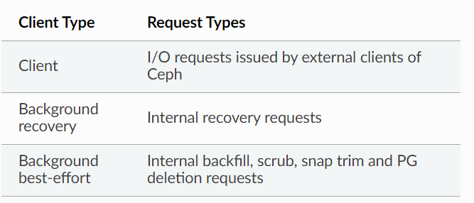

mclock 配置文件为每种客户端类型分配不同的参数，如预留、权重和限制（请参阅基于 mClock 的 QoS）。接下来的部分将更详细地描述 mclock 配置文件。

##### MCLOCK 配置文件 - 定义和目的

mclock 配置文件是“一种配置设置，当应用于正在运行的 Ceph 集群时，可以限制属于不同客户端类（后台 recovery 、scrub、snap trim、客户端操作、osd 子操作）的操作 (IOPS)”。

mclock 配置文件使用用户选择的容量限制和 mclock 配置文件类型来确定 **低级 mclock 资源控制** 配置参数并透明地应用它们。此外，还应用其他 Ceph 配置参数。

- 低级 mclock 资源控制参数是提供资源共享控制的预留、限制和权重，如[QoS Based on mClock](https://docs.ceph.com/en/latest/rados/configuration/osd-config-ref/#dmclock-qos)中所述。

##### MCLOCK 配置文件类型

mclock 配置文件可大致分为 内置配置文件(*built-in*) 和 自定义配置 (*custom* )文件，

- 在内置配置文件中，mclock 内部的后台尽力而为客户端 包括“backfill”、“scrub”、“快照修剪snap trim ”和“pg 删除”操作。

**内置配置文件**

用户可以选择以下内置配置文件类型：下表中提到的值表示为该服务类型分配的 OSD 总 IOPS 容量的比例。

- balanced (default)

  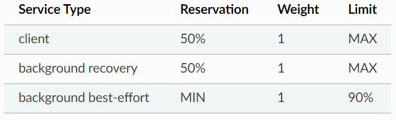

  平衡配置文件是默认的 mClock 配置文件。此配置文件为客户端操作和后台恢复操作分配相同的预留/优先级。后台 best_effort 的操作被给予较低的预留，因此在竞争操作时需要更长的时间才能完成。此配置文件有助于满足集群的正常/稳态要求。当外部客户端性能要求不重要并且 OSD 内仍有其他后台操作需要注意时，适用于这种配置。

  但在某些情况下，可能需要为客户端操作或恢复操作提供更高的分配。为了处理这种情况，可以按照下一节中提到的步骤启用备用内置配置文件。1

- high_client_ops

  与 OSD 中的后台操作相比，此配置文件通过为客户端操作分配更多预留和限制来优化后台活动的客户端性能。例如，该配置文件可以在持续一段时间内为 I/O 密集型应用程序提供所需的性能，但代价是恢复速度较慢。下表显示了配置文件设置的资源控制参数：

  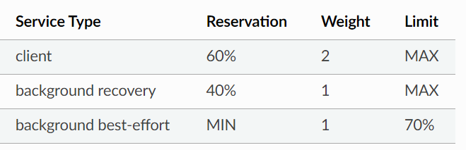

- high_recovery_ops

  与外部客户端和 OSD 内的其他后台操作相比，此配置文件优化了后台恢复性能。例如，管理员可以临时启用此配置文件，以加快非高峰时段的后台恢复速度。下表显示了配置文件设置的资源控制参数：

  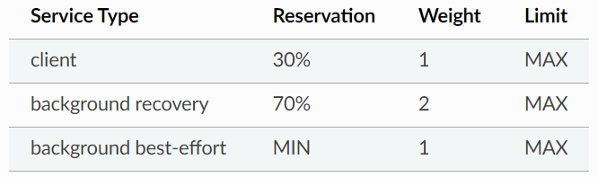

**自定义配置文件**

该配置文件使用户可以完全控制所有 mclock 配置参数。应谨慎使用此配置文件，它适用于了解 mclock 和 Ceph 相关配置选项的高级用户。

##### MCLOCK 内置配置文件 - 锁定配置选项

下部分描述了锁定为特定值的配置选项，以确保 mClock 调度程序能够提供可预测的 QoS。

**mclock相关参数**

在使用内置配置文件的系统中，这些默认值不能使用任何配置子系统命令（如 config set）或通过 config daemon 或 config Tell 接口进行更改。尽管上述命令执行结果返回成功，但 mclock QoS 参数将恢复为其各自的内置配置文件默认值。

启用内置配置文件后，mClock 调度程序会根据为每种客户端类型启用的配置文件计算低级 mclock 参数 [预留、权重、限制]。mclock参数是根据预先提供的最大OSD容量计算的。因此，使用任何内置配置文件时无法修改以下 mclock 配置参数：

- osd_mclock_scheduler_client_res
- osd_mclock_scheduler_client_wgt
- osd_mclock_scheduler_client_lim
- osd_mclock_scheduler_background_recovery_res
- osd_mclock_scheduler_background_recovery_wgt
- osd_mclock_scheduler_background_recovery_lim
- osd_mclock_scheduler_background_best_effort_res
- osd_mclock_scheduler_background_best_effort_wgt
- osd_mclock_scheduler_background_best_effort_lim

**恢复/回填相关参数**

建议不要更改这些选项，因为内置配置文件是基于它们进行优化的。更改这些默认值可能会导致意外的性能结果。

以下与恢复和回填相关的 Ceph 选项将覆盖 mClock 默认值：

- osd_max_backfills
- osd_recovery_max_active
- osd_recovery_max_active_hdd
- osd_recovery_max_active_ssd

下表显示了 mClock 默认值，与当前默认值相同。这样做是为了最大限度地提高前台（客户端）操作的性能：

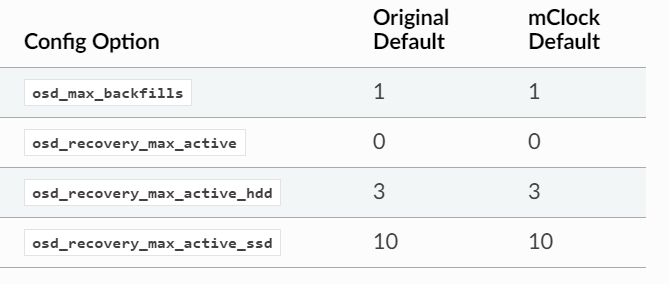

上述 mClock 默认值仅在必要时可以通过启用 osd_mclock_override_recovery_settings 进行修改（默认值： false）。

[Steps to Modify mClock Max Backfills/Recovery Limits](https://docs.ceph.com/en/latest/rados/configuration/mclock-config-ref/#steps-to-modify-mclock-max-backfills-recovery-limits) 部分中讨论了此步骤。

**sleep相关参数**

如果任何 mClock 配置文件（包括“自定义”）处于活动状态，则以下 Ceph 配置睡眠选项将被禁用（设置为 0），

- osd_recovery_sleep
- osd_recovery_sleep_hdd
- osd_recovery_sleep_ssd
- osd_recovery_sleep_hybrid
- osd_scrub_sleep
- osd_delete_sleep
- osd_delete_sleep_hdd
- osd_delete_sleep_ssd
- osd_delete_sleep_hybrid
- osd_snap_trim_sleep
- osd_snap_trim_sleep_hdd
- osd_snap_trim_sleep_ssd
- osd_snap_trim_sleep_hybrid

为了确保 mclock 调度器能够确定何时从其操作队列中挑选下一个操作并将其传输到操作序列器，上述的休眠选项被禁用。这保证了所有客户端都能获得所需的服务质量 (QoS)。

##### 启用 MCLOCK 配置文件的步骤

如前所述，默认 mclock 配置文件设置为 *balanced* 。内置配置文件的其他值包括 *high_client_ops* 和 *high_recovery_ops*。

如果需要更改默认配置文件，则可以使用以下命令在运行时设置选项 *osd_mclock_profile*：

```shell
ceph config set osd.N osd_mclock_profile <value>
```

- 例如，要更改配置文件以允许“osd.0”上更快的恢复，可以使用以下命令切换到 *high_recovery_ops* 配置文件：

  ```shell
  ceph config set osd.0 osd_mclock_profile high_recovery_ops
  ```

**除非您是高级用户，否则不建议使用 自定义 custom 配置文件**。

##### 在内置和自定义配置文件之间切换

可能存在需要从内置配置文件切换到自定义配置文件的情况，反之亦然。以下各节概述了实现此目的的步骤。

**从内置配置文件切换到自定义配置文件**

```shell
# 要将所有 OSD 上的配置文件更改为自定义
ceph config set osd osd_mclock_profile custom
```

切换到自定义配置文件后，可以修改所需的 mClock 配置选项。例如，要将特定 OSD（例如 osd.0）的客户端预留 IOPS 比率更改为 0.5（或 50%），可以使用以下命令：

```shell
ceph config set osd.0 osd_mclock_scheduler_client_res 0.5
```

> 必须注意相应地更改恢复和后台尽力服务等其他服务的预留，以确保**预留的总和不超过 OSD IOPS 容量的最大比例（1.0）**。

每个分片的预留和限制参数分配基于 OSD 下支持设备 (HDD/SSD) 的类型。

- osd_op_num_shards_hdd、osd_op_num_shards_ssd

**从自定义配置文件切换到内置配置文件的步骤**

从自定义配置文件切换到内置配置文件需要一个中间步骤，即从中央配置数据库中删除自定义设置，以使更改生效。

1. 使用以下命令设置所需的内置配置文件：

   ```shell
   ceph config set osd <mClock Configuration Option>
   ```

   例如，要将所有 OSD 上的内置配置文件设置为 high_client_ops，请运行以下命令：

   ```shell
   ceph config set osd osd_mclock_profile high_client_ops
   ```

2. 使用以下命令确定中央配置数据库中现有的自定义 mClock 配置设置：

   ```shell
   ceph config dump
   ```

3. 从中央配置数据库中删除上一步中确定的自定义 mClock 配置设置：

   ```shell
   ceph config rm osd <mClock Configuration Option>
   ```

   例如，要删除在所有 OSD 上设置的配置选项 osd_mclock_scheduler_client_res，请运行以下命令：

   ```shell
   ceph config rm osd osd_mclock_scheduler_client_res
   ```

4. 从中央配置数据库中删除所有现有的自定义 mClock 配置设置后，与 high_client_ops 相关的配置设置将生效。例如，要验证 osd.0 上的设置，请使用：

   ```shell
   ceph config show osd.0
   ```

##### 在 MCLOCK 配置文件之间临时切换

要临时在 mClock 配置文件之间切换，可以使用以下命令来覆盖设置：

> 本部分适用于高级用户或实验测试。建议不要在正在运行的集群上使用以下命令，因为它可能会产生意外结果。

> 使用以下命令在OSD上进行的配置更改是短暂的，在重新启动时会丢失。还值得注意的是，使用以下命令覆盖的配置选项不能使用 ceph config set osd.N … 命令进一步修改。直到重新启动给定的OSD，更改才会生效。这是根据配置子系统设计有意为之的。然而，仍然可以使用下面提到的命令临时进行任何进一步的修改。1.

运行如图所示的injectargs命令来覆盖mclock设置：

```shell
ceph tell osd.N injectargs '--<mClock Configuration Option>=<value>'
```

例如，以下命令会覆盖 osd.0 上的 osd_mclock_profile 选项：

```shell
ceph tell osd.0 injectargs '--osd_mclock_profile=high_recovery_ops'
```

---

可以使用的替代命令是：

```shell
ceph daemon osd.N config set <mClock Configuration Option> <value>
```

例如，以下命令会覆盖 osd.0 上的 osd_mclock_profile 选项：

```shell
ceph daemon osd.0 config set osd_mclock_profile high_recovery_ops
```

还可以使用上述命令临时修改自定义配置文件的各个 QoS 相关配置选项。

##### 修改 MCLOCK 最大回填/恢复限制的步骤

> 本部分适用于高级用户或实验测试。建议保留正在运行的集群上的默认值，因为修改它们可能会产生意外的性能结果。仅当集群无法应对默认设置/表现出较差的性能或在测试集群上执行实验时，才可以修改这些值。

> 最大备份/恢复相关的参数在[Recovery/Backfill Options](https://docs.ceph.com/en/latest/rados/configuration/mclock-config-ref/#recovery-backfill-options) 部分。修改mClock默认的回填/恢复限制受到osd_mclock_override_recovery_settings选项的控制，该选项默认设置为false。如果没有设置门控选项而尝试修改任何默认恢复/回填限制，将重置该选项回到mClock的默认值，并在集群日志中记录一条警告消息。请注意，默认值重新生效可能需要几秒钟。使用如下所示的config show命令验证限制。

1. 使用以下命令将所有 osd 上的 osd_mclock_override_recovery_settings 配置选项设置为 true：

   ```shell
   ceph config set osd osd_mclock_override_recovery_settings true
   ```

2. 使用以下命令设置所需的最大回填/恢复选项：

   ```shell
   ceph config set osd osd_max_backfills <value>
   ```

   例如，以下命令将所有 osd 上的 osd_max_backfills 选项修改为 5。

   ```shell
   ceph config set osd osd_max_backfills 5
   ```

3. 等待几秒钟并使用以下命令验证特定 OSD 的运行配置：

   ```shell
   ceph config show osd.N | grep osd_max_backfills
   ```

   例如，以下命令显示 osd.0 上 osd_max_backfills 的运行配置。

   ```shell
   ceph config show osd.0 | grep osd_max_backfills
   ```

4. 使用以下命令将所有 osd 上的 osd_mclock_override_recovery_settings 配置选项重置为 false：

   ```shell
   ceph config set osd osd_mclock_override_recovery_settings false
   ```

#### OSD 容量确定（自动）

OSD的总IOPS容量是在OSD初始化期间自动确定的。这是通过运行OSD bench工具并根据设备类型覆盖osd_mclock_max_capacity_iops_[hdd, ssd]选项的默认值来实现的。不需要用户进行任何其他操作/输入来设置OSD容量。

如果您希望手动对 OSD 进行基准测试或手动调整 Bluestore 限制参数，请参阅手动对 OSD 进行基准测试的步骤（可选）部分。

集群启动后，您可以使用以下命令验证 OSD 的容量：

```shell
ceph config show osd.N osd_mclock_max_capacity_iops_[hdd, ssd]
```

例如，以下命令显示底层设备类型为 SSD 的 Ceph 节点上“osd.0”的最大容量：

```shell
ceph config show osd.0 osd_mclock_max_capacity_iops_ssd
```

##### 通过自动化测试减少不切实际的 OSD 容量

在某些条件下，OSD bench工具可能会根据驱动器配置和其他与环境相关的条件显示不切实际/夸大的结果。为了减轻这种不切实际的容量对性能的影响，定义并使用了一些依赖于OSD设备类型的阈值配置选项：

```shell
osd_mclock_iops_capacity_threshold_hdd = 500
osd_mclock_iops_capacity_threshold_ssd = 80000
```

**回退到使用默认 OSD 容量（自动）**

如果OSD bench根据底层设备类型报告的测量值超过了上述阈值，回退机制将恢复到osd_mclock_max_capacity_iops_hdd或osd_mclock_max_capacity_iops_ssd的默认值。阈值配置选项可以根据使用的驱动器类型重新配置。此外，如果测量值超过阈值，将记录一个集群警告。例如，

```shell
2022-10-27T15:30:23.270+0000 7f9b5dbe95c0  0 log_channel(cluster) log [WRN]
: OSD bench result of 39546.479392 IOPS exceeded the threshold limit of
25000.000000 IOPS for osd.1. IOPS capacity is unchanged at 21500.000000
IOPS. The recommendation is to establish the osd's IOPS capacity using other
benchmark tools (e.g. Fio) and then override
osd_mclock_max_capacity_iops_[hdd|ssd].
```

**如果默认值不准确，则运行自定义驱动器基准（手动）**

如果默认的OSD容量不准确，建议使用您偏好的工具（例如Fio）在驱动器上运行自定义基准测试，

[手动对OSD基准进行测试](https://docs.ceph.com/en/latest/rados/configuration/mclock-config-ref/#steps-to-manually-benchmark-an-osd-optional)

然后按照“[Specifying Max OSD Capacity](https://docs.ceph.com/en/latest/rados/configuration/mclock-config-ref/#specifying-max-osd-capacity)”部分中描述的方式覆盖osd_mclock_max_capacity_iops_[hdd, ssd]选项。

在找到替代机制之前，这一步是非常推荐的。

### 回填backfilling

当您向集群添加或删除 Ceph OSD 守护进程时，CRUSH 将通过将置放组移入或移出 Ceph OSD 来重新平衡集群，以恢复平衡的利用率。迁移置放群组及其包含的对象的过程会大大降低集群的运行性能。为了保持操作性能，Ceph 通过“回填” （backfill） 执行此迁移，这允许 Ceph 将回填 (backfill) 操作设置为低于读取或写入数据请求的优先级。

### OSD map

OSD map 反映了集群中运行的 OSD 守护进程。随着时间的推移， map epoch 的数量会增加。 Ceph 提供了一些设置来确保 Ceph 在 OSD map变大时表现良好。

### 恢复recovery

当集群启动或 Ceph OSD 守护进程崩溃并重新启动时，OSD 会在写入发生之前开始与其他 Ceph OSD 守护进程对齐。有关详细信息，请参阅 [Monitoring OSDs and PGs](https://docs.ceph.com/en/latest/rados/operations/monitoring-osd-pg#peering)

- 如果 Ceph OSD 守护进程崩溃并重新上线，通常它会与 PG 中包含更新版本对象的其他 Ceph OSD 守护进程不同步。发生这种情况时，Ceph OSD 守护进程会进入恢复 recovery 模式，并寻求获取最新的数据副本并使其 map 恢复到最新状态。

- 根据 Ceph OSD 守护进程关闭的时间长短，OSD 的对象和归置组可能会明显过时。

- 此外，如果一个故障域（例如，一个机架）发生故障，多个 Ceph OSD 守护进程可能会同时恢复在线。这会使恢复过程耗时且占用资源

为了维持操作性能，Ceph 在执行恢复时限制恢复请求数量、线程和对象块大小，这使得 Ceph 在降级状态下也能良好运行。

### tiering分层

有关分层代理在高速模式下刷新脏对象的信息，请参阅 [cache target dirty high ratio](https://docs.ceph.com/en/latest/rados/operations/pools#cache-target-dirty-high-ratio) 。

### Filestore

Ceph 为 filestore 存储后端的 OSD 构建和挂载文件系统

使用 Filestore 时，journal 大小应至少是预期驱动器速度乘以 filestore_max_sync_interval 的乘积的两倍。然而，最常见的做法是对日志驱动器（通常是 SSD）进行分区，然后挂载它，以便 Ceph 将整个分区用于日志。

`osd_mkfs_options {fs-type}` ：

- 创建新的 Ceph Filestore OSD 时的文件系统类型 fs-type
- 类型：字符串
- 默认使用 xfs `-f -i 2048`
- 如：osd_mkfs_options {fs-type}

`osd_mount_options {fs-type}`

- 当挂载 Ceph Filestore OSD 时的文件系统类型 fs-type
- 类型：字符串
- 默认使用xfs `rw,noatime,inode64` 
- 使用其他文件系统 `rw, noatime`
- 如：osd_mount_options_xfs = rw, noatime, inode64, logbufs=8

#### Journal 设置

这部分仅用于旧的Filestore OSD 存储后端。尽管L版已经推荐Bluestore为默认和推荐的

默认情况下，Ceph 希望用户在以下路径中配置 Ceph OSD 守护进程的 journal ，该路径通常是设备或分区的符号链接：`/var/lib/ceph/osd/$cluster-$id/journal`

- 当使用单一设备类型（例如，旋转驱动器）时，journal 应位于同一位置：逻辑卷（或分区）应与 `data` 逻辑卷位于同一设备中。
- 当混合使用快速（SSD、NVMe）设备和慢速设备（如旋转驱动器）时，将 journal 放置在较快的设备上是有意义的，而 `data` 则完全占用较慢的设备。

默认 osd_journal_size 值为 5120（5 GB），但它可以更大，在这种情况下，需要在 ceph.conf 文件中设置它。 10 GB 的值在实践中很常见：

```shell
osd_journal_size = 10240
```

**osd_journal**

**osd_journal_size**


### Bluestore

#### 设备

Ceph Bluestore 直接使用原始块设备，并不会在其使用的设备上创建或安装传统文件系统(如 XFS 或 EXT4等)；以“raw” (原始)方式直接读取和写入设备，能够实现更好的性能和效率，为 Ceph 集群提供了更高效和高性能的存储后端。

- 避免使用传统文件系统，带来的好处：

  - **性能**：直接写入原始块设备，避免传统文件系统的开销，Bluestore 可以实现更高的 I/O 吞吐量和更低的延迟。

    将元数据和数据分开管理，从而更有效地利用存储并提升性能。

    集成的键值存储，内部使用RocksDB键值存储进行元数据操作，有助于高效地管理对象元数据。

  - **灵活性**：Bluestore 的设计专为 Ceph 的特定需求量身定制，允许更好的优化和功能，如内联压缩和校验和。

  - **控制权**：对块设备的直接控制使得更复杂和高效的存储管理技术成为可能。

  - **数据校验和**：Bluestore 在存储引擎层提供数据校验和压缩，增强了数据完整性和存储效率。

BlueStore 管理一个、两个或在某些情况下三个存储设备。Linux/Unix 意义上的 “devices” ，即/dev 或 /devices 下列出的资源。每个设备可以是整个存储驱动器 (storage drive) 、存储驱动器的分区(partition)、逻辑卷(logical volume)。 在最简单的情况下，BlueStore 会消耗单个存储设备的全部。该设备称为主设备。主设备由数据目录中的块符号 `block` 链接标识。

数据目录是一种 tmpfs 挂载。当这个数据目录被 ceph-volume 启动或激活时，会填充元数据文件链接，这些元数据文件和链接保存有关OSD的信息。这些文件包括：

- OSD 的标识符
- OSD所述集群的名称
- OSD 的私钥 keyring

在更复杂的情况下，BlueStore 部署在一台或两台附加设备上：

- 一个写前日志（write-ahead log, WAL）设备（在数据目录中标识为block.wal）可以被用来分离 **BlueStore的内部 journal** (write-ahead log)。只有在WAL设备比主设备更快的情况下，使用WAL设备才有优势（例如，如果WAL设备是SSD而主设备是HDD）。

- 一个数据库（DB device, DB）设备（在数据目录中标识为block.db）可以被用来存储 **BlueStore的内部元数据**。BlueStore（或者更准确地说，嵌入的RocksDB）会尽可能多地在DB设备上放置元数据，以提高性能。

  如果DB device满了，元数据将回溢到主设备上（在没有DB device的情况下，元数据就会位于主设备上）。再次强调，只有在DB设备比主设备更快的情况下，才应该配置一个DB设备。

如果只有少量可用的快速存储（例如，小于 1 GB），我们建议使用可用空间作为 WAL 设备。

但如果有更快的存储可用，那么配置 DB device 就更有意义。但如果有更快的存储可用，那么配置数据库设备就更有意义。

由于 BlueStore journal 总是被放置在可用的最快设备上，使用DB设备提供了与使用WAL设备相同的优势，同时还可以允许将额外的元数据存储在主设备之外（前提是它能够容纳）。DB设备使得这成为可能，因为 **每当指定了DB设备但未明确指定WAL设备时，WAL将隐式地与DB一起位于更快的设备上**。

要配置单设备（并置）BlueStore OSD，请运行以下命令：

```shell
ceph-volume lvm prepare --bluestore --data <device>
```

要指定 WAL 设备或 DB 设备，请运行以下命令：

```shell
ceph-volume lvm prepare --bluestore --data <device> --block.wal <wal-device> --block.db <db-device>
```

##### 配置策略

BlueStore 与 Filestore 的不同之处在于，部署 BlueStore OSD 的方法有多种。但是，需检查以下两种常见的安排即可阐明 BlueStore 的整体部署策略：

**仅块（数据）**

如果所有设备都是同一类型（例如，它们都是 HDD），并且没有可用于存储 bluestore元数据的快速设备，则仅指定块设备并保留 block.db 和 block.wal 的并置。

```shell
ceph-volume lvm create --bluestore --data /dev/sda
```

如果用于 BlueStore OSD 的设备是预先创建的逻辑卷，则名为 ceph-vg/block-lv 的逻辑卷的 lvm 调用如下：

```shell
ceph-volume lvm create --bluestore --data ceph-vg/block-lv
```

**块和 bloak.db**

<span id="mixture_spining_solid_drive"></span>>

如果您混合使用快速和慢速设备（例如 SSD 或 HDD），那么我们建议将 block.db 放置在较快的设备上，而块（即数据）存储在较慢的设备（即较慢的设备，即HDD）上。

您必须手动创建 volume groups 和其 逻辑卷(logical volume)。因为 ceph-volume 工具目前无法自动执行此操作。以下过程说明了手动创建volume groups和逻辑卷

假设有四个旋转驱动器（sda、sdb、sdc 和 sdd）和一个（快速）SSD (sdx)。请运行以下命令：

```shell
# 首先，要创建卷组，
vgcreate ceph-block-0 /dev/sda
vgcreate ceph-block-1 /dev/sdb
vgcreate ceph-block-2 /dev/sdc
vgcreate ceph-block-3 /dev/sdd

# 接下来，要为块创建逻辑卷
lvcreate -l 100%FREE -n block-0 ceph-block-0
lvcreate -l 100%FREE -n block-1 ceph-block-1
lvcreate -l 100%FREE -n block-2 ceph-block-2
lvcreate -l 100%FREE -n block-3 ceph-block-3

# 因为有四个 HDD，所以会有四个 OSD。
# 假设/dev/sdx中有一个200GB的SSD，我们可以通过运行以下命令创建四个50GB的逻辑卷：
vgcreate ceph-db-0 /dev/sdx
lvcreate -L 50GB -n db-0 ceph-db-0
lvcreate -L 50GB -n db-1 ceph-db-0
lvcreate -L 50GB -n db-2 ceph-db-0
lvcreate -L 50GB -n db-3 ceph-db-0

# 最后，创建四个 OSD
ceph-volume lvm create --bluestore --data ceph-block-0/block-0 --block.db ceph-db-0/db-0
ceph-volume lvm create --bluestore --data ceph-block-1/block-1 --block.db ceph-db-0/db-1
ceph-volume lvm create --bluestore --data ceph-block-2/block-2 --block.db ceph-db-0/db-2
ceph-volume lvm create --bluestore --data ceph-block-3/block-3 --block.db ceph-db-0/db-3
```

此过程完成后，应该有四个 OSD，块应该位于四个 HDD 上，每个 HDD 在共享 SSD 上应该有一个 50GB 的逻辑卷（具体来说，一个 DB 设备）。

##### 设备容量

使用 [混合HDD和 SDD 设置](#mixture_spining_solid_drive) 时，为 BlueStore 创建足够大的 block.db 逻辑卷非常重要。与 block.db 关联的逻辑卷应具有尽可能大的逻辑卷。

通常建议 block.db 的大小介于块大小 (逻辑卷大小) 的 1% 到 4% 之间。

- 对于RGW的工作负载，建议 block.db 至少为 块大小的 4%，因为 RGW 大量使用 block.db 来存储元数据，特别是  omap keys

  如果块大小为 1TB，则 block.db 的大小应至少为 40GB。

- 然而，对于 RBD 工作负载，block.db 通常需要不超过块大小的 1% 到 2%。

在较旧的版本中，内部 level sizes 使得 DB 只能充分利用与 L0、L0+L1、L1+L2 等总和相对应的特定分区/逻辑卷大小——也就是说，特定默认设置，大小大约为 3GB、30GB、300GB 等。尽管可以通过将这些数字加倍到 6GB、60GB 和 600GB 来促进数据库压缩，但大多数部署并不会从适应 L3 及更高级别的大小中获益。

Nautilus 14.2.12、Octopus 15.2.6 及后续版本中的改进允许更好地利用任意大小的 DB device。此外，P版本还带来了实验性的动态 level 支持。由于这些进步，旧版本的用户可能希望通过配置更大的数据库设备来提前计划，以便在将来进行升级时可以实现规模优势。

当不混合使用快速和慢速设备时，不需要为 block.db 或 block.wal 创建单独的逻辑卷。 BlueStore 会自动将这些设备放置在 block 空间内。

#### 自动调整缓存大小

在满足某些条件的情况下，可以配置BlueStore自动调整其缓存大小：

- 必须将TCMalloc配置为内存分配器，
- 必须启用 bluestore_cache_autotune 配置选项（注意，目前它是默认启用的）。

当自动缓存大小调整生效时，BlueStore 会尝试将 OSD 堆内存使用量保持在特定目标大小（由 osd_memory_target 确定）以下。这种方法使用了一种尽力而为的算法，并且缓存不会缩小到小于osd_memory_cache_min定义的大小。缓存比例是根据优先级层次结构选择的。但是，如果没有优先级信息，则使用bluestore_cache_meta_ratio和bluestore_cache_kv_ratio选项中指定的值作为备用缓存比例。

#### 手动调整缓存大小

如果在选项中没有指定（即，如果它保持为0），那么Ceph将使用不同的配置选项来确定默认的内存预算：如果主设备是HDD，则使用bluestore_cache_size_hdd，如果主设备是SSD，则使用bluestore_cache_size_ssd。

BlueStore 和 Ceph OSD 守护进程的其余部分 best-effort 的作业 在此内存预算内。请注意，除了配置的缓存大小外，OSD 本身也会消耗内存。由于内存碎片和其他分配器开销，存在额外的利用率。

配置的缓存内存预算用于存储以下类型的内容：

- Key/Value metadata（即RocksDB的内部缓存） 
- BlueStore metadata 
- BlueStore数据（即最近读取或最近写入的对象数据）

缓存内存使用情况由配置选项 bluestore_cache_meta_ratio 和 bluestore_cache_kv_ratio 控制。缓存中用于数据的保留部分由有效的BlueStore缓存大小（这取决于相关的 `bluestore_cache_size[_ssd|_hdd]` 参数和主设备的设备类别）以及“meta”和“kv”比例共同决定。这个数据比例可以通过以下公式计算：

`<effective_cache_size> * (1 - bluestore_cache_meta_ratio - bluestore_cache_kv_ratio)`

#### 校验和

https://docs.ceph.com/en/latest/rados/configuration/bluestore-config-ref/#checksums

#### 内联压缩

BlueStore 支持使用 snappy、zlib、lz4 或 zstd 进行内联压缩。

在Bluestore中的数据是否压缩取决于两个因素：

1. 压缩模式 compression mode
   - none：从不压缩数据。 
   - passive：除非写入操作具有可压缩提示集，否则不压缩数据。
   - aggressive：除非写入操作具有不可压缩提示集，否则压缩数据。
   - force：无论如何都尝试压缩数据。
2. 与写入操作相关的任何客户端提示。

有关可压缩和不可压缩 I/O 提示的更多信息 [`rados_set_alloc_hint()`](https://docs.ceph.com/en/latest/rados/api/librados/#c.rados_set_alloc_hint)

请注意，只有当数据块的大小充分减小时（由 bluestore 压缩所需比率设置确定），Bluestore 中的数据才会被压缩。无论使用哪种压缩模式，如果数据块太大，则会被丢弃，并存储原始（未压缩）数据。例如，如果bluestore压缩所需比率设置为0.7，则仅当压缩数据的大小不超过原始数据大小的70%时才会存储数据压缩版本。

压缩模式、压缩算法、压缩所需比率、最小 blob 大小和最大 blob 大小设置可以通过每个池属性或通过全局配置选项指定。要指定池属性，请运行以下命令：

```shell
ceph osd pool set <pool-name> compression_algorithm <algorithm>
ceph osd pool set <pool-name> compression_mode <mode>
ceph osd pool set <pool-name> compression_required_ratio <ratio>
ceph osd pool set <pool-name> compression_min_blob_size <size>
ceph osd pool set <pool-name> compression_max_blob_size <size>
```

#### RocksDB 分片

BlueStore 维护了多种类型的内部键值数据，所有这些数据都存储在 RocksDB 中。 BlueStore 中的每种数据类型都分配有一个唯一的前缀。

- 在 Pacific 版本之前，所有键值数据都存储在单个 RocksDB 列族中：“默认”。
- 在 Pacific 及更高版本中，BlueStore 可以将键值数据划分为多个 RocksDB 列族。

当键相似时，BlueStore 可以实现更好的缓存和更精确的压缩：具体来说，当键具有相似的访问频率、相似的修改频率和相似的生命周期时。在这种情况下，性能得到提高，压缩期间所需的磁盘空间也更少（因为每个列族更小并且能够独立于其他列族进行压缩）。

Pacific 或更高版本中部署的 OSD 默认使用 RocksDB 分片。但是，如果 Ceph 已从先前版本升级到 Pacific 或更高版本，则在 Pacific 之前创建的任何 OSD 上都会禁用分片。要启用分片并将 Pacific 默认值应用于特定 OSD，请停止 OSD 并运行以下命令：

```shell
ceph-bluestore-tool \
 --path <data path> \
 --sharding="m(3) p(3,0-12) O(3,0-13)=block_cache={type=binned_lru} L P" \
 reshard
```

#### SPDK的使用

使用 NVMe 设备的 SPDK 驱动程序https://docs.ceph.com/en/latest/rados/configuration/bluestore-config-ref/#spdk-usage

#### 最小分配规模

BlueStore在底层存储设备上分配了一定额度的最小存储空间。实际上，这是即使是最小的RADOS对象在每个OSD的主设备上也需要占用的最少容量。

相关的配置选项——bluestore_min_alloc_size，其值来源于bluestore_min_alloc_size_hdd 或 bluestore_min_alloc_size_ssd，具体取决于OSD的rotational 属性。因此，如果在HDD上创建OSD，BlueStore将使用bluestore_min_alloc_size_hdd 的当前值进行初始化；而对于SSD OSD（包括NVMe设备），Bluestore将使用bluestore_min_alloc_size_ssd的当前值进行初始化。

- 在Mimic及更早的版本中，旋转介质（HDD）的默认值是64KB，非旋转介质（SSD）的默认值是16KB。Octopus版本将非旋转介质（SSD）的默认值改为4KB，而Pacific版本将旋转介质（HDD）的默认值也改为4KB。

- 这些变化是由托管大量小文件（S3/Swift 对象）的 Ceph RADOS Gateway (RGW) 部署所经历的空间放大导致的。

  例如，当RGW客户端存储一个1KB的S3对象时，该对象被写入一个单一的RADOS对象。根据默认的min_alloc_size值，底层驱动器空间分配了4KB。这意味着大约有3KB（即4KB减去1KB）被分配但从未使用：这对应于300%的额外开销或25%的效率。同样，一个5KB的用户对象将作为两个RADOS对象存储，一个是4KB的RADOS对象，另一个是1KB的RADOS对象，结果是4KB的设备容量被浪费。然而，在这种情况下，额外开销的百分比要小得多。可以考虑这类似于模运算的余数。因此，随着对象大小的增加，额外开销的百分比会迅速下降。

  还有一个容易被忽视的细微之处：前面描述的放大现象在每个副本上都会发生。例如，当使用数据的三个副本（3R）作为默认设置时，一个1KB的S3对象实际上会浪费大约9KB的存储设备容量。如果使用纠删码（EC）而不是复制，放大可能会更高：对于一个k=4, m=2的池，我们的1KB S3对象会分配24KB（即4KB乘以6）的设备容量。

当RGW存储桶池包含许多相对较大的用户对象时，这种现象的影响通常是微不足道的。然而，对于那些预期会有大量相对较小的用户对象的部署，应该考虑到这种现象的影响。

4KB的默认值与传统的HDD和SSD设备非常匹配。然而，某些新颖的 coarse-IU（间接单元）QLC SSDs在创建OSD时，如果将bluestore_min_alloc_size_ssd指定为与设备的IU相匹配，则性能和开销表现最佳：这可能是8KB、16KB甚至64KB。这些新颖的存储驱动器可以实现与传统TLC SSDs相媲美的读取性能，以及比HDD更快的写入性能，同时具有比TLC SSDs更高的密度和更低的成本。

- 请注意，在这些新颖设备上创建OSD时，必须小心地将非默认值仅应用于适当的设备，而不是传统的HDD和SSD设备。通过仔细安排OSD的创建顺序，使用自定义OSD设备类别，特别是使用中心配置掩码，可以避免错误。

在Quincy及以后的版本中，您可以使用bluestore_use_optimal_io_size_for_min_alloc_size选项来允许在创建每个OSD时自动发现正确的值。请注意，使用bcache、OpenCAS、dmcrypt、ATA over Ethernet、iSCSI或其他设备层和抽象技术可能会混淆正确值的确定。此外，部署在VMware存储之上的OSD有时会被发现报告的旋转属性与底层硬件不匹配。

我们建议在启动时通过日志和管理套接字检查此类OSD，以确保它们的行为是正确的。请注意，这种检查可能不会按预期在旧内核上工作。要检查这个问题，请检查/sys/block/<drive>/queue/optimal_io_size的存在和取值。

为检查某个OSD，运行以下命令

```shell
ceph osd metadata osd.1701 | egrep rotational\|alloc
```

这种空间放大可能表现为 ceph df 报告的原始数据与存储数据之比异常高。`ceph osd df` 报告的 %USE / VAR 值与其他看似相同的OSD相比可能也异常高。最后，如果池中使用的 OSD 的 min_alloc_size 值不匹配，可能会出现意外的均衡器行为。

这个BlueStore属性仅在OSD创建时生效；如果后来更改了该属性，特定OSD的行为不会改变，除非且直到OSD被销毁并使用适当的选项值重新部署。升级到较新的Ceph版本不会改变在旧版本下部署或使用其他设置的OSD所使用的值。

#### DSA（数据流加速器）的使用

https://docs.ceph.com/en/latest/rados/configuration/bluestore-config-ref/#dsa-data-streaming-accelerator-usage

### 数据放置

 [Pool & PG Config Reference](https://docs.ceph.com/en/latest/rados/configuration/pool-pg-config-ref) 

CRUSH 算法分配给每个池的PG数量由监视器集群中的集中配置数据库中的参数配置值决定。

- Ceph 的容器化部署（使用 cephadm 或 Rook 进行的部署）和 Ceph 的非容器化部署都依赖于监视器集群中的中央配置数据库中的值来将 PG 分配给池。

```shell
# 要查看控制给定池中归置组数量的变量值，请运行以下形式的命令：
ceph config get osd osd_pool_default_pg_num

# 要设置控制给定池中归置组数量的变量值
ceph config set osd osd_pool_default_pg_num
```

在某些情况下，建议覆盖某些默认值。例如，您可能认为设置池的副本大小并覆盖池中PG的默认数量是明智之举。


默认情况下，Ceph为每个RADOS对象设置三副本。如果想为RADOS对象设置四副本(一个主副本和三个备份)，需要修改 `osd_pool_default_size` 中的默认值。

如果您想让 Ceph 接受对降级 PG 的 I/O 操作，将 `osd_pool_default_min_size` 设置为小于 `osd_pool_default_size` 。

```shell
osd_pool_default_size = 3  # Write an object 3 times.
osd_pool_default_min_size = 2 # Accept an I/O operation to a PG that has two copies of an object.
```

确保您拥有 **PG数** 是一个实数，推荐每个OSD大概100个PG。

- 在设置PG数时，OSD总数*100/对象的副本数

- 如，当我们有10个OSD，且副本数设置为4，则 (10*100/4=250)，使用最近的2次幂，即设为 256

  ```
  osd_pool_default_pg_num = 256
  osd_pool_default_pgp_num = 256
  ```


