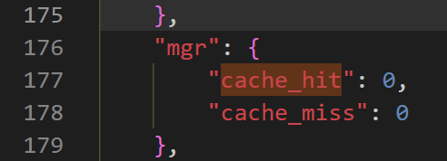
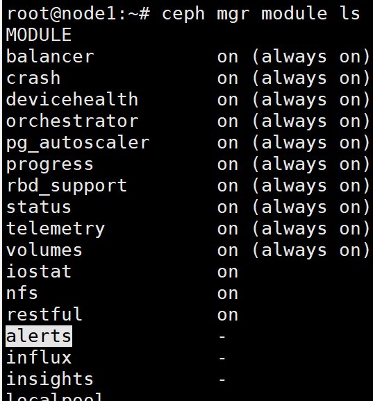
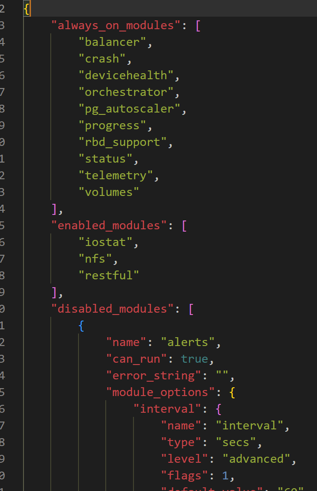

https://docs.ceph.com/en/quincy/mgr/

Ceph Manager 守护进程 (ceph-mgr) 与监视器守护进程一起运行，为外部监视和管理系统提供额外的监视和接口。

从L版开始，正常操作需要 ceph-mgr 守护进程。 ceph-mgr 守护进程是 11.x (kraken) Ceph 版本中的可选组件。

默认情况下，管理器守护程序除了确保其正在运行之外不需要其他配置。如果没有正在运行的 mgr 守护进程，您将看到一条健康警告，并且 ceph 状态输出中的一些其他信息将丢失或过时，直到启动 mgr。

使用常规部署工具（例如 ceph-ansible 或 cephadm）在每个 mon 节点上设置 ceph-mgr 守护进程。建议将 mgr 守护进程放置在与 mons 相同的节点上，虽然不强制。

<!--more-->

## 安装和配置

通常，需要使用安装工具（ceph-ansible）设置 ceph-mgr 进程，、

### 手动安装

1. 为守护进程创建身份验证密钥

   ```shell
   ceph auth get-or-create mgr.$name mon 'allow profile mgr' osd 'allow *' mds 'allow *'
   ```

2. 将该密钥作为名为 keyring 的文件放入 mgr 数据路径中，对于集群“ceph”和 mgr $name “foo”，该路径将是 /var/lib/ceph/mgr/ceph-foo 相应的 /var/lib/ceph/mgr/ ceph-foo/keyring。

3. 启动ceph-mgr守护进程

   ```shell
   ceph-mgr -i $name
   ```

4. 通过查看 ceph status 的输出来检查 mgr 是否已启动，其中现在应包含 mgr 状态行：

   ```shell
   mgr active: $name
   ```

### 客户端认证

manager 是一个新的守护进程，需要新的 CephX 功能。如果您从旧版本的 Ceph 升级集群，或者使用默认的安装/部署工具，您的管理客户端应该自动获得此功能

如果您使用其他地方的工具，则在调用某些 ceph 集群命令时可能会出现 EACCES 错误。要解决此问题，请通过[Modifying User Capabilities](https://docs.ceph.com/en/quincy/rados/operations/user-management/#modify-user-capabilities)将“mgr allowed *”节添加到客户端的 cephx 功能中。

通常，您可以使用 ceph-ansible 等工具设置 ceph-mgr 守护进程。这些说明描述了如何手动设置 ceph-mgr 守护进程。

### 特性

#### 高可用

一般来说，您应该在每台运行 ceph-mon 守护进程的主机上设置 ceph-mgr，以实现相同级别的可用性。默认情况下，首先出现的 ceph-mgr 实例将被监视器激活，其他实例将处于备用状态。ceph-mgr 守护进程之间没有法定人数要求。

如果活动守护进程在超过 mon_mgr_beacon_grace 的时间内未能向监视器发送信标，则它将被备用守护进程替换。

如果要抢占故障转移，可以使用 ceph mgr failure <mgr name> 将 ceph-mgr 守护进程显式标记为失败。

### 高可用

一般情况，在每台运行Ceph-mon的主机上扩展一个Ceph-mgr，以确保集群的高可用

默认情况，首先出现的Ceph-mgr进程被mon激活为 `active` 状态，其他的mgr进程将处于备用状态 `quorum` 。

对于MGR进程没有数量要求

如果 `active` 状态的 MGR 在超过 ` mon_mgr_beacon_grace` 的时间内未向mon节点发送信标，则会被备用MGR进程替换

如果要抢占故障转移，可以使用 `ceph mgr fail <mgr name>` 将MGR进程显式标记为失败

### 性能及可扩展性

所有的MGR模块共享一块缓存，通过 `ceph config set mgr mgr_ttl_cache_expire_seconds <seconds>` 启用缓存，`<seconds>` 是缓存的Python对象的生存时间

当有500+osd或10K+pgs时，建议启用10秒TTL的缓存，因为内部结构可能增大，造成请求大型结构时的时延问题。比如：一个有1000个OSD的OSDMap大约4MiB。当负载较重时，3000个OSD的集群上，启用缓存的性能提高了1.5倍

此外，可以运行 `ceph daemon mgr.${MGRNAME} perf dump` 查看MGR模块的性能计数器。

在 `mgr.cache_hit` 和 `mgr.chahe_miss` 中，能找到 `mgr` 缓存的命中/未命中率

```shell
ceph daemon mgr.node1 perf dump | grep cache_hit
ceph daemon mgr.node1 perf dump | grep chahe_miss
```



### 启动模块

使用命令 ceph mgr module ls 查看哪些模块可用以及当前启用了哪些模块。



```
MODULE                              
balancer              on (always on)
crash                 on (always on)
devicehealth          on (always on)
orchestrator          on (always on)
pg_autoscaler         on (always on)
progress              on (always on)
rbd_support           on (always on)
status                on (always on)
telemetry             on (always on)
volumes               on (always on)
cephadm               on            
dashboard             on            
iostat                on            
nfs                   on            
prometheus            on            
restful               on            
alerts                -             
diskprediction_local  -             
influx                -             
insights              -             
k8sevents             -             
localpool             -        
```

使用 ceph mgr module ls --format=json-pretty 查看有关禁用模块的详细元数据。

- 被禁用的module会列出相关的所拥有参数



```shell
{
    "always_on_modules": [
        "balancer",
        "crash",
        "devicehealth",
        "orchestrator",
        "pg_autoscaler",
        "progress",
        "rbd_support",
        "status",
        "telemetry",
        "volumes"
    ],
    "enabled_modules": [
        "cephadm",
        "dashboard",
        "iostat",
        "nfs",
        "prometheus",
        "restful"
    ],
    "disabled_modules": [
        {
            "name": "alerts",
            "can_run": true,
            "error_string": "",
            "module_options": {
                "interval": {
                    "name": "interval",
                    "type": "secs",
                    "level": "advanced",
                    "flags": 1,
                    "default_value": "60",
                    "min": "",
                    "max": "",
                    "enum_allowed": [],
                    "desc": "How frequently to reexamine health status",
                    "long_desc": "",
                    "tags": [],
                    "see_also": []
                },
        ]
```

分别使用命令 ceph mgr module enable <module> 和 ceph mgr module disable <module> 启用或禁用模块。

```shell
ceph mgr module ls
    {
            "enabled_modules": [
                    "restful",
                    "status"
            ],
            "disabled_modules": [
                    "dashboard"
            ]
    }

ceph mgr module enable dashboard
    ceph mgr module ls
    {
            "enabled_modules": [
                    "restful",
                    "status",
                    "dashboard"
            ],
            "disabled_modules": [
            ]
    }

ceph mgr services
    {
            "dashboard": "http://myserver.com:7789/",
            "restful": "https://myserver.com:8789/"
    }
```

如果启用了模块，则活动的 ceph-mgr 守护进程将加载并执行它。对于提供服务的模块（例如 HTTP 服务器），模块可以在加载时发布其地址。要查看此类模块的地址，请使用命令 ceph mgr services。

某些模块还可能实现特殊的待机模式，该模式在备用 ceph-mgr 守护进程以及活动守护进程上运行。如果客户端尝试连接到备用守护程序，这使得提供服务的模块能够将其客户端重定向到活动守护程序。

有关每个模块提供的功能的更多信息，请参阅各个管理器模块的文档页面。

集群第一次启动时，它使用 mgr_initial_modules 设置来覆盖要启用的模块。但是，在集群的后续生命周期中，此设置将被忽略：仅将其用于引导。

- 例如，在第一次启动监视器守护进程之前，您可以将如下部分添加到 ceph.conf 中：

  ```shell
  [mon]
      mgr_initial_modules = dashboard balancer
  ```

### 模块池

管理器创建一个池供其模块使用来存储状态。该池的名称是 .mgr（前导 . 表示保留的池名称）。

> 在 Quincy 之前，devicehealth 模块创建了一个 device_health_metrics 池来存储设备 SMART 统计信息。对于 Quincy，该池会自动重命名为公共管理器模块池。

### 调用模块命令

当模块实现命令行hooks时，这些命令将可以像普通的 Ceph 命令一样访问。 Ceph 会自动将模块命令合并到标准 CLI 界面中，并将它们适当地路由到模块：

```shell
ceph <command | help>
```

https://docs.ceph.com/en/quincy/mgr/administrator/#confval-mon_mgr_beacon_grace

**查看数据延迟**

```shell
ceph osd perf
```

**详细列出集群每块磁盘的使用情况**

```shell
ceph osd df
```


