[TOC]

<!--more-->

# 部署前置知识

## 2.0.1 Ceph存储机制

将待管理的数据流切分为一到多个固定大小的对象数据，并以其为原子单元完成数据存储

Ceph通过内部的Crush机制，实时计算出一个文件应该存储到哪个存储对象中，从而实现快速查找对象的方式

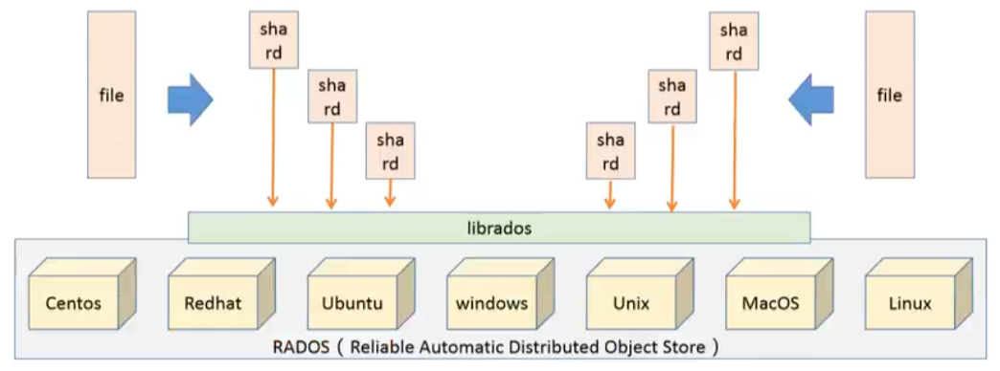

## 2.0.2 各组件的硬件需求

[硬件推荐](http://docs.ceph.org.cn/start/hardware-recommendations/)

**底层硬件决定系统性能的上限**

Ceph的优点之一是支持异构硬件，集群可以运行在来自多个厂商的硬件上，不存在因为硬件问题被厂商锁定的情况。在创建Ceph的底层基础设施时，客户可以根据预算及性能需求自行使用任何硬件，对于硬件的选用拥有完全的自主权和决策权。

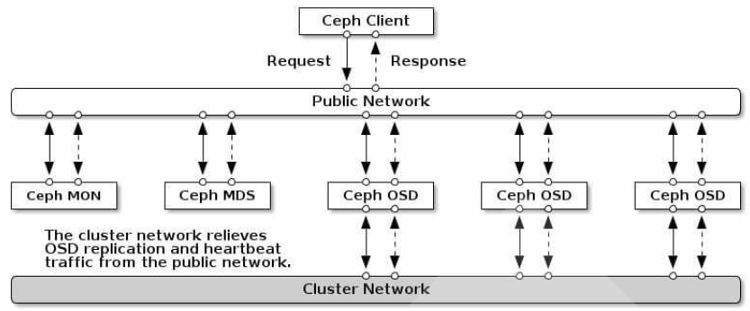

无论想向云平台提供Ceph对象存储和块设备、文件系统，或者将Ceph用于其他目的，所有的ceph集群部署都从设置每个Ceph节点的网络开始

一个Ceph存储集群至少一个Ceph Monitor、Ceph Manager 和 Ceph OSD，如果有运行文件系统的客户端，还需要配置MDSs

### CPU

Ceph的一些组件不是CPU依赖型

**monitor守护进程** 对CPU是轻量依赖的，只负责保持集群的状态而不给用户提供任何数据

- 不参与数据存储，不频繁利用内存，占用资源较少
- 单核CPU就可以完成，需要确保monitor有足够的内存、网络与磁盘空间
- 对于小集群，monitor可以与其他组件放在一起

**OSD进程** 需要大量的CPU资源（直接提供数据给客户端），需要进行一些数据处理

- CPU(1GHz)和内存(2GB)：建议在早期多配置内存和CPU资源，因为在JBOD系统中，可以随时为主机增加硬盘

- 建议双核CPU。若以纠删码的方式使用OSD，则需要四核处理器（纠删码需要大量计算）

- 当集群处于recovery状态时，OSD守护进程对处理器的占用很大
  $$
  \frac{CPU线程数\times CPU每线程占核数\times CPU时钟频率(GHz)}{OSD数}\ge 1
  $$

**MDS守护进程** 是CPU密集型。需要动态地分配负载

- 建议四核CPU

### 内存

> 当集群处于recovery状态时，内存消耗会明显增加

monitor和元数据守护进程需要快速对外响应，必须有足够的内存处理

- 从性能角度，为每个monitor和元数据守护进程必须大于2GB

OSD不是内存密集型

- 一般的工作负载情况下，每个OSD守护进程分配1GB内存就足够了

- 从性能角度，若OSD进程使用一整块磁盘，分配2GB。

  若OSD使用多个磁盘，内存需求需要同步增加

### 磁盘

**monitor硬件需求**

- 若 日志信息(log) 存储在本地monitor节点，就要确保monitor节点上有 **足够的磁盘空间** 来存放日志文件

**OSD硬件需求** OSD是Ceph 中主要存储单元，需要配置足够的硬盘

- 为集群节点中的每一块物理硬盘创建一个OSD进程

  OSD支持灵活部署，可以为每块物理硬盘创建一个OSD，也可以为每个RAID创建OSD进程

- 硬盘容量越大，每GB的成本越低，内存也需要相应越大

### 网络需求

**带宽**

> 以太网、InfiniBand网络、10G网络或更高带宽的网络

对于百TB级别的中等规模集群而言，1Gbit/s的网络也能正常工作。若考虑到未来的纵向扩展带来的工作负载(ROI/性能)，建议为数据和集群管理分别采用10Gbit/s的物理隔离网络

当集群规模较大，需要为多个客户端提供服务，则应有10G以上的带宽

对于几百TB的超大Ceph集群，需要400Gbit/s的带宽

**内外网络隔离**

> 集群网络和客户端网络应该接在物理上隔离的交换机上：
>
> - 公共网络（客户端网络）允许客户端与Ceph集群通信并访问集群中存储的数据
> - 内部网络（集群网络）负责集群内诸如复制、恢复、再平衡和心跳检查等需要高带宽的操作

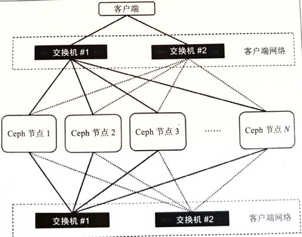

大多数情况下，集群内部网络流量更大（Ceph的OSD节点在内部使用）：

- 数据冗余备份：若对于一个客户端的写入动作，数据备份了N次，则Ceph集群需要写N次。所有的冗余数据基于集群网络在对等节点间进行传输
- 数据的恢复和再平衡

**冗余配置**

在网络配置的各层采用冗余设计，如：网卡，端口，交换机和路由器

monitor硬件需求：1Gbit/s的双网卡

- 网络级别的冗余对于monitor很重要，因为monitor节点间需要进行仲裁

### MDS需求

相较于Ceph的monitor与OSD，Ceph MDS比较占资源。

**硬件需求**

- 更强的CPU处理能力，四核或者更高
- MDS依赖大量的数据缓存，需要更大的RAM资源

## 2.0.3 规划集群

### 限制条件

Ceph的各种组件应该避免复用。组件角色复用会给集群的运维和性能带来很大的影响。可以避免集群运行带来的不稳定因素，在考虑安全性与可靠性的前提下，必须满足一些限制条件：

- 至少配置3个monitor节点
- 每个节点至少配置3个OSD
- 至少配置两个manager节点
- 所有的OSD节点配置相同
- 若使用CephFS，至少配置2个配置完全相同的MDS节点
- 若使用Ceph 网关，至少配置2个不同的RGW节点

### 关于功能特性的备注

并不是支持所有的Ceph功能，即不是所有的功能都是稳定的，表中的几种指标及配置是经过企业落地实践校验的

| 特性            | 数量                                                       | 备注                                          |
| --------------- | ---------------------------------------------------------- | --------------------------------------------- |
| 副本策略        | SSD：支持2副本，最低1副本<br />HDD：支持3副本，最低2副本， | 副本数少，影响数据可靠性                      |
| 纠删码          | K+M的支持配比：8+3，8+4，4+2<br />存储节点最少为k+m+1      | 支持在RGW和RBD两种模式下使用，MDS不支持纠删码 |
| RGW多站点       |                                                            | 多站点配置中不支持Indexless Bucket            |
| Disk Size       | 最大容量12TB                                               | 不支持磁带                                    |
| 每个节点OSD数量 | 单节点最多配置36个OSD                                      |                                               |
| 单集群OSD数量   | 单集群最多配置2500个OSD                                    |                                               |
| Snapshot        | 单个RBD镜像支持512个快照，                                 | RGW不支持快照                                 |
| BlueStore       |                                                            | 必须使用默认的磁盘空间分配器Allocator         |

### 硬件选型

在选型Ceph服务器时，必须确定Ceph的使用场景，不同的使用场景下有不同的配置考量，常见的Ceph使用场景有

- 追求良好IOPS
- 追求良好的吞吐量
- 追求低成本、高容量

#### 追求良好的IOPS

随着闪存使用的增加，企业越来越多地将IOPS敏感型工作负载依托在Ceph集群，以便提高私有云存储解决方案的性能。在此场景下，可以把MySQL、MariaDB或PostgreSQL托管在Ceph集群，以支持结构化数据

| 硬件             | 配置                                                |
| ---------------- | --------------------------------------------------- |
| CPU              | 主频2GHz,则每个NVMe SSD使用6核或者每个非NVMe使用2核 |
| RAM              | 16GB+5GB*OSD（16GB为基准，每增加一个OSD增加5GB）    |
| 数据盘           | NVMe SSD                                            |
| BlueStore WAL/DB | 可与NVMe SSD分配两个OSD                             |
| 磁盘控制器       | PCIe                                                |
| OSD进程数        | 每个NVMe分配2个OSD进程                              |
| 网络             | 每2个OSD使用10GB带宽网络                            |

#### 追求良好吞吐量

Ceph集群通常可以存储半结构化数据，一般是顺序读写比较大的文件，需要提供很大的带宽。存储服务器上的磁盘可以使用SSD做日志加快HDD

| 硬件             | 配置                                             |
| ---------------- | ------------------------------------------------ |
| CPU              | 主频2GHz,则每个HDD使用0.5核                      |
| RAM              | 16GB+5GB*OSD（16GB为基准，每增加一个OSD增加5GB） |
| 数据盘           | 7200RPM的HDD、SATA、SAS                          |
| BlueStore WAL/DB | 使用独立的NVMe SSD 或 SAS SSD作为加速盘          |
| 磁盘控制器       | HBA（JBOD）                                      |
| OSD进程数        | 每个HDD分配1个OSD进程                            |
| 网络             | 每12个OSD使用10GB带宽网络                        |

#### 最求低成本、高容量场景

低成本和高容量的解决方案用于处理存储容量较大、存储时间较长的数据，且按块顺序读写。数据可以是结构化或半结构化。存储内容包括媒体文件、大数据分析文件和磁盘镜像备份等。为了获得更高的效益，OSD与日志通常都托管在HDD。

| 硬件             | 配置                                             |
| ---------------- | ------------------------------------------------ |
| CPU              | 主频2GHz,则每个HDD使用0.5核                      |
| RAM              | 16GB+5GB*OSD（16GB为基准，每增加一个OSD增加5GB） |
| 数据盘           | NVMe SSD                                         |
| BlueStore WAL/DB | 可与HDD数据盘同步                                |
| 磁盘控制器       | HBA（JBOD）                                      |
| OSD进程数        | 每个HDD分配1个OSD进程                            |
| 网络             | 每两个OSD使用10GB带宽网络                        |

## 2.0.4 版本选型与安装工具

### 版本选型

每个Ceph版本都有一个英文名称和一个数字形式的版本编号

x.0.z - 开发版

x.1.z - 候选版

x.2.z - 稳定、修正版

https://docs.ceph.com/en/latest/releases/

### 推荐方法

#### Cephadm

[Cephadm](https://docs.ceph.com/en/quincy/cephadm/install/#cephadm-deploying-new-cluster)是一个可用于安装和管理 Ceph 集群的工具。

- cephadm 仅支持 Octopus 和较新版本。
- cephadm 与业务流程 API 完全集成，并完全支持用于管理集群部署的 CLI 和仪表板功能。
- cephadm 需要容器支持（以 Podman 或 Docker 的形式）和 Python 3。

[Rook](https://rook.io/)可部署和管理在 Kubernetes 中运行的 Ceph 集群，同时还支持通过 Kubernetes API 管理存储资源和配置。我们建议使用 Rook 在 Kubernetes 中运行 Ceph 或将现有 Ceph 存储集群连接到 Kubernetes。

- Rook 仅支持 Nautilus 和较新版本的 Ceph。
- Rook 是在 Kubernetes 上运行 Ceph 或将 Kubernetes 集群连接到现有（外部）Ceph 集群的首选方法。
- Rook 支持 Orchestrator API。CLI 和仪表板中的管理功能完全受支持。

### 其他方法

[ceph-ansible](https://docs.ceph.com/ceph-ansible/)使用 Ansible 部署和管理 Ceph 集群。# python

- ceph-ansible 被广泛部署。
- ceph-ansible 未与 Nautilus 和 Octopus 中引入的编排器 API (orchestrator APIs)集成，这意味着 Nautilus 和 Octopus 中引入的管理功能和仪表板集成在通过 ceph-ansible 部署的 Ceph 集群中不可用。

[ceph-deploy](https://docs.ceph.com/projects/ceph-deploy/en/latest/)是一款可用于快速部署集群的工具。现已弃用。# python+shell

> ceph-deploy 并未得到积极维护。它未在 Nautilus 以上版本的 Ceph 上进行测试。它不支持 RHEL8、CentOS 8 或更新的操作系统。

[ceph-salt](https://github.com/ceph/ceph-salt)使用 Salt 和 cephadm 安装 Ceph。 #python

[jaas.ai/ceph-mon](https://jaas.ai/ceph-mon)使用 Juju 安装 Ceph。

ceph-container：https://github.com/ceph/ceph-container #shell

ceph-chef：https://github.com/ceph/ceph-chef #Ruby

[github.com/openstack/puppet-ceph](https://github.com/openstack/puppet-ceph) 通过 Puppet 安装 Ceph。

[OpenNebula HCI集群](https://docs.opennebula.io/stable/provision_clusters/hci_clusters/overview.html)在各种云平台上部署Ceph。

Ceph 也可以[手动安装](https://docs.ceph.com/en/quincy/install/index_manual/#install-manual)。

## 2.0.5 参考

|                             |                                                              |                          |
| --------------------------- | ------------------------------------------------------------ | ------------------------ |
| cephadm 15.2.2              | https://www.cnblogs.com/zttong/p/17463837                    | centos8                  |
| cephadm离线安装v15.2.7      | https://blog.csdn.net/nanhai_happy/article/details/131934493 | kylin linux              |
| 时间同步chronyc             | https://blog.csdn.net/weixin_64334766/article/details/128536776 |                          |
| ceph-deploy指定源安装       | https://www.cnblogs.com/zphj1987/p/13575358.html             | centos                   |
| ceph-deploy mimic版本13.2.5 | https://www.cnblogs.com/zyxnhr/p/10539740.html               | CentOS Linux release 7.6 |
| ceph-deploy kylin N版       | https://blog.csdn.net/wsl12105/article/details/128777912     | kylin linux              |
| 手动安装ceph                | https://www.cnblogs.com/freeweb/p/13542285.html              | cephos 7/8               |

# 2.1 操作系统设置

## 2.1.1 查看版本信息

```shell
cat /etc/issue

# 查看系统信息命令
cat /etc/os-release
```

## 2.1.2 修改用户名一定要修改密码

- **一定要设置root密码** 
- nodexx 主机名，用户密码

用户名

```shell
hostname #查看系统主机名称
node01@ hostnamectl set-hostname node01
node02@ hostnamectl set-hostname node02

hostnamectl set-hostname xx #修改主机名称	
	#执行命令之后，会自动修改 /etc/hostname 文件
	#执行命令之后，会立即生效，且重启系统也会生效
cat /etc/hostname	#查看 /etc/hostname 文件内容，里面配置的就是系统主机名称
```

```shell
sudo su
sudo gedit /etc/passwd # 找到原先的用户名，将其改为自己的用户名（一行全部都改）
sudo  gedit /etc/shadow #找到原先用户名（所有的名字都要改），改为自己的用户名
sudo gedit /etc/group #你应该发现你的用户名在很多个组中，全部修改！
mv /home/原用户名/ /home/新用户名

mv /home/ceph_admin/ /home/
```

密码（登录用户需要修改）

1. 进入Ubuntu，打开一个终端，输入 sudo su转为root用户。 注意，必须先转为root用户！！！
2. sudo passwd user(user 是对应的用户名)
3. 输入新密码，确认密码。
4. 修改密码成功，重启，输入新密码进入Ubuntu。

## 2.1.3 规划

```
ens33：NAT网络 VMnet8 公网ip设定为192.168.192.0/24 网段
ens37：仅主机 VMnet1 私有ip设定为10.168.192.0/24 网段，提供ceph集群内网络
```

| 主机名 | role               | 公有网络        | 私有网络       | 磁盘                |
| ------ | ------------------ | --------------- | -------------- | ------------------- |
| node1  | admin/mon/mgr/osd1 | 192.168.192.156 | 10.168.192.156 | sda50GB,sdb/sdc20GB |
| node2  | mon/mgr/osd3/osd4  | 192.168.192.157 | 10.168.192.157 | sda50GB,sdb/sdc20GB |

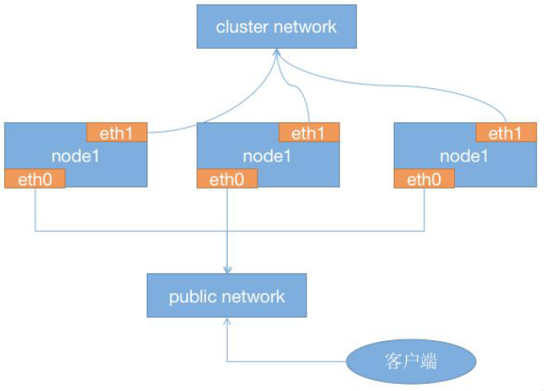

### 主机名ip映射

在所有主机下配置以下内容

```shell
cat >> /etc/hosts <<EOF
# public network
192.168.192.156 node01
192.168.192.157 node02

# cluster network
10.168.192.156 node01-cl
10.168.192.157 node02-cl

# manage network
EOF

cat /etc/hosts
```

### 静态ip

配置ip与网关

```shell
# 查看当前网关 ip
netstat -rn
ip a

# 添加DNS解析，任意添加一个
vim /etc/resolv.conf
```

```shell
apt upgrade -y
sudo apt install -y net-tools   
ifconfig #查看网卡名称
ip a

cd /etc/netplan
sudo gedit 01-network-manager-all.yaml

network: 
 version: 2
 renderer: NetworkManager
 ethernets:
  ens33:
   dhcp4: false
   addresses: [192.168.192.156/24]
   gateway4: 192.168.192.2
   nameservers:
    addresses: [192.168.192.2]
  ens34:
  	dhcp4: false
  	addresses: [10.168.192.156/24]
  	nameservers:
     addresses: [10.168.192.2]

network: 
 version: 2
 renderer: NetworkManager
 ethernets:
  ens33:
   dhcp4: false
   addresses: [192.168.192.157/24]
   gateway4: 192.168.192.2
   nameservers:
    addresses: [192.168.192.2]
  ens34:
  	dhcp4: false
  	addresses: [10.168.192.157/24]
  	nameservers:
     addresses: [10.168.192.2]
    
sudo netplan apply 
```

## 2.1.4 时间同步

> Ceph默认要求各节点的时间误差不超过50ms

所有节点都安装chrony

```shell
yum -y install chrony
systemctl enable chronyd
```

ceph01作为时间同步服务端

```shell
vim /etc/chrony.conf

# Use public servers from the pool.ntp.org project.
# Please consider joining the pool (http://www.pool.ntp.org/join.html).
# pool 2.centos.pool.ntp.org iburst
server 0.centos.pool.ntp.org iburst
server 1.centos.pool.ntp.org iburst
server 2.centos.pool.ntp.org iburst
server 3.centos.pool.ntp.org iburst
pool ntp1.aliyun.com iburst
pool ntp2.aliyun.com iburst
pool ntp3.aliyun.com iburst
pool ntp4.aliyun.com iburst
pool ntp5.aliyun.com iburst
pool ntp6.aliyun.com iburst


# Record the rate at which the system clock gains/losses time.
driftfile /var/lib/chrony/drift

# Allow the system clock to be stepped in the first three updates
# if its offset is larger than 1 second.
makestep 1.0 3

# Enable kernel synchronization of the real-time clock (RTC).
rtcsync

local stratum 10

# Allow NTP client access from local network.
# 将自身当做服务器
allow 192.168.0.0/16

# Serve time even if not synchronized to a time source.
```

重启服务

```shell
# redhat
systemctl enable chronyd
systemctl restart chronyd

# debian 重启服务
systemctl restart chrony
systemctl status chrony
systemctl enable chrony

chronyc sources
```

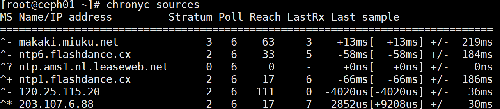

```shell
[root@ceph01 ~]# timedatectl
               Local time: 二 2024-06-04 18:10:34 CST
           Universal time: 二 2024-06-04 10:10:34 UTC
                 RTC time: 二 2024-06-04 10:10:33
                Time zone: Asia/Shanghai (CST, +0800)
System clock synchronized: yes # 主要看这里
              NTP service: active
          RTC in local TZ: no
[root@ceph01 ~]# date
2024年 06月 04日 星期二 18:10:41 CST
```

ceph2及其他后续节点作为客户端

```shell
vim /etc/chrony.conf

# Use public servers from the pool.ntp.org project.
# Please consider joining the pool (http://www.pool.ntp.org/join.html).
pool ceph01 iburst

# Record the rate at which the system clock gains/losses time.
driftfile /var/lib/chrony/drift

# Allow the system clock to be stepped in the first three updates
# if its offset is larger than 1 second.
makestep 1.0 3

# Enable kernel synchronization of the real-time clock (RTC).
rtcsync

# Enable hardware timestamping on all interfaces that support it.
#hwtimestamp *

# Increase the minimum number of selectable sources required to adjust
# the system clock.
#minsources 2

# Allow NTP client access from local network.
#allow 192.168.0.0/16

# Serve time even if not synchronized to a time source.
#local stratum 10

# Specify file containing keys for NTP authentication.
#keyfile /etc/chrony.keys

# Get TAI-UTC offset and leap seconds from the system tz database.
#leapsectz right/UTC

# Specify directory for log files.
logdir /var/log/chrony

# Select which information is logged.
#log measurements statistics tracking
```

其他节点重启服务

```shell
systemctl restart chronyd
```

使用时间服务的客户端进行验证

```shell
chronyc sources -v
[root@ceph02 ~]# chronyc sources -v
210 Number of sources = 1

  .-- Source mode  '^' = server, '=' = peer, '#' = local clock.
 / .- Source state '*' = current synced, '+' = combined , '-' = not combined,
| /   '?' = unreachable, 'x' = time may be in error, '~' = time too variable.
||                                                 .- xxxx [ yyyy ] +/- zzzz
||      Reachability register (octal) -.           |  xxxx = adjusted offset,
||      Log2(Polling interval) --.      |          |  yyyy = measured offset,
||                                \     |          |  zzzz = estimated error.
||                                 |    |           \
MS Name/IP address         Stratum Poll Reach LastRx Last sample               
===============================================================================
^* ceph01-cl                     3   6    17     5   -215ns[-1620ns] +/-   73ms
```

https://blog.csdn.net/weixin_64334766/article/details/128536776

```shell
*表示chronyd当前已经同步到的源。

+表示可接受的信号源，与选定的信号源组合在一起。

-表示被合并算法排除的可接受源

？指已失去连接性或者其数据包未通过所有测试的源。

x表示chronyd认为时虚假行情的时钟，即标记该时间与其他多数时间不一致

~表示时间似乎具有太多可变性
```

### 设置时区

```shell
#ubuntu
timedatectl set-timezone Asia/Shanghai
```

## 2.1.5 防火墙与SELinux

详见 [LInux防火墙](../7-环境与工具/Linux.md#firewall)

```shell
# 若ubuntu上不支持，可先安装sudo apt install -y firewalld
firewall-cmd --state

# 确保为monitor的6789端口添加防火墙策略
sudo apt -y install firewalld
firewall-cmd --zone=public --add-port=6789/tcp --permanent
firewall-cmd --zone=public --add-port=6800-7100/tcp --permanent

firewall-cmd --zone=public --add-port=80/tcp
firewall-cmd --zone=public --add-port=443/tcp

firewall-cmd --reload
firewall-cmd --zone=public --list-all
```

若只是测试环境，可以关闭防火墙

```shell
# ubuntu
sudo systemctl disable ufw.service

sudo ufw status
# 关闭防火墙
ufw stop
# 防火墙在系统启动时自动禁用
ufw disable
```

所有虚拟主机上禁用SELINUX

```shell
apt install -y selinux-utils

sudo apt install -y selinux-basics
sudo selinux-activate --disable

#临时禁用
setenforce 0

#永久禁用
vim /etc/selinux/config
# cat /etc/selinux/config
SELINUX=disabled
SELINUXTYPE=targeted
SETLOCALDEFS=0

node02@node02:~$ sestatus
SELinux status:                 disabled
```

## 2.1.6 centos源配置

安装epel相关repo包

<span id="ch_yum_source"></span>

```shell
# 移除epel
rpm -e epel-release

# 更新centos8对应repo
wget https://dl.fedoraproject.org/pub/epel/epel-release-latest-8.noarch.rpm
# 更新centos7对应repo
#wget https://dl.fedoraproject.org/pub/epel/epel-release-latest-7.noarch.rpm

# 通过rpm安装epel
rpm -ivh --nodeps epel-release-latest-8.noarch.rpm
# rpm -ivh --nodeps epel-release-latest-7.noarch.rpm

# 将repo配置中的地址替换为清华源
# https://mirrors.tuna.tsinghua.edu.cn/help/epel/
sed -e 's!^metalink=!#metalink=!g' \
    -e 's!^#baseurl=!baseurl=!g' \
    -e 's!https\?://download\.fedoraproject\.org/pub/epel!https://mirrors.tuna.tsinghua.edu.cn/epel!g' \
    -e 's!https\?://download\.example/pub/epel!https://mirrors.tuna.tsinghua.edu.cn/epel!g' \
    -i /etc/yum.repos.d/epel{,-testing}.repo

# 下载epel配置包
yum install epel-release -y

# 安装好EPEL 源后，检查是否添加到源列表
[root@ceph01 yum.repos.d]# yum repolist
repo id                                 repo name
epel                                    Extra Packages for Enterprise Linux 8 - aarch64
ks10-adv-cdrom                          Kylin Linux Advanced Server 10 - cdrom
ks10-adv-os                             Kylin Linux Advanced Server 10 - Os

# 安装好后，需要清除 yum 缓存、生成新的 yum 缓存、更新 yum
yum clean all
yum makecache
yum update
```

- EL 是 Red Hat Enterprise Linux（EL）的缩写
	- EL5 是 Red Hat 5. X，CentOS 5. X  
	- EL6 是 Red Hat 6. X，CentOS 6. X  
	- EL7 是 Red Hat 7. X，CentOS 7. X  
	- EL8 是 Red Hat 8. X，CentOS 8. X
- 在 Linux 环境中，RPM 包分为几种不同的架构，包括 `aarch64`、`noarch` 和 `x86_64`
	- **srpms** ：包含软件源代码的 RPM 包
	- **aarch64** ：64 位的 ARM CPU 架构，通常用于 ARM 架构的处理器。
	- **x86_64** ： 64 位的 CPU 架构，主要用于 AMD 和 Intel 生产的处理器
	- **noarch** ：表示软件包不依赖于任何特定的硬件架构
	
		通常不包含可执行的二进制文件，适用于那些不依赖于硬件架构的软件包

## 2.1.7 节点间ssh免密登录

### 主机名和解析

为所有主机下配置主机名与ip映射

```shell
cat >> /etc/hosts <<EOF
192.168.192.130 admin.wang.org admin
192.168.192.131 mon01.wang.org mon01
192.168.192.132 mon02.wang.org mon02
192.168.192.133 mon03.wang.org mon03
192.168.192.134 mgr01.wang.org mgr01
192.168.192.135 mgr02.wang.org mgr02
192.168.192.136 store01.wang.org store01
192.168.192.137 store02.wang.org store02
192.168.192.138 store03.wang.org store03
EOF
```

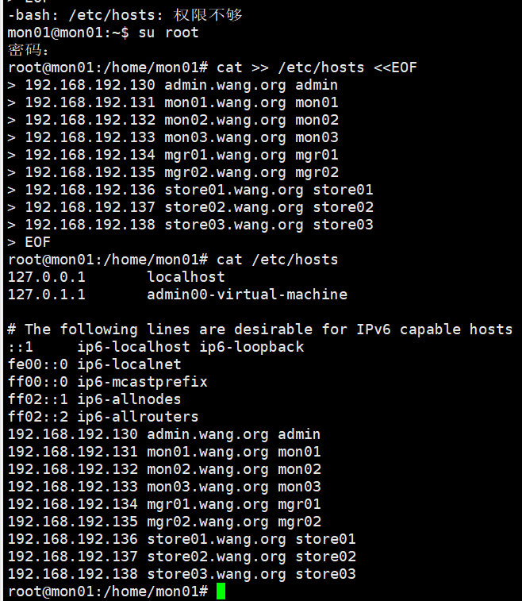

随着生产中主机节点越来越多，通过手工定制主机名的方式不适合主机管理。在企业中，主机名相关信息，倾向于通过内网dns来进行管理

radosgw，需要通过泛域名解析的机制来实现更加强大的面向客户端的主机名解析管理体系

### 实现基于ssh key的免密登录

#### 实现root用户的ssh免密登录

```shell
sudo apt install openssh-server -y

ssh

vim /etc/ssh/sshd_config
# Allow Root Login
PermitRootLogin yes

# 重启ssh服务进程
service sshd restart
```

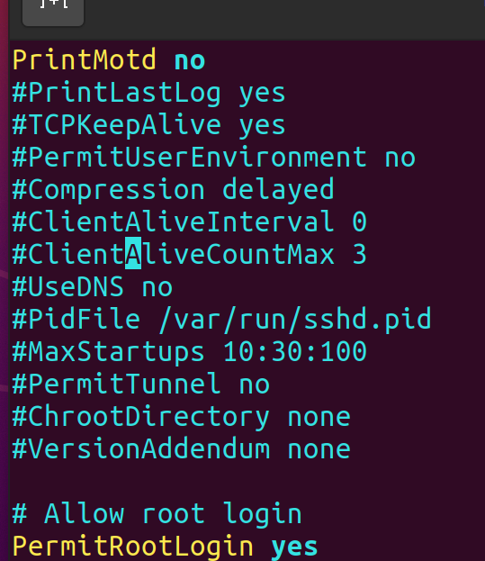

#### 通过sshpass为每个主机生成sshkey并推送给hosts中已知主机

```shell
sudo apt -y install sshpass
vim ssh_key_push.sh
```

**原理** ：

1. `scan_host` 生成已知主机的IP，记录到 `SCANIP.log` 中

   ```shell
   # SCANIP.log
   192.168.5.210
   192.168.5.211
   ```

   本例中 `SCANIP.log` 只使用与ubuntu，对于其他系统，若是NIC信息输出格式不一致，也可手动生成 ，并删除bash中的调用

2. `push_ssh_key` 读取IP列表，并利用sshpass将当前主机的公钥和免输 "yes" 配置推送到列表中的所有主机

在每个主机root用户下执行以下脚本

```shell
#!/bin/bash
#
#********************************************************************
#Author:            wangxiaochun
#QQ:                29308620
#Date:              2021-05-08
#FileName:          ssh_key_push.sh
#URL:               http://www.wangxiaochun.com
#Description:       多主机基于ssh key 互相验证
#Copyright (C):     2021 All rights reserved
#********************************************************************

#当前用户密码
PASS=admin
#设置网段最小和最大的地址的尾数
BEGIN=156
END=157
# 网卡名
NIC=ens33

IP=`ip a s ${NIC} | awk -F'[ /]+' 'NR==4{print $3}'`
NET=${IP%.*}.

scan_host() {
    [ -e ./SCANIP.log ] && rm -f SCANIP.log
    for((i=$BEGIN;i<="$END";i++));do
        ping -c 1 -w 1  ${NET}$i &> /dev/null  && echo "${NET}$i" >> SCANIP.log &
    done
    wait
}

push_ssh_key() {
   	#生成ssh key 
    [ -e ~/.ssh/id_rsa ] || ssh-keygen -P "" -f ~/.ssh/id_rsa
    sshpass -p $PASS ssh-copy-id -o StrictHostKeyChecking=no root@$IP  &>/dev/null

    ip_list=(`sort -t . -k 4 -n  SCANIP.log`)
    for ip in ${ip_list[*]};do
        sshpass -p $PASS scp -o StrictHostKeyChecking=no -r ~/.ssh root@${ip}: &>/dev/null
    done

    #把.ssh/known_hosts拷贝到所有主机，使它们第一次互相访问时不需要输入yes回车
    for ip in ${ip_list[*]};do
        scp ~/.ssh/known_hosts @${ip}:.ssh/   &>/dev/null
    done
}

scan_host
push_ssh_key
```

```shell
# 需要再所有主机上执行
bash ssh_key_push.sh
```

### 所有主机通过cephadm实现免密登录

#### 创建cephadm用户

基于安全考虑，不用root用户管理

倾向与用一个普通用户来操作，由于后续安装软件，涉及root用户权限，所以这个普通用户最好具备 sudo 的权限

> 此管理用户名称不能使用ceph名称，ceph后续会自动创建此用户

**只需要在一台主机上执行**

```shell
#用脚本实现批量创建用户
cat > create_cephadm.sh <<EOF
# !/bin/bash
# 设定普通用户
useradd -m -s /bin/bash cephadm
echo cephadm:admin | chpasswd
echo "cephadm ALL=(ALL) NOPASSWD:ALL" > /etc/sudoers.d/cephadm
chmod 0440 /etc/sudoers.d/cephadm
EOF

#批量执行
for i in {150..152}; do ssh root@192.168.192.$i bash < create_cephadm.sh ; done
```

检测是否创建用户

```shell
ll /etc/passwd
cat /etc/passwd
```

#### 跨主机免密登录

**只需要在一台主机上执行**

```shell
su - cephadm
ssh-keygen -t rsa -P "" -f ~/.ssh/id_rsa

PASS=admin
for i in {150..152};do
	sshpass -p $PASS ssh-copy-id -o StrictHostKeyChecking=no cephadm@192.168.192.$i
done

root@node1:~# PASS=admin
root@node1:~# for i in {150..152};do
> sshpass -p $PASS ssh-copy-id -o StrictHostKeyChecking=no root@192.168.192.$i
> done
```

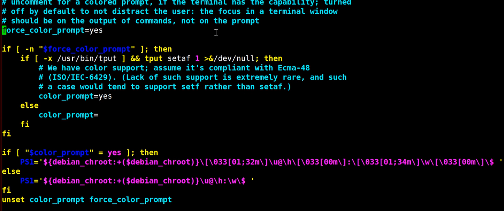

# 2.2 Ceph手动安装

## 2.2.1 获取软件包

访问官网获取RPM包以及第三方库

通过添加Ceph安装包的存储库，使用包管理工具下载

- Dibian APT
- RHEL：YUM

### 配置安装源

```
name=
baseurl={ceph-release}/{distro}
ceph-release:有效的Cep发行版名称
distro:Linux的发行版信息
```

## 2.2.2 安装依赖

安装RHEL库

安装Ceph需要的第三方二进制文件

创建Ceph存储库文件用于描述Ceph版本

安装Ceph软件包

验证软件包是否安装成功

## 2.2.3 部署Ceph集群

- ceph.xxx.keyring：xxx级的密钥，负责同一集群的认证、各级对等节点间的相互认证

### monitor部署

monmap负责集群中各组件关系的软件定义

```shell
#1. 为Ceph创建一个目录，且创建Ceph集群配置文件
mkdir /etc/ceph
touch /etc/ceph/ceph.conf

#2. 为集群生成fsid
uuidgen

#3.创建集群配置文件
默认集群名称为ceph。配置文件名称为/etc/ceph/ceph.conf
使用uuid作为配置文件中的fsid参数
vim /etc/ceph/ceph.conf
[mon.ceph-node2]
mon_addr=
host=ceph-node2

#4. 为集群创建密钥环，生成monitor的密钥
ceph-authtool --creat-keyring /tmp/ceph.mon.keyring --gen-key -n mon. —-cap mon ‘allow *’

#5. 创建client.admin用户
ceph-authtool --create-keyring /etc/ceph/ceph.client.admin.keyring --gen-key -n client.admin --set-uid=0 --cap mon ‘allow *’ --cap osd ‘allow *’ --cap mds ‘allow *’

#6.将client.admin密钥添加到ceph.mon.keyring中
ceph-authtool /tmp/ceph.mon.keyring --import-keyring /etc/ceph/ceph.client.admin.keyring

#7. 为第一个monitor生成monitor.map
monmaptool --create --add {hostname} {ip-address} --fsid {uuid} /tmp/monmap

#8. 为monitor创建类似路径/cluster_name-monitor_node格式的目录
mkdir /var/lib/ceph/mon/ceph-ceph-node1

#9.填入第一个monitor守护进程信息
ceph-mon --mkfs -i {hostname} --monmap /tmp/monmap --keyring /tmp/ceph.mon.keyring 

#10.启动monitor服务
service ceph start

#11.查看Ceph集群状态及默认池
ceph osd lspools

#12. 将ceph.conf和ceph.client.admin.keyring 文件复制到ceph-node2,ceph-node3，让mon2,mon3可以发出集群命令
scp /etc/ceph/ceph.* ceph-node2:/etc/ceph
scp /etc/ceph/ceph.* ceph-node3:/etc/ceph

# 若上述步骤出现 Error Connecting to cluster的错误，需要为Ceph monitor守护进程关闭防火墙或修改防火墙规则
```

### 创建OSD

```shell
#1. 检查系统中的可用磁盘
cep-disk list

#2. Ceph OSD基于GUID分区表(GPT)工作，需要将分区表改为GPT
parted /dev/sdb mklabel GPT
parted /dev/sdc mklabel GPT
parted /dev/sdd mklabel GPT

#3. 提供集群以及文件系统信息
$ ceph-disk prepare --cluster {cluster-name} --cluster-uuid {fid} --fs-type {ext4/xfs/btrfs} {data-path} [{journal-path}]
ceph-disk prepare --cluster ceph --cluster-uuid {fid} --fs-type ext4 /dev/sdb
ceph-disk prepare --cluster ceph --cluster-uuid {fid} --fs-type ext4 /dev/sdc
ceph-disk prepare --cluster ceph --cluster-uuid {fid} --fs-type ext4 /dev/sdd

#4. 激活OSD
ceph-disk activate /dev/sdb
ceph-disk activate /dev/sdc
ceph-disk activate /dev/sdd

#5.激活OSD
ceph -s
# 硬盘的正常工作状态为 IN和UP

#6. 检查OSD树，给出关于OSD及其所在物理节点的信息
ceph tree
```

### 扩展集群

为保证集群节点的高可靠和高可用，需要配置冗余节点 

- $集群正常工作节点数>\frac{n}{2}$ ，即推荐奇数个节点才能避免在其他系统上看到Ceph集群的脑裂状态

**扩展monitor**

```shell
#1. 登陆ceph-node2并创建目录
mkdir -p /var/lib/ceph/mon/ceph-ceph-node2 /tmp/ceph-node2

#2. 编辑/etc/ceph/ceph.conf 文件，修改节点信息
vim /etc/ceph/ceph.conf
[mon.ceph-node2]
mon_addr=
host=ceph-node2

#3. 从Ceph集群中提取密钥环的信息
ceph auth get mon. -o /tmp/ceph-node2/monkeyring

#4. 从Ceph集群中获取monitor map信息
ceph mon getmap -o /tmp/ceph-node2/monmap

#5. 使用密钥和已有的monmap，构建一个新的集群
ceph-mon -i ceph-node2 --mkfs --monmap /tmp/ceph-node2/monmap --keyring /tmp/ceph-node2/monkeyring

#6.添加新的monitor到集群
ceph mon add ceph-node2 [ip_address]

#7. 检查集群状态，配置NTP以同步时间信息
ceph -s

#8. 添加ceph-node3作为第三个monitor
```

# 2.3 ceph-deploy

```shell
无法获得锁 /var/lib/dpkg/lock-frontend

# 检查进程：检查是否有其他 dpkg 或 apt 进程正在运行：
sudo lsof /var/lib/dpkg/lock-frontend

# 结束进程：如果有进程正在运行，您可以选择等待它完成，或者如果您确定它是卡住的，可以尝试结束该进程：
sudo kill <PID>

# 清理锁定文件，如果进程已经结束，但锁定文件仍然存在，可能是因为上次操作没有正确清理。在这种情况下，您可以尝试手动删除锁定文件：
sudo rm /var/lib/dpkg/lock-frontend
```

## 2.3.1 ceph-deploy介绍

### ceph-deploy文档

**安装N版及以下的版本，照着https://www.cnblogs.com/renato/p/12841005.html就行**

**安装O版需要先用epel8，安装ceph-deploy 2.0.1，再换回el7，套用上述安装步骤**


https://docs.ceph.com/en/pacific/man/8/ceph-deploy/#cmdoption-ceph-deploy-repo-url

https://docs.ceph.com/projects/ceph-deploy/en/latest/#python-package-index

### admin节点安装ceph-deploy工具

切到cephadm用户

```shell
#安装
cephadm@admin:~$sudo apt-cache madison ceph-deploy # 查看版本
cephadm@admin:~$sudo apt -y install ceph-deploy

#验证成功和查看版本
cephadm@admin:~$ceph-deploy --version
2.0.1

#查看帮助手册
cephadm@admin:~$ceph-deploy --help
# new：开始部署一个新的ceph 存储集群，并生成CLUSTER.conf 集群配置文件和keyring 认证文件。
#install: 在远程主机上安装ceph 相关的软件包, 可以通过--release 指定安装的版本。
# rgw：管理RGW 守护程序(RADOSGW,对象存储网关)。
# mgr：管理MGR 守护程序(ceph-mgr,Ceph Manager DaemonCeph 管理器守护程序)。
# mds：管理MDS 守护程序(Ceph Metadata Server，ceph 源数据服务器)。
# mon：管理MON 守护程序(ceph-mon,ceph 监视器)。
#gatherkeys：从指定的获取提供新节点验证keys，这些keys 会在添加新的MON/OSD/MD 加入的时候使用。
# disk：管理远程主机磁盘。
# osd：在远程主机准备数据磁盘，即将指定远程主机的指定磁盘添加到ceph 集群作为osd 使用。
# repo： 远程主机仓库管理。
# admin：推送ceph集群配置文件和client.admin 认证文件到远程主机。
# config：将ceph.conf 配置文件推送到远程主机或从远程主机拷贝。
# uninstall：从远端主机删除安装包。
# urgedata：从/var/lib/ceph 删除ceph 数据,会删除/etc/ceph 下的内容。
# purge: 删除远端主机的安装包和所有数据。
# forgetkeys：从本地主机删除所有的验证keyring, 包括client.admin, monitor, bootstrap 等认证文件。
# pkg： 管理远端主机的安装包。
# calamari：安装并配置一个calamari web 节点，calamari 是一个web 监控平台。
```

## 2.3.2 ceph-deploy对集群初始化

生成集群配置，并未做实际安装

初始化第一个mon节点的命令格式为 `ceph-deploy new {initial-monitor-node(s)}` 

- ceph-mon 即为第一个monitor节点名称，其名称必须与节点当前实际使用的主机名称( `uname -n` ) 保持一致，即可以是短名称，也可以是长名称

  但短名称会导致错误： ceph-deploy new: error: hostname: xxx is not resolvable

- 推荐使用完整写法：`hostname:fqdn` 如：`ceph-mon:ceph-mon.wang.org`

```shell
#首先在管理节点上以cephadm用户创建集群相关的配置文件目录
cephadm@node1:~$ mkdir ceph-cluster && cd ceph-cluster
# 查看主机名
cephadm@node1:~$ mkdir ceph-cluster && cd ceph-cluster
node1

#运行如下命令即可生成初始配置：
cephadm@node1:~/ceph-cluster$ ceph-deploy new --public-network 192.168.192.0/24 --cluster-network 192.168.252.0/24 node1 node2 node3

cephadm@admin:~/ceph-cluster$ ceph-deploy new --public-network 192.168.192.0/24 --cluster-network 192.168.252.0/24 node1
# ceph.conf #自动生成的配置文件
# ceph-deploy-ceph.log #初始化日志
# ceph.mon.keyring #用于ceph mon 节点内部通讯认证的秘钥环文件

若是el7安装N及O，出现need_ssh
--no-ssh-copykey
```

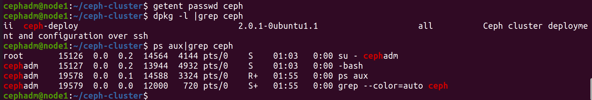

```shell
cephadm@node1:~/ceph-cluster$ cat ceph.conf
[global]
fsid = 96a78567-2c73-4b65-adf1-fb8a3c18766a
public_network = 192.168.192.0/24
cluster_network = 192.168.252.0/24
mon_initial_members = node1
mon_host = 192.168.192.150
auth_cluster_required = cephx
auth_service_required = cephx
auth_client_required = cephx

#如果想要一下子将所有的mon节点都部署出来，我们可以执行下面的命令
ceph-deploy new --public-network 192.168.192.130/24 --cluster-network 192.168.252.0/24 mon01 mon02 mon03

cephadm@admin:~/ceph-cluster$ cat ceph.conf
[global]
fsid = a168efb2-3012-48b3-aac7-31a11c232235
public_network = 192.168.192.130/24
cluster_network = 192.168.252.0/24
mon_initial_members = mon01, mon02, mon03
mon_host = 192.168.192.131,192.168.192.132,192.168.192.133
auth_cluster_required = cephx
auth_service_required = cephx
auth_client_required = cephx
```


没出这个问题

- 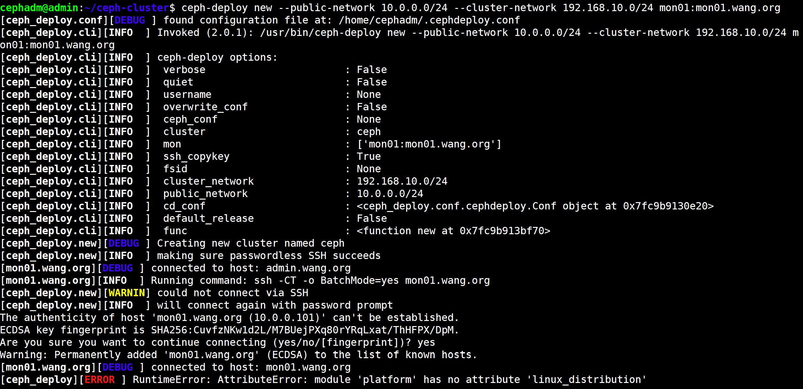

  ```shell
  #原因分析：因为 python3.8 已经没有这个方法了
  cephadm@admin:~/ceph-cluster$ dpkg -l python3
  期望状态=未知(u)/安装(i)/删除(r)/清除(p)/保持(h)
  | 状态=未安装(n)/已安装(i)/仅存配置(c)/仅解压缩(U)/配置失败(F)/不完全安装(H)/触发器等待
  (W)/触发器未决(T)
  |/ 错误?=(无)/须重装(R) (状态，错误：大写=故障)
  ||/ 名称 版本 体系结构 描述
  +++-==============-==============-============-
  =========================================================================
  ii python3 3.8.2-0ubuntu2 amd64 interactive high-level objectoriented
  language (default python3 version)
  #解决方法：
  cephadm@admin:~/ceph-cluster$sudo vim /usr/lib/python3/dist-packages/ceph_deploy/hosts/remotes.py
  
  def platform_information(_linux_distribution=None):
  	""" detect platform information from remote host """
  	行首加#号注释下面两行
  	#linux_distribution = _linux_distribution or platform.linux_distribution
  	# distro, release, codename = linux_distribution()
  	
  	在上面两行下面添加下面6行
  	distro = release = codename = None
  	try:
  		linux_distribution = _linux_distribution or platform.linux_distribution
  		distro, release, codename = linux_distribution()
  	except AttributeError:
  		pass
  	.......
  ```

  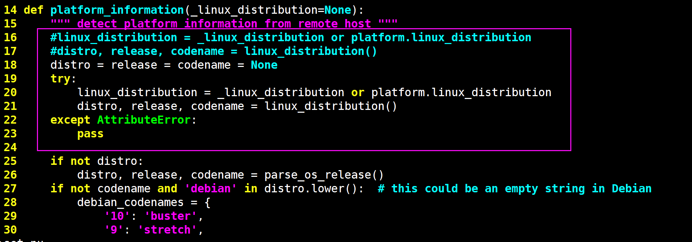

### 2.3.3 ceph包的安装——不推荐用ceph-deploy install

#### 为所有节点配置ceph包安装源

**ubuntu**

```shell
#在管理节点准备脚本,注意以root身份执行
root@node1:cat > ceph_repo.sh <<EOF
#!/bin/bash
# 更新ceph的软件源信息
echo "deb https://mirror.tuna.tsinghua.edu.cn/ceph/debian-quincy/ $(lsb_release -sc) main" > /etc/apt/sources.list.d/ceph.list 
wget -q -O- 'https://download.ceph.com/keys/release.asc' | apt-key add - 
apt update
EOF

#!/bin/bash
# 更新ceph的软件源信息
echo "deb https://mirror.tuna.tsinghua.edu.cn/ceph/debian-pacific/ $(lsb_release -sc) main" > /etc/apt/sources.list.d/ceph.list 
wget -q -O- 'https://download.ceph.com/keys/release.asc' | apt-key add - 
apt update
EOF

#因为所有节点都会依赖于这些apt源信息，需要进行同步
[root@admin ~]for i in {150..152};do ssh -o StrictHostKeyChecking=no 192.168.192.$i bash < ceph_repo.sh;done

# 去其他结点查看
cat /etc/apt/sources.list.d/ceph.list
```

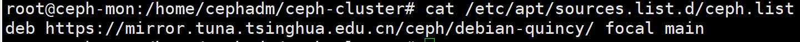

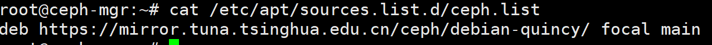

**centos**

https://www.cnblogs.com/zphj1987/p/13575358.html

修改ceph源

```shell
# rpm --import 'https://download.ceph.com/keys/release.asc'
rpm --import 'https://mirrors.tuna.tsinghua.edu.cn/ceph/keys/release.asc'

# rpm -ivh https://download.ceph.com/rpm-17.2.7/el8/noarch/ceph-release-1-1.el8.noarch.rpm
rpm -ivh https://mirrors.tuna.tsinghua.edu.cn/ceph/rpm-17.2.7/el8/noarch/ceph-release-1-1.el8.noarch.rpm
rpm -ivh https://mirrors.tuna.tsinghua.edu.cn/ceph/rpm-nautilus/el7/noarch/ceph-release-1-1.el7.noarch.rpm
```

配置ceph.repo

```shell
[ceph]
name=ceph
baseurl=https://mirrors.tuna.tsinghua.edu.cn/ceph/rpm-17.2.7/el8/x86_64/
gpgcheck=0
priority=1

[ceph-noarch]
name=cephnoarch
#baseurl=https://mirrors.aliyun.com/ceph/rpm-pacific/el8/noarch/
baseurl=https://mirrors.tuna.tsinghua.edu.cn/ceph/rpm-17.2.7/el8/noarch/
gpgcheck=0
priority=1

[ceph-source]
name=Ceph source packages
baseurl=https://mirrors.aliyun.com/ceph/rpm-17.2.7/el8/SRPMS
enabled=0
gpgcheck=1
priority=1
type=rpm-md
gpgkey=https://mirrors.tuna.tsinghua.edu.cn/ceph/keys/release.asc
```

#### ceph-deploy install指令介绍

初始化节点相当于在存储节点安装了ceph 及ceph-rodsgw

- 默认情况下，ceph-deploy会安装最新版本的ceph，若需要指定ceph版本，添加参数 `--release {ceph-release-name}`

```shell
#命令格式：
ceph-deploy install --{role} {node} [{node} ...]
#注意：这里主要是ceph的工作角色的的节点
#方法1:使用ceph-deploy命令能够以远程的方式连入Ceph集群各节点完成程序包安装等操作
# 一般情况下，不推荐使用这种直接的方法来进行安装，效率太低，实际上也是在各节点上执行方法2
ceph-deploy install --mon mon01 mon02 mon03

ceph-deploy install --repo-url=http://mirrors.aliyun.com/ceph/rpm-<版本号>/el7/ --gpg-url=http://mirrors.aliyun.com/centos/RPM-GPG-KEY-CentOS-7 <host-name>

#方法2:上述指令等价在每个ceph-node节点安装 ceph-{role}
apt install -y ceph ceph-osd ceph-mds ceph-mon radosgw
```

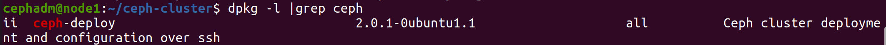

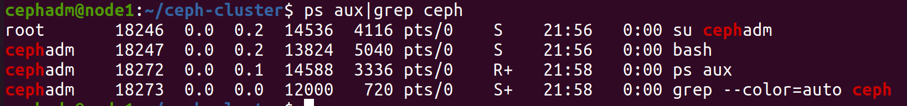

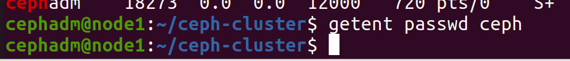

## 2.3.4 mon节点

### 安装mon节点依赖

```shell
#在admin主机上，向mon节点安装mon组件
cephadm@admin:~/ceph-cluster$ ceph-deploy install --no-adjust-repos --nogpgcheck --mon mon01 mon02 mon03

[root@lab8106 ~]# ceph-deploy install kylin01 --repo-url=https://mirrors.tuna.tsinghua.edu.cn/ceph/rpm-quincy/el8/ --gpg-url=https://mirrors.tuna.tsinghua.edu.cn/ceph/keys/release.gpg

#或者直接在mon节点安装软件
[root@ceph-mon ~] apt -y install ceph-mon
```

安装完成后，发现自动创建了ceph用户

```shell
cephadm@node1:~/ceph-cluster$ getent passwd ceph
ceph:x:64045:64045:Ceph storage service:/var/lib/ceph:/usr/sbin/nologin
```

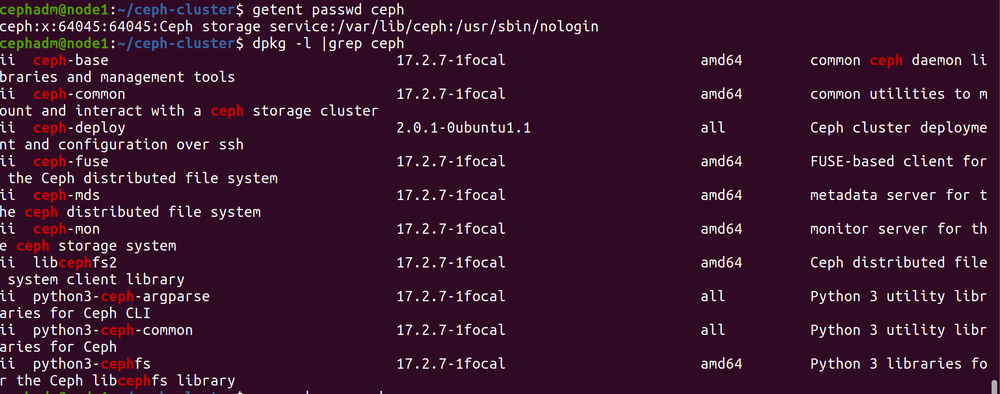

验证在mon 节点已经自动安装并启动了ceph-mon 服务

```shell
cephadm@node1:~/ceph-cluster$ dpkg -l |grep ceph
cephadm@node1:~/ceph-cluster$ ps aux|grep ceph
```

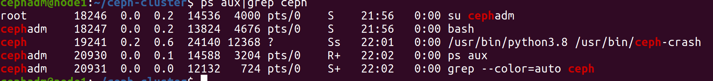

### 初始化mon节点生成配置信息

确定集群配置信息，根据集群规划修改

```shell
vim ceph.conf

若是3mon节点
[global]
fsid = a168efb2-3012-48b3-aac7-31a11c232235
public_network = 192.168.192.130/24
cluster_network = 192.168.252.0/24
mon_initial_members = mon01, mon02, mon03
mon_host = 192.168.192.131,192.168.192.132,192.168.192.133
auth_cluster_required = cephx
auth_service_required = cephx
auth_client_required = cephx

单mon节点
[global]
fsid = 7d8af3fe-089e-40ee-85d0-2854ff3c1631
public_network = 192.168.192.0/24
cluster_network = 192.168.252.0/24
mon_initial_members = ceph-mon
mon_host = 192.168.192.120
auth_cluster_required = cephx
auth_service_required = cephx
auth_client_required = cephx
```

**初始化集群mon节点**

```shell
cephadm@node1:~/ceph-cluster$ ceph-deploy --overwrite-conf mon create-initial
```

查看生成的配置文件

- 节点初始化会生成一些ceph.bootstrap -mds/mgr/osd/rgw 等服务的keyring 认证文件，这些初始化文件拥有对ceph 集群的最高权限，所以一定要保存好。

```shell
cephadm@node1:~/ceph-cluster$ ll

ceph.bootstrap-mds.keyring 引导启动 mds的密钥文件
ceph.bootstrap-mgr.keyring 引导启动 mgr的密钥文件
ceph.bootstrap-osd.keyring 引导启动 osd的密钥文件
ceph.bootstrap-rgw.keyring 引导启动 rgw的密钥文件
ceph.client.admin.keyring ceph客户端和管理端通信的认证密钥，是最重要的
ceph.conf
ceph-deploy-ceph.log
ceph.mon.keyring
#结果显示：这里生成了一系列的与ceph集群相关的 认证文件
#注意：ceph.client.admin.keyring 拥有ceph集群的所有权限，一定不能有误。
```

- 此时在mon节点启动了一些进程

```shell
#到mon的节点上查看mon的自动开启相应的守护进程
[root@mon01 ~]ps aux|grep ceph
```

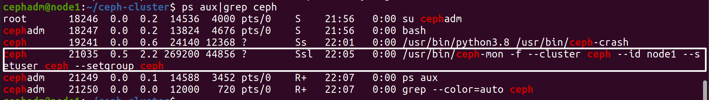

```shell
cephadm@node1:~/ceph-cluster$ ls /etc/ceph/
ceph.conf  rbdmap  tmp_knw2l2z
```

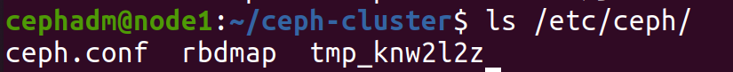

### 向admin节点推送admin密钥

在admin角色的主机上，把配置文件和admin密钥拷贝到Ceph集群各监控角色节点mon

- 注意：原则上要求：所有mon节点上的 ceph.conf 内容必须一致，如果不一致的话，可以通过下面命令同步

  ```shell
  ceph-deploy --overwrite-conf config push node1 node2 node3 n
  
  #集群admin节点的认证文件分发到admin节点
  ceph-deploy admin {admin-node}
  
  ceph-deploy admin --help
  #usage: ceph-deploy admin [-h] HOST [HOST ...]
  #Push configuration and client.admin key to a remote host.
  #positional arguments:
  #	HOST 	host to configure for Ceph administration
  #optional arguments:
  #	-h, --help show this help message and exit
  ```

在mon节点实现集群管理

```shell
#分发admin认证前，
cephadm@node1:~/ceph-cluster$ ls /etc/ceph/
ceph.conf  rbdmap  tmpaagml4w1

cephadm@node1:~/ceph-cluster$ ceph-deploy admin node1
cephadm@node1:~/ceph-cluster$ ls /etc/ceph/
ceph.client.admin.keyring  ceph.conf  rbdmap  tmpaagml4w1

结果显示：这里多了一个 ceph的客户端与服务端进行认证的密钥文件了
# ceph.client.admin.keyring 主要用于ceph节点与管理端的一个通信认证。
```

问题：虽然我们把认证文件传递给对应的admin主机了，但是admin节点是通过普通用户cephadm来进行交流的。而默认情况下，传递过去的认证文件，cephadm普通用户是无法正常访问的

```shell
#cephadm用户执行命令因文件权限会出错
[root@node1 ~] su - cephadm
cephadm@node1:~/ceph-cluster$ ceph -s
```

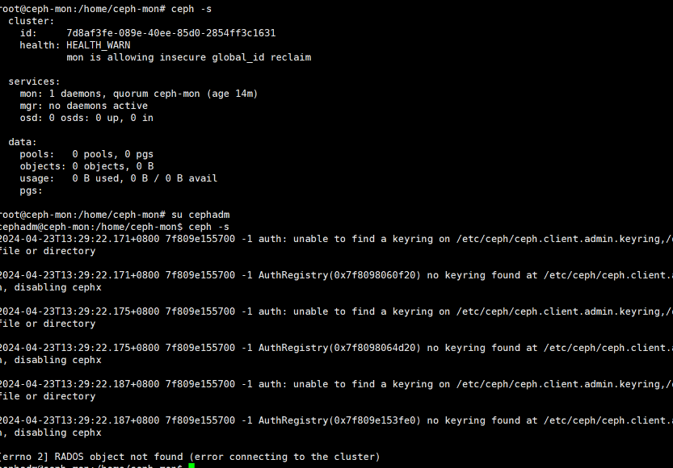

在集群中需要运行ceph指令的节点上，为cephadm用户设置/etc/ceph/ceph.client.admin.keyring文件权限

````shell
cephadm@node1:~/ceph-cluster$ sudo apt install acl
cephadm@node1:~/ceph-cluster$ sudo setfacl -m u:cephadm:r /etc/ceph/ceph.client.admin.keyring
````

此时cephadm用户有了集群的管理权限

```shell
#消除 mon is allowing insecure global_id reclaim的报警信息
cephadm@node1:~/ceph-cluster$ ceph config set mon auth_allow_insecure_global_id_reclaim false

#再次查看没有告警信息
cephadm@node1:~/ceph-cluster$ ceph -s
```

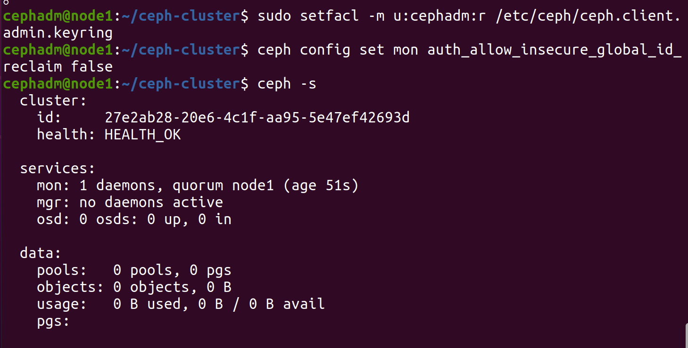

## 2.3.5 mgr节点

Ceph-MGR工作的模式是事件驱动型的，简单来说，就是等待事件，事件来了则处理事件返回结果，又继续等待。

Ceph MGR 是自从 Ceph 12.2 依赖主推的功能之一，是负责 Ceph 集群管理的组件，它主要功能是把集群的一些指标暴露给外界使用。根据官方的架构原则上来说，mgr要有两个节点来进行工作。

对于测试环境其实一个就能够正常使用了,暂时先安装一个节点，后面再安装第二个节点。

### 安装mgr节点依赖

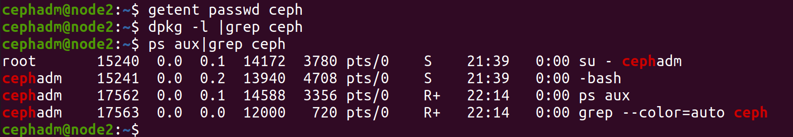

```shell
ceph-deploy install --mgr node2
apt -y install ceph-mgr

cephadm@node2:~$ getent passwd ceph

dpkg -l |grep ceph# 之前是没有的，安装之后，多了
```

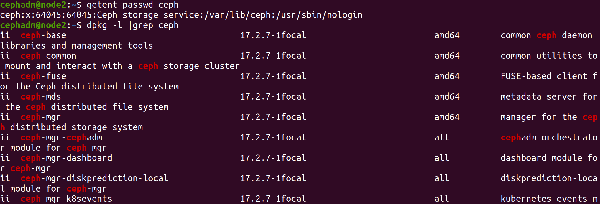

且进程启动

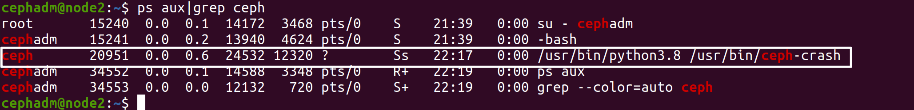

### 将mgr节点加入集群

在 admin 节点的 /ceph-cluster 目录下执行

```shell
cephadm@ceph-mon:~/ceph-cluster$ ceph-deploy mgr create node2

#自动在mgr01节点生成配置文件和用户
[root@mgr01 ~] ls /etc/ceph/
ceph.conf  rbdmap  tmp8zt3kkj8

[root@mgr01 ~] getent passwd ceph
ceph:x:64045:64045:Ceph storage service:/var/lib/ceph:/usr/sbin/nologin

#开启相关进程
[root@mgr01 ~] ps aux|grep ceph
ceph       35476  0.0  0.5  24468 11532 ?        Ss   20:45   0:00 /usr/bin/python3 /usr/bin/ceph-crash
ceph       43250  8.3  8.9 897816 176364 ?       Ssl  20:54   0:05 /usr/bin/ceph-mgr -f --cluster ceph --id mgr01 --setuser ceph --setgroup ceph
root       43375  0.0  0.0  12000   720 pts/2    S+   20:55   0:00 grep --color=auto ceph

#查看集群状态
cephadm@admin:~/ceph-cluster$ ceph -s
#结果显示：这个时候，service上，多了一个mgr的服务，在mgr01节点上，服务状态是 active。
```

防火墙没关

```shell
systemctl status firewalld
systemctl stop firewalld
systemctl disabled  firewalld
systemctl disable  firewalld
```

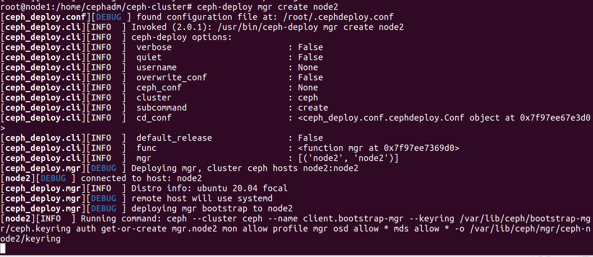

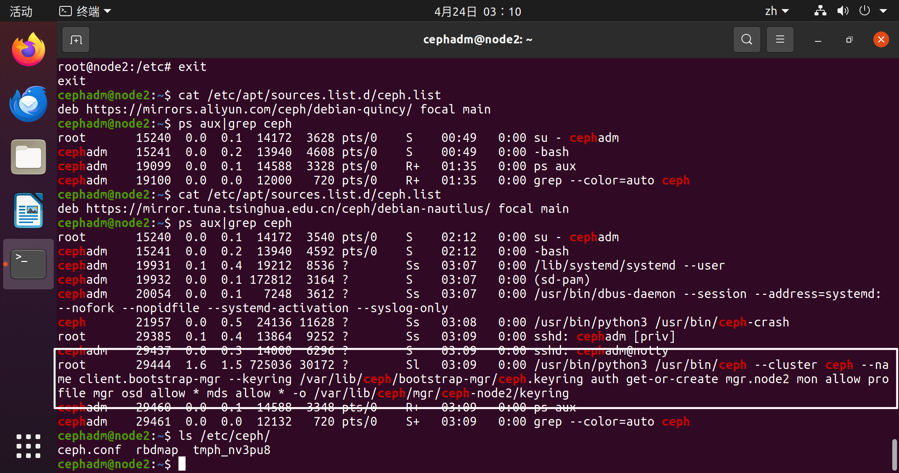

## 2.3.6 osd节点

要设置OSD环境，一般执行下面步骤：

- 要知道对应的主机上有哪些磁盘可以提供给主机来进行正常的使用。
- 格式化磁盘(非必须)
- ceph擦除磁盘上的数据
- 添加osd

```shell
#所有的存储节点主机都准备了两块额外的磁盘，
[root@store01 ~] lsblk
NAME   MAJ:MIN RM   SIZE RO TYPE MOUNTPOINT
loop0    7:0    0  63.3M  1 loop /snap/core20/1828
loop1    7:1    0     4K  1 loop /snap/bare/5
loop2    7:2    0  63.5M  1 loop /snap/core20/2015
loop3    7:3    0 346.3M  1 loop /snap/gnome-3-38-2004/119
loop4    7:4    0 349.7M  1 loop /snap/gnome-3-38-2004/143
loop5    7:5    0  91.7M  1 loop /snap/gtk-common-themes/1535
loop6    7:6    0    46M  1 loop /snap/snap-store/638
loop7    7:7    0  49.9M  1 loop /snap/snapd/18357
loop8    7:8    0  40.9M  1 loop /snap/snapd/20290
sda      8:0    0    20G  0 disk 
├─sda1   8:1    0   512M  0 part /boot/efi
├─sda2   8:2    0     1K  0 part 
└─sda5   8:5    0  19.5G  0 part /
sdb      8:16   0    20G  0 disk 
sdc      8:32   0    20G  0 disk 
sr0     11:0    1   4.1G  0 rom  /media/store01/Ubuntu 20.04.6 LTS amd64

#如果不想查看大量无效设备的话，可以执行下面清理操作
sudo apt autoremove --purge snapd -y
```

```shell
DISK="/dev/sdX"

DISK="/dev/sdd"

## Zap the disk to a fresh, usable state (zap-all is important, b/c MBR has to be clean)
sgdisk --zap-all $DISK

## Wipe a large portion of the beginning of the disk to remove more LVM metadata that may be present
dd if=/dev/zero of="$DISK" bs=1M count=100 oflag=direct,dsync

## SSDs may be better cleaned with blkdiscard instead of dd
blkdiscard $DISK

## Inform the OS of partition table changes
partprobe $DISK
```

### 安装osd依赖

```shell
#1. 确认仓库配置
[root@store01 ~] cat /etc/apt/sources.list.d/ceph.listdeb https://mirror.tuna.tsinghua.edu.cn/ceph/debian-pacific/ focal main wget -q -O- https://download.ceph.com/keys/release.asc

#2. 安装OSD相关软件
#方法1: 在管理节点远程安装
cephadm@admin:~/ceph-cluster$ ceph-deploy install --release quincy --osd store01 
#方法2: 在OSD主机手动安装
[root@store01 ~] apt -y install ceph-osd

#3. 确认安装结果
#自动生成用户ceph
[root@store01 ~] tail -n1 /etc/passwd
[root@store01 ~] dpkg -l |grep ceph

ls /etc/ceph/
ps aux|grep ceph
```

### 查看所有可用的osd磁盘

```shell
#检查并列出OSD节点上所有可用的磁盘的相关信息
cephadm@admin:~/ceph-cluster$ ceph-deploy disk list node3
```

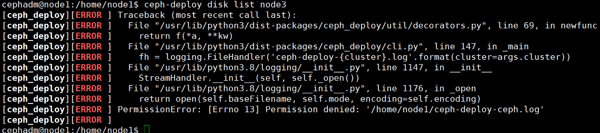

报错原因是 python 版本问题

```shell
# 修改375行,将 if line.startswith('Disk /'): 更改为 if line.startswith(b'Disk /')
#只在'Disk前加一个字母 b 即可
cephadm@admin:~$sudo vim +375 /usr/lib/python3/dist-packages/ceph_deploy/osd.py
```

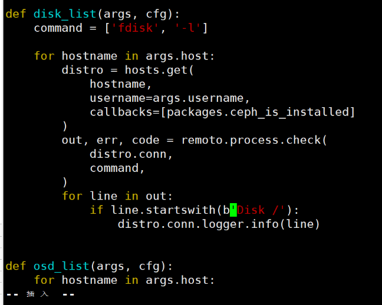

```shell
cephadm@node1:~/ceph-cluster$ ceph-deploy disk list node3
很奇怪，权限问题
setfacl -m u:cephadm:rw /home/cephadm/ceph-cluster/*
```

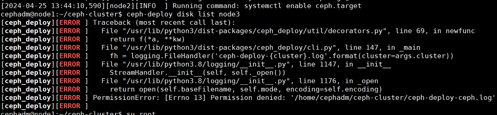

修改权限后可看

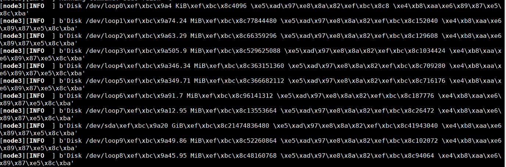

### 清除OSD磁盘

在管理节点上使用ceph-deploy命令擦除计划专用于OSD磁盘上的所有分区表和数据以便用于OSD

注意: 如果硬盘是无数据的新硬盘此步骤可以不做

```shell
ceph-deploy disk zap [-h] [--debug] [HOST] DISK [DISK ...]
#说明此操操作本质上就是执行dd if=/dev/zero of=disk bs=1M count=10

for i in {0..2};do ceph-deploy disk zap 192.168.192.15$i /dev/sdb;done
```

### 集群添加osd节点

对于OSD的相关操作，可以通过 `ceph-deploy osd` 命令来进行，帮助信息如下

```shell
#查看帮助
cephadm@admin:~/ceph-cluster$ ceph-deploy osd --help

#帮助显示：这里提示了两类的存储机制：
#默认情况下用的就是 bluestore类型
#对于bluestore来说，它主要包括三类数据：
--data /path/to/data #ceph 保存的对象数据
--block-db /path/to/db-device #数据库,即为元数据
--block-wal /path/to/wal-device #数据库的 wal 日志
#生产建议data和wal日志分别存放

#对于filestore来说，它主要包括两类数据
--data /path/to/data #ceph的文件数据
--journal /path/to/journal #文件系统日志数据

#对于 osd来说，它主要有两个动作：
list 列出osd相关的信息
cephadm@admin:~/ceph-cluster$ ceph-deploy osd list store01
create 创建osd设备
```

```shell
ceph-deploy --overwrite-conf osd create node1 --data /dev/sdb
ceph-deploy --overwrite-conf osd create node2 --data /dev/sdb
ceph-deploy --overwrite-conf osd create node3 --data /dev/sdb
```

```shell
#查看命令执行后的ceph的集群状态
cephadm@admin:~/ceph-cluster$ ceph -s
#查看osd状态
cephadm@admin:~/ceph-cluster$ ceph osd status
```

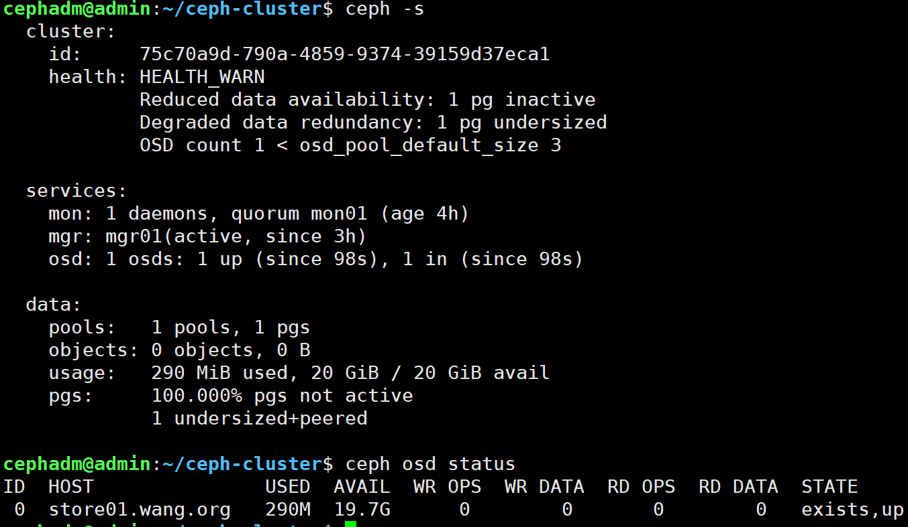

- 每个磁盘生成对应的一个逻辑卷
- 每个osd磁盘生成一个service

## 2.3.7 高可用扩展

### mgr扩展

当前只有一个Mgr节点主机,存在SPOF,添加新的Mgr节点实现高可用

Ceph Manager守护进程以Active/Standby模式运行，部署其它ceph-mgr守护程序可确保在Active节点或其上的ceph-mgr守护进程故障时，其中的一个Standby实例可以在不中断服务的情况下接管其任务。

```shell
#1. 在新mgr结点上安装mgr软件
#方法1:在管理节点远程在mgr02节点上安装Mgr软件
cephadm@admin:~/ceph-cluster$ ceph-deploy install --mgr mgr02
#方法2:在mgr02节点手动安装软件
[root@mgr02 ~]#apt -y install ceph-mgr

#2. 添加第二个 Mgr节点
cephadm@admin:~/ceph-cluster$ ceph-deploy mgr create mgr02

#3. 查看
cephadm@admin:~/ceph-cluster$ ceph -s
#结果显示：mgr01节点就是主角色节点，mgr02是从角色节点。
#关闭mgr01节点,mgr02节点自动成为active节点
[root@mgr01 ~]#reboot
[root@admin ~]#ceph -s
```

### mon扩展

当前只有一个mon结点主机，存在SPOF，添加新的mon结点实现高可用

如果 $n$ 个结点，至少需要保证 $\frac{n}{2}$ 个以上的健康mon结点，ceph集群才能正常使用

```shell
#先在新mon节点安装mon软件
ceph-deploy install --mon mon节点名称
#添加后续的mon节点命令
ceph-deploy mon add mon节点名称
#注意：如果add换成destroy，则变成移除mon节点
```

如：

```shell
#1. 在新的mon结点安装mon软件
#方法1:在mon02节点上安装mon软件
cephadm@admin:~/ceph-cluster$ ceph-deploy install --mon mon02
#方法2:在mon02节点手动安装mon软件也可以
[root@mon02 ~] apt -y install ceph-mon

#2. 添加在mon02节点
cephadm@admin:~/ceph-cluster$ ceph-deploy mon add mon02

#3. 添加mon03节点
cephadm@admin:~/ceph-cluster$ ceph-deploy install --mon mon03
cephadm@admin:~/ceph-cluster$ ceph-deploy mon add mon03

#4. 修改ceph配置添加后续的Mon节点信息
cephadm@admin:~/ceph-cluster$vim ceph.conf
mon_host = 192.168.192.131,192.168.192.132,192.168.192.133
#同步ceph配置文件到所有ceph节点主机
cephadm@admin:~/ceph-cluster$ ceph-deploy --overwrite-conf config push admin mon0{1,2,3} mgr0{1,2} store0{1,2,3}

#5. 重新生成初始化配置信息
ceph-deploy --overwrite-conf mon create-initial
#注意：为了避免因为认证方面导致的通信失败，推荐使用 --overwrite-conf 参数
#如果是在一个现有的环境上部署业务，可以先推送基准配置文件
ceph-deploy --overwrite-conf config push mon01 mon02 mon03

#6. 查看
cephadm@admin:~/ceph-cluster$ ceph -s
```

## 2.3.8 删除集群

```shell
#注意：如果部署过程出现问题，需要清空
ceph-deploy forgetkeys
ceph-deploy purge node1 node2 node3
ceph-deploy purgedata node1 node2 node3
# 进入集群配置文件 ceph-cluster
rm ceph.*

lvremove /dev/ceph-ff361b38-a44c-4d83-93ec-3362fbc57f96/osd-block-7819f40f-4157-4165-8f53-4be9de2e231f

vgremove ceph-ff361b38-a44c-4d83-93ec-3362fbc57f96

pvremove /dev/sdb
```

# 2.4 cephadm

## 文档

Cephadm 通过引导单个主机、扩展集群以包含任何其他主机，然后部署所需的服务来创建新的 Ceph 集群。

### 要求

- Python 3
- Systemd
- Podman or Docker for running containers
- Time synchronization (such as Chrony or the legacy `ntpd`)
- LVM2 for provisioning storage devices

任何现代 Linux 发行版都应该足够了。依赖项由下面的引导过程自动安装。

有关与 Podman 兼容的 Ceph 版本表，请参阅[与 Podman 版本的兼容性](https://docs.ceph.com/en/quincy/cephadm/compatibility/#cephadm-compatibility-with-podman)部分。并非每个版本的 Podman 都与 Ceph 兼容。


**ubuntu**

https://blog.csdn.net/gengduc/article/details/134900065

https://blog.csdn.net/rookie23rook/article/details/128510437

## docker

### 在线安装

https://blog.csdn.net/ilyucs/article/details/106742754

```shell
yum -y install docker-engine

# 若安装报错，可能是podman冲突
yum erase podman buildah
```

### 下载containerd和docker

**离线安装**

在每台主机上操作

[下载页](https://github.com/containerd/containerd/releases) 

直接下载：cri-containerd-1.7.2-linux-amd64.tar.gz，该包里面包含了containerd、 ctr、crictl、containerd-shim等二进制文件，还有启动命令等，只要在/下解压即可。

```shell
tar xf cri-containerd-1.7.2-linux-amd64.tar.gz -C /
cat > /etc/crictl.yaml << EOF

runtime-endpoint: unix:///var/run/containerd/containerd.sock
image-endpoint: unix:///var/run/containerd/containerd.sock
timeout: 10
debug: false
EOF
```

#### 生成containerd配置文件

```shell
mkdir /etc/containerd
containerd config default > /etc/containerd/config.toml
```

修改 /etc/containerd/config.toml，

```shell
vi /etc/containerd/config.toml

## 用于从安全上下文中提取设备所有权信息，kubevirt cdi依赖该参数，不设置该参数可能出现无权限
device_ownership_from_security_context = true
## 调整日志
max_container_log_line_size = 163840
SystemdCgroup = true
```

修改/etc/systemd/system/containerd.service，

```shell
vim /etc/systemd/system/containerd.service
将`LimitNOFILE=infinity`改为`LimitNOFILE=655360` 
```

```shell
systemctl enable containerd && systemctl restart containerd

使用 crictl info 查看配置是否生效
```

#### 其他节点只需将相关文件拷贝过去启动即可

在node01上操作

```shell
for i in {1..3};do scp -rp /usr/local/bin node0$i:/usr/local/;scp -rp /usr/local/sbin node0$i:/usr/local/;scp /etc/containerd node0$i:/etc/; scp /etc/systemd/system/containerd.service node0$i:/etc/systemd/system/;done

for i in {2..2};do scp -rp /usr/local/bin node0$i:/usr/local/;scp -rp /usr/local/sbin node0$i:/usr/local/;scp /etc/containerd node0$i:/etc/; scp /etc/systemd/system/containerd.service node0$i:/etc/systemd/system/;done

for i in {2..2};do cmd=$(systemctl daemon-reload && systemctl enable containerd && systemctl restart containerd);ssh node0$i "$cmd";done
```

### docker

下载docker安装包 ：https://download.docker.com/linux/static/stable/x86_64/docker-20.10.23.tgz

解压 

```shell
tar xf docker-20.10.23.tgz
```

需要用到的二进制文件包括：docker 和 dockerd，拷贝到 /usr/bin/目录下即可。

```shell
mv docker/docker* /usr/bin/
```

创建 docker 用户

```shell
useradd -s /sbin/nologin docker
# 如果docker组存在，则使用 
useradd -s /sbin/nologin docker -g docker
```

启动的配置文件 docker.serivce 和 docker.socket 拷贝到 /usr/lib/systemd/system/，daemon.json文件放到/etc/docker目录

```shell
cat > /usr/lib/systemd/system/docker.service  <<EOF

[Unit]
Description=Docker Application Container Engine
Documentation=https://docs.docker.com
After=network-online.target docker.socket firewalld.service containerd.service
Wants=network-online.target
Requires=docker.socket

[Service]
Type=notify
# the default is not to use systemd for cgroups because the delegate issues still
# exists and systemd currently does not support the cgroup feature set required
# for containers run by docker
# ExecStart=/usr/bin/dockerd --graph=/data/docker -H fd:// --containerd=/run/containerd/containerd.sock --cri-containerd --debug
ExecStart=/usr/bin/dockerd -H fd:// --containerd=/run/containerd/containerd.sock --cri-containerd --debug
ExecReload=/bin/kill -s HUP \$MAINPID
TimeoutSec=0
RestartSec=2
Restart=always

# Note that StartLimit* options were moved from "Service" to "Unit" in systemd 229.
# Both the old, and new location are accepted by systemd 229 and up, so using the old location
# to make them work for either version of systemd.
StartLimitBurst=3

# Note that StartLimitInterval was renamed to StartLimitIntervalSec in systemd 230.
# Both the old, and new name are accepted by systemd 230 and up, so using the old name to make
# this option work for either version of systemd.
StartLimitInterval=60s

# Having non-zero Limit*s causes performance problems due to accounting overhead
# in the kernel. We recommend using cgroups to do container-local accounting.
# 可能会出现错误："Failed at step LIMITS spawning /usr/bin/dockerd: Operation not permitted"，则需要将LimitNOFILE=infinity 改成：LimitNOFILE=65530
LimitNOFILE=infinity
LimitNPROC=infinity
LimitCORE=infinity

# Comment TasksMax if your systemd version does not support it.
# Only systemd 226 and above support this option.
TasksMax=infinity

# set delegate yes so that systemd does not reset the cgroups of docker containers
Delegate=yes

# kill only the docker process, not all processes in the cgroup
KillMode=process

[Install]
WantedBy=multi-user.target
EOF
```

```shell
cat > /usr/lib/systemd/system/docker.socket <<EOF
[Unit]
Description=Docker Socket for the API
PartOf=docker.service

[Socket]
ListenStream=/var/run/docker.sock
SocketMode=0660
SocketUser=root
SocketGroup=docker

[Install]
WantedBy=sockets.target
EOF
```

启动docker

```shell
systemctl daemon-reload && systemctl enable docker --now
```

配置镜像加速和私有仓库

```shell
cat > /etc/docker/daemon.json <<EOF
{
  "registry-mirrors": ["https://vty0b0ux.mirror.aliyuncs.com"],
  "exec-opts": ["native.cgroupdriver=systemd"],
  "log-driver": "json-file",
  "log-opts": {
    "max-size": "500m"
  },
  "storage-driver": "overlay2",
  "insecure-registries": ["registry.demo.com","192.168.59.249:5000"],
  "experimental": true
}
EOF
```

重启docker

```shell
systemctl restart docker
```

将node01上的docker配置文件复制到其他节点

```shell
for i in {2..5};do scp /usr/bin/docker* ceph0$i:/usr/bin/;scp -rp /etc/docker ceph0$i:/etc/;scp /usr/lib/systemd/system/docker.service ceph0$i:/usr/lib/systemd/system/;scp /usr/lib/systemd/system/docker.socket ceph0$i:/usr/lib/systemd/system/;done

for i in {2..2};do scp /usr/bin/docker* node0$i:/usr/bin/;scp -rp /etc/docker node0$i:/etc/;scp /usr/lib/systemd/system/docker.service node0$i:/usr/lib/systemd/system/;scp /usr/lib/systemd/system/docker.socket node0$i:/usr/lib/systemd/system/;done
```

在ceph02-05上操作

```shell
useradd -s /sbin/nologin docker 
systemctl daemon-reload && systemctl enable docker --now
```

## cephadm

### 修改ceph源

**ubuntu LTS22**

```shell
#在管理节点准备脚本,注意以root身份执行
root@node1:cat > ceph_repo.sh <<EOF
#!/bin/bash
# 更新ceph的软件源信息
echo "deb https://mirror.tuna.tsinghua.edu.cn/ceph/debian-quincy/ $(lsb_release -sc) main" > /etc/apt/sources.list.d/ceph.list 
wget -q -O- 'https://download.ceph.com/keys/release.asc' | apt-key add - 
apt update
EOF

bash ceph_repo.sh

#因为所有节点都会依赖于这些apt源信息，需要进行同步
[root@admin ~]for i in {156..157};do ssh -o StrictHostKeyChecking=no 192.168.192.$i bash < ceph_repo.sh;done

# 去其他结点查看
root@node02:/# cat /etc/apt/sources.list.d/ceph.list
deb https://mirror.tuna.tsinghua.edu.cn/ceph/debian-quincy/ focal main
```

### 管理节点安装cephadm

**ubuntu LTS22**

```shell
apt install -y cephadm

whereis cephadm # 检查安装情况

# 输出如下内容
root@node01:/# whereis cephadm
cephadm: /usr/sbin/cephadm /usr/share/man/man8/cephadm.8.gz
```

**kylin linux**

**15的依赖是有的，16以上的依赖不全，不能安装cephadm**

el8的没依赖

```shell
# wget http://mirrors.163.com/ceph/rpm-octopus/el8/noarch/cephadm-15.2.17-0.el8.noarch.rpm 
wget http://mirrors.163.com/ceph/rpm-octopus/el7/noarch/cephadm-15.2.17-0.el7.noarch.rpm 
wget http://mirrors.163.com/ceph/rpm-quincy/el8/noarch/cephadm-17.2.7-0.el8.noarch.rpm 

chmod 600 /var/log/tallylog
rpm -ivh cephadm-15.2.17-0.el7.noarch.rpm
rpm -ivh 

切换cephadm版本
rpm -e cephadm

[root@ceph01 ~]# rpm -ivh cephadm-17.2.6-0.el8.noarch.rpm
错误：依赖检测失败：
	/usr/libexec/platform-python 被 cephadm-2:17.2.6-0.el8.noarch 需要
```

### 检查

检查ceph各节点是否满足安装ceph集群，该命令需要在当前节点执行，比如要判断ceph02是否支持安装ceph集群，则在ceph02上执行

```shell
cephadm check-host --expect-hostname node01

docker (/usr/bin/docker) is present
systemctl is present
lvcreate is present
Unit chronyd.service is enabled and running
Hostname "ceph02" matches what is expected.
Host looks OK

## 也可以使用以下命令检查
cephadm check-host --expect-hostname `hostname`
```

## 初始化集群

### 先将docker镜像拉到本地

```shell
docker images --digests
docker pull --platform=linux/arm64 quay.io/ceph/ceph:v17.2.6
docker pull --platform=linux/amd64 quay.io/ceph/ceph:v17.2.6
docker pull --platform=linux/amd64 quay.io/ceph/ceph:v15.2.17
v14.2.22
```

### 改cephadm的一些代码

```shell
vim /usr/sbin/cephadm
```

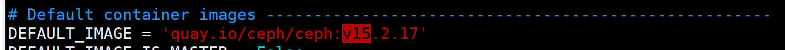

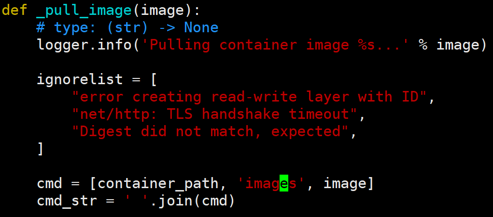

还有要改的，没改完全会报下面的错


### 创建集群

cephadm bootstrap 过程是在单一节点上创建一个小型的ceph集群，包括一个ceph monitor和一个ceph mgr，监控组件包括prometheus、node-exporter等。

然后向集群中添加主机以扩展集群，进而部署其他服务

```shell
cephadm bootstrap --mon-ip 192.168.192.156 --cluster-network 10.168.192.0/24 --initial-dashboard-user admin --initial-dashboard-password admin

cephadm bootstrap --mon-ip 192.168.5.210 --cluster-network 10.168.192.0/24 --allow-overwrite --skip-dashboard

cephadm bootstrap --mon-ip 192.168.192.161 --allow-overwrite

cephadm bootstrap --mon-ip 192.168.3.233 --allow-overwrite

cephadm bootstrap --mon-ip 192.168.192.156 --cluster-network 10.168.192.0/24 --allow-overwrite --skip-dashboard

# 会卡很久
# 查看日志
tail -f /var/log/ceph/cephadm.log
```

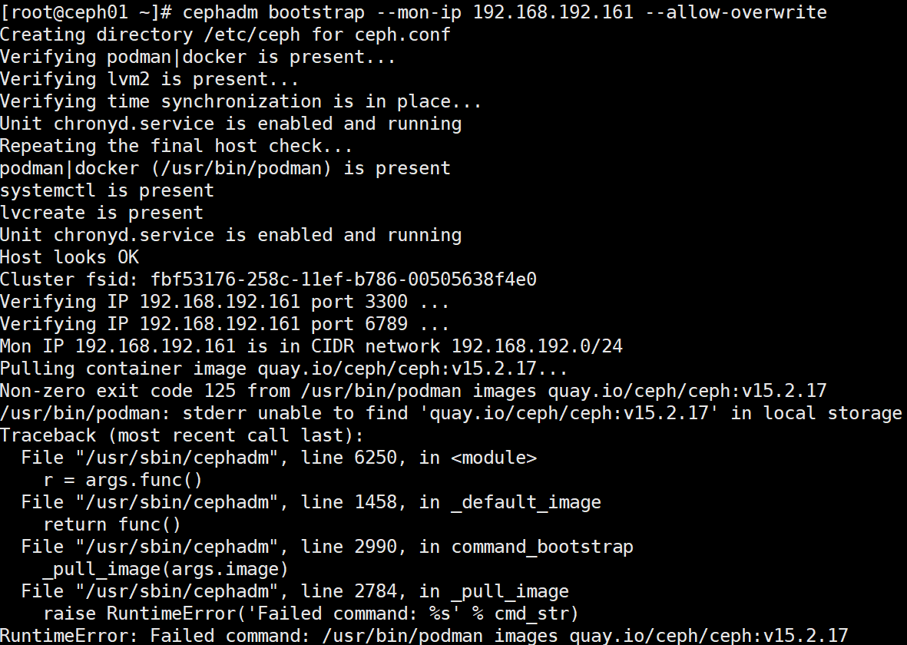

初始化时，指定了mon-ip、集群网段、dashboard初始用户名和密码

```shell
--mon-ip 192.168.59.241 \
--cluster-network 10.168.192.0/24 \
指定dashboard用户名和密码  
--initial-dashboard-user admin \
--initial-dashboard-password admin \
##  指定私钥和公钥
--ssh-private-key /root/.ssh/id_rsa \
--ssh-public-key /root/.ssh/id_rsa.pub \

## 启动前不拉取默认镜像
--skip-pull
## 指定私有镜像仓库
--registry-url registry.demo.com \
--registry-username admin \
--registry-password Harbor12345 
```

```shell
## 需要指定监控组件镜像
ceph config set mgr mgr/cephadm/container_image_prometheus registry.demo.com/prometheus/prometheus:v2.33.4
ceph config set mgr mgr/cephadm/container_image_grafana registry.demo.com/ceph/ceph-grafana:8.3.5
ceph config set mgr mgr/cephadm/container_image_alertmanager registry.demo.com/prometheus/alertmanager:v0.23.0
ceph config set mgr mgr/cephadm/container_image_node_exporter registry.demo.com/prometheus/node-exporter:v1.3.1
```

进入容器 执行

```shell
sudo /usr/sbin/cephadm shell --fsid 2e1228b0-0781-11ee-aa8a-000c2921faf1 -c /etc/ceph/ceph.conf -k /etc/ceph/ceph.client.admin.keyring

Or, if you are only running a single cluster on this host:

        sudo /usr/sbin/cephadm shell

退出容器执行
cephadm shell ceph -s

安装ceph-common工具，使bash支持原生命令
cephadm install ceph-common

ceph -s
ceph version
```

查看集群配置文件

```shell
ls /etc/ceph/

ceph.client.admin.keyring  是具有ceph管理员的秘钥
ceph.conf  是最小化配置文件
ceph.pub  是一个公钥，拷贝到其他节点后，可以免密登录。
```

### 查看组件运行状态

```shell
ceph orch ps

ceph orch ls

ceph orch ls mgr
```

### 删除不必要组件

```shell
ceph orch rm prometheus
ceph orch rm grafana
ceph orch rm alertmanager
ceph orch rm node-exporter
```

### ceph镜像导出

```shell
docker images  |grep -v "REPOSITORY" |awk '{print $1":"$2}' |xargs docker save -o ceph-images.tar

for i in {2..2};do scp ceph-images.tar node0$i:/root/;done
```

解压离线镜像

```shell
docker load -i ceph-images.tar
```

## 添加主机


```shell
Log: Opening SSH connection to 192.168.192.237, port 22
[conn=2] Connected to SSH server at 192.168.192.237, port 22
[conn=2]   Local address: 192.168.192.233, port 48926
[conn=2]   Peer address: 192.168.192.237, port 22
[conn=2] Beginning auth for user root
[conn=2] Auth failed for user root
[conn=2] Connection failure: Permission denied
[conn=2] Aborting connection

ssh-copy-id -f -i /etc/ceph/ceph.pub root@node237
```


将ceph.pub公钥拷贝到其他ceph节点

```shell
ssh-copy-id -f -i /etc/ceph/ceph.pub node02

for i in {2..5};do ssh-copy-id -f -i /etc/ceph/ceph.pub ceph0$i;done
```

### 指定镜像

```shell
docker images --digests
docker pull --platform=linux/arm64 quay.io/ceph/ceph:v17.2.6
docker pull --platform=linux/amd64 quay.io/ceph/ceph:v17.2.6
```

使用cephadm将主机添加到存储集群中,执行添加节点命令后，会在目标节点拉到ceph/node-exporter镜像，需要一定时间，所以可提前在节点上将镜像导入。

```shell
cephadm shell ceph orch host add node02 192.168.192.157 --labels=mon,mgr,osd
ceph orch host add node237 192.168.3.237 --labels=mon,mgr,osd
```

```
Error EINVAL: check-host failed:
docker (/usr/bin/docker) is present
systemctl is present
Unit ntp.service is enabled and running
Hostname "node02" matches what is expected.
ERROR: lvcreate binary does not appear to be installed
```

在其他节点安装依赖

```shell
sudo apt-get install lvm2
```

查看加入集群的其他节点

```shell
root@node01:/# ceph orch host ls
HOST    ADDR             LABELS       STATUS  
node01  192.168.192.156  _admin               
node02  192.168.192.157  mon,mgr,osd          
2 hosts in cluster
```

### 节点打标签

给节点打上指标标签后，后续可以按标签进行编排。

给节点打 `_admin` 标签，默认情况下，`_admin` 标签应用于存储集群中的 bootstrapped 主机， client.admin密钥被分发到该主机(ceph orch client-keyring {ls|set|rm})。
将这个标签添加到其他主机后，其他主机的/etc/ceph下也将有client.admin密钥。

```shell
## 给 ceph02、ceph03加上 _admin 标签  
ceph orch host label add ceph02 _admin
ceph orch host label add ceph03 _admin

## 给 ceph01-ceph04加上 mon 标签 
ceph orch host label add ceph01 mon
ceph orch host label add ceph02 mon
ceph orch host label add ceph03 mon
ceph orch host label add ceph04 mon
```

```shell
ceph orch host label add node01 mon,mgr,osd

ceph orch host ls

root@node01:/# ceph orch host ls
HOST    ADDR             LABELS              STATUS  
node01  192.168.192.156  _admin,mon,mgr,osd          
node02  192.168.192.157  mon,mgr,osd                 
2 hosts in cluster
```

#### 删除标签

删除节点上的_admin标签，并不会删除该节点上已有的`ceph.client.admin.keyring`密钥文件

```shell
ceph orch host label rm ceph03 label=_admin
```

新主机加入集群后，mon和mgr会自动扩展，最多5个mon，2个mgr

### 手动调整

```shell
[root@ceph1 ~]# ceph orch apply mon ceph1,ceph2,ceph3
Scheduled mon update...
[root@ceph1 ~]# ceph orch apply mgr ceph1,ceph2,ceph3
Scheduled mon update...
```

### 删除节点

```shell
ceph orch host rm <host> # 从集群中删除主机
```

## 添加mon

```shell
ceph orch apply mon node237
```


## 添加osd

- 设备必须没有分区
- 设备不得具有任何 LVM 状态
- 设备不能被挂载
- 设备不能包含文件系统
- 设备不得包含 Ceph BlueStore OSD
- 设备容量必须大于 5 GB

### 初始化磁盘

添加OSD时，建议将磁盘先格式化为无分区的原始磁盘

https://rook.github.io/docs/rook/v1.10/Getting-Started/ceph-teardown/?h=sgdisk#zapping-devices

```shell
DISK="/dev/sdX"

DISK="/dev/sdd"

DISK="/dev/sdb"

## Zap the disk to a fresh, usable state (zap-all is important, b/c MBR has to be clean)
sgdisk --zap-all $DISK

## Wipe a large portion of the beginning of the disk to remove more LVM metadata that may be present
dd if=/dev/zero of="$DISK" bs=1M count=100 oflag=direct,dsync

## SSDs may be better cleaned with blkdiscard instead of dd
blkdiscard $DISK

## Inform the OS of partition table changes
partprobe $DISK
```

若 `AVAILABLE` 为 no，使用zap清除数据

```shell
查看各ceph节点有哪些磁盘是可用的，关注`AVAILABLE`列
# 查看设备列表，显示可用作OSD的设备
ceph orch device ls [--hostname=...] [--wide] [--refresh]

ceph orch device ls
```

```shell
ceph orch device zap <hostname> <path> # 擦除设备（清除设备）
ceph orch device zap --force node01 /dev/sdd
```

**GPT headers found**

之前磁盘被分区过，虽然删掉了分区，但是还存在 GPT 数据结构，使用 `sgdisk ` 删除

```shell
sgdisk --zap-all /dev/sdX
```

### 添加OSD

```shell
# 创建新的OSD
ceph orch daemon add osd <host>:<device-path> [--verbose]

ceph orch daemon add osd node01:/dev/sdb

# 批量创建OSD
ceph orch apply osd --all-available-devices
```

## 删除服务

```shell
# 自动删除
ceph orch rm <service-name>

# 手动删除
ceph orch daemon rm <daemon name>... [--force]
```

## cephadm删除集群

**在每台主机上执行**

```shell
# 禁用自动扩展
ceph mgr module disable cephadm

cat /etc/ceph/ceph.conf

cephadm rm-cluster --zap-osds --fsid [] --force

lvremove /dev/ceph-ff361b38-a44c-4d83-93ec-3362fbc57f96/osd-block-7819f40f-4157-4165-8f53-4be9de2e231f

vgremove ceph-ff361b38-a44c-4d83-93ec-3362fbc57f96

pvremove /dev/sdb

systemctl status ceph-osd.target

# 发现相关依赖被删除
docker ps -a 

# 清理cephadm日志
rm -rf cephadm.log
```

# 2.5 集群升级

只需要安装升级Ceph安装包，依次升级安装

1. monitor
2. MGR
3. OSD
4. MDS
5. RADOS网关

升级完同一类型的守护进程后再升级其他类型，最后重启服务（通常不需要关闭存储服务）

1. 检查Ceph守护进程的当前版本

   `service ceph status `

2. 升级Ceph源至期望的版本（如firefly）

   只需在 /etc/yum.repos.d/ceph.repo 文件中更新Ceph发行版的名称

   ```
   [ceph]
   name=Ceph package for $basearch
   baseurl=http://ceph.com/rpm-firefly/e16/$basearch
   enabled=1
   gpgcheck=1
   type=rpm-md
   gpgkey=https://ceph.com/git/?p=ceph.git;a=blob_plain;f=keys/release.asc
   
   [ceph-noarch]
   name=Ceph noarch $basearch
   baseurl=http://ceph.com/rpm-firefly/e16/noarch
   enabled=1
   gpgcheck=1
   type=rpm-md
   gpgkey=https://ceph.com/git/?p=ceph.git;a=blob_plain;f=keys/release.asc
   
   [ceph-source]
   name=Ceph nosource $basearch
   baseurl=http://ceph.com/rpm-firefly/e16/SRMPS
   enabled=1
   gpgcheck=1
   type=rpm-md
   gpgkey=https://ceph.com/git/?p=ceph.git;a=blob_plain;f=keys/release.asc
   ```

3. 更新ceph软件

   ```shell
   yum update ceph
   ```

4. 重启monitor守护进程

   ```shell
   service ceph restart mon osd
   ```

5. 检查monitor,osd守护进程版本

