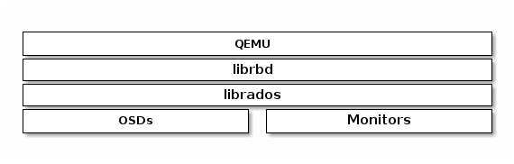
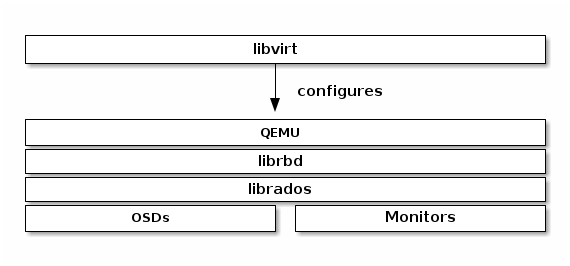

https://docs.ceph.com/en/latest/rbd/rbd-openstack/


## 集成

### 集成到内核模块

> rbd已被引入到Linux内核，在内核视角看，RBD镜像是由远程分布式存储提供的一块线性块设备，实现细节都被内核模块 `rbd.ko` 隐藏
>
> RBD 镜像的数据最终就是其所在池里的一批对象

内核挂载过程：

1. 获取rbd镜像列表

   ```shell
   rbd list
   ```

2. 使用 rbd 将镜像名称映射到内核模块。

   指定镜像名称、池名称和用户名。如果 RBD 内核模块尚未加载，rbd 将代您加载。

   ```shell
   sudo rbd device map {pool-name}/{image-name} --id {user-name}
   ```

   如果您使用 cephx 身份验证，则还必须指定一个密钥。密钥可能来自密钥环或包含密钥的文件。

   ```shell
   sudo rbd device map rbd/myimage --id admin --keyring /path/to/keyring
   sudo rbd device map rbd/myimage --id admin --keyfile /path/to/file
   ```

   - 查看使用 rbd 映射到内核模块的块设备映像

     ```shell
     rbd device list
     ```

   - 解除映射

     ```shell
     sudo rbd device unmap /dev/rbd/{poolname}/{imagename}
     ```

3. 内核模块 `rbd.ko` 通过librados连接到集群，把指定的 pool/image 打开

4. 模块为该image申请一个 rbd_device 结构体的示例，并注册一个块设备

   - 对上层来说，向本地的硬盘一样，提供 `make_request_fn` 入口
   - 对下层来说，每个BIO都被切分成对象粒度的RADOS请求，写入到Ceph集群

内核只缓存页数据，元数据有用户态的rbd或librbd维护，内核只在需要时通过 *rbd_header* 对象读取最小必要信息

### QEMU

Ceph 块设备最常见的用例是向虚拟机提供块设备映像。例如，用户可以创建具有理想配置的操作系统和任何相关软件的“golden”映像。然后，用户创建该镜像的快照（snapshot）。最后，用户克隆该快照（可能多次）。制作快照的写时复制（copy-on-write）能力意味着 Ceph 可以快速地向虚拟机提供块设备映像，因为客户端不必在每次启动新的虚拟机时下载整个映像

Ceph 块设备连接到 QEMU 虚拟机，如下图所示



#### 安装

略

有关 QEMU 文档，请参阅 [QEMU Manual](http://wiki.qemu.org/Manual).。有关安装详细信息，请参阅 [Installation](https://docs.ceph.com/en/latest/install)。

#### 使用

QEMU 命令行要求您指定 Ceph 池和镜像名称。您还可以指定快照。

QEMU 将假定 Ceph 配置位于默认位置（例如，/etc/ceph/$cluster.conf），并且您以默认 client.admin 用户身份执行命令

```shell
qemu-img {command} [options] rbd:{pool-name}/{image-name}[@snapshot-name][:option1=value1][:option2=value2...]
```

可以指定另一个 Ceph 配置文件路径或其他用户。例如，指定 id 和 conf 选项可能如下所示：

```shell
qemu-img {command} [options] rbd:glance-pool/maipo:id=glance:conf=/etc/ceph/ceph.conf
```

- 指定用户时，请勿在用户 ID 前添加客户端类型（例如 client.），否则您将收到身份验证错误。
- 您应该将管理员用户的密钥或使用 :id={user} 选项指定的另一个用户的密钥放在密钥环文件中，该文件存储在默认路径中（即 /etc/ceph 或具有适当文件所有权和权限的本地目录）。

- 详情请参阅[User Management - User](https://docs.ceph.com/en/latest/rados/operations/user-management#user)。

##### 使用QEMU创建镜像

```shell
qemu-img create -f raw rbd:{pool-name}/{image-name} {size}
```

`raw` 数据格式实际上是 RBD 中 `format` 选项唯一合理的选项。从技术上讲，您可以使用其他 QEMU 支持的格式（例如 qcow2 或 vmdk）。但这样做会增加额外的开销，并且在启用缓存（见下文）时也会导致卷对于虚拟机实时迁移不安全。

##### 使用 QEMU 调整镜像大小

```shell
qemu-img resize rbd:{pool-name}/{image-name} {size}
```

##### 使用 QEMU 检索image信息

```
qemu-img info rbd:{pool-name}/{image-name}
```

##### 使用 RBD 运行 QEMU

QEMU 可以将块设备从主机传递到客户机，但从 QEMU 0.15 开始，无需将images 映射为主机上的块设备。相反，QEMU 会直接通过 librbd 将镜像附加为虚拟块设备。

您可以使用 `qemu-img` 将现有的虚拟机镜像转换为 Ceph 块设备镜像。

```shell
# 将现有的qcow2镜像转换为ceph块镜像
qemu-img convert -f qcow2 -O raw debian_squeeze.qcow2 rbd:data/squeeze
```

要运行从该image启动的虚拟机，您可以运行：

```shell
qemu -m 1024 -drive format=raw,file=rbd:data/squeeze
```

RBD 缓存可以显著提升性能。

- 自 QEMU 1.2 起，QEMU 的缓存选项控制 librbd 缓存：

  ```shell
  qemu -m 1024 -drive format=rbd,file=rbd:data/squeeze,cache=writeback
  ```

- 如果您有旧版本的 QEMU，则可以将 librbd 缓存配置（与任何 Ceph 配置选项一样）设置为“文件”参数的一部分：

  ```shell
  qemu -m 1024 -drive format=raw,file=rbd:data/squeeze:rbd_cache=true,cache=writeback
  ```

  如果设置了 rbd_cache=true，则必须设置 cache=writeback，否则可能会丢失数据。因为，不设置writeback，QEMU 将不会向 librbd 发送刷新请求。如果 QEMU 在此配置下不干净退出，则 rbd 上的文件系统可能会损坏。

##### 启用丢弃/修剪(discard/trim)

从 Ceph 0.46 版和 QEMU 1.1 版开始，Ceph 块设备支持discard操作。即客户机可以发送 TRIM 请求，让 Ceph 块设备回收未使用的空间。

- 此功能可以通过在客户机中挂载 ext4 或 XFS 文件系统并使用discard选项来启用。

为了使客户机可以使用此功能，必须为块设备显式启用此功能。为此，必须指定与驱动器关联的 discard_granularity：

```shell
qemu -m 1024 -drive format=raw,file=rbd:data/squeeze,id=drive1,if=none \
     -device driver=ide-hd,drive=drive1,discard_granularity=512
```

- 这使用了 IDE 驱动程序。从 Linux 内核版本 5.0 开始，virtio 驱动程序支持丢弃。

如果使用 libvirt，请使用 virsh edit 编辑 libvirt 域的配置文件，以添加 xmlns:qemu 值。然后，添加 qemu:commandline 块作为该域的子块。以下示例显示如何将两个 qemu id= 的设备设置为不同的 discard_granularity 值。

```xml
<domain type='kvm' xmlns:qemu='http://libvirt.org/schemas/domain/qemu/1.0'>
        <qemu:commandline>
                <qemu:arg value='-set'/>
                <qemu:arg value='block.scsi0-0-0.discard_granularity=4096'/>
                <qemu:arg value='-set'/>
                <qemu:arg value='block.scsi0-0-1.discard_granularity=65536'/>
        </qemu:commandline>
</domain>
```

##### QEMU缓存选项

QEMU 的缓存选项对应于以下 Ceph RBD 缓存设置。

- Writeback:

  ```shell
  rbd_cache = true
  ```

- Writethrough:

  ```shell
  rbd_cache = true
  rbd_cache_max_dirty = 0
  ```

- None:

  ```shell
  rbd_cache = false
  ```

QEMU 的缓存设置覆盖 Ceph 的缓存设置（包括在 Ceph 配置文件中明确设置的设置）。

## Libvirt

*libvrit* 库在虚拟机管理程序接口和调用这些API的应用层软件之间，创建了一个抽象层

借助libvirt，开发者和系统管理员可以专注于通用管理框架、API和通用Shell接口，可用于多种虚拟机管理程序：

- QEMU/KVM
- XEN
- LXC
- VirtualBox
- etc.

可将 Ceph 块设备与可与 libvirt 交互的软件配合使用。下面的堆栈图说明了 libvirt 和 QEMU 如何通过 librbd 使用 Ceph 块设备。



最常见的 libvirt 用例涉及向 OpenStack、OpenNebula 或 CloudStack 等云解决方案提供 Ceph 块设备。还可以将 Ceph 块设备与 libvirt、virsh 和 libvirt API 结合使用。

-  [Block Devices and OpenStack](https://docs.ceph.com/en/latest/rbd/rbd-openstack), [Block Devices and OpenNebula](https://docs.opennebula.io/stable/open_cluster_deployment/storage_setup/ceph_ds.html#datastore-internals) and [Block Devices and CloudStack](https://docs.ceph.com/en/latest/rbd/rbd-cloudstack)
- [Installation](https://docs.ceph.com/en/latest/install) for installation details
- See [libvirt Virtualization API](http://www.libvirt.org/) for details.

要创建使用 Ceph 块设备的虚拟机，请使用以下部分中的步骤。

- 在示例性实施例中，我们使用 libvirt-pool 作为池名称、client.libvirt 作为用户名、new-libvirt-image 作为image名称。


## 与其他

### 块设备与Openstack

使用Ceph块设备