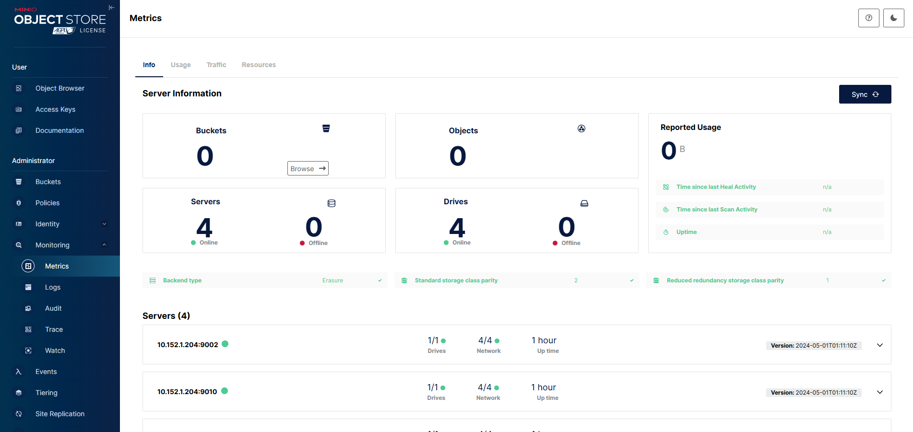

[TOC]

<!--more-->

- minio需要一完整的磁盘分区作为一个数据目录
- 在minio的数据目录中，会创建 *.minio.sys* 这个隐藏目录，每次创建完成后，若不删除，则无法创建新的集群
- 一个进程（一个端口）监控一个硬盘

## 前配置

### 规划

|      | node204      | node205      |
| ---- | ------------ | ------------ |
| IP   | 10.152.1.204 | 10.152.1.205 |
| 掩码 | 24           | 24           |
| 磁盘 | */dev/sdb*   | */dev/sdb*   |
|      | */dev/sdc*   | */dev/sdc*   |

### 配网

1. 修改主机名

   ```shell
   [root@node204 ~]# vim /etc/hosts
   
   # 新增以下内容
   10.152.1.204 node204
   10.152.1.205 node205
   ```

2. 修改网络

   ```shell
   [root@node204 ~]# cd /etc/sysconfig/network-scripts/
   [root@node204 network-scripts]# vim ifcfg-enp3s0f0
   
   TYPE=Ethernet
   PROXY_METHOD=none
   BROWSER_ONLY=no
   BOOTPROTO=none
   DEFROUTE=yes
   IPV4_FAILURE_FATAL=no
   IPV6INIT=yes
   IPV6_AUTOCONF=yes
   IPV6_DEFROUTE=yes
   IPV6_FAILURE_FATAL=no
   IPV6_ADDR_GEN_MODE=stable-privacy
   NAME=enp3s0f0
   UUID=022292a1-2b2a-4236-8a01-8e55c2d9823f
   DEVICE=enp3s0f0
   ONBOOT=yes
   IPADDR=10.152.1.204
   PREFIX=24
   GATEWAY=10.152.1.2
   IPV6_PRIVACY=no
   
   [root@node205 ~]# cd /etc/sysconfig/network-scripts/
   [root@node205 network-scripts]# vim ifcfg-enp3s0f0
   
   TYPE=Ethernet
   PROXY_METHOD=none
   BROWSER_ONLY=no
   BOOTPROTO=none
   DEFROUTE=yes
   IPV4_FAILURE_FATAL=no
   IPV6INIT=yes
   IPV6_AUTOCONF=yes
   IPV6_DEFROUTE=yes
   IPV6_FAILURE_FATAL=no
   IPV6_ADDR_GEN_MODE=stable-privacy
   NAME=enp3s0f0
   UUID=7676c441-ad4d-46ff-8057-52802689445c
   DEVICE=enp3s0f0
   ONBOOT=yes
   IPADDR=10.152.1.205
   PREFIX=24
   GATEWAY=10.152.1.2
   IPV6_PRIVACY=no
   ```

3. 配置ssh

   ```shell
   # 生成密钥
   [root@node204 ~]# ssh-keygen
   
   # 分发公钥
   [root@node204 ~]# ssh-copy-id [目标主机]
   ```

4. 创建minio的工作目录

   ```shell
   [root@node204 ~]# mkdir -p /opt/minio/bin /opt/minio/etc /opt/minio/data /opt/minio/logs
   
   # bin目录用于放置minio的软件包，以及启动、停止脚本
   # etc用于放置配置文件
   # data 为Minio集群的数据目录，用于存放集群的对象数据
   # lofs 放置minio的工作日志
   
   [root@node205 ~]# mkdir -p /opt/minio/bin /opt/minio/etc /opt/minio/data /opt/minio/logs
   ```

### 磁盘处理

1. 分区：由于Minio对XFS、ext4等较新的文件系统支持程度较低，所以采用ext2文件系统

   ```shell
   [root@node204 ~]# fdisk /dev/sdx
   
   # 本文使用两个服务器，每个服务器上挂载两个硬盘作为数据分区
   
   [root@node204 ~]# fdisk /dev/sdb
   [root@node204 ~]# fdisk /dev/sdc
   
   [root@node205 ~]# fdisk /dev/sdb
   [root@node205 ~]# fdisk /dev/sdc
   ```

2. 创建文件系统

   ```shell
   [root@node204 ~]# mkfs.ext2 /dev/sdb1
   [root@node204 ~]# mkfs.ext2 /dev/sdc1
   
   [root@node205 ~]# mkfs.ext2 /dev/sdb1
   [root@node205 ~]# mkfs.ext2 /dev/sdc1
   ```

3. 设置开机自动挂载

   ```shell
   # 确定文件系统的UUID
   [root@node204 ~]# blkid
   /dev/mapper/klas-swap: UUID="a550c392-2efd-4b11-951d-a63d160cf371" TYPE="swap"
   /dev/sdb1: UUID="44c627de-3204-4b29-96a5-252284636be7" BLOCK_SIZE="4096" TYPE="ext2" PARTUUID="33dacf60-01"
   /dev/mapper/klas-backup: LABEL="KYLIN-BACKUP" UUID="40559043-5e95-4c54-9326-62b362a013bc" BLOCK_SIZE="512" TYPE="xfs"
   /dev/mapper/klas-root: UUID="31c86ad1-c80c-4ca0-9aa9-81a0dc8f3eae" BLOCK_SIZE="512" TYPE="xfs"
   /dev/sdc1: UUID="d3d58530-682b-4359-9600-d8b869668cef" BLOCK_SIZE="4096" TYPE="ext2" PARTUUID="fe9570c9-307c-2d49-ad1e-8f979600454c"
   /dev/sda2: UUID="c5bea7ce-1c61-41c7-b7b0-dcac155c5016" BLOCK_SIZE="512" TYPE="xfs" PARTUUID="307d3205-aa3c-41f7-b8da-b179908b485c"
   /dev/sda3: UUID="3Kj31a-m3Rf-rnnb-XfH2-ieuF-tTTz-XICDB6" TYPE="LVM2_member" PARTUUID="97f218ab-9d07-46fa-b262-358121ca7243"
   /dev/sda1: UUID="C2FA-1BFB" BLOCK_SIZE="512" TYPE="vfat" PARTLABEL="EFI System Partition" PARTUUID="ed85b0de-9a36-407b-bf54-4809fb3c6d40"
   
   # 通过UUID设置开机自启动，在 fstab 文件中新增两个文件系统的UUID
   [root@node204 ~]# vim /etc/fstab
   UUID=44c627de-3204-4b29-96a5-252284636be7 /opt/minio/data/data1 ext2 defaults 0 0
   UUID=d3d58530-682b-4359-9600-d8b869668cef /opt/minio/data/data2 ext2 defaults 0 0
   ```

   对node205的操作类似

4. 查看挂载状态

   ```shell
   [root@node204 ~]# lsblk
   NAME            MAJ:MIN RM   SIZE RO TYPE MOUNTPOINT
   sda               8:0    1 476.9G  0 disk 
   ├─sda1            8:1    1   600M  0 part /boot/efi
   ├─sda2            8:2    1     1G  0 part /boot
   └─sda3            8:3    1 475.4G  0 part 
     ├─klas-root   252:0    0 421.4G  0 lvm  /
     ├─klas-swap   252:1    0     4G  0 lvm  [SWAP]
     └─klas-backup 252:2    0    50G  0 lvm  
   sdb               8:16   0 931.5G  0 disk 
   └─sdb1            8:17   0 465.8G  0 part /opt/minio/data/data1
   sdc               8:32   0 931.5G  0 disk 
   └─sdc1            8:33   0 465.8G  0 part /opt/minio/data/data2
   sr0              11:0    1  1024M  0 rom  
   sr1              11:1    1  1024M  0 rom  
   ```

## minio配置

### 安装minio

```shell
[root@node204 data]# uname -r
4.19.90-52.23.v2207.gfb01.ky10.aarch64
```

官网下载aarch版的软件包

- **注：minio社区会删除很多必要功能，所以不要用最新版的minio**

下载完后，将minio导入 */opt/minio/bin* 目录 

```shell
# 改为minio
[root@node204 bin]# mv [原名称] minio

# 新增执行权限
[root@node204 bin]# chmod +x minio

[root@node204 bin]# ./minio -version
minio version RELEASE.2024-05-01T01-11-10Z (commit-id=7926401cbd5cceaacd9509f2e50e1f7d636c2eb8)
Runtime: go1.21.9 linux/arm64
License: GNU AGPLv3 <https://www.gnu.org/licenses/agpl-3.0.html>
Copyright: 2015-2024 MinIO, Inc.
```

### 启动脚本

#### 单节点minio

*/opt/minio/bin/start_single.sh*

```shell
#!/bin/bash
  
# 工作目录
export MINIO_HOME=/opt/minio
export MINIO_CONFIG_DIR=${MINIO_HOME}/etc
export MINIO_LOG_PATH=${MINIO_HOME}/logs
export MINIO_ROOT_USER=admin
export MINIO_ROOT_PASSWORD=f4mtdycd
export MINIO_BROWSER=on
export CURRENT_IP=10.152.1.204
export CONSOLE_IP=10.152.1.204
export MINIO_ENDPOINTS="/opt/minio/data/data_single"

nohup /opt/minio/bin/minio server \
        --address ${CURRENT_IP}:9002 --console-address ${CONSOLE_IP}:9001 \
        ${MINIO_ENDPOINTS} \
        >> /opt/minio/logs/minio_single.log 2>&1 &
```

*/opt/minio/bin/stop_single.sh*

```shell
#!/bin/bash
ps -ef | grep minio | grep -v 'grep' | awk '{print $2}' | xargs kill -9
rm -rf /opt/minio/logs/*
rm -rf /opt/minio/data/data_single/*
rm -rf /opt/minio/data/data_single/.minio.sys
```

#### minio集群

node204的 */opt/minio/bin/start.sh*

```shell
#!/bin/bash
  
# 工作目录
export MINIO_HOME=/opt/minio
export MINIO_CONFIG_DIR=${MINIO_HOME}/etc
export MINIO_LOG_PATH=${MINIO_HOME}/logs
export MINIO_ROOT_USER=admin
export MINIO_ROOT_PASSWORD=f4mtdycd
export MINIO_BROWSER=on
export MINIO_HOST_1=10.152.1.204
export MINIO_HOST_2=10.152.1.205
export CURRENT_IP=10.152.1.204
export CONSOLE_IP=192.168.12.71
export MINIO_ENDPOINTS="http://${MINIO_HOST_1}:9002/opt/minio/data/data1 http://${MINIO_HOST_1}:9010/opt/minio/data/data2 http://${MINIO_HOST_2}:9002/opt/minio/data/data1 http://${MINIO_HOST_2}:9010/opt/minio/data/data2"

nohup /opt/minio/bin/minio server \
        --config-dir /opt/minio/etc \
        --address ${CURRENT_IP}:9002 --console-address ${CONSOLE_IP}:9001 \
        ${MINIO_ENDPOINTS} \
        >> /opt/minio/logs/minio_node1_data1.log 2>&1 &

nohup /opt/minio/bin/minio server \
        --config-dir /opt/minio/etc \
        --address ${CURRENT_IP}:9010\
        ${MINIO_ENDPOINTS} \
        >> /opt/minio/logs/minio_node1_data2.log 2>&1 &
```

- 需要注意的 ENDPOINTS，修改为自己的IP与端口
- address为S3服务对外提供的IP与端口

node205的 */opt/minio/bin/start.sh*

```shell
#!/bin/bash
  
# 工作目录
export MINIO_HOME=/opt/minio
export MINIO_CONFIG_DIR=${MINIO_HOME}/etc
export MINIO_LOG_PATH=${MINIO_HOME}/logs
export MINIO_ROOT_USER=admin
export MINIO_ROOT_PASSWORD=f4mtdycd
export MINIO_BROWSER=on
export MINIO_HOST_1=10.152.1.204
export MINIO_HOST_2=10.152.1.205
export CURRENT_IP=10.152.1.205
export CONSOLE_IP=192.168.12.71
export MINIO_ENDPOINTS="http://${MINIO_HOST_1}:9002/opt/minio/data/data1 http://${MINIO_HOST_1}:9010/opt/minio/data/data2 http://${MINIO_HOST_2}:9002/opt/minio/data/data1 http://${MINIO_HOST_2}:9010/opt/minio/data/data2"

nohup /opt/minio/bin/minio server \
        --config-dir /opt/minio/etc \
        --address ${CURRENT_IP}:9002 \
        ${MINIO_ENDPOINTS} \
        >> /opt/minio/logs/minio_node2_data1.log 2>&1 &

nohup /opt/minio/bin/minio server \
        --config-dir /opt/minio/etc \
        --address ${CURRENT_IP}:9010\
        ${MINIO_ENDPOINTS} \
        >> /opt/minio/logs/minio_node2_data2.log 2>&1 &
```

- 区别在于node205不需要设置  `--console-address ${CONSOLE_IP}:9001`

node204与node205 的  */opt/minio/bin/stop.sh*

```shell
#!/bin/bash
ps -ef | grep minio | grep -v 'grep' | awk '{print $2}' | xargs kill -9
rm -rf /opt/minio/logs/*
rm -rf /opt/minio/data/data1/.minio.sys
rm -rf /opt/minio/data/data1/*

rm -rf /opt/minio/data/data2/.minio.sys
rm -rf /opt/minio/data/data2/*
```

访问控制台 `192.168.12.71:9001`



### 注册服务

为设置其开机自启动，注册minio服务

node204与node205设置创建相同的脚本

```shell
[root@node205 ~]# cd /etc/systemd/system/
[root@node205 system]# vim minio.service
```

```shell
[Unit]
Description=MinIO
Documentation=https://docs.min.io
Wants=network-online.target
After=network-online.target
# minio 安装包位置
AssertFileIsExecutable=/opt/minio/bin/minio

[Service]
Type=forking
# 工作目录
WorkingDirectory=/opt/minio

#PermissionsStartOnly=true

# 服务运行用户与用户组
User=root
Group=root

# 启动命令
ExecStart=/opt/minio/bin/start.sh

# 停止命令
ExecStop=/opt/minio/bin/stop.sh

StandardOutput=/opt/minio/logs/minio.log

Restart=on-failure

# Specifies the maximum file descriptor number that can be opened by this process
LimitNOFILE=65536

# Specifies the maximum number of threads this process can create
TasksMax=infinity

# Disable timeout logic and wait until process is stopped
TimeoutStopSec=infinity

# 启动服务等待的秒数，为0则关闭超时检测
TimeoutStartSec=0

# KillSignal=SIGTERM
# SuccessExitStatus=0

[Install]
WantedBy=multi-user.target
```

```shell
# 重新加载进程
[root@node204 system]# systemctl daemon-reload

# 启动进程
[root@node204 system]# systemctl start minio.service 
[root@node204 system]# systemctl status minio.service 

# 设置开机自动运行
systemctl enable minio.service
```


