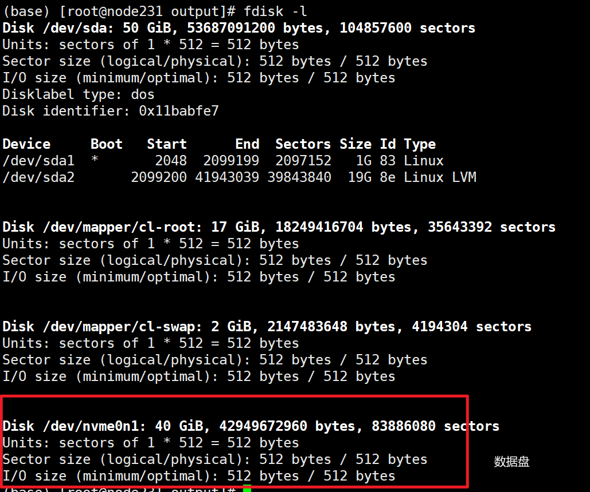

[TOC]

<!--more-->


## Cent8 磁盘的分区与挂载

### 磁盘分区

```shell
# 查看硬盘情况
fdisk -l
```



目前还未分区

```shell
(base) [root@node231 output]# fdisk /dev/nvme0n1 

Welcome to fdisk (util-linux 2.32.1).
Changes will remain in memory only, until you decide to write them.
Be careful before using the write command.

Device does not contain a recognized partition table.
Created a new DOS disklabel with disk identifier 0x1c68edb9.

Command (m for help): n # 这里输入n
Partition type
   p   primary (0 primary, 0 extended, 4 free)
   e   extended (container for logical partitions)
Select (default p): p # 这里默认
Partition number (1-4, default 1): 1 # 分区数，表示1个盘符
First sector (2048-83886079, default 2048): # 回车
Last sector, +sectors or +size{K,M,G,T,P} (2048-83886079, default 83886079): # 回车 

Created a new partition 1 of type 'Linux' and of size 40 GiB.

Command (m for help): wq # 输入wq
The partition table has been altered.
Calling ioctl() to re-read partition table.
Syncing disks.
```

可见，数据盘被分区到 `/dev/nvme0n1p1` 

```shell
[root@node231 vdbench50407]# fdisk -l
Disk /dev/sda: 50 GiB, 53687091200 bytes, 104857600 sectors
Units: sectors of 1 * 512 = 512 bytes
Sector size (logical/physical): 512 bytes / 512 bytes
I/O size (minimum/optimal): 512 bytes / 512 bytes
Disklabel type: dos
Disk identifier: 0x11babfe7

Device     Boot   Start      End  Sectors Size Id Type
/dev/sda1  *       2048  2099199  2097152   1G 83 Linux
/dev/sda2       2099200 41943039 39843840  19G 8e Linux LVM


Disk /dev/sdb: 70 GiB, 75161927680 bytes, 146800640 sectors
Units: sectors of 1 * 512 = 512 bytes
Sector size (logical/physical): 512 bytes / 512 bytes
I/O size (minimum/optimal): 512 bytes / 512 bytes
Disklabel type: dos
Disk identifier: 0x02cfff99

Device     Boot Start       End   Sectors Size Id Type
/dev/sdb1        2048 146800639 146798592  70G 83 Linux


Disk /dev/mapper/cl-root: 17 GiB, 18249416704 bytes, 35643392 sectors
Units: sectors of 1 * 512 = 512 bytes
Sector size (logical/physical): 512 bytes / 512 bytes
I/O size (minimum/optimal): 512 bytes / 512 bytes


Disk /dev/mapper/cl-swap: 2 GiB, 2147483648 bytes, 4194304 sectors
Units: sectors of 1 * 512 = 512 bytes
Sector size (logical/physical): 512 bytes / 512 bytes
I/O size (minimum/optimal): 512 bytes / 512 bytes

```

### 分区格式化

```shell
(base) [root@node231 output]# mkfs.ext4 /dev/nvme0n1p1 
mke2fs 1.45.4 (23-Sep-2019)
Creating filesystem with 10485504 4k blocks and 2621440 inodes
Filesystem UUID: 50e24eed-a160-48d9-bea0-7cbf61d20ca4
Superblock backups stored on blocks: 
	32768, 98304, 163840, 229376, 294912, 819200, 884736, 1605632, 2654208, 
	4096000, 7962624

Allocating group tables: done                            
Writing inode tables: done                            
Creating journal (65536 blocks): done
Writing superblocks and filesystem accounting information: done   
```

### 分区挂载

将分区挂载到目录下，
当用户需要使用硬盘设备或分区中的数据时，需要先将其与一个已存在的目录文件进行关联，而这个关联动作就是“挂载”。

```shell
# 挂载点必须提前存在
(base) [root@node231 ~]# mkdir /mnt/data
(base) [root@node231 data]# mount /dev/nvme0n1p1 /mnt/data
(base) [root@node231 data]# lsblk
NAME        MAJ:MIN RM  SIZE RO TYPE MOUNTPOINT
sda           8:0    0   50G  0 disk 
├─sda1        8:1    0    1G  0 part /boot
└─sda2        8:2    0   19G  0 part 
  ├─cl-root 253:0    0   17G  0 lvm  /
  └─cl-swap 253:1    0    2G  0 lvm  [SWAP]
sr0          11:0    1  7.7G  0 rom  
nvme0n1     259:0    0   40G  0 disk 
└─nvme0n1p1 259:1    0   40G  0 part /data
```

- 若挂载点本身非空，载入分区后，原目录下的文件会暂时“消失”（不可访问），被挂载上来的分区中的内容所取代
- 等到该分区被卸载后，原目录中的文件就会再次显示。一般不会使用非空的目录作为常用的挂载点。

查看分区情况

```shell
(base) [root@node231 data]# df -lh
Filesystem           Size  Used Avail Use% Mounted on
devtmpfs             1.9G     0  1.9G   0% /dev
tmpfs                1.9G     0  1.9G   0% /dev/shm
tmpfs                1.9G   18M  1.9G   1% /run
tmpfs                1.9G     0  1.9G   0% /sys/fs/cgroup
/dev/mapper/cl-root   17G   17G  956M  95% /
/dev/sda1            976M  271M  638M  30% /boot
tmpfs                376M  1.2M  375M   1% /run/user/42
tmpfs                376M  4.0K  376M   1% /run/user/0
/dev/nvme0n1p1        40G   49M   38G   1% /data
```

### 永久挂载

目前挂载是临时的，重启之后会失效。下面进行开机自动挂载操作

向 /etc/fstab 中写入分区信息  

`vim /etc/fstab`  

向文件尾部添加一下内容  

`/dev/nvme0n1p1 /mnt/data ext4 defaults 0 0`

- 设备名或卷标
- 挂载点
- 分区的文件系统类型：ext4 是上面步骤中采用ext4类型进行格式化分区，这里才写ext4；采用什么类型格式化的分区就写什么类型，否则服务器无法开机。
- 文件系统的挂载参数。默认选项参数有: rw, suid, dev, exec, auto,nouser, async, and relatime。
- 是否使用dump命令备份，0表示不要做dump备份；1表示进行dump备份；2表示备份，但重要性比1小
- 是否使用fsck命令检验，0表示不要检验；1是要检验；2是要检验，不过优先级小于1

### 解除挂载

```shell
(base) [root@node231 /]# lsblk
NAME        MAJ:MIN RM  SIZE RO TYPE MOUNTPOINT
sda           8:0    0   50G  0 disk 
├─sda1        8:1    0    1G  0 part /boot
└─sda2        8:2    0   19G  0 part 
  ├─cl-root 253:0    0   17G  0 lvm  /
  └─cl-swap 253:1    0    2G  0 lvm  [SWAP]
sr0          11:0    1  7.7G  0 rom  
nvme0n1     259:0    0   40G  0 disk 
└─nvme0n1p1 259:1    0   40G  0 part /data
(base) [root@node231 /]# umount /data 
(base) [root@node231 /]# lsblk
NAME        MAJ:MIN RM  SIZE RO TYPE MOUNTPOINT
sda           8:0    0   50G  0 disk 
├─sda1        8:1    0    1G  0 part /boot
└─sda2        8:2    0   19G  0 part 
  ├─cl-root 253:0    0   17G  0 lvm  /
  └─cl-swap 253:1    0    2G  0 lvm  [SWAP]
sr0          11:0    1  7.7G  0 rom  
nvme0n1     259:0    0   40G  0 disk 
└─nvme0n1p1 259:1    0   40G  0 part 
```

通过挂载点卸载

```shell
# 重新挂载
(base) [root@node231 ~]# mount /dev/nvme0n1p1 /mnt/data/
(base) [root@node231 ~]# umount /mnt/data/
(base) [root@node231 ~]# lsblk
NAME        MAJ:MIN RM  SIZE RO TYPE MOUNTPOINT
sda           8:0    0   50G  0 disk 
├─sda1        8:1    0    1G  0 part /boot
└─sda2        8:2    0   19G  0 part 
  ├─cl-root 253:0    0   17G  0 lvm  /
  └─cl-swap 253:1    0    2G  0 lvm  [SWAP]
sr0          11:0    1  7.7G  0 rom  
nvme0n1     259:0    0   40G  0 disk 
└─nvme0n1p1 259:1    0   40G  0 part 
(base) [root@node231 ~]# 
```

特别注意的是，在卸载分区之前，先要确保该分区数据未被占用使用，包括当前用户退出其挂载点目录。若出现device is busy可使用命令fuser -k杀死与挂载目录相关的进程，在使用umount卸载目录。

## vdbench

### Vdbench 安装

https://blog.csdn.net/L123713/article/details/127916308

```shell
1、首先检索包含java的列表  
yum list java*  
  
2、检索1.8的列表  
yum list java-1.8*  

3、安装1.8.0的所有文件  
yum install java-1.8.0-openjdk* -y

4、使用命令检查是否安装成功  
java -version
```

下载vdbench50407.zip, 上传到服务器

```shell
unzip vdbench50407.zip -d vdbench50407/
```

进入 vdbench 目录，修改 vdbench 权限 `chmod 777 vdbench`

### Vdbench 使用

https://www.cnblogs.com/bandaoyu/p/16752095.html#section-8

https://blog.csdn.net/u012114090/article/details/81626430

https://blog.csdn.net/u013521274/article/details/112756172

```shell
# 测试vdbench的可用性
./vdbench -t

# 运行测试模型
./vdbench -f {filename} -o {exportpath}
#注：-f后接测试参数文件/名脚本名，-o后接导出测试结果路径
```

测试裸盘 4K 随机写 IO 模型

```shell
# vdbench=运行的vdbench路径
hd=default,vdbench=/root/vdbench50407,user=root,shell=ssh

#客户端主机，分别命名为hd1
hd=hd1,system=[hostname]

# 待测试的存储命名为sd1、用客户端hd1测试，
## lun=指定测试的盘为/dev/nvme0n1
## openflag=o_direct表示对整个盘进行访问
sd=sd1,hd=hd1,lun=/dev/nvme0n1,openflag=o_direct,size=10G

#定义我们的工作负载，名叫wd1，这个工作负载包括sd* （就是我们上面定义的sd1）
## seekpct=指定随机或顺序；100或random为随机；0或sequential为顺序
## rdpct=指定读的比例；默认100；为0表示100%写，例如3表示读写比为3:7
## xfersize=IO的块大小
wd=wd1,sd=sd*,seekpct=100,rdpct=0,xfersize=4k

#定义我们的vdbench要运行的内容，命名为rd1,要做的工作是我们上面定义的wd1
## elapsed=指定运行时间，默认单位为s
## interval=运行过程中测试结果打印的间隔
rd=rd1,wd=wd1,iorate=max, elapsed=600,interval=1
```

运行过程中的输出：

- i/o rate:代表IOPS  
- MB/sec:每秒的带宽  
- bytes i/o:运行的IO 块大小  
- read pct: 读的比例  
- resp time:时延

### 输出结果解释

- **Interval**
  报告间隔序号，测试结果一般为除第一个时间间隔外所有时间间隔加权平均值
  如elapsed=600,interval=5，则性能结果为第2个间隔到第120个间隔的平均值（avg_2-120）
- **ReqstdOps**
  - **rate**
    每秒读写I/O个数（**读写IOPS**），可以通过`rd`运行定义参数`fwdrate`控制
    当`fwdrate`为`max`时，以最大I/O速率运行工作负载
    当`fwdrate`为低于最大I/0速率的一个数值时，可以限制读写速度，以固定I/O速率运行工作负载
  - **resp**
    读写请求响应时间（**读写时延**），单位为`ms`
- **cpu%**
  - **tatol**
    总的cpu占用率
  - **sys**
    系统cpu占用率
- **read pct**
  读取请求占总请求数百分比占比，当为0时表示写，当为100时表示读
- **read**
  - **rate**
    每秒读I/O个数（**读IOPS**）
  - **resp**
    读请求响应时间（**读时延**），单位为`ms`
- **write**
  - **rate**
    每秒写I/O个数（**写IOPS**）
  - **resp**
    写请求响应时间（**写时延**），单位为`ms`
- **mb/sec**
  - **read**
    每秒读取速度
  - **write**
    每秒写入速度
  - **total**
    每秒读写速度总和
- **xfersize**
  每个读写I/O传输数据量（即单个读写I/O大小），单位为字节`B`

```
flatfile.html
* Run             : RD=的运行名
* Interval        : 上报的时间数
* Xfersize        : 请求的数据传输大小
* Threads         : 请求的线程数
* Reqrate         : Requested FWD rate
* Rate            : 每秒请求的操作数
* Rate_std        : 每秒请求的操作数标准差
* Rate_max        : Requested operations per second max
* Resp            : Requested response time
* Resp_std        : Requested response time standard deviation
* Resp_max        : Requested response time max
* MB/sec          : Megabytes per second (MB=1024*1024)
* MB_read         : Megabytes read per second
* MB_write        : Megabytes written per second
* Read_rate       : Reads per second
* Read_rate_std   : Reads per second stddev
* Read_rate_max   : Reads per second max
* Read_resp       : Read response time
* Read_resp_std   : Read response time stddev
* Read_resp_max   : Read response time max
* Write_rate      : Writes per second
* Write_rate_std  : Writes per second stddev
* Write_rate_max  : Writes per second max
* Write_resp      : Write response time
* Write_resp_std  : Write response time stddev
* Write_resp_max  : Write response time max
* Mkdir_rate      : Mkdirs per second
* Mkdir_rate_std  : Mkdirs per second stddev
* Mkdir_rate_max  : Mkdirs per second max
* Mkdir_resp      : Mkdir response time
* Mkdir_resp_std  : Mkdir response time stddev
* Mkdir_resp_max  : Mkdir response time max
* Rmdir_rate      : Rmdirs per second
* Rmdir_rate_std  : Rmdirs per second stddev
* Rmdir_rate_max  : Rmdirs per second max
* Rmdir_resp      : Rmdir response time
* Rmdir_resp_std  : Rmdir response time stddev
* Rmdir_resp_max  : Rmdir response time max
* Create_rate     : Creates per second
* Create_rate_std : Creates per second stddev
* Create_rate_max : Creates per second max
* Create_resp     : Create response time
* Create_resp_std : Create response time stddev
* Create_resp_max : Create response time max
* Open_rate       : Opens per second
* Open_rate_std   : Opens per second stddev
* Open_rate_max   : Opens per second max
* Open_resp       : Open response time
* Open_resp_std   : Open response time stddev
* Open_resp_max   : Open response time max
* Close_rate      : Closes per second
* Close_rate_std  : Closes per second stddev
* Close_rate_max  : Closes per second max
* Close_resp      : Close response time
* Close_resp_std  : Close response time stddev
* Close_resp_max  : Close response time max
* Delete_rate     : Deletes per second
* Delete_rate_std : Deletes per second stddev
* Delete_rate_max : Deletes per second max
* Delete_resp     : Delete response time
* Delete_resp_std : Delete response time stddev
* Delete_resp_max : Delete response time max
* Getattr_rate    : Getattrs per second
* Getattr_rate_std: Getattrs per second stddev
* Getattr_rate_max: Getattrs per second max
* Getattr_resp    : Getattr response time
* Getattr_resp_std: Getattr response time stddev
* Getattr_resp_max: Getattr response time max
* Setattr_rate    : Setattrs per second
* Setattr_rate_std: Setattrs per second stddev
* Setattr_rate_max: Setattrs per second max
* Setattr_resp    : Setattr response time
* Setattr_resp_std: Setattr response time stddev
* Setattr_resp_max: Setattr response time max
* Access_rate     : Accesses per second
* Access_rate_std : Accesses per second stddev
* Access_rate_max : Accesses per second max
* Access_resp     : Access response time
* Access_resp_std : Access response time stddev
* Access_resp_max : Access response time max
* Compratio       : Requested compression ratio
* Dedupratio      : Requested dedup ratio
* cpu_used        : kstat: cpu% user+sys
* cpu_user        : kstat: cpu% user
* cpu_kernel      : kstat: cpu% sys 
* cpu_wait        : kstat: cpu% wait
* cpu_idle        : kstat: cpu% idle
```


### 联机测试

1. 在联机测试时，客户端的系统时间需保持一致，否则会出现时钟同步告警（this can lead to heartbeat issues）
2. 客户端的防火墙要关闭(或者设置开放程序指定端口`5570`、`5560`访问)
3. 关闭系统日志服务`rsyslog`，避免运行时出现其他日志文件打印信息
   参数文件添加`messagescan=no`可以过滤掉多余的系统日志


1. 如果需要多个客户端联机跑vdbench 需要主客户端对其他客户端进行免密操作
   ssh-keygen -t rsa
   ssh-copy-id root@IP
   且每个客户端都需要安装vdbench 且存放的目录要一致否则会无法运行成功
2. 运行vdbench若出现java.net.NoRouteToHostException: No route to host (Host unreachable)
   可能是服务器防火墙没关，关闭即可
   systemctl stop firewalld
   systemctl disable firewalld