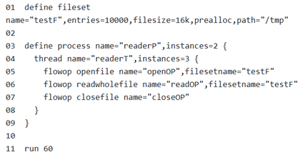
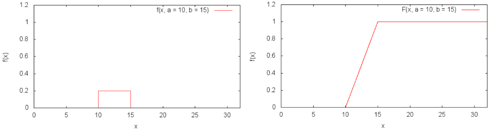
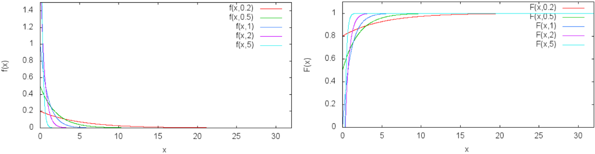
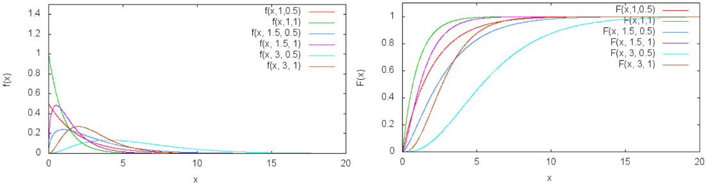

[TOC]

<!---->

## 介绍

Filebench是文件系统的压测工具，能够生成多种工作负载。它及其灵活，允许使用Workload Model Language(WML)来模拟真实应用对文件系统的I/O行为，不仅可以仿真文件系统微操作（如 copyfiles, createfiles, randomread, randomwrite ），而且可以仿真复杂的应用程序（如 varmail, fileserver, oltp, dss, webserver, webproxy ）。

### 指标

文件总大小相同，看带宽

文件总数量相同，看IOPS

### 特点

Filebench包括许多功能，便于文件系统基准测试：

- 提供了40多个预定义的个性，包括描述邮件、web、文件和数据库服务器行为的个性
- 使用reach Workload Model Language （WML）可以轻松添加新的个性
- 多进程和多线程工作负载支持
- 可配置的目录层次结构，深度、宽度和文件大小设置为给定的统计分布
- 支持异步I/O和进程同步原语
- 吞吐量和延迟分布测量
- 适用于任何兼容posix的操作系统（Linux、FreeBSD、Solaris）

### 示例

**Step 1：生成负载配置文件**

Filebench的负载配置文件使用WML创建负载描述，保存在以 .f 为后缀的文件中

示例中，描述一个简单的负载：2个进程，每个进程有3个线程，每个线程循环执行操作（选择一个文件，读文件，关闭文件）



Filebench中四个主要的条目是

```
第1行：定义了一个文件集，在/tmp目录中，包含10000个16KiB的文件，在执行实际工作负载前预先创建文件集中的所有文件
第3,4行：定义两个进程，每个进程包含3个线程。每个线程会循环执行其中定义的flowops(不同类型的操作)
第5-7行：描述了每个线程内的flowops（从fileset中打开一个文件，将文件内容完整读入内存，然后关闭）
第11行：指出负载运行60s
```

**Step 2: 禁用进程地址空间随机化**

启用终端命令行运行以下命令： `sudo bash -c "echo 0 > /proc/sys/kernel/randomize_va_space"`

**Step 3：执行**

假设上述负载配置文件命名为 `readfiles.f` ，可以通过指令 `filebench -f readfiles.f` 生成相应的负载

---

每个flowop都会有一个类型，Filbench将操作类型分为以下几类：

- **I/O**: `write`, `read`, `openfile`, `createfile`, `closefile`, `makedir`, `removedir`, `listdir`, `fsync`, `fsyncset`, `statfile`, `readwholefile`, `appendfile`, `appendfilerand`, `deletefile`, `writewholefile`;
- **Async I/O**: `aiowrite`, `aiowait`;
- **Events**: `block`, `wakeup`, `semblock`, `sempost`;
- **Composite**: (XXX: link to the composite flowops description);
- **Other**: `hog`, `delay`, `eventlimit`, `bwlimit`, `iopslimit`, `opslimit`, `finishoncount`, `finishonbytes`;

每个flowop实例有多种属性，write、writewholefile、appendfile 和 appendfilerand 类型的 Flowop 实例标有 WRITE 属性，而 read 和 readwholefile 实例标有 READ 属性。其他flowop类型不包含 READ和WRITE属性

> 在更复杂的负载场景，我们能使用一系列flowops和属性，来定义更多的filesets、多种进程和线程的组合
>
> 完整的WML描述https://github.com/filebench/filebench/wiki/Workload-model-language

### 宏负载

Filebench预定义了许多宏和宏负载（WebServer，FileServer，mailserver），同样也是WML描述。

> 源码中在 *workloads/* 目录下，安装完成后在 */usr/local/share/filebench/workloads/* 下

不建议直接使用这些负载，因为文件大小与实际的系统可能不匹配，如：webserver中，负载仅略大于16MiB，可能不是待测的GB级负载

因此，建议复制后修改，

`cp /usr/local/share/filebench/workloads/webserver.f mywebserver.f`

然后编辑复制的文件，通过将文件数量（文件集的“entries”属性）设置为适当的值来增加数据集大小。最后，运行工作负载：

> 有关如何扩展 Filebench 工作负载的详细讨论，请参阅https://github.com/filebench/filebench/wiki/Scaling-Filebench-workloads

- [Filebench: A Flexible Framework for File System Benchmarking](https://www.usenix.org/system/files/login/articles/login_spring16_02_tarasov.pdf) article in ;login; magazine, Spring 2016, Vol. 41, No. 1 is a gentle but sufficiently detailed introduction to Filebench.

## 指标采集

在基准测试执行期间，Filebench 的配置文件中定义的每个 flowop，都对应多个正在运行的线程。例如，在以下工作负载中

```shell
define process name="readerP",instances=2 {
  thread name="readerT",instances=3 {
    flowop openfile name="openOP",filesetname="testF"
    flowop readwholefile name="readOP",filesetname="testF"
    flowop closefile name="closeOP"
  }
}
```

每个 openOP，readOP，closeOP都有6个运行中线程（2进程*3线程）。

### 统计指标

在运行时，Filebench为每个正在运行的Flowop采集多个指标，这样做是为了避免多个线程更新同一指标并因此需要同步锁的情况。每个flowop实例收集一下指标：

- 当前flowop实例的执行时长 `fs_count`

- read-操作数，只要是 `READ` 标记的flowop都会被统计——`fs_rcount`

- write-操作数，只要是 `WRITE` 标记的flowop都会被统计——`fs_wcount`

- flowop实例读取和写入的字节数——`fs_bytes`

- read-操作的字节数——`fs_rbytes`

- write-操作的字节数——`fs_wbytes`

- 以纳秒为单位的flowop总累计延迟——`fs_total_lat`

  在flowop执行之前和执行后记录时间戳，将差值累加到 `fs_total_lat` 指标。

- flowop的最大时延——`fs_maxlat`

- flowop的最小时延——`fs_minlat`

### 启动指令

fliebench可通过3种指令启动：

- `run [runtime]` ：运行工作负载 runtime 秒。如果未指定运行时间且 Filebench 在超时模式下运行，则运行时间设置为 60 秒。性能指标在执行结束时仅打印一次。
- `psrun [period] [runtime]` ：运行工作负载 runtime 秒，每 [period] 秒打印一次指标。指标在运行期间不会重置，因此会随着时间的推移而累积。
- `psrun -[period] [runtime]` ：运行工作负载 runtime 秒，打印指标并每 [period] 秒重置一次。因此，打印的指标仅代表最后 [period] 秒。

### 输出解释

在这种情况下，每个 flowop 实例的指标在整个运行过程中都会收集，永远不会重置，并且仅在运行结束时打印一次（以聚合形式）。fileserver负载的输出如下

```shell
01| 61.853: Run took 60 seconds...
02| 61.855: Per-Operation Breakdown
03| statfile1            403700ops     6728ops/s   0.0mb/s    0.002ms/op [0.001ms - 2.320ms]
04| deletefile1          403700ops     6728ops/s   0.0mb/s    0.866ms/op [0.021ms - 244.148ms]
05| closefile3           403702ops     6728ops/s   0.0mb/s    0.664ms/op [0.001ms - 10.680ms]
06| readfile1            403705ops     6728ops/s 888.0mb/s    0.041ms/op [0.001ms - 7.077ms]
07| openfile2            403706ops     6728ops/s   0.0mb/s    1.238ms/op [0.005ms - 19.114ms]
08| closefile2           403715ops     6728ops/s   0.0mb/s    0.585ms/op [0.001ms - 13.162ms]
09| appendfilerand1      403723ops     6728ops/s  52.5mb/s    0.605ms/op [0.000ms - 10.248ms]
10| openfile1            403728ops     6728ops/s   0.0mb/s    1.210ms/op [0.007ms - 16.119ms]
11| closefile1           403738ops     6729ops/s   0.0mb/s    0.636ms/op [0.001ms - 13.222ms]
12| wrtfile1             403745ops     6729ops/s 834.3mb/s    0.808ms/op [0.012ms - 16.785ms]
13| createfile1          403748ops     6729ops/s   0.0mb/s    0.754ms/op [0.012ms - 16.790ms]
14| 61.855: IO Summary: 4440910 ops 74010.535 ops/s 6728/13457 rd/wr 1774.9mb/s 0.673ms/op
15| 61.855: Shutting down processes
```

尽管配置了50个线程（为每个flowop创建50个flowop实例），但不会为每个flowop打印50行。相反，将每个flowop实例指标聚合到输出中的每个flowop中，如：`readfile1` flowop跨50个线程的总数是403 728。

- 第一列：flowop名
- 第二列：所有线程中flowop的执行总数 fs_count的和，不同flowop间数字略有差异，因为不同的线程在运行结束时在不同的flowop处停止执行
- 第三列：每秒操作数，=将所有线程中的流操作执行总数（第1列）除以压测运行的持续时间
- 第四列：flowop的平均吞吐量（MB/S）。仅统计含 `READ` 和 `WRITE` 属性的值。=字节数 `fs_bytes` 除以压测时长
- 第五列：flowop执行的平均延迟。=总flowop执行时长/flowop总数。fs_total_lat/fs_count
- 第六列：方括号中的数字表示所有线程中 flowop 的所有执行中的最大延迟（fs_maxlat）和最小延迟（fs_minlat）。

#### I/O Summary

仅包含I/O和异步I/O操作的总结

- `4,440,910 ops`：是所有I/O和异步I/O flowop操作的总和。在文件服务器中，所有流操作都属于I/O类别，因此是第一列的总和

- `74,010.535 ops/s`：是所有操作的IOPS，将所有I/O类型操作总数/运行时间

- `6728/13457 rd/wr`：是I/O和异步I/O类别中，含READ/WRITE标记的op次数除以总时长

  在这个例子中，readfile1 是唯一的 READ 标记的 flowop (6,728 = 40,370 / 60)，而 appendfilerand1 和 wrtfile1 是 WRITE 标记的 flowops (13,457 = (403,723 + 403,745) / 60)。

- `1774.9mb/sec `：是所有 I/O 和异步 I/O 流操作的总吞吐量（以兆字节/秒为单位）。含READ/WRITE标记的op读取/写入的总字节数（fs_bytes）除以总时长。

  该指标等于第 03-13 行吞吐量字段的总和：888.0 + 52.5 + 834.3 = 1774.9mb/s。

- `0.673mb/op` 是I/O和异步I/O流操作的平均延迟，计算方式将 I/O总时延与op数 加权均值 fs_count

  在此示例中，由于所有 flowops 的执行次数几乎相同，因此指标大致等于各个 flowops 的平均延迟：

  (0.002+0.866+0.664+0.041+1.238+0.585+0.605+1.210+0.636+0.808+0.754) / 11 = 0.673ms/op 

**filemicro_writefsync** 具体来说，filemicro_writefsync 是一个单线程工作负载，它以 8KB I/O 大小为单位顺序写入单个文件，直到文件达到 1GB 大小。每 1024 次写入（8MB），线程就会将文件同步到磁盘。以下是示例输出：

```shell
9.009: Run took 8 seconds...
9.009: Per-Operation Breakdown
finish               128ops       16ops/s   0.0mb/s    0.000ms/op [0.000ms - 0.001ms]
sync-file            128ops       16ops/s   0.0mb/s   33.065ms/op [21.598ms - 221.742ms]
append-file          131073ops    16382ops/s 128.0mb/s    0.021ms/op [0.004ms - 8.966ms]
9.009: IO Summary: 131201 ops 16397.770 ops/s 0/16382 rd/wr 128.0mb/s 0.053ms/op
9.009: Shutting down processes
```

So, `33.065ms/op` is the average of latencies of `131201` `append-file` and `128` `sync-file` operation - (131,201 * 0.021 + 128 * 33.065) / (131,201 + 128) = 0.053ms/op)

## 文件大小分布

https://github.com/filebench/filebench/wiki/Custom-variables

在 1.5 版本之前，Filebench 实现了随机变量的概念。仅支持三种随机变量分布：均匀、伽马和表格。要向 Filebench 添加新的发行版，用户必须修改 WML 语法和 Filebench 内部结构

Filebench 自定义变量（从 1.5 版开始支持）旨在简化向 Filebench 添加新分布的过程。每个自定义变量分布都在单独的动态加载库中实现。要添加新分布，用户只需实现一个由 2 到 8 个函数组成的定义良好的接口。

### 支持的随机变量

```shell
$ filebench -c
0.000: Allocated 173MB of shared memory
Custom variable types supported:
  cvar-gamma
  cvar-erlang
  cvar-weibull
  cvar-lognormal
  cvar-exponential
  cvar-normal
  cvar-triangular
  cvar-uniform
```

列出特定自定义变量类型的版本和参数（及其默认值）：

```shell
$ filebench -c cvar-gamma
0.000: Allocated 173MB of shared memory
Custom variable type: cvar-gamma
Supporting library: /usr/local/lib/filebench/libcvar-gamma.so
Version: 0.1.1 (alpha)
Usage:
	parameter	default
	---------	-------
	mean		4096.0
	gamma		1.5
Use ';' to delimit parameters and ':' to delimit key-value pairs.
Example: 'mean:4096.0;gamma:1.5'
```

#### 均匀分布

$$
f(x;a,b)=\frac{1}{b-a}\\
F(x;a,b)=\frac{x-a}{b-a}\\
E[a,b]=\frac{b-a}{2}
$$



#### 指数分布

$$
f(x;\lambda)=\lambda e^{-\lambda x}\\
F(x;\lambda)=1-e^{-\lambda x}\\
E(\lambda)=\frac{1}{\lambda}
$$



#### gamma分布



#### 正态分布


#### log-正态分布


## 定制预定义负载

定制工作负载定义了要应用于系统的工作负载。定制内容通常包括 [scaling workloads for specific systems](https://github.com/filebench/filebench/wiki/Scaling-workload-personalities)的可调参数。在加载个性化设置后，可将可调参数设置为适当的值。定制化配置存储在扩展名为 .f 的文件中，可以从 Filebench 命令行界面或通过编辑文件本身（或文件副本）轻松进行定制。Filebench负载一个预定义工作负载库，如表所示

| Micro-workload            |                                                              |
| ------------------------- | ------------------------------------------------------------ |
| Personality               | Description                                                  |
| `singlestreamread`        | 顺序读大文件（默认5GB，1MB块大小）                           |
| `singlestreamreaddirect`  | 与 `singlestreamread` 想通，但使用 direct I/O                |
| `fivestreamread`          | 顺序读5个大文件（1GB）每个线程执行1个读操作（块大小为1MB）   |
| `fivestreamreaddirect`    | 与 `5streamread`相同，direct I/O                             |
| `singlestreamwrite`       | 顺序写文件，一直持续到压测停止，默认写1MB块大小              |
| `singlestreamwritedirect` | 与 `singlestreamwrite` 相同， direct I/O                     |
| `fivestreamwrite`         | 顺序读5个大文件（1GB）每个线程执行1个读操作（块大小为1MB），直至压测停止 |
| `fivestreamwritedirect`   | 与 `5streamwrite` 相同，direct I/O                           |
| `randomread`              | 随机读一个大文件（默认5GB/8KB），默认单线程，由 `nthreads` 调整；默认非direct I/O，由 `directio` 调整 |
| `randomwrite`             | 随机写一个大文件（5GB/8KB），文件在压测开始就被预分配，默认单线程8KB |
| `randomrw`                | 两个线程，操作同样大小的文件（5GB/8KiB）。一个线程随机读，另一个随机写。压测开始预分配文件。 |
| `createfiles`             | 在目录中创建50000个文件。文件大小服从gamma分布，$size\sim\gamma(16K,1.5)$。默认16个线程，可调整，当所有文件创建完成后结束 |
| `copyfiles`               | 将文件从源目录复制到目标目录。预先创建源路径（1000个文件）。单线程。复制完成后停止。 |

| Application emulations |                                                              |                                                              |
| ---------------------- | ------------------------------------------------------------ | ------------------------------------------------------------ |
| Personality            | Description                                                  |                                                              |
| `webserver`            | 模拟简单的web-server的I/O行为。Web服务器接受并处理网站的静态资源，将响应结果以文件形式返回，同时将本次请求记录到日志文件。 | 默认100线程，每线程依次对10个文件进行“打开-完全读取-关闭”操作流，最后对日志文件执行追加写行为。两种文件大小均值为16KB，压测前生成完整文件。 |
| `fileserver`           | 模拟file-server的I/O行为。类似于SPECsfs                      | 默认50线程，每线程执行文件创建、写入、关闭、打开、随机追加写、读取、元数据查看和删除操作。文件大小均值128KB，预分配80%，压测过程中存在新写入/创建文件 |
| `varmail`              | 模拟简单邮件服务器的I/O行为，每个邮件存储为一个单独的文件。与postmark类似。收到邮件后，执行文件的创建、写入和fsync落盘；读取邮件时，执行文件打开、读取、标记已读、fsync落盘 | 工作负载由一组多线程的文件操作组成（create-append-sync, read-append-sync, read and delete），这些操作在一个单独的目录中。默认使用16个线程。<br />负载的workflow为：<br />- 删除文件（模拟删除邮件/预留一个创建文件的空位）<br />- 创建邮件文件，写入邮件数据，落盘后关闭文件<br />-  打开一个未读邮件，读取内容后追加写入已读mark，落盘后关闭<br />- 读取一个已读文件，读取内容后关闭 |
| `webproxy`             | 模拟Web代理服务器的I/O行为，用户通过代理服务器访问网站，代理服务器会将网站的内容缓存到本地，当用户再次访问时，代理服务器会直接返回缓存的内容。 | 在一个目录树中的多个文件操作，包括 "create-write-close, open-read-close,delete"，以及模拟代理日志文件的追加写。该负载预先分配80%的缓存文件，使用100个线程操作10000个文件。<br /> - 删除文件（预留一个创建文件的空位） <br />- 读取一个已经缓存的文件（重复5次）<br />该负载还通过opslimit来限制短时间内的操作次数，避免负载过早结束，同时还可以控制系统的资源。 |
| `videoserver`          | 模拟视频服务器的I/O行为。两个文件集 active视频集(正在播放的文件)与inactive视频集(可用但未播放的文件)。 | 两个线程，48个vidreaders 线程模拟对active集中视频文件的读取操作；1个vidwriter线程服务于inactive集，将新视频文件写入inactive集，替换不再被观看的文件。eventrate参数限制读取线程的读取速率，计算公式为nthreads*Rate，这里的Rate就是每个线程读取的带宽大小，为2mb/s。视频文件替换间隔为10s。paralloc是通过多线程（32个）预分配文件，因为预分配的文件较大，需要提高效率。 |
| `oltp`                 | 数据库模拟器。使用Oracle 9i I/O模型执行文件系统操作。测试小文件随机读写性能，并对中等大小的日志文件（128K）同步写入的延迟敏感。默认启动200个reader进程，10个异步写入进程和一个日志写入进程。模拟Oracle、Sysbase等的ISM共享内存<br />通过对日志文件和数据文件的操作，模拟了数据库OLTP事务的处理过程。对日志文件写入和数据文件读写操作采用随机I/O方式，通过信号量机制控制线程间的同步。 | 日志文件写入线程(lgwr)：<br />- 异步写入（iosize=256K,filesize=10MB），directio和同步写<br />-等待：aiowait<br />-信号量操作：semblock-lg阻塞线程，等待shadow线程的sempost-lg信号量<br />数据文件写入线程(dbwr)：<br />-异步写入(filesize=10MB,iosize=2KB)，随机写，directio和同步写<br />-hog：模拟写入操作完成后线程对 CPU 的占用<br />-信号量：semblock-dbwr<br />aiowait<br />数据读线程(shadow)：<br />-读：随机读,direction<br /><br />-hog：模拟数据库读取线程在处理数据时对 CPU 的占用<br />-信号量操作：sempost-dbwr,sempost-lg<br />-eventlimit：限流 |

### oltp

https://www.xnip.cn/ruanjian/anli/103119.html

oltp.F工作负载定义了两个文件集：datafiles和 logfile 。

```shell
# Define a datafile and logfile
define fileset name=datafiles,path=$dir,size=$filesize,entries=$nfiles,dirwidth=1024,prealloc=100,reuse
define fileset name=logfile,path=$dir,size=$logfilesize,entries=$nlogfiles,dirwidth=1024,prealloc=100,reuse
```

定义了三种进程：日志写入进程(" 'lgwr " ')、数据库写入进程(" 'dbwr " ')和数据库读取进程(" 'shadow " ‘)

```shell
# Define database writer processes
define process name=dbwr,instances=$ndbwriters
{
  thread name=dbwr,memsize=$memperthread,useism
  {
    flowop aiowrite name=dbwrite-a,filesetname=datafiles, iosize=$iosize,workingset=$workingset,random,iters=100,opennext,directio=$directio,dsync
    flowop hog name=dbwr-hog,value=10000
    flowop semblock name=dbwr-block,value=1000,highwater=2000
    flowop aiowait name=dbwr-aiowait
  }
}
hog 指令用于模拟线程对 CPU 和内存资源的占用。具体来说，hog 指令可以让线程执行一定数量的内存拷贝操作，从而模拟真实应用程序中线程对 CPU 和内存的消耗情况
```

- " dbwr “进程和线程通过” aiowrite “和” aiowait " " flowops “演示了异步写入的使用，通过” hog " " flowop “演示了cpu周期消耗，通过” semblock " " flowop “演示了信号量操作。

  - “aiowrite”流获得与其他读写操作相同的属性，将向文件系统发出异步写，然后继续到下一个流，即“hog”流。
  - “hog”流为“value”迭代执行字节写循环，因此每次调用消耗大约固定数量的cpu周期。
  - 其后是“semblock”流，它通过阻塞其信号量来同步“dbwr”线程和“shadow”线程，直到“shadow”线程中的“sempost”流发出足够多的消息。
  - 当线程的flowop继续执行时，它将调用” ‘aiowait’’ flowop，它将暂停，直到一个或多个未完成的异步写操作完成。通过使用“aiowrite”和“aiowait”操作，工作负载模型模拟了典型oltp软件中发生的I/O与cpu处理的重叠。如果I/O快速完成，循环的进程将受到“hog”和“semblock”的flowops的限制，而如果I/O很慢，“aiowait”的flowop将限制循环的进程。

- shadow”进程和线程则使用“opennext”属性在文件集中循环，并使用“sempost”流程进行信号量操作的其他方面。

  虽然每个“shadow”进程只有一个线程实例，但在默认配置中有200个进程实例，因此总共有200个线程。

  - 第一个流是“read”，然后是一个“hog”流，两个“sempost”流和一个“eventlimit”流。

    ```bash
    'sempost flowop'：
    	- value 每个post添加到信号量计数的数量，在这个工作负载中，两者都被设置为1。
    	- target 这篇文章将作用于其信号量的semblock流的名称。
    		一个流以lgwr中的semblock流为目标，命名为lgwr-block，
    		另一个流以dbwr中的semblock流为目标，命名为dbwr-block
    	- blocking 当指定时，表示包含该sempost流的线程必须阻塞，如果它比包含目标semblock流的线程超前太多的话。
    ```

  - “shadow”线程的流列表的最大执行速率受到“eventlimit”流的限制，类似于随机读工作负载的最大执行速率。

    只有一个源的事件,所以每个200影子进程的线程共享一个事件生成器,平均将为1/200的指定利率循环,当然,仍然导致了每秒循环总数等于事件生成器。另外，“read”、“hog”和“sempost”流可能会进一步限制执行速度。例如，如果“读”“流访问延迟”和“猪”“流cpu延迟”的组合超过事件周期的200倍，它们将成为限制因素。正如下面将要描述的，“sempost”flowops还可以限制“阴影”线程的执行速度。

```shell
define process name=shadow,instances=$nshadows
{
  thread name=shadow,memsize=$memperthread,useism
  {
    flowop read name=shadowread,filesetname=datafiles,
      iosize=$iosize,workingset=$workingset,random,opennext,directio=$directio
    flowop hog name=shadowhog,value=$usermode
    flowop sempost name=shadow-post-lg,value=1,target=lg-block,blocking
    flowop sempost name=shadow-post-dbwr,value=1,target=dbwr-block,blocking
    flowop eventlimit name=random-rate
  }
}
```

在oltp. f在工作负载下，计数信号量用于将两个写进程的执行速率限制为读进程速率的特定分数。这是通过在每个操作中对信号量进行加减的值进行适当设置来实现的。“影子”线程中的“sempost”和“flowops”都会在每次调用时为各自的计数信号量增加1，这意味着每秒钟增加的总数等于事件生成器的速率。更有趣的是，通过在其他两个线程中每次调用“semblock”从信号量中减去的量。“lgwr”线程中的“semblock”将会阻塞，除非信号量计数至少为3200，此时它会减去3200并继续。类似地，“dbwr”线程中的“semblock”将阻塞，除非信号量计数至少为1000，此时它将继续，但减去1000。总的效果是，“lgwr”每3200经过“shadow”一次通过它的流列表，而“dbwr”每1000经过“shadow”一次通过。
虽然信号量通常被认为是一种防止落后进程超过领先进程的机制(例如，消费者超过生产者)，FileBench信号量flowops还可以防止领先进程超过落后进程太远。这是通过在内部创建第二个操作系统信号量来完成的，它的计数被初始化为“highwater”值，并且它的post和block操作被交换，因此“sempost”实际上对第二个信号量执行一个block操作，而它的“semblock”实际上执行一个post操作。因此，如果信号量的计数小于“sempost”属性的值，“sempost”流程将阻塞前导进程，并且“semblock”流程将在每次执行时将其值提交给计数。因为sempost flowops配置与价值观之一,1000年的“水位最高点”设置为“lgwr”将允许阴影得到1000 flowop循环迭代之前阻止之前,和“水位最高点”设置为“2000”dbwr影子可以得到2000 flowop循环迭代之前提前阻止。因此，通过一组flowops，工作负载语言能够建模通常的情况，即由于其他依赖关系或资源限制，生产者无法真正领先消费者太远。

## WML

本页包含 Filebench 工作负载模型语言 (WML) 的完整而枯燥的定义。

分为四大类：

- commands
- entities 
  - flowop
- attributes

*command* 定义*entities* 并控制运行 。在Filebench中有四个 entities ：1) *processes*, 2) *threads*, 3) *flowops* (operations), and 4) *variables* 。每个进程包含一个或多个线程，每个线程在循环中执行一个或多个flowop。

可以使用 *variables* 向 *entities* 和 flowops 传递参数。

**commands的索引**

[create files](https://github.com/filebench/filebench/wiki/Workload-model-language#create-files) | [debug](https://github.com/filebench/filebench/wiki/Workload-model-language#debug) | [define file](https://github.com/filebench/filebench/wiki/Workload-model-language#define-file) | [define fileset](https://github.com/filebench/filebench/wiki/Workload-model-language#define-fileset) | [define process](https://github.com/filebench/filebench/wiki/Workload-model-language#define-process) | [echo](https://github.com/filebench/filebench/wiki/Workload-model-language#echo) | [enable](https://github.com/filebench/filebench/wiki/Workload-model-language#enable) | [eventgen](https://github.com/filebench/filebench/wiki/Workload-model-language#eventgen) | [list](https://github.com/filebench/filebench/wiki/Workload-model-language#list) | [psrun](https://github.com/filebench/filebench/wiki/Workload-model-language#psrun) | [quit](https://github.com/filebench/filebench/wiki/Workload-model-language#quit) | [run](https://github.com/filebench/filebench/wiki/Workload-model-language#run) | [set](https://github.com/filebench/filebench/wiki/Workload-model-language#set) | [set mode](https://github.com/filebench/filebench/wiki/Workload-model-language#set-mode) | [sleep](https://github.com/filebench/filebench/wiki/Workload-model-language#) | [system](https://github.com/filebench/filebench/wiki/Workload-model-language#system) | [version](https://github.com/filebench/filebench/wiki/Workload-model-language#version) |

**Flowops的索引**

[read](https://github.com/filebench/filebench/wiki/Workload-model-language#read) | [readwholefile](https://github.com/filebench/filebench/wiki/Workload-model-language#readwholefile) | [write](https://github.com/filebench/filebench/wiki/Workload-model-language#write) | [writewholefile](https://github.com/filebench/filebench/wiki/Workload-model-language#writewholefile) | [appendfile](https://github.com/filebench/filebench/wiki/Workload-model-language#appendfile) | [appendfilerand](https://github.com/filebench/filebench/wiki/Workload-model-language#appendfilerand) |

[createfile](https://github.com/filebench/filebench/wiki/Workload-model-language#createfile) | [openfile](https://github.com/filebench/filebench/wiki/Workload-model-language#openfile) | [closefile](https://github.com/filebench/filebench/wiki/Workload-model-language#closefile) | [statfile](https://github.com/filebench/filebench/wiki/Workload-model-language#statfile) | [deletefile](https://github.com/filebench/filebench/wiki/Workload-model-language#deletefile) | [fsync](https://github.com/filebench/filebench/wiki/Workload-model-language#fsync) | [fsyncset](https://github.com/filebench/filebench/wiki/Workload-model-language#fsyncset) |

[MakeDir](https://github.com/filebench/filebench/wiki/Workload-model-language#makedir) | [RemoveDir](https://github.com/filebench/filebench/wiki/Workload-model-language#removedir) | [ListDir](https://github.com/filebench/filebench/wiki/Workload-model-language#listdir) |

[aiowrite](https://github.com/filebench/filebench/wiki/Workload-model-language#aiowrite) | [aiowait](https://github.com/filebench/filebench/wiki/Workload-model-language#aiowait) |

[block](https://github.com/filebench/filebench/wiki/Workload-model-language#block) | [wakeup](https://github.com/filebench/filebench/wiki/Workload-model-language#wakeup) | [semblock](https://github.com/filebench/filebench/wiki/Workload-model-language#semblock) | [sempost](https://github.com/filebench/filebench/wiki/Workload-model-language#sempost) |

[eventlimit](https://github.com/filebench/filebench/wiki/Workload-model-language#eventlimit) | [delay](https://github.com/filebench/filebench/wiki/Workload-model-language#delay) | [hog](https://github.com/filebench/filebench/wiki/Workload-model-language#hog) | [finishonbytes](https://github.com/filebench/filebench/wiki/Workload-model-language#finishonbytes) | [finishoncount](https://github.com/filebench/filebench/wiki/Workload-model-language#finishoncount) | [opslimit](https://github.com/filebench/filebench/wiki/Workload-model-language#opslimit) | [iopslimit](https://github.com/filebench/filebench/wiki/Workload-model-language#iopslimit) | [bwlimit](https://github.com/filebench/filebench/wiki/Workload-model-language#bwlimit) |

### commands

#### create files

创建所有之前定义的files和fileset。通过 `run` 和 `psrun` 自动完成。但有时将文件创建阶段分开很方便。例如：Filebench仅用于生成文件目录树，或想在文件创建后执行系统命令（删除文件系统特定的缓存）

```shell
create files
```

#### echo

echo 命令将文本打印到标准输出。文本应该用引号括起来，并且可以包含变量。

```shell
echo "Number of files in workload is $files"
```

#### enable(多节点模式)

> 启用默认禁用的其他Filebench特性。

目前可以启用lathist和multi功能。

- lathist告诉Filebench收集每个流的延迟直方图，而multi启用启用多节点模式。

对于多节点模式，必须指定主节点的主机名和客户端的主机名。多节点特性正在开发中。

```shell
enable lathist 
enable multi master=<hostname>,client=<clientname>
enable multi master="master.domain.org",client="slave.domain.org"
```

#### eventgen

eventgen命令控制Filebench内部事件生成器的属性。

rate属性设置每秒产生的事件数，事件随后被eventlimit、iopslimit、opslimit和bwlimit flowops使用。

如果在执行流操作时没有可用的事件，那么流操作将阻塞，直到新的事件被提交。所有线程中的所有流都使用一个通用的事件池。

```shell
eventgen [rate = <events_per_second>]
eventgen rate = 100
表示每秒产生100个事件
```

#### run

启动filbench运行：

- 自动创建所有定义的fileset，fork定义的进程和线程。
- 当运行完成时（因为时间超过或其他原因），Filebench会打印运行的统计信息，例如ops/sec。

一般情况，该指令放在最后

以 runtime 为参数，默认的运行时长为60s

**Syntax**

> ```
> run [<runtime>]
> ```

**Example**

> ```
> run 300
> ```

#### set

定义变量，所有变量都由一个以美元符号“\$”开头的字符串标识。

```shell
$user_defined_varname
```

可以通过在大括号中指定对应的变量名来访问内部变量。

```shell
${stats | rate | date |scriptname | hostname}
```

变量可以用来设置文件、文件集、进程、线程和流的属性。

##### 常规变量

使用“set”命令创建并分配布尔值、整数、double、字符串值、null 或 \$varname

常规的、用户自定义的变量可以用“set”命令设置一个值。

```shell
set $<user_defined_varname> = [true | false | | | ]
set $<varname> = [ true | false | <integer> | <double> | "<string>" | $<othervarname>
```

##### 随机变量

随机变量是用户定义的实体，它定义了一个随机分布，用于在每次使用时选择一个随机值并返回。

用“define randvar”命令创建的，并且可以用“set”命令设置单个参数。和普通变量一样使用，但每次访问都会返回不同的值。

```shell
define randvar name = $<user_defined_varname>, [type=[uniform | gamma | table]] [, seed=] [, mean=] [, gamma=] [, min=] [, round=] [, randsrc=[urandom | rand48] [, randtable={{<%>,,}, ...}

set $<random varname>.type = [ uniform | gamma | tabular ]
set $<random varname>.randsrc = [ urandom | rand48 ]
set $<random varname>.[ gamma | mean | min | round | seed ] = <value>
set $<random varname>.randtable = {{ <%>, <min value>, <max value>}, ...}
set $<custom varname> = cvar(type="cvar-type",paramters=mean)
```

#### set mode

用于将Filebench设置为各种特殊的运行模式。quit是目前唯一定义的命令

默认值是quit timeout，当run命令中指定的运行时超时或遇到经过积极评估的finishon* flowop时结束运行。

如果期望工作负载在资源耗尽时结束，例如要删除的文件，那么使用quit alldone在所有线程因资源耗尽而退出时完成运行，或者使用quit firstdone在第一个线程检测到资源耗尽时立即退出。

**Syntax**

> ```
> set mode quit [ timeout | alldone | firstdone ]
> ```

**Example**

> ```
> set mode quit alldone
> ```

- finishoncount：用于终止一个线程，执行了**指定次数**的flowop操作（read/write）
- finishonbytes：用于终止一个线程，执行了**指定数据量**的flowop操作（read/write）

> ```
> flowop finishoncount name=<name>,value=<ops/s>,[target=<any-flowop]
> ```

#### define fileset

一组相关文件的信息（例如，由web服务器访问的所有html文件）包含在一个fileset实体中。

Fileset实体使用define Fileset命令指定。

define fileset命令必须提供文件集的名称和文件所在目录的路径。

此外，还接受几个可选的fileset属性。

- `name =` 强制性的。文件集的名称。

- `path = ` 强制性的。创建文件的目录路径。

- `entries = ` 可选的。文件集中的文件数。在fileset中可以创建的最大文件数。并不是fileset中的所有文件都是在Filebench运行一开始就创建的。`prealloc`属性来控制初始化创建文件的比例。

  `entries`属性用于设置此类文件的数量。如果未指定`entries`属性，则只会创建一个文件。

- `filesize = ` `size = ` ：可选的。文件集中每个文件的大小。默认为1KiB。

  文件的`filesize`属性指定了要创建的文件的大小。如果指定的fileset和filegamma不是0，那么filesize属性实际上指定的是平均文件大小，每个文件的实际大小是基于gamma分布和基于filegamma属性的alpha分布。、

  `size`属性与define file和define fileset命令一起使用。对于 `define file` ，它设置文件的大小。对于`define fileset`，它设置文件的平均大小，实际大小由文件集指定的伽马随机分布设置。

- `prealloc =`

  可选的。

  在Filebench工作负载开始之前，默认不会直接创建文件，只预分配文件所需要的空间。

  若想在工作负载开始前，实际创建文件，则使用该属性指定fileset的创建百分比。

  如果未指定`prealloc`，默认值为0。

  如果指定`prealloc`时没有指定数值，则值为100。

  file或fileset实体定义的文件可以作为潜在文件存在，也可以作为实际文件存在。

  - 作为潜在的，它们的信息由file或fileset实体保存，但不占用磁盘空间或存在于目录中。如果它们不存在，可以稍后使用`creatfile`流程创建它们。

  - 当与file一起使用时，`prealloc`属性指定该文件应该实际存在。

    在与fileset一起使用时，它指定了实际存在的文件的百分比，默认值为100%。

- `reuse`

  - 对于文件集：

    如果文件系统中存在文件集，则重用该文件集。如果文件系统中存在标记为existing的fileset条目对应的文件，取决于`trusttree`属性，这样的文件将不会被调整为适当的大小。根据`trusttree`属性，zd如果文件系统中不存在文件，则会或不会创建它。

    如果没有设置`reuse`并且文件集存在，它将在从头重新创建之前被完全删除。

  - 对于文件：

    如果文件已经存在，是重用它还是重新创建它。`reuse`属性允许重用与指定文件或文件集具有相同名称的现有文件或文件集。如果文件太大，它将被截断，如果文件太小，它将被重写。具有匹配名称的文件集也将被重用，单个文件将被调整以匹配它们新的指定大小。

- `trusttree`

  是否完全信任现有的文件集。暗示了`reuse`属性，并且省略了文件的存在性和大小检查。

- `paralloc`

  可选的。使用32个线程以parallel方式在文件系统上分配文件。默认使用单线程。

  使用这个属性可以通过并行创建和写入文件，加快文件的预分配。但目前它只能处理文件，不能处理文件集。

- `readonly`

  可选的。用O_RDONLY打开所有文件。同样适用于新创建的文件。默认情况下使用O_RDWR标志。

- `writeonly`

  可选的。用O_WRONLY打开所有文件。同样适用于新创建的文件。默认情况下使用O_RDWR标志。

- `dirwidth`

  可选的。每个目录要创建多少个文件。

  fileset的`dirwidth`属性指定了，每个目录中条目的平均数量。

  Filebench还将其与fileset中的文件总数结合使用，以计算fileset目录树所需的平均深度。

  默认值是dirwidth为0，指定包含fileset中所有文件的单层目录。

- `dirgamma`

  可选的。Gamma表示dirwidth文件的伽马分布。

  fileset的`dirgamma`属性指定gamma分布的alpha参数，该参数将用于决定给定的子目录包含文件还是额外的子目录。如果没有指定dirgamma属性，默认值为1500。取值范围为100 ~ 10000，对应的gamma值为0.1 ~ 10。

- `didepthrv`

  Optional. XXX. Default value is XXX.

- `leafdirs`

  Optional. XXX. Default value is XXX.

**Syntax**

> ```
> define fileset name=<name>,path=<pathname>[,entries=<files>][,filesize=<filesize>][,dirwidth=<width>][,dirgamma=<dirgamma>][,dirdepthrv=<$rv>][,leafdirs=<leafdirs][,prealloc | prealloc = <percent>],[,writeonly][,readonly][,paralloc][,reuse][,trusttree]
> ```

**Examples**

> ```
> define fileset name="myfilesetF",path="/tmp"
> ```

> ```
> define fileset name="myfilesetF",path="/tmp",entries=10000,filesize=16384,prealloc=80
> ```

> ```
> define fileset name="myfilesetF",path="/tmp",entries=1000,filesize=16384,dirwidth=1000,prealloc
> ```

#### define file

定义单个文件。文件的强制属性是name、path（文件所在的目录）和size。可选属性是prealloc（用数据创建并填充文件）、paralloc（与其他文件并行分配）和reuse（如果存在则重用文件）。

**Syntax**

> ```
> define file name=<name>,path=<pathname>,size=<size>[,paralloc][,prealloc][,reuse][,trusttree][,readonly][,writeonly]
> ```

**Example**

> ```
> define file name=myfile,path=/tmp,size=100mb,prealloc
> ```

> ```
> define file name=myfile,path=/tmp,size=100mb,reuse,readonly
> ```

#### define process

Filebench进程表示一个操作系统进程，包含一个或多个线程。每个Filebench线程代表一个操作系统控制线程，并包含一个flowops集合。

- 进程实体对应操作系统进程。define process命令用于实例化一个给定的进程实体，它可以产生一个或多个相同的进程副本。每个进程由一个或多个线程组成。反过来，线程由一组定义线程应该做什么的流（操作）组成。
- 线程还可以分配一个内存区域，某些流将使用该区域作为I/O的缓冲空间。该区域通过设置memsize属性的值来创建。如果设置了“useism”属性，则使用IPC共享内存，否则使用线程本地内存。

如果没有包含实例flowop，则创建进程或线程的一个实例。

```shell
define process name=filewriter,instances=1 { 
	thread name=filewriterthread,memsize=10m,instances=1 { 
		flowop appendfile name=write-file, filesetname=bigfileset, iosize=1m, fd=1, iters=20
		flowop closefile name=close,fd=1 
		flowop finishoncount name=finish,value=1 
	} 
}
```

**Process attributes**

* `name = `
  
* `instances` ：生成该进程的实例数。相应数量的操作系统进程将被创建，每个进程都有自己定义的线程和flowop副本
  缺省则创建进程的单个实例
  
* nice
  
  `nice`属性允许您将进程的优先级低于其他情况下的优先级（或者如果请求多个实例，则将一组进程的优先级降低）。注意，所有进程都会自动设置为比控制运行的主进程低的优先级。
  
  但是如果你希望某个特定进程的优先级低于其他进程，可以用整数指定`nice`来实现这一点。

**Thread attributes**

* `name = `
* `memsize = `
  强制性的。在线程开始时，分配该线程的私有内存量。线程会在运行之前将该区域置零，并为该区域的读写流分配缓冲区。
* `instances = ` 生成该数量的线程。
* `useism` 所有线程使用共享内存，而不是每个线程的内存。 `useism`属性告诉线程将共享内存用作其线程内存区域。

```
define process name=<process name>[,instances=<number of instances>][,nice=<additional niceness>][,useism]{
   thread name =<thread name>,memsize=<memory size>[,instances=<number of instances>][,nice=<additional niceness>] {
   }
 }
```

#### list

打印定义项的信息

```shell
list fileset|flowop

list fileset
list flowop
```

#### quit

终止filebench的执行

```shell
quit
```

#### sleep

使Filebench休眠指定秒数。注意，这不是worker执行的flowop，而是Filebench主进程执行的命令。

### Flowops

flowop子句确定线程实际做什么。flowop分为基本I/O、异步I/O、同步I/O和各种其他操作。

- filebench提供的操作指令，对应文件系统的系统调用

有些flowop语法对所有的flowop都是通用的。它们在线程定义中使用flowop关键字定义。

紧跟在flowop关键字之后的是要执行的特定操作的名称。接下来是属性列表，其中的name和iter属性对所有流都是通用的。

name属性是强制的，它为特定的流实例提供了一个名称，可以在其他地方和结果中引用该实例。name必须是全局唯一的。

iters属性是可选的，但如果指定，则允许在每次调用flowop时多次执行流指定的操作。

#### 文件Flowop

读写文件和文件集。

在打开或创建文件时，可以指定一个文件描述符编号。

- 然后，对已经打开的文件的操作可以通过文件描述符编号引用。
- 如果提供的文件名或文件集名称没有提供文件描述符编号，则其他读写流将隐式地打开一个文件。

对于文件集，可以通过向flowop传递文件索引号来访问特定的文件，索引号可以从一个随机变量中获得，以提供随机文件访问。否则，文件将按轮询方式访问。

##### read

模拟posix读或读。

flowop必须包含filesetname或filename属性。

如果提供了filesetname属性，就会从fileset读取文件。否则，它将读取由filename属性指定的文件。

如果在fd属性中指定了一个文件集，那么将读取引用的文件。否则将使用默认的fd=0，或者，如果设置了opennext属性，flowop将按顺序选择下一个文件来读取。

实际的读取是对线程流的线程内存中的一个随机偏移量进行的，大小由iosize属性设置，如果设置了random属性，则在工作集大小内的一个随机磁盘偏移量，或者在下一个顺序位置进行读取。workingset属性指定了用于选择随机磁盘偏移量的偏移范围

- `name = ` 强制性的。名称在entity中必须是全局唯一的。因此，如果你有两个进程，每个进程都有一个读类型flowop，你必须确保两个读流都有唯一的名称，例如name=read1 name=read2。

- `filesetname = ` `filename = ` 其中一个属性是强制性的。`filename`属性指定了文件的名称。它与I/O flowop 一起用于指定要访问的特定文件。`filesetname`属性指定了一个文件集的名称。它与I/O flowop 一起使用，用于指定要访问的特定文件集。

- `iosize = ` `iosize`属性用于指定I/O操作的大小。

- `directio` 指定以直接而不是缓冲的I/O模式打开文件。

  本质上绕过了文件系统缓存，因此每个I/O请求都会导致对所连接设备的实际I/O操作。需要指定打开文件的流程，通常是openfile，但也可以是其他I/O流程之一。

- `dsync` 指定使用同步写，在连接的设备将数据写入非易失存储器之前，同步写不会完成。这不仅会禁用文件系统的回写缓存，还应该阻止设备（例如连接的磁盘驱动器）进行回写缓存。所有可能打开文件的flowops 都需要指定此属性，因为文件必须以同步文件的方式打开，才能使此属性生效。虽然openfile经常用于此目的，但任何其他流都会在文件尚未打开时打开该文件，因此它们可能也需要定义该属性。

- `fd = ` 用于显式设置打开文件的文件描述符。当脚本模拟一个应用程序时，这很有用，该应用程序使用不同的描述符打开多个文件，或者使用有限或扩展的描述符范围打开/关闭文件。

- `opennext` `opennext`属性与I/O flowops一起使用，表示flowop每次调用都应该打开不同的文件。

- `iters = ` 通过将`iter `属性设置为所需的执行次数，每次调用单个流时可能会执行多次。如果没有指定，那么每次调用flowop时只会执行一次。

- `random` 指定在文件中选择一个随机的位置进行访问。如果没有这个属性，接下来的连续文件块将被读取或写入。

- `workingset =` `workingset`属性被一些I/O流用来指定实际读取或写入文件的**最大字节范围**。这个值可以小于实际的文件大小，对于写操作，也可以大于当前的大小，用于设置文件可以增长到的最大大小。

```shell
flowop read name=<name>,filesetname|filename=<fname>,iosize=<size>[,directio][,dsync][,iters=<count>][,random][,opennext][,workingset=<size>][,fd=<file-desc-number>][,index=<file-index>]
```

##### readwholefile

模拟整个文件的读取。来自提供的fileset filesetname的文件，

1. 打开文件

   - 由fd属性引用（如果提供了），或者默认情况下fd=0。

   - 如果文件描述符（0或非0）没有打开，readwholefile会在读取文件之前打开文件。

2. 读取文件

   然后，readwholefile流从文件的开头读到末尾，使用0次或多次iosize读取，然后读取小于iosize的剩余内容。

   如果iosize没有定义或设置为0，那么读取文件只需要读取一次filesize字节（在fileset中定义）。

- `name` Name of the flowop
- `fd = ` 
- `opennext` 
- `filesetname = ` `filename = ` 
- `iosize = ` 
- `iters = ` 

```shell
flowop readwholefile name=,filesetname=,iosize=,[,iters=][,fd=] [,index=]
```

##### write

模拟写入文件。写入操作的大小由iosize属性指定。

- 如果指定了一个文件集，它会从fd属性引用的文件集（如果提供了该文件集）写入到默认的fd=0文件，如果设置了opennext属性，则写入到序列中的下一个文件。

- 如果提供了filename属性，它会写入指定的文件。

  如果文件还没有打开，这个flowop将使用openfile flowop 中描述的directio和dsync属性来打开它。

  如果非零，flowop的workingset属性将用于设置最大文件大小，否则将使用整个文件大小。

实际的写操作是在线程流的线程内存中的一个随机偏移量中进行的，iosize属性设置了大小，如果设置了random属性，则在工作集大小内的一个随机磁盘偏移量中进行，或者在下一个顺序位置进行写操作。

- `name = `
- `iters = ` 
- `directio` 
- `dsync`
- `fd = ` 
- `opennext` 
- `filesetname = ` `filename = ` 
- `iosize = ` 
- `random` 
- `workingset =`

```shell
flowop write name=,filesetname|filename=,iosize=[,directio][,dsync][,iters=][,random][,opennext][,workingset=][,fd=][,index=]
```

##### writewholefile

模拟整个文件的写入。

文件的大小取自srcfd属性标识的文件集，而用于写入的文件由fd属性标识。二者的默认值都为0。

多次写入长度为iosize的文件，直至写入整个文件。

如果未定义iosize或将其设置为0，则完成对源文件大小的一次写入。

- `name` 
- `dsync` 
- `fd = ` 
- `srcfd = ` `srcfd`属性指定了在调用writewholefile流时用作`filesize`信息来源的文件描述符。在下面的示例中，代码模拟了一个复制文件的操作，在这个操作中，文件被读入，然后写入到一个新文件中，当然，这个新文件最终的大小与原始文件相同。
- `filesetname = ` `filename = ` 
- `iosize = ` 
- `iters = ` 

```shell
flowop writewholefile name=,filesetname=,iosize=[,dsync][,iters=][,srfd=][,fd=][,index=]
```

##### appendfile

模拟一个固定大小的附加到一个文件。

如果文件集是用filesetname属性指定的，或者fd属性非零且与文件描述符关联的文件是打开的，则将数据附加到从文件集中选择的文件。

如果指定了文件集，但引用的文件没有打开，appendfile会打开它。

如果没有指定fileset或非零的fd属性，那么将使用由“filename”属性命名的文件。

如果找不到合适的文件，Filebench将终止。

因此，对给定文件的流的重复调用将导致文件任意增大。每次追加操作的大小由iosize属性设置。

- `name =` 
- `directio` 
- `dsync` 
- `fd = ` 
- `filesetname = ` `filename = ` 
- `iosize = `
- `iters = ` 
- `workingset =` `workingset`属性被一些I/O流用来指定实际读取或写入文件的最大字节范围。这个值可以小于实际的文件大小，对于写操作，也可以大于当前的大小，用于设置文件可以增长到的最大大小。

```shell
flowop appendfile name=, filename|fileset=, iosize=\ [,dsync] [,iters=] [,workingset=] [,fd=][,index=]
```

##### appendfilerand

模拟附加到文件的随机大小。向文件当前末尾写入一个随机传输大小不超过“iosize”字节的数据。

如果用fileset属性指定了文件集，或者fd属性非零且与文件描述符关联的文件是打开的，则将数据附加到从文件集中选择的文件。如果指定了文件集，但引用的文件没有打开，appendfile会打开它。

如果没有指定filesetname或非零的fd属性，那么将使用由filename属性命名的文件。如果找不到合适的文件，Filebench将终止。

重复调用给定文件的流操作会导致文件变得任意大。

- `name= ` 
- `directio` 
- `dsync` 
- `fd= ` 
- `filesetname= ` `filename= ` 
- `iosize= ` 
- `iters= ` 

```shell
flowop appendfilerand name=, filename|filesetname=, iosize=\ [,dsync] [,iters=] [,workingset=] [,fd=] [,index=]
```

#### 文件元数据flowop

打开、关闭和说明文件和文件集。

文件

- 在打开或创建文件时，可以指定文件描述符编号。
- 然后，对已经打开的文件的操作可以通过文件描述符编号引用它。

对于文件集，可以通过向flowop传递文件索引号来打开或创建特定的文件，索引号可以从一个随机变量中获得，以提供随机文件访问。否则，文件将按轮询方式访问。

##### createfile

模拟文件的创建。

将createfile的fd属性（如果提供）与创建的文件的操作系统特定的文件描述符关联起来，以便其他文件操作可以引用它。

从文件集中选择当前不存在用于文件创建操作的文件条目。接下来对文件执行打开操作，并设置O_CREATE标志，以创建文件。

通过包含directio属性，可以用直接I/O创建（即打开）文件，通过设置dsync属性，可以强制写入行为按照同步I/O数据完整性约束的定义进行。

- `name = ` 
- `directio` 
- `dsync` 
- `fd = ` 
- `filesetname = ` `filename = ` 
- `iters = ` 

```shell
flowop createfile name=,filesetname=[,fd=][,directio][,dsync][,index=]
```

##### openfile

模拟文件打开操作。

将openfile的fd属性（如果提供）与打开文件的操作系统特定的文件描述符关联起来，以便其他文件操作可以引用它。但是，如果提供的fd属性已经关联到一个打开的文件，openfile就会失败。

从文件集中选择一个文件条目，该文件存在，用于文件打开操作。然后对文件条目的关联文件执行文件打开操作。

通过设置directio属性，可以用直接I/O打开文件，通过设置dsync属性，可以强制写操作按照同步I/O数据完整性约束的定义进行。

- `name = `
- `directio` 
- `dsync` 
- `fd = ` 
- `filesetname = ` `filename = ` 
- `iters = ` 

```shell
flowop openfile name=,filesetname=[,fd=][,directio][,dsync][,index=]
```

##### closefile

模拟一个文件的关闭。fd属性引用的文件（如果提供了）或默认情况下fd=0，必须是打开的文件。只是对引用的文件执行关闭操作。

- `name = `
- `fd = ` 
- `iters = `

```shell
flowop closefile name= [,fd=]
```

##### fsync

发起fsync系统调用，强制落盘

fd属性引用的文件（如果提供了）或默认情况下fd=0，必须是打开的文件。

- `name = `
- `fd = ` 
- `iters = ` 

```shell
flowop fsync name=[,fd=]
```

##### fsyncset

模拟整个文件集的fsync。对fileset中的每个打开（XX）的文件执行`fsync`操作。

- `name = ` Mandatory. Name of the flowop. XXX
- `iters = `

```shell
flowop fsyncset name=,fileset=
```

##### statfile

模拟一个文件的统计。

从filesetname指定的文件集中选择一个包含现有文件的任意文件集项，然后发起`stat()`系统调用，获取文件信息（`ino_t`,`nlink_t`,`off_t`...）

- `name = ` 
- `filesetname = ` `filename = ` 
- `iters = `

```shell
flowop statfile name=,filesetname=[,fd=file-desc-number][,index=]
```

##### deletefile

模拟文件的删除。从filesetname属性指定的文件集中选择一个任意的、指定索引或指定file-descriptor-number的filesetentry，然后删除它。

- `name = ` 
- `fd = ` 
- `filesetname = ` `filename = `
- `iters = `

```shell
flowop deletefile name=,fileset=[,fd=][,index=]
```

#### 目录flowop

创建、列出和删除目录。文件集必须定义为除了文件之外，还包括空的目录项（leafdirs）。可以通过向flowop传递目录索引号来访问特定的目录，该索引号可以从一个随机变量中获得，以提供随机目录访问。否则，将以轮询方式访问目录。

##### MakeDir

模拟mkdir命令。从filesetname属性指定的文件集中，为文件系统中不存在的目录选择一个任意的或索引指定的文件集项，并创建它。

- `name = `
- `fd = ` 
- `filesetname = ` `filename = ` 
- `iters = ` 

```shell
flowop makedir name=,fileset=[,fd=][,index=]
```

##### ListDir

模拟目录的ls。从filesetname属性指定的文件集中，为文件系统中存在的目录选择一个任意的或索引指定的filesetentry，并列出它。

- `name = ` 
- `fd = ` 
- `filesetname = ` `filename = ` 
- `iters = ` 

```shell
flowop listdir name=,fileset=[,fd=][,index=]
```

##### RemoveDir

模拟一个rmdir。从filesetname属性指定的文件集中选择文件系统中存在的某个目录的任意文件集项或索引指定的文件集项，然后删除它。

- `name = ` 
- `fd = ` 
- `filesetname = ` `filename = ` 
- `iters = ` 

```shell
flowop removedir name=,fileset=[,fd=][,index=]
```

#### 异步I/O


#### flowop同步操作


#### flowop misc 操作


