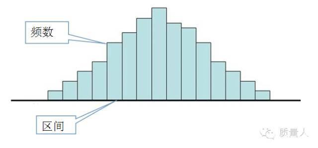
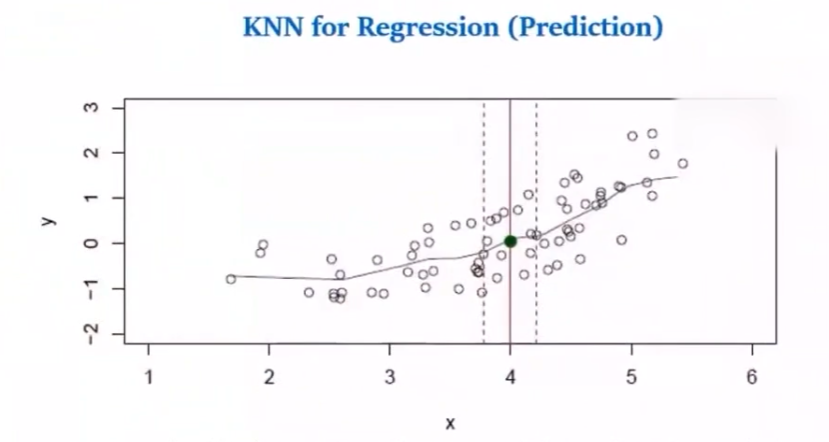
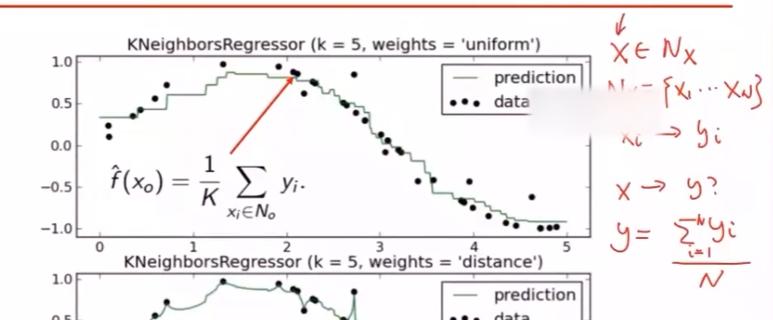
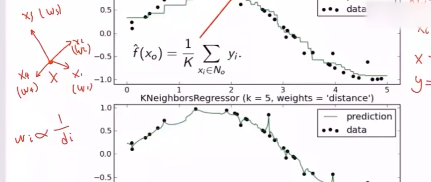

[TOC]

<!--more-->

> 有参数方法：假设参数 $\theta$ 在有限集中，预测自变量和数据集都独立
> $$
> P(x\vert \theta,\mathcal{D})=P(x\vert \theta)
> $$
>
> 有参数方法需要假设模型形式，非参数方法具有更少的模型假设
>
> 两种非参数方法：
>
> - 密度估计
> - K-NN

## 密度估计

从密度估计角度出发，参数估计方法假设待估计的概率密度函数形式是已知的，利用样本去估计参数的取值

参数估计不适用的情况：

- 对样本分布先验知识缺乏，无法给出概率密度的具体形式
- 样本很难用简单的函数描述

一种解决方案是非参数估计方法——由样本估计出概率函数

### 直方图估计方法与密度估计基本原理

#### 直方图估计方法(离散概率密度)

样本集$T=\{X_1,X_2,\cdots,X_N\},X_i\in \mathcal{X}\subseteq \mathbb{R}^d$ 

1. 将每个样本的每个分量在其取值范围内分为 $M$ 个等间距的小窗 $R$，可得到 $M^d$ 个小舱，假设小舱二维区间宽度为 $\Delta_i$，多维小舱容量为 $V$
2. 统计落入每个小区域的样本个数 $p_i$
3. 假设每个小区域的概率密度为常数，$\frac{p_i}{N\cdot V}$ 作为概率密度 $p(x)$ 的估计值

#### 基本思想

连续与离散的桥梁：用频率逼近概率

区间频率作为概率（区间概率密度的积分）

设样本集 $T=\{X_1,X_2,\cdots,X_N\}$ 空间内有小区域 $R$ ，某样本落入到小区域 $R$ 内的概率为 $P=\int_{R}p(x)dx$

其中，$P$ 作为 $p(x)$ 在 $R$ 上的一个平均估计值，$\frac{P}{\vert R\vert}=p_{R}(x),\vert R\vert=V$

设落在区域 $R$ 内的样本数服从二项分布，$k\sim B(N,P)$ ，$P\{X=k\}=C_N^kp^k(1-p)^{N-k}$ 

$k$ 的期望为 $E[k]$ ，当 $N\rightarrow \infty$ ，有 $k=E[k]=NP$

故可将 $P=\frac{k}{N}$ 作为其一个估计

当区域 $R$ 足够小时，概率密度函数 $p(x)$ 近似为常数，落在此区域中样本的概率为 $P=p(x)\cdot V$ ，故有 $p(x)\cdot V=\frac{k}{N}\Rightarrow p(x)=\frac{k}{V\cdot N}$

#### 对区域容量V的取定

过大，$p(x)$ 在区域内为一常数，导致过于平均的估计

过小，有些区域落入样本数过少或没有，导致对概率密度 $p(x)$ 的估计不连续，造成过拟合

---

条件：$\lim\limits_{N\rightarrow \infty}V_N=0$ ，$\lim\limits_{N\rightarrow \infty}k=\infty$ ，$\lim\limits_{N\rightarrow \infty}\frac{k_N}{N}=0$

样本数越多

- 区域越小越好
- 区域内样本数越多越好
- 区域内样本数不可无限增大

尽可能将区域划分密集

### 密度估计

两种思路：

- 固定容量V        区域内样本数K变化
- 固定样本数k    区域容量V变化

#### 固定容量V（连续概密，设p(x)连续）

（1）设样本 $X\in \mathbb{R}^d$ ，每个小区域是以X为中心的超立方体，其容量为 $V=h^d$

对于落入区域 $R$ 的样本数 $k$ ，做以下估计：

- 判断是否在 $R$ 的区域，通过核函数
  $$
  \kappa\left(\frac{X-X_n}{h}\right)=\begin{cases}
  1,&\bigg\vert\frac{X_n^{(i)}-X^{(i)}}{h}\bigg\vert\le \frac{1}{2},i=1,2,\cdots,d\\
  0,&其他
  \end{cases}
  $$
  若$X_n\in R$ ，则在维度 $\vert X_n^{(i)}-X_n^{(i)}\vert\le \frac{h}{2}$ 

- 落入R内的样本数
  $$
  K=\sum\limits_{i=1}^N\kappa\left(\frac{X-X_n}{h}\right)
  $$

故有概率密度估计 $p(x)=\frac{K}{V\cdot N}=\frac{1}{N\cdot h^d}\sum\limits_{i=1}^N\kappa\left(\frac{X-X_n}{h}\right)$

（2）采用高斯核

样本 $X\in \mathbb{R}^d$ ，每个小区域为以X为中心的高斯混合区域，每个样本 $X_j$ 落入 $R$ 的概率为
$$
R(X,X_j)=\frac{1}{\sqrt{(2\pi)^d}\vert \sum\vert^{\frac{1}{2}}}e^{-\frac{\Vert X-X_n\Vert^2}{2\sum}}
$$
其中，$\sum$ 为协方差矩阵

有概率密度估计
$$
p(x)=\frac{K}{V\cdot N}=\frac{1}{N\cdot h^d}\sum\limits_{i=1}^N\kappa\left(\frac{X-X_n}{h}\right)=\frac{1}{N\cdot h^d}\sum\limits_{i=1}^N\frac{1}{\sqrt{(2\pi)^d}}e^{-\frac{\Vert X-X_n\Vert^2}{2h^2}}
$$
（3）核函数条件
$$
\begin{cases}
\kappa(u)\ge 0&\kappa(X,X_i)\ge 0\\
\int \kappa(u)du=0&\int \kappa(X,X_i)dx=1
\end{cases}
$$

#### 固定样本数K

在求概率密度时，调整容量V，使区域R内恰含有K个样本，区域的概率密度为 $p(X)=\frac{K}{NV}$

假设区域R中 $C_k$ 类样本的个数为 $K_k$ 个，$C_k$ 类样本共  $N_k$ 个，则区域中，$C_k$ 类的样本概率密度为 $p(X\vert C_k)=\frac{K_k}{N_k\cdot V}$ 

在先验概率为 $p(c_k)=\frac{N_k}{N}$ 下

由贝叶斯公式，区域中一个点属于 $C_k$ 类的概率为 
$$
P(C_k\vert X)=\frac{P(X\vert C_k)p(C_k)}{P(X)}=\frac{\frac{K_k}{N_k\cdot V}\cdot \frac{N_k}{N}}{\frac{K}{NV}}=\frac{K_k}{K}
$$
故该点最后归属类别由 $C_k=\arg\max\limits_{k}P(C_k\vert X)$

K决定分类超平面光滑程度，K越大，越光滑（形成更少的分类区域）

### KNN

无参数有监督模型

目标：找到距预测点最近的K个点，投票选出类归属类别

#### 算法

输入：训练数据集 $T=\{(X_1,y_1),\cdots,(X_N,y_N)\},i=1,2,\cdots,N$ 

$X_i\in \mathcal{X}\subseteq \mathbb{R}^n,y_i\in y=\{C_1,C_2,\cdots,C_K\}$ 为样本归属类别

输出：实例 X 所属类别 y

步骤：

1. 根据选定的**距离度量**，在训练集中找到与X最近邻的K个点，涵盖这K个点的区域记为R
2. 在R中，根据**分类决策规则**，决定X所属的类别

模型策略：
$$
\begin{aligned}
\arg\limits_{C_k}\max p(C_k\vert X)&=\frac{K_k}{K}\\
&=\arg\limits_{C_k}\max\frac{\sum\limits_{X_i\in R}\mathbb{I}(y_i=C_k)}{K}\\
&\approx \arg\limits_{C_k}\max\sum\limits_{X_i\in R}\mathbb{I}(y_i=C_k)
\end{aligned}
$$

- 其中，$i=1,\cdots,K$ ，对K个点逐一判断并累加类别
- $k=1,\cdots,m$ 共m个类别，由于k是提前取定的，所以可以忽略

#### 三要素

K；距离度量；决策规则

##### K的取定

- K过大，无法分类，分类效果下降，计算量大
- K过小，易受噪音影响，模型变复杂，易发生过拟合

（1）用K折交叉验证取K值

将训练数据集分为K折，留一份作为验证集

取一个超参数 $K_1$ 时，在K-1折训练集上训练模型，并在验证集上训练模型，在验证集上测试，得到验证集上的准确率 $P_i$ 

将K这数据集分别作为验证集，重复K次，即可得到平均准确率 $P_{K_1}=\frac{\sum\limits_{i=1}^K p_i}{K}$ 为超参数 $K_i$ 的准确率

用同样的方法，对备选超参数 $K_j$ 作K折交叉验证，选择平均准确率 $P_{K_j}$ 最高的超参数作为K值

（2）K值一般取一个较小的值

##### 距离度量

对称性：$d(A,B)=d(B,A)$

自相似性：$d(A,A)=0$

正性分离：$d(A,B)=0$ if $A=B$

三角不等式：$d(A,B)\le d(A,C)+d(B,C)$

**欧式距离**
$$
d(X_i,X_j)=\left(\sum\limits_{k=1}^n\vert X_i^{(k)}-X_j^{(k)}\vert^2\right)^{\frac{1}{2}}
$$
**曼哈顿距离**
$$
d(X_i,X_j)=\sum\limits_{k=1}^n\vert X_i^{(k)}-X_j^{(k)}\vert
$$
**闵氏距离**
$$
d(X_i,X_j)=\left(\sum\limits_{k=1}^n\vert X_i^{(k)}-X_j^{(k)}\vert^p\right)^{\frac{1}{p}}
$$
$p=\infty$
$$
d(X_i,X_j)=\max\limits_{K}\vert X_i^{(k)}-X_j^{(k)}\vert
$$
**汉明距离**

度量二进制，表示两个二进制数间有多少位不同

按位异或，1的个数为汉明距

##### 分类决策规则

多数表决

损失函数：0-1
$$
\begin{aligned}
&P(y\neq f(X))=1-&P(y=f(X))\\
&分错点概率&分对点的概率
\end{aligned}
$$

$$
\frac{1}{K}\sum\limits_{X_i\in R}\mathbb{I}(y_i\neq C_j)=1-\frac{1}{K}\sum\limits_{X_i\in R}\mathbb{I}(y_i= C_j),i=1,\cdots,K
$$

经验风险最小 $\iff$ 误分类率最小

#### KNN用于预测

分类问题，$y$ 为离散值，找目标点 $X'$ 最近的K个点，取均值

计算算术均值，前提是假设各点对决策的贡献相等

计算加权平均，将各点权重(各个点到目标点的距离不同)考虑进决策

