[TOC]

<!--more-->

## 原理

### 全概率公式

全概率公式：假设事件的发生受某一隐含变量的影响，可通过贝叶斯推断建立模型

- 若推测 $X$ 与 $Z$ 之间存在隐含关系，则存在似然概率 $P(X\vert Z)$

- 假设 $Z$ 服从某种先验分布，则可以通过关闭数据用和初始参数推断出先验概率 $P(Z)$
  $$
  P(X)=P(X_1,X_2,\cdots,X_N)=\prod\limits_{j=1}^N P(X_j)，满足i\neq j 时，X_j\perp X_i
  $$

### 贝叶斯

**频率派**：从统计意义上，表示事件发生的可能性

**贝叶斯派**：概率为通过经验对时间的不确定性进行度量，表示对事件的信任程度
$$
\begin{aligned}
\underbrace{P(A\vert B)}_{后验概率}\propto \overbrace{P(B\vert A)}^{似然概率} \underbrace{P(A)}_{先验概率}
\end{aligned}
$$
即使一个事件的先验概率很大，若似然概率很小，则后验概率也可能很小

>对于数据集 $D\{(X_1,y_1),(X_2,y_2),\cdots,(X_N,y_N)\}$ ，且满足$f(X_i)\rightarrow y_i$，估计后验概率 $P(y\vert X)$ 
>
>- 似然概率 $L(\mu;\sigma)=\prod\limits_{i=1}^N P(X_i\vert \mu,\sigma)\Rightarrow \sum\limits_{i=1}^N \log P(X_i\vert \mu,\sigma)$ 
>
>则有，
>$$
>\begin{aligned}
>P(y\vert X)&=\frac{P(X\vert y)P(y)}{P(X)}\\
>&=\frac{\left[\prod\limits_{j=1}^NP(X_j\vert y_j)\right]\cdot P(y_i)}{P(X)}\\
>&\propto \left[\prod\limits_{j=1}^NP(X_j\vert y_j)\right]\cdot P(y_j)
>\end{aligned}
>$$

### 通过贝叶斯推断隐变量与概率分布的关系

二项分布
$$
P(H)=\frac{\sum_i(X_i=H)}{N}，X\in \{H,T\}\iff X\in \{0,1\}\\
P(X)=\theta^X(1-\theta)^{1-X}\Rightarrow \begin{cases}
P(X=0)=1-\theta\\
P(X=1)=\theta
\end{cases}
$$
$\theta$ 表示正面为1的概率大小

多次投掷硬币为N重伯努利实验
$$
P(X)=\left(\begin{matrix}N\\K\end{matrix}\right)\theta^K(1-\theta)^{N-K}
$$
N重伯努利实验结果
$$
Y=\left(y_1,y_2,\cdots,y_N\right),y_i\in\{0,1\}\\
P(y)=\frac{\sum\limits_{i=1}^N\mathbb{I}(y_i=1)}{N}
$$

### 混合伯努利模型

假设结果与某一隐变量有关，每次结果出现两种输出 $Z=\{0,1\}$ 

参数模型：
$$
\begin{aligned}
P(y\vert \theta)&=\sum_z P(y,z\vert \theta)\leftarrow P(y)=\sum_zP(y,z)\\
&\xlongequal{条件概率}\sum_zP(y\vert z,\theta)P(z\vert \theta)
\end{aligned}，\theta=(\pi,p,q)
$$
z为控制y发生的隐变量
$$
P(z\vert \theta)=P(z\vert (\pi,p,q))\\
\begin{cases}
P(z=1\vert \theta)=\pi\\
P(z=0\vert \theta)=1-\pi
\end{cases}
$$

> 由于：
> $$
> \sum_zP(y\vert z,\theta)=P(y\vert z=1,\theta)+P(y\vert z=0,\theta)\\
> \begin{cases}
> P(y\vert z=1,\theta)=p^y(1-p)^{1-y}\\
> P(y\vert z=0,\theta)=q^y(1-q)^{1-y}
> \end{cases}
> $$

$$
\begin{cases}
z=1 &\Rightarrow P(y\vert \theta)=&\pi P^y(1-p)^{1-y}+\\
z=0 &\Rightarrow &(1-\pi)q^y(1-q)^{1-y}
\end{cases}
$$

$$
Y=\left(y_1,y_2,\cdots,y_N\right)
$$

$$
\begin{aligned}
P(Y\vert \theta)&=\prod\limits_{i=1}^N P(y_i\vert \theta)\\
&=\prod\limits_{i=1}^N\pi p^{y_i}(1-p)^{1-y_i}+(1-\pi)q^{y_i}(1-q)^{1-y_i}\\
&=\sum\limits_{i=1}^N\log P(y_i\vert \theta)
\end{aligned}
$$

上述为二模态混合模型，每次实验常数权重 $\pi$ 选择实验结果的概密

---

对于多模态混合模型，每次实验都有各自的权重/概密

**对于每一次的结果，需要了解由哪部分概密得出，才可以对三个参数进行估计**

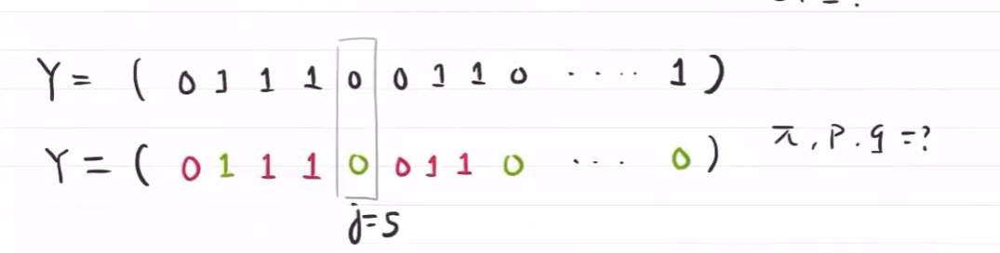

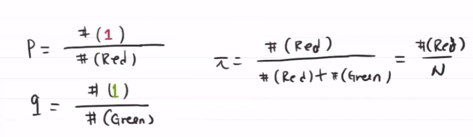

#### E step

对每个隐含状态，估计每种结果来源概密的权重

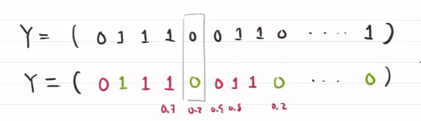

用参数 $\mu$ 估计每个数据的来源概密 $Q(z_i)=P(z_i\vert x_i,\theta)$ 
$$
\begin{aligned}
(\pi,p,q)\rightarrow \mu_j&=\frac{\pi p^{y_j}(1-p)^{1-y_j}}{P(y\vert \theta)}\\
&=\frac{\pi p^{y_j}(1-p)^{1-y_i}}{\pi p^{y_j}(1-p)^{1-y_j}+(1-\pi)q^{y_j}(1-q)^{1-y_j}}
\end{aligned}
$$
表示第j个数据，多大概率由 $Q(z_i)$ 概密得出

#### M step

在给定权重的条件下，求参数的极大似然值

对参数 $\pi$ 估计

随机给定初始值 $(\pi_0,p_0,q_0)$ ，再根据初始值计算 $\mu_j$ ，根据来源密度估计 $p,q$ 

$P=\frac{P概密中1的结果份数}{P概密中的所有结果份数}$ 
$$
\begin{cases}
\pi=\frac{1}{N}\sum\limits_{j=1}^N \mu_j\\
p=\frac{\sum\limits_{j=1}^N\mu_j y_j}{\sum\limits_{j=1}^N \mu_j}\\
q=\frac{\sum\limits_{j=1}^N(1-\mu_j)y_j}{\sum\limits_{j=1}^N (1-\mu_j)}
\end{cases}
$$

### 二项伯努利混合模型

1. 给参数赋随机值 
   $$
   \theta^{(0)}=(\pi^{(0)},p^{(0)},q^{(0)})
   $$

2. E step：求在给定隐含变量值前提下的，事件发生的期望，根据初始值估计来源概密
   $$
   \mu_j^{(t+1)}=\frac{\pi^{(t)}p^{(t)}_{y_j}(1-p^{(t)}_{y_j})^{1-y_{j}}}{\pi^{(t)}p^{(t)}_{y_j}(1-p^{(t)}_{y_j})^{1-y_{j}}+(1-\pi^{(t)})q^{(t)}_{y_j}(1-q^{(t)}_{y_j})^{1-y_{j}}}
   $$

3. M step：求参数最大化，估计参数
   $$
   \begin{cases}
   \pi^{(t+1)}=\frac{1}{N}\sum\limits_{j=1}^N \mu_j^{(t+1)}\\
   p^{(t+1)}=\frac{\sum\limits_{j=1}^N\mu_j^{(t+1)} y_j}{\sum\limits_{j=1}^N \mu_j^{(t+1)}}\\
   q^{(t+1)}=\frac{\sum\limits_{j=1}^N(1-\mu_j^{(t+1)})y_j}{\sum\limits_{j=1}^N (1-\mu_j^{(t+1)})}
   \end{cases}
   $$

4. 迭代，直至参数稳定

EM 算法 期望最大化算法

### Jensen不等式

函数的期望与期望的函数大小关系

对于凸函数，函数值小于均值，故期望的函数值比较小，即函数的期望大于期望的函数

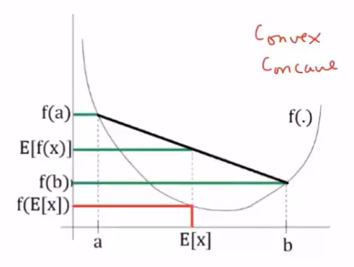

线性函数为期望函数，凸函数为f(x)

对于凹函数，$E[f(x)]\le f(E[X])$

## EM算法

1. 计算完全数据的对数似然期望
2. 最大化期望

目标：在假设参数 $\theta^{(j)}$ 的前提下，使不完全数据发生的期望最大化
$$
\arg\limits_{\theta}\max L(\theta)=\arg\limits_{\theta}\max P(X\vert \theta) \iff \arg\limits_{\theta}\max \log L(\theta)=\arg\limits_{\theta}\max \log P(X\vert \theta)
$$
在已知 $X$ 与隐变量 $Z$ 相关的前提下
$$
\begin{aligned}
P(X\vert \theta)&=\sum_i P(X_i,Z\vert \theta)=\sum_i\sum_{Z_i} P(X_i,Z_i\vert \theta)\\
&=\sum_i\left(\int_{Z_i} P(X_i,Z_i\vert \theta)dZ\right)
\end{aligned}
$$

- $X$ ：观测数据，不完全数据
- $Z$ ：隐变量
- $\theta$ ：模型的参数

### E step

假设参数初始值 $\theta^{(0)}$ ，不完全数据发生的期望 $\propto$ 完全数据的对数期望

1. 在参数 $\theta^{(j)}$ 与观测数据 $X$ 下，找到隐变量的条件概率 $P(Z\vert X,\theta^{(j)})$ 

   在有结果时，哪个模型得到的概率可计算

2. 得到X,Z联合概率 $P(X,Z\vert \theta^{(j)})$ 

3. 似然概率与隐变量的关系

$$
P(X\vert \theta^{(j)})=\sum_{i}\sum_{Z_i}P(X_i,Z_i\vert \theta^{(j)})=\sum_{i}\sum_{Z_i}\frac{P(X_i,Z_i\vert \theta^{(j)})}{P(Z_i\vert X_i,\theta^{(j)})}\cdot P(Z_i\vert X_i,\theta^{(j)})
$$

由于 $P(Z_i\vert X_i,\theta^{(j)})$ 确定，故似然概率正比于
$$
\begin{aligned}
&P(X_i\vert \theta^{(j)})\propto \sum_{Z_i} P(X_i,Z_i\vert \theta^{(j)}) \cdot P(Z_i\vert X_i,\theta^{(j)})\\
\Rightarrow &\log P(X_i\vert \theta^{(j)})\propto \log \left(\underbrace{\sum_{Z_i} P(Z_i\vert X_i,\theta^{(j)})}_{E_{Z\vert X_i,\theta^{(j)}}} \cdot  P(X_i,Z_i\vert \theta^{(j)})\right)\iff \log E_{Z\vert X_i,\theta^{(j)}}\left[P(X_i,Z\vert \theta^{(j)})\right]\\
\Rightarrow & (Jensen不等式)\ge E_{Z\vert X_i,\theta^{(j)}}\left[\log \left(P(X_i,Z\vert \theta^{(j)})\right)\right]
\end{aligned}
$$

### M step

最大化完全数据的对数期望 $\iff$ 最大化似然概率
$$
\begin{aligned}
\theta^{(j+1)}=\arg\limits_{\theta^{(j)}}\max L(\theta)&=\arg\limits_{\theta^{(j)}}\max P(X\vert \theta^{(j)})\\
&=\arg\limits_{\theta^{(j)}}\max \sum_iE_{Z\vert X_i,\theta^{(j)}}\left[\log \left(P(X_i,Z\vert \theta^{(j)})\right)\right]
\end{aligned}
$$
进一步泛化，假设每个数据来源概密的权重 $Z_{i}$ 服从 $Q(Z_{i})$ 分布，$ Q(Z_{i})$ 表示 $Z_{i}$ 服从的概率分布，$\sum_{Z_{i}} Q(Z_{i})f(Z_{i})=E_Z[f(Z_{i})]$ ：在给定观测数据 $X$ 与当前参数值 $\theta^{(j)}$ 前提下，对隐变量 $Z$ 的条件概率的期望 $\Rightarrow$ 完全数据的对数期望

完成一次参数迭代 $\theta^{(j)}\rightarrow \theta^{(j+1)}$ ，似然函数会增大或达到局部最大

### 一些特性

>当数据均匀分布时，期望最大
>
>即 $\frac{P(X_1,Z_1\vert \theta^{(j)})}{P(Z_1\vert X_1,\theta^{(j)})}=\frac{P(X_2,Z_2\vert \theta^{(j)})}{P(Z_2\vert X_2,\theta^{(j)})}=\cdots=\frac{P(X_N,Z_N\vert \theta^{(j)})}{P(Z_N\vert X_N,\theta^{(j)})}$ 

> 在已知 $\sum_ZQ_i(Z_i)=1$ 的前提下，可假设Z的分布
> $$
> Q_i(Z_i)=\frac{P(X_i,Z_i\
> \vert \theta)}{\sum_ZQ_i(Z_i)}=\frac{P(X_i,Z_i\
> \vert \theta)}{\sum_ZP(X_i,Z\vert \theta)}=\frac{P(X_i,Z_i\vert \theta)}{P(X_i\vert \theta)}=P(Z_i\vert X_i,\theta)
> $$
> E step：对于每个i，
> $$
> Q_i(Z_i)=P(Z_i\vert X_i,\theta)
> $$
> M step：
> $$
> \theta=\arg\limits_{\theta}\max\sum\limits_{i}\sum_{Z_i}Q_i(Z_i)\log \frac{P(X_i,Z_i\vert \theta)}{Q_i(Z_i)}
> $$
> 给定Z时，每个部分的最优值
>
> E-step
> $$
> w_i^{(j)}=P(Z_i=j\vert X_i,\phi,\mu,\sum)
> $$
> M-step：
> $$
> \phi^{(j)}=\frac{1}{m}\sum\limits_{i=1}^mw_i^{(j)}\\
> \mu^{(j)}=\frac{\sum\limits_{i}^mw_i^{(j)}X_i}{\sum\limits_{i}^mw_i^{(j)}}\\
> \sum^{(j)}=\frac{\sum_{i=1}^m w^{(j)}_i\left(X_i-\mu^{(j)}\right)\left(X_i-\mu^{(j)}\right)^T}{\sum_{i=1}^m}w_i^{(j)}
> $$

## 基于高斯混合模型的EM算法

### 高斯混合模型

K个高斯 $\mathcal{N}(\mu_1,\sigma^2_1),\mathcal{N}(\mu_2,\sigma^2_2),\cdots,\mathcal{N}(\mu_K,\sigma^2_K)$ ，混合权重为 $\alpha_1,\cdots,\alpha_K$ （表示来源于各高斯模型的样本比例），且 $\sum\alpha_i=1$ 

若已知 $\alpha_i$ 且样本属于哪个 $\mathcal{N}$ 已知，则可用样本与参数得到模型的参数

**实际问题** ：只有观测数据 $X_1,\cdots,X_N$ ，$Z$：隐变量，样本归属的高斯混合模型

**建模**：
$$
P(X\vert \theta)=\sum\limits_{k=1}^K\alpha_k \mathcal{N}(\mu_k,\sigma_k^2)
$$
其中，$\theta=\{\mu_1,\sigma_1;\mu_2,\sigma_2;\cdots,\mu_N,\sigma_N\}$ ，第 $k$ 个模型的概率密度为 $Q(X)=\frac{1}{\sqrt{2\pi} \sigma_k}e^{-\frac{(X-\mu_k)^2}{2\sigma_k^2}}$

隐变量 $Z_{i1},Z_{i2},\cdots,Z_{iK}$ 控制第 $i$ 个观测数据 $X_i$ 的高斯混合系数
$$
Z_{i1}=\begin{cases}
1&,来自\mathcal{N}(\mu_1,\sigma^2_1)\\
0&,其他
\end{cases}，Z_{i2}=\begin{cases}
1&,来自\mathcal{N}(\mu_2,\sigma^2_2)\\
0&,其他
\end{cases}，\cdots Z_{iK}=\begin{cases}
1&,来自\mathcal{N}(\mu_K,\sigma^2_K)\\
0&,其他
\end{cases}
$$
因此，隐变量矩阵
$$
Z=\begin{bmatrix}
z_{11}&z_{12}&\cdots&z_{1K}\\
z_{21}&z_{22}&\cdots&z_{2K}\\
\vdots&\vdots&\ddots&\vdots\\
z_{N1}&z_{N2}&\cdots&z_{NK}
\end{bmatrix}
$$
参数为 $\theta=(\alpha_1,\mu_1,\sigma_1;\alpha_2,\mu_2,\sigma_2;\cdots;\alpha_K,\mu_K,\sigma_K)$ 

联合概率分布
$$
\begin{aligned}
P(X_1,\cdots,X_N,Z\vert \theta)&=\prod\limits_{j=1}^NP(X_j,z_{j1},z_{j2},\cdots,z_{jK}\vert \theta)\\
&=\prod\limits_{j=1}^N\prod\limits_{k=1}^K\left[\alpha_k \mathcal{N}(\mu_k,\sigma^2_k)\right]^{z_{jk}}\\
&=\prod\limits_{j=1}^N\prod\limits_{k=1}^K\alpha_k^{z_{jk}}\left[\mathcal{N}(\mu_k,\sigma^2_k)\right]^{z_{jk}}\\
&=\prod\limits_{j=1}^N\prod\limits_{k=1}^K\alpha_k^{z_{jk}}\left[\phi(X_j\vert \theta_k)\right]^{z_{jk}}\\
&=\prod\limits_{k=1}^K\alpha_k^{\sum\limits_{k=1}^Kz_{jk}}\prod\limits_{j=1}^N\left[\phi(X_j\vert \theta_k)\right]^{z_{jk}}
\end{aligned}
$$
似然概率
$$
L(\theta)=P(X_1,\cdots,X_N,Z\vert \theta)=\prod\limits_{k=1}^K\alpha_k^{\sum\limits_{j=1}^Nz_{jk}}\prod\limits_{j=1}^N\left[\phi(X_j\vert \theta_k)\right]^{z_{jk}}\\
\ln L(\theta)=\sum\limits_{k=1}^K\left\{\ln\alpha_k^{n_k}+\sum\limits_{j=1}^N\ln\left[\phi(X_j\vert \theta_k)\right]^{z_{jk}}\right\}\\
=\sum\limits_{k=1}^K\left\{n_k\ln\alpha_k+\sum\limits_{j=1}^Nz_{jk}\ln\left[\phi(X_j\vert \theta_k)\right]\right\}
$$
对隐变量求期望
$$
\begin{aligned}
\hat{z}_{jk}&=E[z_{jk}\vert X,\theta^{(i)}]\\
&=1\cdot P(z_{jk}=1\vert X_{j,\theta^{(i)}})+0\cdot P(z_{jk}=0\vert X_{j,\theta^{(i)}})\\
&=P(z_{jk}=1\vert X_{j},\theta^{(i)})\\
&=\frac{P(z_{jk}=1,X_j,\theta^{(i)})}{P(X_j,\theta^{(i)})}\\
&=\frac{P(X_j\vert z_{jk}=1,\theta^{(i)})\cdot P(z_{jk}=1\vert \theta^{(i)})}{\sum\limits_{k=1}^KP(X_j\vert z_{jk},\theta^{(i)})\cdot P(z_{jk}=1\vert \theta^{(i)})}\\
&=\frac{\phi(X_j\vert z_{jk},\mu_i,\sigma_i^2)\cdot \alpha_i^k}{\sum\limits_{k=1}^K\phi()\cdot \alpha_i^k}
\end{aligned}
$$
$\hat{n}_k=\sum\limits_{j=1}^N\hat{z}_{jk}$

**E-step**

1. 在已知 $\theta^{(i)}$ 的前提下，对隐变量 $\hat{z}_{jk},\hat{n}_k$ 求期望

2. 找到M-step的目标函数
   $$
   Q(\theta,\theta^{(i)})=\sum\limits_{k=1}^K\left\{\hat{n}_k \ln\alpha_k+\sum\limits_{j=1}^N\hat{z}_{jk}\ln \phi(y_j\vert \mu_k,\sigma_k^2)\right\}\quad, s.t.\sum\limits_{k=1}^K\alpha_k=1
   $$

## EM收敛性

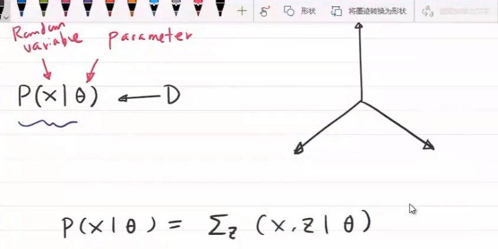

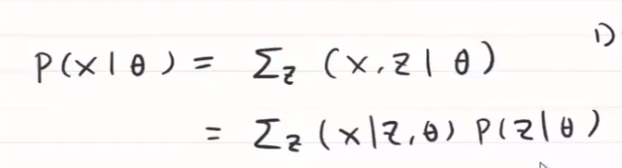

t表示迭代

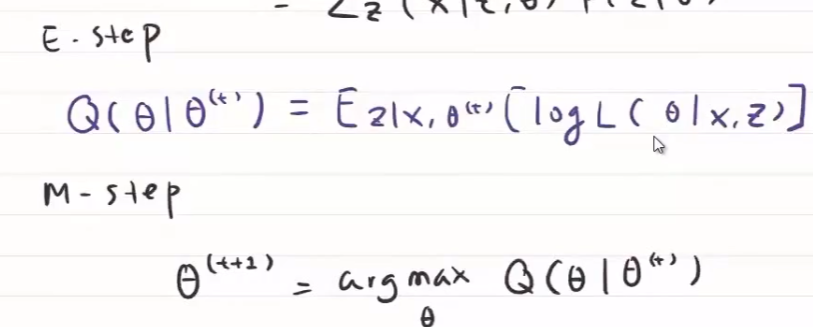

- z服从什么分布时，E最大

不断调整 \theta ，使似然概率最大

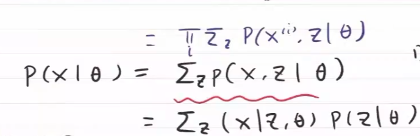

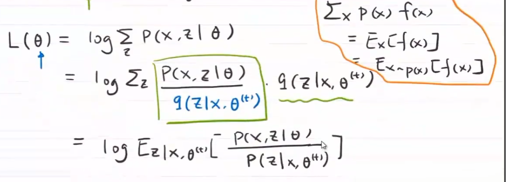

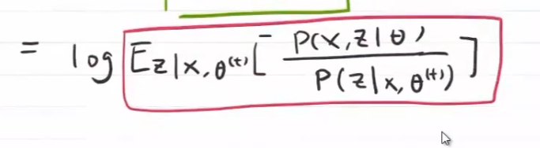

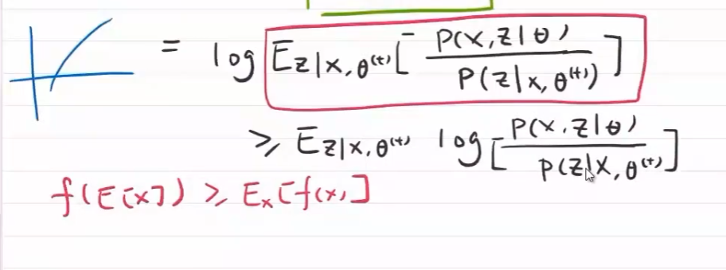

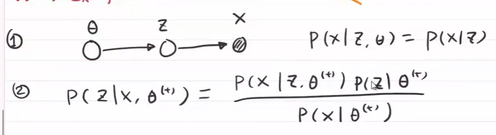

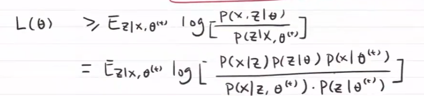

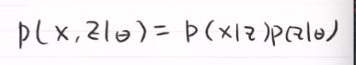

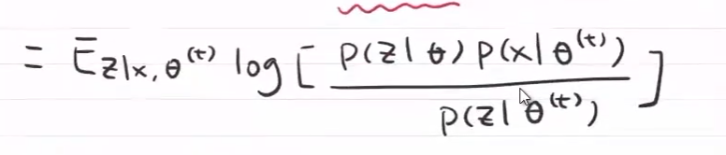

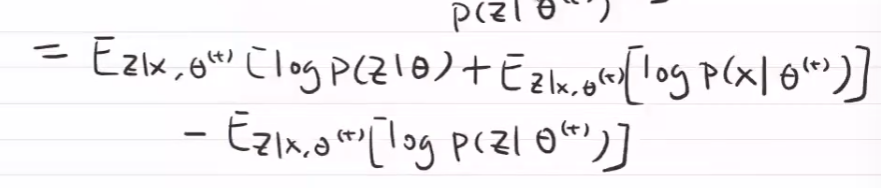

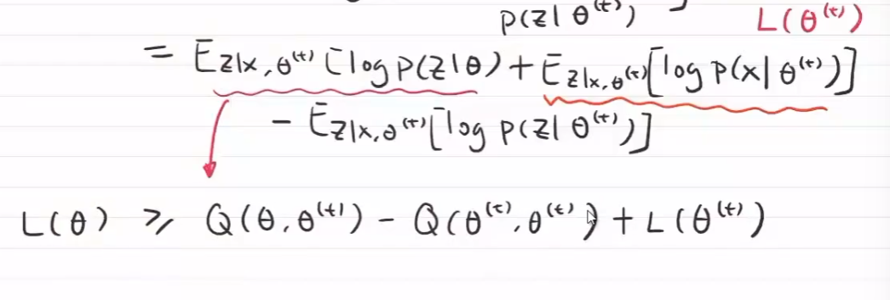

后俩项，在参数给定时是一个常数，$Q(\theta,\theta^{(t)})$ ，\theta可以根据上一时刻的值进行调整，使Q()变大，使L(\theta)上升和提高

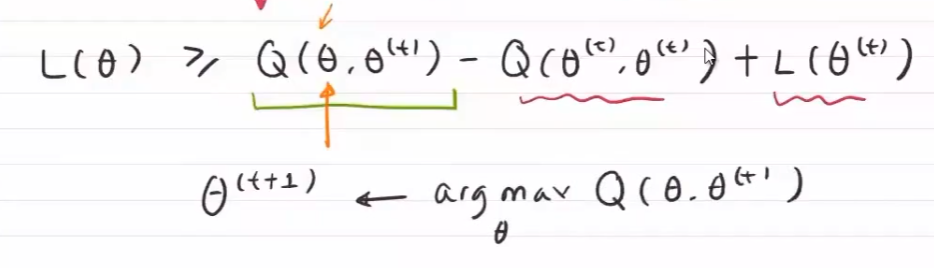

使Q的极大似然值最大时的 $\theta$ 为下一时刻的 $\theta$

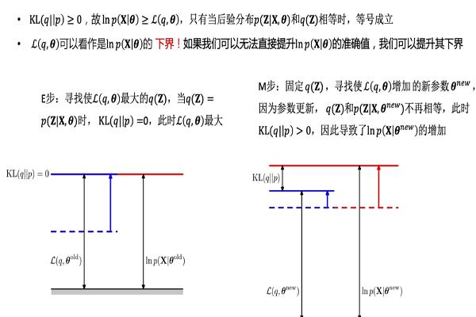

EM算法用来解决观测数据不完全时，对模型的参数估计问题。

目标是在给定参数 $\theta^{old}$ 和观测数据 $X$ 给定下，使非完全数据的对数似然函数 $lnP(X\vert \theta^{old})$ 取最大值

$Q(q,\theta^{old})= E_{Z\vert X,\theta^{old}}[lnP(X,Z\vert \theta^{old})]$ 即完全数据的对数似然函数，关于“隐变量Z的条件概率分布 $P(Z\vert \theta^{old},X)$” 的期望。由 $KL(q||p)\ge 0\Rightarrow lnP(X\vert \theta)\ge Q(q,\theta)$，可用 $Q(q,\theta^{old})$ 作为非完全数据对数似然函数 $lnP(X\vert \theta^{old})$ 的下界

**E step** 

在固定参数 $\theta^{old}$ 和已知观测数据 $X$ 条件下，找出使完全数据对数似然函数的期望 $Q(q,\theta^{old})$ 的最大的隐变量 $Z$ 的条件概率分布 $q(Z)=\mathop{max}\limits_{z}\{P(Z\vert X,\theta^{old})\}$ ，此时 $KL(q||p)=0$ 

**M step**

在固定 $q(Z)$ 时，调节参数 $\theta$ ，最大化 $Q(q,\theta^{new})$ ，即完全数据的似然函数，关于 “给定参数 $\theta^{old}$ 和观测数据 $X$ 的条件下，隐变量Z的条件概率分布 $P(Z\vert \theta^{old},X)$ ”的期望最大化。由于参数的更新，$q(Z)$ 与 $P(Z\vert X,\theta^{new})$ 不在相等，即 $KL(q||p)>0$ ，导致了非完全数据对数似然函数 $P(X\vert \theta^{new})$ 增大

