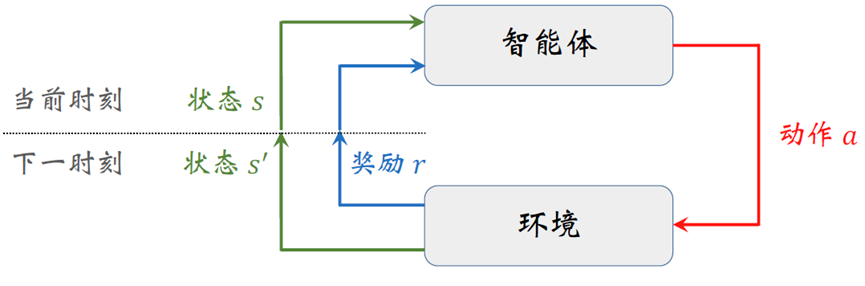

[TOC]

<!--more-->

在智能体与环境的第 $t$ 轮交互中，智能体基于状态 $s_t$ 产生动作 $a_t$ ，环境反馈状态迁移 $s_{t+1}$ 与奖励 $r_{t+1}$ （只有在 $t+1$ 时刻才能知道采取动作 $a_t$ 的好坏），因此 $r_{t+1}=R(s,a)$ 或 $r_{t+1}=R(s_t)$ 
## 智能体

RL 的学习任务是一个 MDP（马尔科夫决策过程），这是一个序列决策问题，与序列预测问题的区别在于：动作 $a$ 会影响状态 $s$ 的分布，即 RL 的数据分布在整个学习过程中随着策略的调整会一直变化。

所以 RL 智能体的学习过程本质上是训练一个能满足学习目标的数据分布生成策略

## 环境

确定性环境：$P(s_{t+1},r_{t+1}\vert s_t,a_t)$ 是已知的，等价于 **状态数有限且离散**。
- 对于确定性环境中的序列决策任务，可以使用 MPC （模型预测控制，控制论）或者有模型的 RL（MBRL）

随机环境：即使在不同时刻 $<s_t,a_t,s_{t+1}>$ ， $<s_{t'},a_{t'},s_{t'+1}>$ 有 $s_t=s_{t'},a_t=a_{t'},s_{t+1}=s_{t'+1}$ ，得到的 $r_{t+1}$ 也是随机的，即 $r_{t+1}$ 可能不等于 $r_{t'+1}$ 

再加上可能发生状态漂移，即 $s_{t}\xrightarrow{a_{t}}\begin{cases}s_{i1}\\s_{i2}\\\vdots\end{cases}$ 

对于 Ceph 的调参是一个随机环境，且状态数是无穷的。所以最直观的想法是用无模型的强化学习

## RL 的学习目标

找一个最优策略，决定状态 $s$ 下采取的动作 $a$ ，使得 **未来的累积奖励** 最大化

- 策略：确定性策略：$a=\mu(s)$ ；随机策略：$\pi(a\vert s)\in [0,1],a\in \mathcal{A}(s)$ 
- 最优策略：最优确定性策略：$a^*=\arg\max\limits_{a}Q(s,a)$ ；最优随机策略：$\sum\limits_{a^*}\pi(a^*\vert s)=1$ 
### Bellman 期望方程——衡量未来累积奖励大小

**轨迹**：轨迹由策略 $\pi$ 生成
-  $<s_t,a_t,r_{t+1},s_{t+1},a_{t+1},r_{t+2},s_{t+2},a_{t+2},r_{t+3},\cdots>$  
- $<s_t,a_{t}^{'},r_{t+1}^{'},s^{'}_{t+1},a_{t+1}^{'},r_{t+2}^{'},s^{'}_{t+2},a_{t+2}^{'},r_{t+2}^{'},\cdots>$  

**回报**：状态 $s_t$ 下，
- 采取动作 $a_t$ 的回报为 $G_{t}=r_{t+1}+\gamma r_{t+2}+\gamma^2 r_{t+3}+\cdots$ 
- 采取动作 $a_t^{'}$ 的回报为 $G_{t}^{'}=r_{t+1}^{'}+\gamma r_{t+2}^{'}+\gamma^2 r_{t+3}^{'}+\cdots$

**价值**：由于是随机环境，$r_{t+1}$ 不固定，动作未来累积奖励用期望表示称为价值
$$
\begin{aligned}
Q_{\pi}(s_t,a_t)&=E[G_t\vert s_t,a_t]=E[r_{t+1}+\gamma r_{t+2}+\gamma^2 r_{t+3}+\cdots]\\
&=E[r_{t+1}\vert s_{t},a_{t}]+\gamma E[ r_{t+2}+\gamma r_{t+3}+\cdots]\\
&=R(s_t,a_t)+\gamma E[G_{t+2}\vert s_t,a_t]\\
&=E[R(s_t,a_t)+\gamma G_{t+2}\vert s_t,a_t]\\
&\xlongequal{全概率展开可证}E[R(s_t,a_t)+\gamma Q_{\pi}(s_{t+1},a_{t+1})\vert s_t,a_t]
\end{aligned}
$$
- 基于策略 $\pi$ ，在一个状态 $s_t$ 下采取某个动作 $a_{t}$ ，其动作价值 $Q_{\pi}(s_t,a_t)$（未来获取累积奖励的期望）是确定唯一的

- 同一状态下不同动作，仍基于策略 $\pi$ 产生后续的轨迹，则可知动作 $a_{t}^{'}$ 在策略 $\pi$ 下的动作价值 $Q_{\pi}(s_t,a_t^{'})$  
即 **动作价值衡量同一策略下不同动作的好坏** 

**策略**：决定一个状态下采取每个动作的概率

- 为评价策略的好坏，引入状态价值

$$
\begin{aligned}
V_{\pi}(s_t)&=E\left[R(s_t)+\gamma V_{\pi}(s^{'}_t)\right]\\
&=\sum\limits_{a\in \mathcal{A}(s)} \pi(a\vert s_t)Q_{\pi}(s_t,a)
\end{aligned}
$$
策略越好，未来累积奖励越大，同一个状态的状态价值越大

**最优策略的存在性 $\iff$ 最优状态价值的存在性** ，需要证明是否存在 $V_{\pi^*}^*(s)\ge V_{\pi\in \Pi}(s),s\in \mathcal{S}$

### Bellman Optimality Equation——最优状态价值存在且唯一

**一定有一个确定性最优策略能得到最优的状态价值**

策略提升/状态价值提升定理：

$a^*=\arg\max\limits_{a} Q_{\pi}(s,a)$ ，对于策略改进，$\begin{cases}确定性策略:a^*=\pi^{'}(s)\\随机性策略:\pi^{'}(a\vert s)\end{cases},对于最优策略\sum\pi(a^*\vert s)=1$ 

使得 $V_{\pi^{'}}(s)\ge V_{\pi}(s)$ ，在状态 $s$ 下用改进后的策略 $\pi^{'}$ 采取动作，其他状态仍采用策略 $\pi$

由贝尔曼动作/状态期望方程

$$
V_{\pi}(s)=\sum\limits_{a\in \mathcal{A}(s)}\pi(a\vert s)\left(R(s,a)+\gamma \sum\limits_{s'\in \mathcal{S}}P(s'\vert s)V_{\pi}(s')\right)
$$

$s'$ 的策略更新为 $\pi'$ $\rightarrow$ $V_{\pi'}(s')$ 变化 $\rightarrow$ 以 $s'$ 为下一状态的 $s$ 的状态价值 $V_{\pi}(s)$ 也会发生改变

$V_{\pi'}(s)$ 的更新后，由贝尔曼方程 $Q_{\pi}(s^-,a)=R(s^-,a)+\gamma\sum\limits_{s\in\mathcal{S}}P(s\vert s^-,a)V_{\pi}(s)$ 
再为每个 $s^-$ 的取 $\arg\max$ 操作，更新 $\pi(a\vert s^-)$
若迭代之后，有 $\pi'(a\vert s)=\pi(a\vert s)\iff V_{\pi}(s)=V_{\pi'}(s)$ ，则认为策略收敛

在最优策略下 $V_{\pi^*}(s)=\max\limits_{a\in \mathcal{A}(s)}Q_{\pi^*}(s,a)$ ——贝尔曼最优方程
**一个状态下的最优状态价值等于该状态下的最优动作价值**
$$
\begin{aligned}
V^*(s)&=\max Q^*(s,a)\\
&=\max\left(R(s,a)+\gamma \sum\limits_{s'\in \mathcal{S}}P(s'\vert s)V_{\pi}(s')\right)
\end{aligned}
$$
### 最优价值存在且唯一证明

BOE 是一个收缩映射，满足收缩映射定理，所以存在唯一解，且这个唯一解可通过迭代求解

可将 BOE 的解代入贝尔曼方程，验证得 BOE 的迭代收敛解是最优的状态价值 $V^*(s)$

BOE 迭代收敛到最优状态价值的过程 $V^*(s)$

$V^{(t+1)}=f(V^{(t)})=\max\left(R_{\pi}+\gamma P_{\pi}V^{(t)}\right)$ 

迭代至价值停止更新，可得最优状态价值

$V_{\pi^*}(s)=\max\limits_{a\in \mathcal{A}(s)}Q_{\pi^*}(s,a)$ ，一个状态下的最优状态价值是该状态下的最大动作价值

#### 价值求解算法

**价值迭代算法** ：

$\begin{cases} V^{(0)}(s), V^{(t)}(s)\rightarrow Q^{(t)}(s, a_i), a_i\in \mathcal{A}(s)\rightarrow V^{(t+1)}=\max \limits_{a\in \mathcal{A}(s)}Q^{(t)}(s,a)\rightarrow \cdots \rightarrow Q^*(s, a)&, s\in \mathcal{S}, a\in \mathcal{A}(s)\\\pi^*(s)=\arg\max\limits_{a\in \mathcal{A}(s)}Q^*(s,a)&,s\in \mathcal{S} \end{cases}$

价值迭代算法使用收缩映射定理求解 BOE

$$
\begin{array}{ll}
\hline
&价值迭代算法:\\
\hline
&初始化：令 t=0 ，对所有状态 s ，V^{(0)}(s)=0\\
&对于第 t 轮迭代,t=0,1,\cdots,:\\
&\quad 对于状态s\in \mathcal{S}:\\
&\qquad 计算状态s下，每个动作的动作价值 Q^{(t)}(s,a)\\
&\qquad 更新状态 s下的状态价值:V^{(t+1)}(s)=\max\limits_{a\in\mathcal{A}(s)}Q^{(t)}(s,a)\\
&\qquad 更新状态价值的最大变化量 \max\Delta(s)=\max\{V^{(t+1)}(s)-V^{(t)}(s),\max\Delta(s)\}\\
&\qquad 更新状态s相邻的状态 s^-，s^-\xrightarrow{a^-}s\\
&\quad 若\max\Delta(s)\le\theta，则价值迭代收敛，此时t=H\\
&\qquad 求解最优策略:\\
&\qquad \quad \pi^*(s)=\arg\max\limits_{a\in \mathcal{A}(s)}Q^{(H+1)}(s,a),s\in \mathcal{S}\\
&\qquad \quad 或\sum\pi^*(a^*\vert s)=1\\
&\quad 否则，令t=t+1，继续迭代\\
\hline
\end{array}
$$

在求解最优策略之前，实质上是多个策略评估过程，但由于次优策略并不关键，所以只在策略评估完成后求解最优策略

**策略迭代算法**

$\pi^{(0)}\xrightarrow{PE}V_{\pi^{(0)}}(s)\xrightarrow{PI}\pi^{(1)}\xrightarrow{PE}V_{\pi^{(1)}}(s)\rightarrow\cdots$ 

$$
\begin{array}{ll}
\hline
&策略迭代算法:\\
\hline
&初始化:随机初始化\pi^{(0)}\\
&当策略未收敛，第t+1轮迭代,t=0,1,\cdots\\
&\quad 策略评估:计算策略 \pi^{(t)}下的状态价值\\
&\qquad 当\mathbf{V}_{\pi^{(t)}} 未收敛，进行第j+1轮迭代(j=0,1,\cdots)：\\
&\quad\qquad 对每个状态 s\in\mathcal{S}:\\
&\qquad\qquad 对该状态下所有动作 a\in \mathcal{A}(s)，计算动作价值 Q^{(j)}_{\pi^{(t)}}(s,a):\\
&\qquad\qquad 计算状态 s的状态价值\mathbf{V}_{\pi^{(t)}}^{(j+1)}(s)=\sum\limits_{a\in A}\pi^{(t)}(a\vert s)Q^{(j)}_{\pi^{(t)}}(s,a)\\
&\qquad \qquad记录 \Delta(s)=V_{\pi^{(t)}}^{(j+1)}(s)-V_{\pi^{(t)}}^{(j)}(s) \\
&\qquad\quad 若\max{\Delta(s)}\le \theta，认为状态价值收敛，策略评估停止 \\
&\quad 策略改进:\\
&\qquad 对于每个状态s\in \mathcal{S}:\\
&\qquad \quad 对于每个动作 a\in \mathcal{A}(s)，计算每个状态下每个动作的动作价值Q_{\pi^{(t)}}(s,a)\\
&\qquad \quad a^*_{\pi^{(t)}(s)}=\mathop{\mathrm{argmax}}\limits_{a}Q_{\pi^{(t)}}(s,a)\\
&\quad \qquad 令\sum\pi^{(t+1)}(a^*_{\pi^{(t)}(s)}\vert s)=1，其他\pi^{(t+1)}(a\vert s)=0\\
&\quad若策略 \pi^{(t+1)}=\pi^{(t)}，则认为策略收敛。否则认为策略未收敛\\
\hline
\end{array}
$$

在每轮策略评估完成后，加策略改进，使得每次策略评估后，都有一个可用的策略

策略迭代算法的最大作用：**将 RL 的 MDP 分解为预测问题与控制问题**

- 预测问题：计算策略 $\pi^{(t)}$ 下各动作的动作价值 $Q_{\pi^{(t)}}(s,a)$ 
- 控制问题：由 BOE 可知，$\pi^{(t+1)}$ 取 $\arg\max Q_{\pi^{(t)}}(s,a)$ 可提升策略

## 有模型学习与无模型学习

RL 是一个 MDP 过程 $<\mathcal{S},\mathcal{A},\mathcal{P},\mathcal{R},\gamma>$ 

在 MDP 五元组中，若 $P(s',r'\vert s,a)$ 已知，则认为环境已知（确定性环境）
### 有模型学习

对于确定性环境，可用 MPC 或基于动态规划的强化学习求解 $Q(s,a)=f\left(P(s',r'\vert s,a),V(s)\right)$

由于 Ceph 是一个随机环境，$\mathcal{S}$ 与 $\mathcal{A}(s)$ 是连续且无穷的，导致 $P(s',r'\vert s,a)$ 是无法计算的，所以针对分布式存储系统的参数调优是在一个随机环境中的无模型学习。

### 无模型学习

$$
\begin{cases}
用数据拟一个模型&世界模型THU24\\
用数据计算价值
\end{cases}
$$
数据：智能体在真实环境中不断 "试错-探索" ，等待状态转移与奖励反馈

#### 用数据计算价值

策略迭代算法中的策略评估阶段，由于无模型学习环境的动态特性 $P(s',r'\vert s,a)$ 未知，所以计算价值 $Q_{\pi^{(t)}}(s,a)=E_{\pi^{(t)}}\left[G\vert s,a\right]$ 转化为一个均值估计问题

##### MC 算法(大数定理)

蒙特卡洛算法用于计算均值估计问题：
$$
Q_{\pi^{(t)}}(s,a)=E_{\pi^{(t)}}\left[G\vert s,a\right]\approx \overline{g}=\frac{1}{N}\sum g(s,a)
$$
###### MC Basic 存在探索性开始的缺陷

为找到每个状态下的最优动作，需要计算所有的动作价值 $Q_{\pi^{(t)}}(s,a)$ ，而计算一个 "状态-动作" 对的动作价值需要 $N$ 条以 $(s,a)$ 开始的轨迹 

###### 基于探索性开始的 MC 的策略评估

改进
- 样本效率低：使用 **经验回放技术** $\begin{cases}一条轨迹更新不同 (s,a) 的动作价值Q_{\pi^{(t)}}(s,a)\\一条轨迹中出现的同一个(s,a)，可作为该Q(s,a)的多个经验\end{cases}$
- 离线 N 回合更新一个动作的动作价值
###### 基于 $\epsilon-贪心$ 的 MC 策略迭代算法

改进：收集以每个 $(s,a)$ 开始的轨迹代价很大，只要保证每个 $(s,a)$ 有足够的访问次数，每个状态有 $\epsilon$ 的概率随机选择动作，$1-\epsilon$ 的概率利用已知最大动作价值的动作，这样可以保证 $\pi(a^*\vert s)\ge \pi(a^-\vert s)$ 

最后的策略是在 $\Pi_{\epsilon}$ 空间中的最优策略，即在次优决策等概率的策略空间中的最优策略，本身也可能是次优策略
$\epsilon$ 越大，累积懊悔越大，对最优性的损失越大，所以实际应用中，会令 $\epsilon$ 随时间衰减。以便于前期充分探索，后期充分利用 
###### 增量式 MC
由于记录每个 $(s,a)$ 的回报和，产生额外的空间复杂度 $O(\vert \mathcal{S}\vert \times \vert \mathcal{A}(s)\vert)$ ，

当采用增量式 MC 估计动作价值 $Q_{\pi^{(t)}}(s,a)=Q_{\pi^{(t)}}(s,a)+\frac{1}{N(s,a)}\left(g-Q_{\pi^{(t)}}(s,a)\right)$ ，可将系数 $\frac{1}{N(s,a)}$ 变为固定学习率 $\alpha$

##### TD 算法

MC 算法需要再一个回合结束才能更新策略，即环境的一个回合需要有终止状态，也可以理解为一种离线学习，因此并不适合持续性任务。

TD 算法只需要一次交互过程的经验即可更新价值，即只需要知道一个回合中的 $<s,a,r',s',a'>$ 即可更新，非常适用于持续性任务。

针对 Ceph 为代表的分布式存储系统的参数调优，是一种持续的任务，从某种程度上讲，并不是一个有终止状态的学习任务，所以价值学习需要使用 TD 算法。

- 由收缩映射定理求解 $V^*$ 可知：$\max$ 的时机越早，获取最优策略与最优价值所需的交互次数越少。且可知预测不完全准确的状态价值也可用于更新策略，并且策略会收敛于最优策略

基于 TD 算法的价值估计，仍沿用策略迭代算法的思路，将 RL 的学习过程分为策略评估阶段与策略改进阶段

- PE：用 TD 算法求解贝尔曼方程解决预测问题
- PI：用 $\arg\max$ $\epsilon-贪心$ 进行策略改进

###### TD 算法的收敛性

由随机近似定理的 RM 算法，用于求解 $g(w^*)=0$ 且 $g(\cdot)$ 未知的方程根求解

$$
\begin{array}{l|l}
\hline
令g(w)=w-E[X]&由Bellman期望方程\\
g(w^*)=w^*-E[X]=0&g\left(V^*(s)\right)=V^*(s)-E\left[R(s)+\gamma V^*(s')\vert s\right]\\
一次随机近似&两次随机近似\\
g(w^{(k)})=w^{(k)}-E[X]&g\left(V^{(t)}(s)\right)=V^{(t)}(s)-E\left[R(s)+\gamma V^*(s')\vert s\right]\\
\begin{aligned}
观测\quad \tilde{g}(w^{(k)},\eta^{(k)})&=w^{(k)}-x^{(k)}\\
&=w^{(k)}-EX+EX-x^{(k)}\\
&=g(w^{(k)})+\eta^{(k)}
\end{aligned}&\begin{aligned}
\tilde{g}\left(V^{(t)}(s),\eta^{(t)}\right)&=V^{(t)}(s)-\left[R(s)+\gamma V^{(t)}(s')\right]
\end{aligned}\\
\begin{aligned}
w^{(k+1)}&=w^{(k)}-\alpha\tilde{g}(w^{(k)},\eta^{(k)})\\
&=w^{(k)}-\alpha\left[w^{(k)}-x^{(k)}\right]
\end{aligned}&\begin{aligned}
V^{(t+1)}(s)=V^{(t)}(s)-\alpha\left(V^{(t)}(s)-\left[R(s)+\gamma V^{(t)}(s')\right]\right)
\end{aligned}
\\
\hline
\end{array}
$$

###### TD 算法理解

$$
V_{\pi}^{(t+1)}(s)=V_{\pi}^{(t)}(s)-\alpha\overbrace{\left(V_{\pi}^{(t)}(s)-\underbrace{\left[r^{(t+1)}(s)+\gamma V_{\pi}^{(t)}(s')\right]}_{TD 目标-\overline{V}_{\pi}(s)}\right)}^{TD 误差-\delta}
$$
可证：$V_{\pi}^{(t+1)}(s)\rightarrow \overline{V}_{\pi}(s)$ 

$\delta$ 是 $V_{\pi}^{(t)}(s)$ 与 $\overline{V}_{\pi}^{(t)}(s')$ 的误差，因此被称为时序差分算法

当 $\delta=0$ 时，有 $V_{\pi}^{(t+1)}(s)=V_{\pi}^{*}(s)$

###### 异策略 TD 算法

重要性采样，收集经验的策略与目标策略不一致时，需要对经验进行加权修正

###### Q-learning 是天然异策略 TD

求解 $Q(s,a)=E[R_{t+1}(s,a)+\gamma \max\limits_{a}Q(s',a))\vert s,a]$ 

$Q^{(t+1)}(s,a)=Q^{(t)}(s,a)-\alpha\left[Q^{(t)}(s,a)-[r'+\gamma \max\limits_{a}Q^{(t)}(s',a)]\right]$

###### Sarsa 是同策略 TD

求解 $Q_{\pi}(s,a)=E[R_{\pi}(s,a)+\gamma Q_{\pi}(s',a'))\vert s,a]$ 

$Q_{\pi}^{(t+1)}(s,a)=Q_{\pi}^{(t)}(s,a)-\alpha\left[Q_{\pi}^{(t)}(s,a)-[R_{\pi}^{(t+1)}(s,a)+\gamma Q_{\pi}^{(t)}(s',a')]\right]$

改进：对 $Q_{\pi}^{(t)}(s,a)$ 依赖，是对回报 $G_t$ 的有偏估计，方差低
总体上，是用一部分真实的即时奖励 $G_t=r_{t+1}+r_{t+2}+\cdots$ ，再用一部分估计价值 $Q_{\pi}^{(t+n)}(s,a)$

## 适用于数据带有随机干扰的环境

强化学习基于随机近似理论，可以处理马尔科夫随机过程环境的随机性和不确定性。

强化学习智能体认为环境是随机的，不同时刻下即使同一状态采取同一动作，环境的响应也不是完全确定的，而是由一定的概率分布，所以由不同时刻下同一状态的采用同一动作的奖励期望来评估动作价值。

如时刻 $t$ 的状态 $s_t=s$ 下的动作价值 $Q(s,a)=E[r_{t+1}+\gamma G_{t+1}\vert s_t=s,a_t=a]$ 

在时刻 $t+m$ 的状态下仍有 $s_{t+m}=s$ ，此时仍采取动作 $a$ ，则动作价值更新为 $Q(s,a)=E[r_{t+m+1}+\gamma r_{t+m}+\gamma^2 r_{t+m-1}+\cdots+\gamma^{m}r_{t+1}+\gamma^{m+1}G_{t}\vert s_{t+m}=s,a_{t+m}=a]$ 

通过折扣因子的调整，强化学习关注长期累积奖励，而不是单一的即时奖励。这使得智能体能够忽略短期的噪声和波动，专注于长期的稳定回报。

