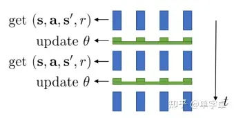
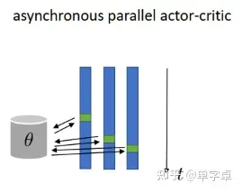
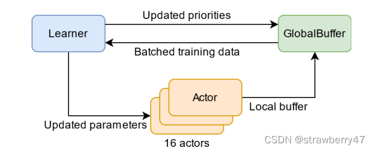
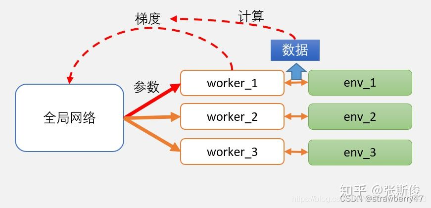
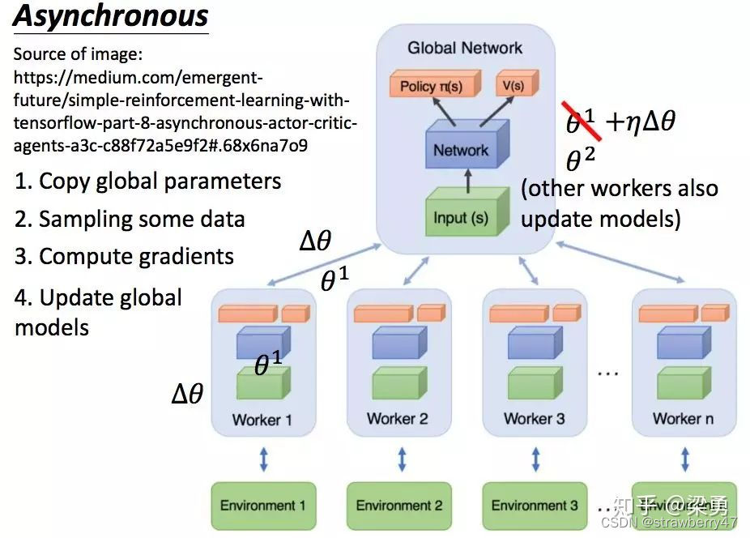

[TOC]

<!--more-->

## RL中并行计算的需求

在深度强化学习中，针对模型的训练需要大量数据。以 OpenAI Five (OpenAI et al., 2019) 为 例，为了使智能体能够通过学习在 Dota 游戏中做出明智的决策，每两秒钟就大概有 2 百万组数 据被用来训练模型。

从优化的角度，特别在基于策略梯度的方法中，大批量的训练数 据能够有效地降低结果的方差。

由于在强化学习中，智能体和环境的交互限制于在时间上 顺序执行，强化学习的算法在采集数据上往往存在低效率的问题，从而带来不理想的训练结果和 缓慢的收敛速度

**并行计算** ：将相对分离独立的认读同时计算，部分缓解问题

- 并行计算的并行性体现在：

  - 计算并行性：针对数据的计算任务包括特征工程、模型学习以及结果评估等任务，每个计算任务由对应的计算单元执行，不同的计算单元可以根据任务规模和种类灵活扩展其计算规模。

    第一类计算策略？一个计算任务上分配的计算单元越多，任务完成的效率会越高，最终因一些瓶颈环节逐渐收敛。

  - 数据传输并行：在拥有充足的计算资源时，计算资源之间的数据传输会成为解决问题 效率的瓶颈 

从两方面优化

让智能体在训练中同时并行学习多个训练轨迹

积累批量的数据来训练深度强化学习模型中的参数

梯度并行：专注 **分布式计算** ，梯度计算分配在多个并行计算设备上，加快模型的梯度更新。通过多个Learner并行更新模型参数，减少单个Learner的计算瓶颈（单线程训练5min更新一次Learner的模型参数，并行度为n的并行训练，可以更新n次模型参数)。代表有：A3C，Gorila

- 多个Actor同时计算梯度，并通过参数服务器汇总梯度，更新全局网络

经验并行：侧重于 **数据生成** ，通过并行的 Actor 在环境中进行探索，收集大量的经验数据供模型学习。这些经验会被存储在经验回放缓冲区中，Learner从经验回放区采集数据进行训练。

- 主要目的在于增加探索效率和经验多样性，加速模型收敛
- Ape-X和IMPALA架构，通过大量的Actor并行探索环境，积累大量经验数据

## RL中的并行与串行

https://zhuanlan.zhihu.com/p/490240729

RL和监督学习有一个明显的区别，就是RL存在一个与环境交互收集数据的过程（不考虑offlineRL）

意味着在训练之前需要model和环境交互来收集数据，收集完数据后model的训练又需要一次前向计算+反向传播

### RL中的串行与并行

在实现时，通常设置actor模块负责收集数据，learner负责计算梯度，更新网络的过程由update完成，这三者如何协调运作就是串并行和异步同步的关键。

**串行** 因为RL中存在actor和learner，所以RL中的串行很显然指的是actor-->learner-->update....这种交替执行的过程，即依次执行动作得到奖励，直到样本数足够训练，然后执行梯度下降并更新网络。

**并行**

- actor并行，只有一个learner（同步update）
- actor-learner并行（异步update）
- actor-learner并行，数据并行分布式训练（同步异步都支持）

并行情况下，通常指的是模型参数更新过程中的同步异步

- 模型同步更新指的是当设立多个并行actor或者learner时，model是进行同步更新的，且多个actor和learner进程中的模型在每一时刻都保持一致

- 异步指的是每个learner计算出梯度后都可以对全局模型进行异步更新，且多个actor和learner进程中的模型在每一时刻并不一定相同。

### 串行训练

通常RL论文在介绍算法时都会给人一种感觉，就是默认**只有一个环境，而环境中也只有一个待训练model**（不包括multi-agent RL）。

这种情况下对应的就是**串行计算**流程，单个agent在环境中串行执行逻辑，然后收集足够的样本后进行训练。

但是由于data efficiency以及数据时序依赖 temporal dependency的问题，如果你实际训练中只部署一个环境而且只利用一个actor收集的数据进行训练的话往往取得不了很好的效果，这时就需要各种训练的[trick](https://zhida.zhihu.com/search?content_id=197074016&content_type=Article&match_order=1&q=trick&zhida_source=entity)来帮助模型学习的更好。

DQN解决这个问题的方法是设置了一个replay buffer（因为DQN是off-policy的）。在内存中开辟了存储之前数据的空间，这样在下一次训练中只需要在这个buffer中随机采样一批样本即可完成训练，既打破了时序间的依赖，又避免了网络产生局部[过拟合](https://zhida.zhihu.com/search?content_id=197074016&content_type=Article&match_order=1&q=过拟合&zhida_source=entity)现象（当前样本训练的很好但是遗忘了之前的[样本分布](https://zhida.zhihu.com/search?content_id=197074016&content_type=Article&match_order=1&q=样本分布&zhida_source=entity)）。同样DQN的后续算法、DDPG、以及单机模式的[SAC算法](https://zhida.zhihu.com/search?content_id=197074016&content_type=Article&match_order=1&q=SAC算法&zhida_source=entity)也有相同的replay buffer设置。

这样的配置显然适合小规模任务，即所需数据量较小，任务简单的场景，这时可以很好地实现强化学习算法的性能。但是当遇到大规模问题（multi-task）以及样本效率较低的算法（PPO等on-policy算法本身就不适合使用relay buffer）这种配置就会使得训练时间过长而且最终的效果也较为一般。

### actor并行，只有一个learner（同步update）

对于PPO等onpolicy算法replay buffer不再适用，因此考虑设置[并行化](https://zhida.zhihu.com/search?content_id=197074016&content_type=Article&match_order=1&q=并行化&zhida_source=entity)环境，然后在并行化环境中采集数据同步训练模型

最典型的环境配置就是baseline中的subproc_VecEnv，利用多个子进程来开启并行环境，进程间使用Pipe通信，然后由同一个model进行决策，得到足够的数据后同步对model进行训练，因此也只有一个learner。

### A3C（并行actor-learner、一个model）

A3C文章中所设置的异步训练情况

在torch.multiprocess中设置多进程来异步采集数据并训练

利用share_model共享一个全局模型

然后在每个进程中设置一个采样actor和计算梯度的learner，每个worker得到梯度更新就回传

在得到梯度信息之后异步对全局模型更新，然后其它进程在每个循环中同步全局模型

- 每个worker将梯度传给一个global network，然后这个global network会取平均更新模型。更新完模型再把这个模型参数传给所有的worker。

异步更新的[示意图](https://zhida.zhihu.com/search?content_id=197074016&content_type=Article&match_order=1&q=示意图&zhida_source=entity)如下，3个进程中都有各自的actor-learner，然后对同一个全局model进行异步参数更新。

每个进程中采样的actor都各自保存了一个模型（每一时刻并不一定相同），但是在循环开始阶段会同步全局模型参数，并且对于全局模型的参数是异步更新的。

通常来讲异步更新速度更快，但是训练效果不如（同步update）中的并行同步更新，因为异步的梯度更新导致了模型收敛并不稳定。

## csdn

https://blog.csdn.net/strawberry47/article/details/126520709

强化学习收敛慢，采用并行计算加快计算速度，并行方法通常可以分为两类：

- 一是**经验并行**，通过共享的经验池更新参数；
- 二是**梯度并行**，依靠自己的经验更新，再将梯度回传到全局网络聚合

### Ape-X

2018年DeepMind在论文《Distributed Prioritized Experience Replay》中提出了Ape-X。该方法主要通过一个中心式的共享replay memory解耦了acting和learning过程

该架构将深度强化学习分为可以并行执行的两部分：一是acting，即运行环境，评估策略和保存经验；二是learning，即采样经验和更新策略参数

- Actor们基于共享的神经网络与它们各自的环境实例进行交互，然后积累经验放到共享的经验replay memory中。Learner从该replay memory中采样然后更新神经网络。

它不是均匀采样，而是优先考虑其中的一些样本，从而让算法专注于那些重要的数据。该思想来自2016年Google的论文《Prioritized experience replay》

【https://blog.csdn.net/jinzhuojun/article/details/113796543】

比较经典的**经验并行**是ApeX框架，**多个分布式actor**与环境进行交互，产生的数据存储在**经验回放记忆池**中，**learner再现经验样本并更新神经网络**。该架构依赖于优先记忆重放，只关注actor生成的最重要的数据。

- 多个分布式actor, 每个actor有自己的环境，生成经验、将经验添加到共享的经验重放记忆池、计算初始优先级；
- 单个learner从记忆池中采样数据并更新网络和数据优先级；
- actor的网络会定期使用learner最新的网络参数进行更新；

### A3C

比较经典的 **梯度并行** 框架是**A3C算法**，有一个主网络和很多的worker。A3C把主网络的参数直接赋予worker中的网络，更新时 **使用各worker中的梯度** ，对主网络的参数进行更新。

相当于开了多个分身，使用了[Actor-Critic](https://so.csdn.net/so/search?q=Actor-Critic&spm=1001.2101.3001.7020)框架，并且引入了异步训练的思想，在提升性能的同时也大大加快了训练速度。

A3C算法为了提升训练速度采用异步训练的思想，利用多个线程。每个线程相当于一个智能体在随机探索，多个智能体共同探索，并行计算策略梯度，对参数进行更新。

相比DQN算法，A3C算法不需要使用经验池来存储历史样本并随机抽取训练来打乱数据相关性，节约了存储空间，并且采用异步训练，大大加倍了数据的采样速度，也因此提升了训练速度。与此同时，采用多个不同训练环境采集样本，样本的分布更加均匀，更有利于神经网络的训练。

