离线RL是DRL的子领域，不需要与与环境在线交互，可以直接从数据中学习策略完成相关任务。

<!--more-->

## 离线RL原理

### DRL简介

1998年Sutton就写了RL圣经，2012年，深度学习兴起。

RL领域2013年DeepMind的Mnih发表DQN才开启DRL发展的高潮（**[Playing Atari with Deep Reinforcement Learning](https://link.zhihu.com/?target=https%3A//arxiv.org/abs/1312.5602)**（DQN技术））

2015年加强版**[Human-level control through deep reinforcement learning](https://link.zhihu.com/?target=https%3A//www.nature.com/articles/nature14236)** Nature发表

2016年AlphaGo，充分证明了DRL的发展潜力

#### 同策略与异策略区别

**学习方式** ：

- 同策略，学习策略同时作为行为策略与环境交互
- 异策略，学习策略不与环境交互，仅行为策略与环境交互

**数据采样**

- 同策略，采样策略与目标策略一致，采样后学习，学习后更新目标策略，同步更新采样策略，因此需要等采样策略更新后才可重新采样
- 异策略：采样策略与布标策略不一致，目标策略随时可更新，采样后的数据也可被目标策略的多轮更新所使用（样本效率高）

同策略方法：进行策略评估和改进的目标策略是行为策略

异策略方法：进行策略评估或改进的目标策略与生成数据的行为策略不同

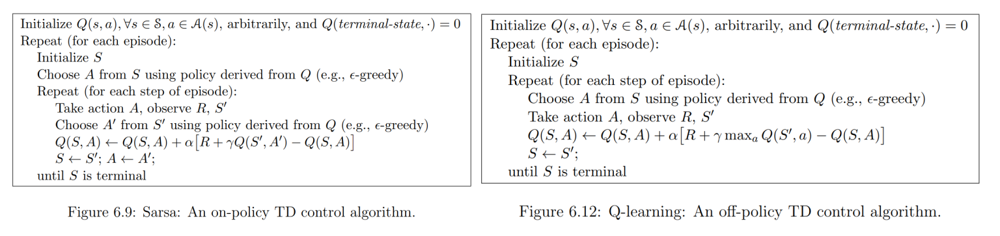

**on-policy**优点是直接了当，速度快，**劣势是不一定找到最优策略**。 

**off-policy**劣势是**曲折，收敛慢**，但优势是更为强大和通用。

- 如何从采样轨迹中学习
- 异策略样本效率高，但收敛慢，但仍是最重要的解决问题方法

#### 传统的强化学习和监督学习、非监督学的区别

- 监督学习与非监督学习，是从已标记和无标记的数据中学习，**目标是训练一个模型，使与训练数据相同分布的数据上取得良好的性能**  [离线RL综述论文]
- 离线RL目标是学习到一个与数据集D中的行为模式不同（希望更好）的策略
- RL目标是通过与环境的交互来学习策略，最大化累积期望奖励

从一个四元组 $\{s,a,s',r'\}$中学习出策略,不论出发点在哪里都可以得到一个最优的轨迹（trajectory）模型（不论起点，目前测试中一般通过多个随机seed去测试）

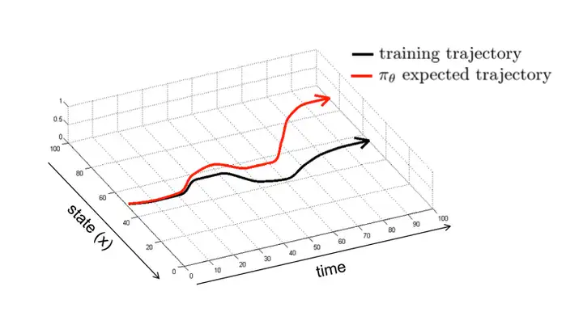

#### 在线学习与离线学习

学习的本质，都是从数据中总结规律。**不同的数据，使用的学习方式不同，对应的输出也不同** 

监督学习中，数据是独立同分布的；强化学习中，数据是从轨迹中提取的经验，并不满足独立同分布

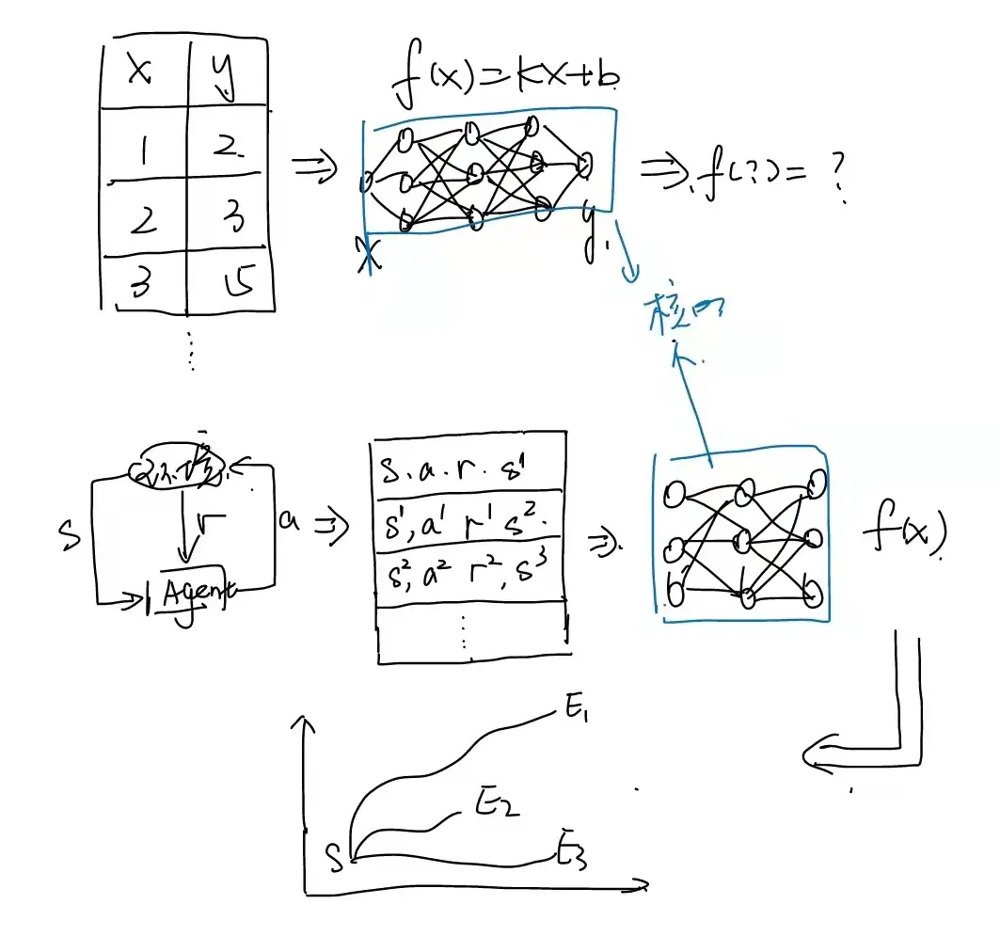

**数据** 才是关键，在线学习与环境有交互，通过采集到的数据学习，然后丢弃

离线学习不需要与环境交互，直接通过采集到的轨迹数据学习

### 强化学习落地困难原因

目前各种游戏引擎可以生成上百万的模拟数据，因此很多RL算法在游戏领域非常成功。但实际落地中产生以下几个问题

- 由于样本收集很困难，或者很危险。所以实时的和环境进行交互是不太可能的，那么可否有一种仅利用之前收集的数据来训练的方法去学习策略呢？
- 不管它是on-policy还是off_policy，我只要经验回放池中的**交互历史数据**，往大一点就是log数据库中的数据，去拟合函数是否可行？
- 仅利用轨迹数据学习的策略能否和Online算法的媲美？

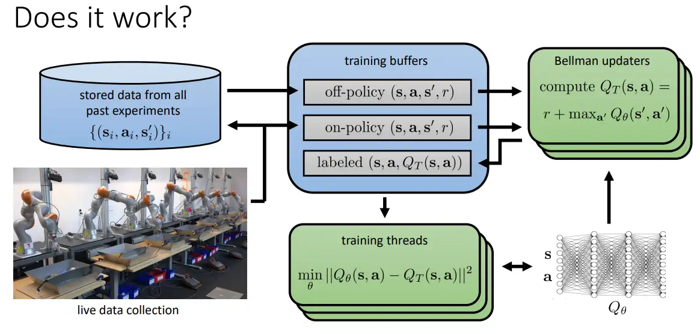

这种方法在训练过程中不会与环境交互，仅适用离线采集的数据集

### 离线强化学习

离线强化学习最初英文名为：**Batch Reinforcement Learning** [3], 后来Sergey Levine等人在其2020年的综述中使用了**Offline Reinforcement Learning（Offline RL）**, 现在普遍使用后者表示。下图是离线强化学习近年来论文的发表情况，间接反应发展状态

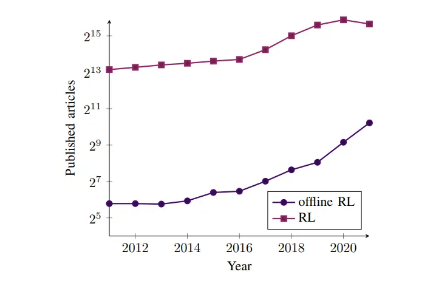

#### 原理

离线RL定义为数据驱动的强化学习问题，智能体在不与环境交互的情况下，从获取的轨迹中学习经验知识，使目标最大化。

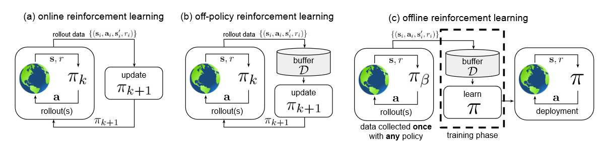

> (a) 经典在线强化学习
>
> - [在线强化学习] 策略 $\pi_k$ 通过自身收集序列数据，更新自身策略为 $\pi_{k+1}$
>
> (b) 经典异策略强化学习
>
> - [异策略强化学习] 策略 $\pi_k$ 的经验被追加到一个经验缓冲区 $\mathcal{D}$ 中，每个新策略 $\pi_k$ 收集额外的数据，因此缓冲区 $\mathcal{D}$ 中的经验来自策略 $\pi_0,\pi_1,\cdots,\pi_k$ ，所有的经验被用于训练新策略 $\pi_{k+1}$ 
>
> (c) 离线强化学习
>
> - [离线强化学习] 通过任意策略 $\pi_{\beta}$ 采集经验组成经验缓冲区 $\mathcal{D}$ ，这个数据集只收集一次，并且在训练过程不被更改，可以使用以往收集的大型数据集。训练过程完全不与 MDP 交互，策略只有经过充分训练后才进行部署。

本质上，智能体通过静态的数据集 $\{s_t^i,a_t^i,s_{t+1}^i,r_{t+1}^i\}$ 对MDP进行充分理解，并学习一个策略 $\pi(a\vert s)$ ，部署到实际环境中可以获得最多的累积奖励。使用 $\pi_{\beta}(a\vert s)$ 表示数据集 $\mathcal{D}$ 中状态和动作分布，且 $s,a\in \mathcal{D},s\sim d^{\pi_{\beta}}(s)$ ，动作 $a\sim \pi_{\beta}(a\vert s)$ 是根据行为策略采样而来的，最终学习目标为最大化策略的价值 $J(\pi)$
$$
J(\pi)=E_{\tau\sim p_{\pi}(\tau)}\left[\sum\limits_{t=0}^H\gamma ^tr(s_t,a_t)\right]
$$

- 基于 $\pi_{\beta}$ 采样的得到的静态数据集 $\mathcal{D}$ ，训练出目标策略 $\pi(a\vert s)$ ，将该策略实际部署并与环境交互的轨迹分布服从 $\tau\sim p_\pi(\tau)$，目标是使与环境实际交互的累积奖励最大化
- 离线强化学习去学习数据可以使**专家数据、预训练(Pre-Train)模型产生的数据、随机（random）数据**等。

#### 离线RL分类与区别

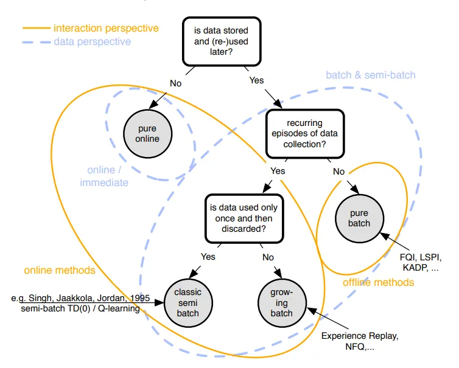

数据不存储——纯在线

不会不断收集数据——离线方法

数据仅利用一次——经典半离线算法（异策略RL，Q-learning）

数据利用多次——经验回放技术

**离线RL分类**

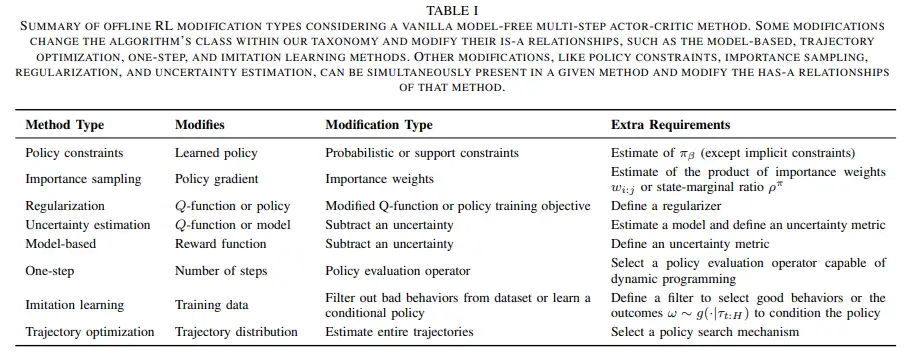

#### 离线RL与模仿学习区别

**模仿学习(Imitation Learning， IL)** 是指通过从专家（通常指人类的决策数据 $\{\tau_1,\tau_2,\cdots,\tau_m\}$ ）中学习，每个决策包含状态和动作序列 $\tau_i=<s_1^i,a_1^i,s_2^i,a_2^i,\cdots,s_n^i>$ 。将状态作为输入特征，动作作为输出标记，进行学习得到最优的策略模型，模型的训练目标是使 **模型生成的状态-动作轨迹分布** 和 **输入的状态-动作轨迹分布** 相匹配，最典型的就是自动驾驶例子。

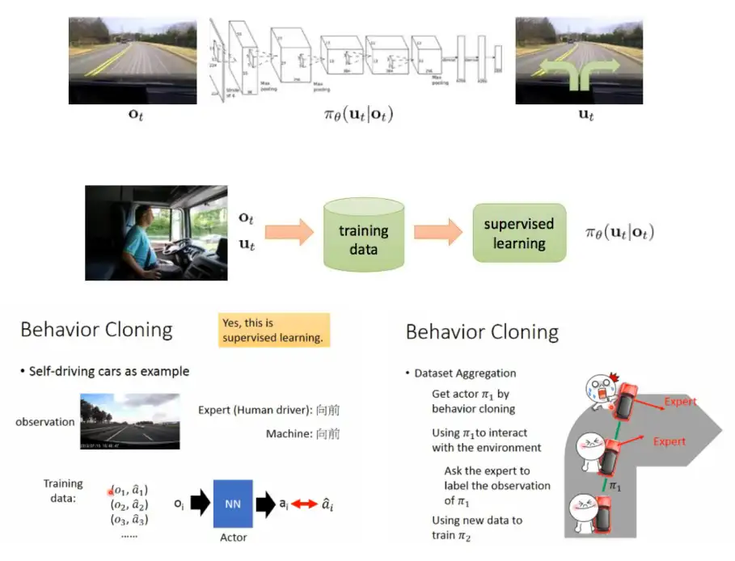

离线RL与模仿学习区别：

- 离线RL建立在异策略DRL之上，这些算法倾向于优化某种形式的贝尔曼方程或TD误差
- 大多数模仿学习问题假设有一个足有的或者高性能的数据演示器，离线RL必须处理高度次优的数据
- 大多数模仿学习问题没有奖励函数。离线RL有奖励，而且可以事后处理和修改
- 一些模仿学习问题需要将数据标记为专家与非专家，离线RL无需数据标注

#### 离线RL很难学习原因

##### 无法探索

RL与问题中，最重要的因素是探索与利用，探索是为了收集更多环境信息，利用是根据当前信息做出最佳决策

离线RL需要完全依赖静态数据集 $\mathcal{D}$ ，但没有办法提高探索，因为不与环境交互，不知道探索得到的数据是否有效，是否有高质量的奖励反馈。因此无法通过进一步探索发现高奖励的区域，变成下一节的经验最小化问题

##### 数据质量

深度学习成功归因于数据集准确强大，离线RL也如此：

- 如果轨迹（数据）全部是专家数据，Offline RL算法会学习到好策略吗？
- 如果轨迹全是预训练好的模型（比如训练好的PPO模型）产生的，Offline RL算法会学习到好策略吗？
- 如果轨迹全是没有任何经验，而是随机产生的，Offline RL算法会学习到好策略吗？
- 如果轨迹是上述三种的混合，具体的比例多少才能训练出通用、高效的offline RL算法？

Fujimoto在2019年的时候就提到了这些问题(如图所示)

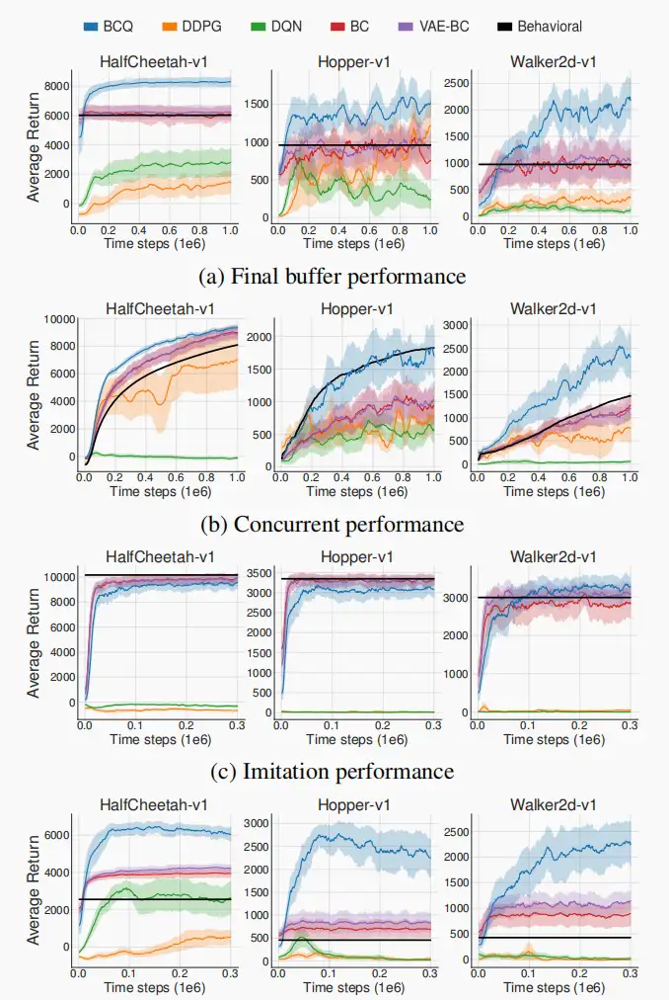

- 完全回放、同步训练、模仿训练，离线智能体的表现都远远低于在线训练智能体。
- 模仿训练中，即使面对从专家经验中获取的高质量数据样本，什么也没学到

##### 分布偏移问题——外推误差

**分布偏移(Distribution shift)** 在监督学习中一般指的是训练分布与测试分布不同，在离线强化学习中指的是训练策略与行为策略不一致。

在监督学习中，训练一个模型通常追求 **经验风险最小化** （ERM）

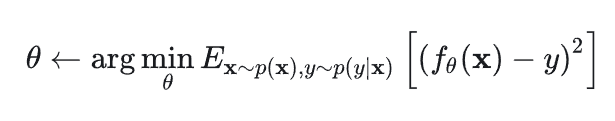

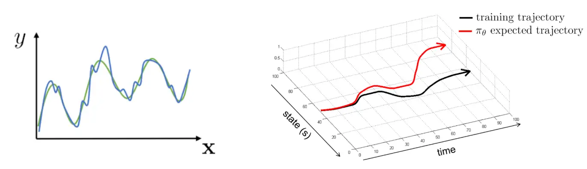

也就是让左子图的平均损失函数最小化，但是，给定一个最优 $x^*$ ，$f(x^*)$ 未必最优

- 如果同分布，$E_{x\sim p(x),y\sim p(y\vert x)}\left[(f_{\theta}(x)-y)^2\right]$， 则是最小的
- 如果分布不同，$E_{x\sim \overline{p}(x),y\sim p(y\vert x)}\left[(f_{\theta}(x)-y)^2\right]$， 则不是，因为对于普通的 $\overline{p}(x)\neq p(x)$

问题就变成：如何在不同的 $\overline{p}(x)\neq p(x)$ ，仍达到 $E_{x\sim p(x),y\sim p(y\vert x)}\left[(f_{\theta}(x)-y)^2\right]$

对应于离线RL的目标函数变为''

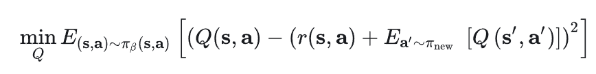

- $\pi_\beta$ 是从离线数据集中学习到的策略，希望 $\pi_{\beta}=\pi_{new}$ 

总结起来就是：**别走偏了，每一步都尽量让两个分布之间距离最小化的问题，不然累计起来不知道走哪里**

### 外推误差

**外推误差**，是指由于当前策略可能访问到的状态动作对与从数据集中采样得到的状态动作对的分布不匹配而产生的误差。

对于在线强化学习，即使训练是离线策略的，智能体依然有机会通过与环境交互及时采样到新的数据，从而修正这些误差。

但是在离线强化学习中，智能体无法和环境交互。因此，一般来说，离线强化学习算法要想办法尽可能地限制外推误差的大小，从而得到较好的策略。

### 减少外推误差

#### 批量限制策略

为减少外推误差，当前的策略需要做到只访问与数据集相似的 $(s,a)$ 数据。满足这一要求的策略称为 **批量限制策略(batch-constrained policy)** ，这样的策略选择动作时有三个目标：

- 最小化选择的动作与经验集中数据的距离
- 采取动作后能达到与离线数据集状态相似的下一状态
- 最大化 $Q$ 函数

对于标准表格型方法，状态和动作空间都是离散且有限的，标准Q-learning更新公式可写为
$$
Q(s,a)\leftarrow (1-\alpha)Q(s,a)+\alpha(r+\gamma Q\left(s',\arg\max_{a'}Q(s',a'))\right)
$$
只需将策略选择的动作限制在数据集 $\mathcal{D}$ 内，得到了表格型 **批量限制Q-learning**
$$
Q(s,a)\leftarrow (1-\alpha)Q(s,a)+\alpha(r+\gamma Q\left(s',\arg\max_{a's.t.(s',a')\in \mathcal{D}}Q(s',a'))\right)
$$
可以证明，如果数据中包含了所有可能的 $(s,a)$ ，按上式迭代可以收敛到最优的价值函数 $Q^*$

##### BCQ的两个trick

连续状态和动作空间复杂一些，CQL需要更详细地定义。如，如何定义两个 *状态-动作* 之间的距离。**BCQ训练一个生成模型 $G_{w}(s)$** 。对数据集 $\mathcal{D}$ 和其中的状态 $s$ ，生成模型 $G_{w}(s)$ 能给出与 $\mathcal{D}$ 中数据接近的一系列动作 $a_1,\cdots,a_n$ 用于 $Q$ 网络训练。

为增加生成动作的多样性，减少生成次数，BCQ还引入扰动模型 $\xi_{\phi}(s,a,\Phi)$ 。输入 $(s,a)$ ，模型给出一个绝对值最大的 $\Phi$ 的微扰动并附加到动作上。

这两个模型综合起来相当于给出了一个批量限制策略 $\pi$
$$
\pi(s)=\arg\max_{a_i+\xi_{\phi}(s,a_{i},\Phi)}Q_{\theta}\left(s,a_i+\xi_{\phi(s,a_i,\Phi})\right),\{a_{i}\sim G_w(s)\}_{i=1}^n
$$
其中，生成模型 $G_{w}(s)$ 使用百分自动编码器(VAE)实现；扰动模型通过确定性策略梯度算法训练，目标是使函数 $Q$ 最大化
$$
\phi\leftarrow \arg\max_{\phi}\sum_{(s,a)\in \mathcal{D}}Q_{\theta}\left(s,a+\xi_{\phi}(s,a,\Phi)\right)
$$

##### BCQ算法流程

1. 随机初始化 $Q$ 网络 $Q_{\theta}$ ，扰动网络 $\xi_{\phi}$ 、生成网络 $G_w=\{E_{w_1},D_{w_2}\}$
2. 用 $\theta$ 初始化目标 $Q$ 网络 $Q_{\theta^-}$ ，用 $\phi$ 初始化目标扰动网络 $\xi_{\phi'}$
3. 

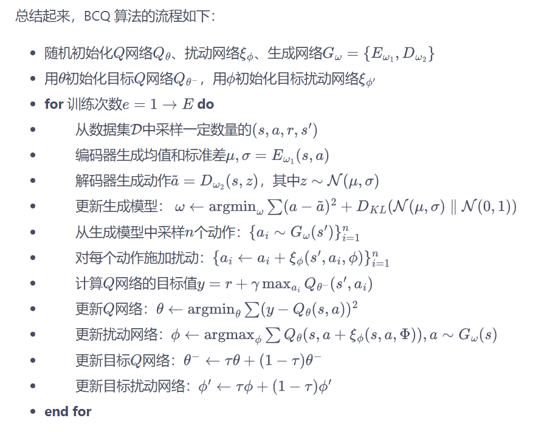

VAE 不属于本书的讨论范围，并且 BCQ 的代码中有较多技巧

#### 直接限制Q函数

实验证明，外推误差主要会导致在远离数据集的点上 $Q$ 函数的过高估计，常出现 $Q$ 值向上发散的情况。

如果能用某种方法将算法中偏离数据集的点上的 $Q$ 函数保持在很低的值，或许能消除部分外推误差的影响，这是 CQL 算法的基本思想。

CQL在普通贝尔曼方程上引入一些额外的限制项，普通 Q-learning中，Q的更新方程写为
$$
\hat{Q}^{k+1}\leftarrow \arg\min_{Q}\mathbb{E}_{(s,a)\sim \mathcal{D}}\left[\left(Q(s,a)-\hat{\mathcal{B}}^\pi\hat{Q}^k(s,a)\right)^2\right]
$$
其中，$\hat{\mathcal{B}}^{\pi}$ 是实际计算时策略 $\pi$ 的贝尔曼算子，为防止 $Q$ 值在各状态上的过高估计，需要对某些状态上的高 $Q$ 值进行惩罚。

我们希望 $Q$ 在某个特定分布 $\mu(s,a)$ 上的期望值最小。在上式中，$\hat{\mathcal{B}}^{\pi}$ 的计算需要用到 $(s,a,s',a')$ ，只有 $a'$ 是生成的，可能不在数据集中，因此，对数据集的状态 $s$ 按策略 $\mu$ 得到的动作进行惩罚
$$
\hat{Q}^{k+1}\leftarrow \arg\min_{Q}\beta\cdot\mathbb{E}_{s\sim \mathcal{D},a\sim \mu(a\vert s)}\left[Q(s,a)\right]+\frac{1}{2}\mathbb{E}_{(s,a)\sim \mathcal{D}}\left[\left(Q(s,a)-\hat{\mathcal{B}}^\pi\hat{Q}^k(s,a)\right)^2\right]
$$
可证，上式迭代收敛的 $Q$ 函数，在任何 $(s,a)$ 上的 $Q$ 值都比真实值小。

如果放宽条件，只追求 $Q$ 在 $\pi(a\vert s)$ 上的期望值 $V^{\pi}$ 比真实值小，可以略微放松对上式约束。

**对符合用于生成数据集的行为行为策略 $\pi_\beta$ 的数据点，认为对这些点的 $Q$ 值估计较为准确，这些点上不必限制 $Q$ 值**
$$
\hat{Q}^{k+1}\leftarrow \arg\min_{Q}\beta\cdot\left(\mathbb{E}_{s\sim \mathcal{D},a\sim \mu(a\vert s)}\left[Q(s,a)\right]-\mathbb{E}_{s\sim \mathcal{D},a\sim \hat{\pi}_{\beta}(a\vert s)}\left[Q(s,a)\right]\right)+\frac{1}{2}\mathbb{E}_{(s,a)\sim \mathcal{D}}\left[\left(Q(s,a)-\hat{\mathcal{B}}^\pi\hat{Q}^k(s,a)\right)^2\right]
$$
将行为策略 $\pi_{\beta}$ 写为 $\hat{\pi}_{\beta}$ 是因为无法获取真实的行为策略，只能通过数据集中已有的数据近似得到。

可以证明，当 $\mu=\pi$ 时，上式迭代收敛得到的Q函数虽不在每一点上都小于真实值，但其期望小于真实值，$\mathbb{E}_{\pi(a\vert s)}\left[\hat{Q}^{\pi}(s,a)\right]\le V^{\pi}(s)$

CQL 算法已经有了理论上的保证，但仍有一个缺陷：计算的时间开销太大了。当令 $\mu=\pi$ 时，在 $Q$ 迭代的每一步，算法都要对策略 $\hat{\pi}^{k}$ 做完整的离线策略评估计算上式中的 $\arg\min$ ，再进行一次策略迭代，而离线策略评估非常耗时。$\pi$ 并非与 $Q$ 独立，而是通过 $Q$ 值最大的动作衍生，则完全可以用使 $Q$ 最大的 $\mu$ 近似 $\pi$
$$
\pi\approx \max_{\mu}\mathbb{E}_{s\sim \mathcal{D},a\sim \mu(a\vert s)}[Q(s,a)]
$$
为放置过拟合，加上正则项 $\mathcal{R}(\mu)$ ，得到完整的迭代方程
$$
\hat{Q}^{k+1}\leftarrow \arg\min_{Q}\max_{\mu}\beta\cdot\left(\mathbb{E}_{s\sim \mathcal{D},a\sim \mu(a\vert s)}\left[Q(s,a)\right]-\mathbb{E}_{s\sim \mathcal{D},a\sim \hat{\pi}_{\beta}(a\vert s)}\left[Q(s,a)\right]\right)+\frac{1}{2}\mathbb{E}_{(s,a)\sim \mathcal{D}}\left[\left(Q(s,a)-\hat{\mathcal{B}}^\pi\hat{Q}^k(s,a)\right)^2\right]+\mathcal{R}(\mu)
$$
正则项采用和一个先验策略 $\rho(a\vert s)$ 的KL距离，即 $\mathcal{R}(\mu)=-D_{KL}(\mu,\rho)$ ，一般来说，$\rho(a\vert s)$ 为均匀分布 $\mathcal{U}(a)$ 即可，迭代方程简化为
$$
\hat{Q}^{k+1}\leftarrow \arg\min_{Q}\beta\cdot\mathbb{E}_{s\sim \mathcal{D}}\left[\log\sum_{a}exp(Q(s,a))-\mathbb{E}_{a\sim\hat{\pi}_{\beta}(a\vert s)}[Q(s,a)]\right]+\frac{1}{2}\mathbb{E}_{(s,a)\sim \mathcal{D}}\left[\left(Q(s,a)-\hat{\mathcal{B}}^{\pi}\hat{Q}^k(s,a)\right)^2\right]
$$
CQL直接在 $Q$ 函数上做出限制，对策略 $\pi$ 并没有特别要求，主流实现为DQN与SAC，但基于SAC的用途更广泛。

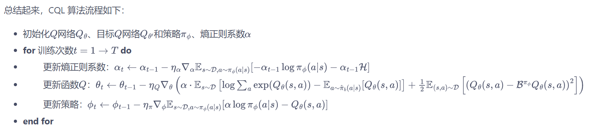

## BCQ

论文信息：**[Off-Policy Deep Reinforcement Learning without Exploration](https://link.zhihu.com/?target=https%3A//arxiv.org/pdf/1812.02900.pdf)**, **[[Github\]](https://link.zhihu.com/?target=https%3A//github.com/sfujim/BCQ)**

由作者Scott Fujimoto（TD3算法的提出者）于2019年提出，介绍了连续空间状态下的策略约束的BCQ算法， 

- 首先就offline RL中容易出现extrapolation error现象进行了解释，
- 用数学证明了在某些条件下这种误差是可以消除的
- 引入了BCQ算法，通过batch constrain的限制来避免这样的误差
- 实验证明BCQ算法的效果很好。

### 1. 离线RL

#### 1.1 在线与离线区别

Offline研究的是如何最大限度的利用静态的离线数据集来训练RL智能体

#### 1.2 离线RL研究方向

##### 数据集

- 离线数据集大小。谷歌训练离线 QR-DQN 和 REM 所用的数据集是通过随机下采样整个 DQN 回溯数据集得到的简化数据，同时保持了相同的数据分布。与监督学习类似，**模型的性能会随着数据集大小的增加而提升**。例如REM 和 QR-DQN 只用整个数据集的 10% 就达到了与完全的 DQN 接近的性能；
- 离线数据集的组成。通过使用 DQN 算法回溯多个游戏的训练数据，离线 REM 和 QR-DQN 在这个低质量数据集上的表现优于最佳策略（best policy），这表明**如果数据集足够多样，标准强化学习智能体也能在离线设置下表现良好**；

##### 算法

策略约束

- 显式策略约束（TRPO）：估计行为策略 $\pi_{\beta}$ ，并约束目标策略 $\pi_{\theta}$ 使其接近于 $\pi_{\beta}$ ，最大化如下目标函数

  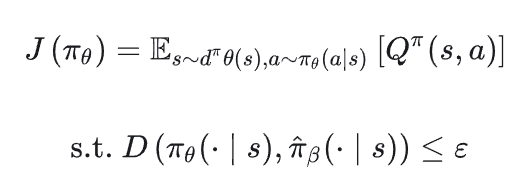

- 隐式策略约束（PPO）：不依赖于对行为策略 $\pi_{\beta}$ 的估计，通过使用改进的目标函数和严格依赖 $\pi_{\beta}$ 的样本来隐式约束目标策略 $\pi_{\theta}$ 

  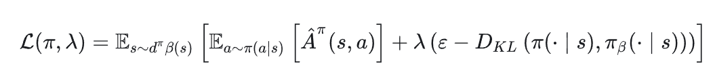

- 

