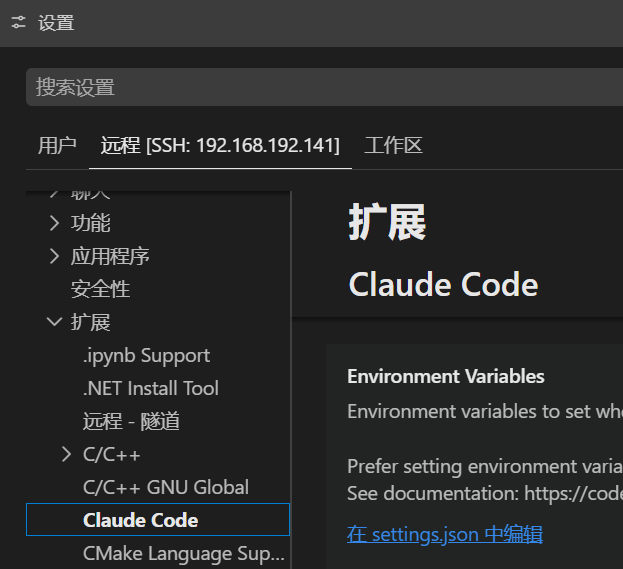

---
categories:
  - AI
tags:
  - AI
mathjax: true
title: claude code
abbrlink: 1989319079
date: 2026-05-04 16:25:48
---

[TOC]

> 教程：https://cc.x-qu.com/
>
> 阿里手册：https://help.aliyun.com/zh/model-studio/token-plan-quickstart?spm=a2c4g.11186623.help-menu-2400256.d_0_2_1.4f936fd1alaI9z&scm=20140722.H_3029020._.OR_help-T_cn~zh-V_1

<!--more-->

## 1. 安装部署

### 1.1 本地claude-code

#### 下载

由于国内当前(2026.05.04)无法下载，所以需要特殊途径下载，[参考](https://daheiai.com/cc-install.html)

必要条件：

- git
- 可以访问storage.googleapis.com，**从 Anthropic 官方 Google Cloud Storage 存储桶下载**

简略版，自行修改版本号、系统架构-下载链接：

```shell
windows
https://storage.googleapis.com/claude-code-dist-86c565f3-f756-42ad-8dfa-d59b1c096819/claude-code-releases/2.1.128/win32-x64/claude.exe

linux-arm64
https://storage.googleapis.com/claude-code-dist-86c565f3-f756-42ad-8dfa-d59b1c096819/claude-code-releases/2.1.128/linux-arm64/claude

linux-x86
https://storage.googleapis.com/claude-code-dist-86c565f3-f756-42ad-8dfa-d59b1c096819/claude-code-releases/2.1.128/linux-x64/claude
```

##### Windows下载脚本

*claude_install.ps1* ：

- 在Windows中，PowerShell 5.1 及之前版本对 UTF-8 without BOM 支持不好，所以需要将脚本的编码格式改为  UTF-8 with BOM

- 不太方便，报错信息与解决

  ```shell
  因为在此系统上禁止运行脚本。有关详细信息，请参阅 https:/go.microsoft.com/fwlink/?LinkI
  D=135170 中的 about_Execution_Policies。
  所在位置 行:1 字符: 1
  + .\claude_install.ps1 -justInstall "C:\Users\AmosTian\.claude\download ...
  + ~~~~~~~~~~~~~~~~~~~~
      + CategoryInfo          : SecurityError: (:) []，PSSecurityException
      + FullyQualifiedErrorId : UnauthorizedAccess
  ```

  ```powershell
  # 查看当前执行策略
  Get-ExecutionPolicy
  
  # 临时设置为 RemoteSigned（仅当前 PowerShell 窗口有效）
  Set-ExecutionPolicy -Scope Process -ExecutionPolicy RemoteSigned
  
  # 然后正常执行脚本
  .\claude_install.ps1 -justInstall "C:\Users\AmosTian\.claude\downloads\claude-2.1.128-win32-x64.exe"
  ```

```shell
<#
.SYNOPSIS
    Claude Code 安装脚本 - 支持自定义安装、仅下载和仅安装模式

.DESCRIPTION
    用于下载和安装 Claude Code CLI 工具。支持指定版本、仅下载、仅安装等模式。

.PARAMETER a
    使用默认配置：下载最新版本并安装到默认位置。

.PARAMETER target
    指定要下载的版本号，例如 "0.2.35"。

.PARAMETER justDownload
    仅下载二进制文件到下载目录，不执行安装步骤。

.PARAMETER justInstall
    仅执行安装步骤，使用本地已有的二进制文件。需要指定文件路径。

.EXAMPLE
    .\install.ps1
    显示帮助信息

.EXAMPLE
    .\install.ps1 -a
    使用默认配置安装最新版本

.EXAMPLE
    .\install.ps1 -target "0.2.35"
    下载并安装指定版本

.EXAMPLE
    .\install.ps1 -a -justDownload
    仅下载最新版本，不安装

.EXAMPLE
    .\install.ps1 -target "0.2.35" -justDownload
    仅下载指定版本，不安装

.EXAMPLE
    .\install.ps1 -justInstall "C:\Users\Alice\Downloads\claude-0.2.35-win32-x64.exe"
    仅安装指定路径的本地二进制文件
#>

# 参数定义
[CmdletBinding()]
param(
    [Parameter()]
    [switch]$a,

    [Parameter()]
    [ValidatePattern('^(stable|latest|\d+\.\d+\.\d+(-[^\s]+)?)$')]
    [string]$target,

    [Parameter()]
    [switch]$justDownload,

    [Parameter()]
    [string]$justInstall
)

# ============ 帮助函数 ============
function Show-Help {
    $helpText = @"
Claude Code 安装脚本
====================

用法:
    .\install.ps1              显示此帮助信息
    .\install.ps1 -a           使用默认配置下载，并安装最新版本
    .\install.ps1 -target <ver>  下载并安装指定版本
    .\install.ps1 -a -justDownload    仅下载最新版本（不安装）
    .\install.ps1 -target <ver> --justDownload  仅下载指定版本（不安装）
    .\install.ps1 -justInstall <路径>   仅安装本地已有的二进制文件（跳过下载）

参数说明:
    -a              使用默认配置（下载最新版并安装到默认位置）
    -target <版本>   指定版本号，例如: 0.2.35, latest, stable
    -justDownload    仅下载二进制文件，不执行安装
    -justInstall <路径>  仅执行安装，使用本地已有的二进制文件路径

环境变量:
    安装路径: %USERPROFILE%\.local\share\claude\versions\
    下载路径: %USERPROFILE%\.claude\downloads\
    链接路径: %USERPROFILE%\.local\bin\claude.exe
"@
    Write-Host $helpText
}

# ============ 无参数时显示帮助 ============
if (-not $a -and -not $target -and -not $justDownload -and -not $justInstall) {
    Show-Help
    exit 0
}

# ============ 参数互斥检查 ============
if ($justDownload -and $justInstall) {
    Write-Error "参数冲突：-justDownload 和 -justInstall 不能同时使用。"
    exit 1
}

# ============ 严格模式 ============
Set-StrictMode -Version Latest
$ErrorActionPreference = "Stop"
$ProgressPreference = 'SilentlyContinue'

# ============ 环境变量设置 ============
$GCS_BUCKET = "https://storage.googleapis.com/claude-code-dist-86c565f3-f756-42ad-8dfa-d59b1c096819/claude-code-releases"
$DOWNLOAD_DIR = "$env:USERPROFILE\.claude\downloads"
$INSTALL_BASE = "$env:USERPROFILE\.local\share\claude"
$VERSIONS_DIR = "$INSTALL_BASE\versions"
$BIN_DIR = "$env:USERPROFILE\.local\bin"
$LINK_PATH = "$BIN_DIR\claude.exe"
$CONFIG_PATH = "$env:USERPROFILE\.claude.json"
$LOCKS_DIR = "$env:USERPROFILE\.local\state\claude\locks"
$CACHE_DIR = "$env:USERPROFILE\.cache\claude\staging"
$DOWNLOADS_DIR = "$env:USERPROFILE\.claude\downloads"

# ============ 配置写入函数 ============
function Write-Config {
    param(
        [string]$ConfigPath,
        [string]$FirstStartTime
    )

    $data = @{}
    if (Test-Path $ConfigPath) {
        try {
            $existing = Get-Content -Raw -Path $ConfigPath | ConvertFrom-Json -AsHashtable
            if ($existing) {
                $data = $existing
            }
        }
        catch {
            $data = @{}
        }
    }

    $data["installMethod"] = "native"
    $data["autoUpdates"] = $false
    $data["autoUpdatesProtectedForNative"] = $true
    if (-not $data.ContainsKey("firstStartTime")) {
        $data["firstStartTime"] = $FirstStartTime
    }

    $json = $data | ConvertTo-Json -Depth 10
    Set-Content -Path $ConfigPath -Value $json -Encoding UTF8
}

# ============ 远程文本获取函数 ============
function Get-RemoteText {
    param(
        [string]$Url
    )

    if (Get-Command curl.exe -ErrorAction SilentlyContinue) {
        try {
            $result = & curl.exe -fsSL --ssl-no-revoke --http1.1 --retry 5 --retry-delay 2 $Url
            if ($LASTEXITCODE -eq 0) {
                if ($result -is [array]) {
                    return ($result -join "`n")
                }
                return $result
            }
            Write-Warning "curl.exe failed with exit code $LASTEXITCODE, falling back to Invoke-RestMethod"
        }
        catch {
            Write-Warning "curl.exe failed: $_. Falling back to Invoke-RestMethod"
        }
    }

    return Invoke-RestMethod -Uri $Url -ErrorAction Stop
}

# ============ 安装函数 ============
function Install-Claude {
    param(
        [string]$BinaryPath,
        [string]$Version
    )

    Write-Output ""
    Write-Output "Setting up Claude Code..."

    try {
        New-Item -ItemType Directory -Force -Path $VERSIONS_DIR | Out-Null
        New-Item -ItemType Directory -Force -Path $BIN_DIR | Out-Null
        New-Item -ItemType Directory -Force -Path $LOCKS_DIR | Out-Null
        New-Item -ItemType Directory -Force -Path $CACHE_DIR | Out-Null
        New-Item -ItemType Directory -Force -Path $DOWNLOADS_DIR | Out-Null
        New-Item -ItemType Directory -Force -Path "$env:USERPROFILE\.claude\backups" | Out-Null

        $finalPath = "$VERSIONS_DIR\$Version.exe"
        if (Test-Path $finalPath) {
            Remove-Item -Force $finalPath
        }
        Move-Item -Force $BinaryPath $finalPath
        Copy-Item -Force $finalPath $LINK_PATH

        if (Test-Path $CONFIG_PATH) {
            Copy-Item -Force $CONFIG_PATH "$env:USERPROFILE\.claude\backups\.claude.json.backup.$([DateTimeOffset]::UtcNow.ToUnixTimeMilliseconds())" -ErrorAction SilentlyContinue
        }

        $firstStartTime = [DateTime]::UtcNow.ToString("yyyy-MM-ddTHH:mm:ssZ")
        Write-Config -ConfigPath $CONFIG_PATH -FirstStartTime $firstStartTime

        Write-Output ""
        Write-Output "Claude Code successfully installed!"
        Write-Output ""
        Write-Output "Version: $Version"
        Write-Output "Location: $LINK_PATH"
        Write-Output ""
        Write-Output "PATH target: $BIN_DIR"
        Write-Output "If claude is not found, add that directory to your user PATH and reopen PowerShell."
    }
    finally {
        try {
            if (Test-Path $BinaryPath) {
                Write-Warning "Not remove temporary file: $BinaryPath"
            }
        }
        catch {
            Write-Warning "Could not remove temporary file: $BinaryPath"
        }
    }

    Write-Output ""
    Write-Output "$([char]0x2705) Installation complete!"
    Write-Output ""
}

# ============ 主逻辑 ============

# 仅安装模式
if ($justInstall) {
    # 检查文件是否存在
    if (-not (Test-Path -Path $justInstall -PathType Leaf)) {
        Write-Error "指定的二进制文件不存在: $justInstall"
        exit 1
    }

    # 检查文件扩展名
    if ([System.IO.Path]::GetExtension($justInstall) -ne '.exe') {
        Write-Warning "警告：指定文件不是 .exe 文件，可能不是有效的 Claude Code 二进制文件。"
    }

    $fileName = [System.IO.Path]::GetFileNameWithoutExtension($justInstall)
    $version = "custom"
    
    # 匹配 claude-x.x.x 或 claude-x.x.x-tag 格式
    if ($fileName -match 'claude-(\d+\.\d+\.\d+(?:-[^\s]+)?)') {
        $version = $Matches[1]
    }

    Write-Output "仅安装模式，使用本地文件: $justInstall"
    Write-Output "解析版本号: $version"

    Install-Claude -BinaryPath $justInstall -Version $version
    exit 0
}

# ============ 下载模式逻辑 ============

# 拒绝 32 位 Windows
if (-not [Environment]::Is64BitProcess) {
    Write-Error "Claude Code does not support 32-bit Windows. Please use a 64-bit version of Windows."
    exit 1
}

# 检测 CPU 架构
if ($env:PROCESSOR_ARCHITECTURE -eq "ARM64") {
    $platform = "win32-arm64"
} else {
    $platform = "win32-x64"
}
New-Item -ItemType Directory -Force -Path $DOWNLOAD_DIR | Out-Null

# 确定目标版本
if ($target) {
    $version = $target
} elseif ($a) {
    $version = "latest"
} else {
    $version = "latest"
}

# 获取版本号
if ($version -eq "latest" -or $version -eq "stable") {
    try {
        $version = (Get-RemoteText -Url "$GCS_BUCKET/latest").ToString().Trim()
        Write-Output "Resolved '$Target' to version: $version"
    }
    catch {
        Write-Error "Failed to get latest version: $_"
        exit 1
    }
} else {
    Write-Output "Using specified version: $version"
}

# 下载 manifest.json
try {
    $manifestText = Get-RemoteText -Url "$GCS_BUCKET/$version/manifest.json"
    if ($manifestText -is [string]) {
        $manifest = $manifestText | ConvertFrom-Json
    }
    else {
        $manifest = $manifestText
    }

    $checksum = $manifest.platforms.$platform.checksum
    $expectedSize = $manifest.platforms.$platform.size

    if (-not $checksum) {
        Write-Error "Platform $platform not found in manifest"
        exit 1
    }
}
catch {
    Write-Error "Failed to get manifest: $_"
    exit 1
}

# 下载并校验二进制文件
$binaryPath = "$DOWNLOAD_DIR\claude-$version-$platform.exe"
$downloadUrl = "$GCS_BUCKET/$version/$platform/claude.exe"

Write-Output "Claude Code version: $version"
Write-Output "Platform: $platform"
Write-Output "Download source: $downloadUrl"
Write-Output "Downloading Claude Code binary..."

try {
    if (Get-Command curl.exe -ErrorAction SilentlyContinue) {
        & curl.exe -fL --ssl-no-revoke --http1.1 --retry 5 --retry-delay 2 -o $binaryPath $downloadUrl
        if ($LASTEXITCODE -ne 0) {
            throw "curl.exe failed with exit code $LASTEXITCODE"
        }
    }
    else {
        Invoke-WebRequest -Uri $downloadUrl -OutFile $binaryPath -ErrorAction Stop
    }

    if ($expectedSize) {
        $actualSize = (Get-Item -Path $binaryPath).Length
        if ($actualSize -ne [int64]$expectedSize) {
            throw "Downloaded file size mismatch. Expected $expectedSize bytes, got $actualSize bytes"
        }
    }
}
catch {
    Write-Error "Failed to download binary: $_"
    if (Test-Path $binaryPath) {
        Remove-Item -Force $binaryPath
    }
    exit 1
}

# 校验 SHA256 哈希
$actualChecksum = (Get-FileHash -Path $binaryPath -Algorithm SHA256).Hash.ToLower()
if ($actualChecksum -ne $checksum) {
    Write-Error "Checksum verification failed"
    Remove-Item -Force $binaryPath
    exit 1
}

Write-Output "Downloaded successfully to: $binaryPath"
Write-Output "Checksum verified: $actualChecksum"

# 仅下载模式
if ($justDownload) {
    Write-Output ""
    Write-Output "$([char]0x2705) Download complete (installation skipped due to -justDownload)"
    Write-Output "Binary location: $binaryPath"
    Write-Output ""
    exit 0
}

# 执行安装
Install-Claude -BinaryPath $binaryPath -Version $version
```

##### Linux下载脚本

```shell
#!/bin/bash

# =============================================================================
# Claude Code 安装脚本 (Linux/macOS 版)
# =============================================================================

set -euo pipefail

# ============ 颜色定义 ============
RED='\033[0;31m'
GREEN='\033[0;32m'
YELLOW='\033[1;33m'
BLUE='\033[0;34m'
NC='\033[0m'

# ============ 帮助信息 ============
show_help() {
    cat << 'EOF'
Claude Code 安装脚本 (Linux/macOS)
====================================

用法:
    ./install.sh                    显示此帮助信息
    ./install.sh -l                 下载并安装最新版本（自动检测本机架构）
    ./install.sh -d -A <架构>       下载并安装指定架构的最新版本
    ./install.sh -l -d -t <ver>     仅下载指定版本（自动检测本机架构）
    ./install.sh -d -t <ver> -A <架构>  仅下载指定版本的指定架构
    ./install.sh -i <路径>          仅安装本地已有的二进制文件（跳过下载）

参数说明:
    -l              使用本机架构（自动检测，与 -A 互斥）
    -d              下载模式（仅下载不安装，与 -i 互斥）
    -t <版本>        指定版本号，例如: 0.2.35（默认 latest）
    -A <架构>        指定 CPU 架构，可选:
                     win32-x64, win32-arm64, linux-x64, linux-arm64, darwin-x64, darwin-arm64
                     （与 -l 互斥）
    -i <路径>        仅安装本地二进制文件（与 -d/-l/-t/-A 互斥）

参数冲突规则:
    -i 与 -d/-l/-t/-A 不能同时使用
    -l 与 -A 不能同时使用

环境变量:
    安装路径: ~/.local/share/claude/versions/
    下载路径: ~/.claude/downloads/
    链接路径: ~/.local/bin/claude
EOF
}

# ============ 初始化变量 ============
FLAG_LOCAL=false
FLAG_DOWNLOAD=false
FLAG_INSTALL=""
TARGET_VERSION="latest"
ARCH_OVERRIDE=""

# ============ 解析参数 ============
while [[ $# -gt 0 ]]; do
    case "$1" in
        -l)
            FLAG_LOCAL=true
            shift
            ;;
        -d)
            FLAG_DOWNLOAD=true
            shift
            ;;
        -t)
            if [[ -n "${2:-}" && "$2" != -* ]]; then
                TARGET_VERSION="$2"
                shift 2
            else
                echo -e "${RED}错误: -t 参数需要指定版本号${NC}" >&2
                exit 1
            fi
            ;;
        -A)
            if [[ -n "${2:-}" && "$2" != -* ]]; then
                ARCH_OVERRIDE="$2"
                shift 2
            else
                echo -e "${RED}错误: -A 参数需要指定架构${NC}" >&2
                exit 1
            fi
            ;;
        -i)
            if [[ -n "${2:-}" && "$2" != -* ]]; then
                FLAG_INSTALL="$2"
                shift 2
            else
                echo -e "${RED}错误: -i 参数需要指定文件路径${NC}" >&2
                exit 1
            fi
            ;;
        -h|--help)
            show_help
            exit 0
            ;;
        *)
            echo -e "${RED}错误: 未知参数 '$1'${NC}" >&2
            show_help
            exit 1
            ;;
    esac
done

# 无参数时显示帮助
if [[ "$FLAG_LOCAL" == false && "$FLAG_DOWNLOAD" == false && -z "$FLAG_INSTALL" && -z "$ARCH_OVERRIDE" && "$TARGET_VERSION" == "latest" ]]; then
    show_help
    exit 0
fi

# ============ 参数冲突检查 ============

# -i 与 -d/-l/-t/-A 互斥
if [[ -n "$FLAG_INSTALL" ]]; then
    if [[ "$FLAG_LOCAL" == true || "$FLAG_DOWNLOAD" == true || -n "$ARCH_OVERRIDE" || "$TARGET_VERSION" != "latest" ]]; then
        echo -e "${RED}错误: -i 参数与 -d/-l/-t/-A 参数互斥，不能同时使用${NC}" >&2
        exit 1
    fi
fi

# -l 与 -A 互斥
if [[ "$FLAG_LOCAL" == true && -n "$ARCH_OVERRIDE" ]]; then
    echo -e "${RED}错误: -l（本机架构）与 -A（自定义架构）参数互斥，不能同时使用${NC}" >&2
    exit 1
fi

# 下载模式必须指定架构来源：-l 或 -A
if [[ "$FLAG_LOCAL" == false && -z "$FLAG_INSTALL" && -z "$ARCH_OVERRIDE" ]]; then
    echo -e "${RED}错误: 下载模式必须指定架构来源，请使用 -l（本机架构）或 -A <架构>（自定义架构）${NC}" >&2
    exit 1
fi

# ============ 网络检测函数 ============

GCS_HOST="storage.googleapis.com"
GCS_URL="https://storage.googleapis.com/claude-code-dist-86c565f3-f756-42ad-8dfa-d59b1c096819/claude-code-releases"

check_network() {
    echo -e "${BLUE}检测网络连通性...${NC}"

    local has_internet=false
    local has_gcs=false

    # 检测互联网连接（ping 公共 DNS）
    if ping -c 1 -W 3 8.8.8.8 &> /dev/null || ping -c 1 -W 3 223.5.5.5 &> /dev/null; then
        has_internet=true
        echo -e "${GREEN}✓ 互联网连接正常${NC}"
    else
        echo -e "${YELLOW}✗ 无法 ping 通公共 DNS（8.8.8.8 / 223.5.5.5）${NC}"
    fi

    # 检测 GCS HTTP 连通性
    if command -v curl &> /dev/null; then
        if curl -fsSL --max-time 10 -I "$GCS_URL/latest" &> /dev/null; then
            has_gcs=true
            echo -e "${GREEN}✓ GCS 下载地址可访问${NC}"
        else
            echo -e "${YELLOW}✗ 无法访问 GCS 下载地址${NC}"
        fi
    elif command -v wget &> /dev/null; then
        if wget --timeout=10 --tries=1 -q --spider "$GCS_URL/latest" &> /dev/null; then
            has_gcs=true
            echo -e "${GREEN}✓ GCS 下载地址可访问${NC}"
        else
            echo -e "${YELLOW}✗ 无法访问 GCS 下载地址${NC}"
        fi
    else
        echo -e "${YELLOW}⚠ 未找到 curl 或 wget，跳过 GCS 连通性检测${NC}"
    fi

    # 网络状态总结
    echo ""
    if [[ "$has_internet" == false && "$has_gcs" == false ]]; then
        echo -e "${RED}============================================${NC}"
        echo -e "${RED}  网络不可用，无法连接到互联网或 GCS 服务器${NC}"
        echo -e "${RED}  请检查网络连接或代理设置${NC}"
        echo -e "${RED}============================================${NC}"
        return 1
    elif [[ "$has_internet" == true && "$has_gcs" == false ]]; then
        echo -e "${YELLOW}============================================${NC}"
        echo -e "${YELLOW}  互联网可用，但无法访问 GCS 下载地址${NC}"
        echo -e "${YELLOW}  可能是 DNS 解析问题或 GCS 被墙${NC}"
        echo -e "${YELLOW}============================================${NC}"
        return 1
    else
        echo -e "${GREEN}✓ 网络检测通过，可以正常下载${NC}"
        echo ""
        return 0
    fi
}

# ============ 环境变量设置 ============
GCS_BUCKET="https://storage.googleapis.com/claude-code-dist-86c565f3-f756-42ad-8dfa-d59b1c096819/claude-code-releases"
DOWNLOAD_DIR="${HOME}/.claude/downloads"
INSTALL_BASE="${HOME}/.local/share/claude"
VERSIONS_DIR="${INSTALL_BASE}/versions"
BIN_DIR="${HOME}/.local/bin"
LINK_PATH="${BIN_DIR}/claude"
CONFIG_PATH="${HOME}/.claude.json"
LOCKS_DIR="${HOME}/.local/state/claude/locks"
CACHE_DIR="${HOME}/.cache/claude/staging"

# ============ 工具函数 ============

write_config() {
    local config_path="$1"
    local first_start_time="$2"
    local data="{}"

    if [[ -f "$config_path" ]]; then
        data=$(cat "$config_path" 2>/dev/null || echo "{}")
    fi

    if command -v python3 &> /dev/null; then
        python3 -c "
import json, sys
try:
    data = json.loads(sys.argv[1])
except:
    data = {}
data['installMethod'] = 'native'
data['autoUpdates'] = False
data['autoUpdatesProtectedForNative'] = True
if 'firstStartTime' not in data:
    data['firstStartTime'] = sys.argv[2]
print(json.dumps(data, indent=2))
" "$data" "$first_start_time" > "$config_path"
    elif command -v jq &> /dev/null; then
        local tmp
        tmp=$(echo "$data" | jq --arg time "$first_start_time" '
            .installMethod = "native" |
            .autoUpdates = false |
            .autoUpdatesProtectedForNative = true |
            .firstStartTime //= $time
        ' 2>/dev/null || echo '{"installMethod":"native","autoUpdates":false,"autoUpdatesProtectedForNative":true,"firstStartTime":"'"$first_start_time"'"}')
        echo "$tmp" > "$config_path"
    else
        cat > "$config_path" << EOF
{
  "installMethod": "native",
  "autoUpdates": false,
  "autoUpdatesProtectedForNative": true,
  "firstStartTime": "$first_start_time"
}
EOF
    fi
}

get_remote_text() {
    local url="$1"
    local result

    if command -v curl &> /dev/null; then
        result=$(curl -fsSL --retry 5 --retry-delay 2 "$url" 2>/dev/null) && {
            echo "$result"
            return 0
        }
        echo -e "${YELLOW}curl 失败，尝试 wget...${NC}" >&2
    fi

    if command -v wget &> /dev/null; then
        result=$(wget -qO- "$url" 2>/dev/null) && {
            echo "$result"
            return 0
        }
    fi

    echo -e "${RED}错误: 无法下载远程内容，请安装 curl 或 wget${NC}" >&2
    return 1
}

download_file() {
    local url="$1"
    local output="$2"

    if command -v curl &> /dev/null; then
        curl -fL --retry 5 --retry-delay 2 -o "$output" "$url"
    elif command -v wget &> /dev/null; then
        wget --tries=5 --wait=2 -O "$output" "$url"
    else
        echo -e "${RED}错误: 需要 curl 或 wget 来下载文件${NC}" >&2
        return 1
    fi
}

sha256_hash() {
    local file="$1"
    if command -v sha256sum &> /dev/null; then
        sha256sum "$file" | awk '{print $1}'
    elif command -v shasum &> /dev/null; then
        shasum -a 256 "$file" | awk '{print $1}'
    else
        echo -e "${RED}错误: 需要 sha256sum 或 shasum${NC}" >&2
        return 1
    fi
}

detect_platform() {
    local arch_override="$1"

    if [[ -n "$arch_override" ]]; then
        case "$arch_override" in
            win32-x64|win32-arm64|linux-x64|linux-arm64|darwin-x64|darwin-arm64)
                echo "$arch_override"
                return 0
                ;;
            *)
                echo -e "${RED}错误: 不支持的架构 '$arch_override'${NC}" >&2
                echo -e "${RED}可选值: win32-x64, win32-arm64, linux-x64, linux-arm64, darwin-x64, darwin-arm64${NC}" >&2
                exit 1
                ;;
        esac
    fi

    local arch
    arch=$(uname -m)
    local os
    os=$(uname -s | tr '[:upper:]' '[:lower:]')

    local detected=""

    case "$os" in
        linux)
            case "$arch" in
                x86_64|amd64)   detected="linux-x64" ;;
                aarch64|arm64)  detected="linux-arm64" ;;
                *) echo -e "${RED}错误: 不支持的 Linux 架构: $arch${NC}" >&2; exit 1 ;;
            esac
            ;;
        darwin)
            case "$arch" in
                x86_64|amd64)   detected="darwin-x64" ;;
                aarch64|arm64)  detected="darwin-arm64" ;;
                *) echo -e "${RED}错误: 不支持的 macOS 架构: $arch${NC}" >&2; exit 1 ;;
            esac
            ;;
        msys*|cygwin*|mingw*)
            case "$arch" in
                x86_64|amd64)   detected="win32-x64" ;;
                aarch64|arm64)  detected="win32-arm64" ;;
                *) echo -e "${RED}错误: 不支持的 Windows 架构: $arch${NC}" >&2; exit 1 ;;
            esac
            ;;
        *)
            echo -e "${RED}错误: 不支持的操作系统: $os${NC}" >&2
            exit 1
            ;;
    esac

    echo "$detected"
}

install_claude() {
    local binary_path="$1"
    local version="$2"

    echo ""
    echo -e "${BLUE}Setting up Claude Code...${NC}"

    mkdir -p "$VERSIONS_DIR" "$BIN_DIR" "$LOCKS_DIR" "$CACHE_DIR" "$DOWNLOAD_DIR" "${HOME}/.claude/backups"

    local final_path="${VERSIONS_DIR}/${version}"
    
    if [[ -f "$final_path" ]]; then
        rm -f "$final_path"
    fi

    cp -f "$binary_path" "$final_path"
    
    if [[ -L "$LINK_PATH" ]]; then
        rm -f "$LINK_PATH"
    fi
    cp -f "$final_path" "$LINK_PATH"
    chmod +x "$LINK_PATH"

    if [[ -f "$CONFIG_PATH" ]]; then
        local backup_name
        backup_name="${HOME}/.claude/backups/.claude.json.backup.$(date +%s%3N)"
        cp -f "$CONFIG_PATH" "$backup_name" 2>/dev/null || true
    fi

    local first_start_time
    first_start_time=$(date -u +"%Y-%m-%dT%H:%M:%SZ")
    write_config "$CONFIG_PATH" "$first_start_time"

    echo ""
    echo -e "${GREEN}Claude Code successfully installed!${NC}"
    echo ""
    echo -e "Version: ${BLUE}$version${NC}"
    echo -e "Location: ${BLUE}$LINK_PATH${NC}"
    echo ""
    echo -e "PATH target: ${BLUE}$BIN_DIR${NC}"
    
    if [[ ":$PATH:" != *":$BIN_DIR:"* ]]; then
        echo -e "${YELLOW}警告: $BIN_DIR 不在 PATH 中${NC}"
        echo "请添加以下行到 ~/.bashrc 或 ~/.zshrc 或 /etc/profile:"
        echo "  export PATH=\"\$HOME/.local/bin:\$PATH\""
        echo "执行 source /etc/profile等"
    fi

    echo ""
    echo -e "${GREEN}✅ Installation complete!${NC}"
    echo ""
}

# ============ 仅安装模式 ============
if [[ -n "$FLAG_INSTALL" ]]; then
    if [[ ! -f "$FLAG_INSTALL" ]]; then
        echo -e "${RED}错误: 指定的二进制文件不存在: $FLAG_INSTALL${NC}" >&2
        exit 1
    fi

    if [[ ! -x "$FLAG_INSTALL" ]]; then
        echo -e "${YELLOW}警告: 文件没有执行权限，尝试添加...${NC}" >&2
        chmod +x "$FLAG_INSTALL" 2>/dev/null || true
    fi

    filename=$(basename "$FLAG_INSTALL")
    VERSION="custom"
    
    if [[ "$filename" =~ claude-([0-9]+\.[0-9]+\.[0-9]+(-[^[:space:]]+)?) ]]; then
        VERSION="${BASH_REMATCH[1]}"
    fi

    echo -e "${BLUE}仅安装模式，使用本地文件: $FLAG_INSTALL${NC}"
    echo -e "${BLUE}解析版本号: $VERSION${NC}"

    install_claude "$FLAG_INSTALL" "$VERSION"
    exit 0
fi

# ============ 下载模式：先检测网络 ============

if ! check_network; then
    exit 1
fi

# ============ 下载模式 ============

PLATFORM=$(detect_platform "$ARCH_OVERRIDE")
echo -e "${BLUE}Platform: $PLATFORM${NC}"

mkdir -p "$DOWNLOAD_DIR"

VERSION="$TARGET_VERSION"

if [[ "$VERSION" == "latest" || "$VERSION" == "stable" ]]; then
    echo -e "${BLUE}Resolving '$VERSION' version...${NC}"
    VERSION=$(get_remote_text "$GCS_BUCKET/latest" | tr -d '[:space:]')
    echo -e "${BLUE}Resolved to version: $VERSION${NC}"
else
    echo -e "${BLUE}Using specified version: $VERSION${NC}"
fi

echo -e "${BLUE}Fetching manifest...${NC}"
MANIFEST_TEXT=$(get_remote_text "$GCS_BUCKET/$VERSION/manifest.json")

if command -v python3 &> /dev/null; then
    CHECKSUM=$(echo "$MANIFEST_TEXT" | python3 -c "
import json, sys
manifest = json.load(sys.stdin)
platform = sys.argv[1]
print(manifest['platforms'][platform]['checksum'])
" "$PLATFORM")
    EXPECTED_SIZE=$(echo "$MANIFEST_TEXT" | python3 -c "
import json, sys
manifest = json.load(sys.stdin)
platform = sys.argv[1]
print(manifest['platforms'][platform]['size'])
" "$PLATFORM")
elif command -v jq &> /dev/null; then
    CHECKSUM=$(echo "$MANIFEST_TEXT" | jq -r ".platforms.\"$PLATFORM\".checksum")
    EXPECTED_SIZE=$(echo "$MANIFEST_TEXT" | jq -r ".platforms.\"$PLATFORM\".size")
else
    echo -e "${RED}错误: 需要 python3 或 jq 来解析 manifest${NC}" >&2
    exit 1
fi

if [[ -z "$CHECKSUM" || "$CHECKSUM" == "null" ]]; then
    echo -e "${RED}错误: 平台 $PLATFORM 在 manifest 中未找到${NC}" >&2
    exit 1
fi

BINARY_PATH="${DOWNLOAD_DIR}/claude-${VERSION}-${PLATFORM}"
DOWNLOAD_URL="$GCS_BUCKET/$VERSION/$PLATFORM/claude"

echo ""
echo -e "${BLUE}Claude Code version: $VERSION${NC}"
echo -e "${BLUE}Platform: $PLATFORM${NC}"
echo -e "${BLUE}Download source: $DOWNLOAD_URL${NC}"
echo -e "${BLUE}Downloading Claude Code binary...${NC}"

download_file "$DOWNLOAD_URL" "$BINARY_PATH"

if [[ -n "$EXPECTED_SIZE" && "$EXPECTED_SIZE" != "null" ]]; then
    if [[ "$(uname -s)" == "Linux" ]]; then
        ACTUAL_SIZE=$(stat -c%s "$BINARY_PATH")
    else
        ACTUAL_SIZE=$(stat -f%z "$BINARY_PATH")
    fi
    if [[ "$ACTUAL_SIZE" -ne "$EXPECTED_SIZE" ]]; then
        echo -e "${RED}错误: 文件大小不匹配。期望 $EXPECTED_SIZE 字节，实际 $ACTUAL_SIZE 字节${NC}" >&2
        rm -f "$BINARY_PATH"
        exit 1
    fi
fi

echo -e "${BLUE}Verifying checksum...${NC}"
ACTUAL_CHECKSUM=$(sha256_hash "$BINARY_PATH")

if [[ "$ACTUAL_CHECKSUM" != "$CHECKSUM" ]]; then
    echo -e "${RED}错误: 校验和验证失败${NC}" >&2
    echo "  期望: $CHECKSUM"
    echo "  实际: $ACTUAL_CHECKSUM"
    rm -f "$BINARY_PATH"
    exit 1
fi

echo -e "${GREEN}Downloaded successfully to: $BINARY_PATH${NC}"
echo -e "${GREEN}Checksum verified: $ACTUAL_CHECKSUM${NC}"

if [[ "$FLAG_DOWNLOAD" == true ]]; then
    echo ""
    echo -e "${GREEN}✅ Download complete (installation skipped due to -d)${NC}"
    echo -e "Binary location: ${BLUE}$BINARY_PATH${NC}"
    echo ""
    exit 0
fi

install_claude "$BINARY_PATH" "$VERSION"
```

### 获取供应商密钥

### 创建配置文件

```json
vim ~/.claude/settings.json

{
	"env": {
        "ANTHROPIC_AUTH_TOKEN": "你的_API_KEY",
        "ANTHROPIC_BASE_URL": "你的_URL",//与供应商相关，还需要注意选择支持 Anthropic API 的接口
        "ANTHROPIC_MODEL": "模型名称，在你申请的大模型上面就可以看到"
    }
}

# 跳过官方登录流程，直接使用 API KEY 认证
cat > ~/.claude.json << 'EOF'
{
    "hasCompletedOnboarding": true
}
EOF
```

示例：

千问+claude：https://help.aliyun.com/zh/model-studio/claude-code

```json
{
        "env": {
                "ANTHROPIC_AUTH_TOKEN": "sk-...",
                "ANTHROPIC_BASE_URL": "https://dashscope.aliyuncs.com/apps/anthropic",
                "ANTHROPIC_MODEL": "qwen3.6-plus"
    }
}
```


### 1.2 vscode-claude

#### 下载并安装claude插件

- 在项目代码所在的机器

- 下载完成，会进入登录页面，无法使用

  如果claude重新开放，可以在claude-code插件的配置文件中，直接输入api-url及api-key

  目前，无法使用claude，需要借助cc-switch，转换模型

#### 修改插件配置（当下失效）

打开claude-code插件的settings.json



修改为以下内容

```json
{
    "claudeCode.environmentVariables": [
        {
            "name": "ANTHROPIC_AUTH_TOKEN",
            "value": "{your-token}"
        },
        {
            "name": "ANTHROPIC_BASE_URL",
            "value": "your-base-url"
        }
    ]
}
```

#### 下载CC—switch（需要系统安装图形化界面）

