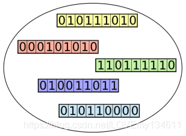
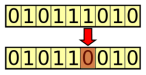
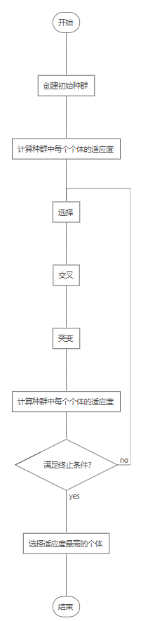
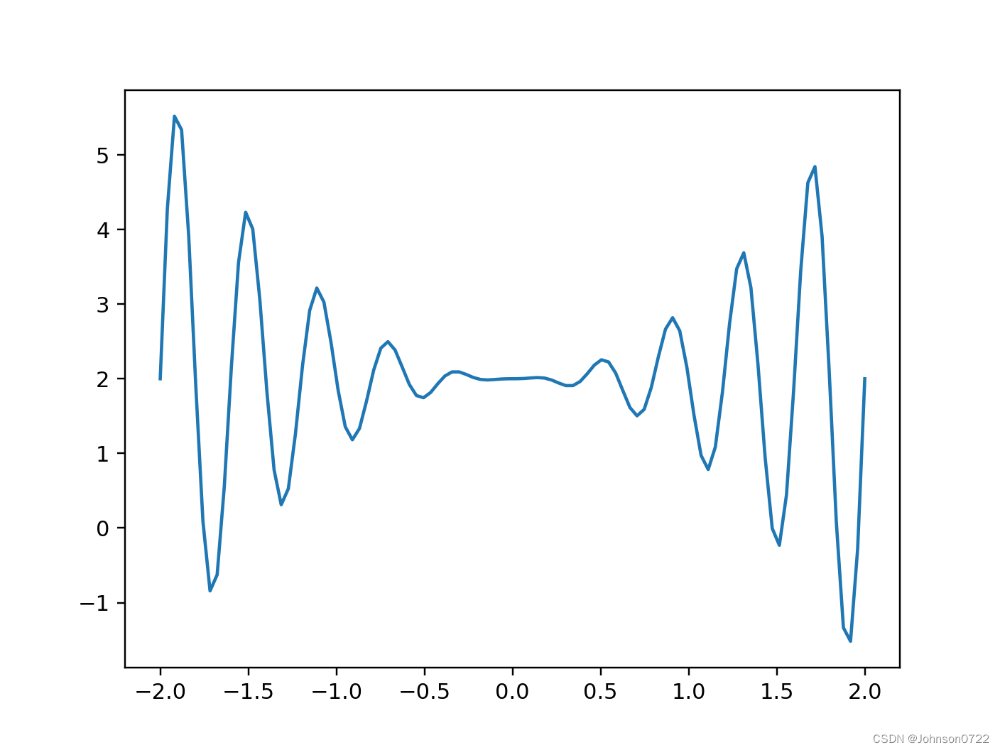
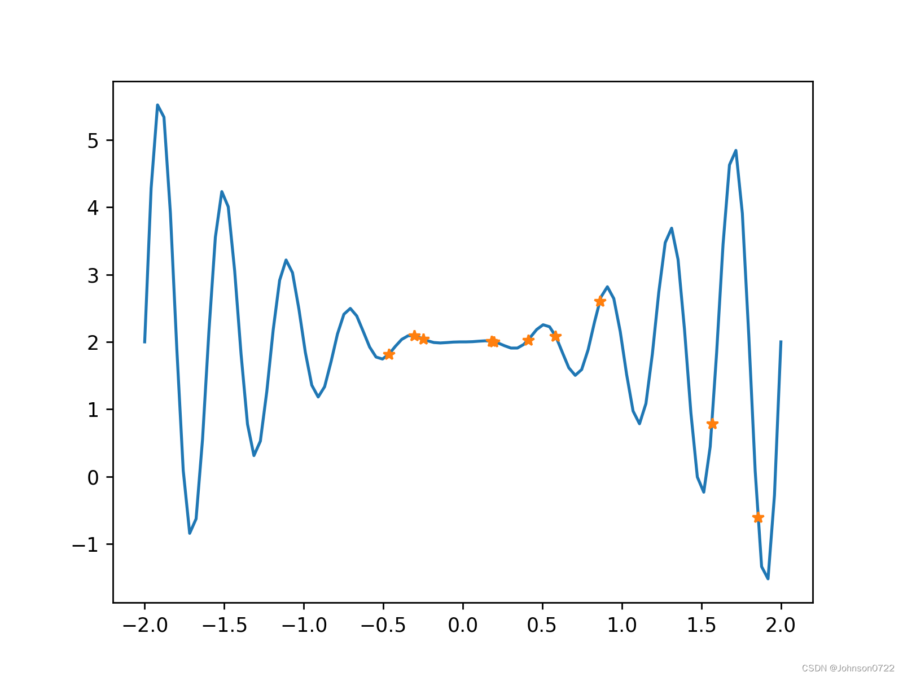
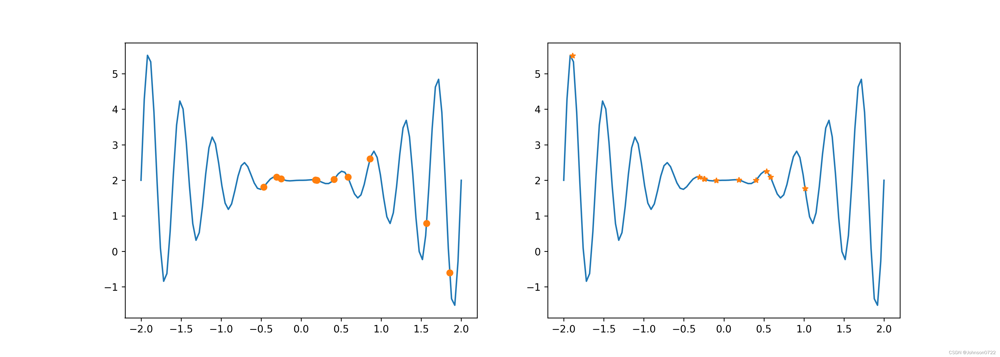

遗传算法是一种搜索算法，模拟自然选择和繁殖过程，可以为搜索、优化、学习问题提供高质量的解决方案。

- 变异：种群中每个样本的某些特征会有所不同，即样本间的差异认为由变异得来
- 遗传：一些特征会遗传给后代，新种群与原种群的一些个体的某些特征存在相似性
- 选择：种群中，更适应环境的个体会有优势，这些个体的后代在新种群中占比会更高

进化维持了种群中个体彼此不同，对环境适应度高的个体更有可能生存，并将其形状遗传给下一代。

进化的推动因素是 **交叉（crossover）** 或 **重组（recombination）** ——结合双亲特征产生后代。

- 交叉有利于多样性，随着时间推移，将更好的特征融合在一起

<!--more-->

## 遗传算法

https://blog.csdn.net/LOVEmy134611/article/details/111639624

遗传算法目标是找到给定问题的最佳解，

> 进化论保留的是种群的个体形状，遗传算法保留针对给定问题的候选解结合(individuals)

这些候选解经过迭代评估(evaluate)，创建下一代解，更优的解有更大的机会被选择，并将其特征传递给下一代候选解集合

### 术语

**染色体**（基因型, genotype）：在遗传算法中，每个个体都由代表基因集合的染色体构成


**种群** （population）：种群中有大量个体，每个个体(individuals)代表针对当前问题的一个候选解



**适应度函数** （fitness function）

在每次迭代中，使用适应度函数对个体进行评估。

- 目标函数：用于优化的函数或试图解决的问题
- 适应度得分：适应度得分更高的个体，代表更好的解，这样的个体更有可能被选中繁殖并且其性状在下一代中得以表现

**选择**（selection）

在计算出种群中每个个体的适应度之后，**选择** 过程确定种群中哪个个体被用于繁殖产生下一代，具有较高适应度值的个体更有可能被选中

**后代产生的两种方式**

- **交叉** （crossover）：从当前代种群中选择双亲样本的部分染色体互换（交叉），以创建代表后代的两个新染色体

- **变异** （mutation）：定期随机更新种群，引入新的染色体，鼓励在解空间的未知区域搜索。变异是通过随机改变一个或多个染色体值来实现的

  

### 理论基础

> 结合进化论理解：问题的最优解由多个 **要素** 组成，当前候选解包含 **最优解要素** 越多，则越接近最优解。
>
> 种群中的个体包含最优解所需的要素，选择和交叉的迭代过程可以将这些要素传递给下一代，同时可能将它们与最优解的其他要素结合起来，进而引导种群中越来越多的个体包含最优解的要素

**图式定理** （schema theorem）

**图式** 表示在染色体中的模式（模版），每个图示代表一种相似的染色体子集

| 图式 | Order（阶：固定数字的数量） | Defining Length（两个最远固定数字的距离） |
| ---- | --------------------------- | ----------------------------------------- |
| 1101 | 4                           | 3                                         |
| 1*01 | 3                           | 3                                         |
| *101 | 3                           | 2                                         |
| **01 | 2                           | 1                                         |
| 1*** | 1                           | 0                                         |
| **** | 0                           | 0                                         |

每个染色体对应多个图示。如果该染色体具有较高的适应度，则该染色体及其代表的所有图示都有可能在选择中幸存。当

该染色体与另一条染色体交叉或发生变异时，会将某些图示保存下来。低阶图示和定义长度短的图示更有可能幸存

**图式定理：低阶、定义长度短且适合度高于平均值的图式，出现频率在连续的世代中呈指数增长**

因此，随着遗传算法的迭代，代表最优解方案的特征的更小、更简单的要素块会越来越多地出现在种群中

### 特征对比

#### 遗传算法与传统算法差异

- 基于种群

  GA针对一组候选解(individuals)而不是单个候选解进行。搜索过程中，算法会保留当前代的一组个体，在搜索过程中迭代创建下一代个体。

  大多数其他启发式搜索方法都维持单个解，并迭代改进单个解。梯度下降法沿梯度方向迭代当前解。

- 遗传表征

  遗传算法并不直接运行于候选解，在其表征（编码）上运行（染色体，chromosomes）。

  弊端是使搜索过程与原始问题分离，遗传算法并不知道染色体代表什么，也不去解释

- 适应度函数

  适应度函数表示要解决的问题。遗传算法的目的是找到利用适应度函数求得的得分最高的个体。遗传算法仅考虑利用适应度函数获得的值，而不依赖于导数或任何其他信息。

- 概率行为

  遗传算法用来从一代产生下一代的规则是概率性的。选择个体的概率随着个体的适应度得分增加，但仍有可能选择一个得分较低的个体。

  尽管具有概率性，但不是随机的，会通过这种概率行为，将搜索引导向搜索空间中有更好机会改善结果的区域

#### 优点

- 相对其他搜索算法较优的解

  优化问题具有局部最大值和最小值。大多数传统的搜索和优化算法，尤其是基于梯度的搜索和优化算法，很容易陷入局部最大值，而不是找到全局最大值。

  遗传算法更有可能找到全局最大值，设法维持种群的多样性并避免过早趋同（premature convergence），就可能产生全局最优解。

- 处理复杂问题

  仅需要每个个体的适应度函数得分，可用于解决具有复杂数学表示、难以或无法求导的函数问题。

- 处理缺乏数学表达的问题

  只要能够比较两个个体并确定其中哪个更好，遗传算法甚至可以处理无法获得每个个体适应度的情况。

- 耐噪音

  一些问题中，即使对于相似的输入值，每次得到的输出值也可能有所不同。遗传算法通常对此具有鲁棒性，这要归功于反复交叉和重新评估个体的操作。

- 并行性

  适应度是针对每个个体独立计算的，这意味着可以同时评估种群中的所有个体。

  选择、交叉和突变的操作可以分别在种群中的个体和个体对上同时进行。

- 持续学习

#### 缺点

- 需要特殊定义

  将遗传算法应用于给定问题时，需要为它们创建合适的表示形式——定义适应度函数和染色体结构，以及适用于该问题的选择、交叉和变异算子。

- 超参数调整

- 计算密集

- 过早趋同

  如果一个个体的适应能力比种群的其他个体的适应能力高得多，那么它的重复性可能足以覆盖整个种群。这可能导致遗传算法过早地陷入局部最大值，而不是找到全局最大值。

- 无法保证的解的质量

  遗传算法的使用并不能保证找到当前问题的全局最大值

### 算法核心流程



#### 创建初始种群

初始种群是随机选择的一组有效候选解（个体）。由于遗传算法使用染色体代表每个个体，因此初始种群实际上是一组染色体。

#### 计算适应度

适应度函数的值是针对每个个体计算的。对于初始种群，此操作将执行一次，然后在应用选择、交叉和突变的遗传算子后，再对每个新一代进行。

由于每个个体的适应度独立于其他个体，因此可以并行计算。

适应度计算之后的选择阶段通常认为适应度得分较高的个体是更好的解决方案，因此遗传算法专注于寻找适应度得分的最大值。

#### 选择、交叉和变异

将选择，交叉和突变的遗传算子应用到种群中，就产生了新一代，该新一代基于当前代中较好的个体。

选择（selection）操作负责当前种群中选择有优势的个体。

交叉（crossover，或重组，recombination）从选定的个体创建后代。通过两个被选定的个体互换他们染色体的一部分以创建代表后代的两个新染色体来完成的。

变异（mutation）将每个新创建个体的一个或多个染色体值（基因）随机进行变化。突变通常以非常低的概率发生。

#### 算法终止条件

在确定算法是否可以停止时，可能有多种条件可以用于检查。两种最常用的停止条件是：

1. 已达到最大世代数。这也用于限制算法消耗的运行时间和计算资源。
2. 在过去的几代中，个体没有明显的改进。这可以通过存储每一代获得的最佳适应度值，然后将当前的最佳值与预定的几代之前获得的最佳值进行比较来实现。如果差异小于某个阈值，则算法可以停止。

其他停止条件：

1. 自算法过程开始以来已经超过预定时间。
2. 消耗了一定的成本或预算，例如CPU时间和/或内存。
3. 最好的解已接管了一部分种群，该部分大于预设的阈值。

### 其他

#### 精英主义（elitism）

尽管遗传算法群体的平均适应度通常随着世代的增加而增加，但在任何时候都有可能失去当代的最佳个体。这是由于选择、交叉和变异运算符在创建下一代的过程中改变了个体。

如果要保证最优秀的个体总是能进入下一代，则可以选用精英主义策略。

在我们使用通过选择、交叉和突变创建的后代填充种群之前，将前n个个体（n是预定义参数）复制到下一代。复制后的的精英个体仍然有资格参加选择过程，因此仍可以用作新个体的亲本。

### 实现


示例：求解
$$
f(x)=x^2\times sin(5\pi x)+2
$$
在区间 $[-2,2]$ 上的最大值，但很多单点优化问题不适合，会陷入局部最优

```python
import numpy as np
import pandas as pd
import matplotlib.pyplot as plt

# 定义适应度函数，以样本点真实的函数值作为适应度
def f(x):
    return x**2 * np.sin(5*np.pi*x) + 2

x = np.linspace(-2, 2, 100)
plt.plot(x, f(x))
```



**初始化原始种群**：遗传算法可以同时优化一批解（种群），在 $[-2,2]$ 区间内随机生成10个点作为初始种群

```python
def init_population(size):
    return np.random.uniform(low=-2, high=2, size=size)


np.random.seed(0)
population = init_population(10)

# x表示初始随机解个体组成的初始种群
x = np.linspace(-2, 2, 100)
plt.plot(x, f(x))
plt.plot(population, f(population), '*')
plt.show()
```



**染色体编码和解码**：解空间的解在遗传算法中的表示形式

从问题的解到基因型的映射称为 **编码**，即把一个问题的可行解从其解空间转换到遗传算法的搜索空间

- 遗传算法在进行搜索前，将解空间的解编码为遗传算法的基因型（染色体），这些串结构的不同组合可以表示不同的解

- 常见的编码方法有二进制编码、格雷码编码、 浮点数编码、各参数级联编码、多参数交叉编码等。

简单起见，我们使用二进制编码。为了能编码浮点数，需要扩大倍数转成整数。

```python
# TODO 需要了解其他编码方式

def encode(population, scale=1e4, _min=-2, bin_len=15):  
    _scaled_population = (population - _min) * scale
    chroms = np.array([np.binary_repr(x, width=bin_len) for x in _scaled_population.astype(int)])
    return chroms

def decode(chroms, _min=-2, scale=1e4):
    res = np.array([(int(x, base=2)/scale) for x in chroms])
    res += _min
    return res

# 种群中每个个体的适应度
fitness = f(population)
# 对个体（表现型号）编码，表示为染色体基因型
chroms = encode(population)
print(population)
print(decode(encode(population)))
print(fitness)

>>>
[ 0.1953  0.8608  0.4111  0.1795 -0.3054  0.5836 -0.2497  1.5671  1.8547  -0.4662]
[ 0.1953  0.8608  0.4111  0.1795 -0.3054  0.5836 -0.2497  1.5671  1.8547  -0.4662]
[ 2.00281338  2.60488832  2.02931805  2.01019697  2.09293383  2.0867721  2.04387992  0.78660371 -0.60517298  1.81257758]
```

**选择**

从旧种群中以一定概率选择优良个体组成新种群，产生下一代种群。


常用选择算法为轮盘赌算法：种群个体数为M，个体 $i$ 适应度为 $f_i$ ，则个体 $i$ 被选中的概率为 $P_i=\frac{f_i}{\sum\limits_{k=1}^Mf_k}$

当每个个体被选中的概率确定后，产生 $[0,1]$ 的均匀随机数决定哪个个体参加交配。若个体的选择概率大，则更有机会被选中，其遗传基因在种群中会扩大

```python
def selection(chroms, fitness):
    # 个体被选中概率与适应度有关，个体适应度越高，被选中概率越大。
    probs = fitness/np.sum(fitness)  
    # 轮盘赌确定个体被选中概率
    probs_cum = np.cumsum(probs)    
    each_rand = np.random.uniform(size=len(fitness))
    selected_chroms = np.array([chroms[np.where(probs_cum > rand)[0][0]] for rand in each_rand])
    return selected_chroms

selected_chroms = selection(chroms, fitness)
print(f(decode(selected_chroms)))
>>>
[2.04387992 2.00281338 2.04387992 2.0806576  2.00281338 2.04860442 2.00281338 2.04387992 2.09053176 2.0806576 ]
```

**交叉**

从种群中随机选择两个个体，通过两个染色体的交换组合，把父串的优秀特征遗传给子串，从而产生新的优秀个体。

在染色体中间交叉

```python
def crossover(selected_chroms, prob=0.6):
    # cross over
    pairs = np.random.permutation(int(len(selected_chroms)*prob//2*2)).reshape(-1, 2)
    center = len(selected_chroms[0])//2
    for i, j in pairs:
        # 在中间位置交叉
        x, y = selected_chroms[i], selected_chroms[j]
        selected_chroms[i] = x[:center] + y[center:]
        selected_chroms[j] = y[:center] + x[center:]
    return selected_chroms
 
cross_chroms = crossover(selected_chroms)
print(f(decode(cross_chroms)))
>>>
[2.03375504 2.00776988 2.04387992 2.09293383 2.00281338 2.02964522 2.00281338 2.04387992 2.09053176 2.0806576 ]
```

**变异**

为了防止遗传算法在优化过程中陷入局部最优解，在搜索过程中，需要对个体进行变异，

在实际应用中，主要采用单点变异，也叫位变异，即只需要对基因序列中某一个位进行变异，以二进制编码为例，即0变为1，而1变为0。

```python
def mutate(chroms, prob=0.1):
    clen = len(chroms[0])
    m = {'0':'1', '1':'0'}
    newchroms = []
    each_prob = np.random.uniform(size=len(chroms))
    for i, chrom in enumerate(chroms):
        if each_prob[i] < prob:
            pos = np.random.randint(clen)    
            chrom = chrom[:pos] + m[chrom[pos]] + chrom[pos+1:]
        newchroms.append(chrom)
    return np.array(newchroms)

muatate_chroms = mutate(cross_chroms)
print(f(decode(muatate_chroms)))

>>>
[2.03375504 2.00776988 2.04555749 2.09293383 2.00281338 2.02964522 2.00281338 2.04387992 2.09053176 2.0806576 ]
```


**进化**

种群 $G_t$ 经过选择、交叉、变异运算后得到下一代种群 $G_{t+1}$

```python
def PltTwoChroms(chroms1, chroms2, fitfun):
    Xs = np.linspace(-2, 2, 100)
    fig, (axs1, axs2) = plt.subplots(1, 2, figsize=(14, 5))
    dechroms = decode(chroms1)
    fitness = fitfun(dechroms)
    axs1.plot(Xs, fitfun(Xs))
    axs1.plot(dechroms, fitness, 'o')
    
    dechroms = decode(chroms2)
    fitness = fitfun(dechroms)
    axs2.plot(Xs, fitfun(Xs))
    axs2.plot(dechroms, fitness, '*')
    plt.show()


np.random.seed(0)
population = init_population(10)
chroms = encode(population)
init_chroms = chroms.copy()
best_population = None
best_finess = -np.inf

for i in range(1000):
    fitness = f(decode(chroms))
    # for fitness to be positive
    fitness = fitness - fitness.min() + 0.000001 
    if np.max(fitness) > np.max(best_finess):
        best_finess = fitness
        best_population = decode(chroms)
    selected_chroms = selection(chroms, fitness)
    crossed_chroms = crossover(selected_chroms)
    mutated_chroms = mutate(cross_chroms, 0.5)
    chroms = mutated_chroms
    
PltTwoChroms(init_chroms, encode(best_population), f)
```

从图中可以看出，迭代1000次后，找到了最优解。



```python
import numpy as np


class GeneticTool:
  def __init__(self, _min=-2, _max=2, _scale=1e4, _width=10, population_size=10):
    self._min = _min
    self._max = _max
    self._scale = _scale
    self._width = _width
    self.population_size = population_size
    self.init_population = np.random.uniform(low=_min, high=_max, size=population_size)

  @staticmethod
  def fitness_function(x):
    return x**2 * np.sin(5*np.pi*x) + 2

  def encode(self, population):
    _scaled_population = (population - self._min) * self._scale
    chroms = np.array([np.binary_repr(x, width=self._width) for x in _scaled_population.astype(int)])
    return chroms

  def decode(self, chroms):
    res = np.array([(int(x, base=2)/self._scale) for x in chroms])
    res += self._min
    return res

  @staticmethod
  def selection(chroms, fitness):
    fitness = fitness - np.min(fitness) + 1e-5
    probs = fitness/np.sum(fitness)
    probs_cum = np.cumsum(probs)
    each_rand = np.random.uniform(size=len(fitness))
    selected_chroms = np.array([chroms[np.where(probs_cum > rand)[0][0]] for rand in each_rand])
    return selected_chroms

  @staticmethod
  def crossover(chroms, prob):
    pairs = np.random.permutation(int(len(chroms)*prob//2*2)).reshape(-1, 2)
    center = len(chroms[0])//2
    for i, j in pairs:
      # cross over in center
      x, y = chroms[i], chroms[j]
      chroms[i] = x[:center] + y[center:]
      chroms[j] = y[:center] + x[center:]
    return chroms

  @staticmethod
  def mutate(chroms, prob):
    m = {'0':'1', '1':'0'}
    mutate_chroms = []
    each_prob = np.random.uniform(size=len(chroms))
    for i, chrom in enumerate(chroms):
      if each_prob[i] < prob:
        # mutate in a random bit
        clen = len(chrom)
        ind = np.random.randint(clen)
        chrom = chrom[:ind] + m[chrom[ind]] + chrom[ind+1:]
      mutate_chroms.append(chrom)
    return np.array(mutate_chroms)

  def run(self, num_epoch):
    # select best population
    best_population = None
    best_finess = -np.inf
    population = self.init_population
    chroms = self.encode(population)
    for i in range(num_epoch):
      population = self.decode(chroms)
      fitness = self.fitness_function(population)
      fitness = fitness - fitness.min() + 1e-4
      if np.max(fitness) > np.max(best_finess):
        best_finess = fitness
        best_population = population
      chroms = self.encode(self.init_population)
      selected_chroms = self.selection(chroms, fitness)
      crossed_chroms = self.crossover(selected_chroms, 0.6)
      mutated_chroms = self.mutate(crossed_chroms, 0.5)
      chroms = mutated_chroms
    # select best individual
    return best_population[np.argmax(best_finess)]

if __name__ == '__main__':
  np.random.seed(0)
  gt = GeneticTool(_min=-2, _max=2, _scale=1e10, _width=10, population_size=10)
  res = gt.run(1000)
  print(res)
```


