---
categories:
  - AI
  - 特征工程
tags:
  - AI
  - 特征工程
mathjax: true
title: LASSO
abbrlink: 1636220786
date: 2024-07-19 10:21:57
---

[TOC]

> 转：https://blog.csdn.net/totobey/article/details/124994579

模型：多元线性回归

特征选择：LASSO特征选择

数据集：

- X：输入特征
  - 分类特征处理方式：one-hot编码，未出现的取值作为参照类别
  - 连续特征处理方式：原始值，未进行标准化和归一化
- 
- y：自行车租赁量

<!--more-->

## 背景

特征选择是机器学习中很大的一个话题

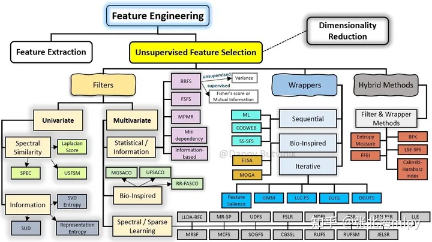

why？当特征数量过多，传统的最小二乘法（Ordinary Least Squares, OLS）回归模型往往会得到过拟合的模型

- 特征之间存在多重共线性，会导致模型参数估计不稳定甚至无法计算
- 并非所有特征都对预测结果有显著影响，一些无关或冗余的特征可能会干扰模型的预测性能。

### 正则化

**Ridge**

- ridge回归，无法直接剔除不重要特征，将不重要特征的回归系数趋于0，使其对预测值影响较小
- L2正则能有效防止模型过拟合，解决非满秩情况下求逆困难问题

**Lasso** 

- lasso回归，将不重要特征的回归系数缩减为0，从而达到剔除的目的
- L1正则，能够系数矩阵，在特征数庞大的情况下进行特征选择

**lasso可用于特征选择，Ridge不可**

### LASSO优化目标是

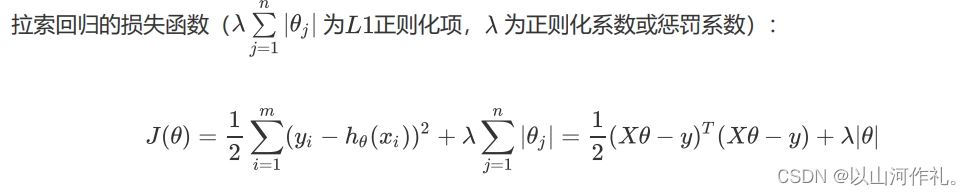

上式不是连续可导的，因此常规的解法如梯度下降法、牛顿法、就没法用了。常用的方法：**坐标轴下降法与最小角回归法**（Least-angle regression (LARS)）。

- [刘建平老师的文章《Lasso回归算法： 坐标轴下降法与最小角回归法小结 》](https://www.cnblogs.com/pinard/p/6018889.html)

#### 坐标下降法

迭代优化算法，求解具有可分离结构的凸优化问题。常用于训练特征数量非常大的大规模线性模型

1. 初始化权重向量w

2. 迭代更新权重系数

   在每次迭代过程中，依次更新每个权重系数 $w_m$ ，保持其他权重不变，对于第 $k$ 次迭代和第 $m$ 个权重系数，更新规则为
   $$
   w_m^{(k)}=\arg\min\limits_{w_m}Cost\left(w_1^{(k)},w_2^{(k-1)},\cdots,w_{m-1}^{(k-1)},w_m,w_{m+1}^{(k-1)},\cdots,w_n^{(k-1)}\right)
   $$
   
3. 判断收敛性与迭代终止

   如果所有权重系数变化非常小，或达到了预设的最大迭代次数，算法停止迭代

**坐标下降法的优势在于其简单性和易于并行化**，尤其适合于解决高维问题，因为每次更新一个变量时，不需要计算所有变量的信息。

然而，由于其更新规则的贪心性质，可能不保证全局最优解，特别是当损失函数非凸时。尽管如此，在实际应用中，坐标下降法通常能给出满意的结果。

- 每次迭代固定其他的权重系数，只朝着其中一个坐标轴的方向更新，最后到达最优解

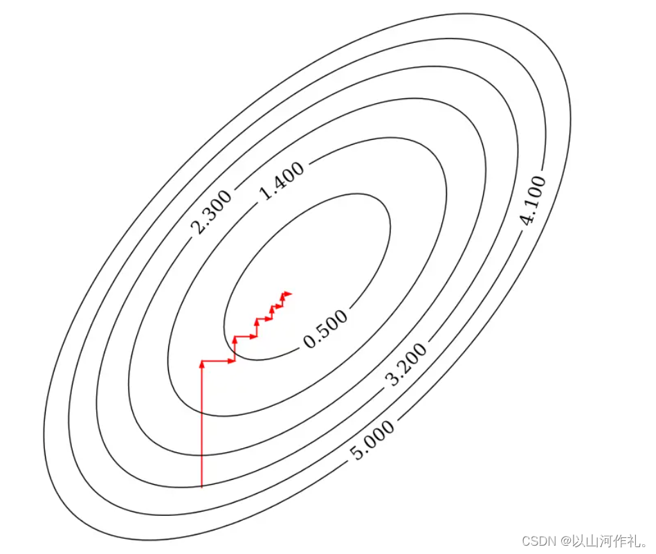

**实现**

```python
import numpy as np

def lassoUseCd(X, y, lambdas=0.1, max_iter=1000, tol=1e-4):
    """
    Lasso回归，使用坐标下降法（coordinate descent）
    args:
        X - 训练数据集
        y - 目标标签值
        lambdas - 惩罚项系数
        max_iter - 最大迭代次数
        tol - 变化量容忍值
    return:
        w - 权重系数
    """
    # 初始化 w 为零向量
    w = np.zeros(X.shape[1])
    for it in range(max_iter):
        done = True
        # 遍历所有自变量
        for i in range(0, len(w)):
            # 记录上一轮系数
            weight = w[i]
            # 求出当前条件下的最佳系数
            w[i] = down(X, y, w, i, lambdas)
            # 当其中一个系数变化量未到达其容忍值，继续循环
            if (np.abs(weight - w[i]) > tol):
                done = False
        # 所有系数都变化不大时，结束循环
        if (done):
            break
    return w

def down(X, y, w, index, lambdas=0.1):
    """
    cost(w) = (x1 * w1 + x2 * w2 + ... - y)^2 + ... + λ(|w1| + |w2| + ...)
    假设 w1 是变量，这时其他的值均为常数，带入上式后，其代价函数是关于 w1 的一元二次函数，可以写成下式：
    cost(w1) = (a * w1 + b)^2 + ... + λ|w1| + c (a,b,c,λ 均为常数)
    => 展开后
    cost(w1) = aa * w1^2 + 2ab * w1 + λ|w1| + c (aa,ab,c,λ 均为常数)
    """
    # 展开后的二次项的系数之和
    aa = 0
    # 展开后的一次项的系数之和
    ab = 0
    for i in range(X.shape[0]):
        # 括号内一次项的系数
        a = X[i][index]
        # 括号内常数项的系数
        b = X[i][:].dot(w) - a * w[index] - y[i]
        # 可以很容易的得到展开后的二次项的系数为括号内一次项的系数平方的和
        aa = aa + a * a
        # 可以很容易的得到展开后的一次项的系数为括号内一次项的系数乘以括号内常数项的和
        ab = ab + a * b
    # 由于是一元二次函数，当导数为零时，函数值最小值，只需要关注二次项系数、一次项系数和 λ
    return det(aa, ab, lambdas)

def det(aa, ab, lambdas=0.1):
    """
    通过代价函数的导数求 w，当 w = 0 时，不可导
    det(w) = 2aa * w + 2ab + λ = 0 (w > 0)
    => w = - (2 * ab + λ) / (2 * aa)

    det(w) = 2aa * w + 2ab - λ = 0 (w < 0)
    => w = - (2 * ab - λ) / (2 * aa)

    det(w) = NaN (w = 0)
    => w = 0
    """
    w = - (2 * ab + lambdas) / (2 * aa)
    if w < 0:
        w = - (2 * ab - lambdas) / (2 * aa)
        if w > 0:
            w = 0
    return w
```

#### 最小角回归

Least Angle Regression, LARS 通过逐步考虑与当前残差最相关的特征来进行变量选择和系数估计。

1. **初始化权重系数** $w$。
2. **计算初始残差向量** $residual$ 其等于目标标签向量 $y$ 减去设计矩阵 $X$ 与权重系数 $w$ 的乘积。在初始化时，$w$ 为零向量，所以残差向量等于目标标签向量 $y$
3. **寻找最相关的特征**。选择一个与当前残差向量 $residual$ 相关性最大的特征向量 $x_i$ 
4. **更新权重系数**。沿选定特征向量 $x_i$  的方向更新权重系数 $w$，直至出现另一个特征向量 $x_j$ ，使得新的残差向量与 $x_i$  和 $x_j$ 的相关性相等。此时，残差向量位于 $x_i$ 和 $x_j$ 的角平分线上。
5. **迭代过程**。重复上述过程，每次迭代中添加一个新的特征向量，并调整权重系数 $w$，以使残差向量位于新加入的特征和其他所有已选特征的等角线上。
6. **终止条件**。当残差向量的大小足够小或所有特征都已考虑过后，算法停止。足够小的残差意味着进一步添加特征不会显著改善模型。

最小角回归法的优势在于其能够提供模型选择的整个过程，从一个简单的模型开始，逐步增加特征直到满足某个停止准则。这种方法易于理解，并且计算高效，特别适合于处理高维数据集。

**实现**

```python
def lassoUseLars(X, y, lambdas=0.1, max_iter=1000):
    """
    Lasso回归，使用最小角回归法（Least Angle Regression）
    论文：https://web.stanford.edu/~hastie/Papers/LARS/LeastAngle_2002.pdf
    args:
        X - 训练数据集
        y - 目标标签值
        lambdas - 惩罚项系数
        max_iter - 最大迭代次数
    return:
        w - 权重系数
    """
    n, m = X.shape
    # 已被选择的特征下标
    active_set = set()
    # 当前预测向量
    cur_pred = np.zeros((n,), dtype=np.float32)
    # 残差向量
    residual = y - cur_pred
    # 特征向量与残差向量的点积，即相关性
    cur_corr = X.T.dot(residual)
    # 选取相关性最大的下标
    j = np.argmax(np.abs(cur_corr), 0)
    # 将下标添加至已被选择的特征下标集合
    active_set.add(j)
    # 初始化权重系数
    w = np.zeros((m,), dtype=np.float32)
    # 记录上一次的权重系数
    prev_w = np.zeros((m,), dtype=np.float32)
    # 记录特征更新方向
    sign = np.zeros((m,), dtype=np.int32)
    sign[j] = 1
    # 平均相关性
    lambda_hat = None
    # 记录上一次平均相关性
    prev_lambda_hat = None
    for it in range(max_iter):
        # 计算残差向量
        residual = y - cur_pred
        # 特征向量与残差向量的点积
        cur_corr = X.T.dot(residual)
        # 当前相关性最大值
        largest_abs_correlation = np.abs(cur_corr).max()
        # 计算当前平均相关性
        lambda_hat = largest_abs_correlation / n
        # 当平均相关性小于λ时，提前结束迭代
        # https://github.com/scikit-learn/scikit-learn/blob/2beed55847ee70d363bdbfe14ee4401438fba057/sklearn/linear_model/_least_angle.py#L542
        if lambda_hat <= lambdas:
            if (it > 0 and lambda_hat != lambdas):
                ss = ((prev_lambda_hat - lambdas) / (prev_lambda_hat - lambda_hat))
                # 重新计算权重系数
                w[:] = prev_w + ss * (w - prev_w)
            break
        # 更新上一次平均相关性
        prev_lambda_hat = lambda_hat

        # 当全部特征都被选择，结束迭代
        if len(active_set) > m:
            break

        # 选中的特征向量
        X_a = X[:, list(active_set)]
        # 论文中 X_a 的计算公式 - (2.4)
        X_a *= sign[list(active_set)]
        # 论文中 G_a 的计算公式 - (2.5)
        G_a = X_a.T.dot(X_a)
        G_a_inv = np.linalg.inv(G_a)
        G_a_inv_red_cols = np.sum(G_a_inv, 1)     
        # 论文中 A_a 的计算公式 - (2.5)
        A_a = 1 / np.sqrt(np.sum(G_a_inv_red_cols))
        # 论文中 ω 的计算公式 - (2.6)
        omega = A_a * G_a_inv_red_cols
        # 论文中角平分向量的计算公式 - (2.6)
        equiangular = X_a.dot(omega)
        # 论文中 a 的计算公式 - (2.11)
        cos_angle = X.T.dot(equiangular)
        # 论文中的 γ
        gamma = None
        # 下一个选择的特征下标
        next_j = None
        # 下一个特征的方向
        next_sign = 0
        for j in range(m):
            if j in active_set:
                continue
            # 论文中 γ 的计算方法 - (2.13)
            v0 = (largest_abs_correlation - cur_corr[j]) / (A_a - cos_angle[j]).item()
            v1 = (largest_abs_correlation + cur_corr[j]) / (A_a + cos_angle[j]).item()
            if v0 > 0 and (gamma is None or v0 < gamma):
                gamma = v0
                next_j = j
                next_sign = 1
            if v1 > 0 and (gamma is None or v1 < gamma):
                gamma = v1
                next_j = j
                next_sign = -1
        if gamma is None:
            # 论文中 γ 的计算方法 - (2.21)
            gamma = largest_abs_correlation / A_a

        # 选中的特征向量
        sa = X_a
        # 角平分向量
        sb = equiangular * gamma
        # 解线性方程（sa * sx = sb）
        sx = np.linalg.lstsq(sa, sb)
        # 记录上一次的权重系数
        prev_w = w.copy()
        d_hat = np.zeros((m,), dtype=np.int32)
        for i, j in enumerate(active_set):
            # 更新当前的权重系数
            w[j] += sx[0][i] * sign[j]
            # 论文中 d_hat 的计算方法 - (3.3)
            d_hat[j] = omega[i] * sign[j]
        # 论文中 γ_j 的计算方法 - (3.4)
        gamma_hat = -w / d_hat
        # 论文中 γ_hat 的计算方法 - (3.5)
        gamma_hat_min = float("+inf")
        # 论文中 γ_hat 的下标
        gamma_hat_min_idx = None
        for i, j in enumerate(gamma_hat):
            if j <= 0:
                continue
            if gamma_hat_min > j:
                gamma_hat_min = j
                gamma_hat_min_idx = i
        if gamma_hat_min < gamma:
            # 更新当前预测向量 - (3.6)
            cur_pred = cur_pred + gamma_hat_min * equiangular
            # 将下标移除至已被选择的特征下标集合
            active_set.remove(gamma_hat_min_idx)
            # 更新特征更新方向集合
            sign[gamma_hat_min_idx] = 0
        else:
            # 更新当前预测向量
            cur_pred = X.dot(w)
            # 将下标添加至已被选择的特征下标集合
            active_set.add(next_j)
            # 更新特征更新方向集合
            sign[next_j] = next_sign

    return w
```

#### 实现

scikit-learn提供了这两种优化算法的Lasso是实现

```python
sklearn.linear_model.Lasso(alpha=1.0, *, fit_intercept=True, normalize='deprecated', precompute=False, copy_X=True,max_iter=1000, tol=0.0001, warm_start=False, positive=False, random_state=None, selection='cyclic')

sklearn.linear_model.lars_path(X, y, Xy=None, *, Gram=None, max_iter=500, alpha_min=0, method='lar', copy_X=True, eps=2.220446049250313e-16, copy_Gram=True, verbose=0, return_path=True, return_n_iter=False, positive=False)
```


## 线性回归

1. 数据预处理
2. 验证数据是否满足某些假设
   1. 判断共线性
   2. 判断正态性
3. 建模与解释
   1. 将权重表组合为一个DataFrame
   2. 获取实例真实值、预测值、置信区间、画图
   3. 观察模型拟合效果
   4. 用文本解释特征权重
   5. 解释截距
   6. 解释特征重要性
   7. 进一步可视化解释权重
   8. 可视化效应图
   9. 效应图解释单个实例

### 数据预处理

- 是否使用全部特征
- 分类变量（季节、天气情况）进行**one-hot编码**，其中**未出现的取值（春、晴）作为参照类别。**
- 原始数据集中的温度、湿度、风速进行了标准化和归一化，**本次处理时将取值恢复了原始值。**
- 链接中的原始数据集修正过季节，但是为了和书上的数据相对应，我使用了旧版的数据集，因此后续对季节的解释可能不符合实际情况。

特征集统一进行z-score标准化

#### 分类特征处理

`OneHotEncoder`：将输入中的 *分类特征* 编码为一个one-hot数值数组，也称为 *one-of-K* 或 *dummy* ，适用于无序的类别特征。

- 如果数据只有一个特征，使用 `array.reshape(-1, 1)` 将数据变形
- 如果仅一个样本，使用 ` array.reshape(1, -1)` 将数据变形

 如果对输出进行编码则使用 `LabelBinarizer` 

```python
OneHotEncoder(dtype=np.int8,handle_unknown='ignore',sparse=False,categories=keep_cate) 
sparse_out: bool, default=True，默认为稀疏矩阵形式
handle_unknown：规定fit中未出现但是transform中出现的值进行'ignore'
categories：指定需要保留的取值（指定后可以通过ohe.categories_查看）
drop：控制如何drop掉多余的列
```

```python
def f_ohe(df,col,new_names=None,keep_cate='auto'):
    '''
    【功能】对一个特征进行one-hot编码
    【参数】df：dataframe,数据集
           col：str,编码的特征名
           new_names: dic,如果需要对取值重命名（使特征名更能表达真实意思）,则新建一个字典，默认None则特征名为col取值
           keep_cate: list,需要保留的取值，如果取值是数值型则需要先排序,例如[[1,3,4]];默认'auto'表示保留所有值
    【返回】dataframe
    【举例】t_season=f_ohe(df=bike,col='season',new_names={1:'冬',3:'夏',4:'秋'},keep_cate=[[1,3,4]])
    '''
    ohe=OneHotEncoder(dtype=np.int8,handle_unknown='ignore',sparse=False,categories=keep_cate) 
    ohe.fit(df[col].values.reshape(-1,1))
    tmp=pd.DataFrame(ohe.transform(df[col].values.reshape(-1,1)))
    org_names=ohe.get_feature_names_out([col]).tolist()  #col作为新生成字段的前缀
    if new_names is None: 
        tmp.columns=org_names
    else:
        new_names_keys=list(new_names.keys()) #获取输入的keys
        new_names_keys=[col+'_'+str(item) for item in new_names_keys] #输入的keys加上col前缀
        # print(new_names_keys) 
        new_names=dict(zip(new_names_keys,list(new_names.values()))) #加上前缀的keys和输入的values重新打包为字典
        # print(new_names)        
        a=list(pd.Series(data=org_names).map(new_names).values) #list不能直接map,把原特征名map转为Series后映射为新特征名       
        tmp.columns=[col+'_'+str(item) for item in a]  #加上col前缀
 
    return tmp
```

使用上述 `f_ohe` 逐一对需要one-hot编码的列进行编码，并与其余特征拼接

```python
t_season=f_ohe(df=bike,col='season',new_names={1:'冬',3:'夏',4:'秋'},keep_cate=[[1,3,4]])

t_weathersit=f_ohe(df=bike,col='weathersit',new_names={2:'雾',3:'雨雪'},keep_cate=[[2,3]])

bike_ohe=pd.concat((bike[['cnt','holiday', 'workingday', 'temp', 'hum', 'windspeed', 'days_since_2011']], t_season,t_weathersit),axis=1)

bike_ohe.to_csv(path+'处理完数据集/bike_ohe.csv',index=False,encoding='utf_8_sig')
```

### 验证数据是否满足一些假设

1.线性：可先不用管。根据基础线性模型建立后的R方判断预测效果。后续如有需要可对基础线性模型进行改造（如添加交互项、使用回归样条等）。

2.正态性：本节对目标变量的正态性进行了检验，检验通过。

3.同方差性：必须建模后再判断，此时无法判断。

4.独立性：除了特殊情况（比如对同一人进行重复测量），一般可认为实例之间相互独立。

5.固定特征：测量无误差，一般都可认为是固定特征。

6.不存在多重共线性：本节进行了检验，检验通过。虽然同时计算了相关系数和VIF，但实践时可以直接以VIF的结论为准。

```python
# 导入one-hot编码后的数据
df=bike_ohe
# 指定标签
label='cnt'

# 找出特征
feas=df.columns.tolist()
feas.remove(label)
print('特征数量:',len(feas))

# 通过特征与标签划分
X_train=df[feas]
y_train=df[label]
print('X_train:',X_train.shape)
print('y_train:',y_train.shape)
```

#### 判断共线性

强相关特征会扰乱对权重的估计和解释（但这通常不会影响模型）

```python
# 1. 计算相关系数（只能判断两两的线性关系）
import matplotlib.pyplot as plt
import seaborn as sns
 
corr_res=X_train.corr()
plt.subplots(figsize=(9, 9))
# 为两两特征的相关性绘制热力图
sns.heatmap(corr_res, annot=True, vmax=1, square=True, cmap="coolwarm")
plt.xticks(fontsize=15) #放大横纵坐标刻度线上的特征名字体
plt.yticks(fontsize=15)
plt.show()

# 2. 计算方差膨胀因子（可以判断三个或更多变量之间的线性关系）
# 1.2.计算方差膨胀因子（可以判断三个或更多变量之间的线性关系）
from statsmodels.stats.outliers_influence import variance_inflation_factor #计算方差膨胀因子
from statsmodels.tools.tools import add_constant  #添加常量
 
def checkVIF(df):
    '''
    【功能】计算方差膨胀因子
    【参数】df:dataframe,特征集（不含target）
    【返回】dataframe，展示各个特征的VIF
    【参考】当0<VIF<10，不存在多重共线性；当10≤VIF<100，存在较强的多重共线性；当VIF≥100，存在严重多重共线性。
    【来源与介绍】https://blog.csdn.net/nixiang_888/article/details/122342338
    【举例】VIF1=checkVIF(X_train)
    '''
    df = add_constant(df) #添加一列常量const作为截距，全部赋值为1（不会改变原数据集）
    name = df.columns
    x = np.matrix(df)
    VIF_list = [variance_inflation_factor(x,i) for i in range(x.shape[1])]
    VIF = pd.DataFrame({'feature':name,"VIF":VIF_list})
    VIF = VIF.drop(index=0) #删除截距const行
    VIF.sort_values(['VIF'],ascending=False,inplace=True)
    VIF['remark']=np.where(VIF['VIF']>=100,'严重多重共线性',np.where(VIF['VIF']>=10,'较强多重共线性','无多重共线性'))
    
    return VIF
 
VIF1=checkVIF(X_train)
VIF1
```

#### 判断正态性

假设目标结果服从正态分布，如违反，则特征权重的估计置信区间无效

```python
def checkNORM(se,p=0.05,alt='two-sided',if_plot=True):
    '''
    【功能】检验一组数据是否符合正态分布
    【参数】se:Series
           p：float,p值，默认0.05
           alt：str,默认双侧检验'two-sided'，可选'less', 'greater'
           if_plot,是否画图，默认True
    【返回】dataframe，展示各个特征的VIF
    【参考】结果返回两个值：statistic → D值，pvalue → P值
    【备注】import matplotlib.pyplot as plt
           %matplotlib inline 
    【举例】 res=checkNORM(y_train)
    '''
    from scipy import stats
 
    print('数据量：',len(se))
    
    u = se.mean()  # 计算均值
    std = se.std()  # 计算标准差
    res=stats.kstest(rvs=se, cdf='norm',args= (u, std), alternative=alt)
    print('p值为:',res[1])
    if res[1]>p:
        print('p值>',p,'符合正态分布')
    else:
         print('p值<=',p,'不符合正态分布')
   
    if if_plot==True:
        fig = plt.figure(figsize = (10,6))         
        se.hist(bins=30,alpha = 0.5) #直方图 alpha表示透明度
        se.plot(kind = 'kde', secondary_y=True) #核密度估计KDE
        plt.show()
 
 
    return res

# 检验某一特征的取值是否符合正态分布
res=checkNORM(y_train)
```

### 建模

线性模型的库有：statsmodels库；sklearn库。其中statsmodels库的信息更多、更全。

```python
from statsmodels.regression.linear_model import OLS,GLS #Ordinary least squares普通最小二乘法
import statsmodels.formula.api as smf
import statsmodels.api as sm
 
#建模方式1：使用smf.ols，自己编写formula，会自动添加常数列
#cnt为目标变量，分类特征可使用C(season)进行编码，由于本数据集的分类特征都已事先编码，因此不需要添加c()
model=smf.ols(formula='cnt ~  season_夏 +  season_秋 + season_冬 + holiday + workingday +weathersit_雾 + weathersit_雨雪 + temp + hum + windspeed +days_since_2011 ',data=df)
results=model.fit()
results.summary()

#建模方式2：使用sm.OLS，需要先sm.add_constant添加常数列以计算截距
X = sm.add_constant(X_train)
model=sm.OLS(endog=y_train,exog=X)
results=model.fit()
results.summary()
```

#### 将权重表的值组合为一个DataFrame

```python
# 获取模型的权重
df_coef=pd.DataFrame(results.params)
df_coef.reset_index(inplace=True)
df_coef.columns=['feature','coef']
#获取权重的置信区间下限
df_coef['lw']=results.conf_int(alpha=0.05)[0].values 
#获取权重的置信区间上限
df_coef['up']=results.conf_int(alpha=0.05)[1].values 
#权重的标准误std err
df_coef['SE']=results.bse.values 
#权重的t统计量，等于权重/标准误
df_coef['t']=results.tvalues.values 
#参数的t统计的双尾 p 值
df_coef['p']=results.pvalues.values 
#求绝对值
df_coef['t_abs']=abs(df_coef['t']) 
#根据已有的权重和置信区间计算上下误差，计算完毕后发现上下误差相同
df_coef['lw_err']=df_coef['coef']-df_coef['lw'] 
df_coef['up_err']=df_coef['up']-df_coef['coef']
df_coef
```

#### 获取实例的真实值、预测值、置信区间，画图

```python
#获取置信区间的上下限
pred_ols = results.get_prediction()
iv_l = pred_ols.summary_frame()["obs_ci_lower"]
iv_u = pred_ols.summary_frame()["obs_ci_upper"]
 
#results.fittedvalues为模型预测值
target_df=pd.concat((y_train,results.fittedvalues,iv_l,iv_u),axis=1)
target_df.columns=['true','predict','ci_lower','ci_upper']
target_df['resid']=results.resid #残差
target_df
 
#按实际租赁量排序，reset_index是必须的
plot_df=target_df.sort_values(['true']).reset_index(drop=True)
 
fig, ax = plt.subplots(figsize=(20, 9))
 
ax.plot(plot_df['true'], "b-", label="True")
ax.plot(plot_df['predict'], "r", label="Pred")
# ax.plot(plot_df['ci_lower'], "r--",alpha=0.5) #置信区间虚线
# ax.plot(plot_df['ci_upper'], "r--",alpha=0.5) #置信区间虚线
plt.fill_between(plot_df.index,plot_df['ci_lower'],plot_df['ci_upper'],color='blue',alpha=0.15)
ax.legend(loc="best")
 
 
plt.ylabel('自行车租赁量',fontsize=18)
plt.title('真实值与预测值对比',fontsize=20)
plt.show()
```

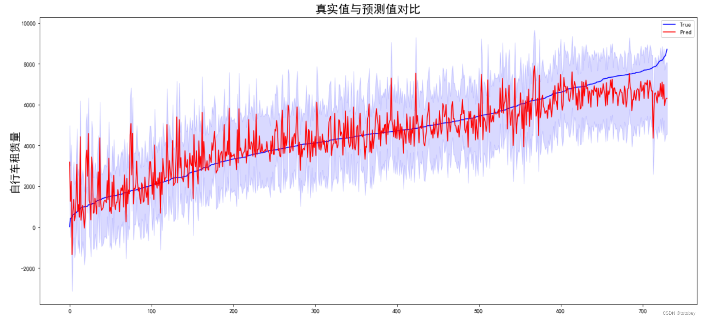

蓝线为真实值，红色实线为预测值，蓝紫色为置信区间。

左侧租赁量较小时，部分预测值远高于真实值且波动较大；右侧租赁量较大时，预测值整体偏低。

由此图也可以看出，前文中提到的线性回归模型的【同方差性】在现实中是很难满足的。

本案例数据量较小，如果数据量较大，可以随机抽样后再画图。 

```python
#残差——同方差性
#1.应该为均值是0的正态分布
sns.set(style="whitegrid",font_scale=1.2)#设置主题，文本大小
plt.hist(target_df['resid'])
plt.show()
```

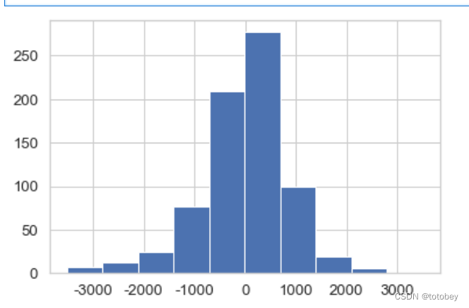

```python
#2.残差与predict之间应该不相关
#regplot默认参数线性回归图
plt.figure(figsize=(8, 8))
sns.set(style="whitegrid",font_scale=1.2)#设置主题，文本大小
g=sns.regplot(x='resid', y='predict', data=target_df,
             color='#000000',#设置marker及线的颜色
             # marker='*',#设置marker形状
             )
```

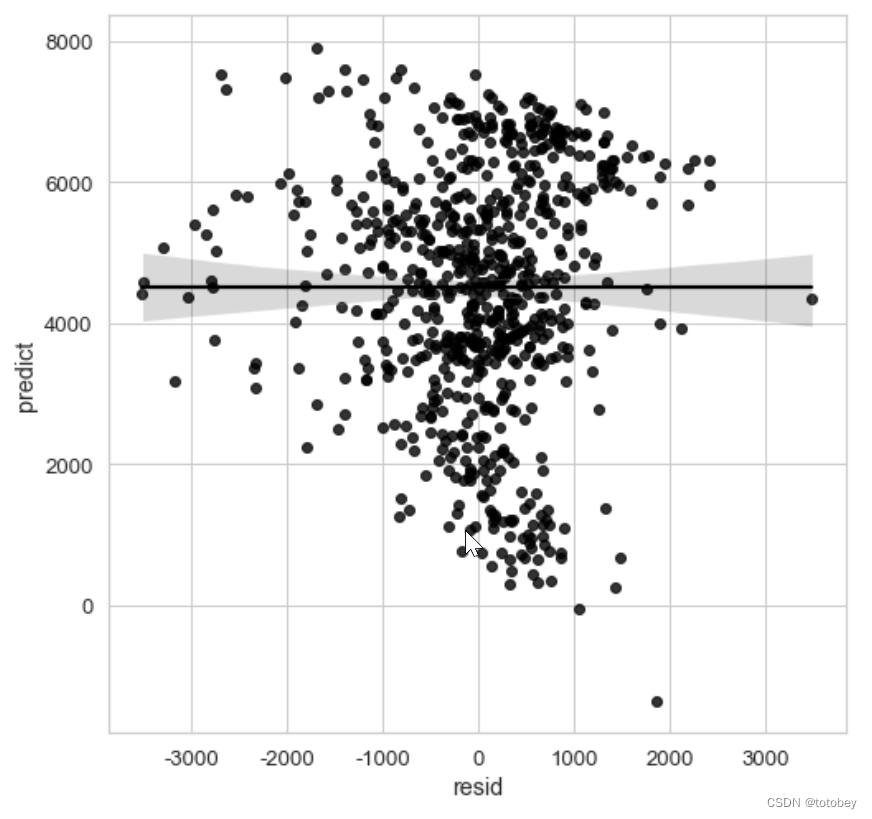

### 模型解释

#### 拟合优度

R方=0.79，表示该模型解释了目标结果79%的方差，拟合优度较高，可解释性较高

#### 特征重要性

使用t-统计量的绝对值解释特征重要性。

特征重要性随权重增加而增加，随方差增加而减少（方差越大表明对正确值的把握越小）
$$
t=\frac{coef}{\text{std err}}
$$
进行数据处理（求绝对值、排序）后画图

```python
plot_df=df_coef.drop(index='Intercept') #删除截距行
plot_df=plot_df.sort_values(['t_abs']) #排序
 
fig = plt.figure(figsize = (9,5))
plt.barh(plot_df.index,plot_df['t_abs']) #画水平条形图
 
#设置x轴y轴
plt.xlabel('t-value绝对值',fontsize=18)
plt.ylabel('特征',fontsize=18)
plt.xticks(fontsize=12) #放大横纵坐标刻度线上的特征名字体
plt.yticks(fontsize=12)
plt.title('特征重要性',fontsize=20)
plt.show()
```

##### 不用权重代表特征重要性原因

改变特征量纲，权重就会发生变化

为进行验证，将风速的单位从km/h转换为km/分钟，即将风速的原始值除以60

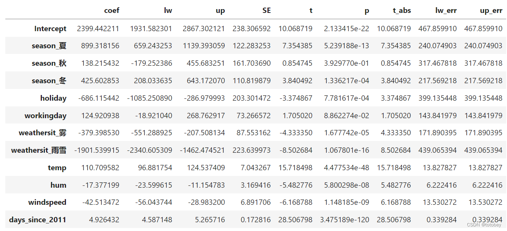

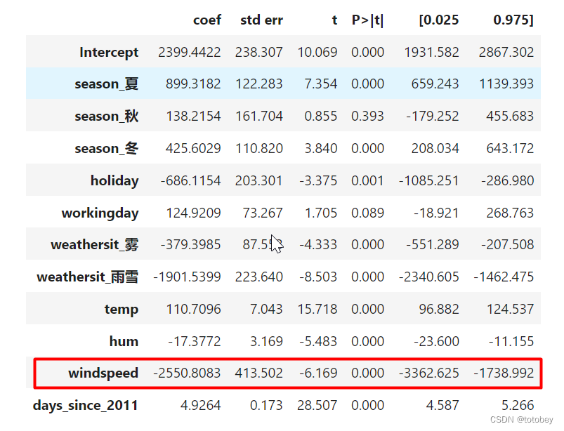

> 结论：
>
> 其他特征的估计均不变。风速的部分估计发生了变化
>
> 权重（coef）：扩大了60倍
>
> 权重标准误（std err）：扩大了60倍
>
> t统计量：不变（t=权重/标准误）
>
> p值：不变
>
> 置信区间：扩大了60倍

所以在风速的本质并未发生改变的情况下，如果采用权重（coef）作为特征重要性的度量依据，就会发现其值会随着量纲的变化而变化，但t统计量却可以保持一致。

#### 根据权重和置信区间画权重图

```python
plot_df=df_coef.drop(index='Intercept') #删除截距行
fig = plt.figure(figsize = (8,8))
#由于上下误差相同，因此直接用 xerr=plot_df['lw_err']，否则可以使用xerr=plot_df[['lw_err','up_err']].T.values来分别规定上下限
plt.errorbar(x=plot_df['coef'], y=plot_df.index,xerr=plot_df['lw_err'], color="black", capsize=3,
             linestyle="None",
             marker="s", markersize=7, mfc="black", mec="black")
 
plt.grid(True) #显示网格线
 
plt.xlabel('权重估计',fontsize=18)
plt.ylabel('特征',fontsize=18)
plt.xticks(fontsize=12) #放大横纵坐标刻度线上的特征名字体
plt.yticks(fontsize=12)
plt.title('权重估计图',fontsize=20)
 
plt.axvline(c="c",ls="--",lw=2) #原点竖线
plt.show()
```

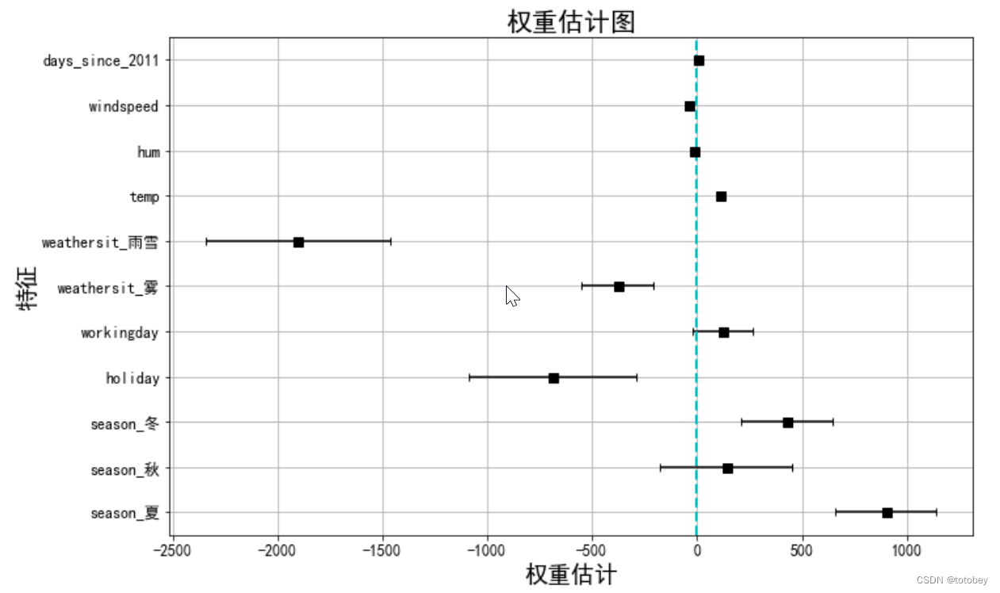

> 由上图可知：
>
> 1.雨雪天气对自行车租赁量有很大的负效应。
>
> 2.是否工作日的权重接近于0，并且95%的置信区间包含0，这表明该效应在统计上不显著。
>
> 3.温度的置信区间很短，估计值接近于0，但特征效应在统计上是显著的。
>
> 
>
> 权重图的问题：
>
> 各个特征的量纲不一样，比如天气情况反映了晴天和雨雪天的差异，但是温度只反映了1℃的变化情况。
>
> 因此可以通过**在建模前对特征进行标准化（均值为0，标准差为1），使估计的权重更具有可比性。**

#### 效应图

效应图（effect plot）帮助了解权重和特征的组合对数据预测的贡献程度。**特征效应为每个特征的权重乘以实例的特征值。** 如改变特征的量纲，则权重会发生变化，但特征效应不会改变

通过画箱线图（注意，分类特征总结为一个箱线图），可以观察下面几个方面：

1. 特征效应的正负性
2. 特征效应的绝对值大小
3. 特征效应的方差（如果方差小，则意味着这个特征几乎在所有实例中都有类似的贡献）

```python
#求特征效应——每个特征的权重乘以实例的特征值
w=df_coef['coef'].values
w_order=[] #将特征权重与实例中的顺序一一对应
my_dict={0:4,1:5,2:8,3:9,4:10,5:11,6:3,7:1,8:2,9:6,10:7} #权重表与数据集中特征的对应顺序
for i in range(11):
    w_order.insert(i,w[my_dict[i]])
    
#计算特征效应    
effect=X_train*w_order 
 
#分类特征合并
effect['season']=np.sum(effect[['season_冬','season_夏','season_秋']],axis=1)
effect['weathersit']=np.sum(effect[['weathersit_雾','weathersit_雨雪']],axis=1)
effect
```

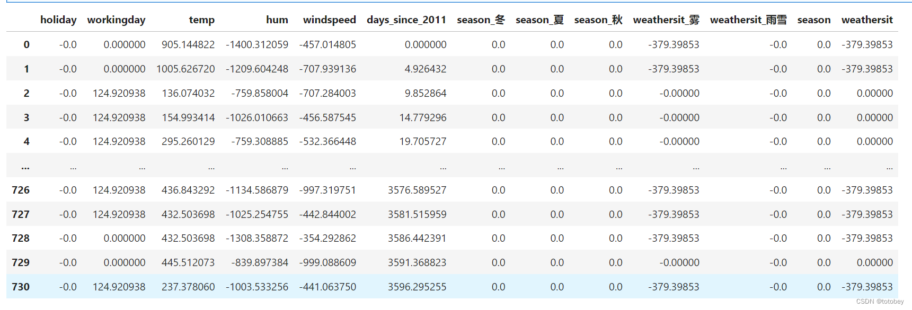

```python
plt.subplots(figsize=(9, 9))
 
cols=['holiday', 'workingday', 'temp', 'hum', 'windspeed', 'days_since_2011',
       'season', 'weathersit']
sns.boxplot(data=effect[cols],orient="h",width=0.5,whis=0.5, palette="Set2")
 
plt.grid(True) #显示网格线
 
plt.xlabel('特征效应',fontsize=18)
plt.ylabel('特征',fontsize=18)
plt.xticks(fontsize=12) #放大横纵坐标刻度线上的特征名字体
plt.yticks(fontsize=12)
plt.title('特征效应图',fontsize=20)
 
plt.axvline(c="c",ls="--",lw=2) #原点竖线
plt.show()
```

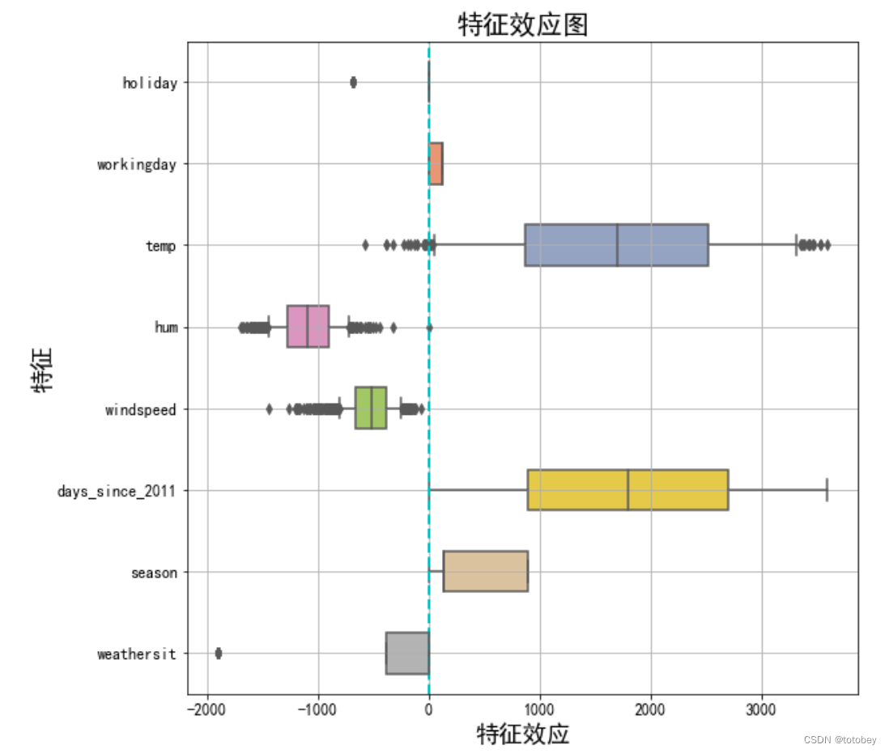

>  由上图可知：
>
> 1.对预测自行车租赁数量正向贡献最大的来自温度和天数。
>
> 2.天气的情况参照类别为晴天，图中说明除了晴天外的天气（雾、雨雪）都会对自行车租赁量产生负向影响。

## lasso特征选择

https://blog.csdn.net/totobey/article/details/124994579

首先想到的是降维，争取用尽可能少的数据解决问题。Lasso使用L1正则化对权重加大惩罚，可以使很多权重估计值为0

### 数据预处理

```python
import numpy as np
import pandas as pd
import time  #统计运行时间用
import copy  #深拷贝的时候用
import _pickle as cPickle
import gc #释放内存使用
from tqdm import tqdm,tqdm_notebook  #Tqdm 是一个快速，可扩展的Python进度条
import datetime #处理时间数据
import os

## 1. 标准化
scaler = StandardScaler()  # 标准化 z = (x - u) / s
X_train_std = pd.DataFrame(scaler.fit_transform(X_train))
X_train_std.columns=X_train.columns
X_train_std

## 2. 对分类特征one-hot编码
```

### 运行lasso

```python
def select_feas_lasso(trainX,trainy,metric_name='rmse',kfNum=2):
    '''
        【功能说明】 
        【参数】trainX:DataFrame,训练集的特征部分，需要先进行标准化，one-hot编码需要保留参照类别
               trainy:Series，训练集的标签列
               metric_name:str，评估指标，默认'rmse',可选'logloss','auc'
               kfNum:int,>=2,默认2，交叉验证轮数
        【返回】字典，包含参数array，评估指标均值、标准差，保留特征数均值、标准差
        【举例】scaler = StandardScaler()  # 标准化 z = (x - u) / s
               X_train_std = pd.DataFrame(scaler.fit_transform(X_train))
               res=select_feas_lasso(trainX=X_train_std,trainy=y_train,metric_name='rmse',kfNum=2)
               lasso_alphas=res['lasso_alphas']
               valid_scores=res['valid_scores']
               keep_var_nums=res['keep_var_nums']
        【版本】V1.0
    '''
    s=time.time()
    print('\n********lasso_select_feas...start')
    print('评估指标：',metric_name)
    print('交叉验证轮数：',kfNum)
    print('训练集形状：',trainX.shape,type(trainX))
 
    #对于#0.001-100，使用logspace
    lasso_alphas1 = np.logspace(start=-3, stop=2, num=50, base=10) #0.001-100
    #对于比较大的lambda，使用整数步长
    lasso_alphas2 = np.arange(start=100,stop=1000,step=20)
    lasso_alphas= np.concatenate((lasso_alphas1, lasso_alphas2))
    print('待计算正则化参数数量：',len(lasso_alphas))
    print('待计算正则化参数最小值：',np.min(lasso_alphas))   
    print('待计算正则化参数最大值：',np.max(lasso_alphas))   
 
    valid_scores = [] #存储每个正则化参数下的评估指标均值如rmse
    keep_var_nums = [] #存储每个正则化参数下保留的特征数量均值
    valid_scores_std = [] #标准差
    keep_var_nums_std = []  #标准差
    for  alpha in tqdm(lasso_alphas):
        clf = Lasso(max_iter=1000,random_state=2020,alpha=alpha)
        kf=KFold(n_splits=kfNum, shuffle=True, random_state=2020)
        valid_score=[]  #存储每轮交叉验证的评估指标如rmse
        keep_var_num=[] #存储每轮交叉验证保留特征数量
        for i,(trn_index,val_index) in enumerate(kf.split(trainX,trainy)):  #i从0开始，可以显示第几轮了
            trn_df=trainX.iloc[trn_index]
            val_df=trainX.iloc[val_index]            
            trn_y=trainy.iloc[trn_index]
            val_y=trainy.iloc[val_index]
 
            clf.fit(X=trn_df, y=trn_y)
            #利用本轮模型预测本轮验证集  
            valid_pred=clf.predict(val_df)
            #-------计算本轮评估指标--------#
            if metric_name == 'rmse':
                valid_score_this=mean_squared_error(val_y,valid_pred,squared=True)
            elif metric_name == 'logloss':
                valid_score_this=log_loss(y_true=val_y,y_pred=valid_pred)
            elif metric_name == 'auc':
                valid_score_this=roc_auc_score(y_true=val_y,y_score=valid_pred)
            else:
                print('亲，没这评估指标')
                return
        
            valid_score.append(valid_score_this)  #列表append后直接替换原对象，所以不用再赋值
            # print(valid_score)
            keep_var_num=sum(clf.coef_ != 0) #统计系数不为0的特征数量（不含截距）
            # print(keep_var_num)
        valid_scores.append(np.mean(valid_score)) #metric取均值，存入
        keep_var_nums.append(np.mean(keep_var_num)) #保留特征数量取均值，存入
        valid_scores_std.append(np.std(valid_score)) #metric取标准差，存入
        keep_var_nums_std.append(np.std(keep_var_num)) #保留特征数量取均值取标准差，存入
          
    res={'lasso_alphas':lasso_alphas,
         'valid_scores':valid_scores,'valid_scores_std':valid_scores_std,
         'keep_var_nums':keep_var_nums,'keep_var_nums_std':keep_var_nums_std}
    
    return res
 
res=select_feas_lasso(trainX=X_train_std,trainy=y_train,metric_name='rmse',kfNum=2)
```

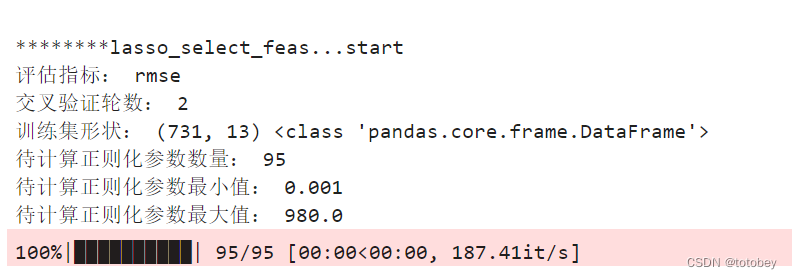

### 以正则化参数为x轴，特征数量、评估指标为双y轴画图

```python
lasso_alphas=res['lasso_alphas']
valid_scores=res['valid_scores']
keep_var_nums=res['keep_var_nums']
mertic_name='RMSE'
 
fig  = plt.figure(figsize=(18, 8))
ax1=fig.add_subplot(111)
ax1.plot(lasso_alphas,keep_var_nums, "b-o",label='特征数量') #画出折线并且添加实心圆点
ax1.set_ylabel('特征数量',fontsize=20)
ax1.grid(True) #显示网格线
xmajorLocator  = MultipleLocator(100)  # x轴刻度间隔 100
ymajorLocator  = MultipleLocator(1)    # y轴刻度间隔 1
ax1.yaxis.set_major_locator(ymajorLocator) 
ax1.xaxis.set_major_locator(xmajorLocator) 
plt.xlabel('正则化参数',fontsize=18) #添加x轴名称
 
ax2 = ax1.twinx()
ax2.plot(lasso_alphas,valid_scores, "r-D",label=mertic_name)  #画出折线并且添加实心菱形
ax2.set_ylabel(mertic_name,fontsize=20)
 
 
ax1.legend(loc='center left',fontsize=15) #添加图例
ax2.legend(loc='center right',fontsize=15)
 
 
plt.title('lasso',fontsize=30) 
plt.show()
```

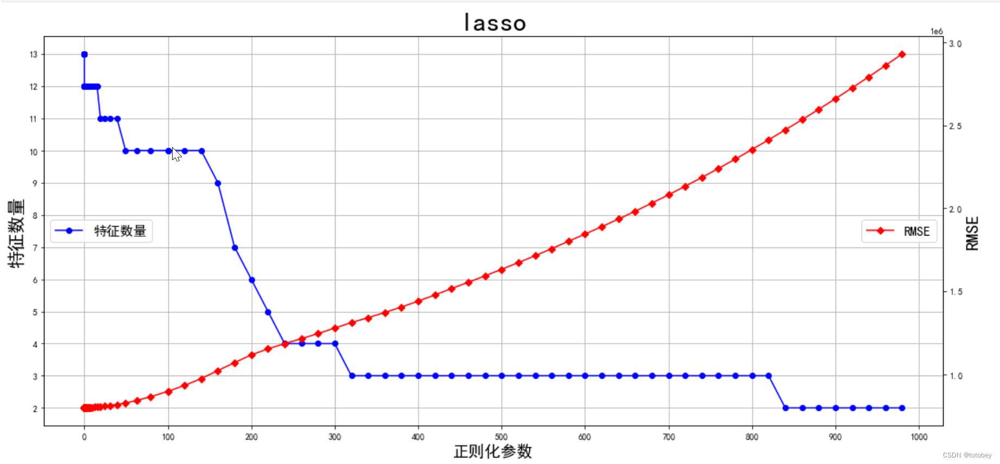

**较大的 alpha 值会导致更强的正则化，从而选择更少的特征**。

**较小的 alpha 值会选择更多的特征**。

### 参照图，找到模型预测效果+保留特征数量均合适的正则化参数值 

如何选择正则化超参数：将其视为一个待优化参数，通过交叉验证找到模型预测效果+保留特征数量都合适的值

```python
### 保留5个变量（示例）
# 由于画图使用的是交叉验证，后续用的是全量实例，因此正则化参数值可能会有微小区别。  
# 以上图的正则化参数值220为基础，调试后将其设定为250  
# 找到保留的5个变量
best_clf = Lasso(max_iter=1000,random_state=2020,alpha=250)
best_clf.fit(X=X_train_std, y=y_train)
coef=pd.Series(best_clf.coef_,index=best_clf.feature_names_in_)
coef
```

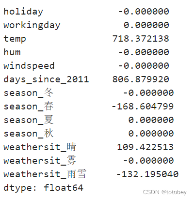

```python
#连续型变量直接入选（temp、days_since_2011 ）
#上表中，季节中只有春季入选，因此其他三个季节（非春季）统一构成参照类别。这与基础线性回归时将春单独作为参照类别有很大不同，后续进行模型解释时要特别注意
#上表中，天气情况入选的为晴、雨雪，最终选择雾、雨雪。变更后本质一样，只是将参照类别从雾变更为了晴以提高可解释性
keep_var5=['temp','days_since_2011','season_春','weathersit_雾','weathersit_雨雪']
```

scikit-learn 的Lasso实现中，更常用的是LassoCV(沿着正则化路径具有迭代拟合的线性模型)，对超参数 $\alpha$ 进行交叉验证，选择一个合适的值。

```python
### 参数
eps：路径的长度。eps=1e-3意味着alpha_min / alpha_max = 1e-3。
n_alphas:沿正则化路径的Alpha个数，默认100。
alphas：用于计算模型的alpha列表。如果为None，自动设置Alpha。
fit_intercept：是否估计截距，默认True。如果为False，则假定数据已经中心化。
tol：优化的容忍度，默认1e-4：如果更新小于tol，优化代码将检查对偶间隙的最优性，并一直持续到它小于tol为止
cv：定交叉验证拆分策略

### 属性

alpha_：交叉验证选择的惩罚量
coef_：参数向量（目标函数公式中的w）。
intercept_：目标函数中的截距。
mse_path_：每次折叠不同alpha下测试集的均方误差。
alphas_：对于每个l1_ratio，用于拟合的alpha网格。
dual_gap_：最佳alpha（alpha_）优化结束时的双重间隔。
n_iter_ int：坐标下降求解器运行的迭代次数，以达到指定容忍度的最优alpha。

### 方法

fit(X, y[, sample_weight, check_input]) 用坐标下降法拟合模型。
get_params([deep]) 获取此估计器的参数。
path(X, y, *[, l1_ratio, eps, n_alphas, …]) 计算具有坐标下降的弹性网路径。
predict(X) 使用线性模型进行预测。
score(X, y[, sample_weight]) 返回预测的确定系数R ^ 2。
set_params(**params) 设置此估算器的参数。
```

### 线性回归+建模解释

与线性回归区别在于训练特征

```python
df=bike_ohe_comp
label='cnt'
 
feas=df.columns.tolist()
feas.remove(label)
print('特征数量:',len(feas))

# 区别
X_train=df[keep_var5]
y_train=df[label]
print('X_train:',X_train.shape)
print('y_train:',y_train.shape)
```

## 示例

### 波士顿房价

```python
## 导入库 
import numpy as np
import pandas as pd
import matplotlib.pyplot as plt
from sklearn.model_selection import train_test_split
from sklearn.preprocessing import StandardScaler
from sklearn.linear_model import Lasso
import warnings
warnings.filterwarnings('ignore')
##  读取数据
url = r'F:\100-Days-Of-ML-Code\datasets\Regularization_Boston.csv'
df = pd.read_csv(url)

# 数据标准化
scaler=StandardScaler()
df_sc= scaler.fit_transform(df)

# 训练集划分
df_sc = pd.DataFrame(df_sc, columns=df.columns)
y = df_sc['price']
X = df_sc.drop('price', axis=1) # becareful inplace= False
X_train, X_test, y_train, y_test = train_test_split(X, y, test_size=0.2)
```

Lasso调参数，主要就是选择合适的alpha，上面提到LassoCV，GridSearchCV都可以实现

为绘图，手动实现

```python
lasso = Lasso()
coefs_lasso = []

# 超参数步长
alpha_lasso = 10**np.linspace(-3,1,100)

for i in alpha_lasso:
    lasso.set_params(alpha = i)
    lasso.fit(X_train, y_train)
    coefs_lasso.append(lasso.coef_)
    
plt.figure(figsize=(12,10))
ax = plt.gca()
ax.plot(alpha_lasso, coefs_lasso)
ax.set_xscale('log')
plt.axis('tight')
plt.xlabel('alpha')
plt.ylabel('weights: scaled coefficients')
plt.title('Lasso regression coefficients Vs. alpha')
plt.legend(df.drop('price',axis=1, inplace=False).columns)
plt.show()
```

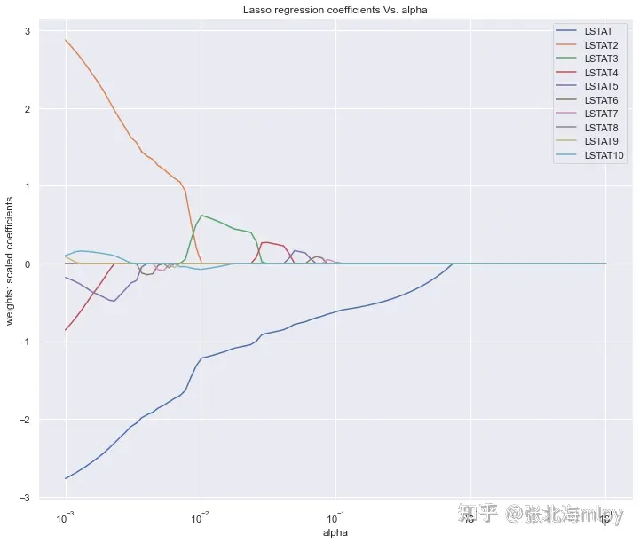

图中展示的是不同的变量随着alpha惩罚后，其系数的变化，我们要保留的就是系数不为0的变量。

**alpha值不断增大时系数才变为0的变量在模型中越重要** 

- 正则化整体上是损害优化，使参数尽可能趋于0，而重要变量的系数比较大，只有正则作用比较大时，才会令其趋于0

按系数绝对值大小倒序查看特征重要性，可以设置更大的超参数，可以看到更多的变量系数被压缩为0

```python
lasso = Lasso(alpha=10**(-3))
model_lasso = lasso.fit(X_train, y_train)
coef = pd.Series(model_lasso.coef_,index=X_train.columns)
# 输出排序
print(coef[coef != 0].abs().sort_values(ascending = False))

LSTAT2 2.876424
LSTAT 2.766566
LSTAT4 0.853773
LSTAT5 0.178117
LSTAT10 0.102558
LSTAT9 0.088525
LSTAT8 0.001112
dtype: float64
```

```python
lasso = Lasso(alpha=10**(-2))
model_lasso = lasso.fit(X_train, y_train)
coef = pd.Series(model_lasso.coef_,index=X_train.columns)
print(coef[coef != 0].abs().sort_values(ascending = False))

LSTAT 1.220552
LSTAT3 0.625608
LSTAT10 0.077125
dtype: float64
```

或者直接绘制柱状图

```python
fea = X_train.columns
a = pd.DataFrame()
a['feature'] = fea
a['importance'] = coef.values

a = a.sort_values('importance',ascending = False)
plt.figure(figsize=(12,8))
plt.barh(a['feature'],a['importance'])
plt.title('the importance features')
plt.show()
```

LASSO回归的优点是可以你不最小二乘法的不足，可以很好的进行特征选择

缺点是，LASSO 特征选择的结果可能会受到特征之间相关性的影响。如果您的数据集中存在高度相关的特征，LASSO 可能会随机选择其中之一

在这种情况下，您可能需要考虑使用其他方法，如 Elastic Net（结合了 LASSO 和 Ridge 回归）。


### 模拟

基于scikit-learn的Lasso特征选择

```python
'''
claude35
'''

import numpy as np
from sklearn.datasets import make_regression
from sklearn.linear_model import Lasso
from sklearn.preprocessing import StandardScaler

# 生成示例数据
# X为100个样本，20个变量维度，noise：噪声水平，random_state指定的随机数种子
# 回归模型，利用带噪声数据y'=X*w+b+noise，拟合\hat{y}=f(X),
X, y, coef = make_regression(n_samples=100, n_features=20, noise=0.1, coef=True, random_state=42)

# 使用log1p对X和y进行归一化
X_log = np.log1p(np.abs(X))
y_log = np.log1p(np.abs(y))

# 标准化特征，使得不同特征具有相同的尺度，方便后续的模型训练和预测。
scaler = StandardScaler()
X_scaled = scaler.fit_transform(X_log)

# 创建LASSO模型，alpha为正则项权重 Y=W*X+b
# 损失函数为L1正则的最小二乘损失，alpha为正则超参数，alpha越小，模型越接近没有正则化的情况，即模型越接近原始模型
# 默认情况下，如在scikit-learn中，alpha=1.0，意味着有较强的正则化作用。
lasso = Lasso(alpha=0.1)

# 拟合模型
lasso.fit(X_scaled, y_log)

# 获取特征重要性
feature_importance = np.abs(lasso.coef_)

# 选择非零系数对应的特征
selected_features = np.where(feature_importance > 0)[0]

print("选中的特征索引:", selected_features)
print("选中的特征数量:", len(selected_features))
print("特征重要性:", feature_importance[selected_features])

# 获取原始特征名称（假设特征有名称）
original_feature_names = [f"Feature_{i}" for i in range(X.shape[1])]
selected_feature_names = [original_feature_names[i] for i in selected_features]

print("选中的特征名称:", selected_feature_names)
```

使用 log1p 变换的好处包括：

- 它可以帮助处理偏斜分布的数据，使其更接近正态分布。
- 它可以压缩大的值，同时保留小的值的差异。
- 对于零值，log1p (0) = 0，所以它可以安全地处理包含零的数据。

## LASSO收敛

LASSO 通常使用坐标下降法（coordinate descent）等优化算法来求解，这些算法在一定条件下会停止迭代以保证收敛。

### 收敛条件

1. **迭代次数限制**：大多数优化算法允许你设置最大迭代次数。如果达到这个次数，算法将停止，即使它还没有完全收敛。
2. **容忍度（Tolerance）**：这通常指的是在连续两次迭代之间的目标函数值或系数变化的阈值。如果变化小于这个阈值，算法认为已经收敛。
3. **检查系数变化**：在每次迭代后检查系数向量的变化量。如果变化量小于某个预设的容忍度，则停止迭代。

### 递增LASSO特征选择

1. 初始化训练集：开始时64个样本
2. 训练LASSO模型：使用当前训练集训练LASSO模型
3. 检查收敛性：判断收敛条件是否满足
4. 不收敛则增加数据：增加64个样本
5. 重新训练
6. 重复3-5，直至模型收敛
7. 特征选择：模型收敛，则选择系数非0的特征

**代码**

```python
import numpy as np
from sklearn.linear_model import Lasso
from sklearn.datasets import make_regression
from sklearn.model_selection import train_test_split

def check_convergence(model, X, y, tol=1e-4):
    # 简单的收敛检查,可以根据需要调整
    y_pred = model.predict(X)
    mse = np.mean((y - y_pred) ** 2)
    return mse < tol

def chech_coef_change(lasso):
    # 检查系数变化是否小于容忍度
    return np.all(np.abs(lasso.coef_ - np.zeros_like(lasso.coef_)) <= tolerance)

def lasso_feature_selection():
    # 生成模拟数据
    X, y = make_regression(n_samples=1000, n_features=100, noise=0.1, random_state=42)
    
    # 初始训练集
    X_train, X_test, y_train, y_test = train_test_split(X, y, train_size=64, random_state=42)
    
    # 初始化LASSO模型
    lasso = Lasso(alpha=0.1, random_state=42)
    
    converged = False
    while not converged:
        # 训练模型
        lasso.fit(X_train, y_train)
        
        # 检查收敛性
        converged = check_convergence(lasso, X_train, y_train)
        
        if not converged:
            # 如果没有收敛,增加64个样本
            if len(X_train) + 64 <= len(X):
                X_new, _, y_new, _ = train_test_split(X_test, y_test, train_size=64, random_state=42)
                X_train = np.vstack((X_train, X_new))
                y_train = np.concatenate((y_train, y_new))
                X_test = np.delete(X_test, range(64), axis=0)
                y_test = np.delete(y_test, range(64))
            else:
                print("没有更多数据可以添加,模型未收敛")
                break
    
    # 特征选择
    selected_features = np.where(lasso.coef_ != 0)[0]
    
    return lasso, selected_features

# 运行算法
model, selected_features = lasso_feature_selection()

print("选择的特征索引:", selected_features)
print("选择的特征数量:", len(selected_features))
```


```python
import numpy as np
from sklearn.linear_model import Lasso
from sklearn.datasets import make_regression
from sklearn.model_selection import train_test_split

def check_convergence(current_order, previous_order, overlap_length):
    """
    检查两个排序是否在指定长度内收敛

    参数:
    current_order : array_like
        当前迭代的特征排序
    previous_order : array_like
        上一次迭代的特征排序
    overlap_length : int
        需要保持一致的前 n 个元素的数量

    返回:
    bool
        如果前 overlap_length 个元素完全一致，返回 True；否则返回 False
    """
    # 确保两个数组至少有 overlap_length 个元素
    if len(current_order) < overlap_length or len(previous_order) < overlap_length:
        return False

    # 比较前 overlap_length 个元素
    return np.array_equal(current_order[:overlap_length], previous_order[:overlap_length])

def get_nonzero_features_order(coef):
    # 获取非零特征的索引，并按照系数绝对值大小排序
    nonzero_indices = np.nonzero(coef)[0]
    return nonzero_indices[np.argsort(np.abs(coef[nonzero_indices]))[::-1]]

def lasso_feature_selection():
    # 生成模拟数据
    X, y = make_regression(n_samples=10000, n_features=100, noise=0.1, random_state=42)

    # 初始训练集
    X_train, X_pool, y_train, y_pool = train_test_split(X, y, train_size=64, random_state=42)

    # 初始化LASSO模型，random_state为随机种子，
    lasso = Lasso(alpha=0.1, random_state=42)

    converged = False
    previous_order = np.array([])
    iteration = 0

    while not converged:
        # 训练模型
        lasso.fit(X_train, y_train)

        # 获取当前非零特征的排序
        current_order = get_nonzero_features_order(lasso.coef_)

        # 检查收敛性
        if iteration > 0:  # 从第二次迭代开始检查
            converged = check_convergence(current_order, previous_order)

        if not converged:
            # 如果没有收敛,增加样本
            if len(X_pool) >= 64:
                X_new, X_pool, y_new, y_pool = train_test_split(X_pool, y_pool, train_size=64, random_state=42)
                X_train = np.vstack((X_train, X_new))
                y_train = np.concatenate((y_train, y_new))
            else:
                # 如果剩余样本不足64个，添加所有剩余样本
                X_train = np.vstack((X_train, X_pool))
                y_train = np.concatenate((y_train, y_pool))
                X_pool = np.array([])
                y_pool = np.array([])

            print(f"迭代 {iteration + 1}: 当前训练集大小: {len(X_train)}")

            if len(X_pool) == 0:
                print("所有可用数据已用完，模型仍未收敛")
                break

        previous_order = current_order
        iteration += 1

# 特征选择
selected_features = np.nonzero(lasso.coef_)[0]

return lasso, selected_features, iteration
# 运行算法
model, selected_features, total_iterations = lasso_feature_selection()

print("选择的特征索引:", selected_features)
print("选择的特征数量:", len(selected_features))
print("总迭代次数:", total_iterations)
print("最终非零特征排序:", get_nonzero_features_order(model.coef_))
```


