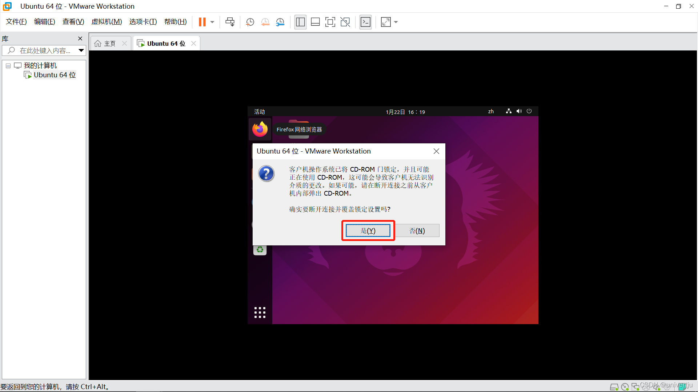
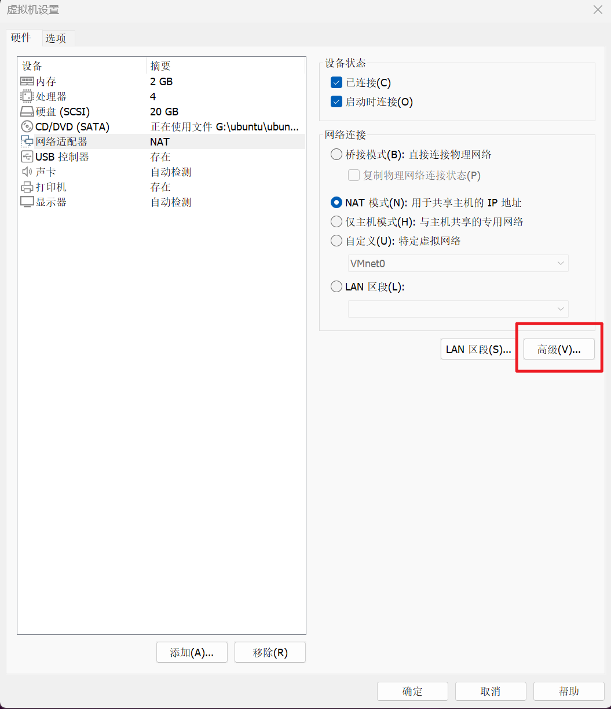

[TOC]

<!--more-->

参考：https://blog.csdn.net/m0_51913750/article/details/131604868

## 0.1 安装VMware

1. 从 [VMware官网](https://www.vmware.com/cn/products/workstation-pro/workstation-pro-evaluation.html) 下载安装包 
2. 照着点就行

## 0.2 下载ubuntu镜像

[官网](https://ubuntu.com/download/desktop)

[清华大学开源软件镜像站](https://mirrors.tuna.tsinghua.edu.cn/ubuntu-releases/)

[阿里云开源镜像站](https://mirrors.aliyun.com/ubuntu-releases/)

Ubuntu 22.04

## 0.3 创建系统实例


- 需要2GB，不然无法安装


## 0.4 安装ubuntu


## 0.5 实例配置项

### 0.5.1 安装VMware tools

https://blog.csdn.net/NRWHF/article/details/127809132

开机




从光盘解压到本机


从终端进入该文件夹，运行 `sudo ./vmware-install.pl` 


提示yes的输yes，默认的回车


### 0.5.2 修改静态IP

因为原系统设置的是动态 ip(BOOTPROTO="dhcp")，所以新系统默认也是动态 ip，自动分配了 ip，克隆后并没有与系统的 ip 地址冲突，但为了集群搭建，需要改为可控的静态ip

```shell
sudo apt install net-tools   
ifconfig #查看网卡名称
ip a

cd /etc/netplan
sudo gedit 01-network-manager-all.yaml
```

```yaml
network: 
 version: 2
 renderer: NetworkManager
 ethernets:
  ens33:
   dhcp4: false
   addresses: [192.168.192.130/24]
   gateway4: 192.168.192.2
   nameservers:
    addresses: [192.168.192.2] 
```

```shell
sudo netplan apply 
```

### 0.5.3 ssh连接

```shell
sudo apt-get openssh-server
E: 无法获得锁 /var/lib/dpkg/lock-frontend - open (11: 资源暂时不可用)

E: 无法获取 dpkg 前端锁 (/var/lib/dpkg/lock-frontend)，是否有其他进程正占用它？
sudo rm /var/lib/dpkg/lock-frontend
sudo rm /var/lib/dpkg/lock
sudo rm /var/cache/apt/archives/lock

sudo apt update && sudo apt upgrade
sudo apt install openssh-server

ssh

# 关闭防火墙
sudo systemctl stop ufw.service
sudo systemctl disable ufw.service
sudo ufw status
```

## 0.6 克隆

https://blog.csdn.net/m0_46474019/article/details/117569364

### 0.6.1 克隆实例

无法为已经开启或者挂起的虚拟机克隆，所以克隆前需要关闭虚拟机。


克隆完成即可启动新系统，因为原系统使用的是动态 IP，所以新系统也会自动分配一个 IP，不会原系统冲突，而且新系统的 MAC 地址也与原系统不一致。所以可以直接启动新老系统，双方都能 ping 通。

#### 生成MAC地址

配网卡



关机状态下，生成MAC地址


### 0.6.2 修改静态ip

### 0.6.3 修改主机密码名称

https://zhuanlan.zhihu.com/p/630601853

密码（登录用户需要修改）

1. 进入Ubuntu，打开一个终端，输入 sudo su转为root用户。 注意，必须先转为root用户！！！
2. sudo passwd user(user 是对应的用户名)
3. 输入新密码，确认密码。
4. 修改密码成功，重启，输入新密码进入Ubuntu。

用户名

```shell
hostname #查看系统主机名称
hostnamectl set-hostname xx #修改主机名称	
	#执行命令之后，会自动修改 /etc/hostname 文件
	#执行命令之后，会立即生效，且重启系统也会生效
cat /etc/hostname	#查看 /etc/hostname 文件内容，里面配置的就是系统主机名称
```

```shell
su root
sudo gedit /etc/passwd # 找到原先的用户名，将其改为自己的用户名（一行全部都改）
sudo  gedit /etc/shadow #找到原先用户名（所有的名字都要改），改为自己的用户名
sudo gedit /etc/group #你应该发现你的用户名在很多个组中，全部修改！
mv /home/原用户名/ /home/新用户名

mv /home/ceph_admin/ /home/
```


