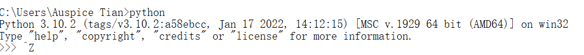
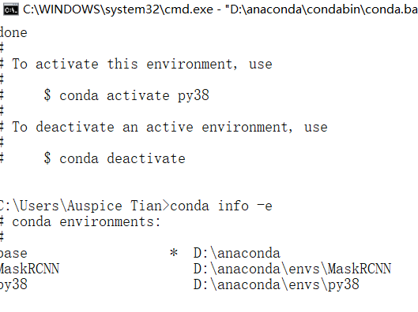
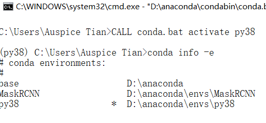
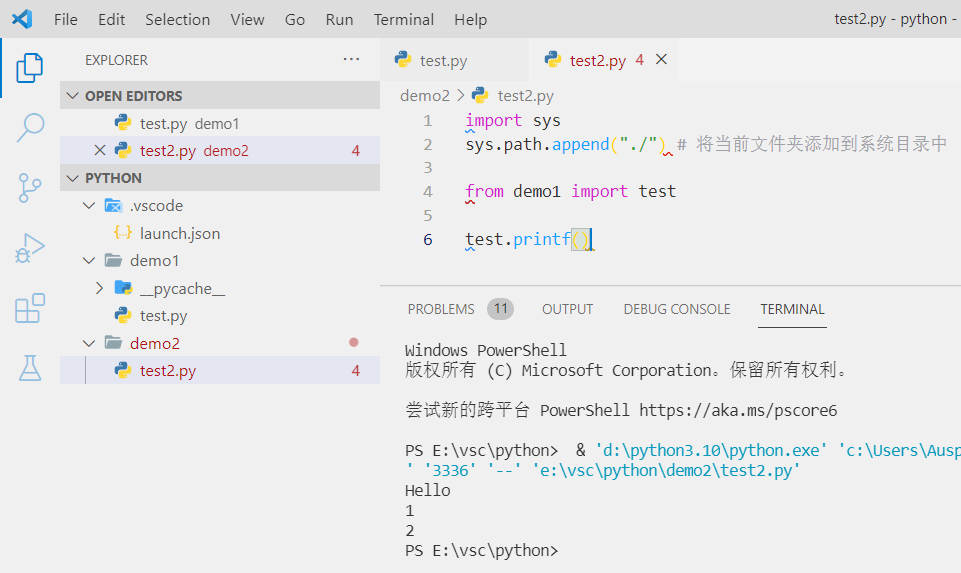

> 配置vscode的 `Python` , `C++` 的编译环境

<!--more-->

# 1. Py+conda+vscode

## 1.1 Python解释器

### 1.1.1 安装python环境



#### pip换源

```shell
#查看已安装的包
conda list
pip list

# 安装包
pip install package_name[==version]
conda install package_name[==version]

#移除包
conda remove numpy
pip uninstall numpy

# 导入导出环境
conda env export > [配置文件路径.yaml]
用配置文件创建新环境
conda env create -n [anaconda_name] -f [配置文件路径.yaml]

# 设置pip源
(learning) C:\Users\AmosTian>pip config set global.index-url https://pypi.tuna.tsinghua.edu.cn/simple
Writing to C:\Users\AmosTian\AppData\Roaming\pip\pip.ini

# 查看是否生效
pip config list

# 阿里云镜像源
http://mirrors.aliyun.com/pypi/simple/
# 清华大学镜像源
https://pypi.tuna.tsinghua.edu.cn/simple/
# 国科大镜像源
http://pypi.mirrors.ustc.edu.cn/simple/
# 豆瓣镜像源
https://pypi.douban.com/simple/
```

### 1.1.2 conda管理py包

#### conda 换源

```python
# 默认源
conda config --remove-key channels

# 添加清华源
conda config --add channels http://mirrors.tuna.tsinghua.edu.cn/anaconda/pkgs/free/
conda config --add channels http://mirrors.tuna.tsinghua.edu.cn/anaconda/pkgs/main/
conda config --add channels http://mirrors.tuna.tsinghua.edu.cn/anaconda/cloud/msys2/
conda config --set show_channel_urls yes

# 修改conda 虚拟环境默认安装位置，默认是在C盘下的
envs directories : D:\anaconda3\envs
                          C:\Users\AmosTian\.conda\envs
                          C:\Users\AmosTian\AppData\Local\conda\conda\envs

# 修改为
conda config --add envs_dirs D:\anaconda3\envs
修改文件夹权限，确保所有用户都有 所有权限
```

#### 查看列表、创建、克隆、激活、删除

```shell
conda info -e
# conda信息
conda info

# 查看当前conda 环境列表
conda env list

# 创建conda环境
conda create -n [anaconda_name] python=3.7
#克隆环境
conda create --name [new_anaconda_name] --clone [new_anaconda_name]

# 删除环境
conda remove --name [anaconda_name] --all

# 激活环境
conda activate [anaconda_name]
```







#### conda包管理

```shell
# 在指定环境中管理包
conda list -n [anaconda_name]
conda install --name [anaconda_name] package_name 
conda remove --name [anaconda_name] package_name
```

##### 包安装原则

[conda有严格的检查机制，它会保证你当前装的package安装好之后能work，但是，它只检查用conda安装过的package。pip装的包不会检查出来](https://www.zhihu.com/question/395145313/answer/2551141843)

安装包，安装方式尽量一致，不要混用，除非一些包用其中一种固定用的方式安不上。**先conda，装不上的包再pip**

删除包，谁安装就由谁卸载，对于一些简单的包也可以直接到 `lib/site-packages` 中进行手动删除

#### 设置默认anaconda

https://www.yingtwo.com/article/8435028.html

只修改prompt

- 到 conda 安装目录的 Script 文件夹下，找一个名为 activate.bat 的文件
- 将第24行 `@CALL "%~dp0..\condabin\conda.bat" activate %*` 中的 `%*` 用 `[anaconda_name]` 替换

修改prompt 与 powershell pompt

- 查看二者属性窗口，发现其启动目标都指向 `D:\anaconda3` 的默认 anaconda

  ```
  # prompt：
  %windir%\System32\cmd.exe "/K" D:\anaconda3\Scripts\activate.bat D:\anaconda3\envs\learn
  
  # powershell:
  %windir%\System32\WindowsPowerShell\v1.0\powershell.exe -ExecutionPolicy ByPass -NoExit -Command "& 'D:\anaconda3\shell\condabin\conda-hook.ps1' ; conda activate 'D:\anaconda3' "
  ```

- 将 `D:\anaconda3` 修改为 `D:\anaconda3\envs\learn`


选用指定anaconda下的python编译器

命令面板 `>python:select Interpretor `


### 1.1.2 创建vscode-python文件夹


#### 裸配置


如图，与在命令行运行无区别

### 1.1.2 安装vscode-python插件

### 1.1.3 code插件运行.py


#### 添加配置文件


##### program

>   设置启动文件

```
"program": "${file}",
```

code宏定义：选中那个文件 *F5* 运行那个文件

#### code调试功能

-   设置断点后， *F5* 运行至断点处


-   *F10* 从断点处逐行执行

    

    

## 1.2 跨文件夹调用


```python
import sys
sys.path.append("./") # 将当前文件夹添加到系统目录中
```



## 


# 2. C++

## 2.1 单文件编译

### 2.1.1 下载vsc扩展

### 2.1.2 下载C++编译器

https://winlibs.com/

1. 查看版本

   

2. 配置环境变量

   

3.  编写程序，测试编译器

    ```c++
    # include<stdio.h>
    # include<windows.h>
    
    int main(){
        printf("hello\n");
    
        system("pause");
        return 0;
    }
    ```

    

### 2.1.3 vsc使用自己下载的编译器


-   GDB为自己下载的编译器


-   此时，生成 *launch.json* 和 *tasks.json* 两个配置文件


#### launch.json


#### task.json


## 2.2 多文件编译


```shell
g++ test.cpp -o test.exe //用g++编译器将 test.cpp 链接成 test.exe
```

报错：没有找得到 `PrintHello()` 的定义

解决方法

```c
g++ test.cpp hello.cpp -o test.exe //用g++编译器将test.cpp和hello.cpp链接成一个可执行文件
```


### 2.2.1 C/C++编译过程


### 2.2.2 cmake构建工具

1.  [cmake下载地址](https://cmake.org/download/)

2.  vscode 安装 cmake 插件

    -   cmake：命令提示
    -   cmaketools：核心工具

3.  将cmake添加到环境变量或修改 cmaketools的配置文件

    

4.  项目目录下新建 `CMakeLists.txt` 

    ```
    project(#项目名)
    
    aux_source_directory(代码目录 定义为变量名)
    
    add_executable(#项目名 #目标目录)
    ```

    ```
    project(test)
    
    aux_source_directory(./src SRCS)
    
    add_executable(${PROJECT_NAME} ${SRCS})
    ```

5.  不再需要编译配置文件 task.json及删除launch.json文件中的 `      "preLaunchTask": "C/C++: g++.exe 生成活动文件"` 配置项

### 2.2.3 cmake构建项目

重启一下vscode就会出现1

1.  选择 cmake 的编译器

    

2.  使用cmake调试

    这里需要选择一下编译器版本

    

3.  修改配置文件，使 F5 调用cmake调试

    ```json
    {
        "configurations" : [
            ...
    	    "program":"${command:cmake.launchTargetPath}"
        	...
        ]
    }
    ```

    
    
    


**注**

新增文件，需要变动重新保存一下CMakeLists.txt文件，刷新缓冲


## 2.3 一些问题

### 2.3.1 VScode 检测到#include错误，请更新includePath

#### 1.在VScode中打开一个文件夹，并按ctrl+shit+p，搜索找到编辑配置（JSON）文件，并打开检查自己的“includePath”，如下图所示。


####  2.我们发现自己的includePath并未更新，这也是问题的主要原因，此时我们进行更新。我们使用win+R打开cmd运行窗口，输入命令：g++ -v -E -x c++ -，进行查看路径（下图红框处），并复制下来。

```shell
g++ -v -E -x c++ -
```


修改斜杠


### 2.3.2 未定义标识符 cin

#### 排除includePath错误

按Ctrl + 鼠标左键，可以跳转到定义处，则说明 `includePath` 正确

#### 根据电脑的具体的情况，修改“intelliSenseMode”

- 未额外安装编译器，设置为 `"intelliSenseMode": "windows-mscv-x86`

- 如果安装了其他的编译器，比如GCC编译器，设置为 `"intelliSenseMode": "windows-gcc-x64"`

#### 打开c_cpp_properties.json 文件，修改对应的项


