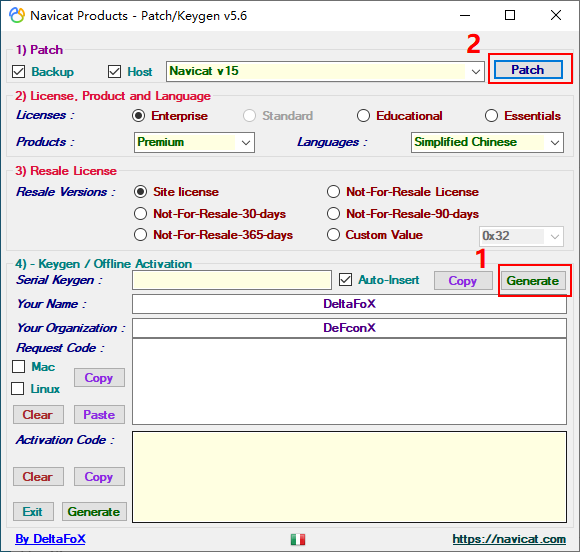
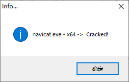
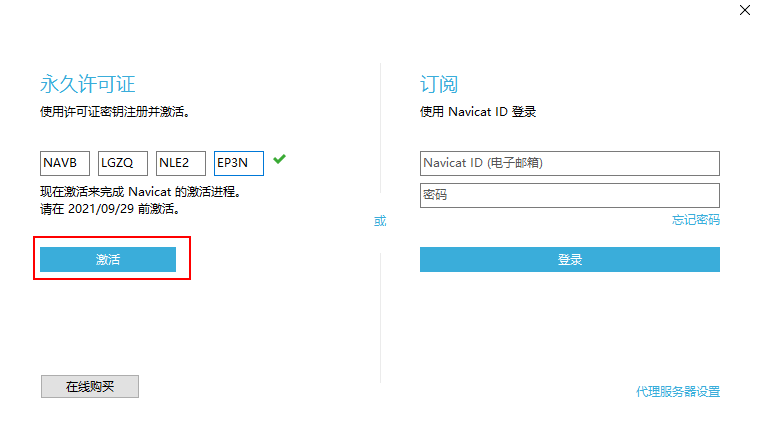
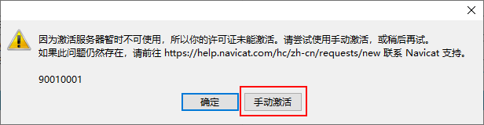
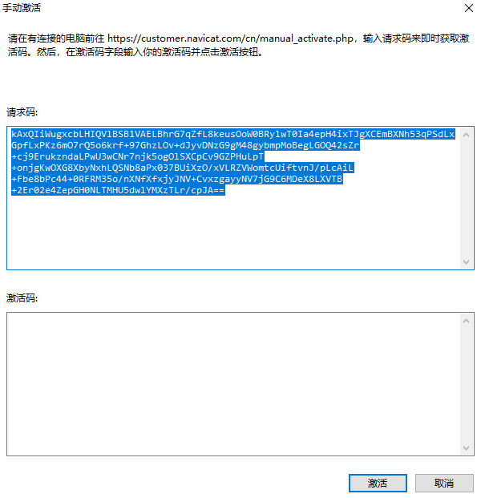
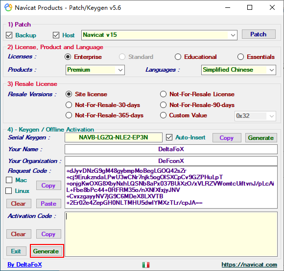
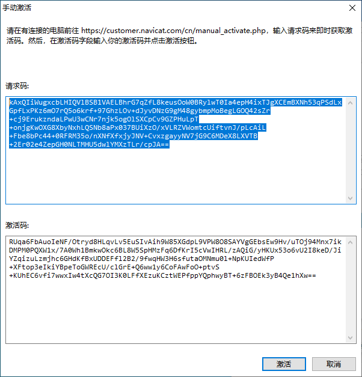
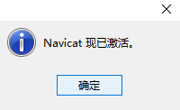

> 版本：navicat150_premium_cs_x64

<!--more-->

**破解过程一定要断网**

链接：https://pan.baidu.com/s/18IuCEy8cjHQlKh2a22uQQQ?pwd=9jy8 
提取码：9jy8 

# 1. 打开破解工具

**这里注意要先生成注册码， 再去patch，应该是把这个注册码直接插入到代码里，所以必须提前生成**

> 如果步骤错了，卸载重装

成功如图

# 2. 破解

打开 Navicat 15 ---> 点击注册按钮 --->输入刚刚在破解工具中生成的注册码 ---> 点击激活 ---> 点击手动激活 ---> 将请求码复制到破解工具中 ---> 点击 Activation Code 一栏中的 Generate 按钮生成激活码 ---> 完成。

1. 
2. 
3. 
4. 
5. 
6. 

