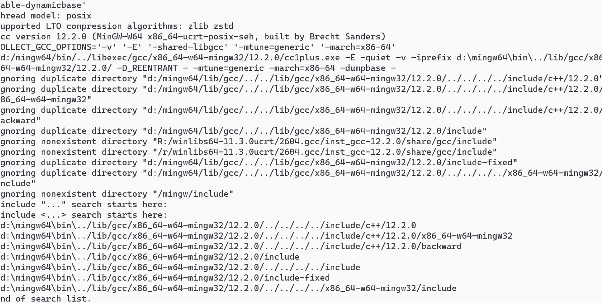
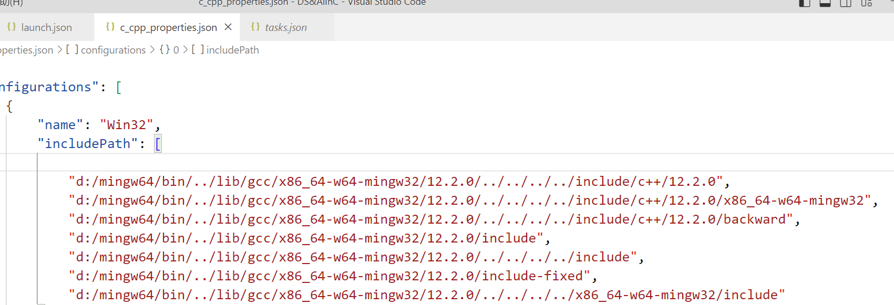
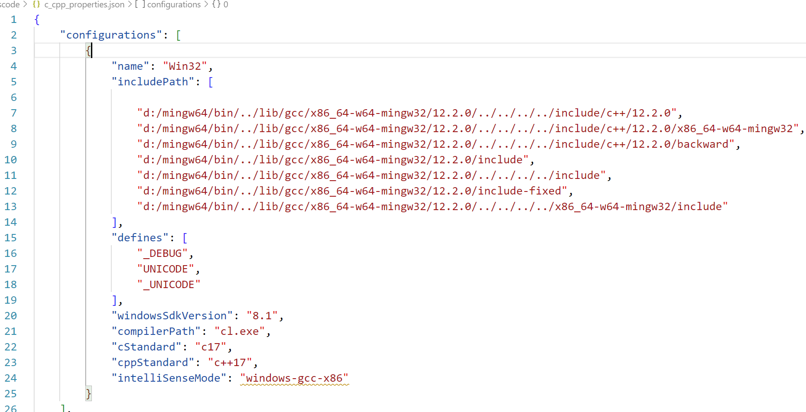
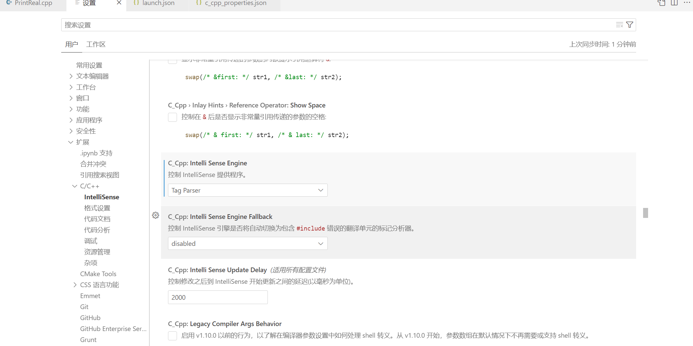

# VScode 检测到#include错误，请更新includePath

### 1.在VScode中打开一个文件夹，并按ctrl+shit+p，搜索找到编辑配置（JSON）文件，并打开检查自己的“includePath”，如下图所示。


###  2.我们发现自己的includePath并未更新，这也是问题的主要原因，此时我们进行更新。我们使用win+R打开cmd运行窗口，输入命令：g++ -v -E -x c++ -，进行查看路径（下图红框处），并复制下来。

```shell
g++ -v -E -x c++ -
```




修改斜杠



# 未定义标识符 cin

## 排除includePath错误

按Ctrl + 鼠标左键，可以跳转到定义处，则说明 `includePath` 正确

## 根据电脑的具体的情况，修改“intelliSenseMode”

- 未额外安装编译器，设置为 `"intelliSenseMode": "windows-mscv-x86`

- 如果安装了其他的编译器，比如GCC编译器，设置为 `"intelliSenseMode": "windows-gcc-x64"`

### 打开c_cpp_properties.json 文件，修改对应的项



